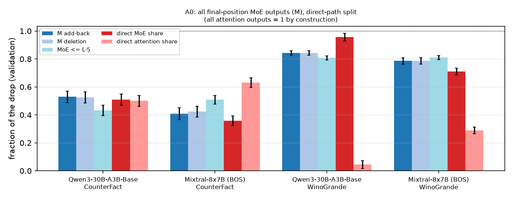
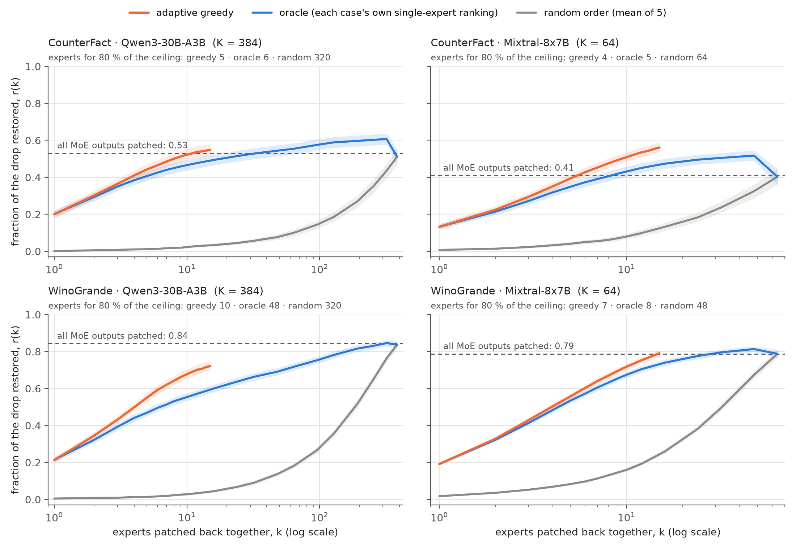

# WinoGrande STR brief

Expert-aware causal tracing in MoE LMs · Qwen3-30B-A3B and Mixtral-8x7B · bf16

## 1. Setup

Each WinoGrande twin pair differs only in its last word, and that flips which option fills the blank. We fill the blank with each twin's own answer and ask the model for the last word. The two prompts then differ in one word only, which makes them a clean STR (symmetric token replacement) pair.

```
A: The janitor tried to clean the mirror with the spray but the mirror was too  → " dirty"
B: The janitor tried to clean the mirror with the spray but the spray  was too  → " weak"
```

- **Clean run:** A. **Corrupted run:** B, with only the filled word swapped. Every pair is used in both directions.
- **Metric:** at the last token, logit(" dirty") − logit(" weak"). Swapping the word moves this by the "drop".
- **Patching:** we copy one internal piece (an attention or MoE output, or a single expert) from the clean run into the corrupted run, at the last token. Rescue / drop is how much of the damage that piece undoes.
- **Filters:**
  - the last word is the only difference and a single token;
  - both prompts have the same tokens apart from the swapped word;
  - the model gets both prompts right by at least 1 logit.

  This leaves 776 pairs shared by both models; we use 128 discovery and 128 validation pairs. CounterFact uses the same STR protocol, with a subject swapped for another subject of the same relation.

## 2. Attention vs. MoE on CounterFact and WinoGrande



All bars are fractions of the drop at the last token, on the validation set.

- **M add-back:** put back the clean output of every MoE layer at once. How much of the damage the experts alone undo.
- **M deletion:** the reverse. In the clean run, swap every MoE output for the corrupted one. How much damage that alone causes.
- **MoE ≤ L−5:** same as M add-back, but without the last four layers.
- **Direct MoE share / direct attention share:** of the change in the final logit difference, the part written directly by MoE layers / by attention layers.
- **Dotted line at 1.0:** putting back every attention output restores everything, by construction, so it is not a measurement.

**Takeaway.** On WinoGrande the MoE layers dominate the repair. Experts alone undo 0.84 / 0.79 of the damage (Qwen3 / Mixtral) and write 0.95 / 0.71 of the answer directly. In factual recall the figures are 0.53 / 0.41 and 0.51 / 0.36, with attention writing the other half.

## 3. Expert add-back curves



The x-axis is how many experts we put back together (log scale; 384 active experts in Qwen3, 64 in Mixtral). The y-axis is the fraction of the damage undone.

- **Greedy (orange):** at each step, add the expert that helps most given the ones already added.
- **Oracle (blue):** add each case's experts in order of how much each helps on its own.
- **Random (grey):** add experts in random order (average of 5 orders).
- **Dashed line:** every MoE output put back at once.

**Takeaway.**
- On WinoGrande the curves keep rising to the ceiling with almost no turning point: hardly any expert hurts the answer.
- On factual recall the curves overshoot the ceiling, then drop clearly at the end. The last experts added push against the right answer. The oracle peaks at 0.61 and ends at 0.53 in Qwen3, peaks at 0.52 and ends at 0.41 in Mixtral.

Greedy stops at 15 steps because each step tries every remaining candidate together with the experts already chosen: 32 candidates per case in Qwen3 and 64 in Mixtral, every step. Going further was too expensive computationally. Within each case's top 10 experts it is already within 0.011 of the best possible subset.

## 4. Experts needed for 80 % of the rescue

| Task · model | greedy | oracle | random | active experts |
|---|---:|---:|---:|---:|
| CounterFact · Qwen3 | 5 | 6 | 320 | 384 |
| CounterFact · Mixtral | 4 | 5 | 64 | 64 |
| WinoGrande · Qwen3 | 10 | 48 | 320 | 384 |
| WinoGrande · Mixtral | 7 | 8 | 48 | 64 |

80 % of the rescue from putting back every MoE output (the dashed line). Validation set.
