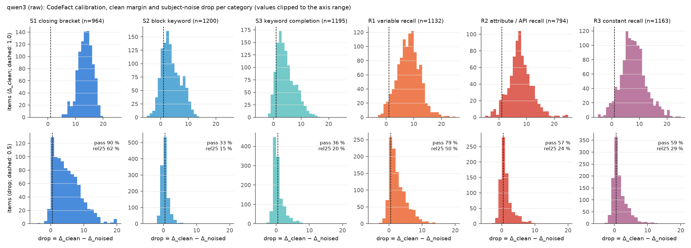
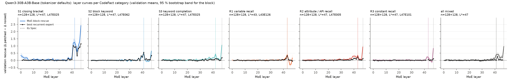
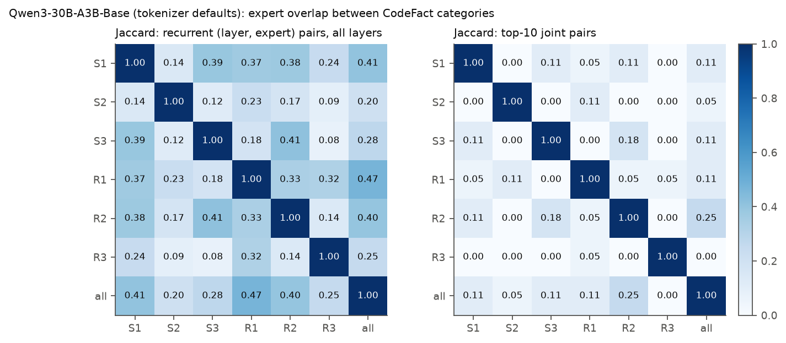
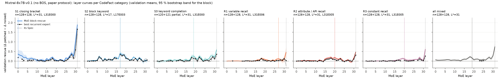
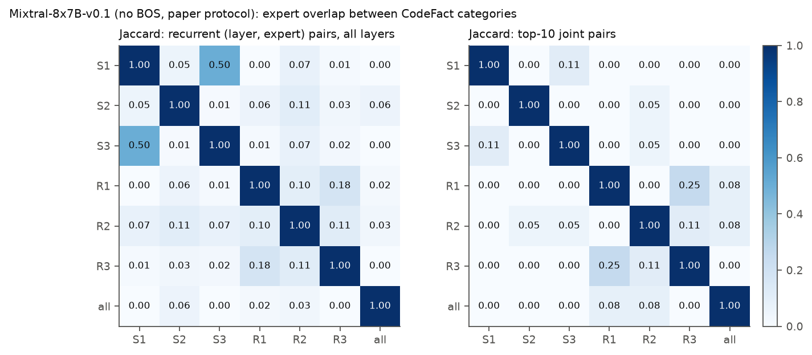

# Extensions of the expert-aware causal-tracing reproduction (arXiv 2606.03780)

Assembled 2026-09-14 11:21 UTC from results/sections/ by scripts/build_extensions_report.py. Plan and decisions: RESEARCH_PLAN.md. Base reproduction: REPORT.md. Timeline: logs/PROGRESS.md.

## Status

| Direction | Question | Section | Status |
|---|---|---|---|
| 1 | Does the paper's two-stage selection miss a stronger or more specific single expert in another layer? | `results/sections/ext1_joint_search.md` | included |
| 3 | Mechanism behind the BOS-dependence of Mixtral's expert-level result (hypotheses H1 sink relocation, H2 BOS semantics, H3 position shift, H4 default expert); literature review in docs/ext3_literature_review.md. | `results/sections/ext3_bos_mechanism.md` | included |
| 2 | Qwen3-30B-A3B-Instruct-2507, Qwen3-Coder-30B-A3B-Instruct, Mixtral-8x7B-Instruct, OLMoE base/Instruct under intended and paper protocols; attention-output / MoE-output / whole-layer rescue curves. | `results/sections/ext2_model_zoo.md` | included |
| 2b | New intervention kinds attn_layer and block; verification against transformers hooks. | `results/sections/ext2_attn_patch.md` | included |
| 4 | CounterFact-style code counterfactuals (S1-S3 syntax, R1-R3 recall) on Python; per-category localisation and cross-category expert overlap. | `results/sections/ext4_codefact.md` | included |

## Direction 1: Layer-then-expert versus joint layer × expert search

### Extension 1: layer-then-expert versus joint layer x expert search

**Question.** The paper selects the layer L* by MoE-block rescue on discovery cases and then searches for a recurrent expert inside L* only. Could a single expert in another layer be a better (higher validation rescue, more specific) locus that the two-stage procedure never sees?

**Method.** We ran the expert pass at *every* MoE layer (48 for Qwen3, 32 for Mixtral; `run_expert.py --layers 0..L-1 --no-pairs`, split into layer chunks so that at most ~90k wavefront rows are resident) for the three base runs: Qwen3-30B-A3B-Base with tokenizer defaults (paper, strict and relaxed case sets), Mixtral-8x7B-v0.1 with BOS (all three sets) and Mixtral without BOS (paper set; the protocol that reproduces the paper). For every (layer, expert) pair we compute on the paper's discovery split the clean-active count and the all-case mean rescue (zero where the expert is not clean-active), keep pairs meeting the recurrence threshold (half the discovery split: 64 of 128, 128 of 256) and (a) per layer take the best recurrent expert (the paper's rule applied at every layer), (b) take the global argmax over all pairs (joint search). Every selection is then evaluated on the untouched validation split with the same statistics as Table 1 (all-case rescue, active-random specificity with 3 controls for Qwen3 and 1 for Mixtral, 5,000-resample bootstrap CIs). Concentration is Rescue(best expert)/Rescue(MoE block) on validation from the same pass (paired bootstrap CI). Robustness repeats the joint search over the Appendix D grid (split seeds 0-4 x thresholds 32, 48, 64, 80, 96, doubled for the 512-case relaxed set; `random.Random(seed).shuffle` of the set's ids as in `analysis.stability_grid`; the per-split two-stage selection re-selects the layer by discovery block rescue and then the expert inside it). Code: `moetrace/ext1_analysis.py`, `scripts/ext1_analyze.py`; rows: `results/<run>/expert_rows.parquet` for runs `qwen3_bos_alllayers`, `mixtral_bos_alllayers`, `mixtral_nobos_alllayers`.

**Multiple-comparison caveat.** The joint search compares 48 x 128 = 6,144 (Qwen3) or 32 x 8 = 256 (Mixtral) pairs on discovery; the discovery maximum is therefore biased upward and only the validation numbers of a selected pair are unbiased estimates of its effect. We report the discovery-to-validation shrinkage of the maximum for that reason. The neighbouring-layer question (e) below scans every expert of 2-3 layers on *validation* directly and is a post-hoc comparison of ~100-400 experts against one pre-registered expert; a single expert exceeding the reference there is expected by chance and is not evidence unless it is also recurrent and its CI excludes the reference.

#### Qwen3-30B-A3B-Base (tokenizer defaults) (`results/qwen3_bos_alllayers`)

- **Verdict: the joint search returns the two-stage winner.** Over all 234 recurrent (layer, expert) pairs in 48 layers, the discovery argmax is L44E069 (discovery +0.482, validation +0.499 [+0.357, +0.659], Spec +0.443 [+0.302, +0.603]).
- The strongest recurrent pair outside L44 is L42E115 (discovery rank 2, discovery +0.461, validation +0.447 [+0.363, +0.537], Spec +0.423 [+0.339, +0.510]).
- Discovery maximum vs its validation value (joint winner L44E069): +0.482 -> +0.499 (change +0.017, +3% of the discovery value; a negative change is the winner's-curse shrinkage).
- Overlap of L44E069 and L42E115 on the 128 validation cases: per-case rescue correlation Pearson r = 0.27 (Spearman 0.30); both positive in 52% of cases, only L44E069 in 11%, only L42E115 in 26%, neither in 11%; mean per-case max(rescue) +0.753 vs +0.499 / +0.447 alone.
- Robustness (Appendix D grid, 25 split-seed x threshold settings): the joint winner equals L44E069 in 20/25 settings with a winner, lies outside L44 in 5/25, and equals the per-split two-stage selection in 20/25. In 0 settings the per-split two-stage procedure finds no recurrent expert at its layer at all (the joint search still returns a pair); the joint winner leaves L44 in 5 settings where the two-stage procedure did have a candidate. Winners: L44E069 x20, L42E115 x5.
- All 234 recurrent pairs evaluated on validation against L44E069: 0 have a higher rescue (0 with a rescue CI entirely above L44E069's CI), 0 a higher Spec (0 with a Spec CI entirely above L44E069's CI); 19 pairs have a Spec CI above zero: L44E069, L42E115, L41E001, L43E005, L40E127, L40E030, L33E076, L37E104, L34E094, L28E030, L38E057, L39E040.
- Neighbouring layers [42, 43, 45]: 172 experts with any validation activity were evaluated; 0 beat L44E069 on validation rescue (+0.499) and 0 on Spec (+0.443); among the 14 recurrent ones, 0 and 0 respectively. Best by rescue: L42E115 +0.447 [+0.363, +0.537] (Spec +0.423, active 123/128, recurrent); best by Spec: L42E115 Spec +0.423 [+0.339, +0.510] (rescue +0.447, active 123/128, recurrent).

**Reading.** The two-stage procedure does not miss a *better* single expert: L44E069 is the joint discovery argmax on the paper set and has the highest validation point estimate in all three case sets. It does miss a *second locus of the same kind*. L42E115 is clean-active in 126/128 discovery and 123/128 validation cases (more recurrent than E069's 114/116), its validation rescue and Spec are within the CIs of E069's (and its own CIs are about half as wide), it is the joint discovery argmax on the strict and relaxed sets and in 5/25 grid settings, and L42 concentrates 72% of its block rescue in this one expert against 53% at L44. The two experts rescue partly different cases (per-case correlation r = 0.27; 26% of validation cases are rescued only by E115, 11% only by E069) and the per-case maximum of the two (+0.75) approaches the L44 block rescue (+0.94). The paper's Qwen3 picture 'one specific expert' should therefore read 'one specific expert per layer in the L42/L44 band', with L44E069 the stronger of two; the two-stage search sees only the layer with the higher block rescue and never examines L42, whose block rescue (+0.62) is the second highest. Stated plainly: **L42E115 (recurrent in 126/128 discovery cases, validation rescue +0.447 [+0.363, +0.537], Spec +0.423 [+0.339, +0.510]) is a second, near-equivalent factual-recall expert in the second-strongest layer; it wins the discovery argmax on the strict and relaxed sets and in 30 of the 75 grid cells (5/25 paper, 10/25 strict, 15/25 relaxed), while L44E069 keeps the higher validation point estimate in every set.** No expert in L43 or L45 comes close (best +0.15 and -0.03).

Consistency with the original single-layer pass (bf16 fingerprint): L44E069 on the paper validation split has rescue +0.499 / Spec +0.443 in the all-layer pass vs +0.503 / +0.450 in `results/qwen3` (active 116 vs 116); the difference (-0.004) is bf16 noise.

Figure E1-qwen3_bos: validation MoE-block rescue by layer (grey, 95% band) with the recurrence-first best expert's validation rescue (solid) and active-random Spec (dashed) at every layer; star = two-stage winner, diamond = joint winner if different. Gaps = layers with no recurrent expert. Full per-layer table: `results/tables/ext1_best_expert_by_layer_qwen3_bos.md`.

**Qwen3-30B-A3B-Base (tokenizer defaults): top-10 (layer, expert) pairs by discovery all-case mean rescue among recurrent candidates**

| Set | Rank (disc.) | Pair | Disc. active | Disc. rescue | Val. active | Val. rescue [95% CI] | Spec [95% CI] | Two-stage winner |
|---|---|---|---|---|---|---|---|---|
| paper | 1 | L44E069 | 114/128 | +0.482 | 116/128 | +0.499 [+0.357, +0.659] | +0.443 [+0.302, +0.603] | yes |
| paper | 2 | L42E115 | 126/128 | +0.461 | 123/128 | +0.447 [+0.363, +0.537] | +0.423 [+0.339, +0.510] |  |
| paper | 3 | L43E046 | 90/128 | +0.159 | 87/128 | +0.095 [+0.045, +0.152] | +0.017 [-0.040, +0.077] |  |
| paper | 4 | L41E001 | 115/128 | +0.151 | 109/128 | +0.125 [+0.085, +0.167] | +0.106 [+0.063, +0.150] |  |
| paper | 5 | L43E005 | 77/128 | +0.151 | 82/128 | +0.146 [+0.079, +0.230] | +0.087 [+0.015, +0.177] |  |
| paper | 6 | L40E127 | 92/128 | +0.149 | 93/128 | +0.126 [+0.074, +0.188] | +0.083 [+0.029, +0.146] |  |
| paper | 7 | L40E030 | 94/128 | +0.127 | 92/128 | +0.121 [+0.071, +0.175] | +0.086 [+0.033, +0.143] |  |
| paper | 8 | L43E104 | 87/128 | +0.089 | 87/128 | +0.102 [+0.061, +0.150] | +0.041 [-0.012, +0.098] |  |
| paper | 9 | L33E076 | 95/128 | +0.076 | 102/128 | +0.079 [+0.052, +0.110] | +0.083 [+0.056, +0.112] |  |
| paper | 10 | L37E104 | 128/128 | +0.067 | 127/128 | +0.039 [+0.004, +0.074] | +0.038 [+0.006, +0.071] |  |
| paper | 1 | L44E069 (two-stage) | 114/128 | +0.482 | 116/128 | +0.499 [+0.357, +0.659] | +0.443 [+0.302, +0.603] | reference |
| strict | 1 | L42E115 | 124/128 | +0.454 | 125/128 | +0.434 [+0.360, +0.509] | +0.409 [+0.333, +0.486] |  |
| strict | 2 | L44E069 | 117/128 | +0.443 | 116/128 | +0.480 [+0.332, +0.649] | +0.421 [+0.268, +0.595] | yes |
| strict | 3 | L43E005 | 86/128 | +0.160 | 79/128 | +0.124 [+0.061, +0.198] | +0.069 [+0.002, +0.145] |  |
| strict | 4 | L40E127 | 94/128 | +0.159 | 93/128 | +0.107 [+0.060, +0.164] | +0.072 [+0.022, +0.130] |  |
| strict | 5 | L40E030 | 83/128 | +0.126 | 91/128 | +0.111 [+0.062, +0.166] | +0.078 [+0.028, +0.134] |  |
| strict | 6 | L41E001 | 115/128 | +0.119 | 108/128 | +0.142 [+0.103, +0.181] | +0.133 [+0.095, +0.171] |  |
| strict | 7 | L43E046 | 81/128 | +0.099 | 79/128 | +0.141 [+0.083, +0.202] | +0.089 [+0.032, +0.151] |  |
| strict | 8 | L33E076 | 100/128 | +0.092 | 95/128 | +0.052 [+0.024, +0.081] | +0.046 [+0.019, +0.073] |  |
| strict | 9 | L28E030 | 111/128 | +0.067 | 119/128 | +0.057 [+0.030, +0.086] | +0.045 [+0.018, +0.074] |  |
| strict | 10 | L43E104 | 91/128 | +0.063 | 92/128 | +0.101 [+0.056, +0.157] | +0.051 [+0.000, +0.112] |  |
| strict | 2 | L44E069 (two-stage) | 117/128 | +0.443 | 116/128 | +0.480 [+0.332, +0.649] | +0.421 [+0.268, +0.595] | reference |
| relaxed | 1 | L42E115 | 244/256 | +0.412 | 249/256 | +0.426 [+0.369, +0.484] | +0.393 [+0.335, +0.451] |  |
| relaxed | 2 | L44E069 | 228/256 | +0.394 | 235/256 | +0.429 [+0.331, +0.537] | +0.364 [+0.263, +0.473] | yes |
| relaxed | 3 | L43E005 | 159/256 | +0.137 | 158/256 | +0.142 [+0.094, +0.197] | +0.068 [+0.017, +0.125] |  |
| relaxed | 4 | L40E127 | 180/256 | +0.119 | 191/256 | +0.129 [+0.092, +0.170] | +0.084 [+0.044, +0.126] |  |
| relaxed | 5 | L41E001 | 213/256 | +0.101 | 224/256 | +0.130 [+0.101, +0.161] | +0.106 [+0.077, +0.136] |  |
| relaxed | 6 | L40E030 | 172/256 | +0.101 | 189/256 | +0.131 [+0.094, +0.174] | +0.089 [+0.049, +0.133] |  |
| relaxed | 7 | L43E104 | 184/256 | +0.097 | 177/256 | +0.073 [+0.047, +0.103] | -0.016 [-0.049, +0.020] |  |
| relaxed | 8 | L43E046 | 153/256 | +0.088 | 180/256 | +0.127 [+0.089, +0.169] | +0.048 [+0.007, +0.092] |  |
| relaxed | 9 | L33E076 | 185/256 | +0.063 | 200/256 | +0.058 [+0.035, +0.084] | +0.058 [+0.036, +0.083] |  |
| relaxed | 10 | L28E030 | 228/256 | +0.052 | 225/256 | +0.066 [+0.045, +0.087] | +0.057 [+0.036, +0.078] |  |
| relaxed | 2 | L44E069 (two-stage) | 228/256 | +0.394 | 235/256 | +0.429 [+0.331, +0.537] | +0.364 [+0.263, +0.473] | reference |

- strict set (n_disc=128, threshold 64, 227 recurrent pairs): joint winner L42E115 (validation +0.434 [+0.360, +0.509], Spec +0.409); two-stage winner L44E069 (validation +0.480 [+0.332, +0.649]); grid: joint = reference in 15/25, outside L44 in 10/25.
- relaxed set (n_disc=256, threshold 128, 218 recurrent pairs): joint winner L42E115 (validation +0.426 [+0.369, +0.484], Spec +0.393); two-stage winner L44E069 (validation +0.429 [+0.331, +0.537]); grid: joint = reference in 10/25, outside L44 in 15/25.

**Qwen3-30B-A3B-Base (tokenizer defaults): concentration Rescue(best expert)/Rescue(layer) on validation, layers with a clearly positive block rescue**

| Set | Layer | Best expert | Layer rescue (same pass) [CI] | Expert rescue [CI] | Spec [CI] | Expert/layer [CI] | Val. active |
|---|---|---|---|---|---|---|---|
| paper | L42 | E115 | +0.621 [+0.517, +0.728] | +0.447 [+0.363, +0.537] | +0.423 [+0.339, +0.510] | +0.720 [+0.632, +0.811] | 123/128 |
| paper | L28 | E030 | +0.143 [+0.097, +0.191] | +0.082 [+0.054, +0.112] | +0.071 [+0.042, +0.103] | +0.570 [+0.393, +0.806] | 115/128 |
| paper | L44 | E069 | +0.941 [+0.779, +1.124] | +0.499 [+0.357, +0.659] | +0.443 [+0.302, +0.603] | +0.530 [+0.424, +0.629] | 116/128 |
| paper | L38 | E057 | +0.111 [+0.069, +0.155] | +0.048 [+0.030, +0.068] | +0.036 [+0.018, +0.056] | +0.436 [+0.289, +0.651] | 94/128 |
| paper | L41 | E001 | +0.289 [+0.220, +0.363] | +0.125 [+0.085, +0.167] | +0.106 [+0.063, +0.150] | +0.433 [+0.298, +0.589] | 109/128 |
| paper | L40 | E127 | +0.444 [+0.351, +0.540] | +0.126 [+0.074, +0.188] | +0.083 [+0.029, +0.146] | +0.285 [+0.183, +0.393] | 93/128 |
| paper | L43 | E046 | +0.606 [+0.456, +0.764] | +0.095 [+0.045, +0.152] | +0.017 [-0.040, +0.077] | +0.157 [+0.081, +0.245] | 87/128 |
| strict | L42 | E115 | +0.557 [+0.459, +0.655] | +0.434 [+0.360, +0.509] | +0.409 [+0.333, +0.486] | +0.778 [+0.678, +0.883] | 125/128 |
| strict | L41 | E001 | +0.259 [+0.185, +0.337] | +0.142 [+0.103, +0.181] | +0.133 [+0.095, +0.171] | +0.546 [+0.407, +0.723] | 108/128 |
| strict | L44 | E069 | +0.930 [+0.749, +1.123] | +0.480 [+0.332, +0.649] | +0.421 [+0.268, +0.595] | +0.516 [+0.398, +0.630] | 116/128 |
| strict | L38 | E057 | +0.116 [+0.075, +0.158] | +0.047 [+0.029, +0.066] | +0.032 [+0.013, +0.052] | +0.408 [+0.264, +0.602] | 94/128 |
| strict | L28 | E030 | +0.156 [+0.112, +0.202] | +0.057 [+0.030, +0.086] | +0.045 [+0.018, +0.074] | +0.364 [+0.204, +0.543] | 119/128 |
| strict | L40 | E127 | +0.413 [+0.317, +0.513] | +0.107 [+0.060, +0.164] | +0.072 [+0.022, +0.130] | +0.260 [+0.159, +0.368] | 93/128 |
| strict | L43 | E005 | +0.570 [+0.434, +0.703] | +0.124 [+0.061, +0.198] | +0.069 [+0.002, +0.145] | +0.217 [+0.112, +0.331] | 79/128 |
| relaxed | L42 | E115 | +0.567 [+0.494, +0.639] | +0.426 [+0.369, +0.484] | +0.393 [+0.335, +0.451] | +0.752 [+0.687, +0.819] | 249/256 |
| relaxed | L44 | E069 | +0.812 [+0.688, +0.934] | +0.429 [+0.331, +0.537] | +0.364 [+0.263, +0.473] | +0.529 [+0.445, +0.611] | 235/256 |
| relaxed | L41 | E001 | +0.263 [+0.213, +0.316] | +0.130 [+0.101, +0.161] | +0.106 [+0.077, +0.136] | +0.495 [+0.405, +0.593] | 224/256 |
| relaxed | L38 | E057 | +0.122 [+0.089, +0.156] | +0.051 [+0.034, +0.070] | +0.027 [+0.010, +0.045] | +0.419 [+0.305, +0.545] | 180/256 |
| relaxed | L28 | E030 | +0.165 [+0.126, +0.206] | +0.066 [+0.045, +0.087] | +0.057 [+0.036, +0.078] | +0.396 [+0.285, +0.523] | 225/256 |
| relaxed | L40 | E127 | +0.424 [+0.354, +0.496] | +0.129 [+0.092, +0.170] | +0.084 [+0.044, +0.126] | +0.305 [+0.231, +0.379] | 191/256 |
| relaxed | L43 | E005 | +0.576 [+0.474, +0.679] | +0.142 [+0.094, +0.197] | +0.068 [+0.017, +0.125] | +0.246 [+0.171, +0.328] | 158/256 |

Concentration (paper set): among the 7 layers whose block rescue is clearly positive, the signal is most concentrated in one expert at L42 (E115: 72% of the block rescue); at the two-stage layer L44 the ratio is 53%.

**Qwen3-30B-A3B-Base (tokenizer defaults): experts of layers [42, 43, 45] ranked by validation rescue (top 10 per set)**

| Set | Pair | Disc. active | Disc. rescue | Recurrent | Val. active | Val. rescue | Val. Spec | > ref rescue | > ref Spec |
|---|---|---|---|---|---|---|---|---|---|
| paper | L42E115 | 126/128 | +0.461 | yes | 123/128 | +0.447 | +0.423 |  |  |
| paper | L43E005 | 77/128 | +0.151 | yes | 82/128 | +0.146 | +0.087 |  |  |
| paper | L43E104 | 87/128 | +0.089 | yes | 87/128 | +0.102 | +0.041 |  |  |
| paper | L43E046 | 90/128 | +0.159 | yes | 87/128 | +0.095 | +0.017 |  |  |
| paper | L43E100 | 20/128 | +0.029 |  | 21/128 | +0.074 | +0.005 |  |  |
| paper | L42E080 | 24/128 | +0.038 |  | 22/128 | +0.068 | +0.014 |  |  |
| paper | L45E022 | 45/128 | +0.009 |  | 51/128 | +0.052 | +0.096 |  |  |
| paper | L43E036 | 97/128 | +0.035 | yes | 98/128 | +0.050 | -0.025 |  |  |
| paper | L43E037 | 70/128 | +0.061 | yes | 62/128 | +0.038 | -0.034 |  |  |
| paper | L45E054 | 15/128 | +0.002 |  | 15/128 | +0.035 | +0.072 |  |  |
| paper | L44E069 (two-stage) | 114/128 | +0.482 | yes | 116/128 | +0.499 | +0.443 | ref | ref |
| strict | L42E115 | 124/128 | +0.454 | yes | 125/128 | +0.434 | +0.409 |  |  |
| strict | L43E046 | 81/128 | +0.099 | yes | 79/128 | +0.141 | +0.089 |  |  |
| strict | L43E005 | 86/128 | +0.160 | yes | 79/128 | +0.124 | +0.069 |  |  |
| strict | L43E104 | 91/128 | +0.063 | yes | 92/128 | +0.101 | +0.051 |  |  |
| strict | L42E080 | 19/128 | +0.031 |  | 20/128 | +0.054 | -0.013 |  |  |
| strict | L43E120 | 58/128 | +0.018 |  | 63/128 | +0.043 | -0.013 |  |  |
| strict | L43E100 | 16/128 | +0.045 |  | 19/128 | +0.041 | -0.013 |  |  |
| strict | L45E022 | 52/128 | +0.012 |  | 47/128 | +0.037 | +0.092 |  |  |
| strict | L42E016 | 63/128 | +0.019 |  | 62/128 | +0.035 | -0.029 |  |  |
| strict | L43E036 | 98/128 | +0.027 | yes | 101/128 | +0.034 | -0.035 |  |  |
| strict | L44E069 (two-stage) | 117/128 | +0.443 | yes | 116/128 | +0.480 | +0.421 | ref | ref |
| relaxed | L42E115 | 244/256 | +0.412 | yes | 249/256 | +0.426 | +0.393 |  | yes |
| relaxed | L43E005 | 159/256 | +0.137 | yes | 158/256 | +0.142 | +0.068 |  |  |
| relaxed | L43E046 | 153/256 | +0.088 | yes | 180/256 | +0.127 | +0.048 |  |  |
| relaxed | L43E104 | 184/256 | +0.097 | yes | 177/256 | +0.073 | -0.016 |  |  |
| relaxed | L43E100 | 34/256 | +0.044 |  | 43/256 | +0.052 | -0.032 |  |  |
| relaxed | L43E120 | 116/256 | +0.023 |  | 131/256 | +0.045 | -0.040 |  |  |
| relaxed | L43E036 | 194/256 | +0.014 | yes | 198/256 | +0.044 | -0.053 |  |  |
| relaxed | L42E080 | 42/256 | +0.054 |  | 43/256 | +0.042 | -0.027 |  |  |
| relaxed | L43E037 | 118/256 | +0.039 |  | 137/256 | +0.041 | -0.042 |  |  |
| relaxed | L43E007 | 27/256 | +0.016 |  | 20/256 | +0.031 | -0.058 |  |  |
| relaxed | L44E069 (two-stage) | 228/256 | +0.394 | yes | 235/256 | +0.429 | +0.364 | ref | ref |

Stability grid rows: `results/tables/ext1_stability_qwen3_bos.md`; all evaluated neighbour-layer experts: `results/tables/ext1_neighbours_all_qwen3_bos_<set>.csv`.

#### Mixtral-8x7B-v0.1 (BOS, tokenizer default) (`results/mixtral_bos_alllayers`)

- **Verdict: the joint search returns the two-stage winner.** Over all 38 recurrent (layer, expert) pairs in 26 layers, the discovery argmax is L19E002 (discovery +0.384, validation +0.363 [+0.267, +0.471], Spec +0.192 [+0.094, +0.296]).
- The strongest recurrent pair outside L19 is L21E001 (discovery rank 2, discovery +0.336, validation +0.273 [+0.190, +0.363], Spec +0.118 [+0.036, +0.207]).
- Discovery maximum vs its validation value (joint winner L19E002): +0.384 -> +0.363 (change -0.021, -6% of the discovery value; a negative change is the winner's-curse shrinkage).
- Overlap of L19E002 and L21E001 on the 128 validation cases: per-case rescue correlation Pearson r = 0.32 (Spearman 0.42); both positive in 37% of cases, only L19E002 in 20%, only L21E001 in 14%, neither in 30%; mean per-case max(rescue) +0.512 vs +0.363 / +0.273 alone.
- Robustness (Appendix D grid, 25 split-seed x threshold settings): the joint winner equals L19E002 in 17/25 settings with a winner, lies outside L19 in 8/25, and equals the per-split two-stage selection in 17/25. In 8 settings the per-split two-stage procedure finds no recurrent expert at its layer at all (the joint search still returns a pair); the joint winner leaves L19 in 0 settings where the two-stage procedure did have a candidate. Winners: L19E002 x17, L18E001 x4, L21E001 x3, L22E001 x1.
- All 38 recurrent pairs evaluated on validation against L19E002: 0 have a higher rescue (0 with a rescue CI entirely above L19E002's CI), 0 a higher Spec (0 with a Spec CI entirely above L19E002's CI); 7 pairs have a Spec CI above zero: L19E002, L21E001, L18E001, L30E004, L6E007, L31E007, L29E003.
- Neighbouring layers [20, 21]: 16 experts with any validation activity were evaluated; 0 beat L19E002 on validation rescue (+0.363) and 0 on Spec (+0.192); among the 2 recurrent ones, 0 and 0 respectively. Best by rescue: L21E001 +0.273 [+0.190, +0.363] (Spec +0.118, active 84/128, recurrent); best by Spec: L21E001 Spec +0.118 [+0.036, +0.207] (rescue +0.273, active 84/128, recurrent).

**Reading.** With BOS, the joint search and the two-stage selection agree on L19E002 on all three sets and in 17/25 grid settings; every one of the 8 disagreements is a threshold-80/96 setting in which L19 has no recurrent expert at all (E002 is clean-active in only 76/128 discovery cases), so the two-stage procedure returns nothing while the joint search falls back to L21E001 or L18E001 (validation +0.27 / +0.24, both clearly weaker than E002's +0.36). L18E001 is the most concentrated layer (77% of a +0.32 block rescue) and is the only other pair whose Spec CI excludes zero; the same expert index E001 is the best expert at L17, L18, L21 and L22, which is worth checking against the BOS-mechanism results (Direction 3) since expert indices are independent parameters across layers. The picture of Mixtral as a coalition model is unchanged: no single expert in any layer reaches half of the L19 block rescue except E002 itself (63%).

Consistency with the original single-layer pass (bf16 fingerprint): L19E002 on the paper validation split has rescue +0.363 / Spec +0.192 in the all-layer pass vs +0.352 / +0.205 in `results/mixtral` (active 84 vs 84); the difference (+0.011) is bf16 noise.

Figure E1-mixtral_bos: validation MoE-block rescue by layer (grey, 95% band) with the recurrence-first best expert's validation rescue (solid) and active-random Spec (dashed) at every layer; star = two-stage winner, diamond = joint winner if different. Gaps = layers with no recurrent expert. Full per-layer table: `results/tables/ext1_best_expert_by_layer_mixtral_bos.md`.

**Mixtral-8x7B-v0.1 (BOS, tokenizer default): top-10 (layer, expert) pairs by discovery all-case mean rescue among recurrent candidates**

| Set | Rank (disc.) | Pair | Disc. active | Disc. rescue | Val. active | Val. rescue [95% CI] | Spec [95% CI] | Two-stage winner |
|---|---|---|---|---|---|---|---|---|
| paper | 1 | L19E002 | 76/128 | +0.384 | 84/128 | +0.363 [+0.267, +0.471] | +0.192 [+0.094, +0.296] | yes |
| paper | 2 | L21E001 | 91/128 | +0.336 | 84/128 | +0.273 [+0.190, +0.363] | +0.118 [+0.036, +0.207] |  |
| paper | 3 | L18E001 | 98/128 | +0.192 | 103/128 | +0.244 [+0.177, +0.320] | +0.182 [+0.111, +0.261] |  |
| paper | 4 | L22E001 | 95/128 | +0.155 | 94/128 | +0.179 [+0.121, +0.246] | +0.057 [-0.016, +0.132] |  |
| paper | 5 | L20E005 | 75/128 | +0.134 | 73/128 | +0.155 [+0.103, +0.211] | -0.074 [-0.159, +0.005] |  |
| paper | 6 | L19E006 | 71/128 | +0.100 | 67/128 | +0.079 [+0.048, +0.110] | -0.246 [-0.341, -0.162] |  |
| paper | 7 | L28E002 | 88/128 | +0.097 | 79/128 | +0.086 [+0.043, +0.134] | +0.005 [-0.065, +0.074] |  |
| paper | 8 | L29E004 | 103/128 | +0.059 | 108/128 | -0.094 [-0.168, -0.027] | -0.063 [-0.126, -0.001] |  |
| paper | 9 | L25E003 | 72/128 | +0.056 | 67/128 | +0.078 [+0.040, +0.120] | -0.025 [-0.086, +0.033] |  |
| paper | 10 | L17E001 | 111/128 | +0.053 | 107/128 | +0.082 [+0.054, +0.111] | +0.001 [-0.039, +0.040] |  |
| paper | 1 | L19E002 (two-stage) | 76/128 | +0.384 | 84/128 | +0.363 [+0.267, +0.471] | +0.192 [+0.094, +0.296] | reference |
| strict | 1 | L19E002 | 79/128 | +0.364 | 90/128 | +0.426 [+0.319, +0.546] | +0.257 [+0.148, +0.379] | yes |
| strict | 2 | L21E001 | 91/128 | +0.292 | 86/128 | +0.354 [+0.266, +0.455] | +0.200 [+0.109, +0.302] |  |
| strict | 3 | L18E001 | 101/128 | +0.215 | 100/128 | +0.237 [+0.173, +0.305] | +0.143 [+0.073, +0.217] |  |
| strict | 4 | L22E001 | 98/128 | +0.198 | 95/128 | +0.182 [+0.126, +0.243] | +0.082 [+0.010, +0.156] |  |
| strict | 5 | L20E005 | 68/128 | +0.117 | 73/128 | +0.185 [+0.129, +0.248] | -0.049 [-0.119, +0.022] |  |
| strict | 6 | L28E002 | 84/128 | +0.098 | 82/128 | +0.103 [+0.063, +0.146] | -0.029 [-0.099, +0.035] |  |
| strict | 7 | L19E006 | 70/128 | +0.095 | 63/128 | +0.093 [+0.060, +0.128] | -0.250 [-0.343, -0.164] |  |
| strict | 8 | L23E002 | 67/128 | +0.086 | 65/128 | +0.112 [+0.073, +0.155] | -0.018 [-0.075, +0.037] |  |
| strict | 9 | L25E003 | 73/128 | +0.081 | 68/128 | +0.077 [+0.039, +0.116] | -0.044 [-0.107, +0.017] |  |
| strict | 10 | L22E005 | 78/128 | +0.080 | 63/128 | +0.102 [+0.062, +0.145] | -0.055 [-0.119, +0.008] |  |
| strict | 1 | L19E002 (two-stage) | 79/128 | +0.364 | 90/128 | +0.426 [+0.319, +0.546] | +0.257 [+0.148, +0.379] | reference |
| relaxed | 1 | L19E002 | 166/256 | +0.366 | 162/256 | +0.356 [+0.287, +0.430] | +0.175 [+0.103, +0.253] | yes |
| relaxed | 2 | L21E001 | 169/256 | +0.278 | 181/256 | +0.332 [+0.270, +0.398] | +0.212 [+0.152, +0.276] |  |
| relaxed | 3 | L18E001 | 209/256 | +0.218 | 202/256 | +0.223 [+0.179, +0.268] | +0.156 [+0.111, +0.203] |  |
| relaxed | 4 | L22E001 | 193/256 | +0.162 | 189/256 | +0.233 [+0.183, +0.288] | +0.115 [+0.053, +0.178] |  |
| relaxed | 5 | L20E005 | 154/256 | +0.141 | 157/256 | +0.166 [+0.128, +0.205] | -0.038 [-0.096, +0.019] |  |
| relaxed | 6 | L23E002 | 128/256 | +0.102 | 155/256 | +0.115 [+0.083, +0.147] | +0.016 [-0.029, +0.057] |  |
| relaxed | 7 | L22E005 | 145/256 | +0.098 | 134/256 | +0.105 [+0.074, +0.138] | -0.116 [-0.175, -0.061] |  |
| relaxed | 8 | L19E006 | 136/256 | +0.095 | 131/256 | +0.073 [+0.053, +0.095] | -0.295 [-0.361, -0.233] |  |
| relaxed | 9 | L25E003 | 151/256 | +0.083 | 131/256 | +0.062 [+0.035, +0.089] | -0.036 [-0.087, +0.008] |  |
| relaxed | 10 | L21E006 | 128/256 | +0.076 | 106/256 | +0.059 [+0.039, +0.081] | -0.188 [-0.237, -0.144] |  |
| relaxed | 1 | L19E002 (two-stage) | 166/256 | +0.366 | 162/256 | +0.356 [+0.287, +0.430] | +0.175 [+0.103, +0.253] | reference |

- strict set (n_disc=128, threshold 64, 43 recurrent pairs): joint winner L19E002 (validation +0.426 [+0.319, +0.546], Spec +0.257); two-stage winner L19E002 (same); grid: joint = reference in 20/25, outside L19 in 5/25.
- relaxed set (n_disc=256, threshold 128, 44 recurrent pairs): joint winner L19E002 (validation +0.356 [+0.287, +0.430], Spec +0.175); two-stage winner L19E002 (same); grid: joint = reference in 20/25, outside L19 in 5/25.

**Mixtral-8x7B-v0.1 (BOS, tokenizer default): concentration Rescue(best expert)/Rescue(layer) on validation, layers with a clearly positive block rescue**

| Set | Layer | Best expert | Layer rescue (same pass) [CI] | Expert rescue [CI] | Spec [CI] | Expert/layer [CI] | Val. active |
|---|---|---|---|---|---|---|---|
| paper | L18 | E001 | +0.315 [+0.234, +0.403] | +0.244 [+0.177, +0.320] | +0.182 [+0.111, +0.261] | +0.774 [+0.659, +0.888] | 103/128 |
| paper | L19 | E002 | +0.580 [+0.468, +0.700] | +0.363 [+0.267, +0.471] | +0.192 [+0.094, +0.296] | +0.626 [+0.529, +0.714] | 84/128 |
| paper | L22 | E001 | +0.314 [+0.237, +0.401] | +0.179 [+0.121, +0.246] | +0.057 [-0.016, +0.132] | +0.570 [+0.434, +0.706] | 94/128 |
| paper | L21 | E001 | +0.500 [+0.395, +0.611] | +0.273 [+0.190, +0.363] | +0.118 [+0.036, +0.207] | +0.547 [+0.443, +0.643] | 84/128 |
| paper | L17 | E001 | +0.155 [+0.103, +0.210] | +0.082 [+0.054, +0.111] | +0.001 [-0.039, +0.040] | +0.528 [+0.391, +0.700] | 107/128 |
| paper | L15 | E005 | +0.107 [+0.054, +0.158] | +0.054 [+0.021, +0.087] | +0.010 [-0.029, +0.049] | +0.500 [+0.259, +0.795] | 76/128 |
| paper | L28 | E002 | +0.189 [+0.085, +0.299] | +0.086 [+0.043, +0.134] | +0.005 [-0.065, +0.074] | +0.457 [+0.279, +0.807] | 79/128 |
| paper | L25 | E003 | +0.233 [+0.145, +0.325] | +0.078 [+0.040, +0.120] | -0.025 [-0.086, +0.033] | +0.335 [+0.192, +0.511] | 67/128 |
| paper | L26 | E003 | +0.147 [+0.084, +0.213] | +0.046 [+0.019, +0.075] | -0.017 [-0.058, +0.024] | +0.316 [+0.147, +0.538] | 68/128 |
| paper | L20 | E005 | +0.504 [+0.395, +0.623] | +0.155 [+0.103, +0.211] | -0.074 [-0.159, +0.005] | +0.308 [+0.216, +0.412] | 73/128 |
| paper | L24 | E007 | +0.166 [+0.079, +0.257] | +0.048 [+0.008, +0.090] | -0.014 [-0.076, +0.045] | +0.292 [+0.065, +0.536] | 74/128 |
| strict | L18 | E001 | +0.361 [+0.286, +0.436] | +0.237 [+0.173, +0.305] | +0.143 [+0.073, +0.217] | +0.656 [+0.552, +0.753] | 100/128 |
| strict | L19 | E002 | +0.649 [+0.531, +0.778] | +0.426 [+0.319, +0.546] | +0.257 [+0.148, +0.379] | +0.656 [+0.564, +0.737] | 90/128 |
| strict | L21 | E001 | +0.566 [+0.466, +0.678] | +0.354 [+0.266, +0.455] | +0.200 [+0.109, +0.302] | +0.625 [+0.535, +0.708] | 86/128 |
| strict | L22 | E001 | +0.316 [+0.243, +0.394] | +0.182 [+0.126, +0.243] | +0.082 [+0.010, +0.156] | +0.575 [+0.442, +0.712] | 95/128 |
| strict | L15 | E005 | +0.130 [+0.080, +0.181] | +0.068 [+0.035, +0.102] | +0.011 [-0.027, +0.050] | +0.521 [+0.324, +0.746] | 84/128 |
| strict | L17 | E005 | +0.184 [+0.130, +0.237] | +0.072 [+0.045, +0.099] | -0.029 [-0.070, +0.010] | +0.390 [+0.268, +0.535] | 89/128 |
| strict | L28 | E002 | +0.267 [+0.161, +0.383] | +0.103 [+0.063, +0.146] | -0.029 [-0.099, +0.035] | +0.385 [+0.267, +0.549] | 82/128 |
| strict | L23 | E002 | +0.312 [+0.243, +0.387] | +0.112 [+0.073, +0.155] | -0.018 [-0.075, +0.037] | +0.358 [+0.249, +0.473] | 65/128 |
| strict | L20 | E005 | +0.520 [+0.425, +0.619] | +0.185 [+0.129, +0.248] | -0.049 [-0.119, +0.022] | +0.355 [+0.264, +0.444] | 73/128 |
| strict | L16 | E005 | +0.144 [+0.091, +0.196] | +0.049 [+0.028, +0.072] | -0.018 [-0.053, +0.020] | +0.342 [+0.213, +0.509] | 81/128 |
| strict | L25 | E003 | +0.239 [+0.147, +0.335] | +0.077 [+0.039, +0.116] | -0.044 [-0.107, +0.017] | +0.320 [+0.185, +0.487] | 68/128 |
| strict | L24 | E007 | +0.210 [+0.126, +0.304] | +0.060 [+0.020, +0.104] | -0.042 [-0.111, +0.022] | +0.286 [+0.111, +0.471] | 68/128 |
| strict | L26 | E003 | +0.161 [+0.093, +0.232] | +0.029 [+0.006, +0.055] | -0.042 [-0.081, -0.001] | +0.179 [+0.038, +0.338] | 67/128 |
| relaxed | L18 | E001 | +0.298 [+0.245, +0.353] | +0.223 [+0.179, +0.268] | +0.156 [+0.111, +0.203] | +0.750 [+0.675, +0.823] | 202/256 |
| relaxed | L21 | E001 | +0.488 [+0.413, +0.565] | +0.332 [+0.270, +0.398] | +0.212 [+0.152, +0.276] | +0.681 [+0.618, +0.738] | 181/256 |
| relaxed | L19 | E002 | +0.598 [+0.519, +0.683] | +0.356 [+0.287, +0.430] | +0.175 [+0.103, +0.253] | +0.596 [+0.528, +0.659] | 162/256 |
| relaxed | L15 | E005 | +0.105 [+0.062, +0.146] | +0.061 [+0.036, +0.086] | +0.020 [-0.008, +0.049] | +0.583 [+0.395, +0.860] | 157/256 |
| relaxed | L22 | E001 | +0.418 [+0.356, +0.485] | +0.233 [+0.183, +0.288] | +0.115 [+0.053, +0.178] | +0.558 [+0.472, +0.641] | 189/256 |
| relaxed | L17 | E001 | +0.133 [+0.099, +0.169] | +0.064 [+0.041, +0.087] | -0.007 [-0.032, +0.020] | +0.480 [+0.358, +0.600] | 233/256 |
| relaxed | L23 | E002 | +0.254 [+0.204, +0.309] | +0.115 [+0.083, +0.147] | +0.016 [-0.029, +0.057] | +0.452 [+0.347, +0.558] | 155/256 |
| relaxed | L28 | E002 | +0.211 [+0.149, +0.276] | +0.093 [+0.061, +0.127] | +0.020 [-0.021, +0.064] | +0.440 [+0.316, +0.592] | 169/256 |
| relaxed | L20 | E005 | +0.440 [+0.373, +0.511] | +0.166 [+0.128, +0.205] | -0.038 [-0.096, +0.019] | +0.377 [+0.303, +0.452] | 157/256 |
| relaxed | L24 | E007 | +0.157 [+0.098, +0.219] | +0.054 [+0.027, +0.084] | +0.010 [-0.033, +0.052] | +0.344 [+0.192, +0.524] | 141/256 |
| relaxed | L25 | E003 | +0.201 [+0.143, +0.266] | +0.062 [+0.035, +0.089] | -0.036 [-0.087, +0.008] | +0.309 [+0.192, +0.440] | 131/256 |
| relaxed | L27 | E007 | +0.168 [+0.114, +0.227] | +0.051 [+0.025, +0.080] | -0.036 [-0.075, +0.004] | +0.305 [+0.173, +0.456] | 116/256 |
| relaxed | L26 | E003 | +0.181 [+0.133, +0.230] | +0.049 [+0.026, +0.074] | -0.044 [-0.077, -0.009] | +0.269 [+0.159, +0.393] | 144/256 |

Concentration (paper set): among the 11 layers whose block rescue is clearly positive, the signal is most concentrated in one expert at L18 (E001: 77% of the block rescue); at the two-stage layer L19 the ratio is 63%.

**Mixtral-8x7B-v0.1 (BOS, tokenizer default): experts of layers [20, 21] ranked by validation rescue (top 10 per set)**

| Set | Pair | Disc. active | Disc. rescue | Recurrent | Val. active | Val. rescue | Val. Spec | > ref rescue | > ref Spec |
|---|---|---|---|---|---|---|---|---|---|
| paper | L21E001 | 91/128 | +0.336 | yes | 84/128 | +0.273 | +0.118 |  |  |
| paper | L20E005 | 75/128 | +0.134 | yes | 73/128 | +0.155 | -0.074 |  |  |
| paper | L20E006 | 34/128 | +0.090 |  | 33/128 | +0.114 | -0.101 |  |  |
| paper | L20E004 | 28/128 | +0.048 |  | 54/128 | +0.114 | -0.136 |  |  |
| paper | L21E006 | 55/128 | +0.054 |  | 53/128 | +0.082 | -0.207 |  |  |
| paper | L21E000 | 48/128 | +0.060 |  | 42/128 | +0.046 | -0.243 |  |  |
| paper | L20E002 | 24/128 | +0.047 |  | 36/128 | +0.042 | -0.212 |  |  |
| paper | L20E000 | 52/128 | +0.079 |  | 33/128 | +0.041 | -0.199 |  |  |
| paper | L21E004 | 17/128 | +0.027 |  | 28/128 | +0.038 | -0.248 |  |  |
| paper | L21E007 | 19/128 | +0.003 |  | 23/128 | +0.036 | -0.222 |  |  |
| paper | L19E002 (two-stage) | 76/128 | +0.384 | yes | 84/128 | +0.363 | +0.192 | ref | ref |
| strict | L21E001 | 91/128 | +0.292 | yes | 86/128 | +0.354 | +0.200 |  |  |
| strict | L20E005 | 68/128 | +0.117 | yes | 73/128 | +0.185 | -0.049 |  |  |
| strict | L20E006 | 29/128 | +0.117 |  | 42/128 | +0.113 | -0.110 |  |  |
| strict | L20E004 | 49/128 | +0.092 |  | 41/128 | +0.086 | -0.180 |  |  |
| strict | L21E006 | 51/128 | +0.063 |  | 56/128 | +0.070 | -0.238 |  |  |
| strict | L20E000 | 44/128 | +0.079 |  | 35/128 | +0.058 | -0.174 |  |  |
| strict | L21E004 | 21/128 | +0.022 |  | 26/128 | +0.051 | -0.274 |  |  |
| strict | L21E000 | 40/128 | +0.060 |  | 47/128 | +0.047 | -0.268 |  |  |
| strict | L20E002 | 30/128 | +0.056 |  | 29/128 | +0.040 | -0.211 |  |  |
| strict | L20E003 | 11/128 | +0.022 |  | 14/128 | +0.022 | -0.202 |  |  |
| strict | L19E002 (two-stage) | 79/128 | +0.364 | yes | 90/128 | +0.426 | +0.257 | ref | ref |
| relaxed | L21E001 | 169/256 | +0.278 | yes | 181/256 | +0.332 | +0.212 |  | yes |
| relaxed | L20E005 | 154/256 | +0.141 | yes | 157/256 | +0.166 | -0.038 |  |  |
| relaxed | L20E006 | 79/256 | +0.119 |  | 81/256 | +0.115 | -0.088 |  |  |
| relaxed | L20E000 | 82/256 | +0.052 |  | 84/256 | +0.068 | -0.164 |  |  |
| relaxed | L21E006 | 128/256 | +0.076 | yes | 106/256 | +0.059 | -0.188 |  |  |
| relaxed | L20E004 | 79/256 | +0.074 |  | 87/256 | +0.050 | -0.207 |  |  |
| relaxed | L21E000 | 87/256 | +0.050 |  | 84/256 | +0.050 | -0.229 |  |  |
| relaxed | L21E004 | 46/256 | +0.034 |  | 52/256 | +0.024 | -0.233 |  |  |
| relaxed | L20E002 | 52/256 | +0.047 |  | 45/256 | +0.016 | -0.224 |  |  |
| relaxed | L20E003 | 24/256 | +0.025 |  | 23/256 | +0.013 | -0.229 |  |  |
| relaxed | L19E002 (two-stage) | 166/256 | +0.366 | yes | 162/256 | +0.356 | +0.175 | ref | ref |

Stability grid rows: `results/tables/ext1_stability_mixtral_bos.md`; all evaluated neighbour-layer experts: `results/tables/ext1_neighbours_all_mixtral_bos_<set>.csv`.

#### Mixtral-8x7B-v0.1 (no BOS, paper protocol) (`results/mixtral_nobos_alllayers`)

- **Verdict: the joint search picks L18E001, not the two-stage winner L19E006 (rank 4 on discovery).** On validation L18E001 gives +0.139 [+0.081, +0.205] vs +0.063 [-0.009, +0.134] for L19E006 (Spec +0.098 [+0.040, +0.162] vs -0.159 [-0.252, -0.065]); the joint winner does beat the two-stage winner on validation rescue (rescue CIs overlap; Spec CIs do not overlap).
- Paired per-case comparison on validation (L18E001 minus L19E006): rescue +0.077 [-0.010, +0.162], sign-flip p = 0.0774; Spec +0.257 [+0.151, +0.368] over the 128 cases where both have controls, p = 0.0000.
- The strongest recurrent pair outside L19 is L18E001 (discovery rank 1, discovery +0.158, validation +0.139 [+0.081, +0.205], Spec +0.098 [+0.040, +0.162]).
- Discovery maximum vs its validation value (joint winner L18E001): +0.158 -> +0.139 (change -0.019, -12% of the discovery value; a negative change is the winner's-curse shrinkage); the two-stage winner L19E006: +0.074 -> +0.063 (change -0.012).
- Overlap of L19E006 and L18E001 on the 128 validation cases: per-case rescue correlation Pearson r = 0.21 (Spearman 0.13); both positive in 12% of cases, only L19E006 in 23%, only L18E001 in 26%, neither in 39%; mean per-case max(rescue) +0.265 vs +0.063 / +0.139 alone.
- Robustness (Appendix D grid, 25 split-seed x threshold settings): the joint winner equals L19E006 in 0/25 settings with a winner, lies outside L19 in 24/25, and equals the per-split two-stage selection in 10/25. In 9 settings the per-split two-stage procedure finds no recurrent expert at its layer at all (the joint search still returns a pair); the joint winner leaves L19 in 15 settings where the two-stage procedure did have a candidate. Winners: L21E001 x12, L22E001 x8, L18E001 x2, L17E001 x1, L20E005 x1, L19E002 x1.
- All 30 recurrent pairs evaluated on validation against L19E006: 3 have a higher rescue (0 with a rescue CI entirely above L19E006's CI), 27 a higher Spec (14 with a Spec CI entirely above L19E006's CI); 1 pairs have a Spec CI above zero: L18E001.
- Neighbouring layers [20, 21]: 16 experts with any validation activity were evaluated; 5 beat L19E006 on validation rescue (+0.063) and 5 on Spec (-0.159); among the 3 recurrent ones, 1 and 1 respectively. Best by rescue: L21E001 +0.290 [+0.191, +0.390] (Spec +0.149, active 67/128, NOT recurrent); best by Spec: L21E001 Spec +0.149 [+0.056, +0.246] (rescue +0.290, active 67/128, NOT recurrent).

**Reading.** Under the paper's own protocol the two-stage selection is the one that misses. L19 is the discovery block-rescue peak, but its signal is not concentrated in any expert: E006 carries 15% of the L19 block rescue and is negatively specific, exactly as the paper reports. One layer below, L18E001 carries 75% of a smaller block rescue (+0.19) and is positively specific (Spec +0.098 [+0.040, +0.162]); it is the joint discovery argmax at the paper's threshold; on the held-out validation split its rescue is higher than L19E006's but not significantly so (paired difference +0.077, p = 0.08), whereas its Spec is decisively higher (+0.257, p < 0.0001). Because L19E006's Spec is negative, 27 of the 30 recurrent pairs beat it on validation Spec (14 with non-overlapping CIs), but L18E001 is the only pair anywhere whose Spec CI excludes zero, and no pair beats L19E006 on rescue with a CI clear of its CI. Its absolute effect is still small, a third of the L19 block rescue and a quarter of the L21 block, so the layer-level conclusion 'Mixtral's factual signal is spread over a coalition' stands; the expert-level statement 'the recurrent expert is non-specific' is a property of the L19 choice, not of the model. The selection is also fragile in this regime: over the 25 grid settings the joint winner is L21E001 (12x, at thresholds 32-48 where it becomes recurrent; validation +0.29, the highest of any expert evaluated in this run, but clean-active in only 59/128 paper discovery cases), L22E001 (8x, thresholds 80-96), L18E001 (2x) and never L19E006, and the per-split two-stage layer itself flips to L21 in 4 of 5 seeds, where no expert is recurrent at threshold >= 64. With 8 experts and top-2 routing, recurrence in half the discovery cases is a demanding requirement that the strongest experts fail, so for Mixtral without BOS the recurrence threshold, not the rescue, decides which expert is reported. The E001 pattern is not a BOS artefact: with and without BOS, E001 is the best expert by validation rescue at L17, L18, L21 and L22 (table below), and even without BOS the strongest L19 expert on validation is E002 (+0.22), which fails recurrence there and so is never reported under the paper's protocol; the BOS-induced change is that E002's L19 activity rises above the threshold.

Consistency with the original single-layer pass (bf16 fingerprint): L19E006 on the paper validation split has rescue +0.063 / Spec -0.159 in the all-layer pass vs +0.073 / -0.171 in `results/mixtral_nobos` (active 83 vs 83); the difference (-0.010) is bf16 noise.

Figure E1-mixtral_nobos: validation MoE-block rescue by layer (grey, 95% band) with the recurrence-first best expert's validation rescue (solid) and active-random Spec (dashed) at every layer; star = two-stage winner, diamond = joint winner if different. Gaps = layers with no recurrent expert. Full per-layer table: `results/tables/ext1_best_expert_by_layer_mixtral_nobos.md`.

**Mixtral-8x7B-v0.1 (no BOS, paper protocol): top-10 (layer, expert) pairs by discovery all-case mean rescue among recurrent candidates**

| Set | Rank (disc.) | Pair | Disc. active | Disc. rescue | Val. active | Val. rescue [95% CI] | Spec [95% CI] | Two-stage winner |
|---|---|---|---|---|---|---|---|---|
| paper | 1 | L18E001 | 76/128 | +0.158 | 76/128 | +0.139 [+0.081, +0.205] | +0.098 [+0.040, +0.162] |  |
| paper | 2 | L22E001 | 98/128 | +0.134 | 94/128 | +0.100 [+0.042, +0.160] | +0.024 [-0.042, +0.092] |  |
| paper | 3 | L20E005 | 65/128 | +0.085 | 66/128 | +0.123 [+0.075, +0.174] | -0.087 [-0.159, -0.019] |  |
| paper | 4 | L19E006 | 91/128 | +0.074 | 83/128 | +0.063 [-0.009, +0.134] | -0.159 [-0.252, -0.065] | yes |
| paper | 5 | L17E001 | 110/128 | +0.049 | 102/128 | +0.051 [+0.008, +0.098] | +0.007 [-0.036, +0.055] |  |
| paper | 6 | L28E002 | 92/128 | +0.049 | 87/128 | +0.059 [-0.006, +0.124] | +0.027 [-0.050, +0.101] |  |
| paper | 7 | L26E003 | 81/128 | +0.039 | 82/128 | +0.028 [-0.006, +0.062] | -0.008 [-0.051, +0.035] |  |
| paper | 8 | L20E000 | 72/128 | +0.039 | 58/128 | +0.040 [+0.015, +0.068] | -0.171 [-0.246, -0.101] |  |
| paper | 9 | L21E000 | 64/128 | +0.027 | 58/128 | +0.043 [+0.012, +0.082] | -0.232 [-0.326, -0.138] |  |
| paper | 10 | L18E006 | 80/128 | +0.026 | 78/128 | +0.037 [+0.017, +0.061] | -0.082 [-0.148, -0.020] |  |
| paper | 4 | L19E006 (two-stage) | 91/128 | +0.074 | 83/128 | +0.063 [-0.009, +0.134] | -0.159 [-0.252, -0.065] | reference |

**Mixtral-8x7B-v0.1 (no BOS, paper protocol): concentration Rescue(best expert)/Rescue(layer) on validation, layers with a clearly positive block rescue**

| Set | Layer | Best expert | Layer rescue (same pass) [CI] | Expert rescue [CI] | Spec [CI] | Expert/layer [CI] | Val. active |
|---|---|---|---|---|---|---|---|
| paper | L18 | E001 | +0.187 [+0.095, +0.284] | +0.139 [+0.081, +0.205] | +0.098 [+0.040, +0.162] | +0.747 [+0.564, +1.063] | 76/128 |
| paper | L17 | E001 | +0.102 [+0.034, +0.168] | +0.051 [+0.008, +0.098] | +0.007 [-0.036, +0.055] | +0.500 [+0.134, +0.957] | 102/128 |
| paper | L22 | E001 | +0.246 [+0.158, +0.339] | +0.100 [+0.042, +0.160] | +0.024 [-0.042, +0.092] | +0.405 [+0.222, +0.565] | 94/128 |
| paper | L20 | E005 | +0.368 [+0.264, +0.473] | +0.123 [+0.075, +0.174] | -0.087 [-0.159, -0.019] | +0.334 [+0.238, +0.436] | 66/128 |
| paper | L19 | E006 | +0.427 [+0.305, +0.547] | +0.063 [-0.009, +0.134] | -0.159 [-0.252, -0.065] | +0.147 [-0.026, +0.280] | 83/128 |
| paper | L21 | E000 | +0.513 [+0.399, +0.639] | +0.043 [+0.012, +0.082] | -0.232 [-0.326, -0.138] | +0.085 [+0.026, +0.157] | 58/128 |

Concentration (paper set): among the 6 layers whose block rescue is clearly positive, the signal is most concentrated in one expert at L18 (E001: 75% of the block rescue); at the two-stage layer L19 the ratio is 15%.

**Mixtral-8x7B-v0.1 (no BOS, paper protocol): experts of layers [20, 21] ranked by validation rescue (top 10 per set)**

| Set | Pair | Disc. active | Disc. rescue | Recurrent | Val. active | Val. rescue | Val. Spec | > ref rescue | > ref Spec |
|---|---|---|---|---|---|---|---|---|---|
| paper | L21E001 | 59/128 | +0.237 |  | 67/128 | +0.290 | +0.149 | yes | yes |
| paper | L20E005 | 65/128 | +0.085 | yes | 66/128 | +0.123 | -0.087 | yes | yes |
| paper | L21E006 | 47/128 | +0.080 |  | 52/128 | +0.089 | -0.151 | yes | yes |
| paper | L20E004 | 34/128 | +0.026 |  | 43/128 | +0.086 | -0.108 | yes | yes |
| paper | L20E006 | 23/128 | +0.071 |  | 23/128 | +0.081 | -0.110 | yes | yes |
| paper | L21E000 | 64/128 | +0.027 | yes | 58/128 | +0.043 | -0.232 |  |  |
| paper | L20E000 | 72/128 | +0.039 | yes | 58/128 | +0.040 | -0.171 |  |  |
| paper | L20E002 | 20/128 | +0.042 |  | 29/128 | +0.038 | -0.185 |  |  |
| paper | L21E007 | 15/128 | +0.012 |  | 11/128 | +0.026 | -0.246 |  |  |
| paper | L21E004 | 17/128 | +0.015 |  | 15/128 | +0.025 | -0.230 |  |  |
| paper | L19E006 (two-stage) | 91/128 | +0.074 | yes | 83/128 | +0.063 | -0.159 | ref | ref |

Stability grid rows: `results/tables/ext1_stability_mixtral_nobos.md`; all evaluated neighbour-layer experts: `results/tables/ext1_neighbours_all_mixtral_nobos_<set>.csv`.

#### The E001 band in Mixtral, with and without BOS

**Mixtral layers 15-25, paper set: best recurrent expert (threshold 64), best expert by validation rescue, and E001's validation rescue / Spec, with and without BOS**

| Layer | BOS: best recurrent | BOS: best by val. rescue | BOS: E001 rescue / Spec (active) | no BOS: best recurrent | no BOS: best by val. rescue | no BOS: E001 rescue / Spec (active) |
|---|---|---|---|---|---|---|
| L15 | E005 | E005 +0.054 | -0.001 / -0.065 (14/128) | none | E002 +0.020 | +0.004 / -0.034 (11/128) |
| L16 | E005 | E007 +0.031 | +0.007 / -0.039 (14/128) | E007 | E005 +0.015 | +0.004 / -0.023 (42/128) |
| L17 | E001 | E001 +0.082 | +0.082 / +0.001 (107/128) | E001 | E001 +0.051 | +0.051 / +0.007 (102/128) |
| L18 | E001 | E001 +0.244 | +0.244 / +0.182 (103/128) | E001 | E001 +0.139 | +0.139 / +0.098 (76/128) |
| L19 | E002 | E002 +0.363 | +0.017 / -0.329 (10/128) | E006 | E002 +0.218 | +0.000 / -0.190 (2/128) |
| L20 | E005 | E005 +0.155 | +0.004 / -0.229 (7/128) | E005 | E005 +0.123 | -0.000 / -0.236 (12/128) |
| L21 | E001 | E001 +0.273 | +0.273 / +0.118 (84/128) | E000 | E001 +0.290 | +0.290 / +0.149 (67/128) |
| L22 | E001 | E001 +0.179 | +0.179 / +0.057 (94/128) | E001 | E001 +0.100 | +0.100 / +0.024 (94/128) |
| L23 | none | E002 +0.116 | +0.012 / -0.149 (23/128) | none | E002 +0.064 | +0.018 / -0.081 (46/128) |
| L24 | E007 | E000 +0.060 | +0.007 / -0.083 (21/128) | none | E007 +0.068 | +0.002 / -0.099 (19/128) |
| L25 | E003 | E003 +0.078 | +0.017 / -0.095 (17/128) | none | E003 +0.085 | +0.027 / -0.053 (46/128) |

Expert indices are independent parameters in different layers, so the recurrence of index 1 as the strongest expert of L17, L18, L21 and L22 under both protocols is a property of the trained model (or of how the routers were initialised), not of the BOS token; it is an open observation for Direction 3.

#### Summary across models

**Two-stage vs joint selection on the paper case set (validation split)**

| Model / protocol | Two-stage winner | Val. rescue | Val. Spec | Joint winner | Val. rescue | Val. Spec | Grid: joint = two-stage | Grid: outside L* | Disc. max -> val. |
|---|---|---|---|---|---|---|---|---|---|
| Qwen3-30B-A3B-Base (tokenizer defaults) | L44E069 | +0.499 [+0.357, +0.659] | +0.443 [+0.302, +0.603] | L44E069 | +0.499 [+0.357, +0.659] | +0.443 [+0.302, +0.603] | 20/25 | 5/25 | +0.482 -> +0.499 |
| Mixtral-8x7B-v0.1 (BOS, tokenizer default) | L19E002 | +0.363 [+0.267, +0.471] | +0.192 [+0.094, +0.296] | L19E002 | +0.363 [+0.267, +0.471] | +0.192 [+0.094, +0.296] | 17/25 | 8/25 | +0.384 -> +0.363 |
| Mixtral-8x7B-v0.1 (no BOS, paper protocol) | L19E006 | +0.063 [-0.009, +0.134] | -0.159 [-0.252, -0.065] | L18E001 | +0.139 [+0.081, +0.205] | +0.098 [+0.040, +0.162] | 0/25 | 24/25 | +0.158 -> +0.139 |

_Generated 2026-09-14T01:13:35Z by scripts/ext1_analyze.py._

## Direction 3: Why the BOS token moves Mixtral's router

### Direction 3: why does the BOS token move Mixtral's L19 router?

Agent `ext3-bos-mechanism`. Model Mixtral-8x7B-v0.1 (bf16), the paper's 256 case IDs (128 discovery / 128 validation), sigma = 3.0 x embedding std, the same noise draws in every variant. Every variant is a full layer sweep plus an expert pass at L19 in which every expert is patched (so recurrence-first selection, validation rescue and specificity with the active-random control are computed exactly as in the main runs; no equal-norm pairs). Run directories `results/mixtral_<bos|nobos>_<experiment>/` with `run_meta.json`; raw diagnostics on the NVMe scratch `/opt/dlami/nvme/moe_ext3/`.

#### Experiment 2: what sits at position 0 (substitution controls)

| variant | position 0 | RoPE pos of 1st content token | strict pass | mean Δ_clean | L* (disc) | val rescue @L19 | agree@L19 w/ bos (set/top1) | agree@L19 w/ nobos (set/top1) | E002 active disc/val | E006 active disc/val | selected e* (cands) | e* val rescue | e* spec | E006 val rescue / spec | coalition top-k / union |
|---|---|---|---|---|---|---|---|---|---|---|---|---|---|---|---|
| bos | <s> at position 0 (tokenizer default) | 1 | 233/256 | +6.63 | L19 | +0.580 | 1.00/1.00 | 0.58/0.64 | 77/84 | 71/67 | E002 (2) | +0.355 [+0.258, +0.463] | +0.201 [+0.103, +0.304] | +0.065 / -0.260 | +0.565 / +0.581 |
| nobos | no token (paper protocol) | 0 | 249/256 | +5.49 | L19 | +0.431 | 0.58/0.64 | 1.00/1.00 | 59/70 | 91/84 | E006 (1) | +0.061 [-0.010, +0.136] | -0.175 [-0.269, -0.078] | +0.061 / -0.175 | +0.429 / +0.431 |
| shift1 | no token, RoPE positions start at 1 | 1 | 249/256 | +5.49 | L19 | +0.470 | 0.58/0.64 | 0.98/0.99 | 59/70 | 90/83 | E006 (1) | +0.094 [+0.023, +0.167] | -0.134 [-0.232, -0.034] | +0.094 / -0.134 | +0.454 / +0.470 |
| eos | </s> at position 0 | 1 | 154/256 | +2.57 | L21 | +0.114 | 0.39/0.54 | 0.55/0.78 | 39/53 | 95/86 | E006 (1) | +0.060 [-0.003, +0.126] | +0.020 [-0.050, +0.096] | +0.060 / +0.020 | +0.145 / +0.114 |
| bosbos | <s><s> at positions 0-1 | 2 | 232/256 | +6.18 | L19 | +0.583 | 0.90/0.94 | 0.57/0.65 | 78/86 | 67/66 | E002 (2) | +0.367 [+0.266, +0.479] | +0.202 [+0.099, +0.310] | +0.079 / -0.229 | +0.561 / +0.582 |
| nl | '\n' at position 0 | 1 | 237/256 | +6.46 | L19 | +0.505 | 0.80/0.88 | 0.60/0.69 | 73/80 | 68/73 | E002 (2) | +0.278 [+0.197, +0.364] | +0.103 [+0.017, +0.192] | +0.091 / -0.205 | +0.497 / +0.505 |
| dot | '.' at position 0 | 1 | 241/256 | +5.78 | L21 | +0.409 | 0.53/0.63 | 0.77/0.91 | 53/61 | 90/84 | E006 (1) | +0.042 [-0.020, +0.100] | -0.210 [-0.306, -0.122] | +0.042 / -0.210 | +0.412 / +0.409 |
| comma | ',' at position 0 | 1 | 239/256 | +6.24 | L19 | +0.517 | 0.79/0.87 | 0.63/0.70 | 74/78 | 77/74 | E002 (2) | +0.295 [+0.214, +0.386] | +0.125 [+0.034, +0.219] | +0.083 / -0.210 | +0.526 / +0.516 |
| the | 'the' at position 0 | 1 | 235/256 | +5.28 | L19 | +0.367 | 0.54/0.67 | 0.78/0.85 | 60/71 | 88/88 | E006 (1) | +0.073 [+0.017, +0.128] | -0.145 [-0.224, -0.071] | +0.073 / -0.145 | +0.369 / +0.367 |
| rare | 'workspace' at position 0 | 1 | 233/256 | +4.72 | L21 | +0.413 | 0.52/0.66 | 0.75/0.88 | 58/67 | 92/91 | E006 (1) | +0.066 [-0.008, +0.137] | -0.148 [-0.241, -0.060] | +0.066 / -0.148 | +0.401 / +0.413 |
| dot2 | '.' (attached form, id 28723) at position 0 | 1 | 243/256 | +6.41 | L19 | +0.482 | 0.77/0.84 | 0.62/0.71 | 73/79 | 70/71 | E002 (2) | +0.285 [+0.201, +0.378] | +0.146 [+0.053, +0.248] | +0.067 / -0.225 | +0.484 / +0.482 |
| colon | ':' at position 0 | 1 | 243/256 | +6.21 | L19 | +0.582 | 0.76/0.86 | 0.64/0.71 | 72/83 | 72/72 | E002 (2) | +0.318 [+0.230, +0.414] | +0.118 [+0.024, +0.212] | +0.111 / -0.217 | +0.593 / +0.582 |
| of | 'of' at position 0 | 1 | 241/256 | +5.79 | L19 | +0.561 | 0.67/0.76 | 0.59/0.64 | 67/82 | 76/78 | E002 (2) | +0.313 [+0.231, +0.403] | +0.134 [+0.040, +0.227] | +0.086 / -0.221 | +0.541 / +0.561 |
| space | '▁' (lone space) at position 0 | 1 | 243/256 | +6.31 | L19 | +0.535 | 0.79/0.86 | 0.60/0.70 | 73/80 | 73/75 | E002 (2) | +0.283 [+0.204, +0.373] | +0.091 [+0.001, +0.184] | +0.101 / -0.202 | +0.531 / +0.535 |
| unk | <unk> at position 0 | 1 | 141/256 | +2.35 | L21 | +0.100 | 0.37/0.52 | 0.48/0.76 | 39/49 | 99/88 | E006 (1) | +0.005 [-0.054, +0.059] | -0.056 [-0.117, +0.002] | +0.005 / -0.056 | +0.094 / +0.100 |
| sinkfull | no token; <s> key+value transplanted as an extra slot | 1 | 234/256 | +6.61 | L19 | +0.583 | 0.99/1.00 | 0.57/0.64 | 77/84 | 71/68 | E002 (2) | +0.360 [+0.262, +0.469] | +0.189 [+0.092, +0.293] | +0.081 / -0.251 | +0.553 / +0.583 |
| sinkkey | no token; <s> KEY transplanted, value = 0 (pure absorber) | 1 | 172/256 | +2.90 | L19 | +0.209 | 0.37/0.53 | 0.29/0.50 | 42/49 | 84/82 | E006 (1) | +0.002 [-0.107, +0.116] | -0.134 [-0.315, +0.047] | +0.002 / -0.134 | +0.239 / +0.208 |

`agree@L19 w/ bos` = fraction of the 256 clean prompts whose final-position top-2 expert set (top-1 expert) at L19 is identical to the BOS run's; likewise for the no-BOS run. `RoPE pos of 1st content token` = absolute position of the first prompt token. Paper: L19E006 active 91/83, rescue +0.099, spec -0.175.

**L19 top-2 set transitions BOS -> no BOS (clean prompts, most frequent):**

| top-2 with BOS | top-2 without BOS | prompts |  |
|---|---|---|---|
| {2,6} | {2,6} | 40 | same |
| {4,6} | {4,6} | 38 | same |
| {2,4} | {2,4} | 15 | same |
| {2,7} | {2,7} | 11 | same |
| {2,6} | {6,7} | 10 | changed |
| {2,5} | {2,5} | 10 | same |
| {4,6} | {6,7} | 10 | changed |
| {2,4} | {2,6} | 9 | changed |
| {5,6} | {5,6} | 7 | same |
| {5,6} | {4,6} | 6 | changed |
| {2,3} | {2,3} | 6 | same |
| {2,4} | {6,7} | 6 | changed |
| {0,6} | {0,6} | 6 | same |
| {4,6} | {2,6} | 5 | changed |

#### Experiment 1b: where the sink lands, and strata by delimiter / subject position

**Where the final position parks its attention and where the largest residual norm sits (clean prompts; class of the argmax position: prefix = the prepended token, delim = punctuation, function = of/is/in/the..., content = other prompt tokens, final = the final position itself)**

| run | layer | mean max attention mass (final pos.) | attention argmax at pos 0 | attention argmax class | norm argmax at pos 0 | norm argmax class | norm at argmax / median norm |
|---|---|---|---|---|---|---|---|
| bos | 1 | 0.830 | 1.00 | {'prefix(<s>)': 256} | 1.00 | {'prefix(<s>)': 256} | 492.0 |
| bos | 2 | 0.907 | 1.00 | {'prefix(<s>)': 256} | 1.00 | {'prefix(<s>)': 256} | 326.7 |
| bos | 3 | 0.834 | 1.00 | {'prefix(<s>)': 256} | 1.00 | {'prefix(<s>)': 256} | 212.9 |
| bos | 5 | 0.780 | 1.00 | {'prefix(<s>)': 256} | 1.00 | {'prefix(<s>)': 256} | 117.5 |
| bos | 10 | 0.610 | 1.00 | {'prefix(<s>)': 256} | 1.00 | {'prefix(<s>)': 256} | 50.1 |
| bos | 19 | 0.697 | 1.00 | {'prefix(<s>)': 256} | 1.00 | {'prefix(<s>)': 256} | 13.2 |
| bos | 31 | 0.534 | 1.00 | {'prefix(<s>)': 256} | 1.00 | {'prefix(<s>)': 256} | 3.2 |
| nobos | 1 | 0.549 | 0.06 | {'delim': 84, 'function': 82, 'content': 65, 'final': 20, 'space': 5} | 0.20 | {'delim': 79, 'final': 63, 'function': 63, 'content': 46, 'space': 5} | 609.3 |
| nobos | 2 | 0.625 | 0.20 | {'content': 104, 'delim': 79, 'function': 68, 'space': 5} | 0.20 | {'delim': 79, 'final': 63, 'function': 63, 'content': 46, 'space': 5} | 428.0 |
| nobos | 3 | 0.548 | 0.20 | {'delim': 79, 'content': 71, 'function': 66, 'final': 35, 'space': 5} | 0.20 | {'delim': 79, 'final': 63, 'function': 63, 'content': 46, 'space': 5} | 282.9 |
| nobos | 5 | 0.540 | 0.20 | {'delim': 79, 'final': 63, 'function': 63, 'content': 46, 'space': 5} | 0.20 | {'delim': 79, 'final': 63, 'function': 63, 'content': 46, 'space': 5} | 154.5 |
| nobos | 10 | 0.484 | 0.20 | {'delim': 79, 'final': 63, 'function': 63, 'content': 46, 'space': 5} | 0.20 | {'delim': 79, 'final': 63, 'function': 63, 'content': 46, 'space': 5} | 67.6 |
| nobos | 19 | 0.610 | 0.17 | {'delim': 80, 'final': 65, 'function': 65, 'content': 41, 'space': 5} | 0.20 | {'delim': 79, 'final': 63, 'function': 63, 'content': 46, 'space': 5} | 16.0 |
| nobos | 31 | 0.552 | 0.01 | {'final': 110, 'delim': 79, 'function': 61, 'space': 5, 'content': 1} | 0.05 | {'content': 218, 'function': 33, 'final': 3, 'space': 2} | 1.5 |

**Which prompts hand the sink to their final token without BOS (L5 max-norm position vs the tokens before the final position)**

|  | delimiter before final | no delimiter | All |
|---|---|---|---|
| final position is the sink | 5 | 58 | 63 |
| sink elsewhere | 95 | 98 | 193 |
| All | 100 | 156 | 256 |

|  | delimiter or function word before final | neither | All |
|---|---|---|---|
| final position is the sink | 44 | 19 | 63 |
| sink elsewhere | 173 | 20 | 193 |
| All | 217 | 39 | 256 |

Class of the max-norm position at L5 without BOS: {'delim': 79, 'final': 63, 'function': 63, 'content': 46, 'space': 5} (the first token is a content token in 196/256 prompts, a function word in 58).

**Strata (L19, clean final-position routing; counts are BOS / no BOS)**

| stratum | n | routing agreement @L19 | E006 active | E002 active | mean noise drop | sd of drop | mean Δ_clean | strict pass |
|---|---|---|---|---|---|---|---|---|
| all | 256 | 0.58 | 138/175 | 161/129 | +5.00 / +4.77 | 3.26 / 2.71 | +6.63 / +5.49 | 233 / 249 |
| delimiter before final position | 100 | 0.67 | 48/54 | 70/70 | +5.62 / +5.50 | 3.26 / 2.92 | +7.28 / +6.22 | 95 / 99 |
| no delimiter | 156 | 0.53 | 90/121 | 91/59 | +4.59 / +4.31 | 3.20 / 2.45 | +6.21 / +5.02 | 138 / 150 |
| subject starts at position 0 (no BOS) | 207 | 0.51 | 92/129 | 149/116 | +5.25 / +4.97 | 3.32 / 2.77 | +6.94 / +5.53 | 192 / 202 |
| subject starts later | 49 | 0.88 | 46/46 | 12/13 | +3.91 / +3.96 | 2.76 / 2.23 | +5.30 / +5.33 | 41 / 47 |
| final position carries the max norm at L5 (no BOS) | 63 | 0.06 | 31/63 | 44/15 | +5.14 / +4.05 | 3.66 / 2.22 | +7.03 / +4.62 | 54 / 60 |
| max norm elsewhere | 193 | 0.75 | 107/112 | 117/114 | +4.95 / +5.01 | 3.12 / 2.81 | +6.49 / +5.77 | 179 / 189 |
| final-position norm ratio no-BOS/BOS > 1.5 (L18) | 65 | 0.09 | 33/65 | 44/15 | +5.01 / +4.03 | 3.68 / 2.19 | +6.90 / +4.56 | 55 / 62 |
| ratio <= 1.5 | 191 | 0.75 | 105/110 | 117/114 | +4.99 / +5.03 | 3.11 / 2.82 | +6.53 / +5.81 | 178 / 187 |

**Early-layer routing of position 0 (top-1 expert counts over 256 clean prompts; max router prob = mean softmax probability of the top expert)**

| layer | <s> top-1 (BOS run) | <s> max router prob | 1st content token top-1 (BOS run) | 1st content token top-1 (no-BOS run) | 1st content token max router prob (no BOS) | 1st content token: same top-2 set in both runs |
|---|---|---|---|---|---|---|
| 0 | {'E1': 256} | 0.276 | {'E2': 147, 'E3': 88, 'E5': 14, 'E6': 5, 'E1': 2} | {'E2': 149, 'E1': 84, 'E5': 10, 'E3': 10, 'E6': 2, 'E4': 1} | 0.432 | 0.04 |
| 1 | {'E3': 256} | 0.903 | {'E6': 181, 'E5': 29, 'E7': 27, 'E2': 13, 'E0': 6} | {'E3': 256} | 0.760 | 0.00 |
| 2 | {'E7': 256} | 0.135 | {'E3': 135, 'E2': 75, 'E0': 23, 'E4': 17, 'E1': 4, 'E6': 2} | {'E4': 163, 'E5': 56, 'E2': 22, 'E1': 7, 'E6': 3, 'E3': 3, 'E7': 2} | 0.135 | 0.06 |
| 3 | {'E1': 256} | 0.147 | {'E3': 149, 'E5': 54, 'E1': 37, 'E6': 9, 'E4': 5, 'E7': 1, 'E2': 1} | {'E1': 161, 'E3': 41, 'E0': 31, 'E6': 21, 'E4': 2} | 0.138 | 0.08 |

**The sink state's own routing (top-2 set counts; mean router logits E000..E007; largest across-prompt sd of any logit)**

| layer | token / group | top-2 sets | mean router logits | max sd |
|---|---|---|---|---|
| L0 | <s> (BOS run, position 0) | {1,5}: 256 | -0.23 +0.91 -0.08 -0.05 -0.35 +0.32 -0.07 -0.16 | 0.000 |
| L1 | <s> (BOS run, position 0) | {3,4}: 256 | -1.18 -1.01 -1.28 +3.34 +0.09 -0.91 -1.01 -1.41 | 0.000 |
| L2 | <s> (BOS run, position 0) | {4,7}: 256 | -0.02 +0.02 -0.17 -0.03 +0.06 -0.02 -0.02 +0.06 | 0.000 |
| L3 | <s> (BOS run, position 0) | {1,6}: 256 | -0.09 +0.14 -0.05 -0.04 -0.09 -0.15 +0.06 +0.03 | 0.000 |
| L19 | <s> (BOS run, position 0) | {6,7}: 256 | -0.02 -0.13 +0.12 +0.08 +0.08 +0.01 +0.53 +0.16 | 0.000 |
| L19 | no-BOS final position, final carries the max norm (n=63) | {6,7}: 39, {2,6}: 15, {3,6}: 9 | -0.06 -0.13 +0.02 +0.02 +0.01 -0.05 +0.65 +0.03 | 0.008 |
| L19 | no-BOS final position, max norm elsewhere (n=193) | {4,6}: 49, {2,6}: 47, {2,4}: 19, {2,7}: 14 | +0.00 -1.12 +0.95 -0.69 +0.46 -0.81 +0.70 -0.39 | 1.113 |
| L19 | BOS final position (n=256) | {2,6}: 57, {4,6}: 57, {2,4}: 31, {2,5}: 17 | -0.11 -0.92 +1.03 -0.64 +0.39 -0.92 +0.58 -0.38 | 1.098 |

Final tokens of the prompts whose final position becomes the sink without BOS: {'▁in': 31, '▁from': 13, '▁of': 11, '▁on': 3, '▁at': 3, '▁for': 1, '▁to': 1}; final tokens of the other prompts: {'▁in': 53, '▁is': 35, '▁of': 23, '▁by': 14, '▁plays': 12, '▁language': 8, '▁speaks': 7, '▁was': 5}. In the BOS run the final position carries the maximal norm in 0 prompts.

**Contribution norms ||w_e E_e(x)|| and routing weights of E006 / E002 at L19 when active (clean final position)**

| run | expert | n active | mean ||c_e|| | mean routing weight | fraction top-1 |
|---|---|---|---|---|---|
| bos | E006 | 138 | 24.43 | 0.462 | 0.51 |
| bos | E002 | 161 | 37.09 | 0.661 | 0.75 |
| nobos | E006 | 175 | 60.73 | 0.539 | 0.72 |
| nobos | E002 | 129 | 36.83 | 0.623 | 0.65 |

#### Experiment 1: diagnostics (attention sink, norms, residual divergence, router margins)

**L19 router margin E006 - E002 at the final position (clean prompts): per variant, and how close it is to the two reference runs**

| variant | mean margin | corr with BOS | corr with no BOS | mean |diff| to BOS | mean |diff| to no BOS |
|---|---|---|---|---|---|
| bos | -0.446 | 1.000 | 0.796 | 0.000 | 0.797 |
| nobos | -0.032 | 0.796 | 1.000 | 0.797 | 0.000 |
| shift1 | -0.030 | 0.795 | 1.000 | 0.802 | 0.020 |
| eos | +0.171 | 0.628 | 0.738 | 1.163 | 0.687 |
| bosbos | -0.496 | 0.990 | 0.796 | 0.179 | 0.835 |
| nl | -0.423 | 0.963 | 0.808 | 0.336 | 0.699 |
| dot | +0.025 | 0.796 | 0.975 | 0.828 | 0.224 |
| comma | -0.318 | 0.953 | 0.819 | 0.412 | 0.628 |
| the | +0.037 | 0.789 | 0.972 | 0.834 | 0.242 |
| rare | +0.130 | 0.797 | 0.959 | 0.880 | 0.324 |
| dot2 | -0.369 | 0.960 | 0.814 | 0.386 | 0.648 |
| colon | -0.349 | 0.953 | 0.819 | 0.384 | 0.659 |
| of | -0.192 | 0.897 | 0.832 | 0.587 | 0.652 |
| space | -0.330 | 0.960 | 0.821 | 0.387 | 0.656 |
| unk | +0.309 | 0.679 | 0.802 | 1.136 | 0.637 |
| sinkfull | -0.448 | 1.000 | 0.797 | 0.028 | 0.793 |
| sinkkey | +0.582 | 0.620 | 0.585 | 1.414 | 1.272 |

#### Experiment 5: prompt likelihood (OOD check)

Mean log-probability per content token (tokens 2..end of the prompt, same tokens in both protocols): with BOS -3.837, without BOS -3.996 (shift -0.159; 61% of prompts are less likely without BOS). Log-probability of the object token at the final position: -3.383 (BOS) vs -3.691 (no BOS). Prompts whose L19 top-2 set changed (107/256) have a mean shift of -0.207 vs -0.124 for unchanged prompts (Mann-Whitney p = 0.020, point-biserial r = -0.093, AUC = 0.585). Subject starts at position 0 in 81% of the no-BOS prompts; routing change rate 0.49 for those vs 0.12 when the subject comes later (Fisher p = 0.000).

#### Experiment 3: corpus-level routing at L19 (H4)

**Direction-1 cross-check: E001 at layers 17-22 next to E002 / E006 at L19 (content tokens; usage = top-2 membership; class entropy in bits, BOS / no BOS; position entropy normalised, no BOS; P(routed | first content token) and P(routed | `<s>`) at that layer; class distribution without BOS in the order byte, content, delim, function, space)**

| corpus | layer | expert | usage BOS | usage no BOS | Δ | class entropy | position entropy | P(1st content tok) | P(<s>) | class distribution (no BOS) |
|---|---|---|---|---|---|---|---|---|---|---|
| wiki | L17 | E001 | 0.253 | 0.262 | +0.009 | 1.151 / 1.202 | 0.999 | 0.49 | 1.00 | 0.00 / 0.63 / 0.05 / 0.31 / 0.01 |
| wiki | L18 | E001 | 0.263 | 0.249 | -0.013 | 1.889 / 1.886 | 0.997 | 0.03 | 0.00 | 0.00 / 0.40 / 0.19 / 0.29 / 0.12 |
| wiki | L19 | E001 | 0.257 | 0.242 | -0.014 | 1.133 / 1.009 | 0.999 | 0.18 | 0.00 | 0.00 / 0.79 / 0.03 / 0.13 / 0.04 |
| wiki | L20 | E001 | 0.255 | 0.257 | +0.002 | 0.846 / 0.820 | 0.999 | 0.51 | 0.00 | 0.00 / 0.83 / 0.02 / 0.14 / 0.01 |
| wiki | L21 | E001 | 0.246 | 0.250 | +0.004 | 1.469 / 1.505 | 0.998 | 0.08 | 0.00 | 0.00 / 0.56 / 0.13 / 0.28 / 0.02 |
| wiki | L22 | E001 | 0.235 | 0.243 | +0.008 | 1.436 / 1.503 | 0.997 | 0.67 | 1.00 | 0.00 / 0.58 / 0.07 / 0.29 / 0.05 |
| wiki | L19 | E002 | 0.237 | 0.235 | -0.002 | 1.293 / 1.280 | 0.999 | 0.20 | 0.00 | 0.00 / 0.72 / 0.10 / 0.12 / 0.05 |
| wiki | L19 | E006 | 0.243 | 0.254 | +0.010 | 1.512 / 1.541 | 0.997 | 0.67 | 1.00 | 0.03 / 0.55 / 0.09 / 0.32 / 0.02 |
| code | L17 | E001 | 0.246 | 0.264 | +0.018 | 1.775 / 1.856 | 0.998 | 0.56 | 1.00 | 0.08 / 0.29 / 0.48 / 0.09 / 0.05 |
| code | L18 | E001 | 0.244 | 0.241 | -0.002 | 1.764 / 1.759 | 0.998 | 0.02 | 0.00 | 0.01 / 0.40 / 0.41 / 0.08 / 0.09 |
| code | L19 | E001 | 0.218 | 0.212 | -0.006 | 1.792 / 1.810 | 0.998 | 0.09 | 0.00 | 0.10 / 0.43 / 0.37 / 0.04 / 0.06 |
| code | L20 | E001 | 0.184 | 0.187 | +0.003 | 1.434 / 1.425 | 0.998 | 0.45 | 0.00 | 0.04 / 0.67 / 0.20 / 0.06 / 0.03 |
| code | L21 | E001 | 0.288 | 0.297 | +0.010 | 1.887 / 1.919 | 0.999 | 0.08 | 0.00 | 0.06 / 0.42 / 0.34 / 0.08 / 0.10 |
| code | L22 | E001 | 0.226 | 0.245 | +0.019 | 1.947 / 1.979 | 0.996 | 0.74 | 1.00 | 0.07 / 0.41 / 0.31 / 0.06 / 0.14 |
| code | L19 | E002 | 0.285 | 0.275 | -0.010 | 2.015 / 2.025 | 0.998 | 0.28 | 0.00 | 0.19 / 0.21 / 0.36 / 0.01 / 0.21 |
| code | L19 | E006 | 0.234 | 0.231 | -0.004 | 2.096 / 2.101 | 0.997 | 0.67 | 1.00 | 0.25 / 0.33 / 0.26 / 0.10 / 0.05 |

**E006 at L19 against the presence of a sink (corpus windows)**

| corpus | E006 usage BOS | E006 usage no BOS | Δ excluding the first content token | no-BOS windows with a position-0 sink (max norm at L5) | E006 usage in those | E006 usage in the others | Spearman(log pos-0 norm ratio, E006 usage per window) | median pos-0 norm / median content norm (no BOS, L5) | P(E006 | <s>) | P(E006 | 1st content token, no BOS) | P(E006 | 1st content token, BOS) |
|---|---|---|---|---|---|---|---|---|---|---|---|
| wiki | 0.243 | 0.254 | +0.0068 | 28/400 | 0.250 | 0.254 | +0.024 (p=0.627) | 30.7 | 1.00 | 0.67 | 0.20 |
| code | 0.234 | 0.231 | -0.0072 | 30/400 | 0.246 | 0.230 | +0.052 (p=0.303) | 36.4 | 1.00 | 0.67 | 0.21 |

| corpus | expert | L19 usage BOS | L19 usage no BOS | Δ usage | token-class entropy (bits) | token-id entropy (bits) | position entropy (norm.) | P(routed | 1st content token, no BOS) | P(routed | <s>) | class distribution (no BOS) |
|---|---|---|---|---|---|---|---|---|---|---|
| wiki | E000 | 0.242 | 0.238 | -0.003 | 1.3634 | 9.2017 | 0.9985 | 0.10 | 0.00 | 0.00 / 0.04 / 0.07 / 0.01 / 0.16 / 0.71 |
| wiki | E001 | 0.257 | 0.242 | -0.014 | 1.6814 | 8.8622 | 0.999 | 0.18 | 0.00 | 0.00 / 0.15 / 0.03 / 0.04 / 0.20 / 0.58 |
| wiki | E002 | 0.237 | 0.235 | -0.002 | 1.775 | 9.3216 | 0.9989 | 0.20 | 0.00 | 0.00 / 0.05 / 0.10 / 0.05 / 0.26 / 0.54 |
| wiki | E003 | 0.246 | 0.249 | +0.003 | 1.8372 | 9.0038 | 0.999 | 0.35 | 0.00 | 0.00 / 0.07 / 0.08 / 0.10 / 0.19 / 0.56 |
| wiki | E004 | 0.256 | 0.256 | +0.000 | 1.0663 | 7.0759 | 0.9977 | 0.01 | 0.00 | 0.00 / 0.03 / 0.07 / 0.01 / 0.10 / 0.80 |
| wiki | E005 | 0.273 | 0.266 | -0.007 | 1.985 | 8.8028 | 0.9993 | 0.19 | 0.00 | 0.01 / 0.19 / 0.15 / 0.03 / 0.14 / 0.48 |
| wiki | E006 | 0.243 | 0.254 | +0.010 | 1.4827 | 8.2612 | 0.9969 | 0.67 | 1.00 | 0.03 / 0.07 / 0.09 / 0.02 / 0.10 / 0.70 |
| wiki | E007 | 0.247 | 0.260 | +0.013 | 1.8236 | 7.9541 | 0.999 | 0.30 | 1.00 | 0.01 / 0.08 / 0.22 / 0.03 / 0.13 / 0.54 |
| code | E000 | 0.249 | 0.246 | -0.003 | 1.929 | 9.1296 | 0.9984 | 0.06 | 0.00 | 0.02 / 0.05 / 0.18 / 0.02 / 0.41 / 0.32 |
| code | E001 | 0.218 | 0.212 | -0.006 | 2.1953 | 7.884 | 0.9979 | 0.09 | 0.00 | 0.10 / 0.03 / 0.37 / 0.06 / 0.26 / 0.18 |
| code | E002 | 0.285 | 0.275 | -0.010 | 2.243 | 6.0444 | 0.9983 | 0.28 | 0.00 | 0.19 / 0.01 / 0.36 / 0.21 / 0.12 / 0.09 |
| code | E003 | 0.243 | 0.246 | +0.003 | 1.9005 | 9.2757 | 0.9989 | 0.37 | 0.00 | 0.01 / 0.04 / 0.15 / 0.06 / 0.50 / 0.24 |
| code | E004 | 0.257 | 0.263 | +0.006 | 2.1342 | 6.5908 | 0.9975 | 0.01 | 0.00 | 0.12 / 0.01 / 0.38 / 0.12 / 0.08 / 0.30 |
| code | E005 | 0.260 | 0.260 | -0.000 | 2.3737 | 8.227 | 0.9989 | 0.18 | 0.00 | 0.03 / 0.10 / 0.21 / 0.17 / 0.29 / 0.19 |
| code | E006 | 0.234 | 0.231 | -0.004 | 2.3213 | 6.8329 | 0.9965 | 0.67 | 1.00 | 0.25 / 0.04 / 0.26 / 0.06 / 0.13 / 0.26 |
| code | E007 | 0.254 | 0.267 | +0.013 | 2.2261 | 7.5448 | 0.999 | 0.34 | 1.00 | 0.04 / 0.10 / 0.41 / 0.08 / 0.16 / 0.21 |

Token classes in the class-distribution column, in order: byte, digit, punct, space, word_cont, word_start. Usage = fraction of content tokens whose top-2 set contains the expert (sums to 2 over experts). Position entropy is the entropy of an expert's usage over the 50800/50800 content positions, normalised by log2(window); 1.0 = perfectly position-agnostic.

#### Experiment 4: symmetric test on Qwen3-30B-A3B-Base (prepend `<|endoftext|>`)

| variant | position 0 | RoPE pos of 1st content token | strict pass | mean Δ_clean | L* (disc) | val rescue @L44 | agree@L44 w/ default (set/top1) | agree@L44 w/ eot (set/top1) | E069 active disc/val | selected e* (cands) | e* val rescue | e* spec | E069 val rescue / spec | coalition top-k / union |
|---|---|---|---|---|---|---|---|---|---|---|---|---|---|---|
| default | no token (tokenizer default = paper protocol) | 0 | 235/256 | +6.28 | L44 | +0.925 | 1.00/1.00 | 0.40/0.84 | 112/117 | E069 (6) | +0.511 [+0.374, +0.664] | +0.462 [+0.323, +0.613] | +0.511 / +0.462 | +0.919 / +0.925 |
| eot | <|endoftext|> at position 0 | 1 | 233/256 | +5.95 | L44 | +0.894 | 0.40/0.84 | 1.00/1.00 | 115/113 | E069 (6) | +0.462 [+0.344, +0.592] | +0.403 [+0.283, +0.535] | +0.462 / +0.403 | +0.886 / +0.894 |

#### Verdict on H1-H4

**Mechanism in one paragraph.** In Mixtral-8x7B the `<s>` token is a prompt-independent attention sink: position 0 attends only to itself, so its residual (norm ~3,000 vs ~100 for content tokens from layer 1 on) and hence its per-layer key/value are the same for every prompt, and the final position parks 70-90 % of its attention there at every layer. The sink influences later tokens *only* through those keys/values (`sinkfull`: giving the no-BOS prompts the `<s>` K/V as an extra slot reproduces the BOS run, routing agreement 0.99 at L19, E002 selected with the same rescue and specificity). Without `<s>`, Mixtral does not re-form a sink at position 0 (final-position mass on position 0 at layer 1: 0.09 vs 0.83; max-norm position is position 0 in only 51/256 prompts, and then because the first token is a content word that happens to trigger it). Instead the massive-norm state forms on the first "trigger" token of the prompt: a delimiter, a function word such as `of`/`in`/`from`, or, in 63/256 prompts, the *final* preposition of the cloze itself (`in`, `from`, `of`, `on`, `at`: 58 of these 63 prompts contain no delimiter before the final position). Those 63 prompts are the whole BOS effect at L19: their final-position residual is the sink state (norm ratio no-BOS/BOS = 9x on average, 1.09x median elsewhere), its router logits are prompt-independent (across-prompt sd 0.008 at L19) and identical to those of `<s>` itself (top-2 {E006, E007}; E006 logit +0.65 vs +0.53 for `<s>`), so all 63 route to E006 (63/63 vs 31/63 with BOS; routing agreement 0.06 vs 0.75 for the other 193 prompts; Fisher p = 2e-23). E006's extra activity without BOS (175 vs 138 of 256, i.e. 91/83 vs 71/67 disc/val) is therefore E006 being the *sink expert of L19*: the expert that the router assigns to the massive-activation state. That is also why E006's contribution norm at L19 is 61 without BOS vs 24 with BOS (E002: 37 in both), why its all-case rescue stays small and its specificity negative (its output for a sink-like input is a constant bias, and the other active expert carries the fact), and why the paper's Mixtral selection depends on the absence of `<s>`.

- **H1 (attention-sink relocation): supported in a Mistral-specific form.** The routing change is entirely mediated by the sink state (`sinkfull`), and every position-0 token that forms a sink of comparable strength (`\n`, `,`, `:`, attached `.`, lone `▁`, and to a lesser degree `of`: final-position mass on position 0 at layer 1 of 0.77-0.81 vs 0.83 for `<s>`) reproduces the BOS run: L19 routing agreement with the BOS run 0.76-0.80 (top-1 0.84-0.88), E002 72-74/128 discovery-active, E006 68-77, E002 selected with positive specificity (+0.09 to +0.15), L19 selected, coalition rescue +0.48 to +0.59. Tokens that form no sink (`▁.` 0.08, `▁the` 0.15, `▁workspace` 0.06) leave the no-BOS state (agreement with no-BOS 0.75-0.78, E006 88-92/128 and selected, negative specificity). But the sink does not "relocate": without a sink carrier at position 0 it forms on the first trigger token, sometimes the final one (Oh et al. 2025, arXiv:2410.01866; Sun et al. 2024, arXiv:2402.17762), and a position-0 sink does not re-form as in Llama (Peng et al. 2026, arXiv:2603.06591). The key-only transplant (`sinkkey`: `<s>` key, zero value) shows that pure mass absorption is *not* enough: attention parks on the slot (~0.75 of the mass) but the model degrades (strict pass 172/256, mean Δ_clean +2.9 vs +6.6; agreement 0.37 with BOS, 0.29 with no-BOS). The sink works as absorber *and* as a constant value bias; both come from the `<s>` residual.
- **H2 (BOS-specific learned semantics): rejected in its strict form, true in a weak form.** `<s>` is not required: six non-BOS tokens restore the BOS-run routing, and the sink they form has the same effect (cosine of the final-position residual with the BOS run 0.98 at L19 for `\n`, `,`; margin correlation with the BOS run 0.95-0.96). What is token-specific is *whether* a token at position 0 becomes a sink: `<s>`, delimiters and whitespace do, ordinary content words do not, and the other special tokens (`</s>`, `<unk>`) are actively harmful (strict pass 154 and 141 of 256, Δ_clean +2.6 / +2.4). Double `<s>` behaves like single `<s>` (agreement 0.90, same selection).
- **H3 (RoPE position shift): not a hypothesis.** RoPE encodes relative position only (Su et al. 2021, arXiv:2104.09864) and Mixtral has no absolute position embedding, so removing the token and starting positions at 1 is the no-BOS run; `shift1` reproduces it to bf16 noise (agreement 0.98/0.99, identical activity counts, val rescue +0.470 vs +0.431). The coordinator's argument stands and the pass is reported as a numerics check only.
- **H4 (E006 as a default / fallback expert): supported in a specific sense, not in the generic one.** On 50.8k tokens of Wikipedia-like text and 50.8k tokens of Python, E006's L19 usage is unremarkable (0.24-0.25 top-2 membership, 8 experts, no expert above 0.29), its token-class entropy is average and its position entropy is 0.997 like every other expert, and its usage does not depend on the protocol once the first content token is excluded (Δ < 0.01). It is, however, the expert to which the router sends the sink state: P(E006 | `<s>`) = 1.00 at L19 (top-2 {E006, E007} for every one of 256 prompts and 800 windows), P(E006 | first content token, no BOS) = 0.67 (wiki) against a base rate of 0.25, and 63/63 of the prompts whose final token carries the massive norm. E006 is a "default" expert only for the massive-activation state, and its usage rises without BOS exactly when the sink lands on the position being routed (the final cloze token in 25 % of CounterFact prompts, never for a mid-window corpus token). Router margins confirm a boundary effect rather than a bias shift: the E006-E002 margin moves from -0.45 (BOS) to -0.03 (no BOS) on average, but the shift is concentrated in the 63 sink-final prompts (their no-BOS margin is +0.62 ± 0.01 for all of them), and the median top-2 boundary gap narrows from 0.40 to 0.28. The Direction-1 finding that E001 is the strongest single expert of L17/18/21/22 under both protocols is consistent with this: E001's corpus usage at layers 17-22 is 0.21-0.26 under both protocols (|Δ| ≤ 0.02, like every expert) with unremarkable class entropy, and although `<s>` is routed to E001 at L17 and L22 (P(E001 | `<s>`) = 1.00 there, 0.00 at L18/L19/L21), E001's rescue in Direction 1 holds under BOS, where the final position is never the sink, so it is a content expert; E006's L19 role, by contrast, is tied to the sink state.
- **Qwen3 symmetric test: L44 and L44E069 survive `<|endoftext|>`.** Prepending Qwen's separator changes the final-position top-8 set at L44 in 60 % of prompts (top-1 agreement 0.84), but L44 is selected in both runs (val rescue +0.925 vs +0.894), E069 is clean-active in 112/117 vs 115/113 (disc/val) and is selected with rescue +0.51 vs +0.46 and specificity +0.46 vs +0.40 (both inside the paper's CIs). Qwen3 has no position-0 sink to begin with (final-position mass on position 0 at layer 1: 0.15 with and 0.13 without the separator), so its selection is BOS-insensitive: the sensitivity is a Mistral-family property, not a property of the method.
- **OOD check (Experiment 5).** Without `<s>` the prompts are less likely (mean log p per content token -3.996 vs -3.837; the object token -3.69 vs -3.38; 61 % of prompts worse), and the likelihood shift is only weakly related to whether L19 routing changes (AUC 0.585, point-biserial r = -0.09, p = 0.02); the routing change is predicted far better by the final-position norm ratio (r = 0.59) and by the subject starting at position 0 (change rate 0.49 vs 0.12, p = 2e-6, itself a consequence of no delimiter preceding the final token). On the corpus the no-BOS protocol is *more* likely per token (-2.09 vs -2.19 wiki, -1.36 vs -1.45 code) because the BOS row must predict the first content token from `<s>` alone; short cloze prompts are the OOD regime, long text is not.

**Consequence for the paper's Mixtral result.** The no-BOS protocol makes L19E006 recurrent because in a quarter of the CounterFact prompts the final token becomes the model's attention sink and is routed like `<s>`. E006's negative specificity is then expected: for those prompts its contribution is the generic sink output, and patching it moves little. With `<s>` present (the tokenizer default and the way Mistral models are meant to be used), the final position is never the sink, E006 falls below the recurrence gate and the content expert E002 is selected with positive specificity. The Mixtral conclusion of the paper is therefore a tokenisation artefact of the attention sink, and the method's expert-level step should be run with the model's intended special tokens (or with the sink-carrying prompts flagged).

**GPU budget.** 10 GPU jobs, about 16 minutes: 2 OLMoE verification runs (verify_ext3_diag x2 incl. the sink-transplant identity check, verify_olmoe), 4 batched Mixtral variant passes (16 variants incl. two identity checks; 88-106 s each), 1 Qwen3 pass (2 variants), 2 Mixtral corpus passes (400 windows x 127 tokens x 2 protocols each), plus one Mixtral pass re-running `bos` as the transplant donor (its outputs discarded). Row-level data: `results/mixtral_<bos|nobos>_<experiment>/`, `results/qwen3_{nobos_diag,bos_prefix_eot}/`, `results/mixtral_{bos,nobos}_corpus_{wiki,code}/`; raw diagnostics on `/opt/dlami/nvme/moe_ext3/`.

## Direction 2: Generalisation across models and attention-vs-MoE attribution

### Extension 2A: does the pattern generalise? Five additional MoE checkpoints under intended and paper protocols

**Question.** The paper reports two patterns on two base models: Qwen3-30B-A3B-Base localises factual recall in one MoE layer (L44) and in one specific, recurrent expert (L44E069); Mixtral-8x7B-v0.1 localises in L19 but the recurrent expert (L19E006) is not specific and only coalitions recover the layer effect. We ask whether these patterns hold (i) for the instruction-tuned and code-specialised descendants of the same weights (Qwen3-30B-A3B-Instruct-2507, Qwen3-Coder-30B-A3B-Instruct, Mixtral-8x7B-Instruct-v0.1), (ii) for a third, fully open family (OLMoE-1B-7B-0125 base and Instruct), and (iii) whether the answer depends on running each model the way it is meant to be used (tokenizer defaults; chat template for instruct models) or under the paper's protocol (no special tokens, raw cloze).

**Method.** Every model gets a usage specification (`data/model_usage/<key>.json`, table below) verified from its `tokenizer_config.json`, `generation_config.json`, `config.json`, chat template and model card plus an empirical tokenizer probe. Protocols: `default` = tokenizer defaults, raw cloze; `nobos` = no special tokens, raw cloze (the paper's protocol; identical to `default` for every model whose tokenizer adds nothing, i.e. all but the Mistral family, and then run once); `chat` = the chat template rendered with the user instruction "Complete the sentence with the single most likely next word." and an opened assistant turn, tokenised as `prefix_ids`, with the raw cloze prompt following inside the assistant turn (the final position is still the prompt's last token, subject noise still hits the subject tokens; the exact rendered prefix is in each `run_meta.json`). Per model and protocol we ran the full paper pipeline with the reproduction's engine and defaults (sigma = 3 x embed std, space object-token rule, seed-0 shuffle): filter scan (strict 1.0/0.5 -> own 256-case set; relaxed 0.5/0.25 -> own 512-case set; plus the BASE model's paper case IDs where the family has one, so that instruct results are directly comparable with REPORT.md), layer sweep (MoE-block output patch at every layer), and the Direction-1 all-layer expert pass (`--no-pairs`, every clean-active and noised-only expert, both coalitions and the layer patch at EVERY layer). Analysis per (run, case set): the paper's two-stage selection (L* by discovery block rescue; recurrence-first expert with threshold = half the discovery split; validation rescue, active-random Spec with 3 controls for top-8 models and 1 for Mixtral, coalitions, Appendix-D grid) and the joint layer x expert search (`moetrace/ext1_analysis.py`). The base model's experts are evaluated in every run as fixed hypotheses. Each sweep pass also records the ext3 sink diagnostic (`DiagSpec(attn_final, resid_norms)` on the clean rows): the fraction of prompts whose FINAL position carries the maximal residual norm at the model's sink layer (the early layer where the massive-activation state is most pronounced) and the fraction whose final position puts more attention mass on itself than on any other position. Pattern labels: **A** = one positive, specific expert (validation rescue and Spec CIs above 0); **B** = layer-level localisation but the selected expert is not specific or none is recurrent (coalition model); **C** = no layer-level localisation (validation rescue CI at L* includes 0). Code: `moetrace/ext2_zoo.py`, `scripts/ext2_zoo_{usage,filter,sweep,expert,chain,analyze}.{py,sh}`; runs: `results/<model>_<protocol>/`.

#### Usage specifications

| model | family | base | adds BOS | adds EOS | BOS token | EOS token | dtype (config) | chat template | default system prompt | prefix tokens | rendered chat prefix | protocols |
|---|---|---|---|---|---|---|---|---|---|---|---|---|
| Qwen3-30B-A3B-Instruct-2507 | qwen3_moe | qwen3 | no | no | - | <|im_end|> | bfloat16 | tokenizer_config.json | none | 19 | '<|im_start|>user\nComplete the sentence with the single most likely next word.<|im_end|>\n<|im_start|>assistant\n' | default, nobos, chat |
| Qwen3-Coder-30B-A3B-Instruct | qwen3_moe | qwen3 | no | no | - | <|im_end|> | bfloat16 | tokenizer_config.json | none | 19 | '<|im_start|>user\nComplete the sentence with the single most likely next word.<|im_end|>\n<|im_start|>assistant\n' | default, nobos, chat |
| Mixtral-8x7B-Instruct-v0.1 | mixtral | mixtral | yes | no | <s> | </s> | bfloat16 | tokenizer_config.json | none | 19 | '<s> [INST] Complete the sentence with the single most likely next word. [/INST]' | default, nobos, chat |
| OLMoE-1B-7B-0125 | olmoe | - | no | no | - | <|endoftext|> | float32 | none | none | - | - | default, nobos |
| OLMoE-1B-7B-0125-Instruct | olmoe | olmoe | no | no | |||IP_ADDRESS||| | |||IP_ADDRESS||| | bfloat16 | tokenizer_config.json | none | 24 | '|||IP_ADDRESS|||<|user|>\nComplete the sentence with the single most likely next word.\n<|assistant|>\n' | default, nobos, chat |

Notes. Qwen3 tokenizers add no special tokens (`default` = `nobos` = the paper protocol), so the Qwen3 family has two protocols (raw, chat); the Mistral family adds `<s>` and has three (default = BOS, nobos, chat; the Instruct template itself begins with `<s>`); OLMoE adds nothing. OLMoE-1B-7B-0125-Instruct's tokenizer names token id 50279 `|||IP_ADDRESS|||` and uses it as both BOS and EOS in its template, whereas the model card writes the same template with `<|endoftext|>` (id 50279 in the base tokenizer): the rendered prefix therefore starts with id 50279 exactly as documented, only the string differs. Qwen3-30B-A3B-Instruct-2507 and Qwen3-Coder are non-thinking models (no `<think>` block in the template). No model has a default system prompt in its template (Ai2 mentions a demo prompt for OLMoE-Instruct but states the model was not trained with one), so none is used. bf16 is the recommended dtype of every new checkpoint (OLMoE base ships fp32 and was run in bf16 like the pilot).

#### Cross-model summary

| model | protocol (* intended) | case set | L* | layer rescue [CI] (share of the noise drop) | selected expert | active disc/val | expert rescue [CI] | Spec [CI] | coalitions top-k / union | joint winner (rescue / Spec) | sink-final frac | funnel strict pass | e* stable (grid) | pattern |
|---|---|---|---|---|---|---|---|---|---|---|---|---|---|---|
| Qwen3-30B-A3B-Base | default * | paper | L44 | +0.941 [+0.778, +1.124] (17% of drop +5.6) | L44E069 | 114/116 | +0.499 [+0.357, +0.659] | +0.443 [+0.302, +0.603] | +0.916 / +0.941 | L44E069 (+0.499 / +0.443) same | 0.000 | 234/256 | 25/25 | A |
| Qwen3-30B-A3B-Base | default * | strict | L44 | +0.921 [+0.735, +1.119] (16% of drop +5.6) | L44E069 | 117/116 | +0.480 [+0.332, +0.649] | +0.421 [+0.268, +0.595] | +0.898 / +0.930 | L42E115 (+0.434 / +0.409) differs | 0.000 | 253/256 | 25/25 | A |
| Qwen3-30B-A3B-Base | default * | relaxed | L44 | +0.791 [+0.668, +0.909] (14% of drop +5.6) | L44E069 | 228/235 | +0.429 [+0.331, +0.537] | +0.364 [+0.263, +0.473] | +0.803 / +0.812 | L42E115 (+0.426 / +0.393) differs | 0.000 | 486/512 | 25/25 | A |
| Qwen3-30B-A3B-Instruct-2507 | default (= nobos) | paper | L44 | +1.065 [+0.904, +1.240] (15% of drop +7.0) | L44E069 | 110/115 | +0.549 [+0.422, +0.690] | +0.464 [+0.333, +0.609] | +1.065 / +1.082 | L44E069 (+0.549 / +0.464) same | 0.000 | 234/256 | 25/25 | A |
| Qwen3-30B-A3B-Instruct-2507 | default (= nobos) | strict | L44 | +0.964 [+0.788, +1.148] (14% of drop +6.9) | L44E069 | 108/108 | +0.460 [+0.319, +0.604] | +0.402 [+0.259, +0.551] | +0.950 / +0.972 | L44E069 (+0.460 / +0.402) same | 0.000 | 254/256 | 25/25 | A |
| Qwen3-30B-A3B-Instruct-2507 | default (= nobos) | relaxed | L44 | +0.879 [+0.758, +1.003] (13% of drop +6.6) | L44E069 | 220/214 | +0.405 [+0.323, +0.490] | +0.341 [+0.255, +0.432] | +0.863 / +0.875 | L44E069 (+0.405 / +0.341) same | 0.000 | 486/512 | 25/25 | A |
| Qwen3-30B-A3B-Instruct-2507 | chat * | paper | L44 | +1.341 [+1.134, +1.558] (17% of drop +8.0) | L44E069 | 112/112 | +0.716 [+0.551, +0.901] | +0.617 [+0.440, +0.809] | +1.358 / +1.357 | L42E115 (+0.642 / +0.605) differs | 0.000 | 236/256 | 25/25 | A |
| Qwen3-30B-A3B-Instruct-2507 | chat * | strict | L44 | +1.257 [+1.049, +1.472] (16% of drop +7.8) | L44E069 | 109/111 | +0.609 [+0.452, +0.778] | +0.532 [+0.366, +0.706] | +1.268 / +1.263 | L42E115 (+0.574 / +0.549) differs | 0.000 | 254/256 | 25/25 | A |
| Qwen3-30B-A3B-Instruct-2507 | chat * | relaxed | L44 | +1.145 [+1.007, +1.285] (15% of drop +7.7) | L44E069 | 222/222 | +0.571 [+0.467, +0.680] | +0.490 [+0.383, +0.606] | +1.138 / +1.139 | L44E069 (+0.571 / +0.490) same | 0.000 | 499/512 | 25/25 | A |
| Qwen3-Coder-30B-A3B-Instruct | default (= nobos) | paper | L44 | +0.962 [+0.779, +1.152] (17% of drop +5.8) | L44E069 | 111/110 | +0.615 [+0.479, +0.763] | +0.551 [+0.413, +0.699] | +0.989 / +0.988 | L44E069 (+0.615 / +0.551) same | 0.000 | 218/256 | 25/25 | A |
| Qwen3-Coder-30B-A3B-Instruct | default (= nobos) | strict | L44 | +0.972 [+0.773, +1.177] (16% of drop +6.0) | L44E069 | 116/105 | +0.488 [+0.354, +0.635] | +0.415 [+0.273, +0.569] | +0.977 / +0.988 | L44E069 (+0.488 / +0.415) same | 0.000 | 253/256 | 25/25 | A |
| Qwen3-Coder-30B-A3B-Instruct | default (= nobos) | relaxed | L44 | +0.920 [+0.797, +1.045] (15% of drop +6.2) | L44E069 | 222/225 | +0.531 [+0.439, +0.624] | +0.468 [+0.375, +0.563] | +0.925 / +0.931 | L44E069 (+0.531 / +0.468) same | 0.000 | 491/512 | 25/25 | A |
| Qwen3-Coder-30B-A3B-Instruct | chat * | paper | L44 | +1.181 [+0.964, +1.407] (15% of drop +7.9) | L44E069 | 118/116 | +0.660 [+0.504, +0.825] | +0.590 [+0.434, +0.754] | +1.192 / +1.205 | L42E115 (+0.660 / +0.631) differs | 0.000 | 223/256 | 25/25 | A |
| Qwen3-Coder-30B-A3B-Instruct | chat * | strict | L44 | +1.066 [+0.855, +1.281] (12% of drop +8.7) | L44E069 | 117/115 | +0.472 [+0.337, +0.615] | +0.385 [+0.235, +0.536] | +1.077 / +1.082 | L44E069 (+0.472 / +0.385) same | 0.000 | 251/256 | 25/25 | A |
| Qwen3-Coder-30B-A3B-Instruct | chat * | relaxed | L44 | +1.248 [+1.094, +1.407] (15% of drop +8.6) | L44E069 | 232/236 | +0.636 [+0.524, +0.751] | +0.552 [+0.433, +0.678] | +1.238 / +1.252 | L42E115 (+0.681 / +0.656) differs | 0.000 | 493/512 | 25/25 | A |
| Mixtral-8x7B-v0.1 | default * | paper | L19 | +0.571 [+0.461, +0.692] (11% of drop +5.0) | L19E002 | 76/84 | +0.363 [+0.267, +0.471] | +0.192 [+0.094, +0.296] | +0.559 / +0.580 | L19E002 (+0.363 / +0.192) same | 0.000 | 232/256 | 17/25 | A |
| Mixtral-8x7B-v0.1 | default * | strict | L19 | +0.635 [+0.514, +0.766] (11% of drop +5.5) | L19E002 | 79/90 | +0.426 [+0.319, +0.546] | +0.257 [+0.148, +0.379] | +0.636 / +0.649 | L19E002 (+0.426 / +0.257) same | 0.000 | 255/256 | 20/25 | A |
| Mixtral-8x7B-v0.1 | default * | relaxed | L19 | +0.600 [+0.523, +0.685] (12% of drop +5.2) | L19E002 | 166/162 | +0.356 [+0.287, +0.430] | +0.175 [+0.103, +0.253] | +0.593 / +0.598 | L19E002 (+0.356 / +0.175) same | 0.000 | 494/512 | 25/25 | A |
| Mixtral-8x7B-v0.1 | nobos | paper | L19 | +0.446 [+0.318, +0.569] (9% of drop +4.9) | L19E006 | 91/83 | +0.063 [-0.009, +0.134] | -0.159 [-0.252, -0.065] | +0.442 / +0.426 | L18E001 (+0.139 / +0.098) differs | 0.246 | 249/256 | 8/25 | B |
| Mixtral-8x7B-Instruct-v0.1 | default | paper | L19 | +0.540 [+0.426, +0.665] (10% of drop +5.4) | L19E002 | 78/86 | +0.320 [+0.227, +0.427] | +0.165 [+0.066, +0.268] | +0.519 / +0.543 | L19E002 (+0.320 / +0.165) same | 0.000 | 239/256 | 19/25 | A |
| Mixtral-8x7B-Instruct-v0.1 | default | strict | L19 | +0.508 [+0.402, +0.617] (9% of drop +5.4) | L19E002 | 92/80 | +0.289 [+0.197, +0.387] | +0.162 [+0.064, +0.263] | +0.490 / +0.499 | L19E002 (+0.289 / +0.162) same | 0.000 | 255/256 | 20/25 | A |
| Mixtral-8x7B-Instruct-v0.1 | default | relaxed | L19 | +0.565 [+0.485, +0.650] (10% of drop +5.7) | L19E002 | 170/160 | +0.317 [+0.250, +0.391] | +0.151 [+0.082, +0.225] | +0.546 / +0.554 | L19E002 (+0.317 / +0.151) same | 0.000 | 501/512 | 25/25 | A |
| Mixtral-8x7B-Instruct-v0.1 | nobos | paper | L19 | +0.512 [+0.387, +0.643] (12% of drop +4.2) | L19E006 | 91/83 | +0.079 [+0.023, +0.144] | -0.217 [-0.308, -0.130] | +0.506 / +0.495 | L18E001 (+0.192 / +0.122) differs | 0.238 | 226/256 | 9/25 | B |
| Mixtral-8x7B-Instruct-v0.1 | nobos | strict | L19 | +0.444 [+0.341, +0.552] (9% of drop +4.7) | L19E006 | 88/80 | +0.034 [-0.002, +0.070] | -0.224 [-0.306, -0.151] | +0.433 / +0.430 | L21E001 (+0.311 / +0.180) differs | 0.238 | 256/256 | 6/25 | B |
| Mixtral-8x7B-Instruct-v0.1 | nobos | relaxed | L19 | +0.481 [+0.398, +0.569] (11% of drop +4.4) | L19E006 | 173/160 | +0.097 [+0.061, +0.136] | -0.174 [-0.237, -0.112] | +0.476 / +0.478 | L18E001 (+0.146 / +0.091) differs | 0.238 | 476/512 | 0/25 | B |
| Mixtral-8x7B-Instruct-v0.1 | chat * | paper | L31 | +1.785 [+1.262, +2.333] (20% of drop +9.1) | L31E002 | 78/85 | +1.193 [+0.810, +1.601] | +0.713 [+0.328, +1.126] | +1.790 / +1.762 | L31E002 (+1.193 / +0.713) same | 0.000 | 218/256 | 19/25 | A |
| Mixtral-8x7B-Instruct-v0.1 | chat * | strict | L31 | +2.544 [+2.061, +3.036] (24% of drop +10.7) | L31E002 | 87/83 | +1.560 [+1.165, +1.969] | +0.732 [+0.328, +1.147] | +2.532 / +2.610 | L31E002 (+1.560 / +0.732) same | 0.000 | 253/256 | 20/25 | A |
| Mixtral-8x7B-Instruct-v0.1 | chat * | relaxed | L31 | +2.435 [+2.092, +2.790] (24% of drop +10.2) | L31E002 | 174/182 | +1.682 [+1.414, +1.958] | +0.985 [+0.714, +1.273] | +2.358 / +2.415 | L31E002 (+1.682 / +0.985) same | 0.000 | 498/512 | 25/25 | A |
| OLMoE-1B-7B-0125 | default (= nobos) * | strict | L13 | +1.422 [+1.086, +1.770] (23% of drop +6.3) | L13E056 | 100/102 | +0.937 [+0.671, +1.218] | +0.874 [+0.602, +1.152] | +1.414 / +1.416 | L13E056 (+0.937 / +0.874) same | 0.000 | 256/256 | 25/25 | A |
| OLMoE-1B-7B-0125 | default (= nobos) * | relaxed | L12 | +1.291 [+1.128, +1.465] (22% of drop +5.9) | L12E040 | 199/201 | +0.687 [+0.562, +0.822] | +0.619 [+0.478, +0.766] | +1.239 / +1.270 | L13E056 (+1.055 / +1.000) differs | 0.000 | 494/512 | 25/25 | A |
| OLMoE-1B-7B-0125-Instruct | default (= nobos) | strict | L13 | +1.175 [+0.796, +1.557] (18% of drop +6.5) | L13E056 | 103/106 | +0.745 [+0.435, +1.065] | +0.664 [+0.342, +0.982] | +1.216 / +1.168 | L13E056 (+0.745 / +0.664) same | 0.000 | 253/256 | 25/25 | A |
| OLMoE-1B-7B-0125-Instruct | default (= nobos) | relaxed | L13 | +1.190 [+0.936, +1.456] (18% of drop +6.5) | L13E056 | 200/223 | +0.761 [+0.551, +0.980] | +0.701 [+0.490, +0.925] | +1.203 / +1.206 | L13E056 (+0.761 / +0.701) same | 0.000 | 488/512 | 25/25 | A |
| OLMoE-1B-7B-0125-Instruct | chat * | strict | L12 | +1.286 [+1.029, +1.547] (18% of drop +7.3) | L12E040 | 104/103 | +0.518 [+0.364, +0.675] | +0.413 [+0.250, +0.582] | +1.259 / +1.309 | L12E040 (+0.518 / +0.413) same | 0.000 | 255/256 | 25/25 | A |
| OLMoE-1B-7B-0125-Instruct | chat * | relaxed | L13 | +1.308 [+1.034, +1.598] (18% of drop +7.4) | L13E056 | 207/216 | +0.757 [+0.545, +0.973] | +0.669 [+0.454, +0.895] | +1.284 / +1.312 | L13E056 (+0.757 / +0.669) same | 0.000 | 499/512 | 25/25 | A |

`*` marks the protocol under which the model is meant to be used (base models: tokenizer defaults; instruct models: chat template). `sink-final frac` = fraction of the run's clean prompts whose final position is the maximal-norm (sink) position at the sink layer. `e* stable` = number of Appendix-D grid settings (5 split seeds x 5 thresholds) that re-select the same expert. Base rows come from the Direction-1 all-layer runs (`qwen3_bos_alllayers`, `mixtral_bos_alllayers`, `mixtral_nobos_alllayers`).

#### Base vs instruct within each family (paper case set of the base model)

| family | model | protocol | paper IDs passing strict | L* | layer rescue at L* [CI] | layer rescue at the base model's layers | two-stage expert | expert rescue / Spec [CI] | joint winner (rescue / Spec) | base model's experts as fixed hypotheses (active disc/val, rescue / Spec) | pattern |
|---|---|---|---|---|---|---|---|---|---|---|---|
| qwen3_moe | Qwen3-30B-A3B-Base (base) | default | 234/256 | L44 | +0.941 [+0.778, +1.124] | L44: +0.941 [+0.778, +1.124]; L42: +0.625 [+0.520, +0.732] | L44E069 | +0.499 [+0.357, +0.659] / +0.443 [+0.302, +0.603] | L44E069 (+0.499 / +0.443) | L44E069: 114/116 act, +0.499 / Spec +0.443; L42E115: 126/123 act, +0.447 / Spec +0.423 | A |
| qwen3_moe | Qwen3-30B-A3B-Instruct-2507 | default (= nobos) | 234/256 | L44 | +1.065 [+0.904, +1.240] | L44: +1.065 [+0.904, +1.240]; L42: +0.628 [+0.526, +0.740] | L44E069 | +0.549 [+0.422, +0.690] / +0.464 [+0.333, +0.609] | L44E069 (+0.549 / +0.464) | L44E069: 110/115 act, +0.549 / Spec +0.464; L42E115: 124/123 act, +0.520 / Spec +0.490 | A |
| qwen3_moe | Qwen3-30B-A3B-Instruct-2507 | chat | 236/256 | L44 | +1.341 [+1.134, +1.558] | L44: +1.341 [+1.134, +1.558]; L42: +0.808 [+0.688, +0.932] | L44E069 | +0.716 [+0.551, +0.901] / +0.617 [+0.440, +0.809] | L42E115 (+0.642 / +0.605) | L44E069: 112/112 act, +0.716 / Spec +0.617; L42E115: 124/123 act, +0.642 / Spec +0.605 | A |
| qwen3_moe | Qwen3-Coder-30B-A3B-Instruct | default (= nobos) | 218/256 | L44 | +0.962 [+0.779, +1.152] | L44: +0.962 [+0.779, +1.152]; L42: +0.596 [+0.468, +0.733] | L44E069 | +0.615 [+0.479, +0.763] / +0.551 [+0.413, +0.699] | L44E069 (+0.615 / +0.551) | L44E069: 111/110 act, +0.615 / Spec +0.551; L42E115: 118/113 act, +0.514 / Spec +0.490 | A |
| qwen3_moe | Qwen3-Coder-30B-A3B-Instruct | chat | 223/256 | L44 | +1.181 [+0.964, +1.407] | L44: +1.181 [+0.964, +1.407]; L42: +0.753 [+0.587, +0.925] | L44E069 | +0.660 [+0.504, +0.825] / +0.590 [+0.434, +0.754] | L42E115 (+0.660 / +0.631) | L44E069: 118/116 act, +0.660 / Spec +0.590; L42E115: 123/115 act, +0.660 / Spec +0.631 | A |
| mixtral | Mixtral-8x7B-v0.1 (base) | default | 232/256 | L19 | +0.571 [+0.461, +0.692] | L19: +0.571 [+0.461, +0.692]; L18: +0.308 [+0.232, +0.391]; L21: +0.487 [+0.387, +0.594] | L19E002 | +0.363 [+0.267, +0.471] / +0.192 [+0.094, +0.296] | L19E002 (+0.363 / +0.192) | L19E006: 71/67 act, +0.079 / Spec -0.246; L19E002: 76/84 act, +0.363 / Spec +0.192; L18E001: 98/103 act, +0.244 / Spec +0.182 | A |
| mixtral | Mixtral-8x7B-v0.1 (base) | nobos | 249/256 | L19 | +0.446 [+0.318, +0.569] | L19: +0.446 [+0.318, +0.569]; L18: +0.191 [+0.104, +0.281]; L21: +0.531 [+0.411, +0.664] | L19E006 | +0.063 [-0.009, +0.134] / -0.159 [-0.252, -0.065] | L18E001 (+0.139 / +0.098) | L19E006: 91/83 act, +0.063 / Spec -0.159; L19E002: 59/71 act, +0.218 / Spec +0.066; L18E001: 76/76 act, +0.139 / Spec +0.098 | B |
| mixtral | Mixtral-8x7B-Instruct-v0.1 | default | 239/256 | L19 | +0.540 [+0.426, +0.665] | L19: +0.540 [+0.426, +0.665]; L18: +0.366 [+0.285, +0.453]; L21: +0.515 [+0.406, +0.635] | L19E002 | +0.320 [+0.227, +0.427] / +0.165 [+0.066, +0.268] | L19E002 (+0.320 / +0.165) | L19E006: 70/63 act, +0.074 / Spec -0.208; L19E002: 78/86 act, +0.320 / Spec +0.165; L18E001: 99/104 act, +0.266 / Spec +0.188 | A |
| mixtral | Mixtral-8x7B-Instruct-v0.1 | nobos | 226/256 | L19 | +0.512 [+0.387, +0.643] | L19: +0.512 [+0.387, +0.643]; L18: +0.261 [+0.166, +0.362]; L21: +0.554 [+0.443, +0.668] | L19E006 | +0.079 [+0.023, +0.144] / -0.217 [-0.308, -0.130] | L18E001 (+0.192 / +0.122) | L19E006: 91/83 act, +0.079 / Spec -0.217; L19E002: 52/62 act, +0.279 / Spec +0.131; L18E001: 70/74 act, +0.192 / Spec +0.122 | B |
| mixtral | Mixtral-8x7B-Instruct-v0.1 | chat | 218/256 | L31 | +1.785 [+1.262, +2.333] | L19: +0.868 [+0.463, +1.283]; L18: +0.311 [-0.052, +0.677]; L21: +0.781 [+0.382, +1.196] | L31E002 | +1.193 [+0.810, +1.601] / +0.713 [+0.328, +1.126] | L31E002 (+1.193 / +0.713) | L19E006: 86/87 act, +0.172 / Spec -0.157; L19E002: 67/76 act, +0.404 / Spec +0.190; L18E001: 94/102 act, +0.195 / Spec -0.023 | A |

**Base model's experts as fixed hypotheses in every run (paper case set)**

| model | protocol | reference expert (base model) | clean-active disc | clean-active val | val rescue [CI] | Spec [CI] | block rescue at that layer [CI] | recurrent (>= half of discovery) |
|---|---|---|---|---|---|---|---|---|
| Qwen3-30B-A3B-Base | default | L44E069 | 114/128 | 116/128 | +0.499 [+0.357, +0.659] | +0.443 [+0.302, +0.603] | +0.941 [+0.778, +1.124] | yes |
| Qwen3-30B-A3B-Base | default | L42E115 | 126/128 | 123/128 | +0.447 [+0.363, +0.537] | +0.423 [+0.339, +0.510] | +0.625 [+0.520, +0.732] | yes |
| Qwen3-30B-A3B-Instruct-2507 | default (= nobos) | L44E069 | 110/128 | 115/128 | +0.549 [+0.422, +0.690] | +0.464 [+0.333, +0.609] | +1.065 [+0.904, +1.240] | yes |
| Qwen3-30B-A3B-Instruct-2507 | default (= nobos) | L42E115 | 124/128 | 123/128 | +0.520 [+0.426, +0.625] | +0.490 [+0.394, +0.597] | +0.628 [+0.526, +0.740] | yes |
| Qwen3-30B-A3B-Instruct-2507 | chat | L44E069 | 112/128 | 112/128 | +0.716 [+0.551, +0.901] | +0.617 [+0.440, +0.809] | +1.341 [+1.134, +1.558] | yes |
| Qwen3-30B-A3B-Instruct-2507 | chat | L42E115 | 124/128 | 123/128 | +0.642 [+0.538, +0.755] | +0.605 [+0.495, +0.722] | +0.808 [+0.688, +0.932] | yes |
| Qwen3-Coder-30B-A3B-Instruct | default (= nobos) | L44E069 | 111/128 | 110/128 | +0.615 [+0.479, +0.763] | +0.551 [+0.413, +0.699] | +0.962 [+0.779, +1.152] | yes |
| Qwen3-Coder-30B-A3B-Instruct | default (= nobos) | L42E115 | 118/128 | 113/128 | +0.514 [+0.406, +0.635] | +0.490 [+0.382, +0.611] | +0.596 [+0.468, +0.733] | yes |
| Qwen3-Coder-30B-A3B-Instruct | chat | L44E069 | 118/128 | 116/128 | +0.660 [+0.504, +0.825] | +0.590 [+0.434, +0.754] | +1.181 [+0.964, +1.407] | yes |
| Qwen3-Coder-30B-A3B-Instruct | chat | L42E115 | 123/128 | 115/128 | +0.660 [+0.510, +0.817] | +0.631 [+0.480, +0.788] | +0.753 [+0.587, +0.925] | yes |
| Mixtral-8x7B-v0.1 | default | L19E006 | 71/128 | 67/128 | +0.079 [+0.048, +0.110] | -0.246 [-0.341, -0.162] | +0.571 [+0.461, +0.692] | yes |
| Mixtral-8x7B-v0.1 | default | L19E002 | 76/128 | 84/128 | +0.363 [+0.267, +0.471] | +0.192 [+0.094, +0.296] | +0.571 [+0.461, +0.692] | yes |
| Mixtral-8x7B-v0.1 | default | L18E001 | 98/128 | 103/128 | +0.244 [+0.177, +0.320] | +0.182 [+0.111, +0.261] | +0.308 [+0.232, +0.391] | yes |
| Mixtral-8x7B-v0.1 | nobos | L19E006 | 91/128 | 83/128 | +0.063 [-0.009, +0.134] | -0.159 [-0.252, -0.065] | +0.446 [+0.318, +0.569] | yes |
| Mixtral-8x7B-v0.1 | nobos | L19E002 | 59/128 | 71/128 | +0.218 [+0.141, +0.304] | +0.066 [-0.029, +0.161] | +0.446 [+0.318, +0.569] | no |
| Mixtral-8x7B-v0.1 | nobos | L18E001 | 76/128 | 76/128 | +0.139 [+0.081, +0.205] | +0.098 [+0.040, +0.162] | +0.191 [+0.104, +0.281] | yes |
| Mixtral-8x7B-Instruct-v0.1 | default | L19E006 | 70/128 | 63/128 | +0.074 [+0.043, +0.109] | -0.208 [-0.307, -0.125] | +0.540 [+0.426, +0.665] | yes |
| Mixtral-8x7B-Instruct-v0.1 | default | L19E002 | 78/128 | 86/128 | +0.320 [+0.227, +0.427] | +0.165 [+0.066, +0.268] | +0.540 [+0.426, +0.665] | yes |
| Mixtral-8x7B-Instruct-v0.1 | default | L18E001 | 99/128 | 104/128 | +0.266 [+0.197, +0.338] | +0.188 [+0.120, +0.262] | +0.366 [+0.285, +0.453] | yes |
| Mixtral-8x7B-Instruct-v0.1 | nobos | L19E006 | 91/128 | 83/128 | +0.079 [+0.023, +0.144] | -0.217 [-0.308, -0.130] | +0.512 [+0.387, +0.643] | yes |
| Mixtral-8x7B-Instruct-v0.1 | nobos | L19E002 | 52/128 | 62/128 | +0.279 [+0.193, +0.373] | +0.131 [+0.042, +0.222] | +0.512 [+0.387, +0.643] | no |
| Mixtral-8x7B-Instruct-v0.1 | nobos | L18E001 | 70/128 | 74/128 | +0.192 [+0.126, +0.263] | +0.122 [+0.052, +0.193] | +0.261 [+0.166, +0.362] | yes |
| Mixtral-8x7B-Instruct-v0.1 | chat | L19E006 | 86/128 | 87/128 | +0.172 [-0.068, +0.430] | -0.157 [-0.496, +0.175] | +0.868 [+0.463, +1.283] | yes |
| Mixtral-8x7B-Instruct-v0.1 | chat | L19E002 | 67/128 | 76/128 | +0.404 [+0.143, +0.693] | +0.190 [-0.165, +0.542] | +0.868 [+0.463, +1.283] | yes |
| Mixtral-8x7B-Instruct-v0.1 | chat | L18E001 | 94/128 | 102/128 | +0.195 [-0.134, +0.527] | -0.023 [-0.409, +0.353] | +0.311 [-0.052, +0.677] | yes |

**Final-position routing agreement with the base run at the reference layers (clean prompts, paper case set)**

| family | base run | compared run | layer | paper cases | mean Jaccard of clean top-k sets (final position) | fraction identical |
|---|---|---|---|---|---|---|
| qwen3_moe | Qwen3-30B-A3B-Base (default) | Qwen3-30B-A3B-Instruct-2507 (default (= nobos)) | L44 | 256 | 0.800 | 0.270 |
| qwen3_moe | Qwen3-30B-A3B-Base (default) | Qwen3-30B-A3B-Instruct-2507 (default (= nobos)) | L42 | 256 | 0.836 | 0.371 |
| qwen3_moe | Qwen3-30B-A3B-Base (default) | Qwen3-30B-A3B-Instruct-2507 (chat) | L44 | 256 | 0.756 | 0.203 |
| qwen3_moe | Qwen3-30B-A3B-Base (default) | Qwen3-30B-A3B-Instruct-2507 (chat) | L42 | 256 | 0.780 | 0.199 |
| qwen3_moe | Qwen3-30B-A3B-Base (default) | Qwen3-Coder-30B-A3B-Instruct (default (= nobos)) | L44 | 256 | 0.707 | 0.133 |
| qwen3_moe | Qwen3-30B-A3B-Base (default) | Qwen3-Coder-30B-A3B-Instruct (default (= nobos)) | L42 | 256 | 0.750 | 0.152 |
| qwen3_moe | Qwen3-30B-A3B-Base (default) | Qwen3-Coder-30B-A3B-Instruct (chat) | L44 | 256 | 0.676 | 0.086 |
| qwen3_moe | Qwen3-30B-A3B-Base (default) | Qwen3-Coder-30B-A3B-Instruct (chat) | L42 | 256 | 0.726 | 0.145 |
| mixtral | Mixtral-8x7B-v0.1 (default) | Mixtral-8x7B-v0.1 (nobos) | L19 | 256 | 0.689 | 0.578 |
| mixtral | Mixtral-8x7B-v0.1 (default) | Mixtral-8x7B-v0.1 (nobos) | L18 | 256 | 0.732 | 0.652 |
| mixtral | Mixtral-8x7B-v0.1 (default) | Mixtral-8x7B-Instruct-v0.1 (default) | L19 | 256 | 0.906 | 0.859 |
| mixtral | Mixtral-8x7B-v0.1 (default) | Mixtral-8x7B-Instruct-v0.1 (default) | L18 | 256 | 0.940 | 0.910 |
| mixtral | Mixtral-8x7B-v0.1 (nobos) | Mixtral-8x7B-Instruct-v0.1 (default) | L19 | 256 | 0.656 | 0.527 |
| mixtral | Mixtral-8x7B-v0.1 (nobos) | Mixtral-8x7B-Instruct-v0.1 (default) | L18 | 256 | 0.737 | 0.648 |
| mixtral | Mixtral-8x7B-v0.1 (default) | Mixtral-8x7B-Instruct-v0.1 (nobos) | L19 | 256 | 0.689 | 0.586 |
| mixtral | Mixtral-8x7B-v0.1 (default) | Mixtral-8x7B-Instruct-v0.1 (nobos) | L18 | 256 | 0.755 | 0.648 |
| mixtral | Mixtral-8x7B-v0.1 (nobos) | Mixtral-8x7B-Instruct-v0.1 (nobos) | L19 | 256 | 0.781 | 0.672 |
| mixtral | Mixtral-8x7B-v0.1 (nobos) | Mixtral-8x7B-Instruct-v0.1 (nobos) | L18 | 256 | 0.779 | 0.668 |
| mixtral | Mixtral-8x7B-v0.1 (default) | Mixtral-8x7B-Instruct-v0.1 (chat) | L19 | 256 | 0.721 | 0.602 |
| mixtral | Mixtral-8x7B-v0.1 (default) | Mixtral-8x7B-Instruct-v0.1 (chat) | L18 | 256 | 0.836 | 0.758 |
| mixtral | Mixtral-8x7B-v0.1 (nobos) | Mixtral-8x7B-Instruct-v0.1 (chat) | L19 | 256 | 0.641 | 0.512 |
| mixtral | Mixtral-8x7B-v0.1 (nobos) | Mixtral-8x7B-Instruct-v0.1 (chat) | L18 | 256 | 0.677 | 0.562 |

#### Sink diagnostic (protocol quality)

| model | protocol | run | prompts | sink layer | pos-0 is max-norm | FINAL is max-norm | final is max-norm at any early layer | final attends mostly to itself | final-position mass on pos 0 | max-norm position: mode (fraction; token) |
|---|---|---|---|---|---|---|---|---|---|---|
| Qwen3-30B-A3B-Base | default | qwen3_bos_alllayers | 256 | L3 | 1.000 | 0.000 | 0.000 | 0.000 | 0.719 | pos 0 (1.00; 'The' x43, 'D' x7) |
| Qwen3-30B-A3B-Instruct-2507 | default (= nobos) | qwen3_instruct_default | 527 | L3 | 0.998 | 0.000 | 0.000 | 0.000 | 0.719 | pos 0 (1.00; 'The' x92, 'D' x11) |
| Qwen3-30B-A3B-Instruct-2507 | chat | qwen3_instruct_chat | 530 | L3 | 0.000 | 0.000 | 0.000 | 0.000 | 0.012 | pos 1 (1.00; 'user' x530) |
| Qwen3-Coder-30B-A3B-Instruct | default (= nobos) | qwen3_coder_default | 548 | L2 | 1.000 | 0.000 | 0.000 | 0.000 | 0.632 | pos 0 (1.00; 'The' x85, 'B' x13) |
| Qwen3-Coder-30B-A3B-Instruct | chat | qwen3_coder_chat | 539 | L2 | 0.000 | 0.000 | 0.000 | 0.353 | 0.069 | pos 2 (1.00; 'Ċ' x539) |
| Mixtral-8x7B-v0.1 | default | mixtral_bos_alllayers | 256 | L1 | 1.000 | 0.000 | 0.000 | 0.000 | 0.830 | pos 0 (1.00; '<s>' x256) |
| Mixtral-8x7B-v0.1 | nobos | mixtral_nobos_alllayers | 256 | L1 | 0.199 | 0.246 | 0.270 | 0.078 | 0.094 | pos 0 (0.20; ',' x73, '▁of' x51) |
| Mixtral-8x7B-Instruct-v0.1 | default | mixtral_instruct_default | 525 | L1 | 1.000 | 0.000 | 0.000 | 0.000 | 0.683 | pos 0 (1.00; '<s>' x525) |
| Mixtral-8x7B-Instruct-v0.1 | nobos | mixtral_instruct_nobos | 533 | L1 | 0.193 | 0.238 | 0.248 | 0.054 | 0.106 | pos 0 (0.19; ',' x148, '▁of' x99) |
| Mixtral-8x7B-Instruct-v0.1 | chat | mixtral_instruct_chat | 547 | L1 | 1.000 | 0.000 | 0.000 | 0.000 | 0.581 | pos 0 (1.00; '<s>' x547) |
| OLMoE-1B-7B-0125 | default (= nobos) | olmoe_default | 512 | L2 | 1.000 | 0.000 | 0.002 | 0.027 | 0.540 | pos 0 (1.00; 'The' x97, 'In' x14) |
| OLMoE-1B-7B-0125-Instruct | default (= nobos) | olmoe_instruct_default | 512 | L2 | 1.000 | 0.000 | 0.014 | 0.029 | 0.532 | pos 0 (1.00; 'The' x92, 'In' x12) |
| OLMoE-1B-7B-0125-Instruct | chat | olmoe_instruct_chat | 512 | L2 | 1.000 | 0.000 | 0.000 | 0.000 | 0.240 | pos 0 (1.00; '|||IP_ADDRESS|||' x512) |

#### Attention-output vs MoE-output vs whole-layer patching

| model | protocol | case set | run | attention output: peak (AUC+) | MoE output: peak (AUC+) | whole layer: peak (AUC+) | additivity gap attn+MoE-block: mean |gap| / at block peak |
|---|---|---|---|---|---|---|---|
| OLMoE-1B-7B-0125 | default (= nobos) | strict | olmoe_default_attnsweep | L13 +2.929 (AUC+ 11.9) | L12 +1.534 (AUC+ 4.7) | L12 +3.987 (AUC+ 14.9) | 0.108 / +0.213 |
| OLMoE-1B-7B-0125-Instruct | chat | strict | olmoe_instruct_chat_attnsweep | L12 +2.492 (AUC+ 10.8) | L13 +1.471 (AUC+ 4.8) | L12 +3.502 (AUC+ 14.3) | 0.089 / +0.267 |
| Qwen3-30B-A3B-Instruct-2507 | chat | paper | qwen3_instruct_chat_attnsweep | L40 +2.127 (AUC+ 4.9) | L44 +1.351 (AUC+ 5.1) | L40 +2.559 (AUC+ 9.8) | 0.017 / +0.121 |
| Qwen3-Coder-30B-A3B-Instruct | chat | paper | qwen3_coder_chat_attnsweep | L40 +2.105 (AUC+ 4.8) | L44 +1.224 (AUC+ 5.4) | L40 +2.428 (AUC+ 9.9) | 0.015 / +0.069 |
| Mixtral-8x7B-Instruct-v0.1 | chat | paper | mixtral_instruct_chat_attnsweep | L24 +2.834 (AUC+ 14.1) | L31 +1.760 (AUC+ 10.6) | L24 +3.241 (AUC+ 22.3) | 0.085 / +0.183 |
| Qwen3-30B-A3B-Base | default | paper | qwen3_bos_attnsweep | L40 +1.594 (AUC+ 3.9) | L44 +0.925 (AUC+ 3.8) | L40 +1.946 (AUC+ 7.3) | 0.015 / +0.076 |
| Mixtral-8x7B-v0.1 | default | paper | mixtral_bos_attnsweep | L18 +0.988 (AUC+ 4.9) | L19 +0.561 (AUC+ 4.0) | L19 +1.374 (AUC+ 8.4) | 0.012 / +0.108 |
| Mixtral-8x7B-v0.1 | nobos | paper | mixtral_nobos_attnsweep | L24 +0.929 (AUC+ 4.9) | L21 +0.531 (AUC+ 3.3) | L19 +1.183 (AUC+ 7.9) | 0.028 / +0.107 |

#### Findings (generated from the run summaries)

**Generalisation (each model under its intended protocol, primary case set = paper IDs where the family has them, else own strict set).**

- **Qwen3-30B-A3B-Base** (`default`, paper set): pattern **A**. L* = L44 of 48, validation block rescue +0.941 [+0.778, +1.124] (validation-top layer L44 +0.941, second L42 +0.625); two-stage expert L44E069 (5 recurrent candidates), clean-active 114/128 disc / 116/128 val, rescue +0.499 [+0.357, +0.659], Spec +0.443 [+0.302, +0.603], 53% of the block rescue; coalitions +0.916 / +0.941; re-selected in 25/25 Appendix-D settings; joint search: L44E069 (+0.499 / Spec +0.443) = two-stage.
- **Qwen3-30B-A3B-Instruct-2507** (`chat`, paper set): pattern **A**. L* = L44 of 48, validation block rescue +1.341 [+1.134, +1.558] (validation-top layer L44 +1.341, second L42 +0.808); two-stage expert L44E069 (5 recurrent candidates), clean-active 112/128 disc / 112/128 val, rescue +0.716 [+0.551, +0.901], Spec +0.617 [+0.440, +0.809], 53% of the block rescue; coalitions +1.358 / +1.357; re-selected in 25/25 Appendix-D settings; joint search: L42E115 (+0.642 / Spec +0.605) (differs).
- **Qwen3-Coder-30B-A3B-Instruct** (`chat`, paper set): pattern **A**. L* = L44 of 48, validation block rescue +1.181 [+0.964, +1.407] (validation-top layer L44 +1.181, second L43 +0.763); two-stage expert L44E069 (4 recurrent candidates), clean-active 118/128 disc / 116/128 val, rescue +0.660 [+0.504, +0.825], Spec +0.590 [+0.434, +0.754], 56% of the block rescue; coalitions +1.192 / +1.205; re-selected in 25/25 Appendix-D settings; joint search: L42E115 (+0.660 / Spec +0.631) (differs).
- **Mixtral-8x7B-v0.1** (`default`, paper set): pattern **A**. L* = L19 of 32, validation block rescue +0.571 [+0.461, +0.692] (validation-top layer L19 +0.571, second L20 +0.498); two-stage expert L19E002 (2 recurrent candidates), clean-active 76/128 disc / 84/128 val, rescue +0.363 [+0.267, +0.471], Spec +0.192 [+0.094, +0.296], 64% of the block rescue; coalitions +0.559 / +0.580; re-selected in 17/25 Appendix-D settings; joint search: L19E002 (+0.363 / Spec +0.192) = two-stage.
- **Mixtral-8x7B-Instruct-v0.1** (`chat`, paper set): pattern **A**. L* = L31 of 32, validation block rescue +1.785 [+1.262, +2.333] (validation-top layer L31 +1.785, second L20 +0.882); two-stage expert L31E002 (2 recurrent candidates), clean-active 78/128 disc / 85/128 val, rescue +1.193 [+0.810, +1.601], Spec +0.713 [+0.328, +1.126], 67% of the block rescue; coalitions +1.790 / +1.762; re-selected in 19/25 Appendix-D settings; joint search: L31E002 (+1.193 / Spec +0.713) = two-stage.
- **OLMoE-1B-7B-0125** (`default (= nobos)`, strict set): pattern **A**. L* = L13 of 16, validation block rescue +1.422 [+1.086, +1.770] (validation-top layer L12 +1.515, second L13 +1.422); two-stage expert L13E056 (3 recurrent candidates), clean-active 100/128 disc / 102/128 val, rescue +0.937 [+0.671, +1.218], Spec +0.874 [+0.602, +1.152], 66% of the block rescue; coalitions +1.414 / +1.416; re-selected in 25/25 Appendix-D settings; joint search: L13E056 (+0.937 / Spec +0.874) = two-stage.
- **OLMoE-1B-7B-0125-Instruct** (`chat`, strict set): pattern **A**. L* = L12 of 16, validation block rescue +1.286 [+1.029, +1.547] (validation-top layer L13 +1.475, second L12 +1.286); two-stage expert L12E040 (6 recurrent candidates), clean-active 104/128 disc / 103/128 val, rescue +0.518 [+0.364, +0.675], Spec +0.413 [+0.250, +0.582], 40% of the block rescue; coalitions +1.259 / +1.309; re-selected in 25/25 Appendix-D settings; joint search: L12E040 (+0.518 / Spec +0.413) = two-stage.

**Post-training within each family (paper case set of the base model; base numbers from the Direction-1 all-layer runs).**

- Qwen3-30B-A3B-Base (`default`, base): 234/256 paper IDs pass strict; L* = L44 (+0.941 [+0.778, +1.124]); block rescue at the reference layers L44: +0.941; L42: +0.625; two-stage L44E069 (+0.499 [+0.357, +0.659] / Spec +0.443 [+0.302, +0.603]); joint L44E069 (+0.499 / +0.443); pattern A.
    - L44E069: clean-active 114/128 disc, 116/128 val (recurrent), val rescue +0.499 [+0.357, +0.659], Spec +0.443 [+0.302, +0.603]
    - L42E115: clean-active 126/128 disc, 123/128 val (recurrent), val rescue +0.447 [+0.363, +0.537], Spec +0.423 [+0.339, +0.510]
- Qwen3-30B-A3B-Instruct-2507 (`default (= nobos)`): 234/256 paper IDs pass strict; L* = L44 (+1.065 [+0.904, +1.240]); block rescue at the reference layers L44: +1.065; L42: +0.628; two-stage L44E069 (+0.549 [+0.422, +0.690] / Spec +0.464 [+0.333, +0.609]); joint L44E069 (+0.549 / +0.464); pattern A.
    - L44E069: clean-active 110/128 disc, 115/128 val (recurrent), val rescue +0.549 [+0.422, +0.690], Spec +0.464 [+0.333, +0.609]
    - L42E115: clean-active 124/128 disc, 123/128 val (recurrent), val rescue +0.520 [+0.426, +0.625], Spec +0.490 [+0.394, +0.597]
- Qwen3-30B-A3B-Instruct-2507 (`chat`): 236/256 paper IDs pass strict; L* = L44 (+1.341 [+1.134, +1.558]); block rescue at the reference layers L44: +1.341; L42: +0.808; two-stage L44E069 (+0.716 [+0.551, +0.901] / Spec +0.617 [+0.440, +0.809]); joint L42E115 (+0.642 / +0.605); pattern A.
    - L44E069: clean-active 112/128 disc, 112/128 val (recurrent), val rescue +0.716 [+0.551, +0.901], Spec +0.617 [+0.440, +0.809]
    - L42E115: clean-active 124/128 disc, 123/128 val (recurrent), val rescue +0.642 [+0.538, +0.755], Spec +0.605 [+0.495, +0.722]
- Qwen3-Coder-30B-A3B-Instruct (`default (= nobos)`): 218/256 paper IDs pass strict; L* = L44 (+0.962 [+0.779, +1.152]); block rescue at the reference layers L44: +0.962; L42: +0.596; two-stage L44E069 (+0.615 [+0.479, +0.763] / Spec +0.551 [+0.413, +0.699]); joint L44E069 (+0.615 / +0.551); pattern A.
    - L44E069: clean-active 111/128 disc, 110/128 val (recurrent), val rescue +0.615 [+0.479, +0.763], Spec +0.551 [+0.413, +0.699]
    - L42E115: clean-active 118/128 disc, 113/128 val (recurrent), val rescue +0.514 [+0.406, +0.635], Spec +0.490 [+0.382, +0.611]
- Qwen3-Coder-30B-A3B-Instruct (`chat`): 223/256 paper IDs pass strict; L* = L44 (+1.181 [+0.964, +1.407]); block rescue at the reference layers L44: +1.181; L42: +0.753; two-stage L44E069 (+0.660 [+0.504, +0.825] / Spec +0.590 [+0.434, +0.754]); joint L42E115 (+0.660 / +0.631); pattern A.
    - L44E069: clean-active 118/128 disc, 116/128 val (recurrent), val rescue +0.660 [+0.504, +0.825], Spec +0.590 [+0.434, +0.754]
    - L42E115: clean-active 123/128 disc, 115/128 val (recurrent), val rescue +0.660 [+0.510, +0.817], Spec +0.631 [+0.480, +0.788]
- Mixtral-8x7B-v0.1 (`default`, base): 232/256 paper IDs pass strict; L* = L19 (+0.571 [+0.461, +0.692]); block rescue at the reference layers L19: +0.571; L18: +0.308; L21: +0.487; two-stage L19E002 (+0.363 [+0.267, +0.471] / Spec +0.192 [+0.094, +0.296]); joint L19E002 (+0.363 / +0.192); pattern A.
    - L19E006: clean-active 71/128 disc, 67/128 val (recurrent), val rescue +0.079 [+0.048, +0.110], Spec -0.246 [-0.341, -0.162]
    - L19E002: clean-active 76/128 disc, 84/128 val (recurrent), val rescue +0.363 [+0.267, +0.471], Spec +0.192 [+0.094, +0.296]
    - L18E001: clean-active 98/128 disc, 103/128 val (recurrent), val rescue +0.244 [+0.177, +0.320], Spec +0.182 [+0.111, +0.261]
- Mixtral-8x7B-v0.1 (`nobos`, base): 249/256 paper IDs pass strict; L* = L19 (+0.446 [+0.318, +0.569]); block rescue at the reference layers L19: +0.446; L18: +0.191; L21: +0.531; two-stage L19E006 (+0.063 [-0.009, +0.134] / Spec -0.159 [-0.252, -0.065]); joint L18E001 (+0.139 / +0.098); pattern B.
    - L19E006: clean-active 91/128 disc, 83/128 val (recurrent), val rescue +0.063 [-0.009, +0.134], Spec -0.159 [-0.252, -0.065]
    - L19E002: clean-active 59/128 disc, 71/128 val (NOT recurrent), val rescue +0.218 [+0.141, +0.304], Spec +0.066 [-0.029, +0.161]
    - L18E001: clean-active 76/128 disc, 76/128 val (recurrent), val rescue +0.139 [+0.081, +0.205], Spec +0.098 [+0.040, +0.162]
- Mixtral-8x7B-Instruct-v0.1 (`default`): 239/256 paper IDs pass strict; L* = L19 (+0.540 [+0.426, +0.665]); block rescue at the reference layers L19: +0.540; L18: +0.366; L21: +0.515; two-stage L19E002 (+0.320 [+0.227, +0.427] / Spec +0.165 [+0.066, +0.268]); joint L19E002 (+0.320 / +0.165); pattern A.
    - L19E006: clean-active 70/128 disc, 63/128 val (recurrent), val rescue +0.074 [+0.043, +0.109], Spec -0.208 [-0.307, -0.125]
    - L19E002: clean-active 78/128 disc, 86/128 val (recurrent), val rescue +0.320 [+0.227, +0.427], Spec +0.165 [+0.066, +0.268]
    - L18E001: clean-active 99/128 disc, 104/128 val (recurrent), val rescue +0.266 [+0.197, +0.338], Spec +0.188 [+0.120, +0.262]
- Mixtral-8x7B-Instruct-v0.1 (`nobos`): 226/256 paper IDs pass strict; L* = L19 (+0.512 [+0.387, +0.643]); block rescue at the reference layers L19: +0.512; L18: +0.261; L21: +0.554; two-stage L19E006 (+0.079 [+0.023, +0.144] / Spec -0.217 [-0.308, -0.130]); joint L18E001 (+0.192 / +0.122); pattern B.
    - L19E006: clean-active 91/128 disc, 83/128 val (recurrent), val rescue +0.079 [+0.023, +0.144], Spec -0.217 [-0.308, -0.130]
    - L19E002: clean-active 52/128 disc, 62/128 val (NOT recurrent), val rescue +0.279 [+0.193, +0.373], Spec +0.131 [+0.042, +0.222]
    - L18E001: clean-active 70/128 disc, 74/128 val (recurrent), val rescue +0.192 [+0.126, +0.263], Spec +0.122 [+0.052, +0.193]
- Mixtral-8x7B-Instruct-v0.1 (`chat`): 218/256 paper IDs pass strict; L* = L31 (+1.785 [+1.262, +2.333]); block rescue at the reference layers L19: +0.868; L18: +0.311; L21: +0.781; two-stage L31E002 (+1.193 [+0.810, +1.601] / Spec +0.713 [+0.328, +1.126]); joint L31E002 (+1.193 / +0.713); pattern A.
    - L19E006: clean-active 86/128 disc, 87/128 val (recurrent), val rescue +0.172 [-0.068, +0.430], Spec -0.157 [-0.496, +0.175]
    - L19E002: clean-active 67/128 disc, 76/128 val (recurrent), val rescue +0.404 [+0.143, +0.693], Spec +0.190 [-0.165, +0.542]
    - L18E001: clean-active 94/128 disc, 102/128 val (recurrent), val rescue +0.195 [-0.134, +0.527], Spec -0.023 [-0.409, +0.353]
- OLMoE family (own strict sets differ between runs because each run has its own filter scan; the base's selected expert is evaluated in every OLMoE run below):
    - OLMoE-1B-7B-0125 (`default (= nobos)`): L* = L13 (+1.422 [+1.086, +1.770]), two-stage L13E056 (+0.937 [+0.671, +1.218] / Spec +0.874 [+0.602, +1.152], active 100/128 disc), pattern A.
    - OLMoE-1B-7B-0125-Instruct (`default (= nobos)`): L* = L13 (+1.175 [+0.796, +1.557]), two-stage L13E056 (+0.745 [+0.435, +1.065] / Spec +0.664 [+0.342, +0.982], active 103/128 disc), pattern A.
    - OLMoE-1B-7B-0125-Instruct (`chat`): L* = L12 (+1.286 [+1.029, +1.547]), two-stage L12E040 (+0.518 [+0.364, +0.675] / Spec +0.413 [+0.250, +0.582], active 104/128 disc), pattern A.

**Protocol sensitivity (same model, different tokenisation / wrapping).**

- Qwen3-30B-A3B-Instruct-2507 (paper set): `default (= nobos)`: L44 +1.065, e* L44E069 (Spec +0.464), pattern A, strict pass rate in the scan 0.82, paper IDs passing 234/256, sink-final 0.00; `chat`: L44 +1.341, e* L44E069 (Spec +0.617), pattern A, strict pass rate in the scan 0.84, paper IDs passing 236/256, sink-final 0.00.
- Qwen3-Coder-30B-A3B-Instruct (paper set): `default (= nobos)`: L44 +0.962, e* L44E069 (Spec +0.551), pattern A, strict pass rate in the scan 0.73, paper IDs passing 218/256, sink-final 0.00; `chat`: L44 +1.181, e* L44E069 (Spec +0.590), pattern A, strict pass rate in the scan 0.78, paper IDs passing 223/256, sink-final 0.00.
- Mixtral-8x7B-v0.1 (paper set): `default`: L19 +0.571, e* L19E002 (Spec +0.192), pattern A, strict pass rate in the scan 0.86, paper IDs passing 232/256, sink-final 0.00; `nobos`: L19 +0.446, e* L19E006 (Spec -0.159), pattern B, strict pass rate in the scan 0.86, paper IDs passing 249/256, sink-final 0.25.
- Mixtral-8x7B-Instruct-v0.1 (paper set): `default`: L19 +0.540, e* L19E002 (Spec +0.165), pattern A, strict pass rate in the scan 0.86, paper IDs passing 239/256, sink-final 0.00; `nobos`: L19 +0.512, e* L19E006 (Spec -0.217), pattern B, strict pass rate in the scan 0.75, paper IDs passing 226/256, sink-final 0.24; `chat`: L31 +1.785, e* L31E002 (Spec +0.713), pattern A, strict pass rate in the scan 0.78, paper IDs passing 218/256, sink-final 0.00.
- OLMoE-1B-7B-0125-Instruct (strict set): `default (= nobos)`: L13 +1.175, e* L13E056 (Spec +0.664), pattern A, strict pass rate in the scan 0.72, sink-final 0.00; `chat`: L12 +1.286, e* L12E040 (Spec +0.413), pattern A, strict pass rate in the scan 0.82, sink-final 0.00.

#### Verdict

**Generalisability.** Under the protocol each model is meant to be used with, all five additional checkpoints show the paper's Qwen3 pattern **A**: one MoE layer carries a validation block rescue whose CI excludes zero by a wide margin, and one recurrent expert in that layer is both positive and specific (Spec CI above zero): OLMoE-1B-7B-0125 L13E056 (rescue +0.94, Spec +0.87, active 100/128), OLMoE-Instruct (chat) L12E040 on its strict set (+0.52 / +0.41) and L13E056 on its relaxed set (+0.76 / +0.67), Qwen3-30B-A3B-Instruct-2507 (chat) L44E069 (+0.72 / +0.62), Qwen3-Coder (chat) L44E069 (+0.66 / +0.59), Mixtral-8x7B-Instruct (chat) L31E002 (+1.19 / +0.71). Pattern **B** (layer localised, recurrent expert not specific, coalitions carry the effect) appears only for the Mistral family under the paper's no-BOS protocol, in the base and the Instruct model alike; pattern **C** never occurs. The selected expert is re-selected in 19-25 of 25 Appendix-D grid settings in every pattern-A run, and the joint layer x expert search returns the two-stage winner in every run except the two cases already known from Direction 1: in the Qwen3 chat runs the discovery argmax is the second locus L42E115 (validation within the CI of L44E069; 0 of 243-272 recurrent pairs beat L44E069 on validation rescue), and in the Mixtral no-BOS runs it is L18E001. No new locus appears anywhere.

**Effect of post-training.** Instruction tuning and code specialisation do not move the layer or the expert. In the Qwen3 family L44 stays the block-rescue argmax on every case set and protocol (paper set: base +0.94, Instruct +1.07 raw / +1.34 chat, Coder +0.96 / +1.18), L44E069 is selected everywhere with equal or higher rescue and Spec than in the base (base +0.50 / +0.44; Instruct +0.55 / +0.46 raw, +0.72 / +0.62 chat; Coder +0.62 / +0.55 raw, +0.66 / +0.59 chat), and the second locus L42E115 keeps its 118-126/128 recurrence and +0.51 to +0.66 rescue. This holds although the final-position top-8 routing set at L44 is identical to the base's in only 27% (Instruct) and 13% (Coder) of prompts (mean Jaccard 0.80 / 0.71): post-training rearranges the other experts but keeps E069 and E115 in place. In the Mistral family, Mixtral-Instruct with BOS reproduces the base's default-protocol result almost verbatim (L19; L19E002 active 78/86 vs 76/84, Spec +0.165 vs +0.192; L18E001 +0.27 / +0.19; L19 routing identical to the base's in 86% of prompts), and without BOS it reproduces the paper's E006 picture with the *same* activity counts as the base (91/128 discovery, 83/128 validation; Spec -0.22; joint winner L18E001). OLMoE-Instruct keeps the base's L13E056 (raw protocol +0.75 / +0.66; chat, relaxed set +0.76 / +0.67) and its neighbour L12E040 (the base's relaxed-set choice, the Instruct's chat strict-set choice): the L12/L13 pair is OLMoE's analogue of Qwen3's L42/L44 pair. Post-training changes magnitudes (mostly upward) and the surrounding routing, not the locus.

**Effect of the protocol.** (i) BOS: for the Mistral family the paper protocol (no `<s>`) is the only setting that yields pattern B, and the sink diagnostic shows why in both models: without BOS the final cloze token is the maximal-norm (sink) position in 24-25% of prompts (Mixtral 0.246, Mixtral-Instruct 0.238), whereas with BOS or the chat template it never is (0/525-547) and the sink sits on `<s>` in 100% of prompts. Every other run of every model has a final-sink fraction of 0.000 (the sink is position 0, or in the Qwen3 chat template the token after `<|im_start|>`: `user` for Instruct, the newline for Coder). (ii) Chat wrapping: the template raises the clean margins and the noise drop (mean Delta_clean in the scan 6.1 -> 7.6 for Qwen3-Instruct, 4.8 -> 6.4 for OLMoE-Instruct; paper set 7.1 -> 12.2 for Mixtral-Instruct) and with them the absolute rescues, but as a share of the noise drop the layer effect is stable (Qwen3 family 15-17% raw and chat, OLMoE 18-23%); the layer and the expert are unchanged for Qwen3-Instruct, Coder and OLMoE-Instruct. The one qualitative protocol effect is Mixtral-Instruct under its chat template: the block-rescue argmax jumps from L19 (BOS raw: +0.54) to the *final* layer L31 (+1.79 [+1.26, +2.33], 20% of a +9.1 drop), whose recurrent expert L31E002 (active 78/128) is positive and specific (+1.19 / +0.71, re-selected in 19/25 grid settings); the mid-network band the base localises to is still present and stronger than under the raw protocol (L19 +0.87, L20 +0.88, L21 +0.78), L19E002 is still the best L19 expert (67/128 active, +0.40, Spec +0.19 with a CI that now includes zero) and L21E001 the best mid-network expert (83/128, +0.53, Spec +0.46). Because a MoE-output patch at the last layer writes almost directly into the unembedded residual, the L31 result should be read as "the chat-formatted Instruct model finishes the retrieval in its last MoE block" rather than as a relocation of the factual-recall band; both loci are reported. (iii) Case sets: the base models' paper IDs pass the strict filter in 218-239 of 256 cases in every instruct run (base 232-234), so the paper's case set transfers to the descendants without re-filtering.

**Attention vs MoE.** In every model the attention-output patch peaks earlier and higher than the MoE-output patch (Qwen3 family: attention L40 +1.6 to +2.1 vs MoE L44 +0.9 to +1.4; Mixtral: attention L18/L24 vs MoE L19/L31; OLMoE: attention L12/L13 +2.5 to +2.9 vs MoE +1.5), the whole-layer patch is close to the sum of the two (mean |attn + MoE - block| 0.01-0.11 across layers), so the two sublayers carry complementary rather than redundant information; by area under the positive part of the curve the attention output accounts for about half of the whole-layer effect in the Qwen3 and Mixtral families (45-55%) and about 70% in OLMoE. The MoE-output curve is the sharper of the two (single-layer peak), which is what makes the paper's expert-level step possible.

#### Per-model results

##### Qwen3-30B-A3B-Instruct-2507 — protocol `default (= nobos)` (`results/qwen3_instruct_default`)

Filter scan: 1048 records scanned, 1024 tokenizable, strict pass rate 0.823, relaxed 0.866, mean Delta_clean +6.14, mean drop +5.74; base model's paper IDs: 235/256 pass strict in the scan, 189 overlap with our strict set.

Sink diagnostic (sink layer L3): position 0 carries the maximal norm in 99.8% of prompts, the final position in 0.0% (0.0% at any early layer); the final position attends mostly to itself in 0.0%; mean final-position attention mass on position 0 0.72.

| case set | n disc/val | L* | layer rescue (val) [CI] | selected expert | active disc/val | expert rescue [CI] | Spec [CI] | coalition top-k | routing union | joint-search winner (val rescue / Spec) | pattern |
|---|---|---|---|---|---|---|---|---|---|---|---|
| paper | 128/128 | L44 | +1.065 [+0.904, +1.240] | L44E069 | 110/115 | +0.549 [+0.422, +0.690] | +0.464 [+0.333, +0.609] | +1.065 [+0.904, +1.236] | +1.082 [+0.924, +1.252] | L44E069 +0.549 / Spec +0.464 | A |
| strict | 128/128 | L44 | +0.964 [+0.788, +1.148] | L44E069 | 108/108 | +0.460 [+0.319, +0.604] | +0.402 [+0.259, +0.551] | +0.950 [+0.769, +1.136] | +0.972 [+0.795, +1.155] | L44E069 +0.460 / Spec +0.402 | A |
| relaxed | 256/256 | L44 | +0.879 [+0.758, +1.003] | L44E069 | 220/214 | +0.405 [+0.323, +0.490] | +0.341 [+0.255, +0.432] | +0.863 [+0.744, +0.983] | +0.875 [+0.755, +0.997] | L44E069 +0.405 / Spec +0.341 | A |

- `paper`: 243 recurrent (layer, expert) pairs in 48 layers; joint discovery argmax L44E069 (disc +0.544, val +0.549 [+0.422, +0.690], Spec +0.464 [+0.333, +0.609], active 110/128 disc, 115/128 val); same as the two-stage selection; 17 pairs have a Spec CI above zero; Appendix-D grid re-selects L44E069 in 25/25 settings (winners {'69': 25}); e* ranks first among the case's clean-active experts in 60/115 validation cases.
- `strict`: 248 recurrent (layer, expert) pairs in 48 layers; joint discovery argmax L44E069 (disc +0.512, val +0.460 [+0.319, +0.604], Spec +0.402 [+0.259, +0.551], active 108/128 disc, 108/128 val); same as the two-stage selection; 20 pairs have a Spec CI above zero; Appendix-D grid re-selects L44E069 in 25/25 settings (winners {'69': 25}); e* ranks first among the case's clean-active experts in 60/108 validation cases.
- `relaxed`: 246 recurrent (layer, expert) pairs in 48 layers; joint discovery argmax L44E069 (disc +0.505, val +0.405 [+0.323, +0.490], Spec +0.341 [+0.255, +0.432], active 220/256 disc, 214/256 val); same as the two-stage selection; 25 pairs have a Spec CI above zero; Appendix-D grid re-selects L44E069 in 25/25 settings (winners {'69': 25}); e* ranks first among the case's clean-active experts in 104/214 validation cases.

##### Qwen3-30B-A3B-Instruct-2507 — protocol `chat` (intended) (`results/qwen3_instruct_chat`)

Chat prefix (19 tokens): `'<|im_start|>user\nComplete the sentence with the single most likely next word.<|im_end|>\n<|im_start|>assistant\n'`

Filter scan: 1048 records scanned, 1024 tokenizable, strict pass rate 0.836, relaxed 0.855, mean Delta_clean +7.62, mean drop +6.85; base model's paper IDs: 236/256 pass strict in the scan, 187 overlap with our strict set.

Sink diagnostic (sink layer L3): position 0 carries the maximal norm in 0.0% of prompts, the final position in 0.0% (0.0% at any early layer); the final position attends mostly to itself in 0.0%; mean final-position attention mass on position 0 0.01.

| case set | n disc/val | L* | layer rescue (val) [CI] | selected expert | active disc/val | expert rescue [CI] | Spec [CI] | coalition top-k | routing union | joint-search winner (val rescue / Spec) | pattern |
|---|---|---|---|---|---|---|---|---|---|---|---|
| paper | 128/128 | L44 | +1.341 [+1.134, +1.558] | L44E069 | 112/112 | +0.716 [+0.551, +0.901] | +0.617 [+0.440, +0.809] | +1.358 [+1.149, +1.574] | +1.357 [+1.149, +1.574] | L42E115 +0.642 / Spec +0.605 (differs) | A |
| strict | 128/128 | L44 | +1.257 [+1.049, +1.472] | L44E069 | 109/111 | +0.609 [+0.452, +0.778] | +0.532 [+0.366, +0.706] | +1.268 [+1.067, +1.479] | +1.263 [+1.056, +1.474] | L42E115 +0.574 / Spec +0.549 (differs) | A |
| relaxed | 256/256 | L44 | +1.145 [+1.007, +1.285] | L44E069 | 222/222 | +0.571 [+0.467, +0.680] | +0.490 [+0.383, +0.606] | +1.138 [+1.000, +1.276] | +1.139 [+1.000, +1.280] | L44E069 +0.571 / Spec +0.490 | A |

- `paper`: 243 recurrent (layer, expert) pairs in 48 layers; joint discovery argmax L42E115 (disc +0.639, val +0.642 [+0.538, +0.755], Spec +0.605 [+0.495, +0.722], active 124/128 disc, 123/128 val); two-stage L44E069 has rank 2 (val +0.716, Spec +0.617); 16 pairs have a Spec CI above zero; Appendix-D grid re-selects L44E069 in 25/25 settings (winners {'69': 25}); e* ranks first among the case's clean-active experts in 59/112 validation cases.
- `strict`: 242 recurrent (layer, expert) pairs in 48 layers; joint discovery argmax L42E115 (disc +0.644, val +0.574 [+0.477, +0.675], Spec +0.549 [+0.451, +0.652], active 120/128 disc, 125/128 val); two-stage L44E069 has rank 2 (val +0.609, Spec +0.532); 25 pairs have a Spec CI above zero; Appendix-D grid re-selects L44E069 in 25/25 settings (winners {'69': 25}); e* ranks first among the case's clean-active experts in 57/111 validation cases.
- `relaxed`: 238 recurrent (layer, expert) pairs in 48 layers; joint discovery argmax L44E069 (disc +0.649, val +0.571 [+0.467, +0.680], Spec +0.490 [+0.383, +0.606], active 222/256 disc, 222/256 val); same as the two-stage selection; 26 pairs have a Spec CI above zero; Appendix-D grid re-selects L44E069 in 25/25 settings (winners {'69': 25}); e* ranks first among the case's clean-active experts in 109/222 validation cases.

##### Qwen3-Coder-30B-A3B-Instruct — protocol `default (= nobos)` (`results/qwen3_coder_default`)

Filter scan: 1048 records scanned, 1024 tokenizable, strict pass rate 0.727, relaxed 0.755, mean Delta_clean +5.03, mean drop +4.65; base model's paper IDs: 218/256 pass strict in the scan, 189 overlap with our strict set.

Sink diagnostic (sink layer L2): position 0 carries the maximal norm in 100.0% of prompts, the final position in 0.0% (0.0% at any early layer); the final position attends mostly to itself in 0.0%; mean final-position attention mass on position 0 0.63.

| case set | n disc/val | L* | layer rescue (val) [CI] | selected expert | active disc/val | expert rescue [CI] | Spec [CI] | coalition top-k | routing union | joint-search winner (val rescue / Spec) | pattern |
|---|---|---|---|---|---|---|---|---|---|---|---|
| paper | 128/128 | L44 | +0.962 [+0.779, +1.152] | L44E069 | 111/110 | +0.615 [+0.479, +0.763] | +0.551 [+0.413, +0.699] | +0.989 [+0.810, +1.176] | +0.988 [+0.813, +1.177] | L44E069 +0.615 / Spec +0.551 | A |
| strict | 128/128 | L44 | +0.972 [+0.773, +1.177] | L44E069 | 116/105 | +0.488 [+0.354, +0.635] | +0.415 [+0.273, +0.569] | +0.977 [+0.784, +1.174] | +0.988 [+0.790, +1.197] | L44E069 +0.488 / Spec +0.415 | A |
| relaxed | 256/256 | L44 | +0.920 [+0.797, +1.045] | L44E069 | 222/225 | +0.531 [+0.439, +0.624] | +0.468 [+0.375, +0.563] | +0.925 [+0.802, +1.047] | +0.931 [+0.806, +1.054] | L44E069 +0.531 / Spec +0.468 | A |

- `paper`: 254 recurrent (layer, expert) pairs in 48 layers; joint discovery argmax L44E069 (disc +0.540, val +0.615 [+0.479, +0.763], Spec +0.551 [+0.413, +0.699], active 111/128 disc, 110/128 val); same as the two-stage selection; 19 pairs have a Spec CI above zero; Appendix-D grid re-selects L44E069 in 25/25 settings (winners {'69': 25}); e* ranks first among the case's clean-active experts in 65/110 validation cases.
- `strict`: 253 recurrent (layer, expert) pairs in 48 layers; joint discovery argmax L44E069 (disc +0.640, val +0.488 [+0.354, +0.635], Spec +0.415 [+0.273, +0.569], active 116/128 disc, 105/128 val); same as the two-stage selection; 17 pairs have a Spec CI above zero; Appendix-D grid re-selects L44E069 in 25/25 settings (winners {'69': 25}); e* ranks first among the case's clean-active experts in 58/105 validation cases.
- `relaxed`: 239 recurrent (layer, expert) pairs in 48 layers; joint discovery argmax L44E069 (disc +0.567, val +0.531 [+0.439, +0.624], Spec +0.468 [+0.375, +0.563], active 222/256 disc, 225/256 val); same as the two-stage selection; 23 pairs have a Spec CI above zero; Appendix-D grid re-selects L44E069 in 25/25 settings (winners {'69': 25}); e* ranks first among the case's clean-active experts in 126/225 validation cases.

##### Qwen3-Coder-30B-A3B-Instruct — protocol `chat` (intended) (`results/qwen3_coder_chat`)

Chat prefix (19 tokens): `'<|im_start|>user\nComplete the sentence with the single most likely next word.<|im_end|>\n<|im_start|>assistant\n'`

Filter scan: 1048 records scanned, 1024 tokenizable, strict pass rate 0.775, relaxed 0.798, mean Delta_clean +7.40, mean drop +6.56; base model's paper IDs: 223/256 pass strict in the scan, 181 overlap with our strict set.

Sink diagnostic (sink layer L2): position 0 carries the maximal norm in 0.0% of prompts, the final position in 0.0% (0.0% at any early layer); the final position attends mostly to itself in 35.3%; mean final-position attention mass on position 0 0.07.

| case set | n disc/val | L* | layer rescue (val) [CI] | selected expert | active disc/val | expert rescue [CI] | Spec [CI] | coalition top-k | routing union | joint-search winner (val rescue / Spec) | pattern |
|---|---|---|---|---|---|---|---|---|---|---|---|
| paper | 128/128 | L44 | +1.181 [+0.964, +1.407] | L44E069 | 118/116 | +0.660 [+0.504, +0.825] | +0.590 [+0.434, +0.754] | +1.192 [+0.981, +1.413] | +1.205 [+0.991, +1.432] | L42E115 +0.660 / Spec +0.631 (differs) | A |
| strict | 128/128 | L44 | +1.066 [+0.855, +1.281] | L44E069 | 117/115 | +0.472 [+0.337, +0.615] | +0.385 [+0.235, +0.536] | +1.077 [+0.872, +1.288] | +1.082 [+0.871, +1.299] | L44E069 +0.472 / Spec +0.385 | A |
| relaxed | 256/256 | L44 | +1.248 [+1.094, +1.407] | L44E069 | 232/236 | +0.636 [+0.524, +0.751] | +0.552 [+0.433, +0.678] | +1.238 [+1.088, +1.393] | +1.252 [+1.102, +1.407] | L42E115 +0.681 / Spec +0.656 (differs) | A |

- `paper`: 272 recurrent (layer, expert) pairs in 48 layers; joint discovery argmax L42E115 (disc +0.661, val +0.660 [+0.510, +0.817], Spec +0.631 [+0.480, +0.788], active 123/128 disc, 115/128 val); two-stage L44E069 has rank 2 (val +0.660, Spec +0.590); 13 pairs have a Spec CI above zero; Appendix-D grid re-selects L44E069 in 25/25 settings (winners {'69': 25}); e* ranks first among the case's clean-active experts in 63/116 validation cases.
- `strict`: 281 recurrent (layer, expert) pairs in 48 layers; joint discovery argmax L44E069 (disc +0.689, val +0.472 [+0.337, +0.615], Spec +0.385 [+0.235, +0.536], active 117/128 disc, 115/128 val); same as the two-stage selection; 18 pairs have a Spec CI above zero; Appendix-D grid re-selects L44E069 in 25/25 settings (winners {'69': 25}); e* ranks first among the case's clean-active experts in 53/115 validation cases.
- `relaxed`: 259 recurrent (layer, expert) pairs in 48 layers; joint discovery argmax L42E115 (disc +0.611, val +0.681 [+0.577, +0.788], Spec +0.656 [+0.550, +0.767], active 244/256 disc, 238/256 val); two-stage L44E069 has rank 2 (val +0.636, Spec +0.552); 23 pairs have a Spec CI above zero; Appendix-D grid re-selects L44E069 in 25/25 settings (winners {'69': 25}); e* ranks first among the case's clean-active experts in 126/236 validation cases.

##### Mixtral-8x7B-Instruct-v0.1 — protocol `default` (`results/mixtral_instruct_default`)

Filter scan: 2034 records scanned, 1024 tokenizable, strict pass rate 0.858, relaxed 0.885, mean Delta_clean +6.28, mean drop +4.88; base model's paper IDs: 236/256 pass strict in the scan, 231 overlap with our strict set.

Sink diagnostic (sink layer L1): position 0 carries the maximal norm in 100.0% of prompts, the final position in 0.0% (0.0% at any early layer); the final position attends mostly to itself in 0.0%; mean final-position attention mass on position 0 0.68.

| case set | n disc/val | L* | layer rescue (val) [CI] | selected expert | active disc/val | expert rescue [CI] | Spec [CI] | coalition top-k | routing union | joint-search winner (val rescue / Spec) | pattern |
|---|---|---|---|---|---|---|---|---|---|---|---|
| paper | 128/128 | L19 | +0.540 [+0.426, +0.665] | L19E002 | 78/86 | +0.320 [+0.227, +0.427] | +0.165 [+0.066, +0.268] | +0.519 [+0.406, +0.643] | +0.543 [+0.429, +0.668] | L19E002 +0.320 / Spec +0.165 | A |
| strict | 128/128 | L19 | +0.508 [+0.402, +0.617] | L19E002 | 92/80 | +0.289 [+0.197, +0.387] | +0.162 [+0.064, +0.263] | +0.490 [+0.383, +0.603] | +0.499 [+0.389, +0.613] | L19E002 +0.289 / Spec +0.162 | A |
| relaxed | 256/256 | L19 | +0.565 [+0.485, +0.650] | L19E002 | 170/160 | +0.317 [+0.250, +0.391] | +0.151 [+0.082, +0.225] | +0.546 [+0.466, +0.630] | +0.554 [+0.473, +0.639] | L19E002 +0.317 / Spec +0.151 | A |

- `paper`: 37 recurrent (layer, expert) pairs in 25 layers; joint discovery argmax L19E002 (disc +0.374, val +0.320 [+0.227, +0.427], Spec +0.165 [+0.066, +0.268], active 78/128 disc, 86/128 val); same as the two-stage selection; 7 pairs have a Spec CI above zero; Appendix-D grid re-selects L19E002 in 19/25 settings (winners {'2.0': 19}); e* ranks first among the case's clean-active experts in 63/86 validation cases.
- `strict`: 41 recurrent (layer, expert) pairs in 30 layers; joint discovery argmax L19E002 (disc +0.431, val +0.289 [+0.197, +0.387], Spec +0.162 [+0.064, +0.263], active 92/128 disc, 80/128 val); same as the two-stage selection; 5 pairs have a Spec CI above zero; Appendix-D grid re-selects L19E002 in 20/25 settings (winners {'2.0': 20}); e* ranks first among the case's clean-active experts in 59/80 validation cases.
- `relaxed`: 43 recurrent (layer, expert) pairs in 28 layers; joint discovery argmax L19E002 (disc +0.349, val +0.317 [+0.250, +0.391], Spec +0.151 [+0.082, +0.225], active 170/256 disc, 160/256 val); same as the two-stage selection; 7 pairs have a Spec CI above zero; Appendix-D grid re-selects L19E002 in 25/25 settings (winners {'2': 25}); e* ranks first among the case's clean-active experts in 116/160 validation cases.

##### Mixtral-8x7B-Instruct-v0.1 — protocol `nobos` (`results/mixtral_instruct_nobos`)

Filter scan: 2034 records scanned, 1024 tokenizable, strict pass rate 0.750, relaxed 0.808, mean Delta_clean +4.22, mean drop +3.58; base model's paper IDs: 224/256 pass strict in the scan, 224 overlap with our strict set.

Sink diagnostic (sink layer L1): position 0 carries the maximal norm in 19.3% of prompts, the final position in 23.8% (24.8% at any early layer); the final position attends mostly to itself in 5.4%; mean final-position attention mass on position 0 0.11.

| case set | n disc/val | L* | layer rescue (val) [CI] | selected expert | active disc/val | expert rescue [CI] | Spec [CI] | coalition top-k | routing union | joint-search winner (val rescue / Spec) | pattern |
|---|---|---|---|---|---|---|---|---|---|---|---|
| paper | 128/128 | L19 | +0.512 [+0.387, +0.643] | L19E006 | 91/83 | +0.079 [+0.023, +0.144] | -0.217 [-0.308, -0.130] | +0.506 [+0.380, +0.636] | +0.495 [+0.367, +0.628] | L18E001 +0.192 / Spec +0.122 (differs) | B |
| strict | 128/128 | L19 | +0.444 [+0.341, +0.552] | L19E006 | 88/80 | +0.034 [-0.002, +0.070] | -0.224 [-0.306, -0.151] | +0.433 [+0.328, +0.542] | +0.430 [+0.322, +0.541] | L21E001 +0.311 / Spec +0.180 (differs) | B |
| relaxed | 256/256 | L19 | +0.481 [+0.398, +0.569] | L19E006 | 173/160 | +0.097 [+0.061, +0.136] | -0.174 [-0.237, -0.112] | +0.476 [+0.398, +0.559] | +0.478 [+0.396, +0.566] | L18E001 +0.146 / Spec +0.091 (differs) | B |

- `paper`: 31 recurrent (layer, expert) pairs in 23 layers; joint discovery argmax L18E001 (disc +0.151, val +0.192 [+0.126, +0.263], Spec +0.122 [+0.052, +0.193], active 70/128 disc, 74/128 val); two-stage L19E006 has rank 3 (val +0.079, Spec -0.217); 3 pairs have a Spec CI above zero; Appendix-D grid re-selects L19E006 in 9/25 settings (winners {'2.0': 10, '6.0': 9}); e* ranks first among the case's clean-active experts in 36/83 validation cases.
- `strict`: 32 recurrent (layer, expert) pairs in 23 layers; joint discovery argmax L21E001 (disc +0.327, val +0.311 [+0.226, +0.402], Spec +0.180 [+0.090, +0.275], active 67/128 disc, 66/128 val); two-stage L19E006 has rank 3 (val +0.034, Spec -0.224); 4 pairs have a Spec CI above zero; Appendix-D grid re-selects L19E006 in 6/25 settings (winners {'2.0': 13, '6.0': 6}); e* ranks first among the case's clean-active experts in 36/80 validation cases.
- `relaxed`: 31 recurrent (layer, expert) pairs in 23 layers; joint discovery argmax L18E001 (disc +0.186, val +0.146 [+0.108, +0.187], Spec +0.091 [+0.049, +0.136], active 144/256 disc, 145/256 val); two-stage L19E006 has rank 4 (val +0.097, Spec -0.174); 4 pairs have a Spec CI above zero; Appendix-D grid re-selects L19E006 in 0/25 settings (winners {'2': 25}); e* ranks first among the case's clean-active experts in 80/160 validation cases.

##### Mixtral-8x7B-Instruct-v0.1 — protocol `chat` (intended) (`results/mixtral_instruct_chat`)

Chat prefix (19 tokens): `'<s> [INST] Complete the sentence with the single most likely next word. [/INST]'`

Filter scan: 2034 records scanned, 1024 tokenizable, strict pass rate 0.784, relaxed 0.801, mean Delta_clean +10.37, mean drop +7.55; base model's paper IDs: 220/256 pass strict in the scan, 220 overlap with our strict set.

Sink diagnostic (sink layer L1): position 0 carries the maximal norm in 100.0% of prompts, the final position in 0.0% (0.0% at any early layer); the final position attends mostly to itself in 0.0%; mean final-position attention mass on position 0 0.58.

| case set | n disc/val | L* | layer rescue (val) [CI] | selected expert | active disc/val | expert rescue [CI] | Spec [CI] | coalition top-k | routing union | joint-search winner (val rescue / Spec) | pattern |
|---|---|---|---|---|---|---|---|---|---|---|---|
| paper | 128/128 | L31 | +1.785 [+1.262, +2.333] | L31E002 | 78/85 | +1.193 [+0.810, +1.601] | +0.713 [+0.328, +1.126] | +1.790 [+1.296, +2.318] | +1.762 [+1.228, +2.334] | L31E002 +1.193 / Spec +0.713 | A |
| strict | 128/128 | L31 | +2.544 [+2.061, +3.036] | L31E002 | 87/83 | +1.560 [+1.165, +1.969] | +0.732 [+0.328, +1.147] | +2.532 [+2.058, +3.021] | +2.610 [+2.110, +3.118] | L31E002 +1.560 / Spec +0.732 | A |
| relaxed | 256/256 | L31 | +2.435 [+2.092, +2.790] | L31E002 | 174/182 | +1.682 [+1.414, +1.958] | +0.985 [+0.714, +1.273] | +2.358 [+2.017, +2.695] | +2.415 [+2.068, +2.762] | L31E002 +1.682 / Spec +0.985 | A |

- `paper`: 38 recurrent (layer, expert) pairs in 27 layers; joint discovery argmax L31E002 (disc +1.383, val +1.193 [+0.810, +1.601], Spec +0.713 [+0.328, +1.126], active 78/128 disc, 85/128 val); same as the two-stage selection; 3 pairs have a Spec CI above zero; Appendix-D grid re-selects L31E002 in 19/25 settings (winners {'2.0': 19}); e* ranks first among the case's clean-active experts in 63/85 validation cases.
- `strict`: 40 recurrent (layer, expert) pairs in 29 layers; joint discovery argmax L31E002 (disc +1.671, val +1.560 [+1.165, +1.969], Spec +0.732 [+0.328, +1.147], active 87/128 disc, 83/128 val); same as the two-stage selection; 4 pairs have a Spec CI above zero; Appendix-D grid re-selects L31E002 in 20/25 settings (winners {'2.0': 20}); e* ranks first among the case's clean-active experts in 62/83 validation cases.
- `relaxed`: 41 recurrent (layer, expert) pairs in 28 layers; joint discovery argmax L31E002 (disc +1.256, val +1.682 [+1.414, +1.958], Spec +0.985 [+0.714, +1.273], active 174/256 disc, 182/256 val); same as the two-stage selection; 5 pairs have a Spec CI above zero; Appendix-D grid re-selects L31E002 in 25/25 settings (winners {'2': 25}); e* ranks first among the case's clean-active experts in 143/182 validation cases.

##### OLMoE-1B-7B-0125 — protocol `default (= nobos)` (intended) (`results/olmoe_default`)

Filter scan: 1249 records scanned, 1024 tokenizable, strict pass rate 0.744, relaxed 0.771, mean Delta_clean +4.76, mean drop +4.14.

Sink diagnostic (sink layer L2): position 0 carries the maximal norm in 100.0% of prompts, the final position in 0.0% (0.2% at any early layer); the final position attends mostly to itself in 2.7%; mean final-position attention mass on position 0 0.54.

| case set | n disc/val | L* | layer rescue (val) [CI] | selected expert | active disc/val | expert rescue [CI] | Spec [CI] | coalition top-k | routing union | joint-search winner (val rescue / Spec) | pattern |
|---|---|---|---|---|---|---|---|---|---|---|---|
| strict | 128/128 | L13 | +1.422 [+1.086, +1.770] | L13E056 | 100/102 | +0.937 [+0.671, +1.218] | +0.874 [+0.602, +1.152] | +1.414 [+1.079, +1.757] | +1.416 [+1.084, +1.759] | L13E056 +0.937 / Spec +0.874 | A |
| relaxed | 256/256 | L12 | +1.291 [+1.128, +1.465] | L12E040 | 199/201 | +0.687 [+0.562, +0.822] | +0.619 [+0.478, +0.766] | +1.239 [+1.080, +1.412] | +1.270 [+1.109, +1.446] | L13E056 +1.055 / Spec +1.000 (differs) | A |

- `strict`: 73 recurrent (layer, expert) pairs in 16 layers; joint discovery argmax L13E056 (disc +0.948, val +0.937 [+0.671, +1.218], Spec +0.874 [+0.602, +1.152], active 100/128 disc, 102/128 val); same as the two-stage selection; 11 pairs have a Spec CI above zero; Appendix-D grid re-selects L13E056 in 25/25 settings (winners {'56': 25}); e* ranks first among the case's clean-active experts in 58/102 validation cases.
- `relaxed`: 77 recurrent (layer, expert) pairs in 16 layers; joint discovery argmax L13E056 (disc +0.879, val +1.055 [+0.861, +1.252], Spec +1.000 [+0.794, +1.208], active 204/256 disc, 215/256 val); two-stage L12E040 has rank 2 (val +0.687, Spec +0.619); 9 pairs have a Spec CI above zero; Appendix-D grid re-selects L12E040 in 25/25 settings (winners {'40': 25}); e* ranks first among the case's clean-active experts in 112/201 validation cases.

##### OLMoE-1B-7B-0125-Instruct — protocol `default (= nobos)` (`results/olmoe_instruct_default`)

Filter scan: 1249 records scanned, 1024 tokenizable, strict pass rate 0.718, relaxed 0.745, mean Delta_clean +5.39, mean drop +4.68.

Sink diagnostic (sink layer L2): position 0 carries the maximal norm in 100.0% of prompts, the final position in 0.0% (1.4% at any early layer); the final position attends mostly to itself in 2.9%; mean final-position attention mass on position 0 0.53.

| case set | n disc/val | L* | layer rescue (val) [CI] | selected expert | active disc/val | expert rescue [CI] | Spec [CI] | coalition top-k | routing union | joint-search winner (val rescue / Spec) | pattern |
|---|---|---|---|---|---|---|---|---|---|---|---|
| strict | 128/128 | L13 | +1.175 [+0.796, +1.557] | L13E056 | 103/106 | +0.745 [+0.435, +1.065] | +0.664 [+0.342, +0.982] | +1.216 [+0.837, +1.601] | +1.168 [+0.796, +1.549] | L13E056 +0.745 / Spec +0.664 | A |
| relaxed | 256/256 | L13 | +1.190 [+0.936, +1.456] | L13E056 | 200/223 | +0.761 [+0.551, +0.980] | +0.701 [+0.490, +0.925] | +1.203 [+0.950, +1.466] | +1.206 [+0.954, +1.472] | L13E056 +0.761 / Spec +0.701 | A |

- `strict`: 71 recurrent (layer, expert) pairs in 16 layers; joint discovery argmax L13E056 (disc +0.953, val +0.745 [+0.435, +1.065], Spec +0.664 [+0.342, +0.982], active 103/128 disc, 106/128 val); same as the two-stage selection; 5 pairs have a Spec CI above zero; Appendix-D grid re-selects L13E056 in 25/25 settings (winners {'56': 25}); e* ranks first among the case's clean-active experts in 56/106 validation cases.
- `relaxed`: 73 recurrent (layer, expert) pairs in 16 layers; joint discovery argmax L13E056 (disc +0.986, val +0.761 [+0.551, +0.980], Spec +0.701 [+0.490, +0.925], active 200/256 disc, 223/256 val); same as the two-stage selection; 10 pairs have a Spec CI above zero; Appendix-D grid re-selects L13E056 in 25/25 settings (winners {'56': 25}); e* ranks first among the case's clean-active experts in 112/223 validation cases.

##### OLMoE-1B-7B-0125-Instruct — protocol `chat` (intended) (`results/olmoe_instruct_chat`)

Chat prefix (24 tokens): `'|||IP_ADDRESS|||<|user|>\nComplete the sentence with the single most likely next word.\n<|assistant|>\n'`

Filter scan: 1249 records scanned, 1024 tokenizable, strict pass rate 0.816, relaxed 0.835, mean Delta_clean +6.40, mean drop +5.90.

Sink diagnostic (sink layer L2): position 0 carries the maximal norm in 100.0% of prompts, the final position in 0.0% (0.0% at any early layer); the final position attends mostly to itself in 0.0%; mean final-position attention mass on position 0 0.24.

| case set | n disc/val | L* | layer rescue (val) [CI] | selected expert | active disc/val | expert rescue [CI] | Spec [CI] | coalition top-k | routing union | joint-search winner (val rescue / Spec) | pattern |
|---|---|---|---|---|---|---|---|---|---|---|---|
| strict | 128/128 | L12 | +1.286 [+1.029, +1.547] | L12E040 | 104/103 | +0.518 [+0.364, +0.675] | +0.413 [+0.250, +0.582] | +1.259 [+1.002, +1.519] | +1.309 [+1.053, +1.569] | L12E040 +0.518 / Spec +0.413 | A |
| relaxed | 256/256 | L13 | +1.308 [+1.034, +1.598] | L13E056 | 207/216 | +0.757 [+0.545, +0.973] | +0.669 [+0.454, +0.895] | +1.284 [+1.007, +1.570] | +1.312 [+1.031, +1.602] | L13E056 +0.757 / Spec +0.669 | A |

- `strict`: 80 recurrent (layer, expert) pairs in 16 layers; joint discovery argmax L12E040 (disc +0.707, val +0.518 [+0.364, +0.675], Spec +0.413 [+0.250, +0.582], active 104/128 disc, 103/128 val); same as the two-stage selection; 6 pairs have a Spec CI above zero; Appendix-D grid re-selects L12E040 in 25/25 settings (winners {'40': 25}); e* ranks first among the case's clean-active experts in 48/103 validation cases.
- `relaxed`: 75 recurrent (layer, expert) pairs in 16 layers; joint discovery argmax L13E056 (disc +0.806, val +0.757 [+0.545, +0.973], Spec +0.669 [+0.454, +0.895], active 207/256 disc, 216/256 val); same as the two-stage selection; 5 pairs have a Spec CI above zero; Appendix-D grid re-selects L13E056 in 25/25 settings (winners {'56': 25}); e* ranks first among the case's clean-active experts in 113/216 validation cases.

## Direction 2b: Attention-sublayer patching (engine extension)

### Extension 2b: attention-sublayer versus MoE-sublayer patching

**Question.** The paper's causal tracing patches only the MoE-block output at the final position. How much of the factual-recall rescue at each layer sits in the attention sublayer (which moves information from the subject tokens to the final position) versus the MoE sublayer (which the paper reads as the retrieval site)?

**Method.** Three new intervention kinds in `moetrace/engine.py` (the previous kinds and their numerics are unchanged; `results/verify_olmoe.json` is bit-identical to `results/verify_olmoe_before_ext2.json` on every non-timing metric). Writing the decoder layer as h_attn = h_pre + Attn_l(h_pre), h_out = h_attn + MoE_l(h_attn), all at the final position of the noised run unless marked clean: `attn_layer` starts a wavefront row *before* the MoE of layer l as h_pre_noised + Attn_l^clean, so the MoE of that layer recomputes (with its router) on the patched residual; `layer` (the paper's patch) replaces the MoE output; `block` replaces both sublayer outputs of layer l, h = (h_pre_noised + Attn_l^clean) + MoE_l^clean; `resid` restores the clean residual h_out^clean after layer l (classic hidden-state causal tracing, which additionally carries the upstream difference h_pre^clean − h_pre^noised and is therefore cumulative). Rescue = Δ_patched − Δ_noised as in Table 1. One pass per run with clean, noised and all four kinds at every layer on the paper's 256 cases (`scripts/ext2_attn_sweep.py`; rows in `results/<run>/sweep_rows.parquet` with the fp32 norm of the patched vector in `vnorm`). Layers are selected on the discovery split and evaluated on validation (5,000-resample bootstrap CIs); the attention share is attn/(attn + moe) as a ratio of validation means with a paired case bootstrap, overall as the ratio of the areas under the positive parts of the validation curves (AUC+). Additivity compares `block` with `attn_layer` + `layer` per layer (mean gap with CI, per-case Pearson r). Code: `moetrace/ext2_attn.py`, `scripts/ext2_attn_analyze.py`.

**Verification (OLMoE-1B-7B-0125, 20 cases x 16 layers, `scripts/ext2_attn_verify.py`, `results/verify_ext2_attn_olmoe.json`).** Against transformers forward hooks (self_attn output, MoE output, decoder-layer output replaced at the final position): per-case |Δ_engine − Δ_HF| mean 0.187 / 0.180 / 0.131 (max 1.61 / 1.19 / 0.95) for attn_layer / block / resid against 0.150 (max 1.12) for the already-verified `layer` kind on the same rows, i.e. the same bf16 noise floor; per-case rescue correlation with HF 0.990 / 0.994 / 0.998 (0.983 for `layer`); 20-case mean curves agree within 0.081 / 0.072 / 0.069 (0.099 for `layer`). Invariants: (a) each kind spawned on the clean run with itself as donor reproduces the clean logits (max |Δ| 0.094, mean 0.015; `zero` on the clean run in verify_olmoe: 0.125); (b) `block` equals the difference form h_noised + (Attn^clean − Attn^noised) + (MoE^clean − MoE^noised) (`block_diff`) to bf16 rounding: mean |Δ| 0.042, 90% within 0.1, max 0.56; (c) the recorded norms of the patched vectors match the HF norms of the final-position differences (mean within 0.3%).

#### Qwen3-30B-A3B-Base (tokenizer defaults) (`results/qwen3_bos_attnsweep`)

- Peaks (discovery argmax, validation value): attention output L40 +1.594 [+1.410, +1.791]; MoE output L44 +0.925 [+0.774, +1.096]; block L40 +1.946 [+1.734, +2.169]. Validation argmax: L40 / L44 / L40. Centre of mass of the positive part: 36.3 / 38.6 / 37.6.
- Areas under the positive part (validation): attention 3.95 [3.43, 4.64], MoE 3.76 [3.15, 4.68], block 7.30 [6.42, 8.47]. Attention share attn/(attn+moe): +0.021 [-0.015, +0.055] at the MoE-peak layer L44 (attention +0.020, MoE +0.925), +0.512 [+0.475, +0.547] overall.
- Additivity: at the block-peak layer L40 block +1.946 vs attention + MoE +2.022 (gap -0.076 [-0.123, -0.029], per-case r = 0.98, block exceeds the sum in 34% of cases); across all layers the mean gap is -0.002 (largest |gap| 0.098 at L43), block > sum in 23/48 layers, pooled per-(case, layer) r = 0.96.
- Residual restoration (cumulative): reaches half its maximum at L33, maximum +5.639 [+5.020, +6.292] at L47; largest layer-to-layer increment +1.477 at L40. Noise drop on validation: Δ_clean +5.89 → Δ_noised +0.25.

Figure E2b-qwen3_bos: left, validation mean rescue by layer when the final position's attention output (blue), MoE output (orange) or both (green) are replaced by the clean run's, with 95% bootstrap bands; dashed grey = clean residual restored after the layer (cumulative). Right, block versus the sum of the two single-sublayer rescues. Tables: `results/tables/ext2_attn_peaks_qwen3_bos.md`, `ext2_attn_share_qwen3_bos.md`, `ext2_attn_additivity_qwen3_bos.md`, per-layer curves `ext2_attn_layer_curves_qwen3_bos.csv`.

**Qwen3-30B-A3B-Base (tokenizer defaults): peaks of the rescue curves per patched component (paper set, 128 discovery / 128 validation cases)**

| Patched component | L* (disc.) | Disc. mean at L* | Val. rescue at L* [95% CI] | Val. pos. frac. | Val. argmax | Val. max [95% CI] | AUC+ (val.) [CI] | Centre of mass (val.) |
|---|---|---|---|---|---|---|---|---|
| attention output | L40 | +1.718 | +1.594 [+1.410, +1.791] | 96% | L40 | +1.594 [+1.410, +1.791] | 3.95 [3.43, 4.64] | 36.3 |
| MoE output | L44 | +0.989 | +0.925 [+0.774, +1.096] | 86% | L44 | +0.925 [+0.774, +1.096] | 3.76 [3.15, 4.68] | 38.6 |
| attention + MoE (block) | L40 | +2.089 | +1.946 [+1.734, +2.169] | 95% | L40 | +1.946 [+1.734, +2.169] | 7.30 [6.42, 8.47] | 37.6 |
| residual after layer (hidden state) | L47 | +6.241 | +5.639 [+5.020, +6.292] | 96% | L47 | +5.639 [+5.020, +6.292] | 94.13 [81.54, 107.88] | 36.0 |

**Qwen3-30B-A3B-Base (tokenizer defaults): attention share of the rescue (validation)**

| Where | Layer | Attention rescue | MoE rescue | Attention share attn/(attn+moe) [95% CI] |
|---|---|---|---|---|
| at the MoE-peak layer | L44 | +0.020 | +0.925 | +0.021 [-0.015, +0.055] |
| at the attention-peak layer | L40 | +1.594 | +0.428 | +0.788 [+0.750, +0.829] |
| at the block-peak layer | L40 | +1.594 | +0.428 | +0.788 [+0.750, +0.829] |
| overall (AUC+ of the validation curves) | all | 3.95 | 3.76 | +0.512 [+0.475, +0.547] |

**Qwen3-30B-A3B-Base (tokenizer defaults): additivity at the 8 layers with the largest |block| rescue (validation means)**

| Layer | Attention | MoE | Attn + MoE | Block | Block − (attn + MoE) [95% CI] | Per-case r(block, attn+MoE) | Cases block > sum |
|---|---|---|---|---|---|---|---|
| L28 | +0.403 | +0.124 | +0.527 | +0.542 | +0.015 [-0.016, +0.045] | 0.96 | 40% |
| L38 | +0.092 | +0.109 | +0.201 | +0.201 | +0.000 [-0.022, +0.022] | 0.95 | 33% |
| L40 | +1.594 | +0.428 | +2.022 | +1.946 | -0.076 [-0.123, -0.029] | 0.98 | 34% |
| L41 | -0.021 | +0.280 | +0.258 | +0.275 | +0.017 [-0.005, +0.038] | 0.96 | 37% |
| L42 | +0.017 | +0.622 | +0.639 | +0.658 | +0.019 [-0.007, +0.045] | 0.97 | 38% |
| L43 | +1.100 | +0.591 | +1.691 | +1.593 | -0.098 [-0.139, -0.060] | 0.99 | 27% |
| L44 | +0.020 | +0.925 | +0.945 | +0.955 | +0.010 [-0.015, +0.033] | 0.99 | 40% |
| L46 | -0.047 | -0.212 | -0.259 | -0.245 | +0.014 [-0.011, +0.040] | 0.98 | 41% |

#### Mixtral-8x7B-v0.1 (BOS, tokenizer default) (`results/mixtral_bos_attnsweep`)

- Peaks (discovery argmax, validation value): attention output L18 +0.988 [+0.820, +1.164]; MoE output L19 +0.561 [+0.451, +0.683]; block L19 +1.374 [+1.180, +1.577]. Validation argmax: L18 / L19 / L19. Centre of mass of the positive part: 20.1 / 20.6 / 20.0.
- Areas under the positive part (validation): attention 4.93 [4.24, 5.64], MoE 3.95 [3.30, 4.71], block 8.44 [7.34, 9.65]. Attention share attn/(attn+moe): +0.622 [+0.583, +0.661] at the MoE-peak layer L19 (attention +0.921, MoE +0.561), +0.555 [+0.524, +0.582] overall.
- Additivity: at the block-peak layer L19 block +1.374 vs attention + MoE +1.482 (gap -0.108 [-0.175, -0.047], per-case r = 0.97, block exceeds the sum in 31% of cases); across all layers the mean gap is -0.002 (largest |gap| 0.108 at L19), block > sum in 16/32 layers, pooled per-(case, layer) r = 0.96.
- Residual restoration (cumulative): reaches half its maximum at L18, maximum +4.954 [+4.384, +5.526] at L31; largest layer-to-layer increment +1.188 at L18. Noise drop on validation: Δ_clean +6.63 → Δ_noised +1.68.

Figure E2b-mixtral_bos: left, validation mean rescue by layer when the final position's attention output (blue), MoE output (orange) or both (green) are replaced by the clean run's, with 95% bootstrap bands; dashed grey = clean residual restored after the layer (cumulative). Right, block versus the sum of the two single-sublayer rescues. Tables: `results/tables/ext2_attn_peaks_mixtral_bos.md`, `ext2_attn_share_mixtral_bos.md`, `ext2_attn_additivity_mixtral_bos.md`, per-layer curves `ext2_attn_layer_curves_mixtral_bos.csv`.

**Mixtral-8x7B-v0.1 (BOS, tokenizer default): peaks of the rescue curves per patched component (paper set, 128 discovery / 128 validation cases)**

| Patched component | L* (disc.) | Disc. mean at L* | Val. rescue at L* [95% CI] | Val. pos. frac. | Val. argmax | Val. max [95% CI] | AUC+ (val.) [CI] | Centre of mass (val.) |
|---|---|---|---|---|---|---|---|---|
| attention output | L18 | +0.941 | +0.988 [+0.820, +1.164] | 89% | L18 | +0.988 [+0.820, +1.164] | 4.93 [4.24, 5.64] | 20.1 |
| MoE output | L19 | +0.612 | +0.561 [+0.451, +0.683] | 78% | L19 | +0.561 [+0.451, +0.683] | 3.95 [3.30, 4.71] | 20.6 |
| attention + MoE (block) | L19 | +1.345 | +1.374 [+1.180, +1.577] | 89% | L19 | +1.374 [+1.180, +1.577] | 8.44 [7.34, 9.65] | 20.0 |
| residual after layer (hidden state) | L31 | +4.991 | +4.954 [+4.384, +5.526] | 94% | L31 | +4.954 [+4.384, +5.526] | 72.96 [64.17, 82.07] | 22.9 |

**Mixtral-8x7B-v0.1 (BOS, tokenizer default): attention share of the rescue (validation)**

| Where | Layer | Attention rescue | MoE rescue | Attention share attn/(attn+moe) [95% CI] |
|---|---|---|---|---|
| at the MoE-peak layer | L19 | +0.921 | +0.561 | +0.622 [+0.583, +0.661] |
| at the attention-peak layer | L18 | +0.988 | +0.318 | +0.757 [+0.706, +0.804] |
| at the block-peak layer | L19 | +0.921 | +0.561 | +0.622 [+0.583, +0.661] |
| overall (AUC+ of the validation curves) | all | 4.93 | 3.95 | +0.555 [+0.524, +0.582] |

**Mixtral-8x7B-v0.1 (BOS, tokenizer default): additivity at the 8 layers with the largest |block| rescue (validation means)**

| Layer | Attention | MoE | Attn + MoE | Block | Block − (attn + MoE) [95% CI] | Per-case r(block, attn+MoE) | Cases block > sum |
|---|---|---|---|---|---|---|---|
| L15 | +0.443 | +0.107 | +0.551 | +0.581 | +0.030 [-0.006, +0.065] | 0.95 | 43% |
| L18 | +0.988 | +0.318 | +1.306 | +1.285 | -0.021 [-0.068, +0.028] | 0.98 | 30% |
| L19 | +0.921 | +0.561 | +1.482 | +1.374 | -0.108 [-0.175, -0.047] | 0.97 | 31% |
| L20 | +0.071 | +0.493 | +0.564 | +0.572 | +0.007 [-0.018, +0.032] | 0.98 | 31% |
| L21 | +0.094 | +0.483 | +0.577 | +0.574 | -0.003 [-0.029, +0.025] | 0.98 | 34% |
| L22 | +0.020 | +0.318 | +0.337 | +0.335 | -0.002 [-0.021, +0.018] | 0.97 | 28% |
| L23 | +0.044 | +0.294 | +0.338 | +0.334 | -0.004 [-0.026, +0.019] | 0.96 | 28% |
| L24 | +0.844 | +0.179 | +1.023 | +0.992 | -0.031 [-0.062, -0.000] | 0.99 | 25% |

#### Mixtral-8x7B-v0.1 (no BOS, paper protocol) (`results/mixtral_nobos_attnsweep`)

- Peaks (discovery argmax, validation value): attention output L24 +0.929 [+0.786, +1.082]; MoE output L21 +0.531 [+0.417, +0.656]; block L19 +1.183 [+0.980, +1.381]. Validation argmax: L24 / L21 / L19. Centre of mass of the positive part: 21.1 / 19.8 / 20.1.
- Areas under the positive part (validation): attention 4.94 [4.29, 5.76], MoE 3.29 [2.43, 4.57], block 7.91 [6.62, 9.48]. Attention share attn/(attn+moe): +0.177 [+0.107, +0.244] at the MoE-peak layer L21 (attention +0.115, MoE +0.531), +0.601 [+0.539, +0.654] overall.
- Additivity: at the block-peak layer L19 block +1.183 vs attention + MoE +1.290 (gap -0.107 [-0.167, -0.048], per-case r = 0.96, block exceeds the sum in 28% of cases); across all layers the mean gap is +0.002 (largest |gap| 0.107 at L19), block > sum in 16/32 layers, pooled per-(case, layer) r = 0.90.
- Residual restoration (cumulative): reaches half its maximum at L18, maximum +4.919 [+4.463, +5.384] at L31; largest layer-to-layer increment +1.006 at L18. Noise drop on validation: Δ_clean +5.49 → Δ_noised +0.57.

Figure E2b-mixtral_nobos: left, validation mean rescue by layer when the final position's attention output (blue), MoE output (orange) or both (green) are replaced by the clean run's, with 95% bootstrap bands; dashed grey = clean residual restored after the layer (cumulative). Right, block versus the sum of the two single-sublayer rescues. Tables: `results/tables/ext2_attn_peaks_mixtral_nobos.md`, `ext2_attn_share_mixtral_nobos.md`, `ext2_attn_additivity_mixtral_nobos.md`, per-layer curves `ext2_attn_layer_curves_mixtral_nobos.csv`.

**Mixtral-8x7B-v0.1 (no BOS, paper protocol): peaks of the rescue curves per patched component (paper set, 128 discovery / 128 validation cases)**

| Patched component | L* (disc.) | Disc. mean at L* | Val. rescue at L* [95% CI] | Val. pos. frac. | Val. argmax | Val. max [95% CI] | AUC+ (val.) [CI] | Centre of mass (val.) |
|---|---|---|---|---|---|---|---|---|
| attention output | L24 | +0.918 | +0.929 [+0.786, +1.082] | 91% | L24 | +0.929 [+0.786, +1.082] | 4.94 [4.29, 5.76] | 21.1 |
| MoE output | L21 | +0.387 | +0.531 [+0.417, +0.656] | 72% | L21 | +0.531 [+0.417, +0.656] | 3.29 [2.43, 4.57] | 19.8 |
| attention + MoE (block) | L19 | +1.053 | +1.183 [+0.980, +1.381] | 84% | L19 | +1.183 [+0.980, +1.381] | 7.91 [6.62, 9.48] | 20.1 |
| residual after layer (hidden state) | L31 | +4.664 | +4.919 [+4.463, +5.384] | 98% | L31 | +4.919 [+4.463, +5.384] | 67.39 [58.72, 76.04] | 22.9 |

**Mixtral-8x7B-v0.1 (no BOS, paper protocol): attention share of the rescue (validation)**

| Where | Layer | Attention rescue | MoE rescue | Attention share attn/(attn+moe) [95% CI] |
|---|---|---|---|---|
| at the MoE-peak layer | L21 | +0.115 | +0.531 | +0.177 [+0.107, +0.244] |
| at the attention-peak layer | L24 | +0.929 | +0.150 | +0.861 [+0.786, +0.942] |
| at the block-peak layer | L19 | +0.826 | +0.464 | +0.640 [+0.593, +0.700] |
| overall (AUC+ of the validation curves) | all | 4.94 | 3.29 | +0.601 [+0.539, +0.654] |

**Mixtral-8x7B-v0.1 (no BOS, paper protocol): additivity at the 8 layers with the largest |block| rescue (validation means)**

| Layer | Attention | MoE | Attn + MoE | Block | Block − (attn + MoE) [95% CI] | Per-case r(block, attn+MoE) | Cases block > sum |
|---|---|---|---|---|---|---|---|
| L15 | +0.323 | +0.081 | +0.405 | +0.475 | +0.070 [+0.013, +0.135] | 0.86 | 41% |
| L18 | +0.798 | +0.232 | +1.029 | +1.022 | -0.007 [-0.058, +0.049] | 0.96 | 35% |
| L19 | +0.826 | +0.464 | +1.290 | +1.183 | -0.107 [-0.167, -0.048] | 0.96 | 28% |
| L20 | +0.086 | +0.389 | +0.474 | +0.484 | +0.010 [-0.022, +0.044] | 0.96 | 34% |
| L21 | +0.115 | +0.531 | +0.646 | +0.654 | +0.008 [-0.027, +0.047] | 0.97 | 30% |
| L24 | +0.929 | +0.150 | +1.079 | +1.072 | -0.008 [-0.063, +0.051] | 0.95 | 37% |
| L25 | +0.030 | +0.246 | +0.275 | +0.288 | +0.013 [-0.012, +0.037] | 0.98 | 30% |
| L29 | +0.539 | -0.045 | +0.494 | +0.461 | -0.034 [-0.079, +0.008] | 0.96 | 32% |

#### OLMoE-1B-7B-0125 (pilot) (`results/olmoe_attnsweep`)

- Peaks (discovery argmax, validation value): attention output L13 +2.713 [+1.596, +3.959]; MoE output L12 +1.223 [+0.677, +1.824]; block L12 +3.955 [+2.687, +5.320]. Validation argmax: L12 / L13 / L12. Centre of mass of the positive part: 11.7 / 11.1 / 11.7.
- Areas under the positive part (validation): attention 11.37 [8.37, 14.79], MoE 3.94 [2.97, 5.44], block 13.07 [9.53, 17.28]. Attention share attn/(attn+moe): +0.706 [+0.585, +0.810] at the MoE-peak layer L12 (attention +2.942, MoE +1.223), +0.743 [+0.687, +0.779] overall.
- Additivity: at the block-peak layer L12 block +3.955 vs attention + MoE +4.164 (gap -0.209 [-0.571, +0.122], per-case r = 0.97, block exceeds the sum in 44% of cases); across all layers the mean gap is -0.097 (largest |gap| 0.354 at L13), block > sum in 6/16 layers, pooled per-(case, layer) r = 0.97.
- Residual restoration (cumulative): reaches half its maximum at L12, maximum +6.509 [+4.476, +8.691] at L14; largest layer-to-layer increment +2.478 at L12. Noise drop on validation: Δ_clean +5.92 → Δ_noised -0.12.

Figure E2b-olmoe: left, validation mean rescue by layer when the final position's attention output (blue), MoE output (orange) or both (green) are replaced by the clean run's, with 95% bootstrap bands; dashed grey = clean residual restored after the layer (cumulative). Right, block versus the sum of the two single-sublayer rescues. Tables: `results/tables/ext2_attn_peaks_olmoe.md`, `ext2_attn_share_olmoe.md`, `ext2_attn_additivity_olmoe.md`, per-layer curves `ext2_attn_layer_curves_olmoe.csv`.

**OLMoE-1B-7B-0125 (pilot): peaks of the rescue curves per patched component (strict set, 16 discovery / 16 validation cases)**

| Patched component | L* (disc.) | Disc. mean at L* | Val. rescue at L* [95% CI] | Val. pos. frac. | Val. argmax | Val. max [95% CI] | AUC+ (val.) [CI] | Centre of mass (val.) |
|---|---|---|---|---|---|---|---|---|
| attention output | L13 | +3.310 | +2.713 [+1.596, +3.959] | 94% | L12 | +2.942 [+1.816, +4.176] | 11.37 [8.37, 14.79] | 11.7 |
| MoE output | L12 | +2.020 | +1.223 [+0.677, +1.824] | 94% | L13 | +1.434 [+0.815, +2.084] | 3.94 [2.97, 5.44] | 11.1 |
| attention + MoE (block) | L12 | +4.331 | +3.955 [+2.687, +5.320] | 100% | L12 | +3.955 [+2.687, +5.320] | 13.07 [9.53, 17.28] | 11.7 |
| residual after layer (hidden state) | L14 | +7.879 | +6.509 [+4.476, +8.691] | 100% | L14 | +6.509 [+4.476, +8.691] | 31.46 [22.56, 41.10] | 12.5 |

**OLMoE-1B-7B-0125 (pilot): attention share of the rescue (validation)**

| Where | Layer | Attention rescue | MoE rescue | Attention share attn/(attn+moe) [95% CI] |
|---|---|---|---|---|
| at the MoE-peak layer | L12 | +2.942 | +1.223 | +0.706 [+0.585, +0.810] |
| at the attention-peak layer | L13 | +2.713 | +1.434 | +0.654 [+0.545, +0.756] |
| at the block-peak layer | L12 | +2.942 | +1.223 | +0.706 [+0.585, +0.810] |
| overall (AUC+ of the validation curves) | all | 11.37 | 3.94 | +0.743 [+0.687, +0.779] |

**OLMoE-1B-7B-0125 (pilot): additivity at the 8 layers with the largest |block| rescue (validation means)**

| Layer | Attention | MoE | Attn + MoE | Block | Block − (attn + MoE) [95% CI] | Per-case r(block, attn+MoE) | Cases block > sum |
|---|---|---|---|---|---|---|---|
| L7 | +0.295 | +0.094 | +0.389 | +0.462 | +0.073 [-0.131, +0.234] | 0.89 | 75% |
| L9 | +0.252 | +0.036 | +0.288 | +0.173 | -0.115 [-0.323, +0.076] | 0.82 | 38% |
| L10 | +1.072 | +0.094 | +1.166 | +1.207 | +0.041 [-0.269, +0.417] | 0.87 | 31% |
| L11 | +0.719 | +0.523 | +1.243 | +1.273 | +0.030 [-0.390, +0.504] | 0.78 | 38% |
| L12 | +2.942 | +1.223 | +4.164 | +3.955 | -0.209 [-0.571, +0.122] | 0.97 | 44% |
| L13 | +2.713 | +1.434 | +4.146 | +3.792 | -0.354 [-0.628, -0.093] | 0.99 | 25% |
| L14 | +0.835 | -0.764 | +0.071 | -0.238 | -0.309 [-0.593, -0.091] | 0.98 | 19% |
| L15 | +1.654 | +0.093 | +1.747 | +1.515 | -0.232 [-0.461, -0.037] | 0.96 | 31% |

#### Mixtral: BOS versus no-BOS tokenisation

The layer curves of the two protocols are highly correlated across layers (r = 0.97 attention, 0.96 MoE, 0.98 block); the validation argmax layers are L18/L24 (attention), L19/L21 (MoE) and L19/L19 (block) with/without BOS. The largest protocol difference is 0.123 at L28 for the MoE curve and 0.190 at L18 for the attention curve; paired per-case differences at the BOS argmax: MoE +0.097 [-0.047, +0.250], attention +0.190 [+0.024, +0.359].

Figure E2b-protocol: the same 256 paper cases tokenised with and without `<s>`; one panel per patched component.

**Mixtral-8x7B-v0.1: attention / MoE / block curves with and without BOS**

| Patched component | BOS: val. argmax, max | no BOS: val. argmax, max | Curve correlation (layers) | Max |BOS − noBOS| (layer) | Paired BOS − noBOS at BOS argmax [CI] |
|---|---|---|---|---|---|
| attention output | L18 +0.988 | L24 +0.929 | 0.974 | 0.190 (L18) | +0.190 [+0.024, +0.359] |
| MoE output | L19 +0.561 | L21 +0.531 | 0.958 | 0.123 (L28) | +0.097 [-0.047, +0.250] |
| attention + MoE (block) | L19 +1.374 | L19 +1.183 | 0.976 | 0.262 (L18) | +0.191 [-0.032, +0.426] |
| residual after layer (hidden state) | L31 +4.954 | L31 +4.919 | 0.997 | 0.566 (L22) | +0.035 [-0.399, +0.463] |

#### Reading

- **Qwen3-30B-A3B-Base (tokenizer defaults).** The attention-output rescue is centred earlier than the MoE-output rescue (centre of mass 36.3 vs 38.6; discovery peaks L40 vs L44). Over all layers attention carries 51% [47%, 55%] of the positive rescue area; at the MoE-peak layer L44 the attention patch alone gives +0.020 against +0.925 for the MoE patch. Patching both sublayers of one layer (+1.946 at L40) falls short of the sum of the two single-sublayer rescues by 0.076 at the block peak; the per-case correlation between block and sum is 0.98.
- **Mixtral-8x7B-v0.1 (BOS, tokenizer default).** The attention-output rescue is centred at about the same depth as the MoE-output rescue (centre of mass 20.1 vs 20.6; discovery peaks L18 vs L19). Over all layers attention carries 56% [52%, 58%] of the positive rescue area; at the MoE-peak layer L19 the attention patch alone gives +0.921 against +0.561 for the MoE patch. Patching both sublayers of one layer (+1.374 at L19) falls short of the sum of the two single-sublayer rescues by 0.108 at the block peak; the per-case correlation between block and sum is 0.97.
- **Mixtral-8x7B-v0.1 (no BOS, paper protocol).** The attention-output rescue is centred later than the MoE-output rescue (centre of mass 21.1 vs 19.8; discovery peaks L24 vs L21). Over all layers attention carries 60% [54%, 65%] of the positive rescue area; at the MoE-peak layer L21 the attention patch alone gives +0.115 against +0.531 for the MoE patch. Patching both sublayers of one layer (+1.183 at L19) falls short of the sum of the two single-sublayer rescues by 0.107 at the block peak; the per-case correlation between block and sum is 0.96.
- **OLMoE-1B-7B-0125 (pilot).** The attention-output rescue is centred later than the MoE-output rescue (centre of mass 11.7 vs 11.1; discovery peaks L13 vs L12). Over all layers attention carries 74% [69%, 78%] of the positive rescue area; at the MoE-peak layer L12 the attention patch alone gives +2.942 against +1.223 for the MoE patch. Patching both sublayers of one layer (+3.955 at L12) falls short of the sum of the two single-sublayer rescues by 0.209 at the block peak; the per-case correlation between block and sum is 0.97.

#### Interpretation: where information moves and where it is transformed

The two patches read different channels. `attn_layer` replaces the final position's attention output with the clean run's, i.e. everything that layer l's attention *moves into* the final position from a clean context (subject tokens included); the MoE of that layer then recomputes on the patched residual. `layer` (the paper's patch) replaces the MoE output, i.e. what layer l's MoE *computes from* a final-position residual that already carries the clean information. The first is the information-movement channel, the second the per-position transformation ("retrieval/readout") channel; `block` patches both and `resid` restores everything that has arrived by layer l.

- **Movement precedes transformation, but the two overlap in a narrow band.** In Qwen3 the attention rescue is concentrated in two layers, L40 (+1.59, positive in 96% of validation cases) and L43 (+1.10, 90%), with a smaller step at L28 (+0.40); the MoE rescue sits at L42–L44 (+0.62, +0.59, +0.93) plus L40 (+0.43). The attention peak (L40) is four layers before the paper's MoE peak (L44); the centre of mass of the positive part is 36.3 vs 38.6. In Mixtral the attention peak is L18 (+0.99, 89%) with L19 (+0.92), L24 (+0.84) and L15 (+0.44); the MoE rescue is broader and later, L19–L23 (+0.56 at L19, +0.49/+0.48 at L20/L21). The hidden-state curve agrees: its largest layer-to-layer increments are exactly the attention peaks (Qwen3 +1.48 at L40, +0.36 at L43, +0.14 at L28; Mixtral +1.19 at L18, +1.11 at L15, +0.40 at L19), and half of the total drop is already present in the final-position residual by L33 (Qwen3) and L18 (Mixtral). The answer information therefore arrives at the final position in a few discrete attention steps, and the MoE sublayers of the same and the next few layers transform it.

- **How much of the layer effect the paper's MoE-only patch sees.** At the paper's Qwen3 layer L44 the rescue is entirely in the MoE sublayer (attention share 2% [−2%, 6%]; block +0.96 = MoE +0.93): L44E069 sits in a pure transformation layer and the paper's reading of it as a retrieval site is coherent. But the largest single-sublayer effect in the network is the attention output at L40 (+1.59 vs +0.93 for the L44 MoE), and the largest single-layer effect is the L40 block (+1.95, twice the paper's L44 layer rescue); MoE-only patching cannot see either, and it ranks L40 fourth (MoE +0.43). At the paper's Mixtral layer L19 the picture inverts: 62% [58%, 66%] of the L19 rescue comes from the attention output (+0.92 vs +0.56), and the attention output one layer earlier (L18, +0.99) beats every MoE-output patch in the model. Over all layers the two channels carry equal areas (attention share of AUC+ 51% in Qwen3, 56% / 60% in Mixtral with / without BOS), so the paper's Figure 1 curves describe half of the layer-level effect, and in Mixtral the smaller half at the selected layer. That the Mixtral L19 MoE carries a minority of its layer's rescue is consistent with the weak and unstable expert-level results there (Table 1 Spec −0.18; ext1: no L19 expert survives recurrence and specificity together).

- **The two sublayers add up.** `block` equals `attn_layer` + `layer` to within bf16 noise at almost every layer (per-case r 0.96–0.99 at the peaks, pooled r ≥ 0.96), with a small but significant *sub*-additivity only where both channels are active at once: Qwen3 L40 −0.08 [−0.12, −0.03] and L43 −0.10 [−0.14, −0.06], Mixtral L19 −0.11 [−0.18, −0.05] (BOS) / −0.11 [−0.17, −0.05] (no BOS). The two channels are therefore complementary rather than redundant carriers of the same information; the slight saturation at the shared peaks shows a common answer direction in both outputs there. In norm the attention differences are small relative to the MoE differences (Qwen3 L44: |ΔAttn| 7.7 vs |ΔMoE| 25.6; L40: 9.5 vs 9.9), so per unit of patched norm the attention output is the more answer-aligned vector.

- **Protocol.** BOS vs no BOS changes none of this for Mixtral (layer-curve correlations 0.96–0.98; block argmax L19 under both). The BOS run is slightly stronger at the L18 attention step (paired +0.19 [+0.02, +0.36]); without BOS the attention argmax moves to L24 (+0.93 vs L18 +0.80, within each other's CIs) and the MoE argmax to L21 (+0.53 vs L19 +0.46, likewise). The no-BOS run has residual-difference norms of ~10³ from L12 on (BOS: 24–340), the massive-norm sink state that forms on a content token without `<s>` (Extension 3) and that noise can relocate; it does not change the rescue curves.

- **Pilot.** OLMoE-1B-7B (our strict 32-case set, 16/16 split) shows the same attention-dominant pattern: attention output +2.9 at L12 vs MoE output +1.4 at L13, share 71%, block +4.0 at L12, additivity gap −0.21 (r 0.97).

**Consequence for expert-aware tracing.** Selecting the layer by MoE-output rescue and then searching experts inside it studies the transformation channel only. That is the right object for the Qwen3 L44 result, but it misses the L40/L43 attention steps that deliver the information, and in Mixtral it selects a layer whose rescue is mostly attention. A complete expert-aware picture needs the attention side as well — the natural next step is a per-head version of `attn_layer` at L40/L43 (Qwen3) and L15/L18/L19/L24 (Mixtral) to find the heads that move the subject information, i.e. the MoE-model analogue of the "mover heads" of dense-model causal tracing.

## Direction 4: Expert-aware tracing on code (CodeFact)

### Direction 4: expert-aware tracing on code (CodeFact)

**Question.** Does the paper's expert-aware causal tracing transfer from factual recall to code, where the 'fact' is syntactic (matching bracket, block keyword) or semantic (variable, API, constant recall)? Do the categories localise to the same layers and experts, and do the factual-recall experts (Qwen3 L44E069 / L42E115, Mixtral L19E006 / L19E002 / L18E001) play any role?

**Dataset (Phase A, `data/codefact/`).** CounterFact-style next-token counterfactuals built from Python with `ast`/`tokenize` (`scripts/ext4_build_codefact.py`; items in `items.jsonl`, yields and licences in `build_stats.md`, 20 eyeballed items per category in `samples.md`). Sources: HumanEval canonical solutions (MIT), MBPP (CC-BY-4.0) and a seed-0 sample of CodeSearchNet Python functions (The Stack is gated on the Hub and no token is available; CodeSearchNet was collected from repositories whose licences permit redistribution, per-function repo and URL are recorded). Docstrings are removed, CRLF normalised. Each item = (prefix, true next token, foil next token of the same category, subject span). Categories: **S1** closing bracket (`)` `]` `}` vs another closer; subject = the matching opener), **S2** block keyword (`else`/`elif`/`except`/`finally` vs a sibling keyword; subject = the `if`/`for`/`while`/`try` head), **S3** keyword completion (` in` after `for x` vs `,`; `:` after an `if`/`elif`/`while` header vs ` and`; subject = the `for`/`if` token), **R1** variable recall (a name bound earlier, foil = the most recently bound other name; subject = the definition site; the name occurred at most twice before), **R2** attribute/API recall (`.append` after `x = []`, `re.search` after `import re`; foil = another attribute of the same type/module; subject = the literal / module name), **R3** constant recall (a string or single-digit literal that occurred earlier, foil = another earlier literal; subject = the first occurrence). True and foil must each be ONE token as a continuation of the prefix in the model tokenizer (`moetrace/ext4_data.py`: the boundary backs off over up to 4 punctuation/whitespace characters when the tokenizer merges, e.g. Qwen's `.append`, ` else`); items whose true token occurs in the last 3 prefix tokens are excluded (copying). Prefixes are capped at 160 tokens. Noise, thresholds, split (128/128, seed 0), recurrence (64/128), active-random controls (3 Qwen3, 1 Mixtral), bootstrap CIs: exactly as in the paper protocol; the only change to the pipeline is the case loader.

**Yields per category (candidates -> single-token items per tokenizer):**
| Category | Raw candidates | After per-unit cap | Written (single-token in >= 1 tokenizer) | Qwen3 ok | Mixtral ok | both ok | Qwen3 rejects | Mixtral rejects |
|---|---|---|---|---|---|---|---|---|
| S1 closing bracket | 46223 | 13801 | 1200 | 964 | 1127 | 891 | {'subject_is_final': 243, 'too_long': 44, 'multi_token': 31} | {'too_long': 108, 'multi_token': 39, 'subject_is_final': 6, 'copy': 2} |
| S2 block keyword | 3235 | 2775 | 1200 | 1200 | 1070 | 1070 | {'too_long': 118} | {'too_long': 247, 'multi_token': 1} |
| S3 keyword completion | 6921 | 5437 | 1200 | 1195 | 1124 | 1119 | {'too_long': 56, 'multi_token': 5} | {'too_long': 132} |
| R1 variable recall | 27866 | 10352 | 1200 | 1132 | 955 | 887 | {'multi_token': 1862, 'too_long': 30, 'copy': 20} | {'too_long': 71, 'multi_token': 1973, 'copy': 45} |
| R2 attribute / API recall | 1133 | 933 | 795 | 794 | 671 | 670 | {'too_long': 88, 'multi_token': 51} | {'too_long': 183, 'multi_token': 76, 'subject_is_final': 3} |
| R3 constant recall | 5429 | 3756 | 1200 | 1163 | 824 | 787 | {'multi_token': 1972, 'too_long': 318, 'copy': 31} | {'too_long': 472, 'multi_token': 2155, 'copy': 33} |

#### Threshold calibration (Qwen3-30B-A3B-Base, all scanned items)

One GPU scan per model/protocol runs, for every item, the clean and subject-noised prefill rows AND the MoE-block patch at every layer (`scripts/ext4_scan.py`, chunks of up to 1,024 items sorted by length), so the filter and the layer sweep are the same pass. The paper's absolute filter (Δ_clean ≥ 1.0, drop ≥ 0.5) is primary; per-category pass rates are results in their own right. The relative rule (drop ≥ 25 % of Δ_clean, Δ_clean ≥ 1) is reported in the appendix table only.

**qwen3 (raw): per-category calibration of the paper's filter on CodeFact (clean vs subject-noised Δ = logit(true) − logit(foil))**

| Category | n scanned | median Δ_clean | median drop | paper filter (Δ≥1, drop≥0.5) | relaxed (Δ≥0.5, drop≥0.25) | relative (drop ≥ 25 % Δ_clean, Δ≥1) | relative 50 % | top-1 = true / starts with true (clean) | top-1 = true / starts with true (noised) | Δ_clean ≥ 1 | drop ≥ 0.5 | final token carries max norm (L5) |
|---|---|---|---|---|---|---|---|---|---|---|---|---|
| S1 closing bracket | 964 | +13.56 | +4.38 | 871 (90 %) | 910 (94 %) | 593 (62 %) | 290 (30 %) | 18 % / 87 % | 16 % / 69 % | 100 % | 90 % | 0.0 % |
| S2 block keyword | 1200 | +3.25 | +0.25 | 399 (33 %) | 555 (46 %) | 179 (15 %) | 36 (3 %) | 81 % / 81 % | 80 % / 80 % | 78 % | 37 % | 0.0 % |
| S3 keyword completion | 1195 | +3.75 | +0.12 | 430 (36 %) | 543 (45 %) | 244 (20 %) | 71 (6 %) | 38 % / 96 % | 36 % / 93 % | 88 % | 37 % | 0.0 % |
| R1 variable recall | 1132 | +8.12 | +1.88 | 896 (79 %) | 971 (86 %) | 562 (50 %) | 278 (25 %) | 89 % / 89 % | 62 % / 63 % | 96 % | 82 % | 0.0 % |
| R2 attribute / API recall | 794 | +7.38 | +0.75 | 451 (57 %) | 528 (66 %) | 189 (24 %) | 62 (8 %) | 90 % / 90 % | 84 % / 84 % | 94 % | 58 % | 0.0 % |
| R3 constant recall | 1163 | +7.62 | +0.88 | 690 (59 %) | 797 (69 %) | 338 (29 %) | 159 (14 %) | 85 % / 89 % | 78 % / 82 % | 94 % | 61 % | 0.0 % |
| ALL | 6448 | +7.00 | +0.88 | 3737 (58 %) | 4304 (67 %) | 2105 (33 %) | 896 (14 %) | 67 % / 89 % | 59 % / 78 % | 91 % | 60 % | 0.0 % |

**mixtral (nobos): per-category calibration of the paper's filter on CodeFact (clean vs subject-noised Δ = logit(true) − logit(foil))**

| Category | n scanned | median Δ_clean | median drop | paper filter (Δ≥1, drop≥0.5) | relaxed (Δ≥0.5, drop≥0.25) | relative (drop ≥ 25 % Δ_clean, Δ≥1) | relative 50 % | top-1 = true / starts with true (clean) | top-1 = true / starts with true (noised) | Δ_clean ≥ 1 | drop ≥ 0.5 | final token carries max norm (L5) |
|---|---|---|---|---|---|---|---|---|---|---|---|---|
| S1 closing bracket | 800 | +13.19 | +2.91 | 690 (86 %) | 730 (91 %) | 368 (46 %) | 92 (12 %) | 52 % / 87 % | 49 % / 78 % | 100 % | 86 % | 0.0 % |
| S2 block keyword | 800 | +2.75 | +0.25 | 316 (40 %) | 402 (50 %) | 215 (27 %) | 70 (9 %) | 79 % / 79 % | 77 % / 77 % | 76 % | 44 % | 0.0 % |
| S3 keyword completion | 800 | +4.62 | +0.00 | 241 (30 %) | 325 (41 %) | 95 (12 %) | 30 (4 %) | 95 % / 95 % | 92 % / 92 % | 97 % | 31 % | 0.0 % |
| R1 variable recall | 800 | +7.12 | +0.44 | 379 (47 %) | 467 (58 %) | 171 (21 %) | 82 (10 %) | 88 % / 88 % | 76 % / 76 % | 94 % | 49 % | 0.0 % |
| R2 attribute / API recall | 671 | +5.88 | +0.50 | 321 (48 %) | 410 (61 %) | 88 (13 %) | 9 (1 %) | 90 % / 90 % | 89 % / 89 % | 89 % | 50 % | 0.0 % |
| R3 constant recall | 800 | +6.75 | +0.25 | 318 (40 %) | 404 (50 %) | 120 (15 %) | 42 (5 %) | 86 % / 87 % | 81 % / 82 % | 93 % | 41 % | 0.0 % |
| ALL | 4671 | +6.38 | +0.50 | 2265 (48 %) | 2738 (59 %) | 1057 (23 %) | 325 (7 %) | 82 % / 88 % | 77 % / 82 % | 92 % | 50 % | 0.0 % |

**qwen3_coder (raw): per-category calibration of the paper's filter on CodeFact (clean vs subject-noised Δ = logit(true) − logit(foil))**

| Category | n scanned | median Δ_clean | median drop | paper filter (Δ≥1, drop≥0.5) | relaxed (Δ≥0.5, drop≥0.25) | relative (drop ≥ 25 % Δ_clean, Δ≥1) | relative 50 % | top-1 = true / starts with true (clean) | top-1 = true / starts with true (noised) | Δ_clean ≥ 1 | drop ≥ 0.5 | final token carries max norm (L5) |
|---|---|---|---|---|---|---|---|---|---|---|---|---|
| S1 closing bracket | 964 | +13.88 | +3.03 | 810 (84 %) | 852 (88 %) | 442 (46 %) | 167 (17 %) | 16 % / 89 % | 15 % / 77 % | 100 % | 84 % | 0.0 % |
| S2 block keyword | 1200 | +5.38 | +0.12 | 395 (33 %) | 517 (43 %) | 125 (10 %) | 27 (2 %) | 80 % / 80 % | 79 % / 79 % | 82 % | 38 % | 0.0 % |
| S3 keyword completion | 1195 | +4.50 | +0.12 | 474 (40 %) | 538 (45 %) | 262 (22 %) | 68 (6 %) | 37 % / 96 % | 37 % / 94 % | 79 % | 42 % | 0.0 % |
| R1 variable recall | 1132 | +12.75 | +2.62 | 899 (79 %) | 945 (83 %) | 504 (45 %) | 257 (23 %) | 88 % / 88 % | 63 % / 63 % | 97 % | 81 % | 0.0 % |
| R2 attribute / API recall | 794 | +11.25 | +1.62 | 576 (73 %) | 617 (78 %) | 232 (29 %) | 58 (7 %) | 89 % / 89 % | 83 % / 83 % | 95 % | 74 % | 0.0 % |
| R3 constant recall | 1163 | +12.25 | +0.94 | 696 (60 %) | 761 (65 %) | 291 (25 %) | 121 (10 %) | 87 % / 90 % | 77 % / 81 % | 96 % | 61 % | 0.0 % |
| ALL | 6448 | +10.84 | +1.00 | 3850 (60 %) | 4230 (66 %) | 1856 (29 %) | 698 (11 %) | 66 % / 89 % | 59 % / 79 % | 91 % | 62 % | 0.0 % |

**Reading the calibration.** Syntax items have large clean margins (the model is nearly always right, top-1 = true in the great majority) but the subject noise often does not move them: the answer is redundantly determined by the rest of the context (a `)` after `foo(bar` is predicted from `foo` being a call even when the `(` embedding is destroyed; `else` is predicted from the dedent and the block content). A low pass rate under the paper's filter is therefore the expected signature of a *non-recall* category, not a construction error (the 20 eyeballed items per category in `data/codefact/samples.md` have the right subject). Recall categories carry their information in one place (the definition site) and are noise-sensitive like CounterFact.

#### Qwen3-30B-A3B-Base (tokenizer defaults)

Scanned 6448 items; passing the paper filter per category: S1 871, S2 399, S3 430, R1 896, R2 451, R3 690. Sets with fewer than 256 passing items use all passing items (marked partial; recurrence threshold = half the discovery split).

**Qwen3-30B-A3B-Base (tokenizer defaults): per-category localisation on CodeFact (validation split; recurrence threshold 64 of 128)**

| Set | n (disc+val) | top-1 = true | mean Δ_clean / drop | L* | block rescue (val) | 2nd layer | e* (two-stage) | active disc / val | expert rescue (val) | Spec (active-random) | rank-1 among active | coalition clean / union | joint winner (all layers) | recurrent pairs (all layers) |
|---|---|---|---|---|---|---|---|---|---|---|---|---|---|---|
| S1 closing bracket | 128+128 | 19 % | +13.48 / +5.65 | L47 | +2.420 [+2.069, +2.803] | L46 +1.271 | L47E025 | 119/128 / 124/128 | +1.153 [+0.951, +1.368] | +0.973 [+0.784, +1.175] | 65/124 | +2.036 / +2.418 | L47E025 (= two-stage) | 201 |
| S2 block keyword | 128+128 | 95 % | +6.47 / +1.41 | L47 | +0.642 [+0.505, +0.780] | L41 +0.488 | L47E062 | 111/128 / 110/128 | +0.336 [+0.237, +0.438] | +0.343 [+0.237, +0.449] | 70/110 | +0.109 / +0.645 | L41E041 +0.551 [+0.452, +0.652], Spec +0.549 | 269 |
| S3 keyword completion | 128+128 | 68 % | +7.15 / +2.29 | L47 | +1.054 [+0.836, +1.277] | L42 +0.441 | L47E025 | 101/128 / 104/128 | +0.188 [+0.143, +0.233] | +0.154 [+0.098, +0.209] | 39/104 | +0.242 / +1.050 | L47E025 (= two-stage) | 131 |
| R1 variable recall | 128+128 | 94 % | +8.75 / +3.44 | L43 | +0.391 [+0.299, +0.490] | L42 +0.188 | L43E126 | 121/128 / 118/128 | +0.326 [+0.252, +0.408] | +0.316 [+0.242, +0.400] | 87/118 | +0.370 / +0.400 | L43E126 (= two-stage) | 206 |
| R2 attribute / API recall | 128+128 | 92 % | +9.22 / +2.42 | L47 | +0.935 [+0.679, +1.223] | L43 +0.353 | L47E005 | 124/128 / 125/128 | +0.118 [+0.040, +0.202] | +0.042 [-0.028, +0.114] | 37/125 | +0.594 / +0.922 | L47E005 (= two-stage) | 205 |
| R3 constant recall | 128+128 | 92 % | +9.15 / +2.68 | L47 | +0.828 [+0.600, +1.056] | L42 +0.238 | L47E101 | 98/128 / 92/128 | +0.117 [+0.077, +0.159] | +0.079 [+0.032, +0.128] | 37/92 | +0.513 / +0.863 | L47E101 (= two-stage) | 163 |
| all mixed | 128+128 | 73 % | +9.13 / +2.89 | L47 | +0.962 [+0.728, +1.215] | L42 +0.409 | none (max activity 63/128 < 64) |  |  |  |  | +0.590 / +0.988 | L42E048 +0.256 [+0.174, +0.349], Spec +0.258 | 104 |

**Qwen3-30B-A3B-Base (tokenizer defaults): the same selection restricted to interior layers (excluding the last 4 MoE blocks, whose patch acts as a read-out on code)**

| Set | last-layer block rescue (val) | L* interior (≤ L−5) | block rescue (val) | e* interior | active disc / val | expert rescue (val) | Spec (active-random) | rank-1 among active | coalition clean / union | joint winner (interior layers) |
|---|---|---|---|---|---|---|---|---|---|---|
| S1 | L47: +2.420 [+2.069, +2.803] | L42 | +1.261 [+1.044, +1.506] | L42E048 | 125/128 / 125/128 | +0.916 [+0.737, +1.117] | +0.873 [+0.700, +1.068] | 99/125 | +1.267 / +1.265 | L43E084 +0.940 [+0.723, +1.189], Spec +0.930 [+0.710, +1.174] (rank 2 over all layers) |
| S2 | L47: +0.642 [+0.505, +0.780] | L41 | +0.488 [+0.400, +0.575] | L41E041 | 128/128 / 128/128 | +0.551 [+0.452, +0.652] | +0.549 [+0.451, +0.649] | 106/128 | +0.542 / +0.511 | L41E041 +0.551 [+0.452, +0.652], Spec +0.549 [+0.451, +0.649] (rank 1 over all layers) |
| S3 | L47: +1.054 [+0.836, +1.277] | L42 | +0.441 [+0.325, +0.566] | L42E044 | 96/128 / 97/128 | +0.125 [+0.078, +0.176] | +0.090 [+0.042, +0.139] | 36/97 | +0.357 / +0.422 | L42E044 +0.125 [+0.078, +0.176], Spec +0.090 [+0.042, +0.139] (rank 2 over all layers) |
| R1 | L47: +0.160 [-0.138, +0.458] | L43 | +0.391 [+0.299, +0.490] | L43E126 | 121/128 / 118/128 | +0.326 [+0.252, +0.408] | +0.316 [+0.242, +0.400] | 87/118 | +0.370 / +0.400 | L43E126 +0.326 [+0.252, +0.408], Spec +0.316 [+0.242, +0.400] (rank 1 over all layers) |
| R2 | L47: +0.935 [+0.679, +1.223] | L43 | +0.353 [+0.252, +0.453] | L43E051 | 124/128 / 126/128 | +0.230 [+0.163, +0.301] | +0.234 [+0.166, +0.306] | 74/126 | +0.333 / +0.330 | L43E051 +0.230 [+0.163, +0.301], Spec +0.234 [+0.166, +0.306] (rank 2 over all layers) |
| R3 | L47: +0.828 [+0.600, +1.056] | L43 | +0.216 [+0.129, +0.305] | L43E126 | 64/128 / 74/128 | +0.070 [+0.036, +0.106] | +0.055 [+0.020, +0.092] | 40/74 | +0.168 / +0.195 | L6E113 -0.015 [-0.032, +0.002], Spec -0.015 [-0.033, +0.003] (rank 4 over all layers) |
| all | L47: +0.962 [+0.728, +1.215] | L41 | +0.381 [+0.264, +0.505] | L41E023 | 121/128 / 125/128 | -0.000 [-0.033, +0.035] | -0.039 [-0.079, +0.002] | 34/125 | +0.373 / +0.363 | L42E048 +0.256 [+0.174, +0.349], Spec +0.258 [+0.177, +0.348] (rank 1 over all layers) |

**Qwen3-30B-A3B-Base (tokenizer defaults): the factual-recall experts (L44E069 (paper), L42E115 (ext1 second locus)) on the code categories**

| Set | factual expert | disc active | recurrent (≥ threshold) | joint rank | val active | val rescue | val Spec |
|---|---|---|---|---|---|---|---|
| S1 | L44E069 | 0/128 | no | - | 2/128 | +0.001 [+0.000, +0.003] | -0.059 [-0.087, -0.034] |
| S1 | L42E115 | 1/128 | no | - | 1/128 | +0.000 [+0.000, +0.000] | -0.174 [-0.224, -0.128] |
| S2 | L44E069 | 4/128 | no | - | 1/128 | +0.001 [+0.000, +0.003] | -0.006 [-0.024, +0.011] |
| S2 | L42E115 | 17/128 | no | - | 14/128 | -0.003 [-0.011, +0.005] | -0.015 [-0.032, +0.003] |
| S3 | L44E069 | 2/128 | no | - | 0/128 | 0 (never active) | n/a |
| S3 | L42E115 | 1/128 | no | - | 1/128 | +0.000 [+0.000, +0.001] | -0.039 [-0.067, -0.013] |
| R1 | L44E069 | 1/128 | no | - | 0/128 | 0 (never active) | n/a |
| R1 | L42E115 | 4/128 | no | - | 2/128 | -0.001 [-0.003, +0.000] | -0.036 [-0.056, -0.017] |
| R2 | L44E069 | 1/128 | no | - | 2/128 | +0.000 [+0.000, +0.000] | +0.007 [-0.010, +0.025] |
| R2 | L42E115 | 0/128 | no | - | 0/128 | 0 (never active) | n/a |
| R3 | L44E069 | 1/128 | no | - | 2/128 | +0.000 [-0.001, +0.003] | +0.009 [-0.013, +0.030] |
| R3 | L42E115 | 3/128 | no | - | 5/128 | +0.008 [+0.000, +0.023] | -0.026 [-0.053, +0.002] |
| all | L44E069 | 2/128 | no | - | 1/128 | +0.000 [+0.000, +0.000] | -0.013 [-0.032, +0.006] |
| all | L42E115 | 4/128 | no | - | 5/128 | +0.002 [+0.000, +0.006] | -0.028 [-0.060, +0.002] |

**Qwen3-30B-A3B-Base (tokenizer defaults): selected layers, experts and recurrent sets per category**

| Set | L* (paper rule) | two-stage e* | joint winner (all layers) | L* interior | two-stage e* interior | joint winner (interior) | recurrent pairs (all layers) | recurrent pairs (interior) | recurrent experts at L* |
|---|---|---|---|---|---|---|---|---|---|
| S1 | L47 | L47E025 | L47E025 | L42 | L42E048 | L43E084 | 201 | 180 | E005, E016, E025, E050, E098, E116, E122 |
| S2 | L47 | L47E062 | L41E041 | L41 | L41E041 | L41E041 | 269 | 249 | E033, E060, E062, E077, E097, E122 |
| S3 | L47 | L47E025 | L47E025 | L42 | L42E044 | L42E044 | 131 | 120 | E005, E016, E025, E050, E116 |
| R1 | L43 | L43E126 | L43E126 | L43 | L43E126 | L43E126 | 206 | 183 | E025, E067, E086, E090, E105, E126 |
| R2 | L47 | L47E005 | L47E005 | L43 | L43E051 | L43E051 | 205 | 187 | E005, E016, E025, E050, E098, E116 |
| R3 | L47 | L47E101 | L47E101 | L43 | L43E126 | L6E113 | 163 | 151 | E001, E002, E046, E060, E062, E101, E125 |
| all | L47 | none | L42E048 | L41 | L41E023 | L42E048 | 104 | 99 | - |

**Qwen3-30B-A3B-Base (tokenizer defaults): Jaccard overlap of the recurrent (layer, expert) pairs (all layers, discovery activity ≥ threshold) between categories**

| recurrent pairs: Jaccard | S1 | S2 | S3 | R1 | R2 | R3 | all |
|---|---|---|---|---|---|---|---|
| S1 | 1.00 | 0.14 | 0.39 | 0.37 | 0.38 | 0.24 | 0.41 |
| S2 | 0.14 | 1.00 | 0.12 | 0.23 | 0.17 | 0.09 | 0.20 |
| S3 | 0.39 | 0.12 | 1.00 | 0.18 | 0.41 | 0.08 | 0.28 |
| R1 | 0.37 | 0.23 | 0.18 | 1.00 | 0.33 | 0.32 | 0.47 |
| R2 | 0.38 | 0.17 | 0.41 | 0.33 | 1.00 | 0.14 | 0.40 |
| R3 | 0.24 | 0.09 | 0.08 | 0.32 | 0.14 | 1.00 | 0.25 |
| all | 0.41 | 0.20 | 0.28 | 0.47 | 0.40 | 0.25 | 1.00 |

**Qwen3-30B-A3B-Base (tokenizer defaults): Jaccard overlap of the recurrent (layer, expert) pairs restricted to interior layers (≤ L−5)**

| recurrent pairs, interior layers: Jaccard | S1 | S2 | S3 | R1 | R2 | R3 | all |
|---|---|---|---|---|---|---|---|
| S1 | 1.00 | 0.15 | 0.38 | 0.40 | 0.36 | 0.26 | 0.42 |
| S2 | 0.15 | 1.00 | 0.12 | 0.23 | 0.18 | 0.09 | 0.21 |
| S3 | 0.38 | 0.12 | 1.00 | 0.19 | 0.41 | 0.08 | 0.27 |
| R1 | 0.40 | 0.23 | 0.19 | 1.00 | 0.36 | 0.34 | 0.50 |
| R2 | 0.36 | 0.18 | 0.41 | 0.36 | 1.00 | 0.14 | 0.41 |
| R3 | 0.26 | 0.09 | 0.08 | 0.34 | 0.14 | 1.00 | 0.26 |
| all | 0.42 | 0.21 | 0.27 | 0.50 | 0.41 | 0.26 | 1.00 |

**Qwen3-30B-A3B-Base (tokenizer defaults): Jaccard overlap of the top-10 joint (layer, expert) pairs between categories**

| top-10 joint pairs: Jaccard | S1 | S2 | S3 | R1 | R2 | R3 | all |
|---|---|---|---|---|---|---|---|
| S1 | 1.00 | 0.00 | 0.11 | 0.05 | 0.11 | 0.00 | 0.11 |
| S2 | 0.00 | 1.00 | 0.00 | 0.11 | 0.00 | 0.00 | 0.05 |
| S3 | 0.11 | 0.00 | 1.00 | 0.00 | 0.18 | 0.00 | 0.11 |
| R1 | 0.05 | 0.11 | 0.00 | 1.00 | 0.05 | 0.05 | 0.11 |
| R2 | 0.11 | 0.00 | 0.18 | 0.05 | 1.00 | 0.00 | 0.25 |
| R3 | 0.00 | 0.00 | 0.00 | 0.05 | 0.00 | 1.00 | 0.00 |
| all | 0.11 | 0.05 | 0.11 | 0.11 | 0.25 | 0.00 | 1.00 |

**Qwen3-30B-A3B-Base (tokenizer defaults): Jaccard overlap of the top-10 joint pairs restricted to interior layers**

| top-10 interior joint pairs: Jaccard | S1 | S2 | S3 | R1 | R2 | R3 | all |
|---|---|---|---|---|---|---|---|
| S1 | 1.00 | 0.00 | 0.18 | 0.05 | 0.18 | 0.00 | 0.11 |
| S2 | 0.00 | 1.00 | 0.05 | 0.00 | 0.00 | 0.00 | 0.05 |
| S3 | 0.18 | 0.05 | 1.00 | 0.00 | 0.11 | 0.00 | 0.18 |
| R1 | 0.05 | 0.00 | 0.00 | 1.00 | 0.11 | 0.11 | 0.11 |
| R2 | 0.18 | 0.00 | 0.11 | 0.11 | 1.00 | 0.00 | 0.33 |
| R3 | 0.00 | 0.00 | 0.00 | 0.11 | 0.00 | 1.00 | 0.00 |
| all | 0.11 | 0.05 | 0.18 | 0.11 | 0.33 | 0.00 | 1.00 |

**Qwen3-30B-A3B-Base (tokenizer defaults): (layer, expert) pairs recurrent in ≥ 2 categories**

| pair | n categories | categories |
|---|---|---|
| L2E026 | 6 | S1, S2, S3, R1, R2, R3 |
| L4E084 | 6 | S1, S2, S3, R1, R2, R3 |
| L17E023 | 6 | S1, S2, S3, R1, R2, R3 |
| L17E025 | 6 | S1, S2, S3, R1, R2, R3 |
| L26E065 | 6 | S1, S2, S3, R1, R2, R3 |
| L29E023 | 6 | S1, S2, S3, R1, R2, R3 |
| L31E057 | 6 | S1, S2, S3, R1, R2, R3 |
| L35E119 | 6 | S1, S2, S3, R1, R2, R3 |
| L41E023 | 6 | S1, S2, S3, R1, R2, R3 |
| L43E086 | 6 | S1, S2, S3, R1, R2, R3 |
| L44E091 | 6 | S1, S2, S3, R1, R2, R3 |
| L45E014 | 6 | S1, S2, S3, R1, R2, R3 |
| L1E110 | 5 | S1, S3, R1, R2, R3 |
| L8E007 | 5 | S1, S3, R1, R2, R3 |
| L12E088 | 5 | S1, S2, R1, R2, R3 |
| L13E022 | 5 | S1, S2, S3, R1, R2 |
| L13E046 | 5 | S1, S2, S3, R1, R3 |
| L16E061 | 5 | S1, S2, R1, R2, R3 |
| L16E120 | 5 | S1, S3, R1, R2, R3 |
| L19E057 | 5 | S1, S2, R1, R2, R3 |
| L21E003 | 5 | S1, S2, R1, R2, R3 |
| L22E044 | 5 | S1, S2, R1, R2, R3 |
| L22E079 | 5 | S1, S2, R1, R2, R3 |
| L24E088 | 5 | S1, S2, R1, R2, R3 |
| L25E022 | 5 | S1, S2, S3, R1, R2 |
| L25E046 | 5 | S1, S2, R1, R2, R3 |
| L26E056 | 5 | S1, S2, S3, R1, R2 |
| L28E061 | 5 | S1, S2, S3, R1, R2 |
| L28E125 | 5 | S1, S2, S3, R1, R2 |
| L29E025 | 5 | S1, S2, S3, R1, R2 |
| L33E003 | 5 | S1, S2, S3, R1, R2 |
| L34E044 | 5 | S1, S2, S3, R1, R2 |
| L34E049 | 5 | S1, S3, R1, R2, R3 |
| L34E079 | 5 | S1, S2, S3, R1, R2 |
| L35E091 | 5 | S1, S2, S3, R1, R2 |
| L36E088 | 5 | S1, S2, S3, R1, R2 |
| L37E022 | 5 | S1, S2, S3, R1, R2 |
| L37E046 | 5 | S1, S2, S3, R1, R2 |
| L37E054 | 5 | S1, S3, R1, R2, R3 |
| L38E056 | 5 | S1, S2, S3, R1, R2 |

**Qwen3-30B-A3B-Base (tokenizer defaults): interior (layer, expert) pairs recurrent in ≥ 2 categories**

| pair (interior) | n categories | categories |
|---|---|---|
| L2E026 | 6 | S1, S2, S3, R1, R2, R3 |
| L4E084 | 6 | S1, S2, S3, R1, R2, R3 |
| L17E023 | 6 | S1, S2, S3, R1, R2, R3 |
| L17E025 | 6 | S1, S2, S3, R1, R2, R3 |
| L26E065 | 6 | S1, S2, S3, R1, R2, R3 |
| L29E023 | 6 | S1, S2, S3, R1, R2, R3 |
| L31E057 | 6 | S1, S2, S3, R1, R2, R3 |
| L35E119 | 6 | S1, S2, S3, R1, R2, R3 |
| L41E023 | 6 | S1, S2, S3, R1, R2, R3 |
| L43E086 | 6 | S1, S2, S3, R1, R2, R3 |
| L1E110 | 5 | S1, S3, R1, R2, R3 |
| L8E007 | 5 | S1, S3, R1, R2, R3 |
| L12E088 | 5 | S1, S2, R1, R2, R3 |
| L13E022 | 5 | S1, S2, S3, R1, R2 |
| L13E046 | 5 | S1, S2, S3, R1, R3 |
| L16E061 | 5 | S1, S2, R1, R2, R3 |
| L16E120 | 5 | S1, S3, R1, R2, R3 |
| L19E057 | 5 | S1, S2, R1, R2, R3 |
| L21E003 | 5 | S1, S2, R1, R2, R3 |
| L22E044 | 5 | S1, S2, R1, R2, R3 |
| L22E079 | 5 | S1, S2, R1, R2, R3 |
| L24E088 | 5 | S1, S2, R1, R2, R3 |
| L25E022 | 5 | S1, S2, S3, R1, R2 |
| L25E046 | 5 | S1, S2, R1, R2, R3 |
| L26E056 | 5 | S1, S2, S3, R1, R2 |
| L28E061 | 5 | S1, S2, S3, R1, R2 |
| L28E125 | 5 | S1, S2, S3, R1, R2 |
| L29E025 | 5 | S1, S2, S3, R1, R2 |
| L33E003 | 5 | S1, S2, S3, R1, R2 |
| L34E044 | 5 | S1, S2, S3, R1, R2 |
| L34E049 | 5 | S1, S3, R1, R2, R3 |
| L34E079 | 5 | S1, S2, S3, R1, R2 |
| L35E091 | 5 | S1, S2, S3, R1, R2 |
| L36E088 | 5 | S1, S2, S3, R1, R2 |
| L37E022 | 5 | S1, S2, S3, R1, R2 |
| L37E046 | 5 | S1, S2, S3, R1, R2 |
| L37E054 | 5 | S1, S3, R1, R2, R3 |
| L38E056 | 5 | S1, S2, S3, R1, R2 |
| L38E065 | 5 | S1, S2, S3, R1, R2 |
| L39E042 | 5 | S1, S2, S3, R1, R2 |

- **S1** (closing bracket, n=128+128): L*=47, block rescue +2.420 [+2.069, +2.803]; interior L*=42 +1.261 [+1.044, +1.506] -> L42E048 rescue +0.916 [+0.737, +1.117] Spec +0.873 [+0.700, +1.068], interior joint winner L43E084 rescue +0.940 Spec +0.930; two-stage expert L47E025 (active 119/128 disc), rescue +1.153 [+0.951, +1.368], Spec +0.973 [+0.784, +1.175], rank-1 among active in 65/124; coalition (clean top-k) +2.036; joint winner L47E025 (same).
- **S2** (block keyword, n=128+128): L*=47, block rescue +0.642 [+0.505, +0.780]; interior L*=41 +0.488 [+0.400, +0.575] -> L41E041 rescue +0.551 [+0.452, +0.652] Spec +0.549 [+0.451, +0.649], interior joint winner L41E041 rescue +0.551 Spec +0.549; two-stage expert L47E062 (active 111/128 disc), rescue +0.336 [+0.237, +0.438], Spec +0.343 [+0.237, +0.449], rank-1 among active in 70/110; coalition (clean top-k) +0.109; joint winner L41E041 rescue +0.551 Spec +0.549.
- **S3** (keyword completion, n=128+128): L*=47, block rescue +1.054 [+0.836, +1.277]; interior L*=42 +0.441 [+0.325, +0.566] -> L42E044 rescue +0.125 [+0.078, +0.176] Spec +0.090 [+0.042, +0.139], interior joint winner L42E044 rescue +0.125 Spec +0.090; two-stage expert L47E025 (active 101/128 disc), rescue +0.188 [+0.143, +0.233], Spec +0.154 [+0.098, +0.209], rank-1 among active in 39/104; coalition (clean top-k) +0.242; joint winner L47E025 (same).
- **R1** (variable recall, n=128+128): L*=43, block rescue +0.391 [+0.299, +0.490]; interior L*=43 +0.391 [+0.299, +0.490] -> L43E126 rescue +0.326 [+0.252, +0.408] Spec +0.316 [+0.242, +0.400], interior joint winner L43E126 rescue +0.326 Spec +0.316; two-stage expert L43E126 (active 121/128 disc), rescue +0.326 [+0.252, +0.408], Spec +0.316 [+0.242, +0.400], rank-1 among active in 87/118; coalition (clean top-k) +0.370; joint winner L43E126 (same).
- **R2** (attribute / API recall, n=128+128): L*=47, block rescue +0.935 [+0.679, +1.223]; interior L*=43 +0.353 [+0.252, +0.453] -> L43E051 rescue +0.230 [+0.163, +0.301] Spec +0.234 [+0.166, +0.306], interior joint winner L43E051 rescue +0.230 Spec +0.234; two-stage expert L47E005 (active 124/128 disc), rescue +0.118 [+0.040, +0.202], Spec +0.042 [-0.028, +0.114], rank-1 among active in 37/125; coalition (clean top-k) +0.594; joint winner L47E005 (same).
- **R3** (constant recall, n=128+128): L*=47, block rescue +0.828 [+0.600, +1.056]; interior L*=43 +0.216 [+0.129, +0.305] -> L43E126 rescue +0.070 [+0.036, +0.106] Spec +0.055 [+0.020, +0.092], interior joint winner L6E113 rescue -0.015 Spec -0.015; two-stage expert L47E101 (active 98/128 disc), rescue +0.117 [+0.077, +0.159], Spec +0.079 [+0.032, +0.128], rank-1 among active in 37/92; coalition (clean top-k) +0.513; joint winner L47E101 (same).
- **Cross-category overlap**: mean pairwise Jaccard of the recurrent (layer, expert) sets 0.24 (within syntax 0.22, within recall 0.27, syntax-recall 0.24); of the top-10 joint pairs 0.04. Selected layers: S1 L47, S2 L47, S3 L47, R1 L43, R2 L47, R3 L47; pairs recurrent in every category: 12.
- **Factual-recall experts on code**: none of them is recurrent or rescues > 0.1 on any code category.

#### Mixtral-8x7B-v0.1 (no BOS, paper protocol)

Scanned 4671 items; passing the paper filter per category: S1 690, S2 316, S3 241, R1 379, R2 321, R3 318. Sets with fewer than 256 passing items use all passing items (marked partial; recurrence threshold = half the discovery split).

**Mixtral-8x7B-v0.1 (no BOS, paper protocol): per-category localisation on CodeFact (validation split; recurrence threshold 64 of 128)**

| Set | n (disc+val) | top-1 = true | mean Δ_clean / drop | L* | block rescue (val) | 2nd layer | e* (two-stage) | active disc / val | expert rescue (val) | Spec (active-random) | rank-1 among active | coalition clean / union | joint winner (all layers) | recurrent pairs (all layers) |
|---|---|---|---|---|---|---|---|---|---|---|---|---|---|---|
| S1 closing bracket | 128+128 | 51 % | +13.21 / +4.01 | L31 | +1.886 [+1.638, +2.143] | L30 +1.013 | L31E000 | 128/128 / 128/128 | +1.659 [+1.411, +1.916] | +1.443 [+1.195, +1.704] | 115/128 | +1.865 / +1.892 | L31E000 (= two-stage) | 45 |
| S2 block keyword | 128+128 | 94 % | +5.83 / +1.88 | L17 | +0.406 [+0.318, +0.506] | L18 +0.337 | L17E003 | 128/128 / 128/128 | +0.356 [+0.275, +0.446] | +0.322 [+0.244, +0.408] | 107/128 | +0.382 / +0.427 | L17E003 (= two-stage) | 53 |
| S3 keyword completion (partial) | 120+121 of 241 pass | 98 % | +6.37 / +1.89 | L31 | +0.582 [+0.431, +0.736] | L29 +0.278 | L31E000 | 102/120 / 109/121 | +0.361 [+0.268, +0.459] | +0.263 [+0.168, +0.356] | 93/109 | +0.436 / +0.574 | L18E002 +0.186 [+0.108, +0.270], Spec +0.126 | 45 |
| R1 variable recall | 128+128 | 94 % | +8.04 / +2.45 | L31 | +0.455 [+0.208, +0.713] | L18 +0.140 | L31E006 | 121/128 / 116/128 | +0.028 [-0.133, +0.197] | -0.242 [-0.440, -0.055] | 50/116 | +0.299 / +0.469 | L31E006 (= two-stage) | 41 |
| R2 attribute / API recall | 128+128 | 96 % | +7.75 / +1.58 | L31 | +0.458 [+0.347, +0.573] | L18 +0.205 | L31E005 | 76/128 / 70/128 | +0.312 [+0.231, +0.400] | +0.496 [+0.392, +0.601] | 67/70 | -0.007 / +0.464 | L31E005 (= two-stage) | 60 |
| R3 constant recall | 128+128 | 93 % | +8.35 / +1.83 | L31 | +0.607 [+0.421, +0.803] | L28 +0.195 | L31E005 | 74/128 / 76/128 | +0.264 [+0.134, +0.409] | +0.155 [+0.012, +0.309] | 54/76 | +0.481 / +0.622 | L31E005 (= two-stage) | 38 |
| all mixed | 128+128 | 89 % | +8.27 / +2.06 | L31 | +0.744 [+0.553, +0.953] | L30 +0.276 | none (max activity 60/128 < 64) |  |  |  |  | +0.599 / +0.738 | L23E005 +0.019 [-0.010, +0.052], Spec +0.010 | 3 |

**Mixtral-8x7B-v0.1 (no BOS, paper protocol): the same selection restricted to interior layers (excluding the last 4 MoE blocks, whose patch acts as a read-out on code)**

| Set | last-layer block rescue (val) | L* interior (≤ L−5) | block rescue (val) | e* interior | active disc / val | expert rescue (val) | Spec (active-random) | rank-1 among active | coalition clean / union | joint winner (interior layers) |
|---|---|---|---|---|---|---|---|---|---|---|
| S1 | L31: +1.886 [+1.638, +2.143] | L0 | +0.362 [+0.191, +0.589] | L0E005 | 84/128 / 75/128 | +0.185 [+0.096, +0.293] | +0.064 [-0.037, +0.171] | 56/75 | +0.342 / +0.380 | L0E005 +0.185 [+0.096, +0.293], Spec +0.064 [-0.037, +0.171] (rank 5 over all layers) |
| S2 | L31: +0.006 [-0.083, +0.097] | L17 | +0.406 [+0.318, +0.506] | L17E003 | 128/128 / 128/128 | +0.356 [+0.275, +0.446] | +0.322 [+0.244, +0.408] | 107/128 | +0.382 / +0.427 | L17E003 +0.356 [+0.275, +0.446], Spec +0.322 [+0.244, +0.408] (rank 1 over all layers) |
| S3 | L31: +0.582 [+0.431, +0.736] | L19 | +0.260 [+0.176, +0.346] | L19E005 | 88/120 / 88/121 | +0.147 [+0.082, +0.212] | +0.057 [-0.020, +0.136] | 61/88 | +0.259 / +0.257 | L18E002 +0.186 [+0.108, +0.270], Spec +0.126 [+0.044, +0.210] (rank 1 over all layers) |
| R1 | L31: +0.455 [+0.208, +0.713] | L27 | +0.120 [+0.078, +0.165] | L27E006 | 92/128 / 94/128 | +0.031 [+0.004, +0.058] | -0.005 [-0.038, +0.031] | 63/94 | +0.097 / +0.099 | L27E006 +0.031 [+0.004, +0.058], Spec -0.005 [-0.038, +0.031] (rank 3 over all layers) |
| R2 | L31: +0.458 [+0.347, +0.573] | L20 | +0.190 [+0.155, +0.226] | L20E006 | 95/128 / 97/128 | +0.095 [+0.069, +0.122] | +0.065 [+0.027, +0.104] | 80/97 | +0.158 / +0.176 | L19E004 +0.094 [+0.051, +0.139], Spec +0.069 [+0.030, +0.110] (rank 2 over all layers) |
| R3 | L31: +0.607 [+0.421, +0.803] | L20 | +0.123 [+0.073, +0.175] | L20E000 | 89/128 / 96/128 | +0.051 [+0.020, +0.081] | -0.001 [-0.042, +0.038] | 67/96 | +0.119 / +0.119 | L20E000 +0.051 [+0.020, +0.081], Spec -0.001 [-0.042, +0.038] (rank 5 over all layers) |
| all | L31: +0.744 [+0.553, +0.953] | L19 | +0.168 [+0.113, +0.225] | none (max activity 47/128) |  |  |  |  | +0.148 / +0.166 | L23E005 +0.019 [-0.010, +0.052], Spec +0.010 [-0.028, +0.048] (rank 1 over all layers) |

**Mixtral-8x7B-v0.1 (no BOS, paper protocol): the factual-recall experts (L19E006 (paper), L19E002 (BOS run), L18E001 (ext1 joint winner)) on the code categories**

| Set | factual expert | disc active | recurrent (≥ threshold) | joint rank | val active | val rescue | val Spec |
|---|---|---|---|---|---|---|---|
| S1 | L19E006 | 13/128 | no | - | 13/128 | +0.003 [-0.006, +0.012] | -0.032 [-0.071, +0.005] |
| S1 | L19E002 | 7/128 | no | - | 9/128 | +0.004 [-0.016, +0.026] | -0.022 [-0.060, +0.016] |
| S1 | L18E001 | 4/128 | no | - | 5/128 | -0.000 [-0.003, +0.001] | -0.113 [-0.160, -0.066] |
| S2 | L19E006 | 73/128 | yes | 42 | 67/128 | +0.005 [-0.008, +0.019] | -0.268 [-0.348, -0.194] |
| S2 | L19E002 | 128/128 | yes | 3 | 128/128 | +0.322 [+0.247, +0.403] | +0.313 [+0.238, +0.395] |
| S2 | L18E001 | 0/128 | no | - | 0/128 | 0 (never active) | n/a |
| S3 | L19E006 | 9/120 | no | - | 10/121 | +0.013 [+0.002, +0.030] | -0.137 [-0.203, -0.071] |
| S3 | L19E002 | 2/120 | no | - | 3/121 | +0.002 [+0.000, +0.005] | -0.148 [-0.213, -0.084] |
| S3 | L18E001 | 2/120 | no | - | 0/121 | 0 (never active) | n/a |
| R1 | L19E006 | 0/128 | no | - | 0/128 | 0 (never active) | n/a |
| R1 | L19E002 | 9/128 | no | - | 5/128 | +0.009 [-0.001, +0.025] | -0.050 [-0.084, -0.016] |
| R1 | L18E001 | 120/128 | yes | 5 | 123/128 | +0.141 [+0.082, +0.207] | +0.118 [+0.060, +0.185] |
| R2 | L19E006 | 26/128 | no | - | 18/128 | -0.001 [-0.008, +0.005] | -0.067 [-0.104, -0.031] |
| R2 | L19E002 | 11/128 | no | - | 3/128 | +0.002 [-0.001, +0.008] | -0.053 [-0.090, -0.017] |
| R2 | L18E001 | 0/128 | no | - | 0/128 | 0 (never active) | n/a |
| R3 | L19E006 | 32/128 | no | - | 33/128 | +0.021 [-0.001, +0.045] | -0.038 [-0.073, -0.001] |
| R3 | L19E002 | 15/128 | no | - | 21/128 | +0.008 [-0.004, +0.020] | -0.047 [-0.083, -0.011] |
| R3 | L18E001 | 67/128 | yes | 7 | 56/128 | +0.021 [-0.004, +0.049] | -0.011 [-0.043, +0.021] |
| all | L19E006 | 20/128 | no | - | 33/128 | +0.008 [-0.002, +0.020] | -0.088 [-0.137, -0.041] |
| all | L19E002 | 25/128 | no | - | 32/128 | +0.044 [+0.011, +0.081] | -0.002 [-0.051, +0.049] |
| all | L18E001 | 37/128 | no | - | 31/128 | +0.034 [+0.001, +0.072] | -0.049 [-0.100, +0.005] |

**Mixtral-8x7B-v0.1 (no BOS, paper protocol): selected layers, experts and recurrent sets per category**

| Set | L* (paper rule) | two-stage e* | joint winner (all layers) | L* interior | two-stage e* interior | joint winner (interior) | recurrent pairs (all layers) | recurrent pairs (interior) | recurrent experts at L* |
|---|---|---|---|---|---|---|---|---|---|
| S1 | L31 | L31E000 | L31E000 | L0 | L0E005 | L0E005 | 45 | 37 | E000, E001 |
| S2 | L17 | L17E003 | L17E003 | L17 | L17E003 | L17E003 | 53 | 47 | E003 |
| S3 | L31 | L31E000 | L18E002 | L19 | L19E005 | L18E002 | 45 | 38 | E000, E001 |
| R1 | L31 | L31E006 | L31E006 | L27 | L27E006 | L27E006 | 41 | 33 | E003, E006 |
| R2 | L31 | L31E005 | L31E005 | L20 | L20E006 | L19E004 | 60 | 51 | E003, E005, E006 |
| R3 | L31 | L31E005 | L31E005 | L20 | L20E000 | L20E000 | 38 | 33 | E005, E007 |
| all | L31 | none | L23E005 | L19 | none | L23E005 | 3 | 3 | - |

**Mixtral-8x7B-v0.1 (no BOS, paper protocol): Jaccard overlap of the recurrent (layer, expert) pairs (all layers, discovery activity ≥ threshold) between categories**

| recurrent pairs: Jaccard | S1 | S2 | S3 | R1 | R2 | R3 | all |
|---|---|---|---|---|---|---|---|
| S1 | 1.00 | 0.05 | 0.50 | 0.00 | 0.07 | 0.01 | 0.00 |
| S2 | 0.05 | 1.00 | 0.01 | 0.06 | 0.11 | 0.03 | 0.06 |
| S3 | 0.50 | 0.01 | 1.00 | 0.01 | 0.07 | 0.02 | 0.00 |
| R1 | 0.00 | 0.06 | 0.01 | 1.00 | 0.10 | 0.18 | 0.02 |
| R2 | 0.07 | 0.11 | 0.07 | 0.10 | 1.00 | 0.11 | 0.03 |
| R3 | 0.01 | 0.03 | 0.02 | 0.18 | 0.11 | 1.00 | 0.00 |
| all | 0.00 | 0.06 | 0.00 | 0.02 | 0.03 | 0.00 | 1.00 |

**Mixtral-8x7B-v0.1 (no BOS, paper protocol): Jaccard overlap of the recurrent (layer, expert) pairs restricted to interior layers (≤ L−5)**

| recurrent pairs, interior layers: Jaccard | S1 | S2 | S3 | R1 | R2 | R3 | all |
|---|---|---|---|---|---|---|---|
| S1 | 1.00 | 0.05 | 0.50 | 0.00 | 0.09 | 0.01 | 0.00 |
| S2 | 0.05 | 1.00 | 0.01 | 0.03 | 0.09 | 0.04 | 0.06 |
| S3 | 0.50 | 0.01 | 1.00 | 0.01 | 0.09 | 0.03 | 0.00 |
| R1 | 0.00 | 0.03 | 0.01 | 1.00 | 0.08 | 0.18 | 0.03 |
| R2 | 0.09 | 0.09 | 0.09 | 0.08 | 1.00 | 0.11 | 0.04 |
| R3 | 0.01 | 0.04 | 0.03 | 0.18 | 0.11 | 1.00 | 0.00 |
| all | 0.00 | 0.06 | 0.00 | 0.03 | 0.04 | 0.00 | 1.00 |

**Mixtral-8x7B-v0.1 (no BOS, paper protocol): Jaccard overlap of the top-10 joint (layer, expert) pairs between categories**

| top-10 joint pairs: Jaccard | S1 | S2 | S3 | R1 | R2 | R3 | all |
|---|---|---|---|---|---|---|---|
| S1 | 1.00 | 0.00 | 0.11 | 0.00 | 0.00 | 0.00 | 0.00 |
| S2 | 0.00 | 1.00 | 0.00 | 0.00 | 0.05 | 0.00 | 0.00 |
| S3 | 0.11 | 0.00 | 1.00 | 0.00 | 0.05 | 0.00 | 0.00 |
| R1 | 0.00 | 0.00 | 0.00 | 1.00 | 0.00 | 0.25 | 0.08 |
| R2 | 0.00 | 0.05 | 0.05 | 0.00 | 1.00 | 0.11 | 0.08 |
| R3 | 0.00 | 0.00 | 0.00 | 0.25 | 0.11 | 1.00 | 0.00 |
| all | 0.00 | 0.00 | 0.00 | 0.08 | 0.08 | 0.00 | 1.00 |

**Mixtral-8x7B-v0.1 (no BOS, paper protocol): Jaccard overlap of the top-10 joint pairs restricted to interior layers**

| top-10 interior joint pairs: Jaccard | S1 | S2 | S3 | R1 | R2 | R3 | all |
|---|---|---|---|---|---|---|---|
| S1 | 1.00 | 0.00 | 0.11 | 0.00 | 0.00 | 0.00 | 0.00 |
| S2 | 0.00 | 1.00 | 0.00 | 0.00 | 0.05 | 0.00 | 0.00 |
| S3 | 0.11 | 0.00 | 1.00 | 0.00 | 0.05 | 0.00 | 0.00 |
| R1 | 0.00 | 0.00 | 0.00 | 1.00 | 0.05 | 0.11 | 0.08 |
| R2 | 0.00 | 0.05 | 0.05 | 0.05 | 1.00 | 0.11 | 0.08 |
| R3 | 0.00 | 0.00 | 0.00 | 0.11 | 0.11 | 1.00 | 0.00 |
| all | 0.00 | 0.00 | 0.00 | 0.08 | 0.08 | 0.00 | 1.00 |

**Mixtral-8x7B-v0.1 (no BOS, paper protocol): (layer, expert) pairs recurrent in ≥ 2 categories**

| pair | n categories | categories |
|---|---|---|
| L0E005 | 3 | S1, S2, S3 |
| L2E004 | 3 | S1, S3, R3 |
| L5E006 | 3 | S2, R2, R3 |
| L7E007 | 3 | S1, S3, R2 |
| L11E000 | 3 | R1, R2, R3 |
| L12E006 | 3 | R1, R2, R3 |
| L14E003 | 3 | S1, S3, R2 |
| L15E007 | 3 | S1, S3, R2 |
| L16E002 | 3 | S1, S3, R2 |
| L26E001 | 3 | S1, S3, R2 |
| L30E001 | 3 | S2, R1, R2 |
| L31E006 | 3 | S2, R1, R2 |
| L0E006 | 2 | S2, R2 |
| L0E007 | 2 | S3, R2 |
| L1E004 | 2 | S2, R3 |
| L2E003 | 2 | S2, R2 |
| L3E001 | 2 | S1, S3 |
| L3E005 | 2 | R1, R2 |
| L5E005 | 2 | S1, S3 |
| L6E006 | 2 | S1, S3 |
| L7E003 | 2 | S3, R3 |
| L8E003 | 2 | S1, S3 |
| L8E005 | 2 | R2, R3 |
| L9E001 | 2 | R2, R3 |
| L10E001 | 2 | S1, S3 |
| L10E002 | 2 | S2, R2 |
| L10E003 | 2 | S1, S3 |
| L10E004 | 2 | R1, R3 |
| L10E007 | 2 | R1, R3 |
| L11E001 | 2 | R1, R3 |
| L11E002 | 2 | S1, S3 |
| L12E000 | 2 | S1, R2 |
| L12E004 | 2 | S1, S3 |
| L12E005 | 2 | S2, R2 |
| L13E006 | 2 | S3, R1 |
| L14E000 | 2 | S1, S2 |
| L14E001 | 2 | R1, R2 |
| L15E006 | 2 | R1, R3 |
| L16E006 | 2 | R2, R3 |
| L17E005 | 2 | S1, S3 |

**Mixtral-8x7B-v0.1 (no BOS, paper protocol): interior (layer, expert) pairs recurrent in ≥ 2 categories**

| pair (interior) | n categories | categories |
|---|---|---|
| L0E005 | 3 | S1, S2, S3 |
| L2E004 | 3 | S1, S3, R3 |
| L5E006 | 3 | S2, R2, R3 |
| L7E007 | 3 | S1, S3, R2 |
| L11E000 | 3 | R1, R2, R3 |
| L12E006 | 3 | R1, R2, R3 |
| L14E003 | 3 | S1, S3, R2 |
| L15E007 | 3 | S1, S3, R2 |
| L16E002 | 3 | S1, S3, R2 |
| L26E001 | 3 | S1, S3, R2 |
| L0E006 | 2 | S2, R2 |
| L0E007 | 2 | S3, R2 |
| L1E004 | 2 | S2, R3 |
| L2E003 | 2 | S2, R2 |
| L3E001 | 2 | S1, S3 |
| L3E005 | 2 | R1, R2 |
| L5E005 | 2 | S1, S3 |
| L6E006 | 2 | S1, S3 |
| L7E003 | 2 | S3, R3 |
| L8E003 | 2 | S1, S3 |
| L8E005 | 2 | R2, R3 |
| L9E001 | 2 | R2, R3 |
| L10E001 | 2 | S1, S3 |
| L10E002 | 2 | S2, R2 |
| L10E003 | 2 | S1, S3 |
| L10E004 | 2 | R1, R3 |
| L10E007 | 2 | R1, R3 |
| L11E001 | 2 | R1, R3 |
| L11E002 | 2 | S1, S3 |
| L12E000 | 2 | S1, R2 |
| L12E004 | 2 | S1, S3 |
| L12E005 | 2 | S2, R2 |
| L13E006 | 2 | S3, R1 |
| L14E000 | 2 | S1, S2 |
| L14E001 | 2 | R1, R2 |
| L15E006 | 2 | R1, R3 |
| L16E006 | 2 | R2, R3 |
| L17E005 | 2 | S1, S3 |
| L18E000 | 2 | S2, R3 |
| L18E001 | 2 | R1, R3 |

- **S1** (closing bracket, n=128+128): L*=31, block rescue +1.886 [+1.638, +2.143]; interior L*=0 +0.362 [+0.191, +0.589] -> L0E005 rescue +0.185 [+0.096, +0.293] Spec +0.064 [-0.037, +0.171], interior joint winner L0E005 rescue +0.185 Spec +0.064; two-stage expert L31E000 (active 128/128 disc), rescue +1.659 [+1.411, +1.916], Spec +1.443 [+1.195, +1.704], rank-1 among active in 115/128; coalition (clean top-k) +1.865; joint winner L31E000 (same).
- **S2** (block keyword, n=128+128): L*=17, block rescue +0.406 [+0.318, +0.506]; interior L*=17 +0.406 [+0.318, +0.506] -> L17E003 rescue +0.356 [+0.275, +0.446] Spec +0.322 [+0.244, +0.408], interior joint winner L17E003 rescue +0.356 Spec +0.322; two-stage expert L17E003 (active 128/128 disc), rescue +0.356 [+0.275, +0.446], Spec +0.322 [+0.244, +0.408], rank-1 among active in 107/128; coalition (clean top-k) +0.382; joint winner L17E003 (same).
- **S3** (keyword completion, n=120+121, partial): L*=31, block rescue +0.582 [+0.431, +0.736]; interior L*=19 +0.260 [+0.176, +0.346] -> L19E005 rescue +0.147 [+0.082, +0.212] Spec +0.057 [-0.020, +0.136], interior joint winner L18E002 rescue +0.186 Spec +0.126; two-stage expert L31E000 (active 102/120 disc), rescue +0.361 [+0.268, +0.459], Spec +0.263 [+0.168, +0.356], rank-1 among active in 93/109; coalition (clean top-k) +0.436; joint winner L18E002 rescue +0.186 Spec +0.126.
- **R1** (variable recall, n=128+128): L*=31, block rescue +0.455 [+0.208, +0.713]; interior L*=27 +0.120 [+0.078, +0.165] -> L27E006 rescue +0.031 [+0.004, +0.058] Spec -0.005 [-0.038, +0.031], interior joint winner L27E006 rescue +0.031 Spec -0.005; two-stage expert L31E006 (active 121/128 disc), rescue +0.028 [-0.133, +0.197], Spec -0.242 [-0.440, -0.055], rank-1 among active in 50/116; coalition (clean top-k) +0.299; joint winner L31E006 (same).
- **R2** (attribute / API recall, n=128+128): L*=31, block rescue +0.458 [+0.347, +0.573]; interior L*=20 +0.190 [+0.155, +0.226] -> L20E006 rescue +0.095 [+0.069, +0.122] Spec +0.065 [+0.027, +0.104], interior joint winner L19E004 rescue +0.094 Spec +0.069; two-stage expert L31E005 (active 76/128 disc), rescue +0.312 [+0.231, +0.400], Spec +0.496 [+0.392, +0.601], rank-1 among active in 67/70; coalition (clean top-k) -0.007; joint winner L31E005 (same).
- **R3** (constant recall, n=128+128): L*=31, block rescue +0.607 [+0.421, +0.803]; interior L*=20 +0.123 [+0.073, +0.175] -> L20E000 rescue +0.051 [+0.020, +0.081] Spec -0.001 [-0.042, +0.038], interior joint winner L20E000 rescue +0.051 Spec -0.001; two-stage expert L31E005 (active 74/128 disc), rescue +0.264 [+0.134, +0.409], Spec +0.155 [+0.012, +0.309], rank-1 among active in 54/76; coalition (clean top-k) +0.481; joint winner L31E005 (same).
- **Cross-category overlap**: mean pairwise Jaccard of the recurrent (layer, expert) sets 0.09 (within syntax 0.19, within recall 0.13, syntax-recall 0.04); of the top-10 joint pairs 0.04. Selected layers: S1 L31, S2 L17, S3 L31, R1 L31, R2 L31, R3 L31; pairs recurrent in every category: 0.
- **Factual-recall experts on code**: L19E006 on S2 (active 73/128, rescue +0.005, Spec -0.268); L19E002 on S2 (active 128/128, rescue +0.322, Spec +0.313); L18E001 on R1 (active 120/128, rescue +0.141, Spec +0.118); L18E001 on R3 (active 67/128, rescue +0.021, Spec -0.011).

#### Summary across models and protocols

**All runs: layer L* and MoE-block validation rescue -> two-stage expert with validation rescue / active-random Spec; then the same restricted to interior layers (≤ L−5)**

| Set | Qwen3-30B-A3B-Base (tokenizer defaults) | Mixtral-8x7B-v0.1 (no BOS, paper protocol) |
|---|---|---|
| S1 closing bracket | L47 +2.420 -> L47E025 +1.153 / Spec +0.973; interior L42 +1.261 -> L42E048 +0.916 / Spec +0.873 | L31 +1.886 -> L31E000 +1.659 / Spec +1.443; interior L0 +0.362 -> L0E005 +0.185 / Spec +0.064 |
| S2 block keyword | L47 +0.642 -> L47E062 +0.336 / Spec +0.343; interior L41 +0.488 -> L41E041 +0.551 / Spec +0.549 | L17 +0.406 -> L17E003 +0.356 / Spec +0.322; interior L17 +0.406 -> L17E003 +0.356 / Spec +0.322 |
| S3 keyword completion | L47 +1.054 -> L47E025 +0.188 / Spec +0.154; interior L42 +0.441 -> L42E044 +0.125 / Spec +0.090 | L31 +0.582 -> L31E000 +0.361 / Spec +0.263; interior L19 +0.260 -> L19E005 +0.147 / Spec +0.057 (partial n=120+121) |
| R1 variable recall | L43 +0.391 -> L43E126 +0.326 / Spec +0.316; interior L43 +0.391 -> L43E126 +0.326 / Spec +0.316 | L31 +0.455 -> L31E006 +0.028 / Spec -0.242; interior L27 +0.120 -> L27E006 +0.031 / Spec -0.005 |
| R2 attribute / API recall | L47 +0.935 -> L47E005 +0.118 / Spec +0.042; interior L43 +0.353 -> L43E051 +0.230 / Spec +0.234 | L31 +0.458 -> L31E005 +0.312 / Spec +0.496; interior L20 +0.190 -> L20E006 +0.095 / Spec +0.065 |
| R3 constant recall | L47 +0.828 -> L47E101 +0.117 / Spec +0.079; interior L43 +0.216 -> L43E126 +0.070 / Spec +0.055 | L31 +0.607 -> L31E005 +0.264 / Spec +0.155; interior L20 +0.123 -> L20E000 +0.051 / Spec -0.001 |
| all mixed | L47 +0.962 -> no recurrent expert; interior L41 +0.381 -> L41E023 -0.000 / Spec -0.039 | L31 +0.744 -> no recurrent expert; interior L19 +0.168 |

#### Verdict

- Qwen3-30B-A3B-Base (tokenizer defaults): pass counts syntax vs recall 567 vs 679 of the scanned items per category; mean block rescue at L* +1.372 (S) vs +0.718 (R); mean two-stage expert rescue +0.559 (S) vs +0.187 (R); mean Spec +0.490 (S) vs +0.145 (R); layers S1 L47, S2 L47, S3 L47, R1 L43, R2 L47, R3 L47.
- Mixtral-8x7B-v0.1 (no BOS, paper protocol): pass counts syntax vs recall 416 vs 339 of the scanned items per category; mean block rescue at L* +0.958 (S) vs +0.507 (R); mean two-stage expert rescue +0.792 (S) vs +0.201 (R); mean Spec +0.676 (S) vs +0.136 (R); layers S1 L31, S2 L17, S3 L31, R1 L31, R2 L31, R3 L31.

#### Appendix: relative threshold rule and quantiles

**qwen3 (raw): quantiles of Δ_clean and of the subject-noise drop per category**

| Category | n | quantity | 5 % | 25 % | median | 75 % | 95 % | mean |
|---|---|---|---|---|---|---|---|---|
| S1 | 964 | Δ_clean | +8.77 | +11.75 | +13.56 | +15.31 | +17.50 | +13.45 |
| S1 | 964 | drop | +0.12 | +1.75 | +4.38 | +7.56 | +12.38 | +5.04 |
| S1 | 964 | drop / Δ_clean (Δ_clean ≥ 1) | +0.01 | +0.14 | +0.32 | +0.55 | +0.92 | +0.38 |
| S2 | 1200 | Δ_clean | -1.00 | +1.25 | +3.25 | +6.12 | +9.62 | +3.75 |
| S2 | 1200 | drop | -1.00 | -0.25 | +0.25 | +0.75 | +2.50 | +0.37 |
| S2 | 940 | drop / Δ_clean (Δ_clean ≥ 1) | -0.33 | -0.05 | +0.07 | +0.20 | +0.43 | +0.06 |
| S3 | 1195 | Δ_clean | +0.00 | +2.00 | +3.75 | +6.50 | +10.75 | +4.46 |
| S3 | 1195 | drop | -1.12 | -0.50 | +0.12 | +1.12 | +4.25 | +0.62 |
| S3 | 1050 | drop / Δ_clean (Δ_clean ≥ 1) | -0.46 | -0.12 | +0.05 | +0.24 | +0.56 | +0.06 |
| R1 | 1132 | Δ_clean | +1.38 | +5.38 | +8.12 | +10.62 | +14.43 | +8.05 |
| R1 | 1132 | drop | -0.38 | +0.75 | +1.88 | +4.03 | +7.93 | +2.69 |
| R1 | 1083 | drop / Δ_clean (Δ_clean ≥ 1) | -0.05 | +0.11 | +0.26 | +0.50 | +1.15 | +0.37 |
| R2 | 794 | Δ_clean | +0.75 | +5.25 | +7.38 | +10.12 | +14.81 | +7.65 |
| R2 | 794 | drop | -0.75 | +0.00 | +0.75 | +1.81 | +5.38 | +1.27 |
| R2 | 750 | drop / Δ_clean (Δ_clean ≥ 1) | -0.14 | +0.02 | +0.11 | +0.25 | +0.57 | +0.15 |
| R3 | 1163 | Δ_clean | +0.76 | +5.00 | +7.62 | +10.38 | +16.37 | +7.84 |
| R3 | 1163 | drop | -0.88 | +0.12 | +0.88 | +2.50 | +6.12 | +1.60 |
| R3 | 1099 | drop / Δ_clean (Δ_clean ≥ 1) | -0.13 | +0.02 | +0.12 | +0.33 | +0.82 | +0.22 |

**mixtral (nobos): quantiles of Δ_clean and of the subject-noise drop per category**

| Category | n | quantity | 5 % | 25 % | median | 75 % | 95 % | mean |
|---|---|---|---|---|---|---|---|---|
| S1 | 800 | Δ_clean | +8.81 | +11.61 | +13.19 | +14.75 | +16.38 | +13.02 |
| S1 | 800 | drop | +0.00 | +1.12 | +2.91 | +4.66 | +8.44 | +3.30 |
| S1 | 800 | drop / Δ_clean (Δ_clean ≥ 1) | +0.00 | +0.09 | +0.22 | +0.35 | +0.68 | +0.26 |
| S2 | 800 | Δ_clean | -1.38 | +1.00 | +2.75 | +5.25 | +8.88 | +3.24 |
| S2 | 800 | drop | -0.75 | -0.12 | +0.25 | +1.16 | +3.88 | +0.73 |
| S2 | 607 | drop / Δ_clean (Δ_clean ≥ 1) | -0.27 | +0.00 | +0.14 | +0.33 | +0.62 | +0.16 |
| S3 | 800 | Δ_clean | +1.38 | +3.22 | +4.62 | +6.25 | +9.38 | +4.87 |
| S3 | 800 | drop | -1.12 | -0.38 | +0.00 | +0.62 | +3.00 | +0.36 |
| S3 | 774 | drop / Δ_clean (Δ_clean ≥ 1) | -0.30 | -0.10 | +0.00 | +0.13 | +0.43 | +0.04 |
| R1 | 800 | Δ_clean | +0.75 | +4.62 | +7.12 | +9.56 | +13.12 | +7.06 |
| R1 | 800 | drop | -1.00 | -0.12 | +0.44 | +1.50 | +5.00 | +1.01 |
| R1 | 756 | drop / Δ_clean (Δ_clean ≥ 1) | -0.19 | -0.02 | +0.07 | +0.21 | +0.82 | +0.16 |
| R2 | 671 | Δ_clean | -0.50 | +3.62 | +5.88 | +7.88 | +12.50 | +5.87 |
| R2 | 671 | drop | -0.62 | +0.00 | +0.50 | +1.12 | +2.88 | +0.74 |
| R2 | 598 | drop / Δ_clean (Δ_clean ≥ 1) | -0.16 | +0.02 | +0.09 | +0.19 | +0.36 | +0.10 |
| R3 | 800 | Δ_clean | +0.49 | +4.12 | +6.75 | +9.12 | +13.82 | +6.75 |
| R3 | 800 | drop | -1.12 | -0.25 | +0.25 | +1.00 | +3.50 | +0.61 |
| R3 | 744 | drop / Δ_clean (Δ_clean ≥ 1) | -0.23 | -0.03 | +0.04 | +0.17 | +0.51 | +0.09 |

**qwen3_coder (raw): quantiles of Δ_clean and of the subject-noise drop per category**

| Category | n | quantity | 5 % | 25 % | median | 75 % | 95 % | mean |
|---|---|---|---|---|---|---|---|---|
| S1 | 964 | Δ_clean | +8.64 | +12.19 | +13.88 | +15.38 | +17.50 | +13.70 |
| S1 | 964 | drop | -0.19 | +1.05 | +3.03 | +5.57 | +10.50 | +3.77 |
| S1 | 964 | drop / Δ_clean (Δ_clean ≥ 1) | -0.01 | +0.08 | +0.22 | +0.41 | +0.72 | +0.28 |
| S2 | 1200 | Δ_clean | -1.76 | +2.00 | +5.38 | +10.38 | +15.82 | +6.22 |
| S2 | 1200 | drop | -1.25 | -0.38 | +0.12 | +0.88 | +3.38 | +0.46 |
| S2 | 985 | drop / Δ_clean (Δ_clean ≥ 1) | -0.36 | -0.06 | +0.03 | +0.15 | +0.37 | +0.03 |
| S3 | 1195 | Δ_clean | -1.38 | +1.50 | +4.50 | +9.75 | +18.33 | +6.09 |
| S3 | 1195 | drop | -1.75 | -0.62 | +0.12 | +1.62 | +6.88 | +0.99 |
| S3 | 947 | drop / Δ_clean (Δ_clean ≥ 1) | -0.57 | -0.11 | +0.09 | +0.26 | +0.56 | +0.07 |
| R1 | 1132 | Δ_clean | +2.25 | +8.62 | +12.75 | +16.38 | +22.24 | +12.47 |
| R1 | 1132 | drop | -0.65 | +0.81 | +2.62 | +5.75 | +11.62 | +3.75 |
| R1 | 1097 | drop / Δ_clean (Δ_clean ≥ 1) | -0.06 | +0.08 | +0.22 | +0.48 | +1.14 | +0.35 |
| R2 | 794 | Δ_clean | +0.71 | +7.88 | +11.25 | +16.44 | +24.33 | +12.05 |
| R2 | 794 | drop | -1.12 | +0.38 | +1.62 | +3.56 | +8.34 | +2.39 |
| R2 | 752 | drop / Δ_clean (Δ_clean ≥ 1) | -0.11 | +0.05 | +0.16 | +0.28 | +0.59 | +0.18 |
| R3 | 1163 | Δ_clean | +1.62 | +8.19 | +12.25 | +16.38 | +23.87 | +12.32 |
| R3 | 1163 | drop | -1.25 | -0.06 | +0.94 | +3.25 | +9.31 | +2.13 |
| R3 | 1112 | drop / Δ_clean (Δ_clean ≥ 1) | -0.12 | +0.00 | +0.09 | +0.27 | +0.69 | +0.17 |

**Qwen3-30B-A3B-Base (tokenizer defaults): calibration per sub-category (sub-categories with >= 10 scanned items)**

| Category | sub-category | n | median Δ_clean | median drop | paper filter pass | relative-25 % pass | top-1 = true | top-1 starts with true | mean prefix tokens | mean subject tokens |
|---|---|---|---|---|---|---|---|---|---|---|
| R1 | param | 505 | +8.50 | +2.38 | 78 % | 52 % | 87 % | 87 % | 36 | 1.0 |
| R1 | store | 623 | +8.00 | +1.75 | 80 % | 48 % | 91 % | 91 % | 61 | 1.0 |
| R2 | local_dict | 94 | +9.94 | +1.66 | 78 % | 34 % | 68 % | 68 % | 76 | 9.1 |
| R2 | local_list | 503 | +6.62 | +0.38 | 48 % | 17 % | 93 % | 93 % | 75 | 2.1 |
| R2 | local_set | 49 | +10.75 | +2.62 | 86 % | 45 % | 92 % | 92 % | 65 | 3.2 |
| R2 | local_str | 30 | +12.06 | +1.88 | 87 % | 43 % | 83 % | 83 % | 86 | 13.7 |
| R2 | module_math | 40 | +8.44 | +0.22 | 42 % | 12 % | 88 % | 88 % | 29 | 1.0 |
| R2 | module_re | 73 | +8.00 | +1.12 | 68 % | 41 % | 97 % | 97 % | 24 | 1.0 |
| R3 | int | 302 | +6.75 | +0.25 | 42 % | 12 % | 82 % | 82 % | 92 | 1.0 |
| R3 | str | 861 | +7.88 | +1.25 | 66 % | 35 % | 86 % | 92 % | 87 | 1.0 |
| S1 | ) | 798 | +13.62 | +4.03 | 90 % | 59 % | 18 % | 86 % | 43 | 1.0 |
| S1 | ] | 149 | +13.03 | +5.94 | 92 % | 74 % | 23 % | 95 % | 58 | 1.0 |
| S1 | } | 17 | +12.25 | +6.88 | 100 % | 94 % | 6 % | 94 % | 62 | 1.0 |
| S2 | elif_after_if | 228 | +1.25 | +0.12 | 24 % | 14 % | 57 % | 57 % | 74 | 1.0 |
| S2 | else_after_if | 631 | +2.62 | +0.12 | 21 % | 11 % | 83 % | 83 % | 70 | 1.0 |
| S2 | else_after_try | 20 | +5.00 | +0.44 | 50 % | 25 % | 55 % | 55 % | 75 | 1.0 |
| S2 | except_after_try | 291 | +8.00 | +1.00 | 67 % | 23 % | 98 % | 98 % | 63 | 1.0 |
| S2 | finally_after_try | 27 | +1.75 | +0.25 | 26 % | 22 % | 78 % | 78 % | 70 | 1.0 |
| S3 | elif_colon | 35 | +3.75 | -0.12 | 29 % | 9 % | 3 % | 100 % | 74 | 1.0 |
| S3 | for_in | 459 | +7.00 | +1.25 | 64 % | 40 % | 98 % | 98 % | 51 | 1.0 |
| S3 | if_colon | 685 | +2.50 | -0.12 | 18 % | 8 % | 0 % | 94 % | 50 | 1.0 |
| S3 | while_colon | 16 | +3.19 | -0.19 | 25 % | 12 % | 0 % | 100 % | 58 | 1.0 |

**Mixtral-8x7B-v0.1 (no BOS, paper protocol): calibration per sub-category (sub-categories with >= 10 scanned items)**

| Category | sub-category | n | median Δ_clean | median drop | paper filter pass | relative-25 % pass | top-1 = true | top-1 starts with true | mean prefix tokens | mean subject tokens |
|---|---|---|---|---|---|---|---|---|---|---|
| R1 | param | 356 | +7.12 | +0.38 | 45 % | 18 % | 85 % | 85 % | 47 | 1.0 |
| R1 | store | 442 | +7.12 | +0.50 | 49 % | 24 % | 91 % | 91 % | 73 | 1.0 |
| R2 | local_dict | 69 | +10.25 | +1.00 | 70 % | 20 % | 88 % | 88 % | 89 | 9.9 |
| R2 | local_list | 433 | +5.38 | +0.38 | 46 % | 12 % | 92 % | 92 % | 88 | 2.4 |
| R2 | local_set | 40 | +10.12 | +1.75 | 90 % | 22 % | 95 % | 95 % | 69 | 2.7 |
| R2 | local_str | 26 | +12.00 | +1.66 | 81 % | 31 % | 85 % | 85 % | 103 | 15.2 |
| R2 | module_math | 41 | +5.50 | -0.12 | 12 % | 7 % | 85 % | 85 % | 35 | 1.0 |
| R2 | module_re | 58 | +2.38 | +0.00 | 16 % | 5 % | 84 % | 84 % | 31 | 1.0 |
| R3 | int | 235 | +6.00 | +0.12 | 33 % | 11 % | 81 % | 81 % | 95 | 1.0 |
| R3 | str | 565 | +7.12 | +0.31 | 42 % | 17 % | 88 % | 89 % | 96 | 1.0 |
| S1 | ) | 668 | +13.25 | +3.00 | 88 % | 47 % | 50 % | 85 % | 51 | 1.0 |
| S1 | ] | 123 | +12.56 | +2.25 | 78 % | 41 % | 63 % | 94 % | 67 | 1.0 |
| S2 | elif_after_if | 152 | +0.38 | -0.12 | 6 % | 4 % | 50 % | 50 % | 82 | 1.0 |
| S2 | else_after_if | 417 | +2.50 | +0.12 | 28 % | 19 % | 82 % | 82 % | 82 | 1.0 |
| S2 | else_after_try | 15 | +5.75 | +1.38 | 87 % | 33 % | 60 % | 60 % | 92 | 1.0 |
| S2 | except_after_try | 198 | +7.31 | +2.06 | 86 % | 59 % | 97 % | 97 % | 75 | 1.0 |
| S2 | finally_after_try | 18 | +0.88 | +0.44 | 39 % | 39 % | 56 % | 56 % | 91 | 1.0 |
| S3 | elif_colon | 26 | +5.38 | +0.25 | 31 % | 15 % | 96 % | 96 % | 90 | 1.0 |
| S3 | for_in | 324 | +5.62 | +0.38 | 48 % | 19 % | 98 % | 98 % | 59 | 1.0 |
| S3 | if_colon | 440 | +4.00 | -0.12 | 17 % | 6 % | 92 % | 92 % | 57 | 1.0 |
| S3 | while_colon | 10 | +4.69 | +0.00 | 40 % | 20 % | 100 % | 100 % | 61 | 1.0 |

The relative rule (drop ≥ 25 % of Δ_clean) admits the syntax items whose absolute drop is small relative to a very large margin only when the drop is also a quarter of that margin, so it is stricter than the paper's rule for high-margin items and looser for low-margin ones; the pass rates above show where the two rules disagree. It is not used for any selection in this section.

**Deviations and open questions.** (1) The Stack replaced by CodeSearchNet (gated dataset, no token). (2) Tokenizer merges force a boundary back-off for many items (all S2 and R2 items under Qwen: ` else`, `.append` are single tokens), so the 'true token' sometimes contains the preceding punctuation; the contrast between true and foil is unchanged. (3) In Qwen's tokenizer an opener often merges with the following identifier (`(bar`), so the S1 subject token carries the first argument too. (4) R3 integer items (single digits) are weak by construction; string items are the informative part. (5) Per-category sets share one expert pass (union of cases), so a category's cases can appear in the mixed `all` set. (6) Coder-Instruct runs depend on the ext2 download (marked pending if absent).

_Generated 2026-09-14T11:04:10Z by scripts/ext4_analyze.py._
