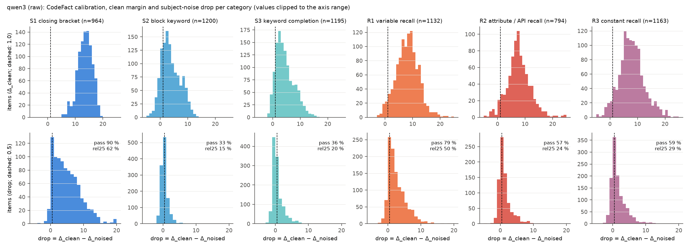
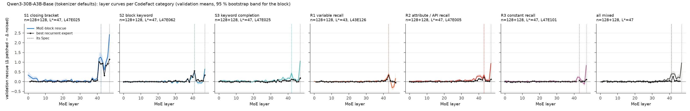
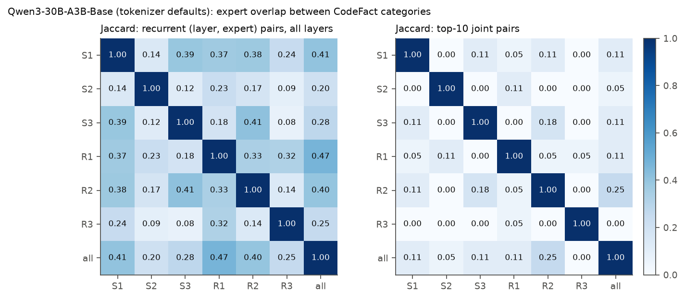
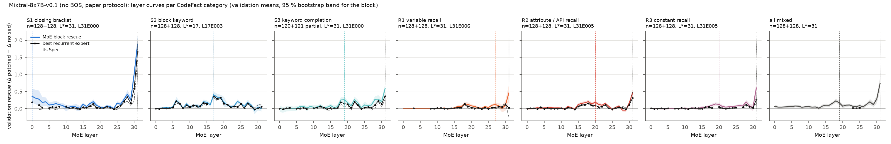
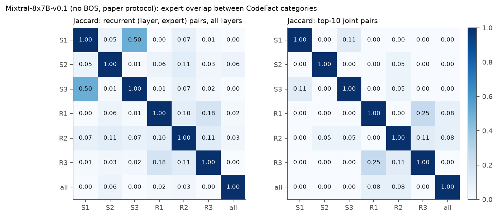
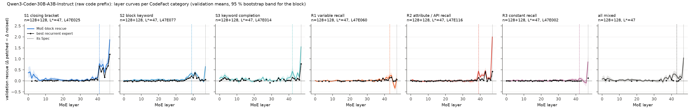
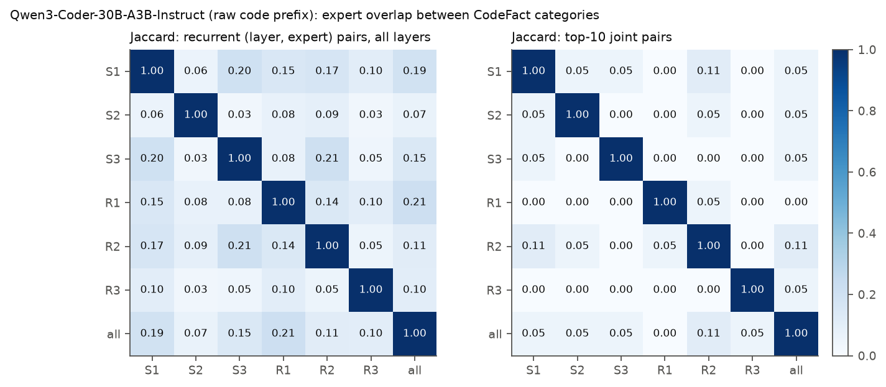
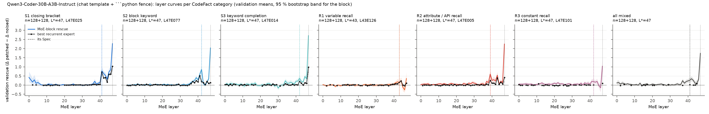
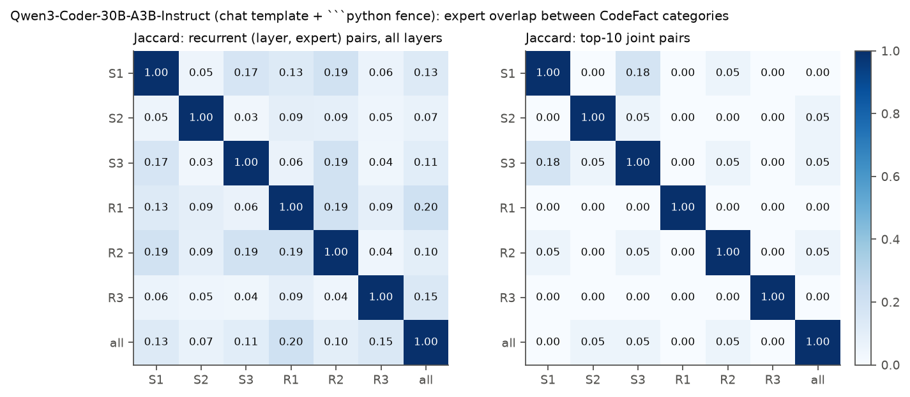

# Extensions of the expert-aware causal-tracing reproduction (arXiv 2606.03780)

Assembled 2026-09-21 02:39 UTC from results/sections/ by scripts/build_extensions_report.py. Plan and decisions: RESEARCH_PLAN.md. Base reproduction: REPORT.md. Timeline: logs/PROGRESS.md.

## Status

| Direction | Question | Section | Status |
|---|---|---|---|
| 1 | Does the paper's two-stage selection miss a stronger or more specific single expert in another layer? | `results/sections/ext1_joint_search.md` | included |
| 3 | Mechanism behind the BOS-dependence of Mixtral's expert-level result (hypotheses H1 sink relocation, H2 BOS semantics, H3 position shift, H4 default expert); literature review in docs/ext3_literature_review.md. | `results/sections/ext3_bos_mechanism.md` | included |
| 2 | Qwen3-30B-A3B-Instruct-2507, Qwen3-Coder-30B-A3B-Instruct, Mixtral-8x7B-Instruct, OLMoE base/Instruct under intended and paper protocols; attention-output / MoE-output / whole-layer rescue curves. | `results/sections/ext2_model_zoo.md` | included |
| 2b | New intervention kinds attn_layer and block; verification against transformers hooks. | `results/sections/ext2_attn_patch.md` | included |
| 4 | CounterFact-style code counterfactuals (S1-S3 syntax, R1-R3 recall) on Python; per-category localisation and cross-category expert overlap. | `results/sections/ext4_codefact.md` | included |
| 5-F4 | Where does the noised subject's information get repaired when the patch is applied at the last subject token instead of the final position, and is there a shared expert there? (suffix-row executor moetrace/ext5_subject.py) | `results/sections/ext5_f4_subject.md` | included |
| 5-F1 | Do rescue, active-only rescue, Spec, block share and per-case percentile rank experts the same way; how many experts of a layer carry 50/80/90% of the block rescue; exhaustive subsets vs the additive approximation. | `results/sections/ext5_f1_rankings.md` | included |
| 5-F2 | Per-head decomposition of the attention-output rescue at the peak layers (Qwen3 L40/L43/L44, Mixtral L15/L18/L19/L24): mover heads, their specificity, additivity and minimal head sets. | `results/sections/ext5_f2_heads.md` | included |
| 5-F5 | Do the layer/expert selections and effect sizes change under log p(true), p(true), rank of the true token and KL to the clean distribution instead of logit(true) - logit(foil)? | `results/sections/ext5_f5_metrics.md` | included |


## Direction 1: Layer-then-expert versus joint layer × expert search

### Extension 1: layer-then-expert versus joint layer x expert search

**Question.** The paper selects the layer L* by MoE-block rescue on discovery cases and then searches for a recurrent expert inside L* only. Could a single expert in another layer be a better (higher validation rescue, more specific) locus that the two-stage procedure never sees?

**Method.** We ran the expert pass at *every* MoE layer (48 for Qwen3, 32 for Mixtral; `run_expert.py --layers 0..L-1 --no-pairs`, split into layer chunks so that at most ~90k wavefront rows are resident) for the three base runs: Qwen3-30B-A3B-Base with tokenizer defaults (paper, strict and relaxed case sets), Mixtral-8x7B-v0.1 with BOS (all three sets) and Mixtral without BOS (paper set; the protocol that reproduces the paper). For every (layer, expert) pair we compute on the paper's discovery split the clean-active count and the all-case mean rescue (zero where the expert is not clean-active), keep pairs meeting the recurrence threshold (half the discovery split: 64 of 128, 128 of 256) and (a) per layer take the best recurrent expert (the paper's rule applied at every layer), (b) take the global argmax over all pairs (joint search). Every selection is then evaluated on the untouched validation split with the same statistics as Table 1 (all-case rescue, active-random specificity with 3 controls for Qwen3 and 1 for Mixtral, 5,000-resample bootstrap CIs). Concentration is Rescue(best expert)/Rescue(MoE block) on validation from the same pass (paired bootstrap CI). Robustness repeats the joint search over the Appendix D grid (split seeds 0-4 x thresholds 32, 48, 64, 80, 96, doubled for the 512-case relaxed set; `random.Random(seed).shuffle` of the set's ids as in `analysis.stability_grid`; the per-split two-stage selection re-selects the layer by discovery block rescue and then the expert inside it). Code: `moetrace/ext1_analysis.py`, `scripts/ext1_analyze.py`; rows: `results/<run>/expert_rows.parquet` for runs `qwen3_bos_alllayers`, `mixtral_bos_alllayers`, `mixtral_nobos_alllayers`.

**Multiple-comparison caveat.** The joint search compares 48 x 128 = 6,144 (Qwen3) or 32 x 8 = 256 (Mixtral) pairs on discovery; the discovery maximum is therefore biased upward and only the validation numbers of a selected pair are unbiased estimates of its effect. We report the discovery-to-validation shrinkage of the maximum for that reason. The neighbouring-layer question (e) below scans every expert of 2-3 layers on *validation* directly and is a post-hoc comparison of ~100-400 experts against one pre-registered expert; a single expert exceeding the reference there is expected by chance and is not evidence unless it is also recurrent and its CI excludes the reference.

#### Qwen3-30B-A3B-Base (tokenizer defaults) (`results/qwen3_bos_alllayers`)

- **Verdict: the joint search returns the two-stage winner.** Over all 234 recurrent (layer, expert) pairs in 48 layers, the discovery argmax is L44E069 (discovery +0.482, validation +0.499 [+0.357, +0.659], Spec +0.443 [+0.302, +0.603]).
- The strongest recurrent pair outside L44 is L42E115 (discovery rank 2, discovery +0.461, validation +0.447 [+0.363, +0.537], Spec +0.423 [+0.339, +0.510]).
- Discovery maximum vs its validation value (joint winner L44E069): +0.482 -> +0.499 (change +0.017, +3% of the discovery value; a negative change is the winner's-curse shrinkage).
- Overlap of L44E069 and L42E115 on the 128 validation cases: per-case rescue correlation Pearson r = 0.27 (Spearman 0.30); both positive in 52% of cases, only L44E069 in 11%, only L42E115 in 26%, neither in 11%; mean per-case max(rescue) +0.753 vs +0.499 / +0.447 alone.
- Robustness (Appendix D grid, 25 split-seed x threshold settings): the joint winner equals L44E069 in 20/25 settings with a winner, lies outside L44 in 5/25, and equals the per-split two-stage selection in 20/25. In 0 settings the per-split two-stage procedure finds no recurrent expert at its layer at all (the joint search still returns a pair); the joint winner leaves L44 in 5 settings where the two-stage procedure did have a candidate. Winners: L44E069 x20, L42E115 x5.
- All 234 recurrent pairs evaluated on validation against L44E069: 0 have a higher rescue (0 with a rescue CI entirely above L44E069's CI), 0 a higher Spec (0 with a Spec CI entirely above L44E069's CI); 19 pairs have a Spec CI above zero: L44E069, L42E115, L41E001, L43E005, L40E127, L40E030, L33E076, L37E104, L34E094, L28E030, L38E057, L39E040.
- Neighbouring layers [42, 43, 45]: 172 experts with any validation activity were evaluated; 0 beat L44E069 on validation rescue (+0.499) and 0 on Spec (+0.443); among the 14 recurrent ones, 0 and 0 respectively. Best by rescue: L42E115 +0.447 [+0.363, +0.537] (Spec +0.423, active 123/128, recurrent); best by Spec: L42E115 Spec +0.423 [+0.339, +0.510] (rescue +0.447, active 123/128, recurrent).

**Reading.** The two-stage procedure does not miss a *better* single expert: L44E069 is the joint discovery argmax on the paper set and has the highest validation point estimate in all three case sets. It does miss a *second locus of the same kind*. L42E115 is clean-active in 126/128 discovery and 123/128 validation cases (more recurrent than E069's 114/116), its validation rescue and Spec are within the CIs of E069's (and its own CIs are about half as wide), it is the joint discovery argmax on the strict and relaxed sets and in 5/25 grid settings, and L42 concentrates 72% of its block rescue in this one expert against 53% at L44. The two experts rescue partly different cases (per-case correlation r = 0.27; 26% of validation cases are rescued only by E115, 11% only by E069) and the per-case maximum of the two (+0.75) approaches the L44 block rescue (+0.94). The paper's Qwen3 picture 'one specific expert' should therefore read 'one specific expert per layer in the L42/L44 band', with L44E069 the stronger of two; the two-stage search sees only the layer with the higher block rescue and never examines L42, whose block rescue (+0.62) is the second highest. Stated plainly: **L42E115 (recurrent in 126/128 discovery cases, validation rescue +0.447 [+0.363, +0.537], Spec +0.423 [+0.339, +0.510]) is a second, near-equivalent factual-recall expert in the second-strongest layer; it wins the discovery argmax on the strict and relaxed sets and in 30 of the 75 grid cells (5/25 paper, 10/25 strict, 15/25 relaxed), while L44E069 keeps the higher validation point estimate in every set.** No expert in L43 or L45 comes close (best +0.15 and -0.03).

Consistency with the original single-layer pass (bf16 fingerprint): L44E069 on the paper validation split has rescue +0.499 / Spec +0.443 in the all-layer pass vs +0.503 / +0.450 in `results/qwen3` (active 116 vs 116); the difference (-0.004) is bf16 noise.


Figure E1-qwen3_bos: validation MoE-block rescue by layer (grey, 95% band) with the recurrence-first best expert's validation rescue (solid) and active-random Spec (dashed) at every layer; star = two-stage winner, diamond = joint winner if different. Gaps = layers with no recurrent expert. Full per-layer table: `results/tables/ext1_best_expert_by_layer_qwen3_bos.md`.

**Qwen3-30B-A3B-Base (tokenizer defaults): top-10 (layer, expert) pairs by discovery all-case mean rescue among recurrent candidates**

| Set | Rank (disc.) | Pair | Disc. active | Disc. rescue | Val. active | Val. rescue [95% CI] | Spec [95% CI] | Two-stage winner |
|---|---|---|---|---|---|---|---|---|
| paper | 1 | L44E069 | 114/128 | +0.482 | 116/128 | +0.499 [+0.357, +0.659] | +0.443 [+0.302, +0.603] | yes |
| paper | 2 | L42E115 | 126/128 | +0.461 | 123/128 | +0.447 [+0.363, +0.537] | +0.423 [+0.339, +0.510] |  |
| paper | 3 | L43E046 | 90/128 | +0.159 | 87/128 | +0.095 [+0.045, +0.152] | +0.017 [-0.040, +0.077] |  |
| paper | 4 | L41E001 | 115/128 | +0.151 | 109/128 | +0.125 [+0.085, +0.167] | +0.106 [+0.063, +0.150] |  |
| paper | 5 | L43E005 | 77/128 | +0.151 | 82/128 | +0.146 [+0.079, +0.230] | +0.087 [+0.015, +0.177] |  |
| paper | 6 | L40E127 | 92/128 | +0.149 | 93/128 | +0.126 [+0.074, +0.188] | +0.083 [+0.029, +0.146] |  |
| paper | 7 | L40E030 | 94/128 | +0.127 | 92/128 | +0.121 [+0.071, +0.175] | +0.086 [+0.033, +0.143] |  |
| paper | 8 | L43E104 | 87/128 | +0.089 | 87/128 | +0.102 [+0.061, +0.150] | +0.041 [-0.012, +0.098] |  |
| paper | 9 | L33E076 | 95/128 | +0.076 | 102/128 | +0.079 [+0.052, +0.110] | +0.083 [+0.056, +0.112] |  |
| paper | 10 | L37E104 | 128/128 | +0.067 | 127/128 | +0.039 [+0.004, +0.074] | +0.038 [+0.006, +0.071] |  |
| paper | 1 | L44E069 (two-stage) | 114/128 | +0.482 | 116/128 | +0.499 [+0.357, +0.659] | +0.443 [+0.302, +0.603] | reference |
| strict | 1 | L42E115 | 124/128 | +0.454 | 125/128 | +0.434 [+0.360, +0.509] | +0.409 [+0.333, +0.486] |  |
| strict | 2 | L44E069 | 117/128 | +0.443 | 116/128 | +0.480 [+0.332, +0.649] | +0.421 [+0.268, +0.595] | yes |
| strict | 3 | L43E005 | 86/128 | +0.160 | 79/128 | +0.124 [+0.061, +0.198] | +0.069 [+0.002, +0.145] |  |
| strict | 4 | L40E127 | 94/128 | +0.159 | 93/128 | +0.107 [+0.060, +0.164] | +0.072 [+0.022, +0.130] |  |
| strict | 5 | L40E030 | 83/128 | +0.126 | 91/128 | +0.111 [+0.062, +0.166] | +0.078 [+0.028, +0.134] |  |
| strict | 6 | L41E001 | 115/128 | +0.119 | 108/128 | +0.142 [+0.103, +0.181] | +0.133 [+0.095, +0.171] |  |
| strict | 7 | L43E046 | 81/128 | +0.099 | 79/128 | +0.141 [+0.083, +0.202] | +0.089 [+0.032, +0.151] |  |
| strict | 8 | L33E076 | 100/128 | +0.092 | 95/128 | +0.052 [+0.024, +0.081] | +0.046 [+0.019, +0.073] |  |
| strict | 9 | L28E030 | 111/128 | +0.067 | 119/128 | +0.057 [+0.030, +0.086] | +0.045 [+0.018, +0.074] |  |
| strict | 10 | L43E104 | 91/128 | +0.063 | 92/128 | +0.101 [+0.056, +0.157] | +0.051 [+0.000, +0.112] |  |
| strict | 2 | L44E069 (two-stage) | 117/128 | +0.443 | 116/128 | +0.480 [+0.332, +0.649] | +0.421 [+0.268, +0.595] | reference |
| relaxed | 1 | L42E115 | 244/256 | +0.412 | 249/256 | +0.426 [+0.369, +0.484] | +0.393 [+0.335, +0.451] |  |
| relaxed | 2 | L44E069 | 228/256 | +0.394 | 235/256 | +0.429 [+0.331, +0.537] | +0.364 [+0.263, +0.473] | yes |
| relaxed | 3 | L43E005 | 159/256 | +0.137 | 158/256 | +0.142 [+0.094, +0.197] | +0.068 [+0.017, +0.125] |  |
| relaxed | 4 | L40E127 | 180/256 | +0.119 | 191/256 | +0.129 [+0.092, +0.170] | +0.084 [+0.044, +0.126] |  |
| relaxed | 5 | L41E001 | 213/256 | +0.101 | 224/256 | +0.130 [+0.101, +0.161] | +0.106 [+0.077, +0.136] |  |
| relaxed | 6 | L40E030 | 172/256 | +0.101 | 189/256 | +0.131 [+0.094, +0.174] | +0.089 [+0.049, +0.133] |  |
| relaxed | 7 | L43E104 | 184/256 | +0.097 | 177/256 | +0.073 [+0.047, +0.103] | -0.016 [-0.049, +0.020] |  |
| relaxed | 8 | L43E046 | 153/256 | +0.088 | 180/256 | +0.127 [+0.089, +0.169] | +0.048 [+0.007, +0.092] |  |
| relaxed | 9 | L33E076 | 185/256 | +0.063 | 200/256 | +0.058 [+0.035, +0.084] | +0.058 [+0.036, +0.083] |  |
| relaxed | 10 | L28E030 | 228/256 | +0.052 | 225/256 | +0.066 [+0.045, +0.087] | +0.057 [+0.036, +0.078] |  |
| relaxed | 2 | L44E069 (two-stage) | 228/256 | +0.394 | 235/256 | +0.429 [+0.331, +0.537] | +0.364 [+0.263, +0.473] | reference |

- strict set (n_disc=128, threshold 64, 227 recurrent pairs): joint winner L42E115 (validation +0.434 [+0.360, +0.509], Spec +0.409); two-stage winner L44E069 (validation +0.480 [+0.332, +0.649]); grid: joint = reference in 15/25, outside L44 in 10/25.
- relaxed set (n_disc=256, threshold 128, 218 recurrent pairs): joint winner L42E115 (validation +0.426 [+0.369, +0.484], Spec +0.393); two-stage winner L44E069 (validation +0.429 [+0.331, +0.537]); grid: joint = reference in 10/25, outside L44 in 15/25.

**Qwen3-30B-A3B-Base (tokenizer defaults): concentration Rescue(best expert)/Rescue(layer) on validation, layers with a clearly positive block rescue**

| Set | Layer | Best expert | Layer rescue (same pass) [CI] | Expert rescue [CI] | Spec [CI] | Expert/layer [CI] | Val. active |
|---|---|---|---|---|---|---|---|
| paper | L42 | E115 | +0.621 [+0.517, +0.728] | +0.447 [+0.363, +0.537] | +0.423 [+0.339, +0.510] | +0.720 [+0.632, +0.811] | 123/128 |
| paper | L28 | E030 | +0.143 [+0.097, +0.191] | +0.082 [+0.054, +0.112] | +0.071 [+0.042, +0.103] | +0.570 [+0.393, +0.806] | 115/128 |
| paper | L44 | E069 | +0.941 [+0.779, +1.124] | +0.499 [+0.357, +0.659] | +0.443 [+0.302, +0.603] | +0.530 [+0.424, +0.629] | 116/128 |
| paper | L38 | E057 | +0.111 [+0.069, +0.155] | +0.048 [+0.030, +0.068] | +0.036 [+0.018, +0.056] | +0.436 [+0.289, +0.651] | 94/128 |
| paper | L41 | E001 | +0.289 [+0.220, +0.363] | +0.125 [+0.085, +0.167] | +0.106 [+0.063, +0.150] | +0.433 [+0.298, +0.589] | 109/128 |
| paper | L40 | E127 | +0.444 [+0.351, +0.540] | +0.126 [+0.074, +0.188] | +0.083 [+0.029, +0.146] | +0.285 [+0.183, +0.393] | 93/128 |
| paper | L43 | E046 | +0.606 [+0.456, +0.764] | +0.095 [+0.045, +0.152] | +0.017 [-0.040, +0.077] | +0.157 [+0.081, +0.245] | 87/128 |
| strict | L42 | E115 | +0.557 [+0.459, +0.655] | +0.434 [+0.360, +0.509] | +0.409 [+0.333, +0.486] | +0.778 [+0.678, +0.883] | 125/128 |
| strict | L41 | E001 | +0.259 [+0.185, +0.337] | +0.142 [+0.103, +0.181] | +0.133 [+0.095, +0.171] | +0.546 [+0.407, +0.723] | 108/128 |
| strict | L44 | E069 | +0.930 [+0.749, +1.123] | +0.480 [+0.332, +0.649] | +0.421 [+0.268, +0.595] | +0.516 [+0.398, +0.630] | 116/128 |
| strict | L38 | E057 | +0.116 [+0.075, +0.158] | +0.047 [+0.029, +0.066] | +0.032 [+0.013, +0.052] | +0.408 [+0.264, +0.602] | 94/128 |
| strict | L28 | E030 | +0.156 [+0.112, +0.202] | +0.057 [+0.030, +0.086] | +0.045 [+0.018, +0.074] | +0.364 [+0.204, +0.543] | 119/128 |
| strict | L40 | E127 | +0.413 [+0.317, +0.513] | +0.107 [+0.060, +0.164] | +0.072 [+0.022, +0.130] | +0.260 [+0.159, +0.368] | 93/128 |
| strict | L43 | E005 | +0.570 [+0.434, +0.703] | +0.124 [+0.061, +0.198] | +0.069 [+0.002, +0.145] | +0.217 [+0.112, +0.331] | 79/128 |
| relaxed | L42 | E115 | +0.567 [+0.494, +0.639] | +0.426 [+0.369, +0.484] | +0.393 [+0.335, +0.451] | +0.752 [+0.687, +0.819] | 249/256 |
| relaxed | L44 | E069 | +0.812 [+0.688, +0.934] | +0.429 [+0.331, +0.537] | +0.364 [+0.263, +0.473] | +0.529 [+0.445, +0.611] | 235/256 |
| relaxed | L41 | E001 | +0.263 [+0.213, +0.316] | +0.130 [+0.101, +0.161] | +0.106 [+0.077, +0.136] | +0.495 [+0.405, +0.593] | 224/256 |
| relaxed | L38 | E057 | +0.122 [+0.089, +0.156] | +0.051 [+0.034, +0.070] | +0.027 [+0.010, +0.045] | +0.419 [+0.305, +0.545] | 180/256 |
| relaxed | L28 | E030 | +0.165 [+0.126, +0.206] | +0.066 [+0.045, +0.087] | +0.057 [+0.036, +0.078] | +0.396 [+0.285, +0.523] | 225/256 |
| relaxed | L40 | E127 | +0.424 [+0.354, +0.496] | +0.129 [+0.092, +0.170] | +0.084 [+0.044, +0.126] | +0.305 [+0.231, +0.379] | 191/256 |
| relaxed | L43 | E005 | +0.576 [+0.474, +0.679] | +0.142 [+0.094, +0.197] | +0.068 [+0.017, +0.125] | +0.246 [+0.171, +0.328] | 158/256 |

Concentration (paper set): among the 7 layers whose block rescue is clearly positive, the signal is most concentrated in one expert at L42 (E115: 72% of the block rescue); at the two-stage layer L44 the ratio is 53%.

**Qwen3-30B-A3B-Base (tokenizer defaults): experts of layers [42, 43, 45] ranked by validation rescue (top 10 per set)**

| Set | Pair | Disc. active | Disc. rescue | Recurrent | Val. active | Val. rescue | Val. Spec | > ref rescue | > ref Spec |
|---|---|---|---|---|---|---|---|---|---|
| paper | L42E115 | 126/128 | +0.461 | yes | 123/128 | +0.447 | +0.423 |  |  |
| paper | L43E005 | 77/128 | +0.151 | yes | 82/128 | +0.146 | +0.087 |  |  |
| paper | L43E104 | 87/128 | +0.089 | yes | 87/128 | +0.102 | +0.041 |  |  |
| paper | L43E046 | 90/128 | +0.159 | yes | 87/128 | +0.095 | +0.017 |  |  |
| paper | L43E100 | 20/128 | +0.029 |  | 21/128 | +0.074 | +0.005 |  |  |
| paper | L42E080 | 24/128 | +0.038 |  | 22/128 | +0.068 | +0.014 |  |  |
| paper | L45E022 | 45/128 | +0.009 |  | 51/128 | +0.052 | +0.096 |  |  |
| paper | L43E036 | 97/128 | +0.035 | yes | 98/128 | +0.050 | -0.025 |  |  |
| paper | L43E037 | 70/128 | +0.061 | yes | 62/128 | +0.038 | -0.034 |  |  |
| paper | L45E054 | 15/128 | +0.002 |  | 15/128 | +0.035 | +0.072 |  |  |
| paper | L44E069 (two-stage) | 114/128 | +0.482 | yes | 116/128 | +0.499 | +0.443 | ref | ref |
| strict | L42E115 | 124/128 | +0.454 | yes | 125/128 | +0.434 | +0.409 |  |  |
| strict | L43E046 | 81/128 | +0.099 | yes | 79/128 | +0.141 | +0.089 |  |  |
| strict | L43E005 | 86/128 | +0.160 | yes | 79/128 | +0.124 | +0.069 |  |  |
| strict | L43E104 | 91/128 | +0.063 | yes | 92/128 | +0.101 | +0.051 |  |  |
| strict | L42E080 | 19/128 | +0.031 |  | 20/128 | +0.054 | -0.013 |  |  |
| strict | L43E120 | 58/128 | +0.018 |  | 63/128 | +0.043 | -0.013 |  |  |
| strict | L43E100 | 16/128 | +0.045 |  | 19/128 | +0.041 | -0.013 |  |  |
| strict | L45E022 | 52/128 | +0.012 |  | 47/128 | +0.037 | +0.092 |  |  |
| strict | L42E016 | 63/128 | +0.019 |  | 62/128 | +0.035 | -0.029 |  |  |
| strict | L43E036 | 98/128 | +0.027 | yes | 101/128 | +0.034 | -0.035 |  |  |
| strict | L44E069 (two-stage) | 117/128 | +0.443 | yes | 116/128 | +0.480 | +0.421 | ref | ref |
| relaxed | L42E115 | 244/256 | +0.412 | yes | 249/256 | +0.426 | +0.393 |  | yes |
| relaxed | L43E005 | 159/256 | +0.137 | yes | 158/256 | +0.142 | +0.068 |  |  |
| relaxed | L43E046 | 153/256 | +0.088 | yes | 180/256 | +0.127 | +0.048 |  |  |
| relaxed | L43E104 | 184/256 | +0.097 | yes | 177/256 | +0.073 | -0.016 |  |  |
| relaxed | L43E100 | 34/256 | +0.044 |  | 43/256 | +0.052 | -0.032 |  |  |
| relaxed | L43E120 | 116/256 | +0.023 |  | 131/256 | +0.045 | -0.040 |  |  |
| relaxed | L43E036 | 194/256 | +0.014 | yes | 198/256 | +0.044 | -0.053 |  |  |
| relaxed | L42E080 | 42/256 | +0.054 |  | 43/256 | +0.042 | -0.027 |  |  |
| relaxed | L43E037 | 118/256 | +0.039 |  | 137/256 | +0.041 | -0.042 |  |  |
| relaxed | L43E007 | 27/256 | +0.016 |  | 20/256 | +0.031 | -0.058 |  |  |
| relaxed | L44E069 (two-stage) | 228/256 | +0.394 | yes | 235/256 | +0.429 | +0.364 | ref | ref |

Stability grid rows: `results/tables/ext1_stability_qwen3_bos.md`; all evaluated neighbour-layer experts: `results/tables/ext1_neighbours_all_qwen3_bos_<set>.csv`.

#### Mixtral-8x7B-v0.1 (BOS, tokenizer default) (`results/mixtral_bos_alllayers`)

- **Verdict: the joint search returns the two-stage winner.** Over all 38 recurrent (layer, expert) pairs in 26 layers, the discovery argmax is L19E002 (discovery +0.384, validation +0.363 [+0.267, +0.471], Spec +0.192 [+0.094, +0.296]).
- The strongest recurrent pair outside L19 is L21E001 (discovery rank 2, discovery +0.336, validation +0.273 [+0.190, +0.363], Spec +0.118 [+0.036, +0.207]).
- Discovery maximum vs its validation value (joint winner L19E002): +0.384 -> +0.363 (change -0.021, -6% of the discovery value; a negative change is the winner's-curse shrinkage).
- Overlap of L19E002 and L21E001 on the 128 validation cases: per-case rescue correlation Pearson r = 0.32 (Spearman 0.42); both positive in 37% of cases, only L19E002 in 20%, only L21E001 in 14%, neither in 30%; mean per-case max(rescue) +0.512 vs +0.363 / +0.273 alone.
- Robustness (Appendix D grid, 25 split-seed x threshold settings): the joint winner equals L19E002 in 17/25 settings with a winner, lies outside L19 in 8/25, and equals the per-split two-stage selection in 17/25. In 8 settings the per-split two-stage procedure finds no recurrent expert at its layer at all (the joint search still returns a pair); the joint winner leaves L19 in 0 settings where the two-stage procedure did have a candidate. Winners: L19E002 x17, L18E001 x4, L21E001 x3, L22E001 x1.
- All 38 recurrent pairs evaluated on validation against L19E002: 0 have a higher rescue (0 with a rescue CI entirely above L19E002's CI), 0 a higher Spec (0 with a Spec CI entirely above L19E002's CI); 7 pairs have a Spec CI above zero: L19E002, L21E001, L18E001, L30E004, L6E007, L31E007, L29E003.
- Neighbouring layers [20, 21]: 16 experts with any validation activity were evaluated; 0 beat L19E002 on validation rescue (+0.363) and 0 on Spec (+0.192); among the 2 recurrent ones, 0 and 0 respectively. Best by rescue: L21E001 +0.273 [+0.190, +0.363] (Spec +0.118, active 84/128, recurrent); best by Spec: L21E001 Spec +0.118 [+0.036, +0.207] (rescue +0.273, active 84/128, recurrent).

**Reading.** With BOS, the joint search and the two-stage selection agree on L19E002 on all three sets and in 17/25 grid settings; every one of the 8 disagreements is a threshold-80/96 setting in which L19 has no recurrent expert at all (E002 is clean-active in only 76/128 discovery cases), so the two-stage procedure returns nothing while the joint search falls back to L21E001 or L18E001 (validation +0.27 / +0.24, both clearly weaker than E002's +0.36). L18E001 is the most concentrated layer (77% of a +0.32 block rescue) and is the only other pair whose Spec CI excludes zero; the same expert index E001 is the best expert at L17, L18, L21 and L22, which is worth checking against the BOS-mechanism results (Direction 3) since expert indices are independent parameters across layers. The picture of Mixtral as a coalition model is unchanged: no single expert in any layer reaches half of the L19 block rescue except E002 itself (63%).

Consistency with the original single-layer pass (bf16 fingerprint): L19E002 on the paper validation split has rescue +0.363 / Spec +0.192 in the all-layer pass vs +0.352 / +0.205 in `results/mixtral` (active 84 vs 84); the difference (+0.011) is bf16 noise.


Figure E1-mixtral_bos: validation MoE-block rescue by layer (grey, 95% band) with the recurrence-first best expert's validation rescue (solid) and active-random Spec (dashed) at every layer; star = two-stage winner, diamond = joint winner if different. Gaps = layers with no recurrent expert. Full per-layer table: `results/tables/ext1_best_expert_by_layer_mixtral_bos.md`.

**Mixtral-8x7B-v0.1 (BOS, tokenizer default): top-10 (layer, expert) pairs by discovery all-case mean rescue among recurrent candidates**

| Set | Rank (disc.) | Pair | Disc. active | Disc. rescue | Val. active | Val. rescue [95% CI] | Spec [95% CI] | Two-stage winner |
|---|---|---|---|---|---|---|---|---|
| paper | 1 | L19E002 | 76/128 | +0.384 | 84/128 | +0.363 [+0.267, +0.471] | +0.192 [+0.094, +0.296] | yes |
| paper | 2 | L21E001 | 91/128 | +0.336 | 84/128 | +0.273 [+0.190, +0.363] | +0.118 [+0.036, +0.207] |  |
| paper | 3 | L18E001 | 98/128 | +0.192 | 103/128 | +0.244 [+0.177, +0.320] | +0.182 [+0.111, +0.261] |  |
| paper | 4 | L22E001 | 95/128 | +0.155 | 94/128 | +0.179 [+0.121, +0.246] | +0.057 [-0.016, +0.132] |  |
| paper | 5 | L20E005 | 75/128 | +0.134 | 73/128 | +0.155 [+0.103, +0.211] | -0.074 [-0.159, +0.005] |  |
| paper | 6 | L19E006 | 71/128 | +0.100 | 67/128 | +0.079 [+0.048, +0.110] | -0.246 [-0.341, -0.162] |  |
| paper | 7 | L28E002 | 88/128 | +0.097 | 79/128 | +0.086 [+0.043, +0.134] | +0.005 [-0.065, +0.074] |  |
| paper | 8 | L29E004 | 103/128 | +0.059 | 108/128 | -0.094 [-0.168, -0.027] | -0.063 [-0.126, -0.001] |  |
| paper | 9 | L25E003 | 72/128 | +0.056 | 67/128 | +0.078 [+0.040, +0.120] | -0.025 [-0.086, +0.033] |  |
| paper | 10 | L17E001 | 111/128 | +0.053 | 107/128 | +0.082 [+0.054, +0.111] | +0.001 [-0.039, +0.040] |  |
| paper | 1 | L19E002 (two-stage) | 76/128 | +0.384 | 84/128 | +0.363 [+0.267, +0.471] | +0.192 [+0.094, +0.296] | reference |
| strict | 1 | L19E002 | 79/128 | +0.364 | 90/128 | +0.426 [+0.319, +0.546] | +0.257 [+0.148, +0.379] | yes |
| strict | 2 | L21E001 | 91/128 | +0.292 | 86/128 | +0.354 [+0.266, +0.455] | +0.200 [+0.109, +0.302] |  |
| strict | 3 | L18E001 | 101/128 | +0.215 | 100/128 | +0.237 [+0.173, +0.305] | +0.143 [+0.073, +0.217] |  |
| strict | 4 | L22E001 | 98/128 | +0.198 | 95/128 | +0.182 [+0.126, +0.243] | +0.082 [+0.010, +0.156] |  |
| strict | 5 | L20E005 | 68/128 | +0.117 | 73/128 | +0.185 [+0.129, +0.248] | -0.049 [-0.119, +0.022] |  |
| strict | 6 | L28E002 | 84/128 | +0.098 | 82/128 | +0.103 [+0.063, +0.146] | -0.029 [-0.099, +0.035] |  |
| strict | 7 | L19E006 | 70/128 | +0.095 | 63/128 | +0.093 [+0.060, +0.128] | -0.250 [-0.343, -0.164] |  |
| strict | 8 | L23E002 | 67/128 | +0.086 | 65/128 | +0.112 [+0.073, +0.155] | -0.018 [-0.075, +0.037] |  |
| strict | 9 | L25E003 | 73/128 | +0.081 | 68/128 | +0.077 [+0.039, +0.116] | -0.044 [-0.107, +0.017] |  |
| strict | 10 | L22E005 | 78/128 | +0.080 | 63/128 | +0.102 [+0.062, +0.145] | -0.055 [-0.119, +0.008] |  |
| strict | 1 | L19E002 (two-stage) | 79/128 | +0.364 | 90/128 | +0.426 [+0.319, +0.546] | +0.257 [+0.148, +0.379] | reference |
| relaxed | 1 | L19E002 | 166/256 | +0.366 | 162/256 | +0.356 [+0.287, +0.430] | +0.175 [+0.103, +0.253] | yes |
| relaxed | 2 | L21E001 | 169/256 | +0.278 | 181/256 | +0.332 [+0.270, +0.398] | +0.212 [+0.152, +0.276] |  |
| relaxed | 3 | L18E001 | 209/256 | +0.218 | 202/256 | +0.223 [+0.179, +0.268] | +0.156 [+0.111, +0.203] |  |
| relaxed | 4 | L22E001 | 193/256 | +0.162 | 189/256 | +0.233 [+0.183, +0.288] | +0.115 [+0.053, +0.178] |  |
| relaxed | 5 | L20E005 | 154/256 | +0.141 | 157/256 | +0.166 [+0.128, +0.205] | -0.038 [-0.096, +0.019] |  |
| relaxed | 6 | L23E002 | 128/256 | +0.102 | 155/256 | +0.115 [+0.083, +0.147] | +0.016 [-0.029, +0.057] |  |
| relaxed | 7 | L22E005 | 145/256 | +0.098 | 134/256 | +0.105 [+0.074, +0.138] | -0.116 [-0.175, -0.061] |  |
| relaxed | 8 | L19E006 | 136/256 | +0.095 | 131/256 | +0.073 [+0.053, +0.095] | -0.295 [-0.361, -0.233] |  |
| relaxed | 9 | L25E003 | 151/256 | +0.083 | 131/256 | +0.062 [+0.035, +0.089] | -0.036 [-0.087, +0.008] |  |
| relaxed | 10 | L21E006 | 128/256 | +0.076 | 106/256 | +0.059 [+0.039, +0.081] | -0.188 [-0.237, -0.144] |  |
| relaxed | 1 | L19E002 (two-stage) | 166/256 | +0.366 | 162/256 | +0.356 [+0.287, +0.430] | +0.175 [+0.103, +0.253] | reference |

- strict set (n_disc=128, threshold 64, 43 recurrent pairs): joint winner L19E002 (validation +0.426 [+0.319, +0.546], Spec +0.257); two-stage winner L19E002 (same); grid: joint = reference in 20/25, outside L19 in 5/25.
- relaxed set (n_disc=256, threshold 128, 44 recurrent pairs): joint winner L19E002 (validation +0.356 [+0.287, +0.430], Spec +0.175); two-stage winner L19E002 (same); grid: joint = reference in 20/25, outside L19 in 5/25.

**Mixtral-8x7B-v0.1 (BOS, tokenizer default): concentration Rescue(best expert)/Rescue(layer) on validation, layers with a clearly positive block rescue**

| Set | Layer | Best expert | Layer rescue (same pass) [CI] | Expert rescue [CI] | Spec [CI] | Expert/layer [CI] | Val. active |
|---|---|---|---|---|---|---|---|
| paper | L18 | E001 | +0.315 [+0.234, +0.403] | +0.244 [+0.177, +0.320] | +0.182 [+0.111, +0.261] | +0.774 [+0.659, +0.888] | 103/128 |
| paper | L19 | E002 | +0.580 [+0.468, +0.700] | +0.363 [+0.267, +0.471] | +0.192 [+0.094, +0.296] | +0.626 [+0.529, +0.714] | 84/128 |
| paper | L22 | E001 | +0.314 [+0.237, +0.401] | +0.179 [+0.121, +0.246] | +0.057 [-0.016, +0.132] | +0.570 [+0.434, +0.706] | 94/128 |
| paper | L21 | E001 | +0.500 [+0.395, +0.611] | +0.273 [+0.190, +0.363] | +0.118 [+0.036, +0.207] | +0.547 [+0.443, +0.643] | 84/128 |
| paper | L17 | E001 | +0.155 [+0.103, +0.210] | +0.082 [+0.054, +0.111] | +0.001 [-0.039, +0.040] | +0.528 [+0.391, +0.700] | 107/128 |
| paper | L15 | E005 | +0.107 [+0.054, +0.158] | +0.054 [+0.021, +0.087] | +0.010 [-0.029, +0.049] | +0.500 [+0.259, +0.795] | 76/128 |
| paper | L28 | E002 | +0.189 [+0.085, +0.299] | +0.086 [+0.043, +0.134] | +0.005 [-0.065, +0.074] | +0.457 [+0.279, +0.807] | 79/128 |
| paper | L25 | E003 | +0.233 [+0.145, +0.325] | +0.078 [+0.040, +0.120] | -0.025 [-0.086, +0.033] | +0.335 [+0.192, +0.511] | 67/128 |
| paper | L26 | E003 | +0.147 [+0.084, +0.213] | +0.046 [+0.019, +0.075] | -0.017 [-0.058, +0.024] | +0.316 [+0.147, +0.538] | 68/128 |
| paper | L20 | E005 | +0.504 [+0.395, +0.623] | +0.155 [+0.103, +0.211] | -0.074 [-0.159, +0.005] | +0.308 [+0.216, +0.412] | 73/128 |
| paper | L24 | E007 | +0.166 [+0.079, +0.257] | +0.048 [+0.008, +0.090] | -0.014 [-0.076, +0.045] | +0.292 [+0.065, +0.536] | 74/128 |
| strict | L18 | E001 | +0.361 [+0.286, +0.436] | +0.237 [+0.173, +0.305] | +0.143 [+0.073, +0.217] | +0.656 [+0.552, +0.753] | 100/128 |
| strict | L19 | E002 | +0.649 [+0.531, +0.778] | +0.426 [+0.319, +0.546] | +0.257 [+0.148, +0.379] | +0.656 [+0.564, +0.737] | 90/128 |
| strict | L21 | E001 | +0.566 [+0.466, +0.678] | +0.354 [+0.266, +0.455] | +0.200 [+0.109, +0.302] | +0.625 [+0.535, +0.708] | 86/128 |
| strict | L22 | E001 | +0.316 [+0.243, +0.394] | +0.182 [+0.126, +0.243] | +0.082 [+0.010, +0.156] | +0.575 [+0.442, +0.712] | 95/128 |
| strict | L15 | E005 | +0.130 [+0.080, +0.181] | +0.068 [+0.035, +0.102] | +0.011 [-0.027, +0.050] | +0.521 [+0.324, +0.746] | 84/128 |
| strict | L17 | E005 | +0.184 [+0.130, +0.237] | +0.072 [+0.045, +0.099] | -0.029 [-0.070, +0.010] | +0.390 [+0.268, +0.535] | 89/128 |
| strict | L28 | E002 | +0.267 [+0.161, +0.383] | +0.103 [+0.063, +0.146] | -0.029 [-0.099, +0.035] | +0.385 [+0.267, +0.549] | 82/128 |
| strict | L23 | E002 | +0.312 [+0.243, +0.387] | +0.112 [+0.073, +0.155] | -0.018 [-0.075, +0.037] | +0.358 [+0.249, +0.473] | 65/128 |
| strict | L20 | E005 | +0.520 [+0.425, +0.619] | +0.185 [+0.129, +0.248] | -0.049 [-0.119, +0.022] | +0.355 [+0.264, +0.444] | 73/128 |
| strict | L16 | E005 | +0.144 [+0.091, +0.196] | +0.049 [+0.028, +0.072] | -0.018 [-0.053, +0.020] | +0.342 [+0.213, +0.509] | 81/128 |
| strict | L25 | E003 | +0.239 [+0.147, +0.335] | +0.077 [+0.039, +0.116] | -0.044 [-0.107, +0.017] | +0.320 [+0.185, +0.487] | 68/128 |
| strict | L24 | E007 | +0.210 [+0.126, +0.304] | +0.060 [+0.020, +0.104] | -0.042 [-0.111, +0.022] | +0.286 [+0.111, +0.471] | 68/128 |
| strict | L26 | E003 | +0.161 [+0.093, +0.232] | +0.029 [+0.006, +0.055] | -0.042 [-0.081, -0.001] | +0.179 [+0.038, +0.338] | 67/128 |
| relaxed | L18 | E001 | +0.298 [+0.245, +0.353] | +0.223 [+0.179, +0.268] | +0.156 [+0.111, +0.203] | +0.750 [+0.675, +0.823] | 202/256 |
| relaxed | L21 | E001 | +0.488 [+0.413, +0.565] | +0.332 [+0.270, +0.398] | +0.212 [+0.152, +0.276] | +0.681 [+0.618, +0.738] | 181/256 |
| relaxed | L19 | E002 | +0.598 [+0.519, +0.683] | +0.356 [+0.287, +0.430] | +0.175 [+0.103, +0.253] | +0.596 [+0.528, +0.659] | 162/256 |
| relaxed | L15 | E005 | +0.105 [+0.062, +0.146] | +0.061 [+0.036, +0.086] | +0.020 [-0.008, +0.049] | +0.583 [+0.395, +0.860] | 157/256 |
| relaxed | L22 | E001 | +0.418 [+0.356, +0.485] | +0.233 [+0.183, +0.288] | +0.115 [+0.053, +0.178] | +0.558 [+0.472, +0.641] | 189/256 |
| relaxed | L17 | E001 | +0.133 [+0.099, +0.169] | +0.064 [+0.041, +0.087] | -0.007 [-0.032, +0.020] | +0.480 [+0.358, +0.600] | 233/256 |
| relaxed | L23 | E002 | +0.254 [+0.204, +0.309] | +0.115 [+0.083, +0.147] | +0.016 [-0.029, +0.057] | +0.452 [+0.347, +0.558] | 155/256 |
| relaxed | L28 | E002 | +0.211 [+0.149, +0.276] | +0.093 [+0.061, +0.127] | +0.020 [-0.021, +0.064] | +0.440 [+0.316, +0.592] | 169/256 |
| relaxed | L20 | E005 | +0.440 [+0.373, +0.511] | +0.166 [+0.128, +0.205] | -0.038 [-0.096, +0.019] | +0.377 [+0.303, +0.452] | 157/256 |
| relaxed | L24 | E007 | +0.157 [+0.098, +0.219] | +0.054 [+0.027, +0.084] | +0.010 [-0.033, +0.052] | +0.344 [+0.192, +0.524] | 141/256 |
| relaxed | L25 | E003 | +0.201 [+0.143, +0.266] | +0.062 [+0.035, +0.089] | -0.036 [-0.087, +0.008] | +0.309 [+0.192, +0.440] | 131/256 |
| relaxed | L27 | E007 | +0.168 [+0.114, +0.227] | +0.051 [+0.025, +0.080] | -0.036 [-0.075, +0.004] | +0.305 [+0.173, +0.456] | 116/256 |
| relaxed | L26 | E003 | +0.181 [+0.133, +0.230] | +0.049 [+0.026, +0.074] | -0.044 [-0.077, -0.009] | +0.269 [+0.159, +0.393] | 144/256 |

Concentration (paper set): among the 11 layers whose block rescue is clearly positive, the signal is most concentrated in one expert at L18 (E001: 77% of the block rescue); at the two-stage layer L19 the ratio is 63%.

**Mixtral-8x7B-v0.1 (BOS, tokenizer default): experts of layers [20, 21] ranked by validation rescue (top 10 per set)**

| Set | Pair | Disc. active | Disc. rescue | Recurrent | Val. active | Val. rescue | Val. Spec | > ref rescue | > ref Spec |
|---|---|---|---|---|---|---|---|---|---|
| paper | L21E001 | 91/128 | +0.336 | yes | 84/128 | +0.273 | +0.118 |  |  |
| paper | L20E005 | 75/128 | +0.134 | yes | 73/128 | +0.155 | -0.074 |  |  |
| paper | L20E006 | 34/128 | +0.090 |  | 33/128 | +0.114 | -0.101 |  |  |
| paper | L20E004 | 28/128 | +0.048 |  | 54/128 | +0.114 | -0.136 |  |  |
| paper | L21E006 | 55/128 | +0.054 |  | 53/128 | +0.082 | -0.207 |  |  |
| paper | L21E000 | 48/128 | +0.060 |  | 42/128 | +0.046 | -0.243 |  |  |
| paper | L20E002 | 24/128 | +0.047 |  | 36/128 | +0.042 | -0.212 |  |  |
| paper | L20E000 | 52/128 | +0.079 |  | 33/128 | +0.041 | -0.199 |  |  |
| paper | L21E004 | 17/128 | +0.027 |  | 28/128 | +0.038 | -0.248 |  |  |
| paper | L21E007 | 19/128 | +0.003 |  | 23/128 | +0.036 | -0.222 |  |  |
| paper | L19E002 (two-stage) | 76/128 | +0.384 | yes | 84/128 | +0.363 | +0.192 | ref | ref |
| strict | L21E001 | 91/128 | +0.292 | yes | 86/128 | +0.354 | +0.200 |  |  |
| strict | L20E005 | 68/128 | +0.117 | yes | 73/128 | +0.185 | -0.049 |  |  |
| strict | L20E006 | 29/128 | +0.117 |  | 42/128 | +0.113 | -0.110 |  |  |
| strict | L20E004 | 49/128 | +0.092 |  | 41/128 | +0.086 | -0.180 |  |  |
| strict | L21E006 | 51/128 | +0.063 |  | 56/128 | +0.070 | -0.238 |  |  |
| strict | L20E000 | 44/128 | +0.079 |  | 35/128 | +0.058 | -0.174 |  |  |
| strict | L21E004 | 21/128 | +0.022 |  | 26/128 | +0.051 | -0.274 |  |  |
| strict | L21E000 | 40/128 | +0.060 |  | 47/128 | +0.047 | -0.268 |  |  |
| strict | L20E002 | 30/128 | +0.056 |  | 29/128 | +0.040 | -0.211 |  |  |
| strict | L20E003 | 11/128 | +0.022 |  | 14/128 | +0.022 | -0.202 |  |  |
| strict | L19E002 (two-stage) | 79/128 | +0.364 | yes | 90/128 | +0.426 | +0.257 | ref | ref |
| relaxed | L21E001 | 169/256 | +0.278 | yes | 181/256 | +0.332 | +0.212 |  | yes |
| relaxed | L20E005 | 154/256 | +0.141 | yes | 157/256 | +0.166 | -0.038 |  |  |
| relaxed | L20E006 | 79/256 | +0.119 |  | 81/256 | +0.115 | -0.088 |  |  |
| relaxed | L20E000 | 82/256 | +0.052 |  | 84/256 | +0.068 | -0.164 |  |  |
| relaxed | L21E006 | 128/256 | +0.076 | yes | 106/256 | +0.059 | -0.188 |  |  |
| relaxed | L20E004 | 79/256 | +0.074 |  | 87/256 | +0.050 | -0.207 |  |  |
| relaxed | L21E000 | 87/256 | +0.050 |  | 84/256 | +0.050 | -0.229 |  |  |
| relaxed | L21E004 | 46/256 | +0.034 |  | 52/256 | +0.024 | -0.233 |  |  |
| relaxed | L20E002 | 52/256 | +0.047 |  | 45/256 | +0.016 | -0.224 |  |  |
| relaxed | L20E003 | 24/256 | +0.025 |  | 23/256 | +0.013 | -0.229 |  |  |
| relaxed | L19E002 (two-stage) | 166/256 | +0.366 | yes | 162/256 | +0.356 | +0.175 | ref | ref |

Stability grid rows: `results/tables/ext1_stability_mixtral_bos.md`; all evaluated neighbour-layer experts: `results/tables/ext1_neighbours_all_mixtral_bos_<set>.csv`.

#### Mixtral-8x7B-v0.1 (no BOS, paper protocol) (`results/mixtral_nobos_alllayers`)

- **Verdict: the joint search picks L18E001, not the two-stage winner L19E006 (rank 4 on discovery).** On validation L18E001 gives +0.139 [+0.081, +0.205] vs +0.063 [-0.009, +0.134] for L19E006 (Spec +0.098 [+0.040, +0.162] vs -0.159 [-0.252, -0.065]); the joint winner does beat the two-stage winner on validation rescue (rescue CIs overlap; Spec CIs do not overlap).
- Paired per-case comparison on validation (L18E001 minus L19E006): rescue +0.077 [-0.010, +0.162], sign-flip p = 0.0774; Spec +0.257 [+0.151, +0.368] over the 128 cases where both have controls, p = 0.0000.
- The strongest recurrent pair outside L19 is L18E001 (discovery rank 1, discovery +0.158, validation +0.139 [+0.081, +0.205], Spec +0.098 [+0.040, +0.162]).
- Discovery maximum vs its validation value (joint winner L18E001): +0.158 -> +0.139 (change -0.019, -12% of the discovery value; a negative change is the winner's-curse shrinkage); the two-stage winner L19E006: +0.074 -> +0.063 (change -0.012).
- Overlap of L19E006 and L18E001 on the 128 validation cases: per-case rescue correlation Pearson r = 0.21 (Spearman 0.13); both positive in 12% of cases, only L19E006 in 23%, only L18E001 in 26%, neither in 39%; mean per-case max(rescue) +0.265 vs +0.063 / +0.139 alone.
- Robustness (Appendix D grid, 25 split-seed x threshold settings): the joint winner equals L19E006 in 0/25 settings with a winner, lies outside L19 in 24/25, and equals the per-split two-stage selection in 10/25. In 9 settings the per-split two-stage procedure finds no recurrent expert at its layer at all (the joint search still returns a pair); the joint winner leaves L19 in 15 settings where the two-stage procedure did have a candidate. Winners: L21E001 x12, L22E001 x8, L18E001 x2, L17E001 x1, L20E005 x1, L19E002 x1.
- All 30 recurrent pairs evaluated on validation against L19E006: 3 have a higher rescue (0 with a rescue CI entirely above L19E006's CI), 27 a higher Spec (14 with a Spec CI entirely above L19E006's CI); 1 pairs have a Spec CI above zero: L18E001.
- Neighbouring layers [20, 21]: 16 experts with any validation activity were evaluated; 5 beat L19E006 on validation rescue (+0.063) and 5 on Spec (-0.159); among the 3 recurrent ones, 1 and 1 respectively. Best by rescue: L21E001 +0.290 [+0.191, +0.390] (Spec +0.149, active 67/128, NOT recurrent); best by Spec: L21E001 Spec +0.149 [+0.056, +0.246] (rescue +0.290, active 67/128, NOT recurrent).

**Reading.** Under the paper's own protocol the two-stage selection is the one that misses. L19 is the discovery block-rescue peak, but its signal is not concentrated in any expert: E006 carries 15% of the L19 block rescue and is negatively specific, exactly as the paper reports. One layer below, L18E001 carries 75% of a smaller block rescue (+0.19) and is positively specific (Spec +0.098 [+0.040, +0.162]); it is the joint discovery argmax at the paper's threshold; on the held-out validation split its rescue is higher than L19E006's but not significantly so (paired difference +0.077, p = 0.08), whereas its Spec is decisively higher (+0.257, p < 0.0001). Because L19E006's Spec is negative, 27 of the 30 recurrent pairs beat it on validation Spec (14 with non-overlapping CIs), but L18E001 is the only pair anywhere whose Spec CI excludes zero, and no pair beats L19E006 on rescue with a CI clear of its CI. Its absolute effect is still small, a third of the L19 block rescue and a quarter of the L21 block, so the layer-level conclusion 'Mixtral's factual signal is spread over a coalition' stands; the expert-level statement 'the recurrent expert is non-specific' is a property of the L19 choice, not of the model. The selection is also fragile in this regime: over the 25 grid settings the joint winner is L21E001 (12x, at thresholds 32-48 where it becomes recurrent; validation +0.29, the highest of any expert evaluated in this run, but clean-active in only 59/128 paper discovery cases), L22E001 (8x, thresholds 80-96), L18E001 (2x) and never L19E006, and the per-split two-stage layer itself flips to L21 in 4 of 5 seeds, where no expert is recurrent at threshold >= 64. With 8 experts and top-2 routing, recurrence in half the discovery cases is a demanding requirement that the strongest experts fail, so for Mixtral without BOS the recurrence threshold, not the rescue, decides which expert is reported. The E001 pattern is not a BOS artefact: with and without BOS, E001 is the best expert by validation rescue at L17, L18, L21 and L22 (table below), and even without BOS the strongest L19 expert on validation is E002 (+0.22), which fails recurrence there and so is never reported under the paper's protocol; the BOS-induced change is that E002's L19 activity rises above the threshold.

Consistency with the original single-layer pass (bf16 fingerprint): L19E006 on the paper validation split has rescue +0.063 / Spec -0.159 in the all-layer pass vs +0.073 / -0.171 in `results/mixtral_nobos` (active 83 vs 83); the difference (-0.010) is bf16 noise.


Figure E1-mixtral_nobos: validation MoE-block rescue by layer (grey, 95% band) with the recurrence-first best expert's validation rescue (solid) and active-random Spec (dashed) at every layer; star = two-stage winner, diamond = joint winner if different. Gaps = layers with no recurrent expert. Full per-layer table: `results/tables/ext1_best_expert_by_layer_mixtral_nobos.md`.

**Mixtral-8x7B-v0.1 (no BOS, paper protocol): top-10 (layer, expert) pairs by discovery all-case mean rescue among recurrent candidates**

| Set | Rank (disc.) | Pair | Disc. active | Disc. rescue | Val. active | Val. rescue [95% CI] | Spec [95% CI] | Two-stage winner |
|---|---|---|---|---|---|---|---|---|
| paper | 1 | L18E001 | 76/128 | +0.158 | 76/128 | +0.139 [+0.081, +0.205] | +0.098 [+0.040, +0.162] |  |
| paper | 2 | L22E001 | 98/128 | +0.134 | 94/128 | +0.100 [+0.042, +0.160] | +0.024 [-0.042, +0.092] |  |
| paper | 3 | L20E005 | 65/128 | +0.085 | 66/128 | +0.123 [+0.075, +0.174] | -0.087 [-0.159, -0.019] |  |
| paper | 4 | L19E006 | 91/128 | +0.074 | 83/128 | +0.063 [-0.009, +0.134] | -0.159 [-0.252, -0.065] | yes |
| paper | 5 | L17E001 | 110/128 | +0.049 | 102/128 | +0.051 [+0.008, +0.098] | +0.007 [-0.036, +0.055] |  |
| paper | 6 | L28E002 | 92/128 | +0.049 | 87/128 | +0.059 [-0.006, +0.124] | +0.027 [-0.050, +0.101] |  |
| paper | 7 | L26E003 | 81/128 | +0.039 | 82/128 | +0.028 [-0.006, +0.062] | -0.008 [-0.051, +0.035] |  |
| paper | 8 | L20E000 | 72/128 | +0.039 | 58/128 | +0.040 [+0.015, +0.068] | -0.171 [-0.246, -0.101] |  |
| paper | 9 | L21E000 | 64/128 | +0.027 | 58/128 | +0.043 [+0.012, +0.082] | -0.232 [-0.326, -0.138] |  |
| paper | 10 | L18E006 | 80/128 | +0.026 | 78/128 | +0.037 [+0.017, +0.061] | -0.082 [-0.148, -0.020] |  |
| paper | 4 | L19E006 (two-stage) | 91/128 | +0.074 | 83/128 | +0.063 [-0.009, +0.134] | -0.159 [-0.252, -0.065] | reference |


**Mixtral-8x7B-v0.1 (no BOS, paper protocol): concentration Rescue(best expert)/Rescue(layer) on validation, layers with a clearly positive block rescue**

| Set | Layer | Best expert | Layer rescue (same pass) [CI] | Expert rescue [CI] | Spec [CI] | Expert/layer [CI] | Val. active |
|---|---|---|---|---|---|---|---|
| paper | L18 | E001 | +0.187 [+0.095, +0.284] | +0.139 [+0.081, +0.205] | +0.098 [+0.040, +0.162] | +0.747 [+0.564, +1.063] | 76/128 |
| paper | L17 | E001 | +0.102 [+0.034, +0.168] | +0.051 [+0.008, +0.098] | +0.007 [-0.036, +0.055] | +0.500 [+0.134, +0.957] | 102/128 |
| paper | L22 | E001 | +0.246 [+0.158, +0.339] | +0.100 [+0.042, +0.160] | +0.024 [-0.042, +0.092] | +0.405 [+0.222, +0.565] | 94/128 |
| paper | L20 | E005 | +0.368 [+0.264, +0.473] | +0.123 [+0.075, +0.174] | -0.087 [-0.159, -0.019] | +0.334 [+0.238, +0.436] | 66/128 |
| paper | L19 | E006 | +0.427 [+0.305, +0.547] | +0.063 [-0.009, +0.134] | -0.159 [-0.252, -0.065] | +0.147 [-0.026, +0.280] | 83/128 |
| paper | L21 | E000 | +0.513 [+0.399, +0.639] | +0.043 [+0.012, +0.082] | -0.232 [-0.326, -0.138] | +0.085 [+0.026, +0.157] | 58/128 |

Concentration (paper set): among the 6 layers whose block rescue is clearly positive, the signal is most concentrated in one expert at L18 (E001: 75% of the block rescue); at the two-stage layer L19 the ratio is 15%.

**Mixtral-8x7B-v0.1 (no BOS, paper protocol): experts of layers [20, 21] ranked by validation rescue (top 10 per set)**

| Set | Pair | Disc. active | Disc. rescue | Recurrent | Val. active | Val. rescue | Val. Spec | > ref rescue | > ref Spec |
|---|---|---|---|---|---|---|---|---|---|
| paper | L21E001 | 59/128 | +0.237 |  | 67/128 | +0.290 | +0.149 | yes | yes |
| paper | L20E005 | 65/128 | +0.085 | yes | 66/128 | +0.123 | -0.087 | yes | yes |
| paper | L21E006 | 47/128 | +0.080 |  | 52/128 | +0.089 | -0.151 | yes | yes |
| paper | L20E004 | 34/128 | +0.026 |  | 43/128 | +0.086 | -0.108 | yes | yes |
| paper | L20E006 | 23/128 | +0.071 |  | 23/128 | +0.081 | -0.110 | yes | yes |
| paper | L21E000 | 64/128 | +0.027 | yes | 58/128 | +0.043 | -0.232 |  |  |
| paper | L20E000 | 72/128 | +0.039 | yes | 58/128 | +0.040 | -0.171 |  |  |
| paper | L20E002 | 20/128 | +0.042 |  | 29/128 | +0.038 | -0.185 |  |  |
| paper | L21E007 | 15/128 | +0.012 |  | 11/128 | +0.026 | -0.246 |  |  |
| paper | L21E004 | 17/128 | +0.015 |  | 15/128 | +0.025 | -0.230 |  |  |
| paper | L19E006 (two-stage) | 91/128 | +0.074 | yes | 83/128 | +0.063 | -0.159 | ref | ref |

Stability grid rows: `results/tables/ext1_stability_mixtral_nobos.md`; all evaluated neighbour-layer experts: `results/tables/ext1_neighbours_all_mixtral_nobos_<set>.csv`.

#### The E001 band in Mixtral, with and without BOS

**Mixtral layers 15-25, paper set: best recurrent expert (threshold 64), best expert by validation rescue, and E001's validation rescue / Spec, with and without BOS**

| Layer | BOS: best recurrent | BOS: best by val. rescue | BOS: E001 rescue / Spec (active) | no BOS: best recurrent | no BOS: best by val. rescue | no BOS: E001 rescue / Spec (active) |
|---|---|---|---|---|---|---|
| L15 | E005 | E005 +0.054 | -0.001 / -0.065 (14/128) | none | E002 +0.020 | +0.004 / -0.034 (11/128) |
| L16 | E005 | E007 +0.031 | +0.007 / -0.039 (14/128) | E007 | E005 +0.015 | +0.004 / -0.023 (42/128) |
| L17 | E001 | E001 +0.082 | +0.082 / +0.001 (107/128) | E001 | E001 +0.051 | +0.051 / +0.007 (102/128) |
| L18 | E001 | E001 +0.244 | +0.244 / +0.182 (103/128) | E001 | E001 +0.139 | +0.139 / +0.098 (76/128) |
| L19 | E002 | E002 +0.363 | +0.017 / -0.329 (10/128) | E006 | E002 +0.218 | +0.000 / -0.190 (2/128) |
| L20 | E005 | E005 +0.155 | +0.004 / -0.229 (7/128) | E005 | E005 +0.123 | -0.000 / -0.236 (12/128) |
| L21 | E001 | E001 +0.273 | +0.273 / +0.118 (84/128) | E000 | E001 +0.290 | +0.290 / +0.149 (67/128) |
| L22 | E001 | E001 +0.179 | +0.179 / +0.057 (94/128) | E001 | E001 +0.100 | +0.100 / +0.024 (94/128) |
| L23 | none | E002 +0.116 | +0.012 / -0.149 (23/128) | none | E002 +0.064 | +0.018 / -0.081 (46/128) |
| L24 | E007 | E000 +0.060 | +0.007 / -0.083 (21/128) | none | E007 +0.068 | +0.002 / -0.099 (19/128) |
| L25 | E003 | E003 +0.078 | +0.017 / -0.095 (17/128) | none | E003 +0.085 | +0.027 / -0.053 (46/128) |

Expert indices are independent parameters in different layers, so the recurrence of index 1 as the strongest expert of L17, L18, L21 and L22 under both protocols is a property of the trained model (or of how the routers were initialised), not of the BOS token; it is an open observation for Direction 3.

#### Summary across models

**Two-stage vs joint selection on the paper case set (validation split)**

| Model / protocol | Two-stage winner | Val. rescue | Val. Spec | Joint winner | Val. rescue | Val. Spec | Grid: joint = two-stage | Grid: outside L* | Disc. max -> val. |
|---|---|---|---|---|---|---|---|---|---|
| Qwen3-30B-A3B-Base (tokenizer defaults) | L44E069 | +0.499 [+0.357, +0.659] | +0.443 [+0.302, +0.603] | L44E069 | +0.499 [+0.357, +0.659] | +0.443 [+0.302, +0.603] | 20/25 | 5/25 | +0.482 -> +0.499 |
| Mixtral-8x7B-v0.1 (BOS, tokenizer default) | L19E002 | +0.363 [+0.267, +0.471] | +0.192 [+0.094, +0.296] | L19E002 | +0.363 [+0.267, +0.471] | +0.192 [+0.094, +0.296] | 17/25 | 8/25 | +0.384 -> +0.363 |
| Mixtral-8x7B-v0.1 (no BOS, paper protocol) | L19E006 | +0.063 [-0.009, +0.134] | -0.159 [-0.252, -0.065] | L18E001 | +0.139 [+0.081, +0.205] | +0.098 [+0.040, +0.162] | 0/25 | 24/25 | +0.158 -> +0.139 |

_Generated 2026-09-14T01:13:35Z by scripts/ext1_analyze.py._


## Direction 3: Why the BOS token moves Mixtral's router

### Direction 3: why does the BOS token move Mixtral's L19 router?

Agent `ext3-bos-mechanism`. Model Mixtral-8x7B-v0.1 (bf16), the paper's 256 case IDs (128 discovery / 128 validation), sigma = 3.0 x embedding std, the same noise draws in every variant. Every variant is a full layer sweep plus an expert pass at L19 in which every expert is patched (so recurrence-first selection, validation rescue and specificity with the active-random control are computed exactly as in the main runs; no equal-norm pairs). Run directories `results/mixtral_<bos|nobos>_<experiment>/` with `run_meta.json`; raw diagnostics on the NVMe scratch `/opt/dlami/nvme/moe_ext3/`.

#### Experiment 2: what sits at position 0 (substitution controls)

| variant | position 0 | RoPE pos of 1st content token | strict pass | mean Δ_clean | L* (disc) | val rescue @L19 | agree@L19 w/ bos (set/top1) | agree@L19 w/ nobos (set/top1) | E002 active disc/val | E006 active disc/val | selected e* (cands) | e* val rescue | e* spec | E006 val rescue / spec | coalition top-k / union |
|---|---|---|---|---|---|---|---|---|---|---|---|---|---|---|---|
| bos | <s> at position 0 (tokenizer default) | 1 | 233/256 | +6.63 | L19 | +0.580 | 1.00/1.00 | 0.58/0.64 | 77/84 | 71/67 | E002 (2) | +0.355 [+0.258, +0.463] | +0.201 [+0.103, +0.304] | +0.065 / -0.260 | +0.565 / +0.581 |
| nobos | no token (paper protocol) | 0 | 249/256 | +5.49 | L19 | +0.431 | 0.58/0.64 | 1.00/1.00 | 59/70 | 91/84 | E006 (1) | +0.061 [-0.010, +0.136] | -0.175 [-0.269, -0.078] | +0.061 / -0.175 | +0.429 / +0.431 |
| shift1 | no token, RoPE positions start at 1 | 1 | 249/256 | +5.49 | L19 | +0.470 | 0.58/0.64 | 0.98/0.99 | 59/70 | 90/83 | E006 (1) | +0.094 [+0.023, +0.167] | -0.134 [-0.232, -0.034] | +0.094 / -0.134 | +0.454 / +0.470 |
| eos | </s> at position 0 | 1 | 154/256 | +2.57 | L21 | +0.114 | 0.39/0.54 | 0.55/0.78 | 39/53 | 95/86 | E006 (1) | +0.060 [-0.003, +0.126] | +0.020 [-0.050, +0.096] | +0.060 / +0.020 | +0.145 / +0.114 |
| bosbos | <s><s> at positions 0-1 | 2 | 232/256 | +6.18 | L19 | +0.583 | 0.90/0.94 | 0.57/0.65 | 78/86 | 67/66 | E002 (2) | +0.367 [+0.266, +0.479] | +0.202 [+0.099, +0.310] | +0.079 / -0.229 | +0.561 / +0.582 |
| nl | '\n' at position 0 | 1 | 237/256 | +6.46 | L19 | +0.505 | 0.80/0.88 | 0.60/0.69 | 73/80 | 68/73 | E002 (2) | +0.278 [+0.197, +0.364] | +0.103 [+0.017, +0.192] | +0.091 / -0.205 | +0.497 / +0.505 |
| dot | '.' at position 0 | 1 | 241/256 | +5.78 | L21 | +0.409 | 0.53/0.63 | 0.77/0.91 | 53/61 | 90/84 | E006 (1) | +0.042 [-0.020, +0.100] | -0.210 [-0.306, -0.122] | +0.042 / -0.210 | +0.412 / +0.409 |
| comma | ',' at position 0 | 1 | 239/256 | +6.24 | L19 | +0.517 | 0.79/0.87 | 0.63/0.70 | 74/78 | 77/74 | E002 (2) | +0.295 [+0.214, +0.386] | +0.125 [+0.034, +0.219] | +0.083 / -0.210 | +0.526 / +0.516 |
| the | 'the' at position 0 | 1 | 235/256 | +5.28 | L19 | +0.367 | 0.54/0.67 | 0.78/0.85 | 60/71 | 88/88 | E006 (1) | +0.073 [+0.017, +0.128] | -0.145 [-0.224, -0.071] | +0.073 / -0.145 | +0.369 / +0.367 |
| rare | 'workspace' at position 0 | 1 | 233/256 | +4.72 | L21 | +0.413 | 0.52/0.66 | 0.75/0.88 | 58/67 | 92/91 | E006 (1) | +0.066 [-0.008, +0.137] | -0.148 [-0.241, -0.060] | +0.066 / -0.148 | +0.401 / +0.413 |
| dot2 | '.' (attached form, id 28723) at position 0 | 1 | 243/256 | +6.41 | L19 | +0.482 | 0.77/0.84 | 0.62/0.71 | 73/79 | 70/71 | E002 (2) | +0.285 [+0.201, +0.378] | +0.146 [+0.053, +0.248] | +0.067 / -0.225 | +0.484 / +0.482 |
| colon | ':' at position 0 | 1 | 243/256 | +6.21 | L19 | +0.582 | 0.76/0.86 | 0.64/0.71 | 72/83 | 72/72 | E002 (2) | +0.318 [+0.230, +0.414] | +0.118 [+0.024, +0.212] | +0.111 / -0.217 | +0.593 / +0.582 |
| of | 'of' at position 0 | 1 | 241/256 | +5.79 | L19 | +0.561 | 0.67/0.76 | 0.59/0.64 | 67/82 | 76/78 | E002 (2) | +0.313 [+0.231, +0.403] | +0.134 [+0.040, +0.227] | +0.086 / -0.221 | +0.541 / +0.561 |
| space | '▁' (lone space) at position 0 | 1 | 243/256 | +6.31 | L19 | +0.535 | 0.79/0.86 | 0.60/0.70 | 73/80 | 73/75 | E002 (2) | +0.283 [+0.204, +0.373] | +0.091 [+0.001, +0.184] | +0.101 / -0.202 | +0.531 / +0.535 |
| unk | <unk> at position 0 | 1 | 141/256 | +2.35 | L21 | +0.100 | 0.37/0.52 | 0.48/0.76 | 39/49 | 99/88 | E006 (1) | +0.005 [-0.054, +0.059] | -0.056 [-0.117, +0.002] | +0.005 / -0.056 | +0.094 / +0.100 |
| sinkfull | no token; <s> key+value transplanted as an extra slot | 1 | 234/256 | +6.61 | L19 | +0.583 | 0.99/1.00 | 0.57/0.64 | 77/84 | 71/68 | E002 (2) | +0.360 [+0.262, +0.469] | +0.189 [+0.092, +0.293] | +0.081 / -0.251 | +0.553 / +0.583 |
| sinkkey | no token; <s> KEY transplanted, value = 0 (pure absorber) | 1 | 172/256 | +2.90 | L19 | +0.209 | 0.37/0.53 | 0.29/0.50 | 42/49 | 84/82 | E006 (1) | +0.002 [-0.107, +0.116] | -0.134 [-0.315, +0.047] | +0.002 / -0.134 | +0.239 / +0.208 |

`agree@L19 w/ bos` = fraction of the 256 clean prompts whose final-position top-2 expert set (top-1 expert) at L19 is identical to the BOS run's; likewise for the no-BOS run. `RoPE pos of 1st content token` = absolute position of the first prompt token. Paper: L19E006 active 91/83, rescue +0.099, spec -0.175.


**L19 top-2 set transitions BOS -> no BOS (clean prompts, most frequent):**

| top-2 with BOS | top-2 without BOS | prompts |  |
|---|---|---|---|
| {2,6} | {2,6} | 40 | same |
| {4,6} | {4,6} | 38 | same |
| {2,4} | {2,4} | 15 | same |
| {2,7} | {2,7} | 11 | same |
| {2,6} | {6,7} | 10 | changed |
| {2,5} | {2,5} | 10 | same |
| {4,6} | {6,7} | 10 | changed |
| {2,4} | {2,6} | 9 | changed |
| {5,6} | {5,6} | 7 | same |
| {5,6} | {4,6} | 6 | changed |
| {2,3} | {2,3} | 6 | same |
| {2,4} | {6,7} | 6 | changed |
| {0,6} | {0,6} | 6 | same |
| {4,6} | {2,6} | 5 | changed |

#### Experiment 1b: where the sink lands, and strata by delimiter / subject position

**Where the final position parks its attention and where the largest residual norm sits (clean prompts; class of the argmax position: prefix = the prepended token, delim = punctuation, function = of/is/in/the..., content = other prompt tokens, final = the final position itself)**

| run | layer | mean max attention mass (final pos.) | attention argmax at pos 0 | attention argmax class | norm argmax at pos 0 | norm argmax class | norm at argmax / median norm |
|---|---|---|---|---|---|---|---|
| bos | 1 | 0.830 | 1.00 | {'prefix(<s>)': 256} | 1.00 | {'prefix(<s>)': 256} | 492.0 |
| bos | 2 | 0.907 | 1.00 | {'prefix(<s>)': 256} | 1.00 | {'prefix(<s>)': 256} | 326.7 |
| bos | 3 | 0.834 | 1.00 | {'prefix(<s>)': 256} | 1.00 | {'prefix(<s>)': 256} | 212.9 |
| bos | 5 | 0.780 | 1.00 | {'prefix(<s>)': 256} | 1.00 | {'prefix(<s>)': 256} | 117.5 |
| bos | 10 | 0.610 | 1.00 | {'prefix(<s>)': 256} | 1.00 | {'prefix(<s>)': 256} | 50.1 |
| bos | 19 | 0.697 | 1.00 | {'prefix(<s>)': 256} | 1.00 | {'prefix(<s>)': 256} | 13.2 |
| bos | 31 | 0.534 | 1.00 | {'prefix(<s>)': 256} | 1.00 | {'prefix(<s>)': 256} | 3.2 |
| nobos | 1 | 0.549 | 0.06 | {'delim': 84, 'function': 82, 'content': 65, 'final': 20, 'space': 5} | 0.20 | {'delim': 79, 'final': 63, 'function': 63, 'content': 46, 'space': 5} | 609.3 |
| nobos | 2 | 0.625 | 0.20 | {'content': 104, 'delim': 79, 'function': 68, 'space': 5} | 0.20 | {'delim': 79, 'final': 63, 'function': 63, 'content': 46, 'space': 5} | 428.0 |
| nobos | 3 | 0.548 | 0.20 | {'delim': 79, 'content': 71, 'function': 66, 'final': 35, 'space': 5} | 0.20 | {'delim': 79, 'final': 63, 'function': 63, 'content': 46, 'space': 5} | 282.9 |
| nobos | 5 | 0.540 | 0.20 | {'delim': 79, 'final': 63, 'function': 63, 'content': 46, 'space': 5} | 0.20 | {'delim': 79, 'final': 63, 'function': 63, 'content': 46, 'space': 5} | 154.5 |
| nobos | 10 | 0.484 | 0.20 | {'delim': 79, 'final': 63, 'function': 63, 'content': 46, 'space': 5} | 0.20 | {'delim': 79, 'final': 63, 'function': 63, 'content': 46, 'space': 5} | 67.6 |
| nobos | 19 | 0.610 | 0.17 | {'delim': 80, 'final': 65, 'function': 65, 'content': 41, 'space': 5} | 0.20 | {'delim': 79, 'final': 63, 'function': 63, 'content': 46, 'space': 5} | 16.0 |
| nobos | 31 | 0.552 | 0.01 | {'final': 110, 'delim': 79, 'function': 61, 'space': 5, 'content': 1} | 0.05 | {'content': 218, 'function': 33, 'final': 3, 'space': 2} | 1.5 |


**Which prompts hand the sink to their final token without BOS (L5 max-norm position vs the tokens before the final position)**

|  | delimiter before final | no delimiter | All |
|---|---|---|---|
| final position is the sink | 5 | 58 | 63 |
| sink elsewhere | 95 | 98 | 193 |
| All | 100 | 156 | 256 |

|  | delimiter or function word before final | neither | All |
|---|---|---|---|
| final position is the sink | 44 | 19 | 63 |
| sink elsewhere | 173 | 20 | 193 |
| All | 217 | 39 | 256 |

Class of the max-norm position at L5 without BOS: {'delim': 79, 'final': 63, 'function': 63, 'content': 46, 'space': 5} (the first token is a content token in 196/256 prompts, a function word in 58).


**Strata (L19, clean final-position routing; counts are BOS / no BOS)**

| stratum | n | routing agreement @L19 | E006 active | E002 active | mean noise drop | sd of drop | mean Δ_clean | strict pass |
|---|---|---|---|---|---|---|---|---|
| all | 256 | 0.58 | 138/175 | 161/129 | +5.00 / +4.77 | 3.26 / 2.71 | +6.63 / +5.49 | 233 / 249 |
| delimiter before final position | 100 | 0.67 | 48/54 | 70/70 | +5.62 / +5.50 | 3.26 / 2.92 | +7.28 / +6.22 | 95 / 99 |
| no delimiter | 156 | 0.53 | 90/121 | 91/59 | +4.59 / +4.31 | 3.20 / 2.45 | +6.21 / +5.02 | 138 / 150 |
| subject starts at position 0 (no BOS) | 207 | 0.51 | 92/129 | 149/116 | +5.25 / +4.97 | 3.32 / 2.77 | +6.94 / +5.53 | 192 / 202 |
| subject starts later | 49 | 0.88 | 46/46 | 12/13 | +3.91 / +3.96 | 2.76 / 2.23 | +5.30 / +5.33 | 41 / 47 |
| final position carries the max norm at L5 (no BOS) | 63 | 0.06 | 31/63 | 44/15 | +5.14 / +4.05 | 3.66 / 2.22 | +7.03 / +4.62 | 54 / 60 |
| max norm elsewhere | 193 | 0.75 | 107/112 | 117/114 | +4.95 / +5.01 | 3.12 / 2.81 | +6.49 / +5.77 | 179 / 189 |
| final-position norm ratio no-BOS/BOS > 1.5 (L18) | 65 | 0.09 | 33/65 | 44/15 | +5.01 / +4.03 | 3.68 / 2.19 | +6.90 / +4.56 | 55 / 62 |
| ratio <= 1.5 | 191 | 0.75 | 105/110 | 117/114 | +4.99 / +5.03 | 3.11 / 2.82 | +6.53 / +5.81 | 178 / 187 |


**Early-layer routing of position 0 (top-1 expert counts over 256 clean prompts; max router prob = mean softmax probability of the top expert)**

| layer | <s> top-1 (BOS run) | <s> max router prob | 1st content token top-1 (BOS run) | 1st content token top-1 (no-BOS run) | 1st content token max router prob (no BOS) | 1st content token: same top-2 set in both runs |
|---|---|---|---|---|---|---|
| 0 | {'E1': 256} | 0.276 | {'E2': 147, 'E3': 88, 'E5': 14, 'E6': 5, 'E1': 2} | {'E2': 149, 'E1': 84, 'E5': 10, 'E3': 10, 'E6': 2, 'E4': 1} | 0.432 | 0.04 |
| 1 | {'E3': 256} | 0.903 | {'E6': 181, 'E5': 29, 'E7': 27, 'E2': 13, 'E0': 6} | {'E3': 256} | 0.760 | 0.00 |
| 2 | {'E7': 256} | 0.135 | {'E3': 135, 'E2': 75, 'E0': 23, 'E4': 17, 'E1': 4, 'E6': 2} | {'E4': 163, 'E5': 56, 'E2': 22, 'E1': 7, 'E6': 3, 'E3': 3, 'E7': 2} | 0.135 | 0.06 |
| 3 | {'E1': 256} | 0.147 | {'E3': 149, 'E5': 54, 'E1': 37, 'E6': 9, 'E4': 5, 'E7': 1, 'E2': 1} | {'E1': 161, 'E3': 41, 'E0': 31, 'E6': 21, 'E4': 2} | 0.138 | 0.08 |


**The sink state's own routing (top-2 set counts; mean router logits E000..E007; largest across-prompt sd of any logit)**

| layer | token / group | top-2 sets | mean router logits | max sd |
|---|---|---|---|---|
| L0 | <s> (BOS run, position 0) | {1,5}: 256 | -0.23 +0.91 -0.08 -0.05 -0.35 +0.32 -0.07 -0.16 | 0.000 |
| L1 | <s> (BOS run, position 0) | {3,4}: 256 | -1.18 -1.01 -1.28 +3.34 +0.09 -0.91 -1.01 -1.41 | 0.000 |
| L2 | <s> (BOS run, position 0) | {4,7}: 256 | -0.02 +0.02 -0.17 -0.03 +0.06 -0.02 -0.02 +0.06 | 0.000 |
| L3 | <s> (BOS run, position 0) | {1,6}: 256 | -0.09 +0.14 -0.05 -0.04 -0.09 -0.15 +0.06 +0.03 | 0.000 |
| L19 | <s> (BOS run, position 0) | {6,7}: 256 | -0.02 -0.13 +0.12 +0.08 +0.08 +0.01 +0.53 +0.16 | 0.000 |
| L19 | no-BOS final position, final carries the max norm (n=63) | {6,7}: 39, {2,6}: 15, {3,6}: 9 | -0.06 -0.13 +0.02 +0.02 +0.01 -0.05 +0.65 +0.03 | 0.008 |
| L19 | no-BOS final position, max norm elsewhere (n=193) | {4,6}: 49, {2,6}: 47, {2,4}: 19, {2,7}: 14 | +0.00 -1.12 +0.95 -0.69 +0.46 -0.81 +0.70 -0.39 | 1.113 |
| L19 | BOS final position (n=256) | {2,6}: 57, {4,6}: 57, {2,4}: 31, {2,5}: 17 | -0.11 -0.92 +1.03 -0.64 +0.39 -0.92 +0.58 -0.38 | 1.098 |


Final tokens of the prompts whose final position becomes the sink without BOS: {'▁in': 31, '▁from': 13, '▁of': 11, '▁on': 3, '▁at': 3, '▁for': 1, '▁to': 1}; final tokens of the other prompts: {'▁in': 53, '▁is': 35, '▁of': 23, '▁by': 14, '▁plays': 12, '▁language': 8, '▁speaks': 7, '▁was': 5}. In the BOS run the final position carries the maximal norm in 0 prompts.


**Contribution norms ||w_e E_e(x)|| and routing weights of E006 / E002 at L19 when active (clean final position)**

| run | expert | n active | mean ||c_e|| | mean routing weight | fraction top-1 |
|---|---|---|---|---|---|
| bos | E006 | 138 | 24.43 | 0.462 | 0.51 |
| bos | E002 | 161 | 37.09 | 0.661 | 0.75 |
| nobos | E006 | 175 | 60.73 | 0.539 | 0.72 |
| nobos | E002 | 129 | 36.83 | 0.623 | 0.65 |

#### Experiment 1: diagnostics (attention sink, norms, residual divergence, router margins)


**L19 router margin E006 - E002 at the final position (clean prompts): per variant, and how close it is to the two reference runs**

| variant | mean margin | corr with BOS | corr with no BOS | mean |diff| to BOS | mean |diff| to no BOS |
|---|---|---|---|---|---|
| bos | -0.446 | 1.000 | 0.796 | 0.000 | 0.797 |
| nobos | -0.032 | 0.796 | 1.000 | 0.797 | 0.000 |
| shift1 | -0.030 | 0.795 | 1.000 | 0.802 | 0.020 |
| eos | +0.171 | 0.628 | 0.738 | 1.163 | 0.687 |
| bosbos | -0.496 | 0.990 | 0.796 | 0.179 | 0.835 |
| nl | -0.423 | 0.963 | 0.808 | 0.336 | 0.699 |
| dot | +0.025 | 0.796 | 0.975 | 0.828 | 0.224 |
| comma | -0.318 | 0.953 | 0.819 | 0.412 | 0.628 |
| the | +0.037 | 0.789 | 0.972 | 0.834 | 0.242 |
| rare | +0.130 | 0.797 | 0.959 | 0.880 | 0.324 |
| dot2 | -0.369 | 0.960 | 0.814 | 0.386 | 0.648 |
| colon | -0.349 | 0.953 | 0.819 | 0.384 | 0.659 |
| of | -0.192 | 0.897 | 0.832 | 0.587 | 0.652 |
| space | -0.330 | 0.960 | 0.821 | 0.387 | 0.656 |
| unk | +0.309 | 0.679 | 0.802 | 1.136 | 0.637 |
| sinkfull | -0.448 | 1.000 | 0.797 | 0.028 | 0.793 |
| sinkkey | +0.582 | 0.620 | 0.585 | 1.414 | 1.272 |

#### Experiment 5: prompt likelihood (OOD check)

Mean log-probability per content token (tokens 2..end of the prompt, same tokens in both protocols): with BOS -3.837, without BOS -3.996 (shift -0.159; 61% of prompts are less likely without BOS). Log-probability of the object token at the final position: -3.383 (BOS) vs -3.691 (no BOS). Prompts whose L19 top-2 set changed (107/256) have a mean shift of -0.207 vs -0.124 for unchanged prompts (Mann-Whitney p = 0.020, point-biserial r = -0.093, AUC = 0.585). Subject starts at position 0 in 81% of the no-BOS prompts; routing change rate 0.49 for those vs 0.12 when the subject comes later (Fisher p = 0.000).


#### Experiment 3: corpus-level routing at L19 (H4)


**Direction-1 cross-check: E001 at layers 17-22 next to E002 / E006 at L19 (content tokens; usage = top-2 membership; class entropy in bits, BOS / no BOS; position entropy normalised, no BOS; P(routed | first content token) and P(routed | `<s>`) at that layer; class distribution without BOS in the order byte, content, delim, function, space)**

| corpus | layer | expert | usage BOS | usage no BOS | Δ | class entropy | position entropy | P(1st content tok) | P(<s>) | class distribution (no BOS) |
|---|---|---|---|---|---|---|---|---|---|---|
| wiki | L17 | E001 | 0.253 | 0.262 | +0.009 | 1.151 / 1.202 | 0.999 | 0.49 | 1.00 | 0.00 / 0.63 / 0.05 / 0.31 / 0.01 |
| wiki | L18 | E001 | 0.263 | 0.249 | -0.013 | 1.889 / 1.886 | 0.997 | 0.03 | 0.00 | 0.00 / 0.40 / 0.19 / 0.29 / 0.12 |
| wiki | L19 | E001 | 0.257 | 0.242 | -0.014 | 1.133 / 1.009 | 0.999 | 0.18 | 0.00 | 0.00 / 0.79 / 0.03 / 0.13 / 0.04 |
| wiki | L20 | E001 | 0.255 | 0.257 | +0.002 | 0.846 / 0.820 | 0.999 | 0.51 | 0.00 | 0.00 / 0.83 / 0.02 / 0.14 / 0.01 |
| wiki | L21 | E001 | 0.246 | 0.250 | +0.004 | 1.469 / 1.505 | 0.998 | 0.08 | 0.00 | 0.00 / 0.56 / 0.13 / 0.28 / 0.02 |
| wiki | L22 | E001 | 0.235 | 0.243 | +0.008 | 1.436 / 1.503 | 0.997 | 0.67 | 1.00 | 0.00 / 0.58 / 0.07 / 0.29 / 0.05 |
| wiki | L19 | E002 | 0.237 | 0.235 | -0.002 | 1.293 / 1.280 | 0.999 | 0.20 | 0.00 | 0.00 / 0.72 / 0.10 / 0.12 / 0.05 |
| wiki | L19 | E006 | 0.243 | 0.254 | +0.010 | 1.512 / 1.541 | 0.997 | 0.67 | 1.00 | 0.03 / 0.55 / 0.09 / 0.32 / 0.02 |
| code | L17 | E001 | 0.246 | 0.264 | +0.018 | 1.775 / 1.856 | 0.998 | 0.56 | 1.00 | 0.08 / 0.29 / 0.48 / 0.09 / 0.05 |
| code | L18 | E001 | 0.244 | 0.241 | -0.002 | 1.764 / 1.759 | 0.998 | 0.02 | 0.00 | 0.01 / 0.40 / 0.41 / 0.08 / 0.09 |
| code | L19 | E001 | 0.218 | 0.212 | -0.006 | 1.792 / 1.810 | 0.998 | 0.09 | 0.00 | 0.10 / 0.43 / 0.37 / 0.04 / 0.06 |
| code | L20 | E001 | 0.184 | 0.187 | +0.003 | 1.434 / 1.425 | 0.998 | 0.45 | 0.00 | 0.04 / 0.67 / 0.20 / 0.06 / 0.03 |
| code | L21 | E001 | 0.288 | 0.297 | +0.010 | 1.887 / 1.919 | 0.999 | 0.08 | 0.00 | 0.06 / 0.42 / 0.34 / 0.08 / 0.10 |
| code | L22 | E001 | 0.226 | 0.245 | +0.019 | 1.947 / 1.979 | 0.996 | 0.74 | 1.00 | 0.07 / 0.41 / 0.31 / 0.06 / 0.14 |
| code | L19 | E002 | 0.285 | 0.275 | -0.010 | 2.015 / 2.025 | 0.998 | 0.28 | 0.00 | 0.19 / 0.21 / 0.36 / 0.01 / 0.21 |
| code | L19 | E006 | 0.234 | 0.231 | -0.004 | 2.096 / 2.101 | 0.997 | 0.67 | 1.00 | 0.25 / 0.33 / 0.26 / 0.10 / 0.05 |


**E006 at L19 against the presence of a sink (corpus windows)**

| corpus | E006 usage BOS | E006 usage no BOS | Δ excluding the first content token | no-BOS windows with a position-0 sink (max norm at L5) | E006 usage in those | E006 usage in the others | Spearman(log pos-0 norm ratio, E006 usage per window) | median pos-0 norm / median content norm (no BOS, L5) | P(E006 | <s>) | P(E006 | 1st content token, no BOS) | P(E006 | 1st content token, BOS) |
|---|---|---|---|---|---|---|---|---|---|---|---|
| wiki | 0.243 | 0.254 | +0.0068 | 28/400 | 0.250 | 0.254 | +0.024 (p=0.627) | 30.7 | 1.00 | 0.67 | 0.20 |
| code | 0.234 | 0.231 | -0.0072 | 30/400 | 0.246 | 0.230 | +0.052 (p=0.303) | 36.4 | 1.00 | 0.67 | 0.21 |

| corpus | expert | L19 usage BOS | L19 usage no BOS | Δ usage | token-class entropy (bits) | token-id entropy (bits) | position entropy (norm.) | P(routed | 1st content token, no BOS) | P(routed | <s>) | class distribution (no BOS) |
|---|---|---|---|---|---|---|---|---|---|---|
| wiki | E000 | 0.242 | 0.238 | -0.003 | 1.3634 | 9.2017 | 0.9985 | 0.10 | 0.00 | 0.00 / 0.04 / 0.07 / 0.01 / 0.16 / 0.71 |
| wiki | E001 | 0.257 | 0.242 | -0.014 | 1.6814 | 8.8622 | 0.999 | 0.18 | 0.00 | 0.00 / 0.15 / 0.03 / 0.04 / 0.20 / 0.58 |
| wiki | E002 | 0.237 | 0.235 | -0.002 | 1.775 | 9.3216 | 0.9989 | 0.20 | 0.00 | 0.00 / 0.05 / 0.10 / 0.05 / 0.26 / 0.54 |
| wiki | E003 | 0.246 | 0.249 | +0.003 | 1.8372 | 9.0038 | 0.999 | 0.35 | 0.00 | 0.00 / 0.07 / 0.08 / 0.10 / 0.19 / 0.56 |
| wiki | E004 | 0.256 | 0.256 | +0.000 | 1.0663 | 7.0759 | 0.9977 | 0.01 | 0.00 | 0.00 / 0.03 / 0.07 / 0.01 / 0.10 / 0.80 |
| wiki | E005 | 0.273 | 0.266 | -0.007 | 1.985 | 8.8028 | 0.9993 | 0.19 | 0.00 | 0.01 / 0.19 / 0.15 / 0.03 / 0.14 / 0.48 |
| wiki | E006 | 0.243 | 0.254 | +0.010 | 1.4827 | 8.2612 | 0.9969 | 0.67 | 1.00 | 0.03 / 0.07 / 0.09 / 0.02 / 0.10 / 0.70 |
| wiki | E007 | 0.247 | 0.260 | +0.013 | 1.8236 | 7.9541 | 0.999 | 0.30 | 1.00 | 0.01 / 0.08 / 0.22 / 0.03 / 0.13 / 0.54 |
| code | E000 | 0.249 | 0.246 | -0.003 | 1.929 | 9.1296 | 0.9984 | 0.06 | 0.00 | 0.02 / 0.05 / 0.18 / 0.02 / 0.41 / 0.32 |
| code | E001 | 0.218 | 0.212 | -0.006 | 2.1953 | 7.884 | 0.9979 | 0.09 | 0.00 | 0.10 / 0.03 / 0.37 / 0.06 / 0.26 / 0.18 |
| code | E002 | 0.285 | 0.275 | -0.010 | 2.243 | 6.0444 | 0.9983 | 0.28 | 0.00 | 0.19 / 0.01 / 0.36 / 0.21 / 0.12 / 0.09 |
| code | E003 | 0.243 | 0.246 | +0.003 | 1.9005 | 9.2757 | 0.9989 | 0.37 | 0.00 | 0.01 / 0.04 / 0.15 / 0.06 / 0.50 / 0.24 |
| code | E004 | 0.257 | 0.263 | +0.006 | 2.1342 | 6.5908 | 0.9975 | 0.01 | 0.00 | 0.12 / 0.01 / 0.38 / 0.12 / 0.08 / 0.30 |
| code | E005 | 0.260 | 0.260 | -0.000 | 2.3737 | 8.227 | 0.9989 | 0.18 | 0.00 | 0.03 / 0.10 / 0.21 / 0.17 / 0.29 / 0.19 |
| code | E006 | 0.234 | 0.231 | -0.004 | 2.3213 | 6.8329 | 0.9965 | 0.67 | 1.00 | 0.25 / 0.04 / 0.26 / 0.06 / 0.13 / 0.26 |
| code | E007 | 0.254 | 0.267 | +0.013 | 2.2261 | 7.5448 | 0.999 | 0.34 | 1.00 | 0.04 / 0.10 / 0.41 / 0.08 / 0.16 / 0.21 |

Token classes in the class-distribution column, in order: byte, digit, punct, space, word_cont, word_start. Usage = fraction of content tokens whose top-2 set contains the expert (sums to 2 over experts). Position entropy is the entropy of an expert's usage over the 50800/50800 content positions, normalised by log2(window); 1.0 = perfectly position-agnostic.


#### Experiment 4: symmetric test on Qwen3-30B-A3B-Base (prepend `<|endoftext|>`)

| variant | position 0 | RoPE pos of 1st content token | strict pass | mean Δ_clean | L* (disc) | val rescue @L44 | agree@L44 w/ default (set/top1) | agree@L44 w/ eot (set/top1) | E069 active disc/val | selected e* (cands) | e* val rescue | e* spec | E069 val rescue / spec | coalition top-k / union |
|---|---|---|---|---|---|---|---|---|---|---|---|---|---|---|
| default | no token (tokenizer default = paper protocol) | 0 | 235/256 | +6.28 | L44 | +0.925 | 1.00/1.00 | 0.40/0.84 | 112/117 | E069 (6) | +0.511 [+0.374, +0.664] | +0.462 [+0.323, +0.613] | +0.511 / +0.462 | +0.919 / +0.925 |
| eot | <|endoftext|> at position 0 | 1 | 233/256 | +5.95 | L44 | +0.894 | 0.40/0.84 | 1.00/1.00 | 115/113 | E069 (6) | +0.462 [+0.344, +0.592] | +0.403 [+0.283, +0.535] | +0.462 / +0.403 | +0.886 / +0.894 |


#### Verdict on H1-H4

**Mechanism in one paragraph.** In Mixtral-8x7B the `<s>` token is a prompt-independent attention sink: position 0 attends only to itself, so its residual (norm ~3,000 vs ~100 for content tokens from layer 1 on) and hence its per-layer key/value are the same for every prompt, and the final position parks 70-90 % of its attention there at every layer. The sink influences later tokens *only* through those keys/values (`sinkfull`: giving the no-BOS prompts the `<s>` K/V as an extra slot reproduces the BOS run, routing agreement 0.99 at L19, E002 selected with the same rescue and specificity). Without `<s>`, Mixtral does not re-form a sink at position 0 (final-position mass on position 0 at layer 1: 0.09 vs 0.83; max-norm position is position 0 in only 51/256 prompts, and then because the first token is a content word that happens to trigger it). Instead the massive-norm state forms on the first "trigger" token of the prompt: a delimiter, a function word such as `of`/`in`/`from`, or, in 63/256 prompts, the *final* preposition of the cloze itself (`in`, `from`, `of`, `on`, `at`: 58 of these 63 prompts contain no delimiter before the final position). Those 63 prompts are the whole BOS effect at L19: their final-position residual is the sink state (norm ratio no-BOS/BOS = 9x on average, 1.09x median elsewhere), its router logits are prompt-independent (across-prompt sd 0.008 at L19) and identical to those of `<s>` itself (top-2 {E006, E007}; E006 logit +0.65 vs +0.53 for `<s>`), so all 63 route to E006 (63/63 vs 31/63 with BOS; routing agreement 0.06 vs 0.75 for the other 193 prompts; Fisher p = 2e-23). E006's extra activity without BOS (175 vs 138 of 256, i.e. 91/83 vs 71/67 disc/val) is therefore E006 being the *sink expert of L19*: the expert that the router assigns to the massive-activation state. That is also why E006's contribution norm at L19 is 61 without BOS vs 24 with BOS (E002: 37 in both), why its all-case rescue stays small and its specificity negative (its output for a sink-like input is a constant bias, and the other active expert carries the fact), and why the paper's Mixtral selection depends on the absence of `<s>`.

- **H1 (attention-sink relocation): supported in a Mistral-specific form.** The routing change is entirely mediated by the sink state (`sinkfull`), and every position-0 token that forms a sink of comparable strength (`\n`, `,`, `:`, attached `.`, lone `▁`, and to a lesser degree `of`: final-position mass on position 0 at layer 1 of 0.77-0.81 vs 0.83 for `<s>`) reproduces the BOS run: L19 routing agreement with the BOS run 0.76-0.80 (top-1 0.84-0.88), E002 72-74/128 discovery-active, E006 68-77, E002 selected with positive specificity (+0.09 to +0.15), L19 selected, coalition rescue +0.48 to +0.59. Tokens that form no sink (`▁.` 0.08, `▁the` 0.15, `▁workspace` 0.06) leave the no-BOS state (agreement with no-BOS 0.75-0.78, E006 88-92/128 and selected, negative specificity). But the sink does not "relocate": without a sink carrier at position 0 it forms on the first trigger token, sometimes the final one (Oh et al. 2025, arXiv:2410.01866; Sun et al. 2024, arXiv:2402.17762), and a position-0 sink does not re-form as in Llama (Peng et al. 2026, arXiv:2603.06591). The key-only transplant (`sinkkey`: `<s>` key, zero value) shows that pure mass absorption is *not* enough: attention parks on the slot (~0.75 of the mass) but the model degrades (strict pass 172/256, mean Δ_clean +2.9 vs +6.6; agreement 0.37 with BOS, 0.29 with no-BOS). The sink works as absorber *and* as a constant value bias; both come from the `<s>` residual.
- **H2 (BOS-specific learned semantics): rejected in its strict form, true in a weak form.** `<s>` is not required: six non-BOS tokens restore the BOS-run routing, and the sink they form has the same effect (cosine of the final-position residual with the BOS run 0.98 at L19 for `\n`, `,`; margin correlation with the BOS run 0.95-0.96). What is token-specific is *whether* a token at position 0 becomes a sink: `<s>`, delimiters and whitespace do, ordinary content words do not, and the other special tokens (`</s>`, `<unk>`) are actively harmful (strict pass 154 and 141 of 256, Δ_clean +2.6 / +2.4). Double `<s>` behaves like single `<s>` (agreement 0.90, same selection).
- **H3 (RoPE position shift): not a hypothesis.** RoPE encodes relative position only (Su et al. 2021, arXiv:2104.09864) and Mixtral has no absolute position embedding, so removing the token and starting positions at 1 is the no-BOS run; `shift1` reproduces it to bf16 noise (agreement 0.98/0.99, identical activity counts, val rescue +0.470 vs +0.431). The coordinator's argument stands and the pass is reported as a numerics check only.
- **H4 (E006 as a default / fallback expert): supported in a specific sense, not in the generic one.** On 50.8k tokens of Wikipedia-like text and 50.8k tokens of Python, E006's L19 usage is unremarkable (0.24-0.25 top-2 membership, 8 experts, no expert above 0.29), its token-class entropy is average and its position entropy is 0.997 like every other expert, and its usage does not depend on the protocol once the first content token is excluded (Δ < 0.01). It is, however, the expert to which the router sends the sink state: P(E006 | `<s>`) = 1.00 at L19 (top-2 {E006, E007} for every one of 256 prompts and 800 windows), P(E006 | first content token, no BOS) = 0.67 (wiki) against a base rate of 0.25, and 63/63 of the prompts whose final token carries the massive norm. E006 is a "default" expert only for the massive-activation state, and its usage rises without BOS exactly when the sink lands on the position being routed (the final cloze token in 25 % of CounterFact prompts, never for a mid-window corpus token). Router margins confirm a boundary effect rather than a bias shift: the E006-E002 margin moves from -0.45 (BOS) to -0.03 (no BOS) on average, but the shift is concentrated in the 63 sink-final prompts (their no-BOS margin is +0.62 ± 0.01 for all of them), and the median top-2 boundary gap narrows from 0.40 to 0.28. The Direction-1 finding that E001 is the strongest single expert of L17/18/21/22 under both protocols is consistent with this: E001's corpus usage at layers 17-22 is 0.21-0.26 under both protocols (|Δ| ≤ 0.02, like every expert) with unremarkable class entropy, and although `<s>` is routed to E001 at L17 and L22 (P(E001 | `<s>`) = 1.00 there, 0.00 at L18/L19/L21), E001's rescue in Direction 1 holds under BOS, where the final position is never the sink, so it is a content expert; E006's L19 role, by contrast, is tied to the sink state.
- **Qwen3 symmetric test: L44 and L44E069 survive `<|endoftext|>`.** Prepending Qwen's separator changes the final-position top-8 set at L44 in 60 % of prompts (top-1 agreement 0.84), but L44 is selected in both runs (val rescue +0.925 vs +0.894), E069 is clean-active in 112/117 vs 115/113 (disc/val) and is selected with rescue +0.51 vs +0.46 and specificity +0.46 vs +0.40 (both inside the paper's CIs). Qwen3 has no position-0 sink to begin with (final-position mass on position 0 at layer 1: 0.15 with and 0.13 without the separator), so its selection is BOS-insensitive: the sensitivity is a Mistral-family property, not a property of the method.
- **OOD check (Experiment 5).** Without `<s>` the prompts are less likely (mean log p per content token -3.996 vs -3.837; the object token -3.69 vs -3.38; 61 % of prompts worse), and the likelihood shift is only weakly related to whether L19 routing changes (AUC 0.585, point-biserial r = -0.09, p = 0.02); the routing change is predicted far better by the final-position norm ratio (r = 0.59) and by the subject starting at position 0 (change rate 0.49 vs 0.12, p = 2e-6, itself a consequence of no delimiter preceding the final token). On the corpus the no-BOS protocol is *more* likely per token (-2.09 vs -2.19 wiki, -1.36 vs -1.45 code) because the BOS row must predict the first content token from `<s>` alone; short cloze prompts are the OOD regime, long text is not.

**Consequence for the paper's Mixtral result.** The no-BOS protocol makes L19E006 recurrent because in a quarter of the CounterFact prompts the final token becomes the model's attention sink and is routed like `<s>`. E006's negative specificity is then expected: for those prompts its contribution is the generic sink output, and patching it moves little. With `<s>` present (the tokenizer default and the way Mistral models are meant to be used), the final position is never the sink, E006 falls below the recurrence gate and the content expert E002 is selected with positive specificity. The Mixtral conclusion of the paper is therefore a tokenisation artefact of the attention sink, and the method's expert-level step should be run with the model's intended special tokens (or with the sink-carrying prompts flagged).

**GPU budget.** 10 GPU jobs, about 16 minutes: 2 OLMoE verification runs (verify_ext3_diag x2 incl. the sink-transplant identity check, verify_olmoe), 4 batched Mixtral variant passes (16 variants incl. two identity checks; 88-106 s each), 1 Qwen3 pass (2 variants), 2 Mixtral corpus passes (400 windows x 127 tokens x 2 protocols each), plus one Mixtral pass re-running `bos` as the transplant donor (its outputs discarded). Row-level data: `results/mixtral_<bos|nobos>_<experiment>/`, `results/qwen3_{nobos_diag,bos_prefix_eot}/`, `results/mixtral_{bos,nobos}_corpus_{wiki,code}/`; raw diagnostics on `/opt/dlami/nvme/moe_ext3/`.


## Direction 2: Generalisation across models and attention-vs-MoE attribution

### Extension 2A: does the pattern generalise? Five additional MoE checkpoints under intended and paper protocols

**Question.** The paper reports two patterns on two base models: Qwen3-30B-A3B-Base localises factual recall in one MoE layer (L44) and in one specific, recurrent expert (L44E069); Mixtral-8x7B-v0.1 localises in L19 but the recurrent expert (L19E006) is not specific and only coalitions recover the layer effect. We ask whether these patterns hold (i) for the instruction-tuned and code-specialised descendants of the same weights (Qwen3-30B-A3B-Instruct-2507, Qwen3-Coder-30B-A3B-Instruct, Mixtral-8x7B-Instruct-v0.1), (ii) for a third, fully open family (OLMoE-1B-7B-0125 base and Instruct), and (iii) whether the answer depends on running each model the way it is meant to be used (tokenizer defaults; chat template for instruct models) or under the paper's protocol (no special tokens, raw cloze).

**Method.** Every model gets a usage specification (`data/model_usage/<key>.json`, table below) verified from its `tokenizer_config.json`, `generation_config.json`, `config.json`, chat template and model card plus an empirical tokenizer probe. Protocols: `default` = tokenizer defaults, raw cloze; `nobos` = no special tokens, raw cloze (the paper's protocol; identical to `default` for every model whose tokenizer adds nothing, i.e. all but the Mistral family, and then run once); `chat` = the chat template rendered with the user instruction "Complete the sentence with the single most likely next word." and an opened assistant turn, tokenised as `prefix_ids`, with the raw cloze prompt following inside the assistant turn (the final position is still the prompt's last token, subject noise still hits the subject tokens; the exact rendered prefix is in each `run_meta.json`). Per model and protocol we ran the full paper pipeline with the reproduction's engine and defaults (sigma = 3 x embed std, space object-token rule, seed-0 shuffle): filter scan (strict 1.0/0.5 -> own 256-case set; relaxed 0.5/0.25 -> own 512-case set; plus the BASE model's paper case IDs where the family has one, so that instruct results are directly comparable with REPORT.md), layer sweep (MoE-block output patch at every layer), and the Direction-1 all-layer expert pass (`--no-pairs`, every clean-active and noised-only expert, both coalitions and the layer patch at EVERY layer). Analysis per (run, case set): the paper's two-stage selection (L* by discovery block rescue; recurrence-first expert with threshold = half the discovery split; validation rescue, active-random Spec with 3 controls for top-8 models and 1 for Mixtral, coalitions, Appendix-D grid) and the joint layer x expert search (`moetrace/ext1_analysis.py`). The base model's experts are evaluated in every run as fixed hypotheses. Each sweep pass also records the ext3 sink diagnostic (`DiagSpec(attn_final, resid_norms)` on the clean rows): the fraction of prompts whose FINAL position carries the maximal residual norm at the model's sink layer (the early layer where the massive-activation state is most pronounced) and the fraction whose final position puts more attention mass on itself than on any other position. Pattern labels: **A** = one positive, specific expert (validation rescue and Spec CIs above 0); **B** = layer-level localisation but the selected expert is not specific or none is recurrent (coalition model); **C** = no layer-level localisation (validation rescue CI at L* includes 0). Code: `moetrace/ext2_zoo.py`, `scripts/ext2_zoo_{usage,filter,sweep,expert,chain,analyze}.{py,sh}`; runs: `results/<model>_<protocol>/`.

#### Usage specifications

| model | family | base | adds BOS | adds EOS | BOS token | EOS token | dtype (config) | chat template | default system prompt | prefix tokens | rendered chat prefix | protocols |
|---|---|---|---|---|---|---|---|---|---|---|---|---|
| Qwen3-30B-A3B-Instruct-2507 | qwen3_moe | qwen3 | no | no | - | <|im_end|> | bfloat16 | tokenizer_config.json | none | 19 | '<|im_start|>user\nComplete the sentence with the single most likely next word.<|im_end|>\n<|im_start|>assistant\n' | default, nobos, chat |
| Qwen3-Coder-30B-A3B-Instruct | qwen3_moe | qwen3 | no | no | - | <|im_end|> | bfloat16 | tokenizer_config.json | none | 19 | '<|im_start|>user\nComplete the sentence with the single most likely next word.<|im_end|>\n<|im_start|>assistant\n' | default, nobos, chat |
| Mixtral-8x7B-Instruct-v0.1 | mixtral | mixtral | yes | no | <s> | </s> | bfloat16 | tokenizer_config.json | none | 19 | '<s> [INST] Complete the sentence with the single most likely next word. [/INST]' | default, nobos, chat |
| OLMoE-1B-7B-0125 | olmoe | - | no | no | - | <|endoftext|> | float32 | none | none | - | - | default, nobos |
| OLMoE-1B-7B-0125-Instruct | olmoe | olmoe | no | no | |||IP_ADDRESS||| | |||IP_ADDRESS||| | bfloat16 | tokenizer_config.json | none | 24 | '|||IP_ADDRESS|||<|user|>\nComplete the sentence with the single most likely next word.\n<|assistant|>\n' | default, nobos, chat |

Notes. Qwen3 tokenizers add no special tokens (`default` = `nobos` = the paper protocol), so the Qwen3 family has two protocols (raw, chat); the Mistral family adds `<s>` and has three (default = BOS, nobos, chat; the Instruct template itself begins with `<s>`); OLMoE adds nothing. OLMoE-1B-7B-0125-Instruct's tokenizer names token id 50279 `|||IP_ADDRESS|||` and uses it as both BOS and EOS in its template, whereas the model card writes the same template with `<|endoftext|>` (id 50279 in the base tokenizer): the rendered prefix therefore starts with id 50279 exactly as documented, only the string differs. Qwen3-30B-A3B-Instruct-2507 and Qwen3-Coder are non-thinking models (no `<think>` block in the template). No model has a default system prompt in its template (Ai2 mentions a demo prompt for OLMoE-Instruct but states the model was not trained with one), so none is used. bf16 is the recommended dtype of every new checkpoint (OLMoE base ships fp32 and was run in bf16 like the pilot).

#### Cross-model summary

| model | protocol (* intended) | case set | L* | layer rescue [CI] (share of the noise drop) | selected expert | active disc/val | expert rescue [CI] | Spec [CI] | coalitions top-k / union | joint winner (rescue / Spec) | sink-final frac | funnel strict pass | e* stable (grid) | pattern |
|---|---|---|---|---|---|---|---|---|---|---|---|---|---|---|
| Qwen3-30B-A3B-Base | default * | paper | L44 | +0.941 [+0.778, +1.124] (17% of drop +5.6) | L44E069 | 114/116 | +0.499 [+0.357, +0.659] | +0.443 [+0.302, +0.603] | +0.916 / +0.941 | L44E069 (+0.499 / +0.443) same | 0.000 | 234/256 | 25/25 | A |
| Qwen3-30B-A3B-Base | default * | strict | L44 | +0.921 [+0.735, +1.119] (16% of drop +5.6) | L44E069 | 117/116 | +0.480 [+0.332, +0.649] | +0.421 [+0.268, +0.595] | +0.898 / +0.930 | L42E115 (+0.434 / +0.409) differs | 0.000 | 253/256 | 25/25 | A |
| Qwen3-30B-A3B-Base | default * | relaxed | L44 | +0.791 [+0.668, +0.909] (14% of drop +5.6) | L44E069 | 228/235 | +0.429 [+0.331, +0.537] | +0.364 [+0.263, +0.473] | +0.803 / +0.812 | L42E115 (+0.426 / +0.393) differs | 0.000 | 486/512 | 25/25 | A |
| Qwen3-30B-A3B-Instruct-2507 | default (= nobos) | paper | L44 | +1.065 [+0.904, +1.240] (15% of drop +7.0) | L44E069 | 110/115 | +0.549 [+0.422, +0.690] | +0.464 [+0.333, +0.609] | +1.065 / +1.082 | L44E069 (+0.549 / +0.464) same | 0.000 | 234/256 | 25/25 | A |
| Qwen3-30B-A3B-Instruct-2507 | default (= nobos) | strict | L44 | +0.964 [+0.788, +1.148] (14% of drop +6.9) | L44E069 | 108/108 | +0.460 [+0.319, +0.604] | +0.402 [+0.259, +0.551] | +0.950 / +0.972 | L44E069 (+0.460 / +0.402) same | 0.000 | 254/256 | 25/25 | A |
| Qwen3-30B-A3B-Instruct-2507 | default (= nobos) | relaxed | L44 | +0.879 [+0.758, +1.003] (13% of drop +6.6) | L44E069 | 220/214 | +0.405 [+0.323, +0.490] | +0.341 [+0.255, +0.432] | +0.863 / +0.875 | L44E069 (+0.405 / +0.341) same | 0.000 | 486/512 | 25/25 | A |
| Qwen3-30B-A3B-Instruct-2507 | chat * | paper | L44 | +1.341 [+1.134, +1.558] (17% of drop +8.0) | L44E069 | 112/112 | +0.716 [+0.551, +0.901] | +0.617 [+0.440, +0.809] | +1.358 / +1.357 | L42E115 (+0.642 / +0.605) differs | 0.000 | 236/256 | 25/25 | A |
| Qwen3-30B-A3B-Instruct-2507 | chat * | strict | L44 | +1.257 [+1.049, +1.472] (16% of drop +7.8) | L44E069 | 109/111 | +0.609 [+0.452, +0.778] | +0.532 [+0.366, +0.706] | +1.268 / +1.263 | L42E115 (+0.574 / +0.549) differs | 0.000 | 254/256 | 25/25 | A |
| Qwen3-30B-A3B-Instruct-2507 | chat * | relaxed | L44 | +1.145 [+1.007, +1.285] (15% of drop +7.7) | L44E069 | 222/222 | +0.571 [+0.467, +0.680] | +0.490 [+0.383, +0.606] | +1.138 / +1.139 | L44E069 (+0.571 / +0.490) same | 0.000 | 499/512 | 25/25 | A |
| Qwen3-Coder-30B-A3B-Instruct | default (= nobos) | paper | L44 | +0.962 [+0.779, +1.152] (17% of drop +5.8) | L44E069 | 111/110 | +0.615 [+0.479, +0.763] | +0.551 [+0.413, +0.699] | +0.989 / +0.988 | L44E069 (+0.615 / +0.551) same | 0.000 | 218/256 | 25/25 | A |
| Qwen3-Coder-30B-A3B-Instruct | default (= nobos) | strict | L44 | +0.972 [+0.773, +1.177] (16% of drop +6.0) | L44E069 | 116/105 | +0.488 [+0.354, +0.635] | +0.415 [+0.273, +0.569] | +0.977 / +0.988 | L44E069 (+0.488 / +0.415) same | 0.000 | 253/256 | 25/25 | A |
| Qwen3-Coder-30B-A3B-Instruct | default (= nobos) | relaxed | L44 | +0.920 [+0.797, +1.045] (15% of drop +6.2) | L44E069 | 222/225 | +0.531 [+0.439, +0.624] | +0.468 [+0.375, +0.563] | +0.925 / +0.931 | L44E069 (+0.531 / +0.468) same | 0.000 | 491/512 | 25/25 | A |
| Qwen3-Coder-30B-A3B-Instruct | chat * | paper | L44 | +1.181 [+0.964, +1.407] (15% of drop +7.9) | L44E069 | 118/116 | +0.660 [+0.504, +0.825] | +0.590 [+0.434, +0.754] | +1.192 / +1.205 | L42E115 (+0.660 / +0.631) differs | 0.000 | 223/256 | 25/25 | A |
| Qwen3-Coder-30B-A3B-Instruct | chat * | strict | L44 | +1.066 [+0.855, +1.281] (12% of drop +8.7) | L44E069 | 117/115 | +0.472 [+0.337, +0.615] | +0.385 [+0.235, +0.536] | +1.077 / +1.082 | L44E069 (+0.472 / +0.385) same | 0.000 | 251/256 | 25/25 | A |
| Qwen3-Coder-30B-A3B-Instruct | chat * | relaxed | L44 | +1.248 [+1.094, +1.407] (15% of drop +8.6) | L44E069 | 232/236 | +0.636 [+0.524, +0.751] | +0.552 [+0.433, +0.678] | +1.238 / +1.252 | L42E115 (+0.681 / +0.656) differs | 0.000 | 493/512 | 25/25 | A |
| Mixtral-8x7B-v0.1 | default * | paper | L19 | +0.571 [+0.461, +0.692] (11% of drop +5.0) | L19E002 | 76/84 | +0.363 [+0.267, +0.471] | +0.192 [+0.094, +0.296] | +0.559 / +0.580 | L19E002 (+0.363 / +0.192) same | 0.000 | 232/256 | 17/25 | A |
| Mixtral-8x7B-v0.1 | default * | strict | L19 | +0.635 [+0.514, +0.766] (11% of drop +5.5) | L19E002 | 79/90 | +0.426 [+0.319, +0.546] | +0.257 [+0.148, +0.379] | +0.636 / +0.649 | L19E002 (+0.426 / +0.257) same | 0.000 | 255/256 | 20/25 | A |
| Mixtral-8x7B-v0.1 | default * | relaxed | L19 | +0.600 [+0.523, +0.685] (12% of drop +5.2) | L19E002 | 166/162 | +0.356 [+0.287, +0.430] | +0.175 [+0.103, +0.253] | +0.593 / +0.598 | L19E002 (+0.356 / +0.175) same | 0.000 | 494/512 | 25/25 | A |
| Mixtral-8x7B-v0.1 | nobos | paper | L19 | +0.446 [+0.318, +0.569] (9% of drop +4.9) | L19E006 | 91/83 | +0.063 [-0.009, +0.134] | -0.159 [-0.252, -0.065] | +0.442 / +0.426 | L18E001 (+0.139 / +0.098) differs | 0.246 | 249/256 | 8/25 | B |
| Mixtral-8x7B-Instruct-v0.1 | default | paper | L19 | +0.540 [+0.426, +0.665] (10% of drop +5.4) | L19E002 | 78/86 | +0.320 [+0.227, +0.427] | +0.165 [+0.066, +0.268] | +0.519 / +0.543 | L19E002 (+0.320 / +0.165) same | 0.000 | 239/256 | 19/25 | A |
| Mixtral-8x7B-Instruct-v0.1 | default | strict | L19 | +0.508 [+0.402, +0.617] (9% of drop +5.4) | L19E002 | 92/80 | +0.289 [+0.197, +0.387] | +0.162 [+0.064, +0.263] | +0.490 / +0.499 | L19E002 (+0.289 / +0.162) same | 0.000 | 255/256 | 20/25 | A |
| Mixtral-8x7B-Instruct-v0.1 | default | relaxed | L19 | +0.565 [+0.485, +0.650] (10% of drop +5.7) | L19E002 | 170/160 | +0.317 [+0.250, +0.391] | +0.151 [+0.082, +0.225] | +0.546 / +0.554 | L19E002 (+0.317 / +0.151) same | 0.000 | 501/512 | 25/25 | A |
| Mixtral-8x7B-Instruct-v0.1 | nobos | paper | L19 | +0.512 [+0.387, +0.643] (12% of drop +4.2) | L19E006 | 91/83 | +0.079 [+0.023, +0.144] | -0.217 [-0.308, -0.130] | +0.506 / +0.495 | L18E001 (+0.192 / +0.122) differs | 0.238 | 226/256 | 9/25 | B |
| Mixtral-8x7B-Instruct-v0.1 | nobos | strict | L19 | +0.444 [+0.341, +0.552] (9% of drop +4.7) | L19E006 | 88/80 | +0.034 [-0.002, +0.070] | -0.224 [-0.306, -0.151] | +0.433 / +0.430 | L21E001 (+0.311 / +0.180) differs | 0.238 | 256/256 | 6/25 | B |
| Mixtral-8x7B-Instruct-v0.1 | nobos | relaxed | L19 | +0.481 [+0.398, +0.569] (11% of drop +4.4) | L19E006 | 173/160 | +0.097 [+0.061, +0.136] | -0.174 [-0.237, -0.112] | +0.476 / +0.478 | L18E001 (+0.146 / +0.091) differs | 0.238 | 476/512 | 0/25 | B |
| Mixtral-8x7B-Instruct-v0.1 | chat * | paper | L31 | +1.785 [+1.262, +2.333] (20% of drop +9.1) | L31E002 | 78/85 | +1.193 [+0.810, +1.601] | +0.713 [+0.328, +1.126] | +1.790 / +1.762 | L31E002 (+1.193 / +0.713) same | 0.000 | 218/256 | 19/25 | A |
| Mixtral-8x7B-Instruct-v0.1 | chat * | strict | L31 | +2.544 [+2.061, +3.036] (24% of drop +10.7) | L31E002 | 87/83 | +1.560 [+1.165, +1.969] | +0.732 [+0.328, +1.147] | +2.532 / +2.610 | L31E002 (+1.560 / +0.732) same | 0.000 | 253/256 | 20/25 | A |
| Mixtral-8x7B-Instruct-v0.1 | chat * | relaxed | L31 | +2.435 [+2.092, +2.790] (24% of drop +10.2) | L31E002 | 174/182 | +1.682 [+1.414, +1.958] | +0.985 [+0.714, +1.273] | +2.358 / +2.415 | L31E002 (+1.682 / +0.985) same | 0.000 | 498/512 | 25/25 | A |
| OLMoE-1B-7B-0125 | default (= nobos) * | strict | L13 | +1.422 [+1.086, +1.770] (23% of drop +6.3) | L13E056 | 100/102 | +0.937 [+0.671, +1.218] | +0.874 [+0.602, +1.152] | +1.414 / +1.416 | L13E056 (+0.937 / +0.874) same | 0.000 | 256/256 | 25/25 | A |
| OLMoE-1B-7B-0125 | default (= nobos) * | relaxed | L12 | +1.291 [+1.128, +1.465] (22% of drop +5.9) | L12E040 | 199/201 | +0.687 [+0.562, +0.822] | +0.619 [+0.478, +0.766] | +1.239 / +1.270 | L13E056 (+1.055 / +1.000) differs | 0.000 | 494/512 | 25/25 | A |
| OLMoE-1B-7B-0125-Instruct | default (= nobos) | strict | L13 | +1.175 [+0.796, +1.557] (18% of drop +6.5) | L13E056 | 103/106 | +0.745 [+0.435, +1.065] | +0.664 [+0.342, +0.982] | +1.216 / +1.168 | L13E056 (+0.745 / +0.664) same | 0.000 | 253/256 | 25/25 | A |
| OLMoE-1B-7B-0125-Instruct | default (= nobos) | relaxed | L13 | +1.190 [+0.936, +1.456] (18% of drop +6.5) | L13E056 | 200/223 | +0.761 [+0.551, +0.980] | +0.701 [+0.490, +0.925] | +1.203 / +1.206 | L13E056 (+0.761 / +0.701) same | 0.000 | 488/512 | 25/25 | A |
| OLMoE-1B-7B-0125-Instruct | chat * | strict | L12 | +1.286 [+1.029, +1.547] (18% of drop +7.3) | L12E040 | 104/103 | +0.518 [+0.364, +0.675] | +0.413 [+0.250, +0.582] | +1.259 / +1.309 | L12E040 (+0.518 / +0.413) same | 0.000 | 255/256 | 25/25 | A |
| OLMoE-1B-7B-0125-Instruct | chat * | relaxed | L13 | +1.308 [+1.034, +1.598] (18% of drop +7.4) | L13E056 | 207/216 | +0.757 [+0.545, +0.973] | +0.669 [+0.454, +0.895] | +1.284 / +1.312 | L13E056 (+0.757 / +0.669) same | 0.000 | 499/512 | 25/25 | A |

`*` marks the protocol under which the model is meant to be used (base models: tokenizer defaults; instruct models: chat template). `sink-final frac` = fraction of the run's clean prompts whose final position is the maximal-norm (sink) position at the sink layer. `e* stable` = number of Appendix-D grid settings (5 split seeds x 5 thresholds) that re-select the same expert. Base rows come from the Direction-1 all-layer runs (`qwen3_bos_alllayers`, `mixtral_bos_alllayers`, `mixtral_nobos_alllayers`).


#### Base vs instruct within each family (paper case set of the base model)

| family | model | protocol | paper IDs passing strict | L* | layer rescue at L* [CI] | layer rescue at the base model's layers | two-stage expert | expert rescue / Spec [CI] | joint winner (rescue / Spec) | base model's experts as fixed hypotheses (active disc/val, rescue / Spec) | pattern |
|---|---|---|---|---|---|---|---|---|---|---|---|
| qwen3_moe | Qwen3-30B-A3B-Base (base) | default | 234/256 | L44 | +0.941 [+0.778, +1.124] | L44: +0.941 [+0.778, +1.124]; L42: +0.625 [+0.520, +0.732] | L44E069 | +0.499 [+0.357, +0.659] / +0.443 [+0.302, +0.603] | L44E069 (+0.499 / +0.443) | L44E069: 114/116 act, +0.499 / Spec +0.443; L42E115: 126/123 act, +0.447 / Spec +0.423 | A |
| qwen3_moe | Qwen3-30B-A3B-Instruct-2507 | default (= nobos) | 234/256 | L44 | +1.065 [+0.904, +1.240] | L44: +1.065 [+0.904, +1.240]; L42: +0.628 [+0.526, +0.740] | L44E069 | +0.549 [+0.422, +0.690] / +0.464 [+0.333, +0.609] | L44E069 (+0.549 / +0.464) | L44E069: 110/115 act, +0.549 / Spec +0.464; L42E115: 124/123 act, +0.520 / Spec +0.490 | A |
| qwen3_moe | Qwen3-30B-A3B-Instruct-2507 | chat | 236/256 | L44 | +1.341 [+1.134, +1.558] | L44: +1.341 [+1.134, +1.558]; L42: +0.808 [+0.688, +0.932] | L44E069 | +0.716 [+0.551, +0.901] / +0.617 [+0.440, +0.809] | L42E115 (+0.642 / +0.605) | L44E069: 112/112 act, +0.716 / Spec +0.617; L42E115: 124/123 act, +0.642 / Spec +0.605 | A |
| qwen3_moe | Qwen3-Coder-30B-A3B-Instruct | default (= nobos) | 218/256 | L44 | +0.962 [+0.779, +1.152] | L44: +0.962 [+0.779, +1.152]; L42: +0.596 [+0.468, +0.733] | L44E069 | +0.615 [+0.479, +0.763] / +0.551 [+0.413, +0.699] | L44E069 (+0.615 / +0.551) | L44E069: 111/110 act, +0.615 / Spec +0.551; L42E115: 118/113 act, +0.514 / Spec +0.490 | A |
| qwen3_moe | Qwen3-Coder-30B-A3B-Instruct | chat | 223/256 | L44 | +1.181 [+0.964, +1.407] | L44: +1.181 [+0.964, +1.407]; L42: +0.753 [+0.587, +0.925] | L44E069 | +0.660 [+0.504, +0.825] / +0.590 [+0.434, +0.754] | L42E115 (+0.660 / +0.631) | L44E069: 118/116 act, +0.660 / Spec +0.590; L42E115: 123/115 act, +0.660 / Spec +0.631 | A |
| mixtral | Mixtral-8x7B-v0.1 (base) | default | 232/256 | L19 | +0.571 [+0.461, +0.692] | L19: +0.571 [+0.461, +0.692]; L18: +0.308 [+0.232, +0.391]; L21: +0.487 [+0.387, +0.594] | L19E002 | +0.363 [+0.267, +0.471] / +0.192 [+0.094, +0.296] | L19E002 (+0.363 / +0.192) | L19E006: 71/67 act, +0.079 / Spec -0.246; L19E002: 76/84 act, +0.363 / Spec +0.192; L18E001: 98/103 act, +0.244 / Spec +0.182 | A |
| mixtral | Mixtral-8x7B-v0.1 (base) | nobos | 249/256 | L19 | +0.446 [+0.318, +0.569] | L19: +0.446 [+0.318, +0.569]; L18: +0.191 [+0.104, +0.281]; L21: +0.531 [+0.411, +0.664] | L19E006 | +0.063 [-0.009, +0.134] / -0.159 [-0.252, -0.065] | L18E001 (+0.139 / +0.098) | L19E006: 91/83 act, +0.063 / Spec -0.159; L19E002: 59/71 act, +0.218 / Spec +0.066; L18E001: 76/76 act, +0.139 / Spec +0.098 | B |
| mixtral | Mixtral-8x7B-Instruct-v0.1 | default | 239/256 | L19 | +0.540 [+0.426, +0.665] | L19: +0.540 [+0.426, +0.665]; L18: +0.366 [+0.285, +0.453]; L21: +0.515 [+0.406, +0.635] | L19E002 | +0.320 [+0.227, +0.427] / +0.165 [+0.066, +0.268] | L19E002 (+0.320 / +0.165) | L19E006: 70/63 act, +0.074 / Spec -0.208; L19E002: 78/86 act, +0.320 / Spec +0.165; L18E001: 99/104 act, +0.266 / Spec +0.188 | A |
| mixtral | Mixtral-8x7B-Instruct-v0.1 | nobos | 226/256 | L19 | +0.512 [+0.387, +0.643] | L19: +0.512 [+0.387, +0.643]; L18: +0.261 [+0.166, +0.362]; L21: +0.554 [+0.443, +0.668] | L19E006 | +0.079 [+0.023, +0.144] / -0.217 [-0.308, -0.130] | L18E001 (+0.192 / +0.122) | L19E006: 91/83 act, +0.079 / Spec -0.217; L19E002: 52/62 act, +0.279 / Spec +0.131; L18E001: 70/74 act, +0.192 / Spec +0.122 | B |
| mixtral | Mixtral-8x7B-Instruct-v0.1 | chat | 218/256 | L31 | +1.785 [+1.262, +2.333] | L19: +0.868 [+0.463, +1.283]; L18: +0.311 [-0.052, +0.677]; L21: +0.781 [+0.382, +1.196] | L31E002 | +1.193 [+0.810, +1.601] / +0.713 [+0.328, +1.126] | L31E002 (+1.193 / +0.713) | L19E006: 86/87 act, +0.172 / Spec -0.157; L19E002: 67/76 act, +0.404 / Spec +0.190; L18E001: 94/102 act, +0.195 / Spec -0.023 | A |

**Base model's experts as fixed hypotheses in every run (paper case set)**

| model | protocol | reference expert (base model) | clean-active disc | clean-active val | val rescue [CI] | Spec [CI] | block rescue at that layer [CI] | recurrent (>= half of discovery) |
|---|---|---|---|---|---|---|---|---|
| Qwen3-30B-A3B-Base | default | L44E069 | 114/128 | 116/128 | +0.499 [+0.357, +0.659] | +0.443 [+0.302, +0.603] | +0.941 [+0.778, +1.124] | yes |
| Qwen3-30B-A3B-Base | default | L42E115 | 126/128 | 123/128 | +0.447 [+0.363, +0.537] | +0.423 [+0.339, +0.510] | +0.625 [+0.520, +0.732] | yes |
| Qwen3-30B-A3B-Instruct-2507 | default (= nobos) | L44E069 | 110/128 | 115/128 | +0.549 [+0.422, +0.690] | +0.464 [+0.333, +0.609] | +1.065 [+0.904, +1.240] | yes |
| Qwen3-30B-A3B-Instruct-2507 | default (= nobos) | L42E115 | 124/128 | 123/128 | +0.520 [+0.426, +0.625] | +0.490 [+0.394, +0.597] | +0.628 [+0.526, +0.740] | yes |
| Qwen3-30B-A3B-Instruct-2507 | chat | L44E069 | 112/128 | 112/128 | +0.716 [+0.551, +0.901] | +0.617 [+0.440, +0.809] | +1.341 [+1.134, +1.558] | yes |
| Qwen3-30B-A3B-Instruct-2507 | chat | L42E115 | 124/128 | 123/128 | +0.642 [+0.538, +0.755] | +0.605 [+0.495, +0.722] | +0.808 [+0.688, +0.932] | yes |
| Qwen3-Coder-30B-A3B-Instruct | default (= nobos) | L44E069 | 111/128 | 110/128 | +0.615 [+0.479, +0.763] | +0.551 [+0.413, +0.699] | +0.962 [+0.779, +1.152] | yes |
| Qwen3-Coder-30B-A3B-Instruct | default (= nobos) | L42E115 | 118/128 | 113/128 | +0.514 [+0.406, +0.635] | +0.490 [+0.382, +0.611] | +0.596 [+0.468, +0.733] | yes |
| Qwen3-Coder-30B-A3B-Instruct | chat | L44E069 | 118/128 | 116/128 | +0.660 [+0.504, +0.825] | +0.590 [+0.434, +0.754] | +1.181 [+0.964, +1.407] | yes |
| Qwen3-Coder-30B-A3B-Instruct | chat | L42E115 | 123/128 | 115/128 | +0.660 [+0.510, +0.817] | +0.631 [+0.480, +0.788] | +0.753 [+0.587, +0.925] | yes |
| Mixtral-8x7B-v0.1 | default | L19E006 | 71/128 | 67/128 | +0.079 [+0.048, +0.110] | -0.246 [-0.341, -0.162] | +0.571 [+0.461, +0.692] | yes |
| Mixtral-8x7B-v0.1 | default | L19E002 | 76/128 | 84/128 | +0.363 [+0.267, +0.471] | +0.192 [+0.094, +0.296] | +0.571 [+0.461, +0.692] | yes |
| Mixtral-8x7B-v0.1 | default | L18E001 | 98/128 | 103/128 | +0.244 [+0.177, +0.320] | +0.182 [+0.111, +0.261] | +0.308 [+0.232, +0.391] | yes |
| Mixtral-8x7B-v0.1 | nobos | L19E006 | 91/128 | 83/128 | +0.063 [-0.009, +0.134] | -0.159 [-0.252, -0.065] | +0.446 [+0.318, +0.569] | yes |
| Mixtral-8x7B-v0.1 | nobos | L19E002 | 59/128 | 71/128 | +0.218 [+0.141, +0.304] | +0.066 [-0.029, +0.161] | +0.446 [+0.318, +0.569] | no |
| Mixtral-8x7B-v0.1 | nobos | L18E001 | 76/128 | 76/128 | +0.139 [+0.081, +0.205] | +0.098 [+0.040, +0.162] | +0.191 [+0.104, +0.281] | yes |
| Mixtral-8x7B-Instruct-v0.1 | default | L19E006 | 70/128 | 63/128 | +0.074 [+0.043, +0.109] | -0.208 [-0.307, -0.125] | +0.540 [+0.426, +0.665] | yes |
| Mixtral-8x7B-Instruct-v0.1 | default | L19E002 | 78/128 | 86/128 | +0.320 [+0.227, +0.427] | +0.165 [+0.066, +0.268] | +0.540 [+0.426, +0.665] | yes |
| Mixtral-8x7B-Instruct-v0.1 | default | L18E001 | 99/128 | 104/128 | +0.266 [+0.197, +0.338] | +0.188 [+0.120, +0.262] | +0.366 [+0.285, +0.453] | yes |
| Mixtral-8x7B-Instruct-v0.1 | nobos | L19E006 | 91/128 | 83/128 | +0.079 [+0.023, +0.144] | -0.217 [-0.308, -0.130] | +0.512 [+0.387, +0.643] | yes |
| Mixtral-8x7B-Instruct-v0.1 | nobos | L19E002 | 52/128 | 62/128 | +0.279 [+0.193, +0.373] | +0.131 [+0.042, +0.222] | +0.512 [+0.387, +0.643] | no |
| Mixtral-8x7B-Instruct-v0.1 | nobos | L18E001 | 70/128 | 74/128 | +0.192 [+0.126, +0.263] | +0.122 [+0.052, +0.193] | +0.261 [+0.166, +0.362] | yes |
| Mixtral-8x7B-Instruct-v0.1 | chat | L19E006 | 86/128 | 87/128 | +0.172 [-0.068, +0.430] | -0.157 [-0.496, +0.175] | +0.868 [+0.463, +1.283] | yes |
| Mixtral-8x7B-Instruct-v0.1 | chat | L19E002 | 67/128 | 76/128 | +0.404 [+0.143, +0.693] | +0.190 [-0.165, +0.542] | +0.868 [+0.463, +1.283] | yes |
| Mixtral-8x7B-Instruct-v0.1 | chat | L18E001 | 94/128 | 102/128 | +0.195 [-0.134, +0.527] | -0.023 [-0.409, +0.353] | +0.311 [-0.052, +0.677] | yes |

**Final-position routing agreement with the base run at the reference layers (clean prompts, paper case set)**

| family | base run | compared run | layer | paper cases | mean Jaccard of clean top-k sets (final position) | fraction identical |
|---|---|---|---|---|---|---|
| qwen3_moe | Qwen3-30B-A3B-Base (default) | Qwen3-30B-A3B-Instruct-2507 (default (= nobos)) | L44 | 256 | 0.800 | 0.270 |
| qwen3_moe | Qwen3-30B-A3B-Base (default) | Qwen3-30B-A3B-Instruct-2507 (default (= nobos)) | L42 | 256 | 0.836 | 0.371 |
| qwen3_moe | Qwen3-30B-A3B-Base (default) | Qwen3-30B-A3B-Instruct-2507 (chat) | L44 | 256 | 0.756 | 0.203 |
| qwen3_moe | Qwen3-30B-A3B-Base (default) | Qwen3-30B-A3B-Instruct-2507 (chat) | L42 | 256 | 0.780 | 0.199 |
| qwen3_moe | Qwen3-30B-A3B-Base (default) | Qwen3-Coder-30B-A3B-Instruct (default (= nobos)) | L44 | 256 | 0.707 | 0.133 |
| qwen3_moe | Qwen3-30B-A3B-Base (default) | Qwen3-Coder-30B-A3B-Instruct (default (= nobos)) | L42 | 256 | 0.750 | 0.152 |
| qwen3_moe | Qwen3-30B-A3B-Base (default) | Qwen3-Coder-30B-A3B-Instruct (chat) | L44 | 256 | 0.676 | 0.086 |
| qwen3_moe | Qwen3-30B-A3B-Base (default) | Qwen3-Coder-30B-A3B-Instruct (chat) | L42 | 256 | 0.726 | 0.145 |
| mixtral | Mixtral-8x7B-v0.1 (default) | Mixtral-8x7B-v0.1 (nobos) | L19 | 256 | 0.689 | 0.578 |
| mixtral | Mixtral-8x7B-v0.1 (default) | Mixtral-8x7B-v0.1 (nobos) | L18 | 256 | 0.732 | 0.652 |
| mixtral | Mixtral-8x7B-v0.1 (default) | Mixtral-8x7B-Instruct-v0.1 (default) | L19 | 256 | 0.906 | 0.859 |
| mixtral | Mixtral-8x7B-v0.1 (default) | Mixtral-8x7B-Instruct-v0.1 (default) | L18 | 256 | 0.940 | 0.910 |
| mixtral | Mixtral-8x7B-v0.1 (nobos) | Mixtral-8x7B-Instruct-v0.1 (default) | L19 | 256 | 0.656 | 0.527 |
| mixtral | Mixtral-8x7B-v0.1 (nobos) | Mixtral-8x7B-Instruct-v0.1 (default) | L18 | 256 | 0.737 | 0.648 |
| mixtral | Mixtral-8x7B-v0.1 (default) | Mixtral-8x7B-Instruct-v0.1 (nobos) | L19 | 256 | 0.689 | 0.586 |
| mixtral | Mixtral-8x7B-v0.1 (default) | Mixtral-8x7B-Instruct-v0.1 (nobos) | L18 | 256 | 0.755 | 0.648 |
| mixtral | Mixtral-8x7B-v0.1 (nobos) | Mixtral-8x7B-Instruct-v0.1 (nobos) | L19 | 256 | 0.781 | 0.672 |
| mixtral | Mixtral-8x7B-v0.1 (nobos) | Mixtral-8x7B-Instruct-v0.1 (nobos) | L18 | 256 | 0.779 | 0.668 |
| mixtral | Mixtral-8x7B-v0.1 (default) | Mixtral-8x7B-Instruct-v0.1 (chat) | L19 | 256 | 0.721 | 0.602 |
| mixtral | Mixtral-8x7B-v0.1 (default) | Mixtral-8x7B-Instruct-v0.1 (chat) | L18 | 256 | 0.836 | 0.758 |
| mixtral | Mixtral-8x7B-v0.1 (nobos) | Mixtral-8x7B-Instruct-v0.1 (chat) | L19 | 256 | 0.641 | 0.512 |
| mixtral | Mixtral-8x7B-v0.1 (nobos) | Mixtral-8x7B-Instruct-v0.1 (chat) | L18 | 256 | 0.677 | 0.562 |

#### Sink diagnostic (protocol quality)

| model | protocol | run | prompts | sink layer | pos-0 is max-norm | FINAL is max-norm | final is max-norm at any early layer | final attends mostly to itself | final-position mass on pos 0 | max-norm position: mode (fraction; token) |
|---|---|---|---|---|---|---|---|---|---|---|
| Qwen3-30B-A3B-Base | default | qwen3_bos_alllayers | 256 | L3 | 1.000 | 0.000 | 0.000 | 0.000 | 0.719 | pos 0 (1.00; 'The' x43, 'D' x7) |
| Qwen3-30B-A3B-Instruct-2507 | default (= nobos) | qwen3_instruct_default | 527 | L3 | 0.998 | 0.000 | 0.000 | 0.000 | 0.719 | pos 0 (1.00; 'The' x92, 'D' x11) |
| Qwen3-30B-A3B-Instruct-2507 | chat | qwen3_instruct_chat | 530 | L3 | 0.000 | 0.000 | 0.000 | 0.000 | 0.012 | pos 1 (1.00; 'user' x530) |
| Qwen3-Coder-30B-A3B-Instruct | default (= nobos) | qwen3_coder_default | 548 | L2 | 1.000 | 0.000 | 0.000 | 0.000 | 0.632 | pos 0 (1.00; 'The' x85, 'B' x13) |
| Qwen3-Coder-30B-A3B-Instruct | chat | qwen3_coder_chat | 539 | L2 | 0.000 | 0.000 | 0.000 | 0.353 | 0.069 | pos 2 (1.00; 'Ċ' x539) |
| Mixtral-8x7B-v0.1 | default | mixtral_bos_alllayers | 256 | L1 | 1.000 | 0.000 | 0.000 | 0.000 | 0.830 | pos 0 (1.00; '<s>' x256) |
| Mixtral-8x7B-v0.1 | nobos | mixtral_nobos_alllayers | 256 | L1 | 0.199 | 0.246 | 0.270 | 0.078 | 0.094 | pos 0 (0.20; ',' x73, '▁of' x51) |
| Mixtral-8x7B-Instruct-v0.1 | default | mixtral_instruct_default | 525 | L1 | 1.000 | 0.000 | 0.000 | 0.000 | 0.683 | pos 0 (1.00; '<s>' x525) |
| Mixtral-8x7B-Instruct-v0.1 | nobos | mixtral_instruct_nobos | 533 | L1 | 0.193 | 0.238 | 0.248 | 0.054 | 0.106 | pos 0 (0.19; ',' x148, '▁of' x99) |
| Mixtral-8x7B-Instruct-v0.1 | chat | mixtral_instruct_chat | 547 | L1 | 1.000 | 0.000 | 0.000 | 0.000 | 0.581 | pos 0 (1.00; '<s>' x547) |
| OLMoE-1B-7B-0125 | default (= nobos) | olmoe_default | 512 | L2 | 1.000 | 0.000 | 0.002 | 0.027 | 0.540 | pos 0 (1.00; 'The' x97, 'In' x14) |
| OLMoE-1B-7B-0125-Instruct | default (= nobos) | olmoe_instruct_default | 512 | L2 | 1.000 | 0.000 | 0.014 | 0.029 | 0.532 | pos 0 (1.00; 'The' x92, 'In' x12) |
| OLMoE-1B-7B-0125-Instruct | chat | olmoe_instruct_chat | 512 | L2 | 1.000 | 0.000 | 0.000 | 0.000 | 0.240 | pos 0 (1.00; '|||IP_ADDRESS|||' x512) |

#### Attention-output vs MoE-output vs whole-layer patching

| model | protocol | case set | run | attention output: peak (AUC+) | MoE output: peak (AUC+) | whole layer: peak (AUC+) | additivity gap attn+MoE-block: mean |gap| / at block peak |
|---|---|---|---|---|---|---|---|
| OLMoE-1B-7B-0125 | default (= nobos) | strict | olmoe_default_attnsweep | L13 +2.929 (AUC+ 11.9) | L12 +1.534 (AUC+ 4.7) | L12 +3.987 (AUC+ 14.9) | 0.108 / +0.213 |
| OLMoE-1B-7B-0125-Instruct | chat | strict | olmoe_instruct_chat_attnsweep | L12 +2.492 (AUC+ 10.8) | L13 +1.471 (AUC+ 4.8) | L12 +3.502 (AUC+ 14.3) | 0.089 / +0.267 |
| Qwen3-30B-A3B-Instruct-2507 | chat | paper | qwen3_instruct_chat_attnsweep | L40 +2.127 (AUC+ 4.9) | L44 +1.351 (AUC+ 5.1) | L40 +2.559 (AUC+ 9.8) | 0.017 / +0.121 |
| Qwen3-Coder-30B-A3B-Instruct | chat | paper | qwen3_coder_chat_attnsweep | L40 +2.105 (AUC+ 4.8) | L44 +1.224 (AUC+ 5.4) | L40 +2.428 (AUC+ 9.9) | 0.015 / +0.069 |
| Mixtral-8x7B-Instruct-v0.1 | chat | paper | mixtral_instruct_chat_attnsweep | L24 +2.834 (AUC+ 14.1) | L31 +1.760 (AUC+ 10.6) | L24 +3.241 (AUC+ 22.3) | 0.085 / +0.183 |
| Qwen3-30B-A3B-Base | default | paper | qwen3_bos_attnsweep | L40 +1.594 (AUC+ 3.9) | L44 +0.925 (AUC+ 3.8) | L40 +1.946 (AUC+ 7.3) | 0.015 / +0.076 |
| Mixtral-8x7B-v0.1 | default | paper | mixtral_bos_attnsweep | L18 +0.988 (AUC+ 4.9) | L19 +0.561 (AUC+ 4.0) | L19 +1.374 (AUC+ 8.4) | 0.012 / +0.108 |
| Mixtral-8x7B-v0.1 | nobos | paper | mixtral_nobos_attnsweep | L24 +0.929 (AUC+ 4.9) | L21 +0.531 (AUC+ 3.3) | L19 +1.183 (AUC+ 7.9) | 0.028 / +0.107 |


#### Findings (generated from the run summaries)

**Generalisation (each model under its intended protocol, primary case set = paper IDs where the family has them, else own strict set).**

- **Qwen3-30B-A3B-Base** (`default`, paper set): pattern **A**. L* = L44 of 48, validation block rescue +0.941 [+0.778, +1.124] (validation-top layer L44 +0.941, second L42 +0.625); two-stage expert L44E069 (5 recurrent candidates), clean-active 114/128 disc / 116/128 val, rescue +0.499 [+0.357, +0.659], Spec +0.443 [+0.302, +0.603], 53% of the block rescue; coalitions +0.916 / +0.941; re-selected in 25/25 Appendix-D settings; joint search: L44E069 (+0.499 / Spec +0.443) = two-stage.
- **Qwen3-30B-A3B-Instruct-2507** (`chat`, paper set): pattern **A**. L* = L44 of 48, validation block rescue +1.341 [+1.134, +1.558] (validation-top layer L44 +1.341, second L42 +0.808); two-stage expert L44E069 (5 recurrent candidates), clean-active 112/128 disc / 112/128 val, rescue +0.716 [+0.551, +0.901], Spec +0.617 [+0.440, +0.809], 53% of the block rescue; coalitions +1.358 / +1.357; re-selected in 25/25 Appendix-D settings; joint search: L42E115 (+0.642 / Spec +0.605) (differs).
- **Qwen3-Coder-30B-A3B-Instruct** (`chat`, paper set): pattern **A**. L* = L44 of 48, validation block rescue +1.181 [+0.964, +1.407] (validation-top layer L44 +1.181, second L43 +0.763); two-stage expert L44E069 (4 recurrent candidates), clean-active 118/128 disc / 116/128 val, rescue +0.660 [+0.504, +0.825], Spec +0.590 [+0.434, +0.754], 56% of the block rescue; coalitions +1.192 / +1.205; re-selected in 25/25 Appendix-D settings; joint search: L42E115 (+0.660 / Spec +0.631) (differs).
- **Mixtral-8x7B-v0.1** (`default`, paper set): pattern **A**. L* = L19 of 32, validation block rescue +0.571 [+0.461, +0.692] (validation-top layer L19 +0.571, second L20 +0.498); two-stage expert L19E002 (2 recurrent candidates), clean-active 76/128 disc / 84/128 val, rescue +0.363 [+0.267, +0.471], Spec +0.192 [+0.094, +0.296], 64% of the block rescue; coalitions +0.559 / +0.580; re-selected in 17/25 Appendix-D settings; joint search: L19E002 (+0.363 / Spec +0.192) = two-stage.
- **Mixtral-8x7B-Instruct-v0.1** (`chat`, paper set): pattern **A**. L* = L31 of 32, validation block rescue +1.785 [+1.262, +2.333] (validation-top layer L31 +1.785, second L20 +0.882); two-stage expert L31E002 (2 recurrent candidates), clean-active 78/128 disc / 85/128 val, rescue +1.193 [+0.810, +1.601], Spec +0.713 [+0.328, +1.126], 67% of the block rescue; coalitions +1.790 / +1.762; re-selected in 19/25 Appendix-D settings; joint search: L31E002 (+1.193 / Spec +0.713) = two-stage.
- **OLMoE-1B-7B-0125** (`default (= nobos)`, strict set): pattern **A**. L* = L13 of 16, validation block rescue +1.422 [+1.086, +1.770] (validation-top layer L12 +1.515, second L13 +1.422); two-stage expert L13E056 (3 recurrent candidates), clean-active 100/128 disc / 102/128 val, rescue +0.937 [+0.671, +1.218], Spec +0.874 [+0.602, +1.152], 66% of the block rescue; coalitions +1.414 / +1.416; re-selected in 25/25 Appendix-D settings; joint search: L13E056 (+0.937 / Spec +0.874) = two-stage.
- **OLMoE-1B-7B-0125-Instruct** (`chat`, strict set): pattern **A**. L* = L12 of 16, validation block rescue +1.286 [+1.029, +1.547] (validation-top layer L13 +1.475, second L12 +1.286); two-stage expert L12E040 (6 recurrent candidates), clean-active 104/128 disc / 103/128 val, rescue +0.518 [+0.364, +0.675], Spec +0.413 [+0.250, +0.582], 40% of the block rescue; coalitions +1.259 / +1.309; re-selected in 25/25 Appendix-D settings; joint search: L12E040 (+0.518 / Spec +0.413) = two-stage.

**Post-training within each family (paper case set of the base model; base numbers from the Direction-1 all-layer runs).**

- Qwen3-30B-A3B-Base (`default`, base): 234/256 paper IDs pass strict; L* = L44 (+0.941 [+0.778, +1.124]); block rescue at the reference layers L44: +0.941; L42: +0.625; two-stage L44E069 (+0.499 [+0.357, +0.659] / Spec +0.443 [+0.302, +0.603]); joint L44E069 (+0.499 / +0.443); pattern A.
    - L44E069: clean-active 114/128 disc, 116/128 val (recurrent), val rescue +0.499 [+0.357, +0.659], Spec +0.443 [+0.302, +0.603]
    - L42E115: clean-active 126/128 disc, 123/128 val (recurrent), val rescue +0.447 [+0.363, +0.537], Spec +0.423 [+0.339, +0.510]
- Qwen3-30B-A3B-Instruct-2507 (`default (= nobos)`): 234/256 paper IDs pass strict; L* = L44 (+1.065 [+0.904, +1.240]); block rescue at the reference layers L44: +1.065; L42: +0.628; two-stage L44E069 (+0.549 [+0.422, +0.690] / Spec +0.464 [+0.333, +0.609]); joint L44E069 (+0.549 / +0.464); pattern A.
    - L44E069: clean-active 110/128 disc, 115/128 val (recurrent), val rescue +0.549 [+0.422, +0.690], Spec +0.464 [+0.333, +0.609]
    - L42E115: clean-active 124/128 disc, 123/128 val (recurrent), val rescue +0.520 [+0.426, +0.625], Spec +0.490 [+0.394, +0.597]
- Qwen3-30B-A3B-Instruct-2507 (`chat`): 236/256 paper IDs pass strict; L* = L44 (+1.341 [+1.134, +1.558]); block rescue at the reference layers L44: +1.341; L42: +0.808; two-stage L44E069 (+0.716 [+0.551, +0.901] / Spec +0.617 [+0.440, +0.809]); joint L42E115 (+0.642 / +0.605); pattern A.
    - L44E069: clean-active 112/128 disc, 112/128 val (recurrent), val rescue +0.716 [+0.551, +0.901], Spec +0.617 [+0.440, +0.809]
    - L42E115: clean-active 124/128 disc, 123/128 val (recurrent), val rescue +0.642 [+0.538, +0.755], Spec +0.605 [+0.495, +0.722]
- Qwen3-Coder-30B-A3B-Instruct (`default (= nobos)`): 218/256 paper IDs pass strict; L* = L44 (+0.962 [+0.779, +1.152]); block rescue at the reference layers L44: +0.962; L42: +0.596; two-stage L44E069 (+0.615 [+0.479, +0.763] / Spec +0.551 [+0.413, +0.699]); joint L44E069 (+0.615 / +0.551); pattern A.
    - L44E069: clean-active 111/128 disc, 110/128 val (recurrent), val rescue +0.615 [+0.479, +0.763], Spec +0.551 [+0.413, +0.699]
    - L42E115: clean-active 118/128 disc, 113/128 val (recurrent), val rescue +0.514 [+0.406, +0.635], Spec +0.490 [+0.382, +0.611]
- Qwen3-Coder-30B-A3B-Instruct (`chat`): 223/256 paper IDs pass strict; L* = L44 (+1.181 [+0.964, +1.407]); block rescue at the reference layers L44: +1.181; L42: +0.753; two-stage L44E069 (+0.660 [+0.504, +0.825] / Spec +0.590 [+0.434, +0.754]); joint L42E115 (+0.660 / +0.631); pattern A.
    - L44E069: clean-active 118/128 disc, 116/128 val (recurrent), val rescue +0.660 [+0.504, +0.825], Spec +0.590 [+0.434, +0.754]
    - L42E115: clean-active 123/128 disc, 115/128 val (recurrent), val rescue +0.660 [+0.510, +0.817], Spec +0.631 [+0.480, +0.788]
- Mixtral-8x7B-v0.1 (`default`, base): 232/256 paper IDs pass strict; L* = L19 (+0.571 [+0.461, +0.692]); block rescue at the reference layers L19: +0.571; L18: +0.308; L21: +0.487; two-stage L19E002 (+0.363 [+0.267, +0.471] / Spec +0.192 [+0.094, +0.296]); joint L19E002 (+0.363 / +0.192); pattern A.
    - L19E006: clean-active 71/128 disc, 67/128 val (recurrent), val rescue +0.079 [+0.048, +0.110], Spec -0.246 [-0.341, -0.162]
    - L19E002: clean-active 76/128 disc, 84/128 val (recurrent), val rescue +0.363 [+0.267, +0.471], Spec +0.192 [+0.094, +0.296]
    - L18E001: clean-active 98/128 disc, 103/128 val (recurrent), val rescue +0.244 [+0.177, +0.320], Spec +0.182 [+0.111, +0.261]
- Mixtral-8x7B-v0.1 (`nobos`, base): 249/256 paper IDs pass strict; L* = L19 (+0.446 [+0.318, +0.569]); block rescue at the reference layers L19: +0.446; L18: +0.191; L21: +0.531; two-stage L19E006 (+0.063 [-0.009, +0.134] / Spec -0.159 [-0.252, -0.065]); joint L18E001 (+0.139 / +0.098); pattern B.
    - L19E006: clean-active 91/128 disc, 83/128 val (recurrent), val rescue +0.063 [-0.009, +0.134], Spec -0.159 [-0.252, -0.065]
    - L19E002: clean-active 59/128 disc, 71/128 val (NOT recurrent), val rescue +0.218 [+0.141, +0.304], Spec +0.066 [-0.029, +0.161]
    - L18E001: clean-active 76/128 disc, 76/128 val (recurrent), val rescue +0.139 [+0.081, +0.205], Spec +0.098 [+0.040, +0.162]
- Mixtral-8x7B-Instruct-v0.1 (`default`): 239/256 paper IDs pass strict; L* = L19 (+0.540 [+0.426, +0.665]); block rescue at the reference layers L19: +0.540; L18: +0.366; L21: +0.515; two-stage L19E002 (+0.320 [+0.227, +0.427] / Spec +0.165 [+0.066, +0.268]); joint L19E002 (+0.320 / +0.165); pattern A.
    - L19E006: clean-active 70/128 disc, 63/128 val (recurrent), val rescue +0.074 [+0.043, +0.109], Spec -0.208 [-0.307, -0.125]
    - L19E002: clean-active 78/128 disc, 86/128 val (recurrent), val rescue +0.320 [+0.227, +0.427], Spec +0.165 [+0.066, +0.268]
    - L18E001: clean-active 99/128 disc, 104/128 val (recurrent), val rescue +0.266 [+0.197, +0.338], Spec +0.188 [+0.120, +0.262]
- Mixtral-8x7B-Instruct-v0.1 (`nobos`): 226/256 paper IDs pass strict; L* = L19 (+0.512 [+0.387, +0.643]); block rescue at the reference layers L19: +0.512; L18: +0.261; L21: +0.554; two-stage L19E006 (+0.079 [+0.023, +0.144] / Spec -0.217 [-0.308, -0.130]); joint L18E001 (+0.192 / +0.122); pattern B.
    - L19E006: clean-active 91/128 disc, 83/128 val (recurrent), val rescue +0.079 [+0.023, +0.144], Spec -0.217 [-0.308, -0.130]
    - L19E002: clean-active 52/128 disc, 62/128 val (NOT recurrent), val rescue +0.279 [+0.193, +0.373], Spec +0.131 [+0.042, +0.222]
    - L18E001: clean-active 70/128 disc, 74/128 val (recurrent), val rescue +0.192 [+0.126, +0.263], Spec +0.122 [+0.052, +0.193]
- Mixtral-8x7B-Instruct-v0.1 (`chat`): 218/256 paper IDs pass strict; L* = L31 (+1.785 [+1.262, +2.333]); block rescue at the reference layers L19: +0.868; L18: +0.311; L21: +0.781; two-stage L31E002 (+1.193 [+0.810, +1.601] / Spec +0.713 [+0.328, +1.126]); joint L31E002 (+1.193 / +0.713); pattern A.
    - L19E006: clean-active 86/128 disc, 87/128 val (recurrent), val rescue +0.172 [-0.068, +0.430], Spec -0.157 [-0.496, +0.175]
    - L19E002: clean-active 67/128 disc, 76/128 val (recurrent), val rescue +0.404 [+0.143, +0.693], Spec +0.190 [-0.165, +0.542]
    - L18E001: clean-active 94/128 disc, 102/128 val (recurrent), val rescue +0.195 [-0.134, +0.527], Spec -0.023 [-0.409, +0.353]
- OLMoE family (own strict sets differ between runs because each run has its own filter scan; the base's selected expert is evaluated in every OLMoE run below):
    - OLMoE-1B-7B-0125 (`default (= nobos)`): L* = L13 (+1.422 [+1.086, +1.770]), two-stage L13E056 (+0.937 [+0.671, +1.218] / Spec +0.874 [+0.602, +1.152], active 100/128 disc), pattern A.
    - OLMoE-1B-7B-0125-Instruct (`default (= nobos)`): L* = L13 (+1.175 [+0.796, +1.557]), two-stage L13E056 (+0.745 [+0.435, +1.065] / Spec +0.664 [+0.342, +0.982], active 103/128 disc), pattern A.
    - OLMoE-1B-7B-0125-Instruct (`chat`): L* = L12 (+1.286 [+1.029, +1.547]), two-stage L12E040 (+0.518 [+0.364, +0.675] / Spec +0.413 [+0.250, +0.582], active 104/128 disc), pattern A.

**Protocol sensitivity (same model, different tokenisation / wrapping).**

- Qwen3-30B-A3B-Instruct-2507 (paper set): `default (= nobos)`: L44 +1.065, e* L44E069 (Spec +0.464), pattern A, strict pass rate in the scan 0.82, paper IDs passing 234/256, sink-final 0.00; `chat`: L44 +1.341, e* L44E069 (Spec +0.617), pattern A, strict pass rate in the scan 0.84, paper IDs passing 236/256, sink-final 0.00.
- Qwen3-Coder-30B-A3B-Instruct (paper set): `default (= nobos)`: L44 +0.962, e* L44E069 (Spec +0.551), pattern A, strict pass rate in the scan 0.73, paper IDs passing 218/256, sink-final 0.00; `chat`: L44 +1.181, e* L44E069 (Spec +0.590), pattern A, strict pass rate in the scan 0.78, paper IDs passing 223/256, sink-final 0.00.
- Mixtral-8x7B-v0.1 (paper set): `default`: L19 +0.571, e* L19E002 (Spec +0.192), pattern A, strict pass rate in the scan 0.86, paper IDs passing 232/256, sink-final 0.00; `nobos`: L19 +0.446, e* L19E006 (Spec -0.159), pattern B, strict pass rate in the scan 0.86, paper IDs passing 249/256, sink-final 0.25.
- Mixtral-8x7B-Instruct-v0.1 (paper set): `default`: L19 +0.540, e* L19E002 (Spec +0.165), pattern A, strict pass rate in the scan 0.86, paper IDs passing 239/256, sink-final 0.00; `nobos`: L19 +0.512, e* L19E006 (Spec -0.217), pattern B, strict pass rate in the scan 0.75, paper IDs passing 226/256, sink-final 0.24; `chat`: L31 +1.785, e* L31E002 (Spec +0.713), pattern A, strict pass rate in the scan 0.78, paper IDs passing 218/256, sink-final 0.00.
- OLMoE-1B-7B-0125-Instruct (strict set): `default (= nobos)`: L13 +1.175, e* L13E056 (Spec +0.664), pattern A, strict pass rate in the scan 0.72, sink-final 0.00; `chat`: L12 +1.286, e* L12E040 (Spec +0.413), pattern A, strict pass rate in the scan 0.82, sink-final 0.00.

#### Verdict

**Generalisability.** Under the protocol each model is meant to be used with, all five additional checkpoints show the paper's Qwen3 pattern **A**: one MoE layer carries a validation block rescue whose CI excludes zero by a wide margin, and one recurrent expert in that layer is both positive and specific (Spec CI above zero): OLMoE-1B-7B-0125 L13E056 (rescue +0.94, Spec +0.87, active 100/128), OLMoE-Instruct (chat) L12E040 on its strict set (+0.52 / +0.41) and L13E056 on its relaxed set (+0.76 / +0.67), Qwen3-30B-A3B-Instruct-2507 (chat) L44E069 (+0.72 / +0.62), Qwen3-Coder (chat) L44E069 (+0.66 / +0.59), Mixtral-8x7B-Instruct (chat) L31E002 (+1.19 / +0.71). Pattern **B** (layer localised, recurrent expert not specific, coalitions carry the effect) appears only for the Mistral family under the paper's no-BOS protocol, in the base and the Instruct model alike; pattern **C** never occurs. The selected expert is re-selected in 19-25 of 25 Appendix-D grid settings in every pattern-A run, and the joint layer x expert search returns the two-stage winner in every run except the two cases already known from Direction 1: in the Qwen3 chat runs the discovery argmax is the second locus L42E115 (validation within the CI of L44E069; 0 of 243-272 recurrent pairs beat L44E069 on validation rescue), and in the Mixtral no-BOS runs it is L18E001. No new locus appears anywhere.

**Effect of post-training.** Instruction tuning and code specialisation do not move the layer or the expert. In the Qwen3 family L44 stays the block-rescue argmax on every case set and protocol (paper set: base +0.94, Instruct +1.07 raw / +1.34 chat, Coder +0.96 / +1.18), L44E069 is selected everywhere with equal or higher rescue and Spec than in the base (base +0.50 / +0.44; Instruct +0.55 / +0.46 raw, +0.72 / +0.62 chat; Coder +0.62 / +0.55 raw, +0.66 / +0.59 chat), and the second locus L42E115 keeps its 118-126/128 recurrence and +0.51 to +0.66 rescue. This holds although the final-position top-8 routing set at L44 is identical to the base's in only 27% (Instruct) and 13% (Coder) of prompts (mean Jaccard 0.80 / 0.71): post-training rearranges the other experts but keeps E069 and E115 in place. In the Mistral family, Mixtral-Instruct with BOS reproduces the base's default-protocol result almost verbatim (L19; L19E002 active 78/86 vs 76/84, Spec +0.165 vs +0.192; L18E001 +0.27 / +0.19; L19 routing identical to the base's in 86% of prompts), and without BOS it reproduces the paper's E006 picture with the *same* activity counts as the base (91/128 discovery, 83/128 validation; Spec -0.22; joint winner L18E001). OLMoE-Instruct keeps the base's L13E056 (raw protocol +0.75 / +0.66; chat, relaxed set +0.76 / +0.67) and its neighbour L12E040 (the base's relaxed-set choice, the Instruct's chat strict-set choice): the L12/L13 pair is OLMoE's analogue of Qwen3's L42/L44 pair. Post-training changes magnitudes (mostly upward) and the surrounding routing, not the locus.

**Effect of the protocol.** (i) BOS: for the Mistral family the paper protocol (no `<s>`) is the only setting that yields pattern B, and the sink diagnostic shows why in both models: without BOS the final cloze token is the maximal-norm (sink) position in 24-25% of prompts (Mixtral 0.246, Mixtral-Instruct 0.238), whereas with BOS or the chat template it never is (0/525-547) and the sink sits on `<s>` in 100% of prompts. Every other run of every model has a final-sink fraction of 0.000 (the sink is position 0, or in the Qwen3 chat template the token after `<|im_start|>`: `user` for Instruct, the newline for Coder). (ii) Chat wrapping: the template raises the clean margins and the noise drop (mean Delta_clean in the scan 6.1 -> 7.6 for Qwen3-Instruct, 4.8 -> 6.4 for OLMoE-Instruct; paper set 7.1 -> 12.2 for Mixtral-Instruct) and with them the absolute rescues, but as a share of the noise drop the layer effect is stable (Qwen3 family 15-17% raw and chat, OLMoE 18-23%); the layer and the expert are unchanged for Qwen3-Instruct, Coder and OLMoE-Instruct. The one qualitative protocol effect is Mixtral-Instruct under its chat template: the block-rescue argmax jumps from L19 (BOS raw: +0.54) to the *final* layer L31 (+1.79 [+1.26, +2.33], 20% of a +9.1 drop), whose recurrent expert L31E002 (active 78/128) is positive and specific (+1.19 / +0.71, re-selected in 19/25 grid settings); the mid-network band the base localises to is still present and stronger than under the raw protocol (L19 +0.87, L20 +0.88, L21 +0.78), L19E002 is still the best L19 expert (67/128 active, +0.40, Spec +0.19 with a CI that now includes zero) and L21E001 the best mid-network expert (83/128, +0.53, Spec +0.46). Because a MoE-output patch at the last layer writes almost directly into the unembedded residual, the L31 result should be read as "the chat-formatted Instruct model finishes the retrieval in its last MoE block" rather than as a relocation of the factual-recall band; both loci are reported. (iii) Case sets: the base models' paper IDs pass the strict filter in 218-239 of 256 cases in every instruct run (base 232-234), so the paper's case set transfers to the descendants without re-filtering.

**Attention vs MoE.** In every model the attention-output patch peaks earlier and higher than the MoE-output patch (Qwen3 family: attention L40 +1.6 to +2.1 vs MoE L44 +0.9 to +1.4; Mixtral: attention L18/L24 vs MoE L19/L31; OLMoE: attention L12/L13 +2.5 to +2.9 vs MoE +1.5), the whole-layer patch is close to the sum of the two (mean |attn + MoE - block| 0.01-0.11 across layers), so the two sublayers carry complementary rather than redundant information; by area under the positive part of the curve the attention output accounts for about half of the whole-layer effect in the Qwen3 and Mixtral families (45-55%) and about 70% in OLMoE. The MoE-output curve is the sharper of the two (single-layer peak), which is what makes the paper's expert-level step possible.

#### Per-model results

##### Qwen3-30B-A3B-Instruct-2507 — protocol `default (= nobos)` (`results/qwen3_instruct_default`)

Filter scan: 1048 records scanned, 1024 tokenizable, strict pass rate 0.823, relaxed 0.866, mean Delta_clean +6.14, mean drop +5.74; base model's paper IDs: 235/256 pass strict in the scan, 189 overlap with our strict set.

Sink diagnostic (sink layer L3): position 0 carries the maximal norm in 99.8% of prompts, the final position in 0.0% (0.0% at any early layer); the final position attends mostly to itself in 0.0%; mean final-position attention mass on position 0 0.72.

| case set | n disc/val | L* | layer rescue (val) [CI] | selected expert | active disc/val | expert rescue [CI] | Spec [CI] | coalition top-k | routing union | joint-search winner (val rescue / Spec) | pattern |
|---|---|---|---|---|---|---|---|---|---|---|---|
| paper | 128/128 | L44 | +1.065 [+0.904, +1.240] | L44E069 | 110/115 | +0.549 [+0.422, +0.690] | +0.464 [+0.333, +0.609] | +1.065 [+0.904, +1.236] | +1.082 [+0.924, +1.252] | L44E069 +0.549 / Spec +0.464 | A |
| strict | 128/128 | L44 | +0.964 [+0.788, +1.148] | L44E069 | 108/108 | +0.460 [+0.319, +0.604] | +0.402 [+0.259, +0.551] | +0.950 [+0.769, +1.136] | +0.972 [+0.795, +1.155] | L44E069 +0.460 / Spec +0.402 | A |
| relaxed | 256/256 | L44 | +0.879 [+0.758, +1.003] | L44E069 | 220/214 | +0.405 [+0.323, +0.490] | +0.341 [+0.255, +0.432] | +0.863 [+0.744, +0.983] | +0.875 [+0.755, +0.997] | L44E069 +0.405 / Spec +0.341 | A |

- `paper`: 243 recurrent (layer, expert) pairs in 48 layers; joint discovery argmax L44E069 (disc +0.544, val +0.549 [+0.422, +0.690], Spec +0.464 [+0.333, +0.609], active 110/128 disc, 115/128 val); same as the two-stage selection; 17 pairs have a Spec CI above zero; Appendix-D grid re-selects L44E069 in 25/25 settings (winners {'69': 25}); e* ranks first among the case's clean-active experts in 60/115 validation cases.
- `strict`: 248 recurrent (layer, expert) pairs in 48 layers; joint discovery argmax L44E069 (disc +0.512, val +0.460 [+0.319, +0.604], Spec +0.402 [+0.259, +0.551], active 108/128 disc, 108/128 val); same as the two-stage selection; 20 pairs have a Spec CI above zero; Appendix-D grid re-selects L44E069 in 25/25 settings (winners {'69': 25}); e* ranks first among the case's clean-active experts in 60/108 validation cases.
- `relaxed`: 246 recurrent (layer, expert) pairs in 48 layers; joint discovery argmax L44E069 (disc +0.505, val +0.405 [+0.323, +0.490], Spec +0.341 [+0.255, +0.432], active 220/256 disc, 214/256 val); same as the two-stage selection; 25 pairs have a Spec CI above zero; Appendix-D grid re-selects L44E069 in 25/25 settings (winners {'69': 25}); e* ranks first among the case's clean-active experts in 104/214 validation cases.

##### Qwen3-30B-A3B-Instruct-2507 — protocol `chat` (intended) (`results/qwen3_instruct_chat`)

Chat prefix (19 tokens): `'<|im_start|>user\nComplete the sentence with the single most likely next word.<|im_end|>\n<|im_start|>assistant\n'`

Filter scan: 1048 records scanned, 1024 tokenizable, strict pass rate 0.836, relaxed 0.855, mean Delta_clean +7.62, mean drop +6.85; base model's paper IDs: 236/256 pass strict in the scan, 187 overlap with our strict set.

Sink diagnostic (sink layer L3): position 0 carries the maximal norm in 0.0% of prompts, the final position in 0.0% (0.0% at any early layer); the final position attends mostly to itself in 0.0%; mean final-position attention mass on position 0 0.01.

| case set | n disc/val | L* | layer rescue (val) [CI] | selected expert | active disc/val | expert rescue [CI] | Spec [CI] | coalition top-k | routing union | joint-search winner (val rescue / Spec) | pattern |
|---|---|---|---|---|---|---|---|---|---|---|---|
| paper | 128/128 | L44 | +1.341 [+1.134, +1.558] | L44E069 | 112/112 | +0.716 [+0.551, +0.901] | +0.617 [+0.440, +0.809] | +1.358 [+1.149, +1.574] | +1.357 [+1.149, +1.574] | L42E115 +0.642 / Spec +0.605 (differs) | A |
| strict | 128/128 | L44 | +1.257 [+1.049, +1.472] | L44E069 | 109/111 | +0.609 [+0.452, +0.778] | +0.532 [+0.366, +0.706] | +1.268 [+1.067, +1.479] | +1.263 [+1.056, +1.474] | L42E115 +0.574 / Spec +0.549 (differs) | A |
| relaxed | 256/256 | L44 | +1.145 [+1.007, +1.285] | L44E069 | 222/222 | +0.571 [+0.467, +0.680] | +0.490 [+0.383, +0.606] | +1.138 [+1.000, +1.276] | +1.139 [+1.000, +1.280] | L44E069 +0.571 / Spec +0.490 | A |

- `paper`: 243 recurrent (layer, expert) pairs in 48 layers; joint discovery argmax L42E115 (disc +0.639, val +0.642 [+0.538, +0.755], Spec +0.605 [+0.495, +0.722], active 124/128 disc, 123/128 val); two-stage L44E069 has rank 2 (val +0.716, Spec +0.617); 16 pairs have a Spec CI above zero; Appendix-D grid re-selects L44E069 in 25/25 settings (winners {'69': 25}); e* ranks first among the case's clean-active experts in 59/112 validation cases.
- `strict`: 242 recurrent (layer, expert) pairs in 48 layers; joint discovery argmax L42E115 (disc +0.644, val +0.574 [+0.477, +0.675], Spec +0.549 [+0.451, +0.652], active 120/128 disc, 125/128 val); two-stage L44E069 has rank 2 (val +0.609, Spec +0.532); 25 pairs have a Spec CI above zero; Appendix-D grid re-selects L44E069 in 25/25 settings (winners {'69': 25}); e* ranks first among the case's clean-active experts in 57/111 validation cases.
- `relaxed`: 238 recurrent (layer, expert) pairs in 48 layers; joint discovery argmax L44E069 (disc +0.649, val +0.571 [+0.467, +0.680], Spec +0.490 [+0.383, +0.606], active 222/256 disc, 222/256 val); same as the two-stage selection; 26 pairs have a Spec CI above zero; Appendix-D grid re-selects L44E069 in 25/25 settings (winners {'69': 25}); e* ranks first among the case's clean-active experts in 109/222 validation cases.

##### Qwen3-Coder-30B-A3B-Instruct — protocol `default (= nobos)` (`results/qwen3_coder_default`)

Filter scan: 1048 records scanned, 1024 tokenizable, strict pass rate 0.727, relaxed 0.755, mean Delta_clean +5.03, mean drop +4.65; base model's paper IDs: 218/256 pass strict in the scan, 189 overlap with our strict set.

Sink diagnostic (sink layer L2): position 0 carries the maximal norm in 100.0% of prompts, the final position in 0.0% (0.0% at any early layer); the final position attends mostly to itself in 0.0%; mean final-position attention mass on position 0 0.63.

| case set | n disc/val | L* | layer rescue (val) [CI] | selected expert | active disc/val | expert rescue [CI] | Spec [CI] | coalition top-k | routing union | joint-search winner (val rescue / Spec) | pattern |
|---|---|---|---|---|---|---|---|---|---|---|---|
| paper | 128/128 | L44 | +0.962 [+0.779, +1.152] | L44E069 | 111/110 | +0.615 [+0.479, +0.763] | +0.551 [+0.413, +0.699] | +0.989 [+0.810, +1.176] | +0.988 [+0.813, +1.177] | L44E069 +0.615 / Spec +0.551 | A |
| strict | 128/128 | L44 | +0.972 [+0.773, +1.177] | L44E069 | 116/105 | +0.488 [+0.354, +0.635] | +0.415 [+0.273, +0.569] | +0.977 [+0.784, +1.174] | +0.988 [+0.790, +1.197] | L44E069 +0.488 / Spec +0.415 | A |
| relaxed | 256/256 | L44 | +0.920 [+0.797, +1.045] | L44E069 | 222/225 | +0.531 [+0.439, +0.624] | +0.468 [+0.375, +0.563] | +0.925 [+0.802, +1.047] | +0.931 [+0.806, +1.054] | L44E069 +0.531 / Spec +0.468 | A |

- `paper`: 254 recurrent (layer, expert) pairs in 48 layers; joint discovery argmax L44E069 (disc +0.540, val +0.615 [+0.479, +0.763], Spec +0.551 [+0.413, +0.699], active 111/128 disc, 110/128 val); same as the two-stage selection; 19 pairs have a Spec CI above zero; Appendix-D grid re-selects L44E069 in 25/25 settings (winners {'69': 25}); e* ranks first among the case's clean-active experts in 65/110 validation cases.
- `strict`: 253 recurrent (layer, expert) pairs in 48 layers; joint discovery argmax L44E069 (disc +0.640, val +0.488 [+0.354, +0.635], Spec +0.415 [+0.273, +0.569], active 116/128 disc, 105/128 val); same as the two-stage selection; 17 pairs have a Spec CI above zero; Appendix-D grid re-selects L44E069 in 25/25 settings (winners {'69': 25}); e* ranks first among the case's clean-active experts in 58/105 validation cases.
- `relaxed`: 239 recurrent (layer, expert) pairs in 48 layers; joint discovery argmax L44E069 (disc +0.567, val +0.531 [+0.439, +0.624], Spec +0.468 [+0.375, +0.563], active 222/256 disc, 225/256 val); same as the two-stage selection; 23 pairs have a Spec CI above zero; Appendix-D grid re-selects L44E069 in 25/25 settings (winners {'69': 25}); e* ranks first among the case's clean-active experts in 126/225 validation cases.

##### Qwen3-Coder-30B-A3B-Instruct — protocol `chat` (intended) (`results/qwen3_coder_chat`)

Chat prefix (19 tokens): `'<|im_start|>user\nComplete the sentence with the single most likely next word.<|im_end|>\n<|im_start|>assistant\n'`

Filter scan: 1048 records scanned, 1024 tokenizable, strict pass rate 0.775, relaxed 0.798, mean Delta_clean +7.40, mean drop +6.56; base model's paper IDs: 223/256 pass strict in the scan, 181 overlap with our strict set.

Sink diagnostic (sink layer L2): position 0 carries the maximal norm in 0.0% of prompts, the final position in 0.0% (0.0% at any early layer); the final position attends mostly to itself in 35.3%; mean final-position attention mass on position 0 0.07.

| case set | n disc/val | L* | layer rescue (val) [CI] | selected expert | active disc/val | expert rescue [CI] | Spec [CI] | coalition top-k | routing union | joint-search winner (val rescue / Spec) | pattern |
|---|---|---|---|---|---|---|---|---|---|---|---|
| paper | 128/128 | L44 | +1.181 [+0.964, +1.407] | L44E069 | 118/116 | +0.660 [+0.504, +0.825] | +0.590 [+0.434, +0.754] | +1.192 [+0.981, +1.413] | +1.205 [+0.991, +1.432] | L42E115 +0.660 / Spec +0.631 (differs) | A |
| strict | 128/128 | L44 | +1.066 [+0.855, +1.281] | L44E069 | 117/115 | +0.472 [+0.337, +0.615] | +0.385 [+0.235, +0.536] | +1.077 [+0.872, +1.288] | +1.082 [+0.871, +1.299] | L44E069 +0.472 / Spec +0.385 | A |
| relaxed | 256/256 | L44 | +1.248 [+1.094, +1.407] | L44E069 | 232/236 | +0.636 [+0.524, +0.751] | +0.552 [+0.433, +0.678] | +1.238 [+1.088, +1.393] | +1.252 [+1.102, +1.407] | L42E115 +0.681 / Spec +0.656 (differs) | A |

- `paper`: 272 recurrent (layer, expert) pairs in 48 layers; joint discovery argmax L42E115 (disc +0.661, val +0.660 [+0.510, +0.817], Spec +0.631 [+0.480, +0.788], active 123/128 disc, 115/128 val); two-stage L44E069 has rank 2 (val +0.660, Spec +0.590); 13 pairs have a Spec CI above zero; Appendix-D grid re-selects L44E069 in 25/25 settings (winners {'69': 25}); e* ranks first among the case's clean-active experts in 63/116 validation cases.
- `strict`: 281 recurrent (layer, expert) pairs in 48 layers; joint discovery argmax L44E069 (disc +0.689, val +0.472 [+0.337, +0.615], Spec +0.385 [+0.235, +0.536], active 117/128 disc, 115/128 val); same as the two-stage selection; 18 pairs have a Spec CI above zero; Appendix-D grid re-selects L44E069 in 25/25 settings (winners {'69': 25}); e* ranks first among the case's clean-active experts in 53/115 validation cases.
- `relaxed`: 259 recurrent (layer, expert) pairs in 48 layers; joint discovery argmax L42E115 (disc +0.611, val +0.681 [+0.577, +0.788], Spec +0.656 [+0.550, +0.767], active 244/256 disc, 238/256 val); two-stage L44E069 has rank 2 (val +0.636, Spec +0.552); 23 pairs have a Spec CI above zero; Appendix-D grid re-selects L44E069 in 25/25 settings (winners {'69': 25}); e* ranks first among the case's clean-active experts in 126/236 validation cases.

##### Mixtral-8x7B-Instruct-v0.1 — protocol `default` (`results/mixtral_instruct_default`)

Filter scan: 2034 records scanned, 1024 tokenizable, strict pass rate 0.858, relaxed 0.885, mean Delta_clean +6.28, mean drop +4.88; base model's paper IDs: 236/256 pass strict in the scan, 231 overlap with our strict set.

Sink diagnostic (sink layer L1): position 0 carries the maximal norm in 100.0% of prompts, the final position in 0.0% (0.0% at any early layer); the final position attends mostly to itself in 0.0%; mean final-position attention mass on position 0 0.68.

| case set | n disc/val | L* | layer rescue (val) [CI] | selected expert | active disc/val | expert rescue [CI] | Spec [CI] | coalition top-k | routing union | joint-search winner (val rescue / Spec) | pattern |
|---|---|---|---|---|---|---|---|---|---|---|---|
| paper | 128/128 | L19 | +0.540 [+0.426, +0.665] | L19E002 | 78/86 | +0.320 [+0.227, +0.427] | +0.165 [+0.066, +0.268] | +0.519 [+0.406, +0.643] | +0.543 [+0.429, +0.668] | L19E002 +0.320 / Spec +0.165 | A |
| strict | 128/128 | L19 | +0.508 [+0.402, +0.617] | L19E002 | 92/80 | +0.289 [+0.197, +0.387] | +0.162 [+0.064, +0.263] | +0.490 [+0.383, +0.603] | +0.499 [+0.389, +0.613] | L19E002 +0.289 / Spec +0.162 | A |
| relaxed | 256/256 | L19 | +0.565 [+0.485, +0.650] | L19E002 | 170/160 | +0.317 [+0.250, +0.391] | +0.151 [+0.082, +0.225] | +0.546 [+0.466, +0.630] | +0.554 [+0.473, +0.639] | L19E002 +0.317 / Spec +0.151 | A |

- `paper`: 37 recurrent (layer, expert) pairs in 25 layers; joint discovery argmax L19E002 (disc +0.374, val +0.320 [+0.227, +0.427], Spec +0.165 [+0.066, +0.268], active 78/128 disc, 86/128 val); same as the two-stage selection; 7 pairs have a Spec CI above zero; Appendix-D grid re-selects L19E002 in 19/25 settings (winners {'2.0': 19}); e* ranks first among the case's clean-active experts in 63/86 validation cases.
- `strict`: 41 recurrent (layer, expert) pairs in 30 layers; joint discovery argmax L19E002 (disc +0.431, val +0.289 [+0.197, +0.387], Spec +0.162 [+0.064, +0.263], active 92/128 disc, 80/128 val); same as the two-stage selection; 5 pairs have a Spec CI above zero; Appendix-D grid re-selects L19E002 in 20/25 settings (winners {'2.0': 20}); e* ranks first among the case's clean-active experts in 59/80 validation cases.
- `relaxed`: 43 recurrent (layer, expert) pairs in 28 layers; joint discovery argmax L19E002 (disc +0.349, val +0.317 [+0.250, +0.391], Spec +0.151 [+0.082, +0.225], active 170/256 disc, 160/256 val); same as the two-stage selection; 7 pairs have a Spec CI above zero; Appendix-D grid re-selects L19E002 in 25/25 settings (winners {'2': 25}); e* ranks first among the case's clean-active experts in 116/160 validation cases.

##### Mixtral-8x7B-Instruct-v0.1 — protocol `nobos` (`results/mixtral_instruct_nobos`)

Filter scan: 2034 records scanned, 1024 tokenizable, strict pass rate 0.750, relaxed 0.808, mean Delta_clean +4.22, mean drop +3.58; base model's paper IDs: 224/256 pass strict in the scan, 224 overlap with our strict set.

Sink diagnostic (sink layer L1): position 0 carries the maximal norm in 19.3% of prompts, the final position in 23.8% (24.8% at any early layer); the final position attends mostly to itself in 5.4%; mean final-position attention mass on position 0 0.11.

| case set | n disc/val | L* | layer rescue (val) [CI] | selected expert | active disc/val | expert rescue [CI] | Spec [CI] | coalition top-k | routing union | joint-search winner (val rescue / Spec) | pattern |
|---|---|---|---|---|---|---|---|---|---|---|---|
| paper | 128/128 | L19 | +0.512 [+0.387, +0.643] | L19E006 | 91/83 | +0.079 [+0.023, +0.144] | -0.217 [-0.308, -0.130] | +0.506 [+0.380, +0.636] | +0.495 [+0.367, +0.628] | L18E001 +0.192 / Spec +0.122 (differs) | B |
| strict | 128/128 | L19 | +0.444 [+0.341, +0.552] | L19E006 | 88/80 | +0.034 [-0.002, +0.070] | -0.224 [-0.306, -0.151] | +0.433 [+0.328, +0.542] | +0.430 [+0.322, +0.541] | L21E001 +0.311 / Spec +0.180 (differs) | B |
| relaxed | 256/256 | L19 | +0.481 [+0.398, +0.569] | L19E006 | 173/160 | +0.097 [+0.061, +0.136] | -0.174 [-0.237, -0.112] | +0.476 [+0.398, +0.559] | +0.478 [+0.396, +0.566] | L18E001 +0.146 / Spec +0.091 (differs) | B |

- `paper`: 31 recurrent (layer, expert) pairs in 23 layers; joint discovery argmax L18E001 (disc +0.151, val +0.192 [+0.126, +0.263], Spec +0.122 [+0.052, +0.193], active 70/128 disc, 74/128 val); two-stage L19E006 has rank 3 (val +0.079, Spec -0.217); 3 pairs have a Spec CI above zero; Appendix-D grid re-selects L19E006 in 9/25 settings (winners {'2.0': 10, '6.0': 9}); e* ranks first among the case's clean-active experts in 36/83 validation cases.
- `strict`: 32 recurrent (layer, expert) pairs in 23 layers; joint discovery argmax L21E001 (disc +0.327, val +0.311 [+0.226, +0.402], Spec +0.180 [+0.090, +0.275], active 67/128 disc, 66/128 val); two-stage L19E006 has rank 3 (val +0.034, Spec -0.224); 4 pairs have a Spec CI above zero; Appendix-D grid re-selects L19E006 in 6/25 settings (winners {'2.0': 13, '6.0': 6}); e* ranks first among the case's clean-active experts in 36/80 validation cases.
- `relaxed`: 31 recurrent (layer, expert) pairs in 23 layers; joint discovery argmax L18E001 (disc +0.186, val +0.146 [+0.108, +0.187], Spec +0.091 [+0.049, +0.136], active 144/256 disc, 145/256 val); two-stage L19E006 has rank 4 (val +0.097, Spec -0.174); 4 pairs have a Spec CI above zero; Appendix-D grid re-selects L19E006 in 0/25 settings (winners {'2': 25}); e* ranks first among the case's clean-active experts in 80/160 validation cases.

##### Mixtral-8x7B-Instruct-v0.1 — protocol `chat` (intended) (`results/mixtral_instruct_chat`)

Chat prefix (19 tokens): `'<s> [INST] Complete the sentence with the single most likely next word. [/INST]'`

Filter scan: 2034 records scanned, 1024 tokenizable, strict pass rate 0.784, relaxed 0.801, mean Delta_clean +10.37, mean drop +7.55; base model's paper IDs: 220/256 pass strict in the scan, 220 overlap with our strict set.

Sink diagnostic (sink layer L1): position 0 carries the maximal norm in 100.0% of prompts, the final position in 0.0% (0.0% at any early layer); the final position attends mostly to itself in 0.0%; mean final-position attention mass on position 0 0.58.

| case set | n disc/val | L* | layer rescue (val) [CI] | selected expert | active disc/val | expert rescue [CI] | Spec [CI] | coalition top-k | routing union | joint-search winner (val rescue / Spec) | pattern |
|---|---|---|---|---|---|---|---|---|---|---|---|
| paper | 128/128 | L31 | +1.785 [+1.262, +2.333] | L31E002 | 78/85 | +1.193 [+0.810, +1.601] | +0.713 [+0.328, +1.126] | +1.790 [+1.296, +2.318] | +1.762 [+1.228, +2.334] | L31E002 +1.193 / Spec +0.713 | A |
| strict | 128/128 | L31 | +2.544 [+2.061, +3.036] | L31E002 | 87/83 | +1.560 [+1.165, +1.969] | +0.732 [+0.328, +1.147] | +2.532 [+2.058, +3.021] | +2.610 [+2.110, +3.118] | L31E002 +1.560 / Spec +0.732 | A |
| relaxed | 256/256 | L31 | +2.435 [+2.092, +2.790] | L31E002 | 174/182 | +1.682 [+1.414, +1.958] | +0.985 [+0.714, +1.273] | +2.358 [+2.017, +2.695] | +2.415 [+2.068, +2.762] | L31E002 +1.682 / Spec +0.985 | A |

- `paper`: 38 recurrent (layer, expert) pairs in 27 layers; joint discovery argmax L31E002 (disc +1.383, val +1.193 [+0.810, +1.601], Spec +0.713 [+0.328, +1.126], active 78/128 disc, 85/128 val); same as the two-stage selection; 3 pairs have a Spec CI above zero; Appendix-D grid re-selects L31E002 in 19/25 settings (winners {'2.0': 19}); e* ranks first among the case's clean-active experts in 63/85 validation cases.
- `strict`: 40 recurrent (layer, expert) pairs in 29 layers; joint discovery argmax L31E002 (disc +1.671, val +1.560 [+1.165, +1.969], Spec +0.732 [+0.328, +1.147], active 87/128 disc, 83/128 val); same as the two-stage selection; 4 pairs have a Spec CI above zero; Appendix-D grid re-selects L31E002 in 20/25 settings (winners {'2.0': 20}); e* ranks first among the case's clean-active experts in 62/83 validation cases.
- `relaxed`: 41 recurrent (layer, expert) pairs in 28 layers; joint discovery argmax L31E002 (disc +1.256, val +1.682 [+1.414, +1.958], Spec +0.985 [+0.714, +1.273], active 174/256 disc, 182/256 val); same as the two-stage selection; 5 pairs have a Spec CI above zero; Appendix-D grid re-selects L31E002 in 25/25 settings (winners {'2': 25}); e* ranks first among the case's clean-active experts in 143/182 validation cases.

##### OLMoE-1B-7B-0125 — protocol `default (= nobos)` (intended) (`results/olmoe_default`)

Filter scan: 1249 records scanned, 1024 tokenizable, strict pass rate 0.744, relaxed 0.771, mean Delta_clean +4.76, mean drop +4.14.

Sink diagnostic (sink layer L2): position 0 carries the maximal norm in 100.0% of prompts, the final position in 0.0% (0.2% at any early layer); the final position attends mostly to itself in 2.7%; mean final-position attention mass on position 0 0.54.

| case set | n disc/val | L* | layer rescue (val) [CI] | selected expert | active disc/val | expert rescue [CI] | Spec [CI] | coalition top-k | routing union | joint-search winner (val rescue / Spec) | pattern |
|---|---|---|---|---|---|---|---|---|---|---|---|
| strict | 128/128 | L13 | +1.422 [+1.086, +1.770] | L13E056 | 100/102 | +0.937 [+0.671, +1.218] | +0.874 [+0.602, +1.152] | +1.414 [+1.079, +1.757] | +1.416 [+1.084, +1.759] | L13E056 +0.937 / Spec +0.874 | A |
| relaxed | 256/256 | L12 | +1.291 [+1.128, +1.465] | L12E040 | 199/201 | +0.687 [+0.562, +0.822] | +0.619 [+0.478, +0.766] | +1.239 [+1.080, +1.412] | +1.270 [+1.109, +1.446] | L13E056 +1.055 / Spec +1.000 (differs) | A |

- `strict`: 73 recurrent (layer, expert) pairs in 16 layers; joint discovery argmax L13E056 (disc +0.948, val +0.937 [+0.671, +1.218], Spec +0.874 [+0.602, +1.152], active 100/128 disc, 102/128 val); same as the two-stage selection; 11 pairs have a Spec CI above zero; Appendix-D grid re-selects L13E056 in 25/25 settings (winners {'56': 25}); e* ranks first among the case's clean-active experts in 58/102 validation cases.
- `relaxed`: 77 recurrent (layer, expert) pairs in 16 layers; joint discovery argmax L13E056 (disc +0.879, val +1.055 [+0.861, +1.252], Spec +1.000 [+0.794, +1.208], active 204/256 disc, 215/256 val); two-stage L12E040 has rank 2 (val +0.687, Spec +0.619); 9 pairs have a Spec CI above zero; Appendix-D grid re-selects L12E040 in 25/25 settings (winners {'40': 25}); e* ranks first among the case's clean-active experts in 112/201 validation cases.

##### OLMoE-1B-7B-0125-Instruct — protocol `default (= nobos)` (`results/olmoe_instruct_default`)

Filter scan: 1249 records scanned, 1024 tokenizable, strict pass rate 0.718, relaxed 0.745, mean Delta_clean +5.39, mean drop +4.68.

Sink diagnostic (sink layer L2): position 0 carries the maximal norm in 100.0% of prompts, the final position in 0.0% (1.4% at any early layer); the final position attends mostly to itself in 2.9%; mean final-position attention mass on position 0 0.53.

| case set | n disc/val | L* | layer rescue (val) [CI] | selected expert | active disc/val | expert rescue [CI] | Spec [CI] | coalition top-k | routing union | joint-search winner (val rescue / Spec) | pattern |
|---|---|---|---|---|---|---|---|---|---|---|---|
| strict | 128/128 | L13 | +1.175 [+0.796, +1.557] | L13E056 | 103/106 | +0.745 [+0.435, +1.065] | +0.664 [+0.342, +0.982] | +1.216 [+0.837, +1.601] | +1.168 [+0.796, +1.549] | L13E056 +0.745 / Spec +0.664 | A |
| relaxed | 256/256 | L13 | +1.190 [+0.936, +1.456] | L13E056 | 200/223 | +0.761 [+0.551, +0.980] | +0.701 [+0.490, +0.925] | +1.203 [+0.950, +1.466] | +1.206 [+0.954, +1.472] | L13E056 +0.761 / Spec +0.701 | A |

- `strict`: 71 recurrent (layer, expert) pairs in 16 layers; joint discovery argmax L13E056 (disc +0.953, val +0.745 [+0.435, +1.065], Spec +0.664 [+0.342, +0.982], active 103/128 disc, 106/128 val); same as the two-stage selection; 5 pairs have a Spec CI above zero; Appendix-D grid re-selects L13E056 in 25/25 settings (winners {'56': 25}); e* ranks first among the case's clean-active experts in 56/106 validation cases.
- `relaxed`: 73 recurrent (layer, expert) pairs in 16 layers; joint discovery argmax L13E056 (disc +0.986, val +0.761 [+0.551, +0.980], Spec +0.701 [+0.490, +0.925], active 200/256 disc, 223/256 val); same as the two-stage selection; 10 pairs have a Spec CI above zero; Appendix-D grid re-selects L13E056 in 25/25 settings (winners {'56': 25}); e* ranks first among the case's clean-active experts in 112/223 validation cases.

##### OLMoE-1B-7B-0125-Instruct — protocol `chat` (intended) (`results/olmoe_instruct_chat`)

Chat prefix (24 tokens): `'|||IP_ADDRESS|||<|user|>\nComplete the sentence with the single most likely next word.\n<|assistant|>\n'`

Filter scan: 1249 records scanned, 1024 tokenizable, strict pass rate 0.816, relaxed 0.835, mean Delta_clean +6.40, mean drop +5.90.

Sink diagnostic (sink layer L2): position 0 carries the maximal norm in 100.0% of prompts, the final position in 0.0% (0.0% at any early layer); the final position attends mostly to itself in 0.0%; mean final-position attention mass on position 0 0.24.

| case set | n disc/val | L* | layer rescue (val) [CI] | selected expert | active disc/val | expert rescue [CI] | Spec [CI] | coalition top-k | routing union | joint-search winner (val rescue / Spec) | pattern |
|---|---|---|---|---|---|---|---|---|---|---|---|
| strict | 128/128 | L12 | +1.286 [+1.029, +1.547] | L12E040 | 104/103 | +0.518 [+0.364, +0.675] | +0.413 [+0.250, +0.582] | +1.259 [+1.002, +1.519] | +1.309 [+1.053, +1.569] | L12E040 +0.518 / Spec +0.413 | A |
| relaxed | 256/256 | L13 | +1.308 [+1.034, +1.598] | L13E056 | 207/216 | +0.757 [+0.545, +0.973] | +0.669 [+0.454, +0.895] | +1.284 [+1.007, +1.570] | +1.312 [+1.031, +1.602] | L13E056 +0.757 / Spec +0.669 | A |

- `strict`: 80 recurrent (layer, expert) pairs in 16 layers; joint discovery argmax L12E040 (disc +0.707, val +0.518 [+0.364, +0.675], Spec +0.413 [+0.250, +0.582], active 104/128 disc, 103/128 val); same as the two-stage selection; 6 pairs have a Spec CI above zero; Appendix-D grid re-selects L12E040 in 25/25 settings (winners {'40': 25}); e* ranks first among the case's clean-active experts in 48/103 validation cases.
- `relaxed`: 75 recurrent (layer, expert) pairs in 16 layers; joint discovery argmax L13E056 (disc +0.806, val +0.757 [+0.545, +0.973], Spec +0.669 [+0.454, +0.895], active 207/256 disc, 216/256 val); same as the two-stage selection; 5 pairs have a Spec CI above zero; Appendix-D grid re-selects L13E056 in 25/25 settings (winners {'56': 25}); e* ranks first among the case's clean-active experts in 113/216 validation cases.


## Direction 2b: Attention-sublayer patching (engine extension)

### Extension 2b: attention-sublayer versus MoE-sublayer patching

**Question.** The paper's causal tracing patches only the MoE-block output at the final position. How much of the factual-recall rescue at each layer sits in the attention sublayer (which moves information from the subject tokens to the final position) versus the MoE sublayer (which the paper reads as the retrieval site)?

**Method.** Three new intervention kinds in `moetrace/engine.py` (the previous kinds and their numerics are unchanged; `results/verify_olmoe.json` is bit-identical to `results/verify_olmoe_before_ext2.json` on every non-timing metric). Writing the decoder layer as h_attn = h_pre + Attn_l(h_pre), h_out = h_attn + MoE_l(h_attn), all at the final position of the noised run unless marked clean: `attn_layer` starts a wavefront row *before* the MoE of layer l as h_pre_noised + Attn_l^clean, so the MoE of that layer recomputes (with its router) on the patched residual; `layer` (the paper's patch) replaces the MoE output; `block` replaces both sublayer outputs of layer l, h = (h_pre_noised + Attn_l^clean) + MoE_l^clean; `resid` restores the clean residual h_out^clean after layer l (classic hidden-state causal tracing, which additionally carries the upstream difference h_pre^clean − h_pre^noised and is therefore cumulative). Rescue = Δ_patched − Δ_noised as in Table 1. One pass per run with clean, noised and all four kinds at every layer on the paper's 256 cases (`scripts/ext2_attn_sweep.py`; rows in `results/<run>/sweep_rows.parquet` with the fp32 norm of the patched vector in `vnorm`). Layers are selected on the discovery split and evaluated on validation (5,000-resample bootstrap CIs); the attention share is attn/(attn + moe) as a ratio of validation means with a paired case bootstrap, overall as the ratio of the areas under the positive parts of the validation curves (AUC+). Additivity compares `block` with `attn_layer` + `layer` per layer (mean gap with CI, per-case Pearson r). Code: `moetrace/ext2_attn.py`, `scripts/ext2_attn_analyze.py`.

**Verification (OLMoE-1B-7B-0125, 20 cases x 16 layers, `scripts/ext2_attn_verify.py`, `results/verify_ext2_attn_olmoe.json`).** Against transformers forward hooks (self_attn output, MoE output, decoder-layer output replaced at the final position): per-case |Δ_engine − Δ_HF| mean 0.187 / 0.180 / 0.131 (max 1.61 / 1.19 / 0.95) for attn_layer / block / resid against 0.150 (max 1.12) for the already-verified `layer` kind on the same rows, i.e. the same bf16 noise floor; per-case rescue correlation with HF 0.990 / 0.994 / 0.998 (0.983 for `layer`); 20-case mean curves agree within 0.081 / 0.072 / 0.069 (0.099 for `layer`). Invariants: (a) each kind spawned on the clean run with itself as donor reproduces the clean logits (max |Δ| 0.094, mean 0.015; `zero` on the clean run in verify_olmoe: 0.125); (b) `block` equals the difference form h_noised + (Attn^clean − Attn^noised) + (MoE^clean − MoE^noised) (`block_diff`) to bf16 rounding: mean |Δ| 0.042, 90% within 0.1, max 0.56; (c) the recorded norms of the patched vectors match the HF norms of the final-position differences (mean within 0.3%).

#### Qwen3-30B-A3B-Base (tokenizer defaults) (`results/qwen3_bos_attnsweep`)

- Peaks (discovery argmax, validation value): attention output L40 +1.594 [+1.410, +1.791]; MoE output L44 +0.925 [+0.774, +1.096]; block L40 +1.946 [+1.734, +2.169]. Validation argmax: L40 / L44 / L40. Centre of mass of the positive part: 36.3 / 38.6 / 37.6.
- Areas under the positive part (validation): attention 3.95 [3.43, 4.64], MoE 3.76 [3.15, 4.68], block 7.30 [6.42, 8.47]. Attention share attn/(attn+moe): +0.021 [-0.015, +0.055] at the MoE-peak layer L44 (attention +0.020, MoE +0.925), +0.512 [+0.475, +0.547] overall.
- Additivity: at the block-peak layer L40 block +1.946 vs attention + MoE +2.022 (gap -0.076 [-0.123, -0.029], per-case r = 0.98, block exceeds the sum in 34% of cases); across all layers the mean gap is -0.002 (largest |gap| 0.098 at L43), block > sum in 23/48 layers, pooled per-(case, layer) r = 0.96.
- Residual restoration (cumulative): reaches half its maximum at L33, maximum +5.639 [+5.020, +6.292] at L47; largest layer-to-layer increment +1.477 at L40. Noise drop on validation: Δ_clean +5.89 → Δ_noised +0.25.


Figure E2b-qwen3_bos: left, validation mean rescue by layer when the final position's attention output (blue), MoE output (orange) or both (green) are replaced by the clean run's, with 95% bootstrap bands; dashed grey = clean residual restored after the layer (cumulative). Right, block versus the sum of the two single-sublayer rescues. Tables: `results/tables/ext2_attn_peaks_qwen3_bos.md`, `ext2_attn_share_qwen3_bos.md`, `ext2_attn_additivity_qwen3_bos.md`, per-layer curves `ext2_attn_layer_curves_qwen3_bos.csv`.

**Qwen3-30B-A3B-Base (tokenizer defaults): peaks of the rescue curves per patched component (paper set, 128 discovery / 128 validation cases)**

| Patched component | L* (disc.) | Disc. mean at L* | Val. rescue at L* [95% CI] | Val. pos. frac. | Val. argmax | Val. max [95% CI] | AUC+ (val.) [CI] | Centre of mass (val.) |
|---|---|---|---|---|---|---|---|---|
| attention output | L40 | +1.718 | +1.594 [+1.410, +1.791] | 96% | L40 | +1.594 [+1.410, +1.791] | 3.95 [3.43, 4.64] | 36.3 |
| MoE output | L44 | +0.989 | +0.925 [+0.774, +1.096] | 86% | L44 | +0.925 [+0.774, +1.096] | 3.76 [3.15, 4.68] | 38.6 |
| attention + MoE (block) | L40 | +2.089 | +1.946 [+1.734, +2.169] | 95% | L40 | +1.946 [+1.734, +2.169] | 7.30 [6.42, 8.47] | 37.6 |
| residual after layer (hidden state) | L47 | +6.241 | +5.639 [+5.020, +6.292] | 96% | L47 | +5.639 [+5.020, +6.292] | 94.13 [81.54, 107.88] | 36.0 |

**Qwen3-30B-A3B-Base (tokenizer defaults): attention share of the rescue (validation)**

| Where | Layer | Attention rescue | MoE rescue | Attention share attn/(attn+moe) [95% CI] |
|---|---|---|---|---|
| at the MoE-peak layer | L44 | +0.020 | +0.925 | +0.021 [-0.015, +0.055] |
| at the attention-peak layer | L40 | +1.594 | +0.428 | +0.788 [+0.750, +0.829] |
| at the block-peak layer | L40 | +1.594 | +0.428 | +0.788 [+0.750, +0.829] |
| overall (AUC+ of the validation curves) | all | 3.95 | 3.76 | +0.512 [+0.475, +0.547] |

**Qwen3-30B-A3B-Base (tokenizer defaults): additivity at the 8 layers with the largest |block| rescue (validation means)**

| Layer | Attention | MoE | Attn + MoE | Block | Block − (attn + MoE) [95% CI] | Per-case r(block, attn+MoE) | Cases block > sum |
|---|---|---|---|---|---|---|---|
| L28 | +0.403 | +0.124 | +0.527 | +0.542 | +0.015 [-0.016, +0.045] | 0.96 | 40% |
| L38 | +0.092 | +0.109 | +0.201 | +0.201 | +0.000 [-0.022, +0.022] | 0.95 | 33% |
| L40 | +1.594 | +0.428 | +2.022 | +1.946 | -0.076 [-0.123, -0.029] | 0.98 | 34% |
| L41 | -0.021 | +0.280 | +0.258 | +0.275 | +0.017 [-0.005, +0.038] | 0.96 | 37% |
| L42 | +0.017 | +0.622 | +0.639 | +0.658 | +0.019 [-0.007, +0.045] | 0.97 | 38% |
| L43 | +1.100 | +0.591 | +1.691 | +1.593 | -0.098 [-0.139, -0.060] | 0.99 | 27% |
| L44 | +0.020 | +0.925 | +0.945 | +0.955 | +0.010 [-0.015, +0.033] | 0.99 | 40% |
| L46 | -0.047 | -0.212 | -0.259 | -0.245 | +0.014 [-0.011, +0.040] | 0.98 | 41% |

#### Mixtral-8x7B-v0.1 (BOS, tokenizer default) (`results/mixtral_bos_attnsweep`)

- Peaks (discovery argmax, validation value): attention output L18 +0.988 [+0.820, +1.164]; MoE output L19 +0.561 [+0.451, +0.683]; block L19 +1.374 [+1.180, +1.577]. Validation argmax: L18 / L19 / L19. Centre of mass of the positive part: 20.1 / 20.6 / 20.0.
- Areas under the positive part (validation): attention 4.93 [4.24, 5.64], MoE 3.95 [3.30, 4.71], block 8.44 [7.34, 9.65]. Attention share attn/(attn+moe): +0.622 [+0.583, +0.661] at the MoE-peak layer L19 (attention +0.921, MoE +0.561), +0.555 [+0.524, +0.582] overall.
- Additivity: at the block-peak layer L19 block +1.374 vs attention + MoE +1.482 (gap -0.108 [-0.175, -0.047], per-case r = 0.97, block exceeds the sum in 31% of cases); across all layers the mean gap is -0.002 (largest |gap| 0.108 at L19), block > sum in 16/32 layers, pooled per-(case, layer) r = 0.96.
- Residual restoration (cumulative): reaches half its maximum at L18, maximum +4.954 [+4.384, +5.526] at L31; largest layer-to-layer increment +1.188 at L18. Noise drop on validation: Δ_clean +6.63 → Δ_noised +1.68.


Figure E2b-mixtral_bos: left, validation mean rescue by layer when the final position's attention output (blue), MoE output (orange) or both (green) are replaced by the clean run's, with 95% bootstrap bands; dashed grey = clean residual restored after the layer (cumulative). Right, block versus the sum of the two single-sublayer rescues. Tables: `results/tables/ext2_attn_peaks_mixtral_bos.md`, `ext2_attn_share_mixtral_bos.md`, `ext2_attn_additivity_mixtral_bos.md`, per-layer curves `ext2_attn_layer_curves_mixtral_bos.csv`.

**Mixtral-8x7B-v0.1 (BOS, tokenizer default): peaks of the rescue curves per patched component (paper set, 128 discovery / 128 validation cases)**

| Patched component | L* (disc.) | Disc. mean at L* | Val. rescue at L* [95% CI] | Val. pos. frac. | Val. argmax | Val. max [95% CI] | AUC+ (val.) [CI] | Centre of mass (val.) |
|---|---|---|---|---|---|---|---|---|
| attention output | L18 | +0.941 | +0.988 [+0.820, +1.164] | 89% | L18 | +0.988 [+0.820, +1.164] | 4.93 [4.24, 5.64] | 20.1 |
| MoE output | L19 | +0.612 | +0.561 [+0.451, +0.683] | 78% | L19 | +0.561 [+0.451, +0.683] | 3.95 [3.30, 4.71] | 20.6 |
| attention + MoE (block) | L19 | +1.345 | +1.374 [+1.180, +1.577] | 89% | L19 | +1.374 [+1.180, +1.577] | 8.44 [7.34, 9.65] | 20.0 |
| residual after layer (hidden state) | L31 | +4.991 | +4.954 [+4.384, +5.526] | 94% | L31 | +4.954 [+4.384, +5.526] | 72.96 [64.17, 82.07] | 22.9 |

**Mixtral-8x7B-v0.1 (BOS, tokenizer default): attention share of the rescue (validation)**

| Where | Layer | Attention rescue | MoE rescue | Attention share attn/(attn+moe) [95% CI] |
|---|---|---|---|---|
| at the MoE-peak layer | L19 | +0.921 | +0.561 | +0.622 [+0.583, +0.661] |
| at the attention-peak layer | L18 | +0.988 | +0.318 | +0.757 [+0.706, +0.804] |
| at the block-peak layer | L19 | +0.921 | +0.561 | +0.622 [+0.583, +0.661] |
| overall (AUC+ of the validation curves) | all | 4.93 | 3.95 | +0.555 [+0.524, +0.582] |

**Mixtral-8x7B-v0.1 (BOS, tokenizer default): additivity at the 8 layers with the largest |block| rescue (validation means)**

| Layer | Attention | MoE | Attn + MoE | Block | Block − (attn + MoE) [95% CI] | Per-case r(block, attn+MoE) | Cases block > sum |
|---|---|---|---|---|---|---|---|
| L15 | +0.443 | +0.107 | +0.551 | +0.581 | +0.030 [-0.006, +0.065] | 0.95 | 43% |
| L18 | +0.988 | +0.318 | +1.306 | +1.285 | -0.021 [-0.068, +0.028] | 0.98 | 30% |
| L19 | +0.921 | +0.561 | +1.482 | +1.374 | -0.108 [-0.175, -0.047] | 0.97 | 31% |
| L20 | +0.071 | +0.493 | +0.564 | +0.572 | +0.007 [-0.018, +0.032] | 0.98 | 31% |
| L21 | +0.094 | +0.483 | +0.577 | +0.574 | -0.003 [-0.029, +0.025] | 0.98 | 34% |
| L22 | +0.020 | +0.318 | +0.337 | +0.335 | -0.002 [-0.021, +0.018] | 0.97 | 28% |
| L23 | +0.044 | +0.294 | +0.338 | +0.334 | -0.004 [-0.026, +0.019] | 0.96 | 28% |
| L24 | +0.844 | +0.179 | +1.023 | +0.992 | -0.031 [-0.062, -0.000] | 0.99 | 25% |

#### Mixtral-8x7B-v0.1 (no BOS, paper protocol) (`results/mixtral_nobos_attnsweep`)

- Peaks (discovery argmax, validation value): attention output L24 +0.929 [+0.786, +1.082]; MoE output L21 +0.531 [+0.417, +0.656]; block L19 +1.183 [+0.980, +1.381]. Validation argmax: L24 / L21 / L19. Centre of mass of the positive part: 21.1 / 19.8 / 20.1.
- Areas under the positive part (validation): attention 4.94 [4.29, 5.76], MoE 3.29 [2.43, 4.57], block 7.91 [6.62, 9.48]. Attention share attn/(attn+moe): +0.177 [+0.107, +0.244] at the MoE-peak layer L21 (attention +0.115, MoE +0.531), +0.601 [+0.539, +0.654] overall.
- Additivity: at the block-peak layer L19 block +1.183 vs attention + MoE +1.290 (gap -0.107 [-0.167, -0.048], per-case r = 0.96, block exceeds the sum in 28% of cases); across all layers the mean gap is +0.002 (largest |gap| 0.107 at L19), block > sum in 16/32 layers, pooled per-(case, layer) r = 0.90.
- Residual restoration (cumulative): reaches half its maximum at L18, maximum +4.919 [+4.463, +5.384] at L31; largest layer-to-layer increment +1.006 at L18. Noise drop on validation: Δ_clean +5.49 → Δ_noised +0.57.


Figure E2b-mixtral_nobos: left, validation mean rescue by layer when the final position's attention output (blue), MoE output (orange) or both (green) are replaced by the clean run's, with 95% bootstrap bands; dashed grey = clean residual restored after the layer (cumulative). Right, block versus the sum of the two single-sublayer rescues. Tables: `results/tables/ext2_attn_peaks_mixtral_nobos.md`, `ext2_attn_share_mixtral_nobos.md`, `ext2_attn_additivity_mixtral_nobos.md`, per-layer curves `ext2_attn_layer_curves_mixtral_nobos.csv`.

**Mixtral-8x7B-v0.1 (no BOS, paper protocol): peaks of the rescue curves per patched component (paper set, 128 discovery / 128 validation cases)**

| Patched component | L* (disc.) | Disc. mean at L* | Val. rescue at L* [95% CI] | Val. pos. frac. | Val. argmax | Val. max [95% CI] | AUC+ (val.) [CI] | Centre of mass (val.) |
|---|---|---|---|---|---|---|---|---|
| attention output | L24 | +0.918 | +0.929 [+0.786, +1.082] | 91% | L24 | +0.929 [+0.786, +1.082] | 4.94 [4.29, 5.76] | 21.1 |
| MoE output | L21 | +0.387 | +0.531 [+0.417, +0.656] | 72% | L21 | +0.531 [+0.417, +0.656] | 3.29 [2.43, 4.57] | 19.8 |
| attention + MoE (block) | L19 | +1.053 | +1.183 [+0.980, +1.381] | 84% | L19 | +1.183 [+0.980, +1.381] | 7.91 [6.62, 9.48] | 20.1 |
| residual after layer (hidden state) | L31 | +4.664 | +4.919 [+4.463, +5.384] | 98% | L31 | +4.919 [+4.463, +5.384] | 67.39 [58.72, 76.04] | 22.9 |

**Mixtral-8x7B-v0.1 (no BOS, paper protocol): attention share of the rescue (validation)**

| Where | Layer | Attention rescue | MoE rescue | Attention share attn/(attn+moe) [95% CI] |
|---|---|---|---|---|
| at the MoE-peak layer | L21 | +0.115 | +0.531 | +0.177 [+0.107, +0.244] |
| at the attention-peak layer | L24 | +0.929 | +0.150 | +0.861 [+0.786, +0.942] |
| at the block-peak layer | L19 | +0.826 | +0.464 | +0.640 [+0.593, +0.700] |
| overall (AUC+ of the validation curves) | all | 4.94 | 3.29 | +0.601 [+0.539, +0.654] |

**Mixtral-8x7B-v0.1 (no BOS, paper protocol): additivity at the 8 layers with the largest |block| rescue (validation means)**

| Layer | Attention | MoE | Attn + MoE | Block | Block − (attn + MoE) [95% CI] | Per-case r(block, attn+MoE) | Cases block > sum |
|---|---|---|---|---|---|---|---|
| L15 | +0.323 | +0.081 | +0.405 | +0.475 | +0.070 [+0.013, +0.135] | 0.86 | 41% |
| L18 | +0.798 | +0.232 | +1.029 | +1.022 | -0.007 [-0.058, +0.049] | 0.96 | 35% |
| L19 | +0.826 | +0.464 | +1.290 | +1.183 | -0.107 [-0.167, -0.048] | 0.96 | 28% |
| L20 | +0.086 | +0.389 | +0.474 | +0.484 | +0.010 [-0.022, +0.044] | 0.96 | 34% |
| L21 | +0.115 | +0.531 | +0.646 | +0.654 | +0.008 [-0.027, +0.047] | 0.97 | 30% |
| L24 | +0.929 | +0.150 | +1.079 | +1.072 | -0.008 [-0.063, +0.051] | 0.95 | 37% |
| L25 | +0.030 | +0.246 | +0.275 | +0.288 | +0.013 [-0.012, +0.037] | 0.98 | 30% |
| L29 | +0.539 | -0.045 | +0.494 | +0.461 | -0.034 [-0.079, +0.008] | 0.96 | 32% |

#### OLMoE-1B-7B-0125 (pilot) (`results/olmoe_attnsweep`)

- Peaks (discovery argmax, validation value): attention output L13 +2.713 [+1.596, +3.959]; MoE output L12 +1.223 [+0.677, +1.824]; block L12 +3.955 [+2.687, +5.320]. Validation argmax: L12 / L13 / L12. Centre of mass of the positive part: 11.7 / 11.1 / 11.7.
- Areas under the positive part (validation): attention 11.37 [8.37, 14.79], MoE 3.94 [2.97, 5.44], block 13.07 [9.53, 17.28]. Attention share attn/(attn+moe): +0.706 [+0.585, +0.810] at the MoE-peak layer L12 (attention +2.942, MoE +1.223), +0.743 [+0.687, +0.779] overall.
- Additivity: at the block-peak layer L12 block +3.955 vs attention + MoE +4.164 (gap -0.209 [-0.571, +0.122], per-case r = 0.97, block exceeds the sum in 44% of cases); across all layers the mean gap is -0.097 (largest |gap| 0.354 at L13), block > sum in 6/16 layers, pooled per-(case, layer) r = 0.97.
- Residual restoration (cumulative): reaches half its maximum at L12, maximum +6.509 [+4.476, +8.691] at L14; largest layer-to-layer increment +2.478 at L12. Noise drop on validation: Δ_clean +5.92 → Δ_noised -0.12.


Figure E2b-olmoe: left, validation mean rescue by layer when the final position's attention output (blue), MoE output (orange) or both (green) are replaced by the clean run's, with 95% bootstrap bands; dashed grey = clean residual restored after the layer (cumulative). Right, block versus the sum of the two single-sublayer rescues. Tables: `results/tables/ext2_attn_peaks_olmoe.md`, `ext2_attn_share_olmoe.md`, `ext2_attn_additivity_olmoe.md`, per-layer curves `ext2_attn_layer_curves_olmoe.csv`.

**OLMoE-1B-7B-0125 (pilot): peaks of the rescue curves per patched component (strict set, 16 discovery / 16 validation cases)**

| Patched component | L* (disc.) | Disc. mean at L* | Val. rescue at L* [95% CI] | Val. pos. frac. | Val. argmax | Val. max [95% CI] | AUC+ (val.) [CI] | Centre of mass (val.) |
|---|---|---|---|---|---|---|---|---|
| attention output | L13 | +3.310 | +2.713 [+1.596, +3.959] | 94% | L12 | +2.942 [+1.816, +4.176] | 11.37 [8.37, 14.79] | 11.7 |
| MoE output | L12 | +2.020 | +1.223 [+0.677, +1.824] | 94% | L13 | +1.434 [+0.815, +2.084] | 3.94 [2.97, 5.44] | 11.1 |
| attention + MoE (block) | L12 | +4.331 | +3.955 [+2.687, +5.320] | 100% | L12 | +3.955 [+2.687, +5.320] | 13.07 [9.53, 17.28] | 11.7 |
| residual after layer (hidden state) | L14 | +7.879 | +6.509 [+4.476, +8.691] | 100% | L14 | +6.509 [+4.476, +8.691] | 31.46 [22.56, 41.10] | 12.5 |

**OLMoE-1B-7B-0125 (pilot): attention share of the rescue (validation)**

| Where | Layer | Attention rescue | MoE rescue | Attention share attn/(attn+moe) [95% CI] |
|---|---|---|---|---|
| at the MoE-peak layer | L12 | +2.942 | +1.223 | +0.706 [+0.585, +0.810] |
| at the attention-peak layer | L13 | +2.713 | +1.434 | +0.654 [+0.545, +0.756] |
| at the block-peak layer | L12 | +2.942 | +1.223 | +0.706 [+0.585, +0.810] |
| overall (AUC+ of the validation curves) | all | 11.37 | 3.94 | +0.743 [+0.687, +0.779] |

**OLMoE-1B-7B-0125 (pilot): additivity at the 8 layers with the largest |block| rescue (validation means)**

| Layer | Attention | MoE | Attn + MoE | Block | Block − (attn + MoE) [95% CI] | Per-case r(block, attn+MoE) | Cases block > sum |
|---|---|---|---|---|---|---|---|
| L7 | +0.295 | +0.094 | +0.389 | +0.462 | +0.073 [-0.131, +0.234] | 0.89 | 75% |
| L9 | +0.252 | +0.036 | +0.288 | +0.173 | -0.115 [-0.323, +0.076] | 0.82 | 38% |
| L10 | +1.072 | +0.094 | +1.166 | +1.207 | +0.041 [-0.269, +0.417] | 0.87 | 31% |
| L11 | +0.719 | +0.523 | +1.243 | +1.273 | +0.030 [-0.390, +0.504] | 0.78 | 38% |
| L12 | +2.942 | +1.223 | +4.164 | +3.955 | -0.209 [-0.571, +0.122] | 0.97 | 44% |
| L13 | +2.713 | +1.434 | +4.146 | +3.792 | -0.354 [-0.628, -0.093] | 0.99 | 25% |
| L14 | +0.835 | -0.764 | +0.071 | -0.238 | -0.309 [-0.593, -0.091] | 0.98 | 19% |
| L15 | +1.654 | +0.093 | +1.747 | +1.515 | -0.232 [-0.461, -0.037] | 0.96 | 31% |

#### Mixtral: BOS versus no-BOS tokenisation

The layer curves of the two protocols are highly correlated across layers (r = 0.97 attention, 0.96 MoE, 0.98 block); the validation argmax layers are L18/L24 (attention), L19/L21 (MoE) and L19/L19 (block) with/without BOS. The largest protocol difference is 0.123 at L28 for the MoE curve and 0.190 at L18 for the attention curve; paired per-case differences at the BOS argmax: MoE +0.097 [-0.047, +0.250], attention +0.190 [+0.024, +0.359].


Figure E2b-protocol: the same 256 paper cases tokenised with and without `<s>`; one panel per patched component.

**Mixtral-8x7B-v0.1: attention / MoE / block curves with and without BOS**

| Patched component | BOS: val. argmax, max | no BOS: val. argmax, max | Curve correlation (layers) | Max |BOS − noBOS| (layer) | Paired BOS − noBOS at BOS argmax [CI] |
|---|---|---|---|---|---|
| attention output | L18 +0.988 | L24 +0.929 | 0.974 | 0.190 (L18) | +0.190 [+0.024, +0.359] |
| MoE output | L19 +0.561 | L21 +0.531 | 0.958 | 0.123 (L28) | +0.097 [-0.047, +0.250] |
| attention + MoE (block) | L19 +1.374 | L19 +1.183 | 0.976 | 0.262 (L18) | +0.191 [-0.032, +0.426] |
| residual after layer (hidden state) | L31 +4.954 | L31 +4.919 | 0.997 | 0.566 (L22) | +0.035 [-0.399, +0.463] |

#### Reading

- **Qwen3-30B-A3B-Base (tokenizer defaults).** The attention-output rescue is centred earlier than the MoE-output rescue (centre of mass 36.3 vs 38.6; discovery peaks L40 vs L44). Over all layers attention carries 51% [47%, 55%] of the positive rescue area; at the MoE-peak layer L44 the attention patch alone gives +0.020 against +0.925 for the MoE patch. Patching both sublayers of one layer (+1.946 at L40) falls short of the sum of the two single-sublayer rescues by 0.076 at the block peak; the per-case correlation between block and sum is 0.98.
- **Mixtral-8x7B-v0.1 (BOS, tokenizer default).** The attention-output rescue is centred at about the same depth as the MoE-output rescue (centre of mass 20.1 vs 20.6; discovery peaks L18 vs L19). Over all layers attention carries 56% [52%, 58%] of the positive rescue area; at the MoE-peak layer L19 the attention patch alone gives +0.921 against +0.561 for the MoE patch. Patching both sublayers of one layer (+1.374 at L19) falls short of the sum of the two single-sublayer rescues by 0.108 at the block peak; the per-case correlation between block and sum is 0.97.
- **Mixtral-8x7B-v0.1 (no BOS, paper protocol).** The attention-output rescue is centred later than the MoE-output rescue (centre of mass 21.1 vs 19.8; discovery peaks L24 vs L21). Over all layers attention carries 60% [54%, 65%] of the positive rescue area; at the MoE-peak layer L21 the attention patch alone gives +0.115 against +0.531 for the MoE patch. Patching both sublayers of one layer (+1.183 at L19) falls short of the sum of the two single-sublayer rescues by 0.107 at the block peak; the per-case correlation between block and sum is 0.96.
- **OLMoE-1B-7B-0125 (pilot).** The attention-output rescue is centred later than the MoE-output rescue (centre of mass 11.7 vs 11.1; discovery peaks L13 vs L12). Over all layers attention carries 74% [69%, 78%] of the positive rescue area; at the MoE-peak layer L12 the attention patch alone gives +2.942 against +1.223 for the MoE patch. Patching both sublayers of one layer (+3.955 at L12) falls short of the sum of the two single-sublayer rescues by 0.209 at the block peak; the per-case correlation between block and sum is 0.97.

#### Interpretation: where information moves and where it is transformed

The two patches read different channels. `attn_layer` replaces the final position's attention output with the clean run's, i.e. everything that layer l's attention *moves into* the final position from a clean context (subject tokens included); the MoE of that layer then recomputes on the patched residual. `layer` (the paper's patch) replaces the MoE output, i.e. what layer l's MoE *computes from* a final-position residual that already carries the clean information. The first is the information-movement channel, the second the per-position transformation ("retrieval/readout") channel; `block` patches both and `resid` restores everything that has arrived by layer l.

- **Movement precedes transformation, but the two overlap in a narrow band.** In Qwen3 the attention rescue is concentrated in two layers, L40 (+1.59, positive in 96% of validation cases) and L43 (+1.10, 90%), with a smaller step at L28 (+0.40); the MoE rescue sits at L42–L44 (+0.62, +0.59, +0.93) plus L40 (+0.43). The attention peak (L40) is four layers before the paper's MoE peak (L44); the centre of mass of the positive part is 36.3 vs 38.6. In Mixtral the attention peak is L18 (+0.99, 89%) with L19 (+0.92), L24 (+0.84) and L15 (+0.44); the MoE rescue is broader and later, L19–L23 (+0.56 at L19, +0.49/+0.48 at L20/L21). The hidden-state curve agrees: its largest layer-to-layer increments are exactly the attention peaks (Qwen3 +1.48 at L40, +0.36 at L43, +0.14 at L28; Mixtral +1.19 at L18, +1.11 at L15, +0.40 at L19), and half of the total drop is already present in the final-position residual by L33 (Qwen3) and L18 (Mixtral). The answer information therefore arrives at the final position in a few discrete attention steps, and the MoE sublayers of the same and the next few layers transform it.

- **How much of the layer effect the paper's MoE-only patch sees.** At the paper's Qwen3 layer L44 the rescue is entirely in the MoE sublayer (attention share 2% [−2%, 6%]; block +0.96 = MoE +0.93): L44E069 sits in a pure transformation layer and the paper's reading of it as a retrieval site is coherent. But the largest single-sublayer effect in the network is the attention output at L40 (+1.59 vs +0.93 for the L44 MoE), and the largest single-layer effect is the L40 block (+1.95, twice the paper's L44 layer rescue); MoE-only patching cannot see either, and it ranks L40 fourth (MoE +0.43). At the paper's Mixtral layer L19 the picture inverts: 62% [58%, 66%] of the L19 rescue comes from the attention output (+0.92 vs +0.56), and the attention output one layer earlier (L18, +0.99) beats every MoE-output patch in the model. Over all layers the two channels carry equal areas (attention share of AUC+ 51% in Qwen3, 56% / 60% in Mixtral with / without BOS), so the paper's Figure 1 curves describe half of the layer-level effect, and in Mixtral the smaller half at the selected layer. That the Mixtral L19 MoE carries a minority of its layer's rescue is consistent with the weak and unstable expert-level results there (Table 1 Spec −0.18; ext1: no L19 expert survives recurrence and specificity together).

- **The two sublayers add up.** `block` equals `attn_layer` + `layer` to within bf16 noise at almost every layer (per-case r 0.96–0.99 at the peaks, pooled r ≥ 0.96), with a small but significant *sub*-additivity only where both channels are active at once: Qwen3 L40 −0.08 [−0.12, −0.03] and L43 −0.10 [−0.14, −0.06], Mixtral L19 −0.11 [−0.18, −0.05] (BOS) / −0.11 [−0.17, −0.05] (no BOS). The two channels are therefore complementary rather than redundant carriers of the same information; the slight saturation at the shared peaks shows a common answer direction in both outputs there. In norm the attention differences are small relative to the MoE differences (Qwen3 L44: |ΔAttn| 7.7 vs |ΔMoE| 25.6; L40: 9.5 vs 9.9), so per unit of patched norm the attention output is the more answer-aligned vector.

- **Protocol.** BOS vs no BOS changes none of this for Mixtral (layer-curve correlations 0.96–0.98; block argmax L19 under both). The BOS run is slightly stronger at the L18 attention step (paired +0.19 [+0.02, +0.36]); without BOS the attention argmax moves to L24 (+0.93 vs L18 +0.80, within each other's CIs) and the MoE argmax to L21 (+0.53 vs L19 +0.46, likewise). The no-BOS run has residual-difference norms of ~10³ from L12 on (BOS: 24–340), the massive-norm sink state that forms on a content token without `<s>` (Extension 3) and that noise can relocate; it does not change the rescue curves.

- **Pilot.** OLMoE-1B-7B (our strict 32-case set, 16/16 split) shows the same attention-dominant pattern: attention output +2.9 at L12 vs MoE output +1.4 at L13, share 71%, block +4.0 at L12, additivity gap −0.21 (r 0.97).

**Consequence for expert-aware tracing.** Selecting the layer by MoE-output rescue and then searching experts inside it studies the transformation channel only. That is the right object for the Qwen3 L44 result, but it misses the L40/L43 attention steps that deliver the information, and in Mixtral it selects a layer whose rescue is mostly attention. A complete expert-aware picture needs the attention side as well — the natural next step is a per-head version of `attn_layer` at L40/L43 (Qwen3) and L15/L18/L19/L24 (Mixtral) to find the heads that move the subject information, i.e. the MoE-model analogue of the "mover heads" of dense-model causal tracing.


## Direction 4: Expert-aware tracing on code (CodeFact)

### Direction 4: expert-aware tracing on code (CodeFact)

**Question.** Does the paper's expert-aware causal tracing transfer from factual recall to code, where the 'fact' is syntactic (matching bracket, block keyword) or semantic (variable, API, constant recall)? Do the categories localise to the same layers and experts, and do the factual-recall experts (Qwen3 L44E069 / L42E115, Mixtral L19E006 / L19E002 / L18E001) play any role?

**Dataset (Phase A, `data/codefact/`).** CounterFact-style next-token counterfactuals built from Python with `ast`/`tokenize` (`scripts/ext4_build_codefact.py`; items in `items.jsonl`, yields and licences in `build_stats.md`, 20 eyeballed items per category in `samples.md`). Sources: HumanEval canonical solutions (MIT), MBPP (CC-BY-4.0) and a seed-0 sample of CodeSearchNet Python functions (The Stack is gated on the Hub and no token is available; CodeSearchNet was collected from repositories whose licences permit redistribution, per-function repo and URL are recorded). Docstrings are removed, CRLF normalised. Each item = (prefix, true next token, foil next token of the same category, subject span). Categories: **S1** closing bracket (`)` `]` `}` vs another closer; subject = the matching opener), **S2** block keyword (`else`/`elif`/`except`/`finally` vs a sibling keyword; subject = the `if`/`for`/`while`/`try` head), **S3** keyword completion (` in` after `for x` vs `,`; `:` after an `if`/`elif`/`while` header vs ` and`; subject = the `for`/`if` token), **R1** variable recall (a name bound earlier, foil = the most recently bound other name; subject = the definition site; the name occurred at most twice before), **R2** attribute/API recall (`.append` after `x = []`, `re.search` after `import re`; foil = another attribute of the same type/module; subject = the literal / module name), **R3** constant recall (a string or single-digit literal that occurred earlier, foil = another earlier literal; subject = the first occurrence). True and foil must each be ONE token as a continuation of the prefix in the model tokenizer (`moetrace/ext4_data.py`: the boundary backs off over up to 4 punctuation/whitespace characters when the tokenizer merges, e.g. Qwen's `.append`, ` else`); items whose true token occurs in the last 3 prefix tokens are excluded (copying). Prefixes are capped at 160 tokens. Noise, thresholds, split (128/128, seed 0), recurrence (64/128), active-random controls (3 Qwen3, 1 Mixtral), bootstrap CIs: exactly as in the paper protocol; the only change to the pipeline is the case loader.

**Yields per category (candidates -> single-token items per tokenizer):**
| Category | Raw candidates | After per-unit cap | Written (single-token in >= 1 tokenizer) | Qwen3 ok | Mixtral ok | both ok | Qwen3 rejects | Mixtral rejects |
|---|---|---|---|---|---|---|---|---|
| S1 closing bracket | 46223 | 13801 | 1200 | 964 | 1127 | 891 | {'subject_is_final': 243, 'too_long': 44, 'multi_token': 31} | {'too_long': 108, 'multi_token': 39, 'subject_is_final': 6, 'copy': 2} |
| S2 block keyword | 3235 | 2775 | 1200 | 1200 | 1070 | 1070 | {'too_long': 118} | {'too_long': 247, 'multi_token': 1} |
| S3 keyword completion | 6921 | 5437 | 1200 | 1195 | 1124 | 1119 | {'too_long': 56, 'multi_token': 5} | {'too_long': 132} |
| R1 variable recall | 27866 | 10352 | 1200 | 1132 | 955 | 887 | {'multi_token': 1862, 'too_long': 30, 'copy': 20} | {'too_long': 71, 'multi_token': 1973, 'copy': 45} |
| R2 attribute / API recall | 1133 | 933 | 795 | 794 | 671 | 670 | {'too_long': 88, 'multi_token': 51} | {'too_long': 183, 'multi_token': 76, 'subject_is_final': 3} |
| R3 constant recall | 5429 | 3756 | 1200 | 1163 | 824 | 787 | {'multi_token': 1972, 'too_long': 318, 'copy': 31} | {'too_long': 472, 'multi_token': 2155, 'copy': 33} |

#### Threshold calibration (Qwen3-30B-A3B-Base, all scanned items)

One GPU scan per model/protocol runs, for every item, the clean and subject-noised prefill rows AND the MoE-block patch at every layer (`scripts/ext4_scan.py`, chunks of up to 1,024 items sorted by length), so the filter and the layer sweep are the same pass. The paper's absolute filter (Δ_clean ≥ 1.0, drop ≥ 0.5) is primary; per-category pass rates are results in their own right. The relative rule (drop ≥ 25 % of Δ_clean, Δ_clean ≥ 1) is reported in the appendix table only.

**qwen3 (raw): per-category calibration of the paper's filter on CodeFact (clean vs subject-noised Δ = logit(true) − logit(foil))**

| Category | n scanned | median Δ_clean | median drop | paper filter (Δ≥1, drop≥0.5) | relaxed (Δ≥0.5, drop≥0.25) | relative (drop ≥ 25 % Δ_clean, Δ≥1) | relative 50 % | top-1 = true / starts with true (clean) | top-1 = true / starts with true (noised) | Δ_clean ≥ 1 | drop ≥ 0.5 | final token carries max norm (L5) |
|---|---|---|---|---|---|---|---|---|---|---|---|---|
| S1 closing bracket | 964 | +13.56 | +4.38 | 871 (90 %) | 910 (94 %) | 593 (62 %) | 290 (30 %) | 18 % / 87 % | 16 % / 69 % | 100 % | 90 % | 0.0 % |
| S2 block keyword | 1200 | +3.25 | +0.25 | 399 (33 %) | 555 (46 %) | 179 (15 %) | 36 (3 %) | 81 % / 81 % | 80 % / 80 % | 78 % | 37 % | 0.0 % |
| S3 keyword completion | 1195 | +3.75 | +0.12 | 430 (36 %) | 543 (45 %) | 244 (20 %) | 71 (6 %) | 38 % / 96 % | 36 % / 93 % | 88 % | 37 % | 0.0 % |
| R1 variable recall | 1132 | +8.12 | +1.88 | 896 (79 %) | 971 (86 %) | 562 (50 %) | 278 (25 %) | 89 % / 89 % | 62 % / 63 % | 96 % | 82 % | 0.0 % |
| R2 attribute / API recall | 794 | +7.38 | +0.75 | 451 (57 %) | 528 (66 %) | 189 (24 %) | 62 (8 %) | 90 % / 90 % | 84 % / 84 % | 94 % | 58 % | 0.0 % |
| R3 constant recall | 1163 | +7.62 | +0.88 | 690 (59 %) | 797 (69 %) | 338 (29 %) | 159 (14 %) | 85 % / 89 % | 78 % / 82 % | 94 % | 61 % | 0.0 % |
| ALL | 6448 | +7.00 | +0.88 | 3737 (58 %) | 4304 (67 %) | 2105 (33 %) | 896 (14 %) | 67 % / 89 % | 59 % / 78 % | 91 % | 60 % | 0.0 % |

**mixtral (nobos): per-category calibration of the paper's filter on CodeFact (clean vs subject-noised Δ = logit(true) − logit(foil))**

| Category | n scanned | median Δ_clean | median drop | paper filter (Δ≥1, drop≥0.5) | relaxed (Δ≥0.5, drop≥0.25) | relative (drop ≥ 25 % Δ_clean, Δ≥1) | relative 50 % | top-1 = true / starts with true (clean) | top-1 = true / starts with true (noised) | Δ_clean ≥ 1 | drop ≥ 0.5 | final token carries max norm (L5) |
|---|---|---|---|---|---|---|---|---|---|---|---|---|
| S1 closing bracket | 800 | +13.19 | +2.91 | 690 (86 %) | 730 (91 %) | 368 (46 %) | 92 (12 %) | 52 % / 87 % | 49 % / 78 % | 100 % | 86 % | 0.0 % |
| S2 block keyword | 800 | +2.75 | +0.25 | 316 (40 %) | 402 (50 %) | 215 (27 %) | 70 (9 %) | 79 % / 79 % | 77 % / 77 % | 76 % | 44 % | 0.0 % |
| S3 keyword completion | 800 | +4.62 | +0.00 | 241 (30 %) | 325 (41 %) | 95 (12 %) | 30 (4 %) | 95 % / 95 % | 92 % / 92 % | 97 % | 31 % | 0.0 % |
| R1 variable recall | 800 | +7.12 | +0.44 | 379 (47 %) | 467 (58 %) | 171 (21 %) | 82 (10 %) | 88 % / 88 % | 76 % / 76 % | 94 % | 49 % | 0.0 % |
| R2 attribute / API recall | 671 | +5.88 | +0.50 | 321 (48 %) | 410 (61 %) | 88 (13 %) | 9 (1 %) | 90 % / 90 % | 89 % / 89 % | 89 % | 50 % | 0.0 % |
| R3 constant recall | 800 | +6.75 | +0.25 | 318 (40 %) | 404 (50 %) | 120 (15 %) | 42 (5 %) | 86 % / 87 % | 81 % / 82 % | 93 % | 41 % | 0.0 % |
| ALL | 4671 | +6.38 | +0.50 | 2265 (48 %) | 2738 (59 %) | 1057 (23 %) | 325 (7 %) | 82 % / 88 % | 77 % / 82 % | 92 % | 50 % | 0.0 % |

**qwen3_coder (raw): per-category calibration of the paper's filter on CodeFact (clean vs subject-noised Δ = logit(true) − logit(foil))**

| Category | n scanned | median Δ_clean | median drop | paper filter (Δ≥1, drop≥0.5) | relaxed (Δ≥0.5, drop≥0.25) | relative (drop ≥ 25 % Δ_clean, Δ≥1) | relative 50 % | top-1 = true / starts with true (clean) | top-1 = true / starts with true (noised) | Δ_clean ≥ 1 | drop ≥ 0.5 | final token carries max norm (L5) |
|---|---|---|---|---|---|---|---|---|---|---|---|---|
| S1 closing bracket | 964 | +13.88 | +3.03 | 810 (84 %) | 852 (88 %) | 442 (46 %) | 167 (17 %) | 16 % / 89 % | 15 % / 77 % | 100 % | 84 % | 0.0 % |
| S2 block keyword | 1200 | +5.38 | +0.12 | 395 (33 %) | 517 (43 %) | 125 (10 %) | 27 (2 %) | 80 % / 80 % | 79 % / 79 % | 82 % | 38 % | 0.0 % |
| S3 keyword completion | 1195 | +4.50 | +0.12 | 474 (40 %) | 538 (45 %) | 262 (22 %) | 68 (6 %) | 37 % / 96 % | 37 % / 94 % | 79 % | 42 % | 0.0 % |
| R1 variable recall | 1132 | +12.75 | +2.62 | 899 (79 %) | 945 (83 %) | 504 (45 %) | 257 (23 %) | 88 % / 88 % | 63 % / 63 % | 97 % | 81 % | 0.0 % |
| R2 attribute / API recall | 794 | +11.25 | +1.62 | 576 (73 %) | 617 (78 %) | 232 (29 %) | 58 (7 %) | 89 % / 89 % | 83 % / 83 % | 95 % | 74 % | 0.0 % |
| R3 constant recall | 1163 | +12.25 | +0.94 | 696 (60 %) | 761 (65 %) | 291 (25 %) | 121 (10 %) | 87 % / 90 % | 77 % / 81 % | 96 % | 61 % | 0.0 % |
| ALL | 6448 | +10.84 | +1.00 | 3850 (60 %) | 4230 (66 %) | 1856 (29 %) | 698 (11 %) | 66 % / 89 % | 59 % / 79 % | 91 % | 62 % | 0.0 % |

**qwen3_coder (chat): per-category calibration of the paper's filter on CodeFact (clean vs subject-noised Δ = logit(true) − logit(foil))**

| Category | n scanned | median Δ_clean | median drop | paper filter (Δ≥1, drop≥0.5) | relaxed (Δ≥0.5, drop≥0.25) | relative (drop ≥ 25 % Δ_clean, Δ≥1) | relative 50 % | top-1 = true / starts with true (clean) | top-1 = true / starts with true (noised) | Δ_clean ≥ 1 | drop ≥ 0.5 | final token carries max norm (L5) |
|---|---|---|---|---|---|---|---|---|---|---|---|---|
| S1 closing bracket | 964 | +16.19 | +4.11 | 876 (91 %) | 901 (93 %) | 501 (52 %) | 160 (17 %) | 9 % / 89 % | 8 % / 80 % | 100 % | 91 % | 0.0 % |
| S2 block keyword | 1200 | +6.25 | +0.25 | 484 (40 %) | 578 (48 %) | 207 (17 %) | 36 (3 %) | 80 % / 80 % | 78 % / 78 % | 82 % | 45 % | 0.0 % |
| S3 keyword completion | 1195 | +3.12 | -0.38 | 409 (34 %) | 449 (38 %) | 231 (19 %) | 51 (4 %) | 38 % / 96 % | 37 % / 95 % | 61 % | 36 % | 0.0 % |
| R1 variable recall | 1132 | +15.50 | +3.09 | 899 (79 %) | 932 (82 %) | 499 (44 %) | 254 (22 %) | 87 % / 87 % | 62 % / 62 % | 97 % | 81 % | 0.0 % |
| R2 attribute / API recall | 794 | +14.00 | +2.00 | 606 (76 %) | 640 (81 %) | 270 (34 %) | 92 (12 %) | 89 % / 89 % | 82 % / 82 % | 95 % | 78 % | 0.0 % |
| R3 constant recall | 1163 | +15.75 | +1.50 | 756 (65 %) | 818 (70 %) | 331 (28 %) | 134 (12 %) | 86 % / 90 % | 77 % / 80 % | 96 % | 66 % | 0.0 % |
| ALL | 6448 | +13.14 | +1.50 | 4030 (62 %) | 4318 (67 %) | 2039 (32 %) | 727 (11 %) | 65 % / 88 % | 57 % / 80 % | 88 % | 65 % | 0.0 % |



**Reading the calibration.** Syntax items have large clean margins (the model is nearly always right, top-1 = true in the great majority) but the subject noise often does not move them: the answer is redundantly determined by the rest of the context (a `)` after `foo(bar` is predicted from `foo` being a call even when the `(` embedding is destroyed; `else` is predicted from the dedent and the block content). A low pass rate under the paper's filter is therefore the expected signature of a *non-recall* category, not a construction error (the 20 eyeballed items per category in `data/codefact/samples.md` have the right subject). Recall categories carry their information in one place (the definition site) and are noise-sensitive like CounterFact.

#### Qwen3-30B-A3B-Base (tokenizer defaults)

Scanned 6448 items; passing the paper filter per category: S1 871, S2 399, S3 430, R1 896, R2 451, R3 690. Sets with fewer than 256 passing items use all passing items (marked partial; recurrence threshold = half the discovery split).

**Qwen3-30B-A3B-Base (tokenizer defaults): per-category localisation on CodeFact (validation split; recurrence threshold 64 of 128)**

| Set | n (disc+val) | top-1 = true | mean Δ_clean / drop | L* | block rescue (val) | 2nd layer | e* (two-stage) | active disc / val | expert rescue (val) | Spec (active-random) | rank-1 among active | coalition clean / union | joint winner (all layers) | recurrent pairs (all layers) |
|---|---|---|---|---|---|---|---|---|---|---|---|---|---|---|
| S1 closing bracket | 128+128 | 19 % | +13.48 / +5.65 | L47 | +2.420 [+2.069, +2.803] | L46 +1.271 | L47E025 | 119/128 / 124/128 | +1.153 [+0.951, +1.368] | +0.973 [+0.784, +1.175] | 65/124 | +2.036 / +2.418 | L47E025 (= two-stage) | 201 |
| S2 block keyword | 128+128 | 95 % | +6.47 / +1.41 | L47 | +0.642 [+0.505, +0.780] | L41 +0.488 | L47E062 | 111/128 / 110/128 | +0.336 [+0.237, +0.438] | +0.343 [+0.237, +0.449] | 70/110 | +0.109 / +0.645 | L41E041 +0.551 [+0.452, +0.652], Spec +0.549 | 269 |
| S3 keyword completion | 128+128 | 68 % | +7.15 / +2.29 | L47 | +1.054 [+0.836, +1.277] | L42 +0.441 | L47E025 | 101/128 / 104/128 | +0.188 [+0.143, +0.233] | +0.154 [+0.098, +0.209] | 39/104 | +0.242 / +1.050 | L47E025 (= two-stage) | 131 |
| R1 variable recall | 128+128 | 94 % | +8.75 / +3.44 | L43 | +0.391 [+0.299, +0.490] | L42 +0.188 | L43E126 | 121/128 / 118/128 | +0.326 [+0.252, +0.408] | +0.316 [+0.242, +0.400] | 87/118 | +0.370 / +0.400 | L43E126 (= two-stage) | 206 |
| R2 attribute / API recall | 128+128 | 92 % | +9.22 / +2.42 | L47 | +0.935 [+0.679, +1.223] | L43 +0.353 | L47E005 | 124/128 / 125/128 | +0.118 [+0.040, +0.202] | +0.042 [-0.028, +0.114] | 37/125 | +0.594 / +0.922 | L47E005 (= two-stage) | 205 |
| R3 constant recall | 128+128 | 92 % | +9.15 / +2.68 | L47 | +0.828 [+0.600, +1.056] | L42 +0.238 | L47E101 | 98/128 / 92/128 | +0.117 [+0.077, +0.159] | +0.079 [+0.032, +0.128] | 37/92 | +0.513 / +0.863 | L47E101 (= two-stage) | 163 |
| all mixed | 128+128 | 73 % | +9.13 / +2.89 | L47 | +0.962 [+0.728, +1.215] | L42 +0.409 | none (max activity 63/128 < 64) |  |  |  |  | +0.590 / +0.988 | L42E048 +0.256 [+0.174, +0.349], Spec +0.258 | 104 |



**Qwen3-30B-A3B-Base (tokenizer defaults): the same selection restricted to interior layers (excluding the last 4 MoE blocks, whose patch acts as a read-out on code)**

| Set | last-layer block rescue (val) | L* interior (≤ L−5) | block rescue (val) | e* interior | active disc / val | expert rescue (val) | Spec (active-random) | rank-1 among active | coalition clean / union | joint winner (interior layers) |
|---|---|---|---|---|---|---|---|---|---|---|
| S1 | L47: +2.420 [+2.069, +2.803] | L42 | +1.261 [+1.044, +1.506] | L42E048 | 125/128 / 125/128 | +0.916 [+0.737, +1.117] | +0.873 [+0.700, +1.068] | 99/125 | +1.267 / +1.265 | L43E084 +0.940 [+0.723, +1.189], Spec +0.930 [+0.710, +1.174] (rank 2 over all layers) |
| S2 | L47: +0.642 [+0.505, +0.780] | L41 | +0.488 [+0.400, +0.575] | L41E041 | 128/128 / 128/128 | +0.551 [+0.452, +0.652] | +0.549 [+0.451, +0.649] | 106/128 | +0.542 / +0.511 | L41E041 +0.551 [+0.452, +0.652], Spec +0.549 [+0.451, +0.649] (rank 1 over all layers) |
| S3 | L47: +1.054 [+0.836, +1.277] | L42 | +0.441 [+0.325, +0.566] | L42E044 | 96/128 / 97/128 | +0.125 [+0.078, +0.176] | +0.090 [+0.042, +0.139] | 36/97 | +0.357 / +0.422 | L42E044 +0.125 [+0.078, +0.176], Spec +0.090 [+0.042, +0.139] (rank 2 over all layers) |
| R1 | L47: +0.160 [-0.138, +0.458] | L43 | +0.391 [+0.299, +0.490] | L43E126 | 121/128 / 118/128 | +0.326 [+0.252, +0.408] | +0.316 [+0.242, +0.400] | 87/118 | +0.370 / +0.400 | L43E126 +0.326 [+0.252, +0.408], Spec +0.316 [+0.242, +0.400] (rank 1 over all layers) |
| R2 | L47: +0.935 [+0.679, +1.223] | L43 | +0.353 [+0.252, +0.453] | L43E051 | 124/128 / 126/128 | +0.230 [+0.163, +0.301] | +0.234 [+0.166, +0.306] | 74/126 | +0.333 / +0.330 | L43E051 +0.230 [+0.163, +0.301], Spec +0.234 [+0.166, +0.306] (rank 2 over all layers) |
| R3 | L47: +0.828 [+0.600, +1.056] | L43 | +0.216 [+0.129, +0.305] | L43E126 | 64/128 / 74/128 | +0.070 [+0.036, +0.106] | +0.055 [+0.020, +0.092] | 40/74 | +0.168 / +0.195 | L6E113 -0.015 [-0.032, +0.002], Spec -0.015 [-0.033, +0.003] (rank 4 over all layers) |
| all | L47: +0.962 [+0.728, +1.215] | L41 | +0.381 [+0.264, +0.505] | L41E023 | 121/128 / 125/128 | -0.000 [-0.033, +0.035] | -0.039 [-0.079, +0.002] | 34/125 | +0.373 / +0.363 | L42E048 +0.256 [+0.174, +0.349], Spec +0.258 [+0.177, +0.348] (rank 1 over all layers) |

**Qwen3-30B-A3B-Base (tokenizer defaults): the factual-recall experts (L44E069 (paper), L42E115 (ext1 second locus)) on the code categories**

| Set | factual expert | disc active | recurrent (≥ threshold) | joint rank | val active | val rescue | val Spec |
|---|---|---|---|---|---|---|---|
| S1 | L44E069 | 0/128 | no | - | 2/128 | +0.001 [+0.000, +0.003] | -0.059 [-0.087, -0.034] |
| S1 | L42E115 | 1/128 | no | - | 1/128 | +0.000 [+0.000, +0.000] | -0.174 [-0.224, -0.128] |
| S2 | L44E069 | 4/128 | no | - | 1/128 | +0.001 [+0.000, +0.003] | -0.006 [-0.024, +0.011] |
| S2 | L42E115 | 17/128 | no | - | 14/128 | -0.003 [-0.011, +0.005] | -0.015 [-0.032, +0.003] |
| S3 | L44E069 | 2/128 | no | - | 0/128 | 0 (never active) | n/a |
| S3 | L42E115 | 1/128 | no | - | 1/128 | +0.000 [+0.000, +0.001] | -0.039 [-0.067, -0.013] |
| R1 | L44E069 | 1/128 | no | - | 0/128 | 0 (never active) | n/a |
| R1 | L42E115 | 4/128 | no | - | 2/128 | -0.001 [-0.003, +0.000] | -0.036 [-0.056, -0.017] |
| R2 | L44E069 | 1/128 | no | - | 2/128 | +0.000 [+0.000, +0.000] | +0.007 [-0.010, +0.025] |
| R2 | L42E115 | 0/128 | no | - | 0/128 | 0 (never active) | n/a |
| R3 | L44E069 | 1/128 | no | - | 2/128 | +0.000 [-0.001, +0.003] | +0.009 [-0.013, +0.030] |
| R3 | L42E115 | 3/128 | no | - | 5/128 | +0.008 [+0.000, +0.023] | -0.026 [-0.053, +0.002] |
| all | L44E069 | 2/128 | no | - | 1/128 | +0.000 [+0.000, +0.000] | -0.013 [-0.032, +0.006] |
| all | L42E115 | 4/128 | no | - | 5/128 | +0.002 [+0.000, +0.006] | -0.028 [-0.060, +0.002] |

**Qwen3-30B-A3B-Base (tokenizer defaults): selected layers, experts and recurrent sets per category**

| Set | L* (paper rule) | two-stage e* | joint winner (all layers) | L* interior | two-stage e* interior | joint winner (interior) | recurrent pairs (all layers) | recurrent pairs (interior) | recurrent experts at L* |
|---|---|---|---|---|---|---|---|---|---|
| S1 | L47 | L47E025 | L47E025 | L42 | L42E048 | L43E084 | 201 | 180 | E005, E016, E025, E050, E098, E116, E122 |
| S2 | L47 | L47E062 | L41E041 | L41 | L41E041 | L41E041 | 269 | 249 | E033, E060, E062, E077, E097, E122 |
| S3 | L47 | L47E025 | L47E025 | L42 | L42E044 | L42E044 | 131 | 120 | E005, E016, E025, E050, E116 |
| R1 | L43 | L43E126 | L43E126 | L43 | L43E126 | L43E126 | 206 | 183 | E025, E067, E086, E090, E105, E126 |
| R2 | L47 | L47E005 | L47E005 | L43 | L43E051 | L43E051 | 205 | 187 | E005, E016, E025, E050, E098, E116 |
| R3 | L47 | L47E101 | L47E101 | L43 | L43E126 | L6E113 | 163 | 151 | E001, E002, E046, E060, E062, E101, E125 |
| all | L47 | none | L42E048 | L41 | L41E023 | L42E048 | 104 | 99 | - |

**Qwen3-30B-A3B-Base (tokenizer defaults): Jaccard overlap of the recurrent (layer, expert) pairs (all layers, discovery activity ≥ threshold) between categories**

| recurrent pairs: Jaccard | S1 | S2 | S3 | R1 | R2 | R3 | all |
|---|---|---|---|---|---|---|---|
| S1 | 1.00 | 0.14 | 0.39 | 0.37 | 0.38 | 0.24 | 0.41 |
| S2 | 0.14 | 1.00 | 0.12 | 0.23 | 0.17 | 0.09 | 0.20 |
| S3 | 0.39 | 0.12 | 1.00 | 0.18 | 0.41 | 0.08 | 0.28 |
| R1 | 0.37 | 0.23 | 0.18 | 1.00 | 0.33 | 0.32 | 0.47 |
| R2 | 0.38 | 0.17 | 0.41 | 0.33 | 1.00 | 0.14 | 0.40 |
| R3 | 0.24 | 0.09 | 0.08 | 0.32 | 0.14 | 1.00 | 0.25 |
| all | 0.41 | 0.20 | 0.28 | 0.47 | 0.40 | 0.25 | 1.00 |

**Qwen3-30B-A3B-Base (tokenizer defaults): Jaccard overlap of the recurrent (layer, expert) pairs restricted to interior layers (≤ L−5)**

| recurrent pairs, interior layers: Jaccard | S1 | S2 | S3 | R1 | R2 | R3 | all |
|---|---|---|---|---|---|---|---|
| S1 | 1.00 | 0.15 | 0.38 | 0.40 | 0.36 | 0.26 | 0.42 |
| S2 | 0.15 | 1.00 | 0.12 | 0.23 | 0.18 | 0.09 | 0.21 |
| S3 | 0.38 | 0.12 | 1.00 | 0.19 | 0.41 | 0.08 | 0.27 |
| R1 | 0.40 | 0.23 | 0.19 | 1.00 | 0.36 | 0.34 | 0.50 |
| R2 | 0.36 | 0.18 | 0.41 | 0.36 | 1.00 | 0.14 | 0.41 |
| R3 | 0.26 | 0.09 | 0.08 | 0.34 | 0.14 | 1.00 | 0.26 |
| all | 0.42 | 0.21 | 0.27 | 0.50 | 0.41 | 0.26 | 1.00 |

**Qwen3-30B-A3B-Base (tokenizer defaults): Jaccard overlap of the top-10 joint (layer, expert) pairs between categories**

| top-10 joint pairs: Jaccard | S1 | S2 | S3 | R1 | R2 | R3 | all |
|---|---|---|---|---|---|---|---|
| S1 | 1.00 | 0.00 | 0.11 | 0.05 | 0.11 | 0.00 | 0.11 |
| S2 | 0.00 | 1.00 | 0.00 | 0.11 | 0.00 | 0.00 | 0.05 |
| S3 | 0.11 | 0.00 | 1.00 | 0.00 | 0.18 | 0.00 | 0.11 |
| R1 | 0.05 | 0.11 | 0.00 | 1.00 | 0.05 | 0.05 | 0.11 |
| R2 | 0.11 | 0.00 | 0.18 | 0.05 | 1.00 | 0.00 | 0.25 |
| R3 | 0.00 | 0.00 | 0.00 | 0.05 | 0.00 | 1.00 | 0.00 |
| all | 0.11 | 0.05 | 0.11 | 0.11 | 0.25 | 0.00 | 1.00 |

**Qwen3-30B-A3B-Base (tokenizer defaults): Jaccard overlap of the top-10 joint pairs restricted to interior layers**

| top-10 interior joint pairs: Jaccard | S1 | S2 | S3 | R1 | R2 | R3 | all |
|---|---|---|---|---|---|---|---|
| S1 | 1.00 | 0.00 | 0.18 | 0.05 | 0.18 | 0.00 | 0.11 |
| S2 | 0.00 | 1.00 | 0.05 | 0.00 | 0.00 | 0.00 | 0.05 |
| S3 | 0.18 | 0.05 | 1.00 | 0.00 | 0.11 | 0.00 | 0.18 |
| R1 | 0.05 | 0.00 | 0.00 | 1.00 | 0.11 | 0.11 | 0.11 |
| R2 | 0.18 | 0.00 | 0.11 | 0.11 | 1.00 | 0.00 | 0.33 |
| R3 | 0.00 | 0.00 | 0.00 | 0.11 | 0.00 | 1.00 | 0.00 |
| all | 0.11 | 0.05 | 0.18 | 0.11 | 0.33 | 0.00 | 1.00 |

**Qwen3-30B-A3B-Base (tokenizer defaults): (layer, expert) pairs recurrent in ≥ 2 categories**

| pair | n categories | categories |
|---|---|---|
| L2E026 | 6 | S1, S2, S3, R1, R2, R3 |
| L4E084 | 6 | S1, S2, S3, R1, R2, R3 |
| L17E023 | 6 | S1, S2, S3, R1, R2, R3 |
| L17E025 | 6 | S1, S2, S3, R1, R2, R3 |
| L26E065 | 6 | S1, S2, S3, R1, R2, R3 |
| L29E023 | 6 | S1, S2, S3, R1, R2, R3 |
| L31E057 | 6 | S1, S2, S3, R1, R2, R3 |
| L35E119 | 6 | S1, S2, S3, R1, R2, R3 |
| L41E023 | 6 | S1, S2, S3, R1, R2, R3 |
| L43E086 | 6 | S1, S2, S3, R1, R2, R3 |
| L44E091 | 6 | S1, S2, S3, R1, R2, R3 |
| L45E014 | 6 | S1, S2, S3, R1, R2, R3 |
| L1E110 | 5 | S1, S3, R1, R2, R3 |
| L8E007 | 5 | S1, S3, R1, R2, R3 |
| L12E088 | 5 | S1, S2, R1, R2, R3 |
| L13E022 | 5 | S1, S2, S3, R1, R2 |
| L13E046 | 5 | S1, S2, S3, R1, R3 |
| L16E061 | 5 | S1, S2, R1, R2, R3 |
| L16E120 | 5 | S1, S3, R1, R2, R3 |
| L19E057 | 5 | S1, S2, R1, R2, R3 |
| L21E003 | 5 | S1, S2, R1, R2, R3 |
| L22E044 | 5 | S1, S2, R1, R2, R3 |
| L22E079 | 5 | S1, S2, R1, R2, R3 |
| L24E088 | 5 | S1, S2, R1, R2, R3 |
| L25E022 | 5 | S1, S2, S3, R1, R2 |
| L25E046 | 5 | S1, S2, R1, R2, R3 |
| L26E056 | 5 | S1, S2, S3, R1, R2 |
| L28E061 | 5 | S1, S2, S3, R1, R2 |
| L28E125 | 5 | S1, S2, S3, R1, R2 |
| L29E025 | 5 | S1, S2, S3, R1, R2 |
| L33E003 | 5 | S1, S2, S3, R1, R2 |
| L34E044 | 5 | S1, S2, S3, R1, R2 |
| L34E049 | 5 | S1, S3, R1, R2, R3 |
| L34E079 | 5 | S1, S2, S3, R1, R2 |
| L35E091 | 5 | S1, S2, S3, R1, R2 |
| L36E088 | 5 | S1, S2, S3, R1, R2 |
| L37E022 | 5 | S1, S2, S3, R1, R2 |
| L37E046 | 5 | S1, S2, S3, R1, R2 |
| L37E054 | 5 | S1, S3, R1, R2, R3 |
| L38E056 | 5 | S1, S2, S3, R1, R2 |

**Qwen3-30B-A3B-Base (tokenizer defaults): interior (layer, expert) pairs recurrent in ≥ 2 categories**

| pair (interior) | n categories | categories |
|---|---|---|
| L2E026 | 6 | S1, S2, S3, R1, R2, R3 |
| L4E084 | 6 | S1, S2, S3, R1, R2, R3 |
| L17E023 | 6 | S1, S2, S3, R1, R2, R3 |
| L17E025 | 6 | S1, S2, S3, R1, R2, R3 |
| L26E065 | 6 | S1, S2, S3, R1, R2, R3 |
| L29E023 | 6 | S1, S2, S3, R1, R2, R3 |
| L31E057 | 6 | S1, S2, S3, R1, R2, R3 |
| L35E119 | 6 | S1, S2, S3, R1, R2, R3 |
| L41E023 | 6 | S1, S2, S3, R1, R2, R3 |
| L43E086 | 6 | S1, S2, S3, R1, R2, R3 |
| L1E110 | 5 | S1, S3, R1, R2, R3 |
| L8E007 | 5 | S1, S3, R1, R2, R3 |
| L12E088 | 5 | S1, S2, R1, R2, R3 |
| L13E022 | 5 | S1, S2, S3, R1, R2 |
| L13E046 | 5 | S1, S2, S3, R1, R3 |
| L16E061 | 5 | S1, S2, R1, R2, R3 |
| L16E120 | 5 | S1, S3, R1, R2, R3 |
| L19E057 | 5 | S1, S2, R1, R2, R3 |
| L21E003 | 5 | S1, S2, R1, R2, R3 |
| L22E044 | 5 | S1, S2, R1, R2, R3 |
| L22E079 | 5 | S1, S2, R1, R2, R3 |
| L24E088 | 5 | S1, S2, R1, R2, R3 |
| L25E022 | 5 | S1, S2, S3, R1, R2 |
| L25E046 | 5 | S1, S2, R1, R2, R3 |
| L26E056 | 5 | S1, S2, S3, R1, R2 |
| L28E061 | 5 | S1, S2, S3, R1, R2 |
| L28E125 | 5 | S1, S2, S3, R1, R2 |
| L29E025 | 5 | S1, S2, S3, R1, R2 |
| L33E003 | 5 | S1, S2, S3, R1, R2 |
| L34E044 | 5 | S1, S2, S3, R1, R2 |
| L34E049 | 5 | S1, S3, R1, R2, R3 |
| L34E079 | 5 | S1, S2, S3, R1, R2 |
| L35E091 | 5 | S1, S2, S3, R1, R2 |
| L36E088 | 5 | S1, S2, S3, R1, R2 |
| L37E022 | 5 | S1, S2, S3, R1, R2 |
| L37E046 | 5 | S1, S2, S3, R1, R2 |
| L37E054 | 5 | S1, S3, R1, R2, R3 |
| L38E056 | 5 | S1, S2, S3, R1, R2 |
| L38E065 | 5 | S1, S2, S3, R1, R2 |
| L39E042 | 5 | S1, S2, S3, R1, R2 |



- **S1** (closing bracket, n=128+128): L*=47, block rescue +2.420 [+2.069, +2.803]; interior L*=42 +1.261 [+1.044, +1.506] -> L42E048 rescue +0.916 [+0.737, +1.117] Spec +0.873 [+0.700, +1.068], interior joint winner L43E084 rescue +0.940 Spec +0.930; two-stage expert L47E025 (active 119/128 disc), rescue +1.153 [+0.951, +1.368], Spec +0.973 [+0.784, +1.175], rank-1 among active in 65/124; coalition (clean top-k) +2.036; joint winner L47E025 (same).
- **S2** (block keyword, n=128+128): L*=47, block rescue +0.642 [+0.505, +0.780]; interior L*=41 +0.488 [+0.400, +0.575] -> L41E041 rescue +0.551 [+0.452, +0.652] Spec +0.549 [+0.451, +0.649], interior joint winner L41E041 rescue +0.551 Spec +0.549; two-stage expert L47E062 (active 111/128 disc), rescue +0.336 [+0.237, +0.438], Spec +0.343 [+0.237, +0.449], rank-1 among active in 70/110; coalition (clean top-k) +0.109; joint winner L41E041 rescue +0.551 Spec +0.549.
- **S3** (keyword completion, n=128+128): L*=47, block rescue +1.054 [+0.836, +1.277]; interior L*=42 +0.441 [+0.325, +0.566] -> L42E044 rescue +0.125 [+0.078, +0.176] Spec +0.090 [+0.042, +0.139], interior joint winner L42E044 rescue +0.125 Spec +0.090; two-stage expert L47E025 (active 101/128 disc), rescue +0.188 [+0.143, +0.233], Spec +0.154 [+0.098, +0.209], rank-1 among active in 39/104; coalition (clean top-k) +0.242; joint winner L47E025 (same).
- **R1** (variable recall, n=128+128): L*=43, block rescue +0.391 [+0.299, +0.490]; interior L*=43 +0.391 [+0.299, +0.490] -> L43E126 rescue +0.326 [+0.252, +0.408] Spec +0.316 [+0.242, +0.400], interior joint winner L43E126 rescue +0.326 Spec +0.316; two-stage expert L43E126 (active 121/128 disc), rescue +0.326 [+0.252, +0.408], Spec +0.316 [+0.242, +0.400], rank-1 among active in 87/118; coalition (clean top-k) +0.370; joint winner L43E126 (same).
- **R2** (attribute / API recall, n=128+128): L*=47, block rescue +0.935 [+0.679, +1.223]; interior L*=43 +0.353 [+0.252, +0.453] -> L43E051 rescue +0.230 [+0.163, +0.301] Spec +0.234 [+0.166, +0.306], interior joint winner L43E051 rescue +0.230 Spec +0.234; two-stage expert L47E005 (active 124/128 disc), rescue +0.118 [+0.040, +0.202], Spec +0.042 [-0.028, +0.114], rank-1 among active in 37/125; coalition (clean top-k) +0.594; joint winner L47E005 (same).
- **R3** (constant recall, n=128+128): L*=47, block rescue +0.828 [+0.600, +1.056]; interior L*=43 +0.216 [+0.129, +0.305] -> L43E126 rescue +0.070 [+0.036, +0.106] Spec +0.055 [+0.020, +0.092], interior joint winner L6E113 rescue -0.015 Spec -0.015; two-stage expert L47E101 (active 98/128 disc), rescue +0.117 [+0.077, +0.159], Spec +0.079 [+0.032, +0.128], rank-1 among active in 37/92; coalition (clean top-k) +0.513; joint winner L47E101 (same).
- **Cross-category overlap**: mean pairwise Jaccard of the recurrent (layer, expert) sets 0.24 (within syntax 0.22, within recall 0.27, syntax-recall 0.24); of the top-10 joint pairs 0.04. Selected layers: S1 L47, S2 L47, S3 L47, R1 L43, R2 L47, R3 L47; pairs recurrent in every category: 12.
- **Factual-recall experts on code**: none of them is recurrent or rescues > 0.1 on any code category.

#### Mixtral-8x7B-v0.1 (no BOS, paper protocol)

Scanned 4671 items; passing the paper filter per category: S1 690, S2 316, S3 241, R1 379, R2 321, R3 318. Sets with fewer than 256 passing items use all passing items (marked partial; recurrence threshold = half the discovery split).

**Mixtral-8x7B-v0.1 (no BOS, paper protocol): per-category localisation on CodeFact (validation split; recurrence threshold 64 of 128)**

| Set | n (disc+val) | top-1 = true | mean Δ_clean / drop | L* | block rescue (val) | 2nd layer | e* (two-stage) | active disc / val | expert rescue (val) | Spec (active-random) | rank-1 among active | coalition clean / union | joint winner (all layers) | recurrent pairs (all layers) |
|---|---|---|---|---|---|---|---|---|---|---|---|---|---|---|
| S1 closing bracket | 128+128 | 51 % | +13.21 / +4.01 | L31 | +1.886 [+1.638, +2.143] | L30 +1.013 | L31E000 | 128/128 / 128/128 | +1.659 [+1.411, +1.916] | +1.443 [+1.195, +1.704] | 115/128 | +1.865 / +1.892 | L31E000 (= two-stage) | 45 |
| S2 block keyword | 128+128 | 94 % | +5.83 / +1.88 | L17 | +0.406 [+0.318, +0.506] | L18 +0.337 | L17E003 | 128/128 / 128/128 | +0.356 [+0.275, +0.446] | +0.322 [+0.244, +0.408] | 107/128 | +0.382 / +0.427 | L17E003 (= two-stage) | 53 |
| S3 keyword completion (partial) | 120+121 of 241 pass | 98 % | +6.37 / +1.89 | L31 | +0.582 [+0.431, +0.736] | L29 +0.278 | L31E000 | 102/120 / 109/121 | +0.361 [+0.268, +0.459] | +0.263 [+0.168, +0.356] | 93/109 | +0.436 / +0.574 | L18E002 +0.186 [+0.108, +0.270], Spec +0.126 | 45 |
| R1 variable recall | 128+128 | 94 % | +8.04 / +2.45 | L31 | +0.455 [+0.208, +0.713] | L18 +0.140 | L31E006 | 121/128 / 116/128 | +0.028 [-0.133, +0.197] | -0.242 [-0.440, -0.055] | 50/116 | +0.299 / +0.469 | L31E006 (= two-stage) | 41 |
| R2 attribute / API recall | 128+128 | 96 % | +7.75 / +1.58 | L31 | +0.458 [+0.347, +0.573] | L18 +0.205 | L31E005 | 76/128 / 70/128 | +0.312 [+0.231, +0.400] | +0.496 [+0.392, +0.601] | 67/70 | -0.007 / +0.464 | L31E005 (= two-stage) | 60 |
| R3 constant recall | 128+128 | 93 % | +8.35 / +1.83 | L31 | +0.607 [+0.421, +0.803] | L28 +0.195 | L31E005 | 74/128 / 76/128 | +0.264 [+0.134, +0.409] | +0.155 [+0.012, +0.309] | 54/76 | +0.481 / +0.622 | L31E005 (= two-stage) | 38 |
| all mixed | 128+128 | 89 % | +8.27 / +2.06 | L31 | +0.744 [+0.553, +0.953] | L30 +0.276 | none (max activity 60/128 < 64) |  |  |  |  | +0.599 / +0.738 | L23E005 +0.019 [-0.010, +0.052], Spec +0.010 | 3 |



**Mixtral-8x7B-v0.1 (no BOS, paper protocol): the same selection restricted to interior layers (excluding the last 4 MoE blocks, whose patch acts as a read-out on code)**

| Set | last-layer block rescue (val) | L* interior (≤ L−5) | block rescue (val) | e* interior | active disc / val | expert rescue (val) | Spec (active-random) | rank-1 among active | coalition clean / union | joint winner (interior layers) |
|---|---|---|---|---|---|---|---|---|---|---|
| S1 | L31: +1.886 [+1.638, +2.143] | L0 | +0.362 [+0.191, +0.589] | L0E005 | 84/128 / 75/128 | +0.185 [+0.096, +0.293] | +0.064 [-0.037, +0.171] | 56/75 | +0.342 / +0.380 | L0E005 +0.185 [+0.096, +0.293], Spec +0.064 [-0.037, +0.171] (rank 5 over all layers) |
| S2 | L31: +0.006 [-0.083, +0.097] | L17 | +0.406 [+0.318, +0.506] | L17E003 | 128/128 / 128/128 | +0.356 [+0.275, +0.446] | +0.322 [+0.244, +0.408] | 107/128 | +0.382 / +0.427 | L17E003 +0.356 [+0.275, +0.446], Spec +0.322 [+0.244, +0.408] (rank 1 over all layers) |
| S3 | L31: +0.582 [+0.431, +0.736] | L19 | +0.260 [+0.176, +0.346] | L19E005 | 88/120 / 88/121 | +0.147 [+0.082, +0.212] | +0.057 [-0.020, +0.136] | 61/88 | +0.259 / +0.257 | L18E002 +0.186 [+0.108, +0.270], Spec +0.126 [+0.044, +0.210] (rank 1 over all layers) |
| R1 | L31: +0.455 [+0.208, +0.713] | L27 | +0.120 [+0.078, +0.165] | L27E006 | 92/128 / 94/128 | +0.031 [+0.004, +0.058] | -0.005 [-0.038, +0.031] | 63/94 | +0.097 / +0.099 | L27E006 +0.031 [+0.004, +0.058], Spec -0.005 [-0.038, +0.031] (rank 3 over all layers) |
| R2 | L31: +0.458 [+0.347, +0.573] | L20 | +0.190 [+0.155, +0.226] | L20E006 | 95/128 / 97/128 | +0.095 [+0.069, +0.122] | +0.065 [+0.027, +0.104] | 80/97 | +0.158 / +0.176 | L19E004 +0.094 [+0.051, +0.139], Spec +0.069 [+0.030, +0.110] (rank 2 over all layers) |
| R3 | L31: +0.607 [+0.421, +0.803] | L20 | +0.123 [+0.073, +0.175] | L20E000 | 89/128 / 96/128 | +0.051 [+0.020, +0.081] | -0.001 [-0.042, +0.038] | 67/96 | +0.119 / +0.119 | L20E000 +0.051 [+0.020, +0.081], Spec -0.001 [-0.042, +0.038] (rank 5 over all layers) |
| all | L31: +0.744 [+0.553, +0.953] | L19 | +0.168 [+0.113, +0.225] | none (max activity 47/128) |  |  |  |  | +0.148 / +0.166 | L23E005 +0.019 [-0.010, +0.052], Spec +0.010 [-0.028, +0.048] (rank 1 over all layers) |

**Mixtral-8x7B-v0.1 (no BOS, paper protocol): the factual-recall experts (L19E006 (paper), L19E002 (BOS run), L18E001 (ext1 joint winner)) on the code categories**

| Set | factual expert | disc active | recurrent (≥ threshold) | joint rank | val active | val rescue | val Spec |
|---|---|---|---|---|---|---|---|
| S1 | L19E006 | 13/128 | no | - | 13/128 | +0.003 [-0.006, +0.012] | -0.032 [-0.071, +0.005] |
| S1 | L19E002 | 7/128 | no | - | 9/128 | +0.004 [-0.016, +0.026] | -0.022 [-0.060, +0.016] |
| S1 | L18E001 | 4/128 | no | - | 5/128 | -0.000 [-0.003, +0.001] | -0.113 [-0.160, -0.066] |
| S2 | L19E006 | 73/128 | yes | 42 | 67/128 | +0.005 [-0.008, +0.019] | -0.268 [-0.348, -0.194] |
| S2 | L19E002 | 128/128 | yes | 3 | 128/128 | +0.322 [+0.247, +0.403] | +0.313 [+0.238, +0.395] |
| S2 | L18E001 | 0/128 | no | - | 0/128 | 0 (never active) | n/a |
| S3 | L19E006 | 9/120 | no | - | 10/121 | +0.013 [+0.002, +0.030] | -0.137 [-0.203, -0.071] |
| S3 | L19E002 | 2/120 | no | - | 3/121 | +0.002 [+0.000, +0.005] | -0.148 [-0.213, -0.084] |
| S3 | L18E001 | 2/120 | no | - | 0/121 | 0 (never active) | n/a |
| R1 | L19E006 | 0/128 | no | - | 0/128 | 0 (never active) | n/a |
| R1 | L19E002 | 9/128 | no | - | 5/128 | +0.009 [-0.001, +0.025] | -0.050 [-0.084, -0.016] |
| R1 | L18E001 | 120/128 | yes | 5 | 123/128 | +0.141 [+0.082, +0.207] | +0.118 [+0.060, +0.185] |
| R2 | L19E006 | 26/128 | no | - | 18/128 | -0.001 [-0.008, +0.005] | -0.067 [-0.104, -0.031] |
| R2 | L19E002 | 11/128 | no | - | 3/128 | +0.002 [-0.001, +0.008] | -0.053 [-0.090, -0.017] |
| R2 | L18E001 | 0/128 | no | - | 0/128 | 0 (never active) | n/a |
| R3 | L19E006 | 32/128 | no | - | 33/128 | +0.021 [-0.001, +0.045] | -0.038 [-0.073, -0.001] |
| R3 | L19E002 | 15/128 | no | - | 21/128 | +0.008 [-0.004, +0.020] | -0.047 [-0.083, -0.011] |
| R3 | L18E001 | 67/128 | yes | 7 | 56/128 | +0.021 [-0.004, +0.049] | -0.011 [-0.043, +0.021] |
| all | L19E006 | 20/128 | no | - | 33/128 | +0.008 [-0.002, +0.020] | -0.088 [-0.137, -0.041] |
| all | L19E002 | 25/128 | no | - | 32/128 | +0.044 [+0.011, +0.081] | -0.002 [-0.051, +0.049] |
| all | L18E001 | 37/128 | no | - | 31/128 | +0.034 [+0.001, +0.072] | -0.049 [-0.100, +0.005] |

**Mixtral-8x7B-v0.1 (no BOS, paper protocol): selected layers, experts and recurrent sets per category**

| Set | L* (paper rule) | two-stage e* | joint winner (all layers) | L* interior | two-stage e* interior | joint winner (interior) | recurrent pairs (all layers) | recurrent pairs (interior) | recurrent experts at L* |
|---|---|---|---|---|---|---|---|---|---|
| S1 | L31 | L31E000 | L31E000 | L0 | L0E005 | L0E005 | 45 | 37 | E000, E001 |
| S2 | L17 | L17E003 | L17E003 | L17 | L17E003 | L17E003 | 53 | 47 | E003 |
| S3 | L31 | L31E000 | L18E002 | L19 | L19E005 | L18E002 | 45 | 38 | E000, E001 |
| R1 | L31 | L31E006 | L31E006 | L27 | L27E006 | L27E006 | 41 | 33 | E003, E006 |
| R2 | L31 | L31E005 | L31E005 | L20 | L20E006 | L19E004 | 60 | 51 | E003, E005, E006 |
| R3 | L31 | L31E005 | L31E005 | L20 | L20E000 | L20E000 | 38 | 33 | E005, E007 |
| all | L31 | none | L23E005 | L19 | none | L23E005 | 3 | 3 | - |

**Mixtral-8x7B-v0.1 (no BOS, paper protocol): Jaccard overlap of the recurrent (layer, expert) pairs (all layers, discovery activity ≥ threshold) between categories**

| recurrent pairs: Jaccard | S1 | S2 | S3 | R1 | R2 | R3 | all |
|---|---|---|---|---|---|---|---|
| S1 | 1.00 | 0.05 | 0.50 | 0.00 | 0.07 | 0.01 | 0.00 |
| S2 | 0.05 | 1.00 | 0.01 | 0.06 | 0.11 | 0.03 | 0.06 |
| S3 | 0.50 | 0.01 | 1.00 | 0.01 | 0.07 | 0.02 | 0.00 |
| R1 | 0.00 | 0.06 | 0.01 | 1.00 | 0.10 | 0.18 | 0.02 |
| R2 | 0.07 | 0.11 | 0.07 | 0.10 | 1.00 | 0.11 | 0.03 |
| R3 | 0.01 | 0.03 | 0.02 | 0.18 | 0.11 | 1.00 | 0.00 |
| all | 0.00 | 0.06 | 0.00 | 0.02 | 0.03 | 0.00 | 1.00 |

**Mixtral-8x7B-v0.1 (no BOS, paper protocol): Jaccard overlap of the recurrent (layer, expert) pairs restricted to interior layers (≤ L−5)**

| recurrent pairs, interior layers: Jaccard | S1 | S2 | S3 | R1 | R2 | R3 | all |
|---|---|---|---|---|---|---|---|
| S1 | 1.00 | 0.05 | 0.50 | 0.00 | 0.09 | 0.01 | 0.00 |
| S2 | 0.05 | 1.00 | 0.01 | 0.03 | 0.09 | 0.04 | 0.06 |
| S3 | 0.50 | 0.01 | 1.00 | 0.01 | 0.09 | 0.03 | 0.00 |
| R1 | 0.00 | 0.03 | 0.01 | 1.00 | 0.08 | 0.18 | 0.03 |
| R2 | 0.09 | 0.09 | 0.09 | 0.08 | 1.00 | 0.11 | 0.04 |
| R3 | 0.01 | 0.04 | 0.03 | 0.18 | 0.11 | 1.00 | 0.00 |
| all | 0.00 | 0.06 | 0.00 | 0.03 | 0.04 | 0.00 | 1.00 |

**Mixtral-8x7B-v0.1 (no BOS, paper protocol): Jaccard overlap of the top-10 joint (layer, expert) pairs between categories**

| top-10 joint pairs: Jaccard | S1 | S2 | S3 | R1 | R2 | R3 | all |
|---|---|---|---|---|---|---|---|
| S1 | 1.00 | 0.00 | 0.11 | 0.00 | 0.00 | 0.00 | 0.00 |
| S2 | 0.00 | 1.00 | 0.00 | 0.00 | 0.05 | 0.00 | 0.00 |
| S3 | 0.11 | 0.00 | 1.00 | 0.00 | 0.05 | 0.00 | 0.00 |
| R1 | 0.00 | 0.00 | 0.00 | 1.00 | 0.00 | 0.25 | 0.08 |
| R2 | 0.00 | 0.05 | 0.05 | 0.00 | 1.00 | 0.11 | 0.08 |
| R3 | 0.00 | 0.00 | 0.00 | 0.25 | 0.11 | 1.00 | 0.00 |
| all | 0.00 | 0.00 | 0.00 | 0.08 | 0.08 | 0.00 | 1.00 |

**Mixtral-8x7B-v0.1 (no BOS, paper protocol): Jaccard overlap of the top-10 joint pairs restricted to interior layers**

| top-10 interior joint pairs: Jaccard | S1 | S2 | S3 | R1 | R2 | R3 | all |
|---|---|---|---|---|---|---|---|
| S1 | 1.00 | 0.00 | 0.11 | 0.00 | 0.00 | 0.00 | 0.00 |
| S2 | 0.00 | 1.00 | 0.00 | 0.00 | 0.05 | 0.00 | 0.00 |
| S3 | 0.11 | 0.00 | 1.00 | 0.00 | 0.05 | 0.00 | 0.00 |
| R1 | 0.00 | 0.00 | 0.00 | 1.00 | 0.05 | 0.11 | 0.08 |
| R2 | 0.00 | 0.05 | 0.05 | 0.05 | 1.00 | 0.11 | 0.08 |
| R3 | 0.00 | 0.00 | 0.00 | 0.11 | 0.11 | 1.00 | 0.00 |
| all | 0.00 | 0.00 | 0.00 | 0.08 | 0.08 | 0.00 | 1.00 |

**Mixtral-8x7B-v0.1 (no BOS, paper protocol): (layer, expert) pairs recurrent in ≥ 2 categories**

| pair | n categories | categories |
|---|---|---|
| L0E005 | 3 | S1, S2, S3 |
| L2E004 | 3 | S1, S3, R3 |
| L5E006 | 3 | S2, R2, R3 |
| L7E007 | 3 | S1, S3, R2 |
| L11E000 | 3 | R1, R2, R3 |
| L12E006 | 3 | R1, R2, R3 |
| L14E003 | 3 | S1, S3, R2 |
| L15E007 | 3 | S1, S3, R2 |
| L16E002 | 3 | S1, S3, R2 |
| L26E001 | 3 | S1, S3, R2 |
| L30E001 | 3 | S2, R1, R2 |
| L31E006 | 3 | S2, R1, R2 |
| L0E006 | 2 | S2, R2 |
| L0E007 | 2 | S3, R2 |
| L1E004 | 2 | S2, R3 |
| L2E003 | 2 | S2, R2 |
| L3E001 | 2 | S1, S3 |
| L3E005 | 2 | R1, R2 |
| L5E005 | 2 | S1, S3 |
| L6E006 | 2 | S1, S3 |
| L7E003 | 2 | S3, R3 |
| L8E003 | 2 | S1, S3 |
| L8E005 | 2 | R2, R3 |
| L9E001 | 2 | R2, R3 |
| L10E001 | 2 | S1, S3 |
| L10E002 | 2 | S2, R2 |
| L10E003 | 2 | S1, S3 |
| L10E004 | 2 | R1, R3 |
| L10E007 | 2 | R1, R3 |
| L11E001 | 2 | R1, R3 |
| L11E002 | 2 | S1, S3 |
| L12E000 | 2 | S1, R2 |
| L12E004 | 2 | S1, S3 |
| L12E005 | 2 | S2, R2 |
| L13E006 | 2 | S3, R1 |
| L14E000 | 2 | S1, S2 |
| L14E001 | 2 | R1, R2 |
| L15E006 | 2 | R1, R3 |
| L16E006 | 2 | R2, R3 |
| L17E005 | 2 | S1, S3 |

**Mixtral-8x7B-v0.1 (no BOS, paper protocol): interior (layer, expert) pairs recurrent in ≥ 2 categories**

| pair (interior) | n categories | categories |
|---|---|---|
| L0E005 | 3 | S1, S2, S3 |
| L2E004 | 3 | S1, S3, R3 |
| L5E006 | 3 | S2, R2, R3 |
| L7E007 | 3 | S1, S3, R2 |
| L11E000 | 3 | R1, R2, R3 |
| L12E006 | 3 | R1, R2, R3 |
| L14E003 | 3 | S1, S3, R2 |
| L15E007 | 3 | S1, S3, R2 |
| L16E002 | 3 | S1, S3, R2 |
| L26E001 | 3 | S1, S3, R2 |
| L0E006 | 2 | S2, R2 |
| L0E007 | 2 | S3, R2 |
| L1E004 | 2 | S2, R3 |
| L2E003 | 2 | S2, R2 |
| L3E001 | 2 | S1, S3 |
| L3E005 | 2 | R1, R2 |
| L5E005 | 2 | S1, S3 |
| L6E006 | 2 | S1, S3 |
| L7E003 | 2 | S3, R3 |
| L8E003 | 2 | S1, S3 |
| L8E005 | 2 | R2, R3 |
| L9E001 | 2 | R2, R3 |
| L10E001 | 2 | S1, S3 |
| L10E002 | 2 | S2, R2 |
| L10E003 | 2 | S1, S3 |
| L10E004 | 2 | R1, R3 |
| L10E007 | 2 | R1, R3 |
| L11E001 | 2 | R1, R3 |
| L11E002 | 2 | S1, S3 |
| L12E000 | 2 | S1, R2 |
| L12E004 | 2 | S1, S3 |
| L12E005 | 2 | S2, R2 |
| L13E006 | 2 | S3, R1 |
| L14E000 | 2 | S1, S2 |
| L14E001 | 2 | R1, R2 |
| L15E006 | 2 | R1, R3 |
| L16E006 | 2 | R2, R3 |
| L17E005 | 2 | S1, S3 |
| L18E000 | 2 | S2, R3 |
| L18E001 | 2 | R1, R3 |



- **S1** (closing bracket, n=128+128): L*=31, block rescue +1.886 [+1.638, +2.143]; interior L*=0 +0.362 [+0.191, +0.589] -> L0E005 rescue +0.185 [+0.096, +0.293] Spec +0.064 [-0.037, +0.171], interior joint winner L0E005 rescue +0.185 Spec +0.064; two-stage expert L31E000 (active 128/128 disc), rescue +1.659 [+1.411, +1.916], Spec +1.443 [+1.195, +1.704], rank-1 among active in 115/128; coalition (clean top-k) +1.865; joint winner L31E000 (same).
- **S2** (block keyword, n=128+128): L*=17, block rescue +0.406 [+0.318, +0.506]; interior L*=17 +0.406 [+0.318, +0.506] -> L17E003 rescue +0.356 [+0.275, +0.446] Spec +0.322 [+0.244, +0.408], interior joint winner L17E003 rescue +0.356 Spec +0.322; two-stage expert L17E003 (active 128/128 disc), rescue +0.356 [+0.275, +0.446], Spec +0.322 [+0.244, +0.408], rank-1 among active in 107/128; coalition (clean top-k) +0.382; joint winner L17E003 (same).
- **S3** (keyword completion, n=120+121, partial): L*=31, block rescue +0.582 [+0.431, +0.736]; interior L*=19 +0.260 [+0.176, +0.346] -> L19E005 rescue +0.147 [+0.082, +0.212] Spec +0.057 [-0.020, +0.136], interior joint winner L18E002 rescue +0.186 Spec +0.126; two-stage expert L31E000 (active 102/120 disc), rescue +0.361 [+0.268, +0.459], Spec +0.263 [+0.168, +0.356], rank-1 among active in 93/109; coalition (clean top-k) +0.436; joint winner L18E002 rescue +0.186 Spec +0.126.
- **R1** (variable recall, n=128+128): L*=31, block rescue +0.455 [+0.208, +0.713]; interior L*=27 +0.120 [+0.078, +0.165] -> L27E006 rescue +0.031 [+0.004, +0.058] Spec -0.005 [-0.038, +0.031], interior joint winner L27E006 rescue +0.031 Spec -0.005; two-stage expert L31E006 (active 121/128 disc), rescue +0.028 [-0.133, +0.197], Spec -0.242 [-0.440, -0.055], rank-1 among active in 50/116; coalition (clean top-k) +0.299; joint winner L31E006 (same).
- **R2** (attribute / API recall, n=128+128): L*=31, block rescue +0.458 [+0.347, +0.573]; interior L*=20 +0.190 [+0.155, +0.226] -> L20E006 rescue +0.095 [+0.069, +0.122] Spec +0.065 [+0.027, +0.104], interior joint winner L19E004 rescue +0.094 Spec +0.069; two-stage expert L31E005 (active 76/128 disc), rescue +0.312 [+0.231, +0.400], Spec +0.496 [+0.392, +0.601], rank-1 among active in 67/70; coalition (clean top-k) -0.007; joint winner L31E005 (same).
- **R3** (constant recall, n=128+128): L*=31, block rescue +0.607 [+0.421, +0.803]; interior L*=20 +0.123 [+0.073, +0.175] -> L20E000 rescue +0.051 [+0.020, +0.081] Spec -0.001 [-0.042, +0.038], interior joint winner L20E000 rescue +0.051 Spec -0.001; two-stage expert L31E005 (active 74/128 disc), rescue +0.264 [+0.134, +0.409], Spec +0.155 [+0.012, +0.309], rank-1 among active in 54/76; coalition (clean top-k) +0.481; joint winner L31E005 (same).
- **Cross-category overlap**: mean pairwise Jaccard of the recurrent (layer, expert) sets 0.09 (within syntax 0.19, within recall 0.13, syntax-recall 0.04); of the top-10 joint pairs 0.04. Selected layers: S1 L31, S2 L17, S3 L31, R1 L31, R2 L31, R3 L31; pairs recurrent in every category: 0.
- **Factual-recall experts on code**: L19E006 on S2 (active 73/128, rescue +0.005, Spec -0.268); L19E002 on S2 (active 128/128, rescue +0.322, Spec +0.313); L18E001 on R1 (active 120/128, rescue +0.141, Spec +0.118); L18E001 on R3 (active 67/128, rescue +0.021, Spec -0.011).

#### Qwen3-Coder-30B-A3B-Instruct (raw code prefix)

Scanned 6448 items; passing the paper filter per category: S1 810, S2 395, S3 474, R1 899, R2 576, R3 696. Sets with fewer than 256 passing items use all passing items (marked partial; recurrence threshold = half the discovery split).

**Qwen3-Coder-30B-A3B-Instruct (raw code prefix): per-category localisation on CodeFact (validation split; recurrence threshold 64 of 128)**

| Set | n (disc+val) | top-1 = true | mean Δ_clean / drop | L* | block rescue (val) | 2nd layer | e* (two-stage) | active disc / val | expert rescue (val) | Spec (active-random) | rank-1 among active | coalition clean / union | joint winner (all layers) | recurrent pairs (all layers) |
|---|---|---|---|---|---|---|---|---|---|---|---|---|---|---|
| S1 closing bracket | 128+128 | 14 % | +13.81 / +4.39 | L47 | +1.869 [+1.563, +2.206] | L46 +0.819 | L47E025 | 125/128 / 124/128 | +1.208 [+0.973, +1.473] | +1.113 [+0.884, +1.370] | 98/124 | +1.684 / +1.855 | L47E025 (= two-stage) | 92 |
| S2 block keyword | 128+128 | 92 % | +10.17 / +2.01 | L47 | +0.644 [+0.477, +0.841] | L41 +0.395 | L47E077 | 68/128 / 64/128 | +0.055 [+0.019, +0.091] | +0.057 [+0.016, +0.098] | 30/64 | -0.071 / +0.642 | L41E041 +0.362 [+0.274, +0.459], Spec +0.343 | 227 |
| S3 keyword completion | 128+128 | 68 % | +11.20 / +3.55 | L47 | +1.547 [+1.183, +1.941] | L42 +0.439 | L47E014 | 111/128 / 120/128 | +0.773 [+0.585, +0.981] | +0.703 [+0.519, +0.908] | 74/120 | +1.170 / +1.537 | L47E014 (= two-stage) | 74 |
| R1 variable recall | 128+128 | 94 % | +13.46 / +4.85 | L47 | +0.085 [-0.231, +0.408] | L43 +0.217 | L47E060 | 88/128 / 80/128 | +0.055 [+0.004, +0.108] | +0.122 [+0.057, +0.190] | 19/80 | -0.306 / +0.108 | L43E126 +0.147 [+0.080, +0.219], Spec +0.135 | 82 |
| R2 attribute / API recall | 128+128 | 94 % | +13.94 / +3.57 | L47 | +1.995 [+1.594, +2.431] | L43 +0.468 | L47E116 | 128/128 / 126/128 | +0.427 [+0.321, +0.540] | +0.278 [+0.187, +0.375] | 53/126 | +1.804 / +1.985 | L47E116 (= two-stage) | 148 |
| R3 constant recall | 128+128 | 91 % | +13.57 / +3.73 | L47 | +0.860 [+0.535, +1.191] | L42 +0.102 | L47E002 | 93/128 / 87/128 | +0.128 [+0.062, +0.201] | +0.047 [-0.021, +0.115] | 27/87 | +0.669 / +0.848 | L47E002 (= two-stage) | 88 |
| all mixed | 128+128 | 75 % | +12.46 / +3.62 | L47 | +1.041 [+0.717, +1.375] | L42 +0.308 | none (max activity 50/128 < 64) |  |  |  |  | +0.593 / +1.031 | L45E014 +0.074 [+0.018, +0.136], Spec +0.071 | 20 |



**Qwen3-Coder-30B-A3B-Instruct (raw code prefix): the same selection restricted to interior layers (excluding the last 4 MoE blocks, whose patch acts as a read-out on code)**

| Set | last-layer block rescue (val) | L* interior (≤ L−5) | block rescue (val) | e* interior | active disc / val | expert rescue (val) | Spec (active-random) | rank-1 among active | coalition clean / union | joint winner (interior layers) |
|---|---|---|---|---|---|---|---|---|---|---|
| S1 | L47: +1.869 [+1.563, +2.206] | L41 | +0.785 [+0.570, +1.066] | L41E108 | 125/128 / 121/128 | +0.670 [+0.484, +0.911] | +0.664 [+0.479, +0.903] | 88/121 | +0.719 / +0.755 | L41E108 +0.670 [+0.484, +0.911], Spec +0.664 [+0.479, +0.903] (rank 2 over all layers) |
| S2 | L47: +0.644 [+0.477, +0.841] | L39 | +0.338 [+0.246, +0.436] | L39E092 | 127/128 / 128/128 | +0.224 [+0.152, +0.301] | +0.202 [+0.132, +0.277] | 72/128 | +0.302 / +0.305 | L41E041 +0.362 [+0.274, +0.459], Spec +0.343 [+0.255, +0.441] (rank 1 over all layers) |
| S3 | L47: +1.547 [+1.183, +1.941] | L42 | +0.439 [+0.238, +0.677] | L42E048 | 71/128 / 80/128 | +0.151 [+0.094, +0.211] | +0.137 [+0.069, +0.206] | 35/80 | +0.438 / +0.456 | L3E057 +0.146 [+0.044, +0.266], Spec +0.111 [+0.025, +0.209] (rank 2 over all layers) |
| R1 | L47: +0.085 [-0.231, +0.408] | L43 | +0.217 [+0.099, +0.337] | L43E126 | 84/128 / 77/128 | +0.147 [+0.080, +0.219] | +0.135 [+0.064, +0.209] | 51/77 | +0.233 / +0.262 | L43E126 +0.147 [+0.080, +0.219], Spec +0.135 [+0.064, +0.209] (rank 1 over all layers) |
| R2 | L47: +1.995 [+1.594, +2.431] | L39 | +0.443 [+0.335, +0.551] | L39E065 | 106/128 / 108/128 | +0.150 [+0.073, +0.228] | +0.122 [+0.035, +0.207] | 52/108 | +0.386 / +0.406 | L43E051 +0.408 [+0.298, +0.525], Spec +0.407 [+0.298, +0.525] (rank 2 over all layers) |
| R3 | L47: +0.860 [+0.535, +1.191] | L42 | +0.102 [+0.024, +0.181] | L42E039 | 72/128 / 69/128 | -0.009 [-0.028, +0.010] | -0.033 [-0.060, -0.005] | 13/69 | +0.072 / +0.084 | L40E069 -0.007 [-0.047, +0.031], Spec -0.004 [-0.043, +0.034] (rank 5 over all layers) |
| all | L47: +1.041 [+0.717, +1.375] | L43 | +0.228 [+0.113, +0.353] | L43E086 | 91/128 / 99/128 | -0.012 [-0.037, +0.013] | -0.060 [-0.095, -0.028] | 22/99 | +0.202 / +0.239 | L2E026 +0.049 [-0.008, +0.114], Spec +0.031 [-0.018, +0.086] (rank 2 over all layers) |

**Qwen3-Coder-30B-A3B-Instruct (raw code prefix): the factual-recall experts (L44E069 / L42E115 (Qwen3-Base factual experts)) on the code categories**

| Set | factual expert | disc active | recurrent (≥ threshold) | joint rank | val active | val rescue | val Spec |
|---|---|---|---|---|---|---|---|
| S1 | L44E069 | 2/128 | no | - | 1/128 | -0.000 [-0.001, +0.000] | -0.054 [-0.079, -0.032] |
| S1 | L42E115 | 1/128 | no | - | 1/128 | +0.000 [+0.000, +0.000] | -0.063 [-0.095, -0.035] |
| S2 | L44E069 | 4/128 | no | - | 3/128 | +0.000 [+0.000, +0.000] | -0.014 [-0.031, +0.003] |
| S2 | L42E115 | 3/128 | no | - | 6/128 | +0.001 [-0.002, +0.005] | -0.018 [-0.042, +0.006] |
| S3 | L44E069 | 4/128 | no | - | 3/128 | -0.001 [-0.003, +0.001] | -0.014 [-0.031, +0.001] |
| S3 | L42E115 | 4/128 | no | - | 4/128 | +0.000 [+0.000, +0.000] | -0.061 [-0.123, -0.013] |
| R1 | L44E069 | 1/128 | no | - | 2/128 | +0.000 [+0.000, +0.001] | -0.028 [-0.062, +0.003] |
| R1 | L42E115 | 2/128 | no | - | 4/128 | +0.001 [+0.000, +0.002] | -0.024 [-0.051, +0.005] |
| R2 | L44E069 | 4/128 | no | - | 7/128 | -0.002 [-0.007, +0.001] | +0.011 [-0.006, +0.029] |
| R2 | L42E115 | 0/128 | no | - | 0/128 | 0 (never active) | n/a |
| R3 | L44E069 | 1/128 | no | - | 4/128 | -0.002 [-0.005, +0.000] | -0.018 [-0.041, +0.004] |
| R3 | L42E115 | 7/128 | no | - | 6/128 | -0.000 [-0.006, +0.006] | -0.010 [-0.032, +0.010] |
| all | L44E069 | 3/128 | no | - | 2/128 | -0.002 [-0.005, +0.000] | -0.021 [-0.037, -0.005] |
| all | L42E115 | 4/128 | no | - | 4/128 | -0.001 [-0.006, +0.003] | -0.044 [-0.071, -0.020] |

**Qwen3-Coder-30B-A3B-Instruct (raw code prefix): selected layers, experts and recurrent sets per category**

| Set | L* (paper rule) | two-stage e* | joint winner (all layers) | L* interior | two-stage e* interior | joint winner (interior) | recurrent pairs (all layers) | recurrent pairs (interior) | recurrent experts at L* |
|---|---|---|---|---|---|---|---|---|---|
| S1 | L47 | L47E025 | L47E025 | L41 | L41E108 | L41E108 | 92 | 76 | E011, E014, E025, E122 |
| S2 | L47 | L47E077 | L41E041 | L39 | L39E092 | L41E041 | 227 | 215 | E045, E065, E077 |
| S3 | L47 | L47E014 | L47E014 | L42 | L42E048 | L3E057 | 74 | 64 | E011, E014, E025 |
| R1 | L47 | L47E060 | L43E126 | L43 | L43E126 | L43E126 | 82 | 67 | E001, E033, E060, E062, E066, E097, E115 |
| R2 | L47 | L47E116 | L47E116 | L39 | L39E065 | L43E051 | 148 | 133 | E005, E016, E025, E052, E098, E116 |
| R3 | L47 | L47E002 | L47E002 | L42 | L42E039 | L40E069 | 88 | 84 | E002, E046, E101, E125 |
| all | L47 | none | L45E014 | L43 | L43E086 | L2E026 | 20 | 17 | - |

**Qwen3-Coder-30B-A3B-Instruct (raw code prefix): Jaccard overlap of the recurrent (layer, expert) pairs (all layers, discovery activity ≥ threshold) between categories**

| recurrent pairs: Jaccard | S1 | S2 | S3 | R1 | R2 | R3 | all |
|---|---|---|---|---|---|---|---|
| S1 | 1.00 | 0.06 | 0.20 | 0.15 | 0.17 | 0.10 | 0.19 |
| S2 | 0.06 | 1.00 | 0.03 | 0.08 | 0.09 | 0.03 | 0.07 |
| S3 | 0.20 | 0.03 | 1.00 | 0.08 | 0.21 | 0.05 | 0.15 |
| R1 | 0.15 | 0.08 | 0.08 | 1.00 | 0.14 | 0.10 | 0.21 |
| R2 | 0.17 | 0.09 | 0.21 | 0.14 | 1.00 | 0.05 | 0.11 |
| R3 | 0.10 | 0.03 | 0.05 | 0.10 | 0.05 | 1.00 | 0.10 |
| all | 0.19 | 0.07 | 0.15 | 0.21 | 0.11 | 0.10 | 1.00 |

**Qwen3-Coder-30B-A3B-Instruct (raw code prefix): Jaccard overlap of the recurrent (layer, expert) pairs restricted to interior layers (≤ L−5)**

| recurrent pairs, interior layers: Jaccard | S1 | S2 | S3 | R1 | R2 | R3 | all |
|---|---|---|---|---|---|---|---|
| S1 | 1.00 | 0.05 | 0.18 | 0.16 | 0.16 | 0.12 | 0.19 |
| S2 | 0.05 | 1.00 | 0.03 | 0.07 | 0.08 | 0.03 | 0.06 |
| S3 | 0.18 | 0.03 | 1.00 | 0.07 | 0.22 | 0.05 | 0.14 |
| R1 | 0.16 | 0.07 | 0.07 | 1.00 | 0.15 | 0.12 | 0.22 |
| R2 | 0.16 | 0.08 | 0.22 | 0.15 | 1.00 | 0.06 | 0.10 |
| R3 | 0.12 | 0.03 | 0.05 | 0.12 | 0.06 | 1.00 | 0.11 |
| all | 0.19 | 0.06 | 0.14 | 0.22 | 0.10 | 0.11 | 1.00 |

**Qwen3-Coder-30B-A3B-Instruct (raw code prefix): Jaccard overlap of the top-10 joint (layer, expert) pairs between categories**

| top-10 joint pairs: Jaccard | S1 | S2 | S3 | R1 | R2 | R3 | all |
|---|---|---|---|---|---|---|---|
| S1 | 1.00 | 0.05 | 0.05 | 0.00 | 0.11 | 0.00 | 0.05 |
| S2 | 0.05 | 1.00 | 0.00 | 0.00 | 0.05 | 0.00 | 0.05 |
| S3 | 0.05 | 0.00 | 1.00 | 0.00 | 0.00 | 0.00 | 0.05 |
| R1 | 0.00 | 0.00 | 0.00 | 1.00 | 0.05 | 0.00 | 0.00 |
| R2 | 0.11 | 0.05 | 0.00 | 0.05 | 1.00 | 0.00 | 0.11 |
| R3 | 0.00 | 0.00 | 0.00 | 0.00 | 0.00 | 1.00 | 0.05 |
| all | 0.05 | 0.05 | 0.05 | 0.00 | 0.11 | 0.05 | 1.00 |

**Qwen3-Coder-30B-A3B-Instruct (raw code prefix): Jaccard overlap of the top-10 joint pairs restricted to interior layers**

| top-10 interior joint pairs: Jaccard | S1 | S2 | S3 | R1 | R2 | R3 | all |
|---|---|---|---|---|---|---|---|
| S1 | 1.00 | 0.00 | 0.05 | 0.05 | 0.18 | 0.00 | 0.00 |
| S2 | 0.00 | 1.00 | 0.00 | 0.00 | 0.00 | 0.00 | 0.00 |
| S3 | 0.05 | 0.00 | 1.00 | 0.00 | 0.00 | 0.00 | 0.05 |
| R1 | 0.05 | 0.00 | 0.00 | 1.00 | 0.11 | 0.00 | 0.00 |
| R2 | 0.18 | 0.00 | 0.00 | 0.11 | 1.00 | 0.00 | 0.05 |
| R3 | 0.00 | 0.00 | 0.00 | 0.00 | 0.00 | 1.00 | 0.05 |
| all | 0.00 | 0.00 | 0.05 | 0.00 | 0.05 | 0.05 | 1.00 |

**Qwen3-Coder-30B-A3B-Instruct (raw code prefix): (layer, expert) pairs recurrent in ≥ 2 categories**

| pair | n categories | categories |
|---|---|---|
| L2E026 | 6 | S1, S2, S3, R1, R2, R3 |
| L4E084 | 6 | S1, S2, S3, R1, R2, R3 |
| L17E023 | 6 | S1, S2, S3, R1, R2, R3 |
| L17E025 | 6 | S1, S2, S3, R1, R2, R3 |
| L29E023 | 6 | S1, S2, S3, R1, R2, R3 |
| L41E023 | 6 | S1, S2, S3, R1, R2, R3 |
| L8E007 | 5 | S1, S3, R1, R2, R3 |
| L43E086 | 5 | S1, S2, R1, R2, R3 |
| L44E091 | 5 | S1, S2, S3, R1, R2 |
| L45E014 | 5 | S1, S2, S3, R1, R2 |
| L8E038 | 4 | S1, S2, R1, R3 |
| L20E038 | 4 | S1, S2, R1, R3 |
| L29E025 | 4 | S1, S2, R1, R2 |
| L37E046 | 4 | S1, S2, S3, R2 |
| L45E001 | 4 | S1, S2, R1, R2 |
| L2E096 | 3 | S1, S3, R2 |
| L4E036 | 3 | S1, S3, R2 |
| L9E075 | 3 | S2, S3, R2 |
| L12E101 | 3 | S1, S3, R2 |
| L13E046 | 3 | S1, S2, R3 |
| L16E038 | 3 | S2, R1, R2 |
| L22E106 | 3 | S1, S3, R2 |
| L23E035 | 3 | S1, S3, R2 |
| L26E065 | 3 | S2, R1, R2 |
| L28E038 | 3 | S2, R1, R2 |
| L28E120 | 3 | S1, R1, R3 |
| L31E055 | 3 | S1, S3, R2 |
| L31E057 | 3 | S1, R1, R2 |
| L33E003 | 3 | S1, R1, R2 |
| L34E044 | 3 | S2, R1, R2 |
| L34E079 | 3 | S2, R1, R2 |
| L34E106 | 3 | S1, S3, R2 |
| L35E035 | 3 | S1, S3, R2 |
| L35E093 | 3 | R1, R2, R3 |
| L36E088 | 3 | S1, S2, R2 |
| L37E022 | 3 | S3, R1, R2 |
| L38E056 | 3 | S2, R1, R2 |
| L38E106 | 3 | S1, S3, R2 |
| L39E065 | 3 | S1, S3, R2 |
| L40E038 | 3 | S1, S2, R1 |

**Qwen3-Coder-30B-A3B-Instruct (raw code prefix): interior (layer, expert) pairs recurrent in ≥ 2 categories**

| pair (interior) | n categories | categories |
|---|---|---|
| L2E026 | 6 | S1, S2, S3, R1, R2, R3 |
| L4E084 | 6 | S1, S2, S3, R1, R2, R3 |
| L17E023 | 6 | S1, S2, S3, R1, R2, R3 |
| L17E025 | 6 | S1, S2, S3, R1, R2, R3 |
| L29E023 | 6 | S1, S2, S3, R1, R2, R3 |
| L41E023 | 6 | S1, S2, S3, R1, R2, R3 |
| L8E007 | 5 | S1, S3, R1, R2, R3 |
| L43E086 | 5 | S1, S2, R1, R2, R3 |
| L8E038 | 4 | S1, S2, R1, R3 |
| L20E038 | 4 | S1, S2, R1, R3 |
| L29E025 | 4 | S1, S2, R1, R2 |
| L37E046 | 4 | S1, S2, S3, R2 |
| L2E096 | 3 | S1, S3, R2 |
| L4E036 | 3 | S1, S3, R2 |
| L9E075 | 3 | S2, S3, R2 |
| L12E101 | 3 | S1, S3, R2 |
| L13E046 | 3 | S1, S2, R3 |
| L16E038 | 3 | S2, R1, R2 |
| L22E106 | 3 | S1, S3, R2 |
| L23E035 | 3 | S1, S3, R2 |
| L26E065 | 3 | S2, R1, R2 |
| L28E038 | 3 | S2, R1, R2 |
| L28E120 | 3 | S1, R1, R3 |
| L31E055 | 3 | S1, S3, R2 |
| L31E057 | 3 | S1, R1, R2 |
| L33E003 | 3 | S1, R1, R2 |
| L34E044 | 3 | S2, R1, R2 |
| L34E079 | 3 | S2, R1, R2 |
| L34E106 | 3 | S1, S3, R2 |
| L35E035 | 3 | S1, S3, R2 |
| L35E093 | 3 | R1, R2, R3 |
| L36E088 | 3 | S1, S2, R2 |
| L37E022 | 3 | S3, R1, R2 |
| L38E056 | 3 | S2, R1, R2 |
| L38E106 | 3 | S1, S3, R2 |
| L39E065 | 3 | S1, S3, R2 |
| L40E038 | 3 | S1, S2, R1 |
| L40E061 | 3 | S1, R1, R2 |
| L41E025 | 3 | S2, R1, R2 |
| L42E045 | 3 | S1, R1, R2 |



- **S1** (closing bracket, n=128+128): L*=47, block rescue +1.869 [+1.563, +2.206]; interior L*=41 +0.785 [+0.570, +1.066] -> L41E108 rescue +0.670 [+0.484, +0.911] Spec +0.664 [+0.479, +0.903], interior joint winner L41E108 rescue +0.670 Spec +0.664; two-stage expert L47E025 (active 125/128 disc), rescue +1.208 [+0.973, +1.473], Spec +1.113 [+0.884, +1.370], rank-1 among active in 98/124; coalition (clean top-k) +1.684; joint winner L47E025 (same).
- **S2** (block keyword, n=128+128): L*=47, block rescue +0.644 [+0.477, +0.841]; interior L*=39 +0.338 [+0.246, +0.436] -> L39E092 rescue +0.224 [+0.152, +0.301] Spec +0.202 [+0.132, +0.277], interior joint winner L41E041 rescue +0.362 Spec +0.343; two-stage expert L47E077 (active 68/128 disc), rescue +0.055 [+0.019, +0.091], Spec +0.057 [+0.016, +0.098], rank-1 among active in 30/64; coalition (clean top-k) -0.071; joint winner L41E041 rescue +0.362 Spec +0.343.
- **S3** (keyword completion, n=128+128): L*=47, block rescue +1.547 [+1.183, +1.941]; interior L*=42 +0.439 [+0.238, +0.677] -> L42E048 rescue +0.151 [+0.094, +0.211] Spec +0.137 [+0.069, +0.206], interior joint winner L3E057 rescue +0.146 Spec +0.111; two-stage expert L47E014 (active 111/128 disc), rescue +0.773 [+0.585, +0.981], Spec +0.703 [+0.519, +0.908], rank-1 among active in 74/120; coalition (clean top-k) +1.170; joint winner L47E014 (same).
- **R1** (variable recall, n=128+128): L*=47, block rescue +0.085 [-0.231, +0.408]; interior L*=43 +0.217 [+0.099, +0.337] -> L43E126 rescue +0.147 [+0.080, +0.219] Spec +0.135 [+0.064, +0.209], interior joint winner L43E126 rescue +0.147 Spec +0.135; two-stage expert L47E060 (active 88/128 disc), rescue +0.055 [+0.004, +0.108], Spec +0.122 [+0.057, +0.190], rank-1 among active in 19/80; coalition (clean top-k) -0.306; joint winner L43E126 rescue +0.147 Spec +0.135.
- **R2** (attribute / API recall, n=128+128): L*=47, block rescue +1.995 [+1.594, +2.431]; interior L*=39 +0.443 [+0.335, +0.551] -> L39E065 rescue +0.150 [+0.073, +0.228] Spec +0.122 [+0.035, +0.207], interior joint winner L43E051 rescue +0.408 Spec +0.407; two-stage expert L47E116 (active 128/128 disc), rescue +0.427 [+0.321, +0.540], Spec +0.278 [+0.187, +0.375], rank-1 among active in 53/126; coalition (clean top-k) +1.804; joint winner L47E116 (same).
- **R3** (constant recall, n=128+128): L*=47, block rescue +0.860 [+0.535, +1.191]; interior L*=42 +0.102 [+0.024, +0.181] -> L42E039 rescue -0.009 [-0.028, +0.010] Spec -0.033 [-0.060, -0.005], interior joint winner L40E069 rescue -0.007 Spec -0.004; two-stage expert L47E002 (active 93/128 disc), rescue +0.128 [+0.062, +0.201], Spec +0.047 [-0.021, +0.115], rank-1 among active in 27/87; coalition (clean top-k) +0.669; joint winner L47E002 (same).
- **Cross-category overlap**: mean pairwise Jaccard of the recurrent (layer, expert) sets 0.10 (within syntax 0.10, within recall 0.10, syntax-recall 0.11); of the top-10 joint pairs 0.02. Selected layers: S1 L47, S2 L47, S3 L47, R1 L47, R2 L47, R3 L47; pairs recurrent in every category: 6.
- **Factual-recall experts on code**: none of them is recurrent or rescues > 0.1 on any code category.

#### Qwen3-Coder-30B-A3B-Instruct (chat template + ```python fence)

Scanned 6448 items; passing the paper filter per category: S1 876, S2 484, S3 409, R1 899, R2 606, R3 756. Sets with fewer than 256 passing items use all passing items (marked partial; recurrence threshold = half the discovery split).

**Qwen3-Coder-30B-A3B-Instruct (chat template + ```python fence): per-category localisation on CodeFact (validation split; recurrence threshold 64 of 128)**

| Set | n (disc+val) | top-1 = true | mean Δ_clean / drop | L* | block rescue (val) | 2nd layer | e* (two-stage) | active disc / val | expert rescue (val) | Spec (active-random) | rank-1 among active | coalition clean / union | joint winner (all layers) | recurrent pairs (all layers) |
|---|---|---|---|---|---|---|---|---|---|---|---|---|---|---|
| S1 closing bracket | 128+128 | 8 % | +16.59 / +5.50 | L47 | +2.270 [+1.932, +2.631] | L46 +0.844 | L47E025 | 126/128 / 121/128 | +1.028 [+0.827, +1.246] | +0.869 [+0.678, +1.079] | 84/121 | +2.256 / +2.288 | L47E025 (= two-stage) | 108 |
| S2 block keyword | 128+128 | 94 % | +13.33 / +3.30 | L47 | +2.032 [+1.653, +2.432] | L42 +0.851 | L47E077 | 72/128 / 67/128 | +0.137 [+0.091, +0.187] | +0.039 [-0.013, +0.092] | 29/67 | +0.780 / +1.992 | L41E041 +0.513 [+0.370, +0.664], Spec +0.514 | 253 |
| S3 keyword completion | 128+128 | 82 % | +15.14 / +4.36 | L47 | +2.709 [+2.290, +3.135] | L45 +0.473 | L47E014 | 116/128 / 115/128 | +0.985 [+0.758, +1.214] | +0.778 [+0.566, +0.998] | 69/115 | +2.733 / +2.656 | L47E014 (= two-stage) | 102 |
| R1 variable recall | 128+128 | 90 % | +17.00 / +6.10 | L43 | +0.141 [-0.004, +0.283] | L44 +0.251 | L43E126 | 80/128 / 85/128 | +0.160 [+0.083, +0.239] | +0.160 [+0.079, +0.245] | 49/85 | +0.141 / +0.120 | L43E126 (= two-stage) | 97 |
| R2 attribute / API recall | 128+128 | 93 % | +16.14 / +4.50 | L47 | +2.248 [+1.839, +2.711] | L39 +0.600 | L47E005 | 110/128 / 101/128 | +0.413 [+0.316, +0.513] | +0.195 [+0.098, +0.298] | 54/101 | +2.219 / +2.180 | L47E005 (= two-stage) | 176 |
| R3 constant recall | 128+128 | 90 % | +17.15 / +4.72 | L47 | +1.033 [+0.588, +1.471] | L41 +0.203 | L47E101 | 83/128 / 84/128 | +0.094 [+0.002, +0.186] | -0.016 [-0.108, +0.078] | 25/84 | +1.210 / +1.066 | L47E101 (= two-stage) | 64 |
| all mixed | 128+128 | 76 % | +15.41 / +4.53 | L47 | +1.740 [+1.304, +2.201] | L42 +0.349 | none (max activity 45/128 < 64) |  |  |  |  | +1.396 / +1.569 | L4E036 +0.034 [+0.001, +0.071], Spec -0.007 | 22 |



**Qwen3-Coder-30B-A3B-Instruct (chat template + ```python fence): the same selection restricted to interior layers (excluding the last 4 MoE blocks, whose patch acts as a read-out on code)**

| Set | last-layer block rescue (val) | L* interior (≤ L−5) | block rescue (val) | e* interior | active disc / val | expert rescue (val) | Spec (active-random) | rank-1 among active | coalition clean / union | joint winner (interior layers) |
|---|---|---|---|---|---|---|---|---|---|---|
| S1 | L47: +2.270 [+1.932, +2.631] | L41 | +0.784 [+0.604, +0.985] | L41E108 | 122/128 / 124/128 | +0.716 [+0.548, +0.909] | +0.711 [+0.541, +0.907] | 89/124 | +0.765 / +0.791 | L41E108 +0.716 [+0.548, +0.909], Spec +0.711 [+0.541, +0.907] (rank 3 over all layers) |
| S2 | L47: +2.032 [+1.653, +2.432] | L42 | +0.851 [+0.671, +1.033] | L42E006 | 128/128 / 126/128 | +0.203 [+0.134, +0.274] | +0.136 [+0.072, +0.205] | 40/126 | +0.654 / +0.821 | L41E041 +0.513 [+0.370, +0.664], Spec +0.514 [+0.373, +0.663] (rank 1 over all layers) |
| S3 | L47: +2.709 [+2.290, +3.135] | L42 | +0.368 [+0.229, +0.514] | L42E048 | 75/128 / 65/128 | +0.204 [+0.144, +0.273] | +0.216 [+0.150, +0.289] | 43/65 | +0.318 / +0.357 | L42E048 +0.204 [+0.144, +0.273], Spec +0.216 [+0.150, +0.289] (rank 4 over all layers) |
| R1 | L47: +0.358 [+0.024, +0.701] | L43 | +0.141 [-0.004, +0.283] | L43E126 | 80/128 / 85/128 | +0.160 [+0.083, +0.239] | +0.160 [+0.079, +0.245] | 49/85 | +0.141 / +0.120 | L43E126 +0.160 [+0.083, +0.239], Spec +0.160 [+0.079, +0.245] (rank 1 over all layers) |
| R2 | L47: +2.248 [+1.839, +2.711] | L39 | +0.600 [+0.437, +0.785] | L39E065 | 114/128 / 112/128 | +0.259 [+0.157, +0.370] | +0.238 [+0.135, +0.348] | 53/112 | +0.459 / +0.564 | L43E051 +0.396 [+0.263, +0.545], Spec +0.385 [+0.256, +0.529] (rank 3 over all layers) |
| R3 | L47: +1.033 [+0.588, +1.471] | L42 | +0.195 [+0.066, +0.330] | L42E021 | 74/128 / 76/128 | +0.008 [-0.024, +0.040] | -0.023 [-0.074, +0.026] | 16/76 | +0.143 / +0.236 | L2E077 -0.005 [-0.058, +0.051], Spec -0.005 [-0.051, +0.042] (rank 4 over all layers) |
| all | L47: +1.740 [+1.304, +2.201] | L41 | +0.263 [+0.117, +0.413] | L41E023 | 109/128 / 114/128 | +0.027 [-0.016, +0.073] | +0.001 [-0.046, +0.050] | 25/114 | +0.254 / +0.230 | L4E036 +0.034 [+0.001, +0.071], Spec -0.007 [-0.044, +0.032] (rank 1 over all layers) |

**Qwen3-Coder-30B-A3B-Instruct (chat template + ```python fence): the factual-recall experts (L44E069 / L42E115 (Qwen3-Base factual experts)) on the code categories**

| Set | factual expert | disc active | recurrent (≥ threshold) | joint rank | val active | val rescue | val Spec |
|---|---|---|---|---|---|---|---|
| S1 | L44E069 | 3/128 | no | - | 2/128 | -0.000 [-0.001, +0.000] | -0.043 [-0.069, -0.018] |
| S1 | L42E115 | 1/128 | no | - | 0/128 | 0 (never active) | n/a |
| S2 | L44E069 | 5/128 | no | - | 4/128 | -0.003 [-0.008, +0.000] | -0.004 [-0.028, +0.020] |
| S2 | L42E115 | 4/128 | no | - | 6/128 | +0.001 [-0.006, +0.009] | -0.071 [-0.115, -0.030] |
| S3 | L44E069 | 1/128 | no | - | 5/128 | +0.003 [+0.000, +0.007] | -0.031 [-0.054, -0.008] |
| S3 | L42E115 | 2/128 | no | - | 5/128 | +0.000 [-0.004, +0.004] | -0.012 [-0.055, +0.031] |
| R1 | L44E069 | 2/128 | no | - | 2/128 | -0.001 [-0.004, +0.000] | -0.040 [-0.096, +0.014] |
| R1 | L42E115 | 2/128 | no | - | 1/128 | -0.003 [-0.009, +0.000] | -0.017 [-0.054, +0.017] |
| R2 | L44E069 | 12/128 | no | - | 9/128 | +0.002 [-0.002, +0.009] | -0.006 [-0.031, +0.020] |
| R2 | L42E115 | 0/128 | no | - | 0/128 | 0 (never active) | n/a |
| R3 | L44E069 | 4/128 | no | - | 6/128 | +0.003 [+0.000, +0.009] | -0.011 [-0.050, +0.026] |
| R3 | L42E115 | 8/128 | no | - | 4/128 | +0.000 [-0.008, +0.011] | -0.023 [-0.067, +0.018] |
| all | L44E069 | 4/128 | no | - | 2/128 | +0.002 [+0.000, +0.006] | -0.008 [-0.043, +0.023] |
| all | L42E115 | 5/128 | no | - | 3/128 | +0.000 [-0.003, +0.003] | -0.022 [-0.056, +0.013] |

**Qwen3-Coder-30B-A3B-Instruct (chat template + ```python fence): selected layers, experts and recurrent sets per category**

| Set | L* (paper rule) | two-stage e* | joint winner (all layers) | L* interior | two-stage e* interior | joint winner (interior) | recurrent pairs (all layers) | recurrent pairs (interior) | recurrent experts at L* |
|---|---|---|---|---|---|---|---|---|---|
| S1 | L47 | L47E025 | L47E025 | L41 | L41E108 | L41E108 | 108 | 89 | E014, E025, E122 |
| S2 | L47 | L47E077 | L41E041 | L42 | L42E006 | L41E041 | 253 | 237 | E045, E052, E065, E077, E108 |
| S3 | L47 | L47E014 | L47E014 | L42 | L42E048 | L42E048 | 102 | 90 | E011, E012, E014, E025 |
| R1 | L43 | L43E126 | L43E126 | L43 | L43E126 | L43E126 | 97 | 78 | E045, E067, E086, E126 |
| R2 | L47 | L47E005 | L47E005 | L39 | L39E065 | L43E051 | 176 | 160 | E005, E016, E025, E052, E098, E116 |
| R3 | L47 | L47E101 | L47E101 | L42 | L42E021 | L2E077 | 64 | 61 | E002, E101, E125 |
| all | L47 | none | L4E036 | L41 | L41E023 | L4E036 | 22 | 19 | - |

**Qwen3-Coder-30B-A3B-Instruct (chat template + ```python fence): Jaccard overlap of the recurrent (layer, expert) pairs (all layers, discovery activity ≥ threshold) between categories**

| recurrent pairs: Jaccard | S1 | S2 | S3 | R1 | R2 | R3 | all |
|---|---|---|---|---|---|---|---|
| S1 | 1.00 | 0.05 | 0.17 | 0.13 | 0.19 | 0.06 | 0.13 |
| S2 | 0.05 | 1.00 | 0.03 | 0.09 | 0.09 | 0.05 | 0.07 |
| S3 | 0.17 | 0.03 | 1.00 | 0.06 | 0.19 | 0.04 | 0.11 |
| R1 | 0.13 | 0.09 | 0.06 | 1.00 | 0.19 | 0.09 | 0.20 |
| R2 | 0.19 | 0.09 | 0.19 | 0.19 | 1.00 | 0.04 | 0.10 |
| R3 | 0.06 | 0.05 | 0.04 | 0.09 | 0.04 | 1.00 | 0.15 |
| all | 0.13 | 0.07 | 0.11 | 0.20 | 0.10 | 0.15 | 1.00 |

**Qwen3-Coder-30B-A3B-Instruct (chat template + ```python fence): Jaccard overlap of the recurrent (layer, expert) pairs restricted to interior layers (≤ L−5)**

| recurrent pairs, interior layers: Jaccard | S1 | S2 | S3 | R1 | R2 | R3 | all |
|---|---|---|---|---|---|---|---|
| S1 | 1.00 | 0.04 | 0.15 | 0.14 | 0.19 | 0.07 | 0.12 |
| S2 | 0.04 | 1.00 | 0.03 | 0.09 | 0.08 | 0.05 | 0.06 |
| S3 | 0.15 | 0.03 | 1.00 | 0.06 | 0.20 | 0.04 | 0.10 |
| R1 | 0.14 | 0.09 | 0.06 | 1.00 | 0.20 | 0.10 | 0.21 |
| R2 | 0.19 | 0.08 | 0.20 | 0.20 | 1.00 | 0.05 | 0.09 |
| R3 | 0.07 | 0.05 | 0.04 | 0.10 | 0.05 | 1.00 | 0.16 |
| all | 0.12 | 0.06 | 0.10 | 0.21 | 0.09 | 0.16 | 1.00 |

**Qwen3-Coder-30B-A3B-Instruct (chat template + ```python fence): Jaccard overlap of the top-10 joint (layer, expert) pairs between categories**

| top-10 joint pairs: Jaccard | S1 | S2 | S3 | R1 | R2 | R3 | all |
|---|---|---|---|---|---|---|---|
| S1 | 1.00 | 0.00 | 0.18 | 0.00 | 0.05 | 0.00 | 0.00 |
| S2 | 0.00 | 1.00 | 0.05 | 0.00 | 0.00 | 0.00 | 0.05 |
| S3 | 0.18 | 0.05 | 1.00 | 0.00 | 0.05 | 0.00 | 0.05 |
| R1 | 0.00 | 0.00 | 0.00 | 1.00 | 0.00 | 0.00 | 0.00 |
| R2 | 0.05 | 0.00 | 0.05 | 0.00 | 1.00 | 0.00 | 0.05 |
| R3 | 0.00 | 0.00 | 0.00 | 0.00 | 0.00 | 1.00 | 0.00 |
| all | 0.00 | 0.05 | 0.05 | 0.00 | 0.05 | 0.00 | 1.00 |

**Qwen3-Coder-30B-A3B-Instruct (chat template + ```python fence): Jaccard overlap of the top-10 joint pairs restricted to interior layers**

| top-10 interior joint pairs: Jaccard | S1 | S2 | S3 | R1 | R2 | R3 | all |
|---|---|---|---|---|---|---|---|
| S1 | 1.00 | 0.00 | 0.05 | 0.00 | 0.18 | 0.00 | 0.05 |
| S2 | 0.00 | 1.00 | 0.00 | 0.00 | 0.00 | 0.00 | 0.00 |
| S3 | 0.05 | 0.00 | 1.00 | 0.00 | 0.05 | 0.00 | 0.05 |
| R1 | 0.00 | 0.00 | 0.00 | 1.00 | 0.05 | 0.00 | 0.05 |
| R2 | 0.18 | 0.00 | 0.05 | 0.05 | 1.00 | 0.00 | 0.05 |
| R3 | 0.00 | 0.00 | 0.00 | 0.00 | 0.00 | 1.00 | 0.00 |
| all | 0.05 | 0.00 | 0.05 | 0.05 | 0.05 | 0.00 | 1.00 |

**Qwen3-Coder-30B-A3B-Instruct (chat template + ```python fence): (layer, expert) pairs recurrent in ≥ 2 categories**

| pair | n categories | categories |
|---|---|---|
| L2E026 | 6 | S1, S2, S3, R1, R2, R3 |
| L4E084 | 6 | S1, S2, S3, R1, R2, R3 |
| L15E031 | 6 | S1, S2, S3, R1, R2, R3 |
| L17E023 | 6 | S1, S2, S3, R1, R2, R3 |
| L29E023 | 6 | S1, S2, S3, R1, R2, R3 |
| L17E025 | 5 | S2, S3, R1, R2, R3 |
| L26E107 | 5 | S1, S2, R1, R2, R3 |
| L41E023 | 5 | S1, S2, S3, R1, R2 |
| L44E091 | 5 | S1, S2, S3, R1, R2 |
| L45E014 | 5 | S1, S2, S3, R1, R2 |
| L8E007 | 4 | S1, S3, R1, R2 |
| L20E038 | 4 | S1, S2, R1, R3 |
| L40E038 | 4 | S1, S2, R1, R2 |
| L43E086 | 4 | S1, S2, R1, R2 |
| L45E001 | 4 | S1, S2, R1, R2 |
| L2E096 | 3 | S1, S3, R2 |
| L4E036 | 3 | S1, S3, R2 |
| L8E038 | 3 | S2, R1, R3 |
| L9E003 | 3 | S1, R2, R3 |
| L9E075 | 3 | S2, S3, R2 |
| L12E082 | 3 | S1, S2, R1 |
| L14E005 | 3 | S2, R1, R3 |
| L15E065 | 3 | S1, S3, R2 |
| L16E038 | 3 | S2, R1, R2 |
| L16E115 | 3 | S2, R1, R3 |
| L21E000 | 3 | S2, R1, R3 |
| L22E079 | 3 | S2, R1, R2 |
| L22E106 | 3 | S1, S3, R2 |
| L23E035 | 3 | S1, S3, R2 |
| L24E082 | 3 | S1, S2, R1 |
| L25E046 | 3 | S1, S2, R2 |
| L27E031 | 3 | S2, R1, R2 |
| L28E038 | 3 | S2, R1, R2 |
| L29E025 | 3 | S2, R1, R2 |
| L31E055 | 3 | S1, S3, R2 |
| L31E057 | 3 | S1, R1, R2 |
| L33E003 | 3 | S1, R1, R2 |
| L33E031 | 3 | S1, S3, R2 |
| L34E044 | 3 | S2, R1, R2 |
| L34E079 | 3 | S2, R1, R2 |

**Qwen3-Coder-30B-A3B-Instruct (chat template + ```python fence): interior (layer, expert) pairs recurrent in ≥ 2 categories**

| pair (interior) | n categories | categories |
|---|---|---|
| L2E026 | 6 | S1, S2, S3, R1, R2, R3 |
| L4E084 | 6 | S1, S2, S3, R1, R2, R3 |
| L15E031 | 6 | S1, S2, S3, R1, R2, R3 |
| L17E023 | 6 | S1, S2, S3, R1, R2, R3 |
| L29E023 | 6 | S1, S2, S3, R1, R2, R3 |
| L17E025 | 5 | S2, S3, R1, R2, R3 |
| L26E107 | 5 | S1, S2, R1, R2, R3 |
| L41E023 | 5 | S1, S2, S3, R1, R2 |
| L8E007 | 4 | S1, S3, R1, R2 |
| L20E038 | 4 | S1, S2, R1, R3 |
| L40E038 | 4 | S1, S2, R1, R2 |
| L43E086 | 4 | S1, S2, R1, R2 |
| L2E096 | 3 | S1, S3, R2 |
| L4E036 | 3 | S1, S3, R2 |
| L8E038 | 3 | S2, R1, R3 |
| L9E003 | 3 | S1, R2, R3 |
| L9E075 | 3 | S2, S3, R2 |
| L12E082 | 3 | S1, S2, R1 |
| L14E005 | 3 | S2, R1, R3 |
| L15E065 | 3 | S1, S3, R2 |
| L16E038 | 3 | S2, R1, R2 |
| L16E115 | 3 | S2, R1, R3 |
| L21E000 | 3 | S2, R1, R3 |
| L22E079 | 3 | S2, R1, R2 |
| L22E106 | 3 | S1, S3, R2 |
| L23E035 | 3 | S1, S3, R2 |
| L24E082 | 3 | S1, S2, R1 |
| L25E046 | 3 | S1, S2, R2 |
| L27E031 | 3 | S2, R1, R2 |
| L28E038 | 3 | S2, R1, R2 |
| L29E025 | 3 | S2, R1, R2 |
| L31E055 | 3 | S1, S3, R2 |
| L31E057 | 3 | S1, R1, R2 |
| L33E003 | 3 | S1, R1, R2 |
| L33E031 | 3 | S1, S3, R2 |
| L34E044 | 3 | S2, R1, R2 |
| L34E079 | 3 | S2, R1, R2 |
| L34E106 | 3 | S1, S3, R2 |
| L35E035 | 3 | S1, S3, R2 |
| L35E091 | 3 | S2, R1, R2 |



- **S1** (closing bracket, n=128+128): L*=47, block rescue +2.270 [+1.932, +2.631]; interior L*=41 +0.784 [+0.604, +0.985] -> L41E108 rescue +0.716 [+0.548, +0.909] Spec +0.711 [+0.541, +0.907], interior joint winner L41E108 rescue +0.716 Spec +0.711; two-stage expert L47E025 (active 126/128 disc), rescue +1.028 [+0.827, +1.246], Spec +0.869 [+0.678, +1.079], rank-1 among active in 84/121; coalition (clean top-k) +2.256; joint winner L47E025 (same).
- **S2** (block keyword, n=128+128): L*=47, block rescue +2.032 [+1.653, +2.432]; interior L*=42 +0.851 [+0.671, +1.033] -> L42E006 rescue +0.203 [+0.134, +0.274] Spec +0.136 [+0.072, +0.205], interior joint winner L41E041 rescue +0.513 Spec +0.514; two-stage expert L47E077 (active 72/128 disc), rescue +0.137 [+0.091, +0.187], Spec +0.039 [-0.013, +0.092], rank-1 among active in 29/67; coalition (clean top-k) +0.780; joint winner L41E041 rescue +0.513 Spec +0.514.
- **S3** (keyword completion, n=128+128): L*=47, block rescue +2.709 [+2.290, +3.135]; interior L*=42 +0.368 [+0.229, +0.514] -> L42E048 rescue +0.204 [+0.144, +0.273] Spec +0.216 [+0.150, +0.289], interior joint winner L42E048 rescue +0.204 Spec +0.216; two-stage expert L47E014 (active 116/128 disc), rescue +0.985 [+0.758, +1.214], Spec +0.778 [+0.566, +0.998], rank-1 among active in 69/115; coalition (clean top-k) +2.733; joint winner L47E014 (same).
- **R1** (variable recall, n=128+128): L*=43, block rescue +0.141 [-0.004, +0.283]; interior L*=43 +0.141 [-0.004, +0.283] -> L43E126 rescue +0.160 [+0.083, +0.239] Spec +0.160 [+0.079, +0.245], interior joint winner L43E126 rescue +0.160 Spec +0.160; two-stage expert L43E126 (active 80/128 disc), rescue +0.160 [+0.083, +0.239], Spec +0.160 [+0.079, +0.245], rank-1 among active in 49/85; coalition (clean top-k) +0.141; joint winner L43E126 (same).
- **R2** (attribute / API recall, n=128+128): L*=47, block rescue +2.248 [+1.839, +2.711]; interior L*=39 +0.600 [+0.437, +0.785] -> L39E065 rescue +0.259 [+0.157, +0.370] Spec +0.238 [+0.135, +0.348], interior joint winner L43E051 rescue +0.396 Spec +0.385; two-stage expert L47E005 (active 110/128 disc), rescue +0.413 [+0.316, +0.513], Spec +0.195 [+0.098, +0.298], rank-1 among active in 54/101; coalition (clean top-k) +2.219; joint winner L47E005 (same).
- **R3** (constant recall, n=128+128): L*=47, block rescue +1.033 [+0.588, +1.471]; interior L*=42 +0.195 [+0.066, +0.330] -> L42E021 rescue +0.008 [-0.024, +0.040] Spec -0.023 [-0.074, +0.026], interior joint winner L2E077 rescue -0.005 Spec -0.005; two-stage expert L47E101 (active 83/128 disc), rescue +0.094 [+0.002, +0.186], Spec -0.016 [-0.108, +0.078], rank-1 among active in 25/84; coalition (clean top-k) +1.210; joint winner L47E101 (same).
- **Cross-category overlap**: mean pairwise Jaccard of the recurrent (layer, expert) sets 0.10 (within syntax 0.08, within recall 0.11, syntax-recall 0.10); of the top-10 joint pairs 0.02. Selected layers: S1 L47, S2 L47, S3 L47, R1 L43, R2 L47, R3 L47; pairs recurrent in every category: 5.
- **Factual-recall experts on code**: none of them is recurrent or rescues > 0.1 on any code category.

#### Summary across models and protocols

**All runs: layer L* and MoE-block validation rescue -> two-stage expert with validation rescue / active-random Spec; then the same restricted to interior layers (≤ L−5)**

| Set | Qwen3-30B-A3B-Base (tokenizer defaults) | Mixtral-8x7B-v0.1 (no BOS, paper protocol) | Qwen3-Coder-30B-A3B-Instruct (raw code prefix) | Qwen3-Coder-30B-A3B-Instruct (chat template + ```python fence) |
|---|---|---|---|---|
| S1 closing bracket | L47 +2.420 -> L47E025 +1.153 / Spec +0.973; interior L42 +1.261 -> L42E048 +0.916 / Spec +0.873 | L31 +1.886 -> L31E000 +1.659 / Spec +1.443; interior L0 +0.362 -> L0E005 +0.185 / Spec +0.064 | L47 +1.869 -> L47E025 +1.208 / Spec +1.113; interior L41 +0.785 -> L41E108 +0.670 / Spec +0.664 | L47 +2.270 -> L47E025 +1.028 / Spec +0.869; interior L41 +0.784 -> L41E108 +0.716 / Spec +0.711 |
| S2 block keyword | L47 +0.642 -> L47E062 +0.336 / Spec +0.343; interior L41 +0.488 -> L41E041 +0.551 / Spec +0.549 | L17 +0.406 -> L17E003 +0.356 / Spec +0.322; interior L17 +0.406 -> L17E003 +0.356 / Spec +0.322 | L47 +0.644 -> L47E077 +0.055 / Spec +0.057; interior L39 +0.338 -> L39E092 +0.224 / Spec +0.202 | L47 +2.032 -> L47E077 +0.137 / Spec +0.039; interior L42 +0.851 -> L42E006 +0.203 / Spec +0.136 |
| S3 keyword completion | L47 +1.054 -> L47E025 +0.188 / Spec +0.154; interior L42 +0.441 -> L42E044 +0.125 / Spec +0.090 | L31 +0.582 -> L31E000 +0.361 / Spec +0.263; interior L19 +0.260 -> L19E005 +0.147 / Spec +0.057 (partial n=120+121) | L47 +1.547 -> L47E014 +0.773 / Spec +0.703; interior L42 +0.439 -> L42E048 +0.151 / Spec +0.137 | L47 +2.709 -> L47E014 +0.985 / Spec +0.778; interior L42 +0.368 -> L42E048 +0.204 / Spec +0.216 |
| R1 variable recall | L43 +0.391 -> L43E126 +0.326 / Spec +0.316; interior L43 +0.391 -> L43E126 +0.326 / Spec +0.316 | L31 +0.455 -> L31E006 +0.028 / Spec -0.242; interior L27 +0.120 -> L27E006 +0.031 / Spec -0.005 | L47 +0.085 -> L47E060 +0.055 / Spec +0.122; interior L43 +0.217 -> L43E126 +0.147 / Spec +0.135 | L43 +0.141 -> L43E126 +0.160 / Spec +0.160; interior L43 +0.141 -> L43E126 +0.160 / Spec +0.160 |
| R2 attribute / API recall | L47 +0.935 -> L47E005 +0.118 / Spec +0.042; interior L43 +0.353 -> L43E051 +0.230 / Spec +0.234 | L31 +0.458 -> L31E005 +0.312 / Spec +0.496; interior L20 +0.190 -> L20E006 +0.095 / Spec +0.065 | L47 +1.995 -> L47E116 +0.427 / Spec +0.278; interior L39 +0.443 -> L39E065 +0.150 / Spec +0.122 | L47 +2.248 -> L47E005 +0.413 / Spec +0.195; interior L39 +0.600 -> L39E065 +0.259 / Spec +0.238 |
| R3 constant recall | L47 +0.828 -> L47E101 +0.117 / Spec +0.079; interior L43 +0.216 -> L43E126 +0.070 / Spec +0.055 | L31 +0.607 -> L31E005 +0.264 / Spec +0.155; interior L20 +0.123 -> L20E000 +0.051 / Spec -0.001 | L47 +0.860 -> L47E002 +0.128 / Spec +0.047; interior L42 +0.102 -> L42E039 -0.009 / Spec -0.033 | L47 +1.033 -> L47E101 +0.094 / Spec -0.016; interior L42 +0.195 -> L42E021 +0.008 / Spec -0.023 |
| all mixed | L47 +0.962 -> no recurrent expert; interior L41 +0.381 -> L41E023 -0.000 / Spec -0.039 | L31 +0.744 -> no recurrent expert; interior L19 +0.168 | L47 +1.041 -> no recurrent expert; interior L43 +0.228 -> L43E086 -0.012 / Spec -0.060 | L47 +1.740 -> no recurrent expert; interior L41 +0.263 -> L41E023 +0.027 / Spec +0.001 |


#### Findings

**1. The paper's filter separates "recall-like" from "redundantly determined" code categories, and S1 is on the recall side.** Under the paper's absolute thresholds (Δ_clean ≥ 1, drop ≥ 0.5) the pass rates on Qwen3-30B-A3B-Base are S1 90 %, S2 33 %, S3 36 %, R1 79 %, R2 57 %, R3 59 % (Mixtral, no BOS: 86 / 40 / 30 / 47 / 48 / 40 %). The clean margins are large everywhere (median Δ_clean +3 to +14) but the subject-noise drop is tiny for block keywords and keyword completion (median drop +0.25 and +0.12 in Qwen3): `else`, ` in` and `:` are determined by the whole context, so destroying the `if`/`for` embedding barely moves them, and the paper's method has (correctly) little to trace. Closing brackets are the exception among the syntax categories: noising the opener alone moves the closer by 3-6 logits (median drop +4.4 / +2.9), i.e. the bracket type is read from one token, exactly like a fact from its subject. The relative rule (drop ≥ 25 % of Δ_clean) passes far fewer items (62 / 15 / 20 / 50 / 24 / 29 % in Qwen3) because code margins are 5-15 logits; it changes the pass counts, not the ordering of the categories (appendix). Top-1 agreement is high for the recall categories (R1 89 %, R2 90 %, R3 85 %) and low for S1 (18 %) only because the model prefers merged tokens such as `):` or `)\n`; counting predictions that start with the true string gives 87 %.

**2. On code the last MoE block acts as a read-out, so the paper's layer rule selects the final layer.** The MoE-block patch at the last layer (L47 in Qwen3, L31 in Mixtral) has the largest validation rescue for every category except R1 in Qwen3 (L43) and S2 in Mixtral (L17): S1 +2.42 / +1.89, mixed set +0.96 / +0.74 (Qwen3 / Mixtral). On CounterFact the same patch at the last layer rescues nothing (−0.13 Qwen3, −0.08 Mixtral, paper set) and the curve peaks at L44 / L19. The code curves also have an interior peak in a narrow band shared by all categories: Qwen3 L41-43 (S1 +1.26 at L42, S2 +0.49 at L41, R1 +0.39 at L43), Mixtral L17-22 (S2 +0.41 at L17, R2 +0.21 at L18, S3 +0.26 at L22), the band in which Direction 1 found the E001 experts. We therefore report both the paper's rule and the same rule restricted to interior layers (≤ L−5). The final-layer experts that the paper's rule selects are determined by the token class at the final position, not by the category: in Qwen3 the S1, S3 and R2 prefixes end in an identifier and are routed at L47 to {E025, E050, E005, E016, E116} (S1 → L47E025, S3 → L47E025, R2 → L47E005), the S2 prefixes end in indentation whitespace and are routed to {E077, E060, E033, E062} (→ L47E062), the R3 prefixes end in a quote and go to {E002, E101, E060, E125} (→ L47E101). The mixed set, whose final tokens are of all classes, has no expert above the 64/128 recurrence threshold at the last layer in either model (max activity 63 and 60 of 128).

**3. Per category (validation split; two-stage expert at the paper's L*, interior selection in brackets).**
- *S1 closing bracket* is the one code category that localises like a fact, in both models: Qwen3 L47E025 rescue +1.15 [+0.95, +1.37], Spec +0.97 [+0.78, +1.18], active 119/128, rank-1 among the eight active experts in 65/124 cases; Mixtral L31E000 active in all 128 discovery cases, rescue +1.66 [+1.41, +1.92], Spec +1.44 [+1.20, +1.70], rank-1 in 115/128, 88 % of the block rescue. Qwen3 also has an interior bracket expert, L42E048 (rescue +0.92, Spec +0.87, active 125/128; joint runner-up L43E084 +0.94 / +0.93), so the bracket information is carried by a single expert in two layers (cf. L44E069 and L42E115 for facts). Mixtral has no interior bracket expert (best L0E005 +0.19, Spec +0.06).
- *S2 block keyword*: Qwen3's paper-rule expert L47E062 (+0.34, Spec +0.34) is beaten by the interior expert L41E041 (rescue +0.55 [+0.45, +0.65], Spec +0.55, active 128/128, joint winner over all layers). Mixtral selects L17E003 (+0.36 [+0.28, +0.45], Spec +0.32, active 128/128) directly, its only non-final L*. The CounterFact BOS-run expert L19E002 is recurrent on S2 (128/128; +0.32, Spec +0.31, joint rank 3) and the paper's L19E006 is active in 73/128 with Spec −0.27: with the final position on indentation whitespace, E002 is the L19 expert that carries content and E006 again the one that does not.
- *S3 keyword completion*: weak everywhere (Qwen3 L47E025 +0.19, Spec +0.15; interior L42E044 +0.13; Mixtral L31E000 +0.36, Spec +0.26, joint winner L18E002 +0.19).
- *R1 variable recall* is the category closest to CounterFact in Qwen3: L* = L43 (not the last layer), a single expert L43E126 with rescue +0.33 [+0.25, +0.41], Spec +0.32 [+0.24, +0.40], active 121/128, rank-1 in 87/118 and 83 % of the block rescue, the joint winner over all layers. In Mixtral the paper's rule gives L31E006 with rescue +0.03 and *negative* specificity (−0.24 [−0.44, −0.06]) while the coalition rescues +0.30: variable recall in Mixtral is a coalition effect, and E006 — the paper's factual expert index at L19 — is again the negatively specific expert, now at L31 (the sink diagnostic is irrelevant here: no code prompt has a sink-carrying final token, 0/1,521). The interior selection (L27E006, +0.03) finds nothing either.
- *R2 attribute / API recall*: Qwen3 L47E005 +0.12 with Spec ≈ 0 (+0.04 [−0.03, +0.11]); interior L43E051 +0.23, Spec +0.23 (rank-1 in 74/126). Mixtral L31E005 +0.31, Spec +0.50 [+0.39, +0.60] on the 70/128 cases where it is active (the coalition of the two active experts rescues −0.01: the whole effect is E005).
- *R3 constant recall*: Qwen3 L47E101 +0.12, Spec +0.08; interior L43E126 (the R1 variable-recall expert) +0.07. Mixtral L31E005 +0.26, Spec +0.16.

**4. Across categories the selected experts do not overlap; the recurrent sets do, through always-on experts.** The top-10 joint (layer, expert) pairs are almost disjoint between categories (mean pairwise Jaccard 0.05 in Qwen3, 0.04 in Mixtral; the only overlaps are the shared final-layer identifier experts S1-S3-R2 in Qwen3 and R1-R3 in Mixtral). The recurrent sets (activity ≥ 64/128 at any layer) overlap moderately in Qwen3 (Jaccard 0.08-0.47; 10 pairs such as L2E026, L17E023, L41E023, L43E086 are recurrent in all six categories and none of them rescues anything) and barely in Mixtral (3 pairs recurrent on the mixed set). Syntax and recall categories do not form two blocks: S1 is as close to R1/R2 (Jaccard 0.37 / 0.38) as to S3 (0.39) and far from S2 (0.14). Every category has its own layer × expert locus; what is shared is the final-layer read-out and the interior band.

**5. The factual-recall experts play no role on code.** Qwen3's L44E069 is clean-active in 0-4 of 128 discovery cases in every category (L42E115 in 0-17) and rescues nothing (|rescue| ≤ 0.01). Mixtral's L18E001 is inactive on code (0-5/128) and L19E006 / L19E002 are recurrent only on S2 (above), where E002 rescues (+0.32) and E006 does not.

**6. Syntax vs recall.** The plan's hypothesis was "R categories behave like CounterFact, S categories show little subject-noise sensitivity and diffuse rescue". Half of it holds: S2 and S3 pass the filter rarely and their experts are weak (Spec ≤ 0.35), and R1 in Qwen3 localises to a mid-late single expert like a fact. The other half does not: S1 is the most localised category of all (a bracket expert with Spec +1.0 / +1.4), and R2 / R3 in Qwen3 are weak and diffuse (Spec ≤ 0.08 at L*, +0.23 interior). The determinant is not syntax vs semantics but whether the answer is read from one token of the context (the opener, the definition site) or from many.

**7. Coder-Instruct vs Base on the same items.** The 6,448 Qwen3-valid items were scanned with Qwen3-Coder-30B-A3B-Instruct under both protocols (raw code prefix; chat template with the user turn "Complete the following Python code." and the prefix inside a ```python fence in the open assistant turn, 17 template tokens). The Coder model sees the items the way the base model does: per-item Δ_clean correlates at r = 0.83-0.92 (raw) / 0.73-0.89 (chat) with the base model's, the drop at 0.37-0.65, and the pass rates are within a few points (raw: S1 84 %, S2 33 %, S3 40 %, R1 79 %, R2 73 %, R3 60 %; chat: 91 / 40 / 34 / 79 / 76 / 65 %); 219-816 items per category pass in both models. The localisation transfers where the base model localises: **S1 selects the same bracket expert L47E025 in all three runs** (rescue +1.15 base, +1.21 Coder raw, +1.03 Coder chat; Spec +0.97 / +1.11 / +0.87), **R1 selects L43E126** in the base and the chat run (+0.33 / +0.16, Spec +0.32 / +0.16) and L43E126 is still the all-layer joint winner in the raw run, where the paper's rule moves L* to the (uninformative) last layer (block +0.09 [−0.23, +0.41]); R2 and R3 select the base experts L47E005 / L47E101 in the chat run and neighbours (L47E116, L47E002) in the raw run, all weak except L47E005 / L47E116 on R2 in the Coder model (+0.41 / +0.43, Spec +0.20 / +0.28 vs +0.12 in the base). Two categories change: S3 gains a strong final-layer expert in the Coder model (L47E014, rescue +0.77 raw / +0.99 chat, Spec +0.70 / +0.78, vs L47E025 +0.19 in the base), and S2's paper-rule expert is weak in the Coder model (L47E077 +0.06 / +0.14) while the interior expert **L41E041 is the joint winner in all three runs** (+0.55 base, +0.36 raw, +0.51 chat). The interior bracket expert differs: L42E048 in the base, L41E108 in both Coder runs (+0.67 / +0.72, Spec +0.66 / +0.71). Protocol matters for the block, not for the experts: the chat template raises the last-layer block rescue (S2 +2.03 vs +0.64, S3 +2.71 vs +1.55, mixed +1.74 vs +1.04) because the fenced assistant turn makes the model far more confident, but the selected experts are the same under both protocols for S1, S2, S3 and R2/R3 up to neighbours, and the factual experts stay inactive (L44E069 / L42E115 clean-active in ≤ 7 of 128 cases in every Coder category). Code post-training therefore re-uses the base model's code experts (bracket L47E025, variable-recall L43E126, keyword L41E041) and adds or strengthens final-layer experts for keyword completion and attribute recall.

#### Coder-Instruct vs Base on the same items

**Qwen3-Coder-30B-A3B-Instruct vs Qwen3-30B-A3B-Base per category (each model on its own passing items)**

| Set | Base L* / block | Base e* | Base rescue | Base Spec | Coder raw L* / block | Coder raw e* | Coder raw rescue | Coder raw Spec | Coder chat L* / block | Coder chat e* | Coder chat rescue | Coder chat Spec |
|---|---|---|---|---|---|---|---|---|---|---|---|---|
| S1 | L47 +2.420 [+2.069, +2.803] | L47E025 | +1.153 [+0.951, +1.368] | +0.973 [+0.784, +1.175] | L47 +1.869 [+1.563, +2.206] | L47E025 | +1.208 [+0.973, +1.473] | +1.113 [+0.884, +1.370] | L47 +2.270 [+1.932, +2.631] | L47E025 | +1.028 [+0.827, +1.246] | +0.869 [+0.678, +1.079] |
| S2 | L47 +0.642 [+0.505, +0.780] | L47E062 | +0.336 [+0.237, +0.438] | +0.343 [+0.237, +0.449] | L47 +0.644 [+0.477, +0.841] | L47E077 | +0.055 [+0.019, +0.091] | +0.057 [+0.016, +0.098] | L47 +2.032 [+1.653, +2.432] | L47E077 | +0.137 [+0.091, +0.187] | +0.039 [-0.013, +0.092] |
| S3 | L47 +1.054 [+0.836, +1.277] | L47E025 | +0.188 [+0.143, +0.233] | +0.154 [+0.098, +0.209] | L47 +1.547 [+1.183, +1.941] | L47E014 | +0.773 [+0.585, +0.981] | +0.703 [+0.519, +0.908] | L47 +2.709 [+2.290, +3.135] | L47E014 | +0.985 [+0.758, +1.214] | +0.778 [+0.566, +0.998] |
| R1 | L43 +0.391 [+0.299, +0.490] | L43E126 | +0.326 [+0.252, +0.408] | +0.316 [+0.242, +0.400] | L47 +0.085 [-0.231, +0.408] | L47E060 | +0.055 [+0.004, +0.108] | +0.122 [+0.057, +0.190] | L43 +0.141 [-0.004, +0.283] | L43E126 | +0.160 [+0.083, +0.239] | +0.160 [+0.079, +0.245] |
| R2 | L47 +0.935 [+0.679, +1.223] | L47E005 | +0.118 [+0.040, +0.202] | +0.042 [-0.028, +0.114] | L47 +1.995 [+1.594, +2.431] | L47E116 | +0.427 [+0.321, +0.540] | +0.278 [+0.187, +0.375] | L47 +2.248 [+1.839, +2.711] | L47E005 | +0.413 [+0.316, +0.513] | +0.195 [+0.098, +0.298] |
| R3 | L47 +0.828 [+0.600, +1.056] | L47E101 | +0.117 [+0.077, +0.159] | +0.079 [+0.032, +0.128] | L47 +0.860 [+0.535, +1.191] | L47E002 | +0.128 [+0.062, +0.201] | +0.047 [-0.021, +0.115] | L47 +1.033 [+0.588, +1.471] | L47E101 | +0.094 [+0.002, +0.186] | -0.016 [-0.108, +0.078] |
| all | L47 +0.962 [+0.728, +1.215] | none | n/a | n/a | L47 +1.041 [+0.717, +1.375] | none | n/a | n/a | L47 +1.740 [+1.304, +2.201] | none | n/a | n/a |

**Items scanned by both Base and Qwen3-Coder-30B-A3B-Instruct (raw code prefix): filter agreement**

| Category | items scanned by both | pass Base | pass coder_raw | pass both | corr Δ_clean | corr drop |
|---|---|---|---|---|---|---|
| S1 | 964 | 871 | 810 | 761 | 0.83 | 0.56 |
| S2 | 1200 | 399 | 395 | 219 | 0.92 | 0.37 |
| S3 | 1195 | 430 | 474 | 308 | 0.91 | 0.63 |
| R1 | 1132 | 896 | 899 | 783 | 0.88 | 0.65 |
| R2 | 794 | 451 | 576 | 369 | 0.84 | 0.54 |
| R3 | 1163 | 690 | 696 | 512 | 0.87 | 0.61 |

Selected experts per category, Qwen3-Coder-30B-A3B-Instruct (raw code prefix): S1: Base L47E025 vs Coder L47E025 (same expert); S2: Base L47E062 vs Coder L47E077; S3: Base L47E025 vs Coder L47E014; R1: Base L43E126 vs Coder L47E060; R2: Base L47E005 vs Coder L47E116; R3: Base L47E101 vs Coder L47E002; all: Base none vs Coder none.

**Items scanned by both Base and Qwen3-Coder-30B-A3B-Instruct (chat template + ```python fence): filter agreement**

| Category | items scanned by both | pass Base | pass coder_chat | pass both | corr Δ_clean | corr drop |
|---|---|---|---|---|---|---|
| S1 | 964 | 871 | 876 | 816 | 0.73 | 0.54 |
| S2 | 1200 | 399 | 484 | 274 | 0.89 | 0.45 |
| S3 | 1195 | 430 | 409 | 282 | 0.88 | 0.62 |
| R1 | 1132 | 896 | 899 | 767 | 0.85 | 0.60 |
| R2 | 794 | 451 | 606 | 382 | 0.80 | 0.52 |
| R3 | 1163 | 690 | 756 | 540 | 0.85 | 0.58 |

Selected experts per category, Qwen3-Coder-30B-A3B-Instruct (chat template + ```python fence): S1: Base L47E025 vs Coder L47E025 (same expert); S2: Base L47E062 vs Coder L47E077; S3: Base L47E025 vs Coder L47E014; R1: Base L43E126 vs Coder L43E126 (same expert); R2: Base L47E005 vs Coder L47E005 (same expert); R3: Base L47E101 vs Coder L47E101 (same expert); all: Base none vs Coder none.


#### Verdict

- Qwen3-30B-A3B-Base (tokenizer defaults): pass counts syntax vs recall 567 vs 679 of the scanned items per category; mean block rescue at L* +1.372 (S) vs +0.718 (R); mean two-stage expert rescue +0.559 (S) vs +0.187 (R); mean Spec +0.490 (S) vs +0.145 (R); layers S1 L47, S2 L47, S3 L47, R1 L43, R2 L47, R3 L47.
- Mixtral-8x7B-v0.1 (no BOS, paper protocol): pass counts syntax vs recall 416 vs 339 of the scanned items per category; mean block rescue at L* +0.958 (S) vs +0.507 (R); mean two-stage expert rescue +0.792 (S) vs +0.201 (R); mean Spec +0.676 (S) vs +0.136 (R); layers S1 L31, S2 L17, S3 L31, R1 L31, R2 L31, R3 L31.

#### Appendix: relative threshold rule and quantiles

**qwen3 (raw): quantiles of Δ_clean and of the subject-noise drop per category**

| Category | n | quantity | 5 % | 25 % | median | 75 % | 95 % | mean |
|---|---|---|---|---|---|---|---|---|
| S1 | 964 | Δ_clean | +8.77 | +11.75 | +13.56 | +15.31 | +17.50 | +13.45 |
| S1 | 964 | drop | +0.12 | +1.75 | +4.38 | +7.56 | +12.38 | +5.04 |
| S1 | 964 | drop / Δ_clean (Δ_clean ≥ 1) | +0.01 | +0.14 | +0.32 | +0.55 | +0.92 | +0.38 |
| S2 | 1200 | Δ_clean | -1.00 | +1.25 | +3.25 | +6.12 | +9.62 | +3.75 |
| S2 | 1200 | drop | -1.00 | -0.25 | +0.25 | +0.75 | +2.50 | +0.37 |
| S2 | 940 | drop / Δ_clean (Δ_clean ≥ 1) | -0.33 | -0.05 | +0.07 | +0.20 | +0.43 | +0.06 |
| S3 | 1195 | Δ_clean | +0.00 | +2.00 | +3.75 | +6.50 | +10.75 | +4.46 |
| S3 | 1195 | drop | -1.12 | -0.50 | +0.12 | +1.12 | +4.25 | +0.62 |
| S3 | 1050 | drop / Δ_clean (Δ_clean ≥ 1) | -0.46 | -0.12 | +0.05 | +0.24 | +0.56 | +0.06 |
| R1 | 1132 | Δ_clean | +1.38 | +5.38 | +8.12 | +10.62 | +14.43 | +8.05 |
| R1 | 1132 | drop | -0.38 | +0.75 | +1.88 | +4.03 | +7.93 | +2.69 |
| R1 | 1083 | drop / Δ_clean (Δ_clean ≥ 1) | -0.05 | +0.11 | +0.26 | +0.50 | +1.15 | +0.37 |
| R2 | 794 | Δ_clean | +0.75 | +5.25 | +7.38 | +10.12 | +14.81 | +7.65 |
| R2 | 794 | drop | -0.75 | +0.00 | +0.75 | +1.81 | +5.38 | +1.27 |
| R2 | 750 | drop / Δ_clean (Δ_clean ≥ 1) | -0.14 | +0.02 | +0.11 | +0.25 | +0.57 | +0.15 |
| R3 | 1163 | Δ_clean | +0.76 | +5.00 | +7.62 | +10.38 | +16.37 | +7.84 |
| R3 | 1163 | drop | -0.88 | +0.12 | +0.88 | +2.50 | +6.12 | +1.60 |
| R3 | 1099 | drop / Δ_clean (Δ_clean ≥ 1) | -0.13 | +0.02 | +0.12 | +0.33 | +0.82 | +0.22 |

**mixtral (nobos): quantiles of Δ_clean and of the subject-noise drop per category**

| Category | n | quantity | 5 % | 25 % | median | 75 % | 95 % | mean |
|---|---|---|---|---|---|---|---|---|
| S1 | 800 | Δ_clean | +8.81 | +11.61 | +13.19 | +14.75 | +16.38 | +13.02 |
| S1 | 800 | drop | +0.00 | +1.12 | +2.91 | +4.66 | +8.44 | +3.30 |
| S1 | 800 | drop / Δ_clean (Δ_clean ≥ 1) | +0.00 | +0.09 | +0.22 | +0.35 | +0.68 | +0.26 |
| S2 | 800 | Δ_clean | -1.38 | +1.00 | +2.75 | +5.25 | +8.88 | +3.24 |
| S2 | 800 | drop | -0.75 | -0.12 | +0.25 | +1.16 | +3.88 | +0.73 |
| S2 | 607 | drop / Δ_clean (Δ_clean ≥ 1) | -0.27 | +0.00 | +0.14 | +0.33 | +0.62 | +0.16 |
| S3 | 800 | Δ_clean | +1.38 | +3.22 | +4.62 | +6.25 | +9.38 | +4.87 |
| S3 | 800 | drop | -1.12 | -0.38 | +0.00 | +0.62 | +3.00 | +0.36 |
| S3 | 774 | drop / Δ_clean (Δ_clean ≥ 1) | -0.30 | -0.10 | +0.00 | +0.13 | +0.43 | +0.04 |
| R1 | 800 | Δ_clean | +0.75 | +4.62 | +7.12 | +9.56 | +13.12 | +7.06 |
| R1 | 800 | drop | -1.00 | -0.12 | +0.44 | +1.50 | +5.00 | +1.01 |
| R1 | 756 | drop / Δ_clean (Δ_clean ≥ 1) | -0.19 | -0.02 | +0.07 | +0.21 | +0.82 | +0.16 |
| R2 | 671 | Δ_clean | -0.50 | +3.62 | +5.88 | +7.88 | +12.50 | +5.87 |
| R2 | 671 | drop | -0.62 | +0.00 | +0.50 | +1.12 | +2.88 | +0.74 |
| R2 | 598 | drop / Δ_clean (Δ_clean ≥ 1) | -0.16 | +0.02 | +0.09 | +0.19 | +0.36 | +0.10 |
| R3 | 800 | Δ_clean | +0.49 | +4.12 | +6.75 | +9.12 | +13.82 | +6.75 |
| R3 | 800 | drop | -1.12 | -0.25 | +0.25 | +1.00 | +3.50 | +0.61 |
| R3 | 744 | drop / Δ_clean (Δ_clean ≥ 1) | -0.23 | -0.03 | +0.04 | +0.17 | +0.51 | +0.09 |

**qwen3_coder (raw): quantiles of Δ_clean and of the subject-noise drop per category**

| Category | n | quantity | 5 % | 25 % | median | 75 % | 95 % | mean |
|---|---|---|---|---|---|---|---|---|
| S1 | 964 | Δ_clean | +8.64 | +12.19 | +13.88 | +15.38 | +17.50 | +13.70 |
| S1 | 964 | drop | -0.19 | +1.05 | +3.03 | +5.57 | +10.50 | +3.77 |
| S1 | 964 | drop / Δ_clean (Δ_clean ≥ 1) | -0.01 | +0.08 | +0.22 | +0.41 | +0.72 | +0.28 |
| S2 | 1200 | Δ_clean | -1.76 | +2.00 | +5.38 | +10.38 | +15.82 | +6.22 |
| S2 | 1200 | drop | -1.25 | -0.38 | +0.12 | +0.88 | +3.38 | +0.46 |
| S2 | 985 | drop / Δ_clean (Δ_clean ≥ 1) | -0.36 | -0.06 | +0.03 | +0.15 | +0.37 | +0.03 |
| S3 | 1195 | Δ_clean | -1.38 | +1.50 | +4.50 | +9.75 | +18.33 | +6.09 |
| S3 | 1195 | drop | -1.75 | -0.62 | +0.12 | +1.62 | +6.88 | +0.99 |
| S3 | 947 | drop / Δ_clean (Δ_clean ≥ 1) | -0.57 | -0.11 | +0.09 | +0.26 | +0.56 | +0.07 |
| R1 | 1132 | Δ_clean | +2.25 | +8.62 | +12.75 | +16.38 | +22.24 | +12.47 |
| R1 | 1132 | drop | -0.65 | +0.81 | +2.62 | +5.75 | +11.62 | +3.75 |
| R1 | 1097 | drop / Δ_clean (Δ_clean ≥ 1) | -0.06 | +0.08 | +0.22 | +0.48 | +1.14 | +0.35 |
| R2 | 794 | Δ_clean | +0.71 | +7.88 | +11.25 | +16.44 | +24.33 | +12.05 |
| R2 | 794 | drop | -1.12 | +0.38 | +1.62 | +3.56 | +8.34 | +2.39 |
| R2 | 752 | drop / Δ_clean (Δ_clean ≥ 1) | -0.11 | +0.05 | +0.16 | +0.28 | +0.59 | +0.18 |
| R3 | 1163 | Δ_clean | +1.62 | +8.19 | +12.25 | +16.38 | +23.87 | +12.32 |
| R3 | 1163 | drop | -1.25 | -0.06 | +0.94 | +3.25 | +9.31 | +2.13 |
| R3 | 1112 | drop / Δ_clean (Δ_clean ≥ 1) | -0.12 | +0.00 | +0.09 | +0.27 | +0.69 | +0.17 |

**qwen3_coder (chat): quantiles of Δ_clean and of the subject-noise drop per category**

| Category | n | quantity | 5 % | 25 % | median | 75 % | 95 % | mean |
|---|---|---|---|---|---|---|---|---|
| S1 | 964 | Δ_clean | +10.39 | +14.02 | +16.19 | +18.38 | +22.24 | +16.27 |
| S1 | 964 | drop | +0.06 | +1.94 | +4.11 | +7.02 | +12.11 | +4.89 |
| S1 | 964 | drop / Δ_clean (Δ_clean ≥ 1) | +0.00 | +0.12 | +0.26 | +0.43 | +0.70 | +0.30 |
| S2 | 1200 | Δ_clean | -2.38 | +2.12 | +6.25 | +12.88 | +20.88 | +7.59 |
| S2 | 1200 | drop | -1.75 | -0.50 | +0.25 | +1.75 | +6.50 | +0.99 |
| S2 | 986 | drop / Δ_clean (Δ_clean ≥ 1) | -0.41 | -0.07 | +0.06 | +0.21 | +0.44 | +0.06 |
| S3 | 1195 | Δ_clean | -5.25 | -1.25 | +3.12 | +12.12 | +23.91 | +5.86 |
| S3 | 1195 | drop | -3.04 | -1.50 | -0.38 | +2.12 | +8.38 | +0.71 |
| S3 | 726 | drop / Δ_clean (Δ_clean ≥ 1) | -0.89 | -0.09 | +0.12 | +0.29 | +0.55 | +0.02 |
| R1 | 1132 | Δ_clean | +2.62 | +10.62 | +15.50 | +20.88 | +28.93 | +15.67 |
| R1 | 1132 | drop | -1.12 | +0.88 | +3.09 | +7.12 | +14.74 | +4.54 |
| R1 | 1102 | drop / Δ_clean (Δ_clean ≥ 1) | -0.10 | +0.07 | +0.22 | +0.47 | +1.06 | +0.33 |
| R2 | 794 | Δ_clean | +0.96 | +8.75 | +14.00 | +20.69 | +30.25 | +14.70 |
| R2 | 794 | drop | -1.38 | +0.62 | +2.00 | +4.88 | +12.34 | +3.26 |
| R2 | 754 | drop / Δ_clean (Δ_clean ≥ 1) | -0.10 | +0.06 | +0.17 | +0.32 | +0.65 | +0.21 |
| R3 | 1163 | Δ_clean | +1.62 | +9.88 | +15.75 | +21.53 | +29.34 | +15.74 |
| R3 | 1163 | drop | -1.81 | +0.03 | +1.50 | +4.50 | +11.93 | +2.83 |
| R3 | 1114 | drop / Δ_clean (Δ_clean ≥ 1) | -0.13 | +0.01 | +0.11 | +0.30 | +0.71 | +0.19 |

**Qwen3-30B-A3B-Base (tokenizer defaults): calibration per sub-category (sub-categories with >= 10 scanned items)**

| Category | sub-category | n | median Δ_clean | median drop | paper filter pass | relative-25 % pass | top-1 = true | top-1 starts with true | mean prefix tokens | mean subject tokens |
|---|---|---|---|---|---|---|---|---|---|---|
| R1 | param | 505 | +8.50 | +2.38 | 78 % | 52 % | 87 % | 87 % | 36 | 1.0 |
| R1 | store | 623 | +8.00 | +1.75 | 80 % | 48 % | 91 % | 91 % | 61 | 1.0 |
| R2 | local_dict | 94 | +9.94 | +1.66 | 78 % | 34 % | 68 % | 68 % | 76 | 9.1 |
| R2 | local_list | 503 | +6.62 | +0.38 | 48 % | 17 % | 93 % | 93 % | 75 | 2.1 |
| R2 | local_set | 49 | +10.75 | +2.62 | 86 % | 45 % | 92 % | 92 % | 65 | 3.2 |
| R2 | local_str | 30 | +12.06 | +1.88 | 87 % | 43 % | 83 % | 83 % | 86 | 13.7 |
| R2 | module_math | 40 | +8.44 | +0.22 | 42 % | 12 % | 88 % | 88 % | 29 | 1.0 |
| R2 | module_re | 73 | +8.00 | +1.12 | 68 % | 41 % | 97 % | 97 % | 24 | 1.0 |
| R3 | int | 302 | +6.75 | +0.25 | 42 % | 12 % | 82 % | 82 % | 92 | 1.0 |
| R3 | str | 861 | +7.88 | +1.25 | 66 % | 35 % | 86 % | 92 % | 87 | 1.0 |
| S1 | ) | 798 | +13.62 | +4.03 | 90 % | 59 % | 18 % | 86 % | 43 | 1.0 |
| S1 | ] | 149 | +13.03 | +5.94 | 92 % | 74 % | 23 % | 95 % | 58 | 1.0 |
| S1 | } | 17 | +12.25 | +6.88 | 100 % | 94 % | 6 % | 94 % | 62 | 1.0 |
| S2 | elif_after_if | 228 | +1.25 | +0.12 | 24 % | 14 % | 57 % | 57 % | 74 | 1.0 |
| S2 | else_after_if | 631 | +2.62 | +0.12 | 21 % | 11 % | 83 % | 83 % | 70 | 1.0 |
| S2 | else_after_try | 20 | +5.00 | +0.44 | 50 % | 25 % | 55 % | 55 % | 75 | 1.0 |
| S2 | except_after_try | 291 | +8.00 | +1.00 | 67 % | 23 % | 98 % | 98 % | 63 | 1.0 |
| S2 | finally_after_try | 27 | +1.75 | +0.25 | 26 % | 22 % | 78 % | 78 % | 70 | 1.0 |
| S3 | elif_colon | 35 | +3.75 | -0.12 | 29 % | 9 % | 3 % | 100 % | 74 | 1.0 |
| S3 | for_in | 459 | +7.00 | +1.25 | 64 % | 40 % | 98 % | 98 % | 51 | 1.0 |
| S3 | if_colon | 685 | +2.50 | -0.12 | 18 % | 8 % | 0 % | 94 % | 50 | 1.0 |
| S3 | while_colon | 16 | +3.19 | -0.19 | 25 % | 12 % | 0 % | 100 % | 58 | 1.0 |

**Mixtral-8x7B-v0.1 (no BOS, paper protocol): calibration per sub-category (sub-categories with >= 10 scanned items)**

| Category | sub-category | n | median Δ_clean | median drop | paper filter pass | relative-25 % pass | top-1 = true | top-1 starts with true | mean prefix tokens | mean subject tokens |
|---|---|---|---|---|---|---|---|---|---|---|
| R1 | param | 356 | +7.12 | +0.38 | 45 % | 18 % | 85 % | 85 % | 47 | 1.0 |
| R1 | store | 442 | +7.12 | +0.50 | 49 % | 24 % | 91 % | 91 % | 73 | 1.0 |
| R2 | local_dict | 69 | +10.25 | +1.00 | 70 % | 20 % | 88 % | 88 % | 89 | 9.9 |
| R2 | local_list | 433 | +5.38 | +0.38 | 46 % | 12 % | 92 % | 92 % | 88 | 2.4 |
| R2 | local_set | 40 | +10.12 | +1.75 | 90 % | 22 % | 95 % | 95 % | 69 | 2.7 |
| R2 | local_str | 26 | +12.00 | +1.66 | 81 % | 31 % | 85 % | 85 % | 103 | 15.2 |
| R2 | module_math | 41 | +5.50 | -0.12 | 12 % | 7 % | 85 % | 85 % | 35 | 1.0 |
| R2 | module_re | 58 | +2.38 | +0.00 | 16 % | 5 % | 84 % | 84 % | 31 | 1.0 |
| R3 | int | 235 | +6.00 | +0.12 | 33 % | 11 % | 81 % | 81 % | 95 | 1.0 |
| R3 | str | 565 | +7.12 | +0.31 | 42 % | 17 % | 88 % | 89 % | 96 | 1.0 |
| S1 | ) | 668 | +13.25 | +3.00 | 88 % | 47 % | 50 % | 85 % | 51 | 1.0 |
| S1 | ] | 123 | +12.56 | +2.25 | 78 % | 41 % | 63 % | 94 % | 67 | 1.0 |
| S2 | elif_after_if | 152 | +0.38 | -0.12 | 6 % | 4 % | 50 % | 50 % | 82 | 1.0 |
| S2 | else_after_if | 417 | +2.50 | +0.12 | 28 % | 19 % | 82 % | 82 % | 82 | 1.0 |
| S2 | else_after_try | 15 | +5.75 | +1.38 | 87 % | 33 % | 60 % | 60 % | 92 | 1.0 |
| S2 | except_after_try | 198 | +7.31 | +2.06 | 86 % | 59 % | 97 % | 97 % | 75 | 1.0 |
| S2 | finally_after_try | 18 | +0.88 | +0.44 | 39 % | 39 % | 56 % | 56 % | 91 | 1.0 |
| S3 | elif_colon | 26 | +5.38 | +0.25 | 31 % | 15 % | 96 % | 96 % | 90 | 1.0 |
| S3 | for_in | 324 | +5.62 | +0.38 | 48 % | 19 % | 98 % | 98 % | 59 | 1.0 |
| S3 | if_colon | 440 | +4.00 | -0.12 | 17 % | 6 % | 92 % | 92 % | 57 | 1.0 |
| S3 | while_colon | 10 | +4.69 | +0.00 | 40 % | 20 % | 100 % | 100 % | 61 | 1.0 |

**Qwen3-Coder-30B-A3B-Instruct (raw code prefix): calibration per sub-category (sub-categories with >= 10 scanned items)**

| Category | sub-category | n | median Δ_clean | median drop | paper filter pass | relative-25 % pass | top-1 = true | top-1 starts with true | mean prefix tokens | mean subject tokens |
|---|---|---|---|---|---|---|---|---|---|---|
| R1 | param | 505 | +13.00 | +2.88 | 79 % | 44 % | 87 % | 87 % | 36 | 1.0 |
| R1 | store | 623 | +12.38 | +2.50 | 80 % | 45 % | 90 % | 90 % | 61 | 1.0 |
| R2 | local_dict | 94 | +14.25 | +1.94 | 79 % | 30 % | 67 % | 67 % | 76 | 9.1 |
| R2 | local_list | 503 | +10.00 | +1.25 | 68 % | 24 % | 92 % | 92 % | 75 | 2.1 |
| R2 | local_set | 49 | +17.69 | +4.56 | 94 % | 51 % | 88 % | 88 % | 65 | 3.2 |
| R2 | local_str | 30 | +15.94 | +3.77 | 87 % | 53 % | 80 % | 80 % | 86 | 13.7 |
| R2 | module_math | 40 | +16.47 | +2.09 | 75 % | 22 % | 90 % | 90 % | 29 | 1.0 |
| R2 | module_re | 73 | +11.25 | +2.25 | 75 % | 45 % | 99 % | 99 % | 24 | 1.0 |
| R3 | int | 302 | +11.06 | +0.38 | 46 % | 11 % | 86 % | 86 % | 92 | 1.0 |
| R3 | str | 861 | +12.75 | +1.31 | 65 % | 30 % | 87 % | 92 % | 87 | 1.0 |
| S1 | ) | 798 | +13.88 | +2.81 | 84 % | 43 % | 14 % | 88 % | 43 | 1.0 |
| S1 | ] | 149 | +13.88 | +4.12 | 85 % | 60 % | 24 % | 95 % | 58 | 1.0 |
| S1 | } | 17 | +12.12 | +3.50 | 94 % | 71 % | 6 % | 88 % | 62 | 1.0 |
| S2 | elif_after_if | 228 | +2.50 | +0.25 | 27 % | 12 % | 59 % | 59 % | 74 | 1.0 |
| S2 | else_after_if | 631 | +4.25 | +0.00 | 26 % | 8 % | 80 % | 80 % | 70 | 1.0 |
| S2 | else_after_try | 20 | +7.06 | +0.19 | 45 % | 15 % | 45 % | 45 % | 75 | 1.0 |
| S2 | except_after_try | 291 | +12.62 | +0.62 | 52 % | 13 % | 98 % | 98 % | 63 | 1.0 |
| S2 | finally_after_try | 27 | +3.50 | +0.25 | 15 % | 7 % | 70 % | 70 % | 70 | 1.0 |
| S3 | elif_colon | 35 | +3.50 | -0.12 | 29 % | 14 % | 3 % | 100 % | 74 | 1.0 |
| S3 | for_in | 459 | +11.75 | +2.19 | 73 % | 41 % | 97 % | 97 % | 51 | 1.0 |
| S3 | if_colon | 685 | +2.00 | -0.25 | 19 % | 10 % | 0 % | 95 % | 50 | 1.0 |
| S3 | while_colon | 16 | +2.44 | +0.12 | 25 % | 12 % | 0 % | 94 % | 58 | 1.0 |

**Qwen3-Coder-30B-A3B-Instruct (chat template + ```python fence): calibration per sub-category (sub-categories with >= 10 scanned items)**

| Category | sub-category | n | median Δ_clean | median drop | paper filter pass | relative-25 % pass | top-1 = true | top-1 starts with true | mean prefix tokens | mean subject tokens |
|---|---|---|---|---|---|---|---|---|---|---|
| R1 | param | 505 | +16.50 | +3.31 | 78 % | 45 % | 85 % | 85 % | 53 | 1.0 |
| R1 | store | 623 | +15.00 | +3.00 | 81 % | 43 % | 89 % | 89 % | 78 | 1.0 |
| R2 | local_dict | 94 | +19.00 | +2.88 | 86 % | 43 % | 69 % | 69 % | 93 | 9.1 |
| R2 | local_list | 503 | +12.12 | +1.88 | 73 % | 31 % | 92 % | 92 % | 92 | 2.1 |
| R2 | local_set | 49 | +23.25 | +6.75 | 92 % | 65 % | 90 % | 90 % | 82 | 3.2 |
| R2 | local_str | 30 | +19.12 | +7.31 | 90 % | 73 % | 80 % | 80 % | 103 | 13.7 |
| R2 | module_math | 40 | +21.75 | +1.25 | 70 % | 12 % | 85 % | 85 % | 46 | 1.0 |
| R2 | module_re | 73 | +10.62 | +1.00 | 71 % | 21 % | 93 % | 93 % | 41 | 1.0 |
| R3 | int | 302 | +14.69 | +1.00 | 62 % | 20 % | 85 % | 85 % | 109 | 1.0 |
| R3 | str | 861 | +16.00 | +1.88 | 66 % | 31 % | 86 % | 91 % | 104 | 1.0 |
| S1 | ) | 798 | +16.19 | +3.94 | 91 % | 50 % | 6 % | 88 % | 60 | 1.0 |
| S1 | ] | 149 | +16.38 | +5.88 | 91 % | 63 % | 23 % | 95 % | 75 | 1.0 |
| S1 | } | 17 | +14.44 | +4.06 | 100 % | 59 % | 0 % | 82 % | 79 | 1.0 |
| S2 | elif_after_if | 228 | +3.06 | +0.31 | 32 % | 16 % | 62 % | 62 % | 91 | 1.0 |
| S2 | else_after_if | 631 | +4.62 | -0.12 | 25 % | 9 % | 79 % | 79 % | 87 | 1.0 |
| S2 | else_after_try | 20 | +7.38 | +0.94 | 60 % | 20 % | 45 % | 45 % | 92 | 1.0 |
| S2 | except_after_try | 291 | +16.12 | +2.50 | 77 % | 34 % | 99 % | 99 % | 80 | 1.0 |
| S2 | finally_after_try | 27 | +4.38 | +1.50 | 56 % | 41 % | 70 % | 70 % | 87 | 1.0 |
| S3 | elif_colon | 35 | +1.75 | -0.12 | 26 % | 17 % | 3 % | 100 % | 91 | 1.0 |
| S3 | for_in | 459 | +14.50 | +2.88 | 73 % | 41 % | 97 % | 97 % | 68 | 1.0 |
| S3 | if_colon | 685 | -0.38 | -1.12 | 8 % | 5 % | 0 % | 94 % | 67 | 1.0 |
| S3 | while_colon | 16 | -0.12 | +0.62 | 38 % | 19 % | 0 % | 94 % | 75 | 1.0 |

The relative rule (drop ≥ 25 % of Δ_clean) admits the syntax items whose absolute drop is small relative to a very large margin only when the drop is also a quarter of that margin, so it is stricter than the paper's rule for high-margin items and looser for low-margin ones; the pass rates above show where the two rules disagree. It is not used for any selection in this section.

**Deviations and open questions.** (1) The Stack replaced by CodeSearchNet (gated dataset, no token). (2) Tokenizer merges force a boundary back-off for many items (all S2 and R2 items under Qwen: ` else`, `.append` are single tokens), so the 'true token' sometimes contains the preceding punctuation; the contrast between true and foil is unchanged. (3) In Qwen's tokenizer an opener often merges with the following identifier (`(bar`), so the S1 subject token carries the first argument too. (4) R3 integer items (single digits) are weak by construction; string items are the informative part. (5) Per-category sets share one expert pass (union of cases), so a category's cases can appear in the mixed `all` set. (6) Coder-Instruct runs depend on the ext2 download (marked pending if absent).

_Generated 2026-09-14T15:55:30Z by scripts/ext4_analyze.py._


## Direction 5-F4: Patching at the last subject token

### Extension 5 / F4: causal tracing at the last subject token (the "early site")

**Summary.** Patching at the *last subject token* instead of the final token reveals the early site that classic causal tracing predicts and the paper never measured. Replacing one layer's MoE output at that token by the clean run's recovers, within the first ten layers, as much as (Qwen3: L4 +0.93 vs the paper's L44 +0.93) or 2–4× more than (Mixtral: L6 +1.20 without BOS, L4 +2.31 with BOS, vs L19–L21 +0.45–0.56) the best final-token MoE patch; the two curves occupy disjoint layer bands (L0–L9 vs L40–L44 / L18–L24). Restoring the token's whole residual recovers 0.6–0.8 of the drop at L4–L11 and decays to zero by the last layer as the information leaves the token; attention output at that token matters only at L1. The last subject token alone carries about half of the corruption (0.47–0.52 of the drop). Unlike the final token, the early site has **no shared expert**: the noise scrambles the subject token's routing (clean top-k retained 0.33–0.44 vs 0.65–0.79), routing spreads over 62–81 experts (Qwen3) or all 8 (Mixtral), the recurrent experts there rescue nothing (Spec ≈ 0), Mixtral has none, and L44E069, L42E115, L19E002, L19E006, L18E001 rescue nothing at the subject token. Per prompt one expert carries ~90% of the layer effect, but a different one for each subject. The paper's protocol thus finds the early *layers* but cannot name an early *expert*: a per-subject store versus a shared read-out. BOS changes the size of Mixtral's early site, not its location.

**Question.** The paper (and every run of this reproduction so far) patches the *final* position of the prompt. Classic causal tracing (Meng et al., 2022) locates a second, earlier site: restoring the corrupted subject's *last token* in early-to-middle MLP layers recovers the fact. Does an MoE model show that early site, which layers and which experts carry it, and how does it compare with the final-token curves the paper reports?

**Method.** New executor `moetrace/ext5_subject.py` (`SubjectEngine.run_subject`; engine.py untouched, its helpers reused). A patch at position p and layer l changes positions p..T−1 for all layers ≥ l, so a *suffix wavefront row* starts after layer l with the noised run's residuals at positions p..T−1, the intervention applied at p only, and runs layers l+1..L−1 for those T−p tokens, attending to the parent noised run's K/V for positions < p and to its own K/V for ≥ p. Δ = logit(true) − logit(foil) is read at the final position as usual; rescue = Δ_patched − Δ_noised. p = last subject token (`Case.subject_pos[-1]`; CounterFact suffixes are 2–8 tokens, mean 4.2). Kinds mirror ext2 at the final position: `layer` (MoE output at p ← clean), `attn_layer` (attention-sublayer output at p ← clean, the MoE of that layer recomputes), `resid` (whole residual after layer l at p ← clean). Paper case sets (128/128), σ = 3, all layers, two layer-chunked passes per model; expert pass at the subject-site MoE peaks plus the final-token hypothesis layers (`ext5_subject_expert.py`: every clean-active expert at p, coalitions, active-random controls as in the paper protocol).

**Design caveat (stated up front).** The noise sits on the subject tokens, so `resid` at p restores, from layer 0 on, the corrupted token's own residual: its layer profile (where the curve rises and falls) is the information, not its absolute level, and it is a *cumulative* quantity like the final-token `resid`. The MoE-output and attention-output patches do not restore the corrupted embedding and are the primary curves. As a reference for how much of the corruption the last subject token carries, every sweep also ran prefill rows with the same Gaussian draw restricted to the last subject token only, and to the rest of the span only.

**Verification (OLMoE-1B-7B-0125, 20 cases × 16 layers, `scripts/ext5_subject_verify.py`, `results/verify_ext5_subject_olmoe.json`).** Against transformers forward hooks that replace the self_attn output / MoE output / decoder-layer output at position p: per-case |Δ_engine − Δ_HF| mean 0.139 / 0.150 / 0.168 (max 0.62 / 0.80 / 1.13) for attn_layer / layer / resid, the same size as the final-token floor of ext2 (0.19 / 0.15 / 0.13); 20-case mean-curve max deviation 0.078 / 0.106 / 0.143; per-case rescue correlation 0.916 / 0.952 / 0.996 (the attention rescue at p is tiny in OLMoE, |mean| < 0.2, so its per-case correlation is floor-limited). Null invariant (zero vector at p = noised run): max 0.488, mean 0.047; identity (clean donor on the clean run): max 0.109. Consistency with the final-token machinery: the same prefill batch through `run_subject` with p = T−1 and through `Engine.run` agrees to max |ΔΔ| 0.000, mean 0.0000 (100% of 960 rows bit-identical); against the *stored* ext2 rows of the same cases (different batch composition) mean |ΔΔ| 0.146, mean-curve max deviation 0.094. Patched-vector norms agree with HF to 9.6%.

#### Qwen3-30B-A3B-Base (tokenizer defaults) (`results/qwen3_bos_subject` vs `results/qwen3_bos_attnsweep`)

- Prompts: T = 7.8 tokens, last subject token at p = 3.7, suffix 4.1 tokens (2–8); 5 single-token subjects.
- Peaks (discovery argmax, validation value): MoE output: subject site L4 +0.927 [+0.647, +1.252] (positive in 70%, +0.16 of the drop) vs final token L44 +0.925 [+0.774, +1.096] (+0.16 of the drop); validation argmax L4 vs L44; centre of mass 8.9 vs 38.6; attention output: subject site L1 +0.301 [+0.177, +0.435] (positive in 62%, +0.05 of the drop) vs final token L40 +1.594 [+1.410, +1.791] (+0.28 of the drop); validation argmax L1 vs L40; centre of mass 6.6 vs 36.3; residual after layer (hidden state): subject site L11 +3.759 [+3.285, +4.272] (positive in 97%, +0.67 of the drop) vs final token L47 +5.639 [+5.020, +6.292] (+1.00 of the drop); validation argmax L9 vs L47; centre of mass 18.2 vs 36.0.
- Curve shape: correlation of the subject-site and final-token validation curves MoE output -0.16, attention output -0.07, residual after layer (hidden state) -0.92; the subject-site MoE curve first reaches half its maximum at L1 (final token: L42).
- At the subject-site MoE output peak L4: subject +0.927 [+0.647, +1.252] vs final +0.019 [-0.023, +0.065], paired difference +0.909 [+0.634, +1.233] (sign-flip p = 0.000).
- At the subject-site attention output peak L1: subject +0.301 [+0.177, +0.435] vs final +0.048 [-0.021, +0.123], paired difference +0.253 [+0.101, +0.407] (sign-flip p = 0.001).
- Routing at the patched token: the noise scrambles the last subject token's own routing at every layer (clean top-k kept in the noised top-k: mean 0.33, range 0.19–0.47), whereas at the final token the overlap is 0.65 (0.48–0.92).
- Noise attribution: whole-span drop +5.951 [+5.527, +6.406]; the same draw on the last subject token only gives +3.074 [+2.696, +3.481] (0.52 [0.46, 0.57] of the whole-span drop; 0.51 on the 251 multi-token subjects), the rest of the span +5.206 [+4.780, +5.632] (0.87); interaction whole − last − rest -2.329 [-2.778, -1.883].
- Experts at p, L2: 4 recurrent candidates (≥ 64/128 discovery cases); selected E104 (active 81/128 disc., 97/128 val.), validation rescue +0.047 [-0.035, +0.146], Spec +0.015 [-0.068, +0.115] (active cases +0.004 [-0.106, +0.130]); clean top-k coalition +0.585 [+0.377, +0.816] vs MoE-output patch +0.583 [+0.391, +0.794].
- Experts at p, L4: 2 recurrent candidates (≥ 64/128 discovery cases); selected E046 (active 96/128 disc., 103/128 val.), validation rescue +0.021 [-0.038, +0.075], Spec -0.041 [-0.122, +0.032] (active cases -0.030 [-0.126, +0.052]); clean top-k coalition +0.750 [+0.488, +1.050] vs MoE-output patch +0.876 [+0.594, +1.201].
- Experts at p, L5: 3 recurrent candidates (≥ 64/128 discovery cases); selected E093 (active 85/128 disc., 69/128 val.), validation rescue +0.071 [+0.007, +0.160], Spec +0.029 [-0.055, +0.126] (active cases +0.095 [-0.035, +0.269]); clean top-k coalition +0.723 [+0.505, +0.955] vs MoE-output patch +0.772 [+0.538, +1.020]; unrestricted argmax E036 (active 14) rescue +0.025 [-0.007, +0.067], Spec -0.005 [-0.061, +0.057].
- Experts at p, L42: 4 recurrent candidates (≥ 64/128 discovery cases); selected E024 (active 110/128 disc., 118/128 val.), validation rescue +0.001 [-0.009, +0.013], Spec +0.009 [-0.000, +0.019] (active cases +0.008 [-0.002, +0.018]); clean top-k coalition +0.014 [+0.001, +0.027] vs MoE-output patch +0.010 [-0.004, +0.023]; unrestricted argmax E017 (active 50) rescue -0.004 [-0.013, +0.005], Spec -0.000 [-0.009, +0.009].
- Experts at p, L44: 5 recurrent candidates (≥ 64/128 discovery cases); selected E088 (active 84/128 disc., 92/128 val.), validation rescue -0.002 [-0.012, +0.007], Spec +0.001 [-0.006, +0.009] (active cases -0.002 [-0.011, +0.007]); clean top-k coalition -0.000 [-0.012, +0.011] vs MoE-output patch -0.003 [-0.015, +0.009]; unrestricted argmax E009 (active 63) rescue -0.000 [-0.010, +0.009], Spec +0.006 [-0.001, +0.014].
- Concentration at p, L2: the best single expert of each case recovers +0.549 [+0.427, +0.687] = 94% [72%, 132%] of the coalition +0.585 [+0.377, +0.816] (one expert reaches half the coalition in 49% of cases), but that expert differs across prompts: 37 distinct per-case winners, the most common (E097) in only 19/128 cases; singles are sub-additive (Σ singles +0.265 [-0.041, +0.576], 41% of single patches positive).
- Concentration at p, L4: the best single expert of each case recovers +0.658 [+0.483, +0.865] = 88% [70%, 113%] of the coalition +0.750 [+0.488, +1.050] (one expert reaches half the coalition in 48% of cases), but that expert differs across prompts: 38 distinct per-case winners, the most common (E046) in only 16/128 cases; singles are sub-additive (Σ singles +0.387 [+0.119, +0.666], 39% of single patches positive).
- Concentration at p, L5: the best single expert of each case recovers +0.654 [+0.489, +0.842] = 90% [76%, 109%] of the coalition +0.723 [+0.505, +0.955] (one expert reaches half the coalition in 55% of cases), but that expert differs across prompts: 36 distinct per-case winners, the most common (E031) in only 11/128 cases; singles are sub-additive (Σ singles +0.396 [+0.153, +0.649], 36% of single patches positive).
- Final-token experts patched at p: L44E069 clean-active at p in 70/128 validation cases, rescue -0.005 [-0.014, +0.004] (Spec +0.003 [-0.006, +0.011]); L42E115 clean-active at p in 11/128 validation cases, rescue -0.005 [-0.016, +0.006] (Spec +0.002 [-0.007, +0.012]).


Figure E5-F4-qwen3_bos: validation mean rescue by layer when the MoE output (left), the attention output (middle) or the whole residual (right) is replaced by the clean run's at the last subject token (solid, 95% bootstrap band) versus at the final token (dashed; ext2 runs). Tables: `results/tables/ext5_subject_peaks_qwen3_bos.md`, `ext5_subject_experts_qwen3_bos.md`, `ext5_subject_concentration_qwen3_bos.md`, `ext5_subject_fixed_qwen3_bos.md`.

**Qwen3-30B-A3B-Base (tokenizer defaults): peaks of the rescue curves when the patch is applied at the last subject token versus the final token (paper set, 128 discovery / 128 validation cases)**

| Patched component | Site | L* (disc.) | Disc. mean at L* | Val. rescue at L* [95% CI] | Val. pos. frac. | Val. argmax | Val. max [95% CI] | Rescue / drop at L* [CI] | AUC+ (val.) | Centre of mass |
|---|---|---|---|---|---|---|---|---|---|---|
| MoE output | last subject token | L4 | +0.912 | +0.927 [+0.647, +1.252] | 70% | L4 | +0.927 [+0.647, +1.252] | +0.16 [+0.12, +0.22] | 7.53 | 8.9 |
| MoE output | final token | L44 | +0.989 | +0.925 [+0.774, +1.096] | 86% | L44 | +0.925 [+0.774, +1.096] | +0.16 [+0.14, +0.19] | 3.76 | 38.6 |
| attention output | last subject token | L1 | +0.362 | +0.301 [+0.177, +0.435] | 62% | L1 | +0.301 [+0.177, +0.435] | +0.05 [+0.03, +0.08] | 0.98 | 6.6 |
| attention output | final token | L40 | +1.718 | +1.594 [+1.410, +1.791] | 96% | L40 | +1.594 [+1.410, +1.791] | +0.28 [+0.25, +0.31] | 3.95 | 36.3 |
| residual after layer (hidden state) | last subject token | L11 | +4.254 | +3.759 [+3.285, +4.272] | 97% | L9 | +3.855 [+3.362, +4.388] | +0.67 [+0.60, +0.73] | 118.87 | 18.2 |
| residual after layer (hidden state) | final token | L47 | +6.241 | +5.639 [+5.020, +6.292] | 96% | L47 | +5.639 [+5.020, +6.292] | +1.00 [+1.00, +1.00] | 94.13 | 36.0 |

**Qwen3-30B-A3B-Base (tokenizer defaults): expert-level tracing at the last subject token (paper set; recurrence threshold 64/128 discovery cases; controls = active-random, 3 per case)**

| Layer | Selected expert (recurrence-first) | Disc. active | Disc. all-case mean | Val. active | Val. rescue (all) [CI] | Val. rescue (active) [CI] | Spec (all) [CI] | Spec (active) [CI] | Coalition (clean top-k) [CI] | MoE output [CI] | Block [CI] | Attention [CI] |
|---|---|---|---|---|---|---|---|---|---|---|---|---|
| L2 | E104 | 81/128 | +0.077 | 97/128 | +0.047 [-0.035, +0.146] | +0.062 [-0.045, +0.190] | +0.015 [-0.068, +0.115] | +0.004 [-0.106, +0.130] | +0.585 [+0.377, +0.816] | +0.583 [+0.391, +0.794] | +0.569 [+0.340, +0.831] | -0.011 [-0.103, +0.084] |
| L4 | E046 | 96/128 | +0.130 | 103/128 | +0.021 [-0.038, +0.075] | +0.027 [-0.048, +0.092] | -0.041 [-0.122, +0.032] | -0.030 [-0.126, +0.052] | +0.750 [+0.488, +1.050] | +0.876 [+0.594, +1.201] | +1.001 [+0.703, +1.337] | +0.064 [-0.031, +0.167] |
| L5 | E093 | 85/128 | +0.051 | 69/128 | +0.071 [+0.007, +0.160] | +0.132 [+0.014, +0.303] | +0.029 [-0.055, +0.126] | +0.095 [-0.035, +0.269] | +0.723 [+0.505, +0.955] | +0.772 [+0.538, +1.020] | +0.790 [+0.562, +1.024] | -0.070 [-0.146, -0.004] |
| L42 | E024 | 110/128 | -0.000 | 118/128 | +0.001 [-0.009, +0.013] | +0.002 [-0.010, +0.013] | +0.009 [-0.000, +0.019] | +0.008 [-0.002, +0.018] | +0.014 [+0.001, +0.027] | +0.010 [-0.004, +0.023] | +0.019 [+0.001, +0.036] | -0.010 [-0.026, +0.006] |
| L44 | E088 | 84/128 | -0.001 | 92/128 | -0.002 [-0.012, +0.007] | -0.003 [-0.016, +0.010] | +0.001 [-0.006, +0.009] | -0.002 [-0.011, +0.007] | -0.000 [-0.012, +0.011] | -0.003 [-0.015, +0.009] | -0.002 [-0.015, +0.010] | -0.006 [-0.018, +0.005] |

**Qwen3-30B-A3B-Base (tokenizer defaults): is the subject-site layer effect carried by one expert, and by the same one across prompts? (validation cases)**

| Layer | Coalition (clean top-k) [CI] | Σ single-expert rescues [CI] | r(Σ, coalition) | Best single expert per case [CI] | Best single / coalition [CI] | Mean single | Singles > 0 | Experts needed for 50% of the coalition (median) | Distinct per-case best experts |
|---|---|---|---|---|---|---|---|---|---|
| L2 | +0.585 [+0.377, +0.816] | +0.265 [-0.041, +0.576] | 0.51 | +0.549 [+0.427, +0.687] | 0.94 [0.72, 1.32] | +0.033 | 41% | 1 (49% of cases: 1) | 37 (most common E097 in 19/128) |
| L4 | +0.750 [+0.488, +1.050] | +0.387 [+0.119, +0.666] | 0.70 | +0.658 [+0.483, +0.865] | 0.88 [0.70, 1.13] | +0.048 | 39% | 1 (48% of cases: 1) | 38 (most common E046 in 16/128) |
| L5 | +0.723 [+0.505, +0.955] | +0.396 [+0.153, +0.649] | 0.67 | +0.654 [+0.489, +0.842] | 0.90 [0.76, 1.09] | +0.049 | 36% | 1 (55% of cases: 1) | 36 (most common E031 in 11/128) |
| L42 | +0.014 [+0.001, +0.027] | -0.039 [-0.111, +0.029] | 0.60 | +0.047 [+0.035, +0.059] | n/a (no layer effect) | -0.005 | 16% | 1 (23% of cases: 1) | 21 (most common E014 in 31/128) |
| L44 | -0.000 [-0.012, +0.011] | -0.032 [-0.103, +0.040] | 0.74 | +0.038 [+0.028, +0.048] | n/a (no layer effect) | -0.004 | 14% | 1 (17% of cases: 1) | 23 (most common E006 in 38/128) |

**Qwen3-30B-A3B-Base (tokenizer defaults): the final-token experts patched at the last subject token**

| Final-token expert | Disc. clean-active at p | Val. clean-active at p | Val. rescue at p (all cases) [CI] | Val. rescue at p (active cases) [CI] | Spec at p (all) [CI] |
|---|---|---|---|---|---|
| L44E069 | 66/128 | 70/128 | -0.005 [-0.014, +0.004] | -0.004 [-0.017, +0.010] | +0.003 [-0.006, +0.011] |
| L42E115 | 11/128 | 11/128 | -0.005 [-0.016, +0.006] | -0.023 [-0.057, +0.000] | +0.002 [-0.007, +0.012] |

#### Mixtral-8x7B-v0.1 (no BOS, paper protocol) (`results/mixtral_nobos_subject` vs `results/mixtral_nobos_attnsweep`)

- Prompts: T = 8.2 tokens, last subject token at p = 4.1, suffix 4.2 tokens (2–8); 5 single-token subjects.
- Peaks (discovery argmax, validation value): MoE output: subject site L6 +1.197 [+0.940, +1.469] (positive in 80%, +0.24 of the drop) vs final token L21 +0.531 [+0.417, +0.656] (+0.11 of the drop); validation argmax L4 vs L21; centre of mass 5.4 vs 19.8; attention output: subject site L1 +0.730 [+0.511, +0.959] (positive in 68%, +0.15 of the drop) vs final token L24 +0.929 [+0.786, +1.082] (+0.19 of the drop); validation argmax L1 vs L24; centre of mass 5.9 vs 21.1; residual after layer (hidden state): subject site L6 +2.851 [+2.452, +3.242] (positive in 95%, +0.58 of the drop) vs final token L31 +4.919 [+4.463, +5.384] (+1.00 of the drop); validation argmax L6 vs L31; centre of mass 11.2 vs 22.9.
- Curve shape: correlation of the subject-site and final-token validation curves MoE output -0.28, attention output -0.07, residual after layer (hidden state) -0.89; the subject-site MoE curve first reaches half its maximum at L0 (final token: L19).
- At the subject-site MoE output peak L6: subject +1.197 [+0.940, +1.469] vs final +0.029 [-0.031, +0.093], paired difference +1.168 [+0.900, +1.446] (sign-flip p = 0.000).
- At the subject-site attention output peak L1: subject +0.730 [+0.511, +0.959] vs final -0.098 [-0.227, +0.007], paired difference +0.828 [+0.591, +1.081] (sign-flip p = 0.000).
- Routing at the patched token: the noise scrambles the last subject token's own routing at every layer (clean top-k kept in the noised top-k: mean 0.39, range 0.14–0.68), whereas at the final token the overlap is 0.66 (0.51–0.85).
- Noise attribution: whole-span drop +4.768 [+4.434, +5.109]; the same draw on the last subject token only gives +2.223 [+1.934, +2.517] (0.47 [0.41, 0.52] of the whole-span drop; 0.46 on the 251 multi-token subjects), the rest of the span +4.481 [+4.128, +4.828] (0.94); interaction whole − last − rest -1.935 [-2.254, -1.619].
- Experts at p, L1: no expert meets the recurrence threshold (max activity 50/128; 8 distinct clean-active experts); clean top-k coalition +0.643 [+0.423, +0.879] vs MoE-output patch +1.146 [+0.836, +1.470]; unrestricted argmax E005 (active 37) rescue +0.056 [-0.011, +0.132], Spec -0.294 [-0.497, -0.114].
- Experts at p, L4: no expert meets the recurrence threshold (max activity 43/128; 8 distinct clean-active experts); clean top-k coalition +1.275 [+0.959, +1.607] vs MoE-output patch +1.373 [+1.050, +1.703]; unrestricted argmax E001 (active 38) rescue +0.211 [+0.077, +0.371], Spec -0.308 [-0.593, -0.019].
- Experts at p, L6: no expert meets the recurrence threshold (max activity 60/128; 8 distinct clean-active experts); clean top-k coalition +1.102 [+0.854, +1.362] vs MoE-output patch +1.198 [+0.936, +1.476]; unrestricted argmax E006 (active 60) rescue +0.287 [+0.149, +0.439], Spec -0.121 [-0.322, +0.067].
- Experts at p, L18: 2 recurrent candidates (≥ 64/128 discovery cases); selected E004 (active 110/128 disc., 109/128 val.), validation rescue +0.014 [-0.007, +0.035], Spec -0.017 [-0.054, +0.012] (active cases -0.018 [-0.059, +0.016]); clean top-k coalition +0.067 [+0.028, +0.113] vs MoE-output patch +0.064 [+0.019, +0.116].
- Experts at p, L19: 1 recurrent candidates (≥ 64/128 discovery cases); selected E000 (active 72/128 disc., 76/128 val.), validation rescue +0.025 [+0.006, +0.046], Spec -0.008 [-0.030, +0.014] (active cases +0.002 [-0.025, +0.031]); clean top-k coalition +0.082 [+0.050, +0.116] vs MoE-output patch +0.066 [+0.031, +0.100]; unrestricted argmax E002 (active 50) rescue +0.016 [+0.002, +0.031], Spec -0.016 [-0.035, +0.002].
- Concentration at p, L1: the best single expert of each case recovers +0.634 [+0.448, +0.831] = 99% [86%, 116%] of the coalition +0.643 [+0.423, +0.879] (one expert reaches half the coalition in 59% of cases), but that expert differs across prompts: 8 distinct per-case winners, the most common (E000) in only 37/128 cases; singles are sub-additive (Σ singles +0.649 [+0.416, +0.898], 56% of single patches positive).
- Concentration at p, L4: the best single expert of each case recovers +1.222 [+0.929, +1.528] = 96% [89%, 103%] of the coalition +1.275 [+0.959, +1.607] (one expert reaches half the coalition in 67% of cases), but that expert differs across prompts: 8 distinct per-case winners, the most common (E000) in only 26/128 cases; singles are sub-additive (Σ singles +1.259 [+0.894, +1.641], 60% of single patches positive).
- Concentration at p, L6: the best single expert of each case recovers +0.784 [+0.590, +1.001] = 71% [63%, 80%] of the coalition +1.102 [+0.854, +1.362] (one expert reaches half the coalition in 53% of cases), but that expert differs across prompts: 8 distinct per-case winners, the most common (E006) in only 35/128 cases; singles are sub-additive (Σ singles +0.850 [+0.613, +1.104], 63% of single patches positive).
- Final-token experts patched at p: L19E002 clean-active at p in 45/128 validation cases, rescue +0.009 [-0.014, +0.031] (Spec -0.016 [-0.035, +0.002]); L19E006 clean-active at p in 2/128 validation cases, rescue -0.005 [-0.030, +0.023] (Spec -0.033 [-0.054, -0.012]); L18E001 clean-active at p in 6/128 validation cases, rescue -0.002 [-0.014, +0.010] (Spec -0.025 [-0.064, +0.005]).


Figure E5-F4-mixtral_nobos: validation mean rescue by layer when the MoE output (left), the attention output (middle) or the whole residual (right) is replaced by the clean run's at the last subject token (solid, 95% bootstrap band) versus at the final token (dashed; ext2 runs). Tables: `results/tables/ext5_subject_peaks_mixtral_nobos.md`, `ext5_subject_experts_mixtral_nobos.md`, `ext5_subject_concentration_mixtral_nobos.md`, `ext5_subject_fixed_mixtral_nobos.md`.

**Mixtral-8x7B-v0.1 (no BOS, paper protocol): peaks of the rescue curves when the patch is applied at the last subject token versus the final token (paper set, 128 discovery / 128 validation cases)**

| Patched component | Site | L* (disc.) | Disc. mean at L* | Val. rescue at L* [95% CI] | Val. pos. frac. | Val. argmax | Val. max [95% CI] | Rescue / drop at L* [CI] | AUC+ (val.) | Centre of mass |
|---|---|---|---|---|---|---|---|---|---|---|
| MoE output | last subject token | L6 | +1.131 | +1.197 [+0.940, +1.469] | 80% | L4 | +1.349 [+1.030, +1.674] | +0.24 [+0.19, +0.30] | 9.12 | 5.4 |
| MoE output | final token | L21 | +0.387 | +0.531 [+0.417, +0.656] | 72% | L21 | +0.531 [+0.417, +0.656] | +0.11 [+0.09, +0.13] | 3.29 | 19.8 |
| attention output | last subject token | L1 | +0.483 | +0.730 [+0.511, +0.959] | 68% | L1 | +0.730 [+0.511, +0.959] | +0.15 [+0.10, +0.20] | 1.53 | 5.9 |
| attention output | final token | L24 | +0.918 | +0.929 [+0.786, +1.082] | 91% | L24 | +0.929 [+0.786, +1.082] | +0.19 [+0.16, +0.22] | 4.94 | 21.1 |
| residual after layer (hidden state) | last subject token | L6 | +2.519 | +2.851 [+2.452, +3.242] | 95% | L6 | +2.851 [+2.452, +3.242] | +0.58 [+0.51, +0.66] | 53.51 | 11.2 |
| residual after layer (hidden state) | final token | L31 | +4.664 | +4.919 [+4.463, +5.384] | 98% | L31 | +4.919 [+4.463, +5.384] | +1.00 [+1.00, +1.00] | 67.39 | 22.9 |

**Mixtral-8x7B-v0.1 (no BOS, paper protocol): expert-level tracing at the last subject token (paper set; recurrence threshold 64/128 discovery cases; controls = active-random, 1 per case)**

| Layer | Selected expert (recurrence-first) | Disc. active | Disc. all-case mean | Val. active | Val. rescue (all) [CI] | Val. rescue (active) [CI] | Spec (all) [CI] | Spec (active) [CI] | Coalition (clean top-k) [CI] | MoE output [CI] | Block [CI] | Attention [CI] |
|---|---|---|---|---|---|---|---|---|---|---|---|---|
| L1 | none (max activity 50/128) | - | - | - | - | - | - | - | +0.643 [+0.423, +0.879] | +1.146 [+0.836, +1.470] | +1.565 [+1.219, +1.923] | +0.744 [+0.512, +0.978] |
| L4 | none (max activity 43/128) | - | - | - | - | - | - | - | +1.275 [+0.959, +1.607] | +1.373 [+1.050, +1.703] | +1.535 [+1.198, +1.881] | +0.093 [-0.049, +0.246] |
| L6 | none (max activity 60/128) | - | - | - | - | - | - | - | +1.102 [+0.854, +1.362] | +1.198 [+0.936, +1.476] | +1.291 [+1.029, +1.562] | +0.068 [-0.008, +0.147] |
| L18 | E004 | 110/128 | +0.026 | 109/128 | +0.014 [-0.007, +0.035] | +0.017 [-0.007, +0.040] | -0.017 [-0.054, +0.012] | -0.018 [-0.059, +0.016] | +0.067 [+0.028, +0.113] | +0.064 [+0.019, +0.116] | +0.129 [+0.070, +0.193] | +0.037 [+0.001, +0.075] |
| L19 | E000 | 72/128 | +0.016 | 76/128 | +0.025 [+0.006, +0.046] | +0.042 [+0.011, +0.077] | -0.008 [-0.030, +0.014] | +0.002 [-0.025, +0.031] | +0.082 [+0.050, +0.116] | +0.066 [+0.031, +0.100] | +0.222 [+0.164, +0.283] | +0.091 [+0.063, +0.123] |

**Mixtral-8x7B-v0.1 (no BOS, paper protocol): is the subject-site layer effect carried by one expert, and by the same one across prompts? (validation cases)**

| Layer | Coalition (clean top-k) [CI] | Σ single-expert rescues [CI] | r(Σ, coalition) | Best single expert per case [CI] | Best single / coalition [CI] | Mean single | Singles > 0 | Experts needed for 50% of the coalition (median) | Distinct per-case best experts |
|---|---|---|---|---|---|---|---|---|---|
| L1 | +0.643 [+0.423, +0.879] | +0.649 [+0.416, +0.898] | 0.90 | +0.634 [+0.448, +0.831] | 0.99 [0.86, 1.16] | +0.324 | 56% | 1 (59% of cases: 1) | 8 (most common E000 in 37/128) |
| L4 | +1.275 [+0.959, +1.607] | +1.259 [+0.894, +1.641] | 0.94 | +1.222 [+0.929, +1.528] | 0.96 [0.89, 1.03] | +0.630 | 60% | 1 (67% of cases: 1) | 8 (most common E000 in 26/128) |
| L6 | +1.102 [+0.854, +1.362] | +0.850 [+0.613, +1.104] | 0.90 | +0.784 [+0.590, +1.001] | 0.71 [0.63, 0.80] | +0.425 | 63% | 1 (53% of cases: 1) | 8 (most common E006 in 35/128) |
| L18 | +0.067 [+0.028, +0.113] | +0.048 [-0.001, +0.104] | 0.91 | +0.068 [+0.035, +0.109] | n/a (no layer effect) | +0.024 | 31% | 1 (30% of cases: 1) | 6 (most common E002 in 73/128) |
| L19 | +0.082 [+0.050, +0.116] | +0.069 [+0.030, +0.110] | 0.87 | +0.069 [+0.045, +0.095] | n/a (no layer effect) | +0.035 | 38% | 1 (41% of cases: 1) | 7 (most common E000 in 54/128) |

**Mixtral-8x7B-v0.1 (no BOS, paper protocol): the final-token experts patched at the last subject token**

| Final-token expert | Disc. clean-active at p | Val. clean-active at p | Val. rescue at p (all cases) [CI] | Val. rescue at p (active cases) [CI] | Spec at p (all) [CI] |
|---|---|---|---|---|---|
| L19E002 | 50/128 | 45/128 | +0.009 [-0.014, +0.031] | +0.045 [+0.008, +0.085] | -0.016 [-0.035, +0.002] |
| L19E006 | 1/128 | 2/128 | -0.005 [-0.030, +0.023] | +0.000 [+0.000, +0.000] | -0.033 [-0.054, -0.012] |
| L18E001 | 3/128 | 6/128 | -0.002 [-0.014, +0.010] | -0.010 [-0.083, +0.062] | -0.025 [-0.064, +0.005] |

#### Mixtral-8x7B-v0.1 (BOS, tokenizer default) (`results/mixtral_bos_subject` vs `results/mixtral_bos_attnsweep`)

- Prompts: T = 9.2 tokens, last subject token at p = 5.1, suffix 4.2 tokens (2–8); 5 single-token subjects.
- Peaks (discovery argmax, validation value): MoE output: subject site L4 +2.312 [+1.870, +2.779] (positive in 83%, +0.47 of the drop) vs final token L19 +0.561 [+0.451, +0.683] (+0.11 of the drop); validation argmax L3 vs L19; centre of mass 4.8 vs 20.6; attention output: subject site L1 +0.777 [+0.514, +1.062] (positive in 69%, +0.16 of the drop) vs final token L18 +0.988 [+0.820, +1.164] (+0.20 of the drop); validation argmax L1 vs L18; centre of mass 3.1 vs 20.1; residual after layer (hidden state): subject site L5 +3.749 [+3.230, +4.278] (positive in 91%, +0.76 of the drop) vs final token L31 +4.954 [+4.384, +5.526] (+1.00 of the drop); validation argmax L4 vs L31; centre of mass 9.3 vs 22.9.
- Curve shape: correlation of the subject-site and final-token validation curves MoE output -0.28, attention output -0.10, residual after layer (hidden state) -0.93; the subject-site MoE curve first reaches half its maximum at L1 (final token: L18).
- At the subject-site MoE output peak L4: subject +2.312 [+1.870, +2.779] vs final +0.020 [-0.020, +0.060], paired difference +2.292 [+1.851, +2.766] (sign-flip p = 0.000).
- At the subject-site attention output peak L1: subject +0.777 [+0.514, +1.062] vs final -0.013 [-0.040, +0.013], paired difference +0.790 [+0.526, +1.073] (sign-flip p = 0.000).
- Routing at the patched token: the noise scrambles the last subject token's own routing at every layer (clean top-k kept in the noised top-k: mean 0.44, range 0.22–0.67), whereas at the final token the overlap is 0.79 (0.63–0.92).
- Noise attribution: whole-span drop +4.963 [+4.560, +5.372]; the same draw on the last subject token only gives +2.525 [+2.148, +2.917] (0.51 [0.45, 0.57] of the whole-span drop; 0.50 on the 251 multi-token subjects), the rest of the span +4.634 [+4.216, +5.061] (0.93); interaction whole − last − rest -2.195 [-2.604, -1.804].
- Experts at p, L3: no expert meets the recurrence threshold (max activity 38/128; 8 distinct clean-active experts); clean top-k coalition +2.276 [+1.853, +2.709] vs MoE-output patch +2.418 [+1.962, +2.892]; unrestricted argmax E005 (active 30) rescue +0.305 [+0.152, +0.489], Spec -1.023 [-1.446, -0.608].
- Experts at p, L4: no expert meets the recurrence threshold (max activity 41/128; 8 distinct clean-active experts); clean top-k coalition +2.041 [+1.620, +2.478] vs MoE-output patch +2.322 [+1.880, +2.792]; unrestricted argmax E007 (active 41) rescue +0.458 [+0.239, +0.716], Spec -0.492 [-0.906, -0.079].
- Experts at p, L6: no expert meets the recurrence threshold (max activity 60/128; 8 distinct clean-active experts); clean top-k coalition +1.105 [+0.886, +1.347] vs MoE-output patch +1.420 [+1.149, +1.709]; unrestricted argmax E006 (active 60) rescue +0.313 [+0.202, +0.453], Spec -0.108 [-0.278, +0.070].
- Experts at p, L18: 2 recurrent candidates (≥ 64/128 discovery cases); selected E004 (active 115/128 disc., 115/128 val.), validation rescue +0.026 [+0.011, +0.043], Spec -0.002 [-0.021, +0.016] (active cases +0.000 [-0.021, +0.021]); clean top-k coalition +0.055 [+0.034, +0.078] vs MoE-output patch +0.054 [+0.032, +0.077].
- Experts at p, L19: 1 recurrent candidates (≥ 64/128 discovery cases); selected E000 (active 80/128 disc., 82/128 val.), validation rescue +0.036 [+0.020, +0.054], Spec +0.007 [-0.011, +0.025] (active cases +0.024 [+0.002, +0.046]); clean top-k coalition +0.073 [+0.050, +0.099] vs MoE-output patch +0.067 [+0.042, +0.092].
- Concentration at p, L3: the best single expert of each case recovers +2.132 [+1.753, +2.540] = 94% [87%, 100%] of the coalition +2.276 [+1.853, +2.709] (one expert reaches half the coalition in 75% of cases), but that expert differs across prompts: 8 distinct per-case winners, the most common (E000) in only 24/128 cases; singles are sub-additive (Σ singles +2.232 [+1.826, +2.649], 65% of single patches positive).
- Concentration at p, L4: the best single expert of each case recovers +1.956 [+1.572, +2.352] = 96% [90%, 102%] of the coalition +2.041 [+1.620, +2.478] (one expert reaches half the coalition in 74% of cases), but that expert differs across prompts: 8 distinct per-case winners, the most common (E000) in only 20/128 cases; singles are sub-additive (Σ singles +2.045 [+1.613, +2.498], 65% of single patches positive).
- Concentration at p, L6: the best single expert of each case recovers +0.804 [+0.640, +0.992] = 73% [66%, 80%] of the coalition +1.105 [+0.886, +1.347] (one expert reaches half the coalition in 62% of cases), but that expert differs across prompts: 8 distinct per-case winners, the most common (E006) in only 33/128 cases; singles are sub-additive (Σ singles +0.933 [+0.730, +1.162], 70% of single patches positive).
- Final-token experts patched at p: L19E002 clean-active at p in 39/128 validation cases, rescue +0.016 [+0.002, +0.030] (Spec -0.031 [-0.050, -0.012]); L19E006 clean-active at p in 1/128 validation cases, rescue +0.014 [+0.002, +0.026] (Spec -0.036 [-0.054, -0.018]); L18E001 clean-active at p in 1/128 validation cases, rescue +0.006 [-0.005, +0.018] (Spec -0.021 [-0.039, -0.004]).


Figure E5-F4-mixtral_bos: validation mean rescue by layer when the MoE output (left), the attention output (middle) or the whole residual (right) is replaced by the clean run's at the last subject token (solid, 95% bootstrap band) versus at the final token (dashed; ext2 runs). Tables: `results/tables/ext5_subject_peaks_mixtral_bos.md`, `ext5_subject_experts_mixtral_bos.md`, `ext5_subject_concentration_mixtral_bos.md`, `ext5_subject_fixed_mixtral_bos.md`.

**Mixtral-8x7B-v0.1 (BOS, tokenizer default): peaks of the rescue curves when the patch is applied at the last subject token versus the final token (paper set, 128 discovery / 128 validation cases)**

| Patched component | Site | L* (disc.) | Disc. mean at L* | Val. rescue at L* [95% CI] | Val. pos. frac. | Val. argmax | Val. max [95% CI] | Rescue / drop at L* [CI] | AUC+ (val.) | Centre of mass |
|---|---|---|---|---|---|---|---|---|---|---|
| MoE output | last subject token | L4 | +2.221 | +2.312 [+1.870, +2.779] | 83% | L3 | +2.412 [+1.956, +2.885] | +0.47 [+0.39, +0.54] | 13.48 | 4.8 |
| MoE output | final token | L19 | +0.612 | +0.561 [+0.451, +0.683] | 78% | L19 | +0.561 [+0.451, +0.683] | +0.11 [+0.09, +0.13] | 3.95 | 20.6 |
| attention output | last subject token | L1 | +0.547 | +0.777 [+0.514, +1.062] | 69% | L1 | +0.777 [+0.514, +1.062] | +0.16 [+0.11, +0.21] | 1.36 | 3.1 |
| attention output | final token | L18 | +0.941 | +0.988 [+0.820, +1.164] | 89% | L18 | +0.988 [+0.820, +1.164] | +0.20 [+0.17, +0.23] | 4.93 | 20.1 |
| residual after layer (hidden state) | last subject token | L5 | +3.771 | +3.749 [+3.230, +4.278] | 91% | L4 | +3.849 [+3.310, +4.384] | +0.76 [+0.70, +0.82] | 56.26 | 9.3 |
| residual after layer (hidden state) | final token | L31 | +4.991 | +4.954 [+4.384, +5.526] | 94% | L31 | +4.954 [+4.384, +5.526] | +1.00 [+1.00, +1.00] | 72.96 | 22.9 |

**Mixtral-8x7B-v0.1 (BOS, tokenizer default): expert-level tracing at the last subject token (paper set; recurrence threshold 64/128 discovery cases; controls = active-random, 1 per case)**

| Layer | Selected expert (recurrence-first) | Disc. active | Disc. all-case mean | Val. active | Val. rescue (all) [CI] | Val. rescue (active) [CI] | Spec (all) [CI] | Spec (active) [CI] | Coalition (clean top-k) [CI] | MoE output [CI] | Block [CI] | Attention [CI] |
|---|---|---|---|---|---|---|---|---|---|---|---|---|
| L3 | none (max activity 38/128) | - | - | - | - | - | - | - | +2.276 [+1.853, +2.709] | +2.418 [+1.962, +2.892] | +2.567 [+2.100, +3.047] | -0.027 [-0.167, +0.107] |
| L4 | none (max activity 41/128) | - | - | - | - | - | - | - | +2.041 [+1.620, +2.478] | +2.322 [+1.880, +2.792] | +2.519 [+2.053, +3.005] | +0.193 [+0.088, +0.307] |
| L6 | none (max activity 60/128) | - | - | - | - | - | - | - | +1.105 [+0.886, +1.347] | +1.420 [+1.149, +1.709] | +1.549 [+1.268, +1.855] | +0.024 [-0.053, +0.089] |
| L18 | E004 | 115/128 | +0.044 | 115/128 | +0.026 [+0.011, +0.043] | +0.029 [+0.011, +0.047] | -0.002 [-0.021, +0.016] | +0.000 [-0.021, +0.021] | +0.055 [+0.034, +0.078] | +0.054 [+0.032, +0.077] | +0.010 [-0.022, +0.043] | -0.034 [-0.055, -0.013] |
| L19 | E000 | 80/128 | +0.032 | 82/128 | +0.036 [+0.020, +0.054] | +0.056 [+0.031, +0.083] | +0.007 [-0.011, +0.025] | +0.024 [+0.002, +0.046] | +0.073 [+0.050, +0.099] | +0.067 [+0.042, +0.092] | +0.151 [+0.112, +0.193] | +0.064 [+0.043, +0.085] |

**Mixtral-8x7B-v0.1 (BOS, tokenizer default): is the subject-site layer effect carried by one expert, and by the same one across prompts? (validation cases)**

| Layer | Coalition (clean top-k) [CI] | Σ single-expert rescues [CI] | r(Σ, coalition) | Best single expert per case [CI] | Best single / coalition [CI] | Mean single | Singles > 0 | Experts needed for 50% of the coalition (median) | Distinct per-case best experts |
|---|---|---|---|---|---|---|---|---|---|
| L3 | +2.276 [+1.853, +2.709] | +2.232 [+1.826, +2.649] | 0.94 | +2.132 [+1.753, +2.540] | 0.94 [0.87, 1.00] | +1.116 | 65% | 1 (75% of cases: 1) | 8 (most common E000 in 24/128) |
| L4 | +2.041 [+1.620, +2.478] | +2.045 [+1.613, +2.498] | 0.94 | +1.956 [+1.572, +2.352] | 0.96 [0.90, 1.02] | +1.022 | 65% | 1 (74% of cases: 1) | 8 (most common E000 in 20/128) |
| L6 | +1.105 [+0.886, +1.347] | +0.933 [+0.730, +1.162] | 0.91 | +0.804 [+0.640, +0.992] | 0.73 [0.66, 0.80] | +0.467 | 70% | 1 (62% of cases: 1) | 8 (most common E006 in 33/128) |
| L18 | +0.055 [+0.034, +0.078] | +0.056 [+0.028, +0.086] | 0.81 | +0.064 [+0.048, +0.083] | n/a (no layer effect) | +0.028 | 32% | 1 (34% of cases: 1) | 6 (most common E002 in 76/128) |
| L19 | +0.073 [+0.050, +0.099] | +0.077 [+0.046, +0.108] | 0.84 | +0.072 [+0.053, +0.091] | n/a (no layer effect) | +0.039 | 36% | 1 (40% of cases: 1) | 7 (most common E000 in 66/128) |

**Mixtral-8x7B-v0.1 (BOS, tokenizer default): the final-token experts patched at the last subject token**

| Final-token expert | Disc. clean-active at p | Val. clean-active at p | Val. rescue at p (all cases) [CI] | Val. rescue at p (active cases) [CI] | Spec at p (all) [CI] |
|---|---|---|---|---|---|
| L19E002 | 44/128 | 39/128 | +0.016 [+0.002, +0.030] | +0.027 [-0.003, +0.062] | -0.031 [-0.050, -0.012] |
| L19E006 | 1/128 | 1/128 | +0.014 [+0.002, +0.026] | +0.000 [+0.000, +0.000] | -0.036 [-0.054, -0.018] |
| L18E001 | 1/128 | 1/128 | +0.006 [-0.005, +0.018] | +0.000 [+0.000, +0.000] | -0.021 [-0.039, -0.004] |

#### Noise attribution to the last subject token

**Noise attribution: drop Δ_clean − Δ_noised when the same Gaussian draw is applied to the whole subject span, to the last subject token only, or to the rest of the span (paper sets, discovery + validation)**

| Model / protocol | n | multi-token subjects | Drop, whole span [CI] | Drop, last subject token only [CI] | Drop, span minus last token [CI] | Last-only / whole [CI] | Last-only / whole, multi-token subjects [CI] | Rest / whole [CI] | Whole − last − rest [CI] | Cases with last-only drop ≥ 0.5 |
|---|---|---|---|---|---|---|---|---|---|---|
| Qwen3-30B-A3B-Base (tokenizer defaults) | 256 | 251 | +5.951 [+5.527, +6.406] | +3.074 [+2.696, +3.481] | +5.206 [+4.780, +5.632] | 0.52 [0.46, 0.57] | 0.51 [0.45, 0.56] | 0.87 [0.84, 0.91] | -2.329 [-2.778, -1.883] | 79% |
| Mixtral-8x7B-v0.1 (no BOS, paper protocol) | 256 | 251 | +4.768 [+4.434, +5.109] | +2.223 [+1.934, +2.517] | +4.481 [+4.128, +4.828] | 0.47 [0.41, 0.52] | 0.46 [0.40, 0.52] | 0.94 [0.91, 0.97] | -1.935 [-2.254, -1.619] | 79% |
| Mixtral-8x7B-v0.1 (BOS, tokenizer default) | 256 | 251 | +4.963 [+4.560, +5.372] | +2.525 [+2.148, +2.917] | +4.634 [+4.216, +5.061] | 0.51 [0.45, 0.57] | 0.50 [0.44, 0.57] | 0.93 [0.91, 0.96] | -2.195 [-2.604, -1.804] | 72% |

#### Mixtral: BOS versus no BOS at the subject site

**Mixtral-8x7B-v0.1: subject-site curves under the BOS (tokenizer default) and no-BOS (paper) protocols**

| Patched component (at the last subject token) | Corr. of validation curves | BOS: L* and val. rescue [CI] | no BOS: L* and val. rescue [CI] | Paired BOS − no BOS at the BOS L* [CI] |
|---|---|---|---|---|
| MoE output | 0.948 | L4 +2.312 [+1.870, +2.779] | L6 +1.197 [+0.940, +1.469] | L4: +0.963 [+0.598, +1.348] (p=0.000) |
| attention output | 0.941 | L1 +0.777 [+0.514, +1.062] | L1 +0.730 [+0.511, +0.959] | L1: +0.047 [-0.205, +0.300] (p=0.728) |
| residual after layer (hidden state) | 0.957 | L5 +3.749 [+3.230, +4.278] | L6 +2.851 [+2.452, +3.242] | L5: +0.921 [+0.472, +1.386] (p=0.000) |


#### Subject site versus final token: the MoE-output peak in all three runs

**MoE-output patch: peak at the last subject token versus at the final token (paper sets, validation means; share of drop = mean rescue / mean drop with paired bootstrap CI), with the noise attribution to the last subject token**

| Model / protocol | Subject site L* | Val. rescue [CI] | Share of drop [CI] | Final-token L* | Val. rescue [CI] | Share of drop [CI] | Subject / final | Band ≥ 25% of the peak, contiguous (subject vs final) | Whole-span drop [CI] | Drop from the last subject token alone / whole | Rest of span / whole |
|---|---|---|---|---|---|---|---|---|---|---|---|
| Qwen3-30B-A3B-Base (tokenizer defaults) | L4 | +0.927 [+0.647, +1.252] | 0.16 [0.12, 0.22] | L44 | +0.925 [+0.774, +1.096] | 0.16 [0.14, 0.19] | 1.0x | L0–L8 vs L40–L44 | +5.951 [+5.527, +6.406] | 0.52 [0.46, 0.57] | 0.87 |
| Mixtral-8x7B-v0.1 (no BOS, paper protocol) | L6 | +1.197 [+0.940, +1.469] | 0.24 [0.19, 0.30] | L21 | +0.531 [+0.417, +0.656] | 0.11 [0.09, 0.13] | 2.3x | L0–L8 vs L18–L25 | +4.768 [+4.434, +5.109] | 0.47 [0.41, 0.52] | 0.94 |
| Mixtral-8x7B-v0.1 (BOS, tokenizer default) | L4 | +2.312 [+1.870, +2.779] | 0.47 [0.39, 0.54] | L19 | +0.561 [+0.451, +0.683] | 0.11 [0.09, 0.13] | 4.1x | L0–L6 vs L17–L28 | +4.963 [+4.560, +5.372] | 0.51 [0.45, 0.57] | 0.93 |

#### Reading

**Two sites, disjoint in depth.** In all three runs the MoE-output patch at the last subject token is confined to the first ten layers and the final-token patch to the last third of the network; the validation curves of the two sites are anti-correlated (−0.16 / −0.28 / −0.28) because they never overlap. This is the picture of Meng et al. (2022) for dense GPT models — an early MLP site at the subject and a late site at the last token — reproduced in two sparse MoE models with a full patch of the MoE block: the subject's information is written into its residual by the MoE blocks of layers 0–9, moved to the final position by attention in a few discrete steps (Qwen3 L28 / L40 / L43, Mixtral L15 / L18 / L19 / L24; ext2b), and transformed there by the MoE blocks of L42–L44 (Qwen3) or L19–L21 (Mixtral). The `resid` profile at the subject token says the same in cumulative form: restoring the token's whole residual recovers 0.58–0.76 of the drop at L4–L11 — more than the 0.47–0.52 of the corruption that the token itself carries, so by then the other subject tokens' content has already been folded into it (the attention-output patch at the subject token matters only at L1, +0.30 / +0.73 / +0.78: the first attention layer aggregates the subject span) — and then decays monotonically to zero at the last layer as the fact is read out of the token, whereas the final-token `resid` curve rises monotonically to the full drop. Restoring the subject token after L25 (Qwen3) / L20 (Mixtral) no longer helps at all: past that depth the final position no longer reads the subject.

**Size.** In Qwen3 the early MoE site is exactly as large as the paper's late site (L4 +0.93 vs L44 +0.93; both 0.16 of the drop), and the early band is wider (AUC+ 7.5 vs 3.8). In Mixtral it is 2.2× (no BOS: L6 +1.20 vs L21 +0.53; 0.24 vs 0.11 of the drop) to 4× (BOS: L4 +2.31 vs L19 +0.56; 0.47 vs 0.11) larger. Read together with ext2b — where the late-site rescue is mostly attention in Mixtral (62% at L19) and MoE-only at Qwen3 L44 — the MoE-block contribution to recalling a CounterFact fact is at least as much an early-layer, subject-position phenomenon as a late-layer, final-position one, and the paper's final-position-only protocol sees the smaller half of it in Mixtral.

**Why there is no shared early-site expert.** At the final token the residual encodes a prompt-invariant task ("retrieve attribute R of the subject held upstream"), so one expert per layer can be recurrent across prompts and carry a rescue that other active experts do not: L44E069 is clean-active in 114/128 discovery cases and specific (Spec +0.45). At the last subject token in layers 2–6 the residual is the subject itself, and early-layer routing follows token identity: the clean top-8 of the 128 discovery cases spreads over 62–81 of Qwen3's 128 experts, the noise changes the token's own routing in two thirds of the slots (clean top-k retained 0.33 vs 0.65 at the final token), and the experts that *are* recurrent (Qwen3 L4 E060 120/128, E046 96/128; Mixtral L18 E004 110/128) are generic always-on experts whose patch rescues +0.02 to +0.07 with Spec ≈ 0 (L4 E046 −0.04 [−0.12, +0.03]). Mixtral, with top-2 of 8, has no expert at all above the 64/128 recurrence gate at L1 / L4 / L6 (max activity 38–60). Yet the layer effect *is* carried by single experts per prompt: the best single expert of each case recovers 88–94% (Qwen3) and 94–99% (Mixtral L3 / L4) of the clean-top-k coalition, one expert reaches half the coalition in half to three quarters of the cases — but it is a different expert for each subject (Qwen3: 36–38 distinct per-case winners in 128 validation cases, the most common in ≤ 19; Mixtral: all 8 experts win somewhere, the most common in 20–37). The early site is therefore *sparse per prompt but not aligned across prompts*: a per-subject store distributed over whichever experts the subject token routes to, not a shared "fact expert". Consistently, the final-token experts do nothing at the subject token: L44E069 is clean-active there in 70/128 validation cases and rescues −0.005 [−0.014, +0.004]; L42E115 (11/128 active) −0.005; Mixtral L19E002 +0.01–0.02 with negative Spec, L19E006 and L18E001 are active at the subject token in ≤ 6/128 cases. Nor do the late layers do anything at the subject token (L42 / L44 and L18 / L19 MoE patches at p: −0.003 to +0.07).

**Implication for the paper's protocol.** The two-stage procedure (select the layer by MoE-output rescue, then the expert by recurrence-first ranking with active-random controls) presupposes that the computation at the patched position is the same across prompts. That holds at the final token and is why the paper's Qwen3 result is clean. Applied at the subject token, stage 1 selects the early layers (L4 / L6) with rescues as large as or larger than the paper's, but stage 2 either returns no candidate (Mixtral) or an always-on expert with zero specificity (Qwen3) — the same failure signature as "pattern B" in the model zoo, here for a structural reason rather than a protocol artefact. Subject-token patching finds layers but not experts. The expert-level object at the early site is the *per-prompt* best expert (or, equivalently, the routing of the subject token), and a meaningful expert statistic there must stratify by what drives that routing — the subject's token identity or class, or the relation — rather than pool over prompts; the recurrence gate (question (d) of the open method questions) is the wrong instrument for a token-identity-driven layer. A useful corollary for the paper's claims: "expert-aware" localisation of factual recall is a property of the late, shared read-out stage, not of where the fact is stored.

**Protocol (Mixtral).** BOS versus no BOS changes the magnitude, not the location, of the early site: the subject-site curves correlate 0.94–0.96 across protocols, the MoE peak is L4 under both (BOS +2.31 vs no-BOS L4 +1.35, paired +0.96 [+0.60, +1.35] at L4), the attention peak at L1 is identical (+0.78 vs +0.73, paired +0.05 [−0.21, +0.30]) and the `resid` plateau is higher with BOS (+0.92 [+0.47, +1.39] at L5). The noise attribution is the same under both (last token alone 0.51 vs 0.47 of the drop). With BOS the position-0 sink relieves the subject tokens of that role (ext3), and the early MoE blocks then contribute more of the fact-bearing content at the subject token; without BOS part of that content sits in attention-sink-like states that a single MoE patch does not restore.

**Caveats.** (1) The `resid` curve at the subject token includes the trivial restoration of the corrupted embedding (from layer 0 on it recovers +1.3 / +1.0 / +1.5 before any layer has acted); its profile, not its level, is the finding, and it is reported for completeness. (2) The rescue reference is Δ_noised of the whole-span corruption, so a patch at the last subject token can at most compensate for what the final position still reads from that token; the last-token-only noise rows show that about half of the corruption is carried by it. (3) Single-expert rescues at the subject token are sub-additive per case in Qwen3 (Σ singles 0.27–0.40 vs coalition 0.59–0.75, r 0.5–0.7): the routing change caused by the noise makes the clean and noised expert sets differ in most slots, so the single-expert vector c_e^clean − c_e^noised is often the whole clean contribution and the singles interact; in Mixtral (two slots) they add up (r 0.90–0.94). (4) Only the last-subject-token column was run (user decision); the position × layer grid, and the layer × expert grid at the early site stratified by subject token, are the natural next runs with the same executor.


## Direction 5-F1: Expert rankings and minimal sufficient sets

### Extension 5 / F1: expert rankings and minimal sufficient sets

**Summary.** (1) *Rankings agree where it matters.* In all three runs the same two or three (layer, expert) pairs lead under all-case rescue, active-only rescue, Spec and the paper's discovery statistic (Kendall tau rescue vs active-only 0.94-0.97; rescue vs Spec 0.35-0.53 among pairs with a clearly positive rescue, 0.64-0.73 within the selected layer). Over the long tail of near-zero pairs the orderings are uncorrelated (rescue vs Spec 0.01-0.03 in Mixtral): noise, not disagreement. The real disagreements are systematic: *junior partners* (positive rescue, negative Spec: Qwen3 L43E046, Mixtral L19E006 and its kin) and *Spec without rescue* in layers whose block patch hurts (Qwen3 L47, Mixtral L29-L31); Spec is only interpretable next to a positive rescue, and block share or per-case percentile measure concentration, not size. L44E069 is rank 1 under rescue, active-only, Spec and the discovery statistic; L42E115 rank 2. (2) *Minimal sets.* The sum of single-expert rescues equals the exact coalition and the block on average at every layer (Qwen3 L44 +0.935/+0.916/+0.941), so additive population-level sets are trustworthy: 50/80/90% of the block rescue take 1/6/9 experts at Qwen3 L44 (E069 alone 53%), 1/2/6 at L42 (E115 72%), 1/3/4 at Mixtral L19 with BOS (E002 63%), 1/2/2 at L18, 1/4/5 at L19 without BOS (E002 51%, fails recurrence). Per case the approximation is loose in Qwen3 (mean |sum - coalition| 0.36); exact per-case sets are in F1.3 below. Across layers L44E069 + L42E115 is 80-101% of the L44 block (F1.4).

**Questions (RESEARCH_PLAN.md F1.1, F1.2).** (1) Does the ranking of experts depend on the statistic used to rank them? The paper ranks by all-case rescue (rescue where the expert is clean-active, zero elsewhere) after a recurrence gate and reports Spec as a second number; other natural choices are the active-only rescue, Spec itself, the expert's share of its layer's block rescue and the expert's per-case rank among the case's active experts (Table 10 style). (2) How many experts of a layer are needed to recover 50/80/90% of the layer's MoE-block rescue, as a fixed set over cases?

**Data and definitions.** Existing all-layer expert passes on the paper case set (`results/{qwen3_bos,mixtral_bos,mixtral_nobos}_alllayers`, no new GPU work). *Block* = the MoE-block output patch of the layer (kind `layer`, same pass). Every ordering is computed on the discovery split where it is a selection statistic and on the validation split otherwise; all CIs are 5,000-resample percentile bootstraps over validation cases with the same resampling indices as `stats.summarize`, vectorised over experts. *Spec* is the all-case active-random specificity of `analysis.evaluate_expert` (3 controls for Qwen3, 1 for Mixtral). *Block share* = mean all-case rescue / mean block rescue on validation and is left undefined in layers whose block rescue CI includes zero (a share of a null effect is noise; the raw value is kept in the CSV as `block_share_raw`). *Mean percentile* = mean over the expert's validation-active cases of (n_active - rank)/(n_active - 1), rank 1 = the case's best expert. Recurrence = clean-active in >= 64 of 128 discovery cases. Kendall tau-b (scipy) between the orderings is reported over all recurrent pairs, over those in layers with a clearly positive block rescue, over those whose own rescue CI excludes zero, and within the two-stage layer.

**Minimal sets (F1.2).** Under the additive approximation the value of a fixed set S is mean_c sum_{e in S ∩ active(c)} rescue_e, which is linear in S, so greedy forward selection is exactly the descending order of all-case mean rescue on discovery and the curve is its cumulative sum; we report it on validation as a fraction of the validation block rescue, and the in-sample (validation-ordered) curve as an optimistic bound. Because a fixed set that recovers 80% of the *mean* block rescue need not recover 80% in most cases, we add a genuinely non-linear coverage variant: greedy on the number of discovery cases whose additive sum reaches 80% of *their own* block rescue (cases with block > 0), evaluated as the covered fraction of validation cases. The additive end point is checked against the exact `coalition_clean` rows (all clean-active experts patched jointly). Cross-layer sets are reported both as the additive sum (upper bound, over-counts information that several layers restore) and as the per-case maximum over the pairs in S (lower bound, full redundancy); exact multi-layer patches are F1.4. Code: `moetrace/ext5_rank.py`, `scripts/ext5_rank_analyze.py`.

#### Qwen3-30B-A3B-Base (tokenizer defaults) (`results/qwen3_bos_alllayers`)

##### F1.1 rankings

- 3570 (layer, expert) pairs have at least one clean-active paper case; 234 are recurrent (>= 64/128 discovery cases), 90 of them in layers whose block rescue CI excludes zero. Full table: `results/tables/ext5_rank_all_qwen3_bos.csv`.
- Two-stage winner L44E069: rank 1 by validation all-case rescue, 1 by active-only rescue, 1 by Spec, 7 by block share, 11 by mean per-case percentile, 1 by the discovery selection statistic (val. rescue +0.499, active-only +0.550, Spec +0.443, share 53%, mean rank 2.49 of 8 active, top-1 in 53% of its active cases).
- Second locus L42E115: ranks 2 / 2 / 2 / 2 / 1 / 2 under the same six metrics (val. rescue +0.447, Spec +0.423, share 72%, top-1 in 71%).
- Kendall tau over the 234 recurrent pairs: rescue vs Spec 0.38, rescue vs active-only 0.94, rescue vs block share 0.75, rescue vs per-case percentile 0.38, discovery statistic vs validation rescue 0.27. Top-5 by each metric: all-case rescue (val): L44E069, L42E115, L43E005, L40E127, L41E001; active-only rescue: L44E069, L42E115, L43E005, L40E127, L40E030; Spec: L44E069, L42E115, L41E001, L43E005, L40E030; block share: L33E076, L42E115, L34E094, L39E040, L28E030; per-case percentile: L42E115, L33E076, L38E057, L22E091, L28E030; discovery statistic: L44E069, L42E115, L43E046, L41E001, L43E005.

**Qwen3-30B-A3B-Base (tokenizer defaults): top-30 recurrent (layer, expert) pairs by validation all-case rescue, paper set (234 recurrent pairs of 3570 with any activity; threshold 64/128 discovery cases). Ranks are among the recurrent pairs (1 = best); 'mean rank' is the mean per-case rank of the expert among that case's clean-active experts on validation.**

| Rank (val. rescue) | Pair | Disc. active | Val. active | Val. rescue [95% CI] | Active-only | Spec [95% CI] | Block rescue / share | Mean rank / percentile / top-1 | Rank under: active-only / Spec / share / percentile / disc. |
|---|---|---|---|---|---|---|---|---|---|
| 1 | L44E069 | 114/128 | 116/128 | +0.499 [+0.357, +0.659] | +0.550 | +0.443 [+0.302, +0.603] | +0.941 / 53% | 2.49 / 79% / 53% | 1 / 1 / 7 / 11 / 1 |
| 2 | L42E115 | 126/128 | 123/128 | +0.447 [+0.363, +0.537] | +0.465 | +0.423 [+0.339, +0.510] | +0.621 / 72% | 1.91 / 87% / 71% | 2 / 2 / 2 / 1 / 2 |
| 3 | L43E005 | 77/128 | 82/128 | +0.146 [+0.079, +0.230] | +0.229 | +0.087 [+0.015, +0.177] | +0.606 / 24% | 2.91 / 73% / 34% | 3 / 4 / 22 / 67 / 5 |
| 4 | L40E127 | 92/128 | 93/128 | +0.126 [+0.074, +0.188] | +0.174 | +0.083 [+0.029, +0.146] | +0.444 / 28% | 2.71 / 76% / 43% | 4 / 6 / 17 / 27 / 6 |
| 5 | L41E001 | 115/128 | 109/128 | +0.125 [+0.085, +0.167] | +0.147 | +0.106 [+0.063, +0.150] | +0.289 / 43% | 2.46 / 79% / 52% | 7 / 3 / 12 / 9 / 4 |
| 6 | L40E030 | 94/128 | 92/128 | +0.121 [+0.071, +0.175] | +0.168 | +0.086 [+0.033, +0.143] | +0.444 / 27% | 2.72 / 75% / 43% | 5 / 5 / 19 / 28 / 7 |
| 7 | L43E104 | 87/128 | 87/128 | +0.102 [+0.061, +0.150] | +0.149 | +0.041 [-0.012, +0.098] | +0.606 / 17% | 2.94 / 72% / 32% | 6 / 13 / 29 / 77 / 8 |
| 8 | L43E046 | 90/128 | 87/128 | +0.095 [+0.045, +0.152] | +0.140 | +0.017 [-0.040, +0.077] | +0.606 / 16% | 3.29 / 67% / 26% | 8 / 29 / 30 / 168 / 3 |
| 9 | L28E030 | 115/128 | 115/128 | +0.082 [+0.054, +0.112] | +0.091 | +0.071 [+0.042, +0.103] | +0.143 / 57% | 2.37 / 80% / 51% | 10 / 8 / 5 / 5 / 12 |
| 10 | L33E076 | 95/128 | 102/128 | +0.079 [+0.052, +0.110] | +0.099 | +0.083 [+0.056, +0.112] | +0.098 / 81% | 2.06 / 85% / 67% | 9 / 7 / 1 / 2 / 9 |
| 11 | L38E038 | 112/128 | 107/128 | +0.052 [+0.027, +0.077] | +0.062 | +0.043 [+0.018, +0.067] | +0.111 / 47% | 2.55 / 78% / 52% | 15 / 12 / 9 / 15 / 16 |
| 11 | L28E127 | 96/128 | 99/128 | +0.052 [+0.024, +0.087] | +0.068 | +0.034 [+0.004, +0.070] | +0.143 / 37% | 2.48 / 79% / 48% | 12 / 18 / 15 / 10 / 17 |
| 13 | L43E036 | 97/128 | 98/128 | +0.050 [+0.023, +0.077] | +0.065 | -0.025 [-0.063, +0.012] | +0.606 / 8% | 3.22 / 68% / 20% | 14 / 211 / 36 / 159 / 18 |
| 14 | L38E057 | 83/128 | 94/128 | +0.048 [+0.030, +0.068] | +0.066 | +0.036 [+0.018, +0.056] | +0.111 / 44% | 2.12 / 84% / 57% | 13 / 17 / 11 / 3 / 14 |
| 15 | L39E040 | 125/128 | 121/128 | +0.045 [+0.021, +0.071] | +0.048 | +0.040 [+0.014, +0.067] | +0.079 / 58% | 2.87 / 73% / 40% | 17 / 14 / 4 / 52 / 15 |
| 16 | L37E104 | 128/128 | 127/128 | +0.039 [+0.004, +0.074] | +0.039 | +0.038 [+0.006, +0.071] | +0.073 / 53% | 3.20 / 69% / 52% | 22 / 15 / 6 / 150 / 10 |
| 17 | L43E037 | 70/128 | 62/128 | +0.038 [+0.017, +0.064] | +0.078 | -0.034 [-0.075, +0.006] | +0.606 / 6% | 3.63 / 62% / 23% | 11 / 216 / 41 / 220 / 13 |
| 18 | L47E032 | 117/128 | 110/128 | +0.035 [+0.016, +0.056] | +0.041 | +0.059 [+0.033, +0.085] | -0.128 / n/a | 2.68 / 76% / 38% | 20 / 10 / n/a / 22 / 19 |
| 19 | L34E094 | 106/128 | 107/128 | +0.034 [+0.013, +0.056] | +0.040 | +0.032 [+0.009, +0.054] | +0.058 / 58% | 2.46 / 79% / 57% | 21 / 19 / 3 / 8 / 11 |
| 20 | L30E089 | 82/128 | 90/128 | +0.033 [+0.013, +0.056] | +0.047 | +0.037 [+0.014, +0.062] | +0.037 / n/a | 2.54 / 78% / 49% | 18 / 16 / n/a / 13 / 23 |
| 21 | L47E034 | 114/128 | 109/128 | +0.032 [+0.004, +0.062] | +0.038 | +0.061 [+0.030, +0.091] | -0.128 / n/a | 3.02 / 71% / 39% | 24 / 9 / n/a / 103 / 22 |
| 22 | L44E027 | 73/128 | 72/128 | +0.032 [+0.013, +0.053] | +0.056 | -0.114 [-0.174, -0.060] | +0.941 / 3% | 3.29 / 67% / 12% | 16 / 230 / 47 / 169 / 20 |
| 23 | L47E117 | 108/128 | 100/128 | +0.030 [+0.004, +0.058] | +0.039 | +0.050 [+0.023, +0.077] | -0.128 / n/a | 2.87 / 73% / 35% | 23 / 11 / n/a / 54 / 44 |
| 24 | L43E004 | 113/128 | 102/128 | +0.030 [+0.012, +0.048] | +0.037 | -0.059 [-0.097, -0.026] | +0.606 / 5% | 3.58 / 63% / 16% | 25 / 224 / 46 / 216 / 154 |
| 25 | L30E022 | 84/128 | 76/128 | +0.025 [-0.004, +0.063] | +0.042 | +0.020 [-0.010, +0.059] | +0.037 / n/a | 2.89 / 73% / 29% | 19 / 25 / n/a / 62 / 52 |
| 25 | L40E105 | 109/128 | 107/128 | +0.025 [+0.006, +0.045] | +0.030 | -0.030 [-0.060, -0.001] | +0.444 / 6% | 3.52 / 64% / 21% | 30 / 213 / 43 / 208 / 37 |
| 27 | L27E040 | 128/128 | 126/128 | +0.024 [-0.004, +0.052] | +0.024 | +0.014 [-0.010, +0.040] | +0.035 / n/a | 3.08 / 70% / 39% | 40 / 32 / n/a / 122 / 29 |
| 28 | L44E056 | 84/128 | 85/128 | +0.021 [-0.009, +0.063] | +0.032 | -0.117 [-0.183, -0.054] | +0.941 / 2% | 3.93 / 58% / 8% | 27 / 231 / 55 / 229 / 229 |
| 29 | L15E040 | 124/128 | 126/128 | +0.021 [-0.004, +0.048] | +0.021 | +0.007 [-0.016, +0.031] | +0.055 / 38% | 3.17 / 69% / 40% | 44 / 53 / 14 / 145 / 207 |
| 30 | L22E014 | 110/128 | 104/128 | +0.021 [+0.003, +0.039] | +0.025 | +0.014 [-0.002, +0.032] | -0.004 / n/a | 2.72 / 75% / 44% | 38 / 31 / n/a / 31 / 131 |

**Qwen3-30B-A3B-Base (tokenizer defaults): Kendall tau-b between metric orderings over the 234 recurrent pairs (all layers; block share is defined only in layers whose block rescue CI excludes zero), over the 90 recurrent pairs in such layers, over the 37 recurrent pairs whose own rescue CI excludes zero, and within L44 over its 35 experts with >= 5 validation-active cases**

| Metric | tau vs rescue | tau vs active-only | tau vs Spec | tau vs share | tau vs percentile | tau vs disc. | tau vs rescue (block>0 layers) | tau vs Spec (block>0) | tau vs share (block>0) | tau vs rescue (rescue CI>0) | tau vs Spec (rescue CI>0) | within L44: tau vs rescue | within L44: tau vs Spec |
|---|---|---|---|---|---|---|---|---|---|---|---|---|---|
| all-case rescue (val) | 1.00 | 0.94 | 0.38 | 0.75 | 0.38 | 0.27 | 1.00 | 0.37 | 0.75 | 1.00 | 0.53 | 1.00 | 0.73 |
| active-only rescue (val) | 0.94 | 1.00 | 0.37 | 0.73 | 0.39 | 0.26 | 0.95 | 0.35 | 0.73 | 0.85 | 0.44 | 0.76 | 0.59 |
| Spec (val) | 0.38 | 0.37 | 1.00 | 0.44 | 0.45 | 0.21 | 0.37 | 1.00 | 0.44 | 0.53 | 1.00 | 0.73 | 1.00 |
| share of block rescue (val) | 0.75 | 0.73 | 0.44 | 1.00 | 0.44 | 0.21 | 0.75 | 0.44 | 1.00 | n/a | n/a | n/a | n/a |
| mean per-case percentile among active (val) | 0.38 | 0.39 | 0.45 | 0.44 | 1.00 | 0.16 | 0.33 | 0.63 | 0.44 | 0.11 | 0.38 | 0.49 | 0.47 |
| all-case rescue (disc; selection statistic) | 0.27 | 0.26 | 0.21 | 0.21 | 0.16 | 1.00 | 0.30 | 0.25 | 0.21 | 0.74 | 0.51 | 0.53 | 0.40 |

**Qwen3-30B-A3B-Base (tokenizer defaults): union of the top-10 recurrent pairs under each metric, with their rank under every metric (among 234 recurrent pairs)**

| Pair | Val. active | Rescue | Active-only | Spec | Block / share | Percentile | rk rescue | rk active-only | rk Spec | rk share | rk percentile | rk disc. | Spread | Best under | Worst under |
|---|---|---|---|---|---|---|---|---|---|---|---|---|---|---|---|
| L44E069 | 116/128 | +0.499 | +0.550 | +0.443 | +0.941 / 53% | 79% | 1 | 1 | 1 | 7 | 11 | 1 | 10 | val_rescue | mean_percentile |
| L42E115 | 123/128 | +0.447 | +0.465 | +0.423 | +0.621 / 72% | 87% | 2 | 2 | 2 | 2 | 1 | 2 | 1 | mean_percentile | val_rescue |
| L43E005 | 82/128 | +0.146 | +0.229 | +0.087 | +0.606 / 24% | 73% | 3 | 3 | 4 | 22 | 67 | 5 | 64 | val_rescue | mean_percentile |
| L40E127 | 93/128 | +0.126 | +0.174 | +0.083 | +0.444 / 28% | 76% | 4 | 4 | 6 | 17 | 27 | 6 | 23 | val_rescue | mean_percentile |
| L41E001 | 109/128 | +0.125 | +0.147 | +0.106 | +0.289 / 43% | 79% | 5 | 7 | 3 | 12 | 9 | 4 | 9 | val_spec | block_share |
| L40E030 | 92/128 | +0.121 | +0.168 | +0.086 | +0.444 / 27% | 75% | 6 | 5 | 5 | 19 | 28 | 7 | 23 | val_active_only | mean_percentile |
| L43E104 | 87/128 | +0.102 | +0.149 | +0.041 | +0.606 / 17% | 72% | 7 | 6 | 13 | 29 | 77 | 8 | 71 | val_active_only | mean_percentile |
| L43E046 | 87/128 | +0.095 | +0.140 | +0.017 | +0.606 / 16% | 67% | 8 | 8 | 29 | 30 | 168 | 3 | 165 | disc_allcase | mean_percentile |
| L28E030 | 115/128 | +0.082 | +0.091 | +0.071 | +0.143 / 57% | 80% | 9 | 10 | 8 | 5 | 5 | 12 | 7 | block_share | disc_allcase |
| L33E076 | 102/128 | +0.079 | +0.099 | +0.083 | +0.098 / 81% | 85% | 10 | 9 | 7 | 1 | 2 | 9 | 9 | block_share | val_rescue |
| L28E127 | 99/128 | +0.052 | +0.068 | +0.034 | +0.143 / 37% | 79% | 11 | 12 | 18 | 15 | 10 | 17 | 8 | mean_percentile | val_spec |
| L38E038 | 107/128 | +0.052 | +0.062 | +0.043 | +0.111 / 47% | 78% | 11 | 15 | 12 | 9 | 15 | 16 | 7 | block_share | disc_allcase |
| L38E057 | 94/128 | +0.048 | +0.066 | +0.036 | +0.111 / 44% | 84% | 14 | 13 | 17 | 11 | 3 | 14 | 14 | mean_percentile | val_spec |
| L39E040 | 121/128 | +0.045 | +0.048 | +0.040 | +0.079 / 58% | 73% | 15 | 17 | 14 | 4 | 52 | 15 | 48 | block_share | mean_percentile |
| L37E104 | 127/128 | +0.039 | +0.039 | +0.038 | +0.073 / 53% | 69% | 16 | 22 | 15 | 6 | 150 | 10 | 144 | block_share | mean_percentile |
| L47E032 | 110/128 | +0.035 | +0.041 | +0.059 | -0.128 / n/a | 76% | 18 | 20 | 10 | n/a | 22 | 19 | 12 | val_spec | mean_percentile |
| L34E094 | 107/128 | +0.034 | +0.040 | +0.032 | +0.058 / 58% | 79% | 19 | 21 | 19 | 3 | 8 | 11 | 18 | block_share | val_active_only |
| L47E034 | 109/128 | +0.032 | +0.038 | +0.061 | -0.128 / n/a | 71% | 21 | 24 | 9 | n/a | 103 | 22 | 94 | val_spec | mean_percentile |
| L12E034 | 77/128 | +0.017 | +0.028 | +0.002 | +0.035 / 47% | 73% | 35 | 35 | 80 | 8 | 55 | 216 | 208 | block_share | disc_allcase |
| L12E069 | 67/128 | +0.016 | +0.031 | -0.003 | +0.035 / 46% | 75% | 37 | 29 | 121 | 10 | 33 | 203 | 193 | block_share | disc_allcase |
| L22E091 | 68/128 | +0.015 | +0.028 | +0.021 | -0.004 / n/a | 81% | 42 | 36 | 24 | n/a | 4 | 131 | 127 | mean_percentile | disc_allcase |
| L23E058 | 69/128 | +0.011 | +0.021 | +0.011 | -0.005 / n/a | 79% | 52 | 46 | 38 | n/a | 7 | 93 | 86 | mean_percentile | disc_allcase |
| L26E101 | 55/128 | +0.003 | +0.008 | +0.001 | +0.010 / n/a | 80% | 119 | 106 | 84 | n/a | 6 | 167 | 161 | mean_percentile | disc_allcase |

**Reading.** Wherever the effect is clear the orderings agree: L44E069 and L42E115 are ranks 1 and 2 under all-case rescue, active-only rescue, Spec and the discovery statistic, and the next tier (L43E005, L40E127, L41E001, L40E030) is the same under all four (tau rescue vs active-only 0.94; rescue vs Spec 0.53 over the 37 recurrent pairs with a clearly positive rescue and 0.73 within L44). The low tau over all 234 recurrent pairs (0.38 rescue vs Spec, 0.27 discovery vs validation) is the ordering of near-zero effects, i.e. noise: among the 37 clear effects the discovery statistic predicts validation rescue with tau 0.74. The disagreements are systematic and of three kinds. (a) *Junior partners*: L43E046 is rank 3 on discovery and 8 on validation rescue but 29 on Spec (+0.017) and 168 on percentile: its L43 partners rescue as much as it does, so L43's +0.61 block rescue is spread (no L43 expert exceeds 24% of the block); L43E104 is the same case. (b) *Spec without rescue*: L47E032 and L47E034 rank 9-10 on Spec (+0.06) with rescues of +0.03 in a layer whose block patch *hurts* (-0.13): their controls are negative, so Spec is positive although the expert does nothing. Spec is a within-case contrast and is only interpretable together with a positive rescue. (c) *Concentration measures reward weak layers*: block share puts L33E076 first (81% of a +0.10 block) and L44E069 seventh (53% of +0.94), and the per-case percentile puts L22E091, L23E058 and L26E101 (rescue <= +0.02) in its top 7 because they beat their equally ineffective peers. L42E115 is the expert that every metric likes: rank 1-2 everywhere, 72% of its block, top-1 among the 8 active experts in 71% of its cases (E069: 53%).

##### F1.2 population-level minimal sets (additive approximation)

**Qwen3-30B-A3B-Base (tokenizer defaults): additivity of single-expert rescues on the paper validation split (same pass; the exact end point of the additive curve is the clean-top-k coalition)**

| Layer | Sum of singles | Coalition (clean top-k) | Coalition (union) | Block | r(sum, coalition) | r(sum, block) | mean / median |sum - coalition| | within 0.25 / 0.5 | sum - coalition [95% CI] |
|---|---|---|---|---|---|---|---|---|---|
| L44 | +0.935 | +0.916 | +0.941 | +0.941 | 0.93 | 0.92 | 0.356 / 0.281 | 50% / 75% | +0.019 [-0.059, +0.095] |
| L42 | +0.597 | +0.622 | +0.621 | +0.621 | 0.82 | 0.80 | 0.336 / 0.250 | 58% / 84% | -0.024 [-0.114, +0.060] |
| L43 | +0.631 | +0.607 | +0.606 | +0.606 | 0.89 | 0.90 | 0.313 / 0.250 | 62% / 80% | +0.023 [-0.049, +0.096] |
| L40 | +0.408 | +0.442 | +0.444 | +0.444 | 0.77 | 0.78 | 0.361 / 0.312 | 49% / 78% | -0.034 [-0.118, +0.049] |

**Qwen3-30B-A3B-Base (tokenizer defaults): population-level minimal sets under the additive approximation (greedy = descending all-case mean discovery rescue; fraction = cumulative validation all-case rescue / validation block rescue)**

| Layer | Block rescue (val) | # experts ever active | Greedy order (first 4) | Fraction of block at |S| = 1 / 2 / 4 / 8 | |S| for 50 / 80 / 90% (disc. order, val. fraction) | |S| for 50 / 80 / 90% (val. order, in-sample) | Peak |S| (fraction) |
|---|---|---|---|---|---|---|---|
| L44 | +0.941 | 80 | E069, E098, E006, E108 | 53% / 56% / 72% / 89% | 1 / 6 / 9 | 1 / 5 / 8 | 80 (99%) |
| L42 | +0.621 | 67 | E115, E080, E016, E071 | 72% / 83% / 87% / 91% | 1 / 2 / 6 | 1 / 2 / 5 | 62 (99%) |
| L43 | +0.606 | 78 | E046, E005, E104, E037 | 16% / 40% / 63% / 93% | 3 / 7 / 8 | 3 / 6 / 8 | 32 (104%) |
| L40 | +0.444 | 67 | E127, E030, E084, E026 | 28% / 56% / 69% / 90% | 2 / 6 / 10 | 2 / 5 / 8 | 35 (97%) |

**Qwen3-30B-A3B-Base (tokenizer defaults): per-case coverage variant (case covered when its additive sum over S reaches 80% of its own block rescue; greedy on discovery, evaluated on validation)**

| Layer | Eligible cases (block > 0) | Coverage-greedy order (first 4) | Cases covered at |S| = 1 / 2 / 4 / 8 | |S| covering 50 / 80% of cases | Max coverage |
|---|---|---|---|---|---|
| L44 | 112/128 | E069, E006, E098, E052 | 30% / 42% / 51% / 59% | 4 / never | 66% |
| L42 | 111/128 | E115, E016, E080, E071 | 52% / 52% / 60% / 62% | 1 / never | 72% |
| L43 | 96/128 | E104, E005, E046, E036 | 12% / 25% / 44% / 55% | 5 / never | 70% |
| L40 | 95/128 | E030, E127, E084, E026 | 14% / 33% / 40% / 59% | 5 / never | 62% |


Figure E5-F1-qwen3_bos: A, cumulative validation all-case rescue of the greedy set as a fraction of the layer's block rescue (experts added in descending discovery all-case rescue; dashed lines 50/80/90%); B, fraction of validation cases whose additive sum over the set reaches 80% of their own block rescue (coverage-greedy); C, cumulative validation rescue over all (layer, expert) pairs in descending discovery rescue, relative to the L44 block rescue: dotted = additive sum (assumes independence across layers), solid = per-case maximum (assumes full redundancy); exact multi-layer patches are F1.4.

- Cross-layer greedy (first 10 pairs, 5 layers): L44E069, L42E115, L43E046, L41E001, L43E005, L40E127, L40E030, L44E098, L44E006, L44E108. Cumulative validation rescue as a fraction of the L44 block rescue (+0.941): additive sum 53%, 100%, 111%, 124%, 140%, 153% ... (the sum keeps growing without bound, 340% at |S| = 59, which is impossible for a real joint patch and shows that different layers restore the same information); per-case max 53%, 80%, 84%, 85%, 91%, 92% ....
- L44E069 + L42E115 on validation: alone +0.499 [+0.357, +0.659] and +0.447 [+0.363, +0.537]; additive sum +0.946 [+0.764, +1.150] = 101% [86, 115] of the L44 block rescue +0.941 [+0.779, +1.124]; per-case max (union, a lower bound on a joint patch) +0.753 [+0.615, +0.910] = 80%; both positive in 52% of cases, either in 89%.

**Reading.** At L44 one expert (E069) is 53% of the block rescue, six experts are 80% and nine are 90%, out of 80 experts that are ever active (every case has exactly 8). The second and third experts in the greedy order, E098 and E108, are rare (16 and 11 of 128 discovery cases) but large when active, so the curve is flat between |S| = 1 and 3 on validation. L42 is more concentrated: E115 alone is 72%, two experts are 83%. L43 has no dominant expert (three for 50%, seven for 80%) and L40 is intermediate (two for 50%, six for 80%). The curves saturate at 97-104%: the sum of all single-expert rescues equals the exact coalition and the block on average (differences within [-0.12, +0.10], CIs include zero at every layer), which is the additivity fact from RESEARCH_PLAN.md re-derived here (L44: sum +0.935, coalition +0.916, block +0.941, r = 0.93, mean |sum - coalition| 0.36; L40/L42/L43 r 0.77-0.89). Per case the approximation is loose: only 50-62% of cases are within 0.25 of the coalition and 75-84% within 0.5, and this bounds the coverage variant: even with every active expert in S, the additive sum reaches 80% of the case's own block in at most 66% (L44) to 72% (L42) of cases. {E069} alone covers 30% of the L44 cases, four experts 51%; {E115} alone covers 52% of the L42 cases. Whether the exact joint patches behave better per case is F1.3. Across layers, the additive sum of L44E069 and L42E115 (+0.946) already equals the L44 block rescue and keeps growing to 3.4x the block with 59 pairs, which no joint patch can do; the per-case maximum, the other extreme, gives 80% for the two and 91-99% for 5-9 pairs. The truth lies between and needs the multi-layer patches of F1.4; what the data say already is that a *second* expert from L42 adds more than any further expert of L44 (+0.25 by the max reading vs +0.03 for E098).

#### Mixtral-8x7B-v0.1 (BOS, tokenizer default) (`results/mixtral_bos_alllayers`)

##### F1.1 rankings

- 254 (layer, expert) pairs have at least one clean-active paper case; 38 are recurrent (>= 64/128 discovery cases), 19 of them in layers whose block rescue CI excludes zero. Full table: `results/tables/ext5_rank_all_mixtral_bos.csv`.
- Two-stage winner L19E002: rank 1 by validation all-case rescue, 1 by active-only rescue, 1 by Spec, 2 by block share, 1 by mean per-case percentile, 1 by the discovery selection statistic (val. rescue +0.363, active-only +0.553, Spec +0.192, share 63%, mean rank 1.18 of 2 active, top-1 in 82% of its active cases).
- Second locus L18E001: ranks 3 / 3 / 2 / 1 / 11 / 3 under the same six metrics (val. rescue +0.244, Spec +0.182, share 77%, top-1 in 69%).
- Kendall tau over the 38 recurrent pairs: rescue vs Spec 0.03, rescue vs active-only 0.97, rescue vs block share 0.51, rescue vs per-case percentile 0.12, discovery statistic vs validation rescue 0.60. Top-5 by each metric: all-case rescue (val): L19E002, L21E001, L18E001, L22E001, L20E005; active-only rescue: L19E002, L21E001, L18E001, L20E005, L22E001; Spec: L19E002, L18E001, L21E001, L29E003, L30E004; block share: L18E001, L19E002, L22E001, L21E001, L17E001; per-case percentile: L19E002, L0E004, L6E007, L2E006, L9E004; discovery statistic: L19E002, L21E001, L18E001, L22E001, L20E005.

**Mixtral-8x7B-v0.1 (BOS, tokenizer default): top-30 recurrent (layer, expert) pairs by validation all-case rescue, paper set (38 recurrent pairs of 254 with any activity; threshold 64/128 discovery cases). Ranks are among the recurrent pairs (1 = best); 'mean rank' is the mean per-case rank of the expert among that case's clean-active experts on validation.**

| Rank (val. rescue) | Pair | Disc. active | Val. active | Val. rescue [95% CI] | Active-only | Spec [95% CI] | Block rescue / share | Mean rank / percentile / top-1 | Rank under: active-only / Spec / share / percentile / disc. |
|---|---|---|---|---|---|---|---|---|---|
| 1 | L19E002 | 76/128 | 84/128 | +0.363 [+0.267, +0.471] | +0.553 | +0.192 [+0.094, +0.296] | +0.580 / 63% | 1.18 / 82% / 82% | 1 / 1 / 2 / 1 / 1 |
| 2 | L21E001 | 91/128 | 84/128 | +0.273 [+0.190, +0.363] | +0.417 | +0.118 [+0.036, +0.207] | +0.500 / 55% | 1.29 / 71% / 71% | 2 / 3 / 4 / 7 / 2 |
| 3 | L18E001 | 98/128 | 103/128 | +0.244 [+0.177, +0.320] | +0.303 | +0.182 [+0.111, +0.261] | +0.315 / 77% | 1.31 / 69% / 69% | 3 / 2 / 1 / 11 / 3 |
| 4 | L22E001 | 95/128 | 94/128 | +0.179 [+0.121, +0.246] | +0.244 | +0.057 [-0.016, +0.132] | +0.314 / 57% | 1.34 / 66% / 66% | 5 / 7 / 3 / 20 / 4 |
| 5 | L20E005 | 75/128 | 73/128 | +0.155 [+0.103, +0.211] | +0.272 | -0.074 [-0.159, +0.005] | +0.504 / 31% | 1.29 / 71% / 71% | 4 / 36 / 14 / 8 / 5 |
| 6 | L28E002 | 88/128 | 79/128 | +0.086 [+0.043, +0.134] | +0.140 | +0.005 [-0.065, +0.074] | +0.189 / 46% | 1.38 / 62% / 62% | 8 / 15 / 7 / 25 / 7 |
| 7 | L17E001 | 111/128 | 107/128 | +0.082 [+0.054, +0.111] | +0.098 | +0.001 [-0.039, +0.040] | +0.155 / 53% | 1.34 / 66% / 66% | 10 / 17 / 5 / 19 / 10 |
| 8 | L19E006 | 71/128 | 67/128 | +0.079 [+0.048, +0.110] | +0.150 | -0.246 [-0.341, -0.162] | +0.580 / 14% | 1.43 / 57% / 57% | 6 / 38 / 17 / 32 / 6 |
| 9 | L25E003 | 72/128 | 67/128 | +0.078 [+0.040, +0.120] | +0.149 | -0.025 [-0.086, +0.033] | +0.233 / 34% | 1.43 / 57% / 57% | 7 / 33 / 11 / 32 / 9 |
| 10 | L17E005 | 81/128 | 82/128 | +0.066 [+0.040, +0.094] | +0.103 | -0.021 [-0.058, +0.015] | +0.155 / 42% | 1.37 / 63% / 63% | 9 / 31 / 8 / 23 / 12 |
| 11 | L15E005 | 75/128 | 76/128 | +0.054 [+0.021, +0.087] | +0.090 | +0.010 [-0.029, +0.049] | +0.107 / 50% | 1.32 / 68% / 68% | 11 / 12 / 6 / 14 / 11 |
| 12 | L24E007 | 64/128 | 74/128 | +0.048 [+0.008, +0.090] | +0.084 | -0.014 [-0.076, +0.045] | +0.166 / 29% | 1.32 / 68% / 68% | 13 / 26 / 15 / 17 / 18 |
| 13 | L26E003 | 64/128 | 68/128 | +0.046 [+0.019, +0.075] | +0.087 | -0.017 [-0.058, +0.024] | +0.147 / 32% | 1.41 / 59% / 59% | 12 / 28 / 13 / 29 / 13 |
| 14 | L18E006 | 70/128 | 65/128 | +0.041 [+0.024, +0.060] | +0.081 | -0.199 [-0.271, -0.135] | +0.315 / 13% | 1.58 / 42% / 42% | 14 / 37 / 18 / 38 / 15 |
| 15 | L16E007 | 100/128 | 107/128 | +0.031 [+0.003, +0.060] | +0.037 | -0.017 [-0.048, +0.014] | +0.082 / 38% | 1.39 / 61% / 61% | 18 / 28 / 10 / 27 / 19 |
| 15 | L6E007 | 90/128 | 95/128 | +0.031 [+0.002, +0.062] | +0.042 | +0.041 [+0.008, +0.074] | +0.038 / n/a | 1.24 / 76% / 76% | 16 / 8 / n/a / 3 / 24 |
| 17 | L16E005 | 80/128 | 75/128 | +0.027 [+0.007, +0.050] | +0.047 | -0.000 [-0.031, +0.031] | +0.082 / 33% | 1.32 / 68% / 68% | 15 / 20 / 12 / 15 / 17 |
| 18 | L15E006 | 74/128 | 74/128 | +0.023 [+0.007, +0.041] | +0.040 | -0.048 [-0.084, -0.013] | +0.107 / 21% | 1.46 / 54% / 54% | 17 / 34 / 16 / 35 / 34 |
| 19 | L4E002 | 79/128 | 67/128 | +0.020 [-0.004, +0.048] | +0.037 | +0.024 [-0.008, +0.058] | +0.027 / n/a | 1.31 / 69% / 69% | 19 / 9 / n/a / 12 / 30 |
| 19 | L11E000 | 102/128 | 98/128 | +0.020 [-0.002, +0.042] | +0.026 | +0.001 [-0.027, +0.029] | +0.010 / n/a | 1.33 / 67% / 67% | 20 / 17 / n/a / 18 / 26 |
| 21 | L14E001 | 100/128 | 98/128 | +0.019 [-0.003, +0.041] | +0.025 | -0.000 [-0.032, +0.030] | +0.046 / 41% | 1.36 / 64% / 64% | 21 / 20 / 9 / 21 / 14 |
| 22 | L9E004 | 76/128 | 75/128 | +0.013 [-0.008, +0.033] | +0.022 | +0.021 [-0.005, +0.047] | -0.009 / n/a | 1.25 / 75% / 75% | 22 / 10 / n/a / 5 / 35 |
| 23 | L2E006 | 76/128 | 72/128 | +0.007 [-0.008, +0.022] | +0.013 | +0.015 [-0.006, +0.037] | -0.021 / n/a | 1.25 / 75% / 75% | 23 / 11 / n/a / 4 / 22 |
| 23 | L4E007 | 80/128 | 88/128 | +0.007 [-0.013, +0.027] | +0.011 | -0.002 [-0.034, +0.030] | +0.027 / n/a | 1.39 / 61% / 61% | 24 / 22 / n/a / 26 / 27 |
| 25 | L14E005 | 70/128 | 68/128 | +0.005 [-0.013, +0.024] | +0.010 | -0.021 [-0.050, +0.006] | +0.046 / 12% | 1.41 / 59% / 59% | 25 / 32 / 19 / 29 / 29 |
| 26 | L5E000 | 95/128 | 87/128 | +0.005 [-0.023, +0.034] | +0.007 | +0.006 [-0.028, +0.041] | +0.030 / n/a | 1.32 / 68% / 68% | 27 / 14 / n/a / 16 / 16 |
| 26 | L11E006 | 74/128 | 77/128 | +0.005 [-0.019, +0.029] | +0.008 | -0.013 [-0.042, +0.015] | +0.010 / n/a | 1.42 / 58% / 58% | 26 / 25 / n/a / 31 / 33 |
| 28 | L10E007 | 107/128 | 102/128 | +0.004 [-0.020, +0.030] | +0.006 | +0.008 [-0.021, +0.038] | +0.016 / n/a | 1.31 / 69% / 69% | 29 / 13 / n/a / 13 / 25 |
| 29 | L0E004 | 73/128 | 73/128 | +0.004 [-0.010, +0.018] | +0.007 | +0.004 [-0.014, +0.022] | -0.008 / n/a | 1.19 / 81% / 81% | 28 / 16 / n/a / 2 / 32 |
| 30 | L8E006 | 71/128 | 77/128 | +0.001 [-0.026, +0.028] | +0.002 | -0.015 [-0.050, +0.020] | +0.010 / n/a | 1.36 / 64% / 64% | 30 / 27 / n/a / 22 / 31 |

**Mixtral-8x7B-v0.1 (BOS, tokenizer default): Kendall tau-b between metric orderings over the 38 recurrent pairs (all layers; block share is defined only in layers whose block rescue CI excludes zero), over the 19 recurrent pairs in such layers, over the 18 recurrent pairs whose own rescue CI excludes zero, and within L19 over its 8 experts with >= 5 validation-active cases**

| Metric | tau vs rescue | tau vs active-only | tau vs Spec | tau vs share | tau vs percentile | tau vs disc. | tau vs rescue (block>0 layers) | tau vs Spec (block>0) | tau vs share (block>0) | tau vs rescue (rescue CI>0) | tau vs Spec (rescue CI>0) | within L19: tau vs rescue | within L19: tau vs Spec |
|---|---|---|---|---|---|---|---|---|---|---|---|---|---|
| all-case rescue (val) | 1.00 | 0.97 | 0.03 | 0.51 | 0.12 | 0.60 | 1.00 | 0.37 | 0.51 | 1.00 | 0.35 | 1.00 | 0.64 |
| active-only rescue (val) | 0.97 | 1.00 | 0.01 | 0.43 | 0.10 | 0.60 | 0.89 | 0.29 | 0.43 | 0.87 | 0.25 | 0.50 | 0.29 |
| Spec (val) | 0.03 | 0.01 | 1.00 | 0.72 | 0.62 | -0.03 | 0.37 | 1.00 | 0.72 | 0.35 | 1.00 | 0.64 | 1.00 |
| share of block rescue (val) | 0.51 | 0.43 | 0.72 | 1.00 | 0.51 | 0.53 | 0.51 | 0.72 | 1.00 | n/a | n/a | n/a | n/a |
| mean per-case percentile among active (val) | 0.12 | 0.10 | 0.62 | 0.51 | 1.00 | 0.03 | 0.43 | 0.62 | 0.51 | 0.35 | 0.60 | 0.64 | 0.86 |
| all-case rescue (disc; selection statistic) | 0.60 | 0.60 | -0.03 | 0.53 | 0.03 | 1.00 | 0.84 | 0.41 | 0.53 | 0.88 | 0.30 | 0.71 | 0.79 |

**Mixtral-8x7B-v0.1 (BOS, tokenizer default): union of the top-10 recurrent pairs under each metric, with their rank under every metric (among 38 recurrent pairs)**

| Pair | Val. active | Rescue | Active-only | Spec | Block / share | Percentile | rk rescue | rk active-only | rk Spec | rk share | rk percentile | rk disc. | Spread | Best under | Worst under |
|---|---|---|---|---|---|---|---|---|---|---|---|---|---|---|---|
| L19E002 | 84/128 | +0.363 | +0.553 | +0.192 | +0.580 / 63% | 82% | 1 | 1 | 1 | 2 | 1 | 1 | 1 | val_rescue | block_share |
| L21E001 | 84/128 | +0.273 | +0.417 | +0.118 | +0.500 / 55% | 71% | 2 | 2 | 3 | 4 | 7 | 2 | 5 | val_rescue | mean_percentile |
| L18E001 | 103/128 | +0.244 | +0.303 | +0.182 | +0.315 / 77% | 69% | 3 | 3 | 2 | 1 | 11 | 3 | 10 | block_share | mean_percentile |
| L22E001 | 94/128 | +0.179 | +0.244 | +0.057 | +0.314 / 57% | 66% | 4 | 5 | 7 | 3 | 20 | 4 | 17 | block_share | mean_percentile |
| L20E005 | 73/128 | +0.155 | +0.272 | -0.074 | +0.504 / 31% | 71% | 5 | 4 | 36 | 14 | 8 | 5 | 32 | val_active_only | val_spec |
| L28E002 | 79/128 | +0.086 | +0.140 | +0.005 | +0.189 / 46% | 62% | 6 | 8 | 15 | 7 | 25 | 7 | 19 | val_rescue | mean_percentile |
| L17E001 | 107/128 | +0.082 | +0.098 | +0.001 | +0.155 / 53% | 66% | 7 | 10 | 17 | 5 | 19 | 10 | 14 | block_share | mean_percentile |
| L19E006 | 67/128 | +0.079 | +0.150 | -0.246 | +0.580 / 14% | 57% | 8 | 6 | 38 | 17 | 32 | 6 | 32 | val_active_only | val_spec |
| L25E003 | 67/128 | +0.078 | +0.149 | -0.025 | +0.233 / 34% | 57% | 9 | 7 | 33 | 11 | 32 | 9 | 26 | val_active_only | val_spec |
| L17E005 | 82/128 | +0.066 | +0.103 | -0.021 | +0.155 / 42% | 63% | 10 | 9 | 31 | 8 | 23 | 12 | 23 | block_share | val_spec |
| L15E005 | 76/128 | +0.054 | +0.090 | +0.010 | +0.107 / 50% | 68% | 11 | 11 | 12 | 6 | 14 | 11 | 8 | block_share | mean_percentile |
| L6E007 | 95/128 | +0.031 | +0.042 | +0.041 | +0.038 / n/a | 76% | 15 | 16 | 8 | n/a | 3 | 24 | 21 | mean_percentile | disc_allcase |
| L16E007 | 107/128 | +0.031 | +0.037 | -0.017 | +0.082 / 38% | 61% | 15 | 18 | 28 | 10 | 27 | 19 | 18 | block_share | val_spec |
| L4E002 | 67/128 | +0.020 | +0.037 | +0.024 | +0.027 / n/a | 69% | 19 | 19 | 9 | n/a | 12 | 30 | 21 | val_spec | disc_allcase |
| L14E001 | 98/128 | +0.019 | +0.025 | -0.000 | +0.046 / 41% | 64% | 21 | 21 | 20 | 9 | 21 | 14 | 12 | block_share | val_rescue |
| L9E004 | 75/128 | +0.013 | +0.022 | +0.021 | -0.009 / n/a | 75% | 22 | 22 | 10 | n/a | 5 | 35 | 30 | mean_percentile | disc_allcase |
| L2E006 | 72/128 | +0.007 | +0.013 | +0.015 | -0.021 / n/a | 75% | 23 | 23 | 11 | n/a | 4 | 22 | 19 | mean_percentile | val_rescue |
| L0E004 | 73/128 | +0.004 | +0.007 | +0.004 | -0.008 / n/a | 81% | 29 | 28 | 16 | n/a | 2 | 32 | 30 | mean_percentile | disc_allcase |
| L29E003 | 87/128 | -0.006 | -0.009 | +0.106 | -0.117 / n/a | 70% | 32 | 32 | 4 | n/a | 9 | 37 | 33 | val_spec | disc_allcase |
| L31E007 | 97/128 | -0.029 | -0.038 | +0.096 | -0.140 / n/a | 69% | 35 | 35 | 6 | n/a | 10 | 36 | 30 | val_spec | disc_allcase |
| L30E004 | 85/128 | -0.040 | -0.060 | +0.098 | -0.199 / n/a | 74% | 36 | 36 | 5 | n/a | 6 | 20 | 31 | val_spec | val_rescue |
| L29E004 | 108/128 | -0.094 | -0.112 | -0.063 | -0.117 / n/a | 49% | 38 | 38 | 35 | n/a | 36 | 8 | 30 | disc_allcase | val_rescue |

**Reading.** With 8 experts and top-2 routing every case has one partner, so Spec = rescue(e) - rescue(partner) and the orderings separate into 'senior' and 'junior' partners. The top three under rescue, active-only, Spec and the discovery statistic are the same (L19E002, L21E001, L18E001; tau rescue vs discovery 0.88 over the 18 clear effects), and L19E002 is first under every metric except block share (8th: 63% of the largest block). The disagreements are the two failure modes seen in Qwen3, sharper here. (a) Junior partners: L20E005 (rescue rank 5, Spec rank 36, -0.07), L19E006 (rank 8 vs 38, Spec -0.25), L25E003, L17E005 and L18E006 all rescue when active but are out-rescued by their partner (E002, E001). (b) Spec without rescue: L29E003, L30E004 and L31E007 are ranks 4-6 on Spec (+0.10) with zero or negative rescue in layers whose block patch hurts (-0.12 to -0.20). Over all 38 recurrent pairs rescue and Spec are uncorrelated (tau 0.03); within L19 tau is 0.64, and Spec agrees best with block share (0.72 in block-positive layers) because both measure how much of a layer's effect one expert carries. The per-case percentile is again dominated by early layers with no effect (L0E004, L6E007, L2E006).

##### F1.2 population-level minimal sets (additive approximation)

**Mixtral-8x7B-v0.1 (BOS, tokenizer default): additivity of single-expert rescues on the paper validation split (same pass; the exact end point of the additive curve is the clean-top-k coalition)**

| Layer | Sum of singles | Coalition (clean top-k) | Coalition (union) | Block | r(sum, coalition) | r(sum, block) | mean / median |sum - coalition| | within 0.25 / 0.5 | sum - coalition [95% CI] |
|---|---|---|---|---|---|---|---|---|---|
| L17 | +0.166 | +0.159 | +0.155 | +0.155 | 0.91 | 0.90 | 0.094 / 0.125 | 98% / 100% | +0.007 [-0.016, +0.029] |
| L18 | +0.310 | +0.319 | +0.315 | +0.315 | 0.96 | 0.95 | 0.093 / 0.125 | 95% / 99% | -0.010 [-0.036, +0.014] |
| L19 | +0.587 | +0.559 | +0.580 | +0.580 | 0.98 | 0.97 | 0.093 / 0.125 | 98% / 100% | +0.028 [+0.007, +0.049] |
| L20 | +0.501 | +0.491 | +0.503 | +0.504 | 0.97 | 0.97 | 0.118 / 0.125 | 95% / 100% | +0.010 [-0.017, +0.037] |
| L21 | +0.500 | +0.497 | +0.500 | +0.500 | 0.98 | 0.97 | 0.089 / 0.125 | 98% / 99% | +0.003 [-0.021, +0.024] |
| L22 | +0.327 | +0.328 | +0.314 | +0.314 | 0.97 | 0.97 | 0.076 / 0.062 | 99% / 100% | -0.001 [-0.021, +0.018] |

**Mixtral-8x7B-v0.1 (BOS, tokenizer default): population-level minimal sets under the additive approximation (greedy = descending all-case mean discovery rescue; fraction = cumulative validation all-case rescue / validation block rescue)**

| Layer | Block rescue (val) | # experts ever active | Greedy order (first 4) | Fraction of block at |S| = 1 / 2 / 4 / 8 | |S| for 50 / 80 / 90% (disc. order, val. fraction) | |S| for 50 / 80 / 90% (val. order, in-sample) | Peak |S| (fraction) |
|---|---|---|---|---|---|---|---|
| L17 | +0.155 | 8 | E001, E005, E000, E004 | 53% / 95% / 108% / 107% | 1 / 2 / 2 | 1 / 2 / 2 | 4 (108%) |
| L18 | +0.315 | 8 | E001, E006, E005, E003 | 77% / 90% / 97% / 98% | 1 / 2 / 2 | 1 / 2 / 2 | 8 (98%) |
| L19 | +0.580 | 8 | E002, E006, E004, E007 | 63% / 76% / 92% / 101% | 1 / 3 / 4 | 1 / 3 / 4 | 8 (101%) |
| L20 | +0.504 | 8 | E005, E006, E000, E004 | 31% / 53% / 84% / 99% | 2 / 4 / 5 | 2 / 4 / 5 | 8 (99%) |
| L21 | +0.500 | 8 | E001, E000, E006, E004 | 55% / 64% / 88% / 100% | 1 / 3 / 5 | 1 / 3 / 5 | 7 (100%) |
| L22 | +0.314 | 8 | E001, E005, E000, E002 | 57% / 95% / 100% / 104% | 1 / 2 / 2 | 1 / 2 / 2 | 7 (104%) |

**Mixtral-8x7B-v0.1 (BOS, tokenizer default): per-case coverage variant (case covered when its additive sum over S reaches 80% of its own block rescue; greedy on discovery, evaluated on validation)**

| Layer | Eligible cases (block > 0) | Coverage-greedy order (first 4) | Cases covered at |S| = 1 / 2 / 4 / 8 | |S| covering 50 / 80% of cases | Max coverage |
|---|---|---|---|---|---|
| L17 | 75/128 | E001, E005, E004, E000 | 27% / 61% / 71% / 73% | 2 / never | 73% |
| L18 | 87/128 | E001, E005, E003, E006 | 51% / 57% / 75% / 77% | 1 / never | 77% |
| L19 | 100/128 | E002, E006, E004, E007 | 32% / 50% / 69% / 80% | 2 / 7 | 80% |
| L20 | 98/128 | E005, E006, E000, E004 | 21% / 35% / 62% / 82% | 4 / 8 | 82% |
| L21 | 96/128 | E001, E006, E000, E004 | 31% / 47% / 69% / 84% | 3 / 6 | 84% |
| L22 | 92/128 | E001, E005, E000, E002 | 37% / 67% / 78% / 83% | 2 / 6 | 83% |


Figure E5-F1-mixtral_bos: A, cumulative validation all-case rescue of the greedy set as a fraction of the layer's block rescue (experts added in descending discovery all-case rescue; dashed lines 50/80/90%); B, fraction of validation cases whose additive sum over the set reaches 80% of their own block rescue (coverage-greedy); C, cumulative validation rescue over all (layer, expert) pairs in descending discovery rescue, relative to the L19 block rescue: dotted = additive sum (assumes independence across layers), solid = per-case maximum (assumes full redundancy); exact multi-layer patches are F1.4.

- Cross-layer greedy (first 10 pairs, 6 layers): L19E002, L21E001, L18E001, L22E001, L20E005, L19E006, L28E002, L20E006, L20E000, L22E005. Cumulative validation rescue as a fraction of the L19 block rescue (+0.580): additive sum 63%, 110%, 152%, 183%, 210%, 223% ... (the sum keeps growing without bound, 551% at |S| = 60, which is impossible for a real joint patch and shows that different layers restore the same information); per-case max 63%, 88%, 105%, 114%, 121%, 125% ....
- L19E002 + L18E001 on validation: alone +0.363 [+0.267, +0.471] and +0.244 [+0.177, +0.320]; additive sum +0.607 [+0.473, +0.754] = 105% [89, 122] of the L19 block rescue +0.580 [+0.468, +0.700]; per-case max (union, a lower bound on a joint patch) +0.490 [+0.391, +0.596] = 84%; both positive in 38% of cases, either in 70%.

**Reading.** Additivity is tight in Mixtral (one pairwise interaction per case): the sum of the two singles is within 0.25 of the exact coalition in 95-99% of cases (r 0.91-0.98); at L19 the sum exceeds the coalition by +0.028 [+0.007, +0.049], a small sub-additive interaction between E002 and its partners. Population-level sets are small because there are only 8 experts: E002 is 63% of the L19 block, three experts (E002, E006, E004) are 80% and four are 90%; L18E001 alone is 77% of its block and two experts are 90%; L21 needs three for 80%; L20 is the most spread (E005 31%, four for 80%). Coverage is correspondingly better than in Qwen3 (80% of cases at |S| = 6-8 in L19-L22) but one expert still covers only 21-51% of cases. Across layers the per-case maximum of L19E002 and L21E001 is 88% of the L19 block and adding L18E001 gives 105%; the additive sum of the same three is 152%, an over-count. L19E002 + L18E001: sum +0.607 (105% of the L19 block), per-case max +0.490 (84%); positive together in 38% of cases, either in 70%.

#### Mixtral-8x7B-v0.1 (no BOS, paper protocol) (`results/mixtral_nobos_alllayers`)

##### F1.1 rankings

- 254 (layer, expert) pairs have at least one clean-active paper case; 30 are recurrent (>= 64/128 discovery cases), 8 of them in layers whose block rescue CI excludes zero. Full table: `results/tables/ext5_rank_all_mixtral_nobos.csv`.
- Two-stage winner L19E006: rank 4 by validation all-case rescue, 4 by active-only rescue, 28 by Spec, 6 by block share, 29 by mean per-case percentile, 4 by the discovery selection statistic (val. rescue +0.063, active-only +0.097, Spec -0.159, share 15%, mean rank 1.51 of 2 active, top-1 in 49% of its active cases).
- Second locus L18E001: ranks 1 / 2 / 1 / 1 / 8 / 1 under the same six metrics (val. rescue +0.139, Spec +0.098, share 75%, top-1 in 67%).
- Kendall tau over the 30 recurrent pairs: rescue vs Spec 0.01, rescue vs active-only 0.95, rescue vs block share 0.43, rescue vs per-case percentile 0.03, discovery statistic vs validation rescue 0.64. Top-5 by each metric: all-case rescue (val): L18E001, L20E005, L22E001, L19E006, L28E002; active-only rescue: L20E005, L18E001, L22E001, L19E006, L21E000; Spec: L18E001, L30E004, L31E002, L28E002, L9E004; block share: L18E001, L17E001, L22E001, L20E005, L18E006; per-case percentile: L5E000, L20E000, L14E001, L27E005, L6E007; discovery statistic: L18E001, L22E001, L20E005, L19E006, L17E001.

**Mixtral-8x7B-v0.1 (no BOS, paper protocol): top-30 recurrent (layer, expert) pairs by validation all-case rescue, paper set (30 recurrent pairs of 254 with any activity; threshold 64/128 discovery cases). Ranks are among the recurrent pairs (1 = best); 'mean rank' is the mean per-case rank of the expert among that case's clean-active experts on validation.**

| Rank (val. rescue) | Pair | Disc. active | Val. active | Val. rescue [95% CI] | Active-only | Spec [95% CI] | Block rescue / share | Mean rank / percentile / top-1 | Rank under: active-only / Spec / share / percentile / disc. |
|---|---|---|---|---|---|---|---|---|---|
| 1 | L18E001 | 76/128 | 76/128 | +0.139 [+0.081, +0.205] | +0.235 | +0.098 [+0.040, +0.162] | +0.187 / 75% | 1.33 / 67% / 67% | 2 / 1 / 1 / 8 / 1 |
| 2 | L20E005 | 65/128 | 66/128 | +0.123 [+0.075, +0.174] | +0.238 | -0.087 [-0.159, -0.019] | +0.368 / 33% | 1.39 / 61% / 61% | 1 / 27 / 4 / 20 / 3 |
| 3 | L22E001 | 98/128 | 94/128 | +0.100 [+0.042, +0.160] | +0.136 | +0.024 [-0.042, +0.092] | +0.246 / 41% | 1.33 / 67% / 67% | 3 / 6 / 3 / 9 / 2 |
| 4 | L19E006 | 91/128 | 83/128 | +0.063 [-0.009, +0.134] | +0.097 | -0.159 [-0.252, -0.065] | +0.427 / 15% | 1.51 / 49% / 49% | 4 / 28 / 6 / 29 / 4 |
| 5 | L28E002 | 92/128 | 87/128 | +0.059 [-0.006, +0.124] | +0.086 | +0.027 [-0.050, +0.101] | +0.059 / n/a | 1.39 / 61% / 61% | 7 / 4 / n/a / 19 / 6 |
| 6 | L17E001 | 110/128 | 102/128 | +0.051 [+0.008, +0.098] | +0.064 | +0.007 [-0.036, +0.055] | +0.102 / 50% | 1.41 / 59% / 59% | 8 / 8 / 2 / 22 / 5 |
| 7 | L21E000 | 64/128 | 58/128 | +0.043 [+0.012, +0.082] | +0.096 | -0.232 [-0.326, -0.138] | +0.513 / 8% | 1.41 / 59% / 59% | 5 / 30 / 8 / 23 / 9 |
| 8 | L20E000 | 72/128 | 58/128 | +0.040 [+0.015, +0.068] | +0.087 | -0.171 [-0.246, -0.101] | +0.368 / 11% | 1.24 / 76% / 76% | 6 / 29 / 7 / 2 / 8 |
| 9 | L18E006 | 80/128 | 78/128 | +0.037 [+0.017, +0.061] | +0.061 | -0.082 [-0.148, -0.020] | +0.187 / 20% | 1.46 / 54% / 54% | 9 / 26 / 5 / 26 / 10 |
| 10 | L27E004 | 71/128 | 76/128 | +0.035 [-0.012, +0.098] | +0.059 | +0.002 [-0.066, +0.072] | +0.066 / n/a | 1.30 / 70% / 70% | 10 / 11 / n/a / 6 / 25 |
| 11 | L9E004 | 77/128 | 75/128 | +0.033 [-0.049, +0.162] | +0.056 | +0.027 [-0.054, +0.137] | -0.044 / n/a | 1.35 / 65% / 65% | 11 / 5 / n/a / 12 / 19 |
| 12 | L26E003 | 81/128 | 82/128 | +0.028 [-0.006, +0.062] | +0.043 | -0.008 [-0.051, +0.035] | +0.058 / n/a | 1.43 / 57% / 57% | 12 / 13 / n/a / 24 / 7 |
| 13 | L6E007 | 78/128 | 81/128 | +0.025 [-0.017, +0.071] | +0.039 | -0.021 [-0.114, +0.048] | +0.021 / n/a | 1.30 / 70% / 70% | 14 / 18 / n/a / 5 / 11 |
| 14 | L27E005 | 64/128 | 59/128 | +0.019 [-0.003, +0.044] | +0.040 | -0.044 [-0.121, +0.025] | +0.066 / n/a | 1.29 / 71% / 71% | 13 / 25 / n/a / 4 / 12 |
| 15 | L5E000 | 73/128 | 70/128 | +0.014 [-0.017, +0.045] | +0.026 | +0.003 [-0.047, +0.048] | +0.008 / n/a | 1.23 / 77% / 77% | 15 / 9 / n/a / 1 / 23 |
| 16 | L16E007 | 74/128 | 78/128 | +0.007 [-0.028, +0.043] | +0.012 | -0.022 [-0.062, +0.018] | +0.059 / n/a | 1.37 / 63% / 63% | 17 / 19 / n/a / 17 / 18 |
| 17 | L9E000 | 69/128 | 67/128 | +0.007 [-0.041, +0.054] | +0.014 | -0.017 [-0.128, +0.064] | -0.044 / n/a | 1.45 / 55% / 55% | 16 / 16 / n/a / 25 / 22 |
| 18 | L10E007 | 79/128 | 76/128 | +0.006 [-0.033, +0.052] | +0.010 | +0.002 [-0.035, +0.040] | +0.022 / n/a | 1.30 / 70% / 70% | 18 / 10 / n/a / 6 / 21 |
| 19 | L31E002 | 85/128 | 89/128 | +0.006 [-0.133, +0.142] | +0.008 | +0.065 [-0.060, +0.191] | -0.066 / n/a | 1.53 / 47% / 47% | 19 / 3 / n/a / 30 / 29 |
| 20 | L10E004 | 70/128 | 64/128 | +0.001 [-0.047, +0.052] | +0.003 | -0.012 [-0.050, +0.026] | +0.022 / n/a | 1.34 / 66% / 66% | 20 / 14 / n/a / 11 / 20 |
| 21 | L14E001 | 68/128 | 70/128 | -0.004 [-0.039, +0.027] | -0.007 | -0.005 [-0.046, +0.033] | +0.017 / n/a | 1.29 / 71% / 71% | 21 / 12 / n/a / 3 / 13 |
| 22 | L8E004 | 74/128 | 65/128 | -0.005 [-0.041, +0.033] | -0.010 | -0.021 [-0.060, +0.020] | +0.001 / n/a | 1.38 / 62% / 62% | 22 / 17 / n/a / 18 / 14 |
| 23 | L4E007 | 84/128 | 89/128 | -0.009 [-0.047, +0.028] | -0.014 | -0.044 [-0.090, -0.002] | +0.027 / n/a | 1.37 / 63% / 63% | 23 / 24 / n/a / 16 / 26 |
| 24 | L14E005 | 74/128 | 80/128 | -0.012 [-0.059, +0.029] | -0.020 | -0.030 [-0.069, +0.013] | +0.017 / n/a | 1.40 / 60% / 60% | 24 / 22 / n/a / 21 / 15 |
| 25 | L29E003 | 86/128 | 89/128 | -0.018 [-0.118, +0.077] | -0.026 | +0.018 [-0.096, +0.129] | -0.052 / n/a | 1.47 / 53% / 53% | 25 / 7 / n/a / 28 / 16 |
| 26 | L0E004 | 75/128 | 61/128 | -0.026 [-0.067, +0.008] | -0.054 | -0.027 [-0.139, +0.071] | +0.009 / n/a | 1.36 / 64% / 64% | 29 / 21 / n/a / 14 / 27 |
| 27 | L11E006 | 98/128 | 103/128 | -0.030 [-0.080, +0.014] | -0.037 | -0.024 [-0.074, +0.020] | -0.010 / n/a | 1.33 / 67% / 67% | 27 / 20 / n/a / 10 / 24 |
| 28 | L29E004 | 106/128 | 106/128 | -0.030 [-0.086, +0.022] | -0.037 | -0.016 [-0.126, +0.096] | -0.052 / n/a | 1.46 / 54% / 54% | 26 / 15 / n/a / 27 / 17 |
| 29 | L30E004 | 102/128 | 99/128 | -0.032 [-0.146, +0.078] | -0.042 | +0.094 [-0.022, +0.208] | -0.173 / n/a | 1.36 / 64% / 64% | 28 / 2 / n/a / 15 / 28 |
| 30 | L31E007 | 74/128 | 77/128 | -0.051 [-0.091, -0.010] | -0.085 | -0.035 [-0.163, +0.091] | -0.066 / n/a | 1.35 / 65% / 65% | 30 / 23 / n/a / 13 / 30 |

**Mixtral-8x7B-v0.1 (no BOS, paper protocol): Kendall tau-b between metric orderings over the 30 recurrent pairs (all layers; block share is defined only in layers whose block rescue CI excludes zero), over the 8 recurrent pairs in such layers, over the 7 recurrent pairs whose own rescue CI excludes zero, and within L19 over its 7 experts with >= 5 validation-active cases**

| Metric | tau vs rescue | tau vs active-only | tau vs Spec | tau vs share | tau vs percentile | tau vs disc. | tau vs rescue (block>0 layers) | tau vs Spec (block>0) | tau vs share (block>0) | tau vs rescue (rescue CI>0) | tau vs Spec (rescue CI>0) | within L19: tau vs rescue | within L19: tau vs Spec |
|---|---|---|---|---|---|---|---|---|---|---|---|---|---|
| all-case rescue (val) | 1.00 | 0.95 | 0.01 | 0.43 | 0.03 | 0.64 | 1.00 | 0.43 | 0.43 | 1.00 | 0.43 | 1.00 | 0.71 |
| active-only rescue (val) | 0.95 | 1.00 | 0.01 | 0.21 | 0.01 | 0.61 | 0.79 | 0.21 | 0.21 | 0.71 | 0.14 | 0.33 | 0.62 |
| Spec (val) | 0.01 | 0.01 | 1.00 | 0.86 | 0.05 | -0.08 | 0.43 | 1.00 | 0.86 | 0.43 | 1.00 | 0.71 | 1.00 |
| share of block rescue (val) | 0.43 | 0.21 | 0.86 | 1.00 | 0.29 | 0.57 | 0.43 | 0.86 | 1.00 | n/a | n/a | n/a | n/a |
| mean per-case percentile among active (val) | 0.03 | 0.01 | 0.05 | 0.29 | 1.00 | -0.06 | 0.29 | 0.29 | 0.29 | 0.43 | 0.24 | 0.43 | 0.52 |
| all-case rescue (disc; selection statistic) | 0.64 | 0.61 | -0.08 | 0.57 | -0.06 | 1.00 | 0.86 | 0.57 | 0.57 | 0.81 | 0.62 | 0.81 | 0.71 |

**Mixtral-8x7B-v0.1 (no BOS, paper protocol): union of the top-10 recurrent pairs under each metric, with their rank under every metric (among 30 recurrent pairs)**

| Pair | Val. active | Rescue | Active-only | Spec | Block / share | Percentile | rk rescue | rk active-only | rk Spec | rk share | rk percentile | rk disc. | Spread | Best under | Worst under |
|---|---|---|---|---|---|---|---|---|---|---|---|---|---|---|---|
| L18E001 | 76/128 | +0.139 | +0.235 | +0.098 | +0.187 / 75% | 67% | 1 | 2 | 1 | 1 | 8 | 1 | 7 | val_rescue | mean_percentile |
| L20E005 | 66/128 | +0.123 | +0.238 | -0.087 | +0.368 / 33% | 61% | 2 | 1 | 27 | 4 | 20 | 3 | 26 | val_active_only | val_spec |
| L22E001 | 94/128 | +0.100 | +0.136 | +0.024 | +0.246 / 41% | 67% | 3 | 3 | 6 | 3 | 9 | 2 | 7 | disc_allcase | mean_percentile |
| L19E006 | 83/128 | +0.063 | +0.097 | -0.159 | +0.427 / 15% | 49% | 4 | 4 | 28 | 6 | 29 | 4 | 25 | val_rescue | mean_percentile |
| L28E002 | 87/128 | +0.059 | +0.086 | +0.027 | +0.059 / n/a | 61% | 5 | 7 | 4 | n/a | 19 | 6 | 15 | val_spec | mean_percentile |
| L17E001 | 102/128 | +0.051 | +0.064 | +0.007 | +0.102 / 50% | 59% | 6 | 8 | 8 | 2 | 22 | 5 | 20 | block_share | mean_percentile |
| L21E000 | 58/128 | +0.043 | +0.096 | -0.232 | +0.513 / 8% | 59% | 7 | 5 | 30 | 8 | 23 | 9 | 25 | val_active_only | val_spec |
| L20E000 | 58/128 | +0.040 | +0.087 | -0.171 | +0.368 / 11% | 76% | 8 | 6 | 29 | 7 | 2 | 8 | 27 | mean_percentile | val_spec |
| L18E006 | 78/128 | +0.037 | +0.061 | -0.082 | +0.187 / 20% | 54% | 9 | 9 | 26 | 5 | 26 | 10 | 21 | block_share | val_spec |
| L27E004 | 76/128 | +0.035 | +0.059 | +0.002 | +0.066 / n/a | 70% | 10 | 10 | 11 | n/a | 6 | 25 | 19 | mean_percentile | disc_allcase |
| L9E004 | 75/128 | +0.033 | +0.056 | +0.027 | -0.044 / n/a | 65% | 11 | 11 | 5 | n/a | 12 | 19 | 14 | val_spec | disc_allcase |
| L26E003 | 82/128 | +0.028 | +0.043 | -0.008 | +0.058 / n/a | 57% | 12 | 12 | 13 | n/a | 24 | 7 | 17 | disc_allcase | mean_percentile |
| L6E007 | 81/128 | +0.025 | +0.039 | -0.021 | +0.021 / n/a | 70% | 13 | 14 | 18 | n/a | 5 | 11 | 13 | mean_percentile | val_spec |
| L27E005 | 59/128 | +0.019 | +0.040 | -0.044 | +0.066 / n/a | 71% | 14 | 13 | 25 | n/a | 4 | 12 | 21 | mean_percentile | val_spec |
| L5E000 | 70/128 | +0.014 | +0.026 | +0.003 | +0.008 / n/a | 77% | 15 | 15 | 9 | n/a | 1 | 23 | 22 | mean_percentile | disc_allcase |
| L10E007 | 76/128 | +0.006 | +0.010 | +0.002 | +0.022 / n/a | 70% | 18 | 18 | 10 | n/a | 6 | 21 | 15 | mean_percentile | disc_allcase |
| L31E002 | 89/128 | +0.006 | +0.008 | +0.065 | -0.066 / n/a | 47% | 19 | 19 | 3 | n/a | 30 | 29 | 27 | val_spec | mean_percentile |
| L14E001 | 70/128 | -0.004 | -0.007 | -0.005 | +0.017 / n/a | 71% | 21 | 21 | 12 | n/a | 3 | 13 | 18 | mean_percentile | val_rescue |
| L4E007 | 89/128 | -0.009 | -0.014 | -0.044 | +0.027 / n/a | 63% | 23 | 23 | 24 | n/a | 16 | 26 | 10 | mean_percentile | disc_allcase |
| L29E003 | 89/128 | -0.018 | -0.026 | +0.018 | -0.052 / n/a | 53% | 25 | 25 | 7 | n/a | 28 | 16 | 21 | val_spec | mean_percentile |
| L0E004 | 61/128 | -0.026 | -0.054 | -0.027 | +0.009 / n/a | 64% | 26 | 29 | 21 | n/a | 14 | 27 | 15 | mean_percentile | val_active_only |
| L11E006 | 103/128 | -0.030 | -0.037 | -0.024 | -0.010 / n/a | 67% | 27 | 27 | 20 | n/a | 10 | 24 | 17 | mean_percentile | val_rescue |
| L30E004 | 99/128 | -0.032 | -0.042 | +0.094 | -0.173 / n/a | 64% | 29 | 28 | 2 | n/a | 15 | 28 | 27 | val_spec | val_rescue |

**Reading.** Under the paper's protocol the two-stage winner L19E006 is rank 4 by validation rescue and by the discovery statistic but 28th of 30 recurrent pairs by Spec (-0.16), 29th by percentile (it is the *worse* of the two active experts in 51% of its cases) and 18th by block share (15%). It is one of five junior partners in the L17-L22 band, with L20E005 (rescue rank 2, active-only rank 1, Spec rank 27), L21E000, L20E000 and L18E006: in every one of these layers the senior expert is E001 (L17, L18, L21, L22), E002 (L19) or E005 (L20), and the junior one rescues only when its partner is not there to rescue more. L18E001 is rank 1 under rescue, Spec and the discovery statistic (2 under active-only, 6 under share, 8 under percentile) and is the only pair whose Spec CI excludes zero (ext1). Spec and rescue are uncorrelated over the 30 recurrent pairs (tau 0.01) and only moderately related among the 7 clear effects (0.43) and within L19 (0.71); L30E004 and L31E002 are ranks 2-3 on Spec with zero rescue in layers whose block hurts (-0.17, -0.07), the same artefact as with BOS. The metrics therefore agree that L19E006 is not a locus and disagree only on how to say so: rescue ranks it as an ordinary fourth-best expert, Spec and percentile as the model's clearest example of an expert that rescues *less* than its partner.

##### F1.2 population-level minimal sets (additive approximation)

**Mixtral-8x7B-v0.1 (no BOS, paper protocol): additivity of single-expert rescues on the paper validation split (same pass; the exact end point of the additive curve is the clean-top-k coalition)**

| Layer | Sum of singles | Coalition (clean top-k) | Coalition (union) | Block | r(sum, coalition) | r(sum, block) | mean / median |sum - coalition| | within 0.25 / 0.5 | sum - coalition [95% CI] |
|---|---|---|---|---|---|---|---|---|---|
| L17 | +0.102 | +0.103 | +0.102 | +0.102 | 0.90 | 0.84 | 0.104 / 0.125 | 94% / 99% | -0.001 [-0.029, +0.029] |
| L18 | +0.184 | +0.199 | +0.186 | +0.187 | 0.94 | 0.90 | 0.117 / 0.125 | 92% / 98% | -0.015 [-0.046, +0.016] |
| L19 | +0.416 | +0.442 | +0.426 | +0.427 | 0.92 | 0.91 | 0.139 / 0.125 | 92% / 97% | -0.026 [-0.081, +0.023] |
| L20 | +0.368 | +0.385 | +0.369 | +0.368 | 0.95 | 0.95 | 0.112 / 0.125 | 94% / 98% | -0.018 [-0.051, +0.016] |
| L21 | +0.489 | +0.474 | +0.513 | +0.513 | 0.98 | 0.76 | 0.086 / 0.062 | 98% / 99% | +0.015 [-0.008, +0.040] |
| L22 | +0.216 | +0.223 | +0.245 | +0.246 | 0.96 | 0.89 | 0.089 / 0.062 | 96% / 100% | -0.007 [-0.030, +0.016] |

**Mixtral-8x7B-v0.1 (no BOS, paper protocol): population-level minimal sets under the additive approximation (greedy = descending all-case mean discovery rescue; fraction = cumulative validation all-case rescue / validation block rescue)**

| Layer | Block rescue (val) | # experts ever active | Greedy order (first 4) | Fraction of block at |S| = 1 / 2 / 4 / 8 | |S| for 50 / 80 / 90% (disc. order, val. fraction) | |S| for 50 / 80 / 90% (val. order, in-sample) | Peak |S| (fraction) |
|---|---|---|---|---|---|---|---|
| L17 | +0.102 | 8 | E001, E000, E005, E004 | 50% / 63% / 87% / 100% | 1 / 3 / 5 | 1 / 3 / 4 | 6 (101%) |
| L18 | +0.187 | 8 | E001, E003, E006, E005 | 75% / 71% / 102% / 99% | 1 / 3 / 3 | 1 / 2 / 2 | 4 (102%) |
| L19 | +0.427 | 8 | E002, E004, E006, E007 | 51% / 61% / 86% / 97% | 1 / 4 / 5 | 1 / 4 / 5 | 8 (97%) |
| L20 | +0.368 | 8 | E005, E006, E002, E000 | 33% / 55% / 76% / 100% | 2 / 6 / 6 | 2 / 4 / 5 | 7 (101%) |
| L21 | +0.513 | 8 | E001, E006, E000, E005 | 56% / 74% / 84% / 95% | 1 / 3 / 6 | 1 / 3 / 5 | 7 (96%) |
| L22 | +0.246 | 8 | E001, E005, E000, E006 | 41% / 73% / 80% / 88% | 2 / 4 / never | 2 / 3 / 6 | 8 (88%) |

**Mixtral-8x7B-v0.1 (no BOS, paper protocol): per-case coverage variant (case covered when its additive sum over S reaches 80% of its own block rescue; greedy on discovery, evaluated on validation)**

| Layer | Eligible cases (block > 0) | Coverage-greedy order (first 4) | Cases covered at |S| = 1 / 2 / 4 / 8 | |S| covering 50 / 80% of cases | Max coverage |
|---|---|---|---|---|---|
| L17 | 64/128 | E001, E000, E005, E007 | 27% / 34% / 59% / 62% | 3 / never | 62% |
| L18 | 65/128 | E001, E006, E003, E002 | 32% / 45% / 52% / 65% | 3 / never | 65% |
| L19 | 92/128 | E002, E006, E004, E007 | 22% / 45% / 64% / 77% | 3 / never | 77% |
| L20 | 83/128 | E005, E000, E006, E002 | 13% / 25% / 46% / 77% | 5 / never | 77% |
| L21 | 85/128 | E001, E006, E000, E005 | 28% / 51% / 69% / 86% | 2 / 6 | 86% |
| L22 | 72/128 | E001, E005, E000, E006 | 33% / 58% / 69% / 79% | 2 / never | 79% |


Figure E5-F1-mixtral_nobos: A, cumulative validation all-case rescue of the greedy set as a fraction of the layer's block rescue (experts added in descending discovery all-case rescue; dashed lines 50/80/90%); B, fraction of validation cases whose additive sum over the set reaches 80% of their own block rescue (coverage-greedy); C, cumulative validation rescue over all (layer, expert) pairs in descending discovery rescue, relative to the L19 block rescue: dotted = additive sum (assumes independence across layers), solid = per-case maximum (assumes full redundancy); exact multi-layer patches are F1.4.

- Cross-layer greedy (first 10 pairs, 6 layers): L21E001, L19E002, L18E001, L22E001, L22E005, L19E004, L20E005, L21E006, L0E006, L19E006. Cumulative validation rescue as a fraction of the L19 block rescue (+0.427): additive sum 68%, 119%, 152%, 175%, 194%, 204% ... (the sum keeps growing without bound, 537% at |S| = 59, which is impossible for a real joint patch and shows that different layers restore the same information); per-case max 68%, 94%, 108%, 116%, 126%, 128% ....
- L19E006 + L18E001 on validation: alone +0.063 [-0.009, +0.134] and +0.139 [+0.081, +0.205]; additive sum +0.202 [+0.100, +0.306] = 47% [29, 64] of the L19 block rescue +0.427 [+0.305, +0.547]; per-case max (union, a lower bound on a joint patch) +0.265 [+0.199, +0.336] = 62%; both positive in 12% of cases, either in 61%.

**Reading.** The greedy order at L19 starts with E002 (51% of the block alone, four experts for 80%), then E004 and E006: the paper's recurrence gate is what removes E002 (clean-active in 59/128 discovery cases) and promotes E006 (91/128), not the rescue. L18E001 is 75% of its block alone, L21E001 56% (three experts for 80%), L22 is spread (two for 50%, never reaches 90% because two of its experts have negative rescue). Additivity holds as with BOS (92-98% of cases within 0.25; no significant sum - coalition difference). Across layers the per-case maximum of L21E001 and L19E002 is 94% of the L19 block (sum 119%), with L18E001 108%; L19E006 + L18E001 together reach only 47% (sum) to 62% (max) of the L19 block because E006 rescues in 12% of the cases where E001 also does. The band structure is the same as with BOS (the E001 seniors at L17/L18/L21/L22), and the BOS-induced change is confined to L19, where E002's activity crosses the recurrence threshold.

#### Summary across models

- **Do the rankings agree?** Yes at the top and wherever the effect is clear; no over the long tail. In all three runs the same 2-3 pairs lead under all-case rescue, active-only rescue, Spec and the discovery statistic (Kendall tau between rescue and active-only 0.94-0.97 everywhere; rescue vs Spec 0.53 / 0.35 / 0.43 among the recurrent pairs with a clearly positive rescue and 0.64-0.73 within the selected layer). Over all recurrent pairs rescue and Spec are nearly uncorrelated in Mixtral (tau 0.01-0.03) and weakly correlated in Qwen3 (0.38), and the discovery statistic predicts validation rescue only among clear effects (tau 0.74-0.88 vs 0.27-0.64 overall).
- **Where they disagree, and why.** (a) *Junior partners* (positive rescue, negative Spec): experts that rescue when active but are out-rescued by a co-active expert. Qwen3 L43E046/L43E104; Mixtral L19E006, L20E005, L21E000, L20E000, L18E006. The paper's Mixtral finding (recurrent but non-specific E006) is this pattern. (b) *Spec without rescue* (positive Spec, zero or negative rescue): experts in layers whose block patch hurts (Qwen3 L47, Mixtral L29-L31); their controls are negative. Spec must be read together with rescue; the joint criterion 'rescue CI > 0 and Spec CI > 0' (which ext1 used implicitly) has no such artefacts. (c) *Concentration and relative measures* (block share, per-case percentile) reward experts of layers with little or no effect and should be reported only for layers whose block rescue CI excludes zero, as done here.
- **Recommendation for the protocol.** Keep all-case rescue as the primary statistic (it and active-only rescue order experts identically wherever it matters), report Spec alongside it and interpret Spec only where the rescue CI excludes zero, and add the percentile / top-1 count among active experts as the descriptive complement (Table 10) rather than as a ranking metric.
- **Minimal sets.** Fixed sets recovering 50 / 80 / 90% of the mean block rescue: Qwen3 L44 1 / 6 / 9 experts (E069 alone 53%), L42 1 / 2 / 6 (E115 alone 72%), L43 3 / 7 / 8, L40 2 / 6 / 10; Mixtral with BOS L19 1 / 3 / 4 (E002 63%), L18 1 / 2 / 2 (E001 77%), L21 1 / 3 / 5; without BOS L19 1 / 4 / 5 (E002 51%, not recurrent), L18 1 / 3 / 3, L21 1 / 3 / 6. The additive end points equal the exact coalition on average at every layer (Mixtral per case as well: 92-99% of cases within 0.25; Qwen3 only 50-62%), so these population-level sizes are trustworthy but the per-case coverage is not: even the full active set's additive sum reaches 80% of the case's own block in only 60-72% of Qwen3 cases. Per-case minimal sets and pairwise interactions require the exact subset patches (F1.3, below when available).
- **Two loci.** L44E069 + L42E115 is 80% (per-case max) to 101% (additive sum) of the L44 block rescue against 53% / 47% alone; the two Mixtral seniors L19E002 + L21E001 (BOS) are 88-110% of the L19 block. Which end of the interval is right is the F1.4 question.

#### F1.3 per-case minimal sets and interactions (exact subset patches)

**Method.** For every case and layer of the subset passes (`results/<run>_subsets/subset_rows.parquet`, ext5-engine's `coalition_set` kind), all 2^k - 1 subsets of the case's k clean-active experts are patched jointly. The per-case minimal set at target t is the smallest subset whose exact rescue reaches t x the case's own block rescue (ties broken by the higher rescue; cases with block <= 0 excluded); the additive prediction sorts the single-expert rescues and accumulates until the target. Pairwise interaction at S = {} is rescue({a,b}) - rescue({a}) - rescue({b}); negative = redundant (the two restore the same thing), positive = synergistic. The per-case non-additivity rescue(full) - sum(singles) is decomposed into the sum of all pairwise interactions and a higher-order remainder.

##### Qwen3-30B-A3B-Base (tokenizer defaults) (`results/qwen3_subsets`)

- L42: k = 8 experts per case, 256 cases, exhaustive (255 subsets each); 216 cases with block > 0. Exact full set minus block: -0.013 [-0.028, +0.002]; minus the same pass's coalition_clean row: -0.002 [-0.006, +0.002] (identity check). Smallest exact subset for 80% of the case's block: median 1.0, size 1 in 60% and <= 2 in 87% of eligible cases, never in 2; the additive prediction has the same size in 174/191 and the same set in 160/191 cases, and reaches the target when patched exactly in 172/191. Mean pairwise interaction +0.004 [+0.001, +0.006], 28% of pair-cases negative.
  - L42E115 alone: active in 210/216 eligible cases; reaches 50/80/90% of the case's block in 161/110/84 of them; is the exact minimal 80% set in 105 cases. Its mean interaction with co-active experts: +0.003 [-0.002, +0.008].
  - Non-additivity: rescue(full) - sum(singles) +0.019 [-0.031, +0.073] (mean |.| 0.323); pairwise sum +0.100 [-0.133, +0.345]; higher-order remainder -0.080 [-0.281, +0.109] (mean |.| 1.122); r(total, pairwise) = 0.85.
- L44: k = 8 experts per case, 256 cases, exhaustive (255 subsets each); 215 cases with block > 0. Exact full set minus block: -0.018 [-0.037, +0.000]; minus the same pass's coalition_clean row: +0.003 [-0.005, +0.009] (identity check). Smallest exact subset for 80% of the case's block: median 1.0, size 1 in 59% and <= 2 in 88% of eligible cases, never in 2; the additive prediction has the same size in 185/191 and the same set in 171/191 cases, and reaches the target when patched exactly in 182/192. Mean pairwise interaction +0.007 [+0.004, +0.009], 26% of pair-cases negative.
  - L44E069 alone: active in 200/215 eligible cases; reaches 50/80/90% of the case's block in 103/64/53 of them; is the exact minimal 80% set in 61 cases. Its mean interaction with co-active experts: +0.005 [+0.000, +0.011].
  - Non-additivity: rescue(full) - sum(singles) +0.023 [-0.032, +0.079] (mean |.| 0.336); pairwise sum +0.186 [-0.031, +0.407]; higher-order remainder -0.163 [-0.335, +0.005] (mean |.| 1.089); r(total, pairwise) = 0.90.

**Qwen3-30B-A3B-Base (tokenizer defaults): per-case minimal expert sets from exact subset patches (smallest subset of the case's clean-active experts whose joint patch reaches the target fraction of that case's block rescue)**

| Layer | Target (x own block) | Eligible cases (block > 0) | Smallest exact subset size: 1 / 2 / ... / k / never | Median / mean size | Size 1 / <= 2 (share of eligible) | Additive prediction: mean size | Additive = exact: size / set / n compared | Additive set reaches target when patched exactly |
|---|---|---|---|---|---|---|---|---|
| L42 | 50% | 216/256 | 194 / 21 / 1 / 0 / 0 / 0 / 0 / 0 / never 0 | 1 / 1.11 | 90% / 100% | 1.08 | 210 / 205 / 211 | 208/211 |
| L42 | 80% | 216/256 | 129 / 58 / 18 / 6 / 2 / 0 / 1 / 0 / never 2 | 1 / 1.59 | 60% / 87% | 1.45 | 174 / 160 / 191 | 172/191 |
| L42 | 90% | 216/256 | 101 / 56 / 31 / 13 / 3 / 3 / 4 / 0 / never 5 | 2 / 1.99 | 47% / 73% | 1.67 | 147 / 121 / 177 | 141/180 |
| L44 | 50% | 215/256 | 193 / 20 / 0 / 1 / 0 / 0 / 0 / 0 / never 1 | 1 / 1.11 | 90% / 99% | 1.08 | 207 / 202 / 208 | 202/209 |
| L44 | 80% | 215/256 | 126 / 64 / 13 / 5 / 4 / 0 / 1 / 0 / never 2 | 1 / 1.60 | 59% / 88% | 1.42 | 185 / 171 / 191 | 182/192 |
| L44 | 90% | 215/256 | 98 / 66 / 26 / 9 / 6 / 0 / 1 / 0 / never 9 | 2 / 1.85 | 46% / 76% | 1.62 | 167 / 149 / 184 | 158/186 |

**Qwen3-30B-A3B-Base (tokenizer defaults): singleton sufficiency of the experts of interest**

| Expert | Active among eligible | Alone reaches 50% | Alone reaches 80% | Alone reaches 90% | Is the 50% minimal set | Is the 80% minimal set | Is the 90% minimal set |
|---|---|---|---|---|---|---|---|
| L42E115 | 210/216 | 161 (77% of active) | 110 (52% of active) | 84 (40% of active) | 150 | 105 | 79 |
| L44E069 | 200/215 | 103 (52% of active) | 64 (32% of active) | 53 (26% of active) | 89 | 61 | 50 |

**Qwen3-30B-A3B-Base (tokenizer defaults): the five most redundant and five most synergistic expert pairs per layer (interaction = rescue(a,b) - rescue(a) - rescue(b), mean over cases where both are active; pairs with >= 5 co-occurrences)**

| Layer | Pair | n cases | rescue(a) | rescue(b) | rescue(a,b) | Interaction | Type |
|---|---|---|---|---|---|---|---|
| L42 | E055 + E080 | 11 | +0.062 | +0.074 | +0.062 | -0.074 | redundant |
| L42 | E024 + E123 | 11 | -0.011 | +0.045 | -0.031 | -0.065 | redundant |
| L42 | E003 + E075 | 10 | +0.050 | +0.050 | +0.050 | -0.050 | redundant |
| L42 | E023 + E093 | 13 | +0.067 | +0.024 | +0.043 | -0.048 | redundant |
| L42 | E023 + E080 | 25 | +0.025 | +0.258 | +0.237 | -0.045 | redundant |
| L42 | E032 + E059 | 10 | -0.062 | -0.013 | +0.000 | +0.075 | synergistic |
| L42 | E014 + E117 | 15 | +0.000 | -0.029 | +0.042 | +0.071 | synergistic |
| L42 | E055 + E117 | 23 | -0.027 | -0.030 | +0.014 | +0.071 | synergistic |
| L42 | E021 + E055 | 10 | -0.050 | -0.013 | +0.006 | +0.069 | synergistic |
| L42 | E059 + E115 | 35 | +0.004 | +0.405 | +0.471 | +0.062 | synergistic |
| L44 | E060 + E069 | 11 | +0.534 | +0.699 | +1.131 | -0.102 | redundant |
| L44 | E020 + E071 | 11 | +0.051 | +0.040 | +0.017 | -0.074 | redundant |
| L44 | E013 + E080 | 10 | +0.019 | +0.031 | -0.006 | -0.056 | redundant |
| L44 | E013 + E054 | 10 | +0.019 | +0.050 | +0.019 | -0.050 | redundant |
| L44 | E038 + E098 | 14 | +0.071 | +1.049 | +1.071 | -0.049 | redundant |
| L44 | E048 + E081 | 10 | -0.056 | -0.031 | -0.006 | +0.081 | synergistic |
| L44 | E037 + E121 | 16 | -0.039 | -0.031 | +0.008 | +0.078 | synergistic |
| L44 | E030 + E056 | 13 | -0.067 | +0.043 | +0.053 | +0.077 | synergistic |
| L44 | E006 + E015 | 10 | -0.077 | -0.025 | -0.025 | +0.077 | synergistic |
| L44 | E045 + E056 | 10 | -0.006 | -0.037 | +0.028 | +0.072 | synergistic |

**Qwen3-30B-A3B-Base (tokenizer defaults): decomposition of the per-case non-additivity into second-order (pairwise) and higher-order terms**

| Layer | k | rescue(full) - sum singles [95% CI] | mean |.| | Sum of pairwise interactions [95% CI] | Higher-order remainder [95% CI] | mean |remainder| | r(total, pairwise) |
|---|---|---|---|---|---|---|---|
| L42 | 8 | +0.019 [-0.031, +0.073] | 0.323 | +0.100 [-0.133, +0.345] | -0.080 [-0.281, +0.109] | 1.122 | 0.85 |
| L44 | 8 | +0.023 [-0.032, +0.079] | 0.336 | +0.186 [-0.031, +0.407] | -0.163 [-0.335, +0.005] | 1.089 | 0.90 |


Figure E5-F1.3-qwen3: top, distribution of the smallest exact subset reaching 50/80/90% of the case's own block rescue ('never' = not even the full clean set); bottom, all pairwise interactions.

##### Mixtral-8x7B-v0.1 (no BOS, paper protocol) (`results/mixtral_nobos_subsets`)

- L18: k = 2 experts per case, 256 cases, exhaustive (3 subsets each); 150 cases with block > 0. Exact full set minus block: -0.023 [-0.042, -0.005]; minus the same pass's coalition_clean row: -0.004 [-0.009, +0.000] (identity check). Smallest exact subset for 80% of the case's block: median 1.0, size 1 in 53% and <= 2 in 91% of eligible cases, never in 13; the additive prediction has the same size in 107/107 and the same set in 107/107 cases, and reaches the target when patched exactly in 107/108. Mean pairwise interaction +0.029 [+0.007, +0.052], 25% of pair-cases negative.
  - L18E001 alone: active in 107/150 eligible cases; reaches 50/80/90% of the case's block in 76/49/35 of them; is the exact minimal 80% set in 48 cases. Its mean interaction with co-active experts: +0.033 [-0.001, +0.070].
  - Non-additivity: rescue(full) - sum(singles) +0.029 [+0.007, +0.052] (mean |.| 0.103); pairwise sum +0.029 [+0.007, +0.052]; higher-order remainder +0.000 [+0.000, +0.000] (mean |.| 0.000); r(total, pairwise) = 1.00.
- L19: k = 2 experts per case, 256 cases, exhaustive (3 subsets each); 185 cases with block > 0. Exact full set minus block: -0.042 [-0.080, -0.011]; minus the same pass's coalition_clean row: +0.001 [-0.001, +0.003] (identity check). Smallest exact subset for 80% of the case's block: median 1.0, size 1 in 54% and <= 2 in 87% of eligible cases, never in 24; the additive prediction has the same size in 149/149 and the same set in 149/149 cases, and reaches the target when patched exactly in 149/153. Mean pairwise interaction -0.029 [-0.078, +0.009], 34% of pair-cases negative.
  - L19E006 alone: active in 114/185 eligible cases; reaches 50/80/90% of the case's block in 64/35/27 of them; is the exact minimal 80% set in 32 cases. Its mean interaction with co-active experts: -0.005 [-0.037, +0.030].
  - L19E002 alone: active in 103/185 eligible cases; reaches 50/80/90% of the case's block in 71/44/34 of them; is the exact minimal 80% set in 43 cases. Its mean interaction with co-active experts: -0.061 [-0.153, +0.002].
  - Non-additivity: rescue(full) - sum(singles) -0.029 [-0.078, +0.009] (mean |.| 0.134); pairwise sum -0.029 [-0.078, +0.009]; higher-order remainder +0.000 [+0.000, +0.000] (mean |.| 0.000); r(total, pairwise) = 1.00.

**Mixtral-8x7B-v0.1 (no BOS, paper protocol): per-case minimal expert sets from exact subset patches (smallest subset of the case's clean-active experts whose joint patch reaches the target fraction of that case's block rescue)**

| Layer | Target (x own block) | Eligible cases (block > 0) | Smallest exact subset size: 1 / 2 / ... / k / never | Median / mean size | Size 1 / <= 2 (share of eligible) | Additive prediction: mean size | Additive = exact: size / set / n compared | Additive set reaches target when patched exactly |
|---|---|---|---|---|---|---|---|---|
| L18 | 50% | 150/256 | 123 / 19 / never 8 | 1 / 1.13 | 82% / 95% | 1.05 | 129 / 129 / 129 | 129/129 |
| L18 | 80% | 150/256 | 79 / 58 / never 13 | 1 / 1.42 | 53% / 91% | 1.27 | 107 / 107 / 107 | 107/108 |
| L18 | 90% | 150/256 | 61 / 65 / never 24 | 2 / 1.52 | 41% / 84% | 1.36 | 89 / 89 / 89 | 89/96 |
| L19 | 50% | 185/256 | 167 / 8 / never 10 | 1 / 1.05 | 90% / 95% | 1.02 | 170 / 170 / 170 | 170/170 |
| L19 | 80% | 185/256 | 100 / 61 / never 24 | 1 / 1.38 | 54% / 87% | 1.35 | 149 / 149 / 149 | 149/153 |
| L19 | 90% | 185/256 | 72 / 84 / never 29 | 2 / 1.54 | 39% / 84% | 1.46 | 128 / 128 / 128 | 128/133 |

**Mixtral-8x7B-v0.1 (no BOS, paper protocol): singleton sufficiency of the experts of interest**

| Expert | Active among eligible | Alone reaches 50% | Alone reaches 80% | Alone reaches 90% | Is the 50% minimal set | Is the 80% minimal set | Is the 90% minimal set |
|---|---|---|---|---|---|---|---|
| L18E001 | 107/150 | 76 (71% of active) | 49 (46% of active) | 35 (33% of active) | 73 | 48 | 34 |
| L19E006 | 114/185 | 64 (56% of active) | 35 (31% of active) | 27 (24% of active) | 55 | 32 | 24 |
| L19E002 | 103/185 | 71 (69% of active) | 44 (43% of active) | 34 (33% of active) | 66 | 43 | 33 |

**Mixtral-8x7B-v0.1 (no BOS, paper protocol): the five most redundant and five most synergistic expert pairs per layer (interaction = rescue(a,b) - rescue(a) - rescue(b), mean over cases where both are active; pairs with >= 5 co-occurrences)**

| Layer | Pair | n cases | rescue(a) | rescue(b) | rescue(a,b) | Interaction | Type |
|---|---|---|---|---|---|---|---|
| L18 | E003 + E007 | 12 | -0.104 | +0.005 | -0.094 | +0.005 | synergistic |
| L18 | E005 + E006 | 12 | +0.125 | +0.078 | +0.224 | +0.021 | synergistic |
| L18 | E001 + E006 | 81 | +0.363 | +0.093 | +0.481 | +0.025 | synergistic |
| L18 | E002 + E006 | 63 | -0.012 | +0.001 | +0.014 | +0.025 | synergistic |
| L18 | E001 + E003 | 34 | +0.053 | +0.098 | +0.194 | +0.043 | synergistic |
| L18 | E001 + E005 | 36 | +0.158 | +0.065 | +0.268 | +0.045 | synergistic |
| L19 | E002 + E004 | 20 | +0.474 | +0.296 | +0.512 | -0.259 | redundant |
| L19 | E002 + E005 | 12 | +0.484 | +0.141 | +0.583 | -0.042 | redundant |
| L19 | E002 + E006 | 62 | +0.453 | +0.217 | +0.636 | -0.034 | redundant |
| L19 | E003 + E006 | 10 | -0.016 | -0.438 | -0.465 | -0.011 | redundant |
| L19 | E004 + E006 | 48 | +0.160 | +0.207 | +0.373 | +0.006 | synergistic |
| L19 | E002 + E007 | 14 | +0.339 | +0.594 | +0.942 | +0.009 | synergistic |
| L19 | E006 + E007 | 39 | -0.101 | -0.026 | -0.108 | +0.019 | synergistic |

**Mixtral-8x7B-v0.1 (no BOS, paper protocol): decomposition of the per-case non-additivity into second-order (pairwise) and higher-order terms**

| Layer | k | rescue(full) - sum singles [95% CI] | mean |.| | Sum of pairwise interactions [95% CI] | Higher-order remainder [95% CI] | mean |remainder| | r(total, pairwise) |
|---|---|---|---|---|---|---|---|
| L18 | 2 | +0.029 [+0.007, +0.052] | 0.103 | +0.029 [+0.007, +0.052] | +0.000 [+0.000, +0.000] | 0.000 | 1.00 |
| L19 | 2 | -0.029 [-0.078, +0.009] | 0.134 | -0.029 [-0.078, +0.009] | +0.000 [+0.000, +0.000] | 0.000 | 1.00 |


Figure E5-F1.3-mixtral_nobos: top, distribution of the smallest exact subset reaching 50/80/90% of the case's own block rescue ('never' = not even the full clean set); bottom, all pairwise interactions.

**Reading (F1.3).** The subset passes are exhaustive (Qwen3: 255 subsets x 256 cases at L44 and at L42, 130,560 rows; Mixtral no-BOS: 3 subsets at L18 and L19) and self-consistent: the patch of the full clean set equals the same pass's `coalition_clean` row to 0.004 and recovers 94-98% of the block (the rest is what noised-only experts contribute). *Per-case minimal sets are small.* For 80% of the case's own block rescue one expert suffices in 59-60% of the eligible Qwen3 cases (block > 0) and at most two in 87-88%; the median is 1 at 80% and 2 at 90%; only 2 cases (80%) and 5-9 (90%) are not reached even by all eight experts. Mixtral: one of the two active experts reaches 80% in 53-54% of cases, and in 13/150 (L18) and 24/185 (L19) cases the full pair does not. *Which single expert?* At L42 the size-1 minimal set is E115 in 105 of 129 cases (81%) and {E115} alone reaches 80% in 110/210 = 52% of the cases where it is active; at L44 the size-1 set is E069 in only 61 of 126 (48%) and {E069} alone reaches 80% in 64/200 = 32% (50% of its cases at the 50% target). Mixtral no-BOS: {L18E001} 49/107 = 46%, {L19E002} 44/103 = 43%, {L19E006} 35/114 = 31%. So the population-level statement 'one expert carries half the block' translates per case into 'one expert carries most of it in a third to a half of the prompts, and which expert varies'; E115 is the more often sufficient of the two Qwen3 loci, as its higher recurrence and block share suggested. *Additive prediction vs exact.* The additive prediction (accumulate the sorted single rescues) matches the exact minimal size in 97% (L44) and 91% (L42) of cases at 80% and picks the identical set in 90% / 84%; its set reaches the target when patched exactly in 95% / 90% (Mixtral: 100% and 97%). *Interactions are small and cancel.* Over the 7,168 pair-cases per Qwen3 layer the mean pairwise interaction is +0.004 [+0.001, +0.006] (L42) and +0.007 [+0.004, +0.009] (L44), 26-28% negative; E069 and E115 interact with their co-active experts by +0.005 [+0.000, +0.011] and +0.003 [-0.002, +0.008] on average, i.e. additively. Individual pairs deviate: the only strong-strong pair, L44 E060 + E069, is redundant (-0.10 over 11 cases: +0.53 and +0.70 alone, +1.13 together), E059 + E115 is synergistic (+0.06 over 35 cases). The per-case non-additivity rescue(full) - sum(singles) is +0.02 on average but +/-0.33 per case; the sum of the 28 pairwise terms tracks it (r 0.85-0.90) but overshoots (+0.10 / +0.19) and is cancelled by the higher-order remainder (-0.08 / -0.16), each pairwise term carrying bf16 noise of the size of the effect, so the decomposition beyond 'small, mostly cancelling' is not resolvable at this precision. Mixtral shows the two regimes cleanly: L18 E001 + E006 are synergistic (+0.029 [+0.007, +0.052]; +0.36 and +0.09 alone, +0.48 together) and L19 E002 + E006 redundant (-0.034 over 62 cases; +0.45 and +0.22 alone, +0.64 together; E002 + E004 -0.26). *Bottom line for F1.* The additive approximation used in F1.2 is validated per case as well: exact per-case minimal sets are as small as the singles predict, the strong experts add up with their partners, and the one systematic non-additivity is redundancy between two strong experts of the same layer (E060/E069, E002/E006, E002/E004).

_Generated 2026-09-21T00:45:51Z by scripts/ext5_rank_analyze.py._


## Direction 5-F2: Attention heads at the final position

### Extension 5, F2: attention heads at the final token

**Summary.** Per-head patching of the final position's attention output (engine kind `attn_head`, verified against transformers hooks on OLMoE) shows that the attention rescue of Extension 2b is carried by a few *mover heads* that read the last subject token. Qwen3 L40 (attention +1.58): head 13 alone gives +0.95 (60%, Spec +0.93); two heads (13, 15) reach 80%. Qwen3 L43 (+1.10) is distributed (h11, h15, h28; four heads for 80%). Mixtral L18 (+0.81 no BOS / +0.99 BOS): head 4 gives +0.61 / +0.79 (76% / 80%) and suffices alone in 57% / 55% of cases; L24 (+0.90 / +0.86): head 22 +0.78 / +0.70 (86% / 82%); L19, the paper's MoE-peak layer where attention rescues +0.84 / +0.93, needs heads 29–31 plus one or two more; L15: heads 1 and 3. The same heads win with and without BOS. The top head's Spec equals its rescue because the other heads average zero; two Qwen3 L40 heads oppose the recall (h9 −0.50). Mover heads put 0.4–0.5 of their clean attention on the last subject token; noise halves it (Qwen3 h13 0.50 → 0.23, Mixtral h4 0.39 → 0.17) and moves it to the relation tokens (no BOS) or the position-0 sink (BOS). Σ heads equals the attention rescue on the mean at every layer (all gap CIs cover 0) but per-case r is only 0.3–0.7, so minimal sets are additive estimates. At Qwen3 L44 attention rescues +0.04 and no head exceeds +0.014: the paper's MoE peak is a pure-MoE layer.


**Question.** Extension 2b showed that the attention sublayer carries about half of the positive rescue in both models (Qwen3 L40 +1.59, Mixtral L18 +0.99 vs the paper's MoE peaks +0.93 / +0.56). Which heads carry it, are they specific in the sense the paper uses for experts, how many are needed, and what do they attend to in the clean versus the noised run?

**Method.** New engine kind `attn_head` (`moetrace/engine.py`): with H_h the head-h output of the final position before `o_proj` and W_o[:, h] the matching column block, v_h = W_o[:, h]·(H_h^clean − H_h^noised) (fp32) is added to the noised attention output before the MoE of the same layer, h = h_pre^noised + bf16(Attn^noised + v_h); the MoE of that layer and all later layers recompute. Because `o_proj` is linear, Σ_h v_h equals the `attn_layer` vector, so the head patches decompose the attention-output patch exactly at the vector level; at the rescue level additivity is an empirical question. Rescue = Δ_patched − Δ_noised as in Table 1. One pass per run (`scripts/ext5_heads_sweep.py`): every head at the requested layers plus `attn_layer`, `layer` (MoE) and `block` reference rows on the paper's 256 cases, and the final position's attention distribution over positions (`DiagSpec.attn_final`) for the clean and noised prefill rows. Heads are ranked by validation rescue (128 cases; the discovery rank is reported for stability); Spec_h = rescue_h − mean of the other heads of the layer, per case; the minimal head set uses the additive approximation (heads ordered by discovery rescue, cumulative validation rescue against 80% of the `attn_layer` validation rescue) and is therefore an estimate, not an exact joint patch; attention masses are summed over position classes with priority final > last subject token > other subject tokens > position 0 > other (relation) tokens. Rows: `results/<run>/head_rows.parquet`; code `moetrace/ext5_heads.py`, `scripts/ext5_heads_analyze.py`.

**Verification (OLMoE-1B-7B-0125, 20 cases, layers [4, 10], `scripts/ext5_engine_verify.py`, `results/verify_ext5_engine_olmoe.json`).** Linearity: the sum over heads of the engine's head vectors equals W_o(H_clean − H_noised) in fp32 to 6.0e-08 (max abs) and the `attn_layer` vector (difference of the bf16 o_proj outputs) to 0.20% relative norm (bf16 rounding). Against transformers hooks that replace the head-h slice of the o_proj input at the final position: per-row |Δ_engine − Δ_HF| mean 0.147 (max 1.00, 79% within 0.25), the same floor as the whole-attention replace (0.147) and the `layer` kind in `verify_olmoe.json`; a head patch spawned on the clean run with itself as donor reproduces the clean logits (max |Δ| 0.113, mean 0.032). At the rescue level the 16 OLMoE heads do not add up per case (Σ_h rescue_h vs attention rescue: mean |gap| 1.17, r 0.49 on 40 rows whose attention rescue averages +0.30): the sum of 16 single-head rows carries 16 times the per-row bf16 noise (±0.1–0.6), so per-case additivity can only be assessed on the large models with a sizeable attention rescue (below). `results/verify_olmoe.json` is bit-identical to `results/verify_olmoe_before_ext5.json` on every non-timing metric.


#### Qwen3-30B-A3B-Base (tokenizer defaults) (`results/qwen3_heads`)

- **L40** (attention peak from Extension 2b): attention-output rescue +1.577 [+1.387, +1.776], MoE +0.436, block +1.925. Top heads (validation): h13 +0.946 [+0.813, +1.086] (Spec +0.926, disc. rank 1), h15 +0.455 [+0.394, +0.519] (Spec +0.418, disc. rank 2), h14 +0.413 [+0.352, +0.475] (Spec +0.375, disc. rank 3). 20 of 32 heads have a positive mean rescue; discovery/validation rank agreement ρ = 0.77, top-3 overlap 3/3. Additivity: Σ heads +1.590 [+1.209, +1.978] vs attention +1.577 (gap +0.013 [-0.292, +0.314], per-case r = 0.61, per-case gap SD 1.80). Minimal set (additive estimate): 2 heads for 80% of the attention rescue ([13, 15]), top-3 heads carry 115%; per case (attention rescue > 0.25, n = 115) the median number of heads is 2 (IQR 1–2), one head suffices in 28% and ≤ 3 in 95% of cases.
  Attention of the top-3 heads (validation mean mass, clean → noised): h13: subject 0.83 → 0.63 (last subject token 0.50 → 0.23), position 0 0.03 → 0.04, final 0.07 → 0.06, relation 0.07 → 0.26; h15: subject 0.33 → 0.19 (last subject token 0.15 → 0.08), position 0 0.02 → 0.02, final 0.32 → 0.36, relation 0.32 → 0.42; h14: subject 0.75 → 0.52 (last subject token 0.37 → 0.17), position 0 0.05 → 0.05, final 0.09 → 0.09, relation 0.11 → 0.34. Across all heads of the layer the mean rescue correlates with the clean subject mass at ρ = 0.40 (last subject token ρ = 0.54; with the noise-induced drop of subject mass ρ = 0.00); layer-mean subject mass 0.58 clean, 0.27 noised.
- **L43** (attention peak from Extension 2b): attention-output rescue +1.103 [+0.920, +1.299], MoE +0.591, block +1.596. Top heads (validation): h11 +0.298 [+0.221, +0.380] (Spec +0.271, disc. rank 2), h15 +0.268 [+0.208, +0.333] (Spec +0.239, disc. rank 1), h28 +0.206 [+0.164, +0.251] (Spec +0.176, disc. rank 4). 27 of 32 heads have a positive mean rescue; discovery/validation rank agreement ρ = 0.83, top-3 overlap 2/3. Additivity: Σ heads +1.143 [+0.795, +1.513] vs attention +1.103 (gap +0.041 [-0.250, +0.325], per-case r = 0.59, per-case gap SD 1.65). Minimal set (additive estimate): 4 heads for 80% of the attention rescue ([15, 11, 14, 28]), top-3 heads carry 66%; per case (attention rescue > 0.25, n = 102) the median number of heads is 3 (IQR 2–3), one head suffices in 6% and ≤ 3 in 76% of cases.
  Attention of the top-3 heads (validation mean mass, clean → noised): h11: subject 0.68 → 0.42 (last subject token 0.11 → 0.10), position 0 0.09 → 0.08, final 0.13 → 0.13, relation 0.10 → 0.37; h15: subject 0.68 → 0.41 (last subject token 0.14 → 0.10), position 0 0.09 → 0.08, final 0.15 → 0.11, relation 0.08 → 0.41; h28: subject 0.23 → 0.15 (last subject token 0.10 → 0.06), position 0 0.02 → 0.01, final 0.50 → 0.55, relation 0.25 → 0.29. Across all heads of the layer the mean rescue correlates with the clean subject mass at ρ = -0.22 (last subject token ρ = 0.66; with the noise-induced drop of subject mass ρ = -0.26); layer-mean subject mass 0.73 clean, 0.29 noised.
- **L44** (the paper's MoE-peak layer; the attention output rescues nothing here, a null): attention-output rescue +0.041 [+0.009, +0.073], MoE +0.946, block +0.965. Top heads (validation): h4 +0.014 [+0.001, +0.028] (Spec +0.013, disc. rank 2), h0 +0.014 [+0.000, +0.026] (Spec +0.012, disc. rank 7), h2 +0.010 [-0.001, +0.022] (Spec +0.009, disc. rank 23). 19 of 32 heads have a positive mean rescue; discovery/validation rank agreement ρ = 0.54, top-3 overlap 1/3. Additivity: Σ heads +0.062 [-0.206, +0.337] vs attention +0.041 (gap +0.021 [-0.240, +0.284], per-case r = 0.37, per-case gap SD 1.51). Minimal set (additive estimate): 5 heads for 80% of the attention rescue ([12, 4, 29, 3, 28]), top-3 heads carry 58%; per case (attention rescue > 0.25, n = 10) the median number of heads is 3 (IQR 2–3), one head suffices in 14% and ≤ 3 in 86% of cases.
  Attention of the top-3 heads (validation mean mass, clean → noised): h4: subject 0.65 → 0.28 (last subject token 0.03 → 0.06), position 0 0.13 → 0.12, final 0.09 → 0.12, relation 0.13 → 0.48; h0: subject 0.82 → 0.26 (last subject token 0.01 → 0.02), position 0 0.17 → 0.17, final 0.01 → 0.03, relation 0.01 → 0.54; h2: subject 0.82 → 0.31 (last subject token 0.01 → 0.04), position 0 0.17 → 0.16, final 0.01 → 0.02, relation 0.01 → 0.50. Across all heads of the layer the mean rescue correlates with the clean subject mass at ρ = -0.02 (last subject token ρ = -0.13; with the noise-induced drop of subject mass ρ = -0.13); layer-mean subject mass 0.78 clean, 0.30 noised.


Figure E5-F2-qwen3: per layer, left: validation rescue of every head with 95% bootstrap CIs (top-3 labelled); middle: per-case sum of the single-head rescues against the attention-output patch (grey diagonal = additivity); right: attention mass of the top-3 heads over position classes, clean (left bar) vs noised (right bar, hatched final-token class). Tables: `results/tables/ext5_heads_ranking_qwen3_L<l>.md/csv` (all heads in `_all.csv`), `ext5_heads_additivity_qwen3.md`, `ext5_heads_minimal_qwen3.md`, `ext5_heads_attention_qwen3.md`.

**Qwen3-30B-A3B-Base (tokenizer defaults): top-8 heads at L40 by validation rescue (128 validation cases; Spec = rescue minus the mean of the other heads)**

| Head | Val. rescue | CI lo | CI hi | Pos. frac. | Spec | Spec CI lo | Spec CI hi | Share of attn | Disc. rescue | Disc. rank | |v_h| |
|---|---|---|---|---|---|---|---|---|---|---|---|
| 13 | +0.946 | +0.813 | +1.086 | +0.891 | +0.926 | +0.794 | +1.063 | +0.600 | +1.091 | 1 | +3.967 |
| 15 | +0.455 | +0.394 | +0.519 | +0.867 | +0.418 | +0.361 | +0.477 | +0.288 | +0.528 | 2 | +2.861 |
| 14 | +0.413 | +0.352 | +0.475 | +0.820 | +0.375 | +0.318 | +0.434 | +0.262 | +0.509 | 3 | +2.815 |
| 11 | +0.225 | +0.187 | +0.266 | +0.805 | +0.181 | +0.148 | +0.216 | +0.142 | +0.285 | 4 | +1.944 |
| 12 | +0.173 | +0.124 | +0.226 | +0.664 | +0.127 | +0.083 | +0.175 | +0.110 | +0.219 | 5 | +1.886 |
| 10 | +0.077 | +0.055 | +0.101 | +0.516 | +0.028 | +0.010 | +0.047 | +0.049 | +0.105 | 6 | +1.080 |
| 24 | +0.016 | -0.003 | +0.034 | +0.336 | -0.035 | -0.052 | -0.019 | +0.010 | +0.011 | 11 | +1.263 |
| 0 | +0.012 | -0.003 | +0.027 | +0.234 | -0.039 | -0.055 | -0.024 | +0.007 | +0.021 | 8 | +1.228 |

**Qwen3-30B-A3B-Base (tokenizer defaults): top-8 heads at L43 by validation rescue (128 validation cases; Spec = rescue minus the mean of the other heads)**

| Head | Val. rescue | CI lo | CI hi | Pos. frac. | Spec | Spec CI lo | Spec CI hi | Share of attn | Disc. rescue | Disc. rank | |v_h| |
|---|---|---|---|---|---|---|---|---|---|---|---|
| 11 | +0.298 | +0.221 | +0.380 | +0.656 | +0.271 | +0.198 | +0.348 | +0.271 | +0.334 | 2 | +2.654 |
| 15 | +0.268 | +0.208 | +0.333 | +0.672 | +0.239 | +0.183 | +0.301 | +0.243 | +0.338 | 1 | +2.245 |
| 28 | +0.206 | +0.164 | +0.251 | +0.727 | +0.176 | +0.135 | +0.219 | +0.187 | +0.227 | 4 | +3.349 |
| 14 | +0.163 | +0.112 | +0.222 | +0.523 | +0.131 | +0.084 | +0.186 | +0.147 | +0.236 | 3 | +3.787 |
| 25 | +0.099 | +0.069 | +0.130 | +0.539 | +0.065 | +0.039 | +0.094 | +0.089 | +0.131 | 5 | +1.850 |
| 26 | +0.053 | +0.031 | +0.076 | +0.406 | +0.018 | -0.003 | +0.038 | +0.048 | +0.065 | 6 | +2.354 |
| 12 | +0.027 | +0.011 | +0.043 | +0.328 | -0.009 | -0.020 | +0.003 | +0.024 | +0.051 | 7 | +1.608 |
| 20 | +0.019 | +0.002 | +0.036 | +0.273 | -0.018 | -0.032 | -0.002 | +0.017 | +0.020 | 10 | +1.807 |

**Qwen3-30B-A3B-Base (tokenizer defaults): top-8 heads at L44 by validation rescue (128 validation cases; Spec = rescue minus the mean of the other heads)**

| Head | Val. rescue | CI lo | CI hi | Pos. frac. | Spec | Spec CI lo | Spec CI hi | Share of attn | Disc. rescue | Disc. rank | |v_h| |
|---|---|---|---|---|---|---|---|---|---|---|---|
| 4 | +0.014 | +0.001 | +0.028 | +0.281 | +0.013 | +0.002 | +0.024 | +0.345 | +0.011 | 2 | +1.629 |
| 0 | +0.014 | +0.000 | +0.026 | +0.266 | +0.012 | +0.002 | +0.021 | +0.333 | +0.006 | 7 | +0.801 |
| 2 | +0.010 | -0.001 | +0.022 | +0.211 | +0.009 | +0.001 | +0.017 | +0.250 | +0.000 | 23 | +0.770 |
| 21 | +0.009 | -0.004 | +0.022 | +0.266 | +0.008 | -0.003 | +0.018 | +0.226 | +0.002 | 13 | +1.228 |
| 9 | +0.008 | -0.005 | +0.021 | +0.234 | +0.006 | -0.005 | +0.017 | +0.190 | +0.001 | 17 | +1.172 |
| 8 | +0.008 | -0.004 | +0.020 | +0.219 | +0.006 | -0.004 | +0.016 | +0.190 | +0.007 | 6 | +1.183 |
| 23 | +0.008 | -0.004 | +0.019 | +0.227 | +0.006 | -0.002 | +0.015 | +0.190 | -0.003 | 27 | +0.764 |
| 17 | +0.007 | -0.004 | +0.020 | +0.188 | +0.006 | -0.003 | +0.014 | +0.179 | +0.005 | 9 | +0.822 |

**Qwen3-30B-A3B-Base (tokenizer defaults): additivity of head patches (validation means)**

| Layer | Attention output [CI] | Sum of heads [CI] | Sum − attention [CI] | Gap SD (per case) | Per-case r | Cases sum > attn | MoE output | Block | Best single head | Heads with mean > 0 |
|---|---|---|---|---|---|---|---|---|---|---|
| L40 | +1.577 [+1.387, +1.776] | +1.590 [+1.209, +1.978] | +0.013 [-0.292, +0.314] | +1.796 | +0.606 | +0.492 | +0.436 | +1.925 | +0.946 | 20 |
| L43 | +1.103 [+0.920, +1.299] | +1.143 [+0.795, +1.513] | +0.041 [-0.250, +0.325] | +1.649 | +0.593 | +0.516 | +0.591 | +1.596 | +0.298 | 27 |
| L44 | +0.041 [+0.009, +0.073] | +0.062 [-0.206, +0.337] | +0.021 [-0.240, +0.284] | +1.507 | +0.373 | +0.508 | +0.946 | +0.965 | +0.014 | 19 |

**Qwen3-30B-A3B-Base (tokenizer defaults): minimal head sets (additive approximation)**

| Layer | k for 80% of attn (pop.) | Set | k for 80% of Σ heads | Top-3 (disc.) | Top-3 share of attn | Per-case k median | q25 | q75 | Frac k = 1 | Frac k ≤ 3 | Cases used | Unreachable |
|---|---|---|---|---|---|---|---|---|---|---|---|---|
| L40 | 2 | [13, 15] | 2 | [13, 15, 14] | 115% | 2 | 1 | 2 | 28% | 95% | 115 | 3 |
| L43 | 4 | [15, 11, 14, 28] | 4 | [15, 11, 14] | 66% | 3 | 2 | 3 | 6% | 76% | 102 | 15 |
| L44 | 5 | [12, 4, 29, 3, 28] | 7 | [12, 4, 29] | 58% | 3 | 2 | 3 | 14% | 86% | 10 | 3 |

**Qwen3-30B-A3B-Base (tokenizer defaults): attention distribution of the top-3 heads per layer (validation mean mass per position class)**

| Layer | Head | clean: final token | clean: last subject token | clean: other subject tokens | clean: position 0 (non-subject) | clean: other (relation) tokens | noised: final token | noised: last subject token | noised: other subject tokens | noised: position 0 (non-subject) | noised: other (relation) tokens | Subject-mass shift (noised − clean) |
|---|---|---|---|---|---|---|---|---|---|---|---|---|
| 40 | 13 | +0.067 | +0.497 | +0.335 | +0.028 | +0.073 | +0.063 | +0.234 | +0.401 | +0.042 | +0.260 | -0.197 |
| 40 | 15 | +0.321 | +0.152 | +0.181 | +0.024 | +0.322 | +0.365 | +0.083 | +0.107 | +0.023 | +0.422 | -0.143 |
| 40 | 14 | +0.090 | +0.375 | +0.377 | +0.045 | +0.113 | +0.092 | +0.173 | +0.344 | +0.054 | +0.336 | -0.234 |
| 43 | 11 | +0.128 | +0.113 | +0.571 | +0.093 | +0.095 | +0.131 | +0.104 | +0.316 | +0.079 | +0.370 | -0.263 |
| 43 | 15 | +0.148 | +0.140 | +0.539 | +0.089 | +0.084 | +0.105 | +0.098 | +0.309 | +0.082 | +0.405 | -0.271 |
| 43 | 28 | +0.504 | +0.096 | +0.134 | +0.020 | +0.247 | +0.549 | +0.058 | +0.090 | +0.010 | +0.293 | -0.082 |
| 44 | 4 | +0.089 | +0.028 | +0.625 | +0.126 | +0.132 | +0.120 | +0.059 | +0.220 | +0.119 | +0.483 | -0.374 |
| 44 | 0 | +0.006 | +0.009 | +0.808 | +0.168 | +0.009 | +0.031 | +0.023 | +0.234 | +0.168 | +0.543 | -0.559 |
| 44 | 2 | +0.007 | +0.009 | +0.808 | +0.166 | +0.011 | +0.024 | +0.041 | +0.268 | +0.163 | +0.504 | -0.508 |

#### Mixtral-8x7B-v0.1 (no BOS, paper protocol) (`results/mixtral_nobos_heads`)

- **L15** (attention peak from Extension 2b): attention-output rescue +0.337 [+0.257, +0.420], MoE +0.065, block +0.439. Top heads (validation): h1 +0.183 [+0.134, +0.228] (Spec +0.184, disc. rank 1), h3 +0.126 [+0.093, +0.161] (Spec +0.126, disc. rank 2), h7 +0.058 [+0.031, +0.085] (Spec +0.056, disc. rank 3). 13 of 32 heads have a positive mean rescue; discovery/validation rank agreement ρ = 0.66, top-3 overlap 3/3. Additivity: Σ heads +0.141 [-0.298, +0.485] vs attention +0.337 (gap -0.196 [-0.611, +0.127], per-case r = 0.41, per-case gap SD 2.12). Minimal set (additive estimate): 2 heads for 80% of the attention rescue ([1, 3]), top-3 heads carry 109%; per case (attention rescue > 0.25, n = 61) the median number of heads is 2 (IQR 1–2), one head suffices in 28% and ≤ 3 in 98% of cases.
  Attention of the top-3 heads (validation mean mass, clean → noised): h1: subject 0.68 → 0.48 (last subject token 0.41 → 0.19), position 0 0.02 → 0.01, final 0.16 → 0.19, relation 0.15 → 0.32; h3: subject 0.48 → 0.33 (last subject token 0.15 → 0.11), position 0 0.04 → 0.03, final 0.23 → 0.25, relation 0.26 → 0.39; h7: subject 0.62 → 0.40 (last subject token 0.34 → 0.12), position 0 0.02 → 0.02, final 0.14 → 0.17, relation 0.22 → 0.41. Across all heads of the layer the mean rescue correlates with the clean subject mass at ρ = 0.10 (last subject token ρ = 0.20; with the noise-induced drop of subject mass ρ = 0.11); layer-mean subject mass 0.43 clean, 0.29 noised.
- **L18** (attention peak from Extension 2b): attention-output rescue +0.805 [+0.654, +0.964], MoE +0.204, block +1.006. Top heads (validation): h4 +0.609 [+0.470, +0.756] (Spec +0.603, disc. rank 1), h12 +0.141 [+0.109, +0.175] (Spec +0.120, disc. rank 3), h14 +0.108 [+0.071, +0.149] (Spec +0.086, disc. rank 2). 20 of 32 heads have a positive mean rescue; discovery/validation rank agreement ρ = 0.69, top-3 overlap 3/3. Additivity: Σ heads +0.791 [+0.447, +1.106] vs attention +0.805 (gap -0.014 [-0.306, +0.253], per-case r = 0.54, per-case gap SD 1.61). Minimal set (additive estimate): 2 heads for 80% of the attention rescue ([4, 14]), top-3 heads carry 107%; per case (attention rescue > 0.25, n = 82) the median number of heads is 1 (IQR 1–2), one head suffices in 57% and ≤ 3 in 91% of cases.
  Attention of the top-3 heads (validation mean mass, clean → noised): h4: subject 0.61 → 0.35 (last subject token 0.39 → 0.17), position 0 0.01 → 0.01, final 0.28 → 0.35, relation 0.11 → 0.29; h12: subject 0.54 → 0.33 (last subject token 0.32 → 0.12), position 0 0.02 → 0.02, final 0.25 → 0.25, relation 0.20 → 0.40; h14: subject 0.61 → 0.38 (last subject token 0.34 → 0.16), position 0 0.02 → 0.02, final 0.22 → 0.24, relation 0.15 → 0.36. Across all heads of the layer the mean rescue correlates with the clean subject mass at ρ = 0.33 (last subject token ρ = 0.52; with the noise-induced drop of subject mass ρ = 0.23); layer-mean subject mass 0.35 clean, 0.22 noised.
- **L19** (the paper's MoE-peak layer, where the attention output also rescues +0.84): attention-output rescue +0.838 [+0.712, +0.966], MoE +0.459, block +1.204. Top heads (validation): h29 +0.340 [+0.273, +0.411] (Spec +0.327, disc. rank 1), h30 +0.191 [+0.138, +0.238] (Spec +0.173, disc. rank 2), h31 +0.072 [+0.051, +0.093] (Spec +0.050, disc. rank 3). 22 of 32 heads have a positive mean rescue; discovery/validation rank agreement ρ = 0.74, top-3 overlap 3/3. Additivity: Σ heads +0.743 [+0.402, +1.059] vs attention +0.838 (gap -0.095 [-0.384, +0.164], per-case r = 0.55, per-case gap SD 1.59). Minimal set (additive estimate): 5 heads for 80% of the attention rescue ([29, 30, 31, 7, 12]), top-3 heads carry 72%; per case (attention rescue > 0.25, n = 93) the median number of heads is 2 (IQR 2–3), one head suffices in 6% and ≤ 3 in 80% of cases.
  Attention of the top-3 heads (validation mean mass, clean → noised): h29: subject 0.54 → 0.34 (last subject token 0.30 → 0.14), position 0 0.02 → 0.01, final 0.24 → 0.26, relation 0.20 → 0.39; h30: subject 0.32 → 0.18 (last subject token 0.15 → 0.08), position 0 0.02 → 0.02, final 0.33 → 0.36, relation 0.33 → 0.45; h31: subject 0.24 → 0.12 (last subject token 0.07 → 0.05), position 0 0.02 → 0.01, final 0.38 → 0.50, relation 0.35 → 0.37. Across all heads of the layer the mean rescue correlates with the clean subject mass at ρ = 0.22 (last subject token ρ = 0.60; with the noise-induced drop of subject mass ρ = 0.25); layer-mean subject mass 0.33 clean, 0.20 noised.
- **L24**: attention-output rescue +0.902 [+0.751, +1.059], MoE +0.138, block +1.036. Top heads (validation): h22 +0.776 [+0.652, +0.905] (Spec +0.770, disc. rank 1), h23 +0.312 [+0.250, +0.380] (Spec +0.291, disc. rank 2), h21 +0.261 [+0.211, +0.315] (Spec +0.239, disc. rank 3). 17 of 32 heads have a positive mean rescue; discovery/validation rank agreement ρ = 0.37, top-3 overlap 3/3. Additivity: Σ heads +0.961 [+0.657, +1.252] vs attention +0.902 (gap +0.059 [-0.161, +0.263], per-case r = 0.72, per-case gap SD 1.22). Minimal set (additive estimate): 1 heads for 80% of the attention rescue ([22]), top-3 heads carry 150%; per case (attention rescue > 0.25, n = 90) the median number of heads is 1 (IQR 1–2), one head suffices in 61% and ≤ 3 in 99% of cases.
  Attention of the top-3 heads (validation mean mass, clean → noised): h22: subject 0.47 → 0.36 (last subject token 0.27 → 0.13), position 0 0.01 → 0.01, final 0.25 → 0.24, relation 0.27 → 0.38; h23: subject 0.47 → 0.35 (last subject token 0.25 → 0.12), position 0 0.02 → 0.02, final 0.20 → 0.26, relation 0.31 → 0.38; h21: subject 0.46 → 0.37 (last subject token 0.23 → 0.13), position 0 0.02 → 0.01, final 0.18 → 0.21, relation 0.35 → 0.40. Across all heads of the layer the mean rescue correlates with the clean subject mass at ρ = 0.16 (last subject token ρ = 0.61; with the noise-induced drop of subject mass ρ = -0.19); layer-mean subject mass 0.31 clean, 0.19 noised.


Figure E5-F2-mixtral_nobos: per layer, left: validation rescue of every head with 95% bootstrap CIs (top-3 labelled); middle: per-case sum of the single-head rescues against the attention-output patch (grey diagonal = additivity); right: attention mass of the top-3 heads over position classes, clean (left bar) vs noised (right bar, hatched final-token class). Tables: `results/tables/ext5_heads_ranking_mixtral_nobos_L<l>.md/csv` (all heads in `_all.csv`), `ext5_heads_additivity_mixtral_nobos.md`, `ext5_heads_minimal_mixtral_nobos.md`, `ext5_heads_attention_mixtral_nobos.md`.

**Mixtral-8x7B-v0.1 (no BOS, paper protocol): top-8 heads at L15 by validation rescue (128 validation cases; Spec = rescue minus the mean of the other heads)**

| Head | Val. rescue | CI lo | CI hi | Pos. frac. | Spec | Spec CI lo | Spec CI hi | Share of attn | Disc. rescue | Disc. rank | |v_h| |
|---|---|---|---|---|---|---|---|---|---|---|---|
| 1 | +0.183 | +0.134 | +0.228 | +0.734 | +0.184 | +0.143 | +0.225 | +0.543 | +0.212 | 1 | +5.147 |
| 3 | +0.126 | +0.093 | +0.161 | +0.633 | +0.126 | +0.097 | +0.157 | +0.376 | +0.125 | 2 | +2.901 |
| 7 | +0.058 | +0.031 | +0.085 | +0.500 | +0.056 | +0.033 | +0.081 | +0.173 | +0.063 | 3 | +4.674 |
| 31 | +0.036 | +0.002 | +0.066 | +0.391 | +0.032 | +0.006 | +0.058 | +0.106 | +0.050 | 5 | +3.527 |
| 0 | +0.031 | +0.002 | +0.053 | +0.414 | +0.027 | +0.008 | +0.044 | +0.092 | +0.056 | 4 | +2.381 |
| 28 | +0.015 | -0.003 | +0.036 | +0.266 | +0.011 | -0.005 | +0.030 | +0.046 | +0.024 | 8 | +1.908 |
| 13 | +0.012 | -0.000 | +0.025 | +0.203 | +0.008 | -0.005 | +0.022 | +0.035 | +0.003 | 24 | +1.908 |
| 4 | +0.010 | -0.021 | +0.034 | +0.266 | +0.006 | -0.016 | +0.025 | +0.030 | +0.021 | 11 | +2.084 |

**Mixtral-8x7B-v0.1 (no BOS, paper protocol): top-8 heads at L18 by validation rescue (128 validation cases; Spec = rescue minus the mean of the other heads)**

| Head | Val. rescue | CI lo | CI hi | Pos. frac. | Spec | Spec CI lo | Spec CI hi | Share of attn | Disc. rescue | Disc. rank | |v_h| |
|---|---|---|---|---|---|---|---|---|---|---|---|
| 4 | +0.609 | +0.470 | +0.756 | +0.727 | +0.603 | +0.466 | +0.749 | +0.756 | +0.524 | 1 | +6.522 |
| 12 | +0.141 | +0.109 | +0.175 | +0.648 | +0.120 | +0.091 | +0.151 | +0.176 | +0.116 | 3 | +4.504 |
| 14 | +0.108 | +0.071 | +0.149 | +0.492 | +0.086 | +0.053 | +0.123 | +0.134 | +0.128 | 2 | +4.646 |
| 15 | +0.036 | +0.018 | +0.055 | +0.391 | +0.012 | -0.006 | +0.031 | +0.045 | +0.032 | 6 | +3.003 |
| 13 | +0.029 | -0.001 | +0.054 | +0.367 | +0.004 | -0.028 | +0.030 | +0.036 | +0.025 | 8 | +4.089 |
| 7 | +0.028 | +0.008 | +0.049 | +0.344 | +0.004 | -0.014 | +0.022 | +0.035 | +0.026 | 7 | +5.297 |
| 5 | +0.028 | +0.012 | +0.045 | +0.305 | +0.003 | -0.012 | +0.019 | +0.034 | +0.025 | 9 | +4.019 |
| 10 | +0.018 | -0.014 | +0.049 | +0.352 | -0.007 | -0.035 | +0.022 | +0.022 | +0.042 | 4 | +4.207 |

**Mixtral-8x7B-v0.1 (no BOS, paper protocol): top-8 heads at L19 by validation rescue (128 validation cases; Spec = rescue minus the mean of the other heads)**

| Head | Val. rescue | CI lo | CI hi | Pos. frac. | Spec | Spec CI lo | Spec CI hi | Share of attn | Disc. rescue | Disc. rank | |v_h| |
|---|---|---|---|---|---|---|---|---|---|---|---|
| 29 | +0.340 | +0.273 | +0.411 | +0.797 | +0.327 | +0.262 | +0.396 | +0.406 | +0.374 | 1 | +6.694 |
| 30 | +0.191 | +0.138 | +0.238 | +0.781 | +0.173 | +0.123 | +0.219 | +0.228 | +0.182 | 2 | +5.448 |
| 31 | +0.072 | +0.051 | +0.093 | +0.492 | +0.050 | +0.034 | +0.067 | +0.086 | +0.097 | 3 | +4.629 |
| 7 | +0.047 | +0.018 | +0.075 | +0.312 | +0.024 | -0.000 | +0.050 | +0.056 | +0.045 | 4 | +4.032 |
| 21 | +0.021 | +0.002 | +0.040 | +0.297 | -0.003 | -0.019 | +0.015 | +0.025 | +0.025 | 8 | +4.378 |
| 12 | +0.020 | +0.003 | +0.039 | +0.266 | -0.003 | -0.021 | +0.016 | +0.024 | +0.031 | 5 | +3.231 |
| 8 | +0.019 | +0.004 | +0.034 | +0.266 | -0.005 | -0.018 | +0.010 | +0.022 | +0.017 | 15 | +3.594 |
| 11 | +0.017 | -0.001 | +0.035 | +0.328 | -0.007 | -0.023 | +0.011 | +0.020 | +0.009 | 24 | +5.293 |

**Mixtral-8x7B-v0.1 (no BOS, paper protocol): top-8 heads at L24 by validation rescue (128 validation cases; Spec = rescue minus the mean of the other heads)**

| Head | Val. rescue | CI lo | CI hi | Pos. frac. | Spec | Spec CI lo | Spec CI hi | Share of attn | Disc. rescue | Disc. rank | |v_h| |
|---|---|---|---|---|---|---|---|---|---|---|---|
| 22 | +0.776 | +0.652 | +0.905 | +0.859 | +0.770 | +0.648 | +0.896 | +0.860 | +0.795 | 1 | +9.114 |
| 23 | +0.312 | +0.250 | +0.380 | +0.727 | +0.291 | +0.232 | +0.356 | +0.346 | +0.291 | 2 | +7.309 |
| 21 | +0.261 | +0.211 | +0.315 | +0.734 | +0.239 | +0.190 | +0.291 | +0.290 | +0.238 | 3 | +6.179 |
| 12 | +0.013 | +0.001 | +0.024 | +0.219 | -0.018 | -0.030 | -0.005 | +0.014 | +0.013 | 6 | +2.537 |
| 4 | +0.009 | -0.001 | +0.018 | +0.211 | -0.022 | -0.033 | -0.011 | +0.010 | +0.005 | 18 | +3.641 |
| 11 | +0.007 | -0.004 | +0.017 | +0.219 | -0.024 | -0.034 | -0.013 | +0.008 | +0.015 | 5 | +3.091 |
| 13 | +0.005 | -0.005 | +0.014 | +0.203 | -0.026 | -0.036 | -0.016 | +0.005 | +0.002 | 23 | +3.015 |
| 1 | +0.004 | -0.008 | +0.017 | +0.203 | -0.027 | -0.040 | -0.014 | +0.004 | +0.010 | 10 | +2.579 |

**Mixtral-8x7B-v0.1 (no BOS, paper protocol): additivity of head patches (validation means)**

| Layer | Attention output [CI] | Sum of heads [CI] | Sum − attention [CI] | Gap SD (per case) | Per-case r | Cases sum > attn | MoE output | Block | Best single head | Heads with mean > 0 |
|---|---|---|---|---|---|---|---|---|---|---|
| L15 | +0.337 [+0.257, +0.420] | +0.141 [-0.298, +0.485] | -0.196 [-0.611, +0.127] | +2.123 | +0.406 | +0.500 | +0.065 | +0.439 | +0.183 | 13 |
| L18 | +0.805 [+0.654, +0.964] | +0.791 [+0.447, +1.106] | -0.014 [-0.306, +0.253] | +1.605 | +0.540 | +0.547 | +0.204 | +1.006 | +0.609 | 20 |
| L19 | +0.838 [+0.712, +0.966] | +0.743 [+0.402, +1.059] | -0.095 [-0.384, +0.164] | +1.592 | +0.551 | +0.531 | +0.459 | +1.204 | +0.340 | 22 |
| L24 | +0.902 [+0.751, +1.059] | +0.961 [+0.657, +1.252] | +0.059 [-0.161, +0.263] | +1.225 | +0.717 | +0.555 | +0.138 | +1.036 | +0.776 | 17 |

**Mixtral-8x7B-v0.1 (no BOS, paper protocol): minimal head sets (additive approximation)**

| Layer | k for 80% of attn (pop.) | Set | k for 80% of Σ heads | Top-3 (disc.) | Top-3 share of attn | Per-case k median | q25 | q75 | Frac k = 1 | Frac k ≤ 3 | Cases used | Unreachable |
|---|---|---|---|---|---|---|---|---|---|---|---|---|
| L15 | 2 | [1, 3] | 1 | [1, 3, 7] | 109% | 2 | 1 | 2 | 28% | 98% | 61 | 11 |
| L18 | 2 | [4, 14] | 2 | [4, 14, 12] | 107% | 1 | 1 | 2 | 57% | 91% | 82 | 7 |
| L19 | 5 | [29, 30, 31, 7, 12] | 3 | [29, 30, 31] | 72% | 2 | 2 | 3 | 6% | 80% | 93 | 14 |
| L24 | 1 | [22] | 1 | [22, 23, 21] | 150% | 1 | 1 | 2 | 61% | 99% | 90 | 2 |

**Mixtral-8x7B-v0.1 (no BOS, paper protocol): attention distribution of the top-3 heads per layer (validation mean mass per position class)**

| Layer | Head | clean: final token | clean: last subject token | clean: other subject tokens | clean: position 0 (non-subject) | clean: other (relation) tokens | noised: final token | noised: last subject token | noised: other subject tokens | noised: position 0 (non-subject) | noised: other (relation) tokens | Subject-mass shift (noised − clean) |
|---|---|---|---|---|---|---|---|---|---|---|---|---|
| 15 | 1 | +0.161 | +0.414 | +0.262 | +0.016 | +0.146 | +0.190 | +0.193 | +0.284 | +0.015 | +0.319 | -0.200 |
| 15 | 3 | +0.230 | +0.148 | +0.330 | +0.035 | +0.257 | +0.247 | +0.110 | +0.224 | +0.028 | +0.391 | -0.144 |
| 15 | 7 | +0.144 | +0.338 | +0.284 | +0.017 | +0.217 | +0.172 | +0.120 | +0.276 | +0.023 | +0.409 | -0.226 |
| 18 | 4 | +0.278 | +0.387 | +0.219 | +0.011 | +0.105 | +0.355 | +0.169 | +0.178 | +0.009 | +0.289 | -0.260 |
| 18 | 12 | +0.249 | +0.319 | +0.220 | +0.016 | +0.195 | +0.250 | +0.120 | +0.210 | +0.024 | +0.397 | -0.210 |
| 18 | 14 | +0.215 | +0.339 | +0.274 | +0.021 | +0.152 | +0.238 | +0.158 | +0.224 | +0.018 | +0.362 | -0.231 |
| 19 | 29 | +0.241 | +0.302 | +0.238 | +0.017 | +0.203 | +0.256 | +0.141 | +0.199 | +0.014 | +0.390 | -0.199 |
| 19 | 30 | +0.327 | +0.150 | +0.173 | +0.021 | +0.329 | +0.357 | +0.081 | +0.096 | +0.019 | +0.447 | -0.145 |
| 19 | 31 | +0.382 | +0.073 | +0.171 | +0.021 | +0.353 | +0.497 | +0.051 | +0.069 | +0.014 | +0.370 | -0.124 |
| 24 | 22 | +0.250 | +0.274 | +0.197 | +0.009 | +0.270 | +0.242 | +0.129 | +0.234 | +0.011 | +0.384 | -0.108 |
| 24 | 23 | +0.203 | +0.247 | +0.220 | +0.018 | +0.312 | +0.258 | +0.124 | +0.223 | +0.017 | +0.378 | -0.120 |
| 24 | 21 | +0.180 | +0.233 | +0.224 | +0.016 | +0.347 | +0.214 | +0.129 | +0.245 | +0.013 | +0.399 | -0.084 |

#### Mixtral-8x7B-v0.1 (BOS, tokenizer default) (`results/mixtral_bos_heads`)

- **L15** (attention peak from Extension 2b): attention-output rescue +0.446 [+0.360, +0.538], MoE +0.105, block +0.580. Top heads (validation): h1 +0.236 [+0.189, +0.286] (Spec +0.232, disc. rank 1), h3 +0.192 [+0.146, +0.248] (Spec +0.187, disc. rank 2), h7 +0.078 [+0.053, +0.103] (Spec +0.069, disc. rank 3). 16 of 32 heads have a positive mean rescue; discovery/validation rank agreement ρ = 0.75, top-3 overlap 3/3. Additivity: Σ heads +0.361 [+0.040, +0.686] vs attention +0.446 (gap -0.085 [-0.396, +0.221], per-case r = 0.29, per-case gap SD 1.78). Minimal set (additive estimate): 2 heads for 80% of the attention rescue ([1, 3]), top-3 heads carry 113%; per case (attention rescue > 0.25, n = 70) the median number of heads is 2 (IQR 1–2), one head suffices in 31% and ≤ 3 in 97% of cases.
  Attention of the top-3 heads (validation mean mass, clean → noised): h1: subject 0.71 → 0.59 (last subject token 0.48 → 0.27), position 0 0.13 → 0.21, final 0.04 → 0.06, relation 0.11 → 0.14; h3: subject 0.36 → 0.33 (last subject token 0.17 → 0.13), position 0 0.42 → 0.42, final 0.06 → 0.07, relation 0.15 → 0.18; h7: subject 0.59 → 0.42 (last subject token 0.38 → 0.15), position 0 0.22 → 0.35, final 0.04 → 0.05, relation 0.14 → 0.18. Across all heads of the layer the mean rescue correlates with the clean subject mass at ρ = 0.25 (last subject token ρ = 0.29; with the noise-induced drop of subject mass ρ = 0.18); layer-mean subject mass 0.21 clean, 0.19 noised.
- **L18** (attention peak from Extension 2b): attention-output rescue +0.989 [+0.822, +1.164], MoE +0.318, block +1.288. Top heads (validation): h4 +0.790 [+0.643, +0.948] (Spec +0.784, disc. rank 1), h12 +0.146 [+0.111, +0.182] (Spec +0.119, disc. rank 3), h14 +0.136 [+0.096, +0.179] (Spec +0.109, disc. rank 2). 17 of 32 heads have a positive mean rescue; discovery/validation rank agreement ρ = 0.85, top-3 overlap 3/3. Additivity: Σ heads +0.970 [+0.640, +1.314] vs attention +0.989 (gap -0.019 [-0.309, +0.270], per-case r = 0.53, per-case gap SD 1.65). Minimal set (additive estimate): 2 heads for 80% of the attention rescue ([4, 14]), top-3 heads carry 108%; per case (attention rescue > 0.25, n = 93) the median number of heads is 1 (IQR 1–2), one head suffices in 55% and ≤ 3 in 91% of cases.
  Attention of the top-3 heads (validation mean mass, clean → noised): h4: subject 0.63 → 0.55 (last subject token 0.41 → 0.26), position 0 0.22 → 0.17, final 0.08 → 0.12, relation 0.07 → 0.15; h12: subject 0.52 → 0.40 (last subject token 0.32 → 0.14), position 0 0.32 → 0.45, final 0.06 → 0.03, relation 0.11 → 0.11; h14: subject 0.57 → 0.55 (last subject token 0.37 → 0.24), position 0 0.35 → 0.36, final 0.04 → 0.03, relation 0.05 → 0.07. Across all heads of the layer the mean rescue correlates with the clean subject mass at ρ = 0.63 (last subject token ρ = 0.67; with the noise-induced drop of subject mass ρ = 0.34); layer-mean subject mass 0.16 clean, 0.16 noised.
- **L19** (the paper's MoE-peak layer, where the attention output also rescues +0.93): attention-output rescue +0.933 [+0.800, +1.075], MoE +0.570, block +1.393. Top heads (validation): h29 +0.412 [+0.336, +0.494] (Spec +0.400, disc. rank 1), h30 +0.225 [+0.181, +0.270] (Spec +0.207, disc. rank 2), h31 +0.091 [+0.066, +0.116] (Spec +0.069, disc. rank 3). 16 of 32 heads have a positive mean rescue; discovery/validation rank agreement ρ = 0.60, top-3 overlap 3/3. Additivity: Σ heads +0.775 [+0.479, +1.072] vs attention +0.933 (gap -0.157 [-0.436, +0.119], per-case r = 0.38, per-case gap SD 1.57). Minimal set (additive estimate): 4 heads for 80% of the attention rescue ([29, 30, 31, 7]), top-3 heads carry 78%; per case (attention rescue > 0.25, n = 94) the median number of heads is 2 (IQR 2–3), one head suffices in 14% and ≤ 3 in 87% of cases.
  Attention of the top-3 heads (validation mean mass, clean → noised): h29: subject 0.48 → 0.47 (last subject token 0.35 → 0.23), position 0 0.32 → 0.31, final 0.10 → 0.07, relation 0.11 → 0.16; h30: subject 0.24 → 0.22 (last subject token 0.18 → 0.12), position 0 0.47 → 0.37, final 0.12 → 0.15, relation 0.17 → 0.25; h31: subject 0.13 → 0.13 (last subject token 0.09 → 0.07), position 0 0.62 → 0.48, final 0.13 → 0.22, relation 0.12 → 0.17. Across all heads of the layer the mean rescue correlates with the clean subject mass at ρ = 0.52 (last subject token ρ = 0.53; with the noise-induced drop of subject mass ρ = 0.47); layer-mean subject mass 0.12 clean, 0.15 noised.
- **L24**: attention-output rescue +0.856 [+0.699, +1.022], MoE +0.178, block +0.988. Top heads (validation): h22 +0.704 [+0.582, +0.833] (Spec +0.698, disc. rank 1), h23 +0.235 [+0.175, +0.302] (Spec +0.215, disc. rank 2), h21 +0.190 [+0.142, +0.241] (Spec +0.168, disc. rank 3). 18 of 32 heads have a positive mean rescue; discovery/validation rank agreement ρ = 0.40, top-3 overlap 3/3. Additivity: Σ heads +0.878 [+0.566, +1.196] vs attention +0.856 (gap +0.022 [-0.222, +0.263], per-case r = 0.64, per-case gap SD 1.41). Minimal set (additive estimate): 1 heads for 80% of the attention rescue ([22]), top-3 heads carry 132%; per case (attention rescue > 0.25, n = 80) the median number of heads is 1 (IQR 1–2), one head suffices in 58% and ≤ 3 in 100% of cases.
  Attention of the top-3 heads (validation mean mass, clean → noised): h22: subject 0.35 → 0.39 (last subject token 0.23 → 0.15), position 0 0.21 → 0.28, final 0.24 → 0.12, relation 0.20 → 0.21; h23: subject 0.30 → 0.48 (last subject token 0.17 → 0.18), position 0 0.50 → 0.36, final 0.10 → 0.06, relation 0.10 → 0.10; h21: subject 0.32 → 0.53 (last subject token 0.19 → 0.18), position 0 0.48 → 0.31, final 0.07 → 0.05, relation 0.14 → 0.11. Across all heads of the layer the mean rescue correlates with the clean subject mass at ρ = 0.22 (last subject token ρ = 0.22; with the noise-induced drop of subject mass ρ = -0.33); layer-mean subject mass 0.07 clean, 0.11 noised.


Figure E5-F2-mixtral_bos: per layer, left: validation rescue of every head with 95% bootstrap CIs (top-3 labelled); middle: per-case sum of the single-head rescues against the attention-output patch (grey diagonal = additivity); right: attention mass of the top-3 heads over position classes, clean (left bar) vs noised (right bar, hatched final-token class). Tables: `results/tables/ext5_heads_ranking_mixtral_bos_L<l>.md/csv` (all heads in `_all.csv`), `ext5_heads_additivity_mixtral_bos.md`, `ext5_heads_minimal_mixtral_bos.md`, `ext5_heads_attention_mixtral_bos.md`.

**Mixtral-8x7B-v0.1 (BOS, tokenizer default): top-8 heads at L15 by validation rescue (128 validation cases; Spec = rescue minus the mean of the other heads)**

| Head | Val. rescue | CI lo | CI hi | Pos. frac. | Spec | Spec CI lo | Spec CI hi | Share of attn | Disc. rescue | Disc. rank | |v_h| |
|---|---|---|---|---|---|---|---|---|---|---|---|
| 1 | +0.236 | +0.189 | +0.286 | +0.750 | +0.232 | +0.185 | +0.280 | +0.528 | +0.249 | 1 | +6.203 |
| 3 | +0.192 | +0.146 | +0.248 | +0.641 | +0.187 | +0.141 | +0.243 | +0.431 | +0.166 | 2 | +3.348 |
| 7 | +0.078 | +0.053 | +0.103 | +0.547 | +0.069 | +0.046 | +0.092 | +0.175 | +0.061 | 3 | +5.394 |
| 0 | +0.062 | +0.040 | +0.083 | +0.477 | +0.052 | +0.034 | +0.070 | +0.138 | +0.047 | 4 | +2.504 |
| 31 | +0.053 | +0.025 | +0.081 | +0.414 | +0.043 | +0.018 | +0.069 | +0.118 | +0.037 | 5 | +3.774 |
| 4 | +0.013 | -0.003 | +0.028 | +0.281 | +0.001 | -0.010 | +0.013 | +0.028 | +0.009 | 7 | +1.966 |
| 9 | +0.010 | -0.008 | +0.027 | +0.297 | -0.001 | -0.016 | +0.013 | +0.023 | +0.000 | 11 | +2.170 |
| 28 | +0.010 | -0.004 | +0.024 | +0.234 | -0.002 | -0.013 | +0.009 | +0.022 | +0.011 | 6 | +1.514 |

**Mixtral-8x7B-v0.1 (BOS, tokenizer default): top-8 heads at L18 by validation rescue (128 validation cases; Spec = rescue minus the mean of the other heads)**

| Head | Val. rescue | CI lo | CI hi | Pos. frac. | Spec | Spec CI lo | Spec CI hi | Share of attn | Disc. rescue | Disc. rank | |v_h| |
|---|---|---|---|---|---|---|---|---|---|---|---|
| 4 | +0.790 | +0.643 | +0.948 | +0.797 | +0.784 | +0.636 | +0.942 | +0.799 | +0.658 | 1 | +6.754 |
| 12 | +0.146 | +0.111 | +0.182 | +0.656 | +0.119 | +0.088 | +0.153 | +0.148 | +0.138 | 3 | +4.738 |
| 14 | +0.136 | +0.096 | +0.179 | +0.508 | +0.109 | +0.073 | +0.149 | +0.138 | +0.193 | 2 | +4.942 |
| 5 | +0.064 | +0.040 | +0.092 | +0.445 | +0.035 | +0.014 | +0.059 | +0.065 | +0.036 | 5 | +3.837 |
| 13 | +0.042 | +0.019 | +0.065 | +0.438 | +0.012 | -0.008 | +0.031 | +0.042 | +0.062 | 4 | +4.345 |
| 10 | +0.036 | +0.015 | +0.058 | +0.336 | +0.005 | -0.014 | +0.026 | +0.036 | +0.032 | 6 | +3.288 |
| 15 | +0.027 | +0.004 | +0.050 | +0.320 | -0.004 | -0.027 | +0.020 | +0.027 | +0.016 | 9 | +2.841 |
| 8 | +0.024 | +0.007 | +0.042 | +0.297 | -0.006 | -0.023 | +0.011 | +0.025 | +0.020 | 8 | +2.541 |

**Mixtral-8x7B-v0.1 (BOS, tokenizer default): top-8 heads at L19 by validation rescue (128 validation cases; Spec = rescue minus the mean of the other heads)**

| Head | Val. rescue | CI lo | CI hi | Pos. frac. | Spec | Spec CI lo | Spec CI hi | Share of attn | Disc. rescue | Disc. rank | |v_h| |
|---|---|---|---|---|---|---|---|---|---|---|---|
| 29 | +0.412 | +0.336 | +0.494 | +0.789 | +0.400 | +0.324 | +0.482 | +0.441 | +0.440 | 1 | +6.876 |
| 30 | +0.225 | +0.181 | +0.270 | +0.711 | +0.207 | +0.167 | +0.249 | +0.241 | +0.184 | 2 | +4.936 |
| 31 | +0.091 | +0.066 | +0.116 | +0.555 | +0.069 | +0.045 | +0.093 | +0.098 | +0.092 | 3 | +3.907 |
| 7 | +0.052 | +0.024 | +0.081 | +0.320 | +0.028 | +0.002 | +0.058 | +0.055 | +0.051 | 4 | +4.213 |
| 28 | +0.014 | -0.001 | +0.030 | +0.211 | -0.011 | -0.024 | +0.004 | +0.015 | +0.005 | 10 | +2.377 |
| 6 | +0.010 | -0.003 | +0.024 | +0.203 | -0.014 | -0.024 | -0.004 | +0.011 | +0.009 | 6 | +2.075 |
| 12 | +0.009 | -0.006 | +0.024 | +0.188 | -0.016 | -0.030 | -0.001 | +0.009 | +0.007 | 9 | +1.914 |
| 0 | +0.008 | -0.006 | +0.021 | +0.219 | -0.017 | -0.029 | -0.005 | +0.008 | -0.007 | 26 | +1.577 |

**Mixtral-8x7B-v0.1 (BOS, tokenizer default): top-8 heads at L24 by validation rescue (128 validation cases; Spec = rescue minus the mean of the other heads)**

| Head | Val. rescue | CI lo | CI hi | Pos. frac. | Spec | Spec CI lo | Spec CI hi | Share of attn | Disc. rescue | Disc. rank | |v_h| |
|---|---|---|---|---|---|---|---|---|---|---|---|
| 22 | +0.704 | +0.582 | +0.833 | +0.781 | +0.698 | +0.579 | +0.825 | +0.822 | +0.640 | 1 | +8.798 |
| 23 | +0.235 | +0.175 | +0.302 | +0.594 | +0.215 | +0.158 | +0.278 | +0.275 | +0.183 | 2 | +6.062 |
| 21 | +0.190 | +0.142 | +0.241 | +0.625 | +0.168 | +0.123 | +0.215 | +0.222 | +0.142 | 3 | +5.409 |
| 12 | +0.011 | -0.002 | +0.024 | +0.188 | -0.017 | -0.029 | -0.004 | +0.013 | +0.013 | 4 | +1.437 |
| 16 | +0.006 | -0.003 | +0.016 | +0.133 | -0.022 | -0.031 | -0.013 | +0.007 | -0.005 | 15 | +0.298 |
| 1 | +0.006 | -0.006 | +0.018 | +0.188 | -0.022 | -0.033 | -0.012 | +0.007 | -0.006 | 17 | +0.968 |
| 3 | +0.005 | -0.006 | +0.016 | +0.164 | -0.023 | -0.033 | -0.013 | +0.006 | +0.000 | 7 | +2.513 |
| 28 | +0.005 | -0.007 | +0.017 | +0.172 | -0.023 | -0.035 | -0.013 | +0.006 | -0.007 | 21 | +0.949 |

**Mixtral-8x7B-v0.1 (BOS, tokenizer default): additivity of head patches (validation means)**

| Layer | Attention output [CI] | Sum of heads [CI] | Sum − attention [CI] | Gap SD (per case) | Per-case r | Cases sum > attn | MoE output | Block | Best single head | Heads with mean > 0 |
|---|---|---|---|---|---|---|---|---|---|---|
| L15 | +0.446 [+0.360, +0.538] | +0.361 [+0.040, +0.686] | -0.085 [-0.396, +0.221] | +1.778 | +0.290 | +0.500 | +0.105 | +0.580 | +0.236 | 16 |
| L18 | +0.989 [+0.822, +1.164] | +0.970 [+0.640, +1.314] | -0.019 [-0.309, +0.270] | +1.654 | +0.531 | +0.492 | +0.318 | +1.288 | +0.790 | 17 |
| L19 | +0.933 [+0.800, +1.075] | +0.775 [+0.479, +1.072] | -0.157 [-0.436, +0.119] | +1.574 | +0.384 | +0.453 | +0.570 | +1.393 | +0.412 | 16 |
| L24 | +0.856 [+0.699, +1.022] | +0.878 [+0.566, +1.196] | +0.022 [-0.222, +0.263] | +1.408 | +0.636 | +0.500 | +0.178 | +0.988 | +0.704 | 18 |

**Mixtral-8x7B-v0.1 (BOS, tokenizer default): minimal head sets (additive approximation)**

| Layer | k for 80% of attn (pop.) | Set | k for 80% of Σ heads | Top-3 (disc.) | Top-3 share of attn | Per-case k median | q25 | q75 | Frac k = 1 | Frac k ≤ 3 | Cases used | Unreachable |
|---|---|---|---|---|---|---|---|---|---|---|---|---|
| L15 | 2 | [1, 3] | 2 | [1, 3, 7] | 113% | 2 | 1 | 2 | 31% | 97% | 70 | 8 |
| L18 | 2 | [4, 14] | 1 | [4, 14, 12] | 108% | 1 | 1 | 2 | 55% | 91% | 93 | 1 |
| L19 | 4 | [29, 30, 31, 7] | 2 | [29, 30, 31] | 78% | 2 | 2 | 3 | 14% | 87% | 94 | 23 |
| L24 | 1 | [22] | 1 | [22, 23, 21] | 132% | 1 | 1 | 2 | 58% | 100% | 80 | 1 |

**Mixtral-8x7B-v0.1 (BOS, tokenizer default): attention distribution of the top-3 heads per layer (validation mean mass per position class)**

| Layer | Head | clean: final token | clean: last subject token | clean: other subject tokens | clean: position 0 (non-subject) | clean: other (relation) tokens | noised: final token | noised: last subject token | noised: other subject tokens | noised: position 0 (non-subject) | noised: other (relation) tokens | Subject-mass shift (noised − clean) |
|---|---|---|---|---|---|---|---|---|---|---|---|---|
| 15 | 1 | +0.045 | +0.484 | +0.231 | +0.133 | +0.107 | +0.059 | +0.266 | +0.321 | +0.209 | +0.144 | -0.127 |
| 15 | 3 | +0.058 | +0.168 | +0.195 | +0.424 | +0.155 | +0.070 | +0.131 | +0.197 | +0.417 | +0.184 | -0.034 |
| 15 | 7 | +0.045 | +0.376 | +0.216 | +0.224 | +0.140 | +0.046 | +0.152 | +0.270 | +0.350 | +0.182 | -0.170 |
| 18 | 4 | +0.077 | +0.405 | +0.227 | +0.221 | +0.069 | +0.121 | +0.261 | +0.291 | +0.175 | +0.152 | -0.080 |
| 18 | 12 | +0.055 | +0.322 | +0.196 | +0.317 | +0.110 | +0.032 | +0.142 | +0.261 | +0.454 | +0.111 | -0.115 |
| 18 | 14 | +0.036 | +0.368 | +0.201 | +0.348 | +0.047 | +0.026 | +0.237 | +0.310 | +0.360 | +0.067 | -0.022 |
| 19 | 29 | +0.097 | +0.346 | +0.133 | +0.317 | +0.106 | +0.066 | +0.227 | +0.241 | +0.307 | +0.160 | -0.012 |
| 19 | 30 | +0.117 | +0.176 | +0.066 | +0.467 | +0.173 | +0.153 | +0.116 | +0.109 | +0.372 | +0.251 | -0.017 |
| 19 | 31 | +0.130 | +0.087 | +0.042 | +0.618 | +0.124 | +0.224 | +0.065 | +0.065 | +0.477 | +0.169 | +0.001 |
| 24 | 22 | +0.235 | +0.227 | +0.124 | +0.210 | +0.204 | +0.119 | +0.146 | +0.246 | +0.281 | +0.208 | +0.041 |
| 24 | 23 | +0.098 | +0.172 | +0.124 | +0.503 | +0.103 | +0.064 | +0.181 | +0.300 | +0.356 | +0.099 | +0.185 |
| 24 | 21 | +0.068 | +0.194 | +0.122 | +0.478 | +0.138 | +0.045 | +0.178 | +0.357 | +0.307 | +0.112 | +0.219 |

#### Reading across runs

- Qwen3-30B-A3B-Base (tokenizer defaults) L40: attention +1.58; best head h13 +0.95 (60% of the attention rescue); top-3 share 115%; Σ heads +1.59, r = 0.61.
- Qwen3-30B-A3B-Base (tokenizer defaults) L43: attention +1.10; best head h11 +0.30 (27% of the attention rescue); top-3 share 66%; Σ heads +1.14, r = 0.59.
- Qwen3-30B-A3B-Base (tokenizer defaults) L44: attention +0.04; best head h4 +0.01 (nan% of the attention rescue); top-3 share nan%; Σ heads +0.06, r = 0.37.
- Mixtral-8x7B-v0.1 (no BOS, paper protocol) L15: attention +0.34; best head h1 +0.18 (54% of the attention rescue); top-3 share 109%; Σ heads +0.14, r = 0.41.
- Mixtral-8x7B-v0.1 (no BOS, paper protocol) L18: attention +0.80; best head h4 +0.61 (76% of the attention rescue); top-3 share 107%; Σ heads +0.79, r = 0.54.
- Mixtral-8x7B-v0.1 (no BOS, paper protocol) L19: attention +0.84; best head h29 +0.34 (41% of the attention rescue); top-3 share 72%; Σ heads +0.74, r = 0.55.
- Mixtral-8x7B-v0.1 (no BOS, paper protocol) L24: attention +0.90; best head h22 +0.78 (86% of the attention rescue); top-3 share 150%; Σ heads +0.96, r = 0.72.
- Mixtral-8x7B-v0.1 (BOS, tokenizer default) L15: attention +0.45; best head h1 +0.24 (53% of the attention rescue); top-3 share 113%; Σ heads +0.36, r = 0.29.
- Mixtral-8x7B-v0.1 (BOS, tokenizer default) L18: attention +0.99; best head h4 +0.79 (80% of the attention rescue); top-3 share 108%; Σ heads +0.97, r = 0.53.
- Mixtral-8x7B-v0.1 (BOS, tokenizer default) L19: attention +0.93; best head h29 +0.41 (44% of the attention rescue); top-3 share 78%; Σ heads +0.78, r = 0.38.
- Mixtral-8x7B-v0.1 (BOS, tokenizer default) L24: attention +0.86; best head h22 +0.70 (82% of the attention rescue); top-3 share 132%; Σ heads +0.88, r = 0.64.

**Caveats and open questions.** (1) Head Spec has no recurrence gate (every head is always active), so the analogue of the paper's expert Spec is a contrast against the other heads only. (2) Minimal sets are additive estimates; an exact joint head patch (`attn_head_set`, the head analogue of `coalition_set`) is a one-line engine extension and would settle the sub-additivity seen at the peaks. (3) The MoE-side cross-check of the plan (patch the L40 heads and read E069's routing/contribution at L44) needs routing recorded for wavefront rows and is left for wave 2. (4) The position-0 class is the BOS sink only in the BOS run of Mixtral; in Qwen3 and in Mixtral without BOS it is the first prompt token and is absorbed by the subject classes when the prompt starts with the subject.


## Direction 5-F5: Probability metrics alongside the logit difference

### Extension 5 / F5: probability-scale metrics alongside the logit difference

**Identity first.** The paper's effect measure is the logit difference Δ = logit(true) − logit(foil) at the final position. Because the softmax normaliser is common to both tokens, Δ = log p(true) − log p(foil) exactly: Δ *is* the log-odds of the two-way contrast, and 'rescue' = Δ_patched − Δ_noised is a change in log-odds. What Δ does not carry is the absolute probability of the true token, its rank in the full vocabulary, or how far the whole next-token distribution is from the clean one. The engine (ext5-engine, `--metrics`) now stores for every prefill and wavefront row the full-vocabulary log-sum-exp derived quantities `logp_true`, `logp_foil`, `p_true`, `p_foil`, `rank_true` and `kl_to_clean` = KL(row ‖ clean) so that every table can be re-derived. The identity is checked numerically on every row below: max |Δ − (log p_true − log p_foil)| = 0.125 in every run, which is one bf16 ulp of the stored Δ (the logits are bf16 numbers of magnitude 16-32 and the log-softmax is computed from them in fp32), i.e. the identity holds to rounding. Expert rows use the noised reference of their own pass (`expert_prefill_L*.parquet`): cross-pass bf16 noise moves Δ_noised by up to 1.4 logits in 79% of rows, so mixing passes would corrupt every per-case rescue.

**Metrics.** For a patched row (block, expert, coalition) relative to the case's noised run: Δ rescue (paper); Δp = p_true(patched) − p_true(noised); Δlog p = log p_true(patched) − log p_true(noised) (Δ without the foil); rank recovery = log2 rank(noised) − log2 rank(patched) (and the top-1 recovery indicator); KL reduction = KL(noised‖clean) − KL(patched‖clean). Normalised rescue is reported at the population level as mean rescue / mean drop with a paired bootstrap (a rescaling that cannot change any selection) and per case as rescue/drop on the cases with drop ≥ 1 (which re-weights cases and can). Each metric is substituted for the `rescue` column and the paper's procedure is re-run unchanged (`analysis.layer_analysis`, `select_expert`, `evaluate_expert`, `ext1_analysis.joint_search`): layer curve and discovery argmax on the paper set, recurrence-first expert at the Δ layer L* (and at the metric's own argmax when the expert pass covers it), validation rescue and Spec with 5,000-resample bootstrap CIs, and the joint search restricted to the layers of the metrics expert pass. The alternative funnel p_clean(true) ≥ 0.5 is compared with the paper's Δ funnel on the cases of the run. Code: `moetrace/ext5_metrics.py`, `scripts/ext5_metrics_analyze.py`.

#### Qwen3-30B-A3B-Base (tokenizer defaults) (`results/qwen3_metrics`)

- Identity check: max |Δ − (log p_true − log p_foil)| = 1.25e-01 over 12800 sweep rows and 1.25e-01 over 6883 expert rows (max |Δ − (logit_true − logit_foil)| 0.00e+00); p_true ranges 2.17e-09–0.943, max p_true + p_foil 0.943, min KL 0.00e+00.
- Layer selection: Δ picks L44 (validation +0.952 [+0.790, +1.133]); the same layer under Δp, Δlog p, rank, KL, Δ/drop; no metric changes the layer.
- Expert selection at L44 (recurrence-first): Δ: E069 (rescue +0.506 [+0.363, +0.670], Spec +0.458 [+0.315, +0.623], positive); Δp: E069 (rescue +0.001 [+0.000, +0.002], Spec +0.001 [-0.000, +0.002], indeterminate); Δlog p: E069 (rescue +0.430 [+0.301, +0.570], Spec +0.393 [+0.264, +0.537], positive); rank: E069 (rescue +0.616 [+0.435, +0.821], Spec +0.559 [+0.375, +0.765], positive); KL: E069 (rescue +0.097 [+0.071, +0.125], Spec +0.079 [+0.053, +0.108], positive); Δ/drop: E069 (rescue +0.093 [+0.069, +0.120], Spec +0.086 [+0.060, +0.114], positive).
- Cases where noise flipped the clean top-1: 32/128 of the validation split; they carry 34% of the summed Δ rescue of the L44 block and 83% of the summed Δp rescue (mean Δ +1.295 vs +0.837; mean Δp +0.013 vs +0.001). Per-case correlation of the block's Δ rescue with Δp r = 0.11 (Spearman 0.46), Δlog p r = 0.79 (Spearman 0.76), rank r = 0.87 (Spearman 0.77), KL r = 0.45 (Spearman 0.47), Δ/drop r = 0.60 (Spearman 0.78).
- Normalised rescue at L44: mean Δ rescue / mean drop = 0.169 [0.145, 0.194]; per-case ratio on the 118 cases with drop ≥ 1: +0.177 [+0.148, +0.208]; on the probability scale mean Δp / mean p-drop = 0.026 [0.015, 0.038].
- Clean run: the true object is the top-1 token in 75/256 paper cases (median p_true 0.47 there, 0.013 otherwise, median rank 6); when it is not, the top-1 is a function word or whitespace in 163/181 cases (90%): ' the' x79, ' a' x20, ' ' x16, ' of' x15, ' which' x9, ' in' x4.
- Alternative funnel p_clean(true) ≥ 0.5 over the 256 cases of the run: 35 pass vs 235 for the strict Δ funnel; both 35, Δ only 200, p only 0 (Jaccard 0.15). Clean p_true: median 0.039, ≥ 0.9 in 1%, clean top-1 in 29%; noise flips the top-1 in 26%. Paper set: 35/256 pass p ≥ 0.5.

**Qwen3-30B-A3B-Base (tokenizer defaults): layer selection under each metric (paper set; 'ratio' uses only cases with drop >= 1)**

| Metric | n disc / val | L* (disc. argmax) | Disc. mean at L* | Val. at L* [95% CI] | Val. argmax | Val. max | Sharpness (top vs next, val) | Disc. top-5 | vs Δ |
|---|---|---|---|---|---|---|---|---|---|
| Δ | 128 / 128 | L44 | +0.978 | +0.952 [+0.790, +1.133] | L44 | +0.952 | L44 vs L43: +0.327 | L44 +0.978, L43 +0.618, L42 +0.591, L40 +0.477, L41 +0.277 | same |
| Δp | 128 / 128 | L44 | +0.006 | +0.004 [+0.002, +0.006] | L42 | +0.005 | L42 vs L40: +0.000 | L44 +0.006, L47 +0.005, L42 +0.004, L43 +0.003, L40 +0.002 | same |
| Δlog p | 128 / 128 | L44 | +0.883 | +0.733 [+0.567, +0.900] | L44 | +0.733 | L44 vs L42: +0.091 | L44 +0.883, L43 +0.593, L42 +0.535, L40 +0.531, L41 +0.336 | same |
| rank | 128 / 128 | L44 | +1.166 | +1.038 [+0.833, +1.260] | L44 | +1.038 | L44 vs L42: +0.186 | L44 +1.166, L43 +0.797, L42 +0.766, L40 +0.722, L41 +0.433 | same |
| KL | 128 / 128 | L44 | +0.269 | +0.228 [+0.176, +0.274] | L42 | +0.259 | L42 vs L44: +0.032 | L44 +0.269, L42 +0.215, L40 +0.196, L41 +0.142, L43 +0.123 | same |
| Δ/drop | 123 / 118 | L44 | +0.158 | +0.177 [+0.148, +0.208] | L44 | +0.177 | L44 vs L42: +0.058 | L44 +0.158, L42 +0.097, L43 +0.097, L40 +0.076, L41 +0.042 | same |

**Qwen3-30B-A3B-Base (tokenizer defaults): recurrence-first expert selection under each metric (threshold half the discovery split; all quantities in the metric's own units)**

| Metric | Layer | Selected expert | Disc. active | Disc. all-case | Val. active | Val. rescue [95% CI] | Spec [95% CI] | Spec sign | vs paper (Δ) |
|---|---|---|---|---|---|---|---|---|---|
| Δ | L44 (= Δ L*) | E069 | 114/128 | +0.483 | 116/128 | +0.506 [+0.363, +0.670] | +0.458 [+0.315, +0.623] | positive | same |
| Δp | L44 (= Δ L*) | E069 | 114/128 | +0.003 | 116/128 | +0.001 [+0.000, +0.002] | +0.001 [-0.000, +0.002] | indeterminate | same |
| Δlog p | L44 (= Δ L*) | E069 | 114/128 | +0.421 | 116/128 | +0.430 [+0.301, +0.570] | +0.393 [+0.264, +0.537] | positive | same |
| rank | L44 (= Δ L*) | E069 | 114/128 | +0.577 | 116/128 | +0.616 [+0.435, +0.821] | +0.559 [+0.375, +0.765] | positive | same |
| KL | L44 (= Δ L*) | E069 | 114/128 | +0.124 | 116/128 | +0.097 [+0.071, +0.125] | +0.079 [+0.053, +0.108] | positive | same |
| Δ/drop | L44 (= Δ L*) | E069 | 109/123 | +0.084 | 109/118 | +0.093 [+0.069, +0.120] | +0.086 [+0.060, +0.114] | positive | same |

**Qwen3-30B-A3B-Base (tokenizer defaults): the paper's expert and the second locus evaluated under each metric (validation split)**

| Metric | Pair | Val. active | Val. rescue [95% CI] | Spec [95% CI] | Spec sign |
|---|---|---|---|---|---|
| Δ | L44E069 | 116/128 | +0.506 [+0.363, +0.670] | +0.458 [+0.315, +0.623] | positive |
| Δ | L42E115 | 122/128 | +0.442 [+0.361, +0.529] | +0.425 [+0.341, +0.511] | positive |
| Δp | L44E069 | 116/128 | +0.001 [+0.000, +0.002] | +0.001 [-0.000, +0.002] | indeterminate |
| Δp | L42E115 | 122/128 | +0.005 [+0.002, +0.008] | +0.004 [+0.002, +0.008] | positive |
| Δlog p | L44E069 | 116/128 | +0.430 [+0.301, +0.570] | +0.393 [+0.264, +0.537] | positive |
| Δlog p | L42E115 | 122/128 | +0.409 [+0.331, +0.488] | +0.384 [+0.305, +0.465] | positive |
| rank | L44E069 | 116/128 | +0.616 [+0.435, +0.821] | +0.559 [+0.375, +0.765] | positive |
| rank | L42E115 | 122/128 | +0.580 [+0.469, +0.700] | +0.541 [+0.428, +0.660] | positive |
| KL | L44E069 | 116/128 | +0.097 [+0.071, +0.125] | +0.079 [+0.053, +0.108] | positive |
| KL | L42E115 | 122/128 | +0.108 [+0.082, +0.138] | +0.081 [+0.056, +0.112] | positive |
| Δ/drop | L44E069 | 109/118 | +0.093 [+0.069, +0.120] | +0.086 [+0.060, +0.114] | positive |
| Δ/drop | L42E115 | 114/118 | +0.088 [+0.071, +0.106] | +0.086 [+0.069, +0.104] | positive |

**Qwen3-30B-A3B-Base (tokenizer defaults): joint (layer, expert) search restricted to the layers of the metrics expert pass [42, 44], top-10 per metric**

| Metric | Rank | Pair | Disc. active | Disc. all-case | Val. active | Val. rescue [95% CI] | Spec [95% CI] | Two-stage |
|---|---|---|---|---|---|---|---|---|
| Δ | 1 | L44E069 | 114/128 | +0.483 | 116/128 | +0.506 [+0.363, +0.670] | +0.458 [+0.315, +0.623] | yes |
| Δ | 2 | L42E115 | 125/128 | +0.477 | 122/128 | +0.442 [+0.361, +0.529] | +0.425 [+0.341, +0.511] |  |
| Δ | 3 | L44E027 | 73/128 | +0.035 | 72/128 | +0.026 [+0.007, +0.047] | -0.106 [-0.164, -0.052] |  |
| Δ | 4 | L44E054 | 111/128 | +0.021 | 98/128 | +0.006 [-0.010, +0.022] | -0.127 [-0.181, -0.079] |  |
| Δ | 5 | L42E055 | 65/128 | +0.018 | 62/128 | +0.010 [-0.003, +0.025] | -0.056 [-0.087, -0.025] |  |
| Δ | 6 | L42E065 | 77/128 | +0.013 | 68/128 | +0.000 [-0.010, +0.011] | -0.063 [-0.095, -0.034] |  |
| Δ | 7 | L42E023 | 71/128 | +0.005 | 69/128 | -0.001 [-0.018, +0.017] | -0.064 [-0.095, -0.033] |  |
| Δ | 8 | L42E101 | 98/128 | +0.005 | 92/128 | -0.004 [-0.017, +0.010] | -0.074 [-0.104, -0.045] |  |
| Δ | 9 | L44E071 | 100/128 | -0.003 | 94/128 | +0.000 [-0.013, +0.013] | -0.102 [-0.142, -0.066] |  |
| Δ | 10 | L44E056 | 84/128 | -0.018 | 84/128 | +0.012 [-0.019, +0.055] | -0.118 [-0.184, -0.057] |  |
| Δp | 1 | L44E069 | 114/128 | +0.003 | 116/128 | +0.001 [+0.000, +0.002] | +0.001 [-0.000, +0.002] | yes |
| Δp | 2 | L42E115 | 125/128 | +0.003 | 122/128 | +0.005 [+0.002, +0.008] | +0.004 [+0.002, +0.008] |  |
| Δp | 3 | L44E054 | 111/128 | +0.000 | 98/128 | +0.000 [-0.000, +0.000] | -0.001 [-0.001, -0.000] |  |
| Δp | 4 | L44E056 | 84/128 | +0.000 | 84/128 | +0.000 [+0.000, +0.000] | -0.000 [-0.001, -0.000] |  |
| Δp | 5 | L44E071 | 100/128 | +0.000 | 94/128 | +0.000 [+0.000, +0.000] | -0.000 [-0.000, +0.000] |  |
| Δp | 6 | L44E027 | 73/128 | +0.000 | 72/128 | +0.000 [+0.000, +0.000] | -0.000 [-0.001, +0.000] |  |
| Δp | 7 | L42E023 | 71/128 | +0.000 | 69/128 | -0.000 [-0.000, +0.000] | -0.001 [-0.002, -0.000] |  |
| Δp | 8 | L42E055 | 65/128 | +0.000 | 62/128 | -0.000 [-0.000, +0.000] | -0.001 [-0.001, -0.000] |  |
| Δp | 9 | L42E065 | 77/128 | -0.000 | 68/128 | +0.000 [-0.000, +0.000] | -0.001 [-0.002, -0.000] |  |
| Δp | 10 | L42E101 | 98/128 | -0.000 | 92/128 | -0.000 [-0.000, +0.000] | -0.001 [-0.002, -0.000] |  |
| Δlog p | 1 | L42E115 | 125/128 | +0.430 | 122/128 | +0.409 [+0.331, +0.488] | +0.384 [+0.305, +0.465] |  |
| Δlog p | 2 | L44E069 | 114/128 | +0.421 | 116/128 | +0.430 [+0.301, +0.570] | +0.393 [+0.264, +0.537] | yes |
| Δlog p | 3 | L44E027 | 73/128 | +0.036 | 72/128 | +0.025 [+0.011, +0.041] | -0.079 [-0.125, -0.038] |  |
| Δlog p | 4 | L44E071 | 100/128 | +0.022 | 94/128 | +0.018 [+0.006, +0.029] | -0.055 [-0.091, -0.025] |  |
| Δlog p | 5 | L44E054 | 111/128 | +0.018 | 98/128 | +0.002 [-0.016, +0.019] | -0.105 [-0.150, -0.062] |  |
| Δlog p | 6 | L42E101 | 98/128 | +0.014 | 92/128 | -0.000 [-0.012, +0.012] | -0.082 [-0.113, -0.053] |  |
| Δlog p | 7 | L42E055 | 65/128 | +0.011 | 62/128 | +0.010 [-0.003, +0.025] | -0.067 [-0.095, -0.038] |  |
| Δlog p | 8 | L42E065 | 77/128 | +0.010 | 68/128 | +0.004 [-0.005, +0.014] | -0.077 [-0.105, -0.049] |  |
| Δlog p | 9 | L42E023 | 71/128 | +0.001 | 69/128 | +0.016 [-0.005, +0.043] | -0.059 [-0.093, -0.024] |  |
| Δlog p | 10 | L44E056 | 84/128 | -0.022 | 84/128 | -0.016 [-0.054, +0.023] | -0.125 [-0.178, -0.072] |  |
| rank | 1 | L42E115 | 125/128 | +0.622 | 122/128 | +0.580 [+0.469, +0.700] | +0.541 [+0.428, +0.660] |  |
| rank | 2 | L44E069 | 114/128 | +0.577 | 116/128 | +0.616 [+0.435, +0.821] | +0.559 [+0.375, +0.765] | yes |
| rank | 3 | L44E027 | 73/128 | +0.040 | 72/128 | +0.033 [+0.010, +0.058] | -0.113 [-0.174, -0.059] |  |
| rank | 4 | L42E055 | 65/128 | +0.029 | 62/128 | +0.019 [+0.001, +0.039] | -0.083 [-0.123, -0.044] |  |
| rank | 5 | L44E054 | 111/128 | +0.028 | 98/128 | +0.015 [-0.005, +0.037] | -0.142 [-0.208, -0.081] |  |
| rank | 6 | L44E071 | 100/128 | +0.024 | 94/128 | +0.026 [+0.008, +0.045] | -0.083 [-0.134, -0.038] |  |
| rank | 7 | L42E065 | 77/128 | +0.017 | 68/128 | +0.006 [-0.005, +0.019] | -0.105 [-0.146, -0.065] |  |
| rank | 8 | L42E101 | 98/128 | +0.013 | 92/128 | +0.002 [-0.017, +0.021] | -0.112 [-0.152, -0.071] |  |
| rank | 9 | L42E023 | 71/128 | +0.003 | 69/128 | +0.031 [+0.001, +0.071] | -0.072 [-0.119, -0.025] |  |
| rank | 10 | L44E056 | 84/128 | -0.036 | 84/128 | -0.001 [-0.038, +0.048] | -0.157 [-0.230, -0.087] |  |
| KL | 1 | L44E069 | 114/128 | +0.124 | 116/128 | +0.097 [+0.071, +0.125] | +0.079 [+0.053, +0.108] | yes |
| KL | 2 | L42E115 | 125/128 | +0.111 | 122/128 | +0.108 [+0.082, +0.138] | +0.081 [+0.056, +0.112] |  |
| KL | 3 | L42E101 | 98/128 | +0.023 | 92/128 | +0.030 [+0.022, +0.040] | -0.000 [-0.012, +0.011] |  |
| KL | 4 | L42E055 | 65/128 | +0.016 | 62/128 | +0.011 [+0.005, +0.019] | -0.022 [-0.033, -0.013] |  |
| KL | 5 | L42E023 | 71/128 | +0.010 | 69/128 | +0.008 [+0.004, +0.012] | -0.024 [-0.034, -0.016] |  |
| KL | 6 | L44E054 | 111/128 | +0.009 | 98/128 | +0.013 [+0.008, +0.018] | -0.023 [-0.034, -0.014] |  |
| KL | 7 | L42E065 | 77/128 | +0.009 | 68/128 | +0.006 [+0.002, +0.010] | -0.030 [-0.041, -0.020] |  |
| KL | 8 | L44E071 | 100/128 | +0.008 | 94/128 | +0.015 [+0.008, +0.022] | -0.010 [-0.017, -0.002] |  |
| KL | 9 | L44E027 | 73/128 | +0.008 | 72/128 | +0.005 [+0.000, +0.010] | -0.030 [-0.042, -0.019] |  |
| KL | 10 | L44E056 | 84/128 | +0.006 | 84/128 | +0.003 [-0.002, +0.009] | -0.032 [-0.042, -0.022] |  |
| Δ/drop | 1 | L44E069 | 109/123 | +0.084 | 109/118 | +0.093 [+0.069, +0.120] | +0.086 [+0.060, +0.114] | yes |
| Δ/drop | 2 | L42E115 | 120/123 | +0.075 | 114/118 | +0.088 [+0.071, +0.106] | +0.086 [+0.069, +0.104] |  |
| Δ/drop | 3 | L44E027 | 71/123 | +0.006 | 66/118 | +0.007 [+0.001, +0.016] | -0.011 [-0.021, +0.001] |  |
| Δ/drop | 4 | L42E065 | 74/123 | +0.003 | 63/118 | +0.001 [-0.001, +0.004] | -0.010 [-0.018, -0.003] |  |
| Δ/drop | 5 | L42E055 | 62/123 | +0.002 | 57/118 | +0.000 [-0.005, +0.006] | -0.012 [-0.021, -0.003] |  |
| Δ/drop | 6 | L44E054 | 106/123 | +0.002 | 91/118 | +0.001 [-0.003, +0.006] | -0.020 [-0.030, -0.010] |  |
| Δ/drop | 7 | L42E023 | 67/123 | +0.001 | 64/118 | -0.005 [-0.012, +0.001] | -0.016 [-0.026, -0.007] |  |
| Δ/drop | 8 | L44E056 | 81/123 | -0.001 | 79/118 | +0.000 [-0.005, +0.006] | -0.022 [-0.034, -0.010] |  |
| Δ/drop | 9 | L42E101 | 94/123 | -0.001 | 87/118 | -0.001 [-0.005, +0.003] | -0.014 [-0.022, -0.006] |  |
| Δ/drop | 10 | L44E071 | 97/123 | -0.002 | 89/118 | -0.001 [-0.005, +0.003] | -0.019 [-0.028, -0.010] |  |

**Qwen3-30B-A3B-Base (tokenizer defaults): normalised rescue of the block patch at the paper's layer (validation)**

| Layer | n | Mean Δ rescue | Mean Δ drop | Normalised rescue (mean/mean) [95% CI] | Cases with drop >= 1 | Per-case Δ rescue/drop (drop >= 1) [95% CI] | Mean Δp rescue | Mean p drop | Normalised Δp (mean/mean) [95% CI] |
|---|---|---|---|---|---|---|---|---|---|
| L44 | 128 | +0.952 | +5.640 | 0.169 [0.145, 0.194] | 118 | +0.177 [+0.148, +0.208] | +0.004 | +0.145 | 0.026 [0.015, 0.038] |

**Qwen3-30B-A3B-Base (tokenizer defaults): concentration of each metric's block rescue (at its own discovery argmax and at the Δ layer) in the 26 cases whose noised distribution is farthest from the clean one**

| Metric | Layer | Mean rescue (256 cases) | Mean, top-10% KL(noised‖clean) cases | Mean, other 90% | Share of summed rescue from the top-10% | r(rescue, KL noised) |
|---|---|---|---|---|---|---|
| Δ | L44 | +0.965 | +1.412 | +0.914 | 15% | 0.34 |
| Δp | L44 | +0.005 | +0.007 | +0.004 | 16% | 0.18 |
| Δlog p | L44 | +0.808 | +1.242 | +0.759 | 16% | 0.32 |
| rank | L44 | +1.102 | +1.866 | +1.016 | 17% | 0.34 |
| KL | L44 | +0.248 | +0.524 | +0.217 | 21% | 0.48 |
| Δ/drop | L44 | +0.167 | +0.153 | +0.169 | 10% | 0.02 |

**Qwen3-30B-A3B-Base (tokenizer defaults): overlap of the paper's Δ funnel with the alternative p_clean(true) >= 0.5 over the 256 cases of the run (the funnel scan itself was run on Δ; these are the cases that entered any case set)**

| Funnels (A vs B) | pass A | pass B | both | A only | B only | neither | Jaccard |
|---|---|---|---|---|---|---|---|
| strict Δ (>= 1.0, drop >= 0.5) vs p_clean >= 0.5 | 235 | 35 | 35 | 200 | 0 | 21 | 0.15 |
| relaxed Δ (>= 0.5, drop >= 0.25) vs p_clean >= 0.5 | 241 | 35 | 35 | 206 | 0 | 15 | 0.15 |
| strict Δ vs p_clean >= 0.5 & p drop >= 0.25 | 235 | 35 | 35 | 200 | 0 | 21 | 0.15 |

**Qwen3-30B-A3B-Base (tokenizer defaults): per case set**

| Set | n | pass strict Δ | pass p_clean >= 0.5 | clean top-1 | noise flips top-1 | median p_clean | p_clean >= 0.9 |
|---|---|---|---|---|---|---|---|
| paper | 256 | 235 | 35 | 75 | 67 | 0.039 | 3 |
| strict | 195 | 194 | 28 | 61 | 55 | 0.051 | 2 |
| relaxed | 240 | 235 | 35 | 73 | 65 | 0.046 | 3 |


Figure E5-F5-qwen3: top, validation layer curves under each metric scaled by their own maximum (star = discovery argmax); bottom, per-case Δ vs Δp rescue of the L44 block patch and of the selected expert, with cases whose clean top-1 was flipped by the noise marked, and Δp against the clean probability.

**Reading.** Nothing the paper selects changes: L44 is the discovery argmax under all six metrics and E069 the recurrence-first expert at L44 under all six, with a positive Spec under five of them. The second locus of ext1 is reinforced rather than weakened: under Δlog p and rank L42E115 is the joint top-1 on discovery (validation within E069's CI), under Δp its effect is five times E069's (+0.005 vs +0.001) and under KL the two tie (+0.108 vs +0.097). What changes is scale and weighting. The clean probability of the true object is small (median 0.039); it is the top-1 token in 75/256 paper cases, and otherwise the model's top-1 is ' the', ' a', ' of' or whitespace in 90% of cases: the Δ funnel selects prompts on which the model prefers the true object to the counterfactual, not prompts it completes correctly. On the probability scale the L44 block patch therefore restores 2.6% [1.5, 3.8] of the lost probability mass (mean Δp +0.004 against a mean p-drop of 0.145) while restoring 17% [15, 19] of the lost log-odds; the 32 validation cases whose top-1 the noise flipped carry 34% of the Δ rescue but 83% of the Δp rescue, and the per-case correlation between Δ and Δp is 0.11 (Spearman 0.46). Δp is a saturating, top-1-dominated metric that is underpowered for expert-level contrasts (E069's Spec CI includes zero only under Δp). The rank metric tracks Δ best per case (r 0.87), the one-sided Δlog p almost as well (0.79); KL agrees on the layer and the expert but weights a different tail (r 0.45 with Δ; 21% of its rescue from the 10% most disrupted cases, against 15% for Δ).

#### Mixtral-8x7B-v0.1 (no BOS, paper protocol) (`results/mixtral_nobos_metrics`)

- Identity check: max |Δ − (log p_true − log p_foil)| = 1.25e-01 over 8704 sweep rows and 1.25e-01 over 2848 expert rows (max |Δ − (logit_true − logit_foil)| 0.00e+00); p_true ranges 4.13e-16–0.98, max p_true + p_foil 0.980, min KL 0.00e+00.
- Layer selection: Δ picks L19 (validation +0.446 [+0.318, +0.569]); the same layer under Δ/drop; different under Δp → L18, Δlog p → L0, rank → L18, KL → L0.
- Expert selection at L19 (recurrence-first): Δ: E006 (rescue +0.069 [-0.001, +0.139], Spec -0.168 [-0.260, -0.080], negative); Δp: E006 (rescue +0.000 [-0.001, +0.002], Spec -0.001 [-0.002, +0.000], indeterminate); Δlog p: E006 (rescue +0.051 [-0.058, +0.157], Spec -0.271 [-0.400, -0.150], negative); rank: E006 (rescue +0.033 [-0.111, +0.170], Spec -0.424 [-0.591, -0.270], negative); KL: E006 (rescue -0.065 [-0.213, +0.056], Spec -0.199 [-0.353, -0.081], negative); Δ/drop: E006 (rescue +0.015 [-0.003, +0.032], Spec -0.034 [-0.054, -0.014], negative).
- Cases where noise flipped the clean top-1: 36/128 of the validation split; they carry 24% of the summed Δ rescue of the L19 block and 48% of the summed Δp rescue (mean Δ +0.387 vs +0.469; mean Δp +0.005 vs +0.002). Per-case correlation of the block's Δ rescue with Δp r = 0.08 (Spearman 0.48), Δlog p r = 0.48 (Spearman 0.61), rank r = 0.42 (Spearman 0.60), KL r = -0.03 (Spearman 0.24), Δ/drop r = 0.80 (Spearman 0.90).
- Normalised rescue at L19: mean Δ rescue / mean drop = 0.091 [0.066, 0.114]; per-case ratio on the 123 cases with drop ≥ 1: +0.091 [+0.060, +0.123]; on the probability scale mean Δp / mean p-drop = 0.021 [0.007, 0.038].
- Clean run: the true object is the top-1 token in 74/256 paper cases (median p_true 0.40 there, 0.010 otherwise, median rank 9); when it is not, the top-1 is a function word or whitespace in 162/182 cases (89%): 'the' x78, '' x23, 'a' x22, 'of' x19, 'with' x4, 'to' x3.
- Alternative funnel p_clean(true) ≥ 0.5 over the 256 cases of the run: 26 pass vs 249 for the strict Δ funnel; both 26, Δ only 223, p only 0 (Jaccard 0.10). Clean p_true: median 0.024, ≥ 0.9 in 1%, clean top-1 in 29%; noise flips the top-1 in 27%. Paper set: 26/256 pass p ≥ 0.5.

**Mixtral-8x7B-v0.1 (no BOS, paper protocol): layer selection under each metric (paper set; 'ratio' uses only cases with drop >= 1)**

| Metric | n disc / val | L* (disc. argmax) | Disc. mean at L* | Val. at L* [95% CI] | Val. argmax | Val. max | Sharpness (top vs next, val) | Disc. top-5 | vs Δ |
|---|---|---|---|---|---|---|---|---|---|
| Δ | 128 / 128 | L19 | +0.436 | +0.446 [+0.318, +0.569] | L21 | +0.531 | L21 vs L19: +0.086 | L19 +0.436, L21 +0.398, L20 +0.301, L22 +0.280, L18 +0.274 | same |
| Δp | 128 / 128 | L18 | +0.003 | +0.004 [+0.001, +0.007] | L31 | +0.006 | L31 vs L18: +0.003 | L18 +0.003, L20 +0.003, L19 +0.003, L21 +0.002, L0 +0.002 | differs from Δ (L19) |
| Δlog p | 128 / 128 | L0 | +0.612 | +0.395 [+0.119, +0.743] | L21 | +0.692 | L21 vs L20: +0.139 | L0 +0.612, L19 +0.581, L18 +0.578, L21 +0.550, L20 +0.482 | differs from Δ (L19) |
| rank | 128 / 128 | L18 | +0.828 | +0.463 [+0.320, +0.613] | L21 | +0.845 | L21 vs L20: +0.124 | L18 +0.828, L0 +0.816, L21 +0.759, L19 +0.733, L20 +0.631 | differs from Δ (L19) |
| KL | 128 / 128 | L0 | +0.752 | +0.602 [+0.347, +0.911] | L0 | +0.602 | L0 vs L1: +0.121 | L0 +0.752, L1 +0.655, L31 +0.430, L18 +0.254, L16 +0.176 | differs from Δ (L19) |
| Δ/drop | 121 / 123 | L19 | +0.090 | +0.091 [+0.060, +0.123] | L21 | +0.103 | L21 vs L19: +0.012 | L19 +0.090, L21 +0.089, L22 +0.076, L20 +0.070, L18 +0.057 | same |

**Mixtral-8x7B-v0.1 (no BOS, paper protocol): recurrence-first expert selection under each metric (threshold half the discovery split; all quantities in the metric's own units)**

| Metric | Layer | Selected expert | Disc. active | Disc. all-case | Val. active | Val. rescue [95% CI] | Spec [95% CI] | Spec sign | vs paper (Δ) |
|---|---|---|---|---|---|---|---|---|---|
| Δ | L19 (= Δ L*) | E006 | 91/128 | +0.074 | 83/128 | +0.069 [-0.001, +0.139] | -0.168 [-0.260, -0.080] | negative | same |
| Δp | L18 (own L*) | E001 | 76/128 | +0.002 | 76/128 | +0.002 [+0.001, +0.004] | +0.001 [+0.000, +0.002] | positive | differs |
| Δp | L19 (= Δ L*) | E006 | 91/128 | +0.001 | 83/128 | +0.000 [-0.001, +0.002] | -0.001 [-0.002, +0.000] | indeterminate | same |
| Δlog p | L19 (= Δ L*) | E006 | 91/128 | +0.064 | 83/128 | +0.051 [-0.058, +0.157] | -0.271 [-0.400, -0.150] | negative | same |
| rank | L18 (own L*) | E001 | 76/128 | +0.433 | 76/128 | +0.319 [+0.214, +0.436] | +0.161 [+0.070, +0.263] | positive | differs |
| rank | L19 (= Δ L*) | E006 | 91/128 | -0.014 | 83/128 | +0.033 [-0.111, +0.170] | -0.424 [-0.591, -0.270] | negative | same |
| KL | L19 (= Δ L*) | E006 | 91/128 | -0.074 | 83/128 | -0.065 [-0.213, +0.056] | -0.199 [-0.353, -0.081] | negative | same |
| Δ/drop | L19 (= Δ L*) | E006 | 84/121 | +0.018 | 78/123 | +0.015 [-0.003, +0.032] | -0.034 [-0.054, -0.014] | negative | same |

**Mixtral-8x7B-v0.1 (no BOS, paper protocol): the paper's expert and the second locus evaluated under each metric (validation split)**

| Metric | Pair | Val. active | Val. rescue [95% CI] | Spec [95% CI] | Spec sign |
|---|---|---|---|---|---|
| Δ | L19E006 | 83/128 | +0.069 [-0.001, +0.139] | -0.168 [-0.260, -0.080] | negative |
| Δ | L18E001 | 76/128 | +0.136 [+0.078, +0.201] | +0.090 [+0.033, +0.155] | positive |
| Δp | L19E006 | 83/128 | +0.000 [-0.001, +0.002] | -0.001 [-0.002, +0.000] | indeterminate |
| Δp | L18E001 | 76/128 | +0.002 [+0.001, +0.004] | +0.001 [+0.000, +0.002] | positive |
| Δlog p | L19E006 | 83/128 | +0.051 [-0.058, +0.157] | -0.271 [-0.400, -0.150] | negative |
| Δlog p | L18E001 | 76/128 | +0.311 [+0.170, +0.517] | +0.227 [+0.059, +0.457] | positive |
| rank | L19E006 | 83/128 | +0.033 [-0.111, +0.170] | -0.424 [-0.591, -0.270] | negative |
| rank | L18E001 | 76/128 | +0.319 [+0.214, +0.436] | +0.161 [+0.070, +0.263] | positive |
| KL | L19E006 | 83/128 | -0.065 [-0.213, +0.056] | -0.199 [-0.353, -0.081] | negative |
| KL | L18E001 | 76/128 | +0.187 [+0.072, +0.387] | +0.165 [-0.040, +0.449] | indeterminate |
| Δ/drop | L19E006 | 78/123 | +0.015 [-0.003, +0.032] | -0.034 [-0.054, -0.014] | negative |
| Δ/drop | L18E001 | 74/123 | +0.022 [+0.012, +0.033] | +0.017 [+0.005, +0.031] | positive |

**Mixtral-8x7B-v0.1 (no BOS, paper protocol): joint (layer, expert) search restricted to the layers of the metrics expert pass [18, 19], top-10 per metric**

| Metric | Rank | Pair | Disc. active | Disc. all-case | Val. active | Val. rescue [95% CI] | Spec [95% CI] | Two-stage |
|---|---|---|---|---|---|---|---|---|
| Δ | 1 | L18E001 | 76/128 | +0.162 | 76/128 | +0.136 [+0.078, +0.201] | +0.090 [+0.033, +0.155] |  |
| Δ | 2 | L19E006 | 91/128 | +0.074 | 83/128 | +0.069 [-0.001, +0.139] | -0.168 [-0.260, -0.080] | yes |
| Δ | 3 | L18E006 | 80/128 | +0.026 | 78/128 | +0.044 [+0.022, +0.067] | -0.076 [-0.142, -0.012] |  |
| Δp | 1 | L18E001 | 76/128 | +0.002 | 76/128 | +0.002 [+0.001, +0.004] | +0.001 [+0.000, +0.002] |  |
| Δp | 2 | L19E006 | 91/128 | +0.001 | 83/128 | +0.000 [-0.001, +0.002] | -0.001 [-0.002, +0.000] | yes |
| Δp | 3 | L18E006 | 80/128 | +0.000 | 78/128 | +0.001 [-0.000, +0.003] | -0.001 [-0.001, +0.000] |  |
| Δlog p | 1 | L18E001 | 76/128 | +0.311 | 76/128 | +0.311 [+0.170, +0.517] | +0.227 [+0.059, +0.457] |  |
| Δlog p | 2 | L18E006 | 80/128 | +0.073 | 78/128 | +0.002 [-0.088, +0.057] | -0.336 [-0.571, -0.166] |  |
| Δlog p | 3 | L19E006 | 91/128 | +0.064 | 83/128 | +0.051 [-0.058, +0.157] | -0.271 [-0.400, -0.150] | yes |
| rank | 1 | L18E001 | 76/128 | +0.433 | 76/128 | +0.319 [+0.214, +0.436] | +0.161 [+0.070, +0.263] |  |
| rank | 2 | L18E006 | 80/128 | +0.105 | 78/128 | +0.049 [+0.014, +0.095] | -0.293 [-0.416, -0.186] |  |
| rank | 3 | L19E006 | 91/128 | -0.014 | 83/128 | +0.033 [-0.111, +0.170] | -0.424 [-0.591, -0.270] | yes |
| KL | 1 | L18E001 | 76/128 | +0.119 | 76/128 | +0.187 [+0.072, +0.387] | +0.165 [-0.040, +0.449] |  |
| KL | 2 | L18E006 | 80/128 | +0.049 | 78/128 | -0.045 [-0.209, +0.048] | -0.265 [-0.541, -0.065] |  |
| KL | 3 | L19E006 | 91/128 | -0.074 | 83/128 | -0.065 [-0.213, +0.056] | -0.199 [-0.353, -0.081] | yes |
| Δ/drop | 1 | L18E001 | 73/121 | +0.035 | 74/123 | +0.022 [+0.012, +0.033] | +0.017 [+0.005, +0.031] |  |
| Δ/drop | 2 | L19E006 | 84/121 | +0.018 | 78/123 | +0.015 [-0.003, +0.032] | -0.034 [-0.054, -0.014] | yes |
| Δ/drop | 3 | L18E006 | 74/121 | +0.005 | 75/123 | +0.008 [+0.003, +0.015] | -0.007 [-0.022, +0.010] |  |

**Mixtral-8x7B-v0.1 (no BOS, paper protocol): normalised rescue of the block patch at the paper's layer (validation)**

| Layer | n | Mean Δ rescue | Mean Δ drop | Normalised rescue (mean/mean) [95% CI] | Cases with drop >= 1 | Per-case Δ rescue/drop (drop >= 1) [95% CI] | Mean Δp rescue | Mean p drop | Normalised Δp (mean/mean) [95% CI] |
|---|---|---|---|---|---|---|---|---|---|
| L19 | 128 | +0.446 | +4.910 | 0.091 [0.066, 0.114] | 123 | +0.091 [+0.060, +0.123] | +0.003 | +0.144 | 0.021 [0.007, 0.038] |

**Mixtral-8x7B-v0.1 (no BOS, paper protocol): concentration of each metric's block rescue (at its own discovery argmax and at the Δ layer) in the 26 cases whose noised distribution is farthest from the clean one**

| Metric | Layer | Mean rescue (256 cases) | Mean, top-10% KL(noised‖clean) cases | Mean, other 90% | Share of summed rescue from the top-10% | r(rescue, KL noised) |
|---|---|---|---|---|---|---|
| Δ | L19 | +0.441 | +0.513 | +0.433 | 12% | 0.11 |
| Δp | L18 | +0.003 | +0.001 | +0.003 | 5% | 0.01 |
| Δp | L19 | +0.003 | +0.000 | +0.003 | 1% | 0.02 |
| Δlog p | L0 | +0.503 | +2.818 | +0.242 | 57% | 0.69 |
| Δlog p | L19 | +0.522 | +0.656 | +0.507 | 13% | 0.13 |
| rank | L18 | +0.645 | +1.571 | +0.541 | 25% | 0.43 |
| rank | L19 | +0.694 | +0.625 | +0.702 | 9% | 0.15 |
| KL | L0 | +0.677 | +4.383 | +0.258 | 66% | 0.87 |
| KL | L19 | +0.098 | +0.484 | +0.055 | 50% | 0.12 |
| Δ/drop | L19 | +0.091 | +0.080 | +0.092 | 9% | -0.00 |

**Mixtral-8x7B-v0.1 (no BOS, paper protocol): overlap of the paper's Δ funnel with the alternative p_clean(true) >= 0.5 over the 256 cases of the run (the funnel scan itself was run on Δ; these are the cases that entered any case set)**

| Funnels (A vs B) | pass A | pass B | both | A only | B only | neither | Jaccard |
|---|---|---|---|---|---|---|---|
| strict Δ (>= 1.0, drop >= 0.5) vs p_clean >= 0.5 | 249 | 26 | 26 | 223 | 0 | 7 | 0.10 |
| relaxed Δ (>= 0.5, drop >= 0.25) vs p_clean >= 0.5 | 252 | 26 | 26 | 226 | 0 | 4 | 0.10 |
| strict Δ vs p_clean >= 0.5 & p drop >= 0.25 | 249 | 26 | 26 | 223 | 0 | 7 | 0.10 |

**Mixtral-8x7B-v0.1 (no BOS, paper protocol): per case set**

| Set | n | pass strict Δ | pass p_clean >= 0.5 | clean top-1 | noise flips top-1 | median p_clean | p_clean >= 0.9 |
|---|---|---|---|---|---|---|---|
| paper | 256 | 249 | 26 | 74 | 70 | 0.024 | 2 |
| strict | 230 | 227 | 24 | 69 | 65 | 0.028 | 2 |
| relaxed | 241 | 238 | 26 | 74 | 70 | 0.028 | 2 |


Figure E5-F5-mixtral_nobos: top, validation layer curves under each metric scaled by their own maximum (star = discovery argmax); bottom, per-case Δ vs Δp rescue of the L19 block patch and of the selected expert, with cases whose clean top-1 was flipped by the noise marked, and Δp against the clean probability.

**Reading.** Under the paper's protocol the metric matters. Δ and Δ/drop select L19 and then E006 (Spec negative, as in the paper); Δp and rank select L18 and then E001 (Spec positive), the pair ext1's joint search found; Δlog p and KL select L0. The L0 argmax is a heavy-tail artefact: 66% of the summed KL rescue at L0 (57% of the Δlog p rescue) comes from the 26 cases whose noised distribution is farthest from the clean one (KL(noised‖clean) ≥ 4.2, true-token rank in the noised run in the hundreds to 16,000s; r(rescue, KL noised) = 0.87), where restoring the L0 or L1 MoE output of the final token alone brings the whole distribution back (mean KL rescue +4.4 on those cases, +0.26 on the other 90%). With BOS the L0 KL rescue is +0.001. These are the prompts in which, without a BOS sink, the noised final token itself collapses into a sink-like state (ext3: 24% of no-BOS prompts); Δ is blind to them because the true and the foil logit fall together (L0 Δ rescue +0.05; the per-case sink flags of ext3 live in its raw diagnostics and were not joined here). For the selection question the reading is: every metric that is not dominated by this tail (Δp, rank) or by the foil (Δ) prefers L18E001 to L19E006, and at L19 E006 is negatively specific under all six metrics (Spec −0.001 to −0.42), so the paper's negative-Spec finding is metric-independent while its layer choice is not.

#### Mixtral-8x7B-v0.1 (BOS, tokenizer default) (`results/mixtral_bos_metrics`)

- Identity check: max |Δ − (log p_true − log p_foil)| = 1.25e-01 over 8704 sweep rows and 1.25e-01 over 2732 expert rows (max |Δ − (logit_true − logit_foil)| 0.00e+00); p_true ranges 1.11e-07–0.959, max p_true + p_foil 0.959, min KL 0.00e+00.
- Layer selection: Δ picks L19 (validation +0.557 [+0.447, +0.676]); the same layer under Δp, Δlog p, rank, KL, Δ/drop; no metric changes the layer.
- Expert selection at L19 (recurrence-first): Δ: E002 (rescue +0.358 [+0.263, +0.465], Spec +0.178 [+0.079, +0.285], positive); Δp: E002 (rescue +0.004 [+0.002, +0.006], Spec +0.001 [-0.002, +0.003], indeterminate); Δlog p: E002 (rescue +0.410 [+0.312, +0.518], Spec +0.194 [+0.096, +0.296], positive); rank: E002 (rescue +0.600 [+0.434, +0.783], Spec +0.345 [+0.191, +0.516], positive); KL: E002 (rescue +0.100 [+0.071, +0.134], Spec +0.049 [+0.015, +0.086], positive); Δ/drop: E002 (rescue +0.064 [+0.046, +0.083], Spec +0.025 [+0.004, +0.047], positive).
- Cases where noise flipped the clean top-1: 31/128 of the validation split; they carry 41% of the summed Δ rescue of the L19 block and 52% of the summed Δp rescue (mean Δ +0.948 vs +0.432; mean Δp +0.018 vs +0.005). Per-case correlation of the block's Δ rescue with Δp r = 0.21 (Spearman 0.36), Δlog p r = 0.84 (Spearman 0.74), rank r = 0.80 (Spearman 0.69), KL r = 0.25 (Spearman 0.27), Δ/drop r = 0.67 (Spearman 0.87).
- Normalised rescue at L19: mean Δ rescue / mean drop = 0.112 [0.094, 0.131]; per-case ratio on the 114 cases with drop ≥ 1: +0.110 [+0.084, +0.135]; on the probability scale mean Δp / mean p-drop = 0.047 [0.035, 0.062].
- Clean run: the true object is the top-1 token in 83/256 paper cases (median p_true 0.54 there, 0.015 otherwise, median rank 7); when it is not, the top-1 is a function word or whitespace in 146/173 cases (84%): 'the' x62, '' x24, 'a' x19, 'of' x18, 'to' x6, 'for' x5.
- Alternative funnel p_clean(true) ≥ 0.5 over the 256 cases of the run: 45 pass vs 234 for the strict Δ funnel; both 44, Δ only 190, p only 1 (Jaccard 0.19). Clean p_true: median 0.044, ≥ 0.9 in 1%, clean top-1 in 32%; noise flips the top-1 in 24%. Paper set: 45/256 pass p ≥ 0.5.

**Mixtral-8x7B-v0.1 (BOS, tokenizer default): layer selection under each metric (paper set; 'ratio' uses only cases with drop >= 1)**

| Metric | n disc / val | L* (disc. argmax) | Disc. mean at L* | Val. at L* [95% CI] | Val. argmax | Val. max | Sharpness (top vs next, val) | Disc. top-5 | vs Δ |
|---|---|---|---|---|---|---|---|---|---|
| Δ | 128 / 128 | L19 | +0.623 | +0.557 [+0.447, +0.676] | L19 | +0.557 | L19 vs L20: +0.062 | L19 +0.623, L21 +0.479, L20 +0.456, L22 +0.298, L18 +0.278 | same |
| Δp | 128 / 128 | L19 | +0.010 | +0.008 [+0.006, +0.011] | L19 | +0.008 | L19 vs L18: +0.001 | L19 +0.010, L20 +0.009, L18 +0.008, L21 +0.007, L22 +0.006 | same |
| Δlog p | 128 / 128 | L19 | +0.724 | +0.643 [+0.529, +0.765] | L20 | +0.656 | L20 vs L19: +0.013 | L19 +0.724, L20 +0.598, L21 +0.556, L18 +0.417, L22 +0.364 | same |
| rank | 128 / 128 | L19 | +0.934 | +0.841 [+0.655, +1.044] | L19 | +0.841 | L19 vs L20: +0.041 | L19 +0.934, L20 +0.783, L21 +0.718, L18 +0.499, L22 +0.443 | same |
| KL | 128 / 128 | L19 | +0.210 | +0.196 [+0.160, +0.234] | L19 | +0.196 | L19 vs L18: +0.038 | L19 +0.210, L20 +0.163, L21 +0.157, L29 +0.155, L18 +0.141 | same |
| Δ/drop | 116 / 114 | L19 | +0.104 | +0.110 [+0.084, +0.135] | L19 | +0.110 | L19 vs L21: +0.007 | L19 +0.104, L21 +0.094, L20 +0.082, L22 +0.066, L18 +0.058 | same |

**Mixtral-8x7B-v0.1 (BOS, tokenizer default): recurrence-first expert selection under each metric (threshold half the discovery split; all quantities in the metric's own units)**

| Metric | Layer | Selected expert | Disc. active | Disc. all-case | Val. active | Val. rescue [95% CI] | Spec [95% CI] | Spec sign | vs paper (Δ) |
|---|---|---|---|---|---|---|---|---|---|
| Δ | L19 (= Δ L*) | E002 | 76/128 | +0.378 | 84/128 | +0.358 [+0.263, +0.465] | +0.178 [+0.079, +0.285] | positive | same |
| Δp | L19 (= Δ L*) | E002 | 76/128 | +0.004 | 84/128 | +0.004 [+0.002, +0.006] | +0.001 [-0.002, +0.003] | indeterminate | same |
| Δlog p | L19 (= Δ L*) | E002 | 76/128 | +0.398 | 84/128 | +0.410 [+0.312, +0.518] | +0.194 [+0.096, +0.296] | positive | same |
| rank | L19 (= Δ L*) | E002 | 76/128 | +0.560 | 84/128 | +0.600 [+0.434, +0.783] | +0.345 [+0.191, +0.516] | positive | same |
| KL | L19 (= Δ L*) | E002 | 76/128 | +0.103 | 84/128 | +0.100 [+0.071, +0.134] | +0.049 [+0.015, +0.086] | positive | same |
| Δ/drop | L19 (= Δ L*) | E002 | 74/116 | +0.059 | 78/114 | +0.064 [+0.046, +0.083] | +0.025 [+0.004, +0.047] | positive | same |

**Mixtral-8x7B-v0.1 (BOS, tokenizer default): the paper's expert and the second locus evaluated under each metric (validation split)**

| Metric | Pair | Val. active | Val. rescue [95% CI] | Spec [95% CI] | Spec sign |
|---|---|---|---|---|---|
| Δ | L19E002 | 84/128 | +0.358 [+0.263, +0.465] | +0.178 [+0.079, +0.285] | positive |
| Δ | L18E001 | 103/128 | +0.243 [+0.177, +0.317] | +0.176 [+0.107, +0.255] | positive |
| Δp | L19E002 | 84/128 | +0.004 [+0.002, +0.006] | +0.001 [-0.002, +0.003] | indeterminate |
| Δp | L18E001 | 103/128 | +0.006 [+0.003, +0.008] | +0.003 [+0.002, +0.005] | positive |
| Δlog p | L19E002 | 84/128 | +0.410 [+0.312, +0.518] | +0.194 [+0.096, +0.296] | positive |
| Δlog p | L18E001 | 103/128 | +0.297 [+0.230, +0.368] | +0.203 [+0.129, +0.280] | positive |
| rank | L19E002 | 84/128 | +0.600 [+0.434, +0.783] | +0.345 [+0.191, +0.516] | positive |
| rank | L18E001 | 103/128 | +0.350 [+0.249, +0.460] | +0.251 [+0.143, +0.367] | positive |
| KL | L19E002 | 84/128 | +0.100 [+0.071, +0.134] | +0.049 [+0.015, +0.086] | positive |
| KL | L18E001 | 103/128 | +0.098 [+0.073, +0.129] | +0.052 [+0.024, +0.085] | positive |
| Δ/drop | L19E002 | 78/114 | +0.064 [+0.046, +0.083] | +0.025 [+0.004, +0.047] | positive |
| Δ/drop | L18E001 | 93/114 | +0.045 [+0.031, +0.060] | +0.033 [+0.018, +0.049] | positive |

**Mixtral-8x7B-v0.1 (BOS, tokenizer default): joint (layer, expert) search restricted to the layers of the metrics expert pass [18, 19], top-10 per metric**

| Metric | Rank | Pair | Disc. active | Disc. all-case | Val. active | Val. rescue [95% CI] | Spec [95% CI] | Two-stage |
|---|---|---|---|---|---|---|---|---|
| Δ | 1 | L19E002 | 76/128 | +0.378 | 84/128 | +0.358 [+0.263, +0.465] | +0.178 [+0.079, +0.285] | yes |
| Δ | 2 | L18E001 | 98/128 | +0.188 | 103/128 | +0.243 [+0.177, +0.317] | +0.176 [+0.107, +0.255] |  |
| Δ | 3 | L19E006 | 71/128 | +0.108 | 68/128 | +0.075 [+0.046, +0.107] | -0.264 [-0.358, -0.182] |  |
| Δ | 4 | L18E006 | 70/128 | +0.043 | 65/128 | +0.037 [+0.019, +0.055] | -0.204 [-0.274, -0.141] |  |
| Δp | 1 | L18E001 | 98/128 | +0.005 | 103/128 | +0.006 [+0.003, +0.008] | +0.003 [+0.002, +0.005] |  |
| Δp | 2 | L19E002 | 76/128 | +0.004 | 84/128 | +0.004 [+0.002, +0.006] | +0.001 [-0.002, +0.003] | yes |
| Δp | 3 | L19E006 | 71/128 | +0.002 | 68/128 | +0.002 [+0.001, +0.003] | -0.004 [-0.006, -0.003] |  |
| Δp | 4 | L18E006 | 70/128 | +0.001 | 65/128 | +0.001 [+0.000, +0.001] | -0.004 [-0.006, -0.002] |  |
| Δlog p | 1 | L19E002 | 76/128 | +0.398 | 84/128 | +0.410 [+0.312, +0.518] | +0.194 [+0.096, +0.296] | yes |
| Δlog p | 2 | L18E001 | 98/128 | +0.248 | 103/128 | +0.297 [+0.230, +0.368] | +0.203 [+0.129, +0.280] |  |
| Δlog p | 3 | L19E006 | 71/128 | +0.162 | 68/128 | +0.083 [+0.050, +0.118] | -0.317 [-0.409, -0.235] |  |
| Δlog p | 4 | L18E006 | 70/128 | +0.054 | 65/128 | +0.047 [+0.024, +0.072] | -0.254 [-0.322, -0.192] |  |
| rank | 1 | L19E002 | 76/128 | +0.560 | 84/128 | +0.600 [+0.434, +0.783] | +0.345 [+0.191, +0.516] | yes |
| rank | 2 | L18E001 | 98/128 | +0.294 | 103/128 | +0.350 [+0.249, +0.460] | +0.251 [+0.143, +0.367] |  |
| rank | 3 | L19E006 | 71/128 | +0.197 | 68/128 | +0.096 [+0.051, +0.145] | -0.457 [-0.620, -0.316] |  |
| rank | 4 | L18E006 | 70/128 | +0.064 | 65/128 | +0.038 [+0.012, +0.071] | -0.311 [-0.411, -0.222] |  |
| KL | 1 | L19E002 | 76/128 | +0.103 | 84/128 | +0.100 [+0.071, +0.134] | +0.049 [+0.015, +0.086] | yes |
| KL | 2 | L18E001 | 98/128 | +0.092 | 103/128 | +0.098 [+0.073, +0.129] | +0.052 [+0.024, +0.085] |  |
| KL | 3 | L19E006 | 71/128 | +0.042 | 68/128 | +0.037 [+0.025, +0.048] | -0.069 [-0.101, -0.042] |  |
| KL | 4 | L18E006 | 70/128 | +0.024 | 65/128 | +0.017 [+0.010, +0.025] | -0.085 [-0.114, -0.061] |  |
| Δ/drop | 1 | L19E002 | 74/116 | +0.059 | 78/114 | +0.064 [+0.046, +0.083] | +0.025 [+0.004, +0.047] | yes |
| Δ/drop | 2 | L18E001 | 89/116 | +0.036 | 93/114 | +0.045 [+0.031, +0.060] | +0.033 [+0.018, +0.049] |  |
| Δ/drop | 3 | L19E006 | 61/116 | +0.023 | 56/114 | +0.015 [+0.003, +0.026] | -0.054 [-0.073, -0.036] |  |
| Δ/drop | 4 | L18E006 | 64/116 | +0.009 | 61/114 | +0.008 [+0.004, +0.012] | -0.035 [-0.049, -0.020] |  |

**Mixtral-8x7B-v0.1 (BOS, tokenizer default): normalised rescue of the block patch at the paper's layer (validation)**

| Layer | n | Mean Δ rescue | Mean Δ drop | Normalised rescue (mean/mean) [95% CI] | Cases with drop >= 1 | Per-case Δ rescue/drop (drop >= 1) [95% CI] | Mean Δp rescue | Mean p drop | Normalised Δp (mean/mean) [95% CI] |
|---|---|---|---|---|---|---|---|---|---|
| L19 | 128 | +0.557 | +4.961 | 0.112 [0.094, 0.131] | 114 | +0.110 [+0.084, +0.135] | +0.008 | +0.177 | 0.047 [0.035, 0.062] |

**Mixtral-8x7B-v0.1 (BOS, tokenizer default): concentration of each metric's block rescue (at its own discovery argmax and at the Δ layer) in the 26 cases whose noised distribution is farthest from the clean one**

| Metric | Layer | Mean rescue (256 cases) | Mean, top-10% KL(noised‖clean) cases | Mean, other 90% | Share of summed rescue from the top-10% | r(rescue, KL noised) |
|---|---|---|---|---|---|---|
| Δ | L19 | +0.590 | +0.815 | +0.564 | 14% | 0.24 |
| Δp | L19 | +0.009 | +0.017 | +0.008 | 19% | 0.27 |
| Δlog p | L19 | +0.684 | +1.002 | +0.648 | 15% | 0.34 |
| rank | L19 | +0.888 | +1.416 | +0.828 | 16% | 0.32 |
| KL | L19 | +0.203 | +0.437 | +0.177 | 22% | 0.54 |
| Δ/drop | L19 | +0.107 | +0.104 | +0.108 | 10% | 0.05 |

**Mixtral-8x7B-v0.1 (BOS, tokenizer default): overlap of the paper's Δ funnel with the alternative p_clean(true) >= 0.5 over the 256 cases of the run (the funnel scan itself was run on Δ; these are the cases that entered any case set)**

| Funnels (A vs B) | pass A | pass B | both | A only | B only | neither | Jaccard |
|---|---|---|---|---|---|---|---|
| strict Δ (>= 1.0, drop >= 0.5) vs p_clean >= 0.5 | 234 | 45 | 44 | 190 | 1 | 21 | 0.19 |
| relaxed Δ (>= 0.5, drop >= 0.25) vs p_clean >= 0.5 | 240 | 45 | 45 | 195 | 0 | 16 | 0.19 |
| strict Δ vs p_clean >= 0.5 & p drop >= 0.25 | 234 | 41 | 41 | 193 | 0 | 22 | 0.18 |

**Mixtral-8x7B-v0.1 (BOS, tokenizer default): per case set**

| Set | n | pass strict Δ | pass p_clean >= 0.5 | clean top-1 | noise flips top-1 | median p_clean | p_clean >= 0.9 |
|---|---|---|---|---|---|---|---|
| paper | 256 | 234 | 45 | 83 | 62 | 0.044 | 2 |
| strict | 230 | 230 | 42 | 78 | 60 | 0.058 | 2 |
| relaxed | 241 | 234 | 45 | 83 | 62 | 0.059 | 2 |


Figure E5-F5-mixtral_bos: top, validation layer curves under each metric scaled by their own maximum (star = discovery argmax); bottom, per-case Δ vs Δp rescue of the L19 block patch and of the selected expert, with cases whose clean top-1 was flipped by the noise marked, and Δp against the clean probability.

**Reading.** As in Qwen3, nothing selected changes: L19 under all six metrics, E002 at L19 under all six, Spec positive under five (indeterminate under Δp). L18E001 is the joint top-1 under Δp (+0.006 vs +0.004) and ties E002 under KL (+0.098 vs +0.100), so the two-locus reading (L19E002 / L18E001) holds on the probability scale too. There is no early-layer tail (L0 KL rescue +0.001) and the noised distributions are far less degenerate than without BOS (90th percentile of KL(noised‖clean) 2.9 vs 4.2). Normalised rescue at L19: 11% [9, 13] of the lost log-odds vs 4.7% [3.5, 6.2] of the lost probability mass; the 31 top-1-flipped validation cases carry 41% of the Δ rescue and 52% of the Δp rescue.

#### Recommendation

The user's decision was to report probability-scale metrics *alongside* Δ. Which ones: (1) the **normalised rescue** mean rescue / mean drop with its paired bootstrap CI (Qwen3 L44 17% [15, 19]; Mixtral L19 11% [9, 13] with BOS, 9% [7, 11] without) — scale-free, cannot change any selection, and makes runs with different drops comparable; (2) the **rank recovery** log2 rank(noised) − log2 rank(patched) with the top-1 recovery count — the metric closest to Δ per case (r 0.80-0.87 under the clean protocols) that also answers whether the patch brings the answer back to the top (L44E069 +0.62 log2 units, L19E002 +0.60); (3) the **clean top-1 rate and median p_clean of the case set** as dataset descriptors (29-32% and 0.02-0.04 here), because they say what 'factual recall' means for these cloze prompts. Use **Δp only descriptively** (the normalised Δp: 2.6-4.7% of the lost probability mass), never for selection or Spec: it saturates, is dominated by the top-1-flip cases (52-83% of its mass from 24-25% of cases) and is underpowered (every Spec CI includes zero under Δp). Use **KL and Δlog p as protocol diagnostics**: where they disagree with Δ they flag degenerate noised runs (the no-BOS Mixtral sink states) that Δ cannot see. Do **not** adopt p_clean ≥ 0.5 as the funnel: it keeps 26-45 of the 256 paper cases (Jaccard 0.10-0.19 with the Δ funnel, and every case it keeps already passes Δ) and would turn the study into one about the minority of prompts the base model completes correctly; report the overlap instead. Bottom line: the paper's Qwen3 result (L44E069, Spec > 0) and the BOS Mixtral result (L19E002, Spec > 0) are metric-independent; the paper's no-BOS Mixtral result is the one where a probability- or rank-based selection replaces L19E006 (Spec < 0 under every metric) with L18E001 (Spec > 0), in agreement with ext1's joint search.

_Generated 2026-09-21T02:34:23Z by scripts/ext5_metrics_analyze.py._
