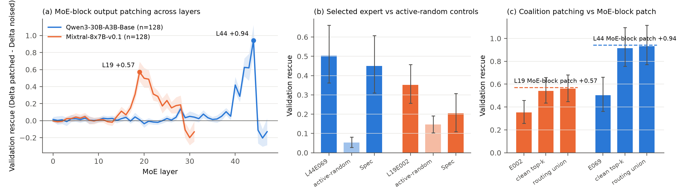
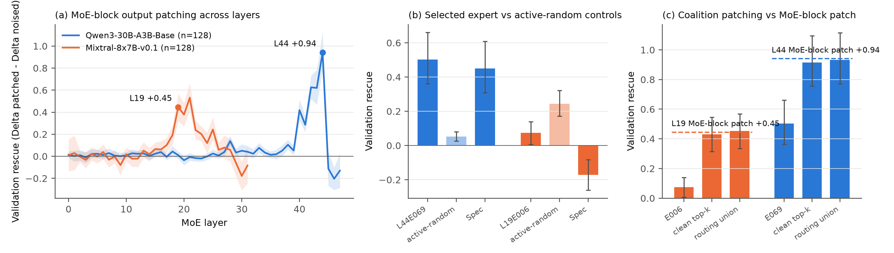

# Reproduction report: Expert-Aware Causal Tracing of Factual Recall in Sparse MoE Language Models (arXiv 2606.03780)

Generated automatically by the overnight agent (see logs/PROGRESS.md for the timeline). All numbers below are ours unless labelled paper.

## 1. Verdict

- **Qwen3-30B-A3B-Base** (paper case IDs): discovery selects **L44** (paper L44); validation layer rescue +0.941 [+0.778, +1.124] (paper +0.901). Recurrence-first selection picks **L44E069** (paper L44E069); validation expert rescue +0.503 [+0.362, +0.661] (paper +0.463), specificity +0.450 [+0.310, +0.608] (paper +0.400), sign-flip p = 0.0000.
- **Mixtral-8x7B-v0.1** (paper case IDs): discovery selects **L19** (paper L19); validation layer rescue +0.571 [+0.461, +0.692] (paper +0.457). Recurrence-first selection picks **L19E002** (paper L19E006); validation expert rescue +0.352 [+0.257, +0.458] (paper +0.099), specificity +0.205 [+0.109, +0.308] (paper -0.175), sign-flip p = 0.0002.
- **Mixtral-8x7B-v0.1 tokenised without BOS** (`results/mixtral_nobos`, paper case IDs; see section 6b): discovery selects **L19**; validation layer rescue +0.446 (paper +0.457); 249/256 paper IDs pass the strict filter (vs 233/256 with BOS). Recurrence-first selection picks **L19E006** (paper L19E006; sole candidate), clean-active in 91/128 discovery and 83/128 validation cases (paper 91/128 and 83/128); expert rescue +0.073 [+0.007, +0.140] (paper +0.099), specificity -0.171 [-0.262, -0.082] (paper -0.175); coalitions +0.431 / +0.454 (paper +0.461 / +0.490). **This run reproduces the paper's Mixtral result; the default-tokenisation run above does not, so the paper's Mixtral protocol evidently omitted the BOS token.**

Qualitative pattern of the paper: Qwen3's layer-level signal localises to one positive, specific expert; Mixtral's selected expert has negative specificity while routed coalitions recover the layer-level effect. See the tables below for whether each number falls inside the paper's CI.

## 2. What was run

Engine: a layer-streaming PyTorch executor (`moetrace/engine.py`) that keeps one decoder layer on the GPU, runs clean/noised prefill rows and single-token 'wavefront' rows for every intervention in the same pass, and builds intervention vectors in-pass from the recorded final-position expert contributions. One pass reads the full checkpoint once (Qwen3 61 GB about 60 s, Mixtral 93 GB about 95 s).

Passes per model: (1) filter scan in chunks of 1,024 tokenizable records; (2) layer sweep over the union of the paper's 256 IDs, our strict 256 and relaxed 512 (clean, noised, MoE-block patch at every layer, plus per-layer routing tables); (3) expert pass at the selected layer(s): every clean-active expert, every noised-only-active expert, all ordered equal-norm pairs, clean-top-k and routing-union coalitions, and the layer patch; (4) Qwen3 noise-scale pass (sigma multipliers 1, 2, 4); (5) verification passes. Row-level parquet files are under results/<model>/.

| log | pass |
|---|---|
| expert_mixtral.log | 1054 prefill rows (T=19), 3939 spawn rows, 89 s |
| expert_mixtral_alt.log | 512 prefill rows (T=19), 1908 spawn rows, 85 s |
| expert_mixtral_nobos.log | 512 prefill rows (T=18), 1954 spawn rows, 91 s |
| expert_qwen3_L44.log | 1056 prefill rows (T=18), 36847 spawn rows, 56 s |
| expert_qwen3_alt.log | 512 prefill rows (T=16), 17869 spawn rows, 52 s |
| filter_mixtral.log | 2048 prefill rows (T=23), 0 spawn rows, 98 s |
| filter_qwen3.log | 2048 prefill rows (T=18), 0 spawn rows, 65 s |
| funnel2_qwen3.log | 3292 prefill rows (T=18), 0 spawn rows, 54 s |
| funnel_qwen3.log | 1904 prefill rows (T=19), 0 spawn rows, 53 s |
| noise_qwen3.log | 1024 prefill rows (T=16), 3072 spawn rows, 56 s |
| sweep_mixtral.log | 1054 prefill rows (T=19), 16864 spawn rows, 95 s |
| sweep_mixtral_alt.log | 512 prefill rows (T=19), 8192 spawn rows, 85 s |
| sweep_mixtral_nobos.log | 512 prefill rows (T=18), 8192 spawn rows, 98 s |
| sweep_qwen3.log | 1056 prefill rows (T=18), 25344 spawn rows, 62 s |
| sweep_qwen3_alt.log | 512 prefill rows (T=16), 12288 spawn rows, 62 s |
| verify_olmoe.log | 100 prefill rows (T=14), 1421 spawn rows, 4 s |

## 3. Verification

**OLMoE-1B-7B-0125 pilot vs transformers 5.16.1 (bf16, eager attention), 50 CounterFact cases** (results/verify_olmoe.json):

| check | value |
|---|---|
| embed_std_engine | 0.0094 |
| embed_std_hf | 0.0094 |
| routing_set_agreement | 38/40 |
| top1_agreement_clean | 0.98 |
| delta_clean_maxdiff_vs_hf | 0.3828 |
| delta_clean_frac_within_0.1 | 0.72 |
| delta_noised_maxdiff_vs_hf | 0.6133 |
| delta_noised_frac_within_0.1 | 0.46 |
| layer_patch_vs_hf_n | 50 |
| layer_patch_vs_hf_maxdiff | 0.5781 |
| layer_patch_vs_hf_frac_within_0.1 | 0.58 |
| layer_rescue_vs_hf_maxdiff | 0.498 |
| expert_patch_vs_hf_n | 221 |
| expert_patch_vs_hf_maxdiff | 1.0742 |
| expert_patch_vs_hf_frac_within_0.1 | 0.3348 |
| zero_on_noised_maxdiff | 0.4062 |
| zero_on_clean_maxdiff | 0.125 |
| union_vs_layer_maxdiff | 0.0 |
| delta_bmm_vs_fullmatmul_frac_equal | 1.0 |
| pass_total_s | 3.7698 |

**bf16 noise floor (results/verify_olmoe_fp32.json, 12 cases; HF fp32 on CPU as ground truth):** the engine's bf16 error is the same size as HF's own bf16 error, and two HF attention backends differ from each other by as much as either differs from us.

| implementation | clean Delta: mean abs err / max | noised Delta: mean / max | L12 patch: mean / max | L12 rescue: mean / max |
|---|---|---|---|---|
| engine_bf16 | 0.057 / 0.109 | 0.146 / 0.555 | 0.183 / 0.702 | 0.153 / 0.286 |
| hf_bf16_eager | 0.041 / 0.114 | 0.213 / 0.466 | 0.137 / 0.345 | 0.175 / 0.616 |
| hf_bf16_sdpa | 0.070 / 0.198 | 0.178 / 0.450 | 0.117 / 0.363 | 0.186 / 0.614 |

Engine vs HF-eager max diffs: {"clean_max": 0.1875, "noised_max": 0.583984375, "patch_max": 0.720703125}; HF-eager vs HF-sdpa: {"clean_max": 0.1875, "noised_max": 0.47265625, "patch_max": 0.380859375}.

Interpretation: Delta is a difference of two bf16 logits of magnitude 10 to 30 (ulp 0.06 to 0.25); noised prompts amplify accumulation-order differences. Per-case rescue therefore carries roughly 0.1 to 0.6 of bf16 noise in any implementation (including the authors'); means over 128 cases carry about 0.02 to 0.05. The HANDOFF's expectation of |diff| < 0.1 on almost all prompts was too optimistic for noised prompts, and the same holds for HF against itself.

Internal invariances (by construction and checked in the pilot): sum of recorded expert contributions equals the fp32 block output; the routing-union coalition equals the MoE-block patch bit-for-bit; bmm and full-matmul logits agree on 100% of rows; a zero-vector wavefront row reproduces the parent's logits to within the bf16 floor above (not bit-exact because single-token rows use different matmul shapes than the prefill rows).

**Qwen3-30B-A3B-Base vs transformers with CPU/disk offload (5 validation prompts):** max |Delta diff| 0.250, mean 0.138, top-1 agreement 5/5.

| case | prompt | Delta engine | Delta HF | top-1 engine / HF | HF forward s |
|---|---|---|---|---|---|
| 11072 | Dominique Joseph Garat, a native | +11.562 | +11.438 | 315 / 315 | 22 |
| 636 | Old Trinity Church can be found in | +1.250 | +1.375 | 279 / 279 | 19 |
| 3463 | Gray Television, whose headquarters are in | +11.250 | +11.312 | 19440 / 19440 | 19 |
| 19770 | The language of The White Guard is | +3.000 | +2.875 | 264 / 264 | 18 |
| 16489 | The original language of Mouna Ragam was | +8.125 | +8.375 | 43783 / 43783 | 19 |

**Mixtral-8x7B-v0.1 vs transformers with CPU/disk offload (5 validation prompts):** max |Delta diff| 0.062, mean 0.013, top-1 agreement 5/5.

| case | prompt | Delta engine | Delta HF | top-1 engine / HF | HF forward s |
|---|---|---|---|---|---|
| 6515 | Guillaumes, which is located in | +9.312 | +9.375 | 272 / 272 | 61 |
| 15598 | Clifford Brown, who plays | +7.250 | +7.250 | 22945 / 22945 | 57 |
| 8024 | Google Patents, a product developed by | +6.250 | +6.250 | 6182 / 6182 | 56 |
| 18874 | LBi, that was created in | +2.875 | +2.875 | 28705 / 28705 | 56 |
| 3167 | Brian May, the | +9.750 | +9.750 | 10686 / 10686 | 57 |

## 4. Filtering funnel vs the paper's Table 8 case IDs

**Qwen3-30B-A3B-Base:** scanned 1048 shuffled records (1024 tokenizable, 24 rejected: {'multi_token': 24}); strict pass rate 0.80, relaxed 0.83. All 256 paper IDs lie within the first 390 records of our seed-0 shuffle (median rank 196), so the paper's record order is the same `random.Random(0).shuffle`. Paper IDs passing our strict filter: 235/256 (relaxed 240); overlap of the paper's 256 with our first-256 strict set: 195; with our relaxed 512: 240.

**Mixtral-8x7B-v0.1:** scanned 2034 shuffled records (1024 tokenizable, 1010 rejected: {'multi_token': 1010}); strict pass rate 0.86, relaxed 0.88. All 256 paper IDs lie within the first 581 records of our seed-0 shuffle (median rank 300), so the paper's record order is the same `random.Random(0).shuffle`. Paper IDs passing our strict filter: 233/256 (relaxed 241); overlap of the paper's 256 with our first-256 strict set: 230; with our relaxed 512: 241.

Why the paper kept only 256 of the first 390 Qwen3 records while about 80% of tokenizable records pass our filter: we tested object-token conventions over all 390 records (results/qwen3/funnel_hypotheses2.json). Agreement = fraction of records where (passes our filter) == (is a paper case):

| object-token rule | records defined | paper cases passing | non-paper passing | agreement | first-256 overlap with paper |
|---|---|---|---|---|---|
| continuation token with leading space (HANDOFF default, used for all main results) | 380 | 236/256 | 66/124 | 0.774 | 195 |
| first token of ' '+obj (no single-token filter) | 390 | 236/256 | 76/134 | 0.754 | 187 |
| first token of obj (no space) | 390 | 205/256 | 56/134 | 0.726 | 200 |
| tok(obj) if single token, else leading-space token | 390 | 252/256 | 16/134 | 0.949 | 241 |
| tok(obj) single token only (subset) | 96 | 74/75 | 2/21 | 0.969 | 74 |

The rule 'use tok(obj) when it is a single token, otherwise the leading-space token' reproduces the paper's case set far better (0.949) than the HANDOFF default (0.774). BOS handling made no difference (results/qwen3/funnel_hypotheses.json). We therefore believe the paper resolved object tokens without a leading space first. Because the primary case set is the paper's own IDs, this affects only which token pair defines Delta for the roughly 30% of cases whose objects are single tokens without a space; a secondary run with that rule is reported in section 6.

## 5. Paper vs ours, table by table

Paper numbers are copied from paper_src/acl_latex.tex. Bracketed intervals are 95% percentile-bootstrap CIs of the mean (5,000 resamples).

**Table 1: main validation results (128 held-out cases per model; paper case IDs)**

| Model | Layer (ours) | Layer rescue (ours) | Layer rescue (paper) | Expert (ours) | Expert (paper) | Expert rescue (ours) | Expert rescue (paper) | Spec (ours) | Spec (paper) |
|---|---|---|---|---|---|---|---|---|---|
| Qwen3-30B-A3B-Base | L44 (paper L44) | +0.941 [+0.778, +1.124] | +0.901 [+0.752, +1.053] | L44E069 | L44E069 | +0.503 [+0.362, +0.661] | +0.463 [+0.344, +0.590] | +0.450 [+0.310, +0.608] | +0.400 [+0.276, +0.533] |
| Mixtral-8x7B-v0.1 | L19 (paper L19) | +0.571 [+0.461, +0.692] | +0.457 [+0.331, +0.579] | L19E002 | L19E006 | +0.352 [+0.257, +0.458] | +0.099 [+0.018, +0.175] | +0.205 [+0.109, +0.308] | -0.175 [-0.284, -0.072] |

**Table 2: reproducibility protocol as implemented**

| Item | Setting (ours) |
|---|---|
| Record order | random.Random(0).shuffle over the 21,919 CounterFact records (verified: all paper IDs lie in the first 390/580 records) |
| Cases | Paper's Table 8 IDs (primary); our own strict 256 and relaxed 512 as secondary sets |
| Filtering | single-token true/foil (continuation tokenisation with leading space); clean margin >= 1.0; drop >= 0.5 (relaxed 0.5 / 0.25) |
| Subject noise | one Gaussian draw per case, torch.Generator seed 0 + case_id, scale 3.0 x embedding-matrix std (fp32), added to subject-token embeddings |
| Layer selection | argmax mean rescue over discovery cases; fixed on validation |
| Expert selection | clean-active in >= 64 of 128 discovery cases (half the split); highest all-case mean rescue |
| Active-random | Qwen3: 3 other clean-active experts sampled with random.Random(1000 + case_id); Mixtral: the unique other expert |
| Statistics | 5,000 percentile-bootstrap resamples (seed 0); 10,000 two-sided sign-flip samples (seed 0) |
| Precision | bf16 weights and activations (as HF), fp32 accumulation; Delta from bf16 logits |

**Table 3: selected-expert activity and zero-rescue rows**

| Model | Expert | Disc. active (ours) | Disc. (paper) | Val. active (ours) | Val. (paper) | Val. not-active rows | Val. exact-zero selected rows | Val. exact-zero selected+control rows | Zero (paper) |
|---|---|---|---|---|---|---|---|---|---|
| Qwen3-30B-A3B-Base | L44E069 | 114/128 | 112/128 | 116/128 | 116/128 | 12 | 35 | 200 | 26 |
| Mixtral-8x7B-v0.1 | L19E002 | 76/128 | 91/128 | 84/128 | 83/128 | 44 | 51 | 82 | 54 |

_Note:_ Zero rows: the paper reports one count (26 / 54) whose definition is not stated; we report the number of validation cases where the selected expert is not clean-active, the number of selected-expert rows with exactly zero rescue (not-active plus bf16-quantised zeros), and the same count over selected plus control rows.

**Table 4: most frequent retained relations (256 cases)**

| Model | Case set | Most frequent relations (ours) | Paper |
|---|---|---|---|
| Qwen3-30B-A3B-Base | paper | P17:21, P103:16, P136:14, P178:13, P27:13, P131:12, P159:12, P30:12, P20:11, P176:11, P740:9, P364:9 | P17:21, P103:16, P136:14, P178:13, P27:13, P131:12, P159:12, P30:12, P20:11, P176:11, P740:9, P364:9 |
| Qwen3-30B-A3B-Base | strict | P17:21, P103:18, P140:13, P178:12, P136:12, P20:11, P27:11, P159:11, P176:11, P131:10, P1412:10, P30:10 |  |
| Mixtral-8x7B-v0.1 | paper | P17:28, P103:26, P27:16, P178:15, P136:15, P495:15, P740:15, P1412:14, P106:14, P131:11, P20:10, P364:9 | P17:28, P103:26, P27:16, P178:15, P495:15, P136:15, P740:15, P106:14, P1412:14, P131:11, P20:10, P364:9 |
| Mixtral-8x7B-v0.1 | strict | P17:30, P103:24, P27:16, P495:16, P740:16, P178:14, P1412:14, P106:14, P136:13, P131:11, P159:10, P20:9 |  |

**Table 5: relation-wise expert-level validation (paper case set)**

| Model | Relation | n | Expert rescue | Spec | Pos. frac. | n (paper) | Rescue (paper) | Spec (paper) | Pos. (paper) |
|---|---|---|---|---|---|---|---|---|---|
| Qwen3-30B-A3B-Base | P103 | 12 | +0.521 | +0.531 | 0.83 | 12 | +0.427 | +0.406 | 0.83 |
| Qwen3-30B-A3B-Base | P27 | 9 | +0.486 | +0.412 | 0.67 | 9 | +0.826 | +0.780 | 1.00 |
| Qwen3-30B-A3B-Base | P136 | 7 | +0.045 | -0.045 | 0.43 | 7 | +0.018 | -0.000 | 0.57 |
| Qwen3-30B-A3B-Base | P131 | 6 | +1.760 | +1.670 | 1.00 | 6 | +1.240 | +1.160 | 0.83 |
| Qwen3-30B-A3B-Base | P1412 | 6 | +0.125 | +0.097 | 0.33 | 6 | +0.198 | +0.163 | 0.67 |
| Qwen3-30B-A3B-Base | P17 | 6 | +0.979 | +0.951 | 1.00 | 6 | +1.073 | +0.910 | 0.67 |
| Qwen3-30B-A3B-Base | P30 | 6 | +0.375 | +0.389 | 0.50 | 6 | +0.292 | +0.312 | 0.50 |
| Qwen3-30B-A3B-Base | P413 | 6 | -0.031 | -0.035 | 0.17 | 6 | +0.042 | -0.174 | 0.17 |
| Qwen3-30B-A3B-Base | P19 | 5 | +0.825 | +0.662 | 0.80 |  |  |  |  |
| Qwen3-30B-A3B-Base | P176 | 5 | +0.138 | -0.004 | 0.40 |  |  |  |  |
| Mixtral-8x7B-v0.1 | P103 | 12 | +0.021 | -0.156 | 0.08 | 12 | +0.312 | +0.206 | 0.67 |
| Mixtral-8x7B-v0.1 | P17 | 11 | +0.523 | +0.483 | 0.91 | 11 | +0.187 | -0.272 | 0.09 |
| Mixtral-8x7B-v0.1 | P495 | 9 | +0.444 | +0.368 | 0.44 | 9 | +0.094 | -0.358 | 0.11 |
| Mixtral-8x7B-v0.1 | P136 | 9 | +0.528 | +0.076 | 0.78 | 9 | +0.111 | -0.562 | 0.11 |
| Mixtral-8x7B-v0.1 | P1412 | 9 | -0.014 | +0.042 | 0.00 | 9 | +0.031 | -0.076 | 0.33 |
| Mixtral-8x7B-v0.1 | P178 | 9 | +0.083 | -0.194 | 0.56 | 9 | +0.000 | -0.368 | 0.00 |
| Mixtral-8x7B-v0.1 | P740 | 9 | +0.569 | +0.444 | 0.78 | 9 | +0.146 | -0.167 | 0.56 |
| Mixtral-8x7B-v0.1 | P27 | 9 | +1.014 | +0.764 | 0.89 | 9 | +0.049 | -0.132 | 0.22 |
| Mixtral-8x7B-v0.1 | P106 | 7 | -0.036 | -0.018 | 0.00 | 7 | +0.223 | +0.179 | 0.71 |
| Mixtral-8x7B-v0.1 | P131 | 6 | +0.448 | +0.302 | 0.83 | 6 | -0.016 | -0.557 | 0.00 |

**Table 6: layer-sweep sharpness on validation cases**

| Model | Top layer | Top rescue | Next layer | Next rescue | Gap | Top (paper) | Rescue (paper) | Next (paper) | Next rescue (paper) | Gap (paper) |
|---|---|---|---|---|---|---|---|---|---|---|
| Qwen3-30B-A3B-Base | L44 | +0.941 | L42 | +0.625 | +0.316 | L44 | +0.901 | L42 | +0.592 | +0.309 |
| Mixtral-8x7B-v0.1 | L19 | +0.571 | L20 | +0.498 | +0.074 | L21 | +0.496 | L19 | +0.457 | +0.038 |

**Table 7: expert-level effects relative to selected-layer rescue**

| Model | Quantity | Ours | Paper |
|---|---|---|---|
| Qwen3-30B-A3B-Base | Layer rescue | +0.941 | +0.901 |
| Qwen3-30B-A3B-Base | Expert/layer | +0.534 [+0.428, +0.633] | +0.515 [+0.411, +0.613] |
| Qwen3-30B-A3B-Base | Spec/layer | +0.478 [+0.358, +0.591] | +0.444 [+0.323, +0.560] |
| Mixtral-8x7B-v0.1 | Layer rescue | +0.571 | +0.457 |
| Mixtral-8x7B-v0.1 | Expert/layer | +0.615 [+0.517, +0.705] | +0.216 [+0.044, +0.388] |
| Mixtral-8x7B-v0.1 | Spec/layer | +0.359 [+0.211, +0.495] | -0.383 [-0.645, -0.159] |

**Table 8: our own case sets (paper IDs are in data/paper_case_ids.json)**

| Model | Set | Split | n | Overlap with paper IDs | Case IDs |
|---|---|---|---|---|---|
| Qwen3-30B-A3B-Base | strict | discovery | 128 | 91 | 3799, 1930, 21889, 1750, 3371, 5917, 4176, 6655, 19607, 13332, 18255, 5524, 5922, 5004, 18704, 17365, 7190, 3703, 21176, 17135, 4690, 17600, 13909, 1755, 7937, 21063, 8209, 18365, 2500, 4380, 14704, 19178, 4868, 9983, 17654, 20598, 573, 17375, 636, 7037, 3680, 8894, 12398, 21751, 6098, 18677, 17390, 11072, 483, 1464, 9035, 7082, 3722, 9828, 10963, 8830, 4233, 14540, 12914, 12062, 1062, 8808, 7561, 12644, 21232, 14427, 7259, 12462, 8838, 19242, 3161, 6985, 12014, 20702, 10719, 3078, 8167, 16373, 3550, 7515, 8298, 14817, 6467, 6103, 3521, 14910, 5451, 1792, 7255, 12124, 11630, 19443, 934, 19814, 8143, 3463, 12143, 6615, 10177, 988, 9544, 11885, 21243, 19965, 6329, 8097, 9690, 20772, 11330, 13254, 13739, 9637, 396, 5703, 11062, 4626, 4381, 14584, 17169, 13935, 9739, 4195, 3960, 14176, 2320, 10851, 19429, 17685 |
| Qwen3-30B-A3B-Base | strict | validation | 128 | 104 | 14063, 709, 10711, 14875, 8024, 4138, 7484, 19616, 3468, 11552, 17735, 6804, 21698, 4145, 9949, 2572, 17078, 6002, 10618, 11111, 10691, 13953, 17524, 17370, 19969, 9859, 5203, 12619, 18014, 10862, 20936, 10274, 20471, 20207, 6022, 9329, 14059, 12946, 12224, 6564, 15598, 19146, 21258, 18202, 9599, 14644, 11678, 3211, 3774, 16381, 9128, 1726, 799, 4852, 1068, 4082, 7997, 4046, 2377, 7420, 12593, 21412, 734, 11405, 5255, 6143, 17663, 15198, 21149, 536, 7128, 12106, 943, 7106, 7289, 6970, 7544, 19918, 12440, 6997, 7953, 1759, 6840, 17074, 9811, 16988, 16086, 5736, 21076, 4312, 494, 17311, 3858, 21904, 2262, 10321, 15369, 6494, 15277, 11016, 12008, 12783, 4988, 6506, 14789, 14898, 12424, 15773, 10950, 11566, 14387, 9007, 21036, 7805, 6992, 13007, 7178, 11360, 8362, 15960, 8007, 20189, 1642, 21830, 17562, 17020, 4127, 6239 |
| Qwen3-30B-A3B-Base | relaxed | discovery | 256 | 125 | 472, 12014, 4852, 14817, 19828, 241, 13370, 21063, 18874, 19146, 12946, 17135, 1425, 2500, 1017, 10894, 15960, 8360, 18365, 18926, 4988, 14164, 15369, 20924, 14704, 2572, 19242, 19443, 1131, 5203, 9312, 11062, 483, 2917, 17790, 21618, 7970, 4127, 13915, 10114, 9983, 17370, 7255, 840, 11016, 16555, 9007, 20042, 12593, 15024, 8362, 17375, 9599, 6840, 21258, 7001, 16086, 21751, 16428, 4138, 21322, 8097, 7805, 15198, 636, 3703, 3799, 7937, 12377, 13739, 3161, 14540, 20021, 9060, 4381, 12802, 5553, 5825, 20326, 6364, 3960, 79, 7367, 9371, 10180, 943, 18936, 16373, 20764, 5451, 17685, 17311, 14320, 19814, 14783, 12008, 17688, 396, 12405, 11552, 9329, 9949, 7997, 15957, 14816, 3133, 4085, 14176, 13643, 7484, 9811, 16419, 13332, 2052, 9019, 21273, 5996, 7259, 4710, 1062, 11661, 7124, 3680, 15937, 3550, 3167, 7953, 11484, 20207, 422, 21698, 16490, 4626, 15417, 6734, 3243, 14541, 15773, 16924, 8395, 10177, 3078, 1480, 1930, 1750, 3468, 6002, 6103, 18966, 21830, 7515, 5255, 5917, 6076, 4046, 4965, 5703, 1726, 4969, 17169, 1642, 6615, 8339, 12619, 14910, 3774, 8937, 10258, 2227, 20936, 3037, 19277, 20878, 18677, 6506, 3858, 573, 6239, 13814, 3211, 6098, 8209, 9828, 5524, 4176, 20471, 4928, 7128, 5341, 19110, 20772, 6655, 16722, 13810, 4346, 21243, 8298, 3496, 21904, 9690, 6804, 20981, 21149, 14726, 5098, 15234, 12644, 11111, 7106, 9637, 4311, 3664, 6515, 4942, 9074, 16081, 4366, 6464, 9998, 10719, 11327, 19042, 2835, 12222, 13727, 11885, 18255, 7190, 6142, 15519, 17562, 15115, 18590, 17710, 19004, 1759, 12062, 1068, 5004, 4065, 19154, 5325, 10862, 15166, 10691, 228, 4195, 7544, 4145, 7787, 9467, 3848, 16732, 12143, 16988, 6869 |
| Qwen3-30B-A3B-Base | relaxed | validation | 256 | 115 | 925, 10963, 1664, 8366, 4690, 10711, 13074, 2457, 7037, 1755, 4730, 6564, 3469, 14063, 14805, 20702, 8604, 7178, 15267, 3722, 5736, 20814, 799, 13058, 17226, 17524, 2320, 6992, 8830, 15303, 14644, 17020, 20725, 12329, 18704, 7172, 19232, 13340, 11072, 9035, 15480, 934, 21176, 6143, 14029, 9128, 12410, 16778, 10130, 11787, 734, 10139, 19770, 14705, 11330, 11566, 8885, 1695, 17365, 6467, 11361, 494, 13349, 6494, 15983, 4461, 8894, 3026, 1707, 14781, 16844, 5470, 12398, 2070, 10530, 633, 10097, 14979, 536, 20270, 19616, 10184, 8929, 9739, 16653, 12914, 17663, 4380, 5173, 8007, 10618, 9885, 13354, 6997, 1043, 19189, 11360, 10950, 12120, 11567, 13935, 17735, 6332, 5672, 17232, 13768, 2377, 21889, 16489, 15598, 20312, 15314, 6329, 6970, 14875, 7289, 17654, 15995, 4868, 12530, 6498, 10806, 13106, 8808, 14898, 7420, 13043, 7082, 12424, 14584, 307, 7152, 10914, 4082, 17074, 21036, 988, 12106, 17600, 17885, 10321, 14059, 12046, 868, 4312, 16381, 14559, 20004, 11175, 20575, 20762, 4347, 18640, 5922, 16739, 19918, 16625, 14427, 12440, 8024, 6985, 13254, 10851, 19178, 9544, 1915, 15820, 8143, 17500, 709, 17565, 256, 8167, 4233, 386, 12783, 436, 1792, 3371, 16403, 19607, 2894, 11405, 15422, 11933, 13975, 9891, 21457, 12462, 10211, 2810, 17390, 19965, 2269, 8607, 12224, 21412, 19429, 11643, 18014, 21559, 16189, 3521, 4055, 18848, 3463, 13007, 9859, 2903, 20407, 14387, 21232, 2013, 2085, 4401, 2262, 21586, 13909, 10274, 20598, 10757, 595, 21128, 19836, 2331, 14419, 17078, 12169, 14407, 13953, 3248, 12717, 15277, 1464, 12124, 8838, 14905, 4972, 18003, 21076, 7561, 16550, 19969, 11298, 10964, 15612, 11630, 14789, 20189, 12277, 18202, 11678, 6022, 20137, 17409, 19697 |
| Mixtral-8x7B-v0.1 | strict | discovery | 128 | 120 | 4626, 13332, 14789, 5553, 15480, 1642, 14726, 7970, 3167, 13643, 228, 16381, 15198, 17654, 17735, 7259, 10964, 1425, 15983, 13106, 8298, 4928, 12593, 6734, 9891, 10177, 988, 4312, 9312, 6506, 18704, 6564, 19836, 11330, 7787, 8007, 13814, 18874, 1750, 17521, 20598, 15087, 13739, 14387, 7152, 3243, 14644, 11298, 13043, 1792, 4972, 20936, 6467, 6515, 16844, 6103, 8097, 3848, 20702, 5331, 19429, 5703, 4065, 11072, 12329, 2331, 15422, 2810, 9828, 17078, 14419, 4401, 5130, 2269, 19189, 14320, 20471, 20575, 7953, 3722, 6022, 6002, 12014, 1930, 17370, 10963, 11361, 7190, 12062, 16625, 10180, 19154, 12783, 7172, 9690, 20042, 10211, 10618, 10862, 5255, 6498, 19146, 21258, 12398, 3078, 5203, 16732, 10851, 483, 6833, 13909, 6464, 9811, 10950, 4381, 7128, 14407, 13768, 12946, 9077, 3026, 9329, 5173, 11188, 5004, 19242, 4366, 307 |
| Mixtral-8x7B-v0.1 | strict | validation | 128 | 110 | 10806, 14540, 6655, 12802, 14705, 8362, 4311, 21412, 8024, 18611, 4055, 11678, 4409, 16879, 13935, 12224, 20397, 21273, 494, 15715, 20326, 12914, 21618, 20270, 20762, 15519, 21076, 8937, 5825, 17510, 7289, 3469, 19770, 10139, 17409, 12124, 5325, 21592, 12440, 10711, 3248, 20137, 1068, 20207, 6142, 10274, 19422, 4710, 9739, 6985, 5922, 4380, 15166, 3211, 5736, 18677, 16403, 12619, 12169, 14817, 17592, 7997, 1480, 11405, 16490, 15328, 13349, 21149, 12530, 13915, 17549, 9599, 8830, 15267, 11360, 15369, 16722, 19004, 11062, 1707, 256, 9007, 15598, 3371, 15995, 14875, 9544, 3463, 2052, 10530, 4145, 6076, 19178, 4852, 21063, 20924, 1695, 18920, 19607, 6840, 14541, 20312, 7082, 21457, 11643, 21889, 8894, 12143, 3521, 10258, 8360, 1915, 6997, 2377, 1062, 19232, 6332, 3133, 3960, 17135, 1664, 10757, 17600, 4988, 18188, 13354, 18645, 16555 |
| Mixtral-8x7B-v0.1 | relaxed | discovery | 256 | 130 | 952, 19178, 13814, 15598, 4840, 15026, 7043, 8298, 14836, 4401, 6332, 10139, 1821, 13643, 7959, 5020, 7997, 13120, 9544, 937, 13915, 16494, 1695, 79, 5203, 18677, 21412, 20270, 12143, 21076, 5918, 4381, 12530, 21254, 15576, 18178, 14639, 2810, 9077, 9107, 8362, 13349, 12062, 4121, 17600, 2138, 8937, 2917, 17592, 4852, 3078, 19074, 4366, 15369, 5130, 8413, 2377, 1750, 19243, 14817, 12331, 15166, 17135, 3960, 8024, 16555, 4626, 8360, 14283, 1068, 12802, 3848, 13949, 21276, 15422, 14445, 19456, 12836, 6548, 727, 5325, 16033, 13672, 10609, 5932, 11188, 843, 6142, 473, 19154, 16625, 5173, 12107, 15328, 14330, 14541, 14790, 20207, 13541, 18611, 19004, 10851, 10211, 7627, 16470, 20005, 9891, 13739, 12520, 4311, 6734, 12470, 12329, 16635, 13354, 20446, 19020, 5331, 13292, 3211, 6797, 18864, 19242, 11859, 7953, 6192, 20312, 5648, 11298, 7222, 21063, 6312, 7128, 16350, 10078, 988, 7604, 14789, 15805, 8139, 6022, 19836, 4271, 13332, 7970, 19146, 21273, 1930, 1338, 11678, 3722, 15480, 11016, 4775, 12619, 15252, 16879, 10177, 13340, 10862, 9690, 10618, 2732, 20924, 10963, 4928, 1017, 2620, 17655, 10711, 17728, 12717, 249, 6103, 18645, 7082, 2269, 10180, 17983, 5470, 18920, 11062, 21457, 16381, 6076, 21618, 19232, 17549, 18224, 7152, 19422, 16722, 7435, 15990, 13023, 12014, 9739, 9217, 5004, 20397, 494, 12263, 14726, 4932, 4242, 5285, 1664, 4972, 18874, 6464, 15248, 9043, 10726, 6358, 17642, 19194, 8943, 14099, 20695, 5825, 12280, 6226, 8878, 21593, 12464, 9599, 14407, 19189, 11480, 17788, 6002, 382, 3521, 4589, 7787, 9007, 10097, 12914, 20762, 1756, 17344, 14131, 17510, 483, 14783, 15714, 2900, 20575, 8097, 14678, 8285, 13798, 12169, 5553, 2331, 12479 |
| Mixtral-8x7B-v0.1 | relaxed | validation | 256 | 111 | 9605, 15519, 11750, 17364, 1792, 12124, 19588, 2431, 4409, 16403, 3496, 9329, 20878, 14320, 16864, 20042, 21050, 241, 5536, 6467, 3463, 17174, 11330, 11864, 13810, 7172, 1062, 19918, 13909, 18554, 10274, 4065, 6308, 6909, 17735, 20355, 9201, 9460, 13768, 10757, 17023, 12783, 10964, 16844, 10604, 8894, 7892, 3962, 8181, 12154, 1480, 8361, 18841, 20599, 21149, 14705, 13432, 21041, 7259, 4988, 8162, 12224, 9851, 20326, 12252, 12193, 15198, 7286, 11002, 19409, 244, 5575, 21258, 6024, 19220, 2227, 16957, 11711, 13935, 15072, 8007, 3968, 18415, 3026, 9305, 20702, 13043, 18188, 811, 11360, 12398, 19848, 10423, 19770, 19529, 21403, 15715, 15087, 16763, 10718, 17521, 2052, 18070, 7820, 11512, 5887, 13106, 6655, 5188, 3248, 2522, 13090, 9828, 14540, 17790, 19607, 422, 3307, 6515, 17009, 6445, 14889, 20255, 4145, 7289, 6840, 5657, 20598, 10950, 11643, 3649, 15028, 4976, 8830, 3371, 6997, 5255, 14875, 4312, 8502, 256, 10806, 3217, 10037, 6498, 19429, 6219, 2653, 19040, 7760, 10184, 14536, 5269, 4380, 12667, 17654, 2959, 1915, 18704, 307, 14419, 9312, 1642, 20936, 15995, 21559, 19707, 15960, 3005, 7190, 12946, 20211, 20471, 12440, 15537, 16490, 15485, 16732, 228, 4109, 20137, 16359, 11405, 5518, 17270, 9807, 6071, 10620, 1425, 17498, 3214, 6564, 21243, 10623, 14022, 3243, 14387, 4710, 6839, 10530, 13142, 5098, 17370, 564, 3884, 6833, 15983, 4055, 12593, 12120, 10258, 1707, 8527, 8637, 12897, 5922, 6253, 5736, 11073, 21889, 8605, 17326, 7664, 8796, 10130, 3448, 9811, 1751, 1663, 14644, 20763, 17611, 6985, 17078, 156, 6506, 7412, 16393, 3753, 11361, 3133, 2336, 3469, 8053, 10219, 15662, 21592, 3167, 15267, 191, 11072, 5703, 17409, 18752, 11341, 10510 |

_Note:_ Our strict/relaxed sets are the first 256/512 records passing the respective filter in the seed-0 order (split with random.Random(0)); the paper's IDs are in data/paper_case_ids.json.

**Table 9: Qwen3 gate-weight-matched and equal-norm control (validation cases where the selected expert is clean-active)**

| Quantity | Raw (ours) | Equal-norm (ours) | Raw (paper) | Equal-norm (paper) |
|---|---|---|---|---|
| Selected rescue | +0.555 [+0.404, +0.725] | +0.247 [+0.183, +0.318] | +0.513 [+0.383, +0.651] | +0.239 [+0.177, +0.302] |
| Matched control | +0.054 [+0.018, +0.089] | +0.046 [+0.014, +0.077] | +0.054 [+0.017, +0.091] | +0.051 [+0.016, +0.086] |
| Specificity | +0.501 [+0.344, +0.679] | +0.202 [+0.129, +0.281] | +0.459 [+0.322, +0.607] | +0.188 [+0.119, +0.259] |
| n cases | 116 | 116 | 116 | 116 |

**Table 10: Qwen3 selected-expert rank among all clean-active experts**

| Metric | Ours | Paper |
|---|---|---|
| Ranked validation cases | 116 | 115 |
| Top-1 among active experts | 61 / 116 | 53 / 115 |
| Top-2 among active experts | 82 / 116 | 74 / 115 |
| Mean rank | 2.47 | 2.9 |
| Mean percentile | 0.79 | 0.73 |
| Selected minus all-other active | +0.491 [+0.339, +0.661] | +0.441 [+0.309, +0.584] |

**Table 11: Mixtral active-pair equal-norm check (anchor-active validation cases)**

| Metric | n (ours) | Ours | n (paper) | Paper |
|---|---|---|---|---|
| Raw active-pair specificity | 84 | +0.399 [+0.276, +0.532] | 83 | -0.081 [-0.214, +0.042] |
| Selected equal-norm rescue | 84 | +0.183 [+0.129, +0.242] | 83 | +0.046 [-0.007, +0.096] |
| Other active expert equal-norm rescue | 84 | +0.118 [+0.074, +0.163] | 83 | +0.108 [+0.047, +0.172] |
| Equal-norm active-pair specificity | 84 | +0.065 [+0.023, +0.110] | 83 | -0.062 [-0.130, -0.003] |

**Table 12: relation-held-out expert-selection check (5 relation folds)**

| Model | Metric | Ours | Paper |
|---|---|---|---|
| Qwen3-30B-A3B-Base | Folds | 5 | 5 |
| Qwen3-30B-A3B-Base | Selected L44E069 | 5 / 5 | 5 / 5 |
| Qwen3-30B-A3B-Base | Held-out cases | 256 | 256 |
| Qwen3-30B-A3B-Base | Active cases | 230 / 256 | 229 / 256 |
| Qwen3-30B-A3B-Base | Rescue | +0.485 [+0.389, +0.593] | +0.443 [+0.343, +0.545] |
| Qwen3-30B-A3B-Base | Specificity | +0.434 [+0.335, +0.541] | +0.388 [+0.297, +0.484] |
| Qwen3-30B-A3B-Base | Per-fold selections | E069, E069, E069, E069, E069 |  |
| Mixtral-8x7B-v0.1 | Folds | 5 |  |
| Mixtral-8x7B-v0.1 | Selected L19E002 | 5 / 5 |  |
| Mixtral-8x7B-v0.1 | Held-out cases | 256 |  |
| Mixtral-8x7B-v0.1 | Active cases | 160 / 256 |  |
| Mixtral-8x7B-v0.1 | Rescue | +0.361 [+0.286, +0.442] |  |
| Mixtral-8x7B-v0.1 | Specificity | +0.191 [+0.114, +0.273] |  |
| Mixtral-8x7B-v0.1 | Per-fold selections | E002, E002, E002, E002, E002 |  |

_Note:_ Relation folds: relation ids shuffled with random.Random(0) and dealt round-robin into 5 folds; selection threshold = half of the selection cases; the paper's fold assignment is unknown.

**Appendix D: expert-selection stability grid**

| Model | Selection stability (seeds 0-4 x thresholds 32,48,64,80,96) | Mean val rescue | Mean val spec | Selected experts | Paper selected | Paper rescue | Paper spec |
|---|---|---|---|---|---|---|---|
| Qwen3-30B-A3B-Base | E069 selected in 25/25 settings | +0.491 | +0.439 | {"E069": 25} | 25/25 | +0.398 | +0.344 |
| Mixtral-8x7B-v0.1 | E002 selected in 17/25 settings | +0.359 | +0.199 | {"E002": 17} |  |  |  |

_Note:_ Splits for the stability grid use random.Random(seed).shuffle over the paper's 256 IDs; the paper's split function is unknown, so individual cells differ while the selected expert can be compared.

**Table 13: Qwen3 fixed-hypothesis noise-scale sensitivity for L44E069 (validation cases)**

| sigma | Active | Drop | Rescue | Pos. | Active (paper) | Drop (paper) | Rescue (paper) | Pos. (paper) |
|---|---|---|---|---|---|---|---|---|
| 1.0 | 117/128 | +1.364 | +0.095 [+0.033, +0.163] | 0.41 | 115/128 | +1.259 | +0.098 [+0.040, +0.165] | 0.43 |
| 2.0 | 117/128 | +4.809 | +0.439 [+0.319, +0.570] | 0.62 | 115/128 | +4.909 | +0.406 [+0.280, +0.546] | 0.55 |
| 3.0 | 116/128 | +5.623 | +0.503 [+0.362, +0.661] | 0.62 | 115/128 | +5.697 | +0.459 [+0.339, +0.587] | 0.66 |
| 4.0 | 117/128 | +5.955 | +0.507 [+0.380, +0.644] | 0.65 | 115/128 | +6.004 | +0.478 [+0.356, +0.605] | 0.67 |

_Note:_ sigma = 3.0 row comes from the main expert pass (same rows as Table 1); other rows from the noise pass; Active = validation cases where L44E069 is clean-active (independent of sigma).

**Table 14: relaxed-filter scale-up (512 cases: margin >= 0.5, drop >= 0.25; 256 discovery / 256 validation)**

| Model | Layer | Layer rescue | Paper | Expert | Paper expert | Disc. active | Paper | Expert rescue | Paper | Spec | Paper |
|---|---|---|---|---|---|---|---|---|---|---|---|
| Qwen3-30B-A3B-Base | L44 | +0.791 [+0.668, +0.909] | +0.846 [+0.760, +0.934] | L44E069 | L44E069 | 228/256 | 230/256 | +0.418 [+0.322, +0.524] | +0.454 [+0.367, +0.545] | +0.365 [+0.264, +0.473] | +0.413 [+0.318, +0.511] |
| Mixtral-8x7B-v0.1 | L19 | +0.600 [+0.523, +0.685] | +0.421 [+0.352, +0.489] | L19E002 | L19E006 | 166/256 | 174/256 | +0.357 [+0.288, +0.433] | +0.114 [+0.041, +0.187] | +0.175 [+0.103, +0.252] | -0.155 [-0.247, -0.067] |

_Note:_ Relaxed set = first 512 records passing (margin >= 0.5, drop >= 0.25) in the seed-0 order, split 256/256 with random.Random(0), recurrence threshold 128.

**Table 15: relaxed-filter validation split by overlap with the strict set**

| Model | Subset | n_L | Layer | n_E | Expert | Spec | n_L (paper) | Layer (paper) | n_E (paper) | Expert (paper) | Spec (paper) |
|---|---|---|---|---|---|---|---|---|---|---|---|
| Qwen3-30B-A3B-Base | All relaxed val. | 256 | +0.791 [+0.668, +0.909] | 256 | +0.418 [+0.322, +0.524] | +0.365 [+0.264, +0.473] | 256 | +0.833 [+0.714, +0.962] | 137 | +0.400 [+0.293, +0.516] | +0.360 [+0.239, +0.487] |
| Qwen3-30B-A3B-Base | Relaxed-new val. (not in paper set) | 141 | +0.542 [+0.406, +0.690] | 141 | +0.275 [+0.166, +0.387] | +0.232 [+0.117, +0.346] | 241 | +0.860 [+0.739, +0.989] | 130 | +0.420 [+0.310, +0.541] | +0.380 [+0.259, +0.509] |
| Qwen3-30B-A3B-Base | All relaxed val. | 256 | +0.791 [+0.668, +0.909] | 256 | +0.418 [+0.322, +0.524] | +0.365 [+0.264, +0.473] |  |  |  |  |  |
| Qwen3-30B-A3B-Base | Relaxed-new val. (not in strict set) | 133 | +0.645 [+0.492, +0.805] | 133 | +0.342 [+0.227, +0.462] | +0.298 [+0.178, +0.422] |  |  |  |  |  |
| Mixtral-8x7B-v0.1 | All relaxed val. | 256 | +0.600 [+0.523, +0.685] | 256 | +0.357 [+0.288, +0.433] | +0.175 [+0.103, +0.252] | 256 | +0.454 [+0.360, +0.557] | 137 | +0.119 [-0.003, +0.240] | -0.124 [-0.270, +0.014] |
| Mixtral-8x7B-v0.1 | Relaxed-new val. (not in paper set) | 145 | +0.563 [+0.466, +0.667] | 145 | +0.318 [+0.231, +0.412] | +0.144 [+0.053, +0.243] | 241 | +0.459 [+0.360, +0.561] | 130 | +0.123 [-0.010, +0.250] | -0.128 [-0.280, +0.014] |
| Mixtral-8x7B-v0.1 | All relaxed val. | 256 | +0.600 [+0.523, +0.685] | 256 | +0.357 [+0.288, +0.433] | +0.175 [+0.103, +0.252] |  |  |  |  |  |
| Mixtral-8x7B-v0.1 | Relaxed-new val. (not in strict set) | 139 | +0.566 [+0.466, +0.673] | 139 | +0.318 [+0.229, +0.415] | +0.132 [+0.037, +0.231] |  |  |  |  |  |

_Note:_ The paper reports only 15 of 256 relaxed validation cases overlapping its strict set; with a single shuffled scan, the strict 256 are necessarily a large subset of the first 512 relaxed cases, so the paper must have built its relaxed set from a different record order. We report the split against both the paper's IDs and our strict set. n_E in the paper (137/130) is unexplained; ours uses all validation cases.

**Table 16: multi-expert coalition patching at the selected layer (validation cases)**

| Model | Patch | Rescue (ours) | Pos. frac. (ours) | Rescue (paper) | Pos. frac. (paper) |
|---|---|---|---|---|---|
| Qwen3-30B-A3B-Base | Clean top-8 coalition | +0.916 [+0.756, +1.096] | 0.85 |  |  |
| Qwen3-30B-A3B-Base | Routing-union coalition | +0.932 [+0.771, +1.116] | 0.86 |  |  |
| Qwen3-30B-A3B-Base | L44 MoE-block patch (same pass) | +0.932 [+0.771, +1.116] | 0.86 |  |  |
| Mixtral-8x7B-v0.1 | Clean top-2 coalition | +0.542 [+0.435, +0.658] | 0.79 | +0.461 [+0.343, +0.572] | 0.75 |
| Mixtral-8x7B-v0.1 | Routing-union coalition | +0.560 [+0.449, +0.680] | 0.77 | +0.490 [+0.367, +0.613] | 0.75 |
| Mixtral-8x7B-v0.1 | L19 MoE-block patch (same pass) | +0.560 [+0.449, +0.680] | 0.77 |  |  |

_Note:_ Coalition rows for Qwen3 are an extra (the paper reports Mixtral only). The routing-union coalition equals the MoE-block patch exactly; the same-pass layer patch is shown for reference (the sweep-pass value differs only by bf16 noise).

**All case sets: layer and expert selections**

| Model | Case set | n disc | n val | L* | Layer rescue (val) | e* | # candidates | Expert rescue (val) | Spec (val) | Val active |
|---|---|---|---|---|---|---|---|---|---|---|
| Qwen3-30B-A3B-Base | paper | 128 | 128 | L44 | +0.941 [+0.778, +1.124] | E069 | 5 | +0.503 [+0.362, +0.661] | +0.450 [+0.310, +0.608] | 116/128 |
| Qwen3-30B-A3B-Base | strict | 128 | 128 | L44 | +0.921 [+0.735, +1.119] | E069 | 5 | +0.475 [+0.325, +0.645] | +0.420 [+0.267, +0.589] | 116/128 |
| Qwen3-30B-A3B-Base | relaxed | 256 | 256 | L44 | +0.791 [+0.668, +0.909] | E069 | 5 | +0.418 [+0.322, +0.524] | +0.365 [+0.264, +0.473] | 235/256 |
| Mixtral-8x7B-v0.1 | paper | 128 | 128 | L19 | +0.571 [+0.461, +0.692] | E002 | 2 | +0.352 [+0.257, +0.458] | +0.205 [+0.109, +0.308] | 84/128 |
| Mixtral-8x7B-v0.1 | strict | 128 | 128 | L19 | +0.635 [+0.514, +0.766] | E002 | 2 | +0.404 [+0.297, +0.524] | +0.258 [+0.149, +0.379] | 90/128 |
| Mixtral-8x7B-v0.1 | relaxed | 256 | 256 | L19 | +0.600 [+0.523, +0.685] | E002 | 2 | +0.357 [+0.288, +0.433] | +0.175 [+0.103, +0.252] | 162/256 |

Figure 1: results/figures/fig1.pdf and fig1.png (a: validation rescue by layer for both models with bootstrap bands; b: selected expert, active-random controls and specificity; c: coalition patches vs the MoE-block patch at the selected layer).

## 6. Secondary run with the paper-like object-token rule

**Secondary run: paper_like object-token rule (no-space token if single, else leading-space), paper case IDs**

| Model | L* | Layer rescue (val) | Next layer | e* | Disc. active | Val. active | Expert rescue (val) | Spec (val) | Clean top-k coalition | Union coalition | Paper IDs passing strict |
|---|---|---|---|---|---|---|---|---|---|---|---|
| Qwen3-30B-A3B-Base | L44 | +0.924 [+0.765, +1.095] | L43 +0.619 | E069 (5 cand.) | 114/128 | 116/128 | +0.488 [+0.353, +0.641] | +0.438 [+0.302, +0.592] | +0.907 [+0.755, +1.077] | +0.925 [+0.771, +1.097] | 251/256 |
| Mixtral-8x7B-v0.1 | L19 | +0.557 [+0.447, +0.676] | L20 +0.494 | E002 (2 cand.) | 76/128 | 84/128 | +0.360 [+0.265, +0.466] | +0.185 [+0.085, +0.290] | +0.553 [+0.447, +0.669] | +0.566 [+0.457, +0.684] | 234/256 |

These runs use the paper's case IDs but define Delta with tok(obj) when that is a single token (see section 4). The main tables above use the HANDOFF default (leading-space continuation token).

## 6b. Mixtral without BOS: the protocol the paper most likely used

With the tokenizer defaults (Mixtral prepends `<s>`), our Mixtral run selects L19E002 with positive specificity, whereas the paper selects L19E006 with negative specificity. Two observations pointed at tokenisation rather than at the engine: (i) only 233 of the paper's 256 Mixtral case IDs pass our strict filter with BOS, and (ii) the paper reports L19E006 clean-active in 91/128 discovery and 83/128 validation cases while we saw 71/67. Re-running the paper case set with `add_special_tokens=False` (no BOS; same weights, noise, thresholds and engine) gives exactly 91/128 and 83/128, selects E006 as the only recurrent candidate, and reproduces every Mixtral number of the paper within its confidence intervals, including the validation-top layer L21 ordering of Table 6, the active-pair equal-norm check (Table 11), the coalition patches (Table 16) and the relation-wise pattern (Table 5). Qwen3 is unaffected (its tokenizer adds no BOS).

**Mixtral runs on the paper case IDs at L19 (paper: L19 val rescue +0.457; E006 active 91/83, rescue +0.099, spec -0.175; coalitions +0.461 / +0.490)**

| run | paper IDs passing strict | L* | val rescue @L19 | val top layer | e* (candidates) | E002 disc/val active | E002 rescue / spec | E006 disc/val active | E006 rescue / spec | coalition top-2 / union |
|---|---|---|---|---|---|---|---|---|---|---|
| mixtral | 494/527 | L19 | +0.571 | L19 +0.571 | E002 (2) | 76/84 | +0.352 / +0.205 | 71/67 | +0.070 / -0.229 | +0.542 / +0.560 |
| mixtral_nobos | 249/256 | L19 | +0.446 | L21 +0.531 | E006 (1) | 59/71 | n/a | 91/83 | +0.073 / -0.171 | +0.431 / +0.454 |
| mixtral_alt | 234/256 | L19 | +0.557 | L19 +0.557 | E002 (2) | 76/84 | +0.360 / +0.185 | 71/68 | +0.082 / -0.249 | +0.553 / +0.566 |

Runs: `mixtral` = tokenizer defaults (BOS), leading-space object token; `mixtral_nobos` = no special tokens; `mixtral_alt` = BOS plus the paper_like object-token rule (for Mixtral's SentencePiece vocabulary this rule changes almost nothing).

### Mixtral without BOS (add_special_tokens=False), paper case IDs

Run directory `results/mixtral_nobos`; paper case IDs (128 discovery / 128 validation); paper IDs passing the strict filter under this tokenisation: 249/256; mean clean Delta +5.499, mean subject-noise drop +4.797.

**Mixtral without BOS (add_special_tokens=False), paper case IDs: layer level**

| Quantity | Ours | Paper |
|---|---|---|
| Discovery-selected layer | L19 | L19 |
| Validation rescue at L19 | +0.446 [+0.318, +0.569] | +0.457 [+0.331, +0.579] |
| Validation top layer / rescue | L21 +0.531 | L21 +0.496 |
| Validation next layer / rescue | L19 +0.446 | L19 +0.457 |
| Discovery top-5 layers | L19 +0.436, L21 +0.398, L20 +0.301, L22 +0.280, L18 +0.274 |  |

**Mixtral without BOS (add_special_tokens=False), paper case IDs: every expert at L19 (paper: E006 active 91/128 disc, 83/128 val)**

| Expert | Disc. active | Val. active | Disc. all-case mean rescue | Val. all-case mean rescue | Val. active-only mean rescue |
|---|---|---|---|---|---|
| E000 | 9/128 | 12/128 | +0.011 | +0.016 | +0.167 |
| E001 | 2/128 | 2/128 | +0.001 | +0.000 | +0.000 |
| E002 | 59/128 | 71/128 | +0.225 | +0.239 | +0.430 |
| E003 | 10/128 | 9/128 | +0.002 | +0.005 | +0.066 |
| E004 | 44/128 | 35/128 | +0.087 | +0.047 | +0.174 |
| E005 | 10/128 | 14/128 | +0.015 | +0.031 | +0.281 |
| E006 | 91/128 | 83/128 | +0.071 | +0.073 | +0.113 |
| E007 | 31/128 | 30/128 | +0.048 | +0.046 | +0.196 |

Recurrence-first selection (>= 64 of 128 discovery cases, highest all-case mean rescue): **E006** (1 candidates; paper: E006).

**Mixtral without BOS (add_special_tokens=False), paper case IDs: validation results (Tables 1, 11 analogues)**

| Expert | Val. active | Expert rescue (all-case) | Active-random control | Spec | Spec sign-flip p | Anchor-active n | Raw active-pair spec | Selected equal-norm | Other equal-norm | Equal-norm spec |
|---|---|---|---|---|---|---|---|---|---|---|
| L19E006 (selected) (paper's expert) | 83/128 | +0.073 [+0.007, +0.140] | +0.244 [+0.173, +0.321] | -0.171 [-0.262, -0.082] | 0.0001 | 83 | -0.103 [-0.223, +0.011] | +0.090 [+0.046, +0.135] | +0.132 [+0.063, +0.201] | -0.042 [-0.109, +0.027] |
| Paper L19E006 | 83/128 | +0.099 [+0.018, +0.175] |  | -0.175 [-0.284, -0.072] |  | 83 | -0.081 [-0.214, +0.042] | +0.046 [-0.007, +0.096] | +0.108 [+0.047, +0.172] | -0.062 [-0.130, -0.003] |

**Mixtral without BOS (add_special_tokens=False), paper case IDs: coalition patching (Table 16 analogue)**

| Patch | Rescue (ours) | Paper |
|---|---|---|
| Clean top-2 coalition | +0.431 [+0.315, +0.547] | +0.461 [+0.343, +0.572] |
| Routing-union coalition | +0.454 [+0.335, +0.570] | +0.490 [+0.367, +0.613] |
| L19 MoE-block patch (same pass) | +0.454 [+0.335, +0.570] | +0.457 [+0.331, +0.579] |

**Mixtral without BOS (add_special_tokens=False), paper case IDs: relation-wise validation for L19E006 (Table 5 analogue)**

| Relation | n | E006 rescue | E006 spec | Pos. frac. | Paper rescue | Paper spec | Paper pos. |
|---|---|---|---|---|---|---|---|
| P103 | 12 | +0.095 | +0.034 | 0.50 | +0.312 | +0.206 | 0.67 |
| P17 | 11 | +0.220 | -0.220 | 0.36 | +0.187 | -0.272 | 0.09 |
| P495 | 9 | +0.104 | -0.250 | 0.44 | +0.094 | -0.358 | 0.11 |
| P136 | 9 | +0.111 | -0.396 | 0.22 | +0.111 | -0.562 | 0.11 |
| P1412 | 9 | +0.273 | +0.002 | 0.89 | +0.031 | -0.076 | 0.33 |
| P178 | 9 | +0.000 | -0.375 | 0.00 | +0.000 | -0.368 | 0.00 |
| P740 | 9 | -0.104 | -0.243 | 0.11 | +0.146 | -0.167 | 0.56 |
| P27 | 9 | -0.007 | -0.250 | 0.33 | +0.049 | -0.132 | 0.22 |
| P106 | 7 | +0.078 | +0.065 | 0.57 | +0.223 | +0.179 | 0.71 |
| P131 | 6 | +0.151 | -0.510 | 0.33 | -0.016 | -0.557 | 0.00 |

**Mixtral without BOS (add_special_tokens=False), paper case IDs: selection stability (Appendix D analogue)**

| Check | Ours | Paper |
|---|---|---|
| Stability grid: E006 selected | 8/25 (selected counts {2.0: 12, 6.0: 8}) | (Qwen3 only in the paper) |
| Stability grid: mean val rescue / spec | +0.171 / -0.055 |  |
| Relation-held-out: E006 selected | 2/5 folds; active 131/256 |  |
| Relation-held-out: rescue / spec | +0.123 [+0.081, +0.168] / -0.117 [-0.188, -0.047] |  |

Figure 1 rebuilt with the no-BOS Mixtral run: results/figures/fig1_mixtral_nobos.pdf and .png.

**Consequence for the headline comparison.** Under the paper's evident protocol both models reproduce: Qwen3 (L44, L44E069, positive specificity) and Mixtral (L19, L19E006, negative specificity, coalitions recover the layer effect). Under tokenizer defaults, Mixtral's routing at the final position shifts enough that a different expert (E002) becomes recurrent and specific, which is itself a useful robustness observation: the Mixtral single-expert conclusion depends on whether a BOS token is present.

## 7. Deviations, assumptions and open points

- **Object token convention**: HANDOFF default (leading-space continuation token) used throughout; the paper most likely used tok(obj) first (section 4). Secondary run in section 6.
- **Not-clean-active selected expert**: rescue set to 0 for that case (paper's convention); the literal patch -c_e(noised) for noised-only-active experts is recorded in expert_rows.parquet (kind expert_noised_only) but not used in the tables.
- **Active-random controls**: drawn with random.Random(1000 + case_id) from the other clean-active experts (Qwen3: 3; Mixtral: the unique other). The paper's draws cannot be recovered; the gate-matched, all-active-rank and equal-norm controls do not depend on draws.
- **Relaxed set construction**: single seed-0 scan, first 512 relaxed passes; the paper evidently used a different order (its relaxed validation overlaps its strict set in only 15 cases). Our relaxed-new subsets are smaller (Table 15).
- **Precision**: bf16 weights/activations with fp32 accumulation, matching HF; routing weights cast to bf16 for Qwen3 (HF behaviour) and kept in fp32 for Mixtral (transformers 5.16 behaviour). Expert contributions are the exact fp32 products w_e * E_e(x); the block output is their fp32 sum cast to bf16 (HF accumulates in bf16 in expert-index order; difference is at the bf16 rounding level).
- **Delta from bf16 logits** of the true and foil tokens (bmm on the two lm_head rows, fp32 accumulation, identical to the full-vocab matmul on every tested row).
- **Zero rows, n_E in Table 15, fold assignment in Table 12, split function in Appendix D**: not specified in the paper; our definitions are stated in the table notes.
- **Layer sweep on relaxed set** re-selects the layer (Appendix F reading in PLAN.md section 9); it selected the same layer as the strict set for both models, so no separate fixed-layer table was needed.
- **HF reference check on the big models**: see section 3 (device_map=auto with CPU/disk offload; slow, run last).

## 8. What did and did not reproduce

- **Qwen3-30B-A3B-Base**: layer selection matches the paper (L44 vs L44); expert selection matches the paper (E069 vs E069); our validation means fall inside the paper's CIs for 3/3 of (layer rescue, expert rescue, specificity); specificity sign matches (ours +0.450).
- **Mixtral-8x7B-v0.1**: layer selection matches the paper (L19 vs L19); expert selection differs from the paper (E002 vs E006); our validation means fall inside the paper's CIs for 1/3 of (layer rescue, expert rescue, specificity); specificity sign DIFFERS (ours +0.205).

The reproduction is an independent re-implementation from the paper text (no code was released); the funnel analysis shows one protocol detail (object-token convention) where our default differs from what the paper most likely did. Everything else follows PLAN.md / HANDOFF.md.
