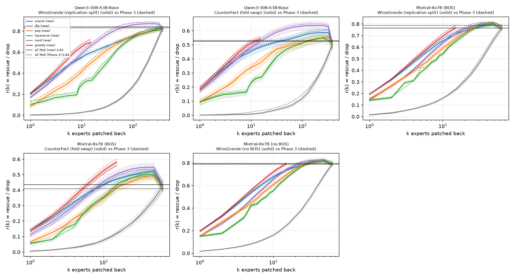
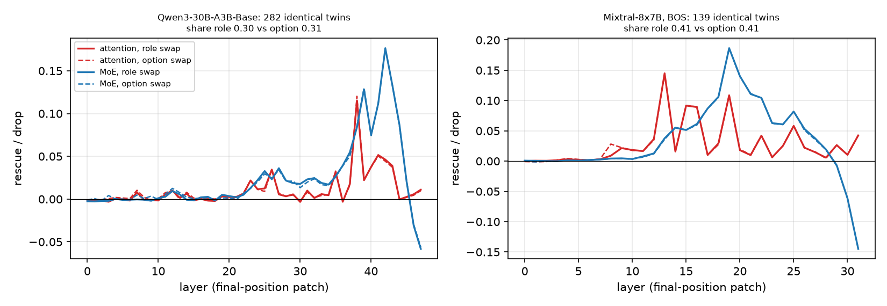
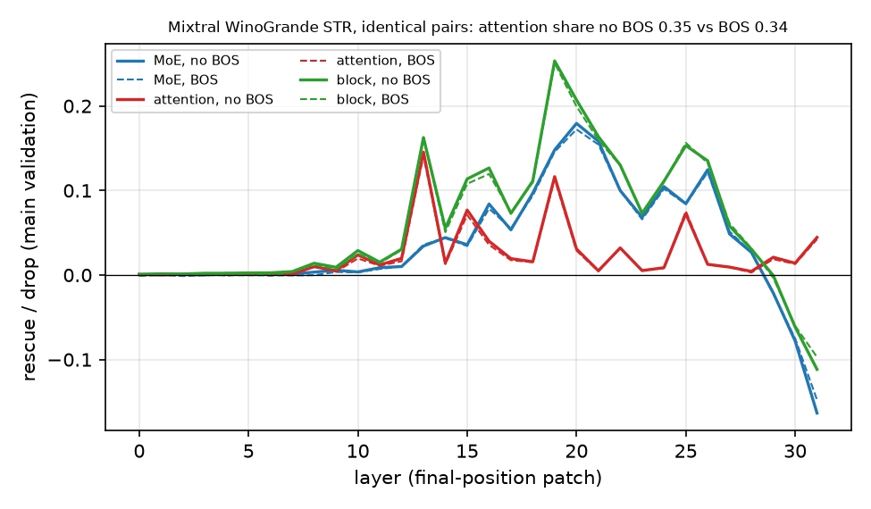

**Summary.** Three completeness checks of the Phase-3 claims (Direction 12; no engine change; ≈ 70 GPU-min). The expert-level claims replicate; the Phase-3 reading that the WinoGrande role swap is more attention-driven than the option swap does not survive identical items.

- **4a, add-back replication.** On cases Phase 3 did not use (WinoGrande replication split; CounterFact with the paper folds swapped) the all-MoE ceilings are 0.833 / 0.524 / 0.765 / 0.435 of the drop (Qwen3 WinoGrande / Qwen3 CounterFact / Mixtral WinoGrande / Mixtral CounterFact; Phase 3 0.843 / 0.531 / 0.787 / 0.409; differences -0.010 [-0.034, +0.014], -0.007 [-0.058, +0.045], -0.023 [-0.053, +0.007], +0.026 [-0.032, +0.081], all CIs contain 0). 80 % of the ceiling still takes 12 / 5 / 7 / 4 experts with adaptive greedy (Phase 3 10 / 5 / 7 / 4) against 320 / 320 / 48 / 64 in random order; greedy beats the best static ordering at k = 10 by +0.07 / +0.03 / +0.04 / +0.07; the patch-free DLA ranking is within 0.03 of the single-patch oracle or above it (AUC difference +0.05 / +0.03 / -0.02 / +0.00); oracle subsets again overshoot the CounterFact ceiling; greedy's first picks are the Phase-3 experts. The paper's layer-first order stays below the population ranking except in Mixtral CounterFact (tied).
- **4b, role swap vs option swap on identical items.** On the same WinoGrande twins the two corruption sites give the same final-position decomposition: attention share role vs option Qwen3 0.304 vs 0.306 (paired difference -0.002 [-0.015, +0.009], 282 twins; direct-path attention 0.181 vs 0.183); Mixtral BOS 0.406 vs 0.414 (paired difference -0.008 [-0.014, -0.001], 139 twins; direct-path attention 0.411 vs 0.410). The role-swapped prompt of every item is the option-swapped prompt with the two names exchanged (verified on all items), so for name pairs W7 is the option swap up to a renaming that both models nearly ignore. The Phase-3 gap (Qwen3 0.32 vs 0.16, Mixtral 0.39 vs 0.34) compared name items with mostly object items: name items lean towards attention under either corruption.
- **4c, Mixtral without BOS on WinoGrande.** Without BOS the two-stage selection picks L20 and **L20E000** again (validation rescue +1.123 [+1.022, +1.225], Spec +0.948 [+0.839, +1.056], equal-norm Spec +0.154 [+0.130, +0.178]; pattern A; re-selected on the replication split), and the attention/MoE balance does not move: attention share 0.349 vs 0.344 with BOS (paired difference +0.005 [-0.002, +0.013]), all-MoE M 0.795 vs 0.788 (+0.007 [+0.001, +0.013]), direct-path attention 0.288 vs 0.288 (-0.001 [-0.007, +0.006]). Only 2 of 1024 WinoGrande prompts carry the sink state at their final token without BOS (0 with BOS; CounterFact in Direction 3: 63 of 256); add-back ceiling 0.795 vs 0.787 (paired +0.008 [+0.002, +0.014]), greedy k80 7 [7, 8] vs 7 [7, 8].

### 4a. Add-back replication: WinoGrande replication split and CounterFact fold swap

**What was run.** The Phase-3 add-back protocol (ext8, `moetrace/ext8_addback.py`, unchanged) on case sets that played no role in Phase 3's add-back curves. WinoGrande: the disjoint replication split of the 776-pair case set (population ranking and layer-wise baseline from rep_discovery, curves on the 128 rep_validation pairs = 256 directed cases; all-layer single-expert rows from the ext7 runs, which already covered the replication split). CounterFact has no replication set: the two paper folds were exchanged (ranking from the paper's validation cases, curves on its discovery cases: Qwen3 107, Mixtral 107 cases, every known donor, donor mean). Per run: A0 ceilings (all MoE / all attention / both, interior layers; add-back and deletion directions), the static orderings oracle / pop / layer-wise / DLA / |δ_e| / routing weight / random (5 permutations) on ext8's k grid with the all-clean-active endpoint, and adaptive greedy with ext8's pools (Qwen3 the row's top-32 singles, Mixtral all 64) for 15 steps. Not run (brief): beam, exact top-10, Shapley, deletion curves. The runs of one model shared every engine pass (`scripts/ext12_addback_run.py`, a multi-task driver over the ext8 functions: each task keeps its own prefill rows, state and files in the ext8 format and is analysed with ext8's own `analyse`). CIs: 5,000-resample unit bootstrap (CounterFact cases, WinoGrande pairs); differences to Phase 3 are between independent samples (difference of independent resamples).

**4a / 4c add-back: Phase-3 run vs replication split / fold swap / no BOS (fraction of the drop; unit bootstrap 95% CI)**

| Model | Task | Run | Eval. cases | All-MoE ceiling M | Answer restored by all MoE | k80 of ceiling oracle / greedy / random | AUC log k oracle / DLA / pop / layer-wise | AUC k ≤ 15 greedy / oracle / DLA | greedy − oracle r(10) | DLA − oracle AUC | oracle overshoot (max r − M) | case k answer restored (oracle; median; frac. of cases) |
|---|---|---|---|---|---|---|---|---|---|---|---|---|
| Qwen3-30B-A3B-Base | WinoGrande | Phase 3 (main) | 256 | 0.843 [0.827, 0.859] | 0.95 [0.92, 0.97] | 48 [32, 48] / 10 [9, 12] / 320 [320, 320] | 0.591 [0.574, 0.607] / 0.647 [0.631, 0.664] / 0.531 [0.507, 0.554] / 0.462 [0.446, 0.479] | 0.486 [0.467, 0.506] / 0.422 [0.405, 0.439] / 0.420 [0.404, 0.436] | +0.124 [+0.107, +0.143] | +0.057 [+0.047, +0.067] | +0.003 [-0.006, +0.013] | 7; 0.98 |
| Qwen3-30B-A3B-Base | WinoGrande | WinoGrande (replication split) | 256 | 0.833 [0.815, 0.850] | 0.95 [0.93, 0.98] | 48 [32, 48] / 12 [10, 14] / 320 [320, 320] | 0.581 [0.565, 0.597] / 0.629 [0.611, 0.646] / 0.507 [0.486, 0.527] / 0.438 [0.421, 0.455] | 0.464 [0.446, 0.481] / 0.410 [0.395, 0.426] / 0.406 [0.389, 0.423] | +0.104 [+0.090, +0.117] | +0.048 [+0.040, +0.056] | -0.004 [-0.015, +0.007] | 7; 0.97 |
| Qwen3-30B-A3B-Base | CounterFact | Phase 3 (main) | 108 | 0.531 [0.489, 0.570] | 0.44 [0.34, 0.53] | 6 [5, 8] / 5 [4, 6] / 320 [320, 384] | 0.471 [0.445, 0.496] / 0.505 [0.480, 0.530] / 0.383 [0.359, 0.407] / 0.333 [0.312, 0.354] | 0.395 [0.371, 0.419] / 0.367 [0.343, 0.391] / 0.369 [0.346, 0.392] | +0.057 [+0.050, +0.064] | +0.034 [+0.028, +0.041] | +0.076 [+0.058, +0.096] | 48; 0.63 |
| Qwen3-30B-A3B-Base | CounterFact | CounterFact (fold swap) | 107 | 0.524 [0.494, 0.555] | 0.44 [0.35, 0.53] | 7 [5, 10] / 5 [4, 6] / 320 [320, 384] | 0.458 [0.433, 0.484] / 0.492 [0.466, 0.518] / 0.374 [0.349, 0.400] / 0.328 [0.304, 0.351] | 0.380 [0.355, 0.405] / 0.352 [0.328, 0.378] / 0.354 [0.329, 0.380] | +0.056 [+0.050, +0.063] | +0.033 [+0.027, +0.039] | +0.063 [+0.045, +0.086] | 96; 0.63 |
| Mixtral-8x7B (BOS) | WinoGrande | Phase 3 (main) | 256 | 0.787 [0.764, 0.809] | 0.89 [0.85, 0.93] | 8 [8, 9] / 7 [7, 8] / 48 [48, 48] | 0.580 [0.566, 0.594] / 0.553 [0.541, 0.565] / 0.534 [0.520, 0.547] / 0.494 [0.482, 0.506] | 0.493 [0.480, 0.507] / 0.471 [0.458, 0.484] / 0.422 [0.410, 0.434] | +0.044 [+0.039, +0.049] | -0.027 [-0.032, -0.023] | +0.026 [+0.015, +0.037] | 5; 0.96 |
| Mixtral-8x7B (BOS) | WinoGrande | WinoGrande (replication split) | 256 | 0.765 [0.744, 0.784] | 0.91 [0.88, 0.94] | 8 [8, 9] / 7 [7, 8] / 48 [48, 48] | 0.566 [0.553, 0.579] / 0.543 [0.531, 0.554] / 0.523 [0.509, 0.536] / 0.486 [0.475, 0.497] | 0.480 [0.467, 0.493] / 0.460 [0.448, 0.472] / 0.416 [0.406, 0.427] | +0.040 [+0.036, +0.045] | -0.023 [-0.027, -0.019] | +0.032 [+0.022, +0.043] | 5; 0.94 |
| Mixtral-8x7B (BOS) | CounterFact | Phase 3 (main) | 106 | 0.409 [0.367, 0.451] | 0.37 [0.27, 0.46] | 5 [4, 6] / 4 [4, 5] / 64 [48, 64] | 0.371 [0.349, 0.394] / 0.367 [0.345, 0.389] / 0.307 [0.284, 0.330] / 0.292 [0.271, 0.312] | 0.346 [0.325, 0.367] / 0.307 [0.286, 0.329] / 0.289 [0.269, 0.310] | +0.078 [+0.069, +0.087] | -0.004 [-0.010, +0.002] | +0.108 [+0.080, +0.136] | 48; 0.50 |
| Mixtral-8x7B (BOS) | CounterFact | CounterFact (fold swap) | 107 | 0.435 [0.397, 0.470] | 0.38 [0.29, 0.48] | 5 [4, 6] / 4 [4, 5] / 64 [48, 64] | 0.379 [0.357, 0.402] / 0.381 [0.359, 0.403] / 0.305 [0.284, 0.326] / 0.301 [0.281, 0.322] | 0.359 [0.338, 0.381] / 0.317 [0.296, 0.337] / 0.303 [0.282, 0.324] | +0.089 [+0.081, +0.097] | +0.001 [-0.003, +0.006] | +0.089 [+0.066, +0.115] | 24; 0.65 |
| Mixtral-8x7B (no BOS) | WinoGrande | WinoGrande (no BOS) | 256 | 0.795 [0.773, 0.815] | 0.91 [0.87, 0.95] | 8 [8, 9] / 7 [7, 8] / 48 [48, 48] | 0.585 [0.572, 0.599] / 0.559 [0.546, 0.571] / 0.541 [0.527, 0.555] / 0.500 [0.488, 0.512] | 0.497 [0.484, 0.510] / 0.476 [0.463, 0.489] / 0.426 [0.414, 0.439] | +0.041 [+0.037, +0.046] | -0.027 [-0.032, -0.022] | +0.027 [+0.017, +0.038] | 5; 0.95 |

**4a / 4c: differences new run − Phase-3 run (95% bootstrap CI; k80 differences only where both are finite)**

| Model | Comparison (new − Phase 3) | Bootstrap | Δ ceiling | Δ restored | Δ AUC oracle | Δ AUC k≤15 greedy | Δ AUC DLA | Δ (greedy − oracle r(10)) | Δ (DLA − oracle AUC) | Δ overshoot | Δ k80 oracle | Δ k80 greedy |
|---|---|---|---|---|---|---|---|---|---|---|---|---|
| Qwen3-30B-A3B-Base | WinoGrande (replication split) | independent samples | -0.010 [-0.034, +0.014] | +0.00 [-0.03, +0.04] | -0.010 [-0.033, +0.013] | -0.022 [-0.048, +0.003] | -0.018 [-0.043, +0.005] | -0.020 [-0.043, +0.001] | -0.009 [-0.022, +0.004] | -0.007 [-0.022, +0.008] | +0 [-16, +16] | +2 [-1, +4] |
| Qwen3-30B-A3B-Base | CounterFact (fold swap) | independent samples | -0.007 [-0.058, +0.045] | +0.00 [-0.13, +0.13] | -0.013 [-0.050, +0.023] | -0.015 [-0.051, +0.020] | -0.013 [-0.050, +0.023] | -0.000 [-0.010, +0.009] | -0.001 [-0.010, +0.008] | -0.013 [-0.040, +0.016] | +1 [-2, +4] | +0 [-1, +2] |
| Mixtral-8x7B (BOS) | WinoGrande (replication split) | independent samples | -0.023 [-0.053, +0.007] | +0.02 [-0.04, +0.07] | -0.014 [-0.032, +0.005] | -0.013 [-0.031, +0.005] | -0.010 [-0.026, +0.007] | -0.003 [-0.010, +0.004] | +0.004 [-0.002, +0.010] | +0.006 [-0.009, +0.021] | +0 [-1, +1] | +0 [-1, +1] |
| Mixtral-8x7B (BOS) | CounterFact (fold swap) | independent samples | +0.026 [-0.032, +0.081] | +0.02 [-0.12, +0.15] | +0.009 [-0.023, +0.040] | +0.014 [-0.016, +0.043] | +0.014 [-0.018, +0.046] | +0.011 [-0.001, +0.023] | +0.005 [-0.002, +0.013] | -0.018 [-0.055, +0.020] | +0 [-1, +2] | +0 [-1, +1] |
| Mixtral-8x7B (no BOS) | WinoGrande (no BOS) | paired (identical pairs) | +0.008 [+0.002, +0.014] | +0.02 [-0.01, +0.04] | +0.005 [+0.001, +0.010] | +0.004 [-0.001, +0.009] | +0.006 [+0.001, +0.010] | -0.002 [-0.008, +0.003] | +0.000 [-0.003, +0.004] | +0.001 [-0.005, +0.007] | +0 [-1, +1] | +0 [+0, +1] |

**Reading.**

- **Qwen3 WinoGrande** (WinoGrande (replication split)): ceiling 0.833 [0.815, 0.850] vs 0.843 [0.827, 0.859] in Phase 3 (difference -0.010 [-0.034, +0.014]); answer restored by all MoE 0.95 [0.93, 0.98] vs 0.95; k80 of the ceiling oracle / greedy / random 48 [32, 48] / 12 [10, 14] / 320 [320, 320] (Phase 3 48 [32, 48] / 10 [9, 12] / 320 [320, 320]); AUC over log k oracle 0.581 [0.565, 0.597] (Phase 3 0.591), DLA 0.629 [0.611, 0.646] (0.647); k ≤ 15 greedy 0.464 [0.446, 0.481] (0.486); greedy − static oracle at k = 10 +0.104 [+0.090, +0.117] (+0.124); DLA − oracle AUC +0.048 [+0.040, +0.056] (+0.057); overshoot of the oracle curve over the ceiling -0.004 [-0.015, +0.007] (+0.003).
- **Qwen3 CounterFact** (CounterFact (fold swap)): ceiling 0.524 [0.494, 0.555] vs 0.531 [0.489, 0.570] in Phase 3 (difference -0.007 [-0.058, +0.045]); answer restored by all MoE 0.44 [0.35, 0.53] vs 0.44; k80 of the ceiling oracle / greedy / random 7 [5, 10] / 5 [4, 6] / 320 [320, 384] (Phase 3 6 [5, 8] / 5 [4, 6] / 320 [320, 384]); AUC over log k oracle 0.458 [0.433, 0.484] (Phase 3 0.471), DLA 0.492 [0.466, 0.518] (0.505); k ≤ 15 greedy 0.380 [0.355, 0.405] (0.395); greedy − static oracle at k = 10 +0.056 [+0.050, +0.063] (+0.057); DLA − oracle AUC +0.033 [+0.027, +0.039] (+0.034); overshoot of the oracle curve over the ceiling +0.063 [+0.045, +0.086] (+0.076).
- **Mixtral WinoGrande** (WinoGrande (replication split)): ceiling 0.765 [0.744, 0.784] vs 0.787 [0.764, 0.809] in Phase 3 (difference -0.023 [-0.053, +0.007]); answer restored by all MoE 0.91 [0.88, 0.94] vs 0.89; k80 of the ceiling oracle / greedy / random 8 [8, 9] / 7 [7, 8] / 48 [48, 48] (Phase 3 8 [8, 9] / 7 [7, 8] / 48 [48, 48]); AUC over log k oracle 0.566 [0.553, 0.579] (Phase 3 0.580), DLA 0.543 [0.531, 0.554] (0.553); k ≤ 15 greedy 0.480 [0.467, 0.493] (0.493); greedy − static oracle at k = 10 +0.040 [+0.036, +0.045] (+0.044); DLA − oracle AUC -0.023 [-0.027, -0.019] (-0.027); overshoot of the oracle curve over the ceiling +0.032 [+0.022, +0.043] (+0.026).
- **Mixtral CounterFact** (CounterFact (fold swap)): ceiling 0.435 [0.397, 0.470] vs 0.409 [0.367, 0.451] in Phase 3 (difference +0.026 [-0.032, +0.081]); answer restored by all MoE 0.38 [0.29, 0.48] vs 0.37; k80 of the ceiling oracle / greedy / random 5 [4, 6] / 4 [4, 5] / 64 [48, 64] (Phase 3 5 [4, 6] / 4 [4, 5] / 64 [48, 64]); AUC over log k oracle 0.379 [0.357, 0.402] (Phase 3 0.371), DLA 0.381 [0.359, 0.403] (0.367); k ≤ 15 greedy 0.359 [0.338, 0.381] (0.346); greedy − static oracle at k = 10 +0.089 [+0.081, +0.097] (+0.078); DLA − oracle AUC +0.001 [-0.003, +0.006] (-0.004); overshoot of the oracle curve over the ceiling +0.089 [+0.066, +0.115] (+0.108).

The Phase-3 add-back conclusions hold on independent cases. (1) The all-MoE ceiling is a property of the task, not of the particular 128 pairs or ~107 facts: replication / fold-swap ceilings differ from Phase 3 by at most 0.03 (every CI of the difference contains 0), and CounterFact stays far below WinoGrande (≈ 0.4–0.5 vs ≈ 0.75–0.85 of the drop; all MoE outputs restore the answer in ≈ 40 % of facts vs ≈ 90–95 % of WinoGrande cases). (2) A handful of experts still carries the expert repair: k80 of the ceiling with greedy is 4–7 experts except Qwen3 WinoGrande (12 vs 10 in Phase 3), the per-case static oracle needs 5–8 except Qwen3 WinoGrande (48 in both), and random orders still need most of the clean-active experts. (3) Adaptivity matters most where Phase 3 found expert interactions (Qwen3 WinoGrande: greedy − static oracle at k = 10 +0.10 vs +0.12) and still adds +0.04–0.09 elsewhere. (4) The patch-free DLA ranking stays above the single-patch oracle in Qwen3 (+0.03 to +0.05 AUC), equal to it in Mixtral CounterFact and 0.02 below it in Mixtral WinoGrande, exactly the Phase-3 pattern. (5) With the population ranking taken from the other fold, the pop and layer-wise curves are out-of-sample in both directions and keep their Phase-3 positions (oracle ≈ DLA > pop ≥ layer-wise > |δ_e|, weight > random); only in Mixtral CounterFact are pop and layer-wise tied on the fold swap, as they nearly were in Phase 3 (0.307 vs 0.292). (6) Oracle subsets overshoot the CounterFact ceiling again by +0.06 / +0.09 of the drop. (7) Greedy picks the same experts: share of rows with the expert among greedy's first five picks, new run (Phase 3): Qwen3 WinoGrande L41E117 0.50 (0.57), L43E081 0.46 (0.44), L39E071 0.32 (0.32); Qwen3 CounterFact L42E115 0.58 (0.55), L44E069 0.46 (0.46), L43E046 0.20 (–); Mixtral WinoGrande L19E006 0.83 (0.79), L20E000 0.80 (0.80), L21E006 0.41 (0.40); Mixtral CounterFact L21E001 0.45 (0.40), L19E002 0.35 (0.32), L18E001 0.28 (0.28); Mixtral no BOS WinoGrande L20E000 0.78 (0.80), L19E006 0.78 (0.79), L21E006 0.40 (0.40).

### 4b. Role swap vs option swap on identical items

**What was run.** Every W7 role-swap pair was built inside its model's option-swap margin pool, so each role-swap item (a WinoGrande twin) also has an option-swap pair (A, B) (`scripts/ext12_roleitems_casesets.py` → `results/wino_roleitems_inputs/`; check: the option pair passes the margin both ways, and the role pair's clean prompt and (r, r′) equal those of one option-swap direction). Items: Qwen3 282 twins (all four role splits: 1024 role and 564 option directed cases), Mixtral BOS 139 twins (512 / 278). On exactly these items the option swap was re-run with the Phase-3 runners: W2 final-position sweep (`layer`, `attn_layer`, `block` at every layer), W4 joint patch (all-MoE M, both directions) and the direct-path split (exact final norm); the role-swap side is the Phase-3 run (`results/wino_role_*_str`). Comparison unit = twin: the role-swap value of a twin pools its one or two role pairs (both directions), the option-swap value its option pair (both directions); the attention share is the Direction-2b AUC+ share of the twin-weighted mean single-layer curves; ratios (A_dir, M) are ratios of twin means; 5,000-resample twin bootstrap with the SAME resamples for both corruptions (paired). Sensitivity: the clean-prompt-matched variant (role direction d = 0 against the option-swap direction with the same clean prompt and the same r, r′; only the corruption differs) and the validation split alone (the Phase-3 comparison set).

**4b: role swap vs option swap on identical WinoGrande items (twin-level, twin bootstrap 95% CI; attention share = AUC+(attention) / (AUC+(attention) + AUC+(MoE)) of the twin-weighted final-position single-layer curves)**

| Model | Items | Twins | Directed cases role / option | Drop role / option | Attention share role | Attention share option | Δ share (role − option) | Direct-path attention A_dir role / option | Δ A_dir | All-MoE M role / option | Δ M |
|---|---|---|---|---|---|---|---|---|---|---|---|
| Qwen3-30B-A3B-Base | all role items (4 splits) | 282 | 1024 / 564 | 7.28 [7.01, 7.54] / 7.35 [7.07, 7.63] | 0.304 [0.287, 0.323] | 0.306 [0.286, 0.330] | -0.002 [-0.015, +0.009] | 0.181 [0.161, 0.202] / 0.183 [0.162, 0.205] | -0.001 [-0.007, +0.004] | 0.776 [0.758, 0.792] / 0.778 [0.761, 0.794] | -0.002 [-0.006, +0.001] |
| Qwen3-30B-A3B-Base | validation split | 73 | 256 / 146 | 6.76 [6.27, 7.25] / 6.97 [6.45, 7.51] | 0.321 [0.294, 0.360] | 0.320 [0.289, 0.364] | +0.000 [-0.022, +0.022] | 0.187 [0.147, 0.231] / 0.184 [0.146, 0.223] | +0.004 [-0.010, +0.018] | 0.774 [0.742, 0.804] / 0.780 [0.749, 0.810] | -0.006 [-0.016, +0.004] |
| Qwen3-30B-A3B-Base | all, clean-prompt matched (role d = 0) | 282 | 512 / 512 | 7.29 [7.02, 7.56] / 7.35 [7.07, 7.63] | 0.303 [0.285, 0.324] | 0.312 [0.291, 0.337] | -0.009 [-0.025, +0.005] | 0.180 [0.159, 0.201] / 0.183 [0.162, 0.205] | -0.003 [-0.008, +0.003] | 0.775 [0.757, 0.791] / 0.778 [0.760, 0.794] | -0.003 [-0.008, +0.002] |
| Mixtral-8x7B, BOS | all role items (2 splits) | 139 | 512 / 278 | 6.38 [6.06, 6.71] / 6.41 [6.08, 6.75] | 0.406 [0.389, 0.424] | 0.414 [0.396, 0.431] | -0.008 [-0.014, -0.001] | 0.411 [0.379, 0.445] / 0.410 [0.377, 0.443] | +0.001 [-0.002, +0.005] | 0.668 [0.631, 0.702] / 0.669 [0.631, 0.703] | -0.001 [-0.005, +0.003] |
| Mixtral-8x7B, BOS | validation split | 69 | 256 / 138 | 6.55 [6.08, 7.04] / 6.61 [6.12, 7.10] | 0.391 [0.369, 0.414] | 0.399 [0.377, 0.422] | -0.008 [-0.018, +0.003] | 0.374 [0.336, 0.417] / 0.375 [0.337, 0.418] | -0.001 [-0.006, +0.004] | 0.703 [0.654, 0.744] / 0.701 [0.652, 0.742] | +0.001 [-0.004, +0.008] |
| Mixtral-8x7B, BOS | all, clean-prompt matched (role d = 0) | 139 | 256 / 256 | 6.38 [6.06, 6.70] / 6.41 [6.08, 6.75] | 0.404 [0.385, 0.422] | 0.412 [0.393, 0.431] | -0.008 [-0.016, -0.000] | 0.410 [0.378, 0.444] / 0.409 [0.377, 0.443] | +0.001 [-0.003, +0.005] | 0.667 [0.630, 0.700] / 0.668 [0.630, 0.702] | -0.001 [-0.005, +0.004] |

**4b: final-position single-layer curves on identical items (all role items; descriptive peaks of the twin-weighted means)**

| Model | Attention peak role / option (L, / drop) | MoE peak role / option | Block peak role / option | AUC+ attention / drop role / option | Δ | AUC+ MoE / drop role / option | Δ | Share, pair-weighted (Phase-3 definition) role / option |
|---|---|---|---|---|---|---|---|---|
| Qwen3-30B-A3B-Base | L38 0.115 / L38 0.120 | L42 0.177 / L42 0.176 | L42 0.214 / L42 0.212 | 0.542 [0.500, 0.592] / 0.545 [0.497, 0.617] | -0.003 [-0.059, +0.041] | 1.244 [1.172, 1.323] / 1.238 [1.167, 1.332] | +0.006 [-0.065, +0.065] | 0.303 / 0.306 |
| Mixtral-8x7B, BOS | L13 0.145 / L13 0.144 | L19 0.186 / L19 0.186 | L19 0.274 / L19 0.274 | 0.886 [0.835, 0.939] / 0.904 [0.853, 0.955] | -0.018 [-0.054, +0.018] | 1.297 [1.224, 1.368] / 1.280 [1.213, 1.349] | +0.017 [-0.016, +0.047] | 0.408 / 0.414 |

**Reading.**

- **Qwen3**: attention share role 0.304 [0.287, 0.323] vs option 0.306 [0.286, 0.330] on the same 282 twins, paired difference -0.002 [-0.015, +0.009] (validation split only +0.000 [-0.022, +0.022]; clean-prompt matched -0.009 [-0.025, +0.005]). Phase 3 compared the role-swap validation pairs with the option swap's own 776-pair validation set (option share 0.159). Direct-path attention share A_dir role 0.181 [0.161, 0.202] vs option 0.183 [0.162, 0.205], difference -0.001 [-0.007, +0.004]; all-MoE M role 0.776 [0.758, 0.792] vs option 0.778 [0.761, 0.794], difference -0.002 [-0.006, +0.001]. Attention AUC+ / drop -0.003 [-0.059, +0.041], MoE AUC+ / drop +0.006 [-0.065, +0.065] (role − option).
- **Mixtral BOS**: attention share role 0.406 [0.389, 0.424] vs option 0.414 [0.396, 0.431] on the same 139 twins, paired difference -0.008 [-0.014, -0.001] (validation split only -0.008 [-0.018, +0.003]; clean-prompt matched -0.008 [-0.016, -0.000]). Phase 3 compared the role-swap validation pairs with the option swap's own 776-pair validation set (option share 0.344). Direct-path attention share A_dir role 0.411 [0.379, 0.445] vs option 0.410 [0.377, 0.443], difference +0.001 [-0.002, +0.005]; all-MoE M role 0.668 [0.631, 0.702] vs option 0.669 [0.631, 0.703], difference -0.001 [-0.005, +0.003]. Attention AUC+ / drop -0.018 [-0.054, +0.018], MoE AUC+ / drop +0.017 [-0.016, +0.047] (role − option).

The role-swap pairs were built only from name items (two person names, each mentioned once before the blank). For such an item the role swap (exchange the two first mentions, keep the filled name) and the option swap (fill the blank with the other name) produce the same corrupted sentence up to exchanging the two names (verified on every item: 512/512 Qwen3, 256/256 Mixtral clean-prompt-matched cases), and both keep the clean prompt and (r, r′). The models are close to equivariant under that renaming: per case (clean-prompt matched), the single-layer rescue curves of the two corruptions correlate at r = 0.76 (MoE) / 0.61 (attention) in Qwen3 and 0.96 / 0.90 in Mixtral, the drops at r = 0.89 / 0.97, and the population curves coincide (largest share difference 0.008). The Phase-3 reading "the role swap moves the balance towards attention" is therefore withdrawn: what moved the balance was the item type. Name items are the attention-leaning stratum under either corruption (in the 776-pair option-swap set its 23 name pairs already had attention share 0.30 in Qwen3 and 0.43 in Mixtral, against 0.16 / 0.34 overall), object items are not. A role swap that is not a renaming of the option swap would need object items with two swappable mentions, which W7 excluded; Zhang & Nanda's corruption-site question (Z7) is therefore not yet answered for WinoGrande.

### 4c. Mixtral without BOS on WinoGrande (the base reproduction's paper protocol)

**What was run.** The same 776-pair case set (main 128/128 and replication 128/128 pairs, both directions) with the pairs tokenised without `<s>` (`data/wino_str/pairs_train_xl_mixtral_nobos.parquet`; identical text and token positions, no BOS), run dir `results/wino_mixtral_nobos_str`: W2 final-position sweep, W6 all-layer expert pass with equal-norm rows at the MoE argmax layer and the paper's two-stage selection (recurrence gate 128 of 256 discovery directed cases), joint search, fixed hypotheses; W4 all-MoE / all-attention / all-block joint patches and the direct-path split; add-back (static orderings + greedy, main validation, `results/wino_mixtral_nobos_str_addback`); sink-carrying final-token flags (Direction 3: the final position holds the maximal residual norm at layer 5) from one prefill pass over both prompts of every pair under both protocols (`scripts/ext12_sink_flags.py`). All comparisons with the BOS run (Phase 3, `results/wino_mixtral_bos_str`, `results/wino_mixtral_bos_str_addback`) are on identical pairs, so CIs of differences come from a paired pair bootstrap.

**4c W2: final-position single-layer patches, Mixtral without vs with BOS on the identical 776-pair case set (main 128/128 pairs; pair bootstrap 95% CI)**

| Run | MoE peak (disc. L, val. / drop) | Attention peak | Block peak | Attention share (main val.) | Share (rep val.) | Mean drop (main) |
|---|---|---|---|---|---|---|
| Mixtral-8x7B, no BOS (ext12) | L20: 0.179 [0.169, 0.190] | L13: 0.145 [0.130, 0.161] | L19: 0.253 [0.240, 0.267] | 0.349 [0.337, 0.362] | 0.346 | +7.64 |
| Mixtral-8x7B, BOS (Phase 3) | L20: 0.172 [0.162, 0.183] | L13: 0.141 [0.127, 0.157] | L19: 0.251 [0.238, 0.264] | 0.344 [0.331, 0.357] | 0.350 | +7.78 |

**4c: Mixtral no BOS vs BOS on identical pairs (paired pair bootstrap, 95% CI)**

| Pairs | Quantity | no BOS | BOS | no BOS − BOS (paired) |
|---|---|---|---|---|
| main validation | attention share | 0.349 [0.337, 0.362] | 0.344 [0.331, 0.357] | +0.005 [-0.002, +0.013] |
| main validation | AUC+ attention / drop | 0.767 [0.729, 0.808] | 0.728 [0.692, 0.765] | +0.039 [+0.002, +0.074] |
| main validation | AUC+ MoE / drop | 1.432 [1.378, 1.488] | 1.389 [1.346, 1.439] | +0.042 [+0.003, +0.075] |
| main validation | direct-path attention A_dir | 0.288 [0.266, 0.311] | 0.288 [0.265, 0.313] | -0.001 [-0.007, +0.006] |
| main validation | direct-path MoE M_dir | 0.712 [0.689, 0.734] | 0.712 [0.687, 0.735] | +0.001 [-0.006, +0.007] |
| main validation | all-MoE M (denoise) | 0.795 [0.773, 0.815] | 0.788 [0.765, 0.810] | +0.007 [+0.001, +0.013] |
| main validation | mean drop (logits) | 7.562 [7.136, 7.988] | 7.685 [7.251, 8.138] | -0.123 [-0.273, +0.023] |
| main all | attention share | 0.356 [0.347, 0.366] | 0.350 [0.340, 0.360] | +0.006 [+0.001, +0.012] |
| main all | AUC+ attention / drop | 0.767 [0.739, 0.797] | 0.730 [0.705, 0.759] | +0.037 [+0.011, +0.062] |
| main all | AUC+ MoE / drop | 1.386 [1.346, 1.428] | 1.356 [1.321, 1.393] | +0.030 [+0.004, +0.057] |
| main all | direct-path attention A_dir | 0.300 [0.283, 0.318] | 0.300 [0.282, 0.318] | +0.001 [-0.004, +0.006] |
| main all | direct-path MoE M_dir | 0.700 [0.682, 0.717] | 0.700 [0.682, 0.718] | -0.001 [-0.006, +0.004] |
| main all | all-MoE M (denoise) | 0.778 [0.761, 0.794] | 0.774 [0.756, 0.791] | +0.004 [-0.001, +0.009] |
| main all | mean drop (logits) | 7.643 [7.347, 7.936] | 7.782 [7.466, 8.087] | -0.138 [-0.256, -0.021] |

**4c W6: two-stage expert selection, Mixtral without vs with BOS (recurrence gate 128 of 256 discovery directed cases; pair bootstrap 95% CI; the interior-layer rule (≤ L−5) selects the same layer in every row and is not repeated)**

| Protocol | Family | Rule | Layer | Selected expert | Pattern | Val. rescue | Spec | Equal-norm Spec | Val. active (of 256) | Joint top-3 (disc. active) |
|---|---|---|---|---|---|---|---|---|---|---|
| no BOS | main | two-stage | L20 | L20E000 | A | +1.123 [+1.022, +1.225] | +0.948 [+0.839, +1.056] | +0.154 [+0.130, +0.178] | 246 | L20E000 (248), L19E006 (249), L21E006 (226) |
| no BOS | rep | two-stage | L20 | L20E000 | A | +1.160 [+1.054, +1.276] | +0.967 [+0.855, +1.085] | n/a | 246 | L20E000 (252), L19E006 (256), L21E006 (241) |
| BOS (Phase 3) | main | two-stage | L20 | L20E000 | A | +1.106 [+1.013, +1.203] | +0.940 [+0.836, +1.042] | +0.160 [+0.132, +0.189] | 246 | L20E000 (246), L19E006 (248), L21E006 (228) |
| BOS (Phase 3) | rep | two-stage | L20 | L20E000 | A | +1.166 [+1.067, +1.269] | +0.974 [+0.867, +1.084] | n/a | 247 | L20E000 (252), L19E006 (256), L21E006 (241) |

**4c: fixed experts evaluated without BOS (WinoGrande BOS selection L20E000, the Direction-3 sink expert L19E006, CounterFact experts; main validation; Spec of an expert that is rarely clean-active is negative by construction, its rescue being 0 where it is not routed)**

| Expert (fixed hypothesis) | Disc. active (of 256) | Val. active | Val. rescue | Spec |
|---|---|---|---|---|
| L20E000 | 248 | 246 | +1.123 [+1.022, +1.225] | +0.948 [+0.839, +1.056] |
| L19E006 | 249 | 256 | +0.981 [+0.907, +1.058] | +0.862 [+0.785, +0.939] |
| L21E006 | 226 | 232 | +0.633 [+0.555, +0.715] | +0.171 [+0.061, +0.285] |
| L19E002 | 9 | 6 | +0.004 [-0.002, +0.014] | -0.535 [-0.598, -0.473] |
| L18E001 | 3 | 3 | +0.006 [+0.000, +0.019] | -0.363 [-0.421, -0.308] |
| L21E001 | 9 | 11 | +0.006 [+0.002, +0.012] | -0.573 [-0.650, -0.499] |

**4c: sink-carrying final tokens (Direction-3 flag) on the WinoGrande prompts (main + rep pairs, both prompts)**

| Protocol | Prompts | Final position = max norm at L5 | … at any early layer | Position 0 = max norm at L5 | Mass on position 0 at L1 |
|---|---|---|---|---|---|
| nobos | 1024 | 2 (0.002) | 2 | 44 | 0.02 |
| bos | 1024 | 0 (0.000) | 0 | 1024 | 0.80 |

**Reading.**

Without BOS the WinoGrande final-position picture is unchanged: the same layers (MoE L20, attention L13, block L19), the same selected expert with the same specificity and equal-norm specificity, re-selected on the replication split, the same joint top-3 (L20E000, L19E006, L21E006), and attention / MoE shares within 0.01. All-MoE patch M 0.795 [0.773, 0.815] vs 0.788 [0.765, 0.810] with BOS (paired difference +0.007 [+0.001, +0.013]). Direct-path attention share 0.288 [0.266, 0.311] vs 0.288 [0.265, 0.313] (paired difference -0.001 [-0.007, +0.006]). Add-back without BOS: ceiling 0.795 [0.773, 0.815] vs 0.787 [0.764, 0.809] (paired +0.008 [+0.002, +0.014]), k80 oracle / greedy / random 8 [8, 9] / 7 [7, 8] / 48 [48, 48] (BOS 8 [8, 9] / 7 [7, 8] / 48 [48, 48]), AUC over log k oracle 0.585 vs 0.580, DLA − oracle -0.027 vs -0.027, greedy − static oracle at k = 10 +0.041 vs +0.044: the curves are the BOS curves within ≈ 0.01. Sink flags: without BOS the final position carries the maximal residual norm at layer 5 in only 2 of 1024 WinoGrande prompts (one pair whose sentence ends in '▁to'), with BOS in 0, against 63 of 256 CounterFact prompts in Direction 3. Without BOS the massive-norm state sits on an early token instead (position 0 in 44 prompts; most often positions 3, 5, 4, 2; median relative position 0.24), and the final position's attention mass on position 0 at layer 1 is 0.02 (BOS 0.80). The flagged prompts are routed to {E006, E007} at L19, the `<s>` routing of Direction 3. Final-position routing agrees between the protocols (identical top-2 set) in 0.96 of the prompts at L19 and 0.87 at L20 (mean over layers 0.90). Excluding the flagged pair changes nothing (L20E000 Spec +0.919 [+0.842, +0.995] on the 255 remaining main pairs).  This is what Direction 3's mechanism predicts: the BOS effect on CounterFact came from short cloze prompts whose final preposition became the attention sink, whereas WinoGrande prompts are full sentences (median 19 tokens without BOS) with delimiters and function words long before the final position. L19E006, the Direction-3 'sink expert', is routed at the WinoGrande final position in 256 of 256 validation directed cases without BOS and is positively specific (Spec +0.862 [+0.785, +0.939]), as with BOS: on WinoGrande it is an ordinary content expert (among greedy's first five picks in 78% of rows, as often as L20E000), not a sink artefact. The CounterFact experts (L19E002, L21E001, L18E001) stay idle on WinoGrande without BOS as with BOS. Answer to the brief: L20E000 survives without BOS, and the attention/MoE balance does not change.

### Caveats

- 4a: the replication split and the fold swap are new evaluation cases but the same models, tasks and protocol; beam / exact / Shapley / deletion were not repeated (brief). Greedy and the oracle ordering use each row's own single-expert patches (in-sample), as in Phase 3. The fold swap evaluates on the paper's discovery fold, on which the Direction-6 single-expert rows were selected (layer and expert selection, not the add-back orderings); no add-back quantity was tuned on it.
- 4a / 4c passes were shared between tasks of one model (multi-task driver); bf16 batch composition therefore differs from Phase 3 (run-to-run noise of identical rows ≈ 0.06–0.17 logits median; differences below ≈ 0.01 of the drop are not resolved).
- Engine: `moetrace/engine.py` was replaced by the ext9 engine at 06:58Z (E4 additions; regression identical in every result field). The 4c sweep / expert passes, the Qwen3 4b sweep / joint and the first two Qwen3 add-back jobs ran on the ext8 engine, all later jobs on the ext9 engine; no kind used here changed.
- 4b compares twin-weighted curves (a twin with two role pairs counts once); the Phase-3 pair-weighted shares on the same items are in the peaks table and agree to ≤ 0.01. Role swaps are name items only; the conclusion is about name items.
- 4c: the sink flag is Direction 3's (final position = max residual norm at layer 5); the BOS comparison is on identical pairs, but the BOS add-back run is Phase 3's (different pass composition).

### Files

- Code: `moetrace/ext12_complete.py` (task registry, CounterFact fold-swap loader, ext12 work queue), `scripts/ext12_addback_run.py` (multi-task add-back driver over the ext8 functions), `scripts/ext12_roleitems_casesets.py` (4b case sets and links), `scripts/ext12_sink_flags.py` (4c sink flags), `scripts/ext12_analyze.py`, `scripts/ext12_complete_text.py`, chains `scripts/ext12_chain_inputs.sh`, `scripts/ext12_chain_addback.sh` (logs `logs/ext12_chain_*.log`).
- Runs: `results/wino_qwen3_str_addback_rep`, `results/wino_mixtral_bos_str_addback_rep`, `results/qwen3_str_addback_fold_rep`, `results/mixtral_bos_str_addback_fold_rep`, `results/wino_mixtral_nobos_str_addback` (ext8 file format), `results/wino_mixtral_nobos_str` (W2 / W6 / W4 / direct split / `sink_flags.parquet`, `sink_diag.json`), `results/wino_roleitems_{qwen3,mixtral_bos}_str` (option swap on the role items), `results/wino_roleitems_inputs/` (case sets, link tables).
- Numbers `results/ext12_complete_summary.json`; tables `results/tables/ext12_*`; figures `results/figures/ext12_*`.
- GPU: ≈ 70 min in ext12 jobs (4a/4c add-back 41, 4b 10, 4c inputs 17, smoke 3).
