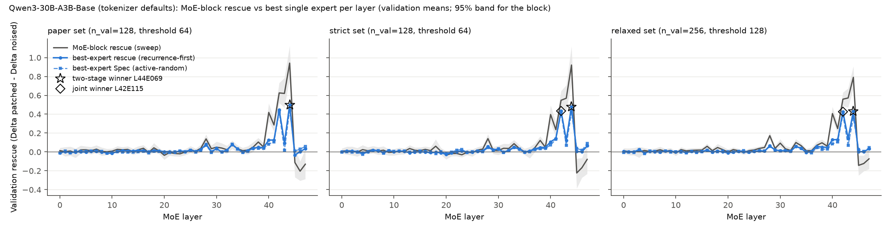
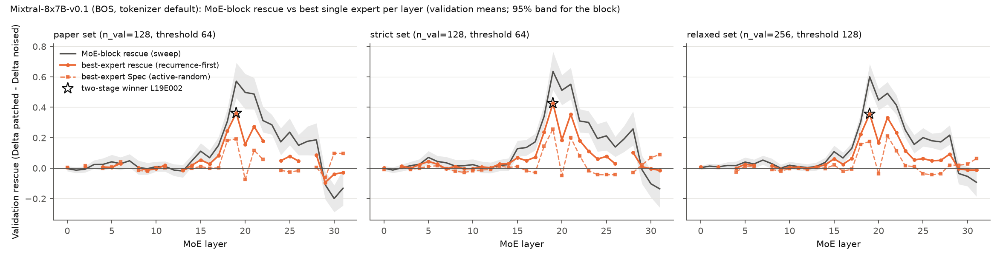
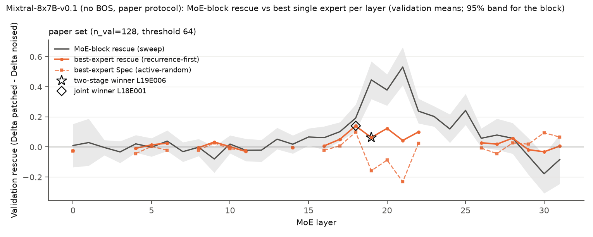

## Extension 1: layer-then-expert versus joint layer x expert search

**Question.** The paper selects the layer L* by MoE-block rescue on discovery cases and then searches for a recurrent expert inside L* only. Could a single expert in another layer be a better (higher validation rescue, more specific) locus that the two-stage procedure never sees?

**Method.** We ran the expert pass at *every* MoE layer (48 for Qwen3, 32 for Mixtral; `run_expert.py --layers 0..L-1 --no-pairs`, split into layer chunks so that at most ~90k wavefront rows are resident) for the three base runs: Qwen3-30B-A3B-Base with tokenizer defaults (paper, strict and relaxed case sets), Mixtral-8x7B-v0.1 with BOS (all three sets) and Mixtral without BOS (paper set; the protocol that reproduces the paper). For every (layer, expert) pair we compute on the paper's discovery split the clean-active count and the all-case mean rescue (zero where the expert is not clean-active), keep pairs meeting the recurrence threshold (half the discovery split: 64 of 128, 128 of 256) and (a) per layer take the best recurrent expert (the paper's rule applied at every layer), (b) take the global argmax over all pairs (joint search). Every selection is then evaluated on the untouched validation split with the same statistics as Table 1 (all-case rescue, active-random specificity with 3 controls for Qwen3 and 1 for Mixtral, 5,000-resample bootstrap CIs). Concentration is Rescue(best expert)/Rescue(MoE block) on validation from the same pass (paired bootstrap CI). Robustness repeats the joint search over the Appendix D grid (split seeds 0-4 x thresholds 32, 48, 64, 80, 96, doubled for the 512-case relaxed set; `random.Random(seed).shuffle` of the set's ids as in `analysis.stability_grid`; the per-split two-stage selection re-selects the layer by discovery block rescue and then the expert inside it). Code: `moetrace/ext1_analysis.py`, `scripts/ext1_analyze.py`; rows: `results/<run>/expert_rows.parquet` for runs `qwen3_bos_alllayers`, `mixtral_bos_alllayers`, `mixtral_nobos_alllayers`.

**Multiple-comparison caveat.** The joint search compares 48 x 128 = 6,144 (Qwen3) or 32 x 8 = 256 (Mixtral) pairs on discovery; the discovery maximum is therefore biased upward and only the validation numbers of a selected pair are unbiased estimates of its effect. We report the discovery-to-validation shrinkage of the maximum for that reason. The neighbouring-layer question (e) below scans every expert of 2-3 layers on *validation* directly and is a post-hoc comparison of ~100-400 experts against one pre-registered expert; a single expert exceeding the reference there is expected by chance and is not evidence unless it is also recurrent and its CI excludes the reference.

### Qwen3-30B-A3B-Base (tokenizer defaults) (`results/qwen3_bos_alllayers`)

- **Verdict: the joint search returns the two-stage winner.** Over all 234 recurrent (layer, expert) pairs in 48 layers, the discovery argmax is L44E069 (discovery +0.482, validation +0.499 [+0.357, +0.659], Spec +0.443 [+0.302, +0.603]).
- The strongest recurrent pair outside L44 is L42E115 (discovery rank 2, discovery +0.461, validation +0.447 [+0.363, +0.537], Spec +0.423 [+0.339, +0.510]).
- Discovery maximum vs its validation value (joint winner L44E069): +0.482 -> +0.499 (change +0.017, +3% of the discovery value; a negative change is the winner's-curse shrinkage).
- Overlap of L44E069 and L42E115 on the 128 validation cases: per-case rescue correlation Pearson r = 0.27 (Spearman 0.30); both positive in 52% of cases, only L44E069 in 11%, only L42E115 in 26%, neither in 11%; mean per-case max(rescue) +0.753 vs +0.499 / +0.447 alone.
- Robustness (Appendix D grid, 25 split-seed x threshold settings): the joint winner equals L44E069 in 20/25 settings with a winner, lies outside L44 in 5/25, and equals the per-split two-stage selection in 20/25. In 0 settings the per-split two-stage procedure finds no recurrent expert at its layer at all (the joint search still returns a pair); the joint winner leaves L44 in 5 settings where the two-stage procedure did have a candidate. Winners: L44E069 x20, L42E115 x5.
- All 234 recurrent pairs evaluated on validation against L44E069: 0 have a higher rescue (0 with a rescue CI entirely above L44E069's CI), 0 a higher Spec (0 with a Spec CI entirely above L44E069's CI); 19 pairs have a Spec CI above zero: L44E069, L42E115, L41E001, L43E005, L40E127, L40E030, L33E076, L37E104, L34E094, L28E030, L38E057, L39E040.
- Neighbouring layers [42, 43, 45]: 172 experts with any validation activity were evaluated; 0 beat L44E069 on validation rescue (+0.499) and 0 on Spec (+0.443); among the 14 recurrent ones, 0 and 0 respectively. Best by rescue: L42E115 +0.447 [+0.363, +0.537] (Spec +0.423, active 123/128, recurrent); best by Spec: L42E115 Spec +0.423 [+0.339, +0.510] (rescue +0.447, active 123/128, recurrent).

**Reading.** The two-stage procedure does not miss a *better* single expert: L44E069 is the joint discovery argmax on the paper set and has the highest validation point estimate in all three case sets. It does miss a *second locus of the same kind*. L42E115 is clean-active in 126/128 discovery and 123/128 validation cases (more recurrent than E069's 114/116), its validation rescue and Spec are within the CIs of E069's (and its own CIs are about half as wide), it is the joint discovery argmax on the strict and relaxed sets and in 5/25 grid settings, and L42 concentrates 72% of its block rescue in this one expert against 53% at L44. The two experts rescue partly different cases (per-case correlation r = 0.27; 26% of validation cases are rescued only by E115, 11% only by E069) and the per-case maximum of the two (+0.75) approaches the L44 block rescue (+0.94). The paper's Qwen3 picture 'one specific expert' should therefore read 'one specific expert per layer in the L42/L44 band', with L44E069 the stronger of two; the two-stage search sees only the layer with the higher block rescue and never examines L42, whose block rescue (+0.62) is the second highest. Stated plainly: **L42E115 (recurrent in 126/128 discovery cases, validation rescue +0.447 [+0.363, +0.537], Spec +0.423 [+0.339, +0.510]) is a second, near-equivalent factual-recall expert in the second-strongest layer; it wins the discovery argmax on the strict and relaxed sets and in 30 of the 75 grid cells (5/25 paper, 10/25 strict, 15/25 relaxed), while L44E069 keeps the higher validation point estimate in every set.** No expert in L43 or L45 comes close (best +0.15 and -0.03).

Consistency with the original single-layer pass (bf16 fingerprint): L44E069 on the paper validation split has rescue +0.499 / Spec +0.443 in the all-layer pass vs +0.503 / +0.450 in `results/qwen3` (active 116 vs 116); the difference (-0.004) is bf16 noise.

Figure E1-qwen3_bos: validation MoE-block rescue by layer (grey, 95% band) with the recurrence-first best expert's validation rescue (solid) and active-random Spec (dashed) at every layer; star = two-stage winner, diamond = joint winner if different. Gaps = layers with no recurrent expert. Full per-layer table: `results/tables/ext1_best_expert_by_layer_qwen3_bos.md`.

**Qwen3-30B-A3B-Base (tokenizer defaults): top-10 (layer, expert) pairs by discovery all-case mean rescue among recurrent candidates**

| Set | Rank (disc.) | Pair | Disc. active | Disc. rescue | Val. active | Val. rescue [95% CI] | Spec [95% CI] | Two-stage winner |
|---|---|---|---|---|---|---|---|---|
| paper | 1 | L44E069 | 114/128 | +0.482 | 116/128 | +0.499 [+0.357, +0.659] | +0.443 [+0.302, +0.603] | yes |
| paper | 2 | L42E115 | 126/128 | +0.461 | 123/128 | +0.447 [+0.363, +0.537] | +0.423 [+0.339, +0.510] |  |
| paper | 3 | L43E046 | 90/128 | +0.159 | 87/128 | +0.095 [+0.045, +0.152] | +0.017 [-0.040, +0.077] |  |
| paper | 4 | L41E001 | 115/128 | +0.151 | 109/128 | +0.125 [+0.085, +0.167] | +0.106 [+0.063, +0.150] |  |
| paper | 5 | L43E005 | 77/128 | +0.151 | 82/128 | +0.146 [+0.079, +0.230] | +0.087 [+0.015, +0.177] |  |
| paper | 6 | L40E127 | 92/128 | +0.149 | 93/128 | +0.126 [+0.074, +0.188] | +0.083 [+0.029, +0.146] |  |
| paper | 7 | L40E030 | 94/128 | +0.127 | 92/128 | +0.121 [+0.071, +0.175] | +0.086 [+0.033, +0.143] |  |
| paper | 8 | L43E104 | 87/128 | +0.089 | 87/128 | +0.102 [+0.061, +0.150] | +0.041 [-0.012, +0.098] |  |
| paper | 9 | L33E076 | 95/128 | +0.076 | 102/128 | +0.079 [+0.052, +0.110] | +0.083 [+0.056, +0.112] |  |
| paper | 10 | L37E104 | 128/128 | +0.067 | 127/128 | +0.039 [+0.004, +0.074] | +0.038 [+0.006, +0.071] |  |
| paper | 1 | L44E069 (two-stage) | 114/128 | +0.482 | 116/128 | +0.499 [+0.357, +0.659] | +0.443 [+0.302, +0.603] | reference |
| strict | 1 | L42E115 | 124/128 | +0.454 | 125/128 | +0.434 [+0.360, +0.509] | +0.409 [+0.333, +0.486] |  |
| strict | 2 | L44E069 | 117/128 | +0.443 | 116/128 | +0.480 [+0.332, +0.649] | +0.421 [+0.268, +0.595] | yes |
| strict | 3 | L43E005 | 86/128 | +0.160 | 79/128 | +0.124 [+0.061, +0.198] | +0.069 [+0.002, +0.145] |  |
| strict | 4 | L40E127 | 94/128 | +0.159 | 93/128 | +0.107 [+0.060, +0.164] | +0.072 [+0.022, +0.130] |  |
| strict | 5 | L40E030 | 83/128 | +0.126 | 91/128 | +0.111 [+0.062, +0.166] | +0.078 [+0.028, +0.134] |  |
| strict | 6 | L41E001 | 115/128 | +0.119 | 108/128 | +0.142 [+0.103, +0.181] | +0.133 [+0.095, +0.171] |  |
| strict | 7 | L43E046 | 81/128 | +0.099 | 79/128 | +0.141 [+0.083, +0.202] | +0.089 [+0.032, +0.151] |  |
| strict | 8 | L33E076 | 100/128 | +0.092 | 95/128 | +0.052 [+0.024, +0.081] | +0.046 [+0.019, +0.073] |  |
| strict | 9 | L28E030 | 111/128 | +0.067 | 119/128 | +0.057 [+0.030, +0.086] | +0.045 [+0.018, +0.074] |  |
| strict | 10 | L43E104 | 91/128 | +0.063 | 92/128 | +0.101 [+0.056, +0.157] | +0.051 [+0.000, +0.112] |  |
| strict | 2 | L44E069 (two-stage) | 117/128 | +0.443 | 116/128 | +0.480 [+0.332, +0.649] | +0.421 [+0.268, +0.595] | reference |
| relaxed | 1 | L42E115 | 244/256 | +0.412 | 249/256 | +0.426 [+0.369, +0.484] | +0.393 [+0.335, +0.451] |  |
| relaxed | 2 | L44E069 | 228/256 | +0.394 | 235/256 | +0.429 [+0.331, +0.537] | +0.364 [+0.263, +0.473] | yes |
| relaxed | 3 | L43E005 | 159/256 | +0.137 | 158/256 | +0.142 [+0.094, +0.197] | +0.068 [+0.017, +0.125] |  |
| relaxed | 4 | L40E127 | 180/256 | +0.119 | 191/256 | +0.129 [+0.092, +0.170] | +0.084 [+0.044, +0.126] |  |
| relaxed | 5 | L41E001 | 213/256 | +0.101 | 224/256 | +0.130 [+0.101, +0.161] | +0.106 [+0.077, +0.136] |  |
| relaxed | 6 | L40E030 | 172/256 | +0.101 | 189/256 | +0.131 [+0.094, +0.174] | +0.089 [+0.049, +0.133] |  |
| relaxed | 7 | L43E104 | 184/256 | +0.097 | 177/256 | +0.073 [+0.047, +0.103] | -0.016 [-0.049, +0.020] |  |
| relaxed | 8 | L43E046 | 153/256 | +0.088 | 180/256 | +0.127 [+0.089, +0.169] | +0.048 [+0.007, +0.092] |  |
| relaxed | 9 | L33E076 | 185/256 | +0.063 | 200/256 | +0.058 [+0.035, +0.084] | +0.058 [+0.036, +0.083] |  |
| relaxed | 10 | L28E030 | 228/256 | +0.052 | 225/256 | +0.066 [+0.045, +0.087] | +0.057 [+0.036, +0.078] |  |
| relaxed | 2 | L44E069 (two-stage) | 228/256 | +0.394 | 235/256 | +0.429 [+0.331, +0.537] | +0.364 [+0.263, +0.473] | reference |

- strict set (n_disc=128, threshold 64, 227 recurrent pairs): joint winner L42E115 (validation +0.434 [+0.360, +0.509], Spec +0.409); two-stage winner L44E069 (validation +0.480 [+0.332, +0.649]); grid: joint = reference in 15/25, outside L44 in 10/25.
- relaxed set (n_disc=256, threshold 128, 218 recurrent pairs): joint winner L42E115 (validation +0.426 [+0.369, +0.484], Spec +0.393); two-stage winner L44E069 (validation +0.429 [+0.331, +0.537]); grid: joint = reference in 10/25, outside L44 in 15/25.

**Qwen3-30B-A3B-Base (tokenizer defaults): concentration Rescue(best expert)/Rescue(layer) on validation, layers with a clearly positive block rescue**

| Set | Layer | Best expert | Layer rescue (same pass) [CI] | Expert rescue [CI] | Spec [CI] | Expert/layer [CI] | Val. active |
|---|---|---|---|---|---|---|---|
| paper | L42 | E115 | +0.621 [+0.517, +0.728] | +0.447 [+0.363, +0.537] | +0.423 [+0.339, +0.510] | +0.720 [+0.632, +0.811] | 123/128 |
| paper | L28 | E030 | +0.143 [+0.097, +0.191] | +0.082 [+0.054, +0.112] | +0.071 [+0.042, +0.103] | +0.570 [+0.393, +0.806] | 115/128 |
| paper | L44 | E069 | +0.941 [+0.779, +1.124] | +0.499 [+0.357, +0.659] | +0.443 [+0.302, +0.603] | +0.530 [+0.424, +0.629] | 116/128 |
| paper | L38 | E057 | +0.111 [+0.069, +0.155] | +0.048 [+0.030, +0.068] | +0.036 [+0.018, +0.056] | +0.436 [+0.289, +0.651] | 94/128 |
| paper | L41 | E001 | +0.289 [+0.220, +0.363] | +0.125 [+0.085, +0.167] | +0.106 [+0.063, +0.150] | +0.433 [+0.298, +0.589] | 109/128 |
| paper | L40 | E127 | +0.444 [+0.351, +0.540] | +0.126 [+0.074, +0.188] | +0.083 [+0.029, +0.146] | +0.285 [+0.183, +0.393] | 93/128 |
| paper | L43 | E046 | +0.606 [+0.456, +0.764] | +0.095 [+0.045, +0.152] | +0.017 [-0.040, +0.077] | +0.157 [+0.081, +0.245] | 87/128 |
| strict | L42 | E115 | +0.557 [+0.459, +0.655] | +0.434 [+0.360, +0.509] | +0.409 [+0.333, +0.486] | +0.778 [+0.678, +0.883] | 125/128 |
| strict | L41 | E001 | +0.259 [+0.185, +0.337] | +0.142 [+0.103, +0.181] | +0.133 [+0.095, +0.171] | +0.546 [+0.407, +0.723] | 108/128 |
| strict | L44 | E069 | +0.930 [+0.749, +1.123] | +0.480 [+0.332, +0.649] | +0.421 [+0.268, +0.595] | +0.516 [+0.398, +0.630] | 116/128 |
| strict | L38 | E057 | +0.116 [+0.075, +0.158] | +0.047 [+0.029, +0.066] | +0.032 [+0.013, +0.052] | +0.408 [+0.264, +0.602] | 94/128 |
| strict | L28 | E030 | +0.156 [+0.112, +0.202] | +0.057 [+0.030, +0.086] | +0.045 [+0.018, +0.074] | +0.364 [+0.204, +0.543] | 119/128 |
| strict | L40 | E127 | +0.413 [+0.317, +0.513] | +0.107 [+0.060, +0.164] | +0.072 [+0.022, +0.130] | +0.260 [+0.159, +0.368] | 93/128 |
| strict | L43 | E005 | +0.570 [+0.434, +0.703] | +0.124 [+0.061, +0.198] | +0.069 [+0.002, +0.145] | +0.217 [+0.112, +0.331] | 79/128 |
| relaxed | L42 | E115 | +0.567 [+0.494, +0.639] | +0.426 [+0.369, +0.484] | +0.393 [+0.335, +0.451] | +0.752 [+0.687, +0.819] | 249/256 |
| relaxed | L44 | E069 | +0.812 [+0.688, +0.934] | +0.429 [+0.331, +0.537] | +0.364 [+0.263, +0.473] | +0.529 [+0.445, +0.611] | 235/256 |
| relaxed | L41 | E001 | +0.263 [+0.213, +0.316] | +0.130 [+0.101, +0.161] | +0.106 [+0.077, +0.136] | +0.495 [+0.405, +0.593] | 224/256 |
| relaxed | L38 | E057 | +0.122 [+0.089, +0.156] | +0.051 [+0.034, +0.070] | +0.027 [+0.010, +0.045] | +0.419 [+0.305, +0.545] | 180/256 |
| relaxed | L28 | E030 | +0.165 [+0.126, +0.206] | +0.066 [+0.045, +0.087] | +0.057 [+0.036, +0.078] | +0.396 [+0.285, +0.523] | 225/256 |
| relaxed | L40 | E127 | +0.424 [+0.354, +0.496] | +0.129 [+0.092, +0.170] | +0.084 [+0.044, +0.126] | +0.305 [+0.231, +0.379] | 191/256 |
| relaxed | L43 | E005 | +0.576 [+0.474, +0.679] | +0.142 [+0.094, +0.197] | +0.068 [+0.017, +0.125] | +0.246 [+0.171, +0.328] | 158/256 |

Concentration (paper set): among the 7 layers whose block rescue is clearly positive, the signal is most concentrated in one expert at L42 (E115: 72% of the block rescue); at the two-stage layer L44 the ratio is 53%.

**Qwen3-30B-A3B-Base (tokenizer defaults): experts of layers [42, 43, 45] ranked by validation rescue (top 10 per set)**

| Set | Pair | Disc. active | Disc. rescue | Recurrent | Val. active | Val. rescue | Val. Spec | > ref rescue | > ref Spec |
|---|---|---|---|---|---|---|---|---|---|
| paper | L42E115 | 126/128 | +0.461 | yes | 123/128 | +0.447 | +0.423 |  |  |
| paper | L43E005 | 77/128 | +0.151 | yes | 82/128 | +0.146 | +0.087 |  |  |
| paper | L43E104 | 87/128 | +0.089 | yes | 87/128 | +0.102 | +0.041 |  |  |
| paper | L43E046 | 90/128 | +0.159 | yes | 87/128 | +0.095 | +0.017 |  |  |
| paper | L43E100 | 20/128 | +0.029 |  | 21/128 | +0.074 | +0.005 |  |  |
| paper | L42E080 | 24/128 | +0.038 |  | 22/128 | +0.068 | +0.014 |  |  |
| paper | L45E022 | 45/128 | +0.009 |  | 51/128 | +0.052 | +0.096 |  |  |
| paper | L43E036 | 97/128 | +0.035 | yes | 98/128 | +0.050 | -0.025 |  |  |
| paper | L43E037 | 70/128 | +0.061 | yes | 62/128 | +0.038 | -0.034 |  |  |
| paper | L45E054 | 15/128 | +0.002 |  | 15/128 | +0.035 | +0.072 |  |  |
| paper | L44E069 (two-stage) | 114/128 | +0.482 | yes | 116/128 | +0.499 | +0.443 | ref | ref |
| strict | L42E115 | 124/128 | +0.454 | yes | 125/128 | +0.434 | +0.409 |  |  |
| strict | L43E046 | 81/128 | +0.099 | yes | 79/128 | +0.141 | +0.089 |  |  |
| strict | L43E005 | 86/128 | +0.160 | yes | 79/128 | +0.124 | +0.069 |  |  |
| strict | L43E104 | 91/128 | +0.063 | yes | 92/128 | +0.101 | +0.051 |  |  |
| strict | L42E080 | 19/128 | +0.031 |  | 20/128 | +0.054 | -0.013 |  |  |
| strict | L43E120 | 58/128 | +0.018 |  | 63/128 | +0.043 | -0.013 |  |  |
| strict | L43E100 | 16/128 | +0.045 |  | 19/128 | +0.041 | -0.013 |  |  |
| strict | L45E022 | 52/128 | +0.012 |  | 47/128 | +0.037 | +0.092 |  |  |
| strict | L42E016 | 63/128 | +0.019 |  | 62/128 | +0.035 | -0.029 |  |  |
| strict | L43E036 | 98/128 | +0.027 | yes | 101/128 | +0.034 | -0.035 |  |  |
| strict | L44E069 (two-stage) | 117/128 | +0.443 | yes | 116/128 | +0.480 | +0.421 | ref | ref |
| relaxed | L42E115 | 244/256 | +0.412 | yes | 249/256 | +0.426 | +0.393 |  | yes |
| relaxed | L43E005 | 159/256 | +0.137 | yes | 158/256 | +0.142 | +0.068 |  |  |
| relaxed | L43E046 | 153/256 | +0.088 | yes | 180/256 | +0.127 | +0.048 |  |  |
| relaxed | L43E104 | 184/256 | +0.097 | yes | 177/256 | +0.073 | -0.016 |  |  |
| relaxed | L43E100 | 34/256 | +0.044 |  | 43/256 | +0.052 | -0.032 |  |  |
| relaxed | L43E120 | 116/256 | +0.023 |  | 131/256 | +0.045 | -0.040 |  |  |
| relaxed | L43E036 | 194/256 | +0.014 | yes | 198/256 | +0.044 | -0.053 |  |  |
| relaxed | L42E080 | 42/256 | +0.054 |  | 43/256 | +0.042 | -0.027 |  |  |
| relaxed | L43E037 | 118/256 | +0.039 |  | 137/256 | +0.041 | -0.042 |  |  |
| relaxed | L43E007 | 27/256 | +0.016 |  | 20/256 | +0.031 | -0.058 |  |  |
| relaxed | L44E069 (two-stage) | 228/256 | +0.394 | yes | 235/256 | +0.429 | +0.364 | ref | ref |

Stability grid rows: `results/tables/ext1_stability_qwen3_bos.md`; all evaluated neighbour-layer experts: `results/tables/ext1_neighbours_all_qwen3_bos_<set>.csv`.

### Mixtral-8x7B-v0.1 (BOS, tokenizer default) (`results/mixtral_bos_alllayers`)

- **Verdict: the joint search returns the two-stage winner.** Over all 38 recurrent (layer, expert) pairs in 26 layers, the discovery argmax is L19E002 (discovery +0.384, validation +0.363 [+0.267, +0.471], Spec +0.192 [+0.094, +0.296]).
- The strongest recurrent pair outside L19 is L21E001 (discovery rank 2, discovery +0.336, validation +0.273 [+0.190, +0.363], Spec +0.118 [+0.036, +0.207]).
- Discovery maximum vs its validation value (joint winner L19E002): +0.384 -> +0.363 (change -0.021, -6% of the discovery value; a negative change is the winner's-curse shrinkage).
- Overlap of L19E002 and L21E001 on the 128 validation cases: per-case rescue correlation Pearson r = 0.32 (Spearman 0.42); both positive in 37% of cases, only L19E002 in 20%, only L21E001 in 14%, neither in 30%; mean per-case max(rescue) +0.512 vs +0.363 / +0.273 alone.
- Robustness (Appendix D grid, 25 split-seed x threshold settings): the joint winner equals L19E002 in 17/25 settings with a winner, lies outside L19 in 8/25, and equals the per-split two-stage selection in 17/25. In 8 settings the per-split two-stage procedure finds no recurrent expert at its layer at all (the joint search still returns a pair); the joint winner leaves L19 in 0 settings where the two-stage procedure did have a candidate. Winners: L19E002 x17, L18E001 x4, L21E001 x3, L22E001 x1.
- All 38 recurrent pairs evaluated on validation against L19E002: 0 have a higher rescue (0 with a rescue CI entirely above L19E002's CI), 0 a higher Spec (0 with a Spec CI entirely above L19E002's CI); 7 pairs have a Spec CI above zero: L19E002, L21E001, L18E001, L30E004, L6E007, L31E007, L29E003.
- Neighbouring layers [20, 21]: 16 experts with any validation activity were evaluated; 0 beat L19E002 on validation rescue (+0.363) and 0 on Spec (+0.192); among the 2 recurrent ones, 0 and 0 respectively. Best by rescue: L21E001 +0.273 [+0.190, +0.363] (Spec +0.118, active 84/128, recurrent); best by Spec: L21E001 Spec +0.118 [+0.036, +0.207] (rescue +0.273, active 84/128, recurrent).

**Reading.** With BOS, the joint search and the two-stage selection agree on L19E002 on all three sets and in 17/25 grid settings; every one of the 8 disagreements is a threshold-80/96 setting in which L19 has no recurrent expert at all (E002 is clean-active in only 76/128 discovery cases), so the two-stage procedure returns nothing while the joint search falls back to L21E001 or L18E001 (validation +0.27 / +0.24, both clearly weaker than E002's +0.36). L18E001 is the most concentrated layer (77% of a +0.32 block rescue) and is the only other pair whose Spec CI excludes zero; the same expert index E001 is the best expert at L17, L18, L21 and L22, which is worth checking against the BOS-mechanism results (Direction 3) since expert indices are independent parameters across layers. The picture of Mixtral as a coalition model is unchanged: no single expert in any layer reaches half of the L19 block rescue except E002 itself (63%).

Consistency with the original single-layer pass (bf16 fingerprint): L19E002 on the paper validation split has rescue +0.363 / Spec +0.192 in the all-layer pass vs +0.352 / +0.205 in `results/mixtral` (active 84 vs 84); the difference (+0.011) is bf16 noise.

Figure E1-mixtral_bos: validation MoE-block rescue by layer (grey, 95% band) with the recurrence-first best expert's validation rescue (solid) and active-random Spec (dashed) at every layer; star = two-stage winner, diamond = joint winner if different. Gaps = layers with no recurrent expert. Full per-layer table: `results/tables/ext1_best_expert_by_layer_mixtral_bos.md`.

**Mixtral-8x7B-v0.1 (BOS, tokenizer default): top-10 (layer, expert) pairs by discovery all-case mean rescue among recurrent candidates**

| Set | Rank (disc.) | Pair | Disc. active | Disc. rescue | Val. active | Val. rescue [95% CI] | Spec [95% CI] | Two-stage winner |
|---|---|---|---|---|---|---|---|---|
| paper | 1 | L19E002 | 76/128 | +0.384 | 84/128 | +0.363 [+0.267, +0.471] | +0.192 [+0.094, +0.296] | yes |
| paper | 2 | L21E001 | 91/128 | +0.336 | 84/128 | +0.273 [+0.190, +0.363] | +0.118 [+0.036, +0.207] |  |
| paper | 3 | L18E001 | 98/128 | +0.192 | 103/128 | +0.244 [+0.177, +0.320] | +0.182 [+0.111, +0.261] |  |
| paper | 4 | L22E001 | 95/128 | +0.155 | 94/128 | +0.179 [+0.121, +0.246] | +0.057 [-0.016, +0.132] |  |
| paper | 5 | L20E005 | 75/128 | +0.134 | 73/128 | +0.155 [+0.103, +0.211] | -0.074 [-0.159, +0.005] |  |
| paper | 6 | L19E006 | 71/128 | +0.100 | 67/128 | +0.079 [+0.048, +0.110] | -0.246 [-0.341, -0.162] |  |
| paper | 7 | L28E002 | 88/128 | +0.097 | 79/128 | +0.086 [+0.043, +0.134] | +0.005 [-0.065, +0.074] |  |
| paper | 8 | L29E004 | 103/128 | +0.059 | 108/128 | -0.094 [-0.168, -0.027] | -0.063 [-0.126, -0.001] |  |
| paper | 9 | L25E003 | 72/128 | +0.056 | 67/128 | +0.078 [+0.040, +0.120] | -0.025 [-0.086, +0.033] |  |
| paper | 10 | L17E001 | 111/128 | +0.053 | 107/128 | +0.082 [+0.054, +0.111] | +0.001 [-0.039, +0.040] |  |
| paper | 1 | L19E002 (two-stage) | 76/128 | +0.384 | 84/128 | +0.363 [+0.267, +0.471] | +0.192 [+0.094, +0.296] | reference |
| strict | 1 | L19E002 | 79/128 | +0.364 | 90/128 | +0.426 [+0.319, +0.546] | +0.257 [+0.148, +0.379] | yes |
| strict | 2 | L21E001 | 91/128 | +0.292 | 86/128 | +0.354 [+0.266, +0.455] | +0.200 [+0.109, +0.302] |  |
| strict | 3 | L18E001 | 101/128 | +0.215 | 100/128 | +0.237 [+0.173, +0.305] | +0.143 [+0.073, +0.217] |  |
| strict | 4 | L22E001 | 98/128 | +0.198 | 95/128 | +0.182 [+0.126, +0.243] | +0.082 [+0.010, +0.156] |  |
| strict | 5 | L20E005 | 68/128 | +0.117 | 73/128 | +0.185 [+0.129, +0.248] | -0.049 [-0.119, +0.022] |  |
| strict | 6 | L28E002 | 84/128 | +0.098 | 82/128 | +0.103 [+0.063, +0.146] | -0.029 [-0.099, +0.035] |  |
| strict | 7 | L19E006 | 70/128 | +0.095 | 63/128 | +0.093 [+0.060, +0.128] | -0.250 [-0.343, -0.164] |  |
| strict | 8 | L23E002 | 67/128 | +0.086 | 65/128 | +0.112 [+0.073, +0.155] | -0.018 [-0.075, +0.037] |  |
| strict | 9 | L25E003 | 73/128 | +0.081 | 68/128 | +0.077 [+0.039, +0.116] | -0.044 [-0.107, +0.017] |  |
| strict | 10 | L22E005 | 78/128 | +0.080 | 63/128 | +0.102 [+0.062, +0.145] | -0.055 [-0.119, +0.008] |  |
| strict | 1 | L19E002 (two-stage) | 79/128 | +0.364 | 90/128 | +0.426 [+0.319, +0.546] | +0.257 [+0.148, +0.379] | reference |
| relaxed | 1 | L19E002 | 166/256 | +0.366 | 162/256 | +0.356 [+0.287, +0.430] | +0.175 [+0.103, +0.253] | yes |
| relaxed | 2 | L21E001 | 169/256 | +0.278 | 181/256 | +0.332 [+0.270, +0.398] | +0.212 [+0.152, +0.276] |  |
| relaxed | 3 | L18E001 | 209/256 | +0.218 | 202/256 | +0.223 [+0.179, +0.268] | +0.156 [+0.111, +0.203] |  |
| relaxed | 4 | L22E001 | 193/256 | +0.162 | 189/256 | +0.233 [+0.183, +0.288] | +0.115 [+0.053, +0.178] |  |
| relaxed | 5 | L20E005 | 154/256 | +0.141 | 157/256 | +0.166 [+0.128, +0.205] | -0.038 [-0.096, +0.019] |  |
| relaxed | 6 | L23E002 | 128/256 | +0.102 | 155/256 | +0.115 [+0.083, +0.147] | +0.016 [-0.029, +0.057] |  |
| relaxed | 7 | L22E005 | 145/256 | +0.098 | 134/256 | +0.105 [+0.074, +0.138] | -0.116 [-0.175, -0.061] |  |
| relaxed | 8 | L19E006 | 136/256 | +0.095 | 131/256 | +0.073 [+0.053, +0.095] | -0.295 [-0.361, -0.233] |  |
| relaxed | 9 | L25E003 | 151/256 | +0.083 | 131/256 | +0.062 [+0.035, +0.089] | -0.036 [-0.087, +0.008] |  |
| relaxed | 10 | L21E006 | 128/256 | +0.076 | 106/256 | +0.059 [+0.039, +0.081] | -0.188 [-0.237, -0.144] |  |
| relaxed | 1 | L19E002 (two-stage) | 166/256 | +0.366 | 162/256 | +0.356 [+0.287, +0.430] | +0.175 [+0.103, +0.253] | reference |

- strict set (n_disc=128, threshold 64, 43 recurrent pairs): joint winner L19E002 (validation +0.426 [+0.319, +0.546], Spec +0.257); two-stage winner L19E002 (same); grid: joint = reference in 20/25, outside L19 in 5/25.
- relaxed set (n_disc=256, threshold 128, 44 recurrent pairs): joint winner L19E002 (validation +0.356 [+0.287, +0.430], Spec +0.175); two-stage winner L19E002 (same); grid: joint = reference in 20/25, outside L19 in 5/25.

**Mixtral-8x7B-v0.1 (BOS, tokenizer default): concentration Rescue(best expert)/Rescue(layer) on validation, layers with a clearly positive block rescue**

| Set | Layer | Best expert | Layer rescue (same pass) [CI] | Expert rescue [CI] | Spec [CI] | Expert/layer [CI] | Val. active |
|---|---|---|---|---|---|---|---|
| paper | L18 | E001 | +0.315 [+0.234, +0.403] | +0.244 [+0.177, +0.320] | +0.182 [+0.111, +0.261] | +0.774 [+0.659, +0.888] | 103/128 |
| paper | L19 | E002 | +0.580 [+0.468, +0.700] | +0.363 [+0.267, +0.471] | +0.192 [+0.094, +0.296] | +0.626 [+0.529, +0.714] | 84/128 |
| paper | L22 | E001 | +0.314 [+0.237, +0.401] | +0.179 [+0.121, +0.246] | +0.057 [-0.016, +0.132] | +0.570 [+0.434, +0.706] | 94/128 |
| paper | L21 | E001 | +0.500 [+0.395, +0.611] | +0.273 [+0.190, +0.363] | +0.118 [+0.036, +0.207] | +0.547 [+0.443, +0.643] | 84/128 |
| paper | L17 | E001 | +0.155 [+0.103, +0.210] | +0.082 [+0.054, +0.111] | +0.001 [-0.039, +0.040] | +0.528 [+0.391, +0.700] | 107/128 |
| paper | L15 | E005 | +0.107 [+0.054, +0.158] | +0.054 [+0.021, +0.087] | +0.010 [-0.029, +0.049] | +0.500 [+0.259, +0.795] | 76/128 |
| paper | L28 | E002 | +0.189 [+0.085, +0.299] | +0.086 [+0.043, +0.134] | +0.005 [-0.065, +0.074] | +0.457 [+0.279, +0.807] | 79/128 |
| paper | L25 | E003 | +0.233 [+0.145, +0.325] | +0.078 [+0.040, +0.120] | -0.025 [-0.086, +0.033] | +0.335 [+0.192, +0.511] | 67/128 |
| paper | L26 | E003 | +0.147 [+0.084, +0.213] | +0.046 [+0.019, +0.075] | -0.017 [-0.058, +0.024] | +0.316 [+0.147, +0.538] | 68/128 |
| paper | L20 | E005 | +0.504 [+0.395, +0.623] | +0.155 [+0.103, +0.211] | -0.074 [-0.159, +0.005] | +0.308 [+0.216, +0.412] | 73/128 |
| paper | L24 | E007 | +0.166 [+0.079, +0.257] | +0.048 [+0.008, +0.090] | -0.014 [-0.076, +0.045] | +0.292 [+0.065, +0.536] | 74/128 |
| strict | L18 | E001 | +0.361 [+0.286, +0.436] | +0.237 [+0.173, +0.305] | +0.143 [+0.073, +0.217] | +0.656 [+0.552, +0.753] | 100/128 |
| strict | L19 | E002 | +0.649 [+0.531, +0.778] | +0.426 [+0.319, +0.546] | +0.257 [+0.148, +0.379] | +0.656 [+0.564, +0.737] | 90/128 |
| strict | L21 | E001 | +0.566 [+0.466, +0.678] | +0.354 [+0.266, +0.455] | +0.200 [+0.109, +0.302] | +0.625 [+0.535, +0.708] | 86/128 |
| strict | L22 | E001 | +0.316 [+0.243, +0.394] | +0.182 [+0.126, +0.243] | +0.082 [+0.010, +0.156] | +0.575 [+0.442, +0.712] | 95/128 |
| strict | L15 | E005 | +0.130 [+0.080, +0.181] | +0.068 [+0.035, +0.102] | +0.011 [-0.027, +0.050] | +0.521 [+0.324, +0.746] | 84/128 |
| strict | L17 | E005 | +0.184 [+0.130, +0.237] | +0.072 [+0.045, +0.099] | -0.029 [-0.070, +0.010] | +0.390 [+0.268, +0.535] | 89/128 |
| strict | L28 | E002 | +0.267 [+0.161, +0.383] | +0.103 [+0.063, +0.146] | -0.029 [-0.099, +0.035] | +0.385 [+0.267, +0.549] | 82/128 |
| strict | L23 | E002 | +0.312 [+0.243, +0.387] | +0.112 [+0.073, +0.155] | -0.018 [-0.075, +0.037] | +0.358 [+0.249, +0.473] | 65/128 |
| strict | L20 | E005 | +0.520 [+0.425, +0.619] | +0.185 [+0.129, +0.248] | -0.049 [-0.119, +0.022] | +0.355 [+0.264, +0.444] | 73/128 |
| strict | L16 | E005 | +0.144 [+0.091, +0.196] | +0.049 [+0.028, +0.072] | -0.018 [-0.053, +0.020] | +0.342 [+0.213, +0.509] | 81/128 |
| strict | L25 | E003 | +0.239 [+0.147, +0.335] | +0.077 [+0.039, +0.116] | -0.044 [-0.107, +0.017] | +0.320 [+0.185, +0.487] | 68/128 |
| strict | L24 | E007 | +0.210 [+0.126, +0.304] | +0.060 [+0.020, +0.104] | -0.042 [-0.111, +0.022] | +0.286 [+0.111, +0.471] | 68/128 |
| strict | L26 | E003 | +0.161 [+0.093, +0.232] | +0.029 [+0.006, +0.055] | -0.042 [-0.081, -0.001] | +0.179 [+0.038, +0.338] | 67/128 |
| relaxed | L18 | E001 | +0.298 [+0.245, +0.353] | +0.223 [+0.179, +0.268] | +0.156 [+0.111, +0.203] | +0.750 [+0.675, +0.823] | 202/256 |
| relaxed | L21 | E001 | +0.488 [+0.413, +0.565] | +0.332 [+0.270, +0.398] | +0.212 [+0.152, +0.276] | +0.681 [+0.618, +0.738] | 181/256 |
| relaxed | L19 | E002 | +0.598 [+0.519, +0.683] | +0.356 [+0.287, +0.430] | +0.175 [+0.103, +0.253] | +0.596 [+0.528, +0.659] | 162/256 |
| relaxed | L15 | E005 | +0.105 [+0.062, +0.146] | +0.061 [+0.036, +0.086] | +0.020 [-0.008, +0.049] | +0.583 [+0.395, +0.860] | 157/256 |
| relaxed | L22 | E001 | +0.418 [+0.356, +0.485] | +0.233 [+0.183, +0.288] | +0.115 [+0.053, +0.178] | +0.558 [+0.472, +0.641] | 189/256 |
| relaxed | L17 | E001 | +0.133 [+0.099, +0.169] | +0.064 [+0.041, +0.087] | -0.007 [-0.032, +0.020] | +0.480 [+0.358, +0.600] | 233/256 |
| relaxed | L23 | E002 | +0.254 [+0.204, +0.309] | +0.115 [+0.083, +0.147] | +0.016 [-0.029, +0.057] | +0.452 [+0.347, +0.558] | 155/256 |
| relaxed | L28 | E002 | +0.211 [+0.149, +0.276] | +0.093 [+0.061, +0.127] | +0.020 [-0.021, +0.064] | +0.440 [+0.316, +0.592] | 169/256 |
| relaxed | L20 | E005 | +0.440 [+0.373, +0.511] | +0.166 [+0.128, +0.205] | -0.038 [-0.096, +0.019] | +0.377 [+0.303, +0.452] | 157/256 |
| relaxed | L24 | E007 | +0.157 [+0.098, +0.219] | +0.054 [+0.027, +0.084] | +0.010 [-0.033, +0.052] | +0.344 [+0.192, +0.524] | 141/256 |
| relaxed | L25 | E003 | +0.201 [+0.143, +0.266] | +0.062 [+0.035, +0.089] | -0.036 [-0.087, +0.008] | +0.309 [+0.192, +0.440] | 131/256 |
| relaxed | L27 | E007 | +0.168 [+0.114, +0.227] | +0.051 [+0.025, +0.080] | -0.036 [-0.075, +0.004] | +0.305 [+0.173, +0.456] | 116/256 |
| relaxed | L26 | E003 | +0.181 [+0.133, +0.230] | +0.049 [+0.026, +0.074] | -0.044 [-0.077, -0.009] | +0.269 [+0.159, +0.393] | 144/256 |

Concentration (paper set): among the 11 layers whose block rescue is clearly positive, the signal is most concentrated in one expert at L18 (E001: 77% of the block rescue); at the two-stage layer L19 the ratio is 63%.

**Mixtral-8x7B-v0.1 (BOS, tokenizer default): experts of layers [20, 21] ranked by validation rescue (top 10 per set)**

| Set | Pair | Disc. active | Disc. rescue | Recurrent | Val. active | Val. rescue | Val. Spec | > ref rescue | > ref Spec |
|---|---|---|---|---|---|---|---|---|---|
| paper | L21E001 | 91/128 | +0.336 | yes | 84/128 | +0.273 | +0.118 |  |  |
| paper | L20E005 | 75/128 | +0.134 | yes | 73/128 | +0.155 | -0.074 |  |  |
| paper | L20E006 | 34/128 | +0.090 |  | 33/128 | +0.114 | -0.101 |  |  |
| paper | L20E004 | 28/128 | +0.048 |  | 54/128 | +0.114 | -0.136 |  |  |
| paper | L21E006 | 55/128 | +0.054 |  | 53/128 | +0.082 | -0.207 |  |  |
| paper | L21E000 | 48/128 | +0.060 |  | 42/128 | +0.046 | -0.243 |  |  |
| paper | L20E002 | 24/128 | +0.047 |  | 36/128 | +0.042 | -0.212 |  |  |
| paper | L20E000 | 52/128 | +0.079 |  | 33/128 | +0.041 | -0.199 |  |  |
| paper | L21E004 | 17/128 | +0.027 |  | 28/128 | +0.038 | -0.248 |  |  |
| paper | L21E007 | 19/128 | +0.003 |  | 23/128 | +0.036 | -0.222 |  |  |
| paper | L19E002 (two-stage) | 76/128 | +0.384 | yes | 84/128 | +0.363 | +0.192 | ref | ref |
| strict | L21E001 | 91/128 | +0.292 | yes | 86/128 | +0.354 | +0.200 |  |  |
| strict | L20E005 | 68/128 | +0.117 | yes | 73/128 | +0.185 | -0.049 |  |  |
| strict | L20E006 | 29/128 | +0.117 |  | 42/128 | +0.113 | -0.110 |  |  |
| strict | L20E004 | 49/128 | +0.092 |  | 41/128 | +0.086 | -0.180 |  |  |
| strict | L21E006 | 51/128 | +0.063 |  | 56/128 | +0.070 | -0.238 |  |  |
| strict | L20E000 | 44/128 | +0.079 |  | 35/128 | +0.058 | -0.174 |  |  |
| strict | L21E004 | 21/128 | +0.022 |  | 26/128 | +0.051 | -0.274 |  |  |
| strict | L21E000 | 40/128 | +0.060 |  | 47/128 | +0.047 | -0.268 |  |  |
| strict | L20E002 | 30/128 | +0.056 |  | 29/128 | +0.040 | -0.211 |  |  |
| strict | L20E003 | 11/128 | +0.022 |  | 14/128 | +0.022 | -0.202 |  |  |
| strict | L19E002 (two-stage) | 79/128 | +0.364 | yes | 90/128 | +0.426 | +0.257 | ref | ref |
| relaxed | L21E001 | 169/256 | +0.278 | yes | 181/256 | +0.332 | +0.212 |  | yes |
| relaxed | L20E005 | 154/256 | +0.141 | yes | 157/256 | +0.166 | -0.038 |  |  |
| relaxed | L20E006 | 79/256 | +0.119 |  | 81/256 | +0.115 | -0.088 |  |  |
| relaxed | L20E000 | 82/256 | +0.052 |  | 84/256 | +0.068 | -0.164 |  |  |
| relaxed | L21E006 | 128/256 | +0.076 | yes | 106/256 | +0.059 | -0.188 |  |  |
| relaxed | L20E004 | 79/256 | +0.074 |  | 87/256 | +0.050 | -0.207 |  |  |
| relaxed | L21E000 | 87/256 | +0.050 |  | 84/256 | +0.050 | -0.229 |  |  |
| relaxed | L21E004 | 46/256 | +0.034 |  | 52/256 | +0.024 | -0.233 |  |  |
| relaxed | L20E002 | 52/256 | +0.047 |  | 45/256 | +0.016 | -0.224 |  |  |
| relaxed | L20E003 | 24/256 | +0.025 |  | 23/256 | +0.013 | -0.229 |  |  |
| relaxed | L19E002 (two-stage) | 166/256 | +0.366 | yes | 162/256 | +0.356 | +0.175 | ref | ref |

Stability grid rows: `results/tables/ext1_stability_mixtral_bos.md`; all evaluated neighbour-layer experts: `results/tables/ext1_neighbours_all_mixtral_bos_<set>.csv`.

### Mixtral-8x7B-v0.1 (no BOS, paper protocol) (`results/mixtral_nobos_alllayers`)

- **Verdict: the joint search picks L18E001, not the two-stage winner L19E006 (rank 4 on discovery).** On validation L18E001 gives +0.139 [+0.081, +0.205] vs +0.063 [-0.009, +0.134] for L19E006 (Spec +0.098 [+0.040, +0.162] vs -0.159 [-0.252, -0.065]); the joint winner does beat the two-stage winner on validation rescue (rescue CIs overlap; Spec CIs do not overlap).
- Paired per-case comparison on validation (L18E001 minus L19E006): rescue +0.077 [-0.010, +0.162], sign-flip p = 0.0774; Spec +0.257 [+0.151, +0.368] over the 128 cases where both have controls, p = 0.0000.
- The strongest recurrent pair outside L19 is L18E001 (discovery rank 1, discovery +0.158, validation +0.139 [+0.081, +0.205], Spec +0.098 [+0.040, +0.162]).
- Discovery maximum vs its validation value (joint winner L18E001): +0.158 -> +0.139 (change -0.019, -12% of the discovery value; a negative change is the winner's-curse shrinkage); the two-stage winner L19E006: +0.074 -> +0.063 (change -0.012).
- Overlap of L19E006 and L18E001 on the 128 validation cases: per-case rescue correlation Pearson r = 0.21 (Spearman 0.13); both positive in 12% of cases, only L19E006 in 23%, only L18E001 in 26%, neither in 39%; mean per-case max(rescue) +0.265 vs +0.063 / +0.139 alone.
- Robustness (Appendix D grid, 25 split-seed x threshold settings): the joint winner equals L19E006 in 0/25 settings with a winner, lies outside L19 in 24/25, and equals the per-split two-stage selection in 10/25. In 9 settings the per-split two-stage procedure finds no recurrent expert at its layer at all (the joint search still returns a pair); the joint winner leaves L19 in 15 settings where the two-stage procedure did have a candidate. Winners: L21E001 x12, L22E001 x8, L18E001 x2, L17E001 x1, L20E005 x1, L19E002 x1.
- All 30 recurrent pairs evaluated on validation against L19E006: 3 have a higher rescue (0 with a rescue CI entirely above L19E006's CI), 27 a higher Spec (14 with a Spec CI entirely above L19E006's CI); 1 pairs have a Spec CI above zero: L18E001.
- Neighbouring layers [20, 21]: 16 experts with any validation activity were evaluated; 5 beat L19E006 on validation rescue (+0.063) and 5 on Spec (-0.159); among the 3 recurrent ones, 1 and 1 respectively. Best by rescue: L21E001 +0.290 [+0.191, +0.390] (Spec +0.149, active 67/128, NOT recurrent); best by Spec: L21E001 Spec +0.149 [+0.056, +0.246] (rescue +0.290, active 67/128, NOT recurrent).

**Reading.** Under the paper's own protocol the two-stage selection is the one that misses. L19 is the discovery block-rescue peak, but its signal is not concentrated in any expert: E006 carries 15% of the L19 block rescue and is negatively specific, exactly as the paper reports. One layer below, L18E001 carries 75% of a smaller block rescue (+0.19) and is positively specific (Spec +0.098 [+0.040, +0.162]); it is the joint discovery argmax at the paper's threshold; on the held-out validation split its rescue is higher than L19E006's but not significantly so (paired difference +0.077, p = 0.08), whereas its Spec is decisively higher (+0.257, p < 0.0001). Because L19E006's Spec is negative, 27 of the 30 recurrent pairs beat it on validation Spec (14 with non-overlapping CIs), but L18E001 is the only pair anywhere whose Spec CI excludes zero, and no pair beats L19E006 on rescue with a CI clear of its CI. Its absolute effect is still small, a third of the L19 block rescue and a quarter of the L21 block, so the layer-level conclusion 'Mixtral's factual signal is spread over a coalition' stands; the expert-level statement 'the recurrent expert is non-specific' is a property of the L19 choice, not of the model. The selection is also fragile in this regime: over the 25 grid settings the joint winner is L21E001 (12x, at thresholds 32-48 where it becomes recurrent; validation +0.29, the highest of any expert evaluated in this run, but clean-active in only 59/128 paper discovery cases), L22E001 (8x, thresholds 80-96), L18E001 (2x) and never L19E006, and the per-split two-stage layer itself flips to L21 in 4 of 5 seeds, where no expert is recurrent at threshold >= 64. With 8 experts and top-2 routing, recurrence in half the discovery cases is a demanding requirement that the strongest experts fail, so for Mixtral without BOS the recurrence threshold, not the rescue, decides which expert is reported. The E001 pattern is not a BOS artefact: with and without BOS, E001 is the best expert by validation rescue at L17, L18, L21 and L22 (table below), and even without BOS the strongest L19 expert on validation is E002 (+0.22), which fails recurrence there and so is never reported under the paper's protocol; the BOS-induced change is that E002's L19 activity rises above the threshold.

Consistency with the original single-layer pass (bf16 fingerprint): L19E006 on the paper validation split has rescue +0.063 / Spec -0.159 in the all-layer pass vs +0.073 / -0.171 in `results/mixtral_nobos` (active 83 vs 83); the difference (-0.010) is bf16 noise.

Figure E1-mixtral_nobos: validation MoE-block rescue by layer (grey, 95% band) with the recurrence-first best expert's validation rescue (solid) and active-random Spec (dashed) at every layer; star = two-stage winner, diamond = joint winner if different. Gaps = layers with no recurrent expert. Full per-layer table: `results/tables/ext1_best_expert_by_layer_mixtral_nobos.md`.

**Mixtral-8x7B-v0.1 (no BOS, paper protocol): top-10 (layer, expert) pairs by discovery all-case mean rescue among recurrent candidates**

| Set | Rank (disc.) | Pair | Disc. active | Disc. rescue | Val. active | Val. rescue [95% CI] | Spec [95% CI] | Two-stage winner |
|---|---|---|---|---|---|---|---|---|
| paper | 1 | L18E001 | 76/128 | +0.158 | 76/128 | +0.139 [+0.081, +0.205] | +0.098 [+0.040, +0.162] |  |
| paper | 2 | L22E001 | 98/128 | +0.134 | 94/128 | +0.100 [+0.042, +0.160] | +0.024 [-0.042, +0.092] |  |
| paper | 3 | L20E005 | 65/128 | +0.085 | 66/128 | +0.123 [+0.075, +0.174] | -0.087 [-0.159, -0.019] |  |
| paper | 4 | L19E006 | 91/128 | +0.074 | 83/128 | +0.063 [-0.009, +0.134] | -0.159 [-0.252, -0.065] | yes |
| paper | 5 | L17E001 | 110/128 | +0.049 | 102/128 | +0.051 [+0.008, +0.098] | +0.007 [-0.036, +0.055] |  |
| paper | 6 | L28E002 | 92/128 | +0.049 | 87/128 | +0.059 [-0.006, +0.124] | +0.027 [-0.050, +0.101] |  |
| paper | 7 | L26E003 | 81/128 | +0.039 | 82/128 | +0.028 [-0.006, +0.062] | -0.008 [-0.051, +0.035] |  |
| paper | 8 | L20E000 | 72/128 | +0.039 | 58/128 | +0.040 [+0.015, +0.068] | -0.171 [-0.246, -0.101] |  |
| paper | 9 | L21E000 | 64/128 | +0.027 | 58/128 | +0.043 [+0.012, +0.082] | -0.232 [-0.326, -0.138] |  |
| paper | 10 | L18E006 | 80/128 | +0.026 | 78/128 | +0.037 [+0.017, +0.061] | -0.082 [-0.148, -0.020] |  |
| paper | 4 | L19E006 (two-stage) | 91/128 | +0.074 | 83/128 | +0.063 [-0.009, +0.134] | -0.159 [-0.252, -0.065] | reference |

**Mixtral-8x7B-v0.1 (no BOS, paper protocol): concentration Rescue(best expert)/Rescue(layer) on validation, layers with a clearly positive block rescue**

| Set | Layer | Best expert | Layer rescue (same pass) [CI] | Expert rescue [CI] | Spec [CI] | Expert/layer [CI] | Val. active |
|---|---|---|---|---|---|---|---|
| paper | L18 | E001 | +0.187 [+0.095, +0.284] | +0.139 [+0.081, +0.205] | +0.098 [+0.040, +0.162] | +0.747 [+0.564, +1.063] | 76/128 |
| paper | L17 | E001 | +0.102 [+0.034, +0.168] | +0.051 [+0.008, +0.098] | +0.007 [-0.036, +0.055] | +0.500 [+0.134, +0.957] | 102/128 |
| paper | L22 | E001 | +0.246 [+0.158, +0.339] | +0.100 [+0.042, +0.160] | +0.024 [-0.042, +0.092] | +0.405 [+0.222, +0.565] | 94/128 |
| paper | L20 | E005 | +0.368 [+0.264, +0.473] | +0.123 [+0.075, +0.174] | -0.087 [-0.159, -0.019] | +0.334 [+0.238, +0.436] | 66/128 |
| paper | L19 | E006 | +0.427 [+0.305, +0.547] | +0.063 [-0.009, +0.134] | -0.159 [-0.252, -0.065] | +0.147 [-0.026, +0.280] | 83/128 |
| paper | L21 | E000 | +0.513 [+0.399, +0.639] | +0.043 [+0.012, +0.082] | -0.232 [-0.326, -0.138] | +0.085 [+0.026, +0.157] | 58/128 |

Concentration (paper set): among the 6 layers whose block rescue is clearly positive, the signal is most concentrated in one expert at L18 (E001: 75% of the block rescue); at the two-stage layer L19 the ratio is 15%.

**Mixtral-8x7B-v0.1 (no BOS, paper protocol): experts of layers [20, 21] ranked by validation rescue (top 10 per set)**

| Set | Pair | Disc. active | Disc. rescue | Recurrent | Val. active | Val. rescue | Val. Spec | > ref rescue | > ref Spec |
|---|---|---|---|---|---|---|---|---|---|
| paper | L21E001 | 59/128 | +0.237 |  | 67/128 | +0.290 | +0.149 | yes | yes |
| paper | L20E005 | 65/128 | +0.085 | yes | 66/128 | +0.123 | -0.087 | yes | yes |
| paper | L21E006 | 47/128 | +0.080 |  | 52/128 | +0.089 | -0.151 | yes | yes |
| paper | L20E004 | 34/128 | +0.026 |  | 43/128 | +0.086 | -0.108 | yes | yes |
| paper | L20E006 | 23/128 | +0.071 |  | 23/128 | +0.081 | -0.110 | yes | yes |
| paper | L21E000 | 64/128 | +0.027 | yes | 58/128 | +0.043 | -0.232 |  |  |
| paper | L20E000 | 72/128 | +0.039 | yes | 58/128 | +0.040 | -0.171 |  |  |
| paper | L20E002 | 20/128 | +0.042 |  | 29/128 | +0.038 | -0.185 |  |  |
| paper | L21E007 | 15/128 | +0.012 |  | 11/128 | +0.026 | -0.246 |  |  |
| paper | L21E004 | 17/128 | +0.015 |  | 15/128 | +0.025 | -0.230 |  |  |
| paper | L19E006 (two-stage) | 91/128 | +0.074 | yes | 83/128 | +0.063 | -0.159 | ref | ref |

Stability grid rows: `results/tables/ext1_stability_mixtral_nobos.md`; all evaluated neighbour-layer experts: `results/tables/ext1_neighbours_all_mixtral_nobos_<set>.csv`.

### The E001 band in Mixtral, with and without BOS

**Mixtral layers 15-25, paper set: best recurrent expert (threshold 64), best expert by validation rescue, and E001's validation rescue / Spec, with and without BOS**

| Layer | BOS: best recurrent | BOS: best by val. rescue | BOS: E001 rescue / Spec (active) | no BOS: best recurrent | no BOS: best by val. rescue | no BOS: E001 rescue / Spec (active) |
|---|---|---|---|---|---|---|
| L15 | E005 | E005 +0.054 | -0.001 / -0.065 (14/128) | none | E002 +0.020 | +0.004 / -0.034 (11/128) |
| L16 | E005 | E007 +0.031 | +0.007 / -0.039 (14/128) | E007 | E005 +0.015 | +0.004 / -0.023 (42/128) |
| L17 | E001 | E001 +0.082 | +0.082 / +0.001 (107/128) | E001 | E001 +0.051 | +0.051 / +0.007 (102/128) |
| L18 | E001 | E001 +0.244 | +0.244 / +0.182 (103/128) | E001 | E001 +0.139 | +0.139 / +0.098 (76/128) |
| L19 | E002 | E002 +0.363 | +0.017 / -0.329 (10/128) | E006 | E002 +0.218 | +0.000 / -0.190 (2/128) |
| L20 | E005 | E005 +0.155 | +0.004 / -0.229 (7/128) | E005 | E005 +0.123 | -0.000 / -0.236 (12/128) |
| L21 | E001 | E001 +0.273 | +0.273 / +0.118 (84/128) | E000 | E001 +0.290 | +0.290 / +0.149 (67/128) |
| L22 | E001 | E001 +0.179 | +0.179 / +0.057 (94/128) | E001 | E001 +0.100 | +0.100 / +0.024 (94/128) |
| L23 | none | E002 +0.116 | +0.012 / -0.149 (23/128) | none | E002 +0.064 | +0.018 / -0.081 (46/128) |
| L24 | E007 | E000 +0.060 | +0.007 / -0.083 (21/128) | none | E007 +0.068 | +0.002 / -0.099 (19/128) |
| L25 | E003 | E003 +0.078 | +0.017 / -0.095 (17/128) | none | E003 +0.085 | +0.027 / -0.053 (46/128) |

Expert indices are independent parameters in different layers, so the recurrence of index 1 as the strongest expert of L17, L18, L21 and L22 under both protocols is a property of the trained model (or of how the routers were initialised), not of the BOS token; it is an open observation for Direction 3.

### Summary across models

**Two-stage vs joint selection on the paper case set (validation split)**

| Model / protocol | Two-stage winner | Val. rescue | Val. Spec | Joint winner | Val. rescue | Val. Spec | Grid: joint = two-stage | Grid: outside L* | Disc. max -> val. |
|---|---|---|---|---|---|---|---|---|---|
| Qwen3-30B-A3B-Base (tokenizer defaults) | L44E069 | +0.499 [+0.357, +0.659] | +0.443 [+0.302, +0.603] | L44E069 | +0.499 [+0.357, +0.659] | +0.443 [+0.302, +0.603] | 20/25 | 5/25 | +0.482 -> +0.499 |
| Mixtral-8x7B-v0.1 (BOS, tokenizer default) | L19E002 | +0.363 [+0.267, +0.471] | +0.192 [+0.094, +0.296] | L19E002 | +0.363 [+0.267, +0.471] | +0.192 [+0.094, +0.296] | 17/25 | 8/25 | +0.384 -> +0.363 |
| Mixtral-8x7B-v0.1 (no BOS, paper protocol) | L19E006 | +0.063 [-0.009, +0.134] | -0.159 [-0.252, -0.065] | L18E001 | +0.139 [+0.081, +0.205] | +0.098 [+0.040, +0.162] | 0/25 | 24/25 | +0.158 -> +0.139 |

_Generated 2026-09-14T01:13:35Z by scripts/ext1_analyze.py._
