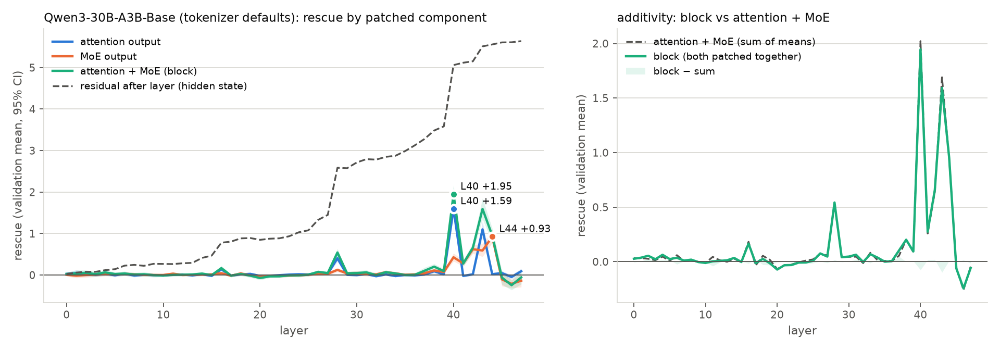
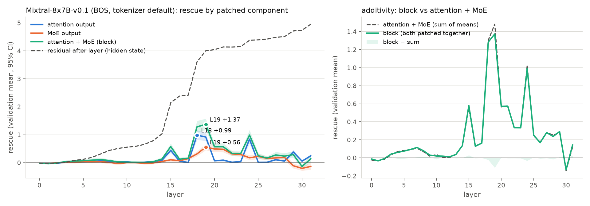
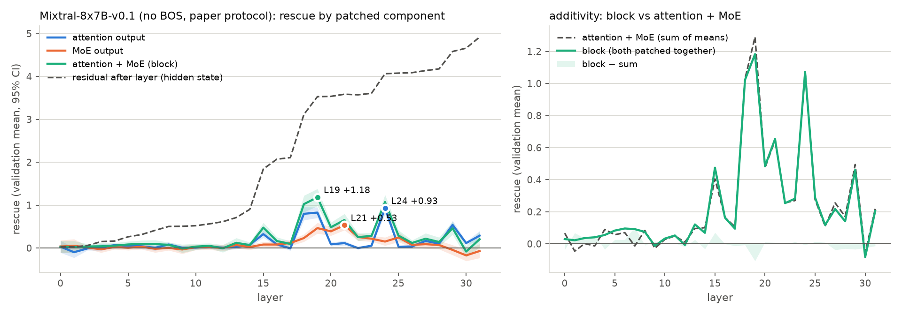
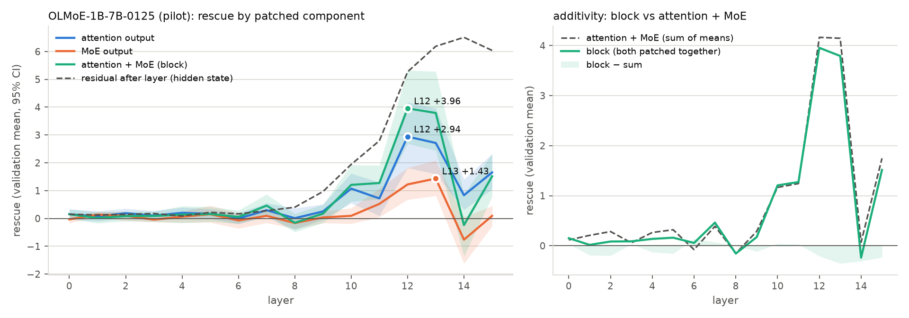
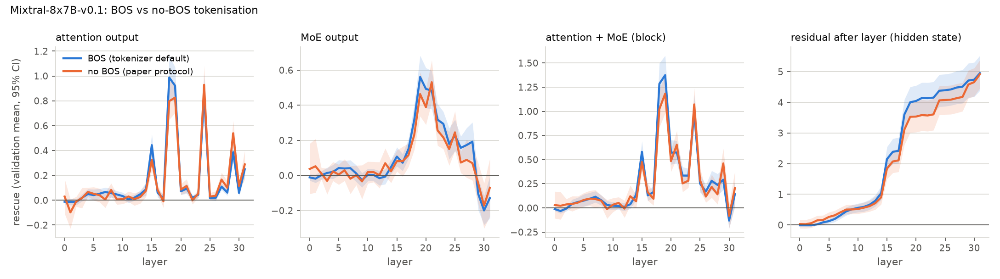

## Extension 2b: attention-sublayer versus MoE-sublayer patching

**Question.** The paper's causal tracing patches only the MoE-block output at the final position. How much of the factual-recall rescue at each layer sits in the attention sublayer (which moves information from the subject tokens to the final position) versus the MoE sublayer (which the paper reads as the retrieval site)?

**Method.** Three new intervention kinds in `moetrace/engine.py` (the previous kinds and their numerics are unchanged; `results/verify_olmoe.json` is bit-identical to `results/verify_olmoe_before_ext2.json` on every non-timing metric). Writing the decoder layer as h_attn = h_pre + Attn_l(h_pre), h_out = h_attn + MoE_l(h_attn), all at the final position of the noised run unless marked clean: `attn_layer` starts a wavefront row *before* the MoE of layer l as h_pre_noised + Attn_l^clean, so the MoE of that layer recomputes (with its router) on the patched residual; `layer` (the paper's patch) replaces the MoE output; `block` replaces both sublayer outputs of layer l, h = (h_pre_noised + Attn_l^clean) + MoE_l^clean; `resid` restores the clean residual h_out^clean after layer l (classic hidden-state causal tracing, which additionally carries the upstream difference h_pre^clean − h_pre^noised and is therefore cumulative). Rescue = Δ_patched − Δ_noised as in Table 1. One pass per run with clean, noised and all four kinds at every layer on the paper's 256 cases (`scripts/ext2_attn_sweep.py`; rows in `results/<run>/sweep_rows.parquet` with the fp32 norm of the patched vector in `vnorm`). Layers are selected on the discovery split and evaluated on validation (5,000-resample bootstrap CIs); the attention share is attn/(attn + moe) as a ratio of validation means with a paired case bootstrap, overall as the ratio of the areas under the positive parts of the validation curves (AUC+). Additivity compares `block` with `attn_layer` + `layer` per layer (mean gap with CI, per-case Pearson r). Code: `moetrace/ext2_attn.py`, `scripts/ext2_attn_analyze.py`.

**Verification (OLMoE-1B-7B-0125, 20 cases x 16 layers, `scripts/ext2_attn_verify.py`, `results/verify_ext2_attn_olmoe.json`).** Against transformers forward hooks (self_attn output, MoE output, decoder-layer output replaced at the final position): per-case |Δ_engine − Δ_HF| mean 0.187 / 0.180 / 0.131 (max 1.61 / 1.19 / 0.95) for attn_layer / block / resid against 0.150 (max 1.12) for the already-verified `layer` kind on the same rows, i.e. the same bf16 noise floor; per-case rescue correlation with HF 0.990 / 0.994 / 0.998 (0.983 for `layer`); 20-case mean curves agree within 0.081 / 0.072 / 0.069 (0.099 for `layer`). Invariants: (a) each kind spawned on the clean run with itself as donor reproduces the clean logits (max |Δ| 0.094, mean 0.015; `zero` on the clean run in verify_olmoe: 0.125); (b) `block` equals the difference form h_noised + (Attn^clean − Attn^noised) + (MoE^clean − MoE^noised) (`block_diff`) to bf16 rounding: mean |Δ| 0.042, 90% within 0.1, max 0.56; (c) the recorded norms of the patched vectors match the HF norms of the final-position differences (mean within 0.3%).

### Qwen3-30B-A3B-Base (tokenizer defaults) (`results/qwen3_bos_attnsweep`)

- Peaks (discovery argmax, validation value): attention output L40 +1.594 [+1.410, +1.791]; MoE output L44 +0.925 [+0.774, +1.096]; block L40 +1.946 [+1.734, +2.169]. Validation argmax: L40 / L44 / L40. Centre of mass of the positive part: 36.3 / 38.6 / 37.6.
- Areas under the positive part (validation): attention 3.95 [3.43, 4.64], MoE 3.76 [3.15, 4.68], block 7.30 [6.42, 8.47]. Attention share attn/(attn+moe): +0.021 [-0.015, +0.055] at the MoE-peak layer L44 (attention +0.020, MoE +0.925), +0.512 [+0.475, +0.547] overall.
- Additivity: at the block-peak layer L40 block +1.946 vs attention + MoE +2.022 (gap -0.076 [-0.123, -0.029], per-case r = 0.98, block exceeds the sum in 34% of cases); across all layers the mean gap is -0.002 (largest |gap| 0.098 at L43), block > sum in 23/48 layers, pooled per-(case, layer) r = 0.96.
- Residual restoration (cumulative): reaches half its maximum at L33, maximum +5.639 [+5.020, +6.292] at L47; largest layer-to-layer increment +1.477 at L40. Noise drop on validation: Δ_clean +5.89 → Δ_noised +0.25.

Figure E2b-qwen3_bos: left, validation mean rescue by layer when the final position's attention output (blue), MoE output (orange) or both (green) are replaced by the clean run's, with 95% bootstrap bands; dashed grey = clean residual restored after the layer (cumulative). Right, block versus the sum of the two single-sublayer rescues. Tables: `results/tables/ext2_attn_peaks_qwen3_bos.md`, `ext2_attn_share_qwen3_bos.md`, `ext2_attn_additivity_qwen3_bos.md`, per-layer curves `ext2_attn_layer_curves_qwen3_bos.csv`.

**Qwen3-30B-A3B-Base (tokenizer defaults): peaks of the rescue curves per patched component (paper set, 128 discovery / 128 validation cases)**

| Patched component | L* (disc.) | Disc. mean at L* | Val. rescue at L* [95% CI] | Val. pos. frac. | Val. argmax | Val. max [95% CI] | AUC+ (val.) [CI] | Centre of mass (val.) |
|---|---|---|---|---|---|---|---|---|
| attention output | L40 | +1.718 | +1.594 [+1.410, +1.791] | 96% | L40 | +1.594 [+1.410, +1.791] | 3.95 [3.43, 4.64] | 36.3 |
| MoE output | L44 | +0.989 | +0.925 [+0.774, +1.096] | 86% | L44 | +0.925 [+0.774, +1.096] | 3.76 [3.15, 4.68] | 38.6 |
| attention + MoE (block) | L40 | +2.089 | +1.946 [+1.734, +2.169] | 95% | L40 | +1.946 [+1.734, +2.169] | 7.30 [6.42, 8.47] | 37.6 |
| residual after layer (hidden state) | L47 | +6.241 | +5.639 [+5.020, +6.292] | 96% | L47 | +5.639 [+5.020, +6.292] | 94.13 [81.54, 107.88] | 36.0 |

**Qwen3-30B-A3B-Base (tokenizer defaults): attention share of the rescue (validation)**

| Where | Layer | Attention rescue | MoE rescue | Attention share attn/(attn+moe) [95% CI] |
|---|---|---|---|---|
| at the MoE-peak layer | L44 | +0.020 | +0.925 | +0.021 [-0.015, +0.055] |
| at the attention-peak layer | L40 | +1.594 | +0.428 | +0.788 [+0.750, +0.829] |
| at the block-peak layer | L40 | +1.594 | +0.428 | +0.788 [+0.750, +0.829] |
| overall (AUC+ of the validation curves) | all | 3.95 | 3.76 | +0.512 [+0.475, +0.547] |

**Qwen3-30B-A3B-Base (tokenizer defaults): additivity at the 8 layers with the largest |block| rescue (validation means)**

| Layer | Attention | MoE | Attn + MoE | Block | Block − (attn + MoE) [95% CI] | Per-case r(block, attn+MoE) | Cases block > sum |
|---|---|---|---|---|---|---|---|
| L28 | +0.403 | +0.124 | +0.527 | +0.542 | +0.015 [-0.016, +0.045] | 0.96 | 40% |
| L38 | +0.092 | +0.109 | +0.201 | +0.201 | +0.000 [-0.022, +0.022] | 0.95 | 33% |
| L40 | +1.594 | +0.428 | +2.022 | +1.946 | -0.076 [-0.123, -0.029] | 0.98 | 34% |
| L41 | -0.021 | +0.280 | +0.258 | +0.275 | +0.017 [-0.005, +0.038] | 0.96 | 37% |
| L42 | +0.017 | +0.622 | +0.639 | +0.658 | +0.019 [-0.007, +0.045] | 0.97 | 38% |
| L43 | +1.100 | +0.591 | +1.691 | +1.593 | -0.098 [-0.139, -0.060] | 0.99 | 27% |
| L44 | +0.020 | +0.925 | +0.945 | +0.955 | +0.010 [-0.015, +0.033] | 0.99 | 40% |
| L46 | -0.047 | -0.212 | -0.259 | -0.245 | +0.014 [-0.011, +0.040] | 0.98 | 41% |

### Mixtral-8x7B-v0.1 (BOS, tokenizer default) (`results/mixtral_bos_attnsweep`)

- Peaks (discovery argmax, validation value): attention output L18 +0.988 [+0.820, +1.164]; MoE output L19 +0.561 [+0.451, +0.683]; block L19 +1.374 [+1.180, +1.577]. Validation argmax: L18 / L19 / L19. Centre of mass of the positive part: 20.1 / 20.6 / 20.0.
- Areas under the positive part (validation): attention 4.93 [4.24, 5.64], MoE 3.95 [3.30, 4.71], block 8.44 [7.34, 9.65]. Attention share attn/(attn+moe): +0.622 [+0.583, +0.661] at the MoE-peak layer L19 (attention +0.921, MoE +0.561), +0.555 [+0.524, +0.582] overall.
- Additivity: at the block-peak layer L19 block +1.374 vs attention + MoE +1.482 (gap -0.108 [-0.175, -0.047], per-case r = 0.97, block exceeds the sum in 31% of cases); across all layers the mean gap is -0.002 (largest |gap| 0.108 at L19), block > sum in 16/32 layers, pooled per-(case, layer) r = 0.96.
- Residual restoration (cumulative): reaches half its maximum at L18, maximum +4.954 [+4.384, +5.526] at L31; largest layer-to-layer increment +1.188 at L18. Noise drop on validation: Δ_clean +6.63 → Δ_noised +1.68.

Figure E2b-mixtral_bos: left, validation mean rescue by layer when the final position's attention output (blue), MoE output (orange) or both (green) are replaced by the clean run's, with 95% bootstrap bands; dashed grey = clean residual restored after the layer (cumulative). Right, block versus the sum of the two single-sublayer rescues. Tables: `results/tables/ext2_attn_peaks_mixtral_bos.md`, `ext2_attn_share_mixtral_bos.md`, `ext2_attn_additivity_mixtral_bos.md`, per-layer curves `ext2_attn_layer_curves_mixtral_bos.csv`.

**Mixtral-8x7B-v0.1 (BOS, tokenizer default): peaks of the rescue curves per patched component (paper set, 128 discovery / 128 validation cases)**

| Patched component | L* (disc.) | Disc. mean at L* | Val. rescue at L* [95% CI] | Val. pos. frac. | Val. argmax | Val. max [95% CI] | AUC+ (val.) [CI] | Centre of mass (val.) |
|---|---|---|---|---|---|---|---|---|
| attention output | L18 | +0.941 | +0.988 [+0.820, +1.164] | 89% | L18 | +0.988 [+0.820, +1.164] | 4.93 [4.24, 5.64] | 20.1 |
| MoE output | L19 | +0.612 | +0.561 [+0.451, +0.683] | 78% | L19 | +0.561 [+0.451, +0.683] | 3.95 [3.30, 4.71] | 20.6 |
| attention + MoE (block) | L19 | +1.345 | +1.374 [+1.180, +1.577] | 89% | L19 | +1.374 [+1.180, +1.577] | 8.44 [7.34, 9.65] | 20.0 |
| residual after layer (hidden state) | L31 | +4.991 | +4.954 [+4.384, +5.526] | 94% | L31 | +4.954 [+4.384, +5.526] | 72.96 [64.17, 82.07] | 22.9 |

**Mixtral-8x7B-v0.1 (BOS, tokenizer default): attention share of the rescue (validation)**

| Where | Layer | Attention rescue | MoE rescue | Attention share attn/(attn+moe) [95% CI] |
|---|---|---|---|---|
| at the MoE-peak layer | L19 | +0.921 | +0.561 | +0.622 [+0.583, +0.661] |
| at the attention-peak layer | L18 | +0.988 | +0.318 | +0.757 [+0.706, +0.804] |
| at the block-peak layer | L19 | +0.921 | +0.561 | +0.622 [+0.583, +0.661] |
| overall (AUC+ of the validation curves) | all | 4.93 | 3.95 | +0.555 [+0.524, +0.582] |

**Mixtral-8x7B-v0.1 (BOS, tokenizer default): additivity at the 8 layers with the largest |block| rescue (validation means)**

| Layer | Attention | MoE | Attn + MoE | Block | Block − (attn + MoE) [95% CI] | Per-case r(block, attn+MoE) | Cases block > sum |
|---|---|---|---|---|---|---|---|
| L15 | +0.443 | +0.107 | +0.551 | +0.581 | +0.030 [-0.006, +0.065] | 0.95 | 43% |
| L18 | +0.988 | +0.318 | +1.306 | +1.285 | -0.021 [-0.068, +0.028] | 0.98 | 30% |
| L19 | +0.921 | +0.561 | +1.482 | +1.374 | -0.108 [-0.175, -0.047] | 0.97 | 31% |
| L20 | +0.071 | +0.493 | +0.564 | +0.572 | +0.007 [-0.018, +0.032] | 0.98 | 31% |
| L21 | +0.094 | +0.483 | +0.577 | +0.574 | -0.003 [-0.029, +0.025] | 0.98 | 34% |
| L22 | +0.020 | +0.318 | +0.337 | +0.335 | -0.002 [-0.021, +0.018] | 0.97 | 28% |
| L23 | +0.044 | +0.294 | +0.338 | +0.334 | -0.004 [-0.026, +0.019] | 0.96 | 28% |
| L24 | +0.844 | +0.179 | +1.023 | +0.992 | -0.031 [-0.062, -0.000] | 0.99 | 25% |

### Mixtral-8x7B-v0.1 (no BOS, paper protocol) (`results/mixtral_nobos_attnsweep`)

- Peaks (discovery argmax, validation value): attention output L24 +0.929 [+0.786, +1.082]; MoE output L21 +0.531 [+0.417, +0.656]; block L19 +1.183 [+0.980, +1.381]. Validation argmax: L24 / L21 / L19. Centre of mass of the positive part: 21.1 / 19.8 / 20.1.
- Areas under the positive part (validation): attention 4.94 [4.29, 5.76], MoE 3.29 [2.43, 4.57], block 7.91 [6.62, 9.48]. Attention share attn/(attn+moe): +0.177 [+0.107, +0.244] at the MoE-peak layer L21 (attention +0.115, MoE +0.531), +0.601 [+0.539, +0.654] overall.
- Additivity: at the block-peak layer L19 block +1.183 vs attention + MoE +1.290 (gap -0.107 [-0.167, -0.048], per-case r = 0.96, block exceeds the sum in 28% of cases); across all layers the mean gap is +0.002 (largest |gap| 0.107 at L19), block > sum in 16/32 layers, pooled per-(case, layer) r = 0.90.
- Residual restoration (cumulative): reaches half its maximum at L18, maximum +4.919 [+4.463, +5.384] at L31; largest layer-to-layer increment +1.006 at L18. Noise drop on validation: Δ_clean +5.49 → Δ_noised +0.57.

Figure E2b-mixtral_nobos: left, validation mean rescue by layer when the final position's attention output (blue), MoE output (orange) or both (green) are replaced by the clean run's, with 95% bootstrap bands; dashed grey = clean residual restored after the layer (cumulative). Right, block versus the sum of the two single-sublayer rescues. Tables: `results/tables/ext2_attn_peaks_mixtral_nobos.md`, `ext2_attn_share_mixtral_nobos.md`, `ext2_attn_additivity_mixtral_nobos.md`, per-layer curves `ext2_attn_layer_curves_mixtral_nobos.csv`.

**Mixtral-8x7B-v0.1 (no BOS, paper protocol): peaks of the rescue curves per patched component (paper set, 128 discovery / 128 validation cases)**

| Patched component | L* (disc.) | Disc. mean at L* | Val. rescue at L* [95% CI] | Val. pos. frac. | Val. argmax | Val. max [95% CI] | AUC+ (val.) [CI] | Centre of mass (val.) |
|---|---|---|---|---|---|---|---|---|
| attention output | L24 | +0.918 | +0.929 [+0.786, +1.082] | 91% | L24 | +0.929 [+0.786, +1.082] | 4.94 [4.29, 5.76] | 21.1 |
| MoE output | L21 | +0.387 | +0.531 [+0.417, +0.656] | 72% | L21 | +0.531 [+0.417, +0.656] | 3.29 [2.43, 4.57] | 19.8 |
| attention + MoE (block) | L19 | +1.053 | +1.183 [+0.980, +1.381] | 84% | L19 | +1.183 [+0.980, +1.381] | 7.91 [6.62, 9.48] | 20.1 |
| residual after layer (hidden state) | L31 | +4.664 | +4.919 [+4.463, +5.384] | 98% | L31 | +4.919 [+4.463, +5.384] | 67.39 [58.72, 76.04] | 22.9 |

**Mixtral-8x7B-v0.1 (no BOS, paper protocol): attention share of the rescue (validation)**

| Where | Layer | Attention rescue | MoE rescue | Attention share attn/(attn+moe) [95% CI] |
|---|---|---|---|---|
| at the MoE-peak layer | L21 | +0.115 | +0.531 | +0.177 [+0.107, +0.244] |
| at the attention-peak layer | L24 | +0.929 | +0.150 | +0.861 [+0.786, +0.942] |
| at the block-peak layer | L19 | +0.826 | +0.464 | +0.640 [+0.593, +0.700] |
| overall (AUC+ of the validation curves) | all | 4.94 | 3.29 | +0.601 [+0.539, +0.654] |

**Mixtral-8x7B-v0.1 (no BOS, paper protocol): additivity at the 8 layers with the largest |block| rescue (validation means)**

| Layer | Attention | MoE | Attn + MoE | Block | Block − (attn + MoE) [95% CI] | Per-case r(block, attn+MoE) | Cases block > sum |
|---|---|---|---|---|---|---|---|
| L15 | +0.323 | +0.081 | +0.405 | +0.475 | +0.070 [+0.013, +0.135] | 0.86 | 41% |
| L18 | +0.798 | +0.232 | +1.029 | +1.022 | -0.007 [-0.058, +0.049] | 0.96 | 35% |
| L19 | +0.826 | +0.464 | +1.290 | +1.183 | -0.107 [-0.167, -0.048] | 0.96 | 28% |
| L20 | +0.086 | +0.389 | +0.474 | +0.484 | +0.010 [-0.022, +0.044] | 0.96 | 34% |
| L21 | +0.115 | +0.531 | +0.646 | +0.654 | +0.008 [-0.027, +0.047] | 0.97 | 30% |
| L24 | +0.929 | +0.150 | +1.079 | +1.072 | -0.008 [-0.063, +0.051] | 0.95 | 37% |
| L25 | +0.030 | +0.246 | +0.275 | +0.288 | +0.013 [-0.012, +0.037] | 0.98 | 30% |
| L29 | +0.539 | -0.045 | +0.494 | +0.461 | -0.034 [-0.079, +0.008] | 0.96 | 32% |

### OLMoE-1B-7B-0125 (pilot) (`results/olmoe_attnsweep`)

- Peaks (discovery argmax, validation value): attention output L13 +2.713 [+1.596, +3.959]; MoE output L12 +1.223 [+0.677, +1.824]; block L12 +3.955 [+2.687, +5.320]. Validation argmax: L12 / L13 / L12. Centre of mass of the positive part: 11.7 / 11.1 / 11.7.
- Areas under the positive part (validation): attention 11.37 [8.37, 14.79], MoE 3.94 [2.97, 5.44], block 13.07 [9.53, 17.28]. Attention share attn/(attn+moe): +0.706 [+0.585, +0.810] at the MoE-peak layer L12 (attention +2.942, MoE +1.223), +0.743 [+0.687, +0.779] overall.
- Additivity: at the block-peak layer L12 block +3.955 vs attention + MoE +4.164 (gap -0.209 [-0.571, +0.122], per-case r = 0.97, block exceeds the sum in 44% of cases); across all layers the mean gap is -0.097 (largest |gap| 0.354 at L13), block > sum in 6/16 layers, pooled per-(case, layer) r = 0.97.
- Residual restoration (cumulative): reaches half its maximum at L12, maximum +6.509 [+4.476, +8.691] at L14; largest layer-to-layer increment +2.478 at L12. Noise drop on validation: Δ_clean +5.92 → Δ_noised -0.12.

Figure E2b-olmoe: left, validation mean rescue by layer when the final position's attention output (blue), MoE output (orange) or both (green) are replaced by the clean run's, with 95% bootstrap bands; dashed grey = clean residual restored after the layer (cumulative). Right, block versus the sum of the two single-sublayer rescues. Tables: `results/tables/ext2_attn_peaks_olmoe.md`, `ext2_attn_share_olmoe.md`, `ext2_attn_additivity_olmoe.md`, per-layer curves `ext2_attn_layer_curves_olmoe.csv`.

**OLMoE-1B-7B-0125 (pilot): peaks of the rescue curves per patched component (strict set, 16 discovery / 16 validation cases)**

| Patched component | L* (disc.) | Disc. mean at L* | Val. rescue at L* [95% CI] | Val. pos. frac. | Val. argmax | Val. max [95% CI] | AUC+ (val.) [CI] | Centre of mass (val.) |
|---|---|---|---|---|---|---|---|---|
| attention output | L13 | +3.310 | +2.713 [+1.596, +3.959] | 94% | L12 | +2.942 [+1.816, +4.176] | 11.37 [8.37, 14.79] | 11.7 |
| MoE output | L12 | +2.020 | +1.223 [+0.677, +1.824] | 94% | L13 | +1.434 [+0.815, +2.084] | 3.94 [2.97, 5.44] | 11.1 |
| attention + MoE (block) | L12 | +4.331 | +3.955 [+2.687, +5.320] | 100% | L12 | +3.955 [+2.687, +5.320] | 13.07 [9.53, 17.28] | 11.7 |
| residual after layer (hidden state) | L14 | +7.879 | +6.509 [+4.476, +8.691] | 100% | L14 | +6.509 [+4.476, +8.691] | 31.46 [22.56, 41.10] | 12.5 |

**OLMoE-1B-7B-0125 (pilot): attention share of the rescue (validation)**

| Where | Layer | Attention rescue | MoE rescue | Attention share attn/(attn+moe) [95% CI] |
|---|---|---|---|---|
| at the MoE-peak layer | L12 | +2.942 | +1.223 | +0.706 [+0.585, +0.810] |
| at the attention-peak layer | L13 | +2.713 | +1.434 | +0.654 [+0.545, +0.756] |
| at the block-peak layer | L12 | +2.942 | +1.223 | +0.706 [+0.585, +0.810] |
| overall (AUC+ of the validation curves) | all | 11.37 | 3.94 | +0.743 [+0.687, +0.779] |

**OLMoE-1B-7B-0125 (pilot): additivity at the 8 layers with the largest |block| rescue (validation means)**

| Layer | Attention | MoE | Attn + MoE | Block | Block − (attn + MoE) [95% CI] | Per-case r(block, attn+MoE) | Cases block > sum |
|---|---|---|---|---|---|---|---|
| L7 | +0.295 | +0.094 | +0.389 | +0.462 | +0.073 [-0.131, +0.234] | 0.89 | 75% |
| L9 | +0.252 | +0.036 | +0.288 | +0.173 | -0.115 [-0.323, +0.076] | 0.82 | 38% |
| L10 | +1.072 | +0.094 | +1.166 | +1.207 | +0.041 [-0.269, +0.417] | 0.87 | 31% |
| L11 | +0.719 | +0.523 | +1.243 | +1.273 | +0.030 [-0.390, +0.504] | 0.78 | 38% |
| L12 | +2.942 | +1.223 | +4.164 | +3.955 | -0.209 [-0.571, +0.122] | 0.97 | 44% |
| L13 | +2.713 | +1.434 | +4.146 | +3.792 | -0.354 [-0.628, -0.093] | 0.99 | 25% |
| L14 | +0.835 | -0.764 | +0.071 | -0.238 | -0.309 [-0.593, -0.091] | 0.98 | 19% |
| L15 | +1.654 | +0.093 | +1.747 | +1.515 | -0.232 [-0.461, -0.037] | 0.96 | 31% |

### Mixtral: BOS versus no-BOS tokenisation

The layer curves of the two protocols are highly correlated across layers (r = 0.97 attention, 0.96 MoE, 0.98 block); the validation argmax layers are L18/L24 (attention), L19/L21 (MoE) and L19/L19 (block) with/without BOS. The largest protocol difference is 0.123 at L28 for the MoE curve and 0.190 at L18 for the attention curve; paired per-case differences at the BOS argmax: MoE +0.097 [-0.047, +0.250], attention +0.190 [+0.024, +0.359].

Figure E2b-protocol: the same 256 paper cases tokenised with and without `<s>`; one panel per patched component.

**Mixtral-8x7B-v0.1: attention / MoE / block curves with and without BOS**

| Patched component | BOS: val. argmax, max | no BOS: val. argmax, max | Curve correlation (layers) | Max |BOS − noBOS| (layer) | Paired BOS − noBOS at BOS argmax [CI] |
|---|---|---|---|---|---|
| attention output | L18 +0.988 | L24 +0.929 | 0.974 | 0.190 (L18) | +0.190 [+0.024, +0.359] |
| MoE output | L19 +0.561 | L21 +0.531 | 0.958 | 0.123 (L28) | +0.097 [-0.047, +0.250] |
| attention + MoE (block) | L19 +1.374 | L19 +1.183 | 0.976 | 0.262 (L18) | +0.191 [-0.032, +0.426] |
| residual after layer (hidden state) | L31 +4.954 | L31 +4.919 | 0.997 | 0.566 (L22) | +0.035 [-0.399, +0.463] |

### Reading

- **Qwen3-30B-A3B-Base (tokenizer defaults).** The attention-output rescue is centred earlier than the MoE-output rescue (centre of mass 36.3 vs 38.6; discovery peaks L40 vs L44). Over all layers attention carries 51% [47%, 55%] of the positive rescue area; at the MoE-peak layer L44 the attention patch alone gives +0.020 against +0.925 for the MoE patch. Patching both sublayers of one layer (+1.946 at L40) falls short of the sum of the two single-sublayer rescues by 0.076 at the block peak; the per-case correlation between block and sum is 0.98.
- **Mixtral-8x7B-v0.1 (BOS, tokenizer default).** The attention-output rescue is centred at about the same depth as the MoE-output rescue (centre of mass 20.1 vs 20.6; discovery peaks L18 vs L19). Over all layers attention carries 56% [52%, 58%] of the positive rescue area; at the MoE-peak layer L19 the attention patch alone gives +0.921 against +0.561 for the MoE patch. Patching both sublayers of one layer (+1.374 at L19) falls short of the sum of the two single-sublayer rescues by 0.108 at the block peak; the per-case correlation between block and sum is 0.97.
- **Mixtral-8x7B-v0.1 (no BOS, paper protocol).** The attention-output rescue is centred later than the MoE-output rescue (centre of mass 21.1 vs 19.8; discovery peaks L24 vs L21). Over all layers attention carries 60% [54%, 65%] of the positive rescue area; at the MoE-peak layer L21 the attention patch alone gives +0.115 against +0.531 for the MoE patch. Patching both sublayers of one layer (+1.183 at L19) falls short of the sum of the two single-sublayer rescues by 0.107 at the block peak; the per-case correlation between block and sum is 0.96.
- **OLMoE-1B-7B-0125 (pilot).** The attention-output rescue is centred later than the MoE-output rescue (centre of mass 11.7 vs 11.1; discovery peaks L13 vs L12). Over all layers attention carries 74% [69%, 78%] of the positive rescue area; at the MoE-peak layer L12 the attention patch alone gives +2.942 against +1.223 for the MoE patch. Patching both sublayers of one layer (+3.955 at L12) falls short of the sum of the two single-sublayer rescues by 0.209 at the block peak; the per-case correlation between block and sum is 0.97.

### Interpretation: where information moves and where it is transformed

The two patches read different channels. `attn_layer` replaces the final position's attention output with the clean run's, i.e. everything that layer l's attention *moves into* the final position from a clean context (subject tokens included); the MoE of that layer then recomputes on the patched residual. `layer` (the paper's patch) replaces the MoE output, i.e. what layer l's MoE *computes from* a final-position residual that already carries the clean information. The first is the information-movement channel, the second the per-position transformation ("retrieval/readout") channel; `block` patches both and `resid` restores everything that has arrived by layer l.

- **Movement precedes transformation, but the two overlap in a narrow band.** In Qwen3 the attention rescue is concentrated in two layers, L40 (+1.59, positive in 96% of validation cases) and L43 (+1.10, 90%), with a smaller step at L28 (+0.40); the MoE rescue sits at L42–L44 (+0.62, +0.59, +0.93) plus L40 (+0.43). The attention peak (L40) is four layers before the paper's MoE peak (L44); the centre of mass of the positive part is 36.3 vs 38.6. In Mixtral the attention peak is L18 (+0.99, 89%) with L19 (+0.92), L24 (+0.84) and L15 (+0.44); the MoE rescue is broader and later, L19–L23 (+0.56 at L19, +0.49/+0.48 at L20/L21). The hidden-state curve agrees: its largest layer-to-layer increments are exactly the attention peaks (Qwen3 +1.48 at L40, +0.36 at L43, +0.14 at L28; Mixtral +1.19 at L18, +1.11 at L15, +0.40 at L19), and half of the total drop is already present in the final-position residual by L33 (Qwen3) and L18 (Mixtral). The answer information therefore arrives at the final position in a few discrete attention steps, and the MoE sublayers of the same and the next few layers transform it.

- **How much of the layer effect the paper's MoE-only patch sees.** At the paper's Qwen3 layer L44 the rescue is entirely in the MoE sublayer (attention share 2% [−2%, 6%]; block +0.96 = MoE +0.93): L44E069 sits in a pure transformation layer and the paper's reading of it as a retrieval site is coherent. But the largest single-sublayer effect in the network is the attention output at L40 (+1.59 vs +0.93 for the L44 MoE), and the largest single-layer effect is the L40 block (+1.95, twice the paper's L44 layer rescue); MoE-only patching cannot see either, and it ranks L40 fourth (MoE +0.43). At the paper's Mixtral layer L19 the picture inverts: 62% [58%, 66%] of the L19 rescue comes from the attention output (+0.92 vs +0.56), and the attention output one layer earlier (L18, +0.99) beats every MoE-output patch in the model. Over all layers the two channels carry equal areas (attention share of AUC+ 51% in Qwen3, 56% / 60% in Mixtral with / without BOS), so the paper's Figure 1 curves describe half of the layer-level effect, and in Mixtral the smaller half at the selected layer. That the Mixtral L19 MoE carries a minority of its layer's rescue is consistent with the weak and unstable expert-level results there (Table 1 Spec −0.18; ext1: no L19 expert survives recurrence and specificity together).

- **The two sublayers add up.** `block` equals `attn_layer` + `layer` to within bf16 noise at almost every layer (per-case r 0.96–0.99 at the peaks, pooled r ≥ 0.96), with a small but significant *sub*-additivity only where both channels are active at once: Qwen3 L40 −0.08 [−0.12, −0.03] and L43 −0.10 [−0.14, −0.06], Mixtral L19 −0.11 [−0.18, −0.05] (BOS) / −0.11 [−0.17, −0.05] (no BOS). The two channels are therefore complementary rather than redundant carriers of the same information; the slight saturation at the shared peaks shows a common answer direction in both outputs there. In norm the attention differences are small relative to the MoE differences (Qwen3 L44: |ΔAttn| 7.7 vs |ΔMoE| 25.6; L40: 9.5 vs 9.9), so per unit of patched norm the attention output is the more answer-aligned vector.

- **Protocol.** BOS vs no BOS changes none of this for Mixtral (layer-curve correlations 0.96–0.98; block argmax L19 under both). The BOS run is slightly stronger at the L18 attention step (paired +0.19 [+0.02, +0.36]); without BOS the attention argmax moves to L24 (+0.93 vs L18 +0.80, within each other's CIs) and the MoE argmax to L21 (+0.53 vs L19 +0.46, likewise). The no-BOS run has residual-difference norms of ~10³ from L12 on (BOS: 24–340), the massive-norm sink state that forms on a content token without `<s>` (Extension 3) and that noise can relocate; it does not change the rescue curves.

- **Pilot.** OLMoE-1B-7B (our strict 32-case set, 16/16 split) shows the same attention-dominant pattern: attention output +2.9 at L12 vs MoE output +1.4 at L13, share 71%, block +4.0 at L12, additivity gap −0.21 (r 0.97).

**Consequence for expert-aware tracing.** Selecting the layer by MoE-output rescue and then searching experts inside it studies the transformation channel only. That is the right object for the Qwen3 L44 result, but it misses the L40/L43 attention steps that deliver the information, and in Mixtral it selects a layer whose rescue is mostly attention. A complete expert-aware picture needs the attention side as well — the natural next step is a per-head version of `attn_layer` at L40/L43 (Qwen3) and L15/L18/L19/L24 (Mixtral) to find the heads that move the subject information, i.e. the MoE-model analogue of the "mover heads" of dense-model causal tracing.
