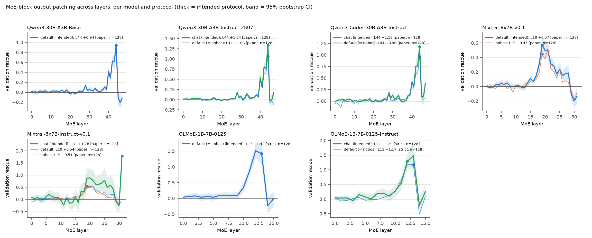
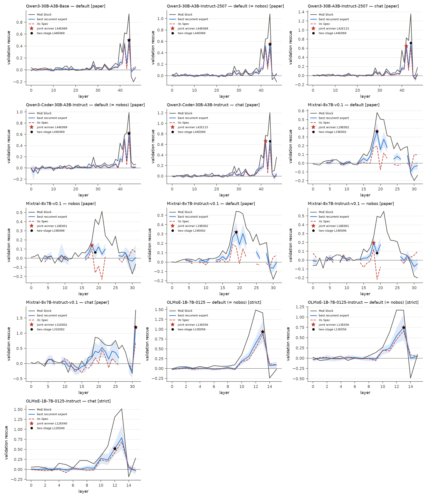
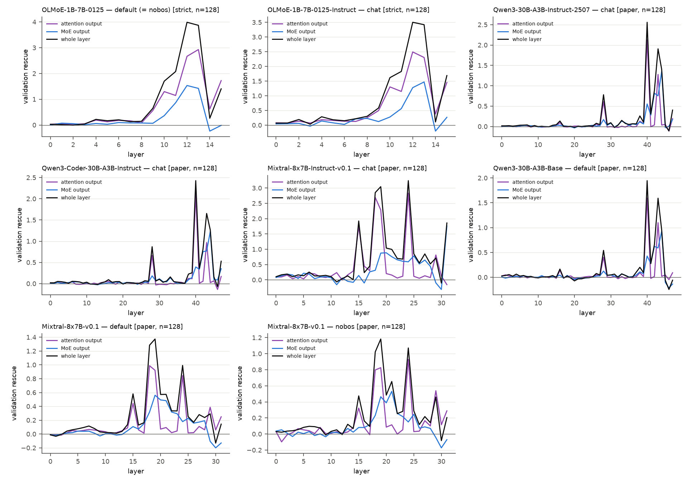

## Extension 2A: does the pattern generalise? Five additional MoE checkpoints under intended and paper protocols

**Question.** The paper reports two patterns on two base models: Qwen3-30B-A3B-Base localises factual recall in one MoE layer (L44) and in one specific, recurrent expert (L44E069); Mixtral-8x7B-v0.1 localises in L19 but the recurrent expert (L19E006) is not specific and only coalitions recover the layer effect. We ask whether these patterns hold (i) for the instruction-tuned and code-specialised descendants of the same weights (Qwen3-30B-A3B-Instruct-2507, Qwen3-Coder-30B-A3B-Instruct, Mixtral-8x7B-Instruct-v0.1), (ii) for a third, fully open family (OLMoE-1B-7B-0125 base and Instruct), and (iii) whether the answer depends on running each model the way it is meant to be used (tokenizer defaults; chat template for instruct models) or under the paper's protocol (no special tokens, raw cloze).

**Method.** Every model gets a usage specification (`data/model_usage/<key>.json`, table below) verified from its `tokenizer_config.json`, `generation_config.json`, `config.json`, chat template and model card plus an empirical tokenizer probe. Protocols: `default` = tokenizer defaults, raw cloze; `nobos` = no special tokens, raw cloze (the paper's protocol; identical to `default` for every model whose tokenizer adds nothing, i.e. all but the Mistral family, and then run once); `chat` = the chat template rendered with the user instruction "Complete the sentence with the single most likely next word." and an opened assistant turn, tokenised as `prefix_ids`, with the raw cloze prompt following inside the assistant turn (the final position is still the prompt's last token, subject noise still hits the subject tokens; the exact rendered prefix is in each `run_meta.json`). Per model and protocol we ran the full paper pipeline with the reproduction's engine and defaults (sigma = 3 x embed std, space object-token rule, seed-0 shuffle): filter scan (strict 1.0/0.5 -> own 256-case set; relaxed 0.5/0.25 -> own 512-case set; plus the BASE model's paper case IDs where the family has one, so that instruct results are directly comparable with REPORT.md), layer sweep (MoE-block output patch at every layer), and the Direction-1 all-layer expert pass (`--no-pairs`, every clean-active and noised-only expert, both coalitions and the layer patch at EVERY layer). Analysis per (run, case set): the paper's two-stage selection (L* by discovery block rescue; recurrence-first expert with threshold = half the discovery split; validation rescue, active-random Spec with 3 controls for top-8 models and 1 for Mixtral, coalitions, Appendix-D grid) and the joint layer x expert search (`moetrace/ext1_analysis.py`). The base model's experts are evaluated in every run as fixed hypotheses. Each sweep pass also records the ext3 sink diagnostic (`DiagSpec(attn_final, resid_norms)` on the clean rows): the fraction of prompts whose FINAL position carries the maximal residual norm at the model's sink layer (the early layer where the massive-activation state is most pronounced) and the fraction whose final position puts more attention mass on itself than on any other position. Pattern labels: **A** = one positive, specific expert (validation rescue and Spec CIs above 0); **B** = layer-level localisation but the selected expert is not specific or none is recurrent (coalition model); **C** = no layer-level localisation (validation rescue CI at L* includes 0). Code: `moetrace/ext2_zoo.py`, `scripts/ext2_zoo_{usage,filter,sweep,expert,chain,analyze}.{py,sh}`; runs: `results/<model>_<protocol>/`.

### Usage specifications

| model | family | base | adds BOS | adds EOS | BOS token | EOS token | dtype (config) | chat template | default system prompt | prefix tokens | rendered chat prefix | protocols |
|---|---|---|---|---|---|---|---|---|---|---|---|---|
| Qwen3-30B-A3B-Instruct-2507 | qwen3_moe | qwen3 | no | no | - | <|im_end|> | bfloat16 | tokenizer_config.json | none | 19 | '<|im_start|>user\nComplete the sentence with the single most likely next word.<|im_end|>\n<|im_start|>assistant\n' | default, nobos, chat |
| Qwen3-Coder-30B-A3B-Instruct | qwen3_moe | qwen3 | no | no | - | <|im_end|> | bfloat16 | tokenizer_config.json | none | 19 | '<|im_start|>user\nComplete the sentence with the single most likely next word.<|im_end|>\n<|im_start|>assistant\n' | default, nobos, chat |
| Mixtral-8x7B-Instruct-v0.1 | mixtral | mixtral | yes | no | <s> | </s> | bfloat16 | tokenizer_config.json | none | 19 | '<s> [INST] Complete the sentence with the single most likely next word. [/INST]' | default, nobos, chat |
| OLMoE-1B-7B-0125 | olmoe | - | no | no | - | <|endoftext|> | float32 | none | none | - | - | default, nobos |
| OLMoE-1B-7B-0125-Instruct | olmoe | olmoe | no | no | |||IP_ADDRESS||| | |||IP_ADDRESS||| | bfloat16 | tokenizer_config.json | none | 24 | '|||IP_ADDRESS|||<|user|>\nComplete the sentence with the single most likely next word.\n<|assistant|>\n' | default, nobos, chat |

Notes. Qwen3 tokenizers add no special tokens (`default` = `nobos` = the paper protocol), so the Qwen3 family has two protocols (raw, chat); the Mistral family adds `<s>` and has three (default = BOS, nobos, chat; the Instruct template itself begins with `<s>`); OLMoE adds nothing. OLMoE-1B-7B-0125-Instruct's tokenizer names token id 50279 `|||IP_ADDRESS|||` and uses it as both BOS and EOS in its template, whereas the model card writes the same template with `<|endoftext|>` (id 50279 in the base tokenizer): the rendered prefix therefore starts with id 50279 exactly as documented, only the string differs. Qwen3-30B-A3B-Instruct-2507 and Qwen3-Coder are non-thinking models (no `<think>` block in the template). No model has a default system prompt in its template (Ai2 mentions a demo prompt for OLMoE-Instruct but states the model was not trained with one), so none is used. bf16 is the recommended dtype of every new checkpoint (OLMoE base ships fp32 and was run in bf16 like the pilot).

### Cross-model summary

| model | protocol (* intended) | case set | L* | layer rescue [CI] (share of the noise drop) | selected expert | active disc/val | expert rescue [CI] | Spec [CI] | coalitions top-k / union | joint winner (rescue / Spec) | sink-final frac | funnel strict pass | e* stable (grid) | pattern |
|---|---|---|---|---|---|---|---|---|---|---|---|---|---|---|
| Qwen3-30B-A3B-Base | default * | paper | L44 | +0.941 [+0.778, +1.124] (17% of drop +5.6) | L44E069 | 114/116 | +0.499 [+0.357, +0.659] | +0.443 [+0.302, +0.603] | +0.916 / +0.941 | L44E069 (+0.499 / +0.443) same | 0.000 | 234/256 | 25/25 | A |
| Qwen3-30B-A3B-Base | default * | strict | L44 | +0.921 [+0.735, +1.119] (16% of drop +5.6) | L44E069 | 117/116 | +0.480 [+0.332, +0.649] | +0.421 [+0.268, +0.595] | +0.898 / +0.930 | L42E115 (+0.434 / +0.409) differs | 0.000 | 253/256 | 25/25 | A |
| Qwen3-30B-A3B-Base | default * | relaxed | L44 | +0.791 [+0.668, +0.909] (14% of drop +5.6) | L44E069 | 228/235 | +0.429 [+0.331, +0.537] | +0.364 [+0.263, +0.473] | +0.803 / +0.812 | L42E115 (+0.426 / +0.393) differs | 0.000 | 486/512 | 25/25 | A |
| Qwen3-30B-A3B-Instruct-2507 | default (= nobos) | paper | L44 | +1.065 [+0.904, +1.240] (15% of drop +7.0) | L44E069 | 110/115 | +0.549 [+0.422, +0.690] | +0.464 [+0.333, +0.609] | +1.065 / +1.082 | L44E069 (+0.549 / +0.464) same | 0.000 | 234/256 | 25/25 | A |
| Qwen3-30B-A3B-Instruct-2507 | default (= nobos) | strict | L44 | +0.964 [+0.788, +1.148] (14% of drop +6.9) | L44E069 | 108/108 | +0.460 [+0.319, +0.604] | +0.402 [+0.259, +0.551] | +0.950 / +0.972 | L44E069 (+0.460 / +0.402) same | 0.000 | 254/256 | 25/25 | A |
| Qwen3-30B-A3B-Instruct-2507 | default (= nobos) | relaxed | L44 | +0.879 [+0.758, +1.003] (13% of drop +6.6) | L44E069 | 220/214 | +0.405 [+0.323, +0.490] | +0.341 [+0.255, +0.432] | +0.863 / +0.875 | L44E069 (+0.405 / +0.341) same | 0.000 | 486/512 | 25/25 | A |
| Qwen3-30B-A3B-Instruct-2507 | chat * | paper | L44 | +1.341 [+1.134, +1.558] (17% of drop +8.0) | L44E069 | 112/112 | +0.716 [+0.551, +0.901] | +0.617 [+0.440, +0.809] | +1.358 / +1.357 | L42E115 (+0.642 / +0.605) differs | 0.000 | 236/256 | 25/25 | A |
| Qwen3-30B-A3B-Instruct-2507 | chat * | strict | L44 | +1.257 [+1.049, +1.472] (16% of drop +7.8) | L44E069 | 109/111 | +0.609 [+0.452, +0.778] | +0.532 [+0.366, +0.706] | +1.268 / +1.263 | L42E115 (+0.574 / +0.549) differs | 0.000 | 254/256 | 25/25 | A |
| Qwen3-30B-A3B-Instruct-2507 | chat * | relaxed | L44 | +1.145 [+1.007, +1.285] (15% of drop +7.7) | L44E069 | 222/222 | +0.571 [+0.467, +0.680] | +0.490 [+0.383, +0.606] | +1.138 / +1.139 | L44E069 (+0.571 / +0.490) same | 0.000 | 499/512 | 25/25 | A |
| Qwen3-Coder-30B-A3B-Instruct | default (= nobos) | paper | L44 | +0.962 [+0.779, +1.152] (17% of drop +5.8) | L44E069 | 111/110 | +0.615 [+0.479, +0.763] | +0.551 [+0.413, +0.699] | +0.989 / +0.988 | L44E069 (+0.615 / +0.551) same | 0.000 | 218/256 | 25/25 | A |
| Qwen3-Coder-30B-A3B-Instruct | default (= nobos) | strict | L44 | +0.972 [+0.773, +1.177] (16% of drop +6.0) | L44E069 | 116/105 | +0.488 [+0.354, +0.635] | +0.415 [+0.273, +0.569] | +0.977 / +0.988 | L44E069 (+0.488 / +0.415) same | 0.000 | 253/256 | 25/25 | A |
| Qwen3-Coder-30B-A3B-Instruct | default (= nobos) | relaxed | L44 | +0.920 [+0.797, +1.045] (15% of drop +6.2) | L44E069 | 222/225 | +0.531 [+0.439, +0.624] | +0.468 [+0.375, +0.563] | +0.925 / +0.931 | L44E069 (+0.531 / +0.468) same | 0.000 | 491/512 | 25/25 | A |
| Qwen3-Coder-30B-A3B-Instruct | chat * | paper | L44 | +1.181 [+0.964, +1.407] (15% of drop +7.9) | L44E069 | 118/116 | +0.660 [+0.504, +0.825] | +0.590 [+0.434, +0.754] | +1.192 / +1.205 | L42E115 (+0.660 / +0.631) differs | 0.000 | 223/256 | 25/25 | A |
| Qwen3-Coder-30B-A3B-Instruct | chat * | strict | L44 | +1.066 [+0.855, +1.281] (12% of drop +8.7) | L44E069 | 117/115 | +0.472 [+0.337, +0.615] | +0.385 [+0.235, +0.536] | +1.077 / +1.082 | L44E069 (+0.472 / +0.385) same | 0.000 | 251/256 | 25/25 | A |
| Qwen3-Coder-30B-A3B-Instruct | chat * | relaxed | L44 | +1.248 [+1.094, +1.407] (15% of drop +8.6) | L44E069 | 232/236 | +0.636 [+0.524, +0.751] | +0.552 [+0.433, +0.678] | +1.238 / +1.252 | L42E115 (+0.681 / +0.656) differs | 0.000 | 493/512 | 25/25 | A |
| Mixtral-8x7B-v0.1 | default * | paper | L19 | +0.571 [+0.461, +0.692] (11% of drop +5.0) | L19E002 | 76/84 | +0.363 [+0.267, +0.471] | +0.192 [+0.094, +0.296] | +0.559 / +0.580 | L19E002 (+0.363 / +0.192) same | 0.000 | 232/256 | 17/25 | A |
| Mixtral-8x7B-v0.1 | default * | strict | L19 | +0.635 [+0.514, +0.766] (11% of drop +5.5) | L19E002 | 79/90 | +0.426 [+0.319, +0.546] | +0.257 [+0.148, +0.379] | +0.636 / +0.649 | L19E002 (+0.426 / +0.257) same | 0.000 | 255/256 | 20/25 | A |
| Mixtral-8x7B-v0.1 | default * | relaxed | L19 | +0.600 [+0.523, +0.685] (12% of drop +5.2) | L19E002 | 166/162 | +0.356 [+0.287, +0.430] | +0.175 [+0.103, +0.253] | +0.593 / +0.598 | L19E002 (+0.356 / +0.175) same | 0.000 | 494/512 | 25/25 | A |
| Mixtral-8x7B-v0.1 | nobos | paper | L19 | +0.446 [+0.318, +0.569] (9% of drop +4.9) | L19E006 | 91/83 | +0.063 [-0.009, +0.134] | -0.159 [-0.252, -0.065] | +0.442 / +0.426 | L18E001 (+0.139 / +0.098) differs | 0.246 | 249/256 | 8/25 | B |
| Mixtral-8x7B-Instruct-v0.1 | default | paper | L19 | +0.540 [+0.426, +0.665] (10% of drop +5.4) | L19E002 | 78/86 | +0.320 [+0.227, +0.427] | +0.165 [+0.066, +0.268] | +0.519 / +0.543 | L19E002 (+0.320 / +0.165) same | 0.000 | 239/256 | 19/25 | A |
| Mixtral-8x7B-Instruct-v0.1 | default | strict | L19 | +0.508 [+0.402, +0.617] (9% of drop +5.4) | L19E002 | 92/80 | +0.289 [+0.197, +0.387] | +0.162 [+0.064, +0.263] | +0.490 / +0.499 | L19E002 (+0.289 / +0.162) same | 0.000 | 255/256 | 20/25 | A |
| Mixtral-8x7B-Instruct-v0.1 | default | relaxed | L19 | +0.565 [+0.485, +0.650] (10% of drop +5.7) | L19E002 | 170/160 | +0.317 [+0.250, +0.391] | +0.151 [+0.082, +0.225] | +0.546 / +0.554 | L19E002 (+0.317 / +0.151) same | 0.000 | 501/512 | 25/25 | A |
| Mixtral-8x7B-Instruct-v0.1 | nobos | paper | L19 | +0.512 [+0.387, +0.643] (12% of drop +4.2) | L19E006 | 91/83 | +0.079 [+0.023, +0.144] | -0.217 [-0.308, -0.130] | +0.506 / +0.495 | L18E001 (+0.192 / +0.122) differs | 0.238 | 226/256 | 9/25 | B |
| Mixtral-8x7B-Instruct-v0.1 | nobos | strict | L19 | +0.444 [+0.341, +0.552] (9% of drop +4.7) | L19E006 | 88/80 | +0.034 [-0.002, +0.070] | -0.224 [-0.306, -0.151] | +0.433 / +0.430 | L21E001 (+0.311 / +0.180) differs | 0.238 | 256/256 | 6/25 | B |
| Mixtral-8x7B-Instruct-v0.1 | nobos | relaxed | L19 | +0.481 [+0.398, +0.569] (11% of drop +4.4) | L19E006 | 173/160 | +0.097 [+0.061, +0.136] | -0.174 [-0.237, -0.112] | +0.476 / +0.478 | L18E001 (+0.146 / +0.091) differs | 0.238 | 476/512 | 0/25 | B |
| Mixtral-8x7B-Instruct-v0.1 | chat * | paper | L31 | +1.785 [+1.262, +2.333] (20% of drop +9.1) | L31E002 | 78/85 | +1.193 [+0.810, +1.601] | +0.713 [+0.328, +1.126] | +1.790 / +1.762 | L31E002 (+1.193 / +0.713) same | 0.000 | 218/256 | 19/25 | A |
| Mixtral-8x7B-Instruct-v0.1 | chat * | strict | L31 | +2.544 [+2.061, +3.036] (24% of drop +10.7) | L31E002 | 87/83 | +1.560 [+1.165, +1.969] | +0.732 [+0.328, +1.147] | +2.532 / +2.610 | L31E002 (+1.560 / +0.732) same | 0.000 | 253/256 | 20/25 | A |
| Mixtral-8x7B-Instruct-v0.1 | chat * | relaxed | L31 | +2.435 [+2.092, +2.790] (24% of drop +10.2) | L31E002 | 174/182 | +1.682 [+1.414, +1.958] | +0.985 [+0.714, +1.273] | +2.358 / +2.415 | L31E002 (+1.682 / +0.985) same | 0.000 | 498/512 | 25/25 | A |
| OLMoE-1B-7B-0125 | default (= nobos) * | strict | L13 | +1.422 [+1.086, +1.770] (23% of drop +6.3) | L13E056 | 100/102 | +0.937 [+0.671, +1.218] | +0.874 [+0.602, +1.152] | +1.414 / +1.416 | L13E056 (+0.937 / +0.874) same | 0.000 | 256/256 | 25/25 | A |
| OLMoE-1B-7B-0125 | default (= nobos) * | relaxed | L12 | +1.291 [+1.128, +1.465] (22% of drop +5.9) | L12E040 | 199/201 | +0.687 [+0.562, +0.822] | +0.619 [+0.478, +0.766] | +1.239 / +1.270 | L13E056 (+1.055 / +1.000) differs | 0.000 | 494/512 | 25/25 | A |
| OLMoE-1B-7B-0125-Instruct | default (= nobos) | strict | L13 | +1.175 [+0.796, +1.557] (18% of drop +6.5) | L13E056 | 103/106 | +0.745 [+0.435, +1.065] | +0.664 [+0.342, +0.982] | +1.216 / +1.168 | L13E056 (+0.745 / +0.664) same | 0.000 | 253/256 | 25/25 | A |
| OLMoE-1B-7B-0125-Instruct | default (= nobos) | relaxed | L13 | +1.190 [+0.936, +1.456] (18% of drop +6.5) | L13E056 | 200/223 | +0.761 [+0.551, +0.980] | +0.701 [+0.490, +0.925] | +1.203 / +1.206 | L13E056 (+0.761 / +0.701) same | 0.000 | 488/512 | 25/25 | A |
| OLMoE-1B-7B-0125-Instruct | chat * | strict | L12 | +1.286 [+1.029, +1.547] (18% of drop +7.3) | L12E040 | 104/103 | +0.518 [+0.364, +0.675] | +0.413 [+0.250, +0.582] | +1.259 / +1.309 | L12E040 (+0.518 / +0.413) same | 0.000 | 255/256 | 25/25 | A |
| OLMoE-1B-7B-0125-Instruct | chat * | relaxed | L13 | +1.308 [+1.034, +1.598] (18% of drop +7.4) | L13E056 | 207/216 | +0.757 [+0.545, +0.973] | +0.669 [+0.454, +0.895] | +1.284 / +1.312 | L13E056 (+0.757 / +0.669) same | 0.000 | 499/512 | 25/25 | A |

`*` marks the protocol under which the model is meant to be used (base models: tokenizer defaults; instruct models: chat template). `sink-final frac` = fraction of the run's clean prompts whose final position is the maximal-norm (sink) position at the sink layer. `e* stable` = number of Appendix-D grid settings (5 split seeds x 5 thresholds) that re-select the same expert. Base rows come from the Direction-1 all-layer runs (`qwen3_bos_alllayers`, `mixtral_bos_alllayers`, `mixtral_nobos_alllayers`).

### Base vs instruct within each family (paper case set of the base model)

| family | model | protocol | paper IDs passing strict | L* | layer rescue at L* [CI] | layer rescue at the base model's layers | two-stage expert | expert rescue / Spec [CI] | joint winner (rescue / Spec) | base model's experts as fixed hypotheses (active disc/val, rescue / Spec) | pattern |
|---|---|---|---|---|---|---|---|---|---|---|---|
| qwen3_moe | Qwen3-30B-A3B-Base (base) | default | 234/256 | L44 | +0.941 [+0.778, +1.124] | L44: +0.941 [+0.778, +1.124]; L42: +0.625 [+0.520, +0.732] | L44E069 | +0.499 [+0.357, +0.659] / +0.443 [+0.302, +0.603] | L44E069 (+0.499 / +0.443) | L44E069: 114/116 act, +0.499 / Spec +0.443; L42E115: 126/123 act, +0.447 / Spec +0.423 | A |
| qwen3_moe | Qwen3-30B-A3B-Instruct-2507 | default (= nobos) | 234/256 | L44 | +1.065 [+0.904, +1.240] | L44: +1.065 [+0.904, +1.240]; L42: +0.628 [+0.526, +0.740] | L44E069 | +0.549 [+0.422, +0.690] / +0.464 [+0.333, +0.609] | L44E069 (+0.549 / +0.464) | L44E069: 110/115 act, +0.549 / Spec +0.464; L42E115: 124/123 act, +0.520 / Spec +0.490 | A |
| qwen3_moe | Qwen3-30B-A3B-Instruct-2507 | chat | 236/256 | L44 | +1.341 [+1.134, +1.558] | L44: +1.341 [+1.134, +1.558]; L42: +0.808 [+0.688, +0.932] | L44E069 | +0.716 [+0.551, +0.901] / +0.617 [+0.440, +0.809] | L42E115 (+0.642 / +0.605) | L44E069: 112/112 act, +0.716 / Spec +0.617; L42E115: 124/123 act, +0.642 / Spec +0.605 | A |
| qwen3_moe | Qwen3-Coder-30B-A3B-Instruct | default (= nobos) | 218/256 | L44 | +0.962 [+0.779, +1.152] | L44: +0.962 [+0.779, +1.152]; L42: +0.596 [+0.468, +0.733] | L44E069 | +0.615 [+0.479, +0.763] / +0.551 [+0.413, +0.699] | L44E069 (+0.615 / +0.551) | L44E069: 111/110 act, +0.615 / Spec +0.551; L42E115: 118/113 act, +0.514 / Spec +0.490 | A |
| qwen3_moe | Qwen3-Coder-30B-A3B-Instruct | chat | 223/256 | L44 | +1.181 [+0.964, +1.407] | L44: +1.181 [+0.964, +1.407]; L42: +0.753 [+0.587, +0.925] | L44E069 | +0.660 [+0.504, +0.825] / +0.590 [+0.434, +0.754] | L42E115 (+0.660 / +0.631) | L44E069: 118/116 act, +0.660 / Spec +0.590; L42E115: 123/115 act, +0.660 / Spec +0.631 | A |
| mixtral | Mixtral-8x7B-v0.1 (base) | default | 232/256 | L19 | +0.571 [+0.461, +0.692] | L19: +0.571 [+0.461, +0.692]; L18: +0.308 [+0.232, +0.391]; L21: +0.487 [+0.387, +0.594] | L19E002 | +0.363 [+0.267, +0.471] / +0.192 [+0.094, +0.296] | L19E002 (+0.363 / +0.192) | L19E006: 71/67 act, +0.079 / Spec -0.246; L19E002: 76/84 act, +0.363 / Spec +0.192; L18E001: 98/103 act, +0.244 / Spec +0.182 | A |
| mixtral | Mixtral-8x7B-v0.1 (base) | nobos | 249/256 | L19 | +0.446 [+0.318, +0.569] | L19: +0.446 [+0.318, +0.569]; L18: +0.191 [+0.104, +0.281]; L21: +0.531 [+0.411, +0.664] | L19E006 | +0.063 [-0.009, +0.134] / -0.159 [-0.252, -0.065] | L18E001 (+0.139 / +0.098) | L19E006: 91/83 act, +0.063 / Spec -0.159; L19E002: 59/71 act, +0.218 / Spec +0.066; L18E001: 76/76 act, +0.139 / Spec +0.098 | B |
| mixtral | Mixtral-8x7B-Instruct-v0.1 | default | 239/256 | L19 | +0.540 [+0.426, +0.665] | L19: +0.540 [+0.426, +0.665]; L18: +0.366 [+0.285, +0.453]; L21: +0.515 [+0.406, +0.635] | L19E002 | +0.320 [+0.227, +0.427] / +0.165 [+0.066, +0.268] | L19E002 (+0.320 / +0.165) | L19E006: 70/63 act, +0.074 / Spec -0.208; L19E002: 78/86 act, +0.320 / Spec +0.165; L18E001: 99/104 act, +0.266 / Spec +0.188 | A |
| mixtral | Mixtral-8x7B-Instruct-v0.1 | nobos | 226/256 | L19 | +0.512 [+0.387, +0.643] | L19: +0.512 [+0.387, +0.643]; L18: +0.261 [+0.166, +0.362]; L21: +0.554 [+0.443, +0.668] | L19E006 | +0.079 [+0.023, +0.144] / -0.217 [-0.308, -0.130] | L18E001 (+0.192 / +0.122) | L19E006: 91/83 act, +0.079 / Spec -0.217; L19E002: 52/62 act, +0.279 / Spec +0.131; L18E001: 70/74 act, +0.192 / Spec +0.122 | B |
| mixtral | Mixtral-8x7B-Instruct-v0.1 | chat | 218/256 | L31 | +1.785 [+1.262, +2.333] | L19: +0.868 [+0.463, +1.283]; L18: +0.311 [-0.052, +0.677]; L21: +0.781 [+0.382, +1.196] | L31E002 | +1.193 [+0.810, +1.601] / +0.713 [+0.328, +1.126] | L31E002 (+1.193 / +0.713) | L19E006: 86/87 act, +0.172 / Spec -0.157; L19E002: 67/76 act, +0.404 / Spec +0.190; L18E001: 94/102 act, +0.195 / Spec -0.023 | A |

**Base model's experts as fixed hypotheses in every run (paper case set)**

| model | protocol | reference expert (base model) | clean-active disc | clean-active val | val rescue [CI] | Spec [CI] | block rescue at that layer [CI] | recurrent (>= half of discovery) |
|---|---|---|---|---|---|---|---|---|
| Qwen3-30B-A3B-Base | default | L44E069 | 114/128 | 116/128 | +0.499 [+0.357, +0.659] | +0.443 [+0.302, +0.603] | +0.941 [+0.778, +1.124] | yes |
| Qwen3-30B-A3B-Base | default | L42E115 | 126/128 | 123/128 | +0.447 [+0.363, +0.537] | +0.423 [+0.339, +0.510] | +0.625 [+0.520, +0.732] | yes |
| Qwen3-30B-A3B-Instruct-2507 | default (= nobos) | L44E069 | 110/128 | 115/128 | +0.549 [+0.422, +0.690] | +0.464 [+0.333, +0.609] | +1.065 [+0.904, +1.240] | yes |
| Qwen3-30B-A3B-Instruct-2507 | default (= nobos) | L42E115 | 124/128 | 123/128 | +0.520 [+0.426, +0.625] | +0.490 [+0.394, +0.597] | +0.628 [+0.526, +0.740] | yes |
| Qwen3-30B-A3B-Instruct-2507 | chat | L44E069 | 112/128 | 112/128 | +0.716 [+0.551, +0.901] | +0.617 [+0.440, +0.809] | +1.341 [+1.134, +1.558] | yes |
| Qwen3-30B-A3B-Instruct-2507 | chat | L42E115 | 124/128 | 123/128 | +0.642 [+0.538, +0.755] | +0.605 [+0.495, +0.722] | +0.808 [+0.688, +0.932] | yes |
| Qwen3-Coder-30B-A3B-Instruct | default (= nobos) | L44E069 | 111/128 | 110/128 | +0.615 [+0.479, +0.763] | +0.551 [+0.413, +0.699] | +0.962 [+0.779, +1.152] | yes |
| Qwen3-Coder-30B-A3B-Instruct | default (= nobos) | L42E115 | 118/128 | 113/128 | +0.514 [+0.406, +0.635] | +0.490 [+0.382, +0.611] | +0.596 [+0.468, +0.733] | yes |
| Qwen3-Coder-30B-A3B-Instruct | chat | L44E069 | 118/128 | 116/128 | +0.660 [+0.504, +0.825] | +0.590 [+0.434, +0.754] | +1.181 [+0.964, +1.407] | yes |
| Qwen3-Coder-30B-A3B-Instruct | chat | L42E115 | 123/128 | 115/128 | +0.660 [+0.510, +0.817] | +0.631 [+0.480, +0.788] | +0.753 [+0.587, +0.925] | yes |
| Mixtral-8x7B-v0.1 | default | L19E006 | 71/128 | 67/128 | +0.079 [+0.048, +0.110] | -0.246 [-0.341, -0.162] | +0.571 [+0.461, +0.692] | yes |
| Mixtral-8x7B-v0.1 | default | L19E002 | 76/128 | 84/128 | +0.363 [+0.267, +0.471] | +0.192 [+0.094, +0.296] | +0.571 [+0.461, +0.692] | yes |
| Mixtral-8x7B-v0.1 | default | L18E001 | 98/128 | 103/128 | +0.244 [+0.177, +0.320] | +0.182 [+0.111, +0.261] | +0.308 [+0.232, +0.391] | yes |
| Mixtral-8x7B-v0.1 | nobos | L19E006 | 91/128 | 83/128 | +0.063 [-0.009, +0.134] | -0.159 [-0.252, -0.065] | +0.446 [+0.318, +0.569] | yes |
| Mixtral-8x7B-v0.1 | nobos | L19E002 | 59/128 | 71/128 | +0.218 [+0.141, +0.304] | +0.066 [-0.029, +0.161] | +0.446 [+0.318, +0.569] | no |
| Mixtral-8x7B-v0.1 | nobos | L18E001 | 76/128 | 76/128 | +0.139 [+0.081, +0.205] | +0.098 [+0.040, +0.162] | +0.191 [+0.104, +0.281] | yes |
| Mixtral-8x7B-Instruct-v0.1 | default | L19E006 | 70/128 | 63/128 | +0.074 [+0.043, +0.109] | -0.208 [-0.307, -0.125] | +0.540 [+0.426, +0.665] | yes |
| Mixtral-8x7B-Instruct-v0.1 | default | L19E002 | 78/128 | 86/128 | +0.320 [+0.227, +0.427] | +0.165 [+0.066, +0.268] | +0.540 [+0.426, +0.665] | yes |
| Mixtral-8x7B-Instruct-v0.1 | default | L18E001 | 99/128 | 104/128 | +0.266 [+0.197, +0.338] | +0.188 [+0.120, +0.262] | +0.366 [+0.285, +0.453] | yes |
| Mixtral-8x7B-Instruct-v0.1 | nobos | L19E006 | 91/128 | 83/128 | +0.079 [+0.023, +0.144] | -0.217 [-0.308, -0.130] | +0.512 [+0.387, +0.643] | yes |
| Mixtral-8x7B-Instruct-v0.1 | nobos | L19E002 | 52/128 | 62/128 | +0.279 [+0.193, +0.373] | +0.131 [+0.042, +0.222] | +0.512 [+0.387, +0.643] | no |
| Mixtral-8x7B-Instruct-v0.1 | nobos | L18E001 | 70/128 | 74/128 | +0.192 [+0.126, +0.263] | +0.122 [+0.052, +0.193] | +0.261 [+0.166, +0.362] | yes |
| Mixtral-8x7B-Instruct-v0.1 | chat | L19E006 | 86/128 | 87/128 | +0.172 [-0.068, +0.430] | -0.157 [-0.496, +0.175] | +0.868 [+0.463, +1.283] | yes |
| Mixtral-8x7B-Instruct-v0.1 | chat | L19E002 | 67/128 | 76/128 | +0.404 [+0.143, +0.693] | +0.190 [-0.165, +0.542] | +0.868 [+0.463, +1.283] | yes |
| Mixtral-8x7B-Instruct-v0.1 | chat | L18E001 | 94/128 | 102/128 | +0.195 [-0.134, +0.527] | -0.023 [-0.409, +0.353] | +0.311 [-0.052, +0.677] | yes |

**Final-position routing agreement with the base run at the reference layers (clean prompts, paper case set)**

| family | base run | compared run | layer | paper cases | mean Jaccard of clean top-k sets (final position) | fraction identical |
|---|---|---|---|---|---|---|
| qwen3_moe | Qwen3-30B-A3B-Base (default) | Qwen3-30B-A3B-Instruct-2507 (default (= nobos)) | L44 | 256 | 0.800 | 0.270 |
| qwen3_moe | Qwen3-30B-A3B-Base (default) | Qwen3-30B-A3B-Instruct-2507 (default (= nobos)) | L42 | 256 | 0.836 | 0.371 |
| qwen3_moe | Qwen3-30B-A3B-Base (default) | Qwen3-30B-A3B-Instruct-2507 (chat) | L44 | 256 | 0.756 | 0.203 |
| qwen3_moe | Qwen3-30B-A3B-Base (default) | Qwen3-30B-A3B-Instruct-2507 (chat) | L42 | 256 | 0.780 | 0.199 |
| qwen3_moe | Qwen3-30B-A3B-Base (default) | Qwen3-Coder-30B-A3B-Instruct (default (= nobos)) | L44 | 256 | 0.707 | 0.133 |
| qwen3_moe | Qwen3-30B-A3B-Base (default) | Qwen3-Coder-30B-A3B-Instruct (default (= nobos)) | L42 | 256 | 0.750 | 0.152 |
| qwen3_moe | Qwen3-30B-A3B-Base (default) | Qwen3-Coder-30B-A3B-Instruct (chat) | L44 | 256 | 0.676 | 0.086 |
| qwen3_moe | Qwen3-30B-A3B-Base (default) | Qwen3-Coder-30B-A3B-Instruct (chat) | L42 | 256 | 0.726 | 0.145 |
| mixtral | Mixtral-8x7B-v0.1 (default) | Mixtral-8x7B-v0.1 (nobos) | L19 | 256 | 0.689 | 0.578 |
| mixtral | Mixtral-8x7B-v0.1 (default) | Mixtral-8x7B-v0.1 (nobos) | L18 | 256 | 0.732 | 0.652 |
| mixtral | Mixtral-8x7B-v0.1 (default) | Mixtral-8x7B-Instruct-v0.1 (default) | L19 | 256 | 0.906 | 0.859 |
| mixtral | Mixtral-8x7B-v0.1 (default) | Mixtral-8x7B-Instruct-v0.1 (default) | L18 | 256 | 0.940 | 0.910 |
| mixtral | Mixtral-8x7B-v0.1 (nobos) | Mixtral-8x7B-Instruct-v0.1 (default) | L19 | 256 | 0.656 | 0.527 |
| mixtral | Mixtral-8x7B-v0.1 (nobos) | Mixtral-8x7B-Instruct-v0.1 (default) | L18 | 256 | 0.737 | 0.648 |
| mixtral | Mixtral-8x7B-v0.1 (default) | Mixtral-8x7B-Instruct-v0.1 (nobos) | L19 | 256 | 0.689 | 0.586 |
| mixtral | Mixtral-8x7B-v0.1 (default) | Mixtral-8x7B-Instruct-v0.1 (nobos) | L18 | 256 | 0.755 | 0.648 |
| mixtral | Mixtral-8x7B-v0.1 (nobos) | Mixtral-8x7B-Instruct-v0.1 (nobos) | L19 | 256 | 0.781 | 0.672 |
| mixtral | Mixtral-8x7B-v0.1 (nobos) | Mixtral-8x7B-Instruct-v0.1 (nobos) | L18 | 256 | 0.779 | 0.668 |
| mixtral | Mixtral-8x7B-v0.1 (default) | Mixtral-8x7B-Instruct-v0.1 (chat) | L19 | 256 | 0.721 | 0.602 |
| mixtral | Mixtral-8x7B-v0.1 (default) | Mixtral-8x7B-Instruct-v0.1 (chat) | L18 | 256 | 0.836 | 0.758 |
| mixtral | Mixtral-8x7B-v0.1 (nobos) | Mixtral-8x7B-Instruct-v0.1 (chat) | L19 | 256 | 0.641 | 0.512 |
| mixtral | Mixtral-8x7B-v0.1 (nobos) | Mixtral-8x7B-Instruct-v0.1 (chat) | L18 | 256 | 0.677 | 0.562 |

### Sink diagnostic (protocol quality)

| model | protocol | run | prompts | sink layer | pos-0 is max-norm | FINAL is max-norm | final is max-norm at any early layer | final attends mostly to itself | final-position mass on pos 0 | max-norm position: mode (fraction; token) |
|---|---|---|---|---|---|---|---|---|---|---|
| Qwen3-30B-A3B-Base | default | qwen3_bos_alllayers | 256 | L3 | 1.000 | 0.000 | 0.000 | 0.000 | 0.719 | pos 0 (1.00; 'The' x43, 'D' x7) |
| Qwen3-30B-A3B-Instruct-2507 | default (= nobos) | qwen3_instruct_default | 527 | L3 | 0.998 | 0.000 | 0.000 | 0.000 | 0.719 | pos 0 (1.00; 'The' x92, 'D' x11) |
| Qwen3-30B-A3B-Instruct-2507 | chat | qwen3_instruct_chat | 530 | L3 | 0.000 | 0.000 | 0.000 | 0.000 | 0.012 | pos 1 (1.00; 'user' x530) |
| Qwen3-Coder-30B-A3B-Instruct | default (= nobos) | qwen3_coder_default | 548 | L2 | 1.000 | 0.000 | 0.000 | 0.000 | 0.632 | pos 0 (1.00; 'The' x85, 'B' x13) |
| Qwen3-Coder-30B-A3B-Instruct | chat | qwen3_coder_chat | 539 | L2 | 0.000 | 0.000 | 0.000 | 0.353 | 0.069 | pos 2 (1.00; 'Ċ' x539) |
| Mixtral-8x7B-v0.1 | default | mixtral_bos_alllayers | 256 | L1 | 1.000 | 0.000 | 0.000 | 0.000 | 0.830 | pos 0 (1.00; '<s>' x256) |
| Mixtral-8x7B-v0.1 | nobos | mixtral_nobos_alllayers | 256 | L1 | 0.199 | 0.246 | 0.270 | 0.078 | 0.094 | pos 0 (0.20; ',' x73, '▁of' x51) |
| Mixtral-8x7B-Instruct-v0.1 | default | mixtral_instruct_default | 525 | L1 | 1.000 | 0.000 | 0.000 | 0.000 | 0.683 | pos 0 (1.00; '<s>' x525) |
| Mixtral-8x7B-Instruct-v0.1 | nobos | mixtral_instruct_nobos | 533 | L1 | 0.193 | 0.238 | 0.248 | 0.054 | 0.106 | pos 0 (0.19; ',' x148, '▁of' x99) |
| Mixtral-8x7B-Instruct-v0.1 | chat | mixtral_instruct_chat | 547 | L1 | 1.000 | 0.000 | 0.000 | 0.000 | 0.581 | pos 0 (1.00; '<s>' x547) |
| OLMoE-1B-7B-0125 | default (= nobos) | olmoe_default | 512 | L2 | 1.000 | 0.000 | 0.002 | 0.027 | 0.540 | pos 0 (1.00; 'The' x97, 'In' x14) |
| OLMoE-1B-7B-0125-Instruct | default (= nobos) | olmoe_instruct_default | 512 | L2 | 1.000 | 0.000 | 0.014 | 0.029 | 0.532 | pos 0 (1.00; 'The' x92, 'In' x12) |
| OLMoE-1B-7B-0125-Instruct | chat | olmoe_instruct_chat | 512 | L2 | 1.000 | 0.000 | 0.000 | 0.000 | 0.240 | pos 0 (1.00; '|||IP_ADDRESS|||' x512) |

### Attention-output vs MoE-output vs whole-layer patching

| model | protocol | case set | run | attention output: peak (AUC+) | MoE output: peak (AUC+) | whole layer: peak (AUC+) | additivity gap attn+MoE-block: mean |gap| / at block peak |
|---|---|---|---|---|---|---|---|
| OLMoE-1B-7B-0125 | default (= nobos) | strict | olmoe_default_attnsweep | L13 +2.929 (AUC+ 11.9) | L12 +1.534 (AUC+ 4.7) | L12 +3.987 (AUC+ 14.9) | 0.108 / +0.213 |
| OLMoE-1B-7B-0125-Instruct | chat | strict | olmoe_instruct_chat_attnsweep | L12 +2.492 (AUC+ 10.8) | L13 +1.471 (AUC+ 4.8) | L12 +3.502 (AUC+ 14.3) | 0.089 / +0.267 |
| Qwen3-30B-A3B-Instruct-2507 | chat | paper | qwen3_instruct_chat_attnsweep | L40 +2.127 (AUC+ 4.9) | L44 +1.351 (AUC+ 5.1) | L40 +2.559 (AUC+ 9.8) | 0.017 / +0.121 |
| Qwen3-Coder-30B-A3B-Instruct | chat | paper | qwen3_coder_chat_attnsweep | L40 +2.105 (AUC+ 4.8) | L44 +1.224 (AUC+ 5.4) | L40 +2.428 (AUC+ 9.9) | 0.015 / +0.069 |
| Mixtral-8x7B-Instruct-v0.1 | chat | paper | mixtral_instruct_chat_attnsweep | L24 +2.834 (AUC+ 14.1) | L31 +1.760 (AUC+ 10.6) | L24 +3.241 (AUC+ 22.3) | 0.085 / +0.183 |
| Qwen3-30B-A3B-Base | default | paper | qwen3_bos_attnsweep | L40 +1.594 (AUC+ 3.9) | L44 +0.925 (AUC+ 3.8) | L40 +1.946 (AUC+ 7.3) | 0.015 / +0.076 |
| Mixtral-8x7B-v0.1 | default | paper | mixtral_bos_attnsweep | L18 +0.988 (AUC+ 4.9) | L19 +0.561 (AUC+ 4.0) | L19 +1.374 (AUC+ 8.4) | 0.012 / +0.108 |
| Mixtral-8x7B-v0.1 | nobos | paper | mixtral_nobos_attnsweep | L24 +0.929 (AUC+ 4.9) | L21 +0.531 (AUC+ 3.3) | L19 +1.183 (AUC+ 7.9) | 0.028 / +0.107 |

### Findings (generated from the run summaries)

**Generalisation (each model under its intended protocol, primary case set = paper IDs where the family has them, else own strict set).**

- **Qwen3-30B-A3B-Base** (`default`, paper set): pattern **A**. L* = L44 of 48, validation block rescue +0.941 [+0.778, +1.124] (validation-top layer L44 +0.941, second L42 +0.625); two-stage expert L44E069 (5 recurrent candidates), clean-active 114/128 disc / 116/128 val, rescue +0.499 [+0.357, +0.659], Spec +0.443 [+0.302, +0.603], 53% of the block rescue; coalitions +0.916 / +0.941; re-selected in 25/25 Appendix-D settings; joint search: L44E069 (+0.499 / Spec +0.443) = two-stage.
- **Qwen3-30B-A3B-Instruct-2507** (`chat`, paper set): pattern **A**. L* = L44 of 48, validation block rescue +1.341 [+1.134, +1.558] (validation-top layer L44 +1.341, second L42 +0.808); two-stage expert L44E069 (5 recurrent candidates), clean-active 112/128 disc / 112/128 val, rescue +0.716 [+0.551, +0.901], Spec +0.617 [+0.440, +0.809], 53% of the block rescue; coalitions +1.358 / +1.357; re-selected in 25/25 Appendix-D settings; joint search: L42E115 (+0.642 / Spec +0.605) (differs).
- **Qwen3-Coder-30B-A3B-Instruct** (`chat`, paper set): pattern **A**. L* = L44 of 48, validation block rescue +1.181 [+0.964, +1.407] (validation-top layer L44 +1.181, second L43 +0.763); two-stage expert L44E069 (4 recurrent candidates), clean-active 118/128 disc / 116/128 val, rescue +0.660 [+0.504, +0.825], Spec +0.590 [+0.434, +0.754], 56% of the block rescue; coalitions +1.192 / +1.205; re-selected in 25/25 Appendix-D settings; joint search: L42E115 (+0.660 / Spec +0.631) (differs).
- **Mixtral-8x7B-v0.1** (`default`, paper set): pattern **A**. L* = L19 of 32, validation block rescue +0.571 [+0.461, +0.692] (validation-top layer L19 +0.571, second L20 +0.498); two-stage expert L19E002 (2 recurrent candidates), clean-active 76/128 disc / 84/128 val, rescue +0.363 [+0.267, +0.471], Spec +0.192 [+0.094, +0.296], 64% of the block rescue; coalitions +0.559 / +0.580; re-selected in 17/25 Appendix-D settings; joint search: L19E002 (+0.363 / Spec +0.192) = two-stage.
- **Mixtral-8x7B-Instruct-v0.1** (`chat`, paper set): pattern **A**. L* = L31 of 32, validation block rescue +1.785 [+1.262, +2.333] (validation-top layer L31 +1.785, second L20 +0.882); two-stage expert L31E002 (2 recurrent candidates), clean-active 78/128 disc / 85/128 val, rescue +1.193 [+0.810, +1.601], Spec +0.713 [+0.328, +1.126], 67% of the block rescue; coalitions +1.790 / +1.762; re-selected in 19/25 Appendix-D settings; joint search: L31E002 (+1.193 / Spec +0.713) = two-stage.
- **OLMoE-1B-7B-0125** (`default (= nobos)`, strict set): pattern **A**. L* = L13 of 16, validation block rescue +1.422 [+1.086, +1.770] (validation-top layer L12 +1.515, second L13 +1.422); two-stage expert L13E056 (3 recurrent candidates), clean-active 100/128 disc / 102/128 val, rescue +0.937 [+0.671, +1.218], Spec +0.874 [+0.602, +1.152], 66% of the block rescue; coalitions +1.414 / +1.416; re-selected in 25/25 Appendix-D settings; joint search: L13E056 (+0.937 / Spec +0.874) = two-stage.
- **OLMoE-1B-7B-0125-Instruct** (`chat`, strict set): pattern **A**. L* = L12 of 16, validation block rescue +1.286 [+1.029, +1.547] (validation-top layer L13 +1.475, second L12 +1.286); two-stage expert L12E040 (6 recurrent candidates), clean-active 104/128 disc / 103/128 val, rescue +0.518 [+0.364, +0.675], Spec +0.413 [+0.250, +0.582], 40% of the block rescue; coalitions +1.259 / +1.309; re-selected in 25/25 Appendix-D settings; joint search: L12E040 (+0.518 / Spec +0.413) = two-stage.

**Post-training within each family (paper case set of the base model; base numbers from the Direction-1 all-layer runs).**

- Qwen3-30B-A3B-Base (`default`, base): 234/256 paper IDs pass strict; L* = L44 (+0.941 [+0.778, +1.124]); block rescue at the reference layers L44: +0.941; L42: +0.625; two-stage L44E069 (+0.499 [+0.357, +0.659] / Spec +0.443 [+0.302, +0.603]); joint L44E069 (+0.499 / +0.443); pattern A.
    - L44E069: clean-active 114/128 disc, 116/128 val (recurrent), val rescue +0.499 [+0.357, +0.659], Spec +0.443 [+0.302, +0.603]
    - L42E115: clean-active 126/128 disc, 123/128 val (recurrent), val rescue +0.447 [+0.363, +0.537], Spec +0.423 [+0.339, +0.510]
- Qwen3-30B-A3B-Instruct-2507 (`default (= nobos)`): 234/256 paper IDs pass strict; L* = L44 (+1.065 [+0.904, +1.240]); block rescue at the reference layers L44: +1.065; L42: +0.628; two-stage L44E069 (+0.549 [+0.422, +0.690] / Spec +0.464 [+0.333, +0.609]); joint L44E069 (+0.549 / +0.464); pattern A.
    - L44E069: clean-active 110/128 disc, 115/128 val (recurrent), val rescue +0.549 [+0.422, +0.690], Spec +0.464 [+0.333, +0.609]
    - L42E115: clean-active 124/128 disc, 123/128 val (recurrent), val rescue +0.520 [+0.426, +0.625], Spec +0.490 [+0.394, +0.597]
- Qwen3-30B-A3B-Instruct-2507 (`chat`): 236/256 paper IDs pass strict; L* = L44 (+1.341 [+1.134, +1.558]); block rescue at the reference layers L44: +1.341; L42: +0.808; two-stage L44E069 (+0.716 [+0.551, +0.901] / Spec +0.617 [+0.440, +0.809]); joint L42E115 (+0.642 / +0.605); pattern A.
    - L44E069: clean-active 112/128 disc, 112/128 val (recurrent), val rescue +0.716 [+0.551, +0.901], Spec +0.617 [+0.440, +0.809]
    - L42E115: clean-active 124/128 disc, 123/128 val (recurrent), val rescue +0.642 [+0.538, +0.755], Spec +0.605 [+0.495, +0.722]
- Qwen3-Coder-30B-A3B-Instruct (`default (= nobos)`): 218/256 paper IDs pass strict; L* = L44 (+0.962 [+0.779, +1.152]); block rescue at the reference layers L44: +0.962; L42: +0.596; two-stage L44E069 (+0.615 [+0.479, +0.763] / Spec +0.551 [+0.413, +0.699]); joint L44E069 (+0.615 / +0.551); pattern A.
    - L44E069: clean-active 111/128 disc, 110/128 val (recurrent), val rescue +0.615 [+0.479, +0.763], Spec +0.551 [+0.413, +0.699]
    - L42E115: clean-active 118/128 disc, 113/128 val (recurrent), val rescue +0.514 [+0.406, +0.635], Spec +0.490 [+0.382, +0.611]
- Qwen3-Coder-30B-A3B-Instruct (`chat`): 223/256 paper IDs pass strict; L* = L44 (+1.181 [+0.964, +1.407]); block rescue at the reference layers L44: +1.181; L42: +0.753; two-stage L44E069 (+0.660 [+0.504, +0.825] / Spec +0.590 [+0.434, +0.754]); joint L42E115 (+0.660 / +0.631); pattern A.
    - L44E069: clean-active 118/128 disc, 116/128 val (recurrent), val rescue +0.660 [+0.504, +0.825], Spec +0.590 [+0.434, +0.754]
    - L42E115: clean-active 123/128 disc, 115/128 val (recurrent), val rescue +0.660 [+0.510, +0.817], Spec +0.631 [+0.480, +0.788]
- Mixtral-8x7B-v0.1 (`default`, base): 232/256 paper IDs pass strict; L* = L19 (+0.571 [+0.461, +0.692]); block rescue at the reference layers L19: +0.571; L18: +0.308; L21: +0.487; two-stage L19E002 (+0.363 [+0.267, +0.471] / Spec +0.192 [+0.094, +0.296]); joint L19E002 (+0.363 / +0.192); pattern A.
    - L19E006: clean-active 71/128 disc, 67/128 val (recurrent), val rescue +0.079 [+0.048, +0.110], Spec -0.246 [-0.341, -0.162]
    - L19E002: clean-active 76/128 disc, 84/128 val (recurrent), val rescue +0.363 [+0.267, +0.471], Spec +0.192 [+0.094, +0.296]
    - L18E001: clean-active 98/128 disc, 103/128 val (recurrent), val rescue +0.244 [+0.177, +0.320], Spec +0.182 [+0.111, +0.261]
- Mixtral-8x7B-v0.1 (`nobos`, base): 249/256 paper IDs pass strict; L* = L19 (+0.446 [+0.318, +0.569]); block rescue at the reference layers L19: +0.446; L18: +0.191; L21: +0.531; two-stage L19E006 (+0.063 [-0.009, +0.134] / Spec -0.159 [-0.252, -0.065]); joint L18E001 (+0.139 / +0.098); pattern B.
    - L19E006: clean-active 91/128 disc, 83/128 val (recurrent), val rescue +0.063 [-0.009, +0.134], Spec -0.159 [-0.252, -0.065]
    - L19E002: clean-active 59/128 disc, 71/128 val (NOT recurrent), val rescue +0.218 [+0.141, +0.304], Spec +0.066 [-0.029, +0.161]
    - L18E001: clean-active 76/128 disc, 76/128 val (recurrent), val rescue +0.139 [+0.081, +0.205], Spec +0.098 [+0.040, +0.162]
- Mixtral-8x7B-Instruct-v0.1 (`default`): 239/256 paper IDs pass strict; L* = L19 (+0.540 [+0.426, +0.665]); block rescue at the reference layers L19: +0.540; L18: +0.366; L21: +0.515; two-stage L19E002 (+0.320 [+0.227, +0.427] / Spec +0.165 [+0.066, +0.268]); joint L19E002 (+0.320 / +0.165); pattern A.
    - L19E006: clean-active 70/128 disc, 63/128 val (recurrent), val rescue +0.074 [+0.043, +0.109], Spec -0.208 [-0.307, -0.125]
    - L19E002: clean-active 78/128 disc, 86/128 val (recurrent), val rescue +0.320 [+0.227, +0.427], Spec +0.165 [+0.066, +0.268]
    - L18E001: clean-active 99/128 disc, 104/128 val (recurrent), val rescue +0.266 [+0.197, +0.338], Spec +0.188 [+0.120, +0.262]
- Mixtral-8x7B-Instruct-v0.1 (`nobos`): 226/256 paper IDs pass strict; L* = L19 (+0.512 [+0.387, +0.643]); block rescue at the reference layers L19: +0.512; L18: +0.261; L21: +0.554; two-stage L19E006 (+0.079 [+0.023, +0.144] / Spec -0.217 [-0.308, -0.130]); joint L18E001 (+0.192 / +0.122); pattern B.
    - L19E006: clean-active 91/128 disc, 83/128 val (recurrent), val rescue +0.079 [+0.023, +0.144], Spec -0.217 [-0.308, -0.130]
    - L19E002: clean-active 52/128 disc, 62/128 val (NOT recurrent), val rescue +0.279 [+0.193, +0.373], Spec +0.131 [+0.042, +0.222]
    - L18E001: clean-active 70/128 disc, 74/128 val (recurrent), val rescue +0.192 [+0.126, +0.263], Spec +0.122 [+0.052, +0.193]
- Mixtral-8x7B-Instruct-v0.1 (`chat`): 218/256 paper IDs pass strict; L* = L31 (+1.785 [+1.262, +2.333]); block rescue at the reference layers L19: +0.868; L18: +0.311; L21: +0.781; two-stage L31E002 (+1.193 [+0.810, +1.601] / Spec +0.713 [+0.328, +1.126]); joint L31E002 (+1.193 / +0.713); pattern A.
    - L19E006: clean-active 86/128 disc, 87/128 val (recurrent), val rescue +0.172 [-0.068, +0.430], Spec -0.157 [-0.496, +0.175]
    - L19E002: clean-active 67/128 disc, 76/128 val (recurrent), val rescue +0.404 [+0.143, +0.693], Spec +0.190 [-0.165, +0.542]
    - L18E001: clean-active 94/128 disc, 102/128 val (recurrent), val rescue +0.195 [-0.134, +0.527], Spec -0.023 [-0.409, +0.353]
- OLMoE family (own strict sets differ between runs because each run has its own filter scan; the base's selected expert is evaluated in every OLMoE run below):
    - OLMoE-1B-7B-0125 (`default (= nobos)`): L* = L13 (+1.422 [+1.086, +1.770]), two-stage L13E056 (+0.937 [+0.671, +1.218] / Spec +0.874 [+0.602, +1.152], active 100/128 disc), pattern A.
    - OLMoE-1B-7B-0125-Instruct (`default (= nobos)`): L* = L13 (+1.175 [+0.796, +1.557]), two-stage L13E056 (+0.745 [+0.435, +1.065] / Spec +0.664 [+0.342, +0.982], active 103/128 disc), pattern A.
    - OLMoE-1B-7B-0125-Instruct (`chat`): L* = L12 (+1.286 [+1.029, +1.547]), two-stage L12E040 (+0.518 [+0.364, +0.675] / Spec +0.413 [+0.250, +0.582], active 104/128 disc), pattern A.

**Protocol sensitivity (same model, different tokenisation / wrapping).**

- Qwen3-30B-A3B-Instruct-2507 (paper set): `default (= nobos)`: L44 +1.065, e* L44E069 (Spec +0.464), pattern A, strict pass rate in the scan 0.82, paper IDs passing 234/256, sink-final 0.00; `chat`: L44 +1.341, e* L44E069 (Spec +0.617), pattern A, strict pass rate in the scan 0.84, paper IDs passing 236/256, sink-final 0.00.
- Qwen3-Coder-30B-A3B-Instruct (paper set): `default (= nobos)`: L44 +0.962, e* L44E069 (Spec +0.551), pattern A, strict pass rate in the scan 0.73, paper IDs passing 218/256, sink-final 0.00; `chat`: L44 +1.181, e* L44E069 (Spec +0.590), pattern A, strict pass rate in the scan 0.78, paper IDs passing 223/256, sink-final 0.00.
- Mixtral-8x7B-v0.1 (paper set): `default`: L19 +0.571, e* L19E002 (Spec +0.192), pattern A, strict pass rate in the scan 0.86, paper IDs passing 232/256, sink-final 0.00; `nobos`: L19 +0.446, e* L19E006 (Spec -0.159), pattern B, strict pass rate in the scan 0.86, paper IDs passing 249/256, sink-final 0.25.
- Mixtral-8x7B-Instruct-v0.1 (paper set): `default`: L19 +0.540, e* L19E002 (Spec +0.165), pattern A, strict pass rate in the scan 0.86, paper IDs passing 239/256, sink-final 0.00; `nobos`: L19 +0.512, e* L19E006 (Spec -0.217), pattern B, strict pass rate in the scan 0.75, paper IDs passing 226/256, sink-final 0.24; `chat`: L31 +1.785, e* L31E002 (Spec +0.713), pattern A, strict pass rate in the scan 0.78, paper IDs passing 218/256, sink-final 0.00.
- OLMoE-1B-7B-0125-Instruct (strict set): `default (= nobos)`: L13 +1.175, e* L13E056 (Spec +0.664), pattern A, strict pass rate in the scan 0.72, sink-final 0.00; `chat`: L12 +1.286, e* L12E040 (Spec +0.413), pattern A, strict pass rate in the scan 0.82, sink-final 0.00.

### Verdict

**Generalisability.** Under the protocol each model is meant to be used with, all five additional checkpoints show the paper's Qwen3 pattern **A**: one MoE layer carries a validation block rescue whose CI excludes zero by a wide margin, and one recurrent expert in that layer is both positive and specific (Spec CI above zero): OLMoE-1B-7B-0125 L13E056 (rescue +0.94, Spec +0.87, active 100/128), OLMoE-Instruct (chat) L12E040 on its strict set (+0.52 / +0.41) and L13E056 on its relaxed set (+0.76 / +0.67), Qwen3-30B-A3B-Instruct-2507 (chat) L44E069 (+0.72 / +0.62), Qwen3-Coder (chat) L44E069 (+0.66 / +0.59), Mixtral-8x7B-Instruct (chat) L31E002 (+1.19 / +0.71). Pattern **B** (layer localised, recurrent expert not specific, coalitions carry the effect) appears only for the Mistral family under the paper's no-BOS protocol, in the base and the Instruct model alike; pattern **C** never occurs. The selected expert is re-selected in 19-25 of 25 Appendix-D grid settings in every pattern-A run, and the joint layer x expert search returns the two-stage winner in every run except the two cases already known from Direction 1: in the Qwen3 chat runs the discovery argmax is the second locus L42E115 (validation within the CI of L44E069; 0 of 243-272 recurrent pairs beat L44E069 on validation rescue), and in the Mixtral no-BOS runs it is L18E001. No new locus appears anywhere.

**Effect of post-training.** Instruction tuning and code specialisation do not move the layer or the expert. In the Qwen3 family L44 stays the block-rescue argmax on every case set and protocol (paper set: base +0.94, Instruct +1.07 raw / +1.34 chat, Coder +0.96 / +1.18), L44E069 is selected everywhere with equal or higher rescue and Spec than in the base (base +0.50 / +0.44; Instruct +0.55 / +0.46 raw, +0.72 / +0.62 chat; Coder +0.62 / +0.55 raw, +0.66 / +0.59 chat), and the second locus L42E115 keeps its 118-126/128 recurrence and +0.51 to +0.66 rescue. This holds although the final-position top-8 routing set at L44 is identical to the base's in only 27% (Instruct) and 13% (Coder) of prompts (mean Jaccard 0.80 / 0.71): post-training rearranges the other experts but keeps E069 and E115 in place. In the Mistral family, Mixtral-Instruct with BOS reproduces the base's default-protocol result almost verbatim (L19; L19E002 active 78/86 vs 76/84, Spec +0.165 vs +0.192; L18E001 +0.27 / +0.19; L19 routing identical to the base's in 86% of prompts), and without BOS it reproduces the paper's E006 picture with the *same* activity counts as the base (91/128 discovery, 83/128 validation; Spec -0.22; joint winner L18E001). OLMoE-Instruct keeps the base's L13E056 (raw protocol +0.75 / +0.66; chat, relaxed set +0.76 / +0.67) and its neighbour L12E040 (the base's relaxed-set choice, the Instruct's chat strict-set choice): the L12/L13 pair is OLMoE's analogue of Qwen3's L42/L44 pair. Post-training changes magnitudes (mostly upward) and the surrounding routing, not the locus.

**Effect of the protocol.** (i) BOS: for the Mistral family the paper protocol (no `<s>`) is the only setting that yields pattern B, and the sink diagnostic shows why in both models: without BOS the final cloze token is the maximal-norm (sink) position in 24-25% of prompts (Mixtral 0.246, Mixtral-Instruct 0.238), whereas with BOS or the chat template it never is (0/525-547) and the sink sits on `<s>` in 100% of prompts. Every other run of every model has a final-sink fraction of 0.000 (the sink is position 0, or in the Qwen3 chat template the token after `<|im_start|>`: `user` for Instruct, the newline for Coder). (ii) Chat wrapping: the template raises the clean margins and the noise drop (mean Delta_clean in the scan 6.1 -> 7.6 for Qwen3-Instruct, 4.8 -> 6.4 for OLMoE-Instruct; paper set 7.1 -> 12.2 for Mixtral-Instruct) and with them the absolute rescues, but as a share of the noise drop the layer effect is stable (Qwen3 family 15-17% raw and chat, OLMoE 18-23%); the layer and the expert are unchanged for Qwen3-Instruct, Coder and OLMoE-Instruct. The one qualitative protocol effect is Mixtral-Instruct under its chat template: the block-rescue argmax jumps from L19 (BOS raw: +0.54) to the *final* layer L31 (+1.79 [+1.26, +2.33], 20% of a +9.1 drop), whose recurrent expert L31E002 (active 78/128) is positive and specific (+1.19 / +0.71, re-selected in 19/25 grid settings); the mid-network band the base localises to is still present and stronger than under the raw protocol (L19 +0.87, L20 +0.88, L21 +0.78), L19E002 is still the best L19 expert (67/128 active, +0.40, Spec +0.19 with a CI that now includes zero) and L21E001 the best mid-network expert (83/128, +0.53, Spec +0.46). Because a MoE-output patch at the last layer writes almost directly into the unembedded residual, the L31 result should be read as "the chat-formatted Instruct model finishes the retrieval in its last MoE block" rather than as a relocation of the factual-recall band; both loci are reported. (iii) Case sets: the base models' paper IDs pass the strict filter in 218-239 of 256 cases in every instruct run (base 232-234), so the paper's case set transfers to the descendants without re-filtering.

**Attention vs MoE.** In every model the attention-output patch peaks earlier and higher than the MoE-output patch (Qwen3 family: attention L40 +1.6 to +2.1 vs MoE L44 +0.9 to +1.4; Mixtral: attention L18/L24 vs MoE L19/L31; OLMoE: attention L12/L13 +2.5 to +2.9 vs MoE +1.5), the whole-layer patch is close to the sum of the two (mean |attn + MoE - block| 0.01-0.11 across layers), so the two sublayers carry complementary rather than redundant information; by area under the positive part of the curve the attention output accounts for about half of the whole-layer effect in the Qwen3 and Mixtral families (45-55%) and about 70% in OLMoE. The MoE-output curve is the sharper of the two (single-layer peak), which is what makes the paper's expert-level step possible.

### Per-model results

#### Qwen3-30B-A3B-Instruct-2507 — protocol `default (= nobos)` (`results/qwen3_instruct_default`)

Filter scan: 1048 records scanned, 1024 tokenizable, strict pass rate 0.823, relaxed 0.866, mean Delta_clean +6.14, mean drop +5.74; base model's paper IDs: 235/256 pass strict in the scan, 189 overlap with our strict set.

Sink diagnostic (sink layer L3): position 0 carries the maximal norm in 99.8% of prompts, the final position in 0.0% (0.0% at any early layer); the final position attends mostly to itself in 0.0%; mean final-position attention mass on position 0 0.72.

| case set | n disc/val | L* | layer rescue (val) [CI] | selected expert | active disc/val | expert rescue [CI] | Spec [CI] | coalition top-k | routing union | joint-search winner (val rescue / Spec) | pattern |
|---|---|---|---|---|---|---|---|---|---|---|---|
| paper | 128/128 | L44 | +1.065 [+0.904, +1.240] | L44E069 | 110/115 | +0.549 [+0.422, +0.690] | +0.464 [+0.333, +0.609] | +1.065 [+0.904, +1.236] | +1.082 [+0.924, +1.252] | L44E069 +0.549 / Spec +0.464 | A |
| strict | 128/128 | L44 | +0.964 [+0.788, +1.148] | L44E069 | 108/108 | +0.460 [+0.319, +0.604] | +0.402 [+0.259, +0.551] | +0.950 [+0.769, +1.136] | +0.972 [+0.795, +1.155] | L44E069 +0.460 / Spec +0.402 | A |
| relaxed | 256/256 | L44 | +0.879 [+0.758, +1.003] | L44E069 | 220/214 | +0.405 [+0.323, +0.490] | +0.341 [+0.255, +0.432] | +0.863 [+0.744, +0.983] | +0.875 [+0.755, +0.997] | L44E069 +0.405 / Spec +0.341 | A |

- `paper`: 243 recurrent (layer, expert) pairs in 48 layers; joint discovery argmax L44E069 (disc +0.544, val +0.549 [+0.422, +0.690], Spec +0.464 [+0.333, +0.609], active 110/128 disc, 115/128 val); same as the two-stage selection; 17 pairs have a Spec CI above zero; Appendix-D grid re-selects L44E069 in 25/25 settings (winners {'69': 25}); e* ranks first among the case's clean-active experts in 60/115 validation cases.
- `strict`: 248 recurrent (layer, expert) pairs in 48 layers; joint discovery argmax L44E069 (disc +0.512, val +0.460 [+0.319, +0.604], Spec +0.402 [+0.259, +0.551], active 108/128 disc, 108/128 val); same as the two-stage selection; 20 pairs have a Spec CI above zero; Appendix-D grid re-selects L44E069 in 25/25 settings (winners {'69': 25}); e* ranks first among the case's clean-active experts in 60/108 validation cases.
- `relaxed`: 246 recurrent (layer, expert) pairs in 48 layers; joint discovery argmax L44E069 (disc +0.505, val +0.405 [+0.323, +0.490], Spec +0.341 [+0.255, +0.432], active 220/256 disc, 214/256 val); same as the two-stage selection; 25 pairs have a Spec CI above zero; Appendix-D grid re-selects L44E069 in 25/25 settings (winners {'69': 25}); e* ranks first among the case's clean-active experts in 104/214 validation cases.

#### Qwen3-30B-A3B-Instruct-2507 — protocol `chat` (intended) (`results/qwen3_instruct_chat`)

Chat prefix (19 tokens): `'<|im_start|>user\nComplete the sentence with the single most likely next word.<|im_end|>\n<|im_start|>assistant\n'`

Filter scan: 1048 records scanned, 1024 tokenizable, strict pass rate 0.836, relaxed 0.855, mean Delta_clean +7.62, mean drop +6.85; base model's paper IDs: 236/256 pass strict in the scan, 187 overlap with our strict set.

Sink diagnostic (sink layer L3): position 0 carries the maximal norm in 0.0% of prompts, the final position in 0.0% (0.0% at any early layer); the final position attends mostly to itself in 0.0%; mean final-position attention mass on position 0 0.01.

| case set | n disc/val | L* | layer rescue (val) [CI] | selected expert | active disc/val | expert rescue [CI] | Spec [CI] | coalition top-k | routing union | joint-search winner (val rescue / Spec) | pattern |
|---|---|---|---|---|---|---|---|---|---|---|---|
| paper | 128/128 | L44 | +1.341 [+1.134, +1.558] | L44E069 | 112/112 | +0.716 [+0.551, +0.901] | +0.617 [+0.440, +0.809] | +1.358 [+1.149, +1.574] | +1.357 [+1.149, +1.574] | L42E115 +0.642 / Spec +0.605 (differs) | A |
| strict | 128/128 | L44 | +1.257 [+1.049, +1.472] | L44E069 | 109/111 | +0.609 [+0.452, +0.778] | +0.532 [+0.366, +0.706] | +1.268 [+1.067, +1.479] | +1.263 [+1.056, +1.474] | L42E115 +0.574 / Spec +0.549 (differs) | A |
| relaxed | 256/256 | L44 | +1.145 [+1.007, +1.285] | L44E069 | 222/222 | +0.571 [+0.467, +0.680] | +0.490 [+0.383, +0.606] | +1.138 [+1.000, +1.276] | +1.139 [+1.000, +1.280] | L44E069 +0.571 / Spec +0.490 | A |

- `paper`: 243 recurrent (layer, expert) pairs in 48 layers; joint discovery argmax L42E115 (disc +0.639, val +0.642 [+0.538, +0.755], Spec +0.605 [+0.495, +0.722], active 124/128 disc, 123/128 val); two-stage L44E069 has rank 2 (val +0.716, Spec +0.617); 16 pairs have a Spec CI above zero; Appendix-D grid re-selects L44E069 in 25/25 settings (winners {'69': 25}); e* ranks first among the case's clean-active experts in 59/112 validation cases.
- `strict`: 242 recurrent (layer, expert) pairs in 48 layers; joint discovery argmax L42E115 (disc +0.644, val +0.574 [+0.477, +0.675], Spec +0.549 [+0.451, +0.652], active 120/128 disc, 125/128 val); two-stage L44E069 has rank 2 (val +0.609, Spec +0.532); 25 pairs have a Spec CI above zero; Appendix-D grid re-selects L44E069 in 25/25 settings (winners {'69': 25}); e* ranks first among the case's clean-active experts in 57/111 validation cases.
- `relaxed`: 238 recurrent (layer, expert) pairs in 48 layers; joint discovery argmax L44E069 (disc +0.649, val +0.571 [+0.467, +0.680], Spec +0.490 [+0.383, +0.606], active 222/256 disc, 222/256 val); same as the two-stage selection; 26 pairs have a Spec CI above zero; Appendix-D grid re-selects L44E069 in 25/25 settings (winners {'69': 25}); e* ranks first among the case's clean-active experts in 109/222 validation cases.

#### Qwen3-Coder-30B-A3B-Instruct — protocol `default (= nobos)` (`results/qwen3_coder_default`)

Filter scan: 1048 records scanned, 1024 tokenizable, strict pass rate 0.727, relaxed 0.755, mean Delta_clean +5.03, mean drop +4.65; base model's paper IDs: 218/256 pass strict in the scan, 189 overlap with our strict set.

Sink diagnostic (sink layer L2): position 0 carries the maximal norm in 100.0% of prompts, the final position in 0.0% (0.0% at any early layer); the final position attends mostly to itself in 0.0%; mean final-position attention mass on position 0 0.63.

| case set | n disc/val | L* | layer rescue (val) [CI] | selected expert | active disc/val | expert rescue [CI] | Spec [CI] | coalition top-k | routing union | joint-search winner (val rescue / Spec) | pattern |
|---|---|---|---|---|---|---|---|---|---|---|---|
| paper | 128/128 | L44 | +0.962 [+0.779, +1.152] | L44E069 | 111/110 | +0.615 [+0.479, +0.763] | +0.551 [+0.413, +0.699] | +0.989 [+0.810, +1.176] | +0.988 [+0.813, +1.177] | L44E069 +0.615 / Spec +0.551 | A |
| strict | 128/128 | L44 | +0.972 [+0.773, +1.177] | L44E069 | 116/105 | +0.488 [+0.354, +0.635] | +0.415 [+0.273, +0.569] | +0.977 [+0.784, +1.174] | +0.988 [+0.790, +1.197] | L44E069 +0.488 / Spec +0.415 | A |
| relaxed | 256/256 | L44 | +0.920 [+0.797, +1.045] | L44E069 | 222/225 | +0.531 [+0.439, +0.624] | +0.468 [+0.375, +0.563] | +0.925 [+0.802, +1.047] | +0.931 [+0.806, +1.054] | L44E069 +0.531 / Spec +0.468 | A |

- `paper`: 254 recurrent (layer, expert) pairs in 48 layers; joint discovery argmax L44E069 (disc +0.540, val +0.615 [+0.479, +0.763], Spec +0.551 [+0.413, +0.699], active 111/128 disc, 110/128 val); same as the two-stage selection; 19 pairs have a Spec CI above zero; Appendix-D grid re-selects L44E069 in 25/25 settings (winners {'69': 25}); e* ranks first among the case's clean-active experts in 65/110 validation cases.
- `strict`: 253 recurrent (layer, expert) pairs in 48 layers; joint discovery argmax L44E069 (disc +0.640, val +0.488 [+0.354, +0.635], Spec +0.415 [+0.273, +0.569], active 116/128 disc, 105/128 val); same as the two-stage selection; 17 pairs have a Spec CI above zero; Appendix-D grid re-selects L44E069 in 25/25 settings (winners {'69': 25}); e* ranks first among the case's clean-active experts in 58/105 validation cases.
- `relaxed`: 239 recurrent (layer, expert) pairs in 48 layers; joint discovery argmax L44E069 (disc +0.567, val +0.531 [+0.439, +0.624], Spec +0.468 [+0.375, +0.563], active 222/256 disc, 225/256 val); same as the two-stage selection; 23 pairs have a Spec CI above zero; Appendix-D grid re-selects L44E069 in 25/25 settings (winners {'69': 25}); e* ranks first among the case's clean-active experts in 126/225 validation cases.

#### Qwen3-Coder-30B-A3B-Instruct — protocol `chat` (intended) (`results/qwen3_coder_chat`)

Chat prefix (19 tokens): `'<|im_start|>user\nComplete the sentence with the single most likely next word.<|im_end|>\n<|im_start|>assistant\n'`

Filter scan: 1048 records scanned, 1024 tokenizable, strict pass rate 0.775, relaxed 0.798, mean Delta_clean +7.40, mean drop +6.56; base model's paper IDs: 223/256 pass strict in the scan, 181 overlap with our strict set.

Sink diagnostic (sink layer L2): position 0 carries the maximal norm in 0.0% of prompts, the final position in 0.0% (0.0% at any early layer); the final position attends mostly to itself in 35.3%; mean final-position attention mass on position 0 0.07.

| case set | n disc/val | L* | layer rescue (val) [CI] | selected expert | active disc/val | expert rescue [CI] | Spec [CI] | coalition top-k | routing union | joint-search winner (val rescue / Spec) | pattern |
|---|---|---|---|---|---|---|---|---|---|---|---|
| paper | 128/128 | L44 | +1.181 [+0.964, +1.407] | L44E069 | 118/116 | +0.660 [+0.504, +0.825] | +0.590 [+0.434, +0.754] | +1.192 [+0.981, +1.413] | +1.205 [+0.991, +1.432] | L42E115 +0.660 / Spec +0.631 (differs) | A |
| strict | 128/128 | L44 | +1.066 [+0.855, +1.281] | L44E069 | 117/115 | +0.472 [+0.337, +0.615] | +0.385 [+0.235, +0.536] | +1.077 [+0.872, +1.288] | +1.082 [+0.871, +1.299] | L44E069 +0.472 / Spec +0.385 | A |
| relaxed | 256/256 | L44 | +1.248 [+1.094, +1.407] | L44E069 | 232/236 | +0.636 [+0.524, +0.751] | +0.552 [+0.433, +0.678] | +1.238 [+1.088, +1.393] | +1.252 [+1.102, +1.407] | L42E115 +0.681 / Spec +0.656 (differs) | A |

- `paper`: 272 recurrent (layer, expert) pairs in 48 layers; joint discovery argmax L42E115 (disc +0.661, val +0.660 [+0.510, +0.817], Spec +0.631 [+0.480, +0.788], active 123/128 disc, 115/128 val); two-stage L44E069 has rank 2 (val +0.660, Spec +0.590); 13 pairs have a Spec CI above zero; Appendix-D grid re-selects L44E069 in 25/25 settings (winners {'69': 25}); e* ranks first among the case's clean-active experts in 63/116 validation cases.
- `strict`: 281 recurrent (layer, expert) pairs in 48 layers; joint discovery argmax L44E069 (disc +0.689, val +0.472 [+0.337, +0.615], Spec +0.385 [+0.235, +0.536], active 117/128 disc, 115/128 val); same as the two-stage selection; 18 pairs have a Spec CI above zero; Appendix-D grid re-selects L44E069 in 25/25 settings (winners {'69': 25}); e* ranks first among the case's clean-active experts in 53/115 validation cases.
- `relaxed`: 259 recurrent (layer, expert) pairs in 48 layers; joint discovery argmax L42E115 (disc +0.611, val +0.681 [+0.577, +0.788], Spec +0.656 [+0.550, +0.767], active 244/256 disc, 238/256 val); two-stage L44E069 has rank 2 (val +0.636, Spec +0.552); 23 pairs have a Spec CI above zero; Appendix-D grid re-selects L44E069 in 25/25 settings (winners {'69': 25}); e* ranks first among the case's clean-active experts in 126/236 validation cases.

#### Mixtral-8x7B-Instruct-v0.1 — protocol `default` (`results/mixtral_instruct_default`)

Filter scan: 2034 records scanned, 1024 tokenizable, strict pass rate 0.858, relaxed 0.885, mean Delta_clean +6.28, mean drop +4.88; base model's paper IDs: 236/256 pass strict in the scan, 231 overlap with our strict set.

Sink diagnostic (sink layer L1): position 0 carries the maximal norm in 100.0% of prompts, the final position in 0.0% (0.0% at any early layer); the final position attends mostly to itself in 0.0%; mean final-position attention mass on position 0 0.68.

| case set | n disc/val | L* | layer rescue (val) [CI] | selected expert | active disc/val | expert rescue [CI] | Spec [CI] | coalition top-k | routing union | joint-search winner (val rescue / Spec) | pattern |
|---|---|---|---|---|---|---|---|---|---|---|---|
| paper | 128/128 | L19 | +0.540 [+0.426, +0.665] | L19E002 | 78/86 | +0.320 [+0.227, +0.427] | +0.165 [+0.066, +0.268] | +0.519 [+0.406, +0.643] | +0.543 [+0.429, +0.668] | L19E002 +0.320 / Spec +0.165 | A |
| strict | 128/128 | L19 | +0.508 [+0.402, +0.617] | L19E002 | 92/80 | +0.289 [+0.197, +0.387] | +0.162 [+0.064, +0.263] | +0.490 [+0.383, +0.603] | +0.499 [+0.389, +0.613] | L19E002 +0.289 / Spec +0.162 | A |
| relaxed | 256/256 | L19 | +0.565 [+0.485, +0.650] | L19E002 | 170/160 | +0.317 [+0.250, +0.391] | +0.151 [+0.082, +0.225] | +0.546 [+0.466, +0.630] | +0.554 [+0.473, +0.639] | L19E002 +0.317 / Spec +0.151 | A |

- `paper`: 37 recurrent (layer, expert) pairs in 25 layers; joint discovery argmax L19E002 (disc +0.374, val +0.320 [+0.227, +0.427], Spec +0.165 [+0.066, +0.268], active 78/128 disc, 86/128 val); same as the two-stage selection; 7 pairs have a Spec CI above zero; Appendix-D grid re-selects L19E002 in 19/25 settings (winners {'2.0': 19}); e* ranks first among the case's clean-active experts in 63/86 validation cases.
- `strict`: 41 recurrent (layer, expert) pairs in 30 layers; joint discovery argmax L19E002 (disc +0.431, val +0.289 [+0.197, +0.387], Spec +0.162 [+0.064, +0.263], active 92/128 disc, 80/128 val); same as the two-stage selection; 5 pairs have a Spec CI above zero; Appendix-D grid re-selects L19E002 in 20/25 settings (winners {'2.0': 20}); e* ranks first among the case's clean-active experts in 59/80 validation cases.
- `relaxed`: 43 recurrent (layer, expert) pairs in 28 layers; joint discovery argmax L19E002 (disc +0.349, val +0.317 [+0.250, +0.391], Spec +0.151 [+0.082, +0.225], active 170/256 disc, 160/256 val); same as the two-stage selection; 7 pairs have a Spec CI above zero; Appendix-D grid re-selects L19E002 in 25/25 settings (winners {'2': 25}); e* ranks first among the case's clean-active experts in 116/160 validation cases.

#### Mixtral-8x7B-Instruct-v0.1 — protocol `nobos` (`results/mixtral_instruct_nobos`)

Filter scan: 2034 records scanned, 1024 tokenizable, strict pass rate 0.750, relaxed 0.808, mean Delta_clean +4.22, mean drop +3.58; base model's paper IDs: 224/256 pass strict in the scan, 224 overlap with our strict set.

Sink diagnostic (sink layer L1): position 0 carries the maximal norm in 19.3% of prompts, the final position in 23.8% (24.8% at any early layer); the final position attends mostly to itself in 5.4%; mean final-position attention mass on position 0 0.11.

| case set | n disc/val | L* | layer rescue (val) [CI] | selected expert | active disc/val | expert rescue [CI] | Spec [CI] | coalition top-k | routing union | joint-search winner (val rescue / Spec) | pattern |
|---|---|---|---|---|---|---|---|---|---|---|---|
| paper | 128/128 | L19 | +0.512 [+0.387, +0.643] | L19E006 | 91/83 | +0.079 [+0.023, +0.144] | -0.217 [-0.308, -0.130] | +0.506 [+0.380, +0.636] | +0.495 [+0.367, +0.628] | L18E001 +0.192 / Spec +0.122 (differs) | B |
| strict | 128/128 | L19 | +0.444 [+0.341, +0.552] | L19E006 | 88/80 | +0.034 [-0.002, +0.070] | -0.224 [-0.306, -0.151] | +0.433 [+0.328, +0.542] | +0.430 [+0.322, +0.541] | L21E001 +0.311 / Spec +0.180 (differs) | B |
| relaxed | 256/256 | L19 | +0.481 [+0.398, +0.569] | L19E006 | 173/160 | +0.097 [+0.061, +0.136] | -0.174 [-0.237, -0.112] | +0.476 [+0.398, +0.559] | +0.478 [+0.396, +0.566] | L18E001 +0.146 / Spec +0.091 (differs) | B |

- `paper`: 31 recurrent (layer, expert) pairs in 23 layers; joint discovery argmax L18E001 (disc +0.151, val +0.192 [+0.126, +0.263], Spec +0.122 [+0.052, +0.193], active 70/128 disc, 74/128 val); two-stage L19E006 has rank 3 (val +0.079, Spec -0.217); 3 pairs have a Spec CI above zero; Appendix-D grid re-selects L19E006 in 9/25 settings (winners {'2.0': 10, '6.0': 9}); e* ranks first among the case's clean-active experts in 36/83 validation cases.
- `strict`: 32 recurrent (layer, expert) pairs in 23 layers; joint discovery argmax L21E001 (disc +0.327, val +0.311 [+0.226, +0.402], Spec +0.180 [+0.090, +0.275], active 67/128 disc, 66/128 val); two-stage L19E006 has rank 3 (val +0.034, Spec -0.224); 4 pairs have a Spec CI above zero; Appendix-D grid re-selects L19E006 in 6/25 settings (winners {'2.0': 13, '6.0': 6}); e* ranks first among the case's clean-active experts in 36/80 validation cases.
- `relaxed`: 31 recurrent (layer, expert) pairs in 23 layers; joint discovery argmax L18E001 (disc +0.186, val +0.146 [+0.108, +0.187], Spec +0.091 [+0.049, +0.136], active 144/256 disc, 145/256 val); two-stage L19E006 has rank 4 (val +0.097, Spec -0.174); 4 pairs have a Spec CI above zero; Appendix-D grid re-selects L19E006 in 0/25 settings (winners {'2': 25}); e* ranks first among the case's clean-active experts in 80/160 validation cases.

#### Mixtral-8x7B-Instruct-v0.1 — protocol `chat` (intended) (`results/mixtral_instruct_chat`)

Chat prefix (19 tokens): `'<s> [INST] Complete the sentence with the single most likely next word. [/INST]'`

Filter scan: 2034 records scanned, 1024 tokenizable, strict pass rate 0.784, relaxed 0.801, mean Delta_clean +10.37, mean drop +7.55; base model's paper IDs: 220/256 pass strict in the scan, 220 overlap with our strict set.

Sink diagnostic (sink layer L1): position 0 carries the maximal norm in 100.0% of prompts, the final position in 0.0% (0.0% at any early layer); the final position attends mostly to itself in 0.0%; mean final-position attention mass on position 0 0.58.

| case set | n disc/val | L* | layer rescue (val) [CI] | selected expert | active disc/val | expert rescue [CI] | Spec [CI] | coalition top-k | routing union | joint-search winner (val rescue / Spec) | pattern |
|---|---|---|---|---|---|---|---|---|---|---|---|
| paper | 128/128 | L31 | +1.785 [+1.262, +2.333] | L31E002 | 78/85 | +1.193 [+0.810, +1.601] | +0.713 [+0.328, +1.126] | +1.790 [+1.296, +2.318] | +1.762 [+1.228, +2.334] | L31E002 +1.193 / Spec +0.713 | A |
| strict | 128/128 | L31 | +2.544 [+2.061, +3.036] | L31E002 | 87/83 | +1.560 [+1.165, +1.969] | +0.732 [+0.328, +1.147] | +2.532 [+2.058, +3.021] | +2.610 [+2.110, +3.118] | L31E002 +1.560 / Spec +0.732 | A |
| relaxed | 256/256 | L31 | +2.435 [+2.092, +2.790] | L31E002 | 174/182 | +1.682 [+1.414, +1.958] | +0.985 [+0.714, +1.273] | +2.358 [+2.017, +2.695] | +2.415 [+2.068, +2.762] | L31E002 +1.682 / Spec +0.985 | A |

- `paper`: 38 recurrent (layer, expert) pairs in 27 layers; joint discovery argmax L31E002 (disc +1.383, val +1.193 [+0.810, +1.601], Spec +0.713 [+0.328, +1.126], active 78/128 disc, 85/128 val); same as the two-stage selection; 3 pairs have a Spec CI above zero; Appendix-D grid re-selects L31E002 in 19/25 settings (winners {'2.0': 19}); e* ranks first among the case's clean-active experts in 63/85 validation cases.
- `strict`: 40 recurrent (layer, expert) pairs in 29 layers; joint discovery argmax L31E002 (disc +1.671, val +1.560 [+1.165, +1.969], Spec +0.732 [+0.328, +1.147], active 87/128 disc, 83/128 val); same as the two-stage selection; 4 pairs have a Spec CI above zero; Appendix-D grid re-selects L31E002 in 20/25 settings (winners {'2.0': 20}); e* ranks first among the case's clean-active experts in 62/83 validation cases.
- `relaxed`: 41 recurrent (layer, expert) pairs in 28 layers; joint discovery argmax L31E002 (disc +1.256, val +1.682 [+1.414, +1.958], Spec +0.985 [+0.714, +1.273], active 174/256 disc, 182/256 val); same as the two-stage selection; 5 pairs have a Spec CI above zero; Appendix-D grid re-selects L31E002 in 25/25 settings (winners {'2': 25}); e* ranks first among the case's clean-active experts in 143/182 validation cases.

#### OLMoE-1B-7B-0125 — protocol `default (= nobos)` (intended) (`results/olmoe_default`)

Filter scan: 1249 records scanned, 1024 tokenizable, strict pass rate 0.744, relaxed 0.771, mean Delta_clean +4.76, mean drop +4.14.

Sink diagnostic (sink layer L2): position 0 carries the maximal norm in 100.0% of prompts, the final position in 0.0% (0.2% at any early layer); the final position attends mostly to itself in 2.7%; mean final-position attention mass on position 0 0.54.

| case set | n disc/val | L* | layer rescue (val) [CI] | selected expert | active disc/val | expert rescue [CI] | Spec [CI] | coalition top-k | routing union | joint-search winner (val rescue / Spec) | pattern |
|---|---|---|---|---|---|---|---|---|---|---|---|
| strict | 128/128 | L13 | +1.422 [+1.086, +1.770] | L13E056 | 100/102 | +0.937 [+0.671, +1.218] | +0.874 [+0.602, +1.152] | +1.414 [+1.079, +1.757] | +1.416 [+1.084, +1.759] | L13E056 +0.937 / Spec +0.874 | A |
| relaxed | 256/256 | L12 | +1.291 [+1.128, +1.465] | L12E040 | 199/201 | +0.687 [+0.562, +0.822] | +0.619 [+0.478, +0.766] | +1.239 [+1.080, +1.412] | +1.270 [+1.109, +1.446] | L13E056 +1.055 / Spec +1.000 (differs) | A |

- `strict`: 73 recurrent (layer, expert) pairs in 16 layers; joint discovery argmax L13E056 (disc +0.948, val +0.937 [+0.671, +1.218], Spec +0.874 [+0.602, +1.152], active 100/128 disc, 102/128 val); same as the two-stage selection; 11 pairs have a Spec CI above zero; Appendix-D grid re-selects L13E056 in 25/25 settings (winners {'56': 25}); e* ranks first among the case's clean-active experts in 58/102 validation cases.
- `relaxed`: 77 recurrent (layer, expert) pairs in 16 layers; joint discovery argmax L13E056 (disc +0.879, val +1.055 [+0.861, +1.252], Spec +1.000 [+0.794, +1.208], active 204/256 disc, 215/256 val); two-stage L12E040 has rank 2 (val +0.687, Spec +0.619); 9 pairs have a Spec CI above zero; Appendix-D grid re-selects L12E040 in 25/25 settings (winners {'40': 25}); e* ranks first among the case's clean-active experts in 112/201 validation cases.

#### OLMoE-1B-7B-0125-Instruct — protocol `default (= nobos)` (`results/olmoe_instruct_default`)

Filter scan: 1249 records scanned, 1024 tokenizable, strict pass rate 0.718, relaxed 0.745, mean Delta_clean +5.39, mean drop +4.68.

Sink diagnostic (sink layer L2): position 0 carries the maximal norm in 100.0% of prompts, the final position in 0.0% (1.4% at any early layer); the final position attends mostly to itself in 2.9%; mean final-position attention mass on position 0 0.53.

| case set | n disc/val | L* | layer rescue (val) [CI] | selected expert | active disc/val | expert rescue [CI] | Spec [CI] | coalition top-k | routing union | joint-search winner (val rescue / Spec) | pattern |
|---|---|---|---|---|---|---|---|---|---|---|---|
| strict | 128/128 | L13 | +1.175 [+0.796, +1.557] | L13E056 | 103/106 | +0.745 [+0.435, +1.065] | +0.664 [+0.342, +0.982] | +1.216 [+0.837, +1.601] | +1.168 [+0.796, +1.549] | L13E056 +0.745 / Spec +0.664 | A |
| relaxed | 256/256 | L13 | +1.190 [+0.936, +1.456] | L13E056 | 200/223 | +0.761 [+0.551, +0.980] | +0.701 [+0.490, +0.925] | +1.203 [+0.950, +1.466] | +1.206 [+0.954, +1.472] | L13E056 +0.761 / Spec +0.701 | A |

- `strict`: 71 recurrent (layer, expert) pairs in 16 layers; joint discovery argmax L13E056 (disc +0.953, val +0.745 [+0.435, +1.065], Spec +0.664 [+0.342, +0.982], active 103/128 disc, 106/128 val); same as the two-stage selection; 5 pairs have a Spec CI above zero; Appendix-D grid re-selects L13E056 in 25/25 settings (winners {'56': 25}); e* ranks first among the case's clean-active experts in 56/106 validation cases.
- `relaxed`: 73 recurrent (layer, expert) pairs in 16 layers; joint discovery argmax L13E056 (disc +0.986, val +0.761 [+0.551, +0.980], Spec +0.701 [+0.490, +0.925], active 200/256 disc, 223/256 val); same as the two-stage selection; 10 pairs have a Spec CI above zero; Appendix-D grid re-selects L13E056 in 25/25 settings (winners {'56': 25}); e* ranks first among the case's clean-active experts in 112/223 validation cases.

#### OLMoE-1B-7B-0125-Instruct — protocol `chat` (intended) (`results/olmoe_instruct_chat`)

Chat prefix (24 tokens): `'|||IP_ADDRESS|||<|user|>\nComplete the sentence with the single most likely next word.\n<|assistant|>\n'`

Filter scan: 1249 records scanned, 1024 tokenizable, strict pass rate 0.816, relaxed 0.835, mean Delta_clean +6.40, mean drop +5.90.

Sink diagnostic (sink layer L2): position 0 carries the maximal norm in 100.0% of prompts, the final position in 0.0% (0.0% at any early layer); the final position attends mostly to itself in 0.0%; mean final-position attention mass on position 0 0.24.

| case set | n disc/val | L* | layer rescue (val) [CI] | selected expert | active disc/val | expert rescue [CI] | Spec [CI] | coalition top-k | routing union | joint-search winner (val rescue / Spec) | pattern |
|---|---|---|---|---|---|---|---|---|---|---|---|
| strict | 128/128 | L12 | +1.286 [+1.029, +1.547] | L12E040 | 104/103 | +0.518 [+0.364, +0.675] | +0.413 [+0.250, +0.582] | +1.259 [+1.002, +1.519] | +1.309 [+1.053, +1.569] | L12E040 +0.518 / Spec +0.413 | A |
| relaxed | 256/256 | L13 | +1.308 [+1.034, +1.598] | L13E056 | 207/216 | +0.757 [+0.545, +0.973] | +0.669 [+0.454, +0.895] | +1.284 [+1.007, +1.570] | +1.312 [+1.031, +1.602] | L13E056 +0.757 / Spec +0.669 | A |

- `strict`: 80 recurrent (layer, expert) pairs in 16 layers; joint discovery argmax L12E040 (disc +0.707, val +0.518 [+0.364, +0.675], Spec +0.413 [+0.250, +0.582], active 104/128 disc, 103/128 val); same as the two-stage selection; 6 pairs have a Spec CI above zero; Appendix-D grid re-selects L12E040 in 25/25 settings (winners {'40': 25}); e* ranks first among the case's clean-active experts in 48/103 validation cases.
- `relaxed`: 75 recurrent (layer, expert) pairs in 16 layers; joint discovery argmax L13E056 (disc +0.806, val +0.757 [+0.545, +0.973], Spec +0.669 [+0.454, +0.895], active 207/256 disc, 216/256 val); same as the two-stage selection; 5 pairs have a Spec CI above zero; Appendix-D grid re-selects L13E056 in 25/25 settings (winners {'56': 25}); e* ranks first among the case's clean-active experts in 113/216 validation cases.
