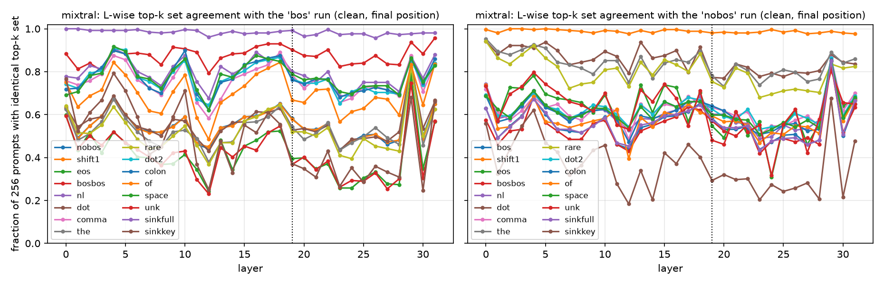
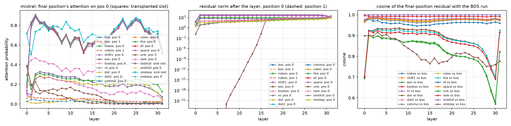
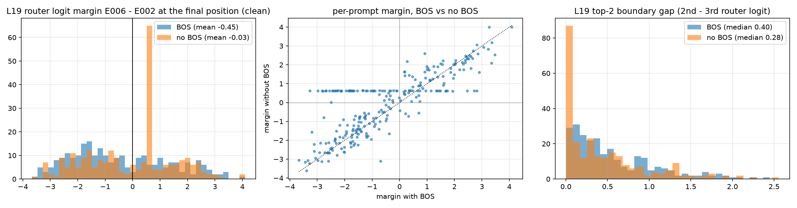
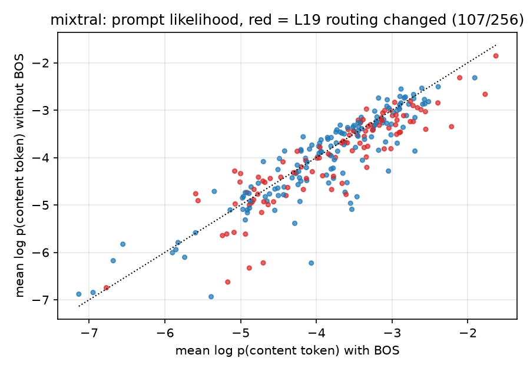
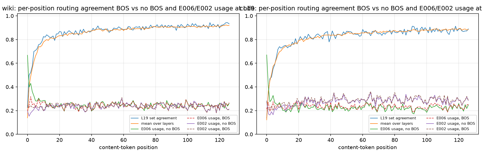
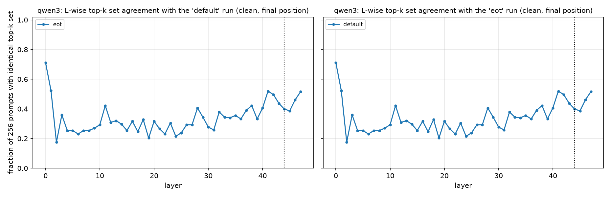
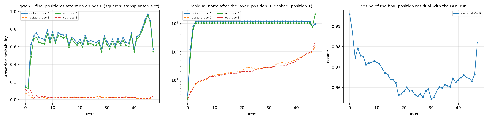

## Direction 3: why does the BOS token move Mixtral's L19 router?

Agent `ext3-bos-mechanism`. Model Mixtral-8x7B-v0.1 (bf16), the paper's 256 case IDs (128 discovery / 128 validation), sigma = 3.0 x embedding std, the same noise draws in every variant. Every variant is a full layer sweep plus an expert pass at L19 in which every expert is patched (so recurrence-first selection, validation rescue and specificity with the active-random control are computed exactly as in the main runs; no equal-norm pairs). Run directories `results/mixtral_<bos|nobos>_<experiment>/` with `run_meta.json`; raw diagnostics on the NVMe scratch `/opt/dlami/nvme/moe_ext3/`.

### Experiment 2: what sits at position 0 (substitution controls)

| variant | position 0 | RoPE pos of 1st content token | strict pass | mean Δ_clean | L* (disc) | val rescue @L19 | agree@L19 w/ bos (set/top1) | agree@L19 w/ nobos (set/top1) | E002 active disc/val | E006 active disc/val | selected e* (cands) | e* val rescue | e* spec | E006 val rescue / spec | coalition top-k / union |
|---|---|---|---|---|---|---|---|---|---|---|---|---|---|---|---|
| bos | <s> at position 0 (tokenizer default) | 1 | 233/256 | +6.63 | L19 | +0.580 | 1.00/1.00 | 0.58/0.64 | 77/84 | 71/67 | E002 (2) | +0.355 [+0.258, +0.463] | +0.201 [+0.103, +0.304] | +0.065 / -0.260 | +0.565 / +0.581 |
| nobos | no token (paper protocol) | 0 | 249/256 | +5.49 | L19 | +0.431 | 0.58/0.64 | 1.00/1.00 | 59/70 | 91/84 | E006 (1) | +0.061 [-0.010, +0.136] | -0.175 [-0.269, -0.078] | +0.061 / -0.175 | +0.429 / +0.431 |
| shift1 | no token, RoPE positions start at 1 | 1 | 249/256 | +5.49 | L19 | +0.470 | 0.58/0.64 | 0.98/0.99 | 59/70 | 90/83 | E006 (1) | +0.094 [+0.023, +0.167] | -0.134 [-0.232, -0.034] | +0.094 / -0.134 | +0.454 / +0.470 |
| eos | </s> at position 0 | 1 | 154/256 | +2.57 | L21 | +0.114 | 0.39/0.54 | 0.55/0.78 | 39/53 | 95/86 | E006 (1) | +0.060 [-0.003, +0.126] | +0.020 [-0.050, +0.096] | +0.060 / +0.020 | +0.145 / +0.114 |
| bosbos | <s><s> at positions 0-1 | 2 | 232/256 | +6.18 | L19 | +0.583 | 0.90/0.94 | 0.57/0.65 | 78/86 | 67/66 | E002 (2) | +0.367 [+0.266, +0.479] | +0.202 [+0.099, +0.310] | +0.079 / -0.229 | +0.561 / +0.582 |
| nl | '\n' at position 0 | 1 | 237/256 | +6.46 | L19 | +0.505 | 0.80/0.88 | 0.60/0.69 | 73/80 | 68/73 | E002 (2) | +0.278 [+0.197, +0.364] | +0.103 [+0.017, +0.192] | +0.091 / -0.205 | +0.497 / +0.505 |
| dot | '.' at position 0 | 1 | 241/256 | +5.78 | L21 | +0.409 | 0.53/0.63 | 0.77/0.91 | 53/61 | 90/84 | E006 (1) | +0.042 [-0.020, +0.100] | -0.210 [-0.306, -0.122] | +0.042 / -0.210 | +0.412 / +0.409 |
| comma | ',' at position 0 | 1 | 239/256 | +6.24 | L19 | +0.517 | 0.79/0.87 | 0.63/0.70 | 74/78 | 77/74 | E002 (2) | +0.295 [+0.214, +0.386] | +0.125 [+0.034, +0.219] | +0.083 / -0.210 | +0.526 / +0.516 |
| the | 'the' at position 0 | 1 | 235/256 | +5.28 | L19 | +0.367 | 0.54/0.67 | 0.78/0.85 | 60/71 | 88/88 | E006 (1) | +0.073 [+0.017, +0.128] | -0.145 [-0.224, -0.071] | +0.073 / -0.145 | +0.369 / +0.367 |
| rare | 'workspace' at position 0 | 1 | 233/256 | +4.72 | L21 | +0.413 | 0.52/0.66 | 0.75/0.88 | 58/67 | 92/91 | E006 (1) | +0.066 [-0.008, +0.137] | -0.148 [-0.241, -0.060] | +0.066 / -0.148 | +0.401 / +0.413 |
| dot2 | '.' (attached form, id 28723) at position 0 | 1 | 243/256 | +6.41 | L19 | +0.482 | 0.77/0.84 | 0.62/0.71 | 73/79 | 70/71 | E002 (2) | +0.285 [+0.201, +0.378] | +0.146 [+0.053, +0.248] | +0.067 / -0.225 | +0.484 / +0.482 |
| colon | ':' at position 0 | 1 | 243/256 | +6.21 | L19 | +0.582 | 0.76/0.86 | 0.64/0.71 | 72/83 | 72/72 | E002 (2) | +0.318 [+0.230, +0.414] | +0.118 [+0.024, +0.212] | +0.111 / -0.217 | +0.593 / +0.582 |
| of | 'of' at position 0 | 1 | 241/256 | +5.79 | L19 | +0.561 | 0.67/0.76 | 0.59/0.64 | 67/82 | 76/78 | E002 (2) | +0.313 [+0.231, +0.403] | +0.134 [+0.040, +0.227] | +0.086 / -0.221 | +0.541 / +0.561 |
| space | '▁' (lone space) at position 0 | 1 | 243/256 | +6.31 | L19 | +0.535 | 0.79/0.86 | 0.60/0.70 | 73/80 | 73/75 | E002 (2) | +0.283 [+0.204, +0.373] | +0.091 [+0.001, +0.184] | +0.101 / -0.202 | +0.531 / +0.535 |
| unk | <unk> at position 0 | 1 | 141/256 | +2.35 | L21 | +0.100 | 0.37/0.52 | 0.48/0.76 | 39/49 | 99/88 | E006 (1) | +0.005 [-0.054, +0.059] | -0.056 [-0.117, +0.002] | +0.005 / -0.056 | +0.094 / +0.100 |
| sinkfull | no token; <s> key+value transplanted as an extra slot | 1 | 234/256 | +6.61 | L19 | +0.583 | 0.99/1.00 | 0.57/0.64 | 77/84 | 71/68 | E002 (2) | +0.360 [+0.262, +0.469] | +0.189 [+0.092, +0.293] | +0.081 / -0.251 | +0.553 / +0.583 |
| sinkkey | no token; <s> KEY transplanted, value = 0 (pure absorber) | 1 | 172/256 | +2.90 | L19 | +0.209 | 0.37/0.53 | 0.29/0.50 | 42/49 | 84/82 | E006 (1) | +0.002 [-0.107, +0.116] | -0.134 [-0.315, +0.047] | +0.002 / -0.134 | +0.239 / +0.208 |

`agree@L19 w/ bos` = fraction of the 256 clean prompts whose final-position top-2 expert set (top-1 expert) at L19 is identical to the BOS run's; likewise for the no-BOS run. `RoPE pos of 1st content token` = absolute position of the first prompt token. Paper: L19E006 active 91/83, rescue +0.099, spec -0.175.

**L19 top-2 set transitions BOS -> no BOS (clean prompts, most frequent):**

| top-2 with BOS | top-2 without BOS | prompts |  |
|---|---|---|---|
| {2,6} | {2,6} | 40 | same |
| {4,6} | {4,6} | 38 | same |
| {2,4} | {2,4} | 15 | same |
| {2,7} | {2,7} | 11 | same |
| {2,6} | {6,7} | 10 | changed |
| {2,5} | {2,5} | 10 | same |
| {4,6} | {6,7} | 10 | changed |
| {2,4} | {2,6} | 9 | changed |
| {5,6} | {5,6} | 7 | same |
| {5,6} | {4,6} | 6 | changed |
| {2,3} | {2,3} | 6 | same |
| {2,4} | {6,7} | 6 | changed |
| {0,6} | {0,6} | 6 | same |
| {4,6} | {2,6} | 5 | changed |

### Experiment 1b: where the sink lands, and strata by delimiter / subject position

**Where the final position parks its attention and where the largest residual norm sits (clean prompts; class of the argmax position: prefix = the prepended token, delim = punctuation, function = of/is/in/the..., content = other prompt tokens, final = the final position itself)**

| run | layer | mean max attention mass (final pos.) | attention argmax at pos 0 | attention argmax class | norm argmax at pos 0 | norm argmax class | norm at argmax / median norm |
|---|---|---|---|---|---|---|---|
| bos | 1 | 0.830 | 1.00 | {'prefix(<s>)': 256} | 1.00 | {'prefix(<s>)': 256} | 492.0 |
| bos | 2 | 0.907 | 1.00 | {'prefix(<s>)': 256} | 1.00 | {'prefix(<s>)': 256} | 326.7 |
| bos | 3 | 0.834 | 1.00 | {'prefix(<s>)': 256} | 1.00 | {'prefix(<s>)': 256} | 212.9 |
| bos | 5 | 0.780 | 1.00 | {'prefix(<s>)': 256} | 1.00 | {'prefix(<s>)': 256} | 117.5 |
| bos | 10 | 0.610 | 1.00 | {'prefix(<s>)': 256} | 1.00 | {'prefix(<s>)': 256} | 50.1 |
| bos | 19 | 0.697 | 1.00 | {'prefix(<s>)': 256} | 1.00 | {'prefix(<s>)': 256} | 13.2 |
| bos | 31 | 0.534 | 1.00 | {'prefix(<s>)': 256} | 1.00 | {'prefix(<s>)': 256} | 3.2 |
| nobos | 1 | 0.549 | 0.06 | {'delim': 84, 'function': 82, 'content': 65, 'final': 20, 'space': 5} | 0.20 | {'delim': 79, 'final': 63, 'function': 63, 'content': 46, 'space': 5} | 609.3 |
| nobos | 2 | 0.625 | 0.20 | {'content': 104, 'delim': 79, 'function': 68, 'space': 5} | 0.20 | {'delim': 79, 'final': 63, 'function': 63, 'content': 46, 'space': 5} | 428.0 |
| nobos | 3 | 0.548 | 0.20 | {'delim': 79, 'content': 71, 'function': 66, 'final': 35, 'space': 5} | 0.20 | {'delim': 79, 'final': 63, 'function': 63, 'content': 46, 'space': 5} | 282.9 |
| nobos | 5 | 0.540 | 0.20 | {'delim': 79, 'final': 63, 'function': 63, 'content': 46, 'space': 5} | 0.20 | {'delim': 79, 'final': 63, 'function': 63, 'content': 46, 'space': 5} | 154.5 |
| nobos | 10 | 0.484 | 0.20 | {'delim': 79, 'final': 63, 'function': 63, 'content': 46, 'space': 5} | 0.20 | {'delim': 79, 'final': 63, 'function': 63, 'content': 46, 'space': 5} | 67.6 |
| nobos | 19 | 0.610 | 0.17 | {'delim': 80, 'final': 65, 'function': 65, 'content': 41, 'space': 5} | 0.20 | {'delim': 79, 'final': 63, 'function': 63, 'content': 46, 'space': 5} | 16.0 |
| nobos | 31 | 0.552 | 0.01 | {'final': 110, 'delim': 79, 'function': 61, 'space': 5, 'content': 1} | 0.05 | {'content': 218, 'function': 33, 'final': 3, 'space': 2} | 1.5 |

**Which prompts hand the sink to their final token without BOS (L5 max-norm position vs the tokens before the final position)**

|  | delimiter before final | no delimiter | All |
|---|---|---|---|
| final position is the sink | 5 | 58 | 63 |
| sink elsewhere | 95 | 98 | 193 |
| All | 100 | 156 | 256 |

|  | delimiter or function word before final | neither | All |
|---|---|---|---|
| final position is the sink | 44 | 19 | 63 |
| sink elsewhere | 173 | 20 | 193 |
| All | 217 | 39 | 256 |

Class of the max-norm position at L5 without BOS: {'delim': 79, 'final': 63, 'function': 63, 'content': 46, 'space': 5} (the first token is a content token in 196/256 prompts, a function word in 58).

**Strata (L19, clean final-position routing; counts are BOS / no BOS)**

| stratum | n | routing agreement @L19 | E006 active | E002 active | mean noise drop | sd of drop | mean Δ_clean | strict pass |
|---|---|---|---|---|---|---|---|---|
| all | 256 | 0.58 | 138/175 | 161/129 | +5.00 / +4.77 | 3.26 / 2.71 | +6.63 / +5.49 | 233 / 249 |
| delimiter before final position | 100 | 0.67 | 48/54 | 70/70 | +5.62 / +5.50 | 3.26 / 2.92 | +7.28 / +6.22 | 95 / 99 |
| no delimiter | 156 | 0.53 | 90/121 | 91/59 | +4.59 / +4.31 | 3.20 / 2.45 | +6.21 / +5.02 | 138 / 150 |
| subject starts at position 0 (no BOS) | 207 | 0.51 | 92/129 | 149/116 | +5.25 / +4.97 | 3.32 / 2.77 | +6.94 / +5.53 | 192 / 202 |
| subject starts later | 49 | 0.88 | 46/46 | 12/13 | +3.91 / +3.96 | 2.76 / 2.23 | +5.30 / +5.33 | 41 / 47 |
| final position carries the max norm at L5 (no BOS) | 63 | 0.06 | 31/63 | 44/15 | +5.14 / +4.05 | 3.66 / 2.22 | +7.03 / +4.62 | 54 / 60 |
| max norm elsewhere | 193 | 0.75 | 107/112 | 117/114 | +4.95 / +5.01 | 3.12 / 2.81 | +6.49 / +5.77 | 179 / 189 |
| final-position norm ratio no-BOS/BOS > 1.5 (L18) | 65 | 0.09 | 33/65 | 44/15 | +5.01 / +4.03 | 3.68 / 2.19 | +6.90 / +4.56 | 55 / 62 |
| ratio <= 1.5 | 191 | 0.75 | 105/110 | 117/114 | +4.99 / +5.03 | 3.11 / 2.82 | +6.53 / +5.81 | 178 / 187 |

**Early-layer routing of position 0 (top-1 expert counts over 256 clean prompts; max router prob = mean softmax probability of the top expert)**

| layer | <s> top-1 (BOS run) | <s> max router prob | 1st content token top-1 (BOS run) | 1st content token top-1 (no-BOS run) | 1st content token max router prob (no BOS) | 1st content token: same top-2 set in both runs |
|---|---|---|---|---|---|---|
| 0 | {'E1': 256} | 0.276 | {'E2': 147, 'E3': 88, 'E5': 14, 'E6': 5, 'E1': 2} | {'E2': 149, 'E1': 84, 'E5': 10, 'E3': 10, 'E6': 2, 'E4': 1} | 0.432 | 0.04 |
| 1 | {'E3': 256} | 0.903 | {'E6': 181, 'E5': 29, 'E7': 27, 'E2': 13, 'E0': 6} | {'E3': 256} | 0.760 | 0.00 |
| 2 | {'E7': 256} | 0.135 | {'E3': 135, 'E2': 75, 'E0': 23, 'E4': 17, 'E1': 4, 'E6': 2} | {'E4': 163, 'E5': 56, 'E2': 22, 'E1': 7, 'E6': 3, 'E3': 3, 'E7': 2} | 0.135 | 0.06 |
| 3 | {'E1': 256} | 0.147 | {'E3': 149, 'E5': 54, 'E1': 37, 'E6': 9, 'E4': 5, 'E7': 1, 'E2': 1} | {'E1': 161, 'E3': 41, 'E0': 31, 'E6': 21, 'E4': 2} | 0.138 | 0.08 |

**The sink state's own routing (top-2 set counts; mean router logits E000..E007; largest across-prompt sd of any logit)**

| layer | token / group | top-2 sets | mean router logits | max sd |
|---|---|---|---|---|
| L0 | <s> (BOS run, position 0) | {1,5}: 256 | -0.23 +0.91 -0.08 -0.05 -0.35 +0.32 -0.07 -0.16 | 0.000 |
| L1 | <s> (BOS run, position 0) | {3,4}: 256 | -1.18 -1.01 -1.28 +3.34 +0.09 -0.91 -1.01 -1.41 | 0.000 |
| L2 | <s> (BOS run, position 0) | {4,7}: 256 | -0.02 +0.02 -0.17 -0.03 +0.06 -0.02 -0.02 +0.06 | 0.000 |
| L3 | <s> (BOS run, position 0) | {1,6}: 256 | -0.09 +0.14 -0.05 -0.04 -0.09 -0.15 +0.06 +0.03 | 0.000 |
| L19 | <s> (BOS run, position 0) | {6,7}: 256 | -0.02 -0.13 +0.12 +0.08 +0.08 +0.01 +0.53 +0.16 | 0.000 |
| L19 | no-BOS final position, final carries the max norm (n=63) | {6,7}: 39, {2,6}: 15, {3,6}: 9 | -0.06 -0.13 +0.02 +0.02 +0.01 -0.05 +0.65 +0.03 | 0.008 |
| L19 | no-BOS final position, max norm elsewhere (n=193) | {4,6}: 49, {2,6}: 47, {2,4}: 19, {2,7}: 14 | +0.00 -1.12 +0.95 -0.69 +0.46 -0.81 +0.70 -0.39 | 1.113 |
| L19 | BOS final position (n=256) | {2,6}: 57, {4,6}: 57, {2,4}: 31, {2,5}: 17 | -0.11 -0.92 +1.03 -0.64 +0.39 -0.92 +0.58 -0.38 | 1.098 |

Final tokens of the prompts whose final position becomes the sink without BOS: {'▁in': 31, '▁from': 13, '▁of': 11, '▁on': 3, '▁at': 3, '▁for': 1, '▁to': 1}; final tokens of the other prompts: {'▁in': 53, '▁is': 35, '▁of': 23, '▁by': 14, '▁plays': 12, '▁language': 8, '▁speaks': 7, '▁was': 5}. In the BOS run the final position carries the maximal norm in 0 prompts.

**Contribution norms ||w_e E_e(x)|| and routing weights of E006 / E002 at L19 when active (clean final position)**

| run | expert | n active | mean ||c_e|| | mean routing weight | fraction top-1 |
|---|---|---|---|---|---|
| bos | E006 | 138 | 24.43 | 0.462 | 0.51 |
| bos | E002 | 161 | 37.09 | 0.661 | 0.75 |
| nobos | E006 | 175 | 60.73 | 0.539 | 0.72 |
| nobos | E002 | 129 | 36.83 | 0.623 | 0.65 |

### Experiment 1: diagnostics (attention sink, norms, residual divergence, router margins)

**L19 router margin E006 - E002 at the final position (clean prompts): per variant, and how close it is to the two reference runs**

| variant | mean margin | corr with BOS | corr with no BOS | mean |diff| to BOS | mean |diff| to no BOS |
|---|---|---|---|---|---|
| bos | -0.446 | 1.000 | 0.796 | 0.000 | 0.797 |
| nobos | -0.032 | 0.796 | 1.000 | 0.797 | 0.000 |
| shift1 | -0.030 | 0.795 | 1.000 | 0.802 | 0.020 |
| eos | +0.171 | 0.628 | 0.738 | 1.163 | 0.687 |
| bosbos | -0.496 | 0.990 | 0.796 | 0.179 | 0.835 |
| nl | -0.423 | 0.963 | 0.808 | 0.336 | 0.699 |
| dot | +0.025 | 0.796 | 0.975 | 0.828 | 0.224 |
| comma | -0.318 | 0.953 | 0.819 | 0.412 | 0.628 |
| the | +0.037 | 0.789 | 0.972 | 0.834 | 0.242 |
| rare | +0.130 | 0.797 | 0.959 | 0.880 | 0.324 |
| dot2 | -0.369 | 0.960 | 0.814 | 0.386 | 0.648 |
| colon | -0.349 | 0.953 | 0.819 | 0.384 | 0.659 |
| of | -0.192 | 0.897 | 0.832 | 0.587 | 0.652 |
| space | -0.330 | 0.960 | 0.821 | 0.387 | 0.656 |
| unk | +0.309 | 0.679 | 0.802 | 1.136 | 0.637 |
| sinkfull | -0.448 | 1.000 | 0.797 | 0.028 | 0.793 |
| sinkkey | +0.582 | 0.620 | 0.585 | 1.414 | 1.272 |

### Experiment 5: prompt likelihood (OOD check)

Mean log-probability per content token (tokens 2..end of the prompt, same tokens in both protocols): with BOS -3.837, without BOS -3.996 (shift -0.159; 61% of prompts are less likely without BOS). Log-probability of the object token at the final position: -3.383 (BOS) vs -3.691 (no BOS). Prompts whose L19 top-2 set changed (107/256) have a mean shift of -0.207 vs -0.124 for unchanged prompts (Mann-Whitney p = 0.020, point-biserial r = -0.093, AUC = 0.585). Subject starts at position 0 in 81% of the no-BOS prompts; routing change rate 0.49 for those vs 0.12 when the subject comes later (Fisher p = 0.000).

### Experiment 3: corpus-level routing at L19 (H4)

**Direction-1 cross-check: E001 at layers 17-22 next to E002 / E006 at L19 (content tokens; usage = top-2 membership; class entropy in bits, BOS / no BOS; position entropy normalised, no BOS; P(routed | first content token) and P(routed | `<s>`) at that layer; class distribution without BOS in the order byte, content, delim, function, space)**

| corpus | layer | expert | usage BOS | usage no BOS | Δ | class entropy | position entropy | P(1st content tok) | P(<s>) | class distribution (no BOS) |
|---|---|---|---|---|---|---|---|---|---|---|
| wiki | L17 | E001 | 0.253 | 0.262 | +0.009 | 1.151 / 1.202 | 0.999 | 0.49 | 1.00 | 0.00 / 0.63 / 0.05 / 0.31 / 0.01 |
| wiki | L18 | E001 | 0.263 | 0.249 | -0.013 | 1.889 / 1.886 | 0.997 | 0.03 | 0.00 | 0.00 / 0.40 / 0.19 / 0.29 / 0.12 |
| wiki | L19 | E001 | 0.257 | 0.242 | -0.014 | 1.133 / 1.009 | 0.999 | 0.18 | 0.00 | 0.00 / 0.79 / 0.03 / 0.13 / 0.04 |
| wiki | L20 | E001 | 0.255 | 0.257 | +0.002 | 0.846 / 0.820 | 0.999 | 0.51 | 0.00 | 0.00 / 0.83 / 0.02 / 0.14 / 0.01 |
| wiki | L21 | E001 | 0.246 | 0.250 | +0.004 | 1.469 / 1.505 | 0.998 | 0.08 | 0.00 | 0.00 / 0.56 / 0.13 / 0.28 / 0.02 |
| wiki | L22 | E001 | 0.235 | 0.243 | +0.008 | 1.436 / 1.503 | 0.997 | 0.67 | 1.00 | 0.00 / 0.58 / 0.07 / 0.29 / 0.05 |
| wiki | L19 | E002 | 0.237 | 0.235 | -0.002 | 1.293 / 1.280 | 0.999 | 0.20 | 0.00 | 0.00 / 0.72 / 0.10 / 0.12 / 0.05 |
| wiki | L19 | E006 | 0.243 | 0.254 | +0.010 | 1.512 / 1.541 | 0.997 | 0.67 | 1.00 | 0.03 / 0.55 / 0.09 / 0.32 / 0.02 |
| code | L17 | E001 | 0.246 | 0.264 | +0.018 | 1.775 / 1.856 | 0.998 | 0.56 | 1.00 | 0.08 / 0.29 / 0.48 / 0.09 / 0.05 |
| code | L18 | E001 | 0.244 | 0.241 | -0.002 | 1.764 / 1.759 | 0.998 | 0.02 | 0.00 | 0.01 / 0.40 / 0.41 / 0.08 / 0.09 |
| code | L19 | E001 | 0.218 | 0.212 | -0.006 | 1.792 / 1.810 | 0.998 | 0.09 | 0.00 | 0.10 / 0.43 / 0.37 / 0.04 / 0.06 |
| code | L20 | E001 | 0.184 | 0.187 | +0.003 | 1.434 / 1.425 | 0.998 | 0.45 | 0.00 | 0.04 / 0.67 / 0.20 / 0.06 / 0.03 |
| code | L21 | E001 | 0.288 | 0.297 | +0.010 | 1.887 / 1.919 | 0.999 | 0.08 | 0.00 | 0.06 / 0.42 / 0.34 / 0.08 / 0.10 |
| code | L22 | E001 | 0.226 | 0.245 | +0.019 | 1.947 / 1.979 | 0.996 | 0.74 | 1.00 | 0.07 / 0.41 / 0.31 / 0.06 / 0.14 |
| code | L19 | E002 | 0.285 | 0.275 | -0.010 | 2.015 / 2.025 | 0.998 | 0.28 | 0.00 | 0.19 / 0.21 / 0.36 / 0.01 / 0.21 |
| code | L19 | E006 | 0.234 | 0.231 | -0.004 | 2.096 / 2.101 | 0.997 | 0.67 | 1.00 | 0.25 / 0.33 / 0.26 / 0.10 / 0.05 |

**E006 at L19 against the presence of a sink (corpus windows)**

| corpus | E006 usage BOS | E006 usage no BOS | Δ excluding the first content token | no-BOS windows with a position-0 sink (max norm at L5) | E006 usage in those | E006 usage in the others | Spearman(log pos-0 norm ratio, E006 usage per window) | median pos-0 norm / median content norm (no BOS, L5) | P(E006 | <s>) | P(E006 | 1st content token, no BOS) | P(E006 | 1st content token, BOS) |
|---|---|---|---|---|---|---|---|---|---|---|---|
| wiki | 0.243 | 0.254 | +0.0068 | 28/400 | 0.250 | 0.254 | +0.024 (p=0.627) | 30.7 | 1.00 | 0.67 | 0.20 |
| code | 0.234 | 0.231 | -0.0072 | 30/400 | 0.246 | 0.230 | +0.052 (p=0.303) | 36.4 | 1.00 | 0.67 | 0.21 |

| corpus | expert | L19 usage BOS | L19 usage no BOS | Δ usage | token-class entropy (bits) | token-id entropy (bits) | position entropy (norm.) | P(routed | 1st content token, no BOS) | P(routed | <s>) | class distribution (no BOS) |
|---|---|---|---|---|---|---|---|---|---|---|
| wiki | E000 | 0.242 | 0.238 | -0.003 | 1.3634 | 9.2017 | 0.9985 | 0.10 | 0.00 | 0.00 / 0.04 / 0.07 / 0.01 / 0.16 / 0.71 |
| wiki | E001 | 0.257 | 0.242 | -0.014 | 1.6814 | 8.8622 | 0.999 | 0.18 | 0.00 | 0.00 / 0.15 / 0.03 / 0.04 / 0.20 / 0.58 |
| wiki | E002 | 0.237 | 0.235 | -0.002 | 1.775 | 9.3216 | 0.9989 | 0.20 | 0.00 | 0.00 / 0.05 / 0.10 / 0.05 / 0.26 / 0.54 |
| wiki | E003 | 0.246 | 0.249 | +0.003 | 1.8372 | 9.0038 | 0.999 | 0.35 | 0.00 | 0.00 / 0.07 / 0.08 / 0.10 / 0.19 / 0.56 |
| wiki | E004 | 0.256 | 0.256 | +0.000 | 1.0663 | 7.0759 | 0.9977 | 0.01 | 0.00 | 0.00 / 0.03 / 0.07 / 0.01 / 0.10 / 0.80 |
| wiki | E005 | 0.273 | 0.266 | -0.007 | 1.985 | 8.8028 | 0.9993 | 0.19 | 0.00 | 0.01 / 0.19 / 0.15 / 0.03 / 0.14 / 0.48 |
| wiki | E006 | 0.243 | 0.254 | +0.010 | 1.4827 | 8.2612 | 0.9969 | 0.67 | 1.00 | 0.03 / 0.07 / 0.09 / 0.02 / 0.10 / 0.70 |
| wiki | E007 | 0.247 | 0.260 | +0.013 | 1.8236 | 7.9541 | 0.999 | 0.30 | 1.00 | 0.01 / 0.08 / 0.22 / 0.03 / 0.13 / 0.54 |
| code | E000 | 0.249 | 0.246 | -0.003 | 1.929 | 9.1296 | 0.9984 | 0.06 | 0.00 | 0.02 / 0.05 / 0.18 / 0.02 / 0.41 / 0.32 |
| code | E001 | 0.218 | 0.212 | -0.006 | 2.1953 | 7.884 | 0.9979 | 0.09 | 0.00 | 0.10 / 0.03 / 0.37 / 0.06 / 0.26 / 0.18 |
| code | E002 | 0.285 | 0.275 | -0.010 | 2.243 | 6.0444 | 0.9983 | 0.28 | 0.00 | 0.19 / 0.01 / 0.36 / 0.21 / 0.12 / 0.09 |
| code | E003 | 0.243 | 0.246 | +0.003 | 1.9005 | 9.2757 | 0.9989 | 0.37 | 0.00 | 0.01 / 0.04 / 0.15 / 0.06 / 0.50 / 0.24 |
| code | E004 | 0.257 | 0.263 | +0.006 | 2.1342 | 6.5908 | 0.9975 | 0.01 | 0.00 | 0.12 / 0.01 / 0.38 / 0.12 / 0.08 / 0.30 |
| code | E005 | 0.260 | 0.260 | -0.000 | 2.3737 | 8.227 | 0.9989 | 0.18 | 0.00 | 0.03 / 0.10 / 0.21 / 0.17 / 0.29 / 0.19 |
| code | E006 | 0.234 | 0.231 | -0.004 | 2.3213 | 6.8329 | 0.9965 | 0.67 | 1.00 | 0.25 / 0.04 / 0.26 / 0.06 / 0.13 / 0.26 |
| code | E007 | 0.254 | 0.267 | +0.013 | 2.2261 | 7.5448 | 0.999 | 0.34 | 1.00 | 0.04 / 0.10 / 0.41 / 0.08 / 0.16 / 0.21 |

Token classes in the class-distribution column, in order: byte, digit, punct, space, word_cont, word_start. Usage = fraction of content tokens whose top-2 set contains the expert (sums to 2 over experts). Position entropy is the entropy of an expert's usage over the 50800/50800 content positions, normalised by log2(window); 1.0 = perfectly position-agnostic.

### Experiment 4: symmetric test on Qwen3-30B-A3B-Base (prepend `<|endoftext|>`)

| variant | position 0 | RoPE pos of 1st content token | strict pass | mean Δ_clean | L* (disc) | val rescue @L44 | agree@L44 w/ default (set/top1) | agree@L44 w/ eot (set/top1) | E069 active disc/val | selected e* (cands) | e* val rescue | e* spec | E069 val rescue / spec | coalition top-k / union |
|---|---|---|---|---|---|---|---|---|---|---|---|---|---|---|
| default | no token (tokenizer default = paper protocol) | 0 | 235/256 | +6.28 | L44 | +0.925 | 1.00/1.00 | 0.40/0.84 | 112/117 | E069 (6) | +0.511 [+0.374, +0.664] | +0.462 [+0.323, +0.613] | +0.511 / +0.462 | +0.919 / +0.925 |
| eot | <|endoftext|> at position 0 | 1 | 233/256 | +5.95 | L44 | +0.894 | 0.40/0.84 | 1.00/1.00 | 115/113 | E069 (6) | +0.462 [+0.344, +0.592] | +0.403 [+0.283, +0.535] | +0.462 / +0.403 | +0.886 / +0.894 |

### Verdict on H1-H4

**Mechanism in one paragraph.** In Mixtral-8x7B the `<s>` token is a prompt-independent attention sink: position 0 attends only to itself, so its residual (norm ~3,000 vs ~100 for content tokens from layer 1 on) and hence its per-layer key/value are the same for every prompt, and the final position parks 70-90 % of its attention there at every layer. The sink influences later tokens *only* through those keys/values (`sinkfull`: giving the no-BOS prompts the `<s>` K/V as an extra slot reproduces the BOS run, routing agreement 0.99 at L19, E002 selected with the same rescue and specificity). Without `<s>`, Mixtral does not re-form a sink at position 0 (final-position mass on position 0 at layer 1: 0.09 vs 0.83; max-norm position is position 0 in only 51/256 prompts, and then because the first token is a content word that happens to trigger it). Instead the massive-norm state forms on the first "trigger" token of the prompt: a delimiter, a function word such as `of`/`in`/`from`, or, in 63/256 prompts, the *final* preposition of the cloze itself (`in`, `from`, `of`, `on`, `at`: 58 of these 63 prompts contain no delimiter before the final position). Those 63 prompts are the whole BOS effect at L19: their final-position residual is the sink state (norm ratio no-BOS/BOS = 9x on average, 1.09x median elsewhere), its router logits are prompt-independent (across-prompt sd 0.008 at L19) and identical to those of `<s>` itself (top-2 {E006, E007}; E006 logit +0.65 vs +0.53 for `<s>`), so all 63 route to E006 (63/63 vs 31/63 with BOS; routing agreement 0.06 vs 0.75 for the other 193 prompts; Fisher p = 2e-23). E006's extra activity without BOS (175 vs 138 of 256, i.e. 91/83 vs 71/67 disc/val) is therefore E006 being the *sink expert of L19*: the expert that the router assigns to the massive-activation state. That is also why E006's contribution norm at L19 is 61 without BOS vs 24 with BOS (E002: 37 in both), why its all-case rescue stays small and its specificity negative (its output for a sink-like input is a constant bias, and the other active expert carries the fact), and why the paper's Mixtral selection depends on the absence of `<s>`.

- **H1 (attention-sink relocation): supported in a Mistral-specific form.** The routing change is entirely mediated by the sink state (`sinkfull`), and every position-0 token that forms a sink of comparable strength (`\n`, `,`, `:`, attached `.`, lone `▁`, and to a lesser degree `of`: final-position mass on position 0 at layer 1 of 0.77-0.81 vs 0.83 for `<s>`) reproduces the BOS run: L19 routing agreement with the BOS run 0.76-0.80 (top-1 0.84-0.88), E002 72-74/128 discovery-active, E006 68-77, E002 selected with positive specificity (+0.09 to +0.15), L19 selected, coalition rescue +0.48 to +0.59. Tokens that form no sink (`▁.` 0.08, `▁the` 0.15, `▁workspace` 0.06) leave the no-BOS state (agreement with no-BOS 0.75-0.78, E006 88-92/128 and selected, negative specificity). But the sink does not "relocate": without a sink carrier at position 0 it forms on the first trigger token, sometimes the final one (Oh et al. 2025, arXiv:2410.01866; Sun et al. 2024, arXiv:2402.17762), and a position-0 sink does not re-form as in Llama (Peng et al. 2026, arXiv:2603.06591). The key-only transplant (`sinkkey`: `<s>` key, zero value) shows that pure mass absorption is *not* enough: attention parks on the slot (~0.75 of the mass) but the model degrades (strict pass 172/256, mean Δ_clean +2.9 vs +6.6; agreement 0.37 with BOS, 0.29 with no-BOS). The sink works as absorber *and* as a constant value bias; both come from the `<s>` residual.
- **H2 (BOS-specific learned semantics): rejected in its strict form, true in a weak form.** `<s>` is not required: six non-BOS tokens restore the BOS-run routing, and the sink they form has the same effect (cosine of the final-position residual with the BOS run 0.98 at L19 for `\n`, `,`; margin correlation with the BOS run 0.95-0.96). What is token-specific is *whether* a token at position 0 becomes a sink: `<s>`, delimiters and whitespace do, ordinary content words do not, and the other special tokens (`</s>`, `<unk>`) are actively harmful (strict pass 154 and 141 of 256, Δ_clean +2.6 / +2.4). Double `<s>` behaves like single `<s>` (agreement 0.90, same selection).
- **H3 (RoPE position shift): not a hypothesis.** RoPE encodes relative position only (Su et al. 2021, arXiv:2104.09864) and Mixtral has no absolute position embedding, so removing the token and starting positions at 1 is the no-BOS run; `shift1` reproduces it to bf16 noise (agreement 0.98/0.99, identical activity counts, val rescue +0.470 vs +0.431). The coordinator's argument stands and the pass is reported as a numerics check only.
- **H4 (E006 as a default / fallback expert): supported in a specific sense, not in the generic one.** On 50.8k tokens of Wikipedia-like text and 50.8k tokens of Python, E006's L19 usage is unremarkable (0.24-0.25 top-2 membership, 8 experts, no expert above 0.29), its token-class entropy is average and its position entropy is 0.997 like every other expert, and its usage does not depend on the protocol once the first content token is excluded (Δ < 0.01). It is, however, the expert to which the router sends the sink state: P(E006 | `<s>`) = 1.00 at L19 (top-2 {E006, E007} for every one of 256 prompts and 800 windows), P(E006 | first content token, no BOS) = 0.67 (wiki) against a base rate of 0.25, and 63/63 of the prompts whose final token carries the massive norm. E006 is a "default" expert only for the massive-activation state, and its usage rises without BOS exactly when the sink lands on the position being routed (the final cloze token in 25 % of CounterFact prompts, never for a mid-window corpus token). Router margins confirm a boundary effect rather than a bias shift: the E006-E002 margin moves from -0.45 (BOS) to -0.03 (no BOS) on average, but the shift is concentrated in the 63 sink-final prompts (their no-BOS margin is +0.62 ± 0.01 for all of them), and the median top-2 boundary gap narrows from 0.40 to 0.28. The Direction-1 finding that E001 is the strongest single expert of L17/18/21/22 under both protocols is consistent with this: E001's corpus usage at layers 17-22 is 0.21-0.26 under both protocols (|Δ| ≤ 0.02, like every expert) with unremarkable class entropy, and although `<s>` is routed to E001 at L17 and L22 (P(E001 | `<s>`) = 1.00 there, 0.00 at L18/L19/L21), E001's rescue in Direction 1 holds under BOS, where the final position is never the sink, so it is a content expert; E006's L19 role, by contrast, is tied to the sink state.
- **Qwen3 symmetric test: L44 and L44E069 survive `<|endoftext|>`.** Prepending Qwen's separator changes the final-position top-8 set at L44 in 60 % of prompts (top-1 agreement 0.84), but L44 is selected in both runs (val rescue +0.925 vs +0.894), E069 is clean-active in 112/117 vs 115/113 (disc/val) and is selected with rescue +0.51 vs +0.46 and specificity +0.46 vs +0.40 (both inside the paper's CIs). Qwen3 has no position-0 sink to begin with (final-position mass on position 0 at layer 1: 0.15 with and 0.13 without the separator), so its selection is BOS-insensitive: the sensitivity is a Mistral-family property, not a property of the method.
- **OOD check (Experiment 5).** Without `<s>` the prompts are less likely (mean log p per content token -3.996 vs -3.837; the object token -3.69 vs -3.38; 61 % of prompts worse), and the likelihood shift is only weakly related to whether L19 routing changes (AUC 0.585, point-biserial r = -0.09, p = 0.02); the routing change is predicted far better by the final-position norm ratio (r = 0.59) and by the subject starting at position 0 (change rate 0.49 vs 0.12, p = 2e-6, itself a consequence of no delimiter preceding the final token). On the corpus the no-BOS protocol is *more* likely per token (-2.09 vs -2.19 wiki, -1.36 vs -1.45 code) because the BOS row must predict the first content token from `<s>` alone; short cloze prompts are the OOD regime, long text is not.

**Consequence for the paper's Mixtral result.** The no-BOS protocol makes L19E006 recurrent because in a quarter of the CounterFact prompts the final token becomes the model's attention sink and is routed like `<s>`. E006's negative specificity is then expected: for those prompts its contribution is the generic sink output, and patching it moves little. With `<s>` present (the tokenizer default and the way Mistral models are meant to be used), the final position is never the sink, E006 falls below the recurrence gate and the content expert E002 is selected with positive specificity. The Mixtral conclusion of the paper is therefore a tokenisation artefact of the attention sink, and the method's expert-level step should be run with the model's intended special tokens (or with the sink-carrying prompts flagged).

**GPU budget.** 10 GPU jobs, about 16 minutes: 2 OLMoE verification runs (verify_ext3_diag x2 incl. the sink-transplant identity check, verify_olmoe), 4 batched Mixtral variant passes (16 variants incl. two identity checks; 88-106 s each), 1 Qwen3 pass (2 variants), 2 Mixtral corpus passes (400 windows x 127 tokens x 2 protocols each), plus one Mixtral pass re-running `bos` as the transplant donor (its outputs discarded). Row-level data: `results/mixtral_<bos|nobos>_<experiment>/`, `results/qwen3_{nobos_diag,bos_prefix_eot}/`, `results/mixtral_{bos,nobos}_corpus_{wiki,code}/`; raw diagnostics on `/opt/dlami/nvme/moe_ext3/`.
