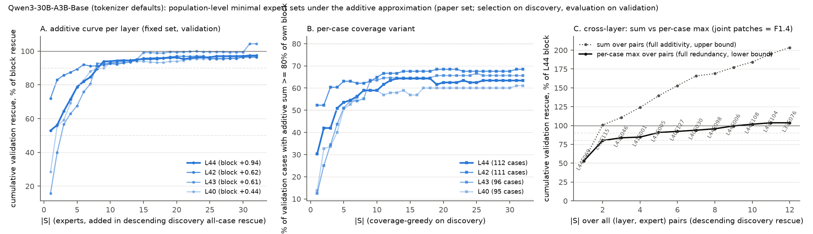
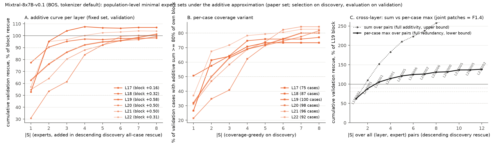
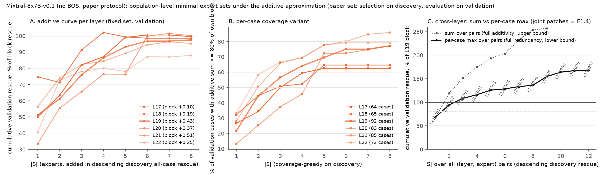

## Extension 5 / F1: expert rankings and minimal sufficient sets

**Summary.** (1) *Rankings agree where it matters.* In all three runs the same two or three (layer, expert) pairs lead under all-case rescue, active-only rescue, Spec and the paper's discovery statistic (Kendall tau rescue vs active-only 0.94-0.97; rescue vs Spec 0.35-0.53 among pairs with a clearly positive rescue, 0.64-0.73 within the selected layer). Over the long tail of near-zero pairs the orderings are uncorrelated (rescue vs Spec 0.01-0.03 in Mixtral): noise, not disagreement. The real disagreements are systematic: *junior partners* (positive rescue, negative Spec: Qwen3 L43E046, Mixtral L19E006 and its kin) and *Spec without rescue* in layers whose block patch hurts (Qwen3 L47, Mixtral L29-L31); Spec is only interpretable next to a positive rescue, and block share or per-case percentile measure concentration, not size. L44E069 is rank 1 under rescue, active-only, Spec and the discovery statistic; L42E115 rank 2. (2) *Minimal sets.* The sum of single-expert rescues equals the exact coalition and the block on average at every layer (Qwen3 L44 +0.935/+0.916/+0.941), so additive population-level sets are trustworthy: 50/80/90% of the block rescue take 1/6/9 experts at Qwen3 L44 (E069 alone 53%), 1/2/6 at L42 (E115 72%), 1/3/4 at Mixtral L19 with BOS (E002 63%), 1/2/2 at L18, 1/4/5 at L19 without BOS (E002 51%, fails recurrence). Per case the approximation is loose in Qwen3 (mean |sum - coalition| 0.36); exact per-case sets are in F1.3 below. Across layers L44E069 + L42E115 is 80-101% of the L44 block (F1.4).

**Questions (RESEARCH_PLAN.md F1.1, F1.2).** (1) Does the ranking of experts depend on the statistic used to rank them? The paper ranks by all-case rescue (rescue where the expert is clean-active, zero elsewhere) after a recurrence gate and reports Spec as a second number; other natural choices are the active-only rescue, Spec itself, the expert's share of its layer's block rescue and the expert's per-case rank among the case's active experts (Table 10 style). (2) How many experts of a layer are needed to recover 50/80/90% of the layer's MoE-block rescue, as a fixed set over cases?

**Data and definitions.** Existing all-layer expert passes on the paper case set (`results/{qwen3_bos,mixtral_bos,mixtral_nobos}_alllayers`, no new GPU work). *Block* = the MoE-block output patch of the layer (kind `layer`, same pass). Every ordering is computed on the discovery split where it is a selection statistic and on the validation split otherwise; all CIs are 5,000-resample percentile bootstraps over validation cases with the same resampling indices as `stats.summarize`, vectorised over experts. *Spec* is the all-case active-random specificity of `analysis.evaluate_expert` (3 controls for Qwen3, 1 for Mixtral). *Block share* = mean all-case rescue / mean block rescue on validation and is left undefined in layers whose block rescue CI includes zero (a share of a null effect is noise; the raw value is kept in the CSV as `block_share_raw`). *Mean percentile* = mean over the expert's validation-active cases of (n_active - rank)/(n_active - 1), rank 1 = the case's best expert. Recurrence = clean-active in >= 64 of 128 discovery cases. Kendall tau-b (scipy) between the orderings is reported over all recurrent pairs, over those in layers with a clearly positive block rescue, over those whose own rescue CI excludes zero, and within the two-stage layer.

**Minimal sets (F1.2).** Under the additive approximation the value of a fixed set S is mean_c sum_{e in S ∩ active(c)} rescue_e, which is linear in S, so greedy forward selection is exactly the descending order of all-case mean rescue on discovery and the curve is its cumulative sum; we report it on validation as a fraction of the validation block rescue, and the in-sample (validation-ordered) curve as an optimistic bound. Because a fixed set that recovers 80% of the *mean* block rescue need not recover 80% in most cases, we add a genuinely non-linear coverage variant: greedy on the number of discovery cases whose additive sum reaches 80% of *their own* block rescue (cases with block > 0), evaluated as the covered fraction of validation cases. The additive end point is checked against the exact `coalition_clean` rows (all clean-active experts patched jointly). Cross-layer sets are reported both as the additive sum (upper bound, over-counts information that several layers restore) and as the per-case maximum over the pairs in S (lower bound, full redundancy); exact multi-layer patches are F1.4. Code: `moetrace/ext5_rank.py`, `scripts/ext5_rank_analyze.py`.

### Qwen3-30B-A3B-Base (tokenizer defaults) (`results/qwen3_bos_alllayers`)

#### F1.1 rankings

- 3570 (layer, expert) pairs have at least one clean-active paper case; 234 are recurrent (>= 64/128 discovery cases), 90 of them in layers whose block rescue CI excludes zero. Full table: `results/tables/ext5_rank_all_qwen3_bos.csv`.
- Two-stage winner L44E069: rank 1 by validation all-case rescue, 1 by active-only rescue, 1 by Spec, 7 by block share, 11 by mean per-case percentile, 1 by the discovery selection statistic (val. rescue +0.499, active-only +0.550, Spec +0.443, share 53%, mean rank 2.49 of 8 active, top-1 in 53% of its active cases).
- Second locus L42E115: ranks 2 / 2 / 2 / 2 / 1 / 2 under the same six metrics (val. rescue +0.447, Spec +0.423, share 72%, top-1 in 71%).
- Kendall tau over the 234 recurrent pairs: rescue vs Spec 0.38, rescue vs active-only 0.94, rescue vs block share 0.75, rescue vs per-case percentile 0.38, discovery statistic vs validation rescue 0.27. Top-5 by each metric: all-case rescue (val): L44E069, L42E115, L43E005, L40E127, L41E001; active-only rescue: L44E069, L42E115, L43E005, L40E127, L40E030; Spec: L44E069, L42E115, L41E001, L43E005, L40E030; block share: L33E076, L42E115, L34E094, L39E040, L28E030; per-case percentile: L42E115, L33E076, L38E057, L22E091, L28E030; discovery statistic: L44E069, L42E115, L43E046, L41E001, L43E005.

**Qwen3-30B-A3B-Base (tokenizer defaults): top-30 recurrent (layer, expert) pairs by validation all-case rescue, paper set (234 recurrent pairs of 3570 with any activity; threshold 64/128 discovery cases). Ranks are among the recurrent pairs (1 = best); 'mean rank' is the mean per-case rank of the expert among that case's clean-active experts on validation.**

| Rank (val. rescue) | Pair | Disc. active | Val. active | Val. rescue [95% CI] | Active-only | Spec [95% CI] | Block rescue / share | Mean rank / percentile / top-1 | Rank under: active-only / Spec / share / percentile / disc. |
|---|---|---|---|---|---|---|---|---|---|
| 1 | L44E069 | 114/128 | 116/128 | +0.499 [+0.357, +0.659] | +0.550 | +0.443 [+0.302, +0.603] | +0.941 / 53% | 2.49 / 79% / 53% | 1 / 1 / 7 / 11 / 1 |
| 2 | L42E115 | 126/128 | 123/128 | +0.447 [+0.363, +0.537] | +0.465 | +0.423 [+0.339, +0.510] | +0.621 / 72% | 1.91 / 87% / 71% | 2 / 2 / 2 / 1 / 2 |
| 3 | L43E005 | 77/128 | 82/128 | +0.146 [+0.079, +0.230] | +0.229 | +0.087 [+0.015, +0.177] | +0.606 / 24% | 2.91 / 73% / 34% | 3 / 4 / 22 / 67 / 5 |
| 4 | L40E127 | 92/128 | 93/128 | +0.126 [+0.074, +0.188] | +0.174 | +0.083 [+0.029, +0.146] | +0.444 / 28% | 2.71 / 76% / 43% | 4 / 6 / 17 / 27 / 6 |
| 5 | L41E001 | 115/128 | 109/128 | +0.125 [+0.085, +0.167] | +0.147 | +0.106 [+0.063, +0.150] | +0.289 / 43% | 2.46 / 79% / 52% | 7 / 3 / 12 / 9 / 4 |
| 6 | L40E030 | 94/128 | 92/128 | +0.121 [+0.071, +0.175] | +0.168 | +0.086 [+0.033, +0.143] | +0.444 / 27% | 2.72 / 75% / 43% | 5 / 5 / 19 / 28 / 7 |
| 7 | L43E104 | 87/128 | 87/128 | +0.102 [+0.061, +0.150] | +0.149 | +0.041 [-0.012, +0.098] | +0.606 / 17% | 2.94 / 72% / 32% | 6 / 13 / 29 / 77 / 8 |
| 8 | L43E046 | 90/128 | 87/128 | +0.095 [+0.045, +0.152] | +0.140 | +0.017 [-0.040, +0.077] | +0.606 / 16% | 3.29 / 67% / 26% | 8 / 29 / 30 / 168 / 3 |
| 9 | L28E030 | 115/128 | 115/128 | +0.082 [+0.054, +0.112] | +0.091 | +0.071 [+0.042, +0.103] | +0.143 / 57% | 2.37 / 80% / 51% | 10 / 8 / 5 / 5 / 12 |
| 10 | L33E076 | 95/128 | 102/128 | +0.079 [+0.052, +0.110] | +0.099 | +0.083 [+0.056, +0.112] | +0.098 / 81% | 2.06 / 85% / 67% | 9 / 7 / 1 / 2 / 9 |
| 11 | L38E038 | 112/128 | 107/128 | +0.052 [+0.027, +0.077] | +0.062 | +0.043 [+0.018, +0.067] | +0.111 / 47% | 2.55 / 78% / 52% | 15 / 12 / 9 / 15 / 16 |
| 11 | L28E127 | 96/128 | 99/128 | +0.052 [+0.024, +0.087] | +0.068 | +0.034 [+0.004, +0.070] | +0.143 / 37% | 2.48 / 79% / 48% | 12 / 18 / 15 / 10 / 17 |
| 13 | L43E036 | 97/128 | 98/128 | +0.050 [+0.023, +0.077] | +0.065 | -0.025 [-0.063, +0.012] | +0.606 / 8% | 3.22 / 68% / 20% | 14 / 211 / 36 / 159 / 18 |
| 14 | L38E057 | 83/128 | 94/128 | +0.048 [+0.030, +0.068] | +0.066 | +0.036 [+0.018, +0.056] | +0.111 / 44% | 2.12 / 84% / 57% | 13 / 17 / 11 / 3 / 14 |
| 15 | L39E040 | 125/128 | 121/128 | +0.045 [+0.021, +0.071] | +0.048 | +0.040 [+0.014, +0.067] | +0.079 / 58% | 2.87 / 73% / 40% | 17 / 14 / 4 / 52 / 15 |
| 16 | L37E104 | 128/128 | 127/128 | +0.039 [+0.004, +0.074] | +0.039 | +0.038 [+0.006, +0.071] | +0.073 / 53% | 3.20 / 69% / 52% | 22 / 15 / 6 / 150 / 10 |
| 17 | L43E037 | 70/128 | 62/128 | +0.038 [+0.017, +0.064] | +0.078 | -0.034 [-0.075, +0.006] | +0.606 / 6% | 3.63 / 62% / 23% | 11 / 216 / 41 / 220 / 13 |
| 18 | L47E032 | 117/128 | 110/128 | +0.035 [+0.016, +0.056] | +0.041 | +0.059 [+0.033, +0.085] | -0.128 / n/a | 2.68 / 76% / 38% | 20 / 10 / n/a / 22 / 19 |
| 19 | L34E094 | 106/128 | 107/128 | +0.034 [+0.013, +0.056] | +0.040 | +0.032 [+0.009, +0.054] | +0.058 / 58% | 2.46 / 79% / 57% | 21 / 19 / 3 / 8 / 11 |
| 20 | L30E089 | 82/128 | 90/128 | +0.033 [+0.013, +0.056] | +0.047 | +0.037 [+0.014, +0.062] | +0.037 / n/a | 2.54 / 78% / 49% | 18 / 16 / n/a / 13 / 23 |
| 21 | L47E034 | 114/128 | 109/128 | +0.032 [+0.004, +0.062] | +0.038 | +0.061 [+0.030, +0.091] | -0.128 / n/a | 3.02 / 71% / 39% | 24 / 9 / n/a / 103 / 22 |
| 22 | L44E027 | 73/128 | 72/128 | +0.032 [+0.013, +0.053] | +0.056 | -0.114 [-0.174, -0.060] | +0.941 / 3% | 3.29 / 67% / 12% | 16 / 230 / 47 / 169 / 20 |
| 23 | L47E117 | 108/128 | 100/128 | +0.030 [+0.004, +0.058] | +0.039 | +0.050 [+0.023, +0.077] | -0.128 / n/a | 2.87 / 73% / 35% | 23 / 11 / n/a / 54 / 44 |
| 24 | L43E004 | 113/128 | 102/128 | +0.030 [+0.012, +0.048] | +0.037 | -0.059 [-0.097, -0.026] | +0.606 / 5% | 3.58 / 63% / 16% | 25 / 224 / 46 / 216 / 154 |
| 25 | L30E022 | 84/128 | 76/128 | +0.025 [-0.004, +0.063] | +0.042 | +0.020 [-0.010, +0.059] | +0.037 / n/a | 2.89 / 73% / 29% | 19 / 25 / n/a / 62 / 52 |
| 25 | L40E105 | 109/128 | 107/128 | +0.025 [+0.006, +0.045] | +0.030 | -0.030 [-0.060, -0.001] | +0.444 / 6% | 3.52 / 64% / 21% | 30 / 213 / 43 / 208 / 37 |
| 27 | L27E040 | 128/128 | 126/128 | +0.024 [-0.004, +0.052] | +0.024 | +0.014 [-0.010, +0.040] | +0.035 / n/a | 3.08 / 70% / 39% | 40 / 32 / n/a / 122 / 29 |
| 28 | L44E056 | 84/128 | 85/128 | +0.021 [-0.009, +0.063] | +0.032 | -0.117 [-0.183, -0.054] | +0.941 / 2% | 3.93 / 58% / 8% | 27 / 231 / 55 / 229 / 229 |
| 29 | L15E040 | 124/128 | 126/128 | +0.021 [-0.004, +0.048] | +0.021 | +0.007 [-0.016, +0.031] | +0.055 / 38% | 3.17 / 69% / 40% | 44 / 53 / 14 / 145 / 207 |
| 30 | L22E014 | 110/128 | 104/128 | +0.021 [+0.003, +0.039] | +0.025 | +0.014 [-0.002, +0.032] | -0.004 / n/a | 2.72 / 75% / 44% | 38 / 31 / n/a / 31 / 131 |

**Qwen3-30B-A3B-Base (tokenizer defaults): Kendall tau-b between metric orderings over the 234 recurrent pairs (all layers; block share is defined only in layers whose block rescue CI excludes zero), over the 90 recurrent pairs in such layers, over the 37 recurrent pairs whose own rescue CI excludes zero, and within L44 over its 35 experts with >= 5 validation-active cases**

| Metric | tau vs rescue | tau vs active-only | tau vs Spec | tau vs share | tau vs percentile | tau vs disc. | tau vs rescue (block>0 layers) | tau vs Spec (block>0) | tau vs share (block>0) | tau vs rescue (rescue CI>0) | tau vs Spec (rescue CI>0) | within L44: tau vs rescue | within L44: tau vs Spec |
|---|---|---|---|---|---|---|---|---|---|---|---|---|---|
| all-case rescue (val) | 1.00 | 0.94 | 0.38 | 0.75 | 0.38 | 0.27 | 1.00 | 0.37 | 0.75 | 1.00 | 0.53 | 1.00 | 0.73 |
| active-only rescue (val) | 0.94 | 1.00 | 0.37 | 0.73 | 0.39 | 0.26 | 0.95 | 0.35 | 0.73 | 0.85 | 0.44 | 0.76 | 0.59 |
| Spec (val) | 0.38 | 0.37 | 1.00 | 0.44 | 0.45 | 0.21 | 0.37 | 1.00 | 0.44 | 0.53 | 1.00 | 0.73 | 1.00 |
| share of block rescue (val) | 0.75 | 0.73 | 0.44 | 1.00 | 0.44 | 0.21 | 0.75 | 0.44 | 1.00 | n/a | n/a | n/a | n/a |
| mean per-case percentile among active (val) | 0.38 | 0.39 | 0.45 | 0.44 | 1.00 | 0.16 | 0.33 | 0.63 | 0.44 | 0.11 | 0.38 | 0.49 | 0.47 |
| all-case rescue (disc; selection statistic) | 0.27 | 0.26 | 0.21 | 0.21 | 0.16 | 1.00 | 0.30 | 0.25 | 0.21 | 0.74 | 0.51 | 0.53 | 0.40 |

**Qwen3-30B-A3B-Base (tokenizer defaults): union of the top-10 recurrent pairs under each metric, with their rank under every metric (among 234 recurrent pairs)**

| Pair | Val. active | Rescue | Active-only | Spec | Block / share | Percentile | rk rescue | rk active-only | rk Spec | rk share | rk percentile | rk disc. | Spread | Best under | Worst under |
|---|---|---|---|---|---|---|---|---|---|---|---|---|---|---|---|
| L44E069 | 116/128 | +0.499 | +0.550 | +0.443 | +0.941 / 53% | 79% | 1 | 1 | 1 | 7 | 11 | 1 | 10 | val_rescue | mean_percentile |
| L42E115 | 123/128 | +0.447 | +0.465 | +0.423 | +0.621 / 72% | 87% | 2 | 2 | 2 | 2 | 1 | 2 | 1 | mean_percentile | val_rescue |
| L43E005 | 82/128 | +0.146 | +0.229 | +0.087 | +0.606 / 24% | 73% | 3 | 3 | 4 | 22 | 67 | 5 | 64 | val_rescue | mean_percentile |
| L40E127 | 93/128 | +0.126 | +0.174 | +0.083 | +0.444 / 28% | 76% | 4 | 4 | 6 | 17 | 27 | 6 | 23 | val_rescue | mean_percentile |
| L41E001 | 109/128 | +0.125 | +0.147 | +0.106 | +0.289 / 43% | 79% | 5 | 7 | 3 | 12 | 9 | 4 | 9 | val_spec | block_share |
| L40E030 | 92/128 | +0.121 | +0.168 | +0.086 | +0.444 / 27% | 75% | 6 | 5 | 5 | 19 | 28 | 7 | 23 | val_active_only | mean_percentile |
| L43E104 | 87/128 | +0.102 | +0.149 | +0.041 | +0.606 / 17% | 72% | 7 | 6 | 13 | 29 | 77 | 8 | 71 | val_active_only | mean_percentile |
| L43E046 | 87/128 | +0.095 | +0.140 | +0.017 | +0.606 / 16% | 67% | 8 | 8 | 29 | 30 | 168 | 3 | 165 | disc_allcase | mean_percentile |
| L28E030 | 115/128 | +0.082 | +0.091 | +0.071 | +0.143 / 57% | 80% | 9 | 10 | 8 | 5 | 5 | 12 | 7 | block_share | disc_allcase |
| L33E076 | 102/128 | +0.079 | +0.099 | +0.083 | +0.098 / 81% | 85% | 10 | 9 | 7 | 1 | 2 | 9 | 9 | block_share | val_rescue |
| L28E127 | 99/128 | +0.052 | +0.068 | +0.034 | +0.143 / 37% | 79% | 11 | 12 | 18 | 15 | 10 | 17 | 8 | mean_percentile | val_spec |
| L38E038 | 107/128 | +0.052 | +0.062 | +0.043 | +0.111 / 47% | 78% | 11 | 15 | 12 | 9 | 15 | 16 | 7 | block_share | disc_allcase |
| L38E057 | 94/128 | +0.048 | +0.066 | +0.036 | +0.111 / 44% | 84% | 14 | 13 | 17 | 11 | 3 | 14 | 14 | mean_percentile | val_spec |
| L39E040 | 121/128 | +0.045 | +0.048 | +0.040 | +0.079 / 58% | 73% | 15 | 17 | 14 | 4 | 52 | 15 | 48 | block_share | mean_percentile |
| L37E104 | 127/128 | +0.039 | +0.039 | +0.038 | +0.073 / 53% | 69% | 16 | 22 | 15 | 6 | 150 | 10 | 144 | block_share | mean_percentile |
| L47E032 | 110/128 | +0.035 | +0.041 | +0.059 | -0.128 / n/a | 76% | 18 | 20 | 10 | n/a | 22 | 19 | 12 | val_spec | mean_percentile |
| L34E094 | 107/128 | +0.034 | +0.040 | +0.032 | +0.058 / 58% | 79% | 19 | 21 | 19 | 3 | 8 | 11 | 18 | block_share | val_active_only |
| L47E034 | 109/128 | +0.032 | +0.038 | +0.061 | -0.128 / n/a | 71% | 21 | 24 | 9 | n/a | 103 | 22 | 94 | val_spec | mean_percentile |
| L12E034 | 77/128 | +0.017 | +0.028 | +0.002 | +0.035 / 47% | 73% | 35 | 35 | 80 | 8 | 55 | 216 | 208 | block_share | disc_allcase |
| L12E069 | 67/128 | +0.016 | +0.031 | -0.003 | +0.035 / 46% | 75% | 37 | 29 | 121 | 10 | 33 | 203 | 193 | block_share | disc_allcase |
| L22E091 | 68/128 | +0.015 | +0.028 | +0.021 | -0.004 / n/a | 81% | 42 | 36 | 24 | n/a | 4 | 131 | 127 | mean_percentile | disc_allcase |
| L23E058 | 69/128 | +0.011 | +0.021 | +0.011 | -0.005 / n/a | 79% | 52 | 46 | 38 | n/a | 7 | 93 | 86 | mean_percentile | disc_allcase |
| L26E101 | 55/128 | +0.003 | +0.008 | +0.001 | +0.010 / n/a | 80% | 119 | 106 | 84 | n/a | 6 | 167 | 161 | mean_percentile | disc_allcase |

**Reading.** Wherever the effect is clear the orderings agree: L44E069 and L42E115 are ranks 1 and 2 under all-case rescue, active-only rescue, Spec and the discovery statistic, and the next tier (L43E005, L40E127, L41E001, L40E030) is the same under all four (tau rescue vs active-only 0.94; rescue vs Spec 0.53 over the 37 recurrent pairs with a clearly positive rescue and 0.73 within L44). The low tau over all 234 recurrent pairs (0.38 rescue vs Spec, 0.27 discovery vs validation) is the ordering of near-zero effects, i.e. noise: among the 37 clear effects the discovery statistic predicts validation rescue with tau 0.74. The disagreements are systematic and of three kinds. (a) *Junior partners*: L43E046 is rank 3 on discovery and 8 on validation rescue but 29 on Spec (+0.017) and 168 on percentile: its L43 partners rescue as much as it does, so L43's +0.61 block rescue is spread (no L43 expert exceeds 24% of the block); L43E104 is the same case. (b) *Spec without rescue*: L47E032 and L47E034 rank 9-10 on Spec (+0.06) with rescues of +0.03 in a layer whose block patch *hurts* (-0.13): their controls are negative, so Spec is positive although the expert does nothing. Spec is a within-case contrast and is only interpretable together with a positive rescue. (c) *Concentration measures reward weak layers*: block share puts L33E076 first (81% of a +0.10 block) and L44E069 seventh (53% of +0.94), and the per-case percentile puts L22E091, L23E058 and L26E101 (rescue <= +0.02) in its top 7 because they beat their equally ineffective peers. L42E115 is the expert that every metric likes: rank 1-2 everywhere, 72% of its block, top-1 among the 8 active experts in 71% of its cases (E069: 53%).

#### F1.2 population-level minimal sets (additive approximation)

**Qwen3-30B-A3B-Base (tokenizer defaults): additivity of single-expert rescues on the paper validation split (same pass; the exact end point of the additive curve is the clean-top-k coalition)**

| Layer | Sum of singles | Coalition (clean top-k) | Coalition (union) | Block | r(sum, coalition) | r(sum, block) | mean / median |sum - coalition| | within 0.25 / 0.5 | sum - coalition [95% CI] |
|---|---|---|---|---|---|---|---|---|---|
| L44 | +0.935 | +0.916 | +0.941 | +0.941 | 0.93 | 0.92 | 0.356 / 0.281 | 50% / 75% | +0.019 [-0.059, +0.095] |
| L42 | +0.597 | +0.622 | +0.621 | +0.621 | 0.82 | 0.80 | 0.336 / 0.250 | 58% / 84% | -0.024 [-0.114, +0.060] |
| L43 | +0.631 | +0.607 | +0.606 | +0.606 | 0.89 | 0.90 | 0.313 / 0.250 | 62% / 80% | +0.023 [-0.049, +0.096] |
| L40 | +0.408 | +0.442 | +0.444 | +0.444 | 0.77 | 0.78 | 0.361 / 0.312 | 49% / 78% | -0.034 [-0.118, +0.049] |

**Qwen3-30B-A3B-Base (tokenizer defaults): population-level minimal sets under the additive approximation (greedy = descending all-case mean discovery rescue; fraction = cumulative validation all-case rescue / validation block rescue)**

| Layer | Block rescue (val) | # experts ever active | Greedy order (first 4) | Fraction of block at |S| = 1 / 2 / 4 / 8 | |S| for 50 / 80 / 90% (disc. order, val. fraction) | |S| for 50 / 80 / 90% (val. order, in-sample) | Peak |S| (fraction) |
|---|---|---|---|---|---|---|---|
| L44 | +0.941 | 80 | E069, E098, E006, E108 | 53% / 56% / 72% / 89% | 1 / 6 / 9 | 1 / 5 / 8 | 80 (99%) |
| L42 | +0.621 | 67 | E115, E080, E016, E071 | 72% / 83% / 87% / 91% | 1 / 2 / 6 | 1 / 2 / 5 | 62 (99%) |
| L43 | +0.606 | 78 | E046, E005, E104, E037 | 16% / 40% / 63% / 93% | 3 / 7 / 8 | 3 / 6 / 8 | 32 (104%) |
| L40 | +0.444 | 67 | E127, E030, E084, E026 | 28% / 56% / 69% / 90% | 2 / 6 / 10 | 2 / 5 / 8 | 35 (97%) |

**Qwen3-30B-A3B-Base (tokenizer defaults): per-case coverage variant (case covered when its additive sum over S reaches 80% of its own block rescue; greedy on discovery, evaluated on validation)**

| Layer | Eligible cases (block > 0) | Coverage-greedy order (first 4) | Cases covered at |S| = 1 / 2 / 4 / 8 | |S| covering 50 / 80% of cases | Max coverage |
|---|---|---|---|---|---|
| L44 | 112/128 | E069, E006, E098, E052 | 30% / 42% / 51% / 59% | 4 / never | 66% |
| L42 | 111/128 | E115, E016, E080, E071 | 52% / 52% / 60% / 62% | 1 / never | 72% |
| L43 | 96/128 | E104, E005, E046, E036 | 12% / 25% / 44% / 55% | 5 / never | 70% |
| L40 | 95/128 | E030, E127, E084, E026 | 14% / 33% / 40% / 59% | 5 / never | 62% |

Figure E5-F1-qwen3_bos: A, cumulative validation all-case rescue of the greedy set as a fraction of the layer's block rescue (experts added in descending discovery all-case rescue; dashed lines 50/80/90%); B, fraction of validation cases whose additive sum over the set reaches 80% of their own block rescue (coverage-greedy); C, cumulative validation rescue over all (layer, expert) pairs in descending discovery rescue, relative to the L44 block rescue: dotted = additive sum (assumes independence across layers), solid = per-case maximum (assumes full redundancy); exact multi-layer patches are F1.4.

- Cross-layer greedy (first 10 pairs, 5 layers): L44E069, L42E115, L43E046, L41E001, L43E005, L40E127, L40E030, L44E098, L44E006, L44E108. Cumulative validation rescue as a fraction of the L44 block rescue (+0.941): additive sum 53%, 100%, 111%, 124%, 140%, 153% ... (the sum keeps growing without bound, 340% at |S| = 59, which is impossible for a real joint patch and shows that different layers restore the same information); per-case max 53%, 80%, 84%, 85%, 91%, 92% ....
- L44E069 + L42E115 on validation: alone +0.499 [+0.357, +0.659] and +0.447 [+0.363, +0.537]; additive sum +0.946 [+0.764, +1.150] = 101% [86, 115] of the L44 block rescue +0.941 [+0.779, +1.124]; per-case max (union, a lower bound on a joint patch) +0.753 [+0.615, +0.910] = 80%; both positive in 52% of cases, either in 89%.

**Reading.** At L44 one expert (E069) is 53% of the block rescue, six experts are 80% and nine are 90%, out of 80 experts that are ever active (every case has exactly 8). The second and third experts in the greedy order, E098 and E108, are rare (16 and 11 of 128 discovery cases) but large when active, so the curve is flat between |S| = 1 and 3 on validation. L42 is more concentrated: E115 alone is 72%, two experts are 83%. L43 has no dominant expert (three for 50%, seven for 80%) and L40 is intermediate (two for 50%, six for 80%). The curves saturate at 97-104%: the sum of all single-expert rescues equals the exact coalition and the block on average (differences within [-0.12, +0.10], CIs include zero at every layer), which is the additivity fact from RESEARCH_PLAN.md re-derived here (L44: sum +0.935, coalition +0.916, block +0.941, r = 0.93, mean |sum - coalition| 0.36; L40/L42/L43 r 0.77-0.89). Per case the approximation is loose: only 50-62% of cases are within 0.25 of the coalition and 75-84% within 0.5, and this bounds the coverage variant: even with every active expert in S, the additive sum reaches 80% of the case's own block in at most 66% (L44) to 72% (L42) of cases. {E069} alone covers 30% of the L44 cases, four experts 51%; {E115} alone covers 52% of the L42 cases. Whether the exact joint patches behave better per case is F1.3. Across layers, the additive sum of L44E069 and L42E115 (+0.946) already equals the L44 block rescue and keeps growing to 3.4x the block with 59 pairs, which no joint patch can do; the per-case maximum, the other extreme, gives 80% for the two and 91-99% for 5-9 pairs. The truth lies between and needs the multi-layer patches of F1.4; what the data say already is that a *second* expert from L42 adds more than any further expert of L44 (+0.25 by the max reading vs +0.03 for E098).

### Mixtral-8x7B-v0.1 (BOS, tokenizer default) (`results/mixtral_bos_alllayers`)

#### F1.1 rankings

- 254 (layer, expert) pairs have at least one clean-active paper case; 38 are recurrent (>= 64/128 discovery cases), 19 of them in layers whose block rescue CI excludes zero. Full table: `results/tables/ext5_rank_all_mixtral_bos.csv`.
- Two-stage winner L19E002: rank 1 by validation all-case rescue, 1 by active-only rescue, 1 by Spec, 2 by block share, 1 by mean per-case percentile, 1 by the discovery selection statistic (val. rescue +0.363, active-only +0.553, Spec +0.192, share 63%, mean rank 1.18 of 2 active, top-1 in 82% of its active cases).
- Second locus L18E001: ranks 3 / 3 / 2 / 1 / 11 / 3 under the same six metrics (val. rescue +0.244, Spec +0.182, share 77%, top-1 in 69%).
- Kendall tau over the 38 recurrent pairs: rescue vs Spec 0.03, rescue vs active-only 0.97, rescue vs block share 0.51, rescue vs per-case percentile 0.12, discovery statistic vs validation rescue 0.60. Top-5 by each metric: all-case rescue (val): L19E002, L21E001, L18E001, L22E001, L20E005; active-only rescue: L19E002, L21E001, L18E001, L20E005, L22E001; Spec: L19E002, L18E001, L21E001, L29E003, L30E004; block share: L18E001, L19E002, L22E001, L21E001, L17E001; per-case percentile: L19E002, L0E004, L6E007, L2E006, L9E004; discovery statistic: L19E002, L21E001, L18E001, L22E001, L20E005.

**Mixtral-8x7B-v0.1 (BOS, tokenizer default): top-30 recurrent (layer, expert) pairs by validation all-case rescue, paper set (38 recurrent pairs of 254 with any activity; threshold 64/128 discovery cases). Ranks are among the recurrent pairs (1 = best); 'mean rank' is the mean per-case rank of the expert among that case's clean-active experts on validation.**

| Rank (val. rescue) | Pair | Disc. active | Val. active | Val. rescue [95% CI] | Active-only | Spec [95% CI] | Block rescue / share | Mean rank / percentile / top-1 | Rank under: active-only / Spec / share / percentile / disc. |
|---|---|---|---|---|---|---|---|---|---|
| 1 | L19E002 | 76/128 | 84/128 | +0.363 [+0.267, +0.471] | +0.553 | +0.192 [+0.094, +0.296] | +0.580 / 63% | 1.18 / 82% / 82% | 1 / 1 / 2 / 1 / 1 |
| 2 | L21E001 | 91/128 | 84/128 | +0.273 [+0.190, +0.363] | +0.417 | +0.118 [+0.036, +0.207] | +0.500 / 55% | 1.29 / 71% / 71% | 2 / 3 / 4 / 7 / 2 |
| 3 | L18E001 | 98/128 | 103/128 | +0.244 [+0.177, +0.320] | +0.303 | +0.182 [+0.111, +0.261] | +0.315 / 77% | 1.31 / 69% / 69% | 3 / 2 / 1 / 11 / 3 |
| 4 | L22E001 | 95/128 | 94/128 | +0.179 [+0.121, +0.246] | +0.244 | +0.057 [-0.016, +0.132] | +0.314 / 57% | 1.34 / 66% / 66% | 5 / 7 / 3 / 20 / 4 |
| 5 | L20E005 | 75/128 | 73/128 | +0.155 [+0.103, +0.211] | +0.272 | -0.074 [-0.159, +0.005] | +0.504 / 31% | 1.29 / 71% / 71% | 4 / 36 / 14 / 8 / 5 |
| 6 | L28E002 | 88/128 | 79/128 | +0.086 [+0.043, +0.134] | +0.140 | +0.005 [-0.065, +0.074] | +0.189 / 46% | 1.38 / 62% / 62% | 8 / 15 / 7 / 25 / 7 |
| 7 | L17E001 | 111/128 | 107/128 | +0.082 [+0.054, +0.111] | +0.098 | +0.001 [-0.039, +0.040] | +0.155 / 53% | 1.34 / 66% / 66% | 10 / 17 / 5 / 19 / 10 |
| 8 | L19E006 | 71/128 | 67/128 | +0.079 [+0.048, +0.110] | +0.150 | -0.246 [-0.341, -0.162] | +0.580 / 14% | 1.43 / 57% / 57% | 6 / 38 / 17 / 32 / 6 |
| 9 | L25E003 | 72/128 | 67/128 | +0.078 [+0.040, +0.120] | +0.149 | -0.025 [-0.086, +0.033] | +0.233 / 34% | 1.43 / 57% / 57% | 7 / 33 / 11 / 32 / 9 |
| 10 | L17E005 | 81/128 | 82/128 | +0.066 [+0.040, +0.094] | +0.103 | -0.021 [-0.058, +0.015] | +0.155 / 42% | 1.37 / 63% / 63% | 9 / 31 / 8 / 23 / 12 |
| 11 | L15E005 | 75/128 | 76/128 | +0.054 [+0.021, +0.087] | +0.090 | +0.010 [-0.029, +0.049] | +0.107 / 50% | 1.32 / 68% / 68% | 11 / 12 / 6 / 14 / 11 |
| 12 | L24E007 | 64/128 | 74/128 | +0.048 [+0.008, +0.090] | +0.084 | -0.014 [-0.076, +0.045] | +0.166 / 29% | 1.32 / 68% / 68% | 13 / 26 / 15 / 17 / 18 |
| 13 | L26E003 | 64/128 | 68/128 | +0.046 [+0.019, +0.075] | +0.087 | -0.017 [-0.058, +0.024] | +0.147 / 32% | 1.41 / 59% / 59% | 12 / 28 / 13 / 29 / 13 |
| 14 | L18E006 | 70/128 | 65/128 | +0.041 [+0.024, +0.060] | +0.081 | -0.199 [-0.271, -0.135] | +0.315 / 13% | 1.58 / 42% / 42% | 14 / 37 / 18 / 38 / 15 |
| 15 | L16E007 | 100/128 | 107/128 | +0.031 [+0.003, +0.060] | +0.037 | -0.017 [-0.048, +0.014] | +0.082 / 38% | 1.39 / 61% / 61% | 18 / 28 / 10 / 27 / 19 |
| 15 | L6E007 | 90/128 | 95/128 | +0.031 [+0.002, +0.062] | +0.042 | +0.041 [+0.008, +0.074] | +0.038 / n/a | 1.24 / 76% / 76% | 16 / 8 / n/a / 3 / 24 |
| 17 | L16E005 | 80/128 | 75/128 | +0.027 [+0.007, +0.050] | +0.047 | -0.000 [-0.031, +0.031] | +0.082 / 33% | 1.32 / 68% / 68% | 15 / 20 / 12 / 15 / 17 |
| 18 | L15E006 | 74/128 | 74/128 | +0.023 [+0.007, +0.041] | +0.040 | -0.048 [-0.084, -0.013] | +0.107 / 21% | 1.46 / 54% / 54% | 17 / 34 / 16 / 35 / 34 |
| 19 | L4E002 | 79/128 | 67/128 | +0.020 [-0.004, +0.048] | +0.037 | +0.024 [-0.008, +0.058] | +0.027 / n/a | 1.31 / 69% / 69% | 19 / 9 / n/a / 12 / 30 |
| 19 | L11E000 | 102/128 | 98/128 | +0.020 [-0.002, +0.042] | +0.026 | +0.001 [-0.027, +0.029] | +0.010 / n/a | 1.33 / 67% / 67% | 20 / 17 / n/a / 18 / 26 |
| 21 | L14E001 | 100/128 | 98/128 | +0.019 [-0.003, +0.041] | +0.025 | -0.000 [-0.032, +0.030] | +0.046 / 41% | 1.36 / 64% / 64% | 21 / 20 / 9 / 21 / 14 |
| 22 | L9E004 | 76/128 | 75/128 | +0.013 [-0.008, +0.033] | +0.022 | +0.021 [-0.005, +0.047] | -0.009 / n/a | 1.25 / 75% / 75% | 22 / 10 / n/a / 5 / 35 |
| 23 | L2E006 | 76/128 | 72/128 | +0.007 [-0.008, +0.022] | +0.013 | +0.015 [-0.006, +0.037] | -0.021 / n/a | 1.25 / 75% / 75% | 23 / 11 / n/a / 4 / 22 |
| 23 | L4E007 | 80/128 | 88/128 | +0.007 [-0.013, +0.027] | +0.011 | -0.002 [-0.034, +0.030] | +0.027 / n/a | 1.39 / 61% / 61% | 24 / 22 / n/a / 26 / 27 |
| 25 | L14E005 | 70/128 | 68/128 | +0.005 [-0.013, +0.024] | +0.010 | -0.021 [-0.050, +0.006] | +0.046 / 12% | 1.41 / 59% / 59% | 25 / 32 / 19 / 29 / 29 |
| 26 | L5E000 | 95/128 | 87/128 | +0.005 [-0.023, +0.034] | +0.007 | +0.006 [-0.028, +0.041] | +0.030 / n/a | 1.32 / 68% / 68% | 27 / 14 / n/a / 16 / 16 |
| 26 | L11E006 | 74/128 | 77/128 | +0.005 [-0.019, +0.029] | +0.008 | -0.013 [-0.042, +0.015] | +0.010 / n/a | 1.42 / 58% / 58% | 26 / 25 / n/a / 31 / 33 |
| 28 | L10E007 | 107/128 | 102/128 | +0.004 [-0.020, +0.030] | +0.006 | +0.008 [-0.021, +0.038] | +0.016 / n/a | 1.31 / 69% / 69% | 29 / 13 / n/a / 13 / 25 |
| 29 | L0E004 | 73/128 | 73/128 | +0.004 [-0.010, +0.018] | +0.007 | +0.004 [-0.014, +0.022] | -0.008 / n/a | 1.19 / 81% / 81% | 28 / 16 / n/a / 2 / 32 |
| 30 | L8E006 | 71/128 | 77/128 | +0.001 [-0.026, +0.028] | +0.002 | -0.015 [-0.050, +0.020] | +0.010 / n/a | 1.36 / 64% / 64% | 30 / 27 / n/a / 22 / 31 |

**Mixtral-8x7B-v0.1 (BOS, tokenizer default): Kendall tau-b between metric orderings over the 38 recurrent pairs (all layers; block share is defined only in layers whose block rescue CI excludes zero), over the 19 recurrent pairs in such layers, over the 18 recurrent pairs whose own rescue CI excludes zero, and within L19 over its 8 experts with >= 5 validation-active cases**

| Metric | tau vs rescue | tau vs active-only | tau vs Spec | tau vs share | tau vs percentile | tau vs disc. | tau vs rescue (block>0 layers) | tau vs Spec (block>0) | tau vs share (block>0) | tau vs rescue (rescue CI>0) | tau vs Spec (rescue CI>0) | within L19: tau vs rescue | within L19: tau vs Spec |
|---|---|---|---|---|---|---|---|---|---|---|---|---|---|
| all-case rescue (val) | 1.00 | 0.97 | 0.03 | 0.51 | 0.12 | 0.60 | 1.00 | 0.37 | 0.51 | 1.00 | 0.35 | 1.00 | 0.64 |
| active-only rescue (val) | 0.97 | 1.00 | 0.01 | 0.43 | 0.10 | 0.60 | 0.89 | 0.29 | 0.43 | 0.87 | 0.25 | 0.50 | 0.29 |
| Spec (val) | 0.03 | 0.01 | 1.00 | 0.72 | 0.62 | -0.03 | 0.37 | 1.00 | 0.72 | 0.35 | 1.00 | 0.64 | 1.00 |
| share of block rescue (val) | 0.51 | 0.43 | 0.72 | 1.00 | 0.51 | 0.53 | 0.51 | 0.72 | 1.00 | n/a | n/a | n/a | n/a |
| mean per-case percentile among active (val) | 0.12 | 0.10 | 0.62 | 0.51 | 1.00 | 0.03 | 0.43 | 0.62 | 0.51 | 0.35 | 0.60 | 0.64 | 0.86 |
| all-case rescue (disc; selection statistic) | 0.60 | 0.60 | -0.03 | 0.53 | 0.03 | 1.00 | 0.84 | 0.41 | 0.53 | 0.88 | 0.30 | 0.71 | 0.79 |

**Mixtral-8x7B-v0.1 (BOS, tokenizer default): union of the top-10 recurrent pairs under each metric, with their rank under every metric (among 38 recurrent pairs)**

| Pair | Val. active | Rescue | Active-only | Spec | Block / share | Percentile | rk rescue | rk active-only | rk Spec | rk share | rk percentile | rk disc. | Spread | Best under | Worst under |
|---|---|---|---|---|---|---|---|---|---|---|---|---|---|---|---|
| L19E002 | 84/128 | +0.363 | +0.553 | +0.192 | +0.580 / 63% | 82% | 1 | 1 | 1 | 2 | 1 | 1 | 1 | val_rescue | block_share |
| L21E001 | 84/128 | +0.273 | +0.417 | +0.118 | +0.500 / 55% | 71% | 2 | 2 | 3 | 4 | 7 | 2 | 5 | val_rescue | mean_percentile |
| L18E001 | 103/128 | +0.244 | +0.303 | +0.182 | +0.315 / 77% | 69% | 3 | 3 | 2 | 1 | 11 | 3 | 10 | block_share | mean_percentile |
| L22E001 | 94/128 | +0.179 | +0.244 | +0.057 | +0.314 / 57% | 66% | 4 | 5 | 7 | 3 | 20 | 4 | 17 | block_share | mean_percentile |
| L20E005 | 73/128 | +0.155 | +0.272 | -0.074 | +0.504 / 31% | 71% | 5 | 4 | 36 | 14 | 8 | 5 | 32 | val_active_only | val_spec |
| L28E002 | 79/128 | +0.086 | +0.140 | +0.005 | +0.189 / 46% | 62% | 6 | 8 | 15 | 7 | 25 | 7 | 19 | val_rescue | mean_percentile |
| L17E001 | 107/128 | +0.082 | +0.098 | +0.001 | +0.155 / 53% | 66% | 7 | 10 | 17 | 5 | 19 | 10 | 14 | block_share | mean_percentile |
| L19E006 | 67/128 | +0.079 | +0.150 | -0.246 | +0.580 / 14% | 57% | 8 | 6 | 38 | 17 | 32 | 6 | 32 | val_active_only | val_spec |
| L25E003 | 67/128 | +0.078 | +0.149 | -0.025 | +0.233 / 34% | 57% | 9 | 7 | 33 | 11 | 32 | 9 | 26 | val_active_only | val_spec |
| L17E005 | 82/128 | +0.066 | +0.103 | -0.021 | +0.155 / 42% | 63% | 10 | 9 | 31 | 8 | 23 | 12 | 23 | block_share | val_spec |
| L15E005 | 76/128 | +0.054 | +0.090 | +0.010 | +0.107 / 50% | 68% | 11 | 11 | 12 | 6 | 14 | 11 | 8 | block_share | mean_percentile |
| L6E007 | 95/128 | +0.031 | +0.042 | +0.041 | +0.038 / n/a | 76% | 15 | 16 | 8 | n/a | 3 | 24 | 21 | mean_percentile | disc_allcase |
| L16E007 | 107/128 | +0.031 | +0.037 | -0.017 | +0.082 / 38% | 61% | 15 | 18 | 28 | 10 | 27 | 19 | 18 | block_share | val_spec |
| L4E002 | 67/128 | +0.020 | +0.037 | +0.024 | +0.027 / n/a | 69% | 19 | 19 | 9 | n/a | 12 | 30 | 21 | val_spec | disc_allcase |
| L14E001 | 98/128 | +0.019 | +0.025 | -0.000 | +0.046 / 41% | 64% | 21 | 21 | 20 | 9 | 21 | 14 | 12 | block_share | val_rescue |
| L9E004 | 75/128 | +0.013 | +0.022 | +0.021 | -0.009 / n/a | 75% | 22 | 22 | 10 | n/a | 5 | 35 | 30 | mean_percentile | disc_allcase |
| L2E006 | 72/128 | +0.007 | +0.013 | +0.015 | -0.021 / n/a | 75% | 23 | 23 | 11 | n/a | 4 | 22 | 19 | mean_percentile | val_rescue |
| L0E004 | 73/128 | +0.004 | +0.007 | +0.004 | -0.008 / n/a | 81% | 29 | 28 | 16 | n/a | 2 | 32 | 30 | mean_percentile | disc_allcase |
| L29E003 | 87/128 | -0.006 | -0.009 | +0.106 | -0.117 / n/a | 70% | 32 | 32 | 4 | n/a | 9 | 37 | 33 | val_spec | disc_allcase |
| L31E007 | 97/128 | -0.029 | -0.038 | +0.096 | -0.140 / n/a | 69% | 35 | 35 | 6 | n/a | 10 | 36 | 30 | val_spec | disc_allcase |
| L30E004 | 85/128 | -0.040 | -0.060 | +0.098 | -0.199 / n/a | 74% | 36 | 36 | 5 | n/a | 6 | 20 | 31 | val_spec | val_rescue |
| L29E004 | 108/128 | -0.094 | -0.112 | -0.063 | -0.117 / n/a | 49% | 38 | 38 | 35 | n/a | 36 | 8 | 30 | disc_allcase | val_rescue |

**Reading.** With 8 experts and top-2 routing every case has one partner, so Spec = rescue(e) - rescue(partner) and the orderings separate into 'senior' and 'junior' partners. The top three under rescue, active-only, Spec and the discovery statistic are the same (L19E002, L21E001, L18E001; tau rescue vs discovery 0.88 over the 18 clear effects), and L19E002 is first under every metric except block share (8th: 63% of the largest block). The disagreements are the two failure modes seen in Qwen3, sharper here. (a) Junior partners: L20E005 (rescue rank 5, Spec rank 36, -0.07), L19E006 (rank 8 vs 38, Spec -0.25), L25E003, L17E005 and L18E006 all rescue when active but are out-rescued by their partner (E002, E001). (b) Spec without rescue: L29E003, L30E004 and L31E007 are ranks 4-6 on Spec (+0.10) with zero or negative rescue in layers whose block patch hurts (-0.12 to -0.20). Over all 38 recurrent pairs rescue and Spec are uncorrelated (tau 0.03); within L19 tau is 0.64, and Spec agrees best with block share (0.72 in block-positive layers) because both measure how much of a layer's effect one expert carries. The per-case percentile is again dominated by early layers with no effect (L0E004, L6E007, L2E006).

#### F1.2 population-level minimal sets (additive approximation)

**Mixtral-8x7B-v0.1 (BOS, tokenizer default): additivity of single-expert rescues on the paper validation split (same pass; the exact end point of the additive curve is the clean-top-k coalition)**

| Layer | Sum of singles | Coalition (clean top-k) | Coalition (union) | Block | r(sum, coalition) | r(sum, block) | mean / median |sum - coalition| | within 0.25 / 0.5 | sum - coalition [95% CI] |
|---|---|---|---|---|---|---|---|---|---|
| L17 | +0.166 | +0.159 | +0.155 | +0.155 | 0.91 | 0.90 | 0.094 / 0.125 | 98% / 100% | +0.007 [-0.016, +0.029] |
| L18 | +0.310 | +0.319 | +0.315 | +0.315 | 0.96 | 0.95 | 0.093 / 0.125 | 95% / 99% | -0.010 [-0.036, +0.014] |
| L19 | +0.587 | +0.559 | +0.580 | +0.580 | 0.98 | 0.97 | 0.093 / 0.125 | 98% / 100% | +0.028 [+0.007, +0.049] |
| L20 | +0.501 | +0.491 | +0.503 | +0.504 | 0.97 | 0.97 | 0.118 / 0.125 | 95% / 100% | +0.010 [-0.017, +0.037] |
| L21 | +0.500 | +0.497 | +0.500 | +0.500 | 0.98 | 0.97 | 0.089 / 0.125 | 98% / 99% | +0.003 [-0.021, +0.024] |
| L22 | +0.327 | +0.328 | +0.314 | +0.314 | 0.97 | 0.97 | 0.076 / 0.062 | 99% / 100% | -0.001 [-0.021, +0.018] |

**Mixtral-8x7B-v0.1 (BOS, tokenizer default): population-level minimal sets under the additive approximation (greedy = descending all-case mean discovery rescue; fraction = cumulative validation all-case rescue / validation block rescue)**

| Layer | Block rescue (val) | # experts ever active | Greedy order (first 4) | Fraction of block at |S| = 1 / 2 / 4 / 8 | |S| for 50 / 80 / 90% (disc. order, val. fraction) | |S| for 50 / 80 / 90% (val. order, in-sample) | Peak |S| (fraction) |
|---|---|---|---|---|---|---|---|
| L17 | +0.155 | 8 | E001, E005, E000, E004 | 53% / 95% / 108% / 107% | 1 / 2 / 2 | 1 / 2 / 2 | 4 (108%) |
| L18 | +0.315 | 8 | E001, E006, E005, E003 | 77% / 90% / 97% / 98% | 1 / 2 / 2 | 1 / 2 / 2 | 8 (98%) |
| L19 | +0.580 | 8 | E002, E006, E004, E007 | 63% / 76% / 92% / 101% | 1 / 3 / 4 | 1 / 3 / 4 | 8 (101%) |
| L20 | +0.504 | 8 | E005, E006, E000, E004 | 31% / 53% / 84% / 99% | 2 / 4 / 5 | 2 / 4 / 5 | 8 (99%) |
| L21 | +0.500 | 8 | E001, E000, E006, E004 | 55% / 64% / 88% / 100% | 1 / 3 / 5 | 1 / 3 / 5 | 7 (100%) |
| L22 | +0.314 | 8 | E001, E005, E000, E002 | 57% / 95% / 100% / 104% | 1 / 2 / 2 | 1 / 2 / 2 | 7 (104%) |

**Mixtral-8x7B-v0.1 (BOS, tokenizer default): per-case coverage variant (case covered when its additive sum over S reaches 80% of its own block rescue; greedy on discovery, evaluated on validation)**

| Layer | Eligible cases (block > 0) | Coverage-greedy order (first 4) | Cases covered at |S| = 1 / 2 / 4 / 8 | |S| covering 50 / 80% of cases | Max coverage |
|---|---|---|---|---|---|
| L17 | 75/128 | E001, E005, E004, E000 | 27% / 61% / 71% / 73% | 2 / never | 73% |
| L18 | 87/128 | E001, E005, E003, E006 | 51% / 57% / 75% / 77% | 1 / never | 77% |
| L19 | 100/128 | E002, E006, E004, E007 | 32% / 50% / 69% / 80% | 2 / 7 | 80% |
| L20 | 98/128 | E005, E006, E000, E004 | 21% / 35% / 62% / 82% | 4 / 8 | 82% |
| L21 | 96/128 | E001, E006, E000, E004 | 31% / 47% / 69% / 84% | 3 / 6 | 84% |
| L22 | 92/128 | E001, E005, E000, E002 | 37% / 67% / 78% / 83% | 2 / 6 | 83% |

Figure E5-F1-mixtral_bos: A, cumulative validation all-case rescue of the greedy set as a fraction of the layer's block rescue (experts added in descending discovery all-case rescue; dashed lines 50/80/90%); B, fraction of validation cases whose additive sum over the set reaches 80% of their own block rescue (coverage-greedy); C, cumulative validation rescue over all (layer, expert) pairs in descending discovery rescue, relative to the L19 block rescue: dotted = additive sum (assumes independence across layers), solid = per-case maximum (assumes full redundancy); exact multi-layer patches are F1.4.

- Cross-layer greedy (first 10 pairs, 6 layers): L19E002, L21E001, L18E001, L22E001, L20E005, L19E006, L28E002, L20E006, L20E000, L22E005. Cumulative validation rescue as a fraction of the L19 block rescue (+0.580): additive sum 63%, 110%, 152%, 183%, 210%, 223% ... (the sum keeps growing without bound, 551% at |S| = 60, which is impossible for a real joint patch and shows that different layers restore the same information); per-case max 63%, 88%, 105%, 114%, 121%, 125% ....
- L19E002 + L18E001 on validation: alone +0.363 [+0.267, +0.471] and +0.244 [+0.177, +0.320]; additive sum +0.607 [+0.473, +0.754] = 105% [89, 122] of the L19 block rescue +0.580 [+0.468, +0.700]; per-case max (union, a lower bound on a joint patch) +0.490 [+0.391, +0.596] = 84%; both positive in 38% of cases, either in 70%.

**Reading.** Additivity is tight in Mixtral (one pairwise interaction per case): the sum of the two singles is within 0.25 of the exact coalition in 95-99% of cases (r 0.91-0.98); at L19 the sum exceeds the coalition by +0.028 [+0.007, +0.049], a small sub-additive interaction between E002 and its partners. Population-level sets are small because there are only 8 experts: E002 is 63% of the L19 block, three experts (E002, E006, E004) are 80% and four are 90%; L18E001 alone is 77% of its block and two experts are 90%; L21 needs three for 80%; L20 is the most spread (E005 31%, four for 80%). Coverage is correspondingly better than in Qwen3 (80% of cases at |S| = 6-8 in L19-L22) but one expert still covers only 21-51% of cases. Across layers the per-case maximum of L19E002 and L21E001 is 88% of the L19 block and adding L18E001 gives 105%; the additive sum of the same three is 152%, an over-count. L19E002 + L18E001: sum +0.607 (105% of the L19 block), per-case max +0.490 (84%); positive together in 38% of cases, either in 70%.

### Mixtral-8x7B-v0.1 (no BOS, paper protocol) (`results/mixtral_nobos_alllayers`)

#### F1.1 rankings

- 254 (layer, expert) pairs have at least one clean-active paper case; 30 are recurrent (>= 64/128 discovery cases), 8 of them in layers whose block rescue CI excludes zero. Full table: `results/tables/ext5_rank_all_mixtral_nobos.csv`.
- Two-stage winner L19E006: rank 4 by validation all-case rescue, 4 by active-only rescue, 28 by Spec, 6 by block share, 29 by mean per-case percentile, 4 by the discovery selection statistic (val. rescue +0.063, active-only +0.097, Spec -0.159, share 15%, mean rank 1.51 of 2 active, top-1 in 49% of its active cases).
- Second locus L18E001: ranks 1 / 2 / 1 / 1 / 8 / 1 under the same six metrics (val. rescue +0.139, Spec +0.098, share 75%, top-1 in 67%).
- Kendall tau over the 30 recurrent pairs: rescue vs Spec 0.01, rescue vs active-only 0.95, rescue vs block share 0.43, rescue vs per-case percentile 0.03, discovery statistic vs validation rescue 0.64. Top-5 by each metric: all-case rescue (val): L18E001, L20E005, L22E001, L19E006, L28E002; active-only rescue: L20E005, L18E001, L22E001, L19E006, L21E000; Spec: L18E001, L30E004, L31E002, L28E002, L9E004; block share: L18E001, L17E001, L22E001, L20E005, L18E006; per-case percentile: L5E000, L20E000, L14E001, L27E005, L6E007; discovery statistic: L18E001, L22E001, L20E005, L19E006, L17E001.

**Mixtral-8x7B-v0.1 (no BOS, paper protocol): top-30 recurrent (layer, expert) pairs by validation all-case rescue, paper set (30 recurrent pairs of 254 with any activity; threshold 64/128 discovery cases). Ranks are among the recurrent pairs (1 = best); 'mean rank' is the mean per-case rank of the expert among that case's clean-active experts on validation.**

| Rank (val. rescue) | Pair | Disc. active | Val. active | Val. rescue [95% CI] | Active-only | Spec [95% CI] | Block rescue / share | Mean rank / percentile / top-1 | Rank under: active-only / Spec / share / percentile / disc. |
|---|---|---|---|---|---|---|---|---|---|
| 1 | L18E001 | 76/128 | 76/128 | +0.139 [+0.081, +0.205] | +0.235 | +0.098 [+0.040, +0.162] | +0.187 / 75% | 1.33 / 67% / 67% | 2 / 1 / 1 / 8 / 1 |
| 2 | L20E005 | 65/128 | 66/128 | +0.123 [+0.075, +0.174] | +0.238 | -0.087 [-0.159, -0.019] | +0.368 / 33% | 1.39 / 61% / 61% | 1 / 27 / 4 / 20 / 3 |
| 3 | L22E001 | 98/128 | 94/128 | +0.100 [+0.042, +0.160] | +0.136 | +0.024 [-0.042, +0.092] | +0.246 / 41% | 1.33 / 67% / 67% | 3 / 6 / 3 / 9 / 2 |
| 4 | L19E006 | 91/128 | 83/128 | +0.063 [-0.009, +0.134] | +0.097 | -0.159 [-0.252, -0.065] | +0.427 / 15% | 1.51 / 49% / 49% | 4 / 28 / 6 / 29 / 4 |
| 5 | L28E002 | 92/128 | 87/128 | +0.059 [-0.006, +0.124] | +0.086 | +0.027 [-0.050, +0.101] | +0.059 / n/a | 1.39 / 61% / 61% | 7 / 4 / n/a / 19 / 6 |
| 6 | L17E001 | 110/128 | 102/128 | +0.051 [+0.008, +0.098] | +0.064 | +0.007 [-0.036, +0.055] | +0.102 / 50% | 1.41 / 59% / 59% | 8 / 8 / 2 / 22 / 5 |
| 7 | L21E000 | 64/128 | 58/128 | +0.043 [+0.012, +0.082] | +0.096 | -0.232 [-0.326, -0.138] | +0.513 / 8% | 1.41 / 59% / 59% | 5 / 30 / 8 / 23 / 9 |
| 8 | L20E000 | 72/128 | 58/128 | +0.040 [+0.015, +0.068] | +0.087 | -0.171 [-0.246, -0.101] | +0.368 / 11% | 1.24 / 76% / 76% | 6 / 29 / 7 / 2 / 8 |
| 9 | L18E006 | 80/128 | 78/128 | +0.037 [+0.017, +0.061] | +0.061 | -0.082 [-0.148, -0.020] | +0.187 / 20% | 1.46 / 54% / 54% | 9 / 26 / 5 / 26 / 10 |
| 10 | L27E004 | 71/128 | 76/128 | +0.035 [-0.012, +0.098] | +0.059 | +0.002 [-0.066, +0.072] | +0.066 / n/a | 1.30 / 70% / 70% | 10 / 11 / n/a / 6 / 25 |
| 11 | L9E004 | 77/128 | 75/128 | +0.033 [-0.049, +0.162] | +0.056 | +0.027 [-0.054, +0.137] | -0.044 / n/a | 1.35 / 65% / 65% | 11 / 5 / n/a / 12 / 19 |
| 12 | L26E003 | 81/128 | 82/128 | +0.028 [-0.006, +0.062] | +0.043 | -0.008 [-0.051, +0.035] | +0.058 / n/a | 1.43 / 57% / 57% | 12 / 13 / n/a / 24 / 7 |
| 13 | L6E007 | 78/128 | 81/128 | +0.025 [-0.017, +0.071] | +0.039 | -0.021 [-0.114, +0.048] | +0.021 / n/a | 1.30 / 70% / 70% | 14 / 18 / n/a / 5 / 11 |
| 14 | L27E005 | 64/128 | 59/128 | +0.019 [-0.003, +0.044] | +0.040 | -0.044 [-0.121, +0.025] | +0.066 / n/a | 1.29 / 71% / 71% | 13 / 25 / n/a / 4 / 12 |
| 15 | L5E000 | 73/128 | 70/128 | +0.014 [-0.017, +0.045] | +0.026 | +0.003 [-0.047, +0.048] | +0.008 / n/a | 1.23 / 77% / 77% | 15 / 9 / n/a / 1 / 23 |
| 16 | L16E007 | 74/128 | 78/128 | +0.007 [-0.028, +0.043] | +0.012 | -0.022 [-0.062, +0.018] | +0.059 / n/a | 1.37 / 63% / 63% | 17 / 19 / n/a / 17 / 18 |
| 17 | L9E000 | 69/128 | 67/128 | +0.007 [-0.041, +0.054] | +0.014 | -0.017 [-0.128, +0.064] | -0.044 / n/a | 1.45 / 55% / 55% | 16 / 16 / n/a / 25 / 22 |
| 18 | L10E007 | 79/128 | 76/128 | +0.006 [-0.033, +0.052] | +0.010 | +0.002 [-0.035, +0.040] | +0.022 / n/a | 1.30 / 70% / 70% | 18 / 10 / n/a / 6 / 21 |
| 19 | L31E002 | 85/128 | 89/128 | +0.006 [-0.133, +0.142] | +0.008 | +0.065 [-0.060, +0.191] | -0.066 / n/a | 1.53 / 47% / 47% | 19 / 3 / n/a / 30 / 29 |
| 20 | L10E004 | 70/128 | 64/128 | +0.001 [-0.047, +0.052] | +0.003 | -0.012 [-0.050, +0.026] | +0.022 / n/a | 1.34 / 66% / 66% | 20 / 14 / n/a / 11 / 20 |
| 21 | L14E001 | 68/128 | 70/128 | -0.004 [-0.039, +0.027] | -0.007 | -0.005 [-0.046, +0.033] | +0.017 / n/a | 1.29 / 71% / 71% | 21 / 12 / n/a / 3 / 13 |
| 22 | L8E004 | 74/128 | 65/128 | -0.005 [-0.041, +0.033] | -0.010 | -0.021 [-0.060, +0.020] | +0.001 / n/a | 1.38 / 62% / 62% | 22 / 17 / n/a / 18 / 14 |
| 23 | L4E007 | 84/128 | 89/128 | -0.009 [-0.047, +0.028] | -0.014 | -0.044 [-0.090, -0.002] | +0.027 / n/a | 1.37 / 63% / 63% | 23 / 24 / n/a / 16 / 26 |
| 24 | L14E005 | 74/128 | 80/128 | -0.012 [-0.059, +0.029] | -0.020 | -0.030 [-0.069, +0.013] | +0.017 / n/a | 1.40 / 60% / 60% | 24 / 22 / n/a / 21 / 15 |
| 25 | L29E003 | 86/128 | 89/128 | -0.018 [-0.118, +0.077] | -0.026 | +0.018 [-0.096, +0.129] | -0.052 / n/a | 1.47 / 53% / 53% | 25 / 7 / n/a / 28 / 16 |
| 26 | L0E004 | 75/128 | 61/128 | -0.026 [-0.067, +0.008] | -0.054 | -0.027 [-0.139, +0.071] | +0.009 / n/a | 1.36 / 64% / 64% | 29 / 21 / n/a / 14 / 27 |
| 27 | L11E006 | 98/128 | 103/128 | -0.030 [-0.080, +0.014] | -0.037 | -0.024 [-0.074, +0.020] | -0.010 / n/a | 1.33 / 67% / 67% | 27 / 20 / n/a / 10 / 24 |
| 28 | L29E004 | 106/128 | 106/128 | -0.030 [-0.086, +0.022] | -0.037 | -0.016 [-0.126, +0.096] | -0.052 / n/a | 1.46 / 54% / 54% | 26 / 15 / n/a / 27 / 17 |
| 29 | L30E004 | 102/128 | 99/128 | -0.032 [-0.146, +0.078] | -0.042 | +0.094 [-0.022, +0.208] | -0.173 / n/a | 1.36 / 64% / 64% | 28 / 2 / n/a / 15 / 28 |
| 30 | L31E007 | 74/128 | 77/128 | -0.051 [-0.091, -0.010] | -0.085 | -0.035 [-0.163, +0.091] | -0.066 / n/a | 1.35 / 65% / 65% | 30 / 23 / n/a / 13 / 30 |

**Mixtral-8x7B-v0.1 (no BOS, paper protocol): Kendall tau-b between metric orderings over the 30 recurrent pairs (all layers; block share is defined only in layers whose block rescue CI excludes zero), over the 8 recurrent pairs in such layers, over the 7 recurrent pairs whose own rescue CI excludes zero, and within L19 over its 7 experts with >= 5 validation-active cases**

| Metric | tau vs rescue | tau vs active-only | tau vs Spec | tau vs share | tau vs percentile | tau vs disc. | tau vs rescue (block>0 layers) | tau vs Spec (block>0) | tau vs share (block>0) | tau vs rescue (rescue CI>0) | tau vs Spec (rescue CI>0) | within L19: tau vs rescue | within L19: tau vs Spec |
|---|---|---|---|---|---|---|---|---|---|---|---|---|---|
| all-case rescue (val) | 1.00 | 0.95 | 0.01 | 0.43 | 0.03 | 0.64 | 1.00 | 0.43 | 0.43 | 1.00 | 0.43 | 1.00 | 0.71 |
| active-only rescue (val) | 0.95 | 1.00 | 0.01 | 0.21 | 0.01 | 0.61 | 0.79 | 0.21 | 0.21 | 0.71 | 0.14 | 0.33 | 0.62 |
| Spec (val) | 0.01 | 0.01 | 1.00 | 0.86 | 0.05 | -0.08 | 0.43 | 1.00 | 0.86 | 0.43 | 1.00 | 0.71 | 1.00 |
| share of block rescue (val) | 0.43 | 0.21 | 0.86 | 1.00 | 0.29 | 0.57 | 0.43 | 0.86 | 1.00 | n/a | n/a | n/a | n/a |
| mean per-case percentile among active (val) | 0.03 | 0.01 | 0.05 | 0.29 | 1.00 | -0.06 | 0.29 | 0.29 | 0.29 | 0.43 | 0.24 | 0.43 | 0.52 |
| all-case rescue (disc; selection statistic) | 0.64 | 0.61 | -0.08 | 0.57 | -0.06 | 1.00 | 0.86 | 0.57 | 0.57 | 0.81 | 0.62 | 0.81 | 0.71 |

**Mixtral-8x7B-v0.1 (no BOS, paper protocol): union of the top-10 recurrent pairs under each metric, with their rank under every metric (among 30 recurrent pairs)**

| Pair | Val. active | Rescue | Active-only | Spec | Block / share | Percentile | rk rescue | rk active-only | rk Spec | rk share | rk percentile | rk disc. | Spread | Best under | Worst under |
|---|---|---|---|---|---|---|---|---|---|---|---|---|---|---|---|
| L18E001 | 76/128 | +0.139 | +0.235 | +0.098 | +0.187 / 75% | 67% | 1 | 2 | 1 | 1 | 8 | 1 | 7 | val_rescue | mean_percentile |
| L20E005 | 66/128 | +0.123 | +0.238 | -0.087 | +0.368 / 33% | 61% | 2 | 1 | 27 | 4 | 20 | 3 | 26 | val_active_only | val_spec |
| L22E001 | 94/128 | +0.100 | +0.136 | +0.024 | +0.246 / 41% | 67% | 3 | 3 | 6 | 3 | 9 | 2 | 7 | disc_allcase | mean_percentile |
| L19E006 | 83/128 | +0.063 | +0.097 | -0.159 | +0.427 / 15% | 49% | 4 | 4 | 28 | 6 | 29 | 4 | 25 | val_rescue | mean_percentile |
| L28E002 | 87/128 | +0.059 | +0.086 | +0.027 | +0.059 / n/a | 61% | 5 | 7 | 4 | n/a | 19 | 6 | 15 | val_spec | mean_percentile |
| L17E001 | 102/128 | +0.051 | +0.064 | +0.007 | +0.102 / 50% | 59% | 6 | 8 | 8 | 2 | 22 | 5 | 20 | block_share | mean_percentile |
| L21E000 | 58/128 | +0.043 | +0.096 | -0.232 | +0.513 / 8% | 59% | 7 | 5 | 30 | 8 | 23 | 9 | 25 | val_active_only | val_spec |
| L20E000 | 58/128 | +0.040 | +0.087 | -0.171 | +0.368 / 11% | 76% | 8 | 6 | 29 | 7 | 2 | 8 | 27 | mean_percentile | val_spec |
| L18E006 | 78/128 | +0.037 | +0.061 | -0.082 | +0.187 / 20% | 54% | 9 | 9 | 26 | 5 | 26 | 10 | 21 | block_share | val_spec |
| L27E004 | 76/128 | +0.035 | +0.059 | +0.002 | +0.066 / n/a | 70% | 10 | 10 | 11 | n/a | 6 | 25 | 19 | mean_percentile | disc_allcase |
| L9E004 | 75/128 | +0.033 | +0.056 | +0.027 | -0.044 / n/a | 65% | 11 | 11 | 5 | n/a | 12 | 19 | 14 | val_spec | disc_allcase |
| L26E003 | 82/128 | +0.028 | +0.043 | -0.008 | +0.058 / n/a | 57% | 12 | 12 | 13 | n/a | 24 | 7 | 17 | disc_allcase | mean_percentile |
| L6E007 | 81/128 | +0.025 | +0.039 | -0.021 | +0.021 / n/a | 70% | 13 | 14 | 18 | n/a | 5 | 11 | 13 | mean_percentile | val_spec |
| L27E005 | 59/128 | +0.019 | +0.040 | -0.044 | +0.066 / n/a | 71% | 14 | 13 | 25 | n/a | 4 | 12 | 21 | mean_percentile | val_spec |
| L5E000 | 70/128 | +0.014 | +0.026 | +0.003 | +0.008 / n/a | 77% | 15 | 15 | 9 | n/a | 1 | 23 | 22 | mean_percentile | disc_allcase |
| L10E007 | 76/128 | +0.006 | +0.010 | +0.002 | +0.022 / n/a | 70% | 18 | 18 | 10 | n/a | 6 | 21 | 15 | mean_percentile | disc_allcase |
| L31E002 | 89/128 | +0.006 | +0.008 | +0.065 | -0.066 / n/a | 47% | 19 | 19 | 3 | n/a | 30 | 29 | 27 | val_spec | mean_percentile |
| L14E001 | 70/128 | -0.004 | -0.007 | -0.005 | +0.017 / n/a | 71% | 21 | 21 | 12 | n/a | 3 | 13 | 18 | mean_percentile | val_rescue |
| L4E007 | 89/128 | -0.009 | -0.014 | -0.044 | +0.027 / n/a | 63% | 23 | 23 | 24 | n/a | 16 | 26 | 10 | mean_percentile | disc_allcase |
| L29E003 | 89/128 | -0.018 | -0.026 | +0.018 | -0.052 / n/a | 53% | 25 | 25 | 7 | n/a | 28 | 16 | 21 | val_spec | mean_percentile |
| L0E004 | 61/128 | -0.026 | -0.054 | -0.027 | +0.009 / n/a | 64% | 26 | 29 | 21 | n/a | 14 | 27 | 15 | mean_percentile | val_active_only |
| L11E006 | 103/128 | -0.030 | -0.037 | -0.024 | -0.010 / n/a | 67% | 27 | 27 | 20 | n/a | 10 | 24 | 17 | mean_percentile | val_rescue |
| L30E004 | 99/128 | -0.032 | -0.042 | +0.094 | -0.173 / n/a | 64% | 29 | 28 | 2 | n/a | 15 | 28 | 27 | val_spec | val_rescue |

**Reading.** Under the paper's protocol the two-stage winner L19E006 is rank 4 by validation rescue and by the discovery statistic but 28th of 30 recurrent pairs by Spec (-0.16), 29th by percentile (it is the *worse* of the two active experts in 51% of its cases) and 18th by block share (15%). It is one of five junior partners in the L17-L22 band, with L20E005 (rescue rank 2, active-only rank 1, Spec rank 27), L21E000, L20E000 and L18E006: in every one of these layers the senior expert is E001 (L17, L18, L21, L22), E002 (L19) or E005 (L20), and the junior one rescues only when its partner is not there to rescue more. L18E001 is rank 1 under rescue, Spec and the discovery statistic (2 under active-only, 6 under share, 8 under percentile) and is the only pair whose Spec CI excludes zero (ext1). Spec and rescue are uncorrelated over the 30 recurrent pairs (tau 0.01) and only moderately related among the 7 clear effects (0.43) and within L19 (0.71); L30E004 and L31E002 are ranks 2-3 on Spec with zero rescue in layers whose block hurts (-0.17, -0.07), the same artefact as with BOS. The metrics therefore agree that L19E006 is not a locus and disagree only on how to say so: rescue ranks it as an ordinary fourth-best expert, Spec and percentile as the model's clearest example of an expert that rescues *less* than its partner.

#### F1.2 population-level minimal sets (additive approximation)

**Mixtral-8x7B-v0.1 (no BOS, paper protocol): additivity of single-expert rescues on the paper validation split (same pass; the exact end point of the additive curve is the clean-top-k coalition)**

| Layer | Sum of singles | Coalition (clean top-k) | Coalition (union) | Block | r(sum, coalition) | r(sum, block) | mean / median |sum - coalition| | within 0.25 / 0.5 | sum - coalition [95% CI] |
|---|---|---|---|---|---|---|---|---|---|
| L17 | +0.102 | +0.103 | +0.102 | +0.102 | 0.90 | 0.84 | 0.104 / 0.125 | 94% / 99% | -0.001 [-0.029, +0.029] |
| L18 | +0.184 | +0.199 | +0.186 | +0.187 | 0.94 | 0.90 | 0.117 / 0.125 | 92% / 98% | -0.015 [-0.046, +0.016] |
| L19 | +0.416 | +0.442 | +0.426 | +0.427 | 0.92 | 0.91 | 0.139 / 0.125 | 92% / 97% | -0.026 [-0.081, +0.023] |
| L20 | +0.368 | +0.385 | +0.369 | +0.368 | 0.95 | 0.95 | 0.112 / 0.125 | 94% / 98% | -0.018 [-0.051, +0.016] |
| L21 | +0.489 | +0.474 | +0.513 | +0.513 | 0.98 | 0.76 | 0.086 / 0.062 | 98% / 99% | +0.015 [-0.008, +0.040] |
| L22 | +0.216 | +0.223 | +0.245 | +0.246 | 0.96 | 0.89 | 0.089 / 0.062 | 96% / 100% | -0.007 [-0.030, +0.016] |

**Mixtral-8x7B-v0.1 (no BOS, paper protocol): population-level minimal sets under the additive approximation (greedy = descending all-case mean discovery rescue; fraction = cumulative validation all-case rescue / validation block rescue)**

| Layer | Block rescue (val) | # experts ever active | Greedy order (first 4) | Fraction of block at |S| = 1 / 2 / 4 / 8 | |S| for 50 / 80 / 90% (disc. order, val. fraction) | |S| for 50 / 80 / 90% (val. order, in-sample) | Peak |S| (fraction) |
|---|---|---|---|---|---|---|---|
| L17 | +0.102 | 8 | E001, E000, E005, E004 | 50% / 63% / 87% / 100% | 1 / 3 / 5 | 1 / 3 / 4 | 6 (101%) |
| L18 | +0.187 | 8 | E001, E003, E006, E005 | 75% / 71% / 102% / 99% | 1 / 3 / 3 | 1 / 2 / 2 | 4 (102%) |
| L19 | +0.427 | 8 | E002, E004, E006, E007 | 51% / 61% / 86% / 97% | 1 / 4 / 5 | 1 / 4 / 5 | 8 (97%) |
| L20 | +0.368 | 8 | E005, E006, E002, E000 | 33% / 55% / 76% / 100% | 2 / 6 / 6 | 2 / 4 / 5 | 7 (101%) |
| L21 | +0.513 | 8 | E001, E006, E000, E005 | 56% / 74% / 84% / 95% | 1 / 3 / 6 | 1 / 3 / 5 | 7 (96%) |
| L22 | +0.246 | 8 | E001, E005, E000, E006 | 41% / 73% / 80% / 88% | 2 / 4 / never | 2 / 3 / 6 | 8 (88%) |

**Mixtral-8x7B-v0.1 (no BOS, paper protocol): per-case coverage variant (case covered when its additive sum over S reaches 80% of its own block rescue; greedy on discovery, evaluated on validation)**

| Layer | Eligible cases (block > 0) | Coverage-greedy order (first 4) | Cases covered at |S| = 1 / 2 / 4 / 8 | |S| covering 50 / 80% of cases | Max coverage |
|---|---|---|---|---|---|
| L17 | 64/128 | E001, E000, E005, E007 | 27% / 34% / 59% / 62% | 3 / never | 62% |
| L18 | 65/128 | E001, E006, E003, E002 | 32% / 45% / 52% / 65% | 3 / never | 65% |
| L19 | 92/128 | E002, E006, E004, E007 | 22% / 45% / 64% / 77% | 3 / never | 77% |
| L20 | 83/128 | E005, E000, E006, E002 | 13% / 25% / 46% / 77% | 5 / never | 77% |
| L21 | 85/128 | E001, E006, E000, E005 | 28% / 51% / 69% / 86% | 2 / 6 | 86% |
| L22 | 72/128 | E001, E005, E000, E006 | 33% / 58% / 69% / 79% | 2 / never | 79% |

Figure E5-F1-mixtral_nobos: A, cumulative validation all-case rescue of the greedy set as a fraction of the layer's block rescue (experts added in descending discovery all-case rescue; dashed lines 50/80/90%); B, fraction of validation cases whose additive sum over the set reaches 80% of their own block rescue (coverage-greedy); C, cumulative validation rescue over all (layer, expert) pairs in descending discovery rescue, relative to the L19 block rescue: dotted = additive sum (assumes independence across layers), solid = per-case maximum (assumes full redundancy); exact multi-layer patches are F1.4.

- Cross-layer greedy (first 10 pairs, 6 layers): L21E001, L19E002, L18E001, L22E001, L22E005, L19E004, L20E005, L21E006, L0E006, L19E006. Cumulative validation rescue as a fraction of the L19 block rescue (+0.427): additive sum 68%, 119%, 152%, 175%, 194%, 204% ... (the sum keeps growing without bound, 537% at |S| = 59, which is impossible for a real joint patch and shows that different layers restore the same information); per-case max 68%, 94%, 108%, 116%, 126%, 128% ....
- L19E006 + L18E001 on validation: alone +0.063 [-0.009, +0.134] and +0.139 [+0.081, +0.205]; additive sum +0.202 [+0.100, +0.306] = 47% [29, 64] of the L19 block rescue +0.427 [+0.305, +0.547]; per-case max (union, a lower bound on a joint patch) +0.265 [+0.199, +0.336] = 62%; both positive in 12% of cases, either in 61%.

**Reading.** The greedy order at L19 starts with E002 (51% of the block alone, four experts for 80%), then E004 and E006: the paper's recurrence gate is what removes E002 (clean-active in 59/128 discovery cases) and promotes E006 (91/128), not the rescue. L18E001 is 75% of its block alone, L21E001 56% (three experts for 80%), L22 is spread (two for 50%, never reaches 90% because two of its experts have negative rescue). Additivity holds as with BOS (92-98% of cases within 0.25; no significant sum - coalition difference). Across layers the per-case maximum of L21E001 and L19E002 is 94% of the L19 block (sum 119%), with L18E001 108%; L19E006 + L18E001 together reach only 47% (sum) to 62% (max) of the L19 block because E006 rescues in 12% of the cases where E001 also does. The band structure is the same as with BOS (the E001 seniors at L17/L18/L21/L22), and the BOS-induced change is confined to L19, where E002's activity crosses the recurrence threshold.

### Summary across models

- **Do the rankings agree?** Yes at the top and wherever the effect is clear; no over the long tail. In all three runs the same 2-3 pairs lead under all-case rescue, active-only rescue, Spec and the discovery statistic (Kendall tau between rescue and active-only 0.94-0.97 everywhere; rescue vs Spec 0.53 / 0.35 / 0.43 among the recurrent pairs with a clearly positive rescue and 0.64-0.73 within the selected layer). Over all recurrent pairs rescue and Spec are nearly uncorrelated in Mixtral (tau 0.01-0.03) and weakly correlated in Qwen3 (0.38), and the discovery statistic predicts validation rescue only among clear effects (tau 0.74-0.88 vs 0.27-0.64 overall).
- **Where they disagree, and why.** (a) *Junior partners* (positive rescue, negative Spec): experts that rescue when active but are out-rescued by a co-active expert. Qwen3 L43E046/L43E104; Mixtral L19E006, L20E005, L21E000, L20E000, L18E006. The paper's Mixtral finding (recurrent but non-specific E006) is this pattern. (b) *Spec without rescue* (positive Spec, zero or negative rescue): experts in layers whose block patch hurts (Qwen3 L47, Mixtral L29-L31); their controls are negative. Spec must be read together with rescue; the joint criterion 'rescue CI > 0 and Spec CI > 0' (which ext1 used implicitly) has no such artefacts. (c) *Concentration and relative measures* (block share, per-case percentile) reward experts of layers with little or no effect and should be reported only for layers whose block rescue CI excludes zero, as done here.
- **Recommendation for the protocol.** Keep all-case rescue as the primary statistic (it and active-only rescue order experts identically wherever it matters), report Spec alongside it and interpret Spec only where the rescue CI excludes zero, and add the percentile / top-1 count among active experts as the descriptive complement (Table 10) rather than as a ranking metric.
- **Minimal sets.** Fixed sets recovering 50 / 80 / 90% of the mean block rescue: Qwen3 L44 1 / 6 / 9 experts (E069 alone 53%), L42 1 / 2 / 6 (E115 alone 72%), L43 3 / 7 / 8, L40 2 / 6 / 10; Mixtral with BOS L19 1 / 3 / 4 (E002 63%), L18 1 / 2 / 2 (E001 77%), L21 1 / 3 / 5; without BOS L19 1 / 4 / 5 (E002 51%, not recurrent), L18 1 / 3 / 3, L21 1 / 3 / 6. The additive end points equal the exact coalition on average at every layer (Mixtral per case as well: 92-99% of cases within 0.25; Qwen3 only 50-62%), so these population-level sizes are trustworthy but the per-case coverage is not: even the full active set's additive sum reaches 80% of the case's own block in only 60-72% of Qwen3 cases. Per-case minimal sets and pairwise interactions require the exact subset patches (F1.3, below when available).
- **Two loci.** L44E069 + L42E115 is 80% (per-case max) to 101% (additive sum) of the L44 block rescue against 53% / 47% alone; the two Mixtral seniors L19E002 + L21E001 (BOS) are 88-110% of the L19 block. Which end of the interval is right is the F1.4 question.

### F1.3 per-case minimal sets and interactions (exact subset patches)

**Method.** For every case and layer of the subset passes (`results/<run>_subsets/subset_rows.parquet`, ext5-engine's `coalition_set` kind), all 2^k - 1 subsets of the case's k clean-active experts are patched jointly. The per-case minimal set at target t is the smallest subset whose exact rescue reaches t x the case's own block rescue (ties broken by the higher rescue; cases with block <= 0 excluded); the additive prediction sorts the single-expert rescues and accumulates until the target. Pairwise interaction at S = {} is rescue({a,b}) - rescue({a}) - rescue({b}); negative = redundant (the two restore the same thing), positive = synergistic. The per-case non-additivity rescue(full) - sum(singles) is decomposed into the sum of all pairwise interactions and a higher-order remainder.

#### Qwen3-30B-A3B-Base (tokenizer defaults) (`results/qwen3_subsets`)

- L42: k = 8 experts per case, 256 cases, exhaustive (255 subsets each); 216 cases with block > 0. Exact full set minus block: -0.013 [-0.028, +0.002]; minus the same pass's coalition_clean row: -0.002 [-0.006, +0.002] (identity check). Smallest exact subset for 80% of the case's block: median 1.0, size 1 in 60% and <= 2 in 87% of eligible cases, never in 2; the additive prediction has the same size in 174/191 and the same set in 160/191 cases, and reaches the target when patched exactly in 172/191. Mean pairwise interaction +0.004 [+0.001, +0.006], 28% of pair-cases negative.
  - L42E115 alone: active in 210/216 eligible cases; reaches 50/80/90% of the case's block in 161/110/84 of them; is the exact minimal 80% set in 105 cases. Its mean interaction with co-active experts: +0.003 [-0.002, +0.008].
  - Non-additivity: rescue(full) - sum(singles) +0.019 [-0.031, +0.073] (mean |.| 0.323); pairwise sum +0.100 [-0.133, +0.345]; higher-order remainder -0.080 [-0.281, +0.109] (mean |.| 1.122); r(total, pairwise) = 0.85.
- L44: k = 8 experts per case, 256 cases, exhaustive (255 subsets each); 215 cases with block > 0. Exact full set minus block: -0.018 [-0.037, +0.000]; minus the same pass's coalition_clean row: +0.003 [-0.005, +0.009] (identity check). Smallest exact subset for 80% of the case's block: median 1.0, size 1 in 59% and <= 2 in 88% of eligible cases, never in 2; the additive prediction has the same size in 185/191 and the same set in 171/191 cases, and reaches the target when patched exactly in 182/192. Mean pairwise interaction +0.007 [+0.004, +0.009], 26% of pair-cases negative.
  - L44E069 alone: active in 200/215 eligible cases; reaches 50/80/90% of the case's block in 103/64/53 of them; is the exact minimal 80% set in 61 cases. Its mean interaction with co-active experts: +0.005 [+0.000, +0.011].
  - Non-additivity: rescue(full) - sum(singles) +0.023 [-0.032, +0.079] (mean |.| 0.336); pairwise sum +0.186 [-0.031, +0.407]; higher-order remainder -0.163 [-0.335, +0.005] (mean |.| 1.089); r(total, pairwise) = 0.90.

**Qwen3-30B-A3B-Base (tokenizer defaults): per-case minimal expert sets from exact subset patches (smallest subset of the case's clean-active experts whose joint patch reaches the target fraction of that case's block rescue)**

| Layer | Target (x own block) | Eligible cases (block > 0) | Smallest exact subset size: 1 / 2 / ... / k / never | Median / mean size | Size 1 / <= 2 (share of eligible) | Additive prediction: mean size | Additive = exact: size / set / n compared | Additive set reaches target when patched exactly |
|---|---|---|---|---|---|---|---|---|
| L42 | 50% | 216/256 | 194 / 21 / 1 / 0 / 0 / 0 / 0 / 0 / never 0 | 1 / 1.11 | 90% / 100% | 1.08 | 210 / 205 / 211 | 208/211 |
| L42 | 80% | 216/256 | 129 / 58 / 18 / 6 / 2 / 0 / 1 / 0 / never 2 | 1 / 1.59 | 60% / 87% | 1.45 | 174 / 160 / 191 | 172/191 |
| L42 | 90% | 216/256 | 101 / 56 / 31 / 13 / 3 / 3 / 4 / 0 / never 5 | 2 / 1.99 | 47% / 73% | 1.67 | 147 / 121 / 177 | 141/180 |
| L44 | 50% | 215/256 | 193 / 20 / 0 / 1 / 0 / 0 / 0 / 0 / never 1 | 1 / 1.11 | 90% / 99% | 1.08 | 207 / 202 / 208 | 202/209 |
| L44 | 80% | 215/256 | 126 / 64 / 13 / 5 / 4 / 0 / 1 / 0 / never 2 | 1 / 1.60 | 59% / 88% | 1.42 | 185 / 171 / 191 | 182/192 |
| L44 | 90% | 215/256 | 98 / 66 / 26 / 9 / 6 / 0 / 1 / 0 / never 9 | 2 / 1.85 | 46% / 76% | 1.62 | 167 / 149 / 184 | 158/186 |

**Qwen3-30B-A3B-Base (tokenizer defaults): singleton sufficiency of the experts of interest**

| Expert | Active among eligible | Alone reaches 50% | Alone reaches 80% | Alone reaches 90% | Is the 50% minimal set | Is the 80% minimal set | Is the 90% minimal set |
|---|---|---|---|---|---|---|---|
| L42E115 | 210/216 | 161 (77% of active) | 110 (52% of active) | 84 (40% of active) | 150 | 105 | 79 |
| L44E069 | 200/215 | 103 (52% of active) | 64 (32% of active) | 53 (26% of active) | 89 | 61 | 50 |

**Qwen3-30B-A3B-Base (tokenizer defaults): the five most redundant and five most synergistic expert pairs per layer (interaction = rescue(a,b) - rescue(a) - rescue(b), mean over cases where both are active; pairs with >= 5 co-occurrences)**

| Layer | Pair | n cases | rescue(a) | rescue(b) | rescue(a,b) | Interaction | Type |
|---|---|---|---|---|---|---|---|
| L42 | E055 + E080 | 11 | +0.062 | +0.074 | +0.062 | -0.074 | redundant |
| L42 | E024 + E123 | 11 | -0.011 | +0.045 | -0.031 | -0.065 | redundant |
| L42 | E003 + E075 | 10 | +0.050 | +0.050 | +0.050 | -0.050 | redundant |
| L42 | E023 + E093 | 13 | +0.067 | +0.024 | +0.043 | -0.048 | redundant |
| L42 | E023 + E080 | 25 | +0.025 | +0.258 | +0.237 | -0.045 | redundant |
| L42 | E032 + E059 | 10 | -0.062 | -0.013 | +0.000 | +0.075 | synergistic |
| L42 | E014 + E117 | 15 | +0.000 | -0.029 | +0.042 | +0.071 | synergistic |
| L42 | E055 + E117 | 23 | -0.027 | -0.030 | +0.014 | +0.071 | synergistic |
| L42 | E021 + E055 | 10 | -0.050 | -0.013 | +0.006 | +0.069 | synergistic |
| L42 | E059 + E115 | 35 | +0.004 | +0.405 | +0.471 | +0.062 | synergistic |
| L44 | E060 + E069 | 11 | +0.534 | +0.699 | +1.131 | -0.102 | redundant |
| L44 | E020 + E071 | 11 | +0.051 | +0.040 | +0.017 | -0.074 | redundant |
| L44 | E013 + E080 | 10 | +0.019 | +0.031 | -0.006 | -0.056 | redundant |
| L44 | E013 + E054 | 10 | +0.019 | +0.050 | +0.019 | -0.050 | redundant |
| L44 | E038 + E098 | 14 | +0.071 | +1.049 | +1.071 | -0.049 | redundant |
| L44 | E048 + E081 | 10 | -0.056 | -0.031 | -0.006 | +0.081 | synergistic |
| L44 | E037 + E121 | 16 | -0.039 | -0.031 | +0.008 | +0.078 | synergistic |
| L44 | E030 + E056 | 13 | -0.067 | +0.043 | +0.053 | +0.077 | synergistic |
| L44 | E006 + E015 | 10 | -0.077 | -0.025 | -0.025 | +0.077 | synergistic |
| L44 | E045 + E056 | 10 | -0.006 | -0.037 | +0.028 | +0.072 | synergistic |

**Qwen3-30B-A3B-Base (tokenizer defaults): decomposition of the per-case non-additivity into second-order (pairwise) and higher-order terms**

| Layer | k | rescue(full) - sum singles [95% CI] | mean |.| | Sum of pairwise interactions [95% CI] | Higher-order remainder [95% CI] | mean |remainder| | r(total, pairwise) |
|---|---|---|---|---|---|---|---|
| L42 | 8 | +0.019 [-0.031, +0.073] | 0.323 | +0.100 [-0.133, +0.345] | -0.080 [-0.281, +0.109] | 1.122 | 0.85 |
| L44 | 8 | +0.023 [-0.032, +0.079] | 0.336 | +0.186 [-0.031, +0.407] | -0.163 [-0.335, +0.005] | 1.089 | 0.90 |

Figure E5-F1.3-qwen3: top, distribution of the smallest exact subset reaching 50/80/90% of the case's own block rescue ('never' = not even the full clean set); bottom, all pairwise interactions.

#### Mixtral-8x7B-v0.1 (no BOS, paper protocol) (`results/mixtral_nobos_subsets`)

- L18: k = 2 experts per case, 256 cases, exhaustive (3 subsets each); 150 cases with block > 0. Exact full set minus block: -0.023 [-0.042, -0.005]; minus the same pass's coalition_clean row: -0.004 [-0.009, +0.000] (identity check). Smallest exact subset for 80% of the case's block: median 1.0, size 1 in 53% and <= 2 in 91% of eligible cases, never in 13; the additive prediction has the same size in 107/107 and the same set in 107/107 cases, and reaches the target when patched exactly in 107/108. Mean pairwise interaction +0.029 [+0.007, +0.052], 25% of pair-cases negative.
  - L18E001 alone: active in 107/150 eligible cases; reaches 50/80/90% of the case's block in 76/49/35 of them; is the exact minimal 80% set in 48 cases. Its mean interaction with co-active experts: +0.033 [-0.001, +0.070].
  - Non-additivity: rescue(full) - sum(singles) +0.029 [+0.007, +0.052] (mean |.| 0.103); pairwise sum +0.029 [+0.007, +0.052]; higher-order remainder +0.000 [+0.000, +0.000] (mean |.| 0.000); r(total, pairwise) = 1.00.
- L19: k = 2 experts per case, 256 cases, exhaustive (3 subsets each); 185 cases with block > 0. Exact full set minus block: -0.042 [-0.080, -0.011]; minus the same pass's coalition_clean row: +0.001 [-0.001, +0.003] (identity check). Smallest exact subset for 80% of the case's block: median 1.0, size 1 in 54% and <= 2 in 87% of eligible cases, never in 24; the additive prediction has the same size in 149/149 and the same set in 149/149 cases, and reaches the target when patched exactly in 149/153. Mean pairwise interaction -0.029 [-0.078, +0.009], 34% of pair-cases negative.
  - L19E006 alone: active in 114/185 eligible cases; reaches 50/80/90% of the case's block in 64/35/27 of them; is the exact minimal 80% set in 32 cases. Its mean interaction with co-active experts: -0.005 [-0.037, +0.030].
  - L19E002 alone: active in 103/185 eligible cases; reaches 50/80/90% of the case's block in 71/44/34 of them; is the exact minimal 80% set in 43 cases. Its mean interaction with co-active experts: -0.061 [-0.153, +0.002].
  - Non-additivity: rescue(full) - sum(singles) -0.029 [-0.078, +0.009] (mean |.| 0.134); pairwise sum -0.029 [-0.078, +0.009]; higher-order remainder +0.000 [+0.000, +0.000] (mean |.| 0.000); r(total, pairwise) = 1.00.

**Mixtral-8x7B-v0.1 (no BOS, paper protocol): per-case minimal expert sets from exact subset patches (smallest subset of the case's clean-active experts whose joint patch reaches the target fraction of that case's block rescue)**

| Layer | Target (x own block) | Eligible cases (block > 0) | Smallest exact subset size: 1 / 2 / ... / k / never | Median / mean size | Size 1 / <= 2 (share of eligible) | Additive prediction: mean size | Additive = exact: size / set / n compared | Additive set reaches target when patched exactly |
|---|---|---|---|---|---|---|---|---|
| L18 | 50% | 150/256 | 123 / 19 / never 8 | 1 / 1.13 | 82% / 95% | 1.05 | 129 / 129 / 129 | 129/129 |
| L18 | 80% | 150/256 | 79 / 58 / never 13 | 1 / 1.42 | 53% / 91% | 1.27 | 107 / 107 / 107 | 107/108 |
| L18 | 90% | 150/256 | 61 / 65 / never 24 | 2 / 1.52 | 41% / 84% | 1.36 | 89 / 89 / 89 | 89/96 |
| L19 | 50% | 185/256 | 167 / 8 / never 10 | 1 / 1.05 | 90% / 95% | 1.02 | 170 / 170 / 170 | 170/170 |
| L19 | 80% | 185/256 | 100 / 61 / never 24 | 1 / 1.38 | 54% / 87% | 1.35 | 149 / 149 / 149 | 149/153 |
| L19 | 90% | 185/256 | 72 / 84 / never 29 | 2 / 1.54 | 39% / 84% | 1.46 | 128 / 128 / 128 | 128/133 |

**Mixtral-8x7B-v0.1 (no BOS, paper protocol): singleton sufficiency of the experts of interest**

| Expert | Active among eligible | Alone reaches 50% | Alone reaches 80% | Alone reaches 90% | Is the 50% minimal set | Is the 80% minimal set | Is the 90% minimal set |
|---|---|---|---|---|---|---|---|
| L18E001 | 107/150 | 76 (71% of active) | 49 (46% of active) | 35 (33% of active) | 73 | 48 | 34 |
| L19E006 | 114/185 | 64 (56% of active) | 35 (31% of active) | 27 (24% of active) | 55 | 32 | 24 |
| L19E002 | 103/185 | 71 (69% of active) | 44 (43% of active) | 34 (33% of active) | 66 | 43 | 33 |

**Mixtral-8x7B-v0.1 (no BOS, paper protocol): the five most redundant and five most synergistic expert pairs per layer (interaction = rescue(a,b) - rescue(a) - rescue(b), mean over cases where both are active; pairs with >= 5 co-occurrences)**

| Layer | Pair | n cases | rescue(a) | rescue(b) | rescue(a,b) | Interaction | Type |
|---|---|---|---|---|---|---|---|
| L18 | E003 + E007 | 12 | -0.104 | +0.005 | -0.094 | +0.005 | synergistic |
| L18 | E005 + E006 | 12 | +0.125 | +0.078 | +0.224 | +0.021 | synergistic |
| L18 | E001 + E006 | 81 | +0.363 | +0.093 | +0.481 | +0.025 | synergistic |
| L18 | E002 + E006 | 63 | -0.012 | +0.001 | +0.014 | +0.025 | synergistic |
| L18 | E001 + E003 | 34 | +0.053 | +0.098 | +0.194 | +0.043 | synergistic |
| L18 | E001 + E005 | 36 | +0.158 | +0.065 | +0.268 | +0.045 | synergistic |
| L19 | E002 + E004 | 20 | +0.474 | +0.296 | +0.512 | -0.259 | redundant |
| L19 | E002 + E005 | 12 | +0.484 | +0.141 | +0.583 | -0.042 | redundant |
| L19 | E002 + E006 | 62 | +0.453 | +0.217 | +0.636 | -0.034 | redundant |
| L19 | E003 + E006 | 10 | -0.016 | -0.438 | -0.465 | -0.011 | redundant |
| L19 | E004 + E006 | 48 | +0.160 | +0.207 | +0.373 | +0.006 | synergistic |
| L19 | E002 + E007 | 14 | +0.339 | +0.594 | +0.942 | +0.009 | synergistic |
| L19 | E006 + E007 | 39 | -0.101 | -0.026 | -0.108 | +0.019 | synergistic |

**Mixtral-8x7B-v0.1 (no BOS, paper protocol): decomposition of the per-case non-additivity into second-order (pairwise) and higher-order terms**

| Layer | k | rescue(full) - sum singles [95% CI] | mean |.| | Sum of pairwise interactions [95% CI] | Higher-order remainder [95% CI] | mean |remainder| | r(total, pairwise) |
|---|---|---|---|---|---|---|---|
| L18 | 2 | +0.029 [+0.007, +0.052] | 0.103 | +0.029 [+0.007, +0.052] | +0.000 [+0.000, +0.000] | 0.000 | 1.00 |
| L19 | 2 | -0.029 [-0.078, +0.009] | 0.134 | -0.029 [-0.078, +0.009] | +0.000 [+0.000, +0.000] | 0.000 | 1.00 |

Figure E5-F1.3-mixtral_nobos: top, distribution of the smallest exact subset reaching 50/80/90% of the case's own block rescue ('never' = not even the full clean set); bottom, all pairwise interactions.

**Reading (F1.3).** The subset passes are exhaustive (Qwen3: 255 subsets x 256 cases at L44 and at L42, 130,560 rows; Mixtral no-BOS: 3 subsets at L18 and L19) and self-consistent: the patch of the full clean set equals the same pass's `coalition_clean` row to 0.004 and recovers 94-98% of the block (the rest is what noised-only experts contribute). *Per-case minimal sets are small.* For 80% of the case's own block rescue one expert suffices in 59-60% of the eligible Qwen3 cases (block > 0) and at most two in 87-88%; the median is 1 at 80% and 2 at 90%; only 2 cases (80%) and 5-9 (90%) are not reached even by all eight experts. Mixtral: one of the two active experts reaches 80% in 53-54% of cases, and in 13/150 (L18) and 24/185 (L19) cases the full pair does not. *Which single expert?* At L42 the size-1 minimal set is E115 in 105 of 129 cases (81%) and {E115} alone reaches 80% in 110/210 = 52% of the cases where it is active; at L44 the size-1 set is E069 in only 61 of 126 (48%) and {E069} alone reaches 80% in 64/200 = 32% (50% of its cases at the 50% target). Mixtral no-BOS: {L18E001} 49/107 = 46%, {L19E002} 44/103 = 43%, {L19E006} 35/114 = 31%. So the population-level statement 'one expert carries half the block' translates per case into 'one expert carries most of it in a third to a half of the prompts, and which expert varies'; E115 is the more often sufficient of the two Qwen3 loci, as its higher recurrence and block share suggested. *Additive prediction vs exact.* The additive prediction (accumulate the sorted single rescues) matches the exact minimal size in 97% (L44) and 91% (L42) of cases at 80% and picks the identical set in 90% / 84%; its set reaches the target when patched exactly in 95% / 90% (Mixtral: 100% and 97%). *Interactions are small and cancel.* Over the 7,168 pair-cases per Qwen3 layer the mean pairwise interaction is +0.004 [+0.001, +0.006] (L42) and +0.007 [+0.004, +0.009] (L44), 26-28% negative; E069 and E115 interact with their co-active experts by +0.005 [+0.000, +0.011] and +0.003 [-0.002, +0.008] on average, i.e. additively. Individual pairs deviate: the only strong-strong pair, L44 E060 + E069, is redundant (-0.10 over 11 cases: +0.53 and +0.70 alone, +1.13 together), E059 + E115 is synergistic (+0.06 over 35 cases). The per-case non-additivity rescue(full) - sum(singles) is +0.02 on average but +/-0.33 per case; the sum of the 28 pairwise terms tracks it (r 0.85-0.90) but overshoots (+0.10 / +0.19) and is cancelled by the higher-order remainder (-0.08 / -0.16), each pairwise term carrying bf16 noise of the size of the effect, so the decomposition beyond 'small, mostly cancelling' is not resolvable at this precision. Mixtral shows the two regimes cleanly: L18 E001 + E006 are synergistic (+0.029 [+0.007, +0.052]; +0.36 and +0.09 alone, +0.48 together) and L19 E002 + E006 redundant (-0.034 over 62 cases; +0.45 and +0.22 alone, +0.64 together; E002 + E004 -0.26). *Bottom line for F1.* The additive approximation used in F1.2 is validated per case as well: exact per-case minimal sets are as small as the singles predict, the strong experts add up with their partners, and the one systematic non-additivity is redundancy between two strong experts of the same layer (E060/E069, E002/E006, E002/E004).

_Generated 2026-09-21T00:45:51Z by scripts/ext5_rank_analyze.py._
