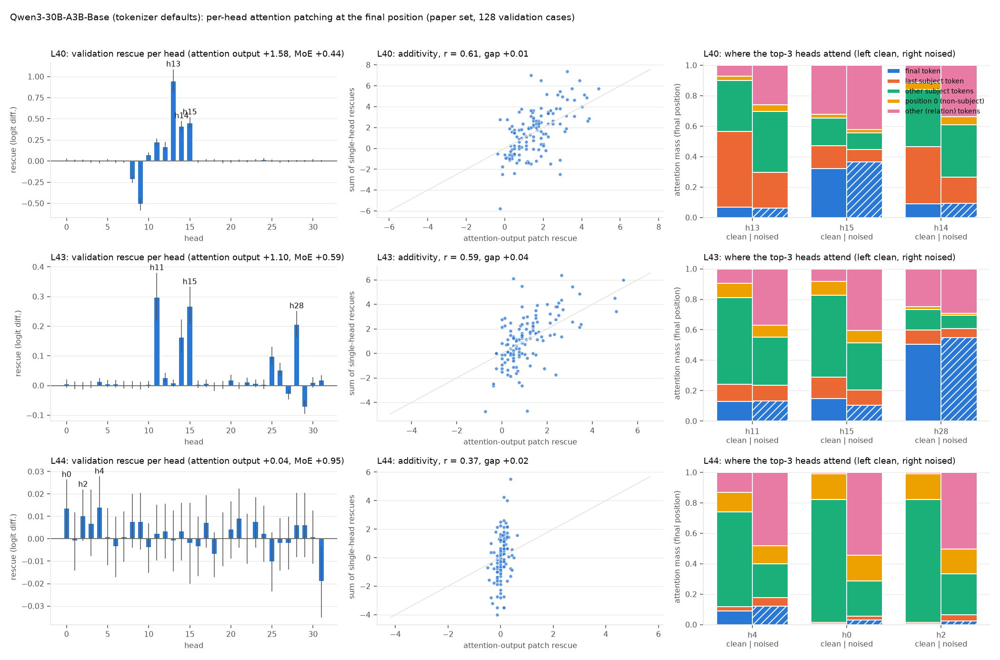
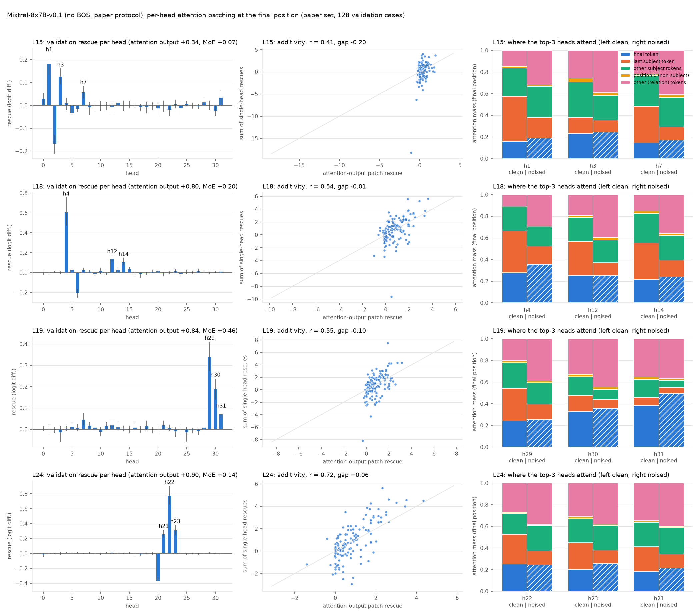
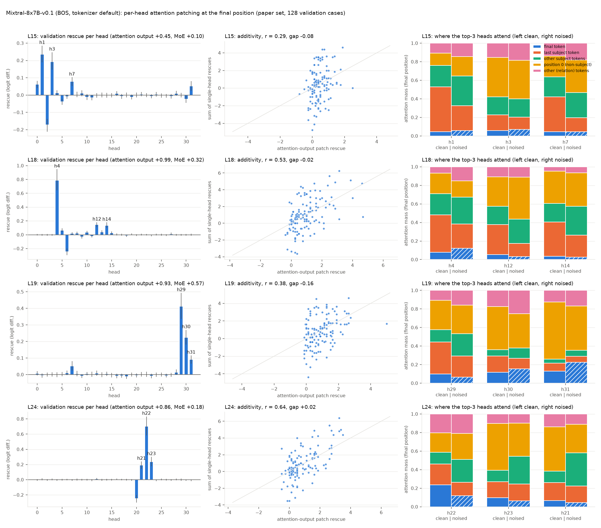

## Extension 5, F2: attention heads at the final token

**Summary.** Per-head patching of the final position's attention output (engine kind `attn_head`, verified against transformers hooks on OLMoE) shows that the attention rescue of Extension 2b is carried by a few *mover heads* that read the last subject token. Qwen3 L40 (attention +1.58): head 13 alone gives +0.95 (60%, Spec +0.93); two heads (13, 15) reach 80%. Qwen3 L43 (+1.10) is distributed (h11, h15, h28; four heads for 80%). Mixtral L18 (+0.81 no BOS / +0.99 BOS): head 4 gives +0.61 / +0.79 (76% / 80%) and suffices alone in 57% / 55% of cases; L24 (+0.90 / +0.86): head 22 +0.78 / +0.70 (86% / 82%); L19, the paper's MoE-peak layer where attention rescues +0.84 / +0.93, needs heads 29–31 plus one or two more; L15: heads 1 and 3. The same heads win with and without BOS. The top head's Spec equals its rescue because the other heads average zero; two Qwen3 L40 heads oppose the recall (h9 −0.50). Mover heads put 0.4–0.5 of their clean attention on the last subject token; noise halves it (Qwen3 h13 0.50 → 0.23, Mixtral h4 0.39 → 0.17) and moves it to the relation tokens (no BOS) or the position-0 sink (BOS). Σ heads equals the attention rescue on the mean at every layer (all gap CIs cover 0) but per-case r is only 0.3–0.7, so minimal sets are additive estimates. At Qwen3 L44 attention rescues +0.04 and no head exceeds +0.014: the paper's MoE peak is a pure-MoE layer.

**Question.** Extension 2b showed that the attention sublayer carries about half of the positive rescue in both models (Qwen3 L40 +1.59, Mixtral L18 +0.99 vs the paper's MoE peaks +0.93 / +0.56). Which heads carry it, are they specific in the sense the paper uses for experts, how many are needed, and what do they attend to in the clean versus the noised run?

**Method.** New engine kind `attn_head` (`moetrace/engine.py`): with H_h the head-h output of the final position before `o_proj` and W_o[:, h] the matching column block, v_h = W_o[:, h]·(H_h^clean − H_h^noised) (fp32) is added to the noised attention output before the MoE of the same layer, h = h_pre^noised + bf16(Attn^noised + v_h); the MoE of that layer and all later layers recompute. Because `o_proj` is linear, Σ_h v_h equals the `attn_layer` vector, so the head patches decompose the attention-output patch exactly at the vector level; at the rescue level additivity is an empirical question. Rescue = Δ_patched − Δ_noised as in Table 1. One pass per run (`scripts/ext5_heads_sweep.py`): every head at the requested layers plus `attn_layer`, `layer` (MoE) and `block` reference rows on the paper's 256 cases, and the final position's attention distribution over positions (`DiagSpec.attn_final`) for the clean and noised prefill rows. Heads are ranked by validation rescue (128 cases; the discovery rank is reported for stability); Spec_h = rescue_h − mean of the other heads of the layer, per case; the minimal head set uses the additive approximation (heads ordered by discovery rescue, cumulative validation rescue against 80% of the `attn_layer` validation rescue) and is therefore an estimate, not an exact joint patch; attention masses are summed over position classes with priority final > last subject token > other subject tokens > position 0 > other (relation) tokens. Rows: `results/<run>/head_rows.parquet`; code `moetrace/ext5_heads.py`, `scripts/ext5_heads_analyze.py`.

**Verification (OLMoE-1B-7B-0125, 20 cases, layers [4, 10], `scripts/ext5_engine_verify.py`, `results/verify_ext5_engine_olmoe.json`).** Linearity: the sum over heads of the engine's head vectors equals W_o(H_clean − H_noised) in fp32 to 6.0e-08 (max abs) and the `attn_layer` vector (difference of the bf16 o_proj outputs) to 0.20% relative norm (bf16 rounding). Against transformers hooks that replace the head-h slice of the o_proj input at the final position: per-row |Δ_engine − Δ_HF| mean 0.147 (max 1.00, 79% within 0.25), the same floor as the whole-attention replace (0.147) and the `layer` kind in `verify_olmoe.json`; a head patch spawned on the clean run with itself as donor reproduces the clean logits (max |Δ| 0.113, mean 0.032). At the rescue level the 16 OLMoE heads do not add up per case (Σ_h rescue_h vs attention rescue: mean |gap| 1.17, r 0.49 on 40 rows whose attention rescue averages +0.30): the sum of 16 single-head rows carries 16 times the per-row bf16 noise (±0.1–0.6), so per-case additivity can only be assessed on the large models with a sizeable attention rescue (below). `results/verify_olmoe.json` is bit-identical to `results/verify_olmoe_before_ext5.json` on every non-timing metric.

### Qwen3-30B-A3B-Base (tokenizer defaults) (`results/qwen3_heads`)

- **L40** (attention peak from Extension 2b): attention-output rescue +1.577 [+1.387, +1.776], MoE +0.436, block +1.925. Top heads (validation): h13 +0.946 [+0.813, +1.086] (Spec +0.926, disc. rank 1), h15 +0.455 [+0.394, +0.519] (Spec +0.418, disc. rank 2), h14 +0.413 [+0.352, +0.475] (Spec +0.375, disc. rank 3). 20 of 32 heads have a positive mean rescue; discovery/validation rank agreement ρ = 0.77, top-3 overlap 3/3. Additivity: Σ heads +1.590 [+1.209, +1.978] vs attention +1.577 (gap +0.013 [-0.292, +0.314], per-case r = 0.61, per-case gap SD 1.80). Minimal set (additive estimate): 2 heads for 80% of the attention rescue ([13, 15]), top-3 heads carry 115%; per case (attention rescue > 0.25, n = 115) the median number of heads is 2 (IQR 1–2), one head suffices in 28% and ≤ 3 in 95% of cases.
  Attention of the top-3 heads (validation mean mass, clean → noised): h13: subject 0.83 → 0.63 (last subject token 0.50 → 0.23), position 0 0.03 → 0.04, final 0.07 → 0.06, relation 0.07 → 0.26; h15: subject 0.33 → 0.19 (last subject token 0.15 → 0.08), position 0 0.02 → 0.02, final 0.32 → 0.36, relation 0.32 → 0.42; h14: subject 0.75 → 0.52 (last subject token 0.37 → 0.17), position 0 0.05 → 0.05, final 0.09 → 0.09, relation 0.11 → 0.34. Across all heads of the layer the mean rescue correlates with the clean subject mass at ρ = 0.40 (last subject token ρ = 0.54; with the noise-induced drop of subject mass ρ = 0.00); layer-mean subject mass 0.58 clean, 0.27 noised.
- **L43** (attention peak from Extension 2b): attention-output rescue +1.103 [+0.920, +1.299], MoE +0.591, block +1.596. Top heads (validation): h11 +0.298 [+0.221, +0.380] (Spec +0.271, disc. rank 2), h15 +0.268 [+0.208, +0.333] (Spec +0.239, disc. rank 1), h28 +0.206 [+0.164, +0.251] (Spec +0.176, disc. rank 4). 27 of 32 heads have a positive mean rescue; discovery/validation rank agreement ρ = 0.83, top-3 overlap 2/3. Additivity: Σ heads +1.143 [+0.795, +1.513] vs attention +1.103 (gap +0.041 [-0.250, +0.325], per-case r = 0.59, per-case gap SD 1.65). Minimal set (additive estimate): 4 heads for 80% of the attention rescue ([15, 11, 14, 28]), top-3 heads carry 66%; per case (attention rescue > 0.25, n = 102) the median number of heads is 3 (IQR 2–3), one head suffices in 6% and ≤ 3 in 76% of cases.
  Attention of the top-3 heads (validation mean mass, clean → noised): h11: subject 0.68 → 0.42 (last subject token 0.11 → 0.10), position 0 0.09 → 0.08, final 0.13 → 0.13, relation 0.10 → 0.37; h15: subject 0.68 → 0.41 (last subject token 0.14 → 0.10), position 0 0.09 → 0.08, final 0.15 → 0.11, relation 0.08 → 0.41; h28: subject 0.23 → 0.15 (last subject token 0.10 → 0.06), position 0 0.02 → 0.01, final 0.50 → 0.55, relation 0.25 → 0.29. Across all heads of the layer the mean rescue correlates with the clean subject mass at ρ = -0.22 (last subject token ρ = 0.66; with the noise-induced drop of subject mass ρ = -0.26); layer-mean subject mass 0.73 clean, 0.29 noised.
- **L44** (the paper's MoE-peak layer; the attention output rescues nothing here, a null): attention-output rescue +0.041 [+0.009, +0.073], MoE +0.946, block +0.965. Top heads (validation): h4 +0.014 [+0.001, +0.028] (Spec +0.013, disc. rank 2), h0 +0.014 [+0.000, +0.026] (Spec +0.012, disc. rank 7), h2 +0.010 [-0.001, +0.022] (Spec +0.009, disc. rank 23). 19 of 32 heads have a positive mean rescue; discovery/validation rank agreement ρ = 0.54, top-3 overlap 1/3. Additivity: Σ heads +0.062 [-0.206, +0.337] vs attention +0.041 (gap +0.021 [-0.240, +0.284], per-case r = 0.37, per-case gap SD 1.51). Minimal set (additive estimate): 5 heads for 80% of the attention rescue ([12, 4, 29, 3, 28]), top-3 heads carry 58%; per case (attention rescue > 0.25, n = 10) the median number of heads is 3 (IQR 2–3), one head suffices in 14% and ≤ 3 in 86% of cases.
  Attention of the top-3 heads (validation mean mass, clean → noised): h4: subject 0.65 → 0.28 (last subject token 0.03 → 0.06), position 0 0.13 → 0.12, final 0.09 → 0.12, relation 0.13 → 0.48; h0: subject 0.82 → 0.26 (last subject token 0.01 → 0.02), position 0 0.17 → 0.17, final 0.01 → 0.03, relation 0.01 → 0.54; h2: subject 0.82 → 0.31 (last subject token 0.01 → 0.04), position 0 0.17 → 0.16, final 0.01 → 0.02, relation 0.01 → 0.50. Across all heads of the layer the mean rescue correlates with the clean subject mass at ρ = -0.02 (last subject token ρ = -0.13; with the noise-induced drop of subject mass ρ = -0.13); layer-mean subject mass 0.78 clean, 0.30 noised.

Figure E5-F2-qwen3: per layer, left: validation rescue of every head with 95% bootstrap CIs (top-3 labelled); middle: per-case sum of the single-head rescues against the attention-output patch (grey diagonal = additivity); right: attention mass of the top-3 heads over position classes, clean (left bar) vs noised (right bar, hatched final-token class). Tables: `results/tables/ext5_heads_ranking_qwen3_L<l>.md/csv` (all heads in `_all.csv`), `ext5_heads_additivity_qwen3.md`, `ext5_heads_minimal_qwen3.md`, `ext5_heads_attention_qwen3.md`.

**Qwen3-30B-A3B-Base (tokenizer defaults): top-8 heads at L40 by validation rescue (128 validation cases; Spec = rescue minus the mean of the other heads)**

| Head | Val. rescue | CI lo | CI hi | Pos. frac. | Spec | Spec CI lo | Spec CI hi | Share of attn | Disc. rescue | Disc. rank | |v_h| |
|---|---|---|---|---|---|---|---|---|---|---|---|
| 13 | +0.946 | +0.813 | +1.086 | +0.891 | +0.926 | +0.794 | +1.063 | +0.600 | +1.091 | 1 | +3.967 |
| 15 | +0.455 | +0.394 | +0.519 | +0.867 | +0.418 | +0.361 | +0.477 | +0.288 | +0.528 | 2 | +2.861 |
| 14 | +0.413 | +0.352 | +0.475 | +0.820 | +0.375 | +0.318 | +0.434 | +0.262 | +0.509 | 3 | +2.815 |
| 11 | +0.225 | +0.187 | +0.266 | +0.805 | +0.181 | +0.148 | +0.216 | +0.142 | +0.285 | 4 | +1.944 |
| 12 | +0.173 | +0.124 | +0.226 | +0.664 | +0.127 | +0.083 | +0.175 | +0.110 | +0.219 | 5 | +1.886 |
| 10 | +0.077 | +0.055 | +0.101 | +0.516 | +0.028 | +0.010 | +0.047 | +0.049 | +0.105 | 6 | +1.080 |
| 24 | +0.016 | -0.003 | +0.034 | +0.336 | -0.035 | -0.052 | -0.019 | +0.010 | +0.011 | 11 | +1.263 |
| 0 | +0.012 | -0.003 | +0.027 | +0.234 | -0.039 | -0.055 | -0.024 | +0.007 | +0.021 | 8 | +1.228 |

**Qwen3-30B-A3B-Base (tokenizer defaults): top-8 heads at L43 by validation rescue (128 validation cases; Spec = rescue minus the mean of the other heads)**

| Head | Val. rescue | CI lo | CI hi | Pos. frac. | Spec | Spec CI lo | Spec CI hi | Share of attn | Disc. rescue | Disc. rank | |v_h| |
|---|---|---|---|---|---|---|---|---|---|---|---|
| 11 | +0.298 | +0.221 | +0.380 | +0.656 | +0.271 | +0.198 | +0.348 | +0.271 | +0.334 | 2 | +2.654 |
| 15 | +0.268 | +0.208 | +0.333 | +0.672 | +0.239 | +0.183 | +0.301 | +0.243 | +0.338 | 1 | +2.245 |
| 28 | +0.206 | +0.164 | +0.251 | +0.727 | +0.176 | +0.135 | +0.219 | +0.187 | +0.227 | 4 | +3.349 |
| 14 | +0.163 | +0.112 | +0.222 | +0.523 | +0.131 | +0.084 | +0.186 | +0.147 | +0.236 | 3 | +3.787 |
| 25 | +0.099 | +0.069 | +0.130 | +0.539 | +0.065 | +0.039 | +0.094 | +0.089 | +0.131 | 5 | +1.850 |
| 26 | +0.053 | +0.031 | +0.076 | +0.406 | +0.018 | -0.003 | +0.038 | +0.048 | +0.065 | 6 | +2.354 |
| 12 | +0.027 | +0.011 | +0.043 | +0.328 | -0.009 | -0.020 | +0.003 | +0.024 | +0.051 | 7 | +1.608 |
| 20 | +0.019 | +0.002 | +0.036 | +0.273 | -0.018 | -0.032 | -0.002 | +0.017 | +0.020 | 10 | +1.807 |

**Qwen3-30B-A3B-Base (tokenizer defaults): top-8 heads at L44 by validation rescue (128 validation cases; Spec = rescue minus the mean of the other heads)**

| Head | Val. rescue | CI lo | CI hi | Pos. frac. | Spec | Spec CI lo | Spec CI hi | Share of attn | Disc. rescue | Disc. rank | |v_h| |
|---|---|---|---|---|---|---|---|---|---|---|---|
| 4 | +0.014 | +0.001 | +0.028 | +0.281 | +0.013 | +0.002 | +0.024 | +0.345 | +0.011 | 2 | +1.629 |
| 0 | +0.014 | +0.000 | +0.026 | +0.266 | +0.012 | +0.002 | +0.021 | +0.333 | +0.006 | 7 | +0.801 |
| 2 | +0.010 | -0.001 | +0.022 | +0.211 | +0.009 | +0.001 | +0.017 | +0.250 | +0.000 | 23 | +0.770 |
| 21 | +0.009 | -0.004 | +0.022 | +0.266 | +0.008 | -0.003 | +0.018 | +0.226 | +0.002 | 13 | +1.228 |
| 9 | +0.008 | -0.005 | +0.021 | +0.234 | +0.006 | -0.005 | +0.017 | +0.190 | +0.001 | 17 | +1.172 |
| 8 | +0.008 | -0.004 | +0.020 | +0.219 | +0.006 | -0.004 | +0.016 | +0.190 | +0.007 | 6 | +1.183 |
| 23 | +0.008 | -0.004 | +0.019 | +0.227 | +0.006 | -0.002 | +0.015 | +0.190 | -0.003 | 27 | +0.764 |
| 17 | +0.007 | -0.004 | +0.020 | +0.188 | +0.006 | -0.003 | +0.014 | +0.179 | +0.005 | 9 | +0.822 |

**Qwen3-30B-A3B-Base (tokenizer defaults): additivity of head patches (validation means)**

| Layer | Attention output [CI] | Sum of heads [CI] | Sum − attention [CI] | Gap SD (per case) | Per-case r | Cases sum > attn | MoE output | Block | Best single head | Heads with mean > 0 |
|---|---|---|---|---|---|---|---|---|---|---|
| L40 | +1.577 [+1.387, +1.776] | +1.590 [+1.209, +1.978] | +0.013 [-0.292, +0.314] | +1.796 | +0.606 | +0.492 | +0.436 | +1.925 | +0.946 | 20 |
| L43 | +1.103 [+0.920, +1.299] | +1.143 [+0.795, +1.513] | +0.041 [-0.250, +0.325] | +1.649 | +0.593 | +0.516 | +0.591 | +1.596 | +0.298 | 27 |
| L44 | +0.041 [+0.009, +0.073] | +0.062 [-0.206, +0.337] | +0.021 [-0.240, +0.284] | +1.507 | +0.373 | +0.508 | +0.946 | +0.965 | +0.014 | 19 |

**Qwen3-30B-A3B-Base (tokenizer defaults): minimal head sets (additive approximation)**

| Layer | k for 80% of attn (pop.) | Set | k for 80% of Σ heads | Top-3 (disc.) | Top-3 share of attn | Per-case k median | q25 | q75 | Frac k = 1 | Frac k ≤ 3 | Cases used | Unreachable |
|---|---|---|---|---|---|---|---|---|---|---|---|---|
| L40 | 2 | [13, 15] | 2 | [13, 15, 14] | 115% | 2 | 1 | 2 | 28% | 95% | 115 | 3 |
| L43 | 4 | [15, 11, 14, 28] | 4 | [15, 11, 14] | 66% | 3 | 2 | 3 | 6% | 76% | 102 | 15 |
| L44 | 5 | [12, 4, 29, 3, 28] | 7 | [12, 4, 29] | 58% | 3 | 2 | 3 | 14% | 86% | 10 | 3 |

**Qwen3-30B-A3B-Base (tokenizer defaults): attention distribution of the top-3 heads per layer (validation mean mass per position class)**

| Layer | Head | clean: final token | clean: last subject token | clean: other subject tokens | clean: position 0 (non-subject) | clean: other (relation) tokens | noised: final token | noised: last subject token | noised: other subject tokens | noised: position 0 (non-subject) | noised: other (relation) tokens | Subject-mass shift (noised − clean) |
|---|---|---|---|---|---|---|---|---|---|---|---|---|
| 40 | 13 | +0.067 | +0.497 | +0.335 | +0.028 | +0.073 | +0.063 | +0.234 | +0.401 | +0.042 | +0.260 | -0.197 |
| 40 | 15 | +0.321 | +0.152 | +0.181 | +0.024 | +0.322 | +0.365 | +0.083 | +0.107 | +0.023 | +0.422 | -0.143 |
| 40 | 14 | +0.090 | +0.375 | +0.377 | +0.045 | +0.113 | +0.092 | +0.173 | +0.344 | +0.054 | +0.336 | -0.234 |
| 43 | 11 | +0.128 | +0.113 | +0.571 | +0.093 | +0.095 | +0.131 | +0.104 | +0.316 | +0.079 | +0.370 | -0.263 |
| 43 | 15 | +0.148 | +0.140 | +0.539 | +0.089 | +0.084 | +0.105 | +0.098 | +0.309 | +0.082 | +0.405 | -0.271 |
| 43 | 28 | +0.504 | +0.096 | +0.134 | +0.020 | +0.247 | +0.549 | +0.058 | +0.090 | +0.010 | +0.293 | -0.082 |
| 44 | 4 | +0.089 | +0.028 | +0.625 | +0.126 | +0.132 | +0.120 | +0.059 | +0.220 | +0.119 | +0.483 | -0.374 |
| 44 | 0 | +0.006 | +0.009 | +0.808 | +0.168 | +0.009 | +0.031 | +0.023 | +0.234 | +0.168 | +0.543 | -0.559 |
| 44 | 2 | +0.007 | +0.009 | +0.808 | +0.166 | +0.011 | +0.024 | +0.041 | +0.268 | +0.163 | +0.504 | -0.508 |

### Mixtral-8x7B-v0.1 (no BOS, paper protocol) (`results/mixtral_nobos_heads`)

- **L15** (attention peak from Extension 2b): attention-output rescue +0.337 [+0.257, +0.420], MoE +0.065, block +0.439. Top heads (validation): h1 +0.183 [+0.134, +0.228] (Spec +0.184, disc. rank 1), h3 +0.126 [+0.093, +0.161] (Spec +0.126, disc. rank 2), h7 +0.058 [+0.031, +0.085] (Spec +0.056, disc. rank 3). 13 of 32 heads have a positive mean rescue; discovery/validation rank agreement ρ = 0.66, top-3 overlap 3/3. Additivity: Σ heads +0.141 [-0.298, +0.485] vs attention +0.337 (gap -0.196 [-0.611, +0.127], per-case r = 0.41, per-case gap SD 2.12). Minimal set (additive estimate): 2 heads for 80% of the attention rescue ([1, 3]), top-3 heads carry 109%; per case (attention rescue > 0.25, n = 61) the median number of heads is 2 (IQR 1–2), one head suffices in 28% and ≤ 3 in 98% of cases.
  Attention of the top-3 heads (validation mean mass, clean → noised): h1: subject 0.68 → 0.48 (last subject token 0.41 → 0.19), position 0 0.02 → 0.01, final 0.16 → 0.19, relation 0.15 → 0.32; h3: subject 0.48 → 0.33 (last subject token 0.15 → 0.11), position 0 0.04 → 0.03, final 0.23 → 0.25, relation 0.26 → 0.39; h7: subject 0.62 → 0.40 (last subject token 0.34 → 0.12), position 0 0.02 → 0.02, final 0.14 → 0.17, relation 0.22 → 0.41. Across all heads of the layer the mean rescue correlates with the clean subject mass at ρ = 0.10 (last subject token ρ = 0.20; with the noise-induced drop of subject mass ρ = 0.11); layer-mean subject mass 0.43 clean, 0.29 noised.
- **L18** (attention peak from Extension 2b): attention-output rescue +0.805 [+0.654, +0.964], MoE +0.204, block +1.006. Top heads (validation): h4 +0.609 [+0.470, +0.756] (Spec +0.603, disc. rank 1), h12 +0.141 [+0.109, +0.175] (Spec +0.120, disc. rank 3), h14 +0.108 [+0.071, +0.149] (Spec +0.086, disc. rank 2). 20 of 32 heads have a positive mean rescue; discovery/validation rank agreement ρ = 0.69, top-3 overlap 3/3. Additivity: Σ heads +0.791 [+0.447, +1.106] vs attention +0.805 (gap -0.014 [-0.306, +0.253], per-case r = 0.54, per-case gap SD 1.61). Minimal set (additive estimate): 2 heads for 80% of the attention rescue ([4, 14]), top-3 heads carry 107%; per case (attention rescue > 0.25, n = 82) the median number of heads is 1 (IQR 1–2), one head suffices in 57% and ≤ 3 in 91% of cases.
  Attention of the top-3 heads (validation mean mass, clean → noised): h4: subject 0.61 → 0.35 (last subject token 0.39 → 0.17), position 0 0.01 → 0.01, final 0.28 → 0.35, relation 0.11 → 0.29; h12: subject 0.54 → 0.33 (last subject token 0.32 → 0.12), position 0 0.02 → 0.02, final 0.25 → 0.25, relation 0.20 → 0.40; h14: subject 0.61 → 0.38 (last subject token 0.34 → 0.16), position 0 0.02 → 0.02, final 0.22 → 0.24, relation 0.15 → 0.36. Across all heads of the layer the mean rescue correlates with the clean subject mass at ρ = 0.33 (last subject token ρ = 0.52; with the noise-induced drop of subject mass ρ = 0.23); layer-mean subject mass 0.35 clean, 0.22 noised.
- **L19** (the paper's MoE-peak layer, where the attention output also rescues +0.84): attention-output rescue +0.838 [+0.712, +0.966], MoE +0.459, block +1.204. Top heads (validation): h29 +0.340 [+0.273, +0.411] (Spec +0.327, disc. rank 1), h30 +0.191 [+0.138, +0.238] (Spec +0.173, disc. rank 2), h31 +0.072 [+0.051, +0.093] (Spec +0.050, disc. rank 3). 22 of 32 heads have a positive mean rescue; discovery/validation rank agreement ρ = 0.74, top-3 overlap 3/3. Additivity: Σ heads +0.743 [+0.402, +1.059] vs attention +0.838 (gap -0.095 [-0.384, +0.164], per-case r = 0.55, per-case gap SD 1.59). Minimal set (additive estimate): 5 heads for 80% of the attention rescue ([29, 30, 31, 7, 12]), top-3 heads carry 72%; per case (attention rescue > 0.25, n = 93) the median number of heads is 2 (IQR 2–3), one head suffices in 6% and ≤ 3 in 80% of cases.
  Attention of the top-3 heads (validation mean mass, clean → noised): h29: subject 0.54 → 0.34 (last subject token 0.30 → 0.14), position 0 0.02 → 0.01, final 0.24 → 0.26, relation 0.20 → 0.39; h30: subject 0.32 → 0.18 (last subject token 0.15 → 0.08), position 0 0.02 → 0.02, final 0.33 → 0.36, relation 0.33 → 0.45; h31: subject 0.24 → 0.12 (last subject token 0.07 → 0.05), position 0 0.02 → 0.01, final 0.38 → 0.50, relation 0.35 → 0.37. Across all heads of the layer the mean rescue correlates with the clean subject mass at ρ = 0.22 (last subject token ρ = 0.60; with the noise-induced drop of subject mass ρ = 0.25); layer-mean subject mass 0.33 clean, 0.20 noised.
- **L24**: attention-output rescue +0.902 [+0.751, +1.059], MoE +0.138, block +1.036. Top heads (validation): h22 +0.776 [+0.652, +0.905] (Spec +0.770, disc. rank 1), h23 +0.312 [+0.250, +0.380] (Spec +0.291, disc. rank 2), h21 +0.261 [+0.211, +0.315] (Spec +0.239, disc. rank 3). 17 of 32 heads have a positive mean rescue; discovery/validation rank agreement ρ = 0.37, top-3 overlap 3/3. Additivity: Σ heads +0.961 [+0.657, +1.252] vs attention +0.902 (gap +0.059 [-0.161, +0.263], per-case r = 0.72, per-case gap SD 1.22). Minimal set (additive estimate): 1 heads for 80% of the attention rescue ([22]), top-3 heads carry 150%; per case (attention rescue > 0.25, n = 90) the median number of heads is 1 (IQR 1–2), one head suffices in 61% and ≤ 3 in 99% of cases.
  Attention of the top-3 heads (validation mean mass, clean → noised): h22: subject 0.47 → 0.36 (last subject token 0.27 → 0.13), position 0 0.01 → 0.01, final 0.25 → 0.24, relation 0.27 → 0.38; h23: subject 0.47 → 0.35 (last subject token 0.25 → 0.12), position 0 0.02 → 0.02, final 0.20 → 0.26, relation 0.31 → 0.38; h21: subject 0.46 → 0.37 (last subject token 0.23 → 0.13), position 0 0.02 → 0.01, final 0.18 → 0.21, relation 0.35 → 0.40. Across all heads of the layer the mean rescue correlates with the clean subject mass at ρ = 0.16 (last subject token ρ = 0.61; with the noise-induced drop of subject mass ρ = -0.19); layer-mean subject mass 0.31 clean, 0.19 noised.

Figure E5-F2-mixtral_nobos: per layer, left: validation rescue of every head with 95% bootstrap CIs (top-3 labelled); middle: per-case sum of the single-head rescues against the attention-output patch (grey diagonal = additivity); right: attention mass of the top-3 heads over position classes, clean (left bar) vs noised (right bar, hatched final-token class). Tables: `results/tables/ext5_heads_ranking_mixtral_nobos_L<l>.md/csv` (all heads in `_all.csv`), `ext5_heads_additivity_mixtral_nobos.md`, `ext5_heads_minimal_mixtral_nobos.md`, `ext5_heads_attention_mixtral_nobos.md`.

**Mixtral-8x7B-v0.1 (no BOS, paper protocol): top-8 heads at L15 by validation rescue (128 validation cases; Spec = rescue minus the mean of the other heads)**

| Head | Val. rescue | CI lo | CI hi | Pos. frac. | Spec | Spec CI lo | Spec CI hi | Share of attn | Disc. rescue | Disc. rank | |v_h| |
|---|---|---|---|---|---|---|---|---|---|---|---|
| 1 | +0.183 | +0.134 | +0.228 | +0.734 | +0.184 | +0.143 | +0.225 | +0.543 | +0.212 | 1 | +5.147 |
| 3 | +0.126 | +0.093 | +0.161 | +0.633 | +0.126 | +0.097 | +0.157 | +0.376 | +0.125 | 2 | +2.901 |
| 7 | +0.058 | +0.031 | +0.085 | +0.500 | +0.056 | +0.033 | +0.081 | +0.173 | +0.063 | 3 | +4.674 |
| 31 | +0.036 | +0.002 | +0.066 | +0.391 | +0.032 | +0.006 | +0.058 | +0.106 | +0.050 | 5 | +3.527 |
| 0 | +0.031 | +0.002 | +0.053 | +0.414 | +0.027 | +0.008 | +0.044 | +0.092 | +0.056 | 4 | +2.381 |
| 28 | +0.015 | -0.003 | +0.036 | +0.266 | +0.011 | -0.005 | +0.030 | +0.046 | +0.024 | 8 | +1.908 |
| 13 | +0.012 | -0.000 | +0.025 | +0.203 | +0.008 | -0.005 | +0.022 | +0.035 | +0.003 | 24 | +1.908 |
| 4 | +0.010 | -0.021 | +0.034 | +0.266 | +0.006 | -0.016 | +0.025 | +0.030 | +0.021 | 11 | +2.084 |

**Mixtral-8x7B-v0.1 (no BOS, paper protocol): top-8 heads at L18 by validation rescue (128 validation cases; Spec = rescue minus the mean of the other heads)**

| Head | Val. rescue | CI lo | CI hi | Pos. frac. | Spec | Spec CI lo | Spec CI hi | Share of attn | Disc. rescue | Disc. rank | |v_h| |
|---|---|---|---|---|---|---|---|---|---|---|---|
| 4 | +0.609 | +0.470 | +0.756 | +0.727 | +0.603 | +0.466 | +0.749 | +0.756 | +0.524 | 1 | +6.522 |
| 12 | +0.141 | +0.109 | +0.175 | +0.648 | +0.120 | +0.091 | +0.151 | +0.176 | +0.116 | 3 | +4.504 |
| 14 | +0.108 | +0.071 | +0.149 | +0.492 | +0.086 | +0.053 | +0.123 | +0.134 | +0.128 | 2 | +4.646 |
| 15 | +0.036 | +0.018 | +0.055 | +0.391 | +0.012 | -0.006 | +0.031 | +0.045 | +0.032 | 6 | +3.003 |
| 13 | +0.029 | -0.001 | +0.054 | +0.367 | +0.004 | -0.028 | +0.030 | +0.036 | +0.025 | 8 | +4.089 |
| 7 | +0.028 | +0.008 | +0.049 | +0.344 | +0.004 | -0.014 | +0.022 | +0.035 | +0.026 | 7 | +5.297 |
| 5 | +0.028 | +0.012 | +0.045 | +0.305 | +0.003 | -0.012 | +0.019 | +0.034 | +0.025 | 9 | +4.019 |
| 10 | +0.018 | -0.014 | +0.049 | +0.352 | -0.007 | -0.035 | +0.022 | +0.022 | +0.042 | 4 | +4.207 |

**Mixtral-8x7B-v0.1 (no BOS, paper protocol): top-8 heads at L19 by validation rescue (128 validation cases; Spec = rescue minus the mean of the other heads)**

| Head | Val. rescue | CI lo | CI hi | Pos. frac. | Spec | Spec CI lo | Spec CI hi | Share of attn | Disc. rescue | Disc. rank | |v_h| |
|---|---|---|---|---|---|---|---|---|---|---|---|
| 29 | +0.340 | +0.273 | +0.411 | +0.797 | +0.327 | +0.262 | +0.396 | +0.406 | +0.374 | 1 | +6.694 |
| 30 | +0.191 | +0.138 | +0.238 | +0.781 | +0.173 | +0.123 | +0.219 | +0.228 | +0.182 | 2 | +5.448 |
| 31 | +0.072 | +0.051 | +0.093 | +0.492 | +0.050 | +0.034 | +0.067 | +0.086 | +0.097 | 3 | +4.629 |
| 7 | +0.047 | +0.018 | +0.075 | +0.312 | +0.024 | -0.000 | +0.050 | +0.056 | +0.045 | 4 | +4.032 |
| 21 | +0.021 | +0.002 | +0.040 | +0.297 | -0.003 | -0.019 | +0.015 | +0.025 | +0.025 | 8 | +4.378 |
| 12 | +0.020 | +0.003 | +0.039 | +0.266 | -0.003 | -0.021 | +0.016 | +0.024 | +0.031 | 5 | +3.231 |
| 8 | +0.019 | +0.004 | +0.034 | +0.266 | -0.005 | -0.018 | +0.010 | +0.022 | +0.017 | 15 | +3.594 |
| 11 | +0.017 | -0.001 | +0.035 | +0.328 | -0.007 | -0.023 | +0.011 | +0.020 | +0.009 | 24 | +5.293 |

**Mixtral-8x7B-v0.1 (no BOS, paper protocol): top-8 heads at L24 by validation rescue (128 validation cases; Spec = rescue minus the mean of the other heads)**

| Head | Val. rescue | CI lo | CI hi | Pos. frac. | Spec | Spec CI lo | Spec CI hi | Share of attn | Disc. rescue | Disc. rank | |v_h| |
|---|---|---|---|---|---|---|---|---|---|---|---|
| 22 | +0.776 | +0.652 | +0.905 | +0.859 | +0.770 | +0.648 | +0.896 | +0.860 | +0.795 | 1 | +9.114 |
| 23 | +0.312 | +0.250 | +0.380 | +0.727 | +0.291 | +0.232 | +0.356 | +0.346 | +0.291 | 2 | +7.309 |
| 21 | +0.261 | +0.211 | +0.315 | +0.734 | +0.239 | +0.190 | +0.291 | +0.290 | +0.238 | 3 | +6.179 |
| 12 | +0.013 | +0.001 | +0.024 | +0.219 | -0.018 | -0.030 | -0.005 | +0.014 | +0.013 | 6 | +2.537 |
| 4 | +0.009 | -0.001 | +0.018 | +0.211 | -0.022 | -0.033 | -0.011 | +0.010 | +0.005 | 18 | +3.641 |
| 11 | +0.007 | -0.004 | +0.017 | +0.219 | -0.024 | -0.034 | -0.013 | +0.008 | +0.015 | 5 | +3.091 |
| 13 | +0.005 | -0.005 | +0.014 | +0.203 | -0.026 | -0.036 | -0.016 | +0.005 | +0.002 | 23 | +3.015 |
| 1 | +0.004 | -0.008 | +0.017 | +0.203 | -0.027 | -0.040 | -0.014 | +0.004 | +0.010 | 10 | +2.579 |

**Mixtral-8x7B-v0.1 (no BOS, paper protocol): additivity of head patches (validation means)**

| Layer | Attention output [CI] | Sum of heads [CI] | Sum − attention [CI] | Gap SD (per case) | Per-case r | Cases sum > attn | MoE output | Block | Best single head | Heads with mean > 0 |
|---|---|---|---|---|---|---|---|---|---|---|
| L15 | +0.337 [+0.257, +0.420] | +0.141 [-0.298, +0.485] | -0.196 [-0.611, +0.127] | +2.123 | +0.406 | +0.500 | +0.065 | +0.439 | +0.183 | 13 |
| L18 | +0.805 [+0.654, +0.964] | +0.791 [+0.447, +1.106] | -0.014 [-0.306, +0.253] | +1.605 | +0.540 | +0.547 | +0.204 | +1.006 | +0.609 | 20 |
| L19 | +0.838 [+0.712, +0.966] | +0.743 [+0.402, +1.059] | -0.095 [-0.384, +0.164] | +1.592 | +0.551 | +0.531 | +0.459 | +1.204 | +0.340 | 22 |
| L24 | +0.902 [+0.751, +1.059] | +0.961 [+0.657, +1.252] | +0.059 [-0.161, +0.263] | +1.225 | +0.717 | +0.555 | +0.138 | +1.036 | +0.776 | 17 |

**Mixtral-8x7B-v0.1 (no BOS, paper protocol): minimal head sets (additive approximation)**

| Layer | k for 80% of attn (pop.) | Set | k for 80% of Σ heads | Top-3 (disc.) | Top-3 share of attn | Per-case k median | q25 | q75 | Frac k = 1 | Frac k ≤ 3 | Cases used | Unreachable |
|---|---|---|---|---|---|---|---|---|---|---|---|---|
| L15 | 2 | [1, 3] | 1 | [1, 3, 7] | 109% | 2 | 1 | 2 | 28% | 98% | 61 | 11 |
| L18 | 2 | [4, 14] | 2 | [4, 14, 12] | 107% | 1 | 1 | 2 | 57% | 91% | 82 | 7 |
| L19 | 5 | [29, 30, 31, 7, 12] | 3 | [29, 30, 31] | 72% | 2 | 2 | 3 | 6% | 80% | 93 | 14 |
| L24 | 1 | [22] | 1 | [22, 23, 21] | 150% | 1 | 1 | 2 | 61% | 99% | 90 | 2 |

**Mixtral-8x7B-v0.1 (no BOS, paper protocol): attention distribution of the top-3 heads per layer (validation mean mass per position class)**

| Layer | Head | clean: final token | clean: last subject token | clean: other subject tokens | clean: position 0 (non-subject) | clean: other (relation) tokens | noised: final token | noised: last subject token | noised: other subject tokens | noised: position 0 (non-subject) | noised: other (relation) tokens | Subject-mass shift (noised − clean) |
|---|---|---|---|---|---|---|---|---|---|---|---|---|
| 15 | 1 | +0.161 | +0.414 | +0.262 | +0.016 | +0.146 | +0.190 | +0.193 | +0.284 | +0.015 | +0.319 | -0.200 |
| 15 | 3 | +0.230 | +0.148 | +0.330 | +0.035 | +0.257 | +0.247 | +0.110 | +0.224 | +0.028 | +0.391 | -0.144 |
| 15 | 7 | +0.144 | +0.338 | +0.284 | +0.017 | +0.217 | +0.172 | +0.120 | +0.276 | +0.023 | +0.409 | -0.226 |
| 18 | 4 | +0.278 | +0.387 | +0.219 | +0.011 | +0.105 | +0.355 | +0.169 | +0.178 | +0.009 | +0.289 | -0.260 |
| 18 | 12 | +0.249 | +0.319 | +0.220 | +0.016 | +0.195 | +0.250 | +0.120 | +0.210 | +0.024 | +0.397 | -0.210 |
| 18 | 14 | +0.215 | +0.339 | +0.274 | +0.021 | +0.152 | +0.238 | +0.158 | +0.224 | +0.018 | +0.362 | -0.231 |
| 19 | 29 | +0.241 | +0.302 | +0.238 | +0.017 | +0.203 | +0.256 | +0.141 | +0.199 | +0.014 | +0.390 | -0.199 |
| 19 | 30 | +0.327 | +0.150 | +0.173 | +0.021 | +0.329 | +0.357 | +0.081 | +0.096 | +0.019 | +0.447 | -0.145 |
| 19 | 31 | +0.382 | +0.073 | +0.171 | +0.021 | +0.353 | +0.497 | +0.051 | +0.069 | +0.014 | +0.370 | -0.124 |
| 24 | 22 | +0.250 | +0.274 | +0.197 | +0.009 | +0.270 | +0.242 | +0.129 | +0.234 | +0.011 | +0.384 | -0.108 |
| 24 | 23 | +0.203 | +0.247 | +0.220 | +0.018 | +0.312 | +0.258 | +0.124 | +0.223 | +0.017 | +0.378 | -0.120 |
| 24 | 21 | +0.180 | +0.233 | +0.224 | +0.016 | +0.347 | +0.214 | +0.129 | +0.245 | +0.013 | +0.399 | -0.084 |

### Mixtral-8x7B-v0.1 (BOS, tokenizer default) (`results/mixtral_bos_heads`)

- **L15** (attention peak from Extension 2b): attention-output rescue +0.446 [+0.360, +0.538], MoE +0.105, block +0.580. Top heads (validation): h1 +0.236 [+0.189, +0.286] (Spec +0.232, disc. rank 1), h3 +0.192 [+0.146, +0.248] (Spec +0.187, disc. rank 2), h7 +0.078 [+0.053, +0.103] (Spec +0.069, disc. rank 3). 16 of 32 heads have a positive mean rescue; discovery/validation rank agreement ρ = 0.75, top-3 overlap 3/3. Additivity: Σ heads +0.361 [+0.040, +0.686] vs attention +0.446 (gap -0.085 [-0.396, +0.221], per-case r = 0.29, per-case gap SD 1.78). Minimal set (additive estimate): 2 heads for 80% of the attention rescue ([1, 3]), top-3 heads carry 113%; per case (attention rescue > 0.25, n = 70) the median number of heads is 2 (IQR 1–2), one head suffices in 31% and ≤ 3 in 97% of cases.
  Attention of the top-3 heads (validation mean mass, clean → noised): h1: subject 0.71 → 0.59 (last subject token 0.48 → 0.27), position 0 0.13 → 0.21, final 0.04 → 0.06, relation 0.11 → 0.14; h3: subject 0.36 → 0.33 (last subject token 0.17 → 0.13), position 0 0.42 → 0.42, final 0.06 → 0.07, relation 0.15 → 0.18; h7: subject 0.59 → 0.42 (last subject token 0.38 → 0.15), position 0 0.22 → 0.35, final 0.04 → 0.05, relation 0.14 → 0.18. Across all heads of the layer the mean rescue correlates with the clean subject mass at ρ = 0.25 (last subject token ρ = 0.29; with the noise-induced drop of subject mass ρ = 0.18); layer-mean subject mass 0.21 clean, 0.19 noised.
- **L18** (attention peak from Extension 2b): attention-output rescue +0.989 [+0.822, +1.164], MoE +0.318, block +1.288. Top heads (validation): h4 +0.790 [+0.643, +0.948] (Spec +0.784, disc. rank 1), h12 +0.146 [+0.111, +0.182] (Spec +0.119, disc. rank 3), h14 +0.136 [+0.096, +0.179] (Spec +0.109, disc. rank 2). 17 of 32 heads have a positive mean rescue; discovery/validation rank agreement ρ = 0.85, top-3 overlap 3/3. Additivity: Σ heads +0.970 [+0.640, +1.314] vs attention +0.989 (gap -0.019 [-0.309, +0.270], per-case r = 0.53, per-case gap SD 1.65). Minimal set (additive estimate): 2 heads for 80% of the attention rescue ([4, 14]), top-3 heads carry 108%; per case (attention rescue > 0.25, n = 93) the median number of heads is 1 (IQR 1–2), one head suffices in 55% and ≤ 3 in 91% of cases.
  Attention of the top-3 heads (validation mean mass, clean → noised): h4: subject 0.63 → 0.55 (last subject token 0.41 → 0.26), position 0 0.22 → 0.17, final 0.08 → 0.12, relation 0.07 → 0.15; h12: subject 0.52 → 0.40 (last subject token 0.32 → 0.14), position 0 0.32 → 0.45, final 0.06 → 0.03, relation 0.11 → 0.11; h14: subject 0.57 → 0.55 (last subject token 0.37 → 0.24), position 0 0.35 → 0.36, final 0.04 → 0.03, relation 0.05 → 0.07. Across all heads of the layer the mean rescue correlates with the clean subject mass at ρ = 0.63 (last subject token ρ = 0.67; with the noise-induced drop of subject mass ρ = 0.34); layer-mean subject mass 0.16 clean, 0.16 noised.
- **L19** (the paper's MoE-peak layer, where the attention output also rescues +0.93): attention-output rescue +0.933 [+0.800, +1.075], MoE +0.570, block +1.393. Top heads (validation): h29 +0.412 [+0.336, +0.494] (Spec +0.400, disc. rank 1), h30 +0.225 [+0.181, +0.270] (Spec +0.207, disc. rank 2), h31 +0.091 [+0.066, +0.116] (Spec +0.069, disc. rank 3). 16 of 32 heads have a positive mean rescue; discovery/validation rank agreement ρ = 0.60, top-3 overlap 3/3. Additivity: Σ heads +0.775 [+0.479, +1.072] vs attention +0.933 (gap -0.157 [-0.436, +0.119], per-case r = 0.38, per-case gap SD 1.57). Minimal set (additive estimate): 4 heads for 80% of the attention rescue ([29, 30, 31, 7]), top-3 heads carry 78%; per case (attention rescue > 0.25, n = 94) the median number of heads is 2 (IQR 2–3), one head suffices in 14% and ≤ 3 in 87% of cases.
  Attention of the top-3 heads (validation mean mass, clean → noised): h29: subject 0.48 → 0.47 (last subject token 0.35 → 0.23), position 0 0.32 → 0.31, final 0.10 → 0.07, relation 0.11 → 0.16; h30: subject 0.24 → 0.22 (last subject token 0.18 → 0.12), position 0 0.47 → 0.37, final 0.12 → 0.15, relation 0.17 → 0.25; h31: subject 0.13 → 0.13 (last subject token 0.09 → 0.07), position 0 0.62 → 0.48, final 0.13 → 0.22, relation 0.12 → 0.17. Across all heads of the layer the mean rescue correlates with the clean subject mass at ρ = 0.52 (last subject token ρ = 0.53; with the noise-induced drop of subject mass ρ = 0.47); layer-mean subject mass 0.12 clean, 0.15 noised.
- **L24**: attention-output rescue +0.856 [+0.699, +1.022], MoE +0.178, block +0.988. Top heads (validation): h22 +0.704 [+0.582, +0.833] (Spec +0.698, disc. rank 1), h23 +0.235 [+0.175, +0.302] (Spec +0.215, disc. rank 2), h21 +0.190 [+0.142, +0.241] (Spec +0.168, disc. rank 3). 18 of 32 heads have a positive mean rescue; discovery/validation rank agreement ρ = 0.40, top-3 overlap 3/3. Additivity: Σ heads +0.878 [+0.566, +1.196] vs attention +0.856 (gap +0.022 [-0.222, +0.263], per-case r = 0.64, per-case gap SD 1.41). Minimal set (additive estimate): 1 heads for 80% of the attention rescue ([22]), top-3 heads carry 132%; per case (attention rescue > 0.25, n = 80) the median number of heads is 1 (IQR 1–2), one head suffices in 58% and ≤ 3 in 100% of cases.
  Attention of the top-3 heads (validation mean mass, clean → noised): h22: subject 0.35 → 0.39 (last subject token 0.23 → 0.15), position 0 0.21 → 0.28, final 0.24 → 0.12, relation 0.20 → 0.21; h23: subject 0.30 → 0.48 (last subject token 0.17 → 0.18), position 0 0.50 → 0.36, final 0.10 → 0.06, relation 0.10 → 0.10; h21: subject 0.32 → 0.53 (last subject token 0.19 → 0.18), position 0 0.48 → 0.31, final 0.07 → 0.05, relation 0.14 → 0.11. Across all heads of the layer the mean rescue correlates with the clean subject mass at ρ = 0.22 (last subject token ρ = 0.22; with the noise-induced drop of subject mass ρ = -0.33); layer-mean subject mass 0.07 clean, 0.11 noised.

Figure E5-F2-mixtral_bos: per layer, left: validation rescue of every head with 95% bootstrap CIs (top-3 labelled); middle: per-case sum of the single-head rescues against the attention-output patch (grey diagonal = additivity); right: attention mass of the top-3 heads over position classes, clean (left bar) vs noised (right bar, hatched final-token class). Tables: `results/tables/ext5_heads_ranking_mixtral_bos_L<l>.md/csv` (all heads in `_all.csv`), `ext5_heads_additivity_mixtral_bos.md`, `ext5_heads_minimal_mixtral_bos.md`, `ext5_heads_attention_mixtral_bos.md`.

**Mixtral-8x7B-v0.1 (BOS, tokenizer default): top-8 heads at L15 by validation rescue (128 validation cases; Spec = rescue minus the mean of the other heads)**

| Head | Val. rescue | CI lo | CI hi | Pos. frac. | Spec | Spec CI lo | Spec CI hi | Share of attn | Disc. rescue | Disc. rank | |v_h| |
|---|---|---|---|---|---|---|---|---|---|---|---|
| 1 | +0.236 | +0.189 | +0.286 | +0.750 | +0.232 | +0.185 | +0.280 | +0.528 | +0.249 | 1 | +6.203 |
| 3 | +0.192 | +0.146 | +0.248 | +0.641 | +0.187 | +0.141 | +0.243 | +0.431 | +0.166 | 2 | +3.348 |
| 7 | +0.078 | +0.053 | +0.103 | +0.547 | +0.069 | +0.046 | +0.092 | +0.175 | +0.061 | 3 | +5.394 |
| 0 | +0.062 | +0.040 | +0.083 | +0.477 | +0.052 | +0.034 | +0.070 | +0.138 | +0.047 | 4 | +2.504 |
| 31 | +0.053 | +0.025 | +0.081 | +0.414 | +0.043 | +0.018 | +0.069 | +0.118 | +0.037 | 5 | +3.774 |
| 4 | +0.013 | -0.003 | +0.028 | +0.281 | +0.001 | -0.010 | +0.013 | +0.028 | +0.009 | 7 | +1.966 |
| 9 | +0.010 | -0.008 | +0.027 | +0.297 | -0.001 | -0.016 | +0.013 | +0.023 | +0.000 | 11 | +2.170 |
| 28 | +0.010 | -0.004 | +0.024 | +0.234 | -0.002 | -0.013 | +0.009 | +0.022 | +0.011 | 6 | +1.514 |

**Mixtral-8x7B-v0.1 (BOS, tokenizer default): top-8 heads at L18 by validation rescue (128 validation cases; Spec = rescue minus the mean of the other heads)**

| Head | Val. rescue | CI lo | CI hi | Pos. frac. | Spec | Spec CI lo | Spec CI hi | Share of attn | Disc. rescue | Disc. rank | |v_h| |
|---|---|---|---|---|---|---|---|---|---|---|---|
| 4 | +0.790 | +0.643 | +0.948 | +0.797 | +0.784 | +0.636 | +0.942 | +0.799 | +0.658 | 1 | +6.754 |
| 12 | +0.146 | +0.111 | +0.182 | +0.656 | +0.119 | +0.088 | +0.153 | +0.148 | +0.138 | 3 | +4.738 |
| 14 | +0.136 | +0.096 | +0.179 | +0.508 | +0.109 | +0.073 | +0.149 | +0.138 | +0.193 | 2 | +4.942 |
| 5 | +0.064 | +0.040 | +0.092 | +0.445 | +0.035 | +0.014 | +0.059 | +0.065 | +0.036 | 5 | +3.837 |
| 13 | +0.042 | +0.019 | +0.065 | +0.438 | +0.012 | -0.008 | +0.031 | +0.042 | +0.062 | 4 | +4.345 |
| 10 | +0.036 | +0.015 | +0.058 | +0.336 | +0.005 | -0.014 | +0.026 | +0.036 | +0.032 | 6 | +3.288 |
| 15 | +0.027 | +0.004 | +0.050 | +0.320 | -0.004 | -0.027 | +0.020 | +0.027 | +0.016 | 9 | +2.841 |
| 8 | +0.024 | +0.007 | +0.042 | +0.297 | -0.006 | -0.023 | +0.011 | +0.025 | +0.020 | 8 | +2.541 |

**Mixtral-8x7B-v0.1 (BOS, tokenizer default): top-8 heads at L19 by validation rescue (128 validation cases; Spec = rescue minus the mean of the other heads)**

| Head | Val. rescue | CI lo | CI hi | Pos. frac. | Spec | Spec CI lo | Spec CI hi | Share of attn | Disc. rescue | Disc. rank | |v_h| |
|---|---|---|---|---|---|---|---|---|---|---|---|
| 29 | +0.412 | +0.336 | +0.494 | +0.789 | +0.400 | +0.324 | +0.482 | +0.441 | +0.440 | 1 | +6.876 |
| 30 | +0.225 | +0.181 | +0.270 | +0.711 | +0.207 | +0.167 | +0.249 | +0.241 | +0.184 | 2 | +4.936 |
| 31 | +0.091 | +0.066 | +0.116 | +0.555 | +0.069 | +0.045 | +0.093 | +0.098 | +0.092 | 3 | +3.907 |
| 7 | +0.052 | +0.024 | +0.081 | +0.320 | +0.028 | +0.002 | +0.058 | +0.055 | +0.051 | 4 | +4.213 |
| 28 | +0.014 | -0.001 | +0.030 | +0.211 | -0.011 | -0.024 | +0.004 | +0.015 | +0.005 | 10 | +2.377 |
| 6 | +0.010 | -0.003 | +0.024 | +0.203 | -0.014 | -0.024 | -0.004 | +0.011 | +0.009 | 6 | +2.075 |
| 12 | +0.009 | -0.006 | +0.024 | +0.188 | -0.016 | -0.030 | -0.001 | +0.009 | +0.007 | 9 | +1.914 |
| 0 | +0.008 | -0.006 | +0.021 | +0.219 | -0.017 | -0.029 | -0.005 | +0.008 | -0.007 | 26 | +1.577 |

**Mixtral-8x7B-v0.1 (BOS, tokenizer default): top-8 heads at L24 by validation rescue (128 validation cases; Spec = rescue minus the mean of the other heads)**

| Head | Val. rescue | CI lo | CI hi | Pos. frac. | Spec | Spec CI lo | Spec CI hi | Share of attn | Disc. rescue | Disc. rank | |v_h| |
|---|---|---|---|---|---|---|---|---|---|---|---|
| 22 | +0.704 | +0.582 | +0.833 | +0.781 | +0.698 | +0.579 | +0.825 | +0.822 | +0.640 | 1 | +8.798 |
| 23 | +0.235 | +0.175 | +0.302 | +0.594 | +0.215 | +0.158 | +0.278 | +0.275 | +0.183 | 2 | +6.062 |
| 21 | +0.190 | +0.142 | +0.241 | +0.625 | +0.168 | +0.123 | +0.215 | +0.222 | +0.142 | 3 | +5.409 |
| 12 | +0.011 | -0.002 | +0.024 | +0.188 | -0.017 | -0.029 | -0.004 | +0.013 | +0.013 | 4 | +1.437 |
| 16 | +0.006 | -0.003 | +0.016 | +0.133 | -0.022 | -0.031 | -0.013 | +0.007 | -0.005 | 15 | +0.298 |
| 1 | +0.006 | -0.006 | +0.018 | +0.188 | -0.022 | -0.033 | -0.012 | +0.007 | -0.006 | 17 | +0.968 |
| 3 | +0.005 | -0.006 | +0.016 | +0.164 | -0.023 | -0.033 | -0.013 | +0.006 | +0.000 | 7 | +2.513 |
| 28 | +0.005 | -0.007 | +0.017 | +0.172 | -0.023 | -0.035 | -0.013 | +0.006 | -0.007 | 21 | +0.949 |

**Mixtral-8x7B-v0.1 (BOS, tokenizer default): additivity of head patches (validation means)**

| Layer | Attention output [CI] | Sum of heads [CI] | Sum − attention [CI] | Gap SD (per case) | Per-case r | Cases sum > attn | MoE output | Block | Best single head | Heads with mean > 0 |
|---|---|---|---|---|---|---|---|---|---|---|
| L15 | +0.446 [+0.360, +0.538] | +0.361 [+0.040, +0.686] | -0.085 [-0.396, +0.221] | +1.778 | +0.290 | +0.500 | +0.105 | +0.580 | +0.236 | 16 |
| L18 | +0.989 [+0.822, +1.164] | +0.970 [+0.640, +1.314] | -0.019 [-0.309, +0.270] | +1.654 | +0.531 | +0.492 | +0.318 | +1.288 | +0.790 | 17 |
| L19 | +0.933 [+0.800, +1.075] | +0.775 [+0.479, +1.072] | -0.157 [-0.436, +0.119] | +1.574 | +0.384 | +0.453 | +0.570 | +1.393 | +0.412 | 16 |
| L24 | +0.856 [+0.699, +1.022] | +0.878 [+0.566, +1.196] | +0.022 [-0.222, +0.263] | +1.408 | +0.636 | +0.500 | +0.178 | +0.988 | +0.704 | 18 |

**Mixtral-8x7B-v0.1 (BOS, tokenizer default): minimal head sets (additive approximation)**

| Layer | k for 80% of attn (pop.) | Set | k for 80% of Σ heads | Top-3 (disc.) | Top-3 share of attn | Per-case k median | q25 | q75 | Frac k = 1 | Frac k ≤ 3 | Cases used | Unreachable |
|---|---|---|---|---|---|---|---|---|---|---|---|---|
| L15 | 2 | [1, 3] | 2 | [1, 3, 7] | 113% | 2 | 1 | 2 | 31% | 97% | 70 | 8 |
| L18 | 2 | [4, 14] | 1 | [4, 14, 12] | 108% | 1 | 1 | 2 | 55% | 91% | 93 | 1 |
| L19 | 4 | [29, 30, 31, 7] | 2 | [29, 30, 31] | 78% | 2 | 2 | 3 | 14% | 87% | 94 | 23 |
| L24 | 1 | [22] | 1 | [22, 23, 21] | 132% | 1 | 1 | 2 | 58% | 100% | 80 | 1 |

**Mixtral-8x7B-v0.1 (BOS, tokenizer default): attention distribution of the top-3 heads per layer (validation mean mass per position class)**

| Layer | Head | clean: final token | clean: last subject token | clean: other subject tokens | clean: position 0 (non-subject) | clean: other (relation) tokens | noised: final token | noised: last subject token | noised: other subject tokens | noised: position 0 (non-subject) | noised: other (relation) tokens | Subject-mass shift (noised − clean) |
|---|---|---|---|---|---|---|---|---|---|---|---|---|
| 15 | 1 | +0.045 | +0.484 | +0.231 | +0.133 | +0.107 | +0.059 | +0.266 | +0.321 | +0.209 | +0.144 | -0.127 |
| 15 | 3 | +0.058 | +0.168 | +0.195 | +0.424 | +0.155 | +0.070 | +0.131 | +0.197 | +0.417 | +0.184 | -0.034 |
| 15 | 7 | +0.045 | +0.376 | +0.216 | +0.224 | +0.140 | +0.046 | +0.152 | +0.270 | +0.350 | +0.182 | -0.170 |
| 18 | 4 | +0.077 | +0.405 | +0.227 | +0.221 | +0.069 | +0.121 | +0.261 | +0.291 | +0.175 | +0.152 | -0.080 |
| 18 | 12 | +0.055 | +0.322 | +0.196 | +0.317 | +0.110 | +0.032 | +0.142 | +0.261 | +0.454 | +0.111 | -0.115 |
| 18 | 14 | +0.036 | +0.368 | +0.201 | +0.348 | +0.047 | +0.026 | +0.237 | +0.310 | +0.360 | +0.067 | -0.022 |
| 19 | 29 | +0.097 | +0.346 | +0.133 | +0.317 | +0.106 | +0.066 | +0.227 | +0.241 | +0.307 | +0.160 | -0.012 |
| 19 | 30 | +0.117 | +0.176 | +0.066 | +0.467 | +0.173 | +0.153 | +0.116 | +0.109 | +0.372 | +0.251 | -0.017 |
| 19 | 31 | +0.130 | +0.087 | +0.042 | +0.618 | +0.124 | +0.224 | +0.065 | +0.065 | +0.477 | +0.169 | +0.001 |
| 24 | 22 | +0.235 | +0.227 | +0.124 | +0.210 | +0.204 | +0.119 | +0.146 | +0.246 | +0.281 | +0.208 | +0.041 |
| 24 | 23 | +0.098 | +0.172 | +0.124 | +0.503 | +0.103 | +0.064 | +0.181 | +0.300 | +0.356 | +0.099 | +0.185 |
| 24 | 21 | +0.068 | +0.194 | +0.122 | +0.478 | +0.138 | +0.045 | +0.178 | +0.357 | +0.307 | +0.112 | +0.219 |

### Reading across runs

- Qwen3-30B-A3B-Base (tokenizer defaults) L40: attention +1.58; best head h13 +0.95 (60% of the attention rescue); top-3 share 115%; Σ heads +1.59, r = 0.61.
- Qwen3-30B-A3B-Base (tokenizer defaults) L43: attention +1.10; best head h11 +0.30 (27% of the attention rescue); top-3 share 66%; Σ heads +1.14, r = 0.59.
- Qwen3-30B-A3B-Base (tokenizer defaults) L44: attention +0.04; best head h4 +0.01 (nan% of the attention rescue); top-3 share nan%; Σ heads +0.06, r = 0.37.
- Mixtral-8x7B-v0.1 (no BOS, paper protocol) L15: attention +0.34; best head h1 +0.18 (54% of the attention rescue); top-3 share 109%; Σ heads +0.14, r = 0.41.
- Mixtral-8x7B-v0.1 (no BOS, paper protocol) L18: attention +0.80; best head h4 +0.61 (76% of the attention rescue); top-3 share 107%; Σ heads +0.79, r = 0.54.
- Mixtral-8x7B-v0.1 (no BOS, paper protocol) L19: attention +0.84; best head h29 +0.34 (41% of the attention rescue); top-3 share 72%; Σ heads +0.74, r = 0.55.
- Mixtral-8x7B-v0.1 (no BOS, paper protocol) L24: attention +0.90; best head h22 +0.78 (86% of the attention rescue); top-3 share 150%; Σ heads +0.96, r = 0.72.
- Mixtral-8x7B-v0.1 (BOS, tokenizer default) L15: attention +0.45; best head h1 +0.24 (53% of the attention rescue); top-3 share 113%; Σ heads +0.36, r = 0.29.
- Mixtral-8x7B-v0.1 (BOS, tokenizer default) L18: attention +0.99; best head h4 +0.79 (80% of the attention rescue); top-3 share 108%; Σ heads +0.97, r = 0.53.
- Mixtral-8x7B-v0.1 (BOS, tokenizer default) L19: attention +0.93; best head h29 +0.41 (44% of the attention rescue); top-3 share 78%; Σ heads +0.78, r = 0.38.
- Mixtral-8x7B-v0.1 (BOS, tokenizer default) L24: attention +0.86; best head h22 +0.70 (82% of the attention rescue); top-3 share 132%; Σ heads +0.88, r = 0.64.

**Caveats and open questions.** (1) Head Spec has no recurrence gate (every head is always active), so the analogue of the paper's expert Spec is a contrast against the other heads only. (2) Minimal sets are additive estimates; an exact joint head patch (`attn_head_set`, the head analogue of `coalition_set`) is a one-line engine extension and would settle the sub-additivity seen at the peaks. (3) The MoE-side cross-check of the plan (patch the L40 heads and read E069's routing/contribution at L44) needs routing recorded for wavefront rows and is left for wave 2. (4) The position-0 class is the BOS sink only in the BOS run of Mixtral; in Qwen3 and in Mixtral without BOS it is the first prompt token and is absorbed by the subject classes when the prompt starts with the subject.
