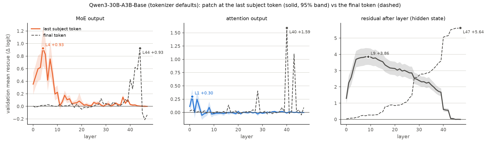
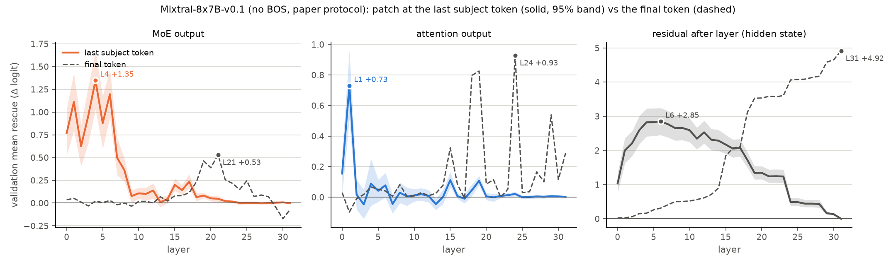
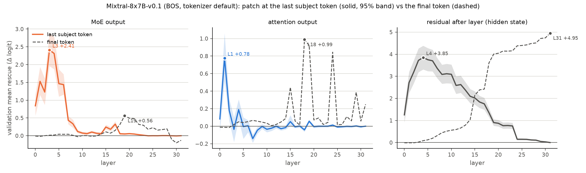
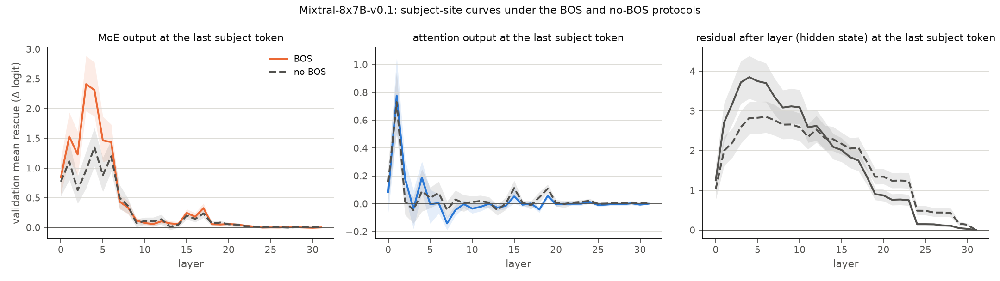

## Extension 5 / F4: causal tracing at the last subject token (the "early site")

**Summary.** Patching at the *last subject token* instead of the final token reveals the early site that classic causal tracing predicts and the paper never measured. Replacing one layer's MoE output at that token by the clean run's recovers, within the first ten layers, as much as (Qwen3: L4 +0.93 vs the paper's L44 +0.93) or 2–4× more than (Mixtral: L6 +1.20 without BOS, L4 +2.31 with BOS, vs L19–L21 +0.45–0.56) the best final-token MoE patch; the two curves occupy disjoint layer bands (L0–L9 vs L40–L44 / L18–L24). Restoring the token's whole residual recovers 0.6–0.8 of the drop at L4–L11 and decays to zero by the last layer as the information leaves the token; attention output at that token matters only at L1. The last subject token alone carries about half of the corruption (0.47–0.52 of the drop). Unlike the final token, the early site has **no shared expert**: the noise scrambles the subject token's routing (clean top-k retained 0.33–0.44 vs 0.65–0.79), routing spreads over 62–81 experts (Qwen3) or all 8 (Mixtral), the recurrent experts there rescue nothing (Spec ≈ 0), Mixtral has none, and L44E069, L42E115, L19E002, L19E006, L18E001 rescue nothing at the subject token. Per prompt one expert carries ~90% of the layer effect, but a different one for each subject. The paper's protocol thus finds the early *layers* but cannot name an early *expert*: a per-subject store versus a shared read-out. BOS changes the size of Mixtral's early site, not its location.

**Question.** The paper (and every run of this reproduction so far) patches the *final* position of the prompt. Classic causal tracing (Meng et al., 2022) locates a second, earlier site: restoring the corrupted subject's *last token* in early-to-middle MLP layers recovers the fact. Does an MoE model show that early site, which layers and which experts carry it, and how does it compare with the final-token curves the paper reports?

**Method.** New executor `moetrace/ext5_subject.py` (`SubjectEngine.run_subject`; engine.py untouched, its helpers reused). A patch at position p and layer l changes positions p..T−1 for all layers ≥ l, so a *suffix wavefront row* starts after layer l with the noised run's residuals at positions p..T−1, the intervention applied at p only, and runs layers l+1..L−1 for those T−p tokens, attending to the parent noised run's K/V for positions < p and to its own K/V for ≥ p. Δ = logit(true) − logit(foil) is read at the final position as usual; rescue = Δ_patched − Δ_noised. p = last subject token (`Case.subject_pos[-1]`; CounterFact suffixes are 2–8 tokens, mean 4.2). Kinds mirror ext2 at the final position: `layer` (MoE output at p ← clean), `attn_layer` (attention-sublayer output at p ← clean, the MoE of that layer recomputes), `resid` (whole residual after layer l at p ← clean). Paper case sets (128/128), σ = 3, all layers, two layer-chunked passes per model; expert pass at the subject-site MoE peaks plus the final-token hypothesis layers (`ext5_subject_expert.py`: every clean-active expert at p, coalitions, active-random controls as in the paper protocol).

**Design caveat (stated up front).** The noise sits on the subject tokens, so `resid` at p restores, from layer 0 on, the corrupted token's own residual: its layer profile (where the curve rises and falls) is the information, not its absolute level, and it is a *cumulative* quantity like the final-token `resid`. The MoE-output and attention-output patches do not restore the corrupted embedding and are the primary curves. As a reference for how much of the corruption the last subject token carries, every sweep also ran prefill rows with the same Gaussian draw restricted to the last subject token only, and to the rest of the span only.

**Verification (OLMoE-1B-7B-0125, 20 cases × 16 layers, `scripts/ext5_subject_verify.py`, `results/verify_ext5_subject_olmoe.json`).** Against transformers forward hooks that replace the self_attn output / MoE output / decoder-layer output at position p: per-case |Δ_engine − Δ_HF| mean 0.139 / 0.150 / 0.168 (max 0.62 / 0.80 / 1.13) for attn_layer / layer / resid, the same size as the final-token floor of ext2 (0.19 / 0.15 / 0.13); 20-case mean-curve max deviation 0.078 / 0.106 / 0.143; per-case rescue correlation 0.916 / 0.952 / 0.996 (the attention rescue at p is tiny in OLMoE, |mean| < 0.2, so its per-case correlation is floor-limited). Null invariant (zero vector at p = noised run): max 0.488, mean 0.047; identity (clean donor on the clean run): max 0.109. Consistency with the final-token machinery: the same prefill batch through `run_subject` with p = T−1 and through `Engine.run` agrees to max |ΔΔ| 0.000, mean 0.0000 (100% of 960 rows bit-identical); against the *stored* ext2 rows of the same cases (different batch composition) mean |ΔΔ| 0.146, mean-curve max deviation 0.094. Patched-vector norms agree with HF to 9.6%.

### Qwen3-30B-A3B-Base (tokenizer defaults) (`results/qwen3_bos_subject` vs `results/qwen3_bos_attnsweep`)

- Prompts: T = 7.8 tokens, last subject token at p = 3.7, suffix 4.1 tokens (2–8); 5 single-token subjects.
- Peaks (discovery argmax, validation value): MoE output: subject site L4 +0.927 [+0.647, +1.252] (positive in 70%, +0.16 of the drop) vs final token L44 +0.925 [+0.774, +1.096] (+0.16 of the drop); validation argmax L4 vs L44; centre of mass 8.9 vs 38.6; attention output: subject site L1 +0.301 [+0.177, +0.435] (positive in 62%, +0.05 of the drop) vs final token L40 +1.594 [+1.410, +1.791] (+0.28 of the drop); validation argmax L1 vs L40; centre of mass 6.6 vs 36.3; residual after layer (hidden state): subject site L11 +3.759 [+3.285, +4.272] (positive in 97%, +0.67 of the drop) vs final token L47 +5.639 [+5.020, +6.292] (+1.00 of the drop); validation argmax L9 vs L47; centre of mass 18.2 vs 36.0.
- Curve shape: correlation of the subject-site and final-token validation curves MoE output -0.16, attention output -0.07, residual after layer (hidden state) -0.92; the subject-site MoE curve first reaches half its maximum at L1 (final token: L42).
- At the subject-site MoE output peak L4: subject +0.927 [+0.647, +1.252] vs final +0.019 [-0.023, +0.065], paired difference +0.909 [+0.634, +1.233] (sign-flip p = 0.000).
- At the subject-site attention output peak L1: subject +0.301 [+0.177, +0.435] vs final +0.048 [-0.021, +0.123], paired difference +0.253 [+0.101, +0.407] (sign-flip p = 0.001).
- Routing at the patched token: the noise scrambles the last subject token's own routing at every layer (clean top-k kept in the noised top-k: mean 0.33, range 0.19–0.47), whereas at the final token the overlap is 0.65 (0.48–0.92).
- Noise attribution: whole-span drop +5.951 [+5.527, +6.406]; the same draw on the last subject token only gives +3.074 [+2.696, +3.481] (0.52 [0.46, 0.57] of the whole-span drop; 0.51 on the 251 multi-token subjects), the rest of the span +5.206 [+4.780, +5.632] (0.87); interaction whole − last − rest -2.329 [-2.778, -1.883].
- Experts at p, L2: 4 recurrent candidates (≥ 64/128 discovery cases); selected E104 (active 81/128 disc., 97/128 val.), validation rescue +0.047 [-0.035, +0.146], Spec +0.015 [-0.068, +0.115] (active cases +0.004 [-0.106, +0.130]); clean top-k coalition +0.585 [+0.377, +0.816] vs MoE-output patch +0.583 [+0.391, +0.794].
- Experts at p, L4: 2 recurrent candidates (≥ 64/128 discovery cases); selected E046 (active 96/128 disc., 103/128 val.), validation rescue +0.021 [-0.038, +0.075], Spec -0.041 [-0.122, +0.032] (active cases -0.030 [-0.126, +0.052]); clean top-k coalition +0.750 [+0.488, +1.050] vs MoE-output patch +0.876 [+0.594, +1.201].
- Experts at p, L5: 3 recurrent candidates (≥ 64/128 discovery cases); selected E093 (active 85/128 disc., 69/128 val.), validation rescue +0.071 [+0.007, +0.160], Spec +0.029 [-0.055, +0.126] (active cases +0.095 [-0.035, +0.269]); clean top-k coalition +0.723 [+0.505, +0.955] vs MoE-output patch +0.772 [+0.538, +1.020]; unrestricted argmax E036 (active 14) rescue +0.025 [-0.007, +0.067], Spec -0.005 [-0.061, +0.057].
- Experts at p, L42: 4 recurrent candidates (≥ 64/128 discovery cases); selected E024 (active 110/128 disc., 118/128 val.), validation rescue +0.001 [-0.009, +0.013], Spec +0.009 [-0.000, +0.019] (active cases +0.008 [-0.002, +0.018]); clean top-k coalition +0.014 [+0.001, +0.027] vs MoE-output patch +0.010 [-0.004, +0.023]; unrestricted argmax E017 (active 50) rescue -0.004 [-0.013, +0.005], Spec -0.000 [-0.009, +0.009].
- Experts at p, L44: 5 recurrent candidates (≥ 64/128 discovery cases); selected E088 (active 84/128 disc., 92/128 val.), validation rescue -0.002 [-0.012, +0.007], Spec +0.001 [-0.006, +0.009] (active cases -0.002 [-0.011, +0.007]); clean top-k coalition -0.000 [-0.012, +0.011] vs MoE-output patch -0.003 [-0.015, +0.009]; unrestricted argmax E009 (active 63) rescue -0.000 [-0.010, +0.009], Spec +0.006 [-0.001, +0.014].
- Concentration at p, L2: the best single expert of each case recovers +0.549 [+0.427, +0.687] = 94% [72%, 132%] of the coalition +0.585 [+0.377, +0.816] (one expert reaches half the coalition in 49% of cases), but that expert differs across prompts: 37 distinct per-case winners, the most common (E097) in only 19/128 cases; singles are sub-additive (Σ singles +0.265 [-0.041, +0.576], 41% of single patches positive).
- Concentration at p, L4: the best single expert of each case recovers +0.658 [+0.483, +0.865] = 88% [70%, 113%] of the coalition +0.750 [+0.488, +1.050] (one expert reaches half the coalition in 48% of cases), but that expert differs across prompts: 38 distinct per-case winners, the most common (E046) in only 16/128 cases; singles are sub-additive (Σ singles +0.387 [+0.119, +0.666], 39% of single patches positive).
- Concentration at p, L5: the best single expert of each case recovers +0.654 [+0.489, +0.842] = 90% [76%, 109%] of the coalition +0.723 [+0.505, +0.955] (one expert reaches half the coalition in 55% of cases), but that expert differs across prompts: 36 distinct per-case winners, the most common (E031) in only 11/128 cases; singles are sub-additive (Σ singles +0.396 [+0.153, +0.649], 36% of single patches positive).
- Final-token experts patched at p: L44E069 clean-active at p in 70/128 validation cases, rescue -0.005 [-0.014, +0.004] (Spec +0.003 [-0.006, +0.011]); L42E115 clean-active at p in 11/128 validation cases, rescue -0.005 [-0.016, +0.006] (Spec +0.002 [-0.007, +0.012]).

Figure E5-F4-qwen3_bos: validation mean rescue by layer when the MoE output (left), the attention output (middle) or the whole residual (right) is replaced by the clean run's at the last subject token (solid, 95% bootstrap band) versus at the final token (dashed; ext2 runs). Tables: `results/tables/ext5_subject_peaks_qwen3_bos.md`, `ext5_subject_experts_qwen3_bos.md`, `ext5_subject_concentration_qwen3_bos.md`, `ext5_subject_fixed_qwen3_bos.md`.

**Qwen3-30B-A3B-Base (tokenizer defaults): peaks of the rescue curves when the patch is applied at the last subject token versus the final token (paper set, 128 discovery / 128 validation cases)**

| Patched component | Site | L* (disc.) | Disc. mean at L* | Val. rescue at L* [95% CI] | Val. pos. frac. | Val. argmax | Val. max [95% CI] | Rescue / drop at L* [CI] | AUC+ (val.) | Centre of mass |
|---|---|---|---|---|---|---|---|---|---|---|
| MoE output | last subject token | L4 | +0.912 | +0.927 [+0.647, +1.252] | 70% | L4 | +0.927 [+0.647, +1.252] | +0.16 [+0.12, +0.22] | 7.53 | 8.9 |
| MoE output | final token | L44 | +0.989 | +0.925 [+0.774, +1.096] | 86% | L44 | +0.925 [+0.774, +1.096] | +0.16 [+0.14, +0.19] | 3.76 | 38.6 |
| attention output | last subject token | L1 | +0.362 | +0.301 [+0.177, +0.435] | 62% | L1 | +0.301 [+0.177, +0.435] | +0.05 [+0.03, +0.08] | 0.98 | 6.6 |
| attention output | final token | L40 | +1.718 | +1.594 [+1.410, +1.791] | 96% | L40 | +1.594 [+1.410, +1.791] | +0.28 [+0.25, +0.31] | 3.95 | 36.3 |
| residual after layer (hidden state) | last subject token | L11 | +4.254 | +3.759 [+3.285, +4.272] | 97% | L9 | +3.855 [+3.362, +4.388] | +0.67 [+0.60, +0.73] | 118.87 | 18.2 |
| residual after layer (hidden state) | final token | L47 | +6.241 | +5.639 [+5.020, +6.292] | 96% | L47 | +5.639 [+5.020, +6.292] | +1.00 [+1.00, +1.00] | 94.13 | 36.0 |

**Qwen3-30B-A3B-Base (tokenizer defaults): expert-level tracing at the last subject token (paper set; recurrence threshold 64/128 discovery cases; controls = active-random, 3 per case)**

| Layer | Selected expert (recurrence-first) | Disc. active | Disc. all-case mean | Val. active | Val. rescue (all) [CI] | Val. rescue (active) [CI] | Spec (all) [CI] | Spec (active) [CI] | Coalition (clean top-k) [CI] | MoE output [CI] | Block [CI] | Attention [CI] |
|---|---|---|---|---|---|---|---|---|---|---|---|---|
| L2 | E104 | 81/128 | +0.077 | 97/128 | +0.047 [-0.035, +0.146] | +0.062 [-0.045, +0.190] | +0.015 [-0.068, +0.115] | +0.004 [-0.106, +0.130] | +0.585 [+0.377, +0.816] | +0.583 [+0.391, +0.794] | +0.569 [+0.340, +0.831] | -0.011 [-0.103, +0.084] |
| L4 | E046 | 96/128 | +0.130 | 103/128 | +0.021 [-0.038, +0.075] | +0.027 [-0.048, +0.092] | -0.041 [-0.122, +0.032] | -0.030 [-0.126, +0.052] | +0.750 [+0.488, +1.050] | +0.876 [+0.594, +1.201] | +1.001 [+0.703, +1.337] | +0.064 [-0.031, +0.167] |
| L5 | E093 | 85/128 | +0.051 | 69/128 | +0.071 [+0.007, +0.160] | +0.132 [+0.014, +0.303] | +0.029 [-0.055, +0.126] | +0.095 [-0.035, +0.269] | +0.723 [+0.505, +0.955] | +0.772 [+0.538, +1.020] | +0.790 [+0.562, +1.024] | -0.070 [-0.146, -0.004] |
| L42 | E024 | 110/128 | -0.000 | 118/128 | +0.001 [-0.009, +0.013] | +0.002 [-0.010, +0.013] | +0.009 [-0.000, +0.019] | +0.008 [-0.002, +0.018] | +0.014 [+0.001, +0.027] | +0.010 [-0.004, +0.023] | +0.019 [+0.001, +0.036] | -0.010 [-0.026, +0.006] |
| L44 | E088 | 84/128 | -0.001 | 92/128 | -0.002 [-0.012, +0.007] | -0.003 [-0.016, +0.010] | +0.001 [-0.006, +0.009] | -0.002 [-0.011, +0.007] | -0.000 [-0.012, +0.011] | -0.003 [-0.015, +0.009] | -0.002 [-0.015, +0.010] | -0.006 [-0.018, +0.005] |

**Qwen3-30B-A3B-Base (tokenizer defaults): is the subject-site layer effect carried by one expert, and by the same one across prompts? (validation cases)**

| Layer | Coalition (clean top-k) [CI] | Σ single-expert rescues [CI] | r(Σ, coalition) | Best single expert per case [CI] | Best single / coalition [CI] | Mean single | Singles > 0 | Experts needed for 50% of the coalition (median) | Distinct per-case best experts |
|---|---|---|---|---|---|---|---|---|---|
| L2 | +0.585 [+0.377, +0.816] | +0.265 [-0.041, +0.576] | 0.51 | +0.549 [+0.427, +0.687] | 0.94 [0.72, 1.32] | +0.033 | 41% | 1 (49% of cases: 1) | 37 (most common E097 in 19/128) |
| L4 | +0.750 [+0.488, +1.050] | +0.387 [+0.119, +0.666] | 0.70 | +0.658 [+0.483, +0.865] | 0.88 [0.70, 1.13] | +0.048 | 39% | 1 (48% of cases: 1) | 38 (most common E046 in 16/128) |
| L5 | +0.723 [+0.505, +0.955] | +0.396 [+0.153, +0.649] | 0.67 | +0.654 [+0.489, +0.842] | 0.90 [0.76, 1.09] | +0.049 | 36% | 1 (55% of cases: 1) | 36 (most common E031 in 11/128) |
| L42 | +0.014 [+0.001, +0.027] | -0.039 [-0.111, +0.029] | 0.60 | +0.047 [+0.035, +0.059] | n/a (no layer effect) | -0.005 | 16% | 1 (23% of cases: 1) | 21 (most common E014 in 31/128) |
| L44 | -0.000 [-0.012, +0.011] | -0.032 [-0.103, +0.040] | 0.74 | +0.038 [+0.028, +0.048] | n/a (no layer effect) | -0.004 | 14% | 1 (17% of cases: 1) | 23 (most common E006 in 38/128) |

**Qwen3-30B-A3B-Base (tokenizer defaults): the final-token experts patched at the last subject token**

| Final-token expert | Disc. clean-active at p | Val. clean-active at p | Val. rescue at p (all cases) [CI] | Val. rescue at p (active cases) [CI] | Spec at p (all) [CI] |
|---|---|---|---|---|---|
| L44E069 | 66/128 | 70/128 | -0.005 [-0.014, +0.004] | -0.004 [-0.017, +0.010] | +0.003 [-0.006, +0.011] |
| L42E115 | 11/128 | 11/128 | -0.005 [-0.016, +0.006] | -0.023 [-0.057, +0.000] | +0.002 [-0.007, +0.012] |

### Mixtral-8x7B-v0.1 (no BOS, paper protocol) (`results/mixtral_nobos_subject` vs `results/mixtral_nobos_attnsweep`)

- Prompts: T = 8.2 tokens, last subject token at p = 4.1, suffix 4.2 tokens (2–8); 5 single-token subjects.
- Peaks (discovery argmax, validation value): MoE output: subject site L6 +1.197 [+0.940, +1.469] (positive in 80%, +0.24 of the drop) vs final token L21 +0.531 [+0.417, +0.656] (+0.11 of the drop); validation argmax L4 vs L21; centre of mass 5.4 vs 19.8; attention output: subject site L1 +0.730 [+0.511, +0.959] (positive in 68%, +0.15 of the drop) vs final token L24 +0.929 [+0.786, +1.082] (+0.19 of the drop); validation argmax L1 vs L24; centre of mass 5.9 vs 21.1; residual after layer (hidden state): subject site L6 +2.851 [+2.452, +3.242] (positive in 95%, +0.58 of the drop) vs final token L31 +4.919 [+4.463, +5.384] (+1.00 of the drop); validation argmax L6 vs L31; centre of mass 11.2 vs 22.9.
- Curve shape: correlation of the subject-site and final-token validation curves MoE output -0.28, attention output -0.07, residual after layer (hidden state) -0.89; the subject-site MoE curve first reaches half its maximum at L0 (final token: L19).
- At the subject-site MoE output peak L6: subject +1.197 [+0.940, +1.469] vs final +0.029 [-0.031, +0.093], paired difference +1.168 [+0.900, +1.446] (sign-flip p = 0.000).
- At the subject-site attention output peak L1: subject +0.730 [+0.511, +0.959] vs final -0.098 [-0.227, +0.007], paired difference +0.828 [+0.591, +1.081] (sign-flip p = 0.000).
- Routing at the patched token: the noise scrambles the last subject token's own routing at every layer (clean top-k kept in the noised top-k: mean 0.39, range 0.14–0.68), whereas at the final token the overlap is 0.66 (0.51–0.85).
- Noise attribution: whole-span drop +4.768 [+4.434, +5.109]; the same draw on the last subject token only gives +2.223 [+1.934, +2.517] (0.47 [0.41, 0.52] of the whole-span drop; 0.46 on the 251 multi-token subjects), the rest of the span +4.481 [+4.128, +4.828] (0.94); interaction whole − last − rest -1.935 [-2.254, -1.619].
- Experts at p, L1: no expert meets the recurrence threshold (max activity 50/128; 8 distinct clean-active experts); clean top-k coalition +0.643 [+0.423, +0.879] vs MoE-output patch +1.146 [+0.836, +1.470]; unrestricted argmax E005 (active 37) rescue +0.056 [-0.011, +0.132], Spec -0.294 [-0.497, -0.114].
- Experts at p, L4: no expert meets the recurrence threshold (max activity 43/128; 8 distinct clean-active experts); clean top-k coalition +1.275 [+0.959, +1.607] vs MoE-output patch +1.373 [+1.050, +1.703]; unrestricted argmax E001 (active 38) rescue +0.211 [+0.077, +0.371], Spec -0.308 [-0.593, -0.019].
- Experts at p, L6: no expert meets the recurrence threshold (max activity 60/128; 8 distinct clean-active experts); clean top-k coalition +1.102 [+0.854, +1.362] vs MoE-output patch +1.198 [+0.936, +1.476]; unrestricted argmax E006 (active 60) rescue +0.287 [+0.149, +0.439], Spec -0.121 [-0.322, +0.067].
- Experts at p, L18: 2 recurrent candidates (≥ 64/128 discovery cases); selected E004 (active 110/128 disc., 109/128 val.), validation rescue +0.014 [-0.007, +0.035], Spec -0.017 [-0.054, +0.012] (active cases -0.018 [-0.059, +0.016]); clean top-k coalition +0.067 [+0.028, +0.113] vs MoE-output patch +0.064 [+0.019, +0.116].
- Experts at p, L19: 1 recurrent candidates (≥ 64/128 discovery cases); selected E000 (active 72/128 disc., 76/128 val.), validation rescue +0.025 [+0.006, +0.046], Spec -0.008 [-0.030, +0.014] (active cases +0.002 [-0.025, +0.031]); clean top-k coalition +0.082 [+0.050, +0.116] vs MoE-output patch +0.066 [+0.031, +0.100]; unrestricted argmax E002 (active 50) rescue +0.016 [+0.002, +0.031], Spec -0.016 [-0.035, +0.002].
- Concentration at p, L1: the best single expert of each case recovers +0.634 [+0.448, +0.831] = 99% [86%, 116%] of the coalition +0.643 [+0.423, +0.879] (one expert reaches half the coalition in 59% of cases), but that expert differs across prompts: 8 distinct per-case winners, the most common (E000) in only 37/128 cases; singles are sub-additive (Σ singles +0.649 [+0.416, +0.898], 56% of single patches positive).
- Concentration at p, L4: the best single expert of each case recovers +1.222 [+0.929, +1.528] = 96% [89%, 103%] of the coalition +1.275 [+0.959, +1.607] (one expert reaches half the coalition in 67% of cases), but that expert differs across prompts: 8 distinct per-case winners, the most common (E000) in only 26/128 cases; singles are sub-additive (Σ singles +1.259 [+0.894, +1.641], 60% of single patches positive).
- Concentration at p, L6: the best single expert of each case recovers +0.784 [+0.590, +1.001] = 71% [63%, 80%] of the coalition +1.102 [+0.854, +1.362] (one expert reaches half the coalition in 53% of cases), but that expert differs across prompts: 8 distinct per-case winners, the most common (E006) in only 35/128 cases; singles are sub-additive (Σ singles +0.850 [+0.613, +1.104], 63% of single patches positive).
- Final-token experts patched at p: L19E002 clean-active at p in 45/128 validation cases, rescue +0.009 [-0.014, +0.031] (Spec -0.016 [-0.035, +0.002]); L19E006 clean-active at p in 2/128 validation cases, rescue -0.005 [-0.030, +0.023] (Spec -0.033 [-0.054, -0.012]); L18E001 clean-active at p in 6/128 validation cases, rescue -0.002 [-0.014, +0.010] (Spec -0.025 [-0.064, +0.005]).

Figure E5-F4-mixtral_nobos: validation mean rescue by layer when the MoE output (left), the attention output (middle) or the whole residual (right) is replaced by the clean run's at the last subject token (solid, 95% bootstrap band) versus at the final token (dashed; ext2 runs). Tables: `results/tables/ext5_subject_peaks_mixtral_nobos.md`, `ext5_subject_experts_mixtral_nobos.md`, `ext5_subject_concentration_mixtral_nobos.md`, `ext5_subject_fixed_mixtral_nobos.md`.

**Mixtral-8x7B-v0.1 (no BOS, paper protocol): peaks of the rescue curves when the patch is applied at the last subject token versus the final token (paper set, 128 discovery / 128 validation cases)**

| Patched component | Site | L* (disc.) | Disc. mean at L* | Val. rescue at L* [95% CI] | Val. pos. frac. | Val. argmax | Val. max [95% CI] | Rescue / drop at L* [CI] | AUC+ (val.) | Centre of mass |
|---|---|---|---|---|---|---|---|---|---|---|
| MoE output | last subject token | L6 | +1.131 | +1.197 [+0.940, +1.469] | 80% | L4 | +1.349 [+1.030, +1.674] | +0.24 [+0.19, +0.30] | 9.12 | 5.4 |
| MoE output | final token | L21 | +0.387 | +0.531 [+0.417, +0.656] | 72% | L21 | +0.531 [+0.417, +0.656] | +0.11 [+0.09, +0.13] | 3.29 | 19.8 |
| attention output | last subject token | L1 | +0.483 | +0.730 [+0.511, +0.959] | 68% | L1 | +0.730 [+0.511, +0.959] | +0.15 [+0.10, +0.20] | 1.53 | 5.9 |
| attention output | final token | L24 | +0.918 | +0.929 [+0.786, +1.082] | 91% | L24 | +0.929 [+0.786, +1.082] | +0.19 [+0.16, +0.22] | 4.94 | 21.1 |
| residual after layer (hidden state) | last subject token | L6 | +2.519 | +2.851 [+2.452, +3.242] | 95% | L6 | +2.851 [+2.452, +3.242] | +0.58 [+0.51, +0.66] | 53.51 | 11.2 |
| residual after layer (hidden state) | final token | L31 | +4.664 | +4.919 [+4.463, +5.384] | 98% | L31 | +4.919 [+4.463, +5.384] | +1.00 [+1.00, +1.00] | 67.39 | 22.9 |

**Mixtral-8x7B-v0.1 (no BOS, paper protocol): expert-level tracing at the last subject token (paper set; recurrence threshold 64/128 discovery cases; controls = active-random, 1 per case)**

| Layer | Selected expert (recurrence-first) | Disc. active | Disc. all-case mean | Val. active | Val. rescue (all) [CI] | Val. rescue (active) [CI] | Spec (all) [CI] | Spec (active) [CI] | Coalition (clean top-k) [CI] | MoE output [CI] | Block [CI] | Attention [CI] |
|---|---|---|---|---|---|---|---|---|---|---|---|---|
| L1 | none (max activity 50/128) | - | - | - | - | - | - | - | +0.643 [+0.423, +0.879] | +1.146 [+0.836, +1.470] | +1.565 [+1.219, +1.923] | +0.744 [+0.512, +0.978] |
| L4 | none (max activity 43/128) | - | - | - | - | - | - | - | +1.275 [+0.959, +1.607] | +1.373 [+1.050, +1.703] | +1.535 [+1.198, +1.881] | +0.093 [-0.049, +0.246] |
| L6 | none (max activity 60/128) | - | - | - | - | - | - | - | +1.102 [+0.854, +1.362] | +1.198 [+0.936, +1.476] | +1.291 [+1.029, +1.562] | +0.068 [-0.008, +0.147] |
| L18 | E004 | 110/128 | +0.026 | 109/128 | +0.014 [-0.007, +0.035] | +0.017 [-0.007, +0.040] | -0.017 [-0.054, +0.012] | -0.018 [-0.059, +0.016] | +0.067 [+0.028, +0.113] | +0.064 [+0.019, +0.116] | +0.129 [+0.070, +0.193] | +0.037 [+0.001, +0.075] |
| L19 | E000 | 72/128 | +0.016 | 76/128 | +0.025 [+0.006, +0.046] | +0.042 [+0.011, +0.077] | -0.008 [-0.030, +0.014] | +0.002 [-0.025, +0.031] | +0.082 [+0.050, +0.116] | +0.066 [+0.031, +0.100] | +0.222 [+0.164, +0.283] | +0.091 [+0.063, +0.123] |

**Mixtral-8x7B-v0.1 (no BOS, paper protocol): is the subject-site layer effect carried by one expert, and by the same one across prompts? (validation cases)**

| Layer | Coalition (clean top-k) [CI] | Σ single-expert rescues [CI] | r(Σ, coalition) | Best single expert per case [CI] | Best single / coalition [CI] | Mean single | Singles > 0 | Experts needed for 50% of the coalition (median) | Distinct per-case best experts |
|---|---|---|---|---|---|---|---|---|---|
| L1 | +0.643 [+0.423, +0.879] | +0.649 [+0.416, +0.898] | 0.90 | +0.634 [+0.448, +0.831] | 0.99 [0.86, 1.16] | +0.324 | 56% | 1 (59% of cases: 1) | 8 (most common E000 in 37/128) |
| L4 | +1.275 [+0.959, +1.607] | +1.259 [+0.894, +1.641] | 0.94 | +1.222 [+0.929, +1.528] | 0.96 [0.89, 1.03] | +0.630 | 60% | 1 (67% of cases: 1) | 8 (most common E000 in 26/128) |
| L6 | +1.102 [+0.854, +1.362] | +0.850 [+0.613, +1.104] | 0.90 | +0.784 [+0.590, +1.001] | 0.71 [0.63, 0.80] | +0.425 | 63% | 1 (53% of cases: 1) | 8 (most common E006 in 35/128) |
| L18 | +0.067 [+0.028, +0.113] | +0.048 [-0.001, +0.104] | 0.91 | +0.068 [+0.035, +0.109] | n/a (no layer effect) | +0.024 | 31% | 1 (30% of cases: 1) | 6 (most common E002 in 73/128) |
| L19 | +0.082 [+0.050, +0.116] | +0.069 [+0.030, +0.110] | 0.87 | +0.069 [+0.045, +0.095] | n/a (no layer effect) | +0.035 | 38% | 1 (41% of cases: 1) | 7 (most common E000 in 54/128) |

**Mixtral-8x7B-v0.1 (no BOS, paper protocol): the final-token experts patched at the last subject token**

| Final-token expert | Disc. clean-active at p | Val. clean-active at p | Val. rescue at p (all cases) [CI] | Val. rescue at p (active cases) [CI] | Spec at p (all) [CI] |
|---|---|---|---|---|---|
| L19E002 | 50/128 | 45/128 | +0.009 [-0.014, +0.031] | +0.045 [+0.008, +0.085] | -0.016 [-0.035, +0.002] |
| L19E006 | 1/128 | 2/128 | -0.005 [-0.030, +0.023] | +0.000 [+0.000, +0.000] | -0.033 [-0.054, -0.012] |
| L18E001 | 3/128 | 6/128 | -0.002 [-0.014, +0.010] | -0.010 [-0.083, +0.062] | -0.025 [-0.064, +0.005] |

### Mixtral-8x7B-v0.1 (BOS, tokenizer default) (`results/mixtral_bos_subject` vs `results/mixtral_bos_attnsweep`)

- Prompts: T = 9.2 tokens, last subject token at p = 5.1, suffix 4.2 tokens (2–8); 5 single-token subjects.
- Peaks (discovery argmax, validation value): MoE output: subject site L4 +2.312 [+1.870, +2.779] (positive in 83%, +0.47 of the drop) vs final token L19 +0.561 [+0.451, +0.683] (+0.11 of the drop); validation argmax L3 vs L19; centre of mass 4.8 vs 20.6; attention output: subject site L1 +0.777 [+0.514, +1.062] (positive in 69%, +0.16 of the drop) vs final token L18 +0.988 [+0.820, +1.164] (+0.20 of the drop); validation argmax L1 vs L18; centre of mass 3.1 vs 20.1; residual after layer (hidden state): subject site L5 +3.749 [+3.230, +4.278] (positive in 91%, +0.76 of the drop) vs final token L31 +4.954 [+4.384, +5.526] (+1.00 of the drop); validation argmax L4 vs L31; centre of mass 9.3 vs 22.9.
- Curve shape: correlation of the subject-site and final-token validation curves MoE output -0.28, attention output -0.10, residual after layer (hidden state) -0.93; the subject-site MoE curve first reaches half its maximum at L1 (final token: L18).
- At the subject-site MoE output peak L4: subject +2.312 [+1.870, +2.779] vs final +0.020 [-0.020, +0.060], paired difference +2.292 [+1.851, +2.766] (sign-flip p = 0.000).
- At the subject-site attention output peak L1: subject +0.777 [+0.514, +1.062] vs final -0.013 [-0.040, +0.013], paired difference +0.790 [+0.526, +1.073] (sign-flip p = 0.000).
- Routing at the patched token: the noise scrambles the last subject token's own routing at every layer (clean top-k kept in the noised top-k: mean 0.44, range 0.22–0.67), whereas at the final token the overlap is 0.79 (0.63–0.92).
- Noise attribution: whole-span drop +4.963 [+4.560, +5.372]; the same draw on the last subject token only gives +2.525 [+2.148, +2.917] (0.51 [0.45, 0.57] of the whole-span drop; 0.50 on the 251 multi-token subjects), the rest of the span +4.634 [+4.216, +5.061] (0.93); interaction whole − last − rest -2.195 [-2.604, -1.804].
- Experts at p, L3: no expert meets the recurrence threshold (max activity 38/128; 8 distinct clean-active experts); clean top-k coalition +2.276 [+1.853, +2.709] vs MoE-output patch +2.418 [+1.962, +2.892]; unrestricted argmax E005 (active 30) rescue +0.305 [+0.152, +0.489], Spec -1.023 [-1.446, -0.608].
- Experts at p, L4: no expert meets the recurrence threshold (max activity 41/128; 8 distinct clean-active experts); clean top-k coalition +2.041 [+1.620, +2.478] vs MoE-output patch +2.322 [+1.880, +2.792]; unrestricted argmax E007 (active 41) rescue +0.458 [+0.239, +0.716], Spec -0.492 [-0.906, -0.079].
- Experts at p, L6: no expert meets the recurrence threshold (max activity 60/128; 8 distinct clean-active experts); clean top-k coalition +1.105 [+0.886, +1.347] vs MoE-output patch +1.420 [+1.149, +1.709]; unrestricted argmax E006 (active 60) rescue +0.313 [+0.202, +0.453], Spec -0.108 [-0.278, +0.070].
- Experts at p, L18: 2 recurrent candidates (≥ 64/128 discovery cases); selected E004 (active 115/128 disc., 115/128 val.), validation rescue +0.026 [+0.011, +0.043], Spec -0.002 [-0.021, +0.016] (active cases +0.000 [-0.021, +0.021]); clean top-k coalition +0.055 [+0.034, +0.078] vs MoE-output patch +0.054 [+0.032, +0.077].
- Experts at p, L19: 1 recurrent candidates (≥ 64/128 discovery cases); selected E000 (active 80/128 disc., 82/128 val.), validation rescue +0.036 [+0.020, +0.054], Spec +0.007 [-0.011, +0.025] (active cases +0.024 [+0.002, +0.046]); clean top-k coalition +0.073 [+0.050, +0.099] vs MoE-output patch +0.067 [+0.042, +0.092].
- Concentration at p, L3: the best single expert of each case recovers +2.132 [+1.753, +2.540] = 94% [87%, 100%] of the coalition +2.276 [+1.853, +2.709] (one expert reaches half the coalition in 75% of cases), but that expert differs across prompts: 8 distinct per-case winners, the most common (E000) in only 24/128 cases; singles are sub-additive (Σ singles +2.232 [+1.826, +2.649], 65% of single patches positive).
- Concentration at p, L4: the best single expert of each case recovers +1.956 [+1.572, +2.352] = 96% [90%, 102%] of the coalition +2.041 [+1.620, +2.478] (one expert reaches half the coalition in 74% of cases), but that expert differs across prompts: 8 distinct per-case winners, the most common (E000) in only 20/128 cases; singles are sub-additive (Σ singles +2.045 [+1.613, +2.498], 65% of single patches positive).
- Concentration at p, L6: the best single expert of each case recovers +0.804 [+0.640, +0.992] = 73% [66%, 80%] of the coalition +1.105 [+0.886, +1.347] (one expert reaches half the coalition in 62% of cases), but that expert differs across prompts: 8 distinct per-case winners, the most common (E006) in only 33/128 cases; singles are sub-additive (Σ singles +0.933 [+0.730, +1.162], 70% of single patches positive).
- Final-token experts patched at p: L19E002 clean-active at p in 39/128 validation cases, rescue +0.016 [+0.002, +0.030] (Spec -0.031 [-0.050, -0.012]); L19E006 clean-active at p in 1/128 validation cases, rescue +0.014 [+0.002, +0.026] (Spec -0.036 [-0.054, -0.018]); L18E001 clean-active at p in 1/128 validation cases, rescue +0.006 [-0.005, +0.018] (Spec -0.021 [-0.039, -0.004]).

Figure E5-F4-mixtral_bos: validation mean rescue by layer when the MoE output (left), the attention output (middle) or the whole residual (right) is replaced by the clean run's at the last subject token (solid, 95% bootstrap band) versus at the final token (dashed; ext2 runs). Tables: `results/tables/ext5_subject_peaks_mixtral_bos.md`, `ext5_subject_experts_mixtral_bos.md`, `ext5_subject_concentration_mixtral_bos.md`, `ext5_subject_fixed_mixtral_bos.md`.

**Mixtral-8x7B-v0.1 (BOS, tokenizer default): peaks of the rescue curves when the patch is applied at the last subject token versus the final token (paper set, 128 discovery / 128 validation cases)**

| Patched component | Site | L* (disc.) | Disc. mean at L* | Val. rescue at L* [95% CI] | Val. pos. frac. | Val. argmax | Val. max [95% CI] | Rescue / drop at L* [CI] | AUC+ (val.) | Centre of mass |
|---|---|---|---|---|---|---|---|---|---|---|
| MoE output | last subject token | L4 | +2.221 | +2.312 [+1.870, +2.779] | 83% | L3 | +2.412 [+1.956, +2.885] | +0.47 [+0.39, +0.54] | 13.48 | 4.8 |
| MoE output | final token | L19 | +0.612 | +0.561 [+0.451, +0.683] | 78% | L19 | +0.561 [+0.451, +0.683] | +0.11 [+0.09, +0.13] | 3.95 | 20.6 |
| attention output | last subject token | L1 | +0.547 | +0.777 [+0.514, +1.062] | 69% | L1 | +0.777 [+0.514, +1.062] | +0.16 [+0.11, +0.21] | 1.36 | 3.1 |
| attention output | final token | L18 | +0.941 | +0.988 [+0.820, +1.164] | 89% | L18 | +0.988 [+0.820, +1.164] | +0.20 [+0.17, +0.23] | 4.93 | 20.1 |
| residual after layer (hidden state) | last subject token | L5 | +3.771 | +3.749 [+3.230, +4.278] | 91% | L4 | +3.849 [+3.310, +4.384] | +0.76 [+0.70, +0.82] | 56.26 | 9.3 |
| residual after layer (hidden state) | final token | L31 | +4.991 | +4.954 [+4.384, +5.526] | 94% | L31 | +4.954 [+4.384, +5.526] | +1.00 [+1.00, +1.00] | 72.96 | 22.9 |

**Mixtral-8x7B-v0.1 (BOS, tokenizer default): expert-level tracing at the last subject token (paper set; recurrence threshold 64/128 discovery cases; controls = active-random, 1 per case)**

| Layer | Selected expert (recurrence-first) | Disc. active | Disc. all-case mean | Val. active | Val. rescue (all) [CI] | Val. rescue (active) [CI] | Spec (all) [CI] | Spec (active) [CI] | Coalition (clean top-k) [CI] | MoE output [CI] | Block [CI] | Attention [CI] |
|---|---|---|---|---|---|---|---|---|---|---|---|---|
| L3 | none (max activity 38/128) | - | - | - | - | - | - | - | +2.276 [+1.853, +2.709] | +2.418 [+1.962, +2.892] | +2.567 [+2.100, +3.047] | -0.027 [-0.167, +0.107] |
| L4 | none (max activity 41/128) | - | - | - | - | - | - | - | +2.041 [+1.620, +2.478] | +2.322 [+1.880, +2.792] | +2.519 [+2.053, +3.005] | +0.193 [+0.088, +0.307] |
| L6 | none (max activity 60/128) | - | - | - | - | - | - | - | +1.105 [+0.886, +1.347] | +1.420 [+1.149, +1.709] | +1.549 [+1.268, +1.855] | +0.024 [-0.053, +0.089] |
| L18 | E004 | 115/128 | +0.044 | 115/128 | +0.026 [+0.011, +0.043] | +0.029 [+0.011, +0.047] | -0.002 [-0.021, +0.016] | +0.000 [-0.021, +0.021] | +0.055 [+0.034, +0.078] | +0.054 [+0.032, +0.077] | +0.010 [-0.022, +0.043] | -0.034 [-0.055, -0.013] |
| L19 | E000 | 80/128 | +0.032 | 82/128 | +0.036 [+0.020, +0.054] | +0.056 [+0.031, +0.083] | +0.007 [-0.011, +0.025] | +0.024 [+0.002, +0.046] | +0.073 [+0.050, +0.099] | +0.067 [+0.042, +0.092] | +0.151 [+0.112, +0.193] | +0.064 [+0.043, +0.085] |

**Mixtral-8x7B-v0.1 (BOS, tokenizer default): is the subject-site layer effect carried by one expert, and by the same one across prompts? (validation cases)**

| Layer | Coalition (clean top-k) [CI] | Σ single-expert rescues [CI] | r(Σ, coalition) | Best single expert per case [CI] | Best single / coalition [CI] | Mean single | Singles > 0 | Experts needed for 50% of the coalition (median) | Distinct per-case best experts |
|---|---|---|---|---|---|---|---|---|---|
| L3 | +2.276 [+1.853, +2.709] | +2.232 [+1.826, +2.649] | 0.94 | +2.132 [+1.753, +2.540] | 0.94 [0.87, 1.00] | +1.116 | 65% | 1 (75% of cases: 1) | 8 (most common E000 in 24/128) |
| L4 | +2.041 [+1.620, +2.478] | +2.045 [+1.613, +2.498] | 0.94 | +1.956 [+1.572, +2.352] | 0.96 [0.90, 1.02] | +1.022 | 65% | 1 (74% of cases: 1) | 8 (most common E000 in 20/128) |
| L6 | +1.105 [+0.886, +1.347] | +0.933 [+0.730, +1.162] | 0.91 | +0.804 [+0.640, +0.992] | 0.73 [0.66, 0.80] | +0.467 | 70% | 1 (62% of cases: 1) | 8 (most common E006 in 33/128) |
| L18 | +0.055 [+0.034, +0.078] | +0.056 [+0.028, +0.086] | 0.81 | +0.064 [+0.048, +0.083] | n/a (no layer effect) | +0.028 | 32% | 1 (34% of cases: 1) | 6 (most common E002 in 76/128) |
| L19 | +0.073 [+0.050, +0.099] | +0.077 [+0.046, +0.108] | 0.84 | +0.072 [+0.053, +0.091] | n/a (no layer effect) | +0.039 | 36% | 1 (40% of cases: 1) | 7 (most common E000 in 66/128) |

**Mixtral-8x7B-v0.1 (BOS, tokenizer default): the final-token experts patched at the last subject token**

| Final-token expert | Disc. clean-active at p | Val. clean-active at p | Val. rescue at p (all cases) [CI] | Val. rescue at p (active cases) [CI] | Spec at p (all) [CI] |
|---|---|---|---|---|---|
| L19E002 | 44/128 | 39/128 | +0.016 [+0.002, +0.030] | +0.027 [-0.003, +0.062] | -0.031 [-0.050, -0.012] |
| L19E006 | 1/128 | 1/128 | +0.014 [+0.002, +0.026] | +0.000 [+0.000, +0.000] | -0.036 [-0.054, -0.018] |
| L18E001 | 1/128 | 1/128 | +0.006 [-0.005, +0.018] | +0.000 [+0.000, +0.000] | -0.021 [-0.039, -0.004] |

### Noise attribution to the last subject token

**Noise attribution: drop Δ_clean − Δ_noised when the same Gaussian draw is applied to the whole subject span, to the last subject token only, or to the rest of the span (paper sets, discovery + validation)**

| Model / protocol | n | multi-token subjects | Drop, whole span [CI] | Drop, last subject token only [CI] | Drop, span minus last token [CI] | Last-only / whole [CI] | Last-only / whole, multi-token subjects [CI] | Rest / whole [CI] | Whole − last − rest [CI] | Cases with last-only drop ≥ 0.5 |
|---|---|---|---|---|---|---|---|---|---|---|
| Qwen3-30B-A3B-Base (tokenizer defaults) | 256 | 251 | +5.951 [+5.527, +6.406] | +3.074 [+2.696, +3.481] | +5.206 [+4.780, +5.632] | 0.52 [0.46, 0.57] | 0.51 [0.45, 0.56] | 0.87 [0.84, 0.91] | -2.329 [-2.778, -1.883] | 79% |
| Mixtral-8x7B-v0.1 (no BOS, paper protocol) | 256 | 251 | +4.768 [+4.434, +5.109] | +2.223 [+1.934, +2.517] | +4.481 [+4.128, +4.828] | 0.47 [0.41, 0.52] | 0.46 [0.40, 0.52] | 0.94 [0.91, 0.97] | -1.935 [-2.254, -1.619] | 79% |
| Mixtral-8x7B-v0.1 (BOS, tokenizer default) | 256 | 251 | +4.963 [+4.560, +5.372] | +2.525 [+2.148, +2.917] | +4.634 [+4.216, +5.061] | 0.51 [0.45, 0.57] | 0.50 [0.44, 0.57] | 0.93 [0.91, 0.96] | -2.195 [-2.604, -1.804] | 72% |

### Mixtral: BOS versus no BOS at the subject site

**Mixtral-8x7B-v0.1: subject-site curves under the BOS (tokenizer default) and no-BOS (paper) protocols**

| Patched component (at the last subject token) | Corr. of validation curves | BOS: L* and val. rescue [CI] | no BOS: L* and val. rescue [CI] | Paired BOS − no BOS at the BOS L* [CI] |
|---|---|---|---|---|
| MoE output | 0.948 | L4 +2.312 [+1.870, +2.779] | L6 +1.197 [+0.940, +1.469] | L4: +0.963 [+0.598, +1.348] (p=0.000) |
| attention output | 0.941 | L1 +0.777 [+0.514, +1.062] | L1 +0.730 [+0.511, +0.959] | L1: +0.047 [-0.205, +0.300] (p=0.728) |
| residual after layer (hidden state) | 0.957 | L5 +3.749 [+3.230, +4.278] | L6 +2.851 [+2.452, +3.242] | L5: +0.921 [+0.472, +1.386] (p=0.000) |

### Subject site versus final token: the MoE-output peak in all three runs

**MoE-output patch: peak at the last subject token versus at the final token (paper sets, validation means; share of drop = mean rescue / mean drop with paired bootstrap CI), with the noise attribution to the last subject token**

| Model / protocol | Subject site L* | Val. rescue [CI] | Share of drop [CI] | Final-token L* | Val. rescue [CI] | Share of drop [CI] | Subject / final | Band ≥ 25% of the peak, contiguous (subject vs final) | Whole-span drop [CI] | Drop from the last subject token alone / whole | Rest of span / whole |
|---|---|---|---|---|---|---|---|---|---|---|---|
| Qwen3-30B-A3B-Base (tokenizer defaults) | L4 | +0.927 [+0.647, +1.252] | 0.16 [0.12, 0.22] | L44 | +0.925 [+0.774, +1.096] | 0.16 [0.14, 0.19] | 1.0x | L0–L8 vs L40–L44 | +5.951 [+5.527, +6.406] | 0.52 [0.46, 0.57] | 0.87 |
| Mixtral-8x7B-v0.1 (no BOS, paper protocol) | L6 | +1.197 [+0.940, +1.469] | 0.24 [0.19, 0.30] | L21 | +0.531 [+0.417, +0.656] | 0.11 [0.09, 0.13] | 2.3x | L0–L8 vs L18–L25 | +4.768 [+4.434, +5.109] | 0.47 [0.41, 0.52] | 0.94 |
| Mixtral-8x7B-v0.1 (BOS, tokenizer default) | L4 | +2.312 [+1.870, +2.779] | 0.47 [0.39, 0.54] | L19 | +0.561 [+0.451, +0.683] | 0.11 [0.09, 0.13] | 4.1x | L0–L6 vs L17–L28 | +4.963 [+4.560, +5.372] | 0.51 [0.45, 0.57] | 0.93 |

### Reading

**Two sites, disjoint in depth.** In all three runs the MoE-output patch at the last subject token is confined to the first ten layers and the final-token patch to the last third of the network; the validation curves of the two sites are anti-correlated (−0.16 / −0.28 / −0.28) because they never overlap. This is the picture of Meng et al. (2022) for dense GPT models — an early MLP site at the subject and a late site at the last token — reproduced in two sparse MoE models with a full patch of the MoE block: the subject's information is written into its residual by the MoE blocks of layers 0–9, moved to the final position by attention in a few discrete steps (Qwen3 L28 / L40 / L43, Mixtral L15 / L18 / L19 / L24; ext2b), and transformed there by the MoE blocks of L42–L44 (Qwen3) or L19–L21 (Mixtral). The `resid` profile at the subject token says the same in cumulative form: restoring the token's whole residual recovers 0.58–0.76 of the drop at L4–L11 — more than the 0.47–0.52 of the corruption that the token itself carries, so by then the other subject tokens' content has already been folded into it (the attention-output patch at the subject token matters only at L1, +0.30 / +0.73 / +0.78: the first attention layer aggregates the subject span) — and then decays monotonically to zero at the last layer as the fact is read out of the token, whereas the final-token `resid` curve rises monotonically to the full drop. Restoring the subject token after L25 (Qwen3) / L20 (Mixtral) no longer helps at all: past that depth the final position no longer reads the subject.

**Size.** In Qwen3 the early MoE site is exactly as large as the paper's late site (L4 +0.93 vs L44 +0.93; both 0.16 of the drop), and the early band is wider (AUC+ 7.5 vs 3.8). In Mixtral it is 2.2× (no BOS: L6 +1.20 vs L21 +0.53; 0.24 vs 0.11 of the drop) to 4× (BOS: L4 +2.31 vs L19 +0.56; 0.47 vs 0.11) larger. Read together with ext2b — where the late-site rescue is mostly attention in Mixtral (62% at L19) and MoE-only at Qwen3 L44 — the MoE-block contribution to recalling a CounterFact fact is at least as much an early-layer, subject-position phenomenon as a late-layer, final-position one, and the paper's final-position-only protocol sees the smaller half of it in Mixtral.

**Why there is no shared early-site expert.** At the final token the residual encodes a prompt-invariant task ("retrieve attribute R of the subject held upstream"), so one expert per layer can be recurrent across prompts and carry a rescue that other active experts do not: L44E069 is clean-active in 114/128 discovery cases and specific (Spec +0.45). At the last subject token in layers 2–6 the residual is the subject itself, and early-layer routing follows token identity: the clean top-8 of the 128 discovery cases spreads over 62–81 of Qwen3's 128 experts, the noise changes the token's own routing in two thirds of the slots (clean top-k retained 0.33 vs 0.65 at the final token), and the experts that *are* recurrent (Qwen3 L4 E060 120/128, E046 96/128; Mixtral L18 E004 110/128) are generic always-on experts whose patch rescues +0.02 to +0.07 with Spec ≈ 0 (L4 E046 −0.04 [−0.12, +0.03]). Mixtral, with top-2 of 8, has no expert at all above the 64/128 recurrence gate at L1 / L4 / L6 (max activity 38–60). Yet the layer effect *is* carried by single experts per prompt: the best single expert of each case recovers 88–94% (Qwen3) and 94–99% (Mixtral L3 / L4) of the clean-top-k coalition, one expert reaches half the coalition in half to three quarters of the cases — but it is a different expert for each subject (Qwen3: 36–38 distinct per-case winners in 128 validation cases, the most common in ≤ 19; Mixtral: all 8 experts win somewhere, the most common in 20–37). The early site is therefore *sparse per prompt but not aligned across prompts*: a per-subject store distributed over whichever experts the subject token routes to, not a shared "fact expert". Consistently, the final-token experts do nothing at the subject token: L44E069 is clean-active there in 70/128 validation cases and rescues −0.005 [−0.014, +0.004]; L42E115 (11/128 active) −0.005; Mixtral L19E002 +0.01–0.02 with negative Spec, L19E006 and L18E001 are active at the subject token in ≤ 6/128 cases. Nor do the late layers do anything at the subject token (L42 / L44 and L18 / L19 MoE patches at p: −0.003 to +0.07).

**Implication for the paper's protocol.** The two-stage procedure (select the layer by MoE-output rescue, then the expert by recurrence-first ranking with active-random controls) presupposes that the computation at the patched position is the same across prompts. That holds at the final token and is why the paper's Qwen3 result is clean. Applied at the subject token, stage 1 selects the early layers (L4 / L6) with rescues as large as or larger than the paper's, but stage 2 either returns no candidate (Mixtral) or an always-on expert with zero specificity (Qwen3) — the same failure signature as "pattern B" in the model zoo, here for a structural reason rather than a protocol artefact. Subject-token patching finds layers but not experts. The expert-level object at the early site is the *per-prompt* best expert (or, equivalently, the routing of the subject token), and a meaningful expert statistic there must stratify by what drives that routing — the subject's token identity or class, or the relation — rather than pool over prompts; the recurrence gate (question (d) of the open method questions) is the wrong instrument for a token-identity-driven layer. A useful corollary for the paper's claims: "expert-aware" localisation of factual recall is a property of the late, shared read-out stage, not of where the fact is stored.

**Protocol (Mixtral).** BOS versus no BOS changes the magnitude, not the location, of the early site: the subject-site curves correlate 0.94–0.96 across protocols, the MoE peak is L4 under both (BOS +2.31 vs no-BOS L4 +1.35, paired +0.96 [+0.60, +1.35] at L4), the attention peak at L1 is identical (+0.78 vs +0.73, paired +0.05 [−0.21, +0.30]) and the `resid` plateau is higher with BOS (+0.92 [+0.47, +1.39] at L5). The noise attribution is the same under both (last token alone 0.51 vs 0.47 of the drop). With BOS the position-0 sink relieves the subject tokens of that role (ext3), and the early MoE blocks then contribute more of the fact-bearing content at the subject token; without BOS part of that content sits in attention-sink-like states that a single MoE patch does not restore.

**Caveats.** (1) The `resid` curve at the subject token includes the trivial restoration of the corrupted embedding (from layer 0 on it recovers +1.3 / +1.0 / +1.5 before any layer has acted); its profile, not its level, is the finding, and it is reported for completeness. (2) The rescue reference is Δ_noised of the whole-span corruption, so a patch at the last subject token can at most compensate for what the final position still reads from that token; the last-token-only noise rows show that about half of the corruption is carried by it. (3) Single-expert rescues at the subject token are sub-additive per case in Qwen3 (Σ singles 0.27–0.40 vs coalition 0.59–0.75, r 0.5–0.7): the routing change caused by the noise makes the clean and noised expert sets differ in most slots, so the single-expert vector c_e^clean − c_e^noised is often the whole clean contribution and the singles interact; in Mixtral (two slots) they add up (r 0.90–0.94). (4) Only the last-subject-token column was run (user decision); the position × layer grid, and the layer × expert grid at the early site stratified by subject token, are the natural next runs with the same executor.
