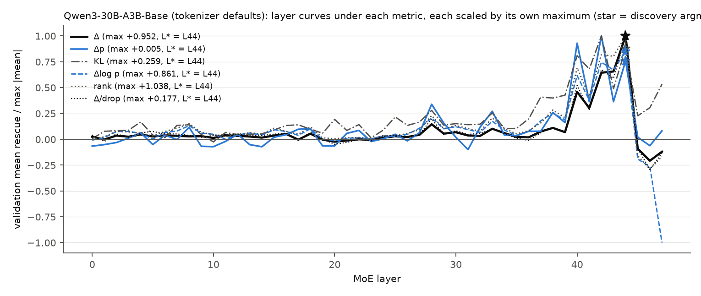
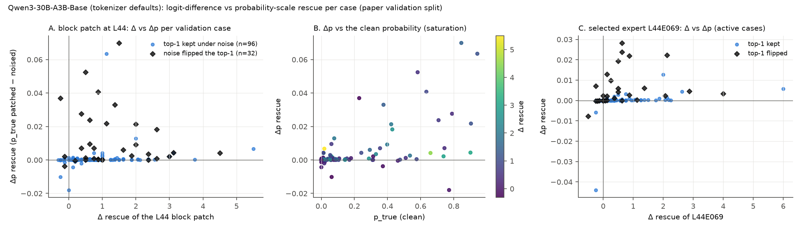
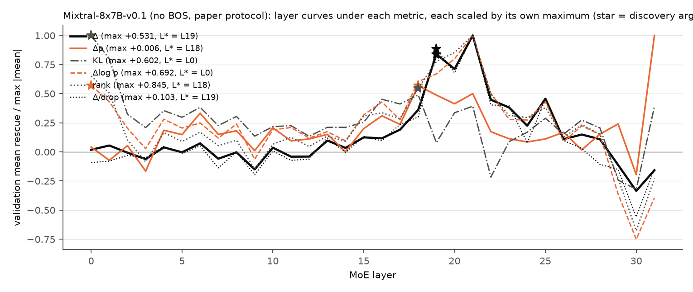
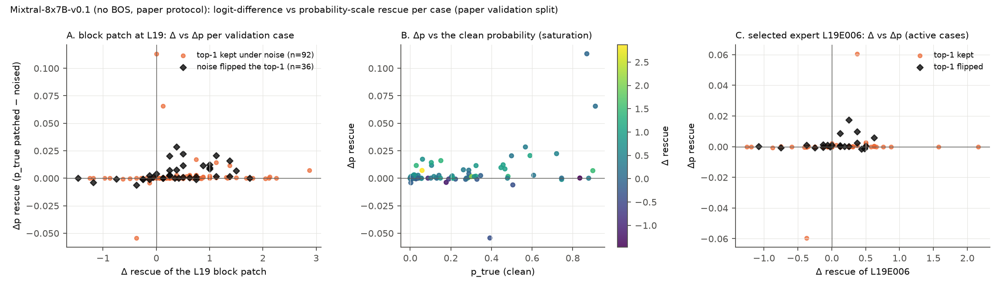
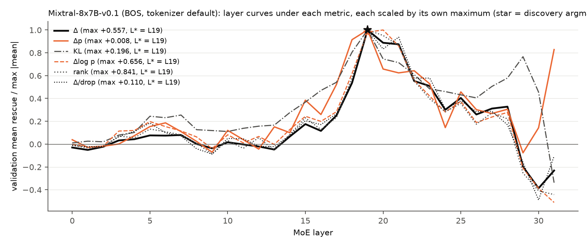
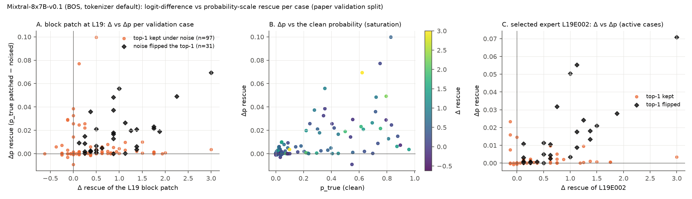

## Extension 5 / F5: probability-scale metrics alongside the logit difference

**Identity first.** The paper's effect measure is the logit difference Δ = logit(true) − logit(foil) at the final position. Because the softmax normaliser is common to both tokens, Δ = log p(true) − log p(foil) exactly: Δ *is* the log-odds of the two-way contrast, and 'rescue' = Δ_patched − Δ_noised is a change in log-odds. What Δ does not carry is the absolute probability of the true token, its rank in the full vocabulary, or how far the whole next-token distribution is from the clean one. The engine (ext5-engine, `--metrics`) now stores for every prefill and wavefront row the full-vocabulary log-sum-exp derived quantities `logp_true`, `logp_foil`, `p_true`, `p_foil`, `rank_true` and `kl_to_clean` = KL(row ‖ clean) so that every table can be re-derived. The identity is checked numerically on every row below: max |Δ − (log p_true − log p_foil)| = 0.125 in every run, which is one bf16 ulp of the stored Δ (the logits are bf16 numbers of magnitude 16-32 and the log-softmax is computed from them in fp32), i.e. the identity holds to rounding. Expert rows use the noised reference of their own pass (`expert_prefill_L*.parquet`): cross-pass bf16 noise moves Δ_noised by up to 1.4 logits in 79% of rows, so mixing passes would corrupt every per-case rescue.

**Metrics.** For a patched row (block, expert, coalition) relative to the case's noised run: Δ rescue (paper); Δp = p_true(patched) − p_true(noised); Δlog p = log p_true(patched) − log p_true(noised) (Δ without the foil); rank recovery = log2 rank(noised) − log2 rank(patched) (and the top-1 recovery indicator); KL reduction = KL(noised‖clean) − KL(patched‖clean). Normalised rescue is reported at the population level as mean rescue / mean drop with a paired bootstrap (a rescaling that cannot change any selection) and per case as rescue/drop on the cases with drop ≥ 1 (which re-weights cases and can). Each metric is substituted for the `rescue` column and the paper's procedure is re-run unchanged (`analysis.layer_analysis`, `select_expert`, `evaluate_expert`, `ext1_analysis.joint_search`): layer curve and discovery argmax on the paper set, recurrence-first expert at the Δ layer L* (and at the metric's own argmax when the expert pass covers it), validation rescue and Spec with 5,000-resample bootstrap CIs, and the joint search restricted to the layers of the metrics expert pass. The alternative funnel p_clean(true) ≥ 0.5 is compared with the paper's Δ funnel on the cases of the run. Code: `moetrace/ext5_metrics.py`, `scripts/ext5_metrics_analyze.py`.

### Qwen3-30B-A3B-Base (tokenizer defaults) (`results/qwen3_metrics`)

- Identity check: max |Δ − (log p_true − log p_foil)| = 1.25e-01 over 12800 sweep rows and 1.25e-01 over 6883 expert rows (max |Δ − (logit_true − logit_foil)| 0.00e+00); p_true ranges 2.17e-09–0.943, max p_true + p_foil 0.943, min KL 0.00e+00.
- Layer selection: Δ picks L44 (validation +0.952 [+0.790, +1.133]); the same layer under Δp, Δlog p, rank, KL, Δ/drop; no metric changes the layer.
- Expert selection at L44 (recurrence-first): Δ: E069 (rescue +0.506 [+0.363, +0.670], Spec +0.458 [+0.315, +0.623], positive); Δp: E069 (rescue +0.001 [+0.000, +0.002], Spec +0.001 [-0.000, +0.002], indeterminate); Δlog p: E069 (rescue +0.430 [+0.301, +0.570], Spec +0.393 [+0.264, +0.537], positive); rank: E069 (rescue +0.616 [+0.435, +0.821], Spec +0.559 [+0.375, +0.765], positive); KL: E069 (rescue +0.097 [+0.071, +0.125], Spec +0.079 [+0.053, +0.108], positive); Δ/drop: E069 (rescue +0.093 [+0.069, +0.120], Spec +0.086 [+0.060, +0.114], positive).
- Cases where noise flipped the clean top-1: 32/128 of the validation split; they carry 34% of the summed Δ rescue of the L44 block and 83% of the summed Δp rescue (mean Δ +1.295 vs +0.837; mean Δp +0.013 vs +0.001). Per-case correlation of the block's Δ rescue with Δp r = 0.11 (Spearman 0.46), Δlog p r = 0.79 (Spearman 0.76), rank r = 0.87 (Spearman 0.77), KL r = 0.45 (Spearman 0.47), Δ/drop r = 0.60 (Spearman 0.78).
- Normalised rescue at L44: mean Δ rescue / mean drop = 0.169 [0.145, 0.194]; per-case ratio on the 118 cases with drop ≥ 1: +0.177 [+0.148, +0.208]; on the probability scale mean Δp / mean p-drop = 0.026 [0.015, 0.038].
- Clean run: the true object is the top-1 token in 75/256 paper cases (median p_true 0.47 there, 0.013 otherwise, median rank 6); when it is not, the top-1 is a function word or whitespace in 163/181 cases (90%): ' the' x79, ' a' x20, ' ' x16, ' of' x15, ' which' x9, ' in' x4.
- Alternative funnel p_clean(true) ≥ 0.5 over the 256 cases of the run: 35 pass vs 235 for the strict Δ funnel; both 35, Δ only 200, p only 0 (Jaccard 0.15). Clean p_true: median 0.039, ≥ 0.9 in 1%, clean top-1 in 29%; noise flips the top-1 in 26%. Paper set: 35/256 pass p ≥ 0.5.

**Qwen3-30B-A3B-Base (tokenizer defaults): layer selection under each metric (paper set; 'ratio' uses only cases with drop >= 1)**

| Metric | n disc / val | L* (disc. argmax) | Disc. mean at L* | Val. at L* [95% CI] | Val. argmax | Val. max | Sharpness (top vs next, val) | Disc. top-5 | vs Δ |
|---|---|---|---|---|---|---|---|---|---|
| Δ | 128 / 128 | L44 | +0.978 | +0.952 [+0.790, +1.133] | L44 | +0.952 | L44 vs L43: +0.327 | L44 +0.978, L43 +0.618, L42 +0.591, L40 +0.477, L41 +0.277 | same |
| Δp | 128 / 128 | L44 | +0.006 | +0.004 [+0.002, +0.006] | L42 | +0.005 | L42 vs L40: +0.000 | L44 +0.006, L47 +0.005, L42 +0.004, L43 +0.003, L40 +0.002 | same |
| Δlog p | 128 / 128 | L44 | +0.883 | +0.733 [+0.567, +0.900] | L44 | +0.733 | L44 vs L42: +0.091 | L44 +0.883, L43 +0.593, L42 +0.535, L40 +0.531, L41 +0.336 | same |
| rank | 128 / 128 | L44 | +1.166 | +1.038 [+0.833, +1.260] | L44 | +1.038 | L44 vs L42: +0.186 | L44 +1.166, L43 +0.797, L42 +0.766, L40 +0.722, L41 +0.433 | same |
| KL | 128 / 128 | L44 | +0.269 | +0.228 [+0.176, +0.274] | L42 | +0.259 | L42 vs L44: +0.032 | L44 +0.269, L42 +0.215, L40 +0.196, L41 +0.142, L43 +0.123 | same |
| Δ/drop | 123 / 118 | L44 | +0.158 | +0.177 [+0.148, +0.208] | L44 | +0.177 | L44 vs L42: +0.058 | L44 +0.158, L42 +0.097, L43 +0.097, L40 +0.076, L41 +0.042 | same |

**Qwen3-30B-A3B-Base (tokenizer defaults): recurrence-first expert selection under each metric (threshold half the discovery split; all quantities in the metric's own units)**

| Metric | Layer | Selected expert | Disc. active | Disc. all-case | Val. active | Val. rescue [95% CI] | Spec [95% CI] | Spec sign | vs paper (Δ) |
|---|---|---|---|---|---|---|---|---|---|
| Δ | L44 (= Δ L*) | E069 | 114/128 | +0.483 | 116/128 | +0.506 [+0.363, +0.670] | +0.458 [+0.315, +0.623] | positive | same |
| Δp | L44 (= Δ L*) | E069 | 114/128 | +0.003 | 116/128 | +0.001 [+0.000, +0.002] | +0.001 [-0.000, +0.002] | indeterminate | same |
| Δlog p | L44 (= Δ L*) | E069 | 114/128 | +0.421 | 116/128 | +0.430 [+0.301, +0.570] | +0.393 [+0.264, +0.537] | positive | same |
| rank | L44 (= Δ L*) | E069 | 114/128 | +0.577 | 116/128 | +0.616 [+0.435, +0.821] | +0.559 [+0.375, +0.765] | positive | same |
| KL | L44 (= Δ L*) | E069 | 114/128 | +0.124 | 116/128 | +0.097 [+0.071, +0.125] | +0.079 [+0.053, +0.108] | positive | same |
| Δ/drop | L44 (= Δ L*) | E069 | 109/123 | +0.084 | 109/118 | +0.093 [+0.069, +0.120] | +0.086 [+0.060, +0.114] | positive | same |

**Qwen3-30B-A3B-Base (tokenizer defaults): the paper's expert and the second locus evaluated under each metric (validation split)**

| Metric | Pair | Val. active | Val. rescue [95% CI] | Spec [95% CI] | Spec sign |
|---|---|---|---|---|---|
| Δ | L44E069 | 116/128 | +0.506 [+0.363, +0.670] | +0.458 [+0.315, +0.623] | positive |
| Δ | L42E115 | 122/128 | +0.442 [+0.361, +0.529] | +0.425 [+0.341, +0.511] | positive |
| Δp | L44E069 | 116/128 | +0.001 [+0.000, +0.002] | +0.001 [-0.000, +0.002] | indeterminate |
| Δp | L42E115 | 122/128 | +0.005 [+0.002, +0.008] | +0.004 [+0.002, +0.008] | positive |
| Δlog p | L44E069 | 116/128 | +0.430 [+0.301, +0.570] | +0.393 [+0.264, +0.537] | positive |
| Δlog p | L42E115 | 122/128 | +0.409 [+0.331, +0.488] | +0.384 [+0.305, +0.465] | positive |
| rank | L44E069 | 116/128 | +0.616 [+0.435, +0.821] | +0.559 [+0.375, +0.765] | positive |
| rank | L42E115 | 122/128 | +0.580 [+0.469, +0.700] | +0.541 [+0.428, +0.660] | positive |
| KL | L44E069 | 116/128 | +0.097 [+0.071, +0.125] | +0.079 [+0.053, +0.108] | positive |
| KL | L42E115 | 122/128 | +0.108 [+0.082, +0.138] | +0.081 [+0.056, +0.112] | positive |
| Δ/drop | L44E069 | 109/118 | +0.093 [+0.069, +0.120] | +0.086 [+0.060, +0.114] | positive |
| Δ/drop | L42E115 | 114/118 | +0.088 [+0.071, +0.106] | +0.086 [+0.069, +0.104] | positive |

**Qwen3-30B-A3B-Base (tokenizer defaults): joint (layer, expert) search restricted to the layers of the metrics expert pass [42, 44], top-10 per metric**

| Metric | Rank | Pair | Disc. active | Disc. all-case | Val. active | Val. rescue [95% CI] | Spec [95% CI] | Two-stage |
|---|---|---|---|---|---|---|---|---|
| Δ | 1 | L44E069 | 114/128 | +0.483 | 116/128 | +0.506 [+0.363, +0.670] | +0.458 [+0.315, +0.623] | yes |
| Δ | 2 | L42E115 | 125/128 | +0.477 | 122/128 | +0.442 [+0.361, +0.529] | +0.425 [+0.341, +0.511] |  |
| Δ | 3 | L44E027 | 73/128 | +0.035 | 72/128 | +0.026 [+0.007, +0.047] | -0.106 [-0.164, -0.052] |  |
| Δ | 4 | L44E054 | 111/128 | +0.021 | 98/128 | +0.006 [-0.010, +0.022] | -0.127 [-0.181, -0.079] |  |
| Δ | 5 | L42E055 | 65/128 | +0.018 | 62/128 | +0.010 [-0.003, +0.025] | -0.056 [-0.087, -0.025] |  |
| Δ | 6 | L42E065 | 77/128 | +0.013 | 68/128 | +0.000 [-0.010, +0.011] | -0.063 [-0.095, -0.034] |  |
| Δ | 7 | L42E023 | 71/128 | +0.005 | 69/128 | -0.001 [-0.018, +0.017] | -0.064 [-0.095, -0.033] |  |
| Δ | 8 | L42E101 | 98/128 | +0.005 | 92/128 | -0.004 [-0.017, +0.010] | -0.074 [-0.104, -0.045] |  |
| Δ | 9 | L44E071 | 100/128 | -0.003 | 94/128 | +0.000 [-0.013, +0.013] | -0.102 [-0.142, -0.066] |  |
| Δ | 10 | L44E056 | 84/128 | -0.018 | 84/128 | +0.012 [-0.019, +0.055] | -0.118 [-0.184, -0.057] |  |
| Δp | 1 | L44E069 | 114/128 | +0.003 | 116/128 | +0.001 [+0.000, +0.002] | +0.001 [-0.000, +0.002] | yes |
| Δp | 2 | L42E115 | 125/128 | +0.003 | 122/128 | +0.005 [+0.002, +0.008] | +0.004 [+0.002, +0.008] |  |
| Δp | 3 | L44E054 | 111/128 | +0.000 | 98/128 | +0.000 [-0.000, +0.000] | -0.001 [-0.001, -0.000] |  |
| Δp | 4 | L44E056 | 84/128 | +0.000 | 84/128 | +0.000 [+0.000, +0.000] | -0.000 [-0.001, -0.000] |  |
| Δp | 5 | L44E071 | 100/128 | +0.000 | 94/128 | +0.000 [+0.000, +0.000] | -0.000 [-0.000, +0.000] |  |
| Δp | 6 | L44E027 | 73/128 | +0.000 | 72/128 | +0.000 [+0.000, +0.000] | -0.000 [-0.001, +0.000] |  |
| Δp | 7 | L42E023 | 71/128 | +0.000 | 69/128 | -0.000 [-0.000, +0.000] | -0.001 [-0.002, -0.000] |  |
| Δp | 8 | L42E055 | 65/128 | +0.000 | 62/128 | -0.000 [-0.000, +0.000] | -0.001 [-0.001, -0.000] |  |
| Δp | 9 | L42E065 | 77/128 | -0.000 | 68/128 | +0.000 [-0.000, +0.000] | -0.001 [-0.002, -0.000] |  |
| Δp | 10 | L42E101 | 98/128 | -0.000 | 92/128 | -0.000 [-0.000, +0.000] | -0.001 [-0.002, -0.000] |  |
| Δlog p | 1 | L42E115 | 125/128 | +0.430 | 122/128 | +0.409 [+0.331, +0.488] | +0.384 [+0.305, +0.465] |  |
| Δlog p | 2 | L44E069 | 114/128 | +0.421 | 116/128 | +0.430 [+0.301, +0.570] | +0.393 [+0.264, +0.537] | yes |
| Δlog p | 3 | L44E027 | 73/128 | +0.036 | 72/128 | +0.025 [+0.011, +0.041] | -0.079 [-0.125, -0.038] |  |
| Δlog p | 4 | L44E071 | 100/128 | +0.022 | 94/128 | +0.018 [+0.006, +0.029] | -0.055 [-0.091, -0.025] |  |
| Δlog p | 5 | L44E054 | 111/128 | +0.018 | 98/128 | +0.002 [-0.016, +0.019] | -0.105 [-0.150, -0.062] |  |
| Δlog p | 6 | L42E101 | 98/128 | +0.014 | 92/128 | -0.000 [-0.012, +0.012] | -0.082 [-0.113, -0.053] |  |
| Δlog p | 7 | L42E055 | 65/128 | +0.011 | 62/128 | +0.010 [-0.003, +0.025] | -0.067 [-0.095, -0.038] |  |
| Δlog p | 8 | L42E065 | 77/128 | +0.010 | 68/128 | +0.004 [-0.005, +0.014] | -0.077 [-0.105, -0.049] |  |
| Δlog p | 9 | L42E023 | 71/128 | +0.001 | 69/128 | +0.016 [-0.005, +0.043] | -0.059 [-0.093, -0.024] |  |
| Δlog p | 10 | L44E056 | 84/128 | -0.022 | 84/128 | -0.016 [-0.054, +0.023] | -0.125 [-0.178, -0.072] |  |
| rank | 1 | L42E115 | 125/128 | +0.622 | 122/128 | +0.580 [+0.469, +0.700] | +0.541 [+0.428, +0.660] |  |
| rank | 2 | L44E069 | 114/128 | +0.577 | 116/128 | +0.616 [+0.435, +0.821] | +0.559 [+0.375, +0.765] | yes |
| rank | 3 | L44E027 | 73/128 | +0.040 | 72/128 | +0.033 [+0.010, +0.058] | -0.113 [-0.174, -0.059] |  |
| rank | 4 | L42E055 | 65/128 | +0.029 | 62/128 | +0.019 [+0.001, +0.039] | -0.083 [-0.123, -0.044] |  |
| rank | 5 | L44E054 | 111/128 | +0.028 | 98/128 | +0.015 [-0.005, +0.037] | -0.142 [-0.208, -0.081] |  |
| rank | 6 | L44E071 | 100/128 | +0.024 | 94/128 | +0.026 [+0.008, +0.045] | -0.083 [-0.134, -0.038] |  |
| rank | 7 | L42E065 | 77/128 | +0.017 | 68/128 | +0.006 [-0.005, +0.019] | -0.105 [-0.146, -0.065] |  |
| rank | 8 | L42E101 | 98/128 | +0.013 | 92/128 | +0.002 [-0.017, +0.021] | -0.112 [-0.152, -0.071] |  |
| rank | 9 | L42E023 | 71/128 | +0.003 | 69/128 | +0.031 [+0.001, +0.071] | -0.072 [-0.119, -0.025] |  |
| rank | 10 | L44E056 | 84/128 | -0.036 | 84/128 | -0.001 [-0.038, +0.048] | -0.157 [-0.230, -0.087] |  |
| KL | 1 | L44E069 | 114/128 | +0.124 | 116/128 | +0.097 [+0.071, +0.125] | +0.079 [+0.053, +0.108] | yes |
| KL | 2 | L42E115 | 125/128 | +0.111 | 122/128 | +0.108 [+0.082, +0.138] | +0.081 [+0.056, +0.112] |  |
| KL | 3 | L42E101 | 98/128 | +0.023 | 92/128 | +0.030 [+0.022, +0.040] | -0.000 [-0.012, +0.011] |  |
| KL | 4 | L42E055 | 65/128 | +0.016 | 62/128 | +0.011 [+0.005, +0.019] | -0.022 [-0.033, -0.013] |  |
| KL | 5 | L42E023 | 71/128 | +0.010 | 69/128 | +0.008 [+0.004, +0.012] | -0.024 [-0.034, -0.016] |  |
| KL | 6 | L44E054 | 111/128 | +0.009 | 98/128 | +0.013 [+0.008, +0.018] | -0.023 [-0.034, -0.014] |  |
| KL | 7 | L42E065 | 77/128 | +0.009 | 68/128 | +0.006 [+0.002, +0.010] | -0.030 [-0.041, -0.020] |  |
| KL | 8 | L44E071 | 100/128 | +0.008 | 94/128 | +0.015 [+0.008, +0.022] | -0.010 [-0.017, -0.002] |  |
| KL | 9 | L44E027 | 73/128 | +0.008 | 72/128 | +0.005 [+0.000, +0.010] | -0.030 [-0.042, -0.019] |  |
| KL | 10 | L44E056 | 84/128 | +0.006 | 84/128 | +0.003 [-0.002, +0.009] | -0.032 [-0.042, -0.022] |  |
| Δ/drop | 1 | L44E069 | 109/123 | +0.084 | 109/118 | +0.093 [+0.069, +0.120] | +0.086 [+0.060, +0.114] | yes |
| Δ/drop | 2 | L42E115 | 120/123 | +0.075 | 114/118 | +0.088 [+0.071, +0.106] | +0.086 [+0.069, +0.104] |  |
| Δ/drop | 3 | L44E027 | 71/123 | +0.006 | 66/118 | +0.007 [+0.001, +0.016] | -0.011 [-0.021, +0.001] |  |
| Δ/drop | 4 | L42E065 | 74/123 | +0.003 | 63/118 | +0.001 [-0.001, +0.004] | -0.010 [-0.018, -0.003] |  |
| Δ/drop | 5 | L42E055 | 62/123 | +0.002 | 57/118 | +0.000 [-0.005, +0.006] | -0.012 [-0.021, -0.003] |  |
| Δ/drop | 6 | L44E054 | 106/123 | +0.002 | 91/118 | +0.001 [-0.003, +0.006] | -0.020 [-0.030, -0.010] |  |
| Δ/drop | 7 | L42E023 | 67/123 | +0.001 | 64/118 | -0.005 [-0.012, +0.001] | -0.016 [-0.026, -0.007] |  |
| Δ/drop | 8 | L44E056 | 81/123 | -0.001 | 79/118 | +0.000 [-0.005, +0.006] | -0.022 [-0.034, -0.010] |  |
| Δ/drop | 9 | L42E101 | 94/123 | -0.001 | 87/118 | -0.001 [-0.005, +0.003] | -0.014 [-0.022, -0.006] |  |
| Δ/drop | 10 | L44E071 | 97/123 | -0.002 | 89/118 | -0.001 [-0.005, +0.003] | -0.019 [-0.028, -0.010] |  |

**Qwen3-30B-A3B-Base (tokenizer defaults): normalised rescue of the block patch at the paper's layer (validation)**

| Layer | n | Mean Δ rescue | Mean Δ drop | Normalised rescue (mean/mean) [95% CI] | Cases with drop >= 1 | Per-case Δ rescue/drop (drop >= 1) [95% CI] | Mean Δp rescue | Mean p drop | Normalised Δp (mean/mean) [95% CI] |
|---|---|---|---|---|---|---|---|---|---|
| L44 | 128 | +0.952 | +5.640 | 0.169 [0.145, 0.194] | 118 | +0.177 [+0.148, +0.208] | +0.004 | +0.145 | 0.026 [0.015, 0.038] |

**Qwen3-30B-A3B-Base (tokenizer defaults): concentration of each metric's block rescue (at its own discovery argmax and at the Δ layer) in the 26 cases whose noised distribution is farthest from the clean one**

| Metric | Layer | Mean rescue (256 cases) | Mean, top-10% KL(noised‖clean) cases | Mean, other 90% | Share of summed rescue from the top-10% | r(rescue, KL noised) |
|---|---|---|---|---|---|---|
| Δ | L44 | +0.965 | +1.412 | +0.914 | 15% | 0.34 |
| Δp | L44 | +0.005 | +0.007 | +0.004 | 16% | 0.18 |
| Δlog p | L44 | +0.808 | +1.242 | +0.759 | 16% | 0.32 |
| rank | L44 | +1.102 | +1.866 | +1.016 | 17% | 0.34 |
| KL | L44 | +0.248 | +0.524 | +0.217 | 21% | 0.48 |
| Δ/drop | L44 | +0.167 | +0.153 | +0.169 | 10% | 0.02 |

**Qwen3-30B-A3B-Base (tokenizer defaults): overlap of the paper's Δ funnel with the alternative p_clean(true) >= 0.5 over the 256 cases of the run (the funnel scan itself was run on Δ; these are the cases that entered any case set)**

| Funnels (A vs B) | pass A | pass B | both | A only | B only | neither | Jaccard |
|---|---|---|---|---|---|---|---|
| strict Δ (>= 1.0, drop >= 0.5) vs p_clean >= 0.5 | 235 | 35 | 35 | 200 | 0 | 21 | 0.15 |
| relaxed Δ (>= 0.5, drop >= 0.25) vs p_clean >= 0.5 | 241 | 35 | 35 | 206 | 0 | 15 | 0.15 |
| strict Δ vs p_clean >= 0.5 & p drop >= 0.25 | 235 | 35 | 35 | 200 | 0 | 21 | 0.15 |

**Qwen3-30B-A3B-Base (tokenizer defaults): per case set**

| Set | n | pass strict Δ | pass p_clean >= 0.5 | clean top-1 | noise flips top-1 | median p_clean | p_clean >= 0.9 |
|---|---|---|---|---|---|---|---|
| paper | 256 | 235 | 35 | 75 | 67 | 0.039 | 3 |
| strict | 195 | 194 | 28 | 61 | 55 | 0.051 | 2 |
| relaxed | 240 | 235 | 35 | 73 | 65 | 0.046 | 3 |

Figure E5-F5-qwen3: top, validation layer curves under each metric scaled by their own maximum (star = discovery argmax); bottom, per-case Δ vs Δp rescue of the L44 block patch and of the selected expert, with cases whose clean top-1 was flipped by the noise marked, and Δp against the clean probability.

**Reading.** Nothing the paper selects changes: L44 is the discovery argmax under all six metrics and E069 the recurrence-first expert at L44 under all six, with a positive Spec under five of them. The second locus of ext1 is reinforced rather than weakened: under Δlog p and rank L42E115 is the joint top-1 on discovery (validation within E069's CI), under Δp its effect is five times E069's (+0.005 vs +0.001) and under KL the two tie (+0.108 vs +0.097). What changes is scale and weighting. The clean probability of the true object is small (median 0.039); it is the top-1 token in 75/256 paper cases, and otherwise the model's top-1 is ' the', ' a', ' of' or whitespace in 90% of cases: the Δ funnel selects prompts on which the model prefers the true object to the counterfactual, not prompts it completes correctly. On the probability scale the L44 block patch therefore restores 2.6% [1.5, 3.8] of the lost probability mass (mean Δp +0.004 against a mean p-drop of 0.145) while restoring 17% [15, 19] of the lost log-odds; the 32 validation cases whose top-1 the noise flipped carry 34% of the Δ rescue but 83% of the Δp rescue, and the per-case correlation between Δ and Δp is 0.11 (Spearman 0.46). Δp is a saturating, top-1-dominated metric that is underpowered for expert-level contrasts (E069's Spec CI includes zero only under Δp). The rank metric tracks Δ best per case (r 0.87), the one-sided Δlog p almost as well (0.79); KL agrees on the layer and the expert but weights a different tail (r 0.45 with Δ; 21% of its rescue from the 10% most disrupted cases, against 15% for Δ).

### Mixtral-8x7B-v0.1 (no BOS, paper protocol) (`results/mixtral_nobos_metrics`)

- Identity check: max |Δ − (log p_true − log p_foil)| = 1.25e-01 over 8704 sweep rows and 1.25e-01 over 2848 expert rows (max |Δ − (logit_true − logit_foil)| 0.00e+00); p_true ranges 4.13e-16–0.98, max p_true + p_foil 0.980, min KL 0.00e+00.
- Layer selection: Δ picks L19 (validation +0.446 [+0.318, +0.569]); the same layer under Δ/drop; different under Δp → L18, Δlog p → L0, rank → L18, KL → L0.
- Expert selection at L19 (recurrence-first): Δ: E006 (rescue +0.069 [-0.001, +0.139], Spec -0.168 [-0.260, -0.080], negative); Δp: E006 (rescue +0.000 [-0.001, +0.002], Spec -0.001 [-0.002, +0.000], indeterminate); Δlog p: E006 (rescue +0.051 [-0.058, +0.157], Spec -0.271 [-0.400, -0.150], negative); rank: E006 (rescue +0.033 [-0.111, +0.170], Spec -0.424 [-0.591, -0.270], negative); KL: E006 (rescue -0.065 [-0.213, +0.056], Spec -0.199 [-0.353, -0.081], negative); Δ/drop: E006 (rescue +0.015 [-0.003, +0.032], Spec -0.034 [-0.054, -0.014], negative).
- Cases where noise flipped the clean top-1: 36/128 of the validation split; they carry 24% of the summed Δ rescue of the L19 block and 48% of the summed Δp rescue (mean Δ +0.387 vs +0.469; mean Δp +0.005 vs +0.002). Per-case correlation of the block's Δ rescue with Δp r = 0.08 (Spearman 0.48), Δlog p r = 0.48 (Spearman 0.61), rank r = 0.42 (Spearman 0.60), KL r = -0.03 (Spearman 0.24), Δ/drop r = 0.80 (Spearman 0.90).
- Normalised rescue at L19: mean Δ rescue / mean drop = 0.091 [0.066, 0.114]; per-case ratio on the 123 cases with drop ≥ 1: +0.091 [+0.060, +0.123]; on the probability scale mean Δp / mean p-drop = 0.021 [0.007, 0.038].
- Clean run: the true object is the top-1 token in 74/256 paper cases (median p_true 0.40 there, 0.010 otherwise, median rank 9); when it is not, the top-1 is a function word or whitespace in 162/182 cases (89%): 'the' x78, '' x23, 'a' x22, 'of' x19, 'with' x4, 'to' x3.
- Alternative funnel p_clean(true) ≥ 0.5 over the 256 cases of the run: 26 pass vs 249 for the strict Δ funnel; both 26, Δ only 223, p only 0 (Jaccard 0.10). Clean p_true: median 0.024, ≥ 0.9 in 1%, clean top-1 in 29%; noise flips the top-1 in 27%. Paper set: 26/256 pass p ≥ 0.5.

**Mixtral-8x7B-v0.1 (no BOS, paper protocol): layer selection under each metric (paper set; 'ratio' uses only cases with drop >= 1)**

| Metric | n disc / val | L* (disc. argmax) | Disc. mean at L* | Val. at L* [95% CI] | Val. argmax | Val. max | Sharpness (top vs next, val) | Disc. top-5 | vs Δ |
|---|---|---|---|---|---|---|---|---|---|
| Δ | 128 / 128 | L19 | +0.436 | +0.446 [+0.318, +0.569] | L21 | +0.531 | L21 vs L19: +0.086 | L19 +0.436, L21 +0.398, L20 +0.301, L22 +0.280, L18 +0.274 | same |
| Δp | 128 / 128 | L18 | +0.003 | +0.004 [+0.001, +0.007] | L31 | +0.006 | L31 vs L18: +0.003 | L18 +0.003, L20 +0.003, L19 +0.003, L21 +0.002, L0 +0.002 | differs from Δ (L19) |
| Δlog p | 128 / 128 | L0 | +0.612 | +0.395 [+0.119, +0.743] | L21 | +0.692 | L21 vs L20: +0.139 | L0 +0.612, L19 +0.581, L18 +0.578, L21 +0.550, L20 +0.482 | differs from Δ (L19) |
| rank | 128 / 128 | L18 | +0.828 | +0.463 [+0.320, +0.613] | L21 | +0.845 | L21 vs L20: +0.124 | L18 +0.828, L0 +0.816, L21 +0.759, L19 +0.733, L20 +0.631 | differs from Δ (L19) |
| KL | 128 / 128 | L0 | +0.752 | +0.602 [+0.347, +0.911] | L0 | +0.602 | L0 vs L1: +0.121 | L0 +0.752, L1 +0.655, L31 +0.430, L18 +0.254, L16 +0.176 | differs from Δ (L19) |
| Δ/drop | 121 / 123 | L19 | +0.090 | +0.091 [+0.060, +0.123] | L21 | +0.103 | L21 vs L19: +0.012 | L19 +0.090, L21 +0.089, L22 +0.076, L20 +0.070, L18 +0.057 | same |

**Mixtral-8x7B-v0.1 (no BOS, paper protocol): recurrence-first expert selection under each metric (threshold half the discovery split; all quantities in the metric's own units)**

| Metric | Layer | Selected expert | Disc. active | Disc. all-case | Val. active | Val. rescue [95% CI] | Spec [95% CI] | Spec sign | vs paper (Δ) |
|---|---|---|---|---|---|---|---|---|---|
| Δ | L19 (= Δ L*) | E006 | 91/128 | +0.074 | 83/128 | +0.069 [-0.001, +0.139] | -0.168 [-0.260, -0.080] | negative | same |
| Δp | L18 (own L*) | E001 | 76/128 | +0.002 | 76/128 | +0.002 [+0.001, +0.004] | +0.001 [+0.000, +0.002] | positive | differs |
| Δp | L19 (= Δ L*) | E006 | 91/128 | +0.001 | 83/128 | +0.000 [-0.001, +0.002] | -0.001 [-0.002, +0.000] | indeterminate | same |
| Δlog p | L19 (= Δ L*) | E006 | 91/128 | +0.064 | 83/128 | +0.051 [-0.058, +0.157] | -0.271 [-0.400, -0.150] | negative | same |
| rank | L18 (own L*) | E001 | 76/128 | +0.433 | 76/128 | +0.319 [+0.214, +0.436] | +0.161 [+0.070, +0.263] | positive | differs |
| rank | L19 (= Δ L*) | E006 | 91/128 | -0.014 | 83/128 | +0.033 [-0.111, +0.170] | -0.424 [-0.591, -0.270] | negative | same |
| KL | L19 (= Δ L*) | E006 | 91/128 | -0.074 | 83/128 | -0.065 [-0.213, +0.056] | -0.199 [-0.353, -0.081] | negative | same |
| Δ/drop | L19 (= Δ L*) | E006 | 84/121 | +0.018 | 78/123 | +0.015 [-0.003, +0.032] | -0.034 [-0.054, -0.014] | negative | same |

**Mixtral-8x7B-v0.1 (no BOS, paper protocol): the paper's expert and the second locus evaluated under each metric (validation split)**

| Metric | Pair | Val. active | Val. rescue [95% CI] | Spec [95% CI] | Spec sign |
|---|---|---|---|---|---|
| Δ | L19E006 | 83/128 | +0.069 [-0.001, +0.139] | -0.168 [-0.260, -0.080] | negative |
| Δ | L18E001 | 76/128 | +0.136 [+0.078, +0.201] | +0.090 [+0.033, +0.155] | positive |
| Δp | L19E006 | 83/128 | +0.000 [-0.001, +0.002] | -0.001 [-0.002, +0.000] | indeterminate |
| Δp | L18E001 | 76/128 | +0.002 [+0.001, +0.004] | +0.001 [+0.000, +0.002] | positive |
| Δlog p | L19E006 | 83/128 | +0.051 [-0.058, +0.157] | -0.271 [-0.400, -0.150] | negative |
| Δlog p | L18E001 | 76/128 | +0.311 [+0.170, +0.517] | +0.227 [+0.059, +0.457] | positive |
| rank | L19E006 | 83/128 | +0.033 [-0.111, +0.170] | -0.424 [-0.591, -0.270] | negative |
| rank | L18E001 | 76/128 | +0.319 [+0.214, +0.436] | +0.161 [+0.070, +0.263] | positive |
| KL | L19E006 | 83/128 | -0.065 [-0.213, +0.056] | -0.199 [-0.353, -0.081] | negative |
| KL | L18E001 | 76/128 | +0.187 [+0.072, +0.387] | +0.165 [-0.040, +0.449] | indeterminate |
| Δ/drop | L19E006 | 78/123 | +0.015 [-0.003, +0.032] | -0.034 [-0.054, -0.014] | negative |
| Δ/drop | L18E001 | 74/123 | +0.022 [+0.012, +0.033] | +0.017 [+0.005, +0.031] | positive |

**Mixtral-8x7B-v0.1 (no BOS, paper protocol): joint (layer, expert) search restricted to the layers of the metrics expert pass [18, 19], top-10 per metric**

| Metric | Rank | Pair | Disc. active | Disc. all-case | Val. active | Val. rescue [95% CI] | Spec [95% CI] | Two-stage |
|---|---|---|---|---|---|---|---|---|
| Δ | 1 | L18E001 | 76/128 | +0.162 | 76/128 | +0.136 [+0.078, +0.201] | +0.090 [+0.033, +0.155] |  |
| Δ | 2 | L19E006 | 91/128 | +0.074 | 83/128 | +0.069 [-0.001, +0.139] | -0.168 [-0.260, -0.080] | yes |
| Δ | 3 | L18E006 | 80/128 | +0.026 | 78/128 | +0.044 [+0.022, +0.067] | -0.076 [-0.142, -0.012] |  |
| Δp | 1 | L18E001 | 76/128 | +0.002 | 76/128 | +0.002 [+0.001, +0.004] | +0.001 [+0.000, +0.002] |  |
| Δp | 2 | L19E006 | 91/128 | +0.001 | 83/128 | +0.000 [-0.001, +0.002] | -0.001 [-0.002, +0.000] | yes |
| Δp | 3 | L18E006 | 80/128 | +0.000 | 78/128 | +0.001 [-0.000, +0.003] | -0.001 [-0.001, +0.000] |  |
| Δlog p | 1 | L18E001 | 76/128 | +0.311 | 76/128 | +0.311 [+0.170, +0.517] | +0.227 [+0.059, +0.457] |  |
| Δlog p | 2 | L18E006 | 80/128 | +0.073 | 78/128 | +0.002 [-0.088, +0.057] | -0.336 [-0.571, -0.166] |  |
| Δlog p | 3 | L19E006 | 91/128 | +0.064 | 83/128 | +0.051 [-0.058, +0.157] | -0.271 [-0.400, -0.150] | yes |
| rank | 1 | L18E001 | 76/128 | +0.433 | 76/128 | +0.319 [+0.214, +0.436] | +0.161 [+0.070, +0.263] |  |
| rank | 2 | L18E006 | 80/128 | +0.105 | 78/128 | +0.049 [+0.014, +0.095] | -0.293 [-0.416, -0.186] |  |
| rank | 3 | L19E006 | 91/128 | -0.014 | 83/128 | +0.033 [-0.111, +0.170] | -0.424 [-0.591, -0.270] | yes |
| KL | 1 | L18E001 | 76/128 | +0.119 | 76/128 | +0.187 [+0.072, +0.387] | +0.165 [-0.040, +0.449] |  |
| KL | 2 | L18E006 | 80/128 | +0.049 | 78/128 | -0.045 [-0.209, +0.048] | -0.265 [-0.541, -0.065] |  |
| KL | 3 | L19E006 | 91/128 | -0.074 | 83/128 | -0.065 [-0.213, +0.056] | -0.199 [-0.353, -0.081] | yes |
| Δ/drop | 1 | L18E001 | 73/121 | +0.035 | 74/123 | +0.022 [+0.012, +0.033] | +0.017 [+0.005, +0.031] |  |
| Δ/drop | 2 | L19E006 | 84/121 | +0.018 | 78/123 | +0.015 [-0.003, +0.032] | -0.034 [-0.054, -0.014] | yes |
| Δ/drop | 3 | L18E006 | 74/121 | +0.005 | 75/123 | +0.008 [+0.003, +0.015] | -0.007 [-0.022, +0.010] |  |

**Mixtral-8x7B-v0.1 (no BOS, paper protocol): normalised rescue of the block patch at the paper's layer (validation)**

| Layer | n | Mean Δ rescue | Mean Δ drop | Normalised rescue (mean/mean) [95% CI] | Cases with drop >= 1 | Per-case Δ rescue/drop (drop >= 1) [95% CI] | Mean Δp rescue | Mean p drop | Normalised Δp (mean/mean) [95% CI] |
|---|---|---|---|---|---|---|---|---|---|
| L19 | 128 | +0.446 | +4.910 | 0.091 [0.066, 0.114] | 123 | +0.091 [+0.060, +0.123] | +0.003 | +0.144 | 0.021 [0.007, 0.038] |

**Mixtral-8x7B-v0.1 (no BOS, paper protocol): concentration of each metric's block rescue (at its own discovery argmax and at the Δ layer) in the 26 cases whose noised distribution is farthest from the clean one**

| Metric | Layer | Mean rescue (256 cases) | Mean, top-10% KL(noised‖clean) cases | Mean, other 90% | Share of summed rescue from the top-10% | r(rescue, KL noised) |
|---|---|---|---|---|---|---|
| Δ | L19 | +0.441 | +0.513 | +0.433 | 12% | 0.11 |
| Δp | L18 | +0.003 | +0.001 | +0.003 | 5% | 0.01 |
| Δp | L19 | +0.003 | +0.000 | +0.003 | 1% | 0.02 |
| Δlog p | L0 | +0.503 | +2.818 | +0.242 | 57% | 0.69 |
| Δlog p | L19 | +0.522 | +0.656 | +0.507 | 13% | 0.13 |
| rank | L18 | +0.645 | +1.571 | +0.541 | 25% | 0.43 |
| rank | L19 | +0.694 | +0.625 | +0.702 | 9% | 0.15 |
| KL | L0 | +0.677 | +4.383 | +0.258 | 66% | 0.87 |
| KL | L19 | +0.098 | +0.484 | +0.055 | 50% | 0.12 |
| Δ/drop | L19 | +0.091 | +0.080 | +0.092 | 9% | -0.00 |

**Mixtral-8x7B-v0.1 (no BOS, paper protocol): overlap of the paper's Δ funnel with the alternative p_clean(true) >= 0.5 over the 256 cases of the run (the funnel scan itself was run on Δ; these are the cases that entered any case set)**

| Funnels (A vs B) | pass A | pass B | both | A only | B only | neither | Jaccard |
|---|---|---|---|---|---|---|---|
| strict Δ (>= 1.0, drop >= 0.5) vs p_clean >= 0.5 | 249 | 26 | 26 | 223 | 0 | 7 | 0.10 |
| relaxed Δ (>= 0.5, drop >= 0.25) vs p_clean >= 0.5 | 252 | 26 | 26 | 226 | 0 | 4 | 0.10 |
| strict Δ vs p_clean >= 0.5 & p drop >= 0.25 | 249 | 26 | 26 | 223 | 0 | 7 | 0.10 |

**Mixtral-8x7B-v0.1 (no BOS, paper protocol): per case set**

| Set | n | pass strict Δ | pass p_clean >= 0.5 | clean top-1 | noise flips top-1 | median p_clean | p_clean >= 0.9 |
|---|---|---|---|---|---|---|---|
| paper | 256 | 249 | 26 | 74 | 70 | 0.024 | 2 |
| strict | 230 | 227 | 24 | 69 | 65 | 0.028 | 2 |
| relaxed | 241 | 238 | 26 | 74 | 70 | 0.028 | 2 |

Figure E5-F5-mixtral_nobos: top, validation layer curves under each metric scaled by their own maximum (star = discovery argmax); bottom, per-case Δ vs Δp rescue of the L19 block patch and of the selected expert, with cases whose clean top-1 was flipped by the noise marked, and Δp against the clean probability.

**Reading.** Under the paper's protocol the metric matters. Δ and Δ/drop select L19 and then E006 (Spec negative, as in the paper); Δp and rank select L18 and then E001 (Spec positive), the pair ext1's joint search found; Δlog p and KL select L0. The L0 argmax is a heavy-tail artefact: 66% of the summed KL rescue at L0 (57% of the Δlog p rescue) comes from the 26 cases whose noised distribution is farthest from the clean one (KL(noised‖clean) ≥ 4.2, true-token rank in the noised run in the hundreds to 16,000s; r(rescue, KL noised) = 0.87), where restoring the L0 or L1 MoE output of the final token alone brings the whole distribution back (mean KL rescue +4.4 on those cases, +0.26 on the other 90%). With BOS the L0 KL rescue is +0.001. These are the prompts in which, without a BOS sink, the noised final token itself collapses into a sink-like state (ext3: 24% of no-BOS prompts); Δ is blind to them because the true and the foil logit fall together (L0 Δ rescue +0.05; the per-case sink flags of ext3 live in its raw diagnostics and were not joined here). For the selection question the reading is: every metric that is not dominated by this tail (Δp, rank) or by the foil (Δ) prefers L18E001 to L19E006, and at L19 E006 is negatively specific under all six metrics (Spec −0.001 to −0.42), so the paper's negative-Spec finding is metric-independent while its layer choice is not.

### Mixtral-8x7B-v0.1 (BOS, tokenizer default) (`results/mixtral_bos_metrics`)

- Identity check: max |Δ − (log p_true − log p_foil)| = 1.25e-01 over 8704 sweep rows and 1.25e-01 over 2732 expert rows (max |Δ − (logit_true − logit_foil)| 0.00e+00); p_true ranges 1.11e-07–0.959, max p_true + p_foil 0.959, min KL 0.00e+00.
- Layer selection: Δ picks L19 (validation +0.557 [+0.447, +0.676]); the same layer under Δp, Δlog p, rank, KL, Δ/drop; no metric changes the layer.
- Expert selection at L19 (recurrence-first): Δ: E002 (rescue +0.358 [+0.263, +0.465], Spec +0.178 [+0.079, +0.285], positive); Δp: E002 (rescue +0.004 [+0.002, +0.006], Spec +0.001 [-0.002, +0.003], indeterminate); Δlog p: E002 (rescue +0.410 [+0.312, +0.518], Spec +0.194 [+0.096, +0.296], positive); rank: E002 (rescue +0.600 [+0.434, +0.783], Spec +0.345 [+0.191, +0.516], positive); KL: E002 (rescue +0.100 [+0.071, +0.134], Spec +0.049 [+0.015, +0.086], positive); Δ/drop: E002 (rescue +0.064 [+0.046, +0.083], Spec +0.025 [+0.004, +0.047], positive).
- Cases where noise flipped the clean top-1: 31/128 of the validation split; they carry 41% of the summed Δ rescue of the L19 block and 52% of the summed Δp rescue (mean Δ +0.948 vs +0.432; mean Δp +0.018 vs +0.005). Per-case correlation of the block's Δ rescue with Δp r = 0.21 (Spearman 0.36), Δlog p r = 0.84 (Spearman 0.74), rank r = 0.80 (Spearman 0.69), KL r = 0.25 (Spearman 0.27), Δ/drop r = 0.67 (Spearman 0.87).
- Normalised rescue at L19: mean Δ rescue / mean drop = 0.112 [0.094, 0.131]; per-case ratio on the 114 cases with drop ≥ 1: +0.110 [+0.084, +0.135]; on the probability scale mean Δp / mean p-drop = 0.047 [0.035, 0.062].
- Clean run: the true object is the top-1 token in 83/256 paper cases (median p_true 0.54 there, 0.015 otherwise, median rank 7); when it is not, the top-1 is a function word or whitespace in 146/173 cases (84%): 'the' x62, '' x24, 'a' x19, 'of' x18, 'to' x6, 'for' x5.
- Alternative funnel p_clean(true) ≥ 0.5 over the 256 cases of the run: 45 pass vs 234 for the strict Δ funnel; both 44, Δ only 190, p only 1 (Jaccard 0.19). Clean p_true: median 0.044, ≥ 0.9 in 1%, clean top-1 in 32%; noise flips the top-1 in 24%. Paper set: 45/256 pass p ≥ 0.5.

**Mixtral-8x7B-v0.1 (BOS, tokenizer default): layer selection under each metric (paper set; 'ratio' uses only cases with drop >= 1)**

| Metric | n disc / val | L* (disc. argmax) | Disc. mean at L* | Val. at L* [95% CI] | Val. argmax | Val. max | Sharpness (top vs next, val) | Disc. top-5 | vs Δ |
|---|---|---|---|---|---|---|---|---|---|
| Δ | 128 / 128 | L19 | +0.623 | +0.557 [+0.447, +0.676] | L19 | +0.557 | L19 vs L20: +0.062 | L19 +0.623, L21 +0.479, L20 +0.456, L22 +0.298, L18 +0.278 | same |
| Δp | 128 / 128 | L19 | +0.010 | +0.008 [+0.006, +0.011] | L19 | +0.008 | L19 vs L18: +0.001 | L19 +0.010, L20 +0.009, L18 +0.008, L21 +0.007, L22 +0.006 | same |
| Δlog p | 128 / 128 | L19 | +0.724 | +0.643 [+0.529, +0.765] | L20 | +0.656 | L20 vs L19: +0.013 | L19 +0.724, L20 +0.598, L21 +0.556, L18 +0.417, L22 +0.364 | same |
| rank | 128 / 128 | L19 | +0.934 | +0.841 [+0.655, +1.044] | L19 | +0.841 | L19 vs L20: +0.041 | L19 +0.934, L20 +0.783, L21 +0.718, L18 +0.499, L22 +0.443 | same |
| KL | 128 / 128 | L19 | +0.210 | +0.196 [+0.160, +0.234] | L19 | +0.196 | L19 vs L18: +0.038 | L19 +0.210, L20 +0.163, L21 +0.157, L29 +0.155, L18 +0.141 | same |
| Δ/drop | 116 / 114 | L19 | +0.104 | +0.110 [+0.084, +0.135] | L19 | +0.110 | L19 vs L21: +0.007 | L19 +0.104, L21 +0.094, L20 +0.082, L22 +0.066, L18 +0.058 | same |

**Mixtral-8x7B-v0.1 (BOS, tokenizer default): recurrence-first expert selection under each metric (threshold half the discovery split; all quantities in the metric's own units)**

| Metric | Layer | Selected expert | Disc. active | Disc. all-case | Val. active | Val. rescue [95% CI] | Spec [95% CI] | Spec sign | vs paper (Δ) |
|---|---|---|---|---|---|---|---|---|---|
| Δ | L19 (= Δ L*) | E002 | 76/128 | +0.378 | 84/128 | +0.358 [+0.263, +0.465] | +0.178 [+0.079, +0.285] | positive | same |
| Δp | L19 (= Δ L*) | E002 | 76/128 | +0.004 | 84/128 | +0.004 [+0.002, +0.006] | +0.001 [-0.002, +0.003] | indeterminate | same |
| Δlog p | L19 (= Δ L*) | E002 | 76/128 | +0.398 | 84/128 | +0.410 [+0.312, +0.518] | +0.194 [+0.096, +0.296] | positive | same |
| rank | L19 (= Δ L*) | E002 | 76/128 | +0.560 | 84/128 | +0.600 [+0.434, +0.783] | +0.345 [+0.191, +0.516] | positive | same |
| KL | L19 (= Δ L*) | E002 | 76/128 | +0.103 | 84/128 | +0.100 [+0.071, +0.134] | +0.049 [+0.015, +0.086] | positive | same |
| Δ/drop | L19 (= Δ L*) | E002 | 74/116 | +0.059 | 78/114 | +0.064 [+0.046, +0.083] | +0.025 [+0.004, +0.047] | positive | same |

**Mixtral-8x7B-v0.1 (BOS, tokenizer default): the paper's expert and the second locus evaluated under each metric (validation split)**

| Metric | Pair | Val. active | Val. rescue [95% CI] | Spec [95% CI] | Spec sign |
|---|---|---|---|---|---|
| Δ | L19E002 | 84/128 | +0.358 [+0.263, +0.465] | +0.178 [+0.079, +0.285] | positive |
| Δ | L18E001 | 103/128 | +0.243 [+0.177, +0.317] | +0.176 [+0.107, +0.255] | positive |
| Δp | L19E002 | 84/128 | +0.004 [+0.002, +0.006] | +0.001 [-0.002, +0.003] | indeterminate |
| Δp | L18E001 | 103/128 | +0.006 [+0.003, +0.008] | +0.003 [+0.002, +0.005] | positive |
| Δlog p | L19E002 | 84/128 | +0.410 [+0.312, +0.518] | +0.194 [+0.096, +0.296] | positive |
| Δlog p | L18E001 | 103/128 | +0.297 [+0.230, +0.368] | +0.203 [+0.129, +0.280] | positive |
| rank | L19E002 | 84/128 | +0.600 [+0.434, +0.783] | +0.345 [+0.191, +0.516] | positive |
| rank | L18E001 | 103/128 | +0.350 [+0.249, +0.460] | +0.251 [+0.143, +0.367] | positive |
| KL | L19E002 | 84/128 | +0.100 [+0.071, +0.134] | +0.049 [+0.015, +0.086] | positive |
| KL | L18E001 | 103/128 | +0.098 [+0.073, +0.129] | +0.052 [+0.024, +0.085] | positive |
| Δ/drop | L19E002 | 78/114 | +0.064 [+0.046, +0.083] | +0.025 [+0.004, +0.047] | positive |
| Δ/drop | L18E001 | 93/114 | +0.045 [+0.031, +0.060] | +0.033 [+0.018, +0.049] | positive |

**Mixtral-8x7B-v0.1 (BOS, tokenizer default): joint (layer, expert) search restricted to the layers of the metrics expert pass [18, 19], top-10 per metric**

| Metric | Rank | Pair | Disc. active | Disc. all-case | Val. active | Val. rescue [95% CI] | Spec [95% CI] | Two-stage |
|---|---|---|---|---|---|---|---|---|
| Δ | 1 | L19E002 | 76/128 | +0.378 | 84/128 | +0.358 [+0.263, +0.465] | +0.178 [+0.079, +0.285] | yes |
| Δ | 2 | L18E001 | 98/128 | +0.188 | 103/128 | +0.243 [+0.177, +0.317] | +0.176 [+0.107, +0.255] |  |
| Δ | 3 | L19E006 | 71/128 | +0.108 | 68/128 | +0.075 [+0.046, +0.107] | -0.264 [-0.358, -0.182] |  |
| Δ | 4 | L18E006 | 70/128 | +0.043 | 65/128 | +0.037 [+0.019, +0.055] | -0.204 [-0.274, -0.141] |  |
| Δp | 1 | L18E001 | 98/128 | +0.005 | 103/128 | +0.006 [+0.003, +0.008] | +0.003 [+0.002, +0.005] |  |
| Δp | 2 | L19E002 | 76/128 | +0.004 | 84/128 | +0.004 [+0.002, +0.006] | +0.001 [-0.002, +0.003] | yes |
| Δp | 3 | L19E006 | 71/128 | +0.002 | 68/128 | +0.002 [+0.001, +0.003] | -0.004 [-0.006, -0.003] |  |
| Δp | 4 | L18E006 | 70/128 | +0.001 | 65/128 | +0.001 [+0.000, +0.001] | -0.004 [-0.006, -0.002] |  |
| Δlog p | 1 | L19E002 | 76/128 | +0.398 | 84/128 | +0.410 [+0.312, +0.518] | +0.194 [+0.096, +0.296] | yes |
| Δlog p | 2 | L18E001 | 98/128 | +0.248 | 103/128 | +0.297 [+0.230, +0.368] | +0.203 [+0.129, +0.280] |  |
| Δlog p | 3 | L19E006 | 71/128 | +0.162 | 68/128 | +0.083 [+0.050, +0.118] | -0.317 [-0.409, -0.235] |  |
| Δlog p | 4 | L18E006 | 70/128 | +0.054 | 65/128 | +0.047 [+0.024, +0.072] | -0.254 [-0.322, -0.192] |  |
| rank | 1 | L19E002 | 76/128 | +0.560 | 84/128 | +0.600 [+0.434, +0.783] | +0.345 [+0.191, +0.516] | yes |
| rank | 2 | L18E001 | 98/128 | +0.294 | 103/128 | +0.350 [+0.249, +0.460] | +0.251 [+0.143, +0.367] |  |
| rank | 3 | L19E006 | 71/128 | +0.197 | 68/128 | +0.096 [+0.051, +0.145] | -0.457 [-0.620, -0.316] |  |
| rank | 4 | L18E006 | 70/128 | +0.064 | 65/128 | +0.038 [+0.012, +0.071] | -0.311 [-0.411, -0.222] |  |
| KL | 1 | L19E002 | 76/128 | +0.103 | 84/128 | +0.100 [+0.071, +0.134] | +0.049 [+0.015, +0.086] | yes |
| KL | 2 | L18E001 | 98/128 | +0.092 | 103/128 | +0.098 [+0.073, +0.129] | +0.052 [+0.024, +0.085] |  |
| KL | 3 | L19E006 | 71/128 | +0.042 | 68/128 | +0.037 [+0.025, +0.048] | -0.069 [-0.101, -0.042] |  |
| KL | 4 | L18E006 | 70/128 | +0.024 | 65/128 | +0.017 [+0.010, +0.025] | -0.085 [-0.114, -0.061] |  |
| Δ/drop | 1 | L19E002 | 74/116 | +0.059 | 78/114 | +0.064 [+0.046, +0.083] | +0.025 [+0.004, +0.047] | yes |
| Δ/drop | 2 | L18E001 | 89/116 | +0.036 | 93/114 | +0.045 [+0.031, +0.060] | +0.033 [+0.018, +0.049] |  |
| Δ/drop | 3 | L19E006 | 61/116 | +0.023 | 56/114 | +0.015 [+0.003, +0.026] | -0.054 [-0.073, -0.036] |  |
| Δ/drop | 4 | L18E006 | 64/116 | +0.009 | 61/114 | +0.008 [+0.004, +0.012] | -0.035 [-0.049, -0.020] |  |

**Mixtral-8x7B-v0.1 (BOS, tokenizer default): normalised rescue of the block patch at the paper's layer (validation)**

| Layer | n | Mean Δ rescue | Mean Δ drop | Normalised rescue (mean/mean) [95% CI] | Cases with drop >= 1 | Per-case Δ rescue/drop (drop >= 1) [95% CI] | Mean Δp rescue | Mean p drop | Normalised Δp (mean/mean) [95% CI] |
|---|---|---|---|---|---|---|---|---|---|
| L19 | 128 | +0.557 | +4.961 | 0.112 [0.094, 0.131] | 114 | +0.110 [+0.084, +0.135] | +0.008 | +0.177 | 0.047 [0.035, 0.062] |

**Mixtral-8x7B-v0.1 (BOS, tokenizer default): concentration of each metric's block rescue (at its own discovery argmax and at the Δ layer) in the 26 cases whose noised distribution is farthest from the clean one**

| Metric | Layer | Mean rescue (256 cases) | Mean, top-10% KL(noised‖clean) cases | Mean, other 90% | Share of summed rescue from the top-10% | r(rescue, KL noised) |
|---|---|---|---|---|---|---|
| Δ | L19 | +0.590 | +0.815 | +0.564 | 14% | 0.24 |
| Δp | L19 | +0.009 | +0.017 | +0.008 | 19% | 0.27 |
| Δlog p | L19 | +0.684 | +1.002 | +0.648 | 15% | 0.34 |
| rank | L19 | +0.888 | +1.416 | +0.828 | 16% | 0.32 |
| KL | L19 | +0.203 | +0.437 | +0.177 | 22% | 0.54 |
| Δ/drop | L19 | +0.107 | +0.104 | +0.108 | 10% | 0.05 |

**Mixtral-8x7B-v0.1 (BOS, tokenizer default): overlap of the paper's Δ funnel with the alternative p_clean(true) >= 0.5 over the 256 cases of the run (the funnel scan itself was run on Δ; these are the cases that entered any case set)**

| Funnels (A vs B) | pass A | pass B | both | A only | B only | neither | Jaccard |
|---|---|---|---|---|---|---|---|
| strict Δ (>= 1.0, drop >= 0.5) vs p_clean >= 0.5 | 234 | 45 | 44 | 190 | 1 | 21 | 0.19 |
| relaxed Δ (>= 0.5, drop >= 0.25) vs p_clean >= 0.5 | 240 | 45 | 45 | 195 | 0 | 16 | 0.19 |
| strict Δ vs p_clean >= 0.5 & p drop >= 0.25 | 234 | 41 | 41 | 193 | 0 | 22 | 0.18 |

**Mixtral-8x7B-v0.1 (BOS, tokenizer default): per case set**

| Set | n | pass strict Δ | pass p_clean >= 0.5 | clean top-1 | noise flips top-1 | median p_clean | p_clean >= 0.9 |
|---|---|---|---|---|---|---|---|
| paper | 256 | 234 | 45 | 83 | 62 | 0.044 | 2 |
| strict | 230 | 230 | 42 | 78 | 60 | 0.058 | 2 |
| relaxed | 241 | 234 | 45 | 83 | 62 | 0.059 | 2 |

Figure E5-F5-mixtral_bos: top, validation layer curves under each metric scaled by their own maximum (star = discovery argmax); bottom, per-case Δ vs Δp rescue of the L19 block patch and of the selected expert, with cases whose clean top-1 was flipped by the noise marked, and Δp against the clean probability.

**Reading.** As in Qwen3, nothing selected changes: L19 under all six metrics, E002 at L19 under all six, Spec positive under five (indeterminate under Δp). L18E001 is the joint top-1 under Δp (+0.006 vs +0.004) and ties E002 under KL (+0.098 vs +0.100), so the two-locus reading (L19E002 / L18E001) holds on the probability scale too. There is no early-layer tail (L0 KL rescue +0.001) and the noised distributions are far less degenerate than without BOS (90th percentile of KL(noised‖clean) 2.9 vs 4.2). Normalised rescue at L19: 11% [9, 13] of the lost log-odds vs 4.7% [3.5, 6.2] of the lost probability mass; the 31 top-1-flipped validation cases carry 41% of the Δ rescue and 52% of the Δp rescue.

### Recommendation

The user's decision was to report probability-scale metrics *alongside* Δ. Which ones: (1) the **normalised rescue** mean rescue / mean drop with its paired bootstrap CI (Qwen3 L44 17% [15, 19]; Mixtral L19 11% [9, 13] with BOS, 9% [7, 11] without) — scale-free, cannot change any selection, and makes runs with different drops comparable; (2) the **rank recovery** log2 rank(noised) − log2 rank(patched) with the top-1 recovery count — the metric closest to Δ per case (r 0.80-0.87 under the clean protocols) that also answers whether the patch brings the answer back to the top (L44E069 +0.62 log2 units, L19E002 +0.60); (3) the **clean top-1 rate and median p_clean of the case set** as dataset descriptors (29-32% and 0.02-0.04 here), because they say what 'factual recall' means for these cloze prompts. Use **Δp only descriptively** (the normalised Δp: 2.6-4.7% of the lost probability mass), never for selection or Spec: it saturates, is dominated by the top-1-flip cases (52-83% of its mass from 24-25% of cases) and is underpowered (every Spec CI includes zero under Δp). Use **KL and Δlog p as protocol diagnostics**: where they disagree with Δ they flag degenerate noised runs (the no-BOS Mixtral sink states) that Δ cannot see. Do **not** adopt p_clean ≥ 0.5 as the funnel: it keeps 26-45 of the 256 paper cases (Jaccard 0.10-0.19 with the Δ funnel, and every case it keeps already passes Δ) and would turn the study into one about the minority of prompts the base model completes correctly; report the overlap instead. Bottom line: the paper's Qwen3 result (L44E069, Spec > 0) and the BOS Mixtral result (L19E002, Spec > 0) are metric-independent; the paper's no-BOS Mixtral result is the one where a probability- or rank-based selection replaces L19E006 (Spec < 0 under every metric) with L18E001 (Spec > 0), in agreement with ext1's joint search.

_Generated 2026-09-21T02:34:23Z by scripts/ext5_metrics_analyze.py._
