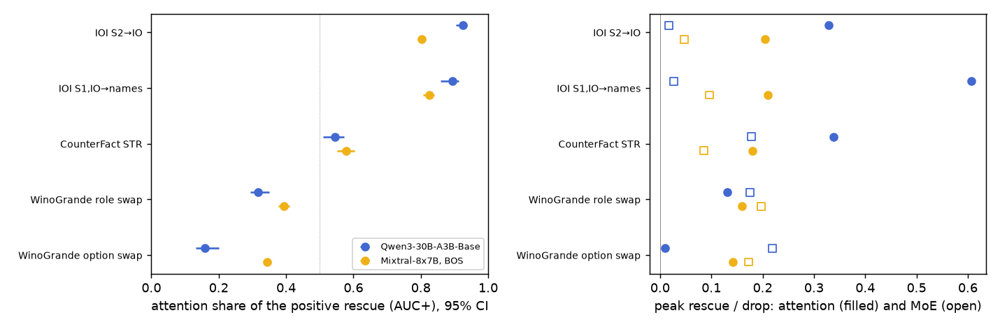
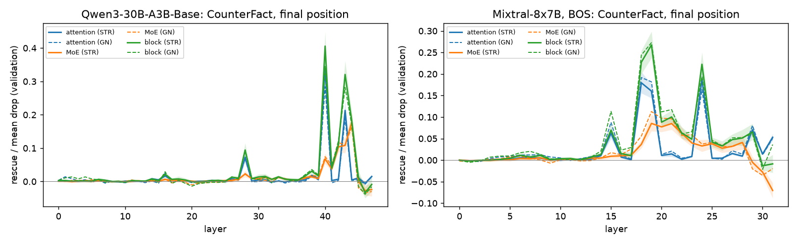
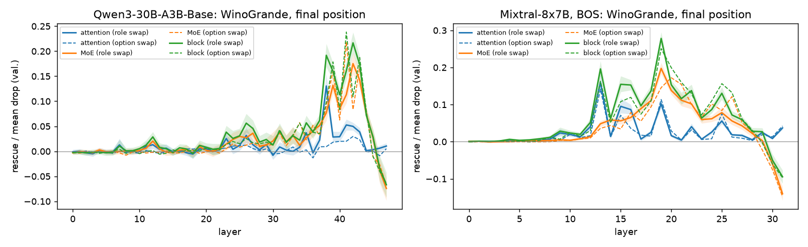
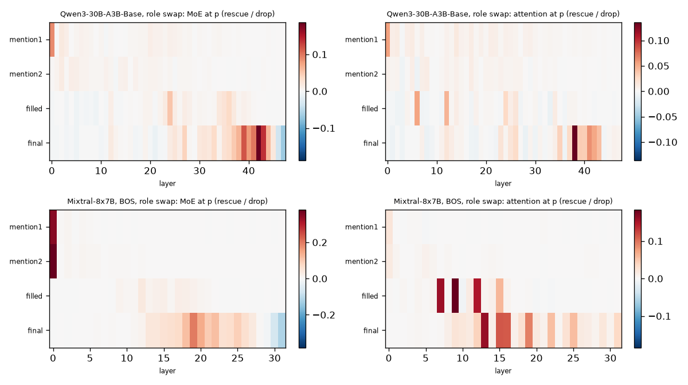
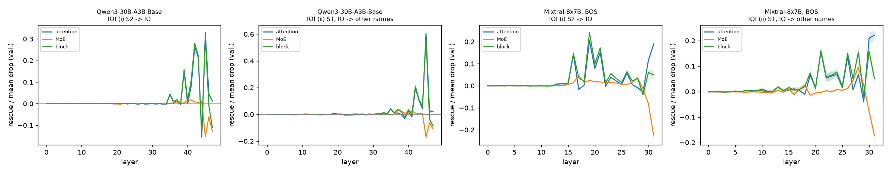
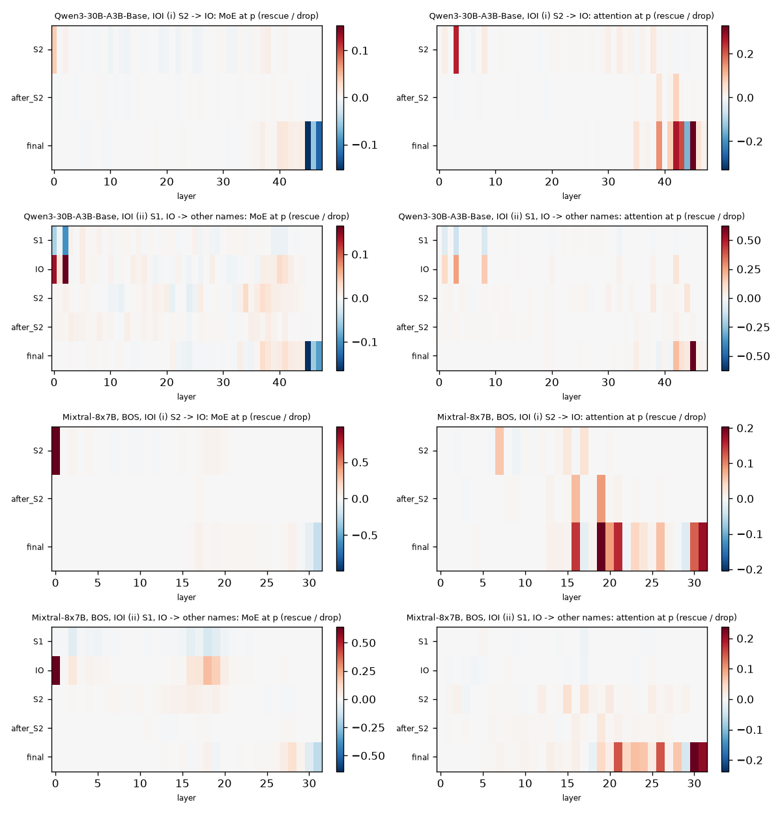

**Summary.** Calibration tasks for the WinoGrande STR study (agent ext7-controls): the same final-position patches, with symmetric token replacement only (no Gaussian noise) and Δ = LD(r, r′), on CounterFact (subject swap), WinoGrande (option swap and role swap) and IOI (S2 → IO and S1, IO → other names), in Qwen3-30B-A3B-Base and Mixtral-8x7B with BOS. The question is whether WinoGrande's repair runs through attention, as in IOI, or through the MoE sublayers, as the paper reads factual recall. **WinoGrande is not IOI-like at the final position; it is the most MoE-heavy of the three tasks, and the two WinoGrande corruption sites agree.** Four views of the final-position repair put the tasks in the same order IOI < CounterFact < WinoGrande on the MoE side in both models (Qwen3 / Mixtral; within WinoGrande three of the four make the option swap the more MoE-heavy site): the attention share of the positive single-layer rescue (Direction-2b AUC+) is IOI S2 → IO 0.92 / 0.80 > CounterFact 0.54 / 0.58 > WinoGrande role swap 0.32 / 0.39 > option swap 0.16 / 0.34; the summed single-layer MoE patches are -0.25 / -0.07 of the drop in IOI (net negative, from the last two or three layers), +0.61 / +0.51 in CounterFact and +1.15 / +1.14 (role) and +1.05 / +1.14 (option) in WinoGrande; patching every MoE output at the final position at once (W4) restores -0.27 / -0.02, +0.53 / +0.41, +0.77 / +0.70 and +0.84 / +0.79 of the drop; and the summed attention writes carry a direct-path share of 1.40 / 1.17, 0.50 / 0.63, 0.19 / 0.38 and 0.05 / 0.29. IOI, measured with the same patches, is attention-driven (its single-layer attention patches add up to the whole drop), so the method does see an attention task as one; its heads behave as in GPT-2 small: with S2 → IO the largest Qwen3 head reads S2 (L42H11, 0.75 of its attention on S2), with S1, IO → other names the name movers dominate (L42H10, 0.87 on IO, whose attention moves to S1 when S2 becomes IO; four L45 heads), the corruption-site dependence of Zhang & Nanda's App. F. The attention side of WinoGrande differs by model: small in Qwen3 (Σ attention +0.16 option, +0.56 role vs CounterFact +0.79), as large as in CounterFact in Mixtral (+0.73 / +0.87 vs +0.84) but outweighed by the MoE. The role swap (exchange the candidates' first mentions, keep the filled option) shifts weight toward attention relative to the option swap (Qwen3: an attention peak at L38 that the option swap lacks; Mixtral: same attention L13 and MoE L19–L20 peaks, slightly larger attention). CounterFact under STR keeps Direction 2b's split (attention ≈ MoE; attention peaks L40 / L18 before the MoE peaks L44 / L21) with no GN inflation of the attention effect.

### What was run

- **CounterFact STR attention sweep (task 1).** The Direction-6 STR cases and donors (`results/qwen3_str`, `results/mixtral_bos_str`: paper discovery/validation IDs with ≥ 1 known same-relation donor, up to five donors per case, 852 / 858 donor rows) re-run with the kinds `attn_layer` (attention-sublayer output at the final position := clean; the MoE of that layer recomputes), `layer` (MoE output, repeated in the same pass) and `block` (both) at every layer, parent = donor row (`scripts/ext7_cf_attnsweep.py`; runs `results/{qwen3,mixtral_bos}_str_attnsweep`, donor-level rows). Per-case values are donor means (primary) or the first donor (sensitivity); the GN comparison uses the Direction-2b sweeps `results/{qwen3,mixtral_bos}_bos_attnsweep` restricted to the same cases and split. Statistics are those of `moetrace/ext2_attn.py` (peaks, AUC+ attention share, additivity), applied through an adapter (`ext7_controls.StrAttnRun`).
- **W7 WinoGrande role swap.** From each model's WinoGrande margin pool (`results/wino_<proto>/scan_pairs.parquet`, margin both ways, both options capitalised names) the twins whose two names are each mentioned exactly once before the blank and not after it; the role-swapped prompt exchanges those two first mentions and keeps the filled option ("Dennis helped Adam … since Dennis was the" → " trainer"; "Adam helped Dennis … since Dennis was the" → " student"). Two STR pairs per twin, (A, swap(A)) with r = trig_a and (B, swap(B)) with r = trig_b, kept when token-symmetric (same length, the two mention spans at the same positions, identical tokens elsewhere, the same single-token trigger ids after both prompts). Qwen3: 535 name twins → 632 role pairs (213 twins fail symmetry: a sentence-initial name tokenises differently from a mid-sentence one in Qwen3's BPE) → 558 pass the margin both ways (Δ ≥ 1 on the clean prompt, ≤ −1 on the swapped one; 306 twins); Mixtral BOS: 150 → 294 → 270 (146 twins). Case sets (`data/wino_role/case_sets_<proto>.json`, contract format): random.Random(0) shuffle over twins (both role pairs of a twin stay in one split) → 128/128 discovery/validation pairs in both models (Mixtral just reaches 256), replication 128/128 for Qwen3 only. The option swap of the same model (agent ext7-wino, `results/wino_<proto>_str`, its shared 776-pair set) provides the fixed hypotheses (its discovery peak layers).
- **W8 IOI.** The 15 BABA templates of Wang et al. (2023) and their ABBA versions, names, places and objects copied from Easy-Transformer `easy_transformer/ioi_dataset.py` (fetched 2026-10-04), restricted to words that are one leading-space token under both tokenizers (65 of 99 names, 8 places, 6 of 8 objects: " necklace" and " snack" split); 1,600 items (seed 0; `data/ioi/`). Two STR corruptions as in Zhang & Nanda: (i) S2 → IO ("… Mary gave a drink to" → " John"; the corrupted prompt is an IOI sentence whose answer is S; both directions, primary) and (ii) S1 and IO → two other random names, S2 kept (Appendix F; the corrupted prompt has no answer among IO and S, so only d = 0, and its Δ is the residual preference for IO over S, mean −1.6 to −1.7). Competence: {idata.get('pool_s2io_both_models', '?')} of 1,600 items pass (i)'s margin both ways in both models; one seed-0 split of these items (128/128 + replication 128/128) serves both corruptions and both models.
- **Runs.** W2 final-position sweeps (`layer`, `attn_layer`, `block` at every layer) with agent ext7-wino's generic STR-pair runner (`scripts/ext7_wino_sweep.py`), W5 per-head patches on IOI (`scripts/ext7_wino_heads.py`, top-4 discovery attention layers + one null layer), W3 position × layer grids (window 1, kinds `layer` and `attn_layer`, first 64 validation pairs) at named positions only (`scripts/ext7_{role,ioi}_grid.py`: the grid executor of `scripts/ext7_wino_grid.py` restricted to the two exchanged mentions, the filled option and the final position, or to S1, IO, S2, the tokens after S2 and the final position), W4 joint decomposition (`scripts/ext7_wino_joint.py`, ext8 `multi` steps) and its direct-path complement (`python -m moetrace.ext7_controls direct`, prefill only). Final-position attention of every head on IO / S1 / S2 for the IOI items: `scripts/ext7_ioi_attn.py`.
- **Verification.** `results/verify_ext7_controls_cf_olmoe.json`: on OLMoE, 12 CounterFact STR (case, donor) pairs × 16 layers against transformers hooks (self_attn / MoE outputs replaced at the final position on the donor run): rescue r 0.996 / 0.998 / 0.993 (attn_layer / block / layer), max |ΔΔ| 0.47 / 0.34 / 0.38, identity (clean parent) ≤ 0.25; the GN calibration of Direction 2b had r 0.990 / 0.994 / 0.983. The pair runner, the grid executor and the W4 multi steps were verified by agents ext7-wino (`results/verify_ext7_wino_olmoe.json`) and ext8-addback (`results/verify_ext8_engine_olmoe.json`); the restricted grids use the same executor with a different unit list; the direct-path split was smoke-tested on OLMoE WinoGrande pairs (fp32 Δ vs engine Δ within 0.06).
- **GPU.** ≈ 83 min in 8 job groups (cf 9, direct 9, ioi 8, role 3, w2 15, w3 21, w4 9, w5 9 min), shared with two other agents through `scripts/gpu_queue.sh`.

### Three tasks on one attention–MoE axis

**Final-position sublayer attribution per task (validation; rescue / drop = mean rescue over mean drop; W4 = all layers at once)**

| Model | Task (STR site) | Val. set | Mean drop | MoE peak: L, rescue/drop | Attention peak: L, rescue/drop | Block peak: L, rescue/drop | Attention share of the positive rescue (AUC+) | Σ_l attention / Σ_l MoE (signed, / drop) | W4 all-attention A / all-MoE M (denoise) | W4 φ_attn = ½[A + 1 − M] | W4 M (noising) | Direct path: A_dir / M_dir |
|---|---|---|---|---|---|---|---|---|---|---|---|---|
| Qwen3-30B-A3B-Base | CounterFact STR (subject swap, ext6 donors) | 108 cases | +11.67 | L44: 0.178 | L40: 0.339 | L40: 0.406 | 0.54 [0.51, 0.57] | +0.79 / +0.61 | 1.00 [1.00, 1.00] / 0.53 [0.49, 0.57] | 0.73 [0.71, 0.76] | 0.52 [0.49, 0.56] | 0.50 [0.46, 0.54] / 0.51 [0.47, 0.55] |
| Qwen3-30B-A3B-Base | WinoGrande option swap (ext7-wino) | 128 pairs | +8.14 | L41: 0.218 | L38: 0.009 | L41: 0.238 | 0.16 [0.13, 0.20] | +0.16 / +1.05 | 0.99 [0.98, 1.00] / 0.84 [0.83, 0.86] | 0.57 [0.56, 0.58] | 0.84 [0.83, 0.86] | 0.05 [0.02, 0.08] / 0.95 [0.92, 0.98] |
| Qwen3-30B-A3B-Base | WinoGrande role swap (W7) | 128 pairs | +6.94 | L42: 0.175 | L38: 0.131 | L42: 0.217 | 0.32 [0.29, 0.35] | +0.56 / +1.15 | 1.00 [0.99, 1.01] / 0.77 [0.75, 0.80] | 0.61 [0.60, 0.63] | 0.78 [0.75, 0.80] | 0.19 [0.16, 0.22] / 0.81 [0.78, 0.84] |
| Qwen3-30B-A3B-Base | IOI (i) S2 -> IO | 128 pairs | +12.65 | L41: 0.017 | L45: 0.329 | L45: 0.307 | 0.92 [0.90, 0.94] | +1.00 / -0.25 | 1.00 [1.00, 1.00] / -0.27 [-0.29, -0.25] | 1.14 [1.12, 1.15] | -0.27 [-0.29, -0.24] | 1.40 [1.38, 1.43] / -0.40 [-0.43, -0.38] |
| Qwen3-30B-A3B-Base | IOI (ii) S1, IO -> other names | 128 pairs (d = 0 only) | +7.87 | L41: 0.026 | L45: 0.606 | L45: 0.576 | 0.89 [0.86, 0.91] | +1.04 / -0.27 | 1.00 [1.00, 1.01] / -0.24 [-0.27, -0.20] | 1.12 [1.10, 1.14] | -0.06 [-0.09, -0.03] | 1.37 [1.33, 1.40] / -0.35 [-0.39, -0.32] |
| Mixtral-8x7B, BOS | CounterFact STR (subject swap, ext6 donors) | 106 cases | +12.97 | L21: 0.085 | L18: 0.180 | L19: 0.267 | 0.58 [0.55, 0.60] | +0.84 / +0.51 | 1.00 [1.00, 1.00] / 0.41 [0.37, 0.45] | 0.80 [0.77, 0.82] | 0.42 [0.39, 0.46] | 0.63 [0.60, 0.66] / 0.36 [0.32, 0.39] |
| Mixtral-8x7B, BOS | WinoGrande option swap (ext7-wino) | 128 pairs | +7.69 | L20: 0.172 | L13: 0.141 | L19: 0.251 | 0.34 [0.33, 0.36] | +0.73 / +1.14 | 1.00 [1.00, 1.00] / 0.79 [0.76, 0.81] | 0.61 [0.60, 0.62] | 0.79 [0.76, 0.81] | 0.29 [0.27, 0.31] / 0.71 [0.69, 0.73] |
| Mixtral-8x7B, BOS | WinoGrande role swap (W7) | 128 pairs | +6.70 | L19: 0.197 | L13: 0.160 | L19: 0.278 | 0.39 [0.38, 0.41] | +0.87 / +1.14 | 1.00 [1.00, 1.00] / 0.70 [0.66, 0.73] | 0.65 [0.64, 0.67] | 0.70 [0.66, 0.73] | 0.38 [0.35, 0.41] / 0.62 [0.59, 0.65] |
| Mixtral-8x7B, BOS | IOI (i) S2 -> IO | 128 pairs | +11.28 | L17: 0.047 | L19: 0.204 | L19: 0.241 | 0.80 [0.79, 0.81] | +0.98 / -0.07 | 1.00 [1.00, 1.00] / -0.02 [-0.05, -0.00] | 1.01 [1.00, 1.02] | -0.03 [-0.05, -0.00] | 1.17 [1.14, 1.19] / -0.17 [-0.19, -0.14] |
| Mixtral-8x7B, BOS | IOI (ii) S1, IO -> other names | 128 pairs (d = 0 only) | +7.27 | L28: 0.096 | L30: 0.210 | L30: 0.158 | 0.82 [0.81, 0.84] | +1.08 / -0.07 | 1.00 [1.00, 1.00] / -0.14 [-0.17, -0.11] | 1.07 [1.05, 1.09] | 0.00 [-0.03, 0.03] | 1.09 [1.07, 1.12] / -0.11 [-0.13, -0.08] |

Columns: MoE / attention / block peak = discovery argmax layer (CounterFact: paper discovery split, donor mean) and its validation rescue over the mean validation drop. Attention share = AUC+(attention) / (AUC+(attention) + AUC+(MoE)) of the validation mean curves (Direction 2b). W4 = all layers at once at the final position (`multi` rows; validation directed cases; denoise = clean values into the corrupted run, noise = corrupted values into the clean run). **The W4 two-player split is degenerate at the final position:** the final token is the same in both prompts and the MoE is a per-token function, so patching every attention output at the final position reproduces the source run's final residual exactly (A = 1 up to bf16, both directions; also noted by agent ext8-addback in the engine docstring). Hence φ_attn = ½[A + 1 − M] = 1 − M/2 and redundancy = M; the informative number is M, the fraction of the drop that the MoE writes at the final position restore when the attention writes stay corrupted (M < 0: the clean MoE writes push further toward the corrupted answer). The direct-path split is the non-degenerate complement: A_dir (M_dir) = change of Δ when only the summed attention (MoE) writes of all layers at the final position are swapped into the corrupted final residual, exact final RMSNorm, fp32, over the drop (prefill only; A_dir + M_dir ≈ 1 up to the norm's non-linearity). CounterFact W4 and direct-path numbers are agent ext8-addback's (`results/ext8_addback_summary.json`, validation cases); the WinoGrande option-swap W4 and direct-path numbers come from agent ext7-wino's run `results/wino_<proto>_str` (`joint_rows.parquet`, `direct_split.parquet`, computed with the same code), summarised here on its validation pairs.

### CounterFact under STR: attention and MoE at the final position

**Peaks of the validation rescue curves (L* on discovery; / drop = rescue over the mean validation drop)**

| Model | Corruption | Component | L* (disc.) | Val. rescue at L* [95% CI] | / drop | Val. argmax | AUC+ (val.) | AUC+ / drop | Mean val. drop |
|---|---|---|---|---|---|---|---|---|---|
| Qwen3-30B-A3B-Base | STR (donor mean) | attention | L40 | +3.955 [+3.526, +4.406] | 0.339 | L40 | 9.30 [8.39, 10.36] | 0.797 | +11.67 |
| Qwen3-30B-A3B-Base | STR (donor mean) | MoE | L44 | +2.077 [+1.775, +2.406] | 0.178 | L44 | 7.79 [6.96, 8.99] | 0.667 | +11.67 |
| Qwen3-30B-A3B-Base | STR (donor mean) | block | L40 | +4.735 [+4.252, +5.241] | 0.406 | L40 | 16.49 [14.97, 18.27] | 1.413 | +11.67 |
| Qwen3-30B-A3B-Base | STR (first donor) | attention | L40 | +3.877 [+3.409, +4.372] | 0.335 | L40 | 9.31 [8.24, 10.57] | 0.805 | +11.57 |
| Qwen3-30B-A3B-Base | STR (first donor) | MoE | L44 | +2.061 [+1.750, +2.394] | 0.178 | L44 | 8.17 [7.11, 9.71] | 0.706 | +11.57 |
| Qwen3-30B-A3B-Base | STR (first donor) | block | L40 | +4.663 [+4.133, +5.225] | 0.403 | L40 | 16.70 [14.89, 18.83] | 1.444 | +11.57 |
| Qwen3-30B-A3B-Base | GN (same cases) | attention | L40 | +1.556 [+1.354, +1.764] | 0.284 | L40 | 3.79 [3.30, 4.48] | 0.693 | +5.48 |
| Qwen3-30B-A3B-Base | GN (same cases) | MoE | L44 | +0.895 [+0.719, +1.084] | 0.163 | L44 | 3.73 [3.11, 4.68] | 0.681 | +5.48 |
| Qwen3-30B-A3B-Base | GN (same cases) | block | L40 | +1.889 [+1.663, +2.130] | 0.345 | L40 | 7.22 [6.30, 8.36] | 1.317 | +5.48 |
| Mixtral-8x7B, BOS | STR (donor mean) | attention | L18 | +2.329 [+2.016, +2.658] | 0.180 | L24 | 10.93 [10.05, 11.87] | 0.842 | +12.97 |
| Mixtral-8x7B, BOS | STR (donor mean) | MoE | L21 | +1.100 [+0.918, +1.286] | 0.085 | L19 | 7.99 [6.94, 9.18] | 0.616 | +12.97 |
| Mixtral-8x7B, BOS | STR (donor mean) | block | L19 | +3.468 [+3.076, +3.869] | 0.267 | L19 | 18.33 [16.59, 20.23] | 1.413 | +12.97 |
| Mixtral-8x7B, BOS | STR (first donor) | attention | L18 | +2.337 [+1.993, +2.703] | 0.180 | L24 | 10.78 [9.82, 11.87] | 0.832 | +12.96 |
| Mixtral-8x7B, BOS | STR (first donor) | MoE | L21 | +1.101 [+0.925, +1.279] | 0.085 | L21 | 7.58 [6.43, 8.94] | 0.585 | +12.96 |
| Mixtral-8x7B, BOS | STR (first donor) | block | L19 | +3.392 [+2.985, +3.802] | 0.262 | L19 | 17.85 [16.00, 19.77] | 1.378 | +12.96 |
| Mixtral-8x7B, BOS | GN (same cases) | attention | L18 | +0.953 [+0.779, +1.131] | 0.192 | L18 | 4.79 [4.03, 5.57] | 0.963 | +4.97 |
| Mixtral-8x7B, BOS | GN (same cases) | MoE | L19 | +0.561 [+0.430, +0.696] | 0.113 | L19 | 3.72 [3.05, 4.52] | 0.749 | +4.97 |
| Mixtral-8x7B, BOS | GN (same cases) | block | L19 | +1.356 [+1.140, +1.571] | 0.273 | L19 | 8.08 [6.85, 9.33] | 1.624 | +4.97 |

**Attention share of the positive rescue (AUC+) and at the peak layers (ratio of validation means, paired bootstrap)**

| Model | Corruption | Attention share of the positive rescue (AUC+) [95% CI] | AUC+ attention / MoE | Share at MoE peak | Share at attention peak | Share at paper layer |
|---|---|---|---|---|---|---|
| Qwen3-30B-A3B-Base | STR (donor mean) | 0.544 [0.511, 0.572] | 9.30 / 7.79 | L44: +0.025 [+0.015, +0.035] | L40: +0.833 [+0.799, +0.864] | L44: +0.025 |
| Qwen3-30B-A3B-Base | STR (first donor) | 0.533 [0.499, 0.561] | 9.31 / 8.17 | L44: +0.016 [+0.002, +0.030] | L40: +0.843 [+0.807, +0.874] | L44: +0.016 |
| Qwen3-30B-A3B-Base | GN (same cases) | 0.504 [0.464, 0.543] | 3.79 / 3.73 | L44: +0.018 [-0.018, +0.054] | L40: +0.792 [+0.749, +0.835] | L44: +0.018 |
| Mixtral-8x7B, BOS | STR (donor mean) | 0.578 [0.552, 0.604] | 10.93 / 7.99 | L21: +0.144 [+0.084, +0.205] | L18: +0.831 [+0.794, +0.867] | L19: +0.653 |
| Mixtral-8x7B, BOS | STR (first donor) | 0.587 [0.557, 0.617] | 10.78 / 7.58 | L21: +0.122 [+0.051, +0.193] | L18: +0.826 [+0.782, +0.871] | L19: +0.667 |
| Mixtral-8x7B, BOS | GN (same cases) | 0.563 [0.527, 0.594] | 4.79 / 3.72 | L19: +0.617 [+0.574, +0.665] | L18: +0.775 [+0.719, +0.831] | L19: +0.617 |

**Additivity at the peak layers: block vs attention + MoE (validation)**

| Model | Corruption | Layer | Attention | MoE | Sum | Block | Gap block − sum [95% CI] | Per-case r | Block > sum |
|---|---|---|---|---|---|---|---|---|---|
| Qwen3-30B-A3B-Base | STR (donor mean) | L40 | +3.955 | +0.791 | +4.746 | +4.735 | -0.011 [-0.098, +0.076] | 0.99 | 47% |
| Qwen3-30B-A3B-Base | STR (donor mean) | L44 | +0.053 | +2.077 | +2.130 | +2.119 | -0.012 [-0.032, +0.006] | 1.00 | 40% |
| Qwen3-30B-A3B-Base | STR (first donor) | L40 | +3.877 | +0.723 | +4.600 | +4.663 | +0.064 [-0.055, +0.185] | 0.97 | 44% |
| Qwen3-30B-A3B-Base | STR (first donor) | L44 | +0.034 | +2.061 | +2.095 | +2.083 | -0.012 [-0.038, +0.015] | 1.00 | 28% |
| Qwen3-30B-A3B-Base | GN (same cases) | L40 | +1.556 | +0.407 | +1.963 | +1.889 | -0.074 [-0.122, -0.027] | 0.98 | 32% |
| Qwen3-30B-A3B-Base | GN (same cases) | L44 | +0.016 | +0.895 | +0.911 | +0.928 | +0.017 [-0.010, +0.043] | 0.99 | 42% |
| Mixtral-8x7B, BOS | STR (donor mean) | L18 | +2.329 | +0.474 | +2.803 | +2.948 | +0.145 [+0.040, +0.251] | 0.96 | 58% |
| Mixtral-8x7B, BOS | STR (donor mean) | L19 | +2.078 | +1.105 | +3.183 | +3.468 | +0.285 [+0.109, +0.462] | 0.90 | 59% |
| Mixtral-8x7B, BOS | STR (donor mean) | L21 | +0.184 | +1.100 | +1.285 | +1.300 | +0.015 [-0.008, +0.038] | 0.99 | 51% |
| Mixtral-8x7B, BOS | STR (first donor) | L18 | +2.337 | +0.492 | +2.828 | +2.989 | +0.161 [+0.024, +0.297] | 0.94 | 54% |
| Mixtral-8x7B, BOS | STR (first donor) | L19 | +2.044 | +1.019 | +3.064 | +3.392 | +0.328 [+0.130, +0.528] | 0.88 | 50% |
| Mixtral-8x7B, BOS | STR (first donor) | L21 | +0.153 | +1.101 | +1.255 | +1.276 | +0.021 [-0.021, +0.065] | 0.98 | 43% |
| Mixtral-8x7B, BOS | GN (same cases) | L18 | +0.953 | +0.277 | +1.231 | +1.212 | -0.018 [-0.068, +0.035] | 0.97 | 27% |
| Mixtral-8x7B, BOS | GN (same cases) | L19 | +0.903 | +0.561 | +1.464 | +1.356 | -0.108 [-0.176, -0.042] | 0.97 | 30% |

- Qwen3: attention L40 +3.95 (0.339 of the drop; GN on the same cases L40 0.284), MoE L44 +2.08 (0.178; GN L44 0.163), block L40 (0.406); attention share 0.54 [0.51, 0.57] (GN 0.50); STR–GN curve r 1.00 / 0.99 / 0.99 (attention / MoE / block); the same-pass MoE rows reproduce the Direction-6 sweep at per-row r 0.97 (mean |diff| 0.11, max 2.4: bf16 batch-composition noise).
- Mixtral BOS: attention L18 +2.33 (0.180 of the drop; GN on the same cases L18 0.192), MoE L21 +1.10 (0.085; GN L19 0.113), block L19 (0.267); attention share 0.58 [0.55, 0.60] (GN 0.56); STR–GN curve r 0.99 / 0.94 / 0.98 (attention / MoE / block); the same-pass MoE rows reproduce the Direction-6 sweep at per-row r 0.98 (mean |diff| 0.09, max 2.5: bf16 batch-composition noise).
- Under STR the Direction-2b picture holds: attention and MoE carry comparable parts of the positive rescue, attention peaking a few layers before the MoE (Qwen3 L40 vs L44; Mixtral L18 vs L19–L21), and the block equals attention + MoE to within bf16 noise except at Mixtral's shared L18/L19 peak, which is mildly super-additive under STR (sub-additive under GN). Normalised by the drop, STR does not shrink the attention effect (Qwen3 0.34 vs GN 0.28; Mixtral 0.18 vs 0.19), whereas Mixtral's MoE peak is 25 % lower under STR (0.085 vs 0.113), the same direction as Direction 6. Mixtral's attention curve has three near-equal discrete peaks, L18 / L19 / L24 at 0.180 / 0.160 / 0.188 of the drop (GN 0.192 / 0.182 / 0.164; plus L15 0.06), so its validation argmax (L24) and discovery argmax (L18) differ by a tie, as Direction 2b's mover heads at L18 and L24 suggested.

### WinoGrande role swap (W7)

**Final-position peaks, role swap vs option swap (validation pairs; pair bootstrap)**

| Model | Corruption | Component | L* (selected on) | Val. rescue at L* [95% CI] | / drop | Val. argmax | AUC+ | Mean drop (Δ clean / Δ corrupt) | Pairs disc/val | Attention share (AUC+) |
|---|---|---|---|---|---|---|---|---|---|---|
| Qwen3-30B-A3B-Base | role swap | MoE | L42 (disc.) | +1.216 [+1.058, +1.374] | 0.175 [0.154, 0.196] | L42 | 8.88 | +6.94 (+3.50 / -3.44) | 128/128 | 0.317 [0.294, 0.350] |
| Qwen3-30B-A3B-Base | role swap | attention | L38 (disc.) | +0.906 [+0.734, +1.094] | 0.131 [0.107, 0.155] | L38 | 4.12 | +6.94 (+3.50 / -3.44) | 128/128 | 0.317 [0.294, 0.350] |
| Qwen3-30B-A3B-Base | role swap | block | L42 (disc.) | +1.504 [+1.332, +1.677] | 0.217 [0.195, 0.238] | L42 | 12.14 | +6.94 (+3.50 / -3.44) | 128/128 | 0.317 [0.294, 0.350] |
| Qwen3-30B-A3B-Base | role swap (replication) | MoE | L42 (disc.) | +1.203 [+1.055, +1.353] | 0.157 [0.138, 0.176] | L42 | 9.60 | +7.68 (+3.86 / -3.82) | 128/128 | 0.304 [0.278, 0.337] |
| Qwen3-30B-A3B-Base | role swap (replication) | attention | L38 (disc.) | +0.890 [+0.670, +1.151] | 0.116 [0.088, 0.147] | L38 | 4.20 | +7.68 (+3.86 / -3.82) | 128/128 | 0.304 [0.278, 0.337] |
| Qwen3-30B-A3B-Base | role swap (replication) | block | L42 (disc.) | +1.468 [+1.308, +1.628] | 0.191 [0.170, 0.212] | L42 | 12.98 | +7.68 (+3.86 / -3.82) | 128/128 | 0.304 [0.278, 0.337] |
| Qwen3-30B-A3B-Base | option swap (ext7-wino run) | MoE | L41 (disc.) | +1.778 [+1.594, +1.972] | 0.218 [0.200, 0.238] | L41 | 9.81 | +8.14 (+4.07 / -4.07) | 128/128 | 0.159 [0.132, 0.200] |
| Qwen3-30B-A3B-Base | option swap (ext7-wino run) | attention | L38 (disc.) | +0.076 [-0.042, +0.199] | 0.009 [-0.005, 0.025] | L42 | 1.86 | +8.14 (+4.07 / -4.07) | 128/128 | 0.159 [0.132, 0.200] |
| Qwen3-30B-A3B-Base | option swap (ext7-wino run) | block | L41 (disc.) | +1.940 [+1.753, +2.132] | 0.238 [0.219, 0.258] | L41 | 11.34 | +8.14 (+4.07 / -4.07) | 128/128 | 0.159 [0.132, 0.200] |
| Mixtral-8x7B, BOS | role swap | MoE | L19 (disc.) | +1.322 [+1.204, +1.447] | 0.197 [0.183, 0.213] | L19 | 9.00 | +6.70 (+3.35 / -3.35) | 128/128 | 0.393 [0.377, 0.411] |
| Mixtral-8x7B, BOS | role swap | attention | L13 (disc.) | +1.068 [+0.918, +1.226] | 0.160 [0.139, 0.181] | L13 | 5.84 | +6.70 (+3.35 / -3.35) | 128/128 | 0.393 [0.377, 0.411] |
| Mixtral-8x7B, BOS | role swap | block | L19 (disc.) | +1.863 [+1.711, +2.026] | 0.278 [0.262, 0.295] | L19 | 14.15 | +6.70 (+3.35 / -3.35) | 128/128 | 0.393 [0.377, 0.411] |
| Mixtral-8x7B, BOS | option swap (ext7-wino run) | MoE | L20 (disc.) | +1.324 [+1.222, +1.429] | 0.172 [0.162, 0.183] | L20 | 10.68 | +7.69 (+3.85 / -3.84) | 128/128 | 0.344 [0.331, 0.357] |
| Mixtral-8x7B, BOS | option swap (ext7-wino run) | attention | L13 (disc.) | +1.087 [+0.971, +1.209] | 0.141 [0.127, 0.157] | L13 | 5.59 | +7.69 (+3.85 / -3.84) | 128/128 | 0.344 [0.331, 0.357] |
| Mixtral-8x7B, BOS | option swap (ext7-wino run) | block | L19 (disc.) | +1.927 [+1.801, +2.058] | 0.251 [0.238, 0.264] | L19 | 15.56 | +7.69 (+3.85 / -3.84) | 128/128 | 0.344 [0.331, 0.357] |

**Fixed hypotheses: the option swap's discovery peak layers evaluated on the role-swap validation pairs**

| Model | Fixed layer (option-swap discovery peak) | Patched | Role-swap val. rescue [95% CI] | sign-flip p | / drop |
|---|---|---|---|---|---|
| Qwen3-30B-A3B-Base | L38 = option-swap attention peak | MoE | +0.532 [+0.424, +0.632] | 0.0000 | 0.077 [0.061, 0.092] |
| Qwen3-30B-A3B-Base | L38 = option-swap attention peak | attention | +0.906 [+0.734, +1.094] | 0.0000 | 0.131 [0.107, 0.155] |
| Qwen3-30B-A3B-Base | L38 = option-swap attention peak | block | +1.331 [+1.163, +1.508] | 0.0000 | 0.192 [0.168, 0.215] |
| Qwen3-30B-A3B-Base | L41 = option-swap MoE / block peak | MoE | +0.785 [+0.662, +0.913] | 0.0000 | 0.113 [0.096, 0.131] |
| Qwen3-30B-A3B-Base | L41 = option-swap MoE / block peak | attention | +0.365 [+0.289, +0.444] | 0.0000 | 0.053 [0.042, 0.064] |
| Qwen3-30B-A3B-Base | L41 = option-swap MoE / block peak | block | +1.116 [+0.977, +1.263] | 0.0000 | 0.161 [0.141, 0.181] |
| Mixtral-8x7B, BOS | L13 = option-swap attention peak | MoE | +0.324 [+0.271, +0.376] | 0.0000 | 0.048 [0.041, 0.056] |
| Mixtral-8x7B, BOS | L13 = option-swap attention peak | attention | +1.068 [+0.918, +1.226] | 0.0000 | 0.160 [0.139, 0.181] |
| Mixtral-8x7B, BOS | L13 = option-swap attention peak | block | +1.313 [+1.163, +1.470] | 0.0000 | 0.196 [0.176, 0.217] |
| Mixtral-8x7B, BOS | L19 = option-swap block peak | MoE | +1.322 [+1.204, +1.447] | 0.0000 | 0.197 [0.183, 0.213] |
| Mixtral-8x7B, BOS | L19 = option-swap block peak | attention | +0.684 [+0.593, +0.787] | 0.0000 | 0.102 [0.090, 0.116] |
| Mixtral-8x7B, BOS | L19 = option-swap block peak | block | +1.863 [+1.711, +2.026] | 0.0000 | 0.278 [0.262, 0.295] |
| Mixtral-8x7B, BOS | L20 = option-swap MoE peak | MoE | +0.924 [+0.838, +1.012] | 0.0000 | 0.138 [0.127, 0.149] |
| Mixtral-8x7B, BOS | L20 = option-swap MoE peak | attention | +0.109 [+0.084, +0.136] | 0.0000 | 0.016 [0.013, 0.020] |
| Mixtral-8x7B, BOS | L20 = option-swap MoE peak | block | +1.027 [+0.939, +1.117] | 0.0000 | 0.153 [0.143, 0.165] |

**Position × layer grid at the exchanged mentions, the filled option and the final position (first 64 validation pairs; summed over a class's tokens, / mean drop)**

| Model | Position class | Kind | Peak layer | Peak / drop | Layer sum / drop |
|---|---|---|---|---|---|
| Qwen3-30B-A3B-Base | mention1 | MoE | L0 | +0.089 | +0.258 |
| Qwen3-30B-A3B-Base | mention1 | attention | L0 | +0.055 | +0.245 |
| Qwen3-30B-A3B-Base | mention2 | MoE | L2 | +0.016 | +0.165 |
| Qwen3-30B-A3B-Base | mention2 | attention | L8 | +0.010 | +0.114 |
| Qwen3-30B-A3B-Base | filled | MoE | L24 | +0.051 | +0.241 |
| Qwen3-30B-A3B-Base | filled | attention | L6 | +0.054 | +0.151 |
| Qwen3-30B-A3B-Base | final | MoE | L42 | +0.187 | +0.937 |
| Qwen3-30B-A3B-Base | final | attention | L38 | +0.136 | +0.490 |
| Mixtral-8x7B, BOS | mention1 | MoE | L0 | +0.347 | +0.384 |
| Mixtral-8x7B, BOS | mention1 | attention | L0 | +0.022 | +0.028 |
| Mixtral-8x7B, BOS | mention2 | MoE | L0 | +0.381 | +0.470 |
| Mixtral-8x7B, BOS | mention2 | attention | L0 | +0.017 | +0.067 |
| Mixtral-8x7B, BOS | filled | MoE | L12 | +0.038 | +0.205 |
| Mixtral-8x7B, BOS | filled | attention | L9 | +0.184 | +0.589 |
| Mixtral-8x7B, BOS | final | MoE | L19 | +0.197 | +1.096 |
| Mixtral-8x7B, BOS | final | attention | L13 | +0.160 | +0.923 |

- Qwen3: role swap MoE L42 +1.22 [+1.06, +1.37] (0.175 of the drop), attention L38 +0.91 [+0.73, +1.09] (0.131 of the drop), block L42 +1.50 [+1.33, +1.68] (0.217 of the drop); attention share 0.32 [0.29, 0.35] (replication split 0.30 [0.28, 0.34], peaks L42 / L38). Option swap (same model, ext7-wino's run): MoE L41 +1.78 [+1.59, +1.97] (0.218 of the drop), attention L38 +0.08 [-0.04, +0.20] (0.009 of the drop), share 0.16 [0.13, 0.20]. At the option swap's attention-peak layer L38 the role swap's attention patch gives +0.91 [+0.73, +1.09] (0.131 of the drop). W4: A 1.00, M +0.77 [+0.75, +0.80] (noising M +0.78); direct path A_dir 0.19 / M_dir 0.81.
- Mixtral BOS: role swap MoE L19 +1.32 [+1.20, +1.45] (0.197 of the drop), attention L13 +1.07 [+0.92, +1.23] (0.160 of the drop), block L19 +1.86 [+1.71, +2.03] (0.278 of the drop); attention share 0.39 [0.38, 0.41]. Option swap (same model, ext7-wino's run): MoE L20 +1.32 [+1.22, +1.43] (0.172 of the drop), attention L13 +1.09 [+0.97, +1.21] (0.141 of the drop), share 0.34 [0.33, 0.36]. At the option swap's attention-peak layer L13 the role swap's attention patch gives +1.07 [+0.92, +1.23] (0.160 of the drop). W4: A 1.00, M +0.70 [+0.66, +0.73] (noising M +0.70); direct path A_dir 0.38 / M_dir 0.62.
- Grid, Qwen3-30B-A3B-Base (rescue / drop, MoE and attention at the position; layer sums MoE / attention): mention1: MoE peak L0 +0.089, attention peak L0 +0.055 (layer sums +0.26 / +0.24); mention2: MoE peak L2 +0.016, attention peak L8 +0.010 (layer sums +0.17 / +0.11); filled: MoE peak L24 +0.051, attention peak L6 +0.054 (layer sums +0.24 / +0.15); final: MoE peak L42 +0.187, attention peak L38 +0.136 (layer sums +0.94 / +0.49).
- Grid, Mixtral-8x7B, BOS (rescue / drop, MoE and attention at the position; layer sums MoE / attention): mention1: MoE peak L0 +0.347, attention peak L0 +0.022 (layer sums +0.38 / +0.03); mention2: MoE peak L0 +0.381, attention peak L0 +0.017 (layer sums +0.47 / +0.07); filled: MoE peak L12 +0.038, attention peak L9 +0.184 (layer sums +0.20 / +0.59); final: MoE peak L19 +0.197, attention peak L13 +0.160 (layer sums +1.10 / +0.92).
- Reading of the grid: at the exchanged mentions only the first layers matter (MoE L0–L2: the identity of the swapped name token, Z9; Mixtral's L0 MoE at a mention alone restores 0.35–0.38 of the drop). At the filled option, attention in early-middle layers carries part of the difference — Mixtral L9 restores 0.18 of the drop (layer sum 0.59), Qwen3 L6 0.05 with a MoE contribution at L24 (0.05) — i.e. the option token reads which role its name had in the first clause before the final position's attention (L13 / L38) and MoE (L19 / L42) complete the repair. The role swap's attention therefore acts at the option position and at the final position, while its final-position repair is still MoE-heavy.

### IOI (W8)

**Final-position peaks (validation; main = discovery/validation, rep = replication split)**

| Model | Corruption | Family | Component | L* | Val. rescue at L* [95% CI] | / drop | Val. argmax | AUC+ | Mean drop (Δ clean / Δ corrupt) | Attention share (AUC+) |
|---|---|---|---|---|---|---|---|---|---|---|
| Qwen3-30B-A3B-Base | IOI (i) S2 -> IO | main | MoE | L41 | +0.210 [+0.173, +0.249] | 0.017 [0.014, 0.020] | L40 | 1.22 | +12.65 (+6.31 / -6.34) | 0.924 [0.904, 0.937] |
| Qwen3-30B-A3B-Base | IOI (i) S2 -> IO | main | attention | L45 | +4.159 [+3.973, +4.349] | 0.329 [0.318, 0.339] | L45 | 14.92 | +12.65 (+6.31 / -6.34) | 0.924 [0.904, 0.937] |
| Qwen3-30B-A3B-Base | IOI (i) S2 -> IO | main | block | L45 | +3.882 [+3.688, +4.080] | 0.307 [0.296, 0.318] | L45 | 15.04 | +12.65 (+6.31 / -6.34) | 0.924 [0.904, 0.937] |
| Qwen3-30B-A3B-Base | IOI (i) S2 -> IO | rep | MoE | L41 | +0.258 [+0.218, +0.299] | 0.021 [0.017, 0.024] | L41 | 1.15 | +12.51 (+6.26 / -6.26) | 0.927 [0.911, 0.935] |
| Qwen3-30B-A3B-Base | IOI (i) S2 -> IO | rep | attention | L45 | +4.058 [+3.858, +4.264] | 0.324 [0.312, 0.336] | L45 | 14.61 | +12.51 (+6.26 / -6.26) | 0.927 [0.911, 0.935] |
| Qwen3-30B-A3B-Base | IOI (i) S2 -> IO | rep | block | L45 | +3.809 [+3.591, +4.030] | 0.304 [0.291, 0.318] | L45 | 14.77 | +12.51 (+6.26 / -6.26) | 0.927 [0.911, 0.935] |
| Qwen3-30B-A3B-Base | IOI (ii) S1, IO -> other names | main | MoE | L41 | +0.207 [+0.137, +0.278] | 0.026 [0.018, 0.035] | L37 | 1.05 | +7.87 (+6.28 / -1.58) | 0.894 [0.858, 0.913] |
| Qwen3-30B-A3B-Base | IOI (ii) S1, IO -> other names | main | attention | L45 | +4.771 [+4.550, +4.986] | 0.606 [0.585, 0.627] | L45 | 8.86 | +7.87 (+6.28 / -1.58) | 0.894 [0.858, 0.913] |
| Qwen3-30B-A3B-Base | IOI (ii) S1, IO -> other names | main | block | L45 | +4.535 [+4.295, +4.762] | 0.576 [0.554, 0.598] | L45 | 8.99 | +7.87 (+6.28 / -1.58) | 0.894 [0.858, 0.913] |
| Qwen3-30B-A3B-Base | IOI (ii) S1, IO -> other names | rep | MoE | L37 | +0.194 [+0.137, +0.253] | 0.025 [0.018, 0.032] | L41 | 1.12 | +7.90 (+6.28 / -1.62) | 0.888 [0.851, 0.908] |
| Qwen3-30B-A3B-Base | IOI (ii) S1, IO -> other names | rep | attention | L45 | +4.823 [+4.553, +5.103] | 0.611 [0.588, 0.633] | L45 | 8.92 | +7.90 (+6.28 / -1.62) | 0.888 [0.851, 0.908] |
| Qwen3-30B-A3B-Base | IOI (ii) S1, IO -> other names | rep | block | L45 | +4.568 [+4.300, +4.847] | 0.578 [0.554, 0.603] | L45 | 9.37 | +7.90 (+6.28 / -1.62) | 0.888 [0.851, 0.908] |
| Mixtral-8x7B, BOS | IOI (i) S2 -> IO | main | MoE | L17 | +0.527 [+0.484, +0.571] | 0.047 [0.042, 0.051] | L17 | 2.89 | +11.28 (+5.64 / -5.64) | 0.802 [0.791, 0.812] |
| Mixtral-8x7B, BOS | IOI (i) S2 -> IO | main | attention | L19 | +2.300 [+2.143, +2.458] | 0.204 [0.194, 0.214] | L19 | 11.72 | +11.28 (+5.64 / -5.64) | 0.802 [0.791, 0.812] |
| Mixtral-8x7B, BOS | IOI (i) S2 -> IO | main | block | L19 | +2.721 [+2.542, +2.896] | 0.241 [0.231, 0.251] | L19 | 12.35 | +11.28 (+5.64 / -5.64) | 0.802 [0.791, 0.812] |
| Mixtral-8x7B, BOS | IOI (i) S2 -> IO | rep | MoE | L17 | +0.518 [+0.477, +0.562] | 0.047 [0.043, 0.051] | L17 | 2.75 | +11.04 (+5.52 / -5.51) | 0.806 [0.791, 0.821] |
| Mixtral-8x7B, BOS | IOI (i) S2 -> IO | rep | attention | L19 | +2.271 [+2.142, +2.410] | 0.206 [0.198, 0.214] | L19 | 11.41 | +11.04 (+5.52 / -5.51) | 0.806 [0.791, 0.821] |
| Mixtral-8x7B, BOS | IOI (i) S2 -> IO | rep | block | L19 | +2.676 [+2.519, +2.840] | 0.242 [0.234, 0.251] | L19 | 11.77 | +11.04 (+5.52 / -5.51) | 0.806 [0.791, 0.821] |
| Mixtral-8x7B, BOS | IOI (ii) S1, IO -> other names | main | MoE | L28 | +0.699 [+0.596, +0.811] | 0.096 [0.083, 0.111] | L28 | 1.76 | +7.27 (+5.70 / -1.56) | 0.824 [0.806, 0.841] |
| Mixtral-8x7B, BOS | IOI (ii) S1, IO -> other names | main | attention | L30 | +1.522 [+1.318, +1.711] | 0.210 [0.184, 0.233] | L31 | 8.27 | +7.27 (+5.70 / -1.56) | 0.824 [0.806, 0.841] |
| Mixtral-8x7B, BOS | IOI (ii) S1, IO -> other names | main | block | L30 | +1.148 [+0.951, +1.345] | 0.158 [0.132, 0.183] | L21 | 8.08 | +7.27 (+5.70 / -1.56) | 0.824 [0.806, 0.841] |
| Mixtral-8x7B, BOS | IOI (ii) S1, IO -> other names | rep | MoE | L28 | +0.643 [+0.540, +0.752] | 0.089 [0.075, 0.103] | L28 | 1.64 | +7.26 (+5.62 / -1.64) | 0.835 [0.808, 0.854] |
| Mixtral-8x7B, BOS | IOI (ii) S1, IO -> other names | rep | attention | L30 | +1.517 [+1.334, +1.698] | 0.209 [0.186, 0.231] | L31 | 8.27 | +7.26 (+5.62 / -1.64) | 0.835 [0.808, 0.854] |
| Mixtral-8x7B, BOS | IOI (ii) S1, IO -> other names | rep | block | L30 | +1.219 [+1.027, +1.408] | 0.168 [0.143, 0.192] | L30 | 8.15 | +7.26 (+5.62 / -1.64) | 0.835 [0.808, 0.854] |

**Attention heads at the top attention layers (validation; z over all scanned heads, detection at |z| ≥ 2 on validation AND discovery; attention = final-position attention probability on the position, d = 0 view: clean prompt / corrupted prompt)**

| Model | Corruption | Head | Val. rescue [95% CI] | z (val / disc) | Spec | Share of attn layer | Clean attention IO / S1 / S2 / final / pos0 | Corrupted attention IO / S1 |
|---|---|---|---|---|---|---|---|---|
| Qwen3-30B-A3B-Base | IOI (i) S2 -> IO | L42H11 (2SD) | +2.249 [+2.158, +2.340] | +8.5 / +8.5 | +2.221 | 0.67 | 0.06 / 0.06 / 0.75 / 0.00 / 0.06 | 0.06 / 0.05 |
| Qwen3-30B-A3B-Base | IOI (i) S2 -> IO | L43H24 (2SD) | +1.270 [+1.203, +1.337] | +4.7 / +4.6 | +1.222 | 0.47 | 0.01 / 0.00 / 0.04 / 0.20 / 0.40 | 0.01 / 0.01 |
| Qwen3-30B-A3B-Base | IOI (i) S2 -> IO | L42H10 (2SD) | +0.869 [+0.791, +0.948] | +3.1 / +3.3 | +0.797 | 0.26 | 0.87 / 0.03 / 0.02 / 0.00 / 0.04 | 0.03 / 0.86 |
| Qwen3-30B-A3B-Base | IOI (i) S2 -> IO | L43H29 (2SD) | +0.798 [+0.756, +0.841] | +2.8 / +2.8 | +0.735 | 0.29 | 0.00 / 0.00 / 0.00 / 0.88 / 0.05 | 0.00 / 0.00 |
| Qwen3-30B-A3B-Base | IOI (i) S2 -> IO | L43H28 (2SD) | +0.631 [+0.600, +0.663] | +2.2 / +2.2 | +0.563 | 0.23 | 0.02 / 0.02 / 0.07 / 0.30 / 0.07 | 0.02 / 0.02 |
| Qwen3-30B-A3B-Base | IOI (i) S2 -> IO | L43H27 (2SD) | -0.467 [-0.500, -0.435] | -2.1 / -2.0 | -0.570 | -0.17 | 0.01 / 0.01 / 0.01 / 0.13 / 0.63 | 0.01 / 0.01 |
| Qwen3-30B-A3B-Base | IOI (i) S2 -> IO | L42H14 (2SD) | -0.517 [-0.558, -0.478] | -2.3 / -2.3 | -0.634 | -0.15 | 0.21 / 0.03 / 0.01 / 0.00 / 0.64 | 0.03 / 0.21 |
| Qwen3-30B-A3B-Base | IOI (ii) S1, IO -> other names | L42H10 (2SD) | +1.051 [+0.958, +1.150] | +6.6 / +7.2 | +1.040 | 0.68 | 0.87 / 0.03 / 0.02 / 0.00 / 0.04 | 0.34 / 0.37 |
| Qwen3-30B-A3B-Base | IOI (ii) S1, IO -> other names | L45H9 (2SD) | +0.690 [+0.562, +0.821] | +4.3 / +3.7 | +0.522 | 0.14 | 0.35 / 0.06 / 0.01 / 0.00 / 0.56 | 0.21 / 0.22 |
| Qwen3-30B-A3B-Base | IOI (ii) S1, IO -> other names | L45H29 (2SD) | +0.636 [+0.493, +0.787] | +3.9 / +3.8 | +0.465 | 0.13 | 0.27 / 0.05 / 0.01 / 0.00 / 0.65 | 0.14 / 0.15 |
| Qwen3-30B-A3B-Base | IOI (ii) S1, IO -> other names | L45H20 (2SD) | +0.589 [+0.416, +0.775] | +3.6 / +2.8 | +0.417 | 0.12 | 0.24 / 0.05 / 0.01 / 0.00 / 0.65 | 0.19 / 0.13 |
| Qwen3-30B-A3B-Base | IOI (ii) S1, IO -> other names | L45H22 (2SD) | +0.512 [+0.320, +0.726] | +3.1 / +3.3 | +0.337 | 0.11 | 0.20 / 0.06 / 0.01 / 0.00 / 0.69 | 0.15 / 0.16 |
| Qwen3-30B-A3B-Base | IOI (ii) S1, IO -> other names | L43H24 (2SD) | +0.353 [+0.314, +0.391] | +2.0 / +2.1 | +0.341 | 0.43 | 0.01 / 0.00 / 0.04 / 0.20 / 0.40 | 0.01 / 0.01 |
| Qwen3-30B-A3B-Base | IOI (ii) S1, IO -> other names | L43H29 (2SD) | -0.370 [-0.412, -0.329] | -2.8 / -2.3 | -0.405 | -0.45 | 0.00 / 0.00 / 0.00 / 0.88 / 0.05 | 0.00 / 0.00 |
| Mixtral-8x7B, BOS | IOI (i) S2 -> IO | L21H6 (2SD) | +1.153 [+1.100, +1.204] | +7.5 / +7.5 | +1.134 | 0.67 | 0.04 / 0.02 / 0.61 / 0.02 / 0.15 | 0.02 / 0.04 |
| Mixtral-8x7B, BOS | IOI (i) S2 -> IO | L19H10 (2SD) | +0.716 [+0.653, +0.779] | +4.5 / +4.5 | +0.693 | 0.31 | 0.05 / 0.05 / 0.35 / 0.02 / 0.27 | 0.05 / 0.05 |
| Mixtral-8x7B, BOS | IOI (i) S2 -> IO | L31H5 (2SD) | +0.693 [+0.639, +0.750] | +4.4 / +4.5 | +0.639 | 0.32 | 0.04 / 0.02 / 0.33 / 0.05 / 0.41 | 0.02 / 0.03 |
| Mixtral-8x7B, BOS | IOI (i) S2 -> IO | L19H8 (2SD) | +0.535 [+0.493, +0.578] | +3.3 / +3.5 | +0.506 | 0.23 | 0.69 / 0.04 / 0.02 / 0.00 / 0.05 | 0.05 / 0.65 |
| Mixtral-8x7B, BOS | IOI (i) S2 -> IO | L16H15 (2SD) | +0.501 [+0.455, +0.550] | +3.1 / +3.2 | +0.481 | 0.31 | 0.05 / 0.03 / 0.26 / 0.03 / 0.29 | 0.03 / 0.04 |
| Mixtral-8x7B, BOS | IOI (i) S2 -> IO | L16H3 (2SD) | +0.343 [+0.304, +0.387] | +2.0 / +2.4 | +0.318 | 0.21 | 0.04 / 0.05 / 0.26 / 0.02 / 0.26 | 0.06 / 0.04 |
| Mixtral-8x7B, BOS | IOI (i) S2 -> IO | L22H29 (2SD) | -0.318 [-0.351, -0.286] | -2.4 / -2.4 | -0.327 | 10.85 | 0.31 / 0.01 / 0.05 / 0.04 / 0.39 | 0.02 / 0.32 |
| Mixtral-8x7B, BOS | IOI (ii) S1, IO -> other names | L30H2 (2SD) | +1.024 [+0.842, +1.207] | +8.4 / +8.0 | +1.013 | 0.67 | 0.38 / 0.11 / 0.02 / 0.00 / 0.46 | 0.21 / 0.21 |
| Mixtral-8x7B, BOS | IOI (ii) S1, IO -> other names | L26H6 (2SD) | +0.567 [+0.423, +0.727] | +4.6 / +4.9 | +0.563 | 0.58 | 0.39 / 0.07 / 0.02 / 0.00 / 0.50 | 0.21 / 0.18 |
| Mixtral-8x7B, BOS | IOI (ii) S1, IO -> other names | L31H6 (2SD) | +0.462 [+0.413, +0.512] | +3.7 / +3.5 | +0.430 | 0.29 | 0.23 / 0.08 / 0.04 / 0.03 / 0.48 | 0.15 / 0.14 |
| Mixtral-8x7B, BOS | IOI (ii) S1, IO -> other names | L21H6 (2SD) | +0.389 [+0.336, +0.441] | +3.1 / +3.0 | +0.377 | 0.34 | 0.04 / 0.02 / 0.61 / 0.02 / 0.15 | 0.04 / 0.04 |
| Mixtral-8x7B, BOS | IOI (ii) S1, IO -> other names | L31H18 (2SD) | +0.373 [+0.277, +0.471] | +2.9 / +2.5 | +0.338 | 0.23 | 0.25 / 0.13 / 0.04 / 0.01 / 0.47 | 0.19 / 0.15 |
| Mixtral-8x7B, BOS | IOI (ii) S1, IO -> other names | L30H26 (2SD) | +0.304 [+0.168, +0.455] | +2.3 / +3.8 | +0.269 | 0.20 | 0.16 / 0.08 / 0.02 / 0.01 / 0.65 | 0.14 / 0.15 |

**Position × layer grid (first 64 validation items; classes summed over their tokens, / mean drop)**

| Model | Corruption | Position | Kind | Peak layer | Peak / drop | Layer sum / drop |
|---|---|---|---|---|---|---|
| Qwen3-30B-A3B-Base | IOI (i) S2 -> IO | S2 | attention | L3 | +0.256 | +0.422 |
| Qwen3-30B-A3B-Base | IOI (i) S2 -> IO | S2 | MoE | L0 | +0.037 | +0.009 |
| Qwen3-30B-A3B-Base | IOI (i) S2 -> IO | after_S2 | attention | L42 | +0.073 | +0.131 |
| Qwen3-30B-A3B-Base | IOI (i) S2 -> IO | after_S2 | MoE | L15 | +0.002 | -0.006 |
| Qwen3-30B-A3B-Base | IOI (i) S2 -> IO | final | attention | L45 | +0.330 | +0.990 |
| Qwen3-30B-A3B-Base | IOI (i) S2 -> IO | final | MoE | L40 | +0.017 | -0.260 |
| Qwen3-30B-A3B-Base | IOI (ii) S1, IO -> other names | IO | attention | L3 | +0.254 | +0.739 |
| Qwen3-30B-A3B-Base | IOI (ii) S1, IO -> other names | IO | MoE | L2 | +0.164 | +0.451 |
| Qwen3-30B-A3B-Base | IOI (ii) S1, IO -> other names | S1 | attention | L28 | +0.007 | -0.250 |
| Qwen3-30B-A3B-Base | IOI (ii) S1, IO -> other names | S1 | MoE | L5 | +0.012 | -0.131 |
| Qwen3-30B-A3B-Base | IOI (ii) S1, IO -> other names | S2 | attention | L44 | +0.074 | +0.401 |
| Qwen3-30B-A3B-Base | IOI (ii) S1, IO -> other names | S2 | MoE | L34 | +0.032 | +0.157 |
| Qwen3-30B-A3B-Base | IOI (ii) S1, IO -> other names | after_S2 | attention | L42 | +0.034 | +0.276 |
| Qwen3-30B-A3B-Base | IOI (ii) S1, IO -> other names | after_S2 | MoE | L38 | +0.012 | +0.154 |
| Qwen3-30B-A3B-Base | IOI (ii) S1, IO -> other names | final | attention | L45 | +0.623 | +1.105 |
| Qwen3-30B-A3B-Base | IOI (ii) S1, IO -> other names | final | MoE | L37 | +0.029 | -0.206 |
| Mixtral-8x7B, BOS | IOI (i) S2 -> IO | S2 | attention | L7 | +0.055 | +0.104 |
| Mixtral-8x7B, BOS | IOI (i) S2 -> IO | S2 | MoE | L0 | +0.990 | +1.125 |
| Mixtral-8x7B, BOS | IOI (i) S2 -> IO | after_S2 | attention | L19 | +0.087 | +0.189 |
| Mixtral-8x7B, BOS | IOI (i) S2 -> IO | after_S2 | MoE | L17 | +0.019 | +0.049 |
| Mixtral-8x7B, BOS | IOI (i) S2 -> IO | final | attention | L19 | +0.204 | +1.010 |
| Mixtral-8x7B, BOS | IOI (i) S2 -> IO | final | MoE | L17 | +0.046 | -0.038 |
| Mixtral-8x7B, BOS | IOI (ii) S1, IO -> other names | IO | attention | L25 | +0.002 | -0.046 |
| Mixtral-8x7B, BOS | IOI (ii) S1, IO -> other names | IO | MoE | L0 | +0.639 | +1.404 |
| Mixtral-8x7B, BOS | IOI (ii) S1, IO -> other names | S1 | attention | L5 | +0.006 | -0.015 |
| Mixtral-8x7B, BOS | IOI (ii) S1, IO -> other names | S1 | MoE | L31 | +0.000 | -0.536 |
| Mixtral-8x7B, BOS | IOI (ii) S1, IO -> other names | S2 | attention | L15 | +0.036 | +0.196 |
| Mixtral-8x7B, BOS | IOI (ii) S1, IO -> other names | S2 | MoE | L16 | +0.039 | +0.285 |
| Mixtral-8x7B, BOS | IOI (ii) S1, IO -> other names | after_S2 | attention | L19 | +0.026 | +0.133 |
| Mixtral-8x7B, BOS | IOI (ii) S1, IO -> other names | after_S2 | MoE | L17 | +0.008 | +0.054 |
| Mixtral-8x7B, BOS | IOI (ii) S1, IO -> other names | final | attention | L30 | +0.237 | +1.124 |
| Mixtral-8x7B, BOS | IOI (ii) S1, IO -> other names | final | MoE | L28 | +0.097 | -0.015 |

- Qwen3-30B-A3B-Base, (i) S2 → IO: drop +12.65 (Δ clean +6.31, corrupted -6.34); attention L45 +4.16 [+3.97, +4.35] (0.329 of the drop), MoE L41 +0.21 [+0.17, +0.25] (0.017 of the drop), block L45 +3.88 [+3.69, +4.08] (0.307 of the drop); attention share 0.92 [0.90, 0.94]; at the attention peak the MoE patch of the same layer gives -1.93; replication: attention L45 (0.324), share 0.93 [0.91, 0.93]; W4 A 1.00, M -0.27 [-0.29, -0.25], noising M -0.27; direct path A_dir 1.40 / M_dir -0.40; top head L42H11 +2.25 (z +8.5, 67% of its layer's attention patch; clean attention IO 0.06 / S1 0.06 / S2 0.75, corrupted IO 0.06 / S1 0.05); ≥ 2 SD on validation and discovery: L42H11 (+2.25), L43H24 (+1.27), L42H10 (+0.87), L43H29 (+0.80), L43H28 (+0.63), L43H27 (-0.47), L42H14 (-0.52).
- Qwen3-30B-A3B-Base, (ii) S1, IO → other names: drop +7.87 (Δ clean +6.28, corrupted -1.58); attention L45 +4.77 [+4.55, +4.99] (0.606 of the drop), MoE L41 +0.21 [+0.14, +0.28] (0.026 of the drop), block L45 +4.54 [+4.29, +4.76] (0.576 of the drop); attention share 0.89 [0.86, 0.91]; at the attention peak the MoE patch of the same layer gives -1.33; replication: attention L45 (0.611), share 0.89 [0.85, 0.91]; W4 A 1.00, M -0.24 [-0.27, -0.20], noising M -0.06; direct path A_dir 1.37 / M_dir -0.35; top head L42H10 +1.05 (z +6.6, 68% of its layer's attention patch; clean attention IO 0.87 / S1 0.03 / S2 0.02, corrupted IO 0.34 / S1 0.37); ≥ 2 SD on validation and discovery: L42H10 (+1.05), L45H9 (+0.69), L45H29 (+0.64), L45H20 (+0.59), L45H22 (+0.51), L43H24 (+0.35), L43H29 (-0.37).
- Mixtral-8x7B, BOS, (i) S2 → IO: drop +11.28 (Δ clean +5.64, corrupted -5.64); attention L19 +2.30 [+2.14, +2.46] (0.204 of the drop), MoE L17 +0.53 [+0.48, +0.57] (0.047 of the drop), block L19 +2.72 [+2.54, +2.90] (0.241 of the drop); attention share 0.80 [0.79, 0.81]; at the attention peak the MoE patch of the same layer gives +0.28; replication: attention L19 (0.206), share 0.81 [0.79, 0.82]; W4 A 1.00, M -0.02 [-0.05, -0.00], noising M -0.03; direct path A_dir 1.17 / M_dir -0.17; top head L21H6 +1.15 (z +7.5, 67% of its layer's attention patch; clean attention IO 0.04 / S1 0.02 / S2 0.61, corrupted IO 0.02 / S1 0.04); ≥ 2 SD on validation and discovery: L21H6 (+1.15), L19H10 (+0.72), L31H5 (+0.69), L19H8 (+0.54), L16H15 (+0.50), L16H3 (+0.34), L22H29 (-0.32).
- Mixtral-8x7B, BOS, (ii) S1, IO → other names: drop +7.27 (Δ clean +5.70, corrupted -1.56); attention L30 +1.52 [+1.32, +1.71] (0.210 of the drop), MoE L28 +0.70 [+0.60, +0.81] (0.096 of the drop), block L30 +1.15 [+0.95, +1.34] (0.158 of the drop); attention share 0.82 [0.81, 0.84]; at the attention peak the MoE patch of the same layer gives -0.56; replication: attention L30 (0.209), share 0.83 [0.81, 0.85]; W4 A 1.00, M -0.14 [-0.17, -0.11], noising M +0.00; direct path A_dir 1.09 / M_dir -0.11; top head L30H2 +1.02 (z +8.4, 67% of its layer's attention patch; clean attention IO 0.38 / S1 0.11 / S2 0.02, corrupted IO 0.21 / S1 0.21); ≥ 2 SD on validation and discovery: L30H2 (+1.02), L26H6 (+0.57), L31H6 (+0.46), L21H6 (+0.39), L31H18 (+0.37), L30H26 (+0.30).
- Grid, Qwen3-30B-A3B-Base (i): S2: MoE peak L0 +0.037, attention peak L3 +0.256 (layer sums +0.01 / +0.42); after_S2: MoE peak L15 +0.002, attention peak L42 +0.073 (layer sums -0.01 / +0.13); final: MoE peak L40 +0.017, attention peak L45 +0.330 (layer sums -0.26 / +0.99).
- Grid, Qwen3-30B-A3B-Base (ii): S1: MoE peak L5 +0.012, attention peak L28 +0.007 (layer sums -0.13 / -0.25); IO: MoE peak L2 +0.164, attention peak L3 +0.254 (layer sums +0.45 / +0.74); S2: MoE peak L34 +0.032, attention peak L44 +0.074 (layer sums +0.16 / +0.40); after_S2: MoE peak L38 +0.012, attention peak L42 +0.034 (layer sums +0.15 / +0.28); final: MoE peak L37 +0.029, attention peak L45 +0.623 (layer sums -0.21 / +1.10).
- Grid, Mixtral-8x7B, BOS (i): S2: MoE peak L0 +0.990, attention peak L7 +0.055 (layer sums +1.12 / +0.10); after_S2: MoE peak L17 +0.019, attention peak L19 +0.087 (layer sums +0.05 / +0.19); final: MoE peak L17 +0.046, attention peak L19 +0.204 (layer sums -0.04 / +1.01).
- Grid, Mixtral-8x7B, BOS (ii): S1: MoE peak L31 +0.000, attention peak L5 +0.006 (layer sums -0.54 / -0.01); IO: MoE peak L0 +0.639, attention peak L25 +0.002 (layer sums +1.40 / -0.05); S2: MoE peak L16 +0.039, attention peak L15 +0.036 (layer sums +0.28 / +0.20); after_S2: MoE peak L17 +0.008, attention peak L19 +0.026 (layer sums +0.05 / +0.13); final: MoE peak L28 +0.097, attention peak L30 +0.237 (layer sums -0.01 / +1.12).
- Reading of the grid: at the corrupted name tokens the earliest layers carry the token identity (Z9, not interpreted as computation): Mixtral's L0 MoE output at S2 restores 0.99 of the drop under (i) and at IO 0.64 under (ii); in Qwen3 the same early effect sits in attention L3 (S2 0.26, IO 0.25). Between S2 and the final token little is patchable (≤ 0.09 of the drop at any layer). At the final position the single-layer attention patches add up to the drop (layer sums 0.99–1.12) and the MoE patches to ≤ 0.
- Heads (W5, final-position `attn_head` patches at the top-4 discovery attention layers + one null layer; detection = |z| ≥ 2 over all scanned heads on validation and discovery): under (i) Qwen3's largest head L42H11 (+2.25, 67 % of the L42 attention patch) attends S2 (0.75) in both runs — it reads which name is duplicated, the S-inhibition signal of Wang et al.; the classic name mover L42H10 (+0.87) attends IO (0.87) and follows the IO name to S1 (0.86) when S2 becomes IO; L43H29 (+0.80) attends the final token itself; L42H14 (−0.52) is a negative name mover (IO 0.21 → S1 0.21). Mixtral repeats the pattern under (i): its largest head L21H6 (+1.15, 67 % of the L21 attention patch) attends S2 (0.61), as do L19H10, L31H5, L16H15 and L16H3 (0.26–0.35 on S2); L19H8 is the name mover (IO 0.69 → S1 0.65 after S2 → IO) and L22H29 a negative name mover (−0.32; IO 0.31 → S1 0.32). Under (ii) the name movers take over (L42H10 +1.05 = 68 % of L42; L45H9 / H29 / H20 / H22 +0.51 to +0.69, each with 0.20–0.35 of its attention on IO and the rest on position 0), and so they do in Mixtral (L30H2 +1.02 = 67 % of L30, L26H6 +0.57, L31H6, L31H18, L30H26; 0.16–0.39 of their attention on IO, the rest mostly on position 0). The S2 reader matters less under (ii) (Qwen3 L42H11 not detected; Mixtral L21H6 +0.39 vs +1.15): the S2 token is unchanged but no longer duplicates S1. This is the corruption-site dependence Zhang & Nanda show for GPT-2 small: corrupting S2 puts the heads that read S2 first, corrupting S1 and IO puts the name movers first (Qwen3 L42H10 is detected under both, the L45 movers only under (ii); Mixtral L19H8 under (i), the L26/L30/L31 movers under (ii), which is why Mixtral's attention peak moves from L19 to L30).

### Reading

1. **The hypothesis "WinoGrande is like IOI" fails at the final position, in both models and at both corruption sites.** On every attention–MoE view the order is IOI > CounterFact > WinoGrande. In WinoGrande the MoE patches add up to more than the drop and the MoE writes alone restore 70–84 % of it; in IOI the attention patches add up to the drop and the MoE writes restore nothing (or act against the answer). Whatever attention does for WinoGrande (at the filled option in early-middle layers, e.g. Mixtral L9 in the role swap, and at the final position, Mixtral L13, Qwen3 L38) is followed by MoE sublayers (Qwen3 L41–L42, Mixtral L19–L20) that carry the larger part of the repair — WinoGrande looks like factual recall with a heavier MoE share, not like IOI.
2. **IOI calibrates the measurement.** The same final-position patches, statistics and models classify IOI as attention-driven (AUC+ share 0.80–0.92, single-layer MoE peaks ≤ 0.10 of the drop) and recover the GPT-2-small mechanism at the head level (S2-reading and name-mover heads, negative name movers; Qwen3 L42H14 attends IO 0.21 and has a negative effect), so the low WinoGrande attention share is a property of the task, not a blind spot. The MoE writes at the final position are net negative in IOI, from the last two or three layers (Qwen3 L45–L47, Mixtral L30–L31); a smaller negative last-layer MoE effect is present in every task (e.g. Mixtral L31 −0.15 of the drop in WinoGrande, −0.07 in CounterFact), i.e. a late MoE that counteracts the answer, as negative name movers do in Wang et al.; in IOI nothing else is on the MoE side.
3. **The corruption site changes which components are found (Z7), not the side of the axis.** IOI (ii) (S1, IO → other names) has a smaller drop than (i) (the corrupted prompt prefers neither name) and, as in Zhang & Nanda's App. F, its top heads are name movers, whereas (i) puts the S2-reading head first in Qwen3; Mixtral's attention peak moves from L19 under (i) to L30–L31 under (ii). The WinoGrande role swap has a larger attention share than the option swap as run here (Qwen3 0.32 vs 0.16, direct-path attention 0.19 vs 0.05), but the two were run on different items (role swap: name twins only). **Revised in Phase 4 (Direction 12, 4b):** on identical name items the role swap and the option swap give the same attention share (Qwen3 0.304 vs 0.306, difference −0.002 [−0.015, +0.009]; Mixtral 0.406 vs 0.414) and the same direct-path split, because the role-swapped prompt is exactly the option-swapped prompt with the two names exchanged. The difference is an item effect (names lean toward attention, objects toward the MoE), not a binding-vs-reference effect of the corruption site; both stay on the MoE side of CounterFact.
4. **The W4 Shapley split is not the right summary at the final position.** Restoring every attention output restores the whole final residual (A = 1 by construction; the MoE is a per-token function), so φ_attn = 1 − M/2 ≥ ½ for any task with M ≤ 1, and the redundancy A + M − 1 is just M. The per-layer attention share (W2), the all-MoE fraction M and the direct-path split are the informative quantities; they agree in their ordering of the tasks.
5. **CounterFact under STR (task 1).** STR keeps Direction 2b's conclusion (attention and MoE comparable at the final position, attention first), normalises the attention peak to the same or a larger share of the drop than GN, and lowers Mixtral's MoE peak (0.085 vs 0.113); Zhang & Nanda's GN inflation does not show at this patch site.

### Caveats

All attributions are at the final position: attention patches there measure what the final position reads in a layer; processing at earlier positions (the option, the mentions, S2) enters only through what it writes into keys and values, and the position grids (W3, first 64 validation pairs) give the layer-level view at those positions. Head patches are final-position patches (Zhang & Nanda patch heads at all positions), so duplicate-token and induction heads, which act at S2, are not visible as heads (S-inhibition-like heads act at the final position and are: Qwen3 L42H11 reads S2). The WinoGrande option swap numbers are agent ext7-wino's run on its shared 776-pair set, while the role swap uses each model's own pool (name twins only; 213 Qwen3 twins drop out because a sentence-initial name tokenises differently from a mid-sentence one), so the two corruptions are compared on different items here (Direction 12, 4b, compares them on identical items); the role swap has no replication split in Mixtral (270 pairs). IOI is easy for both models (≥ 99.6 % of the items pass the margin both ways), so its drops are large and its CIs narrow; it uses 65 of Wang et al.'s 99 names (single tokens under both tokenizers). CounterFact here is the Direction-6 STR set (215 / 213 paper cases, donor mean). bf16 batch-composition noise between passes is ≈ 0.1 logits per row on average (same-pass vs Direction-6 MoE rows: r 0.97–0.98, max 2.5), negligible for means over 100+ pairs.

### Files

Code: `moetrace/ext7_controls.py` (role-swap and IOI builders, case sets, CounterFact adapter, pair-run summaries, restricted grid runner, direct-path split, three-task table, this section: `python -m moetrace.ext7_controls section`); scripts `scripts/ext7_cf_{verify,attnsweep,analyze}.py`, `scripts/ext7_cf_chain.sh`, `scripts/ext7_role_{build,scan,casesets,grid,analyze}.py`, `scripts/ext7_ioi_{build,scan,casesets,attn,grid,analyze}.py`, chains `scripts/ext7_role_ioi_scan_chain.sh`, `scripts/ext7_ioi_attn_chain.sh`, `scripts/ext7_role_ioi_chain.sh` (W2, W5, W3), `scripts/ext7_role_ioi_grids_all.sh` (W3 in one GPU job), `scripts/ext7_role_ioi_w4_chain.sh`, `scripts/ext7_role_ioi_direct_chain.sh` (the runners themselves are agent ext7-wino's `scripts/ext7_wino_{sweep,heads,joint}.py`). Data: `data/wino_role/` (pairs, funnels, case sets incl. `_grid` subsets), `data/ioi/` (items, pairs per corruption and model, case sets, pool). Runs: `results/{qwen3,mixtral_bos}_str_attnsweep`, `results/wino_role_<proto>` (scan), `results/wino_role_<proto>_str` (W2, W4, direct split), `results/wino_role_<proto>_grid`, `results/ioi_<proto>` (scan, attn_names.npz), `results/ioi_<proto>_<s2io|s1io>` (W2, W5, W4, direct split), `results/ioi_<proto>_<corr>_grid`; verification `results/verify_ext7_controls_cf_olmoe.json`; tables `results/tables/ext7_controls_*`; figures `results/figures/ext7_controls_*`; numbers `results/ext7_controls_summary.json`.
