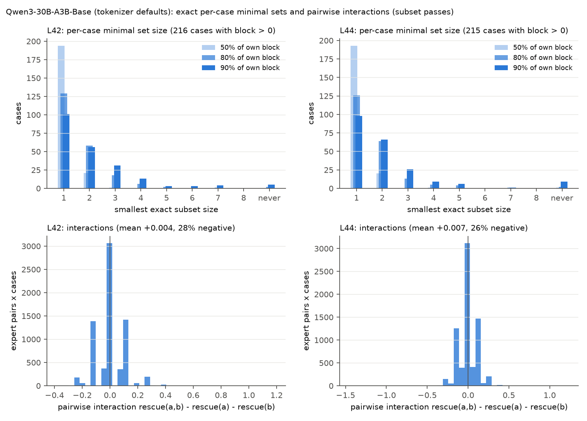
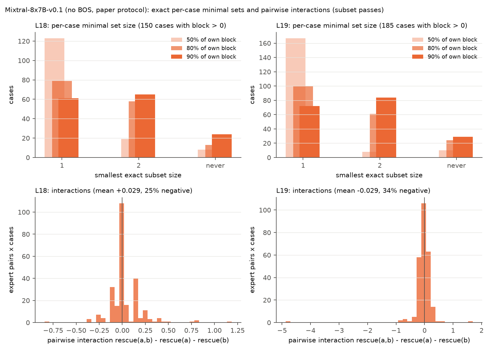

### F1.3 per-case minimal sets and interactions (exact subset patches)

**Method.** For every case and layer of the subset passes (`results/<run>_subsets/subset_rows.parquet`, ext5-engine's `coalition_set` kind), all 2^k - 1 subsets of the case's k clean-active experts are patched jointly. The per-case minimal set at target t is the smallest subset whose exact rescue reaches t x the case's own block rescue (ties broken by the higher rescue; cases with block <= 0 excluded); the additive prediction sorts the single-expert rescues and accumulates until the target. Pairwise interaction at S = {} is rescue({a,b}) - rescue({a}) - rescue({b}); negative = redundant (the two restore the same thing), positive = synergistic. The per-case non-additivity rescue(full) - sum(singles) is decomposed into the sum of all pairwise interactions and a higher-order remainder.

#### Qwen3-30B-A3B-Base (tokenizer defaults) (`results/qwen3_subsets`)

- L42: k = 8 experts per case, 256 cases, exhaustive (255 subsets each); 216 cases with block > 0. Exact full set minus block: -0.013 [-0.028, +0.002]; minus the same pass's coalition_clean row: -0.002 [-0.006, +0.002] (identity check). Smallest exact subset for 80% of the case's block: median 1.0, size 1 in 60% and <= 2 in 87% of eligible cases, never in 2; the additive prediction has the same size in 174/191 and the same set in 160/191 cases, and reaches the target when patched exactly in 172/191. Mean pairwise interaction +0.004 [+0.001, +0.006], 28% of pair-cases negative.
  - L42E115 alone: active in 210/216 eligible cases; reaches 50/80/90% of the case's block in 161/110/84 of them; is the exact minimal 80% set in 105 cases. Its mean interaction with co-active experts: +0.003 [-0.002, +0.008].
  - Non-additivity: rescue(full) - sum(singles) +0.019 [-0.031, +0.073] (mean |.| 0.323); pairwise sum +0.100 [-0.133, +0.345]; higher-order remainder -0.080 [-0.281, +0.109] (mean |.| 1.122); r(total, pairwise) = 0.85.
- L44: k = 8 experts per case, 256 cases, exhaustive (255 subsets each); 215 cases with block > 0. Exact full set minus block: -0.018 [-0.037, +0.000]; minus the same pass's coalition_clean row: +0.003 [-0.005, +0.009] (identity check). Smallest exact subset for 80% of the case's block: median 1.0, size 1 in 59% and <= 2 in 88% of eligible cases, never in 2; the additive prediction has the same size in 185/191 and the same set in 171/191 cases, and reaches the target when patched exactly in 182/192. Mean pairwise interaction +0.007 [+0.004, +0.009], 26% of pair-cases negative.
  - L44E069 alone: active in 200/215 eligible cases; reaches 50/80/90% of the case's block in 103/64/53 of them; is the exact minimal 80% set in 61 cases. Its mean interaction with co-active experts: +0.005 [+0.000, +0.011].
  - Non-additivity: rescue(full) - sum(singles) +0.023 [-0.032, +0.079] (mean |.| 0.336); pairwise sum +0.186 [-0.031, +0.407]; higher-order remainder -0.163 [-0.335, +0.005] (mean |.| 1.089); r(total, pairwise) = 0.90.

**Qwen3-30B-A3B-Base (tokenizer defaults): per-case minimal expert sets from exact subset patches (smallest subset of the case's clean-active experts whose joint patch reaches the target fraction of that case's block rescue)**

| Layer | Target (x own block) | Eligible cases (block > 0) | Smallest exact subset size: 1 / 2 / ... / k / never | Median / mean size | Size 1 / <= 2 (share of eligible) | Additive prediction: mean size | Additive = exact: size / set / n compared | Additive set reaches target when patched exactly |
|---|---|---|---|---|---|---|---|---|
| L42 | 50% | 216/256 | 194 / 21 / 1 / 0 / 0 / 0 / 0 / 0 / never 0 | 1 / 1.11 | 90% / 100% | 1.08 | 210 / 205 / 211 | 208/211 |
| L42 | 80% | 216/256 | 129 / 58 / 18 / 6 / 2 / 0 / 1 / 0 / never 2 | 1 / 1.59 | 60% / 87% | 1.45 | 174 / 160 / 191 | 172/191 |
| L42 | 90% | 216/256 | 101 / 56 / 31 / 13 / 3 / 3 / 4 / 0 / never 5 | 2 / 1.99 | 47% / 73% | 1.67 | 147 / 121 / 177 | 141/180 |
| L44 | 50% | 215/256 | 193 / 20 / 0 / 1 / 0 / 0 / 0 / 0 / never 1 | 1 / 1.11 | 90% / 99% | 1.08 | 207 / 202 / 208 | 202/209 |
| L44 | 80% | 215/256 | 126 / 64 / 13 / 5 / 4 / 0 / 1 / 0 / never 2 | 1 / 1.60 | 59% / 88% | 1.42 | 185 / 171 / 191 | 182/192 |
| L44 | 90% | 215/256 | 98 / 66 / 26 / 9 / 6 / 0 / 1 / 0 / never 9 | 2 / 1.85 | 46% / 76% | 1.62 | 167 / 149 / 184 | 158/186 |

**Qwen3-30B-A3B-Base (tokenizer defaults): singleton sufficiency of the experts of interest**

| Expert | Active among eligible | Alone reaches 50% | Alone reaches 80% | Alone reaches 90% | Is the 50% minimal set | Is the 80% minimal set | Is the 90% minimal set |
|---|---|---|---|---|---|---|---|
| L42E115 | 210/216 | 161 (77% of active) | 110 (52% of active) | 84 (40% of active) | 150 | 105 | 79 |
| L44E069 | 200/215 | 103 (52% of active) | 64 (32% of active) | 53 (26% of active) | 89 | 61 | 50 |

**Qwen3-30B-A3B-Base (tokenizer defaults): the five most redundant and five most synergistic expert pairs per layer (interaction = rescue(a,b) - rescue(a) - rescue(b), mean over cases where both are active; pairs with >= 5 co-occurrences)**

| Layer | Pair | n cases | rescue(a) | rescue(b) | rescue(a,b) | Interaction | Type |
|---|---|---|---|---|---|---|---|
| L42 | E055 + E080 | 11 | +0.062 | +0.074 | +0.062 | -0.074 | redundant |
| L42 | E024 + E123 | 11 | -0.011 | +0.045 | -0.031 | -0.065 | redundant |
| L42 | E003 + E075 | 10 | +0.050 | +0.050 | +0.050 | -0.050 | redundant |
| L42 | E023 + E093 | 13 | +0.067 | +0.024 | +0.043 | -0.048 | redundant |
| L42 | E023 + E080 | 25 | +0.025 | +0.258 | +0.237 | -0.045 | redundant |
| L42 | E032 + E059 | 10 | -0.062 | -0.013 | +0.000 | +0.075 | synergistic |
| L42 | E014 + E117 | 15 | +0.000 | -0.029 | +0.042 | +0.071 | synergistic |
| L42 | E055 + E117 | 23 | -0.027 | -0.030 | +0.014 | +0.071 | synergistic |
| L42 | E021 + E055 | 10 | -0.050 | -0.013 | +0.006 | +0.069 | synergistic |
| L42 | E059 + E115 | 35 | +0.004 | +0.405 | +0.471 | +0.062 | synergistic |
| L44 | E060 + E069 | 11 | +0.534 | +0.699 | +1.131 | -0.102 | redundant |
| L44 | E020 + E071 | 11 | +0.051 | +0.040 | +0.017 | -0.074 | redundant |
| L44 | E013 + E080 | 10 | +0.019 | +0.031 | -0.006 | -0.056 | redundant |
| L44 | E013 + E054 | 10 | +0.019 | +0.050 | +0.019 | -0.050 | redundant |
| L44 | E038 + E098 | 14 | +0.071 | +1.049 | +1.071 | -0.049 | redundant |
| L44 | E048 + E081 | 10 | -0.056 | -0.031 | -0.006 | +0.081 | synergistic |
| L44 | E037 + E121 | 16 | -0.039 | -0.031 | +0.008 | +0.078 | synergistic |
| L44 | E030 + E056 | 13 | -0.067 | +0.043 | +0.053 | +0.077 | synergistic |
| L44 | E006 + E015 | 10 | -0.077 | -0.025 | -0.025 | +0.077 | synergistic |
| L44 | E045 + E056 | 10 | -0.006 | -0.037 | +0.028 | +0.072 | synergistic |

**Qwen3-30B-A3B-Base (tokenizer defaults): decomposition of the per-case non-additivity into second-order (pairwise) and higher-order terms**

| Layer | k | rescue(full) - sum singles [95% CI] | mean |.| | Sum of pairwise interactions [95% CI] | Higher-order remainder [95% CI] | mean |remainder| | r(total, pairwise) |
|---|---|---|---|---|---|---|---|
| L42 | 8 | +0.019 [-0.031, +0.073] | 0.323 | +0.100 [-0.133, +0.345] | -0.080 [-0.281, +0.109] | 1.122 | 0.85 |
| L44 | 8 | +0.023 [-0.032, +0.079] | 0.336 | +0.186 [-0.031, +0.407] | -0.163 [-0.335, +0.005] | 1.089 | 0.90 |

Figure E5-F1.3-qwen3: top, distribution of the smallest exact subset reaching 50/80/90% of the case's own block rescue ('never' = not even the full clean set); bottom, all pairwise interactions.

#### Mixtral-8x7B-v0.1 (no BOS, paper protocol) (`results/mixtral_nobos_subsets`)

- L18: k = 2 experts per case, 256 cases, exhaustive (3 subsets each); 150 cases with block > 0. Exact full set minus block: -0.023 [-0.042, -0.005]; minus the same pass's coalition_clean row: -0.004 [-0.009, +0.000] (identity check). Smallest exact subset for 80% of the case's block: median 1.0, size 1 in 53% and <= 2 in 91% of eligible cases, never in 13; the additive prediction has the same size in 107/107 and the same set in 107/107 cases, and reaches the target when patched exactly in 107/108. Mean pairwise interaction +0.029 [+0.007, +0.052], 25% of pair-cases negative.
  - L18E001 alone: active in 107/150 eligible cases; reaches 50/80/90% of the case's block in 76/49/35 of them; is the exact minimal 80% set in 48 cases. Its mean interaction with co-active experts: +0.033 [-0.001, +0.070].
  - Non-additivity: rescue(full) - sum(singles) +0.029 [+0.007, +0.052] (mean |.| 0.103); pairwise sum +0.029 [+0.007, +0.052]; higher-order remainder +0.000 [+0.000, +0.000] (mean |.| 0.000); r(total, pairwise) = 1.00.
- L19: k = 2 experts per case, 256 cases, exhaustive (3 subsets each); 185 cases with block > 0. Exact full set minus block: -0.042 [-0.080, -0.011]; minus the same pass's coalition_clean row: +0.001 [-0.001, +0.003] (identity check). Smallest exact subset for 80% of the case's block: median 1.0, size 1 in 54% and <= 2 in 87% of eligible cases, never in 24; the additive prediction has the same size in 149/149 and the same set in 149/149 cases, and reaches the target when patched exactly in 149/153. Mean pairwise interaction -0.029 [-0.078, +0.009], 34% of pair-cases negative.
  - L19E006 alone: active in 114/185 eligible cases; reaches 50/80/90% of the case's block in 64/35/27 of them; is the exact minimal 80% set in 32 cases. Its mean interaction with co-active experts: -0.005 [-0.037, +0.030].
  - L19E002 alone: active in 103/185 eligible cases; reaches 50/80/90% of the case's block in 71/44/34 of them; is the exact minimal 80% set in 43 cases. Its mean interaction with co-active experts: -0.061 [-0.153, +0.002].
  - Non-additivity: rescue(full) - sum(singles) -0.029 [-0.078, +0.009] (mean |.| 0.134); pairwise sum -0.029 [-0.078, +0.009]; higher-order remainder +0.000 [+0.000, +0.000] (mean |.| 0.000); r(total, pairwise) = 1.00.

**Mixtral-8x7B-v0.1 (no BOS, paper protocol): per-case minimal expert sets from exact subset patches (smallest subset of the case's clean-active experts whose joint patch reaches the target fraction of that case's block rescue)**

| Layer | Target (x own block) | Eligible cases (block > 0) | Smallest exact subset size: 1 / 2 / ... / k / never | Median / mean size | Size 1 / <= 2 (share of eligible) | Additive prediction: mean size | Additive = exact: size / set / n compared | Additive set reaches target when patched exactly |
|---|---|---|---|---|---|---|---|---|
| L18 | 50% | 150/256 | 123 / 19 / never 8 | 1 / 1.13 | 82% / 95% | 1.05 | 129 / 129 / 129 | 129/129 |
| L18 | 80% | 150/256 | 79 / 58 / never 13 | 1 / 1.42 | 53% / 91% | 1.27 | 107 / 107 / 107 | 107/108 |
| L18 | 90% | 150/256 | 61 / 65 / never 24 | 2 / 1.52 | 41% / 84% | 1.36 | 89 / 89 / 89 | 89/96 |
| L19 | 50% | 185/256 | 167 / 8 / never 10 | 1 / 1.05 | 90% / 95% | 1.02 | 170 / 170 / 170 | 170/170 |
| L19 | 80% | 185/256 | 100 / 61 / never 24 | 1 / 1.38 | 54% / 87% | 1.35 | 149 / 149 / 149 | 149/153 |
| L19 | 90% | 185/256 | 72 / 84 / never 29 | 2 / 1.54 | 39% / 84% | 1.46 | 128 / 128 / 128 | 128/133 |

**Mixtral-8x7B-v0.1 (no BOS, paper protocol): singleton sufficiency of the experts of interest**

| Expert | Active among eligible | Alone reaches 50% | Alone reaches 80% | Alone reaches 90% | Is the 50% minimal set | Is the 80% minimal set | Is the 90% minimal set |
|---|---|---|---|---|---|---|---|
| L18E001 | 107/150 | 76 (71% of active) | 49 (46% of active) | 35 (33% of active) | 73 | 48 | 34 |
| L19E006 | 114/185 | 64 (56% of active) | 35 (31% of active) | 27 (24% of active) | 55 | 32 | 24 |
| L19E002 | 103/185 | 71 (69% of active) | 44 (43% of active) | 34 (33% of active) | 66 | 43 | 33 |

**Mixtral-8x7B-v0.1 (no BOS, paper protocol): the five most redundant and five most synergistic expert pairs per layer (interaction = rescue(a,b) - rescue(a) - rescue(b), mean over cases where both are active; pairs with >= 5 co-occurrences)**

| Layer | Pair | n cases | rescue(a) | rescue(b) | rescue(a,b) | Interaction | Type |
|---|---|---|---|---|---|---|---|
| L18 | E003 + E007 | 12 | -0.104 | +0.005 | -0.094 | +0.005 | synergistic |
| L18 | E005 + E006 | 12 | +0.125 | +0.078 | +0.224 | +0.021 | synergistic |
| L18 | E001 + E006 | 81 | +0.363 | +0.093 | +0.481 | +0.025 | synergistic |
| L18 | E002 + E006 | 63 | -0.012 | +0.001 | +0.014 | +0.025 | synergistic |
| L18 | E001 + E003 | 34 | +0.053 | +0.098 | +0.194 | +0.043 | synergistic |
| L18 | E001 + E005 | 36 | +0.158 | +0.065 | +0.268 | +0.045 | synergistic |
| L19 | E002 + E004 | 20 | +0.474 | +0.296 | +0.512 | -0.259 | redundant |
| L19 | E002 + E005 | 12 | +0.484 | +0.141 | +0.583 | -0.042 | redundant |
| L19 | E002 + E006 | 62 | +0.453 | +0.217 | +0.636 | -0.034 | redundant |
| L19 | E003 + E006 | 10 | -0.016 | -0.438 | -0.465 | -0.011 | redundant |
| L19 | E004 + E006 | 48 | +0.160 | +0.207 | +0.373 | +0.006 | synergistic |
| L19 | E002 + E007 | 14 | +0.339 | +0.594 | +0.942 | +0.009 | synergistic |
| L19 | E006 + E007 | 39 | -0.101 | -0.026 | -0.108 | +0.019 | synergistic |

**Mixtral-8x7B-v0.1 (no BOS, paper protocol): decomposition of the per-case non-additivity into second-order (pairwise) and higher-order terms**

| Layer | k | rescue(full) - sum singles [95% CI] | mean |.| | Sum of pairwise interactions [95% CI] | Higher-order remainder [95% CI] | mean |remainder| | r(total, pairwise) |
|---|---|---|---|---|---|---|---|
| L18 | 2 | +0.029 [+0.007, +0.052] | 0.103 | +0.029 [+0.007, +0.052] | +0.000 [+0.000, +0.000] | 0.000 | 1.00 |
| L19 | 2 | -0.029 [-0.078, +0.009] | 0.134 | -0.029 [-0.078, +0.009] | +0.000 [+0.000, +0.000] | 0.000 | 1.00 |

Figure E5-F1.3-mixtral_nobos: top, distribution of the smallest exact subset reaching 50/80/90% of the case's own block rescue ('never' = not even the full clean set); bottom, all pairwise interactions.

**Reading (F1.3).** The subset passes are exhaustive (Qwen3: 255 subsets x 256 cases at L44 and at L42, 130,560 rows; Mixtral no-BOS: 3 subsets at L18 and L19) and self-consistent: the patch of the full clean set equals the same pass's `coalition_clean` row to 0.004 and recovers 94-98% of the block (the rest is what noised-only experts contribute). *Per-case minimal sets are small.* For 80% of the case's own block rescue one expert suffices in 59-60% of the eligible Qwen3 cases (block > 0) and at most two in 87-88%; the median is 1 at 80% and 2 at 90%; only 2 cases (80%) and 5-9 (90%) are not reached even by all eight experts. Mixtral: one of the two active experts reaches 80% in 53-54% of cases, and in 13/150 (L18) and 24/185 (L19) cases the full pair does not. *Which single expert?* At L42 the size-1 minimal set is E115 in 105 of 129 cases (81%) and {E115} alone reaches 80% in 110/210 = 52% of the cases where it is active; at L44 the size-1 set is E069 in only 61 of 126 (48%) and {E069} alone reaches 80% in 64/200 = 32% (50% of its cases at the 50% target). Mixtral no-BOS: {L18E001} 49/107 = 46%, {L19E002} 44/103 = 43%, {L19E006} 35/114 = 31%. So the population-level statement 'one expert carries half the block' translates per case into 'one expert carries most of it in a third to a half of the prompts, and which expert varies'; E115 is the more often sufficient of the two Qwen3 loci, as its higher recurrence and block share suggested. *Additive prediction vs exact.* The additive prediction (accumulate the sorted single rescues) matches the exact minimal size in 97% (L44) and 91% (L42) of cases at 80% and picks the identical set in 90% / 84%; its set reaches the target when patched exactly in 95% / 90% (Mixtral: 100% and 97%). *Interactions are small and cancel.* Over the 7,168 pair-cases per Qwen3 layer the mean pairwise interaction is +0.004 [+0.001, +0.006] (L42) and +0.007 [+0.004, +0.009] (L44), 26-28% negative; E069 and E115 interact with their co-active experts by +0.005 [+0.000, +0.011] and +0.003 [-0.002, +0.008] on average, i.e. additively. Individual pairs deviate: the only strong-strong pair, L44 E060 + E069, is redundant (-0.10 over 11 cases: +0.53 and +0.70 alone, +1.13 together), E059 + E115 is synergistic (+0.06 over 35 cases). The per-case non-additivity rescue(full) - sum(singles) is +0.02 on average but +/-0.33 per case; the sum of the 28 pairwise terms tracks it (r 0.85-0.90) but overshoots (+0.10 / +0.19) and is cancelled by the higher-order remainder (-0.08 / -0.16), each pairwise term carrying bf16 noise of the size of the effect, so the decomposition beyond 'small, mostly cancelling' is not resolvable at this precision. Mixtral shows the two regimes cleanly: L18 E001 + E006 are synergistic (+0.029 [+0.007, +0.052]; +0.36 and +0.09 alone, +0.48 together) and L19 E002 + E006 redundant (-0.034 over 62 cases; +0.45 and +0.22 alone, +0.64 together; E002 + E004 -0.26). *Bottom line for F1.* The additive approximation used in F1.2 is validated per case as well: exact per-case minimal sets are as small as the singles predict, the strong experts add up with their partners, and the one systematic non-additivity is redundancy between two strong experts of the same layer (E060/E069, E002/E006, E002/E004).
